# Δ-Nets

A λ-term is rewritten by substituting an argument for a parameter. That replacement may discard the argument. It may also copy the argument. Δ-Nets records both cases as a graph of small agents. Discarded work is never begun. Shared work is done once.

## How to read this

The construction is a **graph-rewriting system**. A graph here is a finite collection of nodes joined by wires. A **rewrite** looks for a small piece of that graph and replaces the piece by another small piece, reconnecting the wires that left the old piece.

The program is first drawn as such a graph. Computation is then a sequence of local replacements. Two replacements that do not share a node may be performed together.

The aim is twofold. Do not spend steps on an argument that the function never uses. Do not repeat a necessary step merely because the same argument is used in two places.

The pages that follow prepare the language of terms, walk both costs by hand, classify terms by how often a bound variable occurs, and then introduce the agents that make sharing visible. They do not prove confluence. They do not prove optimality.

## Terms

A **λ-term** is generated by the grammar

\[
t ::= x \mid \lambda x.t \mid t\,u.
\]

The symbol \(t\) on the left is a term. The three forms on the right are the only forms.

A **variable** is a term of the form \(x\).

The term \(x\) is a variable.

An **abstraction** is a term of the form \(\lambda x.t\). The variable \(x\) is the **parameter**. The term \(t\) is the **body**.

The term \(\lambda x.x\) is an abstraction. Its parameter is \(x\). Its body is \(x\).

An **application** is a term of the form \(t\,u\). The term \(t\) is the **function**. The term \(u\) is the **argument**.

The term \(x\,y\) is an application. Its function is \(x\). Its argument is \(y\).

Application associates to the left.

\[
t\,u\,v
\]

means

\[
(t\,u)\,v.
\]

The term \(x\,y\,z\) means \((x\,y)\,z\).

Abstraction extends as far to the right as parentheses allow.

\[
\lambda x.t\,u
\]

means

\[
\lambda x.(t\,u).
\]

The term \(\lambda x.x\,y\) is the abstraction whose body is the application \(x\,y\).

A **name** is the symbol used to write a variable.

In the term \(x\,x\), the name is \(x\).

An **occurrence** is a particular place where a name appears in a term.

The term

\[
x\,x
\]

contains two occurrences of the name \(x\).

The **scope** of an abstraction \(\lambda x.t\) is the body \(t\).

In \(\lambda x.x\), the scope of the displayed abstraction is the body \(x\).

An occurrence of \(x\) is **bound** when it lies in the scope of a surrounding abstraction \(\lambda x\) that owns it.

In

\[
\lambda x.(x\,y),
\]

the occurrence of \(x\) in the body is bound by the displayed abstraction.

An occurrence is **free** when no surrounding abstraction owns it.

In

\[
\lambda x.(x\,y),
\]

the occurrence of \(y\) is free.

**α-conversion** is the renaming of a bound variable at its binder and at every occurrence that the binder owns.

The abstraction \(\lambda x.x\) α-converts to \(\lambda w.w\).

A **β-redex** is a term of the form

\[
(\lambda x.t)\,u.
\]

The term \((\lambda x.x)\,y\) is a β-redex.

**β-reduction** is the rule

\[
(\lambda x.t)\,u \;\longrightarrow_\beta\; t[x:=u].
\]

From \((\lambda x.x)\,y\) one β-step yields \(x[x:=y]\).

**Capture-avoiding substitution** \(t[x:=u]\) replaces those occurrences of \(x\) in \(t\) that are owned by the displayed binder of the redex, and it does not change which binders own which variables.

The computation \(x[x:=y]\) yields \(y\).

**Variable capture** occurs when substitution would place a free variable of \(u\) under a binder that uses the same name, so that the free variable would become bound.

Consider the substitution

\[
(\lambda y.x)[x:=y].
\]

The body is \(\lambda y.x\). The occurrence of \(x\) in that body is free in \(\lambda y.x\). Replacing that occurrence by \(y\) without renaming produces

\[
\lambda y.y.
\]

The inserted \(y\) is then owned by \(\lambda y\). That ownership was not present in the argument \(y\).

α-conversion is used first:

\[
(\lambda y.x)[x:=y]
\equiv_\alpha
(\lambda z.x)[x:=y]
=
\lambda z.y.
\]

The inserted \(y\) remains free.

A term is in **normal form** when it contains no β-redex.

The term \(\lambda x.x\) contains no application of an abstraction to an argument. It is in normal form.

The term \((\lambda x.x)\,y\) contains a β-redex. It is not in normal form.

A term is **normalizing** when some sequence of β-reductions reaches a normal form.

The term \((\lambda x.y)\,z\) reduces in one step to \(y\), and \(y\) is in normal form. The term is normalizing.

## When the argument is unused

Consider the term

\[
(\lambda x.y)\;((\lambda z.z)\,w).
\]

Call this term \(t_0\).

The function of \(t_0\) is \(\lambda x.y\).

The argument of \(t_0\) is \((\lambda z.z)\,w\).

The body of \(\lambda x.y\) is \(y\).

The name \(x\) does not occur in \(y\).

The argument \((\lambda z.z)\,w\) is itself a β-redex.

Call that inner redex \(t_{\mathrm{in}}\).

Reduce \(t_{\mathrm{in}}\) first.

The function of \(t_{\mathrm{in}}\) is \(\lambda z.z\).

The argument of \(t_{\mathrm{in}}\) is \(w\).

The body of \(\lambda z.z\) is \(z\).

β-reduction gives

\[
(\lambda z.z)\,w \;\longrightarrow_\beta\; z[z:=w].
\]

The substitution is

\[
z[z:=w] \;=\; w.
\]

So

\[
(\lambda z.z)\,w \;\longrightarrow_\beta\; w.
\]

The outer term is now

\[
(\lambda x.y)\,w.
\]

Call this term \(t_2\).

Reduce \(t_2\).

\[
(\lambda x.y)\,w \;\longrightarrow_\beta\; y[x:=w].
\]

The name \(x\) does not occur in \(y\).

Hence

\[
y[x:=w] \;=\; y.
\]

So

\[
(\lambda x.y)\,w \;\longrightarrow_\beta\; y.
\]

The two-step sequence is

\[
(\lambda x.y)\;((\lambda z.z)\,w)
\;\longrightarrow_\beta\;
(\lambda x.y)\,w
\;\longrightarrow_\beta\;
y.
\]

The final term is \(y\).

The final term does not contain \(w\).

The first step produced \(w\) from \((\lambda z.z)\,w\).

That first step does not appear in the final term.

The work spent on \(t_{\mathrm{in}}\) was not needed for the result \(y\).

Start again from \(t_0\).

Reduce the outer redex first.

The outer redex is \(\lambda x.y\) applied to \((\lambda z.z)\,w\).

\[
(\lambda x.y)\;((\lambda z.z)\,w)
\;\longrightarrow_\beta\;
y[x:=(\lambda z.z)\,w].
\]

The name \(x\) does not occur in \(y\).

Hence

\[
y[x:=(\lambda z.z)\,w] \;=\; y.
\]

So

\[
(\lambda x.y)\;((\lambda z.z)\,w)
\;\longrightarrow_\beta\;
y.
\]

The inner redex is never reduced.

Both sequences end at \(y\).

The second sequence contains one β-step.

The first sequence contains two β-steps.

The extra step was the reduction of an argument that the body \(y\) never used.

If the parameter \(x\) does not occur in the body \(t\), the β-step is

\[
(\lambda x.t)\,u \;\longrightarrow_\beta\; t.
\]

The argument \(u\) disappears.

Any β-step performed inside \(u\) before this step disappears with \(u\).

A redex is **outermost** when it is not contained in another redex.

In \(t_0\), the redex \((\lambda x.y)\;((\lambda z.z)\,w)\) contains the redex \((\lambda z.z)\,w\). The outer application is outermost. The inner application is not outermost.

A redex is **leftmost** among a collection of redexes when it begins furthest to the left in the written term.

In \(t_0\) there is only one outermost redex. That redex is leftmost among outermost redexes.

The **leftmost-outermost** strategy reduces the leftmost outermost redex at every step.

On \(t_0\) it reduces the outer application first and obtains \(y\) in one step.

## When the argument is used more than once

Consider the term

\[
(\lambda x.\,x\,x)\,u.
\]

The body \(x\,x\) contains two occurrences of \(x\).

β-reduction substitutes \(u\) for each of those occurrences:

\[
(\lambda x.\,x\,x)\,u \;\longrightarrow_\beta\; u\,u.
\]

Let \(u\) itself be a redex.

Set

\[
u \;=\; (\lambda z.z)\,w.
\]

The full term is then

\[
(\lambda x.\,x\,x)\bigl((\lambda z.z)\,w\bigr).
\]

Call this term \(s_0\).

Reduce the outer redex of \(s_0\).

The body is \(x\,x\).

Substitution replaces both occurrences:

\[
(x\,x)\bigl[x:=(\lambda z.z)\,w\bigr]
\;=\;
\bigl((\lambda z.z)\,w\bigr)\,
\bigl((\lambda z.z)\,w\bigr).
\]

So

\[
(\lambda x.\,x\,x)\bigl((\lambda z.z)\,w\bigr)
\;\longrightarrow_\beta\;
\bigl((\lambda z.z)\,w\bigr)
\bigl((\lambda z.z)\,w\bigr).
\]

Call the result \(s_1\).

The redex \((\lambda z.z)\,w\) now occurs twice in \(s_1\).

Reduce the left copy:

\[
\bigl((\lambda z.z)\,w\bigr)
\bigl((\lambda z.z)\,w\bigr)
\;\longrightarrow_\beta\;
w\,
\bigl((\lambda z.z)\,w\bigr).
\]

The left step used

\[
(\lambda z.z)\,w \;\longrightarrow_\beta\; z[z:=w] \;=\; w.
\]

Reduce the remaining copy:

\[
w\,\bigl((\lambda z.z)\,w\bigr)
\;\longrightarrow_\beta\;
w\,w.
\]

The right step used again

\[
(\lambda z.z)\,w \;\longrightarrow_\beta\; z[z:=w] \;=\; w.
\]

The inner replacement of \(z\) by \(w\) was performed twice.

The same inner redex, reduced on the right copy first, yields

\[
\bigl((\lambda z.z)\,w\bigr)
\bigl((\lambda z.z)\,w\bigr)
\;\longrightarrow_\beta\;
\bigl((\lambda z.z)\,w\bigr)\,w
\;\longrightarrow_\beta\;
w\,w.
\]

The inner replacement of \(z\) by \(w\) is again performed twice.

After the outer β-step, the two copies are separate terms. Each copy is reduced on its own.

If the parameter \(x\) occurs twice in the body \(t\), naïve substitution copies the argument once for each occurrence.

The two uses, written as two copies of the argument, are the following graph.


A graph may instead join two uses to one argument.


The desired operational behavior is then as follows. The multiple uses are recorded as sharing. The shared computation is reduced once. Every consumer observes the resulting graph.

## Four ways a bound variable may appear

A **bound-variable rule** is a restriction on how often a bound variable may occur in the body that owns it.

The **linear rule** says that every bound variable occurs exactly once.

The term \(\lambda x.x\) obeys the linear rule. The bound \(x\) occurs once in the body.

**λL** is the fragment of the λ-calculus consisting of those terms that obey the linear rule.

The term \(\lambda x.x\) belongs to λL.

The **affine rule** says that every bound variable occurs at most once.

The term \(\lambda x.y\) obeys the affine rule. The bound \(x\) occurs zero times in the body.

The term \(\lambda x.x\) also obeys the affine rule. The bound \(x\) occurs once.

**λA** is the fragment consisting of those terms that obey the affine rule.

The term \(\lambda x.y\) belongs to λA.

The **relevant rule** says that every bound variable occurs at least once.

The term \(\lambda x.x\,x\) obeys the relevant rule. The bound \(x\) occurs twice in the body.

The term \(\lambda x.x\) also obeys the relevant rule. The bound \(x\) occurs once.

**λI** is the fragment consisting of those terms that obey the relevant rule.

The term \(\lambda x.x\,x\) belongs to λI.

The **unrestricted rule** says that a bound variable may occur any number of times.

The term \(\lambda x.y\) obeys the unrestricted rule. The bound \(x\) occurs zero times.

The term \(\lambda x.x\,x\) obeys the unrestricted rule. The bound \(x\) occurs twice.

**λK** is the fragment consisting of those terms that obey the unrestricted rule. It is the full untyped λ-calculus of the grammar above.

The term \((\lambda x.y)\;((\lambda z.z)\,w)\) belongs to λK.

**ΔL** is the Δ-Net system that implements λL.

**ΔA** is the Δ-Net system that implements λA.

**ΔI** is the Δ-Net system that implements λI.

**ΔK** is the Δ-Net system that implements λK.

The name ΔL is the graph counterpart of λL.

| Bound-variable rule | How often the bound variable may occur | λ-fragment | Δ-Net |
|---|---|---|---|
| linear | exactly once | λL | ΔL |
| affine | at most once | λA | ΔA |
| relevant | at least once | λI | ΔI |
| unrestricted | any number of times | λK | ΔK |

The table collects the four rules, the four λ-fragments, and the four Δ-Net names.

## Why choosing the next redex is not enough

A **reduction order** is a rule that chooses which redex to reduce next.

Leftmost-outermost is a reduction order.

On

\[
(\lambda x.y)\;((\lambda z.z)\,w)
\]

leftmost-outermost reduces the outer application first.

The unused argument is not reduced.

The result \(y\) is obtained in one step.

Return to

\[
(\lambda x.\,x\,x)\bigl((\lambda z.z)\,w\bigr).
\]

The leftmost-outermost choice is the outer redex.

That choice produces

\[
\bigl((\lambda z.z)\,w\bigr)
\bigl((\lambda z.z)\,w\bigr).
\]

The inner redex is now two independent terms.

A later choice may reduce the left copy first or the right copy first.

Neither choice can identify the two copies as one computation.

The replacement of \(z\) by \(w\) is performed twice.

If instead the inner redex of the original term is reduced first, the sequence is

\[
(\lambda x.\,x\,x)\bigl((\lambda z.z)\,w\bigr)
\;\longrightarrow_\beta\;
(\lambda x.\,x\,x)\,w
\;\longrightarrow_\beta\;
w\,w.
\]

The inner replacement of \(z\) by \(w\) occurs once.

On this particular term, the order of β-redexes changes the number of inner steps.

Once a β-step has performed textual substitution, the copies are separate syntax.

A later order cannot recover the fact that the copies came from one argument, unless the representation still records that fact.

There are terms for which no ordinary sequential order of β-reductions avoids every duplicated reduction.

A syntax tree gives each occurrence its own branch.

A graph can let two uses point to one connected subgraph.

The design target is to put sharing in the graph.

The shared subgraph is reduced once.

Every use observes the resulting graph.

## Syntax trees hide sharing

A syntax tree assigns each occurrence of a subterm to its own branch.

Example. In the tree for \(w\,w\), the left leaf is one occurrence of \(w\). The right leaf is a second occurrence of \(w\).

A rewrite that acts on one leaf acts on one occurrence.

The other occurrence is a different leaf.

That second leaf is not rewritten by the same step.

Hence a tree copies.

Each later use of a substituted term is a separate subtree.

A graph can share.

Sharing means that two wires point to one common subgraph.

Example. Draw one node for \(w\). Draw two wires that both enter that node.

A rewrite of the shared node is performed once.

Both wires then lead to the rewritten node.

The remainder of this chapter makes that sharing precise.

An **agent** is a node equipped with a finite collection of ports.

Example. A triangular node with three ports is one agent.

A **port** is a distinguished attachment site on an agent.

A **wire** joins two ports.

Example. If an agent has three ports, at most three wires can be attached to it, one at each port.

A **net** is a finite collection of agents and wires.

Example. Two agents joined by one wire form a net.

Every agent has exactly one **principal port**.

Example. A triangular agent has one distinguished port marked as principal.

The remaining ports of an agent are its **auxiliary ports**.

Example. The same triangular agent then has two auxiliary ports.

An **active pair** is a pair of agents whose principal ports are joined by a wire.

Example. If two triangular agents have their principal ports joined by one wire, those two agents form an active pair.

An **interaction step** is one application of one interaction rule to one active pair.

The step has as input:

1. the two agents in the active pair;
2. their ports;
3. the wires immediately incident to those ports;
4. the labels or metadata needed by the two agents.

The step does not have as input the whole net.

Example. If a net contains ten agents and exactly one active pair, the interaction step rewrites only that pair and the wires incident to its ports.

This locality is part of the mathematical form of interaction nets.

It is what allows parallel local rewriting to be controlled.

### Perfect confluence

Suppose a net \(N\) has two possible one-step interactions:

\[
N \longrightarrow N_1,
\qquad
N \longrightarrow N_2.
\]

The interaction-net core is said here to have the **one-step diamond property** when there exists a net \(M\) such that:

\[
N_1 \longrightarrow M,
\qquad
N_2 \longrightarrow M.
\]

Every arrow in this diagram is exactly one local interaction.


Walk the diagram.

The top vertex is the net \(N\).

The left descending arrow is one interaction.

That arrow produces \(N_1\).

The right descending arrow is a different interaction.

That arrow produces \(N_2\).

The arrow leaving \(N_1\) is one further interaction.

That arrow produces \(M\).

The arrow leaving \(N_2\) is one further interaction.

That arrow produces the same \(M\).

The property is called **perfect confluence**.

It says that two competing one-step choices can be reconciled immediately.

If one active pair is reduced first, and another independent active pair is reduced second, the result is the same as reducing them in the opposite order.

In symbols, the local commutation principle is

\[
\text{left then right}
=
\text{right then left}.
\]

The proof idea is simple.

Distinct active pairs share no agent.

Each rule rewrites only its own active pair.

Each rule reconnects only the wires incident to that pair.

Hence reducing one pair cannot consume an agent needed by the other pair.

The second rule remains applicable after the first.

The two rewrites act on disjoint local neighborhoods.

Therefore the final wiring is the same.

There are two qualifications.

First, perfect confluence is a property of the local interaction core.

It does not by itself describe global cleanup procedures that inspect reachability or restore canonical form.

Second, perfect confluence is not termination.

A system may have commuting local choices and still admit infinite reduction sequences.

Agreement between choices does not imply that all choices end.

Thus the relevant assertion has a conditional form.

When normalization occurs in the interaction core, normalizing orders agree on the result.

In the stated \(\Delta\)-Net core setting, they also agree on the number of core interactions.

## Three agents

A \(\Delta\)-Net core uses three kinds of agents.

The first kind is the fan.

The second kind is the eraser.

The third kind is the replicator.

The diagrams conventionally distinguish them as follows.

A **fan** is drawn as a triangle.

An **eraser** is drawn with only its principal port.

A **replicator** is a variable-arity node, often drawn as a trapezoid.

Rectangles in explanatory diagrams are endpoints or subnet labels.

Rectangles are not agents.

A port has an identity independent of where it is drawn.

Example. A diagram may rotate a node. After rotation, a port may appear on the left rather than on the right. The port is still the same indexed port.

### Fan

A **fan** \(F\) has exactly two auxiliary ports.

The two auxiliary ports are ordered.

Call them auxiliary port \(1\) and auxiliary port \(2\).

Example. Auxiliary port \(1\) remains auxiliary port \(1\) even if a drawing places it on the right.


A fan is used for \(\lambda\)-term structure.

In a rooted net, orientation determines whether a fan represents an application or an abstraction.

An **application fan** has the following ports.

The principal port is the function connection.

The first auxiliary port is the result or parent connection.

The second auxiliary port is the argument connection.

Example. In the net for \(f\,a\), the application fan has its principal port wired toward \(f\). Its second auxiliary port is wired toward \(a\).

An **abstraction fan** has the following ports.

The principal port is its parent connection.

The first auxiliary port is its body.

The second auxiliary port is its bound-variable connection.

Example. In the net for \(\lambda x.\,x\), the abstraction fan has its first auxiliary port wired into the body. Its second auxiliary port is wired to the unique occurrence of \(x\).

The same triangular agent can represent either syntactic constructor.

The direction of its wires relative to the root determines which constructor it represents.

For a \(\beta\)-redex, an application fan and an abstraction fan meet at their principal ports.

Those two fans then form an active pair.

Their interaction is fan annihilation.

That interaction is the graph form of \(\beta\)-reduction.

### Eraser

An **eraser** \(E\) has no auxiliary ports.

It represents explicit non-use.

Example. In \(\lambda\)-syntax, a binder may ignore its argument:

\[
\lambda x.\,y.
\]

When this abstraction is applied, the supplied argument is discarded.

In a \(\Delta\)-Net subsystem that supports erasure, the non-use of \(x\) is represented by placing an eraser at the bound-variable connection of the abstraction.

Since an eraser has no auxiliary ports, it cannot carry continuation through an agent it meets.

If \(E\) meets a distinct agent, the encountered agent is deleted.

Erasers then continue through its auxiliary branches.

For a two-port fan, two erasers continue.

For an \(n\)-port replicator, \(n\) erasers continue.

In general,

\[
E \text{ meets an } n\text{-port agent}
\quad\Longrightarrow\quad
n \text{ erasers continue on its auxiliary branches.}
\]

This makes erasure local.

The net does not need to search globally for every part of an unused argument.

The erasure signal propagates through the graph by local interactions.

### Replicator

A **replicator** \(R\) has one principal port and any natural number of auxiliary ports.

Its **arity** is the number of auxiliary ports.

Example. A replicator of arity \(4\) has four auxiliary ports.


The principal connection receives a shared value.

The auxiliary connections lead to the uses of that value.

A replicator carries an integer **level** \(\ell_R\).

Example. A replicator with \(\ell_R = 2\) is a replicator at level \(2\).

A replicator also carries one integer **delta** \(d_i\) for each auxiliary port \(i\).

Example. If a replicator has three auxiliary ports, it carries three deltas \(d_1\), \(d_2\), and \(d_3\).

The level names a sharing context.

A delta is a relative level adjustment attached to one specific exit:

\[
\text{new level of a replica}
=
\text{old level}
+
\text{delta of the exit port}.
\]

Example. If the old level is \(4\) and the chosen exit has delta \(+2\), the replica level is

\[
4 + 2 = 6.
\]

The arity already determines how many explicit consumer connections the replicator has.

Example. If the arity is \(4\), there are four auxiliary exits.

The deltas say how the sharing context changes at each exit.

A one-port replicator with delta \(0\) is equivalent to a wire.

Example. That agent has one auxiliary port, so it does not branch. Its delta is \(0\), so it does not change level.

Canonical construction omits it.

### The four \(\lambda\)-fragments

The agent vocabulary corresponds to four disciplines for bound-variable use.

A **linear** binder uses its variable exactly once.

The corresponding fragment is \(\lambda L\).

The corresponding \(\Delta\)-Net subsystem is \(\Delta L\).

\(\Delta L\) permits only the fan.

Example. The term \(\lambda x.\,x\) is linear. Its \(\Delta L\) encoding uses fans only.

An **affine** binder uses its variable zero times or one time.

The corresponding fragment is \(\lambda A\).

The corresponding \(\Delta\)-Net subsystem is \(\Delta A\).

\(\Delta A\) permits the fan and the eraser.

Example. The term \(\lambda x.\,y\) is affine. Its encoding uses an eraser at the unused bound-variable connection.

A **relevant** binder uses its variable at least once.

The corresponding fragment is \(\lambda I\).

The corresponding \(\Delta\)-Net subsystem is \(\Delta I\).

\(\Delta I\) permits the fan and the replicator.

Example. The term \(\lambda x.\,x\,x\) is relevant. Its encoding uses a replicator to join the two uses of \(x\).

A **full** binder uses its variable any number of times.

The corresponding fragment is \(\lambda K\).

The corresponding \(\Delta\)-Net subsystem is \(\Delta K\).

\(\Delta K\) permits the fan, the eraser, and the replicator.

Example. The term \(\lambda x.\,(\lambda z.\,y)\,(x\,x)\) may both share \(x\) and discard \(z\). Its encoding may use all three agents.

A fan represents \(\lambda\)-term structure.

An eraser represents omission.

A replicator represents sharing.

### Equality of replicators

Two replicators are **equal** when the following three data match.

The first datum is the level.

The second datum is the arity.

The third datum is every port delta.

Example. Two replicators both at level \(3\), both of arity \(2\), and both with deltas \(0\) and \(+1\), are equal.

Example. Two replicators at level \(3\), one of arity \(2\) and one of arity \(3\), are not equal.

If a net is obtained by the well-formed translation from a \(\lambda\)-term, and if two active replicators have the same level, then they have the same arity and the same port deltas.

In that case, equality of levels implies equality of replicators.

For an arbitrary net, one must still check arity and every port delta.

## Three families of interaction

An interaction rule applies when two principal ports meet.

In \(\Delta\)-Nets, such interactions fall into three families.

The first family is annihilation.

The second family is erasure.

The third family is commutation.

These names describe what happens to the active pair.

### Annihilation

Equal agents annihilate.

Both agents disappear.

Corresponding auxiliary ports reconnect.

For fans, this is \(\beta\)-reduction in graph form.

The application fan and the abstraction fan meet at their principal ports.


Annihilation reconnects

\[
\text{application result} \leftrightarrow \text{abstraction body},
\]

\[
\text{application argument} \leftrightarrow \text{abstraction variable interface}.
\]


The reconnection is substitution in graph form.

No textual copy of the argument is formed.

The correspondence of ports is by identity.

Suppose a fan is drawn upside down.

Its first auxiliary port may appear on the right rather than on the left.

It is still the first auxiliary port.

Therefore wires may cross in a drawing while still preserving the correct port-index matching.

#### Example: one linear \(\beta\)-step

Consider

\[
(\lambda x.\,x)(\lambda y.\,y)
\;\longrightarrow_\beta\;
\lambda y.\,y.
\]

The displayed term is linear.

The variable \(x\) occurs exactly once in the body of \(\lambda x.\,x\).

The variable \(y\) occurs exactly once in the body of \(\lambda y.\,y\).

Its \(\Delta L\) encoding therefore needs fans only.

The outer application is represented by an application fan.

Its function connection leads to the abstraction fan for \(\lambda x.\,x\).

These two fans meet at their principal ports.

They form an active pair.

The abstraction \(\lambda x.\,x\) has its body port and variable port connected directly, because \(x\) has exactly one occurrence.

When the application fan and abstraction fan annihilate, the application result is connected to the abstraction body.

The application argument is connected to the variable interface.

Since the body and variable interface of \(\lambda x.\,x\) are already identified, the root becomes connected directly to the argument net.

That argument net is the encoding of \(\lambda y.\,y\).

Thus one \(\beta\)-step corresponds to one fan annihilation.

Let a \(\lambda L\) term normalize in \(n\) \(\beta\)-steps.

Then its \(\Delta L\) encoding normalizes in \(n\) interactions.

The number \(n\) does not depend on the interaction order.

Equal replicators also annihilate.

If equal replicators meet, the interaction removes both replicators.

Equal-indexed auxiliary ports reconnect.

No replicas are created.



If a net is obtained by the well-formed translation from a \(\lambda\)-term, and if two active replicators have the same level, then they are equal in the sense defined above.

In that case, comparing levels is sufficient to decide annihilation.

For an arbitrary net, equal levels alone do not prove equality.

### Erasure

An erasure interaction occurs when an eraser meets a distinct agent.

Because \(E\) has no auxiliary ports, the other agent has no continuation through the eraser’s side.

The interaction deletes the encountered structure.

It propagates erasers through the auxiliary outputs of that structure.


For a fan with two auxiliary ports, the fan disappears.

Each branch that was attached to an auxiliary port receives an eraser.


This rule is the graph counterpart of an unused argument being discarded.

It is local.

The eraser does not need to inspect an entire argument before deletion begins.

It pushes the deletion request through the structure it meets.

If an eraser meets an \(n\)-port replicator, the result has \(n\) erasers, one at each auxiliary branch.

This follows the same principle:

\[
E \text{ meets an } n\text{-port agent}
\quad\Longrightarrow\quad
n \text{ erasers continue on its auxiliary branches.}
\]

### Commutation

A commutation interaction occurs when two distinct non-eraser agents meet.

They do not annihilate.

Each passes through the other’s surrounding structure.

Copies are generated according to arities.

The simplest important case is a fan meeting a replicator.

Suppose an \(m\)-port replicator meets a two-port fan.


The replicator is copied through the fan’s two auxiliary ports.

Hence there are two copies of the replicator.

The fan is copied once for each replicator auxiliary port.

Hence there are \(m\) copies of the fan.

The resulting connections form an \(m\times 2\) indexed grid.

The number of connecting wires in that grid is

\[
m \cdot 2 = 2m.
\]

Example. If \(m = 2\), there are two fan copies and two replicator copies. The grid then has

\[
2 \cdot 2 = 4
\]

connecting wires.

If the fan copies are indexed by replicator ports, and the replicator copies are indexed by fan ports, the reconnection is described by

\[
(F_i)_j \leftrightarrow (R^j)_i.
\]

Here \(F_i\) denotes the copy of the fan associated with replicator auxiliary port \(i\).

Here \(R^j\) denotes the copy of the replicator associated with fan auxiliary port \(j\).

The notation says that auxiliary port \(j\) of \(F_i\) connects to auxiliary port \(i\) of \(R^j\).

Example. For \(m = 2\) the four reconnections are

\[
(F_1)_1 \leftrightarrow (R^1)_1,
\]

\[
(F_1)_2 \leftrightarrow (R^2)_1,
\]

\[
(F_2)_1 \leftrightarrow (R^1)_2,
\]

\[
(F_2)_2 \leftrightarrow (R^2)_2.
\]


The indices determine the rule.

A drawing may rotate one of the agents.

The rule still follows port identities.

Commutation is the operation that moves sharing structure through term structure.

It is the local mechanism by which a shared computation can be exposed to several consumer contexts without substituting text.

If two active replicators have different levels, they commute rather than annihilate.

Let \(R\) be the lower-level replicator.

Let \(H\) be the higher-level replicator.

Suppose \(R\) has auxiliary ports indexed by \(i\), with deltas \(d_i\).

Suppose \(H\) has old level \(\ell_H\).


Then \(R\) produces one replica of \(H\) for every auxiliary port of \(R\).

Then \(H\) produces one exact copy of \(R\) for every auxiliary port of \(H\).

The copy of \(H\) that exits through \(R\)-port \(i\) receives the delta \(d_i\).

Thus the new level of that \(H\)-replica is

\[
\ell_{H_i}' = \ell_H + d_i.
\]

The copies of \(R\) preserve \(R\)’s own level and deltas.

This asymmetry is essential.

The delta belongs to the exit of \(R\).

It therefore modifies the higher-level replica that traverses that exit.


This is a use of the general replicator rule:

\[
\text{new level of a replica}
=
\text{old level}
+
\text{delta of the exit port}.
\]

A delta can be negative, zero, or positive.

Negative deltas lower the level.

Positive deltas raise it.

Zero deltas preserve it.



#### Worked calculation

Let \(R\) be at level \(2\), and let \(H\) be at level \(7\):

\[
\ell_R = 2,
\qquad
\ell_H = 7.
\]

Let \(R\) have three auxiliary ports, with deltas

\[
d_1 = 0,
\qquad
d_2 = +3,
\qquad
d_3 = -1.
\]

When \(H\) commutes through \(R\), one \(H\)-replica exits through each port of \(R\).

The replica leaving port \(1\) has level

\[
\ell_{H_1}' = 7 + d_1 = 7 + 0 = 7.
\]

The replica leaving port \(2\) has level

\[
\ell_{H_2}' = 7 + d_2 = 7 + 3 = 10.
\]

The replica leaving port \(3\) has level

\[
\ell_{H_3}' = 7 + d_3 = 7 + (-1) = 6.
\]

The copies of \(R\) keep the original level

\[
\ell_R = 2
\]

and the original deltas \(0\), \(+3\), and \(-1\).

## Compiling a term into a net

A bijection \(\varphi\) is a pairing with two directions.

Each \(\lambda\)-term maps to one canonical net.

Each canonical net maps back to one \(\lambda\)-term.

\[
\varphi:
\{\text{terms}\}
\longleftrightarrow
\{\text{canonical \(\Delta\)-Nets}\}.
\]

Example. The term \(\lambda x.x\) maps to one net. That net maps back to \(\lambda x.x\).

The translation is inductive.

Translate the immediate subterms first.

Wire those translated pieces into a larger fragment.

A canonical net is the standard term-like net produced by this translation.

The inverse \(\varphi^{-1}\) reads a canonical net.

### Interface

Every translated fragment has the same interface.

The interface has one incoming wire.

That incoming wire is the result of the fragment.

The interface has one outgoing wire for each free name.

A free name is a variable that has no binder inside the fragment.

Example. In the term \(x\), the name \(x\) is free. The net for \(x\) has one outgoing wire labeled \(x\).

A closed net has a root.

The root is the distinguished incoming wire of the whole term.


Let \(T\) be the term \((\lambda x.\, x\,(g\, x))\,A\).

The free names of \(T\) are \(g\) and \(A\).

The incoming wire of \(T\) is the root.


### Abstraction fragment

An abstraction fragment is the net for \(\lambda x.M\).

The incoming wire of that fragment is the parent connection.

The abstraction is drawn as an abstraction fan.

The first auxiliary port of the fan leads to the body \(M\).

The second auxiliary port of the fan leads to the bound-variable structure for \(x\).


Example. For \(\lambda x.x\), the body is the single occurrence of \(x\). The second auxiliary port is a wire to that occurrence.

### Application fragment

An application fragment is the net for \(M\,N\).

The application is drawn as an application fan.

The principal port of the fan connects to the net for \(M\).

The first auxiliary port is the result wire.

The second auxiliary port connects to the net for \(N\).


Example. For \(x\,A\), the principal port connects to the net for \(x\). The second auxiliary port connects to the net for \(A\).

### Free variable

A free variable is a name that the current fragment does not bind.

The net for a free variable is a named boundary node.

That node is not a rewriting agent.

It has a name because no binder for it is present in the fragment.

Example. In \(g\,x\), the name \(g\) is free. It appears as a labeled interface node.


### Bound occurrence

A bound occurrence is a use of a variable that a surrounding \(\lambda\) binds.

The net represents that occurrence by a wire endpoint.

Later, that endpoint is connected to the structure of its binder.


Example. In \(\lambda x.x\), the occurrence of \(x\) is a wire endpoint. The binder connects to that endpoint.

### One occurrence

Let \(M\) contain exactly one occurrence of \(x\).

The binder’s variable port connects by a plain wire to that occurrence.

No replicator is inserted.

Example. \(\lambda x.x\).

The variable port of \(\lambda x\) is wired directly to the unique occurrence of \(x\).

A one-port replicator with delta \(0\) equals a wire. The canonical net omits it.


### Unused bound variable

Let \(M\) contain no occurrence of \(x\).

The binder’s variable port connects to an eraser.

The eraser is used in a subsystem where erasure is permitted.

Example. \(\lambda x.y\).

The name \(y\) is free. The bound name \(x\) does not occur. The variable port of \(\lambda x\) is wired to an eraser.


### Several occurrences

Let \(M\) contain \(n\) occurrences of \(x\), with \(n>1\).

The binder’s variable port connects to a replicator.

The replicator has one auxiliary port for each occurrence.

Example. \(\lambda x.x\,x\).

There are two occurrences of \(x\). The variable port of \(\lambda x\) is wired to a two-port replicator. One auxiliary port serves the function occurrence. The other auxiliary port serves the argument occurrence.


### Application wiring

Let \(M\,N\) sit at level \(\ell\).

The net \([M]_\ell\) connects to the principal port of the application fan.

The parent wire, which is the result, uses the first auxiliary port.

The net \([N]_{\ell+1}\) uses the second auxiliary port.

The port roles are these.

| Port | Role |
|---|---|
| Principal | Function |
| First auxiliary | Result or parent |
| Second auxiliary | Argument |

The function subterm remains at level \(\ell\).

The argument subterm is placed at level \(\ell+1\).

Example. In \(x\,A\) at level \(0\), the net for \(x\) is at level \(0\). The net for \(A\) is at level \(1\).

If the function subterm is an abstraction, the application fan and the abstraction fan meet at their principal ports. A \(\beta\)-redex is then an active pair.

### Abstraction wiring

Let \(\lambda x.M\) sit at level \(\ell\).

The body \(M\) remains at level \(\ell\).

If a replicator \(R_x\) is needed, that replicator is placed at level \(\ell+1\).

The first auxiliary port of the abstraction fan leads to the body.

The second auxiliary port leads to the bound-variable structure.

The port roles are these.

| Port | Role |
|---|---|
| Principal | Parent |
| First auxiliary | Body |
| Second auxiliary | Bound-variable connection |

Levels do not count \(\lambda\)-binders.

Levels count application-argument edges.

Example. For \(\lambda x.x\) at level \(0\), the body stays at level \(0\). The unique occurrence of \(x\) is a direct wire.

Example. For \(\lambda x.x\,x\) at level \(0\), the body stays at level \(0\). The replicator \(R_x\) is placed at level \(1\).

Example. For \(\lambda x.y\) at level \(0\), with erasure permitted, the variable port goes to an eraser.

## Levels and deltas

A level is a static integer computed from the written \(\lambda\)-term.

A level is not a runtime environment.

A level is not the contents of a closure.

A level is not a value of a source variable.

The whole term starts at level \(0\):

\[
\operatorname{level}(T)=0.
\]

### Assigning levels

The rules are recursive.

For abstraction:

\[
\operatorname{level}(\lambda x.M)=\ell
\quad\Longrightarrow\quad
\operatorname{level}(M)=\ell.
\]

Entering a body does not change the level.

Example. Start with \(\lambda x.x\) at level \(0\). The occurrence of \(x\) is at level \(0\).

For application:

\[
\operatorname{level}(M\,N)=\ell
\quad\Longrightarrow\quad
\operatorname{level}(M)=\ell,
\qquad
\operatorname{level}(N)=\ell+1.
\]

Entering a function does not change the level.

Entering an argument adds one.

Example. Start with \(x\,A\) at level \(0\). The occurrence of \(x\) is at level \(0\). The subterm \(A\) is at level \(1\).

A node’s level is the number of application-argument edges on the route from the term root to that node.


The application fan has three ports.

The principal port is the function.

The first auxiliary port is the result.

The second auxiliary port is the argument.


### Delta of a use

Suppose a binder \(\lambda x.M\) is at level \(\ell\).

If \(x\) has several occurrences, the binder’s replicator \(R_x\) is placed at level

\[
\ell_R=\ell+1.
\]

Let \(x_i\) be an occurrence of \(x\) reached at level \(\ell_i\).

The delta on the corresponding auxiliary port is

\[
d_i=\ell_i-\ell_R.
\]

Each port stores the occurrence level relative to the replicator level.

A delta is a local difference.

A later replicator that passes through that port receives the same difference added to its current level.

### Full computation of \(\lambda x.\,x\,(g\,x)\)

Write the term with occurrence labels:

\[
\lambda x.\bigl(x_0\;(g\;x_1)\bigr).
\]

Start at level \(0\).

The abstraction is at level \(0\).

The body remains at level \(0\).

The body is the outer application \(x_0\,(g\,x_1)\). That application is at level \(0\).

In that application, the function part stays at level \(0\).

\[
\operatorname{level}(x_0)=0.
\]

The argument part is \(g\,x_1\). Entering an argument adds one.

\[
\operatorname{level}(g\,x_1)=0+1=1.
\]

Inside \(g\,x_1\), the function part \(g\) stays at level \(1\).

\[
\operatorname{level}(g)=1.
\]

The argument part \(x_1\) is entered by adding one.

\[
\operatorname{level}(x_1)=1+1=2.
\]


The binder \(\lambda x\) is at level \(0\).

The replicator \(R_x\) is placed at

\[
\ell_{R_x}=0+1=1.
\]

The first occurrence is \(x_0\) at level \(0\). Its delta is

\[
d_0=\ell_0-\ell_{R_x}=0-1=-1.
\]

The second occurrence is \(x_1\) at level \(2\). Its delta is

\[
d_1=\ell_1-\ell_{R_x}=2-1=+1.
\]

The delta vector is

\[
\langle -1,+1\rangle.
\]


The first occurrence lies one level below the replicator.

The second occurrence lies one level above the replicator.

The replicator records both facts on its ports.

### Deeper nesting \(\lambda x.\,x\,(x\,(x\,x))\)

Write the term as

\[
\lambda x.\,x\bigl(x\bigl(x\,x\bigr)\bigr).
\]

Parenthesize the body with occurrence labels:

\[
x_0\bigl(x_1\bigl(x_2\,x_3\bigr)\bigr).
\]

Start at level \(0\).

The abstraction is at level \(0\).

The body remains at level \(0\).

The outer application is at level \(0\).

The function occurrence \(x_0\) stays at level \(0\).

\[
\operatorname{level}(x_0)=0.
\]

The argument \(x_1(x_2\,x_3)\) is entered by adding one.

\[
\operatorname{level}\bigl(x_1(x_2\,x_3)\bigr)=0+1=1.
\]

Inside that argument, the function occurrence \(x_1\) stays at level \(1\).

\[
\operatorname{level}(x_1)=1.
\]

The next argument \(x_2\,x_3\) is entered by adding one.

\[
\operatorname{level}(x_2\,x_3)=1+1=2.
\]

Inside that argument, the function occurrence \(x_2\) stays at level \(2\).

\[
\operatorname{level}(x_2)=2.
\]

The deepest argument \(x_3\) is entered by adding one.

\[
\operatorname{level}(x_3)=2+1=3.
\]

The four occurrences lie at levels

\[
0,\;1,\;2,\;3.
\]

The binder \(\lambda x\) is at level \(0\).

The replicator \(R_x\) is placed at

\[
\ell_R=0+1=1.
\]

The four deltas are

\[
d_0=0-1=-1,
\]

\[
d_1=1-1=0,
\]

\[
d_2=2-1=+1,
\]

\[
d_3=3-1=+2.
\]

The delta vector is

\[
\langle d_0,d_1,d_2,d_3\rangle
=
\langle -1,0,+1,+2\rangle.
\]

The arity is four. The arity is the number of consumer connections.

The entries of the vector are the relative contexts of those consumers.

| Occurrence | Position | Endpoint level | Stored delta |
|---|---|---:|---:|
| \(x_0\) | Function of the outer application | \(0\) | \(0-1=-1\) |
| \(x_1\) | Function inside the first argument | \(1\) | \(1-1=0\) |
| \(x_2\) | Function inside the second argument | \(2\) | \(2-1=+1\) |
| \(x_3\) | Argument of the deepest application | \(3\) | \(3-1=+2\) |

Applying this abstraction to \(N\) gives the source step

\[
(\lambda x.\,x(x(x\,x)))\,N
\;\longrightarrow_\beta\;
N(N(N\,N)).
\]

The four ports are the four consumers of \(N\).

## Two reductions you can follow by hand

A \(\beta\)-redex in the source is an active pair in the net.

The source redex is

\[
(\lambda x.M)\,N.
\]

The outer application is an application fan.

The function \(\lambda x.M\) is an abstraction fan.

Those two fans meet principal-to-principal.

Annihilation reconnects as follows.

The application result connects to the abstraction body:

\[
\text{application result} \leftrightarrow \text{abstraction body}.
\]

The application argument connects to the abstraction variable interface:

\[
\text{application argument} \leftrightarrow \text{abstraction variable interface}.
\]

### Identity applied to identity

The source term is

\[
(\lambda x.x)(\lambda y.y).
\]

The source reduction is

\[
(\lambda x.x)(\lambda y.y)
\;\longrightarrow_\beta\;
\lambda y.y.
\]

Start at level \(0\).

The outer application is at level \(0\).

The function \(\lambda x.x\) remains at level \(0\).

The argument \(\lambda y.y\) is entered by adding one:

\[
\operatorname{level}(\lambda y.y)=0+1=1.
\]

In \(\lambda x.x\), the body remains at level \(0\).

There is exactly one occurrence of \(x\).

The variable port of \(\lambda x\) is a plain wire to that occurrence.

In \(\lambda y.y\), the body remains at level \(1\).

There is exactly one occurrence of \(y\).

The variable port of \(\lambda y\) is a plain wire to that occurrence.

The canonical net has an application fan meeting an abstraction fan at their principal ports.


One fan annihilation is the whole \(\beta\)-step.

After annihilation, the result wire connects to the body of \(\lambda x\).

The body of \(\lambda x\) is the occurrence of \(x\).

That occurrence is a wire to the variable port of \(\lambda x\).

The variable port of \(\lambda x\) now connects to the argument \(\lambda y.y\).

The result is the net for \(\lambda y.y\).


No replicator is present.

No copy is created.

No eraser is present.

The net after the step is already the canonical net for \(\lambda y.y\).

### The net for \(\lambda x.x\,x\)

The source term is

\[
\lambda x.x\,x.
\]

Write the body as

\[
x_0\,x_1.
\]

Start at level \(0\).

The abstraction is at level \(0\).

The body remains at level \(0\).

The body application is at level \(0\).

The function occurrence \(x_0\) stays at level \(0\):

\[
\operatorname{level}(x_0)=0.
\]

The argument occurrence \(x_1\) is entered by adding one:

\[
\operatorname{level}(x_1)=0+1=1.
\]

There are two occurrences of \(x\).

The replicator \(R_x\) is placed at

\[
\ell_R=0+1=1.
\]

The port deltas are

\[
d_0=0-1=-1,
\]

\[
d_1=1-1=0.
\]

The delta vector is

\[
\langle -1,0\rangle.
\]

The vector has two entries because there are two auxiliary ports.


Now apply the term to a source argument \(u\):

\[
(\lambda x.x\,x)\,u
\;\longrightarrow_\beta\;
u\,u.
\]

The application fan and the abstraction fan annihilate.

The result wire connects to the body application \(x_0\,x_1\).

The argument \(u\) connects to the principal port of \(R_x\).

The auxiliary port with delta \(-1\) leads to the function occurrence.

The auxiliary port with delta \(0\) leads to the argument occurrence.

The net does not copy the whole syntax of \(u\) at this moment.

Sharing is the two-port replicator attached to \(u\).

### The net for \(\lambda x.\,x\,(x\,(x\,x))\)

The source term is

\[
\lambda x.\,x\bigl(x\bigl(x\,x\bigr)\bigr).
\]

The occurrence levels were computed above:

\[
\operatorname{level}(x_0)=0,
\qquad
\operatorname{level}(x_1)=1,
\qquad
\operatorname{level}(x_2)=2,
\qquad
\operatorname{level}(x_3)=3.
\]

The replicator sits at

\[
\ell_R=1.
\]

The deltas are

\[
d_0=0-1=-1,
\]

\[
d_1=1-1=0,
\]

\[
d_2=2-1=+1,
\]

\[
d_3=3-1=+2.
\]

The delta vector is

\[
\langle -1,0,+1,+2\rangle.
\]


Now apply the term to a source argument \(N\):

\[
(\lambda x.\,x(x(x\,x)))\,N
\;\longrightarrow_\beta\;
N(N(N\,N)).
\]

The application fan and the abstraction fan annihilate.

The result wire connects to the outer body application.

The argument \(N\) connects to the principal port of \(R_x\).

The four auxiliary ports are the four consumers.

Port \(0\) has instruction \(-1\).

Port \(1\) has instruction \(0\).

Port \(2\) has instruction \(+1\).

Port \(3\) has instruction \(+2\).

If a later higher-level replicator at level \(\ell_H\) exits through one of these ports, its new level is the old level plus that port’s delta:

\[
\ell_{H_i}'=\ell_H+d_i.
\]

Example. Let \(\ell_H=7\).

Exit through port \(0\):

\[
\ell_{H_0}'=7+(-1)=6.
\]

Exit through port \(1\):

\[
\ell_{H_1}'=7+0=7.
\]

Exit through port \(2\):

\[
\ell_{H_2}'=7+1=8.
\]

Exit through port \(3\):

\[
\ell_{H_3}'=7+2=9.
\]

The copies of \(R_x\) keep level \(1\) and keep the vector \(\langle -1,0,+1,+2\rangle\).

## Canonical nets and cleanup

The translation \(\varphi\) produces a net from a \(\lambda\)-term.

Call that net a **canonical net**.

Example. The term \(\lambda x.x\) translates to one abstraction fan. The bound-variable port of that fan returns to the body port. The resulting graph is canonical.

Core interactions may be applied to a canonical net.

Any net obtained from a canonical net by zero or more core interactions is a **proper net**.

Example. Start with the canonical net for \((\lambda x.y)\,M\). Perform one fan annihilation. The resulting graph is proper.

Every canonical net is proper.

A proper net need not be canonical.

Core interactions can leave material that is no longer reachable from the root.

Call such material a **detached island**.


A detached island represents garbage.

Garbage is not part of the term that the root still denotes.

Cleanup must remove it before read-back.

### Erasure sweep

The prescribed cleanup is a **root-reachability sweep**.

Define the sweep by four actions.

Begin at the distinguished root.

Follow parent–child wiring and mark every reachable agent.

Delete every unmarked agent.

Terminate each exposed surviving connection with an eraser, when an eraser is required.


This procedure is not a local active-pair rewrite.

Reachability from the root cannot be decided by inspecting one pair of principal ports.

One must traverse a portion of the graph.

The sweep may run at the end of reduction.

The sweep may also run earlier, to control memory.

Early sweeping is useful after an abstraction that ignores its argument.

Example. Reduce \((\lambda x.y)\,N\). Fan annihilation connects \(N\) to an eraser. The argument \(N\) may be large. An early sweep deletes it before later work copies or traverses it.

Sweeping often may reduce memory.

Sweeping rarely may reduce cleanup overhead.

The correct frequency depends on graph size, sharing, and memory pressure.

### Replicator merge

In \(\Delta I\) and \(\Delta K\), interactions can create trees consisting only of replicators.

Some consecutive replicators represent redundant sharing structure.

A **consecutive** pair of replicators is a pair in which a port of one is wired directly to a port of the other.

No agent stands between them.

An **unpaired** replicator is a replicator that has no remaining partner of the kind that would annihilate it before the relevant earlier structure is resolved.

The operational test used here is local.

Suppose consecutive replicators \(A\) and \(B\) are connected through a port of delta \(d\).

Write \(\ell_A\) for the level of \(A\).

Write \(\ell_B\) for the level of \(B\).

The merge test is the pair of inequalities

\[
0 \leq \ell_B - \ell_A \leq d.
\]

The test is a safety condition.

It is not a slogan.

Example. Let \(\ell_A = 4\), \(\ell_B = 7\), and \(d = 5\).

Then

\[
\ell_B - \ell_A = 7 - 4 = 3.
\]

Check the left inequality:

\[
0 \leq 3.
\]

Check the right inequality:

\[
3 \leq 5.
\]

Both hold. Under the stated interpretation, \(B\) cannot interact before \(A\) would be annihilated, and \(A\) itself is unpaired. The consecutive pair may be merged if the remaining hypotheses of the merge rule hold.

A second example. Let \(\ell_A = 4\), \(\ell_B = 10\), and \(d = 5\).

Then

\[
\ell_B - \ell_A = 6.
\]

Now \(6 \leq 5\) fails. The test does not license the merge.

A third example. Let \(\ell_A = 6\), \(\ell_B = 4\), and \(d = 5\).

Then

\[
\ell_B - \ell_A = -2.
\]

Now \(0 \leq -2\) fails. The test does not license the merge.


After a licensed merge, three facts hold.

External endpoint levels remain unchanged.

The surviving replicator retains its level.

Deltas are recomputed relative to that level.

Example. Suppose the surviving level is \(2\), and the external endpoints sit at levels \(2\), \(3\), and \(6\).

The new deltas are

\[
\langle 2-2,\; 3-2,\; 6-2 \rangle
=
\langle 0,+1,+4\rangle.
\]

The merge has not changed the levels of the external endpoints.

It has changed the internal representation so that one replicator records the same relative information.


### Decay of unpaired replicator ports

The full system \(\Delta K\) contains both erasers and replicators.

An unpaired replicator may have auxiliary ports that lead directly to erasers.

Such a port represents a consumer that has already been erased.

The port may be removed.

This cleanup is **replicator decay**.


If the remaining replicator has one auxiliary port, and that port has delta \(0\), the replicator collapses to a wire.

A one-port zero-delta replicator does not represent sharing.

It also does not represent a level transition.

Canonical construction therefore does not draw it as an agent.


## A global schedule

The local core of principal-to-principal interactions has the one-step diamond property.

That property is not a schedule.

Cleanup inspects structure that need not be an active pair.

A reachability sweep starts at the root.

A merge inspects consecutive replicators.

Decay inspects eraser-bound auxiliary ports.

None of these is decided by one principal-to-principal pair alone.

Therefore local confluence of core interactions does not specify when cleanup should occur.

The nonlinear systems \(\Delta A\), \(\Delta I\), and \(\Delta K\) therefore use a global schedule.

The schedule is **leftmost-outermost**.

Define the two words separately.

A reducible pattern is **outermost** if it is not contained in another reducible pattern.

Example. In \((\lambda x.y)\,((\lambda z.z)\,w)\), the outer application is outermost. The inner redex sits inside the argument of that application. The inner redex is not outermost.

Among outermost reducible patterns, the **leftmost** one is the leftmost pattern in the term-like reading of the canonical net.

The schedule is then two steps.

Choose an outermost reducible pattern.

Among those, choose the leftmost one.


Outermost choice delays work inside an argument until the surrounding application has established that the argument is needed.

Example. The term \((\lambda x.y)\,((\lambda z.z)\,w)\) has source reduction

\[
(\lambda x.y)\,((\lambda z.z)\,w)
\;\longrightarrow_\beta\;
y.
\]

The outer redex erases its argument. Entering \((\lambda z.z)\,w\) first would perform work that the outer redex discards. In the net, the outer interaction connects that argument to an eraser. Cleanup can then remove the unused material.

Leftmost choice, among outermost patterns, gives a deterministic sequential priority.

Erasure cleanup should remove garbage before later work duplicates it.

Replicator merging should collapse redundant sharing trees before later commutations enlarge them.

Decay should remove eraser-bound ports before those ports participate in irrelevant structure.

A reducible pair may run early only under a certification.

The pair must later become the leftmost-outermost reducible pattern.

The pair must remain unchanged until then.

If both hold, performing the interaction early does not disturb the scheduled computation.

Finding two currently disjoint active pairs is not, by itself, such a certification.

## The intended algorithm

The intended algorithm has four stages.

Translate the source term.

Reduce the net with core rules together with the required cleanup.

Return the net to a normal canonical form.

Read the term back.


Write the pipeline as

\[
t
\;\xrightarrow{\varphi}\;
\varphi(t)
\;\xrightarrow{\Delta^\ast}\;
\text{proper net}
\;\xrightarrow{\Omega}\;
\text{normal canonical net}
\;\xrightarrow{\varphi^{-1}}\;
t'.
\]

Here \(t\) is the source \(\lambda\)-term.

The map \(\varphi\) produces its canonical \(\Delta\)-net.

The symbol \(\Delta^\ast\) denotes zero or more core interactions.

The symbol \(\Omega\) denotes the subsystem’s full operational discipline: core interactions, the schedule, and canonicalizations.

The map \(\varphi^{-1}\) reads back a \(\lambda\)-term \(t'\).

The stages remain distinct.

Encoding constructs a canonical net.

Core reduction may enter the larger space of proper nets.

Canonicalization and scheduling return the net to a canonical normal form.

Read-back applies only once the net is both normal and canonical.

A net is **normal** when it contains no remaining reducible pattern.

A net is **canonical** when its structure is the standard term-like form expected by \(\varphi^{-1}\).

These are different properties.

A non-normal canonical net still looks like a term translation, and it can still reduce.

A normal proper net may have no core active pair and still fail to be readable as a canonical term.

Final read-back requires both properties.

Five concerns must be kept separate.

**Expressiveness** is the question of which \(\lambda\)-terms a subsystem can represent.

The linear subsystem \(\Delta L\) represents terms in which every binder is used exactly once.

The affine subsystem \(\Delta A\) also represents unused binders.

The relevant subsystem \(\Delta I\) also represents repeated use.

The full subsystem \(\Delta K\) represents both omission and repetition.

**Local agreement of core steps** is the one-step diamond property of principal-to-principal interactions.

Distinct active pairs share no agent.

If two such pairs are reduced from the same net, each one-step result can be joined by one further local step.

**Erasure control** is the extra work of \(\Delta A\) and \(\Delta K\).

It consists of the root-reachability sweep and the insertion of erasers on exposed surviving connections.

**Sharing** is the extra work of \(\Delta I\) and \(\Delta K\).

It consists of replicator merging, decay of eraser-bound auxiliary ports, and the maintenance of levels and deltas.

**Independent pairs** are disjoint active pairs that the core would allow to fire in either order.

The nonlinear algorithm does not treat every independent pair as immediately schedulable.

Early firing still requires the certification described above.

Each subsystem therefore needs a different amount of extra work.

In \(\Delta L\) there are no erasers and no replicators.

Fan annihilation is the only computational interaction.

Every proper \(\Delta L\) net remains canonical.

Any interaction order is permitted.

If a \(\lambda L\) term normalizes in \(n\) \(\beta\)-reductions, its \(\Delta L\) encoding normalizes in \(n\) interactions.

In \(\Delta A\), unused arguments can generate garbage.

The extra work is leftmost-outermost scheduling together with erasure canonicalization.

In \(\Delta I\), sharing can generate replicator trees.

The extra work is leftmost-outermost scheduling together with merging and canonicalization.

In \(\Delta K\), both garbage and sharing structure are present.

The extra work is leftmost-outermost scheduling together with erasure, merging, and decay.

Two agreement properties must also be kept separate.

The **one-step diamond** concerns immediate local competition.

If

\[
N\to N_1
\qquad\text{and}\qquad
N\to N_2
\]

by single interaction steps, then there is an \(M\) such that

\[
N_1\to M
\qquad\text{and}\qquad
N_2\to M,
\]

again by single interaction steps.

**Church–Rosser confluence** concerns finite paths.

If a net reduces along two finite paths to two results, those results can be extended along further finite paths to a common net.

The joining paths may have many steps.

The one-step diamond is not the same statement as Church–Rosser confluence.

The nonlinear systems require the full construction: local interactions, canonicalization, and the global schedule.

Their global agreement properties are not properties of the bare three-agent interaction core alone.

## What must still be checked

Core interactions are local.

Each such step rewrites a neighborhood of one active pair.

Reachability is global.

A root-reachability sweep must inspect the graph beyond one active pair.

It marks reachable material.

It deletes unreachable material.

It inserts erasers at exposed surviving connections.

The nonlinear algorithm is therefore not purely local.

An equality shortcut exists for well-formed translations.

For a well-formed canonical \(\lambda\)-term translation, same-level active replicators may be treated as equal.

The translation invariant supplies matching arity and matching deltas.

Arbitrary hand-built nets do not inherit this guarantee.

They require full comparison of levels, arities, and corresponding port deltas.

An implementation that compares only levels, outside the invariant, may perform invalid annihilations.

A **delta** is a relative context displacement.

It is computed by

\[
d_i = \ell_i - \ell_R.
\]

It is used by

\[
\text{new level of a replica}
=
\text{old level}
+
\text{delta of the exit port}.
\]

Example. Let \(\ell_R = 1\) and let an occurrence sit at level \(3\). Then \(d = 3-1 = +2\). A later replicator at level \(7\) that exits through that port receives new level \(7+2 = 9\).

A delta is not a copy count.

A delta is not a variable value.

A delta is not a pointer into an environment.

A delta is not an arbitrary label.

An implementation must still discharge several obligations.

It must represent canonical forms explicitly.

It must know which nets \(\varphi^{-1}\) can read.

It must know which nets are merely proper.

It must know which cleanup rules restore canonicity.

This includes representation of the root.

This includes representation of free-variable interface nodes.

This includes orientation, or parent–child information.

This includes port identities independent of drawing position.

This includes detection of one-port zero-delta replicators.

This includes detection of eraser-bound auxiliary ports.

This includes detection of consecutive replicators eligible for merging.

It must store levels.

It must store one delta for each auxiliary port of each replicator.

It must compare those numbers according to the invariants, not according to a private abbreviation.

It must decide when to sweep.

Early sweeping can save memory, especially after applications of abstractions that ignore their arguments.

Sweeping itself costs time.

Delaying a sweep can reduce traversal overhead and may retain garbage longer.

It must certify early parallel steps.

It is not enough to find disjoint active pairs.

One must know that a pair reduced early will later reach the leftmost-outermost position unchanged.

Otherwise reduction must be restricted to the scheduled choice.

The construction specifies correctness conditions.

Data structures and scheduling policies that realize those conditions efficiently remain an implementation choice.

The word “optimal” is not used here as a synonym for “fast”.

Any optimality statement is a theorem about a defined reduction, a defined sharing discipline, and a defined schedule.

It is not a consequence of using three agent names alone.

## Exercises

### Exercise 1

Classify variable use.

A binder is **linear** when its variable occurs exactly once.

A binder is **affine** when its variable occurs at most once.

A binder is **relevant** when its variable occurs at least once.

A binder is **full** when no occurrence restriction is imposed.

Classify each term with respect to the displayed binder.

1. \(\lambda x.x\)
2. \(\lambda x.y\)
3. \(\lambda x.x\,x\)
4. \(\lambda x.x(x\,x)\)

**Hint.** Count occurrences of the bound variable. Ignore free variables.

### Exercise 2

Compute deltas.

Consider

\[
\lambda x.\,x\,(h\,(k\,x)).
\]

Find the level of each occurrence of \(x\).

Then compute the two deltas of the replicator for \(x\).

**Hint.** The whole term has level \(0\). The binder’s replicator therefore has level \(1\). The function of an application stays at the current level. The argument of an application rises by one. Write the body as \(x\,(h\,(k\,x))\) and count argument edges on the path to the second \(x\).

### Exercise 3

Erasure through a replicator.

An eraser meets the principal port of an unpaired replicator that has four auxiliary ports.

State how many erasers continue after the interaction.

State what each continuing eraser is attached to.

**Hint.** Decay removes a port only after that port already leads to an eraser. The present interaction is the moment at which those erasers are created.

### Exercise 4

Replica levels after commutation.

Let \(R\) have level \(3\) and port deltas \(\langle -2,0,+4\rangle\).

A higher-level replicator \(H\) at level \(8\) commutes through \(R\).

Compute the level of each of the three \(H\)-replicas.

**Hint.** The replica that exits through a port of delta \(d\) receives new level \(\ell_H + d\). Perform three independent additions.

### Exercise 5

The local merge test, with numbers.

Consecutive replicators \(A\) and \(B\) are connected through a port of delta \(d = 5\).

In each case, decide whether

\[
0 \leq \ell_B - \ell_A \leq d
\]

holds.

1. \(\ell_A = 4\), \(\ell_B = 7\)
2. \(\ell_A = 4\), \(\ell_B = 10\)
3. \(\ell_A = 6\), \(\ell_B = 4\)
4. \(\ell_A = 2\), \(\ell_B = 2\)

**Hint.** Compute the single integer \(\ell_B - \ell_A\) first. Then test it against both \(0\) and \(d\).

## A short glossary

A **\(\lambda\)-term** is an expression generated by variables, abstractions, and applications: \(t ::= x \mid \lambda x.t \mid t\,u\). Example. Both \(x\) and \((\lambda x.x)\,y\) are \(\lambda\)-terms.

A **\(\beta\)-redex** is a term of the form \((\lambda x.t)\,u\). Its one-step \(\beta\)-reduction replaces the redex by the substitution \(t[x:=u]\). Example. \((\lambda x.x)\,y\) is a \(\beta\)-redex, and it reduces to \(y\).

A **normal form** is a term or a net that contains no remaining reducible pattern. Example. The term \(y\) is in normal form. The term \((\lambda x.x)\,y\) is not.

An **interaction system** is a graph-rewriting system whose nodes are agents, whose edges are wires joining ports, and whose computation steps are local rewrites of active pairs. Example. The \(\Delta\)-Net subsystems \(\Delta L\), \(\Delta A\), \(\Delta I\), and \(\Delta K\) are interaction systems.

An **agent** is a node in an interaction net. It has one principal port and zero or more auxiliary ports. Example. A fan is an agent with two auxiliary ports.

A **port** is an endpoint of an agent at which a wire may be attached. The distinguished port of an agent is its principal port. The remaining ports are auxiliary. Example. An eraser has a principal port and no auxiliary port.

An **active pair** is two agents whose principal ports are joined by a wire. Example. An application fan whose principal port meets an abstraction fan’s principal port is an active pair.

The **one-step diamond** is the property that if \(N \to N_1\) and \(N \to N_2\) by single interaction steps, then there exists \(M\) such that \(N_1 \to M\) and \(N_2 \to M\) by single interaction steps. Example. Two disjoint active pairs in the same net may be reduced in either order, and one further step on each side joins the results.

**Perfect confluence** is another name for that one-step diamond property of local interactions. Example. The core principal-to-principal rules of \(\Delta\)-Nets are perfectly confluent, because distinct active pairs share no agent.

**Church–Rosser confluence** is the property that if a net reduces along two finite paths to two results, those results can be extended along further finite paths to a common net. The joining paths may contain many steps. Example. Two long reduction sequences from the same starting net may meet only after several additional interactions on each side.

A **canonical net** is a net produced by the translation \(\varphi\) from a \(\lambda\)-term. Example. The image \(\varphi(\lambda x.x)\) is canonical.

**Canonicalization** is cleanup that restores a proper net to canonical form. Example. A root-reachability sweep that deletes a detached island is a canonicalization step.

**Commutation** is the local interaction in which one replicator passes through another, producing one replica per exit port and adjusting each replica’s level by the corresponding delta. Example. A replicator at level \(8\) that commutes through a port of delta \(+2\) yields a replica at level \(10\).

A **fan** is a two-auxiliary-port agent used to encode application structure and abstraction structure. Example. In a \(\beta\)-redex the application fan and the abstraction fan form an active pair and annihilate.

An **eraser** is a zero-auxiliary-port agent used to encode non-use of a bound variable. Example. The translation of \(\lambda x.y\) attaches an eraser to the bound-variable port of the abstraction fan.

A **replicator** is a variable-arity agent used to encode sharing. It carries a level and one delta for each auxiliary port. Example. The translation of \(\lambda x.x\,x\) uses a two-port replicator.

A **level** is a static integer assigned by walking the syntax tree. The whole term has level \(0\). An abstraction does not change the level of its body. An application keeps its function at the current level and raises its argument by one. Example. In \(x\,y\) at level \(0\), the occurrence of \(x\) has level \(0\) and the occurrence of \(y\) has level \(1\).

A **delta** on a replicator port is the integer \(d_i = \ell_i - \ell_R\), where \(\ell_i\) is the level of the connected occurrence and \(\ell_R\) is the level of the replicator. Example. If \(\ell_R = 1\) and \(\ell_i = 3\), then \(d_i = +2\).

A **proper net** is a net reachable from a canonical net by zero or more core \(\Delta\)-interactions. Example. The graph obtained from \(\varphi((\lambda x.y)\,M)\) by one fan annihilation is proper.

**Sharing scope** is the region of the net in which a given replicator mediates multiple uses of one computation, with per-port deltas recording the relative contexts of those uses. Example. After reducing \((\lambda x.x\,x)\,u\), the argument \(u\) sits at the principal port of a replicator whose two auxiliary ports are the two consumers.

**Leftmost-outermost** reduction is the schedule that first selects a reducible pattern not contained in any other reducible pattern, and then, among such patterns, selects the leftmost one in the term-like reading of the net. Example. In \((\lambda x.y)\,((\lambda z.z)\,w)\), the outer redex is chosen before the inner redex.

## Source

Daniel Augusto Rizzi Salvadori, “Δ-Nets: Interaction-Based System for Optimal Parallel λ-Reduction,” arXiv:2505.20314v4.

https://arxiv.org/abs/2505.20314
