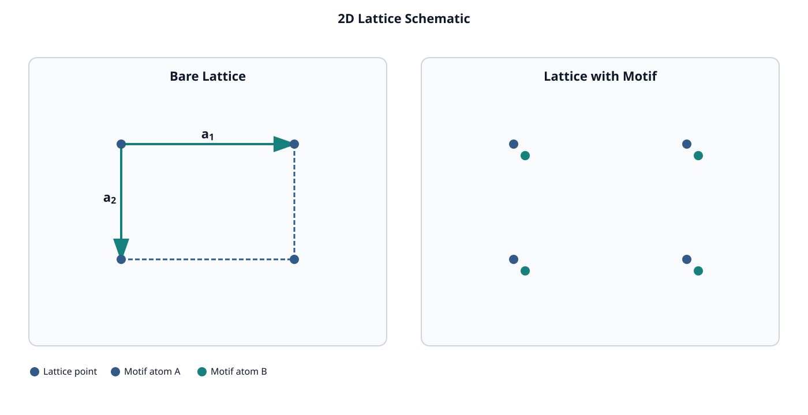
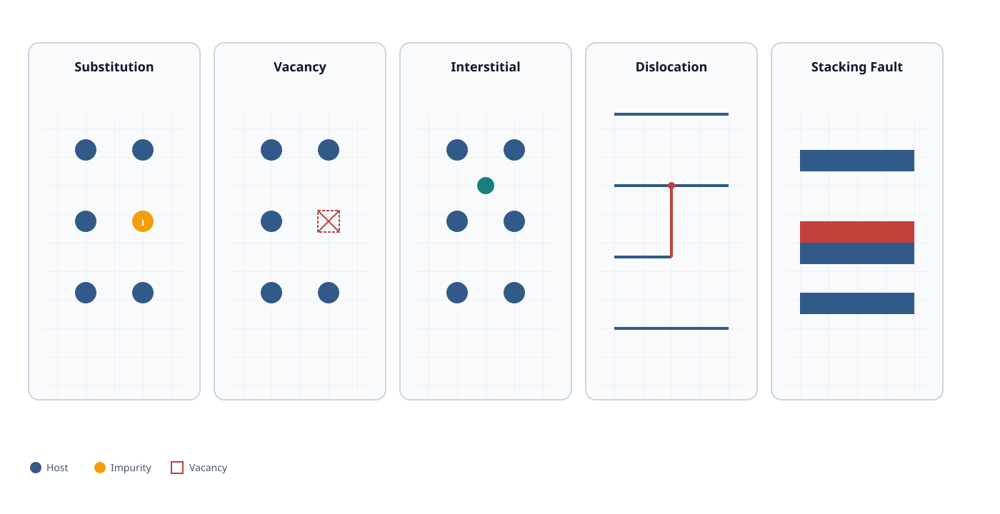
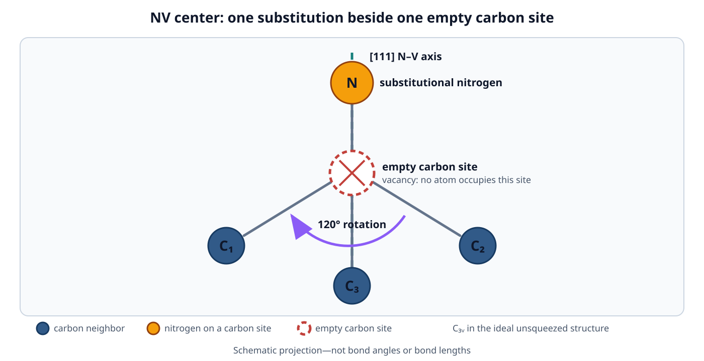
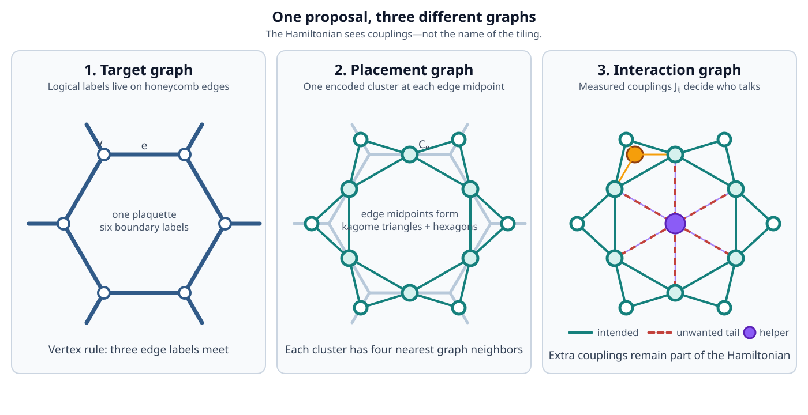
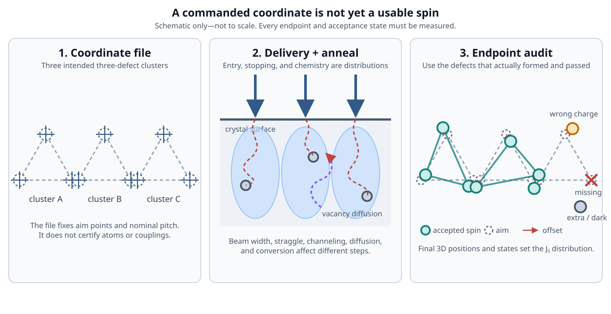
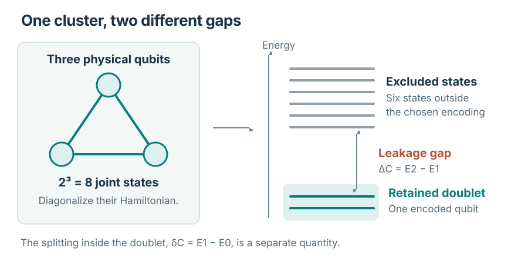
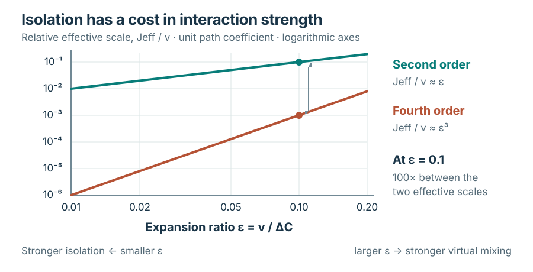
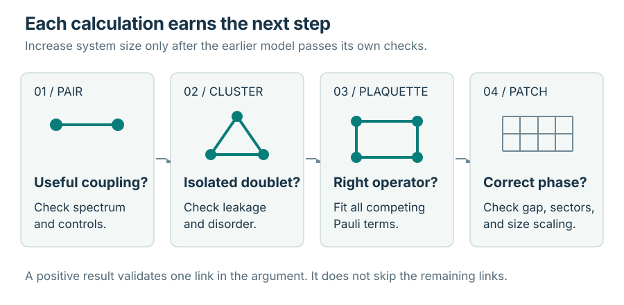
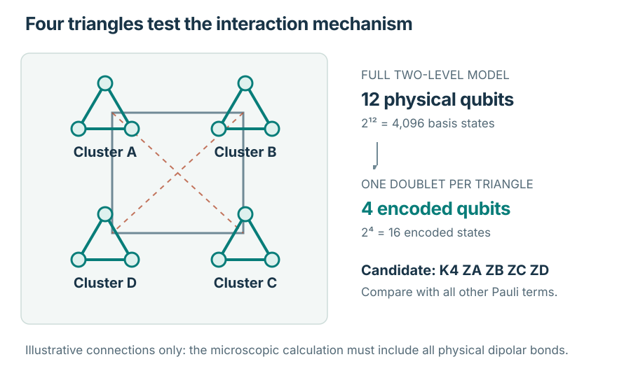

<!-- Generated from notes/pages/defects-to-topological-qubits.html by npm run notes:export:qubits. Edit the HTML source, not this export. -->

[]{#top}

Notebook / Quantum information

# Defect-engineered topological qubits

How a spin in a crystal could become part of a protected quantum memory---and what must be demonstrated at every step.

Foundations · Three assessment units · Eight mathematical appendices · Illustrated reading edition. Experimental evidence is discussed in its stated context, through August 2026.

1.  01 / LOCAL --- **Defect spin** --- Prepare and control a physical quantum state.
2.  02 / ENCODED --- **Cluster qubit** --- Select two states from a larger system.
3.  03 / COLLECTIVE --- **Topological phase** --- Establish the interacting many-body model.
4.  04 / OPERATIONAL --- **Protected memory** --- Test errors, temperature, and storage time.

[]{#reading-guide}

Start with the question you have

## A clear route through a long subject {#reading-guide-title}

Follow the argument from single-spin experiments to a proposed many-body architecture. The foundational chapters provide useful stopping points; the final assessment combines related chapters into three question-led units. Read in order, or choose an entry point below.

[**Build the foundations** --- Chapters 1--4 · States, measurement, entanglement, and noise.](#chapter-1-discrete-outcomes-in-the-sterngerlach-experiment)

[**Understand the physical hardware** --- Chapters 5--11 · Crystals, defects, interactions, and encoded clusters.](#chapter-5-translational-symmetry-and-defect-localization-in-a-crystal)

[**Connect the hardware to topology** --- Chapters 12--36 · Anyons, target Hamiltonians, fabrication, and diagnostics.](#chapter-12-winding-homotopy-and-topological-protection)

[**Assess the proposed architecture** --- Three connected units · Proposal and limits, decisive tests, and a worked four-cluster assessment.](#chapter-37-the-strongest-evidence-based-case)

In the assessment and appendices, start with the main explanation. Open **Detailed treatment** for the supporting derivation or evidence, and open the exercises when you want to check your understanding. Extra material stays with the concept it develops.

Reference numbering: Assessment I combines former Chapters 37--38; Assessment II combines 39--40; Assessment III develops Chapter 41. Original chapter and section links still work, and numbered references in the detailed notes retain their original meaning.

**Keep the notation and energy scales in view**

  --------------------------------------------------------------------------------------------------------------------------------------------------------------------------------------------------------
  Symbol                              Meaning                                                          What to keep separate
  ----------------------------------- ---------------------------------------------------------------- ---------------------------------------------------------------------------------------------------
  $H$, $H_C$                          Hamiltonian of the full system or one cluster                    Unless divided by $h$ or $\hbar$, these have energy units.

  $\Delta_C$ or $\Delta_c$            Gap from a retained cluster doublet to excluded cluster states   This is a local leakage gap, not the collective topological gap.

  $\Delta_{\mathrm{topo}}$            Gap above a candidate many-body ground-state sector              Its size must be derived from the interacting model.

  $v$, $J$, $J_{\mathrm{eff}}$, $K$   Microscopic or effective interaction energies                    A coefficient and the spectral gap it produces need not be equal.

  $\nu_E=E/h$                         An energy expressed as an ordinary frequency                     Units are Hz; $\omega_E=E/\hbar=2\pi\nu_E$ is an angular frequency.

  $\Gamma=1/T_2$                      A decay rate in an exponential-decay model                       Its equivalent energy is $\hbar\Gamma$, and its equivalent ordinary frequency is $\Gamma/(2\pi)$.

  $P$                                 An orthogonal projector onto retained states                     It is square and obeys $P^2=P=P^\dagger$.

  $W$                                 An isometry whose columns are retained orthonormal states        It is usually rectangular: $W^\dagger
                                                                                                       W=I$ and $WW^\dagger=P$.

  $X,Y,Z$ or $\tau^\mu$               Pauli operators on a specified two-state space                   State explicitly whether that space is a physical doublet or an encoded cluster.

  $\epsilon$                          A small ratio of interaction strength to excitation gap          It controls a perturbative expansion, not a complete device error budget.
  --------------------------------------------------------------------------------------------------------------------------------------------------------------------------------------------------------

Symbols such as $c$ and $\alpha$ are reused in the source for unrelated dimensionless coefficients or protocol costs. Each is defined locally. Chapter 41 also uses $u$ and $K_4$ as ordinary frequencies; the corresponding energies are $hu$ and $hK_4$.

A reliable unit check is to convert every energy to hertz before comparing scales, or leave every term in energy units. For example,

$$\frac{J_{\mathrm{eff}}}{\hbar\Gamma}
=2\pi\left(\frac{J_{\mathrm{eff}}}{h}\right)T_2.$$

The quantity $(J_{\mathrm{eff}}/h)T_2$ counts interaction-frequency cycles during the coherence time. The factor $2\pi$ converts it to the energy ratio on the left.

[]{#book-content}

## Part I --- Foundations of quantum mechanics

This part contains two chapters. The first considers a single atom, and the second considers a pair of atoms. Together, they establish how to predict the outcome of a magnetic experiment and how to identify the information lost when one member of a pair is ignored.

------------------------------------------------------------------------

## Chapter 1 --- Discrete outcomes in the Stern--Gerlach experiment

In the Stern--Gerlach experiment, a beam of silver atoms passes through a nonuniform magnetic field, meaning that the magnetic field varies with position. The detector records two discrete spatial outcomes. By contrast, a classical magnetic moment with a continuously variable orientation would permit a continuous range of deflections.

In 1922, Otto Stern and Walther Gerlach observed these two outcomes. This chapter develops the minimal rules for quantum states and measurements that predict both this result and the result obtained when a second magnet is oriented perpendicular to the first.

### Complex amplitudes and interference

In classical probability theory, each outcome has a nonnegative probability, and the probabilities of all mutually exclusive outcomes sum to one. Quantum mechanics instead assigns a complex amplitude to each outcome. The Born rule converts an amplitude into a probability by taking its squared magnitude.

A complex number has the form

$$z = a + ib,$$

where $a$ and $b$ are real numbers, and $i^2=-1$. The complex conjugate of $z$ is $z^*=a-ib$. The squared magnitude of $z$ is

$$|z|^2 = z^* z = a^2 + b^2.$$

Because this squared magnitude cannot be negative, it can represent a probability.

An amplitude is not itself a probability. Amplitudes with opposite phases can add to zero before the squared magnitude is taken. This addition and cancellation of amplitudes is called interference.

The analysis of the second magnet depends on this amplitude addition.

Denote the two amplitudes by $\alpha$ and $\beta$, and arrange them as a column vector:

$$|\psi\rangle
=
\begin{pmatrix}
\alpha \\
\beta
\end{pmatrix}.$$

This notation is called a ket. A ket is a column vector representing a quantum state in a chosen basis, where a basis is a specified set of state vectors used to express other states. Ket notation distinguishes a state vector from the operator or measurement used to analyze it.

The normalization condition requires the squared magnitudes of the two amplitudes to sum to one:

$$|\alpha|^2+|\beta|^2=1.$$

This condition ensures that the total Born probability for the two outcomes is one.

In this chapter, a state is represented by a normalized column vector. Vectors that differ only by an overall complex factor of magnitude one represent the same physical state.

### Basis states and superposition

Label the two observed positions as "along the magnet, up" and "along the magnet, down":

$$|z+\rangle
=
\begin{pmatrix} 1 \\ 0 \end{pmatrix},
\qquad
|z-\rangle
=
\begin{pmatrix} 0 \\ 1 \end{pmatrix}.$$

The state of an atom can then be written as

$$|\psi\rangle = \alpha |z+\rangle + \beta |z-\rangle.$$

This expression is a superposition in the $z$ basis. A superposition is a linear combination of basis states. It specifies the two amplitudes used to calculate the outcome probabilities of a $z$-basis measurement. It does not assign the atom a simultaneous pair of classical orientations.

The dual of a ket is obtained by transposing the column vector and complex-conjugating every entry. The resulting row vector is called a bra:

$$\langle\psi| = \begin{pmatrix} \alpha^* & \beta^* \end{pmatrix}.$$

Multiplying a bra by a ket gives one complex number, called the inner product and written $\langle\phi|\psi\rangle$. For the state of the atom,

$$\langle\psi|\psi\rangle = |\alpha|^2 + |\beta|^2 = 1.$$

A Hilbert space is a vector space equipped with an inner product. For this chapter, the relevant operations are vector addition, multiplication by complex scalars, and inner products between state vectors.

### Sequential measurements along perpendicular axes

An idealized Stern--Gerlach magnet implements a two-outcome measurement of one spin component. A spin component is the projection of the intrinsic angular momentum along a specified axis. Blocking one output and retaining the other postselects the corresponding eigenstate, where postselection means retaining only the systems that produced a specified measurement outcome. This procedure prepares a state by measurement.

A perpendicular magnet measures a different spin component. Denote its outcomes by $x+$ and $x-$, and define

$$|x+\rangle = \frac{|z+\rangle + |z-\rangle}{\sqrt{2}},
\qquad
|x-\rangle = \frac{|z+\rangle - |z-\rangle}{\sqrt{2}}.$$

The relative minus sign makes the two new states orthogonal. Orthogonal states have an inner product equal to zero:

$$\langle x+|x-\rangle
=
\frac12 \bigl(\langle z+| + \langle z-|\bigr)
\bigl(|z+\rangle - |z-\rangle\bigr)
=
\frac12(1-1)
=
0.$$

In step 1, an initially unselected ensemble of atoms passes through a $z$-oriented magnet. The $z-$ output is blocked, and the $z+$ output is retained. Every surviving atom is then in the state

$$|\psi_1\rangle = |z+\rangle.$$

A second $z$-oriented magnet sends all these atoms to its $z+$ output. The corresponding amplitude is $1$, and the probability is $1$.

In step 2, the next magnet is oriented perpendicular to the first, and only the $x+$ output is retained. The transition amplitude is

$$\langle x+|z+\rangle
=
\frac{1}{\sqrt{2}}
\bigl(\langle z+| + \langle z-|\bigr)|z+\rangle
=
\frac{1}{\sqrt{2}}.$$

The Born rule therefore gives

$$P(x+\mid z+) = \Bigl|\frac{1}{\sqrt{2}}\Bigr|^2 = \frac12.$$

Approximately half of the atoms survive this postselection. Each surviving atom is no longer in the state $z+$. Its state is

$$|\psi_2\rangle = |x+\rangle = \frac{|z+\rangle + |z-\rangle}{\sqrt{2}}.$$

The probability that an atom passes the filter and the state of an atom conditioned on passing the filter are therefore distinct objects. The postselected state of each survivor is normalized.

In step 3, the $z$ component is measured again. The relevant amplitudes are

$$\langle z+|x+\rangle = \frac{1}{\sqrt{2}},
\qquad
\langle z-|x+\rangle = \frac{1}{\sqrt{2}},$$

so

$$P(z+\mid x+) = P(z-\mid x+) = \frac12.$$

The perpendicular measurement removes the certainty established in step 1. It does not reveal a pre-existing $x$ value while preserving the previously prepared $z$ state. In this ideal model, measuring one component prepares an eigenstate of that component, and that state generally gives a distribution of possible outcomes for a different component.

For 100 atoms already prepared in $z+$, the expected counts are approximately 50 atoms in the $x+$ output and then approximately 25 atoms in each final $z$ output. Small experimental samples fluctuate around these expected counts, but the conditional probabilities remain one half and one half.

### Overall and relative phase

Multiplying an entire ket by $e^{i\gamma}$, where $\gamma$ is real, leaves every probability unchanged:

$$\bigl|\langle a|e^{i\gamma}\psi\rangle\bigr|^2
=
|e^{i\gamma}|^2 \,\bigl|\langle a|\psi\rangle\bigr|^2
=
\bigl|\langle a|\psi\rangle\bigr|^2.$$

Thus, $|\psi\rangle$ and $e^{i\gamma}|\psi\rangle$ represent the same physical state. The equivalence class of vectors related by such an overall phase is called a ray. An overall phase has no observable effect.

A relative phase is the phase difference between components of a superposition. It is observable through suitable interference measurements. The two states

$$\frac{|z+\rangle + |z-\rangle}{\sqrt{2}} = |x+\rangle,
\qquad
\frac{|z+\rangle - |z-\rangle}{\sqrt{2}} = |x-\rangle$$

give the same probabilities for a $z$-basis measurement but opposite definite outcomes for an $x$-basis measurement. The distinction between overall and relative phase is therefore necessary to explain the result of the second magnet.

### The Born rule and projection

Let $\{|a_j\rangle\}$ be a complete set of mutually exclusive measurement outcomes. Mutual exclusivity means that every pair of distinct states is orthogonal, and completeness means that the set includes every possible outcome. The Born rule states that the probability of outcome $j$ is

$$P(j) = \bigl|\langle a_j|\psi\rangle\bigr|^2.$$

Born introduced the probabilistic interpretation of the wavefunction in 1926. In modern notation, each outcome is associated with a projector

$$\Pi_j = |a_j\rangle\langle a_j|.$$

A projector is an operator that extracts the component of a state lying in a specified subspace. The Born probability can then be written as

$$P(j) = \langle\psi|\Pi_j|\psi\rangle.$$

These projectors are idempotent and Hermitian. Idempotence means that applying the projector twice has the same effect as applying it once, and Hermiticity means that the projector equals its adjoint. For a complete measurement, the projectors sum to the identity:

$$\sum_j \Pi_j = I.$$

This completeness relation ensures that the probabilities sum to one. If the measurement produces the unique outcome $j$, the ideal post-measurement state is $|a_j\rangle$. More generally, it is the normalized projection

$$|\psi_j\rangle
=
\frac{\Pi_j|\psi\rangle}{\sqrt{\langle\psi|\Pi_j|\psi\rangle}}.$$

If the measurement outcome is not recorded or is ignored, a single ket is no longer sufficient to describe the resulting state. That case is addressed in the next chapter.

### Operators and observables

An operator is a linear map from kets to kets. Linearity means that

$$A\bigl(c_1|u\rangle + c_2|v\rangle\bigr)
=
c_1 A|u\rangle + c_2 A|v\rangle.$$

In a finite basis, an operator is represented by a matrix. The adjoint $A^\dagger$ is obtained by transposing the matrix and complex-conjugating its entries. If

$$A = A^\dagger,$$

the matrix is Hermitian. In the ideal measurement framework used here, measurable quantities are represented by Hermitian operators. Their possible measurement results, called eigenvalues, are real, and eigenstates associated with different eigenvalues are orthogonal. An eigenstate satisfies

$$A|a_j\rangle = a_j |a_j\rangle.$$

Here, $|a_j\rangle$ is an eigenstate of $A$, and $a_j$ is its corresponding eigenvalue.

For the two-state atom, define the Pauli matrices

$$\sigma_z
=
\begin{pmatrix} 1 & 0 \\ 0 & -1 \end{pmatrix},
\qquad
\sigma_x
=
\begin{pmatrix} 0 & 1 \\ 1 & 0 \end{pmatrix}.$$

Both matrices are Hermitian. Direct multiplication gives

$$\sigma_z |z\pm\rangle = \pm |z\pm\rangle,
\qquad
\sigma_x |x\pm\rangle = \pm |x\pm\rangle.$$

These Pauli matrices are dimensionless. For an ideal spin-$1/2$ system, the corresponding angular-momentum components are

$$S_z = \frac{\hbar}{2}\sigma_z,
\qquad
S_x = \frac{\hbar}{2}\sigma_x,$$

so an $S_z$ measurement returns $+\hbar/2$ or $-\hbar/2$, measured in joule-seconds. The labels $z+$ and $z-$ denote these two eigenstates.

The two Pauli matrices do not commute:

$$[\sigma_z,\sigma_x] \equiv \sigma_z\sigma_x - \sigma_x\sigma_z \ne 0.$$

The commutator $[A,B]$ measures the difference between applying $A$ before $B$ and applying $B$ before $A$. Because $\sigma_z$ and $\sigma_x$ do not commute, they cannot share a complete set of eigenstates. The three-magnet sequence demonstrates this noncommutativity experimentally.

If this noncommutativity is neglected, one might assign a hidden pair of labels to each atom, one for $z$ and one for $x$. Retaining the noncommutative operator structure rules out that description within this model.

The expectation value of $A$ in the state $|\psi\rangle$ is

$$\langle A\rangle_\psi = \langle\psi|A|\psi\rangle = \sum_j a_j P(j).$$

An expectation value is the average result over many identically prepared experimental runs. It need not equal any possible result of a single measurement.

For $|x+\rangle$, a measurement of $\sigma_z$ returns $+1$ and $-1$ equally often, so the expectation value is $0$. Zero is not a possible single-shot result.

If $q = \langle\psi|A|\psi\rangle$ and $A = A^\dagger$, then $q^* = q$. Therefore, expectation values of Hermitian operators are real.

### Unitary time evolution

Between measurements, an isolated system evolves without changing inner products between states. Such evolution is represented by a unitary matrix $U$, defined by

$$U^\dagger U = U U^\dagger = I.$$

If $|\psi'\rangle =
U|\psi\rangle$, then

$$\langle\psi'|\psi'\rangle
=
\langle\psi|U^\dagger U|\psi\rangle
=
\langle\psi|\psi\rangle.$$

Unitary evolution therefore preserves normalization.

The generator of time evolution is the energy operator, called the Hamiltonian $H$. Schrödinger's equation is

$$i\hbar \frac{d}{dt}|\psi(t)\rangle = H|\psi(t)\rangle.$$

Time $t$ is measured in seconds, and $\hbar$ is measured in joule-seconds. The units are consistent because

$$[\hbar\, d/dt] = (\mathrm{J\,s})(1/\mathrm{s}) = \mathrm{J} = [H].$$

If $H$ does not depend on time, the solution is

$$|\psi(t)\rangle = U(t)\,|\psi(0)\rangle,
\qquad
U(t) = e^{-iHt/\hbar}.$$

The exponential is defined by its power series. The quantity $Ht/\hbar$ is dimensionless. Because $H$ is Hermitian, $U(t)$ is unitary.

As a concrete example, consider

$$H = \frac{\hbar\omega}{2}\sigma_z,$$

where $\omega$ is an angular frequency measured in radians per second. Starting from $|x+\rangle$, the state evolves as

$$|\psi(t)\rangle
=
\frac{e^{-i\omega t/2}|z+\rangle + e^{+i\omega
t/2}|z-\rangle}{\sqrt{2}}.$$

The probabilities of the two $z$-basis outcomes remain fifty-fifty, while the relative phase changes with time. An $x$-basis measurement detects this change:

$$P(x+;t) = \bigl|\langle x+|\psi(t)\rangle\bigr|^2 = \cos^2\bigl(\omega
t/2\bigr).$$

Time evolution can therefore be undetectable in one measurement basis and detectable in another. A list of probabilities for only one basis omits the phase information retained by the amplitudes.

### Physical implementation of the 1922 experiment

The idealized operators in this analysis represent components of a physical apparatus. Stern and Gerlach used a source, a beam of neutral silver atoms, a magnet with a spatially varying field, two resulting paths, and detectors with finite response and observation limits. In a semiclassical approximation, the force is

$$\mathbf F \approx \boldsymbol\nabla(\boldsymbol\mu\cdot\mathbf B),$$

where $\boldsymbol\mu$ is the magnetic moment, measured in joules per tesla, and $\mathbf B$ is the magnetic field, measured in tesla. The gradient contributes units of inverse metres, so the right-hand side has units of newtons. The internal magnetic state of the atom thereby produces a measurable change in its trajectory.

The 1922 paper predates the 1925 proposal of electron spin. The standard classroom interpretation in terms of spin was developed later.

Ground-state silver can be represented by a two-dimensional angular-momentum subspace. The complete atom, magnet, and surrounding spatial degrees of freedom occupy a much larger state space.

Describing the experiment as a "spin-1/2 measurement" is therefore an effective description. It does not imply that the remaining degrees of freedom of the atom are absent.

The ideal analyzer also combines several physical processes into a single projection. The magnet first correlates the atom's internal state with its path through ordinary unitary evolution of the larger system.

A detector or blocker then produces a record or selects one path. Real devices include imperfect preparation, overlapping beams, misaligned fields, particle loss, and noisy counters.

These imperfections alter the observed counts. They do not modify the Born rule.

A two-component ket represents a physical degree of freedom within an effective model. By itself, it is not a computer bit, a protected code, or an unusual particle localized in a crystal.

### Common conceptual errors

- A probability is obtained by taking the squared magnitude $|c|^2 = c^*c$, not by simply squaring a complex amplitude. Omitting the complex conjugate can produce a negative or complex quantity that cannot represent a probability.

- The column $(\alpha,\beta)^T$ must not be treated as a basis-independent object. A superposition is always expressed relative to a specified basis and therefore to a specified measurement.

- An overall phase has no observable effect, whereas a relative phase can affect interference measurements. These two kinds of phase must be distinguished.

- An expectation value is not generally a possible single-shot result. It is an average over repeated, identically prepared measurements.

- A postselected measurement must not be described as only unitary evolution of the atom. Projection removes unselected alternatives. The combined atom--magnet system may evolve unitarily before conditioning on a detector event.

- Hermitian and unitary are distinct properties. Hermitian operators represent observables in this ideal framework, whereas unitary operators preserve inner products. A Pauli matrix is both Hermitian and unitary, but most operators are neither.

- Simulating these matrices on a computer does not make the computer physically equivalent to a silver atom. A simulation implements a mathematical description of the system.

- The existence of two levels does not by itself establish a protected qubit. Preparation, control, readout, and protection require additional physical mechanisms.

### Self-assessment

- **Specification of a pure-state experiment:** A normalized ket, defined up to an overall phase, predicts a pure-state experiment. Measurements and time evolution act on this state.

- **Conversion of an amplitude into a probability:** The amplitude for outcome $j$ is $\langle a_j|\psi\rangle$. Its squared magnitude gives the probability: $P(j) = |\langle
  a_j|\psi\rangle|^2$.

- **Normalization in the $z$ basis:** The condition $|\alpha|^2 + |\beta|^2 = 1$ follows because these two quantities are the probabilities of the two possible $z$-basis outcomes, and the atom must produce one of them.

- **Failure of a non-Hermitian measurement operator:** If $A$ is not Hermitian, its eigenvalues need not be real, and eigenstates associated with different readings need not be orthogonal. It therefore cannot represent an ideal measurement in this framework.

- **Difference between unitary evolution and postselection:** Unitary evolution preserves every inner product. Selecting one measurement output projects the state and then renormalizes it.

- **Outcomes after the sequence $z+$, then $x+$, then $z$:** The final probabilities are one half for $z+$ and one half for $z-$. If the second magnet merely revealed an $x$ value while leaving $z+$ unchanged, every survivor would return to the $z+$ output. The observed result is inconsistent with that description.

The framework now includes a state, a measurement rule, and a law for evolution between measurements. The next chapter extends the description to two atoms and shows that the state of a pair cannot always be written as a separate state for each atom.

### Sources

- [\[R037\]](#ref-R037 "[R037] M. Born, “Zur Quantenmechanik der Stoßvorgänge,” Zeitschrift
  für Physik 37, 863–867 (1926). DOI: 10.1007/BF01397477 .") M. Born, "Zur Quantenmechanik der Stoßvorgänge," Zeitschrift für Physik 37, 863--867 (1926). DOI: [10.1007/BF01397477](https://doi.org/10.1007/BF01397477).

- [\[R038\]](#ref-R038 "[R038] W. Gerlach and O. Stern, “Der experimentelle Nachweis der
  Richtungsquantelung im Magnetfeld,” Zeitschrift für Physik 9, 349–352
  (1922). DOI: 10.1007/BF01326983 .") W. Gerlach and O. Stern, "Der experimentelle Nachweis der Richtungsquantelung im Magnetfeld," Zeitschrift für Physik 9, 349--352 (1922). DOI: [10.1007/BF01326983](https://doi.org/10.1007/BF01326983).

- [\[R039\]](#ref-R039 "[R039] B. Friedrich and D. Herschbach, “Stern and Gerlach: How a Bad
  Cigar Helped Reorient Atomic Physics,” Physics Today 56(12), 53–59
  (2003). DOI: 10.1063/1.1650229 .") B. Friedrich and D. Herschbach, "Stern and Gerlach: How a Bad Cigar Helped Reorient Atomic Physics," Physics Today 56(12), 53--59 (2003). DOI: [10.1063/1.1650229](https://doi.org/10.1063/1.1650229).

- [\[R040\]](#ref-R040 "[R040] P. A. M. Dirac, The Principles of Quantum Mechanics, 4th ed.,
  Oxford University Press (1958; reissued 1981). ISBN: 978-0-19-852011-5.
  Stable URL: Oxford
  Academic .") P. A. M. Dirac, The Principles of Quantum Mechanics, 4th ed., Oxford University Press (1958; reissued 1981). ISBN: 978-0-19-852011-5.

- [\[R041\]](#ref-R041 "[R041] E. Schrödinger, “Quantisierung als Eigenwertproblem (Vierte
  Mitteilung),” Annalen der Physik 386, 109–139 (1926). DOI: 10.1002/andp.19263861802 .") E. Schrödinger, "Quantisierung als Eigenwertproblem (Vierte Mitteilung)," Annalen der Physik 386, 109--139 (1926). DOI: [10.1002/andp.19263861802](https://doi.org/10.1002/andp.19263861802).

- [\[R004\]](#ref-R004 "[R004] M. A. Nielsen and I. L. Chuang, Quantum Computation and
  Quantum Information, 10th anniversary ed., Cambridge University Press,
  2010. DOI: 10.1017/CBO9780511976667 .") M. A. Nielsen and I. L. Chuang, Quantum Computation and Quantum Information: 10th Anniversary Edition, Cambridge University Press (2010). DOI: [10.1017/CBO9780511976667](https://doi.org/10.1017/CBO9780511976667).

------------------------------------------------------------------------

## Chapter 2 --- Nonfactorizable states of two two-level systems

For two classical coins, each coin can land heads or tails, giving four joint outcomes: HH, HT, TH, and TT.

For two fair coins, each joint outcome has probability $1/4$. For loaded coins, the four probabilities can have any nonnegative values whose sum is one.

A corresponding quantum system consists of two silver atoms of the type whose internal states are separated by a magnetic field. Each atom has two possible measurement outcomes. The pair therefore has four outcome labels, as in the classical case. The essential difference is that a quantum state assigns four complex amplitudes to these labels, and these amplitudes need not factor into one pair of amplitudes for the first atom and another pair for the second.

No crystal is involved at this stage. The system consists only of two atoms, four joint labels, and a set of amplitudes that may be nonfactorizable.

### Joint basis and tensor-product dimension

Denote the atoms by $A$ and $B$. Each has the two possible answers introduced in Chapter 1, now written $0$ and $1$ rather than $z+$ and $z-$. A ket is the notation used to represent a quantum state or basis label. The pair has four joint basis kets:

$$|00\rangle,\quad |01\rangle,\quad |10\rangle,\quad |11\rangle.$$

The first digit refers to $A$, and the second refers to $B$. Thus, $|01\rangle$ denotes the outcome in which $A$ has value 0 and $B$ has value 1.

A state of the pair is specified by four complex amplitudes, one for each joint label. The squared magnitudes of these amplitudes sum to one. Relative phases are physically consequential because they affect the probabilities of later measurements, just as the minus sign between $z+$ and $z-$ affected the outcome of the transverse-magnet measurement in Chapter 1.

The states of two systems are combined using the tensor product. If $A$ is in the state $\alpha|0\rangle+\beta|1\rangle$ and $B$ is in $|0\rangle$, then the joint state is

$$(\alpha|0\rangle+\beta|1\rangle)\otimes|0\rangle
=\alpha|00\rangle+\beta|10\rangle.$$

The symbol $\otimes$ denotes the tensor product. For states, it combines the state labels of the two systems and multiplies their amplitudes. This rule is taken as the definition here. The same symbol will later be used to combine operators as well as kets.

If $A$ has $d_A$ independent basis states and $B$ has $d_B$, then the pair has $d_A d_B$ joint basis states. In particular, two systems with two basis states each produce four joint labels.

Similarly, a three-state system combined with a four-state system has twelve joint basis states. Tensor-product dimensions multiply rather than add.

An operator is a linear transformation acting on quantum states. An operator that acts only on $A$ is represented on the joint system as $M_A\otimes I_B$, where $M_A$ is the original operator and $I_B$ is the identity operator that leaves $B$ unchanged. Consequently, $M_A\otimes I_B$ acts on $A$ while leaving $B$ unchanged.

Without the tensor-product rule, the four joint labels could be misinterpreted as four additional states of a single atom. Instead, each label specifies a pair of answers, one from each subsystem.

### Product states

Some four-amplitude joint states factor into two states with two amplitudes each. For example,

$$|0\rangle_A\otimes|0\rangle_B = |00\rangle.$$

In this state, $A$ is definitely 0 and $B$ is definitely 0. The state of either atom does not depend on the other.

As another example, let both atoms be in the transverse-basis state introduced in Chapter 1,

$$|+\rangle = \frac{|0\rangle+|1\rangle}{\sqrt{2}}.$$

Their joint state is then

$$|+\rangle_A\otimes|+\rangle_B
= \frac{|00\rangle+|01\rangle+|10\rangle+|11\rangle}{2}.$$

Every joint basis state has the same amplitude. Measuring both atoms gives each of the four joint outcomes with probability one quarter. The two outcomes are independent because the probability of each pair equals the product of the corresponding single-atom probabilities.

A joint state that can be written as one ket for $A$ tensor-multiplied by one ket for $B$ is called a product state. The defining issue is whether the joint state factors into two local kets.

Thus, the statement that a pair is in a product state is a factorization claim. It is not merely a claim that measurement outcomes appear uncorrelated in one particular basis.

### Entangled pure states

Consider the state

$$|\Phi^+\rangle_{AB}
=\frac{|0\rangle_A|0\rangle_B+|1\rangle_A|1\rangle_B}{\sqrt{2}}
=\frac{|00\rangle+|11\rangle}{\sqrt{2}}.$$

This is called a Bell state. The two joint basis states in the superposition are orthogonal, meaning that their inner product is zero. The state is therefore normalized:

$$\langle\Phi^+|\Phi^+\rangle=\frac{1+1}{2}=1.$$

A measurement of both atoms in the $\{|0\rangle,|1\rangle\}$ basis has only two possible outcomes: 00 and 11, each with probability $1/2$. The two answers always agree.

To test whether this state is a product, assume that it can be written as

$$|\Phi^+\rangle=(a|0\rangle+b|1\rangle)_A\otimes(c|0\rangle+d|1\rangle)_B.$$

Expanding the right-hand side gives the amplitudes $ac$, $ad$, $bc$, and $bd$ for $|00\rangle$, $|01\rangle$, $|10\rangle$, and $|11\rangle$, respectively. Equality with the Bell state would require

$$ac=\frac{1}{\sqrt2},\qquad ad=0,\qquad bc=0,\qquad bd=\frac{1}{\sqrt2}.$$

The first equation implies that $a$ and $c$ are nonzero. The condition $ad=0$ then requires $d=0$, which makes it impossible for $bd$ to equal $1/\sqrt2$. Therefore, no coefficients $a,b,c,d$ satisfy all four equations.

A pure joint state that cannot be factorized is called entangled. Entanglement is a property of the joint state and does not imply that a hidden message travels between the atoms. It means that the four joint amplitudes cannot be separated into independent amplitude lists for the two subsystems.

A more general algebraic test follows from the Schmidt decomposition. Any pure bipartite state can be written as

$$|\Psi\rangle_{AB}=\sum_{k=1}^{r}s_k|u_k\rangle_A|v_k\rangle_B,$$

where the Schmidt coefficients $s_k$ are nonnegative and satisfy $\sum_k s_k^2=1$, while $\{|u_k\rangle_A\}$ and $\{|v_k\rangle_B\}$ are orthonormal lists of local states. Orthonormality means that distinct states in each list have zero inner product and each state has norm one.

The number $r$ of nonzero Schmidt coefficients is the Schmidt rank. A pure state is a product state exactly when its Schmidt rank is 1.

For the Bell pair, $r=2$ and $s_1=s_2=1/\sqrt2$.

If the requirement that the local lists be orthonormal is removed, many states can be expressed as sums of product terms. Such an expression does not make the state a product state. The relevant criterion is the Schmidt rank.

### Density operators for pure and mixed states

If the pair is known to be exactly in $|\Phi^+\rangle$, a ket provides a complete state description. In many situations, however, the preparation is not known as a single ket.

For example, a fair classical coin might determine whether the pair is prepared in $|00\rangle$ or $|11\rangle$. Alternatively, only atom $A$ might be accessible. A single ket cannot represent this type of classical uncertainty.

The appropriate description is a density operator, represented in a chosen basis by a square matrix of complex numbers. For a pure state $|\psi\rangle$, its density operator is the outer product $|\psi\rangle\langle\psi|$. The outer product combines a ket and a bra to form an operator. For the Bell pair,

$$\rho_{AB}=|\Phi^+\rangle\langle\Phi^+|
=\frac12\left(
|00\rangle\langle00|+|00\rangle\langle11|
+|11\rangle\langle00|+|11\rangle\langle11|
\right).$$

A density operator is also called a density matrix once a basis has been chosen. The same mathematical object describes a definite ket, a classical probability distribution over kets, and---as discussed in the next section---the state remaining for one atom after its partner is ignored.

Every valid density operator $\rho$ has three properties:

- It is Hermitian, meaning that it equals its adjoint: $\rho^\dagger=\rho$.

- It is positive semidefinite, meaning that $\langle\chi|\rho|\chi\rangle\ge0$ for every $|\chi\rangle$.

- It has unit trace: $\operatorname{Tr}\rho=1$. The trace is the sum of the diagonal matrix entries in any basis.

If a preparation produces the pure state $|\psi_k\rangle$ with classical probability $p_k$, the corresponding density operator is

$$\rho=\sum_k p_k|\psi_k\rangle\langle\psi_k|.$$

A yes-or-no measurement outcome labeled $m$ is represented by a projector $P_m$, an operator satisfying $P_m^2=P_m$. The probability of the outcome $m$ is

$$\Pr(m)=\operatorname{Tr}(\rho P_m).$$

A density operator derived from a single ket satisfies $\rho^2=\rho$, or equivalently $\operatorname{Tr}(\rho^2)=1$. It also has rank 1. The Bell pair, considered as a complete two-atom system, has this property:

$$\operatorname{Tr}(\rho_{AB}^2)=1.$$

A density operator is therefore not a distinct or more obscure type of physical state. It is the smallest table that retains all probability predictions when a ket is insufficient. If Hermiticity, positivity, or unit trace is omitted, the resulting probabilities can become complex, negative, or fail to sum to one.

### Partial trace and reduced states

Assume that only subsystem $A$ is accessible. All predictions for measurements on $A$ alone are obtained from a reduced density operator formed by summing over the basis states of $B$:

$$\rho_A=\operatorname{Tr}_B(\rho_{AB})
=\sum_{b=0}^{1}{}_B\langle b|\rho_{AB}|b\rangle_B.$$

This operation is the partial trace over $B$. It does not represent the physical destruction of $B$. It constructs the statistics observed when no measurement outcome from $B$ is retained.

For basis operators, the partial trace satisfies

$$\operatorname{Tr}_B\left(|a b\rangle\langle a' b'|\right)
=\langle b'|b\rangle\,|a\rangle\langle a'|
=\delta_{b'b}|a\rangle\langle a'|,$$

where the Kronecker delta $\delta_{b'b}$ equals 1 when $b'=b$ and 0 otherwise. The cross terms in the Bell-state density operator contain $|0\rangle_B\langle1|$ or $|1\rangle_B\langle0|$. Because these basis states are orthogonal, the cross terms vanish under the partial trace. The remaining terms give

$$\rho_A=\frac12\left(|0\rangle\langle0|+|1\rangle\langle1|\right)
=\frac{I_A}{2},$$

where $I_A$ is the identity operator on $A$, represented by the two-by-two matrix with ones on the diagonal and zeros elsewhere.

The complete pair is pure, but either atom considered separately is maximally mixed for a two-state system. This is confirmed by

$$\operatorname{Tr}(\rho_A^2)=\operatorname{Tr}\left(\frac{I_A}{4}\right)=\frac12.$$

Thus, global purity does not imply local purity. In this case, the local mixedness does not mean that a particular local ket was prepared and subsequently forgotten. No local ket describes the subsystem.

Operationally, every measurement on $A$ alone is completely predicted by $\rho_A$. An operator acting only on $A$ is represented on the pair by $M_A\otimes I_B$. Its expectation value, or statistical average, is

$$\langle M_A\rangle=\operatorname{Tr}\!\left[\rho_{AB}(M_A\otimes
I_B)\right].$$

The reduced density operator $\rho_A$ is the unique operator that reproduces every such expectation value:

$$\operatorname{Tr}(\rho_A M_A)
=\operatorname{Tr}\!\left[\rho_{AB}(M_A\otimes I_B)\right].$$

For a product operator, the partial trace has the simpler form

$$\operatorname{Tr}_B(X_A\otimes Y_B)=X_A\operatorname{Tr}(Y_B).$$

Linearity, meaning preservation of sums and scalar multiples, extends this rule to every joint operator.

A local operator chosen only to reproduce one measurement need not reproduce another. The partial trace is unique because it agrees with the joint state for all local measurements.

### Relative phase accessible only through joint measurements

Consider the Bell state with an additional relative phase:

$$|\Phi_\theta\rangle=\frac{|00\rangle+e^{i\theta}|11\rangle}{\sqrt2},$$

where $\theta$ is the relative phase between the two terms. The joint density operator contains the cross terms $e^{-i\theta}|00\rangle\langle11|$ and $e^{i\theta}|11\rangle\langle00|$. Both vanish under $\operatorname{Tr}_B$, so $\rho_A=I/2$ for every value of $\theta$.

Joint measurements can therefore detect the phase, but no measurement on $A$ alone can detect it. The phase information remains in the pair but is not locally accessible.

This family provides a counterexample to the assumption that every relative phase in a two-system state must appear in the state of at least one subsystem.

### Correlation is not sufficient to establish entanglement

Consider the density operator

$$\rho_{\mathrm{cc}}=\frac12|00\rangle\langle00|+\frac12|11\rangle\langle11|.$$

Measurements of both atoms in the $0/1$ basis always produce matching answers, exactly as for $|\Phi^+\rangle$. However, this state is a classical equal-probability mixture of two product states.

A mixed bipartite state is separable if it can be written as

$$\rho_{AB}=\sum_k p_k\,\rho_A^{(k)}\otimes\rho_B^{(k)},
\qquad p_k\ge0,\quad \sum_kp_k=1.$$

The superscript $(k)$ labels a possible component and is not an exponent. The state $\rho_{\mathrm{cc}}$ is explicitly separable. A mixed state for which no such decomposition exists is entangled.

Consequently, a single pattern of matching measurement outcomes does not establish entanglement. The Bell pair and $\rho_{\mathrm{cc}}$ agree for every measurement in the $0/1$ basis but disagree for measurements in a transverse basis.

More stringent tests use several measurement settings. Bell inequalities test whether correlations among multiple measurement choices can be explained by shared pre-existing randomness [\[R042\]](#ref-R042 "[R042] A. Einstein, B. Podolsky, and N. Rosen, “Can
Quantum-Mechanical Description of Physical Reality Be Considered
Complete?”, Physical Review 47, 777–780 (1935)."); [\[R043\]](#ref-R043 "[R043] J. S. Bell, “On the Einstein Podolsky Rosen Paradox,” Physics
Physique Fizika 1, 195–200 (1964). DOI: 10.1103/PhysicsPhysiqueFizika.1.195 ."); [\[R044\]](#ref-R044 "[R044] R. F. Werner, “Quantum states with Einstein-Podolsky-Rosen
correlations admitting a hidden-variable model,” Physical Review A 40,
4277–4281 (1989). DOI: 10.1103/PhysRevA.40.4277 ."). \[Theory\] Some entangled mixed states do not violate a given Bell inequality. Entanglement and Bell nonlocality are therefore distinct properties [\[R044\]](#ref-R044 "[R044] R. F. Werner, “Quantum states with Einstein-Podolsky-Rosen
correlations admitting a hidden-variable model,” Physical Review A 40,
4277–4281 (1989). DOI: 10.1103/PhysRevA.40.4277 .").

### Purity as a measure of mixedness

The quantity $\operatorname{Tr}(\rho^2)$ is called the purity. It is dimensionless. For a system with $d$ basis states, purity ranges from $1/d$ for the maximally mixed density operator $I/d$ to 1 for a pure state.

For a mixed state in a finite-dimensional state space,

$$\operatorname{Tr}(\rho^2)<1.$$

A mixed density operator generally has no unique decomposition into an ensemble of prepared kets. For a single two-state atom,

$$\frac{I}{2}
=\frac12|0\rangle\langle0|+\frac12|1\rangle\langle1|
=\frac12|+\rangle\langle+|+\frac12|-\rangle\langle-|,$$

where $|\pm\rangle=(|0\rangle\pm|1\rangle)/\sqrt2$. The density operator, rather than any preferred ensemble interpretation, contains the operational measurement predictions.

Because the ensemble decomposition is not unique, determining $\rho$ does not in general determine which local pure states were prepared.

### Populations and coherences

Consider one atom in the state

$$|+\rangle=\frac{|0\rangle+|1\rangle}{\sqrt2},
\qquad
\rho_+=|+\rangle\langle+|=\frac12
\begin{pmatrix}
1&1\\
1&1
\end{pmatrix}.$$

This matrix is written in the ordered basis $(|0\rangle,|1\rangle)$. The diagonal entries are called populations and give the probabilities of obtaining 0 and 1 in this basis.

The off-diagonal entries are called coherences. They contain the relative-phase information that permits interference between the two basis-state contributions.

An interaction with an uncontrolled subsystem can reduce these off-diagonal elements without changing the populations. The following calculation describes such a process.

### A dephasing channel

Consider a noisy process that preserves the populations and reduces only the off-diagonal elements. Let the parameter $\lambda$, with $0\le\lambda\le1$, specify the fraction of each coherence that remains. One model is

$$\mathcal E_\lambda(\rho)
:=K_0\rho K_0^\dagger+K_1\rho K_1^\dagger,$$

with

$$K_0=\sqrt{\frac{1+\lambda}{2}}\,I,
\qquad
K_1=\sqrt{\frac{1-\lambda}{2}}\,Z,
\qquad 0\le\lambda\le1.$$

Here $I$ is the $2\times2$ identity, and

$$Z=|0\rangle\langle0|-|1\rangle\langle1|
=\begin{pmatrix}1&0\\0&-1\end{pmatrix}$$

is the phase-flip operator introduced in Chapter 1. The operators $K_0$ and $K_1$, called Kraus operators, satisfy

$$K_0^\dagger K_0+K_1^\dagger K_1=I,$$

so the total probability remains normalized. A map constructed by sandwiching $\rho$ between Kraus operators, summing the results, and preserving the trace is a quantum channel [\[R045\]](#ref-R045 "[R045] K. Kraus, “General state changes in quantum theory,” Annals of
Physics 64, 311–335 (1971). DOI: 10.1016/0003-4916(71)90108-4 .").

More precisely, a valid quantum channel is completely positive and trace-preserving. Complete positivity ensures legal evolution even when the system is part of a larger state, and trace preservation maintains total probability when unobserved degrees of freedom are omitted. Computationally, the channel is evaluated by forming each operator sandwich and adding the results.

This particular channel describes dephasing: it reduces phase coherence while preserving populations.

For a general input state

$$\rho=\begin{pmatrix}a&c\\c^*&b\end{pmatrix},
\qquad a+b=1,$$

where $a$ and $b$ are real populations and $c$ is a complex coherence, direct matrix multiplication gives

$$\mathcal E_\lambda(\rho)
=\begin{pmatrix}a&\lambda c\\\lambda c^*&b\end{pmatrix}.$$

The populations are unchanged, while the coherences are multiplied by $\lambda$. Applied to $|+\rangle$, the channel gives

$$\rho_+'=\frac12
\begin{pmatrix}1&\lambda\\\lambda&1\end{pmatrix}.$$

The purity of the output is

$$\operatorname{Tr}[(\rho_+')^2]=\frac{1+\lambda^2}{2}.$$

At $\lambda=1$, the channel leaves the state unchanged and the state remains pure. At $\lambda=0$, all coherence in this basis is removed and $\rho_+'=I/2$. For the intermediate value $\lambda=1/2$, the output is

$$\rho_+'=\begin{pmatrix}1/2&1/4\\1/4&1/2\end{pmatrix},
\qquad
\operatorname{Tr}[(\rho_+')^2]=\frac58.$$

This model represents pure dephasing. Energy relaxation is a different channel that changes populations, usually through energy exchange, rather than only reducing off-diagonal elements. Failing to distinguish these processes can lead to the incorrect inference that a long-lived excited-state population implies preserved phase coherence.

### Environmental transfer of phase information

A microscopic model illustrates how local coherence can be transferred to an environment. Let the environment initially be in the state $|e\rangle$, and suppose the joint unitary evolution is

$$|0\rangle|e\rangle\longmapsto |0\rangle|e_0\rangle,
\qquad
|1\rangle|e\rangle\longmapsto |1\rangle|e_1\rangle.$$

An initial state $|+\rangle|e\rangle$ then evolves to

$$|\Psi\rangle_{SE}=\frac{|0\rangle|e_0\rangle+|1\rangle|e_1\rangle}{\sqrt2},$$

where $S$ denotes the system and $E$ denotes the environment. Taking the partial trace over $E$ gives

$$\rho_S=\frac12
\begin{pmatrix}
1&\langle e_1|e_0\rangle\\
\langle e_0|e_1\rangle&1
\end{pmatrix}.$$

The remaining system coherence is equal to the overlap of the two environment states. If $|e_0\rangle$ and $|e_1\rangle$ are identical, the environment contains no information that distinguishes the system basis states, and the coherence remains. If the environment states are orthogonal, they form a perfectly distinguishable record and the local coherence vanishes.

Decoherence is the process in which uncontrolled interactions transfer phase information into environmental degrees of freedom that are not monitored. It is a dynamical process, not a third category of state in addition to pure and mixed states.

Although decoherence often produces a mixed reduced state, not every mixed state results from decoherence. A mixed state can also arise directly from a classically randomized preparation.

\[Theory\] Environment-induced entanglement followed by partial tracing provides the standard open-system account of decoherence [\[R046\]](#ref-R046 "[R046] W. H. Zurek, “Decoherence, einselection, and the quantum
origins of the classical,” Reviews of Modern Physics 75, 715–775 (2003).
DOI: 10.1103/RevModPhys.75.715 ;
arXiv: quant-ph/0105127 ."); [\[R047\]](#ref-R047 "[R047] M. Schlosshauer, “Decoherence, the measurement problem, and
interpretations of quantum mechanics,” Reviews of Modern Physics 76,
1267–1305 (2005). DOI: 10.1103/RevModPhys.76.1267 ;
arXiv: quant-ph/0312059 ."). The combined system-and-environment state may remain pure and evolve unitarily throughout the process.

Decoherence is therefore not necessarily a collapse postulate. In this description, the system and environment evolve unitarily, while entanglement between them suppresses interference in the reduced system.

This account explains reduced-state dynamics. By itself, it does not resolve every interpretation of quantum measurement.

### Experimental state reconstruction and limitations

An ideal theoretical derivation specifies $\rho$ directly. A laboratory instead produces detector clicks, voltages, fluorescence counts, and a preparation procedure.

Reconstructing a density operator requires measurements in several bases together with statistical inference. This procedure is called quantum-state tomography. The result is an estimate conditioned on detector calibration and on a model of the measurement apparatus.

The claim that the same state is prepared repeatedly is also an experimental assumption. Slow drift can cause successive trials to differ.

Leakage can invalidate the assumed two-dimensional state space by transferring population into additional states. Selection rules and detector inefficiency can also bias the apparent ensemble.

Density operators remain the appropriate formalism, but the selected state space and noise model require experimental justification.

\[Experiment\] Bell tests using separated solid-state electron spins have observed correlations incompatible with a local-realist model while closing major detection and locality loopholes under the stated experimental assumptions [\[R048\]](#ref-R048 "[R048] B. Hensen et al., “Loophole-free Bell inequality violation
using electron spins separated by 1.3 kilometres,” Nature 526, 682–686
(2015). DOI: 10.1038/nature15759 ;
arXiv: 1508.05949 ."). This constitutes substantially stronger evidence than observing matching $0/1$ outcomes. It does not imply that every correlated density operator is entangled.

Experimental decoherence is inferred from the loss of interference or the decay of off-diagonal coherence, often summarized by fitted time constants. The parameter $\lambda$ used above is a channel-model parameter rather than a universal law of nature.

Its value may depend on elapsed time, pulse sequence, temperature, noise spectrum, and correlations with previous runs. Later chapters will introduce the distinct quantities $T_1$, $T_2$, and $T_2^*$ instead of representing all noise processes with a single parameter.

### Common conceptual errors

- "Not a product state" and "mixed state" are not synonymous. The Bell state is pure and entangled. The state $I/2$ is mixed but, when it describes a single subsystem with no specified partner, there is no bipartite pair in which it can be entangled.

- Matching measurement outcomes do not by themselves establish entanglement. The separable state $\rho_{\mathrm{cc}}$ has perfect $0/1$ correlation. Entanglement is determined by whether the full density operator admits a separable decomposition, not by whether one measurement plot has matching bars.

- A mixed reduced state need not result from imprecise preparation. One subsystem of a pure entangled state is mixed. Ignoring the partner is sufficient to produce the reduced mixture.

- Not every mixed state has undergone decoherence. Deliberately using a fair coin to prepare either $|0\rangle$ or $|1\rangle$ produces $I/2$ without a subsequent environmental interaction.

- Decoherence need not be treated as a mandatory collapse postulate. In the open-system description, the system and environment can evolve unitarily while their entanglement suppresses local interference [\[R046\]](#ref-R046 "[R046] W. H. Zurek, “Decoherence, einselection, and the quantum
  origins of the classical,” Reviews of Modern Physics 75, 715–775 (2003).
  DOI: 10.1103/RevModPhys.75.715 ;
  arXiv: quant-ph/0105127 ."); [\[R047\]](#ref-R047 "[R047] M. Schlosshauer, “Decoherence, the measurement problem, and
  interpretations of quantum mechanics,” Reviews of Modern Physics 76,
  1267–1305 (2005). DOI: 10.1103/RevModPhys.76.1267 ;
  arXiv: quant-ph/0312059 ."). This account explains reduced-state dynamics but does not, by itself, resolve every interpretation of quantum measurement.

- Dephasing and relaxation are distinct processes. Pure dephasing preserves basis populations while reducing off-diagonal terms. Relaxation transfers population, usually with energy exchange. Real quantum channels can include both effects.

- An ensemble decomposition is not unique. Expressing $I/2$ as a 50--50 mixture of $|0\rangle$ and $|1\rangle$ does not prove that those were the actual preparations. The same operator is also a 50--50 mixture of $|+\rangle$ and $|-\rangle$.

- A computer simulation of a Bell pair implements a mathematical description of entanglement. It does not imply that the computer contains two physically entangled atoms.

### Concept checks

- **Problem:** Determine the dimension of a composite system whose subsystems have dimensions 3 and 4.

  **Solution:** $3\times4=12$. Tensor-product dimensions multiply.

- **Problem:** Demonstrate that $|\Phi^+\rangle$ is not a product state.

  **Solution:** Matching the four amplitudes would require $ac=1/\sqrt2$, $ad=0$, $bc=0$, and $bd=1/\sqrt2$. The first condition implies $a,c\neq0$, so $d=0$, after which $bd$ cannot equal $1/\sqrt2$.

- **Problem:** Identify the error in interpreting matching $0/1$ outcomes as sufficient evidence of entanglement.

  **Solution:** The separable mixture $\rho_{\mathrm{cc}}$ produces the same matching bars. Entanglement is the absence of a separable decomposition, not the presence of correlation in one measurement plot.

- **Problem:** Explain why tracing out one subsystem of $|\Phi^+\rangle$ removes the cross terms.

  **Solution:** Those terms contain orthogonal partner-state factors, so the partial trace produces $\langle1|0\rangle=0$.

- **Problem:** Show that applying $\mathcal
  E_{1/2}$ to $|+\rangle$ gives a state with purity $5/8$.

  **Solution:** The output is $\begin{pmatrix}1/2&1/4\\1/4&1/2\end{pmatrix}$, and $\operatorname{Tr}[(\rho_+')^2]=(1+(1/2)^2)/2=5/8$.

- **Problem:** Identify the error in describing every mixed state as decohered.

  **Solution:** A coin-flip preparation of $|0\rangle$ or $|1\rangle$ already produces $I/2$, with no subsequent environmental record.

The resulting framework describes a bipartite system, the reduced state obtained by ignoring one subsystem, and the transfer of relative-phase information into unobserved degrees of freedom.

### Sources

- [\[R042\]](#ref-R042 "[R042] A. Einstein, B. Podolsky, and N. Rosen, “Can
  Quantum-Mechanical Description of Physical Reality Be Considered
  Complete?”, Physical Review 47, 777–780 (1935).") A. Einstein, B. Podolsky, and N. Rosen, "Can Quantum-Mechanical Description of Physical Reality Be Considered Complete?", Physical Review 47, 777--780 (1935). DOI: [10.1103/PhysRev.47.777](https://doi.org/10.1103/PhysRev.47.777).

- [\[R043\]](#ref-R043 "[R043] J. S. Bell, “On the Einstein Podolsky Rosen Paradox,” Physics
  Physique Fizika 1, 195–200 (1964). DOI: 10.1103/PhysicsPhysiqueFizika.1.195 .") J. S. Bell, "On the Einstein Podolsky Rosen Paradox," Physics Physique Fizika 1, 195--200 (1964). DOI: [10.1103/PhysicsPhysiqueFizika.1.195](https://doi.org/10.1103/PhysicsPhysiqueFizika.1.195).

- [\[R044\]](#ref-R044 "[R044] R. F. Werner, “Quantum states with Einstein-Podolsky-Rosen
  correlations admitting a hidden-variable model,” Physical Review A 40,
  4277–4281 (1989). DOI: 10.1103/PhysRevA.40.4277 .") R. F. Werner, "Quantum states with Einstein-Podolsky-Rosen correlations admitting a hidden-variable model," Physical Review A 40, 4277--4281 (1989). DOI: [10.1103/PhysRevA.40.4277](https://doi.org/10.1103/PhysRevA.40.4277).

- [\[R045\]](#ref-R045 "[R045] K. Kraus, “General state changes in quantum theory,” Annals of
  Physics 64, 311–335 (1971). DOI: 10.1016/0003-4916(71)90108-4 .") K. Kraus, "General state changes in quantum theory," Annals of Physics 64, 311--335 (1971). DOI: [10.1016/0003-4916(71)90108-4](https://doi.org/10.1016/0003-4916(71)90108-4).

- [\[R046\]](#ref-R046 "[R046] W. H. Zurek, “Decoherence, einselection, and the quantum
  origins of the classical,” Reviews of Modern Physics 75, 715–775 (2003).
  DOI: 10.1103/RevModPhys.75.715 ;
  arXiv: quant-ph/0105127 .") W. H. Zurek, "Decoherence, einselection, and the quantum origins of the classical," Reviews of Modern Physics 75, 715--775 (2003). DOI: [10.1103/RevModPhys.75.715](https://doi.org/10.1103/RevModPhys.75.715); arXiv: [quant-ph/0105127](https://arxiv.org/abs/quant-ph/0105127).

- [\[R047\]](#ref-R047 "[R047] M. Schlosshauer, “Decoherence, the measurement problem, and
  interpretations of quantum mechanics,” Reviews of Modern Physics 76,
  1267–1305 (2005). DOI: 10.1103/RevModPhys.76.1267 ;
  arXiv: quant-ph/0312059 .") M. Schlosshauer, "Decoherence, the measurement problem, and interpretations of quantum mechanics," Reviews of Modern Physics 76, 1267--1305 (2005). DOI: [10.1103/RevModPhys.76.1267](https://doi.org/10.1103/RevModPhys.76.1267); arXiv: [quant-ph/0312059](https://arxiv.org/abs/quant-ph/0312059).

- [\[R048\]](#ref-R048 "[R048] B. Hensen et al., “Loophole-free Bell inequality violation
  using electron spins separated by 1.3 kilometres,” Nature 526, 682–686
  (2015). DOI: 10.1038/nature15759 ;
  arXiv: 1508.05949 .") B. Hensen et al., "Loophole-free Bell inequality violation using electron spins separated by 1.3 kilometres," Nature 526, 682--686 (2015). DOI: [10.1038/nature15759](https://doi.org/10.1038/nature15759); arXiv: [1508.05949](https://arxiv.org/abs/1508.05949).

------------------------------------------------------------------------

## Part II --- Qubits and quantum information

A two-level system, defined as a physical system with two distinguishable states, does not by itself constitute a computer bit. The following chapters describe the operational lifecycle required to use such a system as a bit: initialization into a known state, transitions between states, and state readout. They also examine the processes through which stored information is lost.

------------------------------------------------------------------------

## Chapter 3 --- Preparation, control, and measurement of a two-level quantum system

A quantum-control experiment requires three distinct operations: preparation, unitary control, and measurement.

Preparation produces a known input state. Unitary control applies a calibrated, time-dependent Hamiltonian to that state; a unitary transformation is one represented by a matrix $U$ satisfying $U^\dagger U=I$. Measurement couples the final quantum state to a detector and assigns a classical result to the detector output.

A two-level quantum system cannot be interpreted as a classical magnetic moment with a definite but unknown orientation. Its experimental control requires spectral selectivity: the ability to drive the selected transition without strongly exciting nearby transitions.

A drive can also populate a third level outside the selected two-level subspace. This process is called leakage. In addition, a detector can respond to an event unrelated to the selected state, producing an incorrect state assignment.

### State preparation, phase control, and measurement

The state labels introduced in Chapter 1 will be retained. Consider a spin-$1/2$ particle in a magnetic field that defines the $z$-axis.

The spin state with Pauli-$Z$ eigenvalue $+1$ is denoted by $|0\rangle$, and the state with eigenvalue $-1$ is denoted by $|1\rangle$.

A different laboratory may interchange these labels. Such an interchange is a convention and does not change the physics.

$$|0\rangle=\begin{pmatrix}1\\0\end{pmatrix},
\qquad
|1\rangle=\begin{pmatrix}0\\1\end{pmatrix}.$$

Consider a phase-sensitive experiment consisting of five operations. First, prepare $|0\rangle$. Second, rotate the state through $+\pi/2$ about the $y$-axis. Third, allow a phase $\phi$ to accumulate; this operation is a rotation about the $z$-axis. Fourth, rotate the state through $-\pi/2$ about the $y$-axis. Finally, measure in the computational basis $\{|0\rangle,|1\rangle\}$.

A rotation through an angle $\vartheta$ about axis $j$, where $j$ is $x$, $y$, or $z$, is represented by

$$R_j(\vartheta)=\exp\!\left(-\frac{i\vartheta\sigma_j}{2}\right).$$

Here $i^2=-1$, $\vartheta$ is an angle measured in radians, and $\sigma_j$ is the corresponding Pauli matrix defined in Chapter 1. The matrices $R_j(\vartheta)$ are unitary rotation operators. For the two axes required in this experiment,

$$R_y(\vartheta)=
\begin{pmatrix}
\cos(\vartheta/2)&-\sin(\vartheta/2)\\
\sin(\vartheta/2)&\cos(\vartheta/2)
\end{pmatrix},
\qquad
R_z(\phi)=
\begin{pmatrix}
e^{-i\phi/2}&0\\
0&e^{i\phi/2}
\end{pmatrix}.$$

The appearance of half-angles in these matrix elements is an intrinsic property of spin-$1/2$ rotations. Applying the first pulse gives

$$R_y(\pi/2)|0\rangle
=\frac{|0\rangle+|1\rangle}{\sqrt{2}}.$$

The subsequent phase rotation gives

$$R_z(\phi)R_y(\pi/2)|0\rangle
=\frac{e^{-i\phi/2}|0\rangle+e^{i\phi/2}|1\rangle}{\sqrt{2}}.$$

If the state were measured in the $Z$ basis at this stage, each outcome would occur with probability $1/2$. Such a measurement would not reveal the relative phase between the two amplitudes. The final pulse converts this relative phase into a population difference that can be detected by a $Z$-basis measurement:

$$|\psi_{\mathrm f}\rangle
:=R_y(-\pi/2)R_z(\phi)R_y(\pi/2)|0\rangle
=\cos(\phi/2)|0\rangle+i\sin(\phi/2)|1\rangle.$$

The Born rule, which assigns to each basis outcome the squared magnitude of its probability amplitude, therefore predicts

$$P(0)=\cos^2(\phi/2),
\qquad
P(1)=\sin^2(\phi/2),
\qquad
P(0)+P(1)=1.$$

The final pulse consequently functions as an analyzer: it converts a relative phase into a measurable population. For $\phi=\pi/3$, the probabilities are $P(0)=3/4$ and $P(1)=1/4$.

In 100 independent repetitions, approximately 75 outcomes of 0 and 25 outcomes of 1 are typical, but exactly 75 outcomes of 0 are not guaranteed.

The standard deviation of the number of zero outcomes is

$$\sqrt{100\cdot(3/4)\cdot(1/4)}\approx 4.3.$$

This sequence is an interferometer. The first pulse creates two quantum amplitudes, the intermediate evolution changes their relative phase, and the final pulse recombines them.

The measurement detects the resulting interference. If the final rotation is omitted, the relative phase remains present in the state but cannot be observed with a $Z$-basis measurement.

\[Experiment\] Resonant control producing coherent oscillations of a single electron spin, and single-shot conversion of a spin state into a detectable charge signal, have both been demonstrated in semiconductor quantum dots [\[R052\]](#ref-R052 "[R052] F. H. L. Koppens, C. Buizert, K. J. Tielrooij, I. T. Vink, K.
C. Nowack, T. Meunier, L. P. Kouwenhoven, and L. M. K. Vandersypen,
“Driven Coherent Oscillations of a Single Electron Spin in a Quantum
Dot,” Nature 442, 766–771 (2006). "); [\[R053\]](#ref-R053 "[R053] J. M. Elzerman, R. Hanson, L. H. Willems van Beveren, B.
Witkamp, L. M. K. Vandersypen, and L. P. Kouwenhoven, “Single-Shot
Read-Out of an Individual Electron Spin in a Quantum Dot,” Nature 430,
431–435 (2004)."). The preceding calculation describes an ideal system. The cited experiments provide concrete physical implementations of control and readout.

### Parameterization of two-level states

Every pure state in this two-dimensional Hilbert space can be written as

$$|\psi\rangle=\alpha|0\rangle+\beta|1\rangle,$$

where the complex amplitudes $\alpha$ and $\beta$ satisfy the normalization condition $|\alpha|^2+|\beta|^2=1$. A computational-basis measurement returns 0 with probability $|\alpha|^2$ and 1 with probability $|\beta|^2$.

A common overall, or global, phase has no observable effect: $|\psi\rangle$ and $e^{i\chi}|\psi\rangle$ represent the same physical pure state for any real angle $\chi$. By contrast, the relative phase between $\alpha$ and $\beta$ can affect experimental outcomes, as demonstrated by the five-step sequence.

The normalization constraint removes one real parameter, and the unobservable global phase removes another. Two independent real parameters remain. They may be chosen as the polar angle $\theta$, with $0\leq\theta\leq\pi$, and the azimuthal angle $\varphi$, with $0\leq\varphi<2\pi$:

$$|\psi(\theta,\varphi)\rangle
=\cos(\theta/2)|0\rangle
+e^{i\varphi}\sin(\theta/2)|1\rangle.$$

These two angles specify a point on a sphere. The connection between the state and three measurable expectation values can be made explicit by writing the Pauli operators as

$$X=\begin{pmatrix}0&1\\1&0\end{pmatrix},\qquad
Y=\begin{pmatrix}0&-i\\i&0\end{pmatrix},\qquad
Z=\begin{pmatrix}1&0\\0&-1\end{pmatrix}.$$

These are the same matrices as $\sigma_x,\sigma_y,\sigma_z$ from Chapter 1. The identity operator $I$ leaves every state unchanged. For a state $|\psi\rangle$, the expectation value of an operator $A$ is the statistical average predicted for repeated measurements and is defined by $\langle
A\rangle=\langle\psi|A|\psi\rangle$. The three Pauli expectation values form the vector

$$\mathbf r=(\langle X\rangle,\langle Y\rangle,\langle Z\rangle).$$

Substitution of the two-angle state gives

$$\mathbf r=
(\sin\theta\cos\varphi,\;\sin\theta\sin\varphi,\;\cos\theta).$$

Its length is one because $\sin^2\theta+\cos^2\theta=1$. Thus, every pure two-level state maps to the surface of a unit sphere.

The north pole represents $|0\rangle$, and the south pole represents $|1\rangle$.

The point on the $+x$ axis represents $|+\rangle=(|0\rangle+|1\rangle)/\sqrt{2}$. The point on the $+y$ axis represents $(|0\rangle+i|1\rangle)/\sqrt{2}$.

This geometric representation is the Bloch sphere. A density operator $\rho$, which represents either a pure or a mixed two-level state, can be written as

$$\rho=\frac{1}{2}\left(I+\mathbf r\cdot\boldsymbol\sigma\right),$$

where $\boldsymbol\sigma=(X,Y,Z)$ and the dot product denotes $r_x X+r_y Y+r_z
Z$. Pure states satisfy $|\mathbf
r|=1$ and therefore lie on the surface.

Mixed states, which represent statistical mixtures not describable by a single state vector, satisfy $|\mathbf
r|<1$ and lie inside the sphere. The maximally mixed state $I/2$ lies at the center.

Laboratory noise does not, in general, produce only random changes in the direction of a pure-state Bloch vector. It can also reduce the vector's length. Once the condition $|\mathbf
r|=1$ is relaxed, the state lies inside the sphere but remains a valid two-level quantum state.

For any unit vector $\mathbf
n=(n_x,n_y,n_z)$, define

$$\mathbf n\cdot\boldsymbol\sigma=n_x X+n_y Y+n_z Z.$$

The Pauli algebra gives $(\mathbf
n\cdot\boldsymbol\sigma)^2=I$. Separating the exponential series into even and odd powers yields

$$e^{-i\vartheta\mathbf n\cdot\boldsymbol\sigma/2}
=I\cos(\vartheta/2)-i(\mathbf n\cdot\boldsymbol\sigma)\sin(\vartheta/2).$$

This unitary operator rotates the Bloch vector through an angle $\vartheta$ about $\mathbf n$. The amplitudes contain $\vartheta/2$ because a two-component spin state provides a double cover of ordinary spatial rotations. A $2\pi$ rotation of the Bloch vector multiplies the ket by $-1$, and only a $4\pi$ rotation returns the ket itself to its original value.

### Quantum gates as target transformations

An intended operation on a two-level system is represented ideally by a unitary matrix $U$, acting according to

$$|\psi\rangle\mapsto U|\psi\rangle.$$

Up to a physically irrelevant overall phase, every such unitary represents a rotation of the Bloch vector:

$$U=\exp\!\left(-\frac{i\vartheta}{2}\mathbf
n\cdot\boldsymbol\sigma\right).$$

When an intended operation is assigned a name and represented on a circuit diagram, it is called a gate. A gate symbol specifies a target transformation; it does not specify the experimental pulse or other control procedure used to implement that transformation.

The Pauli gates $X$, $Y$, and $Z$ correspond, up to global phase, to $\pi$ rotations about their respective axes. The Hadamard gate is

$$H=\frac{1}{\sqrt{2}}
\begin{pmatrix}1&1\\1&-1\end{pmatrix}.$$

It maps $|0\rangle$ to $|+\rangle$ and converts between the $Z$ and $X$ measurement bases.

A circuit box labeled $H$ therefore does not indicate how the laboratory produces $H$. Different devices synthesize the same target operation using microwaves, optical fields, voltages, exchange couplings, frame updates, or combinations of these methods. The circuit symbol contains no information about which implementation is used.

### Time-dependent pulse implementation

A control Hamiltonian connects a target gate to its time-dependent physical implementation. Suppose that a resonant drive produces

$$\widehat H_{\mathrm d}
=\frac{\hbar\Omega}{2}
\left(\cos\delta\,X+\sin\delta\,Y\right).$$

Here $\widehat H_{\mathrm d}$ is an energy operator, $\hbar$ is Planck's reduced constant in joule-seconds, $\Omega$ is an angular frequency in radians per second, and $\delta$ is the drive phase in radians. Applying the drive for a duration $t$, measured in seconds, gives

$$U(t)=e^{-i\widehat H_{\mathrm d}t/\hbar}
=\exp\!\left[-\frac{i\Omega t}{2}
(\cos\delta\,X+\sin\delta\,Y)\right].$$

The resulting rotation angle is $\vartheta=\Omega t$. The dimensional consistency of the exponent follows from

$$[\Omega t]=(\mathrm{s}^{-1})(\mathrm{s})=1,$$

because an exponential's argument must be dimensionless. Choosing $\delta=0$ produces a rotation about the $x$-axis. Choosing $\delta=\pi/2$ produces a rotation about the $y$-axis.

The angular speed $\Omega$ is the Rabi frequency. For fixed $\Omega$, selecting the pulse duration $t$ determines the rotation angle.

A gate is therefore an intended state transformation, whereas a pulse is the application of a Hamiltonian for a specified duration. The notation $R_x(\pi/2)$ specifies an ideal transformation but does not by itself specify a waveform.

\[Experiment\] Electrically or magnetically driven spin resonance implements this control logic in solid-state spins, although the microscopic coupling and calibration differ by platform [\[R051\]](#ref-R051 "[R051] D. Loss and D. P. DiVincenzo, “Quantum Computation with
Quantum Dots,” Physical Review A 57, 120–126 (1998). DOI: 10.1103/PhysRevA.57.120 ."); [\[R052\]](#ref-R052 "[R052] F. H. L. Koppens, C. Buizert, K. J. Tielrooij, I. T. Vink, K.
C. Nowack, T. Meunier, L. P. Kouwenhoven, and L. M. K. Vandersypen,
“Driven Coherent Oscillations of a Single Electron Spin in a Quantum
Dot,” Nature 442, 766–771 (2006). "); [\[R054\]](#ref-R054 "[R054] D. D. Awschalom, R. Hanson, J. Wrachtrup, and B. B. Zhou,
“Quantum Technologies with Optically Interfaced Solid-State Spins,”
Nature Photonics 12, 516–527 (2018). DOI: 10.1038/s41566-018-0232-2 .").

### Operational requirements for a qubit

Preparing a specified initial state with known reliability requires an explicit physical process rather than merely activating the apparatus. One method is to wait for relaxation toward a ground state. Other methods include optical pumping, reservoir-assisted loading, measurement followed by a conditional pulse, and active reset.

An ideal computational-basis measurement is represented by the projectors

$$M_0=|0\rangle\langle0|,
\qquad
M_1=|1\rangle\langle1|.$$

A projector is an operator that selects the component of a state associated with a specified measurement outcome. For a density operator $\rho$, outcome $m$ occurs with probability

$$P(m)=\operatorname{Tr}(M_m\rho),
\qquad m\in\{0,1\}.$$

The trace $\operatorname{Tr}$ is the sum of the diagonal elements of a matrix. Real instruments do not directly output the abstract variable $m$.

Instead, they produce photons, currents, voltages, or charge-sensor traces. A classifier then maps the resulting analog record to the classical value 0 or 1.

\[Experiment\] Energy-selective tunneling has been used to map a single electron's spin state to a charge transition detectable by a nearby sensor [\[R053\]](#ref-R053 "[R053] J. M. Elzerman, R. Hanson, L. H. Willems van Beveren, B.
Witkamp, L. M. K. Vandersypen, and L. P. Kouwenhoven, “Single-Shot
Read-Out of an Individual Electron Spin in a Quantum Dot,” Nature 430,
431–435 (2004)."). Optically interfaced solid-state defects use spin-dependent optical dynamics to initialize and infer spin states; the relevant mechanisms and limitations vary strongly among centers [\[R054\]](#ref-R054 "[R054] D. D. Awschalom, R. Hanson, J. Wrachtrup, and B. B. Zhou,
“Quantum Technologies with Optically Interfaced Solid-State Spins,”
Nature Photonics 12, 516–527 (2018). DOI: 10.1038/s41566-018-0232-2 .").

The complete operational loop is therefore:

- Specify $|0\rangle$ and $|1\rangle$, the associated axis, and the conditions under which the two states remain isolated.

- Prepare a known initial state and quantify the residual preparation error.

- Calibrate pulse amplitude, phase, frequency, and duration to implement target gates.

- Allow the intended single-system, two-system, or sensing energy to act.

- Rotate the desired measurement observable into the basis readable by the instrument.

- Acquire a classical record and assign an outcome.

- Reset and repeat the experiment while verifying that the calibration has not drifted.

A single result is a classical bit. Repeated results provide estimates of quantum probabilities. A measurement does not directly output the system's wavefunction.

A pair of levels together with this operational loop constitutes a qubit. The term expresses an operational claim rather than merely identifying a doublet in a spectrum. DiVincenzo organized this claim into a widely used checklist: the states must be distinguishable, one of them must be preparable, a useful set of coherent operations must be available, and the result must be readable. For computation, errors must also remain low, leakage into other levels must be limited, recalibration must be possible, and more than one qubit must be coupled [\[R050\]](#ref-R050 "[R050] D. P. DiVincenzo, “The Physical Implementation of Quantum
Computation,” Fortschritte der Physik 48, 771–783 (2000). DOI: 10.1002/1521-3978(200009)48:9/113.0.CO;2-E ;
arXiv: quant-ph/0002077 .").

If isolation or readout is absent, the system still has two levels, but it does not satisfy these operational requirements for a qubit.

### Encoded information distributed across multiple devices

In some systems, the two relevant logical outcomes are not represented by two levels of a single device. Instead, they are represented by two patterns distributed across several devices:

$$|0_L\rangle=|\text{pattern A}\rangle,
\qquad
|1_L\rangle=|\text{pattern B}\rangle.$$

These patterns can be entangled states of many components. Quantum error-correcting codes select the pair of patterns so that specified physical errors can be detected or reversed. This capability is a property of the code and the selected error set, not a consequence of the notation $L$ [\[R055\]](#ref-R055 "[R055] E. Knill and R. Laflamme, “Theory of Quantum Error-Correcting
Codes,” Physical Review A 55, 900–911 (1997). DOI: 10.1103/PhysRevA.55.900 ;
arXiv: quant-ph/9604034 .").

The pair of patterns defines one encoded bit. Several devices can therefore store one encoded bit, and an individual device does not automatically constitute one encoded bit.

Counting physical hardware is consequently not equivalent to counting encoded bits. A controllable, resettable, and readable doublet is a candidate qubit.

A two-dimensional subspace distributed across several qubits is a candidate encoded bit. Programming ordinary qubits to reproduce the amplitudes of another model is a computation performed on the existing hardware.

Such programming does not change the physical identity of the hardware.

### Physical degrees of freedom outside the selected subspace

A spin in a real device is not an isolated Pauli degree of freedom. The device also contains orbital states, nearby spins, phonons, electromagnetic modes, control wiring or optical components, and a detector. The states denoted by $|0\rangle$ and $|1\rangle$ are a selected pair within this larger state space.

For an ideal spin-$1/2$ in a static magnetic field, the Hamiltonian is often written as

$$\widehat H_0=-\frac{\hbar\omega_0}{2}Z,$$

where $\omega_0$ is the angular transition frequency in radians per second. A resonant field drives transitions between the two levels.

In an actual solid, spin--orbit coupling, hyperfine interactions, charge motion, strain, and higher-energy levels modify this idealized model. Later chapters will identify these terms for specific defects.

\[Proposal\] Electron spins confined in quantum dots were proposed as physical qubits with controlled exchange interactions [\[R051\]](#ref-R051 "[R051] D. Loss and D. P. DiVincenzo, “Quantum Computation with
Quantum Dots,” Physical Review A 57, 120–126 (1998). DOI: 10.1103/PhysRevA.57.120 ."). \[Experiment\] Subsequent experiments demonstrated ingredients including single-spin readout and coherent single-spin rotations [\[R052\]](#ref-R052 "[R052] F. H. L. Koppens, C. Buizert, K. J. Tielrooij, I. T. Vink, K.
C. Nowack, T. Meunier, L. P. Kouwenhoven, and L. M. K. Vandersypen,
“Driven Coherent Oscillations of a Single Electron Spin in a Quantum
Dot,” Nature 442, 766–771 (2006). "); [\[R053\]](#ref-R053 "[R053] J. M. Elzerman, R. Hanson, L. H. Willems van Beveren, B.
Witkamp, L. M. K. Vandersypen, and L. P. Kouwenhoven, “Single-Shot
Read-Out of an Individual Electron Spin in a Quantum Dot,” Nature 430,
431–435 (2004)."). Demonstrating an individual ingredient provides evidence for that ingredient, but it does not by itself establish a fault-tolerant processor.

The same distinction applies to crystalline defects. \[Experiment\] Reviews of optically active solid-state spins document initialization, microwave or optical manipulation, and optical interfaces in several material platforms [\[R054\]](#ref-R054 "[R054] D. D. Awschalom, R. Hanson, J. Wrachtrup, and B. B. Zhou,
“Quantum Technologies with Optically Interfaced Solid-State Spins,”
Nature Photonics 12, 516–527 (2018). DOI: 10.1038/s41566-018-0232-2 .").

Whether a particular defect functions as a useful qubit depends on its charge state, temperature, magnetic field, collection efficiency, nearby noise, and the exact experimental protocol. The presence of spin in a material is only the beginning of a device specification.

### Common conceptual and experimental errors

- **Identifying any two levels as a qubit.** A transition may be too weak to drive, too broad to address selectively, or spectrally indistinguishable from nearby transitions. Control can also cause leakage into a third state. A two-level approximation is valid only over specified ranges of energy, drive strength, temperature, and time.

- **Interpreting the Bloch sphere as ordinary physical space.** For a physical spin in a magnetic field, the Bloch-sphere axes can correspond to physical spin components. For a superconducting circuit, charge configuration, orbital doublet, or cluster encoding, the axes are abstract coordinates defined by a selected basis. The Bloch vector does not necessarily specify a direction in laboratory space.

- **Interpreting a single measurement outcome as a probability amplitude.** One computational-basis measurement returns either 0 or 1. Estimating $\alpha$, $\beta$, or a Bloch vector requires many identically prepared trials in several measurement bases. If the preparation drifts between trials, the reconstructed state may not represent any state produced consistently by the experiment.

- **Equating relative phase with population.** The states $(|0\rangle+|1\rangle)/\sqrt{2}$ and $(|0\rangle-|1\rangle)/\sqrt{2}$ both produce 50--50 outcomes in the $Z$ basis, although they are orthogonal. An analyzer rotation is required to make their difference observable. The five-step sequence provides an explicit example of this conversion.

- **Equating a gate with its control waveform.** The expression $R_x(\pi/2)$ denotes an ideal transformation. Its laboratory implementation is a finite-duration pulse applied while unwanted Hamiltonian terms continue to act. Pulse calibration, leakage, drift, and noise determine how accurately the implemented operation approximates the ideal symbol.

- **Equating an encoded bit with one physical doublet.** Several qubits can store one encoded bit without introducing a new type of particle. A code can detect selected errors actively even when the hardware does not provide a protective energy gap. These properties follow from the physical implementation and code structure, not from terminology alone.

### Conceptual checks

- **Operational criterion for a qubit:** Two levels constitute a qubit only when the selected pair supports a usable operational loop consisting of preparation, control, readout, and reset, while remaining isolated under stated conditions.

- **Number of parameters in a pure two-level state:** The complex amplitudes $\alpha$ and $\beta$ initially contain four real parameters. Normalization removes one real parameter, and an unobservable global phase removes another, leaving the two Bloch-sphere angles $\theta$ and $\varphi$.

- **Location of a mixed state on the Bloch sphere:** A mixed state lies inside the sphere. Its density operator is $\rho=(I+\mathbf
  r\cdot\boldsymbol\sigma)/2$ with $|\mathbf r|<1$; the maximally mixed state lies at the center.

- **Probability produced by the five-step sequence:** The analyzer produces the state $\cos(\phi/2)|0\rangle+i\sin(\phi/2)|1\rangle$. Applying the Born rule to the first amplitude gives $P(0)=\cos^2(\phi/2)$.

- **Counting devices that store $0_L$ and $1_L$:** The two distributed patterns $0_L$ and $1_L$ define one encoded bit. The term "encoded" identifies a selected two-dimensional subspace rather than the number of physical devices.

- **Information obtained from one computational-basis measurement:** A single measurement returns 0 or 1 and does not determine $\alpha$ and $\beta$. The amplitudes must be estimated from many repeated, identically prepared runs, usually using more than one measurement basis.

A two-level system functions as a controllable and readable qubit only when preparation, control, and measurement operate with specified performance. The next stage is to assign times and error rates to each of these operations.

### Sources

- [\[R049\]](#ref-R049 "[R049] F. Bloch, “Nuclear Induction,” Physical Review 70, 460–474
  (1946). DOI: 10.1103/PhysRev.70.460 .") F. Bloch, "Nuclear Induction," Physical Review 70, 460--474 (1946). DOI: [10.1103/PhysRev.70.460](https://doi.org/10.1103/PhysRev.70.460).

- [\[R050\]](#ref-R050 "[R050] D. P. DiVincenzo, “The Physical Implementation of Quantum
  Computation,” Fortschritte der Physik 48, 771–783 (2000). DOI: 10.1002/1521-3978(200009)48:9/113.0.CO;2-E ;
  arXiv: quant-ph/0002077 .") D. P. DiVincenzo, "The Physical Implementation of Quantum Computation," Fortschritte der Physik 48, 771--783 (2000). arXiv: [quant-ph/0002077](https://arxiv.org/abs/quant-ph/0002077); DOI: [10.1002/1521-3978(200009)48:9/113.0.CO;2-E](https://doi.org/10.1002/1521-3978(200009)48:9/11%3C771::AID-PROP771%3E3.0.CO;2-E).

- [\[R051\]](#ref-R051 "[R051] D. Loss and D. P. DiVincenzo, “Quantum Computation with
  Quantum Dots,” Physical Review A 57, 120–126 (1998). DOI: 10.1103/PhysRevA.57.120 .") D. Loss and D. P. DiVincenzo, "Quantum Computation with Quantum Dots," Physical Review A 57, 120--126 (1998). DOI: [10.1103/PhysRevA.57.120](https://doi.org/10.1103/PhysRevA.57.120).

- [\[R052\]](#ref-R052 "[R052] F. H. L. Koppens, C. Buizert, K. J. Tielrooij, I. T. Vink, K.
  C. Nowack, T. Meunier, L. P. Kouwenhoven, and L. M. K. Vandersypen,
  “Driven Coherent Oscillations of a Single Electron Spin in a Quantum
  Dot,” Nature 442, 766–771 (2006). ") F. H. L. Koppens, C. Buizert, K. J. Tielrooij, I. T. Vink, K. C. Nowack, T. Meunier, L. P. Kouwenhoven, and L. M. K. Vandersypen, "Driven Coherent Oscillations of a Single Electron Spin in a Quantum Dot," Nature 442, 766--771 (2006). DOI: [10.1038/nature05065](https://doi.org/10.1038/nature05065).

- [\[R053\]](#ref-R053 "[R053] J. M. Elzerman, R. Hanson, L. H. Willems van Beveren, B.
  Witkamp, L. M. K. Vandersypen, and L. P. Kouwenhoven, “Single-Shot
  Read-Out of an Individual Electron Spin in a Quantum Dot,” Nature 430,
  431–435 (2004).") J. M. Elzerman, R. Hanson, L. H. Willems van Beveren, B. Witkamp, L. M. K. Vandersypen, and L. P. Kouwenhoven, "Single-Shot Read-Out of an Individual Electron Spin in a Quantum Dot," Nature 430, 431--435 (2004). DOI: [10.1038/nature02693](https://doi.org/10.1038/nature02693).

- [\[R054\]](#ref-R054 "[R054] D. D. Awschalom, R. Hanson, J. Wrachtrup, and B. B. Zhou,
  “Quantum Technologies with Optically Interfaced Solid-State Spins,”
  Nature Photonics 12, 516–527 (2018). DOI: 10.1038/s41566-018-0232-2 .") D. D. Awschalom, R. Hanson, J. Wrachtrup, and B. B. Zhou, "Quantum Technologies with Optically Interfaced Solid-State Spins," Nature Photonics 12, 516--527 (2018). DOI: [10.1038/s41566-018-0232-2](https://doi.org/10.1038/s41566-018-0232-2).

- [\[R055\]](#ref-R055 "[R055] E. Knill and R. Laflamme, “Theory of Quantum Error-Correcting
  Codes,” Physical Review A 55, 900–911 (1997). DOI: 10.1103/PhysRevA.55.900 ;
  arXiv: quant-ph/9604034 .") E. Knill and R. Laflamme, "Theory of Quantum Error-Correcting Codes," Physical Review A 55, 900--911 (1997). DOI: [10.1103/PhysRevA.55.900](https://doi.org/10.1103/PhysRevA.55.900); arXiv: [quant-ph/9604034](https://arxiv.org/abs/quant-ph/9604034).

------------------------------------------------------------------------

## Chapter 4 --- Relaxation, dephasing, and fidelity in qubits

A two-level quantum system can lose useful information through at least two distinct mechanisms. Energy relaxation transfers to the surroundings the energy that distinguishes the excited state from the lower-energy state.

Dephasing is the randomization of the relative phase between the two selected states. Dephasing can occur even while the excited-state population remains high.

Because energy relaxation and dephasing affect different observables, they require different state-preparation, control, and measurement protocols. A reported lifetime is therefore meaningful only when accompanied by its protocol and measured observable.

This chapter analyzes a single two-level system, a controlled waiting interval, and measurements that distinguish these two failure mechanisms.

### Measurement of energy relaxation

Let the upper level be denoted by $|1\rangle$ and the lower level by $|0\rangle$. The energy-relaxation protocol prepares $|1\rangle$, waits for a time $t$, measured in seconds, and measures whether the system remains in $|1\rangle$.

When the experiment is repeated many times, the fraction of outcomes corresponding to $|1\rangle$ estimates the excited-state population. A population is a probability and therefore lies between 0 and 1. Assume that the temperature is sufficiently low that the surroundings almost never re-excite the system. Under the additional assumption of a constant decay rate, the remaining excited-state population decreases by the same factor during every equal time interval.

These assumptions produce exponential decay. Let $\rho_{11}$ denote the excited-state population. It is the diagonal matrix element of the density operator introduced in Chapter 2, where a density operator is the mathematical representation of a quantum state that can include both statistical mixtures and quantum coherence.

The time constant for this population decay is $T_1$. Operationally, $T_1$ is defined by the protocol that prepares the excited state, waits, and measures its population:

$$\rho_{11}(t)=\rho_{11}(0)e^{-t/T_1}.$$

At finite temperature, the population does not generally decay to zero. Instead, it approaches a nonzero thermal equilibrium population.

In that case, $T_1$ is the time constant for the approach to thermal equilibrium rather than a time to complete depopulation. Bloch-equation treatments of solid-state qubits identify this process as relaxation along the energy axis [\[R058\]](#ref-R058 "[R058] G. Ithier et al., “Decoherence in a superconducting quantum
bit circuit,” Physical Review B 72, 134519 (2005). DOI: 10.1103/PhysRevB.72.134519 ;
arXiv: cond-mat/0508588 .").

A long $T_1$ therefore indicates that the system retains its excitation energy. It does not imply that an initially encoded relative phase remains measurable.

### Measurement of phase coherence

A phase-coherence experiment can instead prepare an equal superposition. This is the state denoted by $|x+\rangle$ in Chapter 1 and represented on the equator of the Bloch sphere in Chapter 3:

$$|+x\rangle=\frac{|0\rangle+|1\rangle}{\sqrt{2}}.$$

For this state, the relevant quantity is not solely the excited-state population. It is the off-diagonal density-matrix element $\rho_{01}$, called a coherence. This complex number represents the relative phase and amplitude relation between the $|0\rangle$ and $|1\rangle$ components.

In the simplest memoryless model, the coherence evolves at the transition frequency while its magnitude decays. Let $\omega$ denote the angular transition frequency in radians per second.

For this model and free-evolution protocol, $T_2$ is the time at which the coherence magnitude has decayed to $1/e$ of its initial value. It is the decay constant of an off-diagonal density-matrix element and is distinct from $T_1$:

$$\rho_{01}(t)=\rho_{01}(0)e^{-i\omega t}e^{-t/T_2}.$$

A memoryless stochastic process is called Markovian. This term specifies an assumption of the model; it is not an intrinsic classification of the atom independent of its environment and experimental conditions.

Energy relaxation contributes to the decay of $\rho_{01}$ because a population is the squared magnitude of an amplitude. If the excited-state population decays as $e^{-t/T_1}$, the corresponding excited-state amplitude decays as $e^{-t/(2T_1)}$. Since the coherence $\rho_{01}$ contains one factor of that amplitude, energy relaxation alone multiplies $\rho_{01}$ by $e^{-t/(2T_1)}$.

Assume that independent phase noise contributes an additional factor $e^{-t/T_\phi}$, where $T_\phi$ is the time constant associated only with dephasing that does not arise from energy relaxation. Multiplying the independent decay factors gives

$$e^{-t/T_2}=e^{-t/(2T_1)}e^{-t/T_\phi},
\qquad
\boxed{\frac{1}{T_2}=\frac{1}{2T_1}+\frac{1}{T_\phi}}.$$

It follows that $T_2\leq 2T_1$ in this model. Equality indicates the absence of additional phase-only noise within the model. It does not imply perfect control pulses, perfect readout, or adequate performance for computation.

Consequently, a long $T_1$ does not guarantee a long $T_2$. Excitation energy can remain in the system after the relative phase has become unobservable.

### Ramsey dephasing from shot-to-shot detuning

Chapter 3 introduced a two-pulse sequence with a fixed phase. The same sequence can be used when the residual frequency mismatch varies between experimental repetitions.

Consider a reference frame rotating with the control oscillator. If the two-level transition frequency differs from the oscillator frequency, the two levels accumulate opposite phases. Let the residual mismatch, or detuning, be the angular frequency $\Delta$, measured in radians per second. In this rotating frame, the residual Hamiltonian is

$$H=\frac{\hbar\Delta}{2}\sigma_z.$$

Here $H$ is the energy operator, $\hbar$ is Planck's reduced constant in joule-seconds, and $\sigma_z$ is the Pauli $z$ operator, with eigenvalue $+1$ on $|0\rangle$ and $-1$ on $|1\rangle$. Because a radian is dimensionless, $\Delta t$ is a dimensionless phase.

The pulse sequence, introduced by Ramsey in separated-field spectroscopy [\[R056\]](#ref-R056 "[R056] N. F. Ramsey, “A Molecular Beam Resonance Method with
Separated Oscillating Fields,” Physical Review 78, 695–699 (1950). DOI: 10.1103/PhysRev.78.695 ."), is

    |0> -- pi/2 -- free evolution for t -- -pi/2 -- measure

The first pulse is chosen to implement

$$|0\rangle\longrightarrow |+x\rangle
=\frac{|0\rangle+|1\rangle}{\sqrt{2}}.$$

Evolution under the residual Hamiltonian then produces

$$|\psi(t)\rangle
=\frac{e^{-i\Delta t/2}|0\rangle+e^{+i\Delta t/2}|1\rangle}{\sqrt{2}}.$$

The second pulse converts the relative phase into a measurable population difference. With this pulse convention, the ideal probability of measuring 0 is

$$P_0^{\mathrm{Ramsey}}(t)=\frac{1+\cos(\Delta t)}{2}.$$

If $\Delta$ has the same value in every experimental repetition, this Ramsey fringe oscillates indefinitely without losing contrast.

Now assume that the mismatch differs between repetitions. Let the additional offset be a static random variable $\delta$ with mean zero and Gaussian standard deviation $\sigma$, measured in radians per second. "Static" here means constant during one repetition, although it can vary between repetitions. Averaging the phase factor over repetitions gives

$$\left\langle e^{i\delta t}\right\rangle
=e^{-\sigma^2t^2/2}.$$

The oscillatory term consequently acquires a Gaussian decay envelope:

$$P_0^{\mathrm{Ramsey}}(t)
=\frac{1+e^{-\sigma^2t^2/2}\cos(\Delta t)}{2}.$$

The time parameter that expresses this envelope as $e^{-(t/T)^2}$ is denoted by $T_2^*$. The asterisk indicates that the measured decay includes reversible shot-to-shot frequency variation; it does not denote multiplication of $T_2$ by another quantity.

$$T_2^*=\frac{\sqrt{2}}{\sigma},
\qquad
P_0^{\mathrm{Ramsey}}(t)
=\frac{1+e^{-(t/T_2^*)^2}\cos(\Delta t)}{2}.$$

The dimensions are consistent because $(\mathrm{rad\,s^{-1}})^{-1}=\mathrm{s}$, with radians carrying no physical dimension. A short $T_2^*$ can therefore coexist with a long $T_1$: the excitation energy can remain while ensemble averaging removes the Ramsey-fringe contrast. This additional broadening is sometimes called inhomogeneous broadening. The defining protocol remains state preparation, free evolution, and measurement of the fringe.

### Refocusing with a Hahn echo

A Hahn echo [\[R057\]](#ref-R057 "[R057] E. L. Hahn, “Spin Echoes,” Physical Review 80, 580–594 (1950).
DOI: 10.1103/PhysRev.80.580 .") inserts a $\pi$ pulse between two equal free-evolution intervals:

    |0> -- pi/2 -- free tau -- pi -- free tau -- -pi/2 -- measure

Let the total free-evolution time be $t=2\tau$. The $\pi$ pulse reverses the sign with which a static mismatch contributes to the accumulated phase. Define the switching function $y(s)$ to equal $+1$ before the pulse and $-1$ after it. The unwanted phase is then

$$\phi_{\mathrm{echo}}
=\delta\int_0^{2\tau}y(s)\,ds
=\delta(\tau-\tau)=0.$$

An ideal echo therefore refocuses any mismatch that remains constant during a single experimental repetition. It does not reverse energy relaxation, rapidly varying noise, or pulse errors. Hahn refocusing compensates only the specified class of phase histories.

For a numerical example, take $\sigma/(2\pi)=100\ \mathrm{kHz}$. Then

$$\sigma=2\pi\times10^5\ \mathrm{s^{-1}},\qquad
T_2^*=\frac{\sqrt{2}}{2\pi\times10^5\ \mathrm{s^{-1}}}
=2.25\ \mu\mathrm{s}.$$

Suppose also that this hypothetical qubit has $T_1=1.00\ \mathrm{ms}$ and a Markovian phase-only time $T_\phi=100\
\mu\mathrm{s}$. The boxed relation above then gives $T_2=95.2\ \mu\mathrm{s}$.

At $t=10\ \mu\mathrm{s}$, the quasistatic Ramsey contrast is

$$e^{-(10/2.25)^2}\approx2.7\times10^{-9},$$

whereas an idealized echo limited only by the stated exponential $T_2$ retains

$$e^{-10/95.2}\approx0.900$$

of its transverse contrast. During the same interval, the excited population retains $e^{-10/1000}\approx0.990$ of its initial excess. These are three distinct results for one qubit and one time interval because they describe different observables and protocols; they are mutually consistent.

In many devices, the echo time exceeds $T_2^*$ because the echo rejects frequency mismatch that is approximately constant during one repetition. This ordering is not guaranteed. Noise introduced by the $\pi$ pulse can make the echo result worse. A nonexponential envelope may be fitted using

$$C(t)=C_0\exp[-(t/T)^n],$$

where $C_0$ is the dimensionless contrast, $T$ is the reported time in seconds, and $n$ is a dimensionless fit exponent. A complete coherence-time claim specifies the pulse sequence, measured observable, envelope model, fitting convention, sample conditions, and uncertainty.

### Sequence-dependent filtering of frequency noise

Let $\delta\omega(s)$ denote a time-dependent fluctuation in angular frequency. The accumulated phase is

$$\phi(t)=\int_0^t y(s)\delta\omega(s)\,ds.$$

For a Ramsey sequence, $y(s)=1$. For a Hahn echo, $y(s)=+1$ during the first half of the evolution and $-1$ during the second half.

A zero-frequency offset contributes to the Ramsey integral but cancels in the echo integral. Noise that changes appreciably between the two halves does not cancel.

Additional pulses define other switching functions and therefore other frequency-dependent noise filters. These pulses alter the measurement protocol rather than the identity of the material. Filter-function theory provides a formal description of this sequence dependence [\[R059\]](#ref-R059 "[R059] Ł. Cywiński, R. M. Lutchyn, C. P. Nave, and S. Das Sarma, “How
to enhance dephasing time in superconducting qubits,” Physical Review B
77, 174509 (2008). DOI: 10.1103/PhysRevB.77.174509 ;
arXiv: 0712.2225 .").

A longer echo time therefore does not demonstrate that the material itself has become less noisy. It shows that the chosen pulse sequence rejects a larger contribution from the noise relevant to the corresponding measurement.

### Fidelity between quantum states

A qualitative statement that an experiment succeeded does not specify how closely its final state matches a target. State fidelity is a dimensionless quantity between 0 and 1 that measures this similarity.

For states represented by density operators $\rho$ and $\sigma$, the fidelity is

$$F(\rho,\sigma)
=\left[\operatorname{Tr}\sqrt{\sqrt{\rho}\,\sigma\sqrt{\rho}}\right]^2,
\qquad 0\leq F\leq1.$$

This expression uses the squared Uhlmann--Jozsa convention. Jozsa gives the mixed-state definition and its properties [\[R060\]](#ref-R060 "[R060] R. Jozsa, “Fidelity for Mixed Quantum States,” Journal of
Modern Optics 41, 2315–2323 (1994). DOI: 10.1080/09500349414552171 ."). Some authors instead call the unsquared square root "fidelity," so every numerical report must specify the convention.

If the target is the pure state $|\psi\rangle$, the expression reduces to

$$F(|\psi\rangle,\rho)=\langle\psi|\rho|\psi\rangle.$$

This quantity is the probability that a projective test for $|\psi\rangle$ accepts the state $\rho$. Fidelity must therefore identify the two objects being compared. State fidelity alone does not characterize a pulse, a readout apparatus, or an error-correcting code.

### Average fidelity of a quantum operation

A quantum gate is an operation rather than a state. Let $U$ denote the target unitary operation and $\mathcal{E}$ the operation actually implemented by the apparatus. For a $d$-dimensional computational space, the average gate fidelity is

$$F_{\mathrm{avg}}(\mathcal{E},U)
=\int d\psi\,
\langle\psi|U^\dagger\mathcal{E}(|\psi\rangle\langle\psi|)U|\psi\rangle,$$

where the integral is uniform over pure input states and $d\psi$ is a normalized dimensionless measure. Nielsen derives practical formulas for this average [\[R061\]](#ref-R061 "[R061] M. A. Nielsen, “A simple formula for the average gate fidelity
of a quantum dynamical operation,” Physics Letters A 303, 249–252
(2002). DOI: 10.1016/S0375-9601(02)01272-0 ;
arXiv: quant-ph/0205035 ."). This definition specifies both the object being assessed, namely a gate, and the averaging procedure, namely equal weighting over all pure input states.

The complementary quantity $r=1-F_{\mathrm{avg}}$ is the average gate infidelity. It is a dimensionless, probability-like quantity. It is neither a coherence time nor a worst-case error bound.

\[Experiment\] Randomized benchmarking estimates an average error parameter while reducing sensitivity to state-preparation and measurement errors under its modeling assumptions. Interleaved benchmarking inserts a target gate to estimate that gate's contribution [\[R062\]](#ref-R062 "[R062] E. Magesan et al., “Efficient Measurement of Quantum Gate
Error by Interleaved Randomized Benchmarking,” Physical Review Letters
109, 080505 (2012). DOI: 10.1103/PhysRevLett.109.080505 ;
arXiv: 1203.4550 ."). Randomized benchmarking does not reconstruct the full noise channel. Coherent, correlated, time-dependent, and leakage errors can require additional diagnostics.

### Binary readout assignment fidelity

Readout produces a classical decision. For binary single-shot readout, the experiment repeatedly prepares $|0\rangle$ and $|1\rangle$, records the corresponding reported labels, and averages the two correct-assignment probabilities:

$$F_{\mathrm{RO}}
=\frac{P(\widehat{0}\mid0)+P(\widehat{1}\mid1)}{2}.$$

Here $P(\widehat{j}\mid j)$ is the conditional probability that the apparatus reports label $j$ after state $j$ was prepared. This balanced assignment fidelity is one common definition of readout fidelity [\[R063\]](#ref-R063 "[R063] D. Keith et al., “Benchmarking high fidelity single-shot
readout of semiconductor qubits,” (2018). arXiv: 1811.03630 ."). Reporting the two conditional probabilities separately prevents asymmetry between them from being concealed by the average.

This score includes any preparation errors that the calibration procedure has not independently removed. It is neither Uhlmann state fidelity nor gate fidelity. It quantifies the accuracy of a classical assignment.

### Leakage from the computational subspace

A bit flip maps $|0\rangle$ to $|1\rangle$ while remaining within the selected two-level system. Excitation to $|2\rangle$ leaves that two-level system. These processes are distinct errors.

Let $P$ be the projector onto the computational subspace spanned by $|0\rangle$ and $|1\rangle$, and let $Q=I-P$ project onto all other levels. For a state $\rho$, leakage is the population outside the computational subspace:

$$L(\rho)=\operatorname{Tr}(Q\rho)=1-\operatorname{Tr}(P\rho).$$

Leakage is dimensionless and lies between 0 and 1. Its definition separates population outside the computational subspace from errors that remain within that subspace.

A quantum channel can also be assigned leakage and seepage rates. Leakage transfers population from $P$ to $Q$, whereas seepage returns population from $Q$ to $P$ [\[R064\]](#ref-R064 "[R064] C. J. Wood and J. M. Gambetta, “Quantification and
characterization of leakage errors,” Physical Review A 97, 032306
(2018). DOI: 10.1103/PhysRevA.97.032306 ;
arXiv: 1704.03081 ."). Postselecting, or discarding, leaked experimental outcomes can produce a high fidelity for the retained data even when the unconditional operation performs poorly. The discarded fraction must therefore be reported with the conditioned score.

Without an explicit computational-subspace boundary, a high in-subspace metric can incorrectly suggest closed two-level dynamics.

### Logical lifetimes of encoded states

The information of interest is not always stored in one physical two-level system. It may instead be encoded across several such systems and protected by a specified protocol.

A logical lifetime is the decay time of a specified logical observable, or of a logical-state survival probability, under a specified noise model, control schedule, syndrome-extraction procedure, and decoder. A syndrome-extraction procedure measures information used to identify errors without directly measuring the encoded logical state, and a decoder uses the measured syndrome to infer a correction or logical outcome. Experimental surface-code studies commonly report the closely related logical error probability per correction cycle [\[R065\]](#ref-R065 "[R065] Google Quantum AI and R. Acharya et al., “Suppressing quantum
errors by scaling a surface code logical qubit,” Nature 614, 676–681
(2023). DOI: 10.1038/s41586-022-05434-1 ;
arXiv: 2207.06431 ."). The term "logical lifetime" applies to the complete encoded experiment rather than to any one physical subsystem.

A logical lifetime has units of seconds, or units of cycles if the cycle duration is reported separately.

As a simple example, suppose each correction cycle lasts $\tau_c$ seconds and independently causes an absorbing logical failure with probability $p_L$. An absorbing failure is one after which the state is counted as failed for the remainder of the survival analysis. The survival probability after $N$ cycles is

$$S(N)=(1-p_L)^N
=\exp\!\left[-\frac{N\tau_c}{T_L}\right],$$

which defines

$$T_L=-\frac{\tau_c}{\ln(1-p_L)}
\approx\frac{\tau_c}{p_L}
\quad\text{when }p_L\ll1.$$

The approximation is dimensionally consistent because seconds divided by a dimensionless probability gives seconds. A logical Pauli expectation under a symmetric Pauli channel decays with a different factor, so the observable and fitting model must be stated. A reported logical lifetime without this information is not fully defined.

\[Experiment\] Surface-code experiments report logical error per correction cycle and compare code distances. Under the conditions of one 2023 experiment, increasing the code distance improved the measured logical performance, although the logical error per cycle remained finite [\[R065\]](#ref-R065 "[R065] Google Quantum AI and R. Acharya et al., “Suppressing quantum
errors by scaling a surface code logical qubit,” Nature 614, 676–681
(2023). DOI: 10.1038/s41586-022-05434-1 ;
arXiv: 2207.06431 .").

This result is evidence of scaling under active error correction. It does not show that the superconducting hardware acquired an emergent topological phase.

A long $T_L$ can result from an ordinary repetition code, a decoherence-free encoding, active correction, passive energy barriers, or topological order. The responsible mechanism must be identified separately. No single coherence time establishes the existence of a phase.

### Experimental definitions and reporting requirements

The idealized equations omit state-preparation error, measurement error, pulse distortion, drift, multiple decay rates, and finite sampling. Laboratory measurements therefore produce protocol-dependent fitted data rather than context-independent values of $T_2$.

Claimed quantity \| Minimal protocol \| Direct observable \| What it does not establish \| \|

$T_1$ \| prepare excited state; vary delay; measure population \| population approach to equilibrium \| phase coherence, gate accuracy, or fault tolerance \| \|

$T_2^*$ \| Ramsey/free induction \| fringe contrast versus free time \| irreversible dephasing alone \| \|

echo $T_2$ \| $\pi/2-\tau-\pi-\tau$ sequence \| refocused contrast versus $2\tau$ \| passive material protection or immunity to fast noise \| \|

gate fidelity \| characterize a specified gate set and metric \| tomography, randomized sequences, or another declared estimator \| worst-case error, readout fidelity, or zero leakage \| \|

readout fidelity \| prepare labels; construct assignment matrix \| conditional classical outcome frequencies \| premeasurement state fidelity \|

leakage \| resolve or infer levels outside the code space \| population outside $P$, preferably with return dynamics \| an ordinary bit/phase error rate \| \|

logical lifetime \| prepare encoded states; run full protocol; decode at varied duration \| logical survival or observable decay \| topological order or universal fault tolerance by itself \| \|

\[Experiment\] Ramsey and echo data are often analyzed using more than one envelope model because different noise spectra produce Gaussian, exponential, stretched-exponential, or oscillatory decay [\[R058\]](#ref-R058 "[R058] G. Ithier et al., “Decoherence in a superconducting quantum
bit circuit,” Physical Review B 72, 134519 (2005). DOI: 10.1103/PhysRevB.72.134519 ;
arXiv: cond-mat/0508588 ."); [\[R059\]](#ref-R059 "[R059] Ł. Cywiński, R. M. Lutchyn, C. P. Nave, and S. Das Sarma, “How
to enhance dephasing time in superconducting qubits,” Physical Review B
77, 174509 (2008). DOI: 10.1103/PhysRevB.77.174509 ;
arXiv: 0712.2225 ."). Selecting the model after inspecting the result can change the reported time. Residuals, confidence intervals, and the fitting window are part of the result, even when abbreviated presentations omit them.

Meaningful comparisons also require matched experimental conditions, including temperature, magnetic field, qubit transition, sample, control power, pulse sequence, number of refocusing pulses, and whether the measurement concerns one qubit or an ensemble. A coherence time obtained using many-pulse dynamical decoupling should not be reported as an "intrinsic $T_2$" without qualification. The numerical value can be correct while the description of the measured quantity is inaccurate.

### Common interpretation errors

- **Inferring memory quality from $T_1$ alone is incorrect.** $T_1$ constrains only energy relaxation. Slow frequency drift can produce a short $T_2^*$ even when $T_1$ is long. In the Markovian relation, phase-only noise can dominate $1/T_2$.

- **Interpreting an echo-enhanced lifetime as passive protection is incorrect.** Echo is an applied-control protocol that cancels phase accumulated from sufficiently slow fluctuations. Removing the pulse restores the Ramsey decay. Dynamical decoupling can be highly effective without constituting a material energy barrier or topological protection.

- **Treating all percentages as equivalent fidelity measures is incorrect.** State fidelity, average gate fidelity, postselected fidelity, readout assignment fidelity, and survival probability answer different questions. Even measurements with the same label may use squared or unsquared conventions. A complete report specifies the object, estimator, subspace, conditioning, and averaging distribution.

- **Inferring negligible leakage from high in-subspace gate fidelity is incorrect.** A reported gate metric may be conditioned on remaining in the computational space or may have limited sensitivity to rare excursions. $F_{\mathrm{avg}}$ and leakage should be reported separately. Leakage can persist across cycles and produce correlated downstream errors [\[R064\]](#ref-R064 "[R064] C. J. Wood and J. M. Gambetta, “Quantification and
  characterization of leakage errors,” Physical Review A 97, 032306
  (2018). DOI: 10.1103/PhysRevA.97.032306 ;
  arXiv: 1704.03081 .").

- **A logical qubit outliving one physical qubit does not necessarily demonstrate fault tolerance.** The physical and logical comparisons must involve matched tasks. Fault tolerance concerns controlled scaling of logical error as code resources increase below a threshold, including the effects of operations and measurements. A single favorable lifetime can constitute progress without demonstrating scalable error suppression. Conversely, an encoded qubit can be useful even if its protection is entirely non-topological.

- **A single fitted time is usually an incomplete material characterization.** The noise spectrum and pulse-dependent filter jointly determine coherence decay. Sample preparation, nearby spins, charge motion, temperature, and the control sequence also affect the result. The protocol must be reported with the fitted time.

- **Physical-qubit times do not fully characterize encoded information, and a long encoded lifetime does not characterize a phase.** $T_1$, $T_2$, $T_2^*$, physical-gate fidelity, physical readout fidelity, and physical leakage characterize a physical qubit and its controls. An encoded qubit instead has logical observables, logical gates, logical leakage, and a logical lifetime. A digital circuit that emulates a code can demonstrate logical behavior without producing an emergent many-body phase. Passive robustness associated with an emergent topological phase is a property of the energy operator involving a gap, locality, system size, temperature, and perturbations. No single coherence time establishes it.

### Conceptual checks

- In the no-memory model represented by $$\frac{1}{T_2}=\frac{1}{2T_1}+\frac{1}{T_\phi},$$ $T_1$ is the population-relaxation time, $T_2$ is the coherence time, and $T_\phi$ is the pure-dephasing time. Because $T_\phi>0$, the pure-dephasing contribution $1/T_\phi$ is nonnegative. Therefore, $$T_2\leq 2T_1.$$ Equality requires $1/T_\phi=0$.

- Consider a qubit with $T_1=5\
  \mathrm{ms}$ and Ramsey $T_2^*=2\
  \mu\mathrm{s}$, where $T_2^*$ is the inhomogeneous coherence time inferred from Ramsey interferometry. Treating the long $T_1$ as evidence of a good quantum memory is invalid. Population can relax slowly while quasistatic frequency noise, meaning detuning that changes little during an individual measurement but varies between measurements, rapidly suppresses phase coherence. Neither number establishes fault tolerance.

- Suppose Ramsey fringes decay in $3\
  \mu\mathrm{s}$, while Hahn-echo contrast decays in $80\ \mu\mathrm{s}$. A Hahn echo is a pulse sequence that refocuses phase accumulation caused by sufficiently slow detuning fluctuations. The measurements directly support the conclusion that much of the Ramsey decay is refocusable on the echo timescale, consistent with slow detuning noise. Echo does not prove passive protection. Both reported times must be accompanied by the pulse sequences used and by the fitted decay envelopes.

- Consider a gate for which the retained shots have fidelity $0.999$, while $0.02$ of all shots occupy $|2\rangle$. Retained-shot fidelity is conditioned on excluding specified outcomes, whereas leakage is population that leaves the intended computational subspace. Here, the escaped population is leakage $L=0.02$. The high retained-shot fidelity does not remove this leakage error. Both quantities and the conditioning rule must be reported.

- Readout fidelity is not the same quantity as the fidelity of the quantum state before measurement. Balanced readout fidelity averages the two classical probabilities of correctly assigning the prepared basis states. State fidelity instead compares density operators, which represent quantum states. Preparation errors and measurement errors therefore require separate calibration.

- Suppose an encoded state survives for ten times the physical $T_2^*$, where an encoded state stores quantum information in a larger physical Hilbert space. This lifetime enhancement does not by itself establish topological order, a many-body property associated with a topological phase. The improvement could result from echo, a decoherence-free subspace, active correction, postselection, or another encoding. Demonstrating topological order requires independent many-body evidence. Any reported logical lifetime must also identify the measured logical observable and the protocol used.

These times and performance measures quantify distinct physical properties and cannot be substituted for one another. The next section examines how a crystal produces two levels to which these times can be assigned.

### Sources

- [\[R056\]](#ref-R056 "[R056] N. F. Ramsey, “A Molecular Beam Resonance Method with
  Separated Oscillating Fields,” Physical Review 78, 695–699 (1950). DOI: 10.1103/PhysRev.78.695 .") N. F. Ramsey, "A Molecular Beam Resonance Method with Separated Oscillating Fields," Physical Review 78, 695--699 (1950). DOI: [10.1103/PhysRev.78.695](https://doi.org/10.1103/PhysRev.78.695).

- [\[R057\]](#ref-R057 "[R057] E. L. Hahn, “Spin Echoes,” Physical Review 80, 580–594 (1950).
  DOI: 10.1103/PhysRev.80.580 .") E. L. Hahn, "Spin Echoes," Physical Review 80, 580--594 (1950). DOI: [10.1103/PhysRev.80.580](https://doi.org/10.1103/PhysRev.80.580).

- [\[R058\]](#ref-R058 "[R058] G. Ithier et al., “Decoherence in a superconducting quantum
  bit circuit,” Physical Review B 72, 134519 (2005). DOI: 10.1103/PhysRevB.72.134519 ;
  arXiv: cond-mat/0508588 .") G. Ithier et al., "Decoherence in a superconducting quantum bit circuit," Physical Review B 72, 134519 (2005). DOI: [10.1103/PhysRevB.72.134519](https://doi.org/10.1103/PhysRevB.72.134519); [arXiv:cond-mat/0508588](https://arxiv.org/abs/cond-mat/0508588).

- [\[R059\]](#ref-R059 "[R059] Ł. Cywiński, R. M. Lutchyn, C. P. Nave, and S. Das Sarma, “How
  to enhance dephasing time in superconducting qubits,” Physical Review B
  77, 174509 (2008). DOI: 10.1103/PhysRevB.77.174509 ;
  arXiv: 0712.2225 .") Ł. Cywiński, R. M. Lutchyn, C. P. Nave, and S. Das Sarma, "How to enhance dephasing time in superconducting qubits," Physical Review B 77, 174509 (2008). DOI: [10.1103/PhysRevB.77.174509](https://doi.org/10.1103/PhysRevB.77.174509); [arXiv:0712.2225](https://arxiv.org/abs/0712.2225).

- [\[R060\]](#ref-R060 "[R060] R. Jozsa, “Fidelity for Mixed Quantum States,” Journal of
  Modern Optics 41, 2315–2323 (1994). DOI: 10.1080/09500349414552171 .") R. Jozsa, "Fidelity for Mixed Quantum States," Journal of Modern Optics 41, 2315--2323 (1994). DOI: [10.1080/09500349414552171](https://doi.org/10.1080/09500349414552171).

- [\[R061\]](#ref-R061 "[R061] M. A. Nielsen, “A simple formula for the average gate fidelity
  of a quantum dynamical operation,” Physics Letters A 303, 249–252
  (2002). DOI: 10.1016/S0375-9601(02)01272-0 ;
  arXiv: quant-ph/0205035 .") M. A. Nielsen, "A simple formula for the average gate fidelity of a quantum dynamical operation," Physics Letters A 303, 249--252 (2002). DOI: [10.1016/S0375-9601(02)01272-0](https://doi.org/10.1016/S0375-9601(02)01272-0); [arXiv:quant-ph/0205035](https://arxiv.org/abs/quant-ph/0205035).

- [\[R062\]](#ref-R062 "[R062] E. Magesan et al., “Efficient Measurement of Quantum Gate
  Error by Interleaved Randomized Benchmarking,” Physical Review Letters
  109, 080505 (2012). DOI: 10.1103/PhysRevLett.109.080505 ;
  arXiv: 1203.4550 .") E. Magesan et al., "Efficient Measurement of Quantum Gate Error by Interleaved Randomized Benchmarking," Physical Review Letters 109, 080505 (2012). DOI: [10.1103/PhysRevLett.109.080505](https://doi.org/10.1103/PhysRevLett.109.080505); [arXiv:1203.4550](https://arxiv.org/abs/1203.4550).

- [\[R063\]](#ref-R063 "[R063] D. Keith et al., “Benchmarking high fidelity single-shot
  readout of semiconductor qubits,” (2018). arXiv: 1811.03630 .") D. Keith et al., "Benchmarking high fidelity single-shot readout of semiconductor qubits," arXiv:1811.03630 (2018). Stable URL: <https://arxiv.org/abs/1811.03630>.

- [\[R064\]](#ref-R064 "[R064] C. J. Wood and J. M. Gambetta, “Quantification and
  characterization of leakage errors,” Physical Review A 97, 032306
  (2018). DOI: 10.1103/PhysRevA.97.032306 ;
  arXiv: 1704.03081 .") C. J. Wood and J. M. Gambetta, "Quantification and characterization of leakage errors," Physical Review A 97, 032306 (2018). DOI: [10.1103/PhysRevA.97.032306](https://doi.org/10.1103/PhysRevA.97.032306); [arXiv:1704.03081](https://arxiv.org/abs/1704.03081).

- [\[R065\]](#ref-R065 "[R065] Google Quantum AI and R. Acharya et al., “Suppressing quantum
  errors by scaling a surface code logical qubit,” Nature 614, 676–681
  (2023). DOI: 10.1038/s41586-022-05434-1 ;
  arXiv: 2207.06431 .") Google Quantum AI and R. Acharya et al., "Suppressing quantum errors by scaling a surface code logical qubit," Nature 614, 676--681 (2023). DOI: [10.1038/s41586-022-05434-1](https://doi.org/10.1038/s41586-022-05434-1); [arXiv:2207.06431](https://arxiv.org/abs/2207.06431).

------------------------------------------------------------------------

## Part III --- Crystals and defects

A periodic crystal, defined by an atomic structure that repeats in space, generally supports electronic states that extend throughout the lattice. A vacancy, which is a missing atom at a normally occupied lattice site, can nevertheless trap an electron in a spatially localized state. Different defect classes can produce multiple physically inequivalent types of localized electronic states.

------------------------------------------------------------------------

## Chapter 5 --- Translational symmetry and defect localization in a crystal

A crystal is invariant under specific spatial translations. Starting from one atom and moving by a fixed distance to the next identical atom reproduces the same local arrangement throughout an ideal crystal. An additional electron may occupy any of these equivalent atomic sites.

Changing one atom or leaving one lattice site vacant modifies the crystal only near that location.

These two situations have different electronic consequences. In a perfect crystal, an electron generally occupies a state distributed over all equivalent sites. A local modification can instead confine an electronic state near the altered site. The following minimal model describes both extended and localized states.

### One-dimensional translational symmetry

Choose an atom as the origin and translate by a fixed distance $a$ to the next identical atom. Repeated translations generate the positions

$$\ldots,\; -2a,\; -a,\; 0,\; a,\; 2a,\; \ldots$$

These are the translations that leave the ideal crystal unchanged. This discrete set of translation points is a lattice.

{decoding="async" height="720" loading="eager" width="1400"}

*A lattice specifies translations that reproduce a pattern. A motif specifies the atoms repeated at each lattice point. This is a two-dimensional schematic.*

In one dimension, the lattice is defined as the set $a\mathbb{Z}$, where $a>0$ is fixed and $\mathbb{Z}$ is the set of integers.

The distance $a$, measured in metres, is the one-dimensional lattice constant. Crystals in two or three dimensions can have two or three independent translation vectors. In every dimension, the lattice is the set of translations that leave the ideal pattern invariant.

Two crystals can therefore have the same lattice but different motifs. The lattice specifies the allowed translations, whereas the motif specifies the atoms associated with each lattice point. Crystals with the same spacing $a$ are not necessarily the same physical structure.

### Nearest-neighbor hopping

Associate one localized orbital $|n\rangle$ with each lattice point. The integer $n$ labels the site on which the electron is localized. Assume that these orbitals form an orthonormal basis:

$$\langle m|n\rangle=\delta_{mn},$$

where the Kronecker delta $\delta_{mn}$ equals 1 when $m=n$ and 0 otherwise. As introduced in Chapter 1, the inner product between a bra and a ket is a number.

The electron can move between neighboring orbitals. The hopping parameter $t>0$, measured in joules or electronvolts, sets the energy scale associated with this motion.

Consider $N$ sites with periodic boundary conditions, meaning that site $N$ is identified with site $0$. This assumption removes physical ends from the chain.

Each site then has two nearest neighbors. The model includes only processes in which the electron moves from a site to one of these neighbors and the corresponding reverse process.

The Hamiltonian, or energy operator, containing these nearest-neighbor hopping terms is

$$H_0=-t\sum_{n=0}^{N-1}\bigl(|n\rangle\langle n+1|+|n+1\rangle\langle
n|\bigr),$$

with the indices wrapping around according to the periodic boundary conditions. The overall minus sign is a convention. With this convention, the lowest-energy state is the state whose amplitude varies most slowly across the lattice.

A site state is not an eigenstate of $H_0$, because the Hamiltonian mixes neighboring orbitals. If $t=0$, each site state is an eigenstate and no propagation occurs.

A model formulated in terms of localized orbitals and hopping between nearby sites is called a tight-binding model. Tight binding is an approximation organized around the limit of weak coupling between localized orbitals; it is not an alternative fundamental law [\[R067\]](#ref-R067 "[R067] J. C. Slater and G. F. Koster, “Simplified LCAO Method for the
Periodic Potential Problem,” Physical Review 94, 1498–1524 (1954). DOI: 10.1103/PhysRev.94.1498 .").

### Energy band of the uniform chain

Because every site is equivalent under translation, consider a state whose phase changes by the same factor at each lattice step:

$$|k\rangle=\frac{1}{\sqrt{N}}\sum_{n=0}^{N-1}e^{ikna}|n\rangle.$$

The quantity $k$ is a wavevector measured in inverse metres. Consequently, $ka$ is dimensionless and represents the phase change per lattice step. This wavevector is unrelated to a point on the two-level Bloch sphere discussed in earlier chapters.

Periodic boundary conditions require the phase to return to its original value after $N$ steps:

$$e^{ikNa}=1.$$

This condition restricts the wavevector to $k=2\pi m/(Na)$, where $m$ is an integer. Applying the Hamiltonian to the state gives one phase factor from each of the two neighboring sites:

$$H_0|k\rangle=-t\bigl(e^{ika}+e^{-ika}\bigr)|k\rangle=-2t\cos(ka)|k\rangle.$$

The energy dispersion relation, which specifies the energy as a function of wavevector, is therefore

$$E(k)=-2t\cos(ka).$$

A complete set of distinct wavevectors can be chosen in the interval $-\pi/a<k\leq\pi/a$. Over this interval, the cosine ranges from $-1$ to $1$, so the allowed energies occupy the interval $[-2t,2t]$.

This continuous interval is one energy band. Its width is $4t$, which has units of energy.

Translation symmetry therefore does not select one energy. Instead, it permits a range of energies labeled by the wavevector $k$.

The state $|k\rangle$ is extended over the entire chain. The probability at each site is

$$\bigl|1/\sqrt{N}\bigr|^2=1/N.$$

This result does not describe a classical particle following an orbit from site to site. It describes a stationary wavefunction with nonzero support on every site.

Doubling the number of sites halves the probability assigned to each site. If translation symmetry is removed, classification of the states by $k$ is no longer required.

### A single-site defect

Modify the on-site energy of site $0$ by an amount $U$, which also has units of energy:

$$H=H_0+U|0\rangle\langle0|.$$

A defect is defined here as a departure from the ideal lattice. The term $U|0\rangle\langle0|$ is the simplest such modification because it changes one scalar on-site energy at one site.

For an infinite chain, consider a reflection-symmetric state with amplitudes

$$\psi_n=\langle n|\psi\rangle=A\lambda^{|n|},\qquad |\lambda|<1.$$

The constant $A$ is fixed by normalization. The condition $|\lambda|<1$ ensures that the amplitude decreases with distance from the defect.

Away from the defect, the eigenvalue equation contains only the two nearest-neighbor hopping terms. For $n\geq
1$,

$$E\,A\lambda^n=-t\bigl(A\lambda^{n-1}+A\lambda^{n+1}\bigr),$$

which implies

$$E=-t\bigl(\lambda+\lambda^{-1}\bigr).$$

At site $0$, the additional energy $U$ contributes, and both neighboring amplitudes equal $A\lambda$. The eigenvalue equation is therefore

$$E=U-2t\lambda.$$

Equating the two expressions for $E$ gives

$$U=t\bigl(\lambda-\lambda^{-1}\bigr).$$

Multiplication by $\lambda$ produces a quadratic equation. Exactly one of its two roots has magnitude below 1. The magnitude of this root and the corresponding bound-state energy are

$$|\lambda|=\frac{\sqrt{U^2+4t^2}-|U|}{2t},
\qquad
E_{\mathrm d}=\operatorname{sgn}(U)\sqrt{U^2+4t^2}.$$

The quantity $E_{\mathrm d}$ is the defect-state energy. The sign function $\operatorname{sgn}(U)$ equals $+1$ for positive $U$ and $-1$ for negative $U$.

It follows that $|E_{\mathrm
d}|>2t$, so the defect-state energy lies outside the clean chain's band. For $U<0$, the state lies below the band, and its amplitudes have the same sign at every site. For $U>0$, the state lies above the band, and the signs of its amplitudes alternate between neighboring sites.

Thus, a single altered site in an infinite chain binds a normalizable state with an energy unavailable to the traveling-wave states of $H_0$.

The exponentially decreasing envelope can be written as $e^{-|n|a/\xi}$. This expression defines the localization length $\xi$, the characteristic length scale over which the amplitude decreases:

$$\xi=-\frac{a}{\ln|\lambda|}
=\frac{a}{\operatorname{arsinh}(|U|/2t)}.$$

Both $a$ and $\xi$ have units of length. The arguments of the logarithm and the inverse hyperbolic sine must be dimensionless. In particular, an energy cannot appear inside a logarithm unless it is divided by another energy.

As an explicit example, set $U=-t$. Then

$$E_{\mathrm d}=-\sqrt{5}\,t,\qquad
|\lambda|=\frac{\sqrt{5}-1}{2}\approx0.618,
\qquad
\xi\approx2.08a.$$

Normalization gives

$$|A|^2=\frac{1-|\lambda|^2}{1+|\lambda|^2}=\frac{1}{\sqrt{5}}.$$

In this model, approximately $0.447$ of the total probability is located at the defect site. The remaining probability forms exponentially decreasing tails.

The total probability remains exactly 1. \[Theory\] These numerical results follow from the chosen one-dimensional Hamiltonian; they are not predictions for diamond, sapphire, or any other real host material.

If $U=0$, then $|\lambda|=1$, and the amplitude does not decay. If the condition $|\lambda|<1$ is omitted on an infinite chain, the proposed state is not normalizable. On a finite ring, the tail wraps around the periodic boundary. The probability can remain concentrated near site $0$, but the resulting state is not the infinite-chain bound state derived above.

### Evanescent states outside the energy band

For a clean chain, the energy satisfies $E=-2t\cos(ka)$. If $|E|\leq 2t$, a real wavevector $k$ exists, and the factor $e^{ikna}$ has constant magnitude. Such a state propagates through the chain. If $|E|>2t$, no real value of $k$ satisfies the dispersion relation.

For an energy below the band, write $k=i\kappa$, where $\kappa>0$ has units of inverse length. Then

$$e^{ikna}=e^{-\kappa na}.$$

The absence of a real wavevector therefore produces an exponential, or evanescent, tail. The defect does not act as an infinitely hard barrier. Instead, it produces a state at an energy for which the host has no traveling channel.

This bound state is localized, but it is not an in-gap state because the chain has only one energy band.

The additional level lies outside that band rather than in an interval between two bands. A model with such an internal interval is introduced below.

If the condition $|E|>2t$ is removed, a real wavevector already exists and an exponential ansatz is not required.

### Bloch waves in a periodic potential

The preceding chain is a discrete model. A real crystal is a continuous medium with a spatially periodic potential:

$$V(\mathbf r+\mathbf R)=V(\mathbf r)$$

for every lattice translation $\mathbf
R$. Bloch's theorem states that an energy eigenfunction in such a periodic potential can be written as

$$\psi_{n\mathbf k}(\mathbf r)=e^{i\mathbf k\cdot\mathbf r}u_{n\mathbf
k}(\mathbf r),$$

where $\mathbf r$ is position, $\mathbf k$ is the crystal wavevector, and $n$ is the band index. The cell-periodic function $u_{n\mathbf k}$ satisfies $u_{n\mathbf k}(\mathbf r+\mathbf R)=u_{n\mathbf
k}(\mathbf r)$ [\[R066\]](#ref-R066 "[R066] F. Bloch, “Über die Quantenmechanik der Elektronen in
Kristallgittern,” Zeitschrift für Physik 52, 555–600 (1929). DOI: 10.1007/BF01339455 ."). The dot product $\mathbf k\cdot\mathbf r$ is dimensionless.

An eigenfunction of this form is called a Bloch wave. The terminology refers to Felix Bloch, who formulated the crystal-wave theorem in 1929. It is distinct from the Bloch sphere used to represent two-level quantum states.

A Bloch wave consists of a plane-wave phase factor multiplied by a function that repeats within every unit cell.

The tight-binding state $|k\rangle$ is the corresponding discrete construction. Other approximations begin with nearly free electrons rather than localized orbitals. Tight-binding and nearly-free-electron descriptions are approximations organized around different physical limits, not competing fundamental laws.

Periodicity of $V$ therefore does not require the eigenfunction to be a plane wave alone. It requires a plane-wave factor multiplied by a cell-periodic function. If $V$ is not periodic, Bloch's theorem does not apply.

Linear combinations of Bloch waves can form wave packets localized near individual cells. Such localized orbitals are sometimes called Wannier functions.

The possibility of choosing Wannier functions that decay exponentially contains additional information about the band. The elementary chain considered here has no obstruction to such a choice [\[R068\]](#ref-R068 "[R068] W. Kohn, “Analytic Properties of Bloch Waves and Wannier
Functions,” Physical Review 115, 809–821 (1959). DOI: 10.1103/PhysRev.115.809 ."). A defect-bound state is nevertheless a different object because the defect breaks translation symmetry and fixes the envelope near a particular site.

### Formation of an energy gap

The one-orbital chain has one continuous band and no internal energy interval without states.

A minimal lattice with such an interval contains two inequivalent sites, $A$ and $B$, in each repeated unit. Assign on-site energies $+\Delta$ and $-\Delta$, where $\Delta$ has units of energy, and connect nearest neighbors using the same hopping parameter $t$.

In the ordered basis $(A,B)$, the Hamiltonian at wavevector $k$ is the two-by-two matrix

$$H(k)=
\begin{pmatrix}
\Delta & -t(1+e^{-ika})\\
-t(1+e^{ika}) & -\Delta
\end{pmatrix}.$$

Solving this two-dimensional eigenvalue problem gives

$$E_{\pm}(k)=\pm\sqrt{\Delta^2+4t^2\cos^2(ka/2)}.$$

When $\Delta\neq 0$, the upper and lower bands do not meet. Their minimum separation occurs at the edge of the $k$ interval and is

$$E_{\mathrm g}=2|\Delta|.$$

The empty energy interval between the bands is the band gap. The quantity $E_{\mathrm g}$ has units of energy. A gap is an interval containing no traveling host state; it is not a physical void in the crystal.

Thus, two inequivalent sites per repeating unit, with $\Delta\neq 0$, divide the spectrum into two bands separated by a forbidden interval. If $\Delta=0$, the bands touch and $E_{\mathrm g}=0$.

At zero temperature, electrons fill the lower band. This band is called the valence band, and its upper edge is denoted $E_{\mathrm v}$.

The next available band is the conduction band, whose lower edge is denoted $E_{\mathrm c}$. The band gap is then $E_{\mathrm g}=E_{\mathrm
c}-E_{\mathrm v}>0$.

### Localized states within a band gap

A defect can be introduced by changing an atom, removing an atom, or adding a local orbital. In the atomic limit $t=0$, a defect orbital with on-site energy $E_{\mathrm d}$ between $-|\Delta|$ and $+|\Delta|$ is perfectly localized. Restoring the hopping terms produces spatial tails.

If the full eigenvalue remains between the two band continua, the host has no real traveling Bloch wave at that energy, so these tails decay. This is the gapped analogue of the bound state derived for the one-band chain.

A decaying, normalizable state whose energy lies within the gap is a localized in-gap state. Most of its probability is concentrated in a bounded spatial region, and its energy lies where the perfect host cannot support a traveling wave.

By contrast, an extended state occupies a number of unit cells that increases with the sample size.

Define the energy separations from the valence- and conduction-band edges by

$$\delta_{\mathrm v}=E_{\mathrm d}-E_{\mathrm v},\qquad
\delta_{\mathrm c}=E_{\mathrm c}-E_{\mathrm d}.$$

For a one-electron level to lie in the gap, both quantities must be positive. A larger $E_{\mathrm g}$ allows, but does not guarantee, larger isolation margins.

Stronger coupling between the defect and the host can shift or broaden the defect level. If the level lies inside a band, it becomes a resonance rather than a truly bound state.

A band gap therefore provides an allowed energy interval for defect levels but does not ensure that any such level exists. A weakly bound state near a band edge can extend across many unit cells.

A level farther from both band edges is often more tightly localized around the altered site. Levels near and far from a band edge are commonly described as "shallow" and "deep," respectively.

Here, "deep" refers to the energy position within the gap, not to a physical depth below a surface.

A wide-gap host is useful because it provides a larger possible energy interval in which a defect level can remain separated from both band continua. \[Theory\] A wide band gap does not by itself create a suitable defect, guarantee a spin, or produce a qubit.

It only makes energetic isolation more plausible. Candidate defects must still be evaluated according to charge-state stability, wavefunctions, lattice relaxation, optical transitions, and coupling to noise [\[R069\]](#ref-R069 "[R069] C. G. Van de Walle and J. Neugebauer, “First-principles
calculations for defects and impurities: Applications to III-nitrides,”
Journal of Applied Physics 95, 3851–3879 (2004)."); [\[R070\]](#ref-R070 "[R070] C. Freysoldt, B. Grabowski, T. Hickel, J. Neugebauer, G.
Kresse, A. Janotti, and C. G. Van de Walle, “First-principles
calculations for point defects in solids,” Reviews of Modern Physics 86,
253–305 (2014). DOI: 10.1103/RevModPhys.8"); [\[R071\]](#ref-R071 "[R071] J. R. Weber, W. F. Koehl, J. B. Varley, A. Janotti, B. B.
Buckley, C. G. Van de Walle, and D. D. Awschalom, “Quantum computing
with defects,” Proceedings of the National Academy of Sciences 107,
8513–8518 (2010).").

### Nuclear vibrations and phonons

Nuclei fluctuate around their equilibrium positions. For sufficiently small displacements, their collective normal modes can be approximated as harmonic oscillators.

A phonon is a quantum of a normal mode of lattice vibration.

A phonon mode is labeled by a wavevector $\mathbf q$ and a branch index $\nu$. Its angular frequency is $\omega_{\mathbf q\nu}$, measured in radians per second, and its energy is

$$E_{\mathrm{phonon}}=\hbar\omega_{\mathbf q\nu}\bigl(n_{\mathbf
q\nu}+\tfrac12\bigr),$$

where $n_{\mathbf q\nu}$ is a nonnegative integer and $\hbar$ has units of joule-seconds.

Electronic energies depend on nuclear positions, so a defect electron couples to phonons. Electron-phonon coupling can produce optical sidebands, shift energy levels, dephase a quantum superposition, and enable nonradiative transitions through the emission of several phonons.

\[Theory\] Quantitative nonradiative transition rates require potential-energy surfaces, vibrational modes, and electron-phonon matrix elements. A band diagram alone does not provide this information [\[R072\]](#ref-R072 "[R072] A. Alkauskas, Q. Yan, and C. G. Van de Walle,
“First-principles theory of nonradiative carrier capture via multiphonon
emission,” Physical Review B 90, 075202 (2014). DOI: 10.1103/PhysRevB.90.075202 .").

Treating the lattice as static is therefore a model assumption rather than an exact description of a laboratory crystal. If electronic energies were independent of nuclear positions, the electron would not couple to phonons.

Cooling reduces the thermal population of phonons. It does not eliminate the quantum motion of the nuclei or fix them at mathematical points.

### Additional physics in real crystals

The tight-binding chain contains one electron, one orbital per site, static nuclei, nearest-neighbor hopping, and an adjustable scalar $U$. A laboratory sample also contains many electrons and nuclei, surfaces, strain, impurities, isotopes, electric fields, and finite-temperature effects. The simplified model demonstrates a mechanism rather than predicting the properties of a material.

A realistic calculation generally begins from specified nuclear species and positions and approximates the electronic structure using a method such as density-functional theory, often within a periodically repeated supercell. Calculations of charged defects require careful electrostatic finite-size corrections.

The atomic coordinates must be allowed to relax. Errors in the calculated band gap can place defect levels at incorrect energies.

Reviews by Van de Walle and Neugebauer and by Freysoldt and collaborators explain why defect formation energies, charge corrections, chemical potentials, and transition levels require more detailed treatment than identifying a level in a schematic band diagram [\[R069\]](#ref-R069 "[R069] C. G. Van de Walle and J. Neugebauer, “First-principles
calculations for defects and impurities: Applications to III-nitrides,”
Journal of Applied Physics 95, 3851–3879 (2004)."); [\[R070\]](#ref-R070 "[R070] C. Freysoldt, B. Grabowski, T. Hickel, J. Neugebauer, G.
Kresse, A. Janotti, and C. G. Van de Walle, “First-principles
calculations for point defects in solids,” Reviews of Modern Physics 86,
253–305 (2014). DOI: 10.1103/RevModPhys.8").

Several distinct quantities are commonly called defect energies, and they must not be treated as interchangeable:

- A single-particle orbital energy labels an orbital in an approximate independent-particle calculation.

- A thermodynamic charge-transition level is obtained from total-energy differences between relaxed charge states. It identifies the electron chemical potential at which the stable defect charge changes.

- A vertical optical transition occurs faster than nuclear rearrangement, so it connects states at approximately fixed nuclear geometry.

- A zero-phonon optical transition connects vibrational ground levels. Phonon-assisted transitions produce sidebands.

- A spin excitation can occur within one electronic configuration and can have a much lower energy than an optical transition.

These energies need not be equal. Kohn--Sham eigenvalues are useful computational quantities, but most are not automatically the measurable quasiparticle energies for electron addition or removal [\[R069\]](#ref-R069 "[R069] C. G. Van de Walle and J. Neugebauer, “First-principles
calculations for defects and impurities: Applications to III-nitrides,”
Journal of Applied Physics 95, 3851–3879 (2004)."); [\[R070\]](#ref-R070 "[R070] C. Freysoldt, B. Grabowski, T. Hickel, J. Neugebauer, G.
Kresse, A. Janotti, and C. G. Van de Walle, “First-principles
calculations for point defects in solids,” Reviews of Modern Physics 86,
253–305 (2014). DOI: 10.1103/RevModPhys.8"). Electron correlation can also make a many-electron defect state qualitatively more complex than a description based on one electron in one orbital.

\[Experiment\] Spectroscopy can detect absorption or emission lines, phonon sidebands, ionization thresholds, and spin resonances. These measurements constrain models of a defect, but assigning a microscopic structure generally requires a combination of experiment and electronic-structure calculations. \[Theory\] Systematic searches for solid-state spin defects therefore apply several criteria simultaneously: a suitable host, a stable charge state and spin, defect levels separated from host bands, controllable transitions, and tolerable environmental coupling [\[R071\]](#ref-R071 "[R071] J. R. Weber, W. F. Koehl, J. B. Varley, A. Janotti, B. B.
Buckley, C. G. Van de Walle, and D. D. Awschalom, “Quantum computing
with defects,” Proceedings of the National Academy of Sciences 107,
8513–8518 (2010).").

A wide-gap material provides three limited advantages. First, it offers a larger energy interval in which defect levels can remain far from both band edges.

Second, visible or near-infrared transitions between defect states can occur without necessarily exciting carriers across the host band gap. Third, thermal exchange with the bands can be reduced when the relevant activation energy is large compared with $k_{\mathrm B}T$, where $k_{\mathrm B}$ is Boltzmann's constant and $T$ is absolute temperature.

None of these outcomes follows automatically from a wide band gap. The actual defect-level positions, optical selection rules, and nonradiative pathways determine the physical behavior.

### Common conceptual errors

- Drawing a line inside a band gap does not establish the existence of a localized state. Such a line in a schematic is only a hypothesis.

  Localization must be demonstrated using a wavefunction, an inverse participation measure, a spatial charge or spin density, or experimentally supported modeling. A state close to a band edge may be highly extended.

  A computed localized state can also be an artifact of a finite supercell.

- A wide host band gap does not imply that every defect electron is trapped. A defect may produce no gap state, a shallow state adjacent to a band, or a resonance within a band.

  The defect may also favor an undesired charge state. The gap permits possible defect levels but does not guarantee them.

- The toy chain is not a complete electronic-structure model. Its parameters $t$ and $U$, together with its single basis orbital, omit three-dimensional bonding, multiple orbitals, spin, Coulomb repulsion, screening, spin-orbit coupling, and nuclear relaxation.

  Fitting a simplified model after observing a result does not make the model predictive. Its value is that it isolates the relation among propagation, forbidden energies, and exponential decay.

- One in-gap orbital is not sufficient to define a qubit. A qubit requires two controllable states, initialization, coherent gates, readout, and acceptable leakage and noise.

  The orbital may be empty, doubly occupied, chemically unstable, optically dark, or strongly coupled to phonons. The operational definition introduced in Chapter 3 still applies.

- Spatial localization does not imply complete isolation from the environment.

  A localized state can still couple through electric fields, magnetic fields, strain, phonons, photons, nuclear spins, and exponentially small or dipolar interactions with other defects. Depending on the intended application, these couplings can be useful or harmful.

- A Bloch wave is not a point on the Bloch sphere. A Bloch wave is a crystal eigenstate labeled by $\mathbf
  k$.

  The Bloch sphere represents the state space of a two-level system. These two concepts do not share the same geometry.

A localized defect orbital is a microscopic electronic state. A spin associated with that defect becomes a physical qubit only after control and readout have been demonstrated.

Such a state is not an encoded qubit, an emergent quasiparticle, or an instance of topological order. The periodic boundary conditions used in the calculation are a mathematical convenience and do not imply physical protection.

### Verification exercises

- **Nearest-neighbor dispersion.** Let $|k\rangle$ denote a Bloch state with wavevector $k$, $H_0$ the nearest-neighbor hopping Hamiltonian, $t$ the hopping amplitude, and $a$ the lattice spacing. Each hop multiplies the state amplitude by the phase factor of the neighboring site, $e^{\pm ika}$. Summing the contributions from the two neighboring sites gives $$-t(e^{ika}+e^{-ika})=-2t\cos(ka).$$ Therefore, $$H_0|k\rangle=-2t\cos(ka)|k\rangle.$$

- **Normalizability of the defect-state ansatz.** In the defect ansatz, $\lambda$ controls the change in amplitude between successive sites. The condition $|\lambda|<1$ ensures exponential spatial decay away from the defect. If this condition is removed, the amplitudes no longer decay, so the candidate state is not a normalizable bound state on the infinite chain. A normalizable bound state has finite total probability and remains spatially localized.

- **Position of the defect energy.** Let $E_{\mathrm d}$ denote the defect-state energy and $U$ the defect potential. The energy is $$E_{\mathrm d}=\operatorname{sgn}(U)\sqrt{U^2+4t^2},$$ where $\operatorname{sgn}(U)$ is the sign of $U$. For any nonzero $U$, $$\sqrt{U^2+4t^2}>2t.$$ It follows that $|E_{\mathrm
  d}|>2t$ whenever $U\neq
  0$.

- **Vanishing gap in the two-site cell.** In the two-site unit-cell model, $\Delta$ controls the separation of the two bands. If $\Delta=0$, the two bands touch and the band gap $E_{\mathrm g}$, defined as the forbidden energy interval between them, becomes $E_{\mathrm g}=0$. Consequently, there is no internal energy window in which an in-gap level can occur.

- **Implication of a wide host gap.** The host gap is the forbidden energy interval between the allowed bands of the defect-free lattice. A wider host gap guarantees only a larger possible energy window. It does not guarantee a defect level, localization, a stable charge state, a spin, an optical transition, or a qubit.

- **Limitations of a band diagram.** A band diagram represents energy-level positions but does not provide a complete description of a defect, even when those positions are correct. It omits wavefunctions, occupations, many-electron multiplets, lattice relaxation, transition matrix elements, and environmental couplings. Many-electron multiplets are sets of states produced by interactions among multiple electrons; transition matrix elements determine the strengths of transitions between states; and environmental couplings describe interactions between the defect and its surroundings.

The preceding analysis has established a lattice, a band of allowed energies, a forbidden energy window, a state that can lie within that window, and the terminology for the lattice's vibrations. The next section examines concrete point defects, including substitutions and vacancies, together with the additional physical complications they introduce.

### Sources

- [\[R066\]](#ref-R066 "[R066] F. Bloch, “Über die Quantenmechanik der Elektronen in
  Kristallgittern,” Zeitschrift für Physik 52, 555–600 (1929). DOI: 10.1007/BF01339455 .") F. Bloch, "Über die Quantenmechanik der Elektronen in Kristallgittern," Zeitschrift für Physik 52, 555--600 (1929). DOI: [10.1007/BF01339455](https://doi.org/10.1007/BF01339455).

- [\[R067\]](#ref-R067 "[R067] J. C. Slater and G. F. Koster, “Simplified LCAO Method for the
  Periodic Potential Problem,” Physical Review 94, 1498–1524 (1954). DOI: 10.1103/PhysRev.94.1498 .") J. C. Slater and G. F. Koster, "Simplified LCAO Method for the Periodic Potential Problem," Physical Review 94, 1498--1524 (1954). DOI: [10.1103/PhysRev.94.1498](https://doi.org/10.1103/PhysRev.94.1498).

- [\[R068\]](#ref-R068 "[R068] W. Kohn, “Analytic Properties of Bloch Waves and Wannier
  Functions,” Physical Review 115, 809–821 (1959). DOI: 10.1103/PhysRev.115.809 .") W. Kohn, "Analytic Properties of Bloch Waves and Wannier Functions," Physical Review 115, 809--821 (1959). DOI: [10.1103/PhysRev.115.809](https://doi.org/10.1103/PhysRev.115.809).

- [\[R069\]](#ref-R069 "[R069] C. G. Van de Walle and J. Neugebauer, “First-principles
  calculations for defects and impurities: Applications to III-nitrides,”
  Journal of Applied Physics 95, 3851–3879 (2004).") C. G. Van de Walle and J. Neugebauer, "First-principles calculations for defects and impurities: Applications to III-nitrides," Journal of Applied Physics 95, 3851--3879 (2004). DOI: [10.1063/1.1682673](https://doi.org/10.1063/1.1682673).

- [\[R070\]](#ref-R070 "[R070] C. Freysoldt, B. Grabowski, T. Hickel, J. Neugebauer, G.
  Kresse, A. Janotti, and C. G. Van de Walle, “First-principles
  calculations for point defects in solids,” Reviews of Modern Physics 86,
  253–305 (2014). DOI: 10.1103/RevModPhys.8") C. Freysoldt, B. Grabowski, T. Hickel, J. Neugebauer, G. Kresse, A. Janotti, and C. G. Van de Walle, "First-principles calculations for point defects in solids," Reviews of Modern Physics 86, 253--305 (2014). DOI: [10.1103/RevModPhys.86.253](https://doi.org/10.1103/RevModPhys.86.253).

- [\[R071\]](#ref-R071 "[R071] J. R. Weber, W. F. Koehl, J. B. Varley, A. Janotti, B. B.
  Buckley, C. G. Van de Walle, and D. D. Awschalom, “Quantum computing
  with defects,” Proceedings of the National Academy of Sciences 107,
  8513–8518 (2010).") J. R. Weber, W. F. Koehl, J. B. Varley, A. Janotti, B. B. Buckley, C. G. Van de Walle, and D. D. Awschalom, "Quantum computing with defects," Proceedings of the National Academy of Sciences 107, 8513--8518 (2010). DOI: [10.1073/pnas.1003052107](https://doi.org/10.1073/pnas.1003052107).

- [\[R072\]](#ref-R072 "[R072] A. Alkauskas, Q. Yan, and C. G. Van de Walle,
  “First-principles theory of nonradiative carrier capture via multiphonon
  emission,” Physical Review B 90, 075202 (2014). DOI: 10.1103/PhysRevB.90.075202 .") A. Alkauskas, Q. Yan, and C. G. Van de Walle, "First-principles theory of nonradiative carrier capture via multiphonon emission," Physical Review B 90, 075202 (2014). DOI: [10.1103/PhysRevB.90.075202](https://doi.org/10.1103/PhysRevB.90.075202).

------------------------------------------------------------------------

## Chapter 6 --- An empty lattice site does not imply a residual spin

A substitutional defect is produced when an atom in a perfect crystal is replaced by an atom of a different element. A neighboring lattice site may also be empty. When these two defects are adjacent, they can form a single bound defect complex. By contrast, an additional atom located away from the regular lattice sites is an interstitial defect.

A displacement of an entire line of the lattice is a distinct type of structural defect. None of these structures necessarily produces an unpaired spin, and none necessarily provides a qubit. Defects must first be classified by geometry. The nitrogen atom adjacent to a missing carbon atom in diamond then provides a specific example in which charge, spin, strain, and nearby nuclear degrees of freedom can be distinguished.

### Classification of structural defects

A perfect crystal consists of a periodically repeated arrangement of atoms. A structural defect is any departure from that periodic arrangement. This term specifies the geometry of the disruption; it does not by itself specify an optical transition, a spin state, or a computational bit.

A useful initial classification is based on the spatial dimensionality of the defect.

  ----------------------------------------------------------------------------------------------------------------------------------------------------------------------------------------------------------------------------------------------------------------------------------
  Kind                           What happened                                                                               What the electrons often notice                                                 What not to assume
  ------------------------------ ------------------------------------------------------------------------------------------- ------------------------------------------------------------------------------- -----------------------------------------------------------------------
  Wrong atom on a lattice site   A host atom is replaced by a different element                                              A different valence, size, electronegativity, and local potential               That it leaves an unpaired spin. It may just donate or accept charge.

  Empty site                     A lattice site has no atom                                                                  Neighboring leftover bonds may sit in the gap and the neighbors may lean in     That reconstruction has not paired every electron. Charge matters.

  Extra atom stuffed in          An atom sits off the regular sites                                                          Strong local squeeze and new bonds; the extra atom may wander                   That there is only one geometry or one charge.

  Two accidents bound together   Nearby defects lock into one structural unit                                                New symmetry and molecular-like combinations of the leftover bonds              That the pair is the sum of the two isolated level diagrams.

  A slipped line                 A one-dimensional line defect, marked by a Burgers vector --- how far the lattice slipped   A messy core plus a long-range elastic field; sometimes a band of core states   That the whole line is one localized emitter.

  A mis-stacked plane            The usual stacking of planes is interrupted                                                 A local change of stacking, a shift of the bands, and an extended squeeze       That a sheet of electronic states is a point-like two-level system.
  ----------------------------------------------------------------------------------------------------------------------------------------------------------------------------------------------------------------------------------------------------------------------------------

A substitution occupies a normal lattice site in place of a host atom. A vacancy is an unoccupied lattice site. An interstitial occupies an additional site that is not part of the regular lattice. A bound defect pair consists of two nearby defects whose electronic and structural properties must be solved together rather than treated independently.

Dislocations and stacking faults are extended defects. A dislocation alters the crystal along a line, whereas a stacking fault interrupts the normal ordering of atomic planes.

{decoding="async" height="720" loading="eager" width="1400"}

*Substitutions, vacancies, and interstitials are point defects. A dislocation extends along a line. A stacking fault interrupts a plane.*

The total amount of structural disorder is therefore not the most informative initial quantity. The relevant problem is to determine the energies and spatial forms of the states supported by the combined host crystal and defect.

A point defect can produce a spatially localized orbital inside a wide band gap. It can instead produce a shallow state that merges into an electronic band, a closed-shell state with total spin zero, or a nonradiative trap that dissipates energy without emitting light.

Extended defects can trap charge carriers, impose strain on nearby point defects, or introduce additional noise. Geometric classification identifies the appropriate starting point, but it does not determine the final electronic behavior [\[R070\]](#ref-R070 "[R070] C. Freysoldt, B. Grabowski, T. Hickel, J. Neugebauer, G.
Kresse, A. Janotti, and C. G. Van de Walle, “First-principles
calculations for point defects in solids,” Reviews of Modern Physics 86,
253–305 (2014). DOI: 10.1103/RevModPhys.8"); [\[R073\]](#ref-R073 "[R073] G. Wolfowicz et al., “Quantum guidelines for solid-state spin
defects,” Nature Reviews Materials 6, 906–925 (2021).").

Static lattice strain is not an additional class of structural defect, and a lattice vibration is not a defect species. Both nevertheless affect defect energy levels and dynamics.

### Charge and spin states of a vacancy

Consider a vacancy. Three or four neighboring atoms may retain orbitals associated with bonds that previously connected them to the missing atom. These are commonly called dangling-bond orbitals. Their presence does not establish that the vacancy contains an unpaired electron or a nonzero spin.

The neighboring atoms often relax toward new positions and reconstruct their bonds. Electrons may also enter or leave the defect region if doing so lowers the total energy. The resulting state can therefore be a closed shell in which all electron spins are paired.

The relevant integer is the charge state, defined here by the number of electrons in the defective region relative to the neutral atomic electron count. The same vacancy with one additional electron and with one electron removed represents two distinct physical states. These charge states can have different equilibrium structures, optical transitions, and total spins.

Defect geometry therefore does not uniquely determine spin. A vacancy can be assigned a spin only after its electron occupancy has been specified. Omitting the charge label combines physically distinct systems under the same geometric representation.

### Nitrogen adjacent to a carbon vacancy

A tractable example is obtained by replacing one carbon atom in diamond with nitrogen and removing an adjacent carbon atom. This nitrogen-vacancy pair is notable because its residual symmetry can be analyzed directly. Its behavior should not be assumed to apply to every impurity-vacancy complex.

The line passing from the nitrogen atom through the vacant site defines a preferred axis, usually one of the $[111]$ directions of diamond. In the ideal unstrained structure, the three carbon atoms neighboring the vacancy are equivalent. The structure is unchanged by a $120^\circ$ rotation about the defect axis or by reflection through any of three mirror planes.

The collection of rotations and reflections that leave the local structure invariant is its local point group. For the nitrogen-vacancy pair, this point group is $C_{3v}$ [\[R074\]](#ref-R074 "[R074] M. W. Doherty, N. B. Manson, P. Delaney, F. Jelezko, J.
Wrachtrup, and L. C. L. Hollenberg, “The nitrogen-vacancy colour centre
in diamond,” Physics Reports 528, 1–45 (2013). DOI: 10.1016/j.physrep.2013.02.001 ;
arXiv: 1302.3288 ."); [\[R075\]](#ref-R075 "[R075] Á. Gali, “Ab initio theory of the nitrogen-vacancy center in
diamond,” Reviews of Modern Physics 91, 015004 (2019). DOI: 10.1103/RevModPhys.91.015004 ;
arXiv: 1906.00047 .").

{decoding="async" height="720" loading="eager" width="1400"}

*In an ideal NV center, substitutional nitrogen borders an empty carbon site. Three equivalent carbon neighbors face the vacancy around the nitrogen-vacancy axis. The projection does not show bond lengths.*

Terms in the Hamiltonian must respect the residual symmetries unless an external or local perturbation breaks them. Breaking a residual symmetry can produce a spectroscopic line splitting. Symmetry alone does not determine the magnitude of an energy separation. If the three carbon atoms cease to be equivalent, the local symmetry is no longer $C_{3v}$, and degeneracies protected by that point group need not remain.

### Symmetry-adapted combinations of the carbon orbitals

Let $|c_1\rangle$, $|c_2\rangle$, and $|c_3\rangle$ denote the three carbon dangling-bond orbitals directed toward the vacancy. Symmetry-adapted linear combinations are orbital combinations that transform according to the irreducible representations of the local point group. For the threefold axis, they are

$$|a_C\rangle=\frac{|c_1\rangle+|c_2\rangle+|c_3\rangle}{\sqrt 3},$$

$$|e_x\rangle=\frac{2|c_1\rangle-|c_2\rangle-|c_3\rangle}{\sqrt 6},
\qquad
|e_y\rangle=\frac{|c_2\rangle-|c_3\rangle}{\sqrt 2}.$$

The first combination is invariant under a $120^\circ$ rotation and therefore transforms as an $a$ representation.

The other two combinations transform into linear combinations of each other under the same rotation. They must consequently have the same energy while the three carbon sites remain equivalent. Together, they form an $e$ representation.

The nitrogen dangling-bond orbital also transforms as an $a$ representation. It can therefore mix with $|a_C\rangle$, producing two $a_1$ combinations at different energies. In this restricted basis, the carbon $e$ pair has no nitrogen orbital of matching symmetry with which to mix. It remains doubly degenerate while ideal $C_{3v}$ symmetry is preserved.

This symmetry analysis provides the following connection between the atomic structure and a qualitative level diagram:

    N substitution + neighboring vacancy
    |
    v
    C3v symmetry
    |
    +--------+--------+
    | |
    two a1 levels one e doublet

Residual symmetry therefore determines which degeneracies are permitted and which orbital mixings are forbidden. Actual defect orbitals extend beyond the four dangling-bond orbitals included in this basis, and their energies require an electronic-structure calculation.

Symmetry does not determine the energy scale [\[R070\]](#ref-R070 "[R070] C. Freysoldt, B. Grabowski, T. Hickel, J. Neugebauer, G.
Kresse, A. Janotti, and C. G. Van de Walle, “First-principles
calculations for point defects in solids,” Reviews of Modern Physics 86,
253–305 (2014). DOI: 10.1103/RevModPhys.8"); [\[R075\]](#ref-R075 "[R075] Á. Gali, “Ab initio theory of the nitrogen-vacancy center in
diamond,” Reviews of Modern Physics 91, 015004 (2019). DOI: 10.1103/RevModPhys.91.015004 ;
arXiv: 1906.00047 ."). If the threefold symmetry axis is removed, the two states in the $e$ pair are no longer required to have the same energy.

### Electron occupancy and the spin-triplet ground multiplet

Geometry does not determine electron occupancy. The negatively charged nitrogen-vacancy center, denoted NV$^{-}$, is described by six electrons in the configuration

$$a_1(1)^2a_1(2)^2e^2.$$

The two occupied $a_1$ orbitals are closed shells, meaning that each contains two electrons with paired spins. Two electrons remain in the $e$ pair. Coulomb repulsion and exchange favor parallel alignment of these two spins, producing a spin-triplet ground-state set with total electron spin $S=1$, conventionally labeled ${}^{3}A_2$.

This conclusion does not follow from the geometric representation of an empty lattice site. It follows from the charge state, the orbital energy ordering, and the interacting many-electron problem [\[R074\]](#ref-R074 "[R074] M. W. Doherty, N. B. Manson, P. Delaney, F. Jelezko, J.
Wrachtrup, and L. C. L. Hollenberg, “The nitrogen-vacancy colour centre
in diamond,” Physics Reports 528, 1–45 (2013). DOI: 10.1016/j.physrep.2013.02.001 ;
arXiv: 1302.3288 ."); [\[R075\]](#ref-R075 "[R075] Á. Gali, “Ab initio theory of the nitrogen-vacancy center in
diamond,” Reviews of Modern Physics 91, 015004 (2019). DOI: 10.1103/RevModPhys.91.015004 ;
arXiv: 1906.00047 ."). \[Theory\]

A multiplet is a set of many-electron states that share a specified total spin and residual spatial symmetry. It denotes a family of energy levels, not an individual dangling bond or an arbitrarily selected pair of levels.

The spin is therefore a property of the occupied many-electron state rather than of the vacancy alone. Changing the charge state or reversing the order of two orbital energies can produce a different multiplet for the same atomic geometry.

### Ground-state zero-field splitting

For the ground-state triplet, an effective Hamiltonian written in frequency units is

$$\frac{H_{\mathrm{gs}}}{h}
=D\!\left[S_z^2-\frac{S(S+1)}{3}\right]
+E\left(S_x^2-S_y^2\right)
+\frac{\mu_B}{h}\,\mathbf B\!\cdot\!\mathbf g\!\cdot\!\mathbf S.$$

Here $H_{\mathrm{gs}}$ is energy and $h$ is Planck's constant, so every term on the right-hand side has units of frequency. $S_x$, $S_y$, and $S_z$ are dimensionless spin-1 operators.

The parameters $D$ and $E$ are zero-field-splitting frequencies in hertz. The Bohr magneton $\mu_B$ has units of joules per tesla, $\mathbf
B$ is the magnetic field in tesla, and $\mathbf g$ is the dimensionless electron $g$-tensor, which describes the directional magnetic response of the electron spin.

The first term separates the $m_s=0$ level from the $m_s=\pm1$ levels even at zero applied magnetic field. This energy difference is the zero-field splitting. It is a splitting between spin levels and is distinct from the orbital splitting produced when the neighboring environment becomes nonspherical.

The second term is permitted when transverse strain or another symmetry-breaking perturbation distinguishes the $x$ and $y$ directions. The third term is the electron Zeeman interaction between the applied magnetic field and the electron spin.

For NV$^{-}$ near room temperature, the axial splitting is approximately $D=2.87\ \mathrm{GHz}$ [\[R074\]](#ref-R074 "[R074] M. W. Doherty, N. B. Manson, P. Delaney, F. Jelezko, J.
Wrachtrup, and L. C. L. Hollenberg, “The nitrogen-vacancy colour centre
in diamond,” Physics Reports 528, 1–45 (2013). DOI: 10.1016/j.physrep.2013.02.001 ;
arXiv: 1302.3288 ."); [\[R076\]](#ref-R076 "[R076] M. W. Doherty, N. B. Manson, P. Delaney, and L. C. L.
Hollenberg, “The negatively charged nitrogen-vacancy centre in diamond:
the electronic solution,” New Journal of Physics 13, 025019 (2011). DOI: 10.1088/1367-2630/13/2/025019 ;
ar"). \[Experiment\] The dimensional relation is consistent because multiplying $2.87\times10^9\ \mathrm{s^{-1}}$ by $h$ produces an energy.

The ideal $C_{3v}$ model has $E=0$. A real center commonly has a small transverse term.

Thus, the zero-field spectrum of the triplet is already split, and the magnitude of the splitting is an experimentally measured frequency rather than a consequence of the structural drawing alone. The existence of this Hamiltonian does not establish that the system functions as a qubit. If $D=0$ and $E=0$, all three spin projections have the same energy until an applied magnetic field separates them.

### Requirements for a two-level qubit

A magnetic field applied along the defect axis can separate the $m_s=+1$ and $m_s=-1$ levels. One possible two-level working subspace is then $|0\rangle=|m_s=0\rangle$ and $|1\rangle=|m_s=-1\rangle$. Transitions within this subspace can be driven by a resonant microwave magnetic field.

NV$^{-}$ also has a sharp optical transition between its triplet ground-state and excited-state families near $637\ \mathrm{nm}$, corresponding to approximately $1.945\
\mathrm{eV}$ [\[R074\]](#ref-R074 "[R074] M. W. Doherty, N. B. Manson, P. Delaney, F. Jelezko, J.
Wrachtrup, and L. C. L. Hollenberg, “The nitrogen-vacancy colour centre
in diamond,” Physics Reports 528, 1–45 (2013). DOI: 10.1016/j.physrep.2013.02.001 ;
arXiv: 1302.3288 ."). \[Experiment\] The conversion follows from $hc\approx1240\ \mathrm{eV\,nm}$:

$$\frac{hc}{\lambda}\approx\frac{1240\ \mathrm{eV\,nm}}{637\ \mathrm{nm}}
\approx1.95\ \mathrm{eV}.$$

Spin-dependent nonradiative pathways through intermediate singlet states allow optical excitation to prepare the spin preferentially in one level and cause the fluorescence intensity to depend on the occupied spin level. These pathways, together with charge-state preparation, microwave control, and photon collection, allow part of the spectrum to function as a laboratory qubit [\[R074\]](#ref-R074 "[R074] M. W. Doherty, N. B. Manson, P. Delaney, F. Jelezko, J.
Wrachtrup, and L. C. L. Hollenberg, “The nitrogen-vacancy colour centre
in diamond,” Physics Reports 528, 1–45 (2013). DOI: 10.1016/j.physrep.2013.02.001 ;
arXiv: 1302.3288 ."). \[Experiment\]

The relevant descriptions must remain distinct. "Nitrogen next to a vacancy" specifies a structural defect pair.

"NV$^{-}$" additionally specifies its charge state. "${}^{3}A_2$" denotes a many-electron multiplet.

"The $m_s=0,-1$ pair" specifies a selected two-level subspace. "A qubit" denotes a subspace that can be initialized, coherently controlled, read out, and kept sufficiently isolated for the required operation to be completed.

These descriptions are related but are not synonymous.

Two spectral levels are therefore only a candidate computational subspace. Without initialization, control, readout, or charge stability, the defect does not constitute an operational qubit.

### Defect formation energy

The thermodynamic cost of a defect can be evaluated by comparing the energy of a simulation cell containing the defect with that of a corresponding perfect cell.

This comparison must also account for atoms added to or removed from the cell and for electrons exchanged with an external reservoir. The resulting quantity is the defect formation energy.

For defect $D$ in charge state $q$,

$$E_f(D^q)=E_{\mathrm{tot}}(D^q)-E_{\mathrm{tot}}(\mathrm{bulk})
-\sum_i n_i\mu_i+q(E_F+E_{\mathrm{VBM}})+E_{\mathrm{corr}}.$$

Every term has units of energy, usually electronvolts. $E_{\mathrm{tot}}(D^q)$ and $E_{\mathrm{tot}}(\mathrm{bulk})$ are the total energies of the defective and perfect simulation cells.

The integer $n_i$ counts atoms of species $i$ added to the cell, and $\mu_i$ is the chemical potential of that species. The quantity $E_F$ is the electron Fermi energy measured upward from the valence-band maximum, while $E_{\mathrm{VBM}}$ places that maximum in the total-energy reference.

The correction $E_{\mathrm{corr}}$ compensates for artifacts associated with the finite simulation cell.

Sign conventions for $n_i$ differ among publications, so the convention used in a specific calculation must be identified explicitly [\[R070\]](#ref-R070 "[R070] C. Freysoldt, B. Grabowski, T. Hickel, J. Neugebauer, G.
Kresse, A. Janotti, and C. G. Van de Walle, “First-principles
calculations for point defects in solids,” Reviews of Modern Physics 86,
253–305 (2014). DOI: 10.1103/RevModPhys.8").

The formation energy predicts thermodynamic favorability only under the stated chemical and electronic conditions. It does not predict implantation yield, kinetic trapping, optical brightness, or coherence.

Charge-transition levels are values of the electron chemical potential at which two charge states have equal formation energy and exchange thermodynamic stability. A compensating impurity, a surface, a gate, or illumination can therefore change the same atomic geometry from a spin-active state to a spinless state.

The geometry can remain unchanged while the occupancy and electronic behavior change. Omitting the $q(E_F+E_{\mathrm{VBM}})$ term incorrectly compares different charge states without accounting for the surrounding electron reservoir.

### Crystal-field splitting

An isolated atom is rotationally invariant, whereas neighboring atoms define preferred spatial directions.

The five $d$-orbital states that have the same energy in an isolated atom split into a pair and a triplet when surrounding atoms occupy the corners of a tetrahedron or an octahedron. The ordering of these two groups depends on the geometry and bonding.

The nonspherical electrostatic and covalent environment produced by neighboring atoms is called the crystal field. Its Hamiltonian contribution is denoted $H_{\mathrm{CF}}$.

The eigenstates of $H_{\mathrm{CF}}$ are orbital combinations labeled by residual-symmetry representations such as $A$, $E$, or $T$. An additional low-symmetry distortion can further split an $E$ or $T$ family.

Crystal-field splitting is therefore an orbital energy splitting. It is distinct from the spin-triplet zero-field splitting $D$, although both can occur in the absence of an applied magnetic field.

Crystal-field splitting reorganizes orbital states. Zero-field splitting reorganizes the spin levels within an already specified multiplet.

If the neighboring environment were perfectly spherical, the five $d$-orbital states would remain degenerate.

### Spin--orbit coupling

Orbital motion and intrinsic electron spin both produce magnetic moments and can interact. In an isolated-manifold approximation, this coupling is written

$$H_{\mathrm{SO}}=\lambda\,\mathbf L\cdot\mathbf S,$$

where $\mathbf L$ and $\mathbf S$ are dimensionless orbital and spin angular-momentum operators, respectively, and $\lambda$ is an energy. A realistic defect may require a tensorial coupling or a representation expressed in terms of the residual point-group symmetry.

This interaction is the spin--orbit term. Its presence does not by itself establish that a defect has useful qubit properties.

If the crystal field leaves an orbital degeneracy, spin--orbit coupling can contribute at first order and strongly organize the energy levels. If the orbital ground state is a single nondegenerate state, the orbital angular momentum is described as quenched.

Spin--orbit coupling can still contribute through virtual mixing with excited orbitals. Such mixing can make the $g$-factors direction dependent, contribute to the zero-field splitting, and produce spin-selective optical selection rules [\[R073\]](#ref-R073 "[R073] G. Wolfowicz et al., “Quantum guidelines for solid-state spin
defects,” Nature Reviews Materials 6, 906–925 (2021)."); [\[R075\]](#ref-R075 "[R075] Á. Gali, “Ab initio theory of the nitrogen-vacancy center in
diamond,” Reviews of Modern Physics 91, 015004 (2019). DOI: 10.1103/RevModPhys.91.015004 ;
arXiv: 1906.00047 .").

\[Theory\]

The same spin--orbit interaction can therefore enable optical access to the spin and increase the spin's sensitivity to lattice motion. A single operator can support control while also introducing noise. If $\lambda=0$, both the first-order coupling and these virtual-mixing effects vanish, eliminating both mechanisms.

### Interactions between unpaired electron spins

Two or more unpaired electrons also interact through their magnetic moments. After projection into a total-spin multiplet, their dipolar and spin--orbit-mediated effects are often represented by

$$H_{\mathrm{SS}}=\mathbf S\cdot\mathbf D\cdot\mathbf S,$$

where $\mathbf D$ is a zero-field-splitting tensor with units of energy. Under axial symmetry, this expression reduces, up to an additive constant, to $hD[S_z^2-S(S+1)/3]$. This is the same $D$ introduced for NV$^{-}$.

Thus, the zero-field splitting of an integer-spin multiplet can arise from interactions among the electrons rather than from an applied magnetic field. A half-integer spin retains a doublet at zero magnetic field when time-reversal symmetry remains intact.

An integer spin is not guaranteed to retain such a pair. Neither result guarantees long coherence.

Even a symmetry-protected doublet can remain sensitive to perturbations.

### Electron Zeeman and hyperfine interactions

An applied magnetic field contributes the electron Zeeman term

$$H_Z=\mu_B\,\mathbf B\cdot\mathbf g\cdot\mathbf S.$$

A localized electron spin can also interact with nearby nuclei that possess nonzero nuclear magnetic moments.

If nucleus $k$ has nuclear spin $\mathbf I_k$, the electron--nuclear coupling is

$$H_{\mathrm{hf}}=\sum_k \mathbf S\cdot\mathbf A_k\cdot\mathbf I_k,$$

where $\mathbf A_k$ is the hyperfine tensor for that nucleus and has units of energy. Hyperfine coupling is the interaction between an electron spin and a nuclear spin.

The tensor contains an approximately isotropic contact contribution, which is sensitive to the electron spin density at the nucleus, and an anisotropic dipolar contribution. Nuclei with spin quantum number $I_k\ge 1$ may also have a quadrupole term $\mathbf I_k\cdot\mathbf Q_k\cdot\mathbf
I_k$, where $\mathbf Q_k$ is an energy tensor.

Nuclear spins therefore provide an additional degree of freedom. Hyperfine coupling can distinguish nuclear configurations, store a quantum state, or implement a conditional gate.

Uncontrolled host nuclei instead shift the electron transition frequency and reduce phase coherence. The same hyperfine term is a resource when the nucleus is identified and controlled, and a source of noise when it is not [\[R073\]](#ref-R073 "[R073] G. Wolfowicz et al., “Quantum guidelines for solid-state spin
defects,” Nature Reviews Materials 6, 906–925 (2021).").

If every nearby nucleus has $I=0$, the hyperfine interaction is absent.

### Static strain coupling

Let $\mathbf u(\mathbf r)$ denote the lattice displacement at position $\mathbf
r$, measured in metres. For small distortions, the dimensionless strain tensor is

$$\varepsilon_{ij}=\frac{1}{2}\left(\frac{\partial u_i}{\partial r_j}
+\frac{\partial u_j}{\partial r_i}\right).$$

Static strain is a time-independent deformation field rather than a separate defect species. A defect can generate static strain, respond to externally applied strain, and exchange energy with lattice vibrations.

Within a projected defect-state manifold, strain couples through operators $O_\alpha$ allowed by the residual symmetry:

$$H_\varepsilon=\sum_\alpha g_\alpha\varepsilon_\alpha O_\alpha.$$

Here $\varepsilon_\alpha$ are symmetry-adapted combinations of strain components, $O_\alpha$ are dimensionless orbital or spin operators, and the strain susceptibilities $g_\alpha$ have units of energy. The product of dimensionless strain and an energy therefore has the required units of energy.

Axial strain may shift a transition without lifting a doublet degeneracy. Transverse strain may reduce the residual symmetry, split orbitals, or mix spin projections.

The point group determines the permitted coupling structure. The coefficients must be obtained from experiment or a microscopic calculation [\[R077\]](#ref-R077 "[R077] P. Udvarhelyi, V. O. Shkolnikov, A. Gali, G. Burkard, and A.
Pályi, “Spin-strain interaction in nitrogen-vacancy centers in diamond,”
Physical Review B 98, 075201 (2018). DOI: 10.1103/PhysRevB.98.075201 ;
arXiv: 1712.02684 .").

\[Theory\]

Static strain therefore enters the energy model independently of lattice vibrations. If $\varepsilon=0$, this contribution vanishes, and degeneracies that would otherwise be split by strain remain intact.

### Dynamic strain and phonon coupling

Phonons, introduced in Chapter 5, make strain time dependent. A phonon is a quantized normal mode of lattice vibration. For normal mode $k$, let $\omega_k$ be its angular frequency in radians per second, and let $b_k^\dagger$ and $b_k$ create and annihilate one vibrational quantum, respectively. Then

$$H_{\mathrm{ph}}=\sum_k\hbar\omega_k\left(b_k^\dagger b_k+\frac12\right),
\qquad
H_{\mathrm{def-ph}}=\sum_{k,\alpha}\kappa_{k\alpha}
(b_k+b_k^\dagger)O_\alpha,$$

where $\kappa_{k\alpha}$ is a coupling energy. A phonon can drive a transition when its energy and residual symmetry are compatible with that transition.

One-phonon emission or absorption, two-phonon Raman processes, and thermally activated transitions through higher-energy states can relax the spin or randomize its phase. The dominant process depends on the defect spectrum, the phonon density of states, and the temperature [\[R078\]](#ref-R078 "[R078] A. Norambuena, E. Muñoz, H. T. Dinani, A. Jarmola, P.
Maletinsky, D. Budker, and J. R. Maze, “Spin-lattice relaxation of
individual solid-state spins,” Physical Review B 97, 094304 (2018).").

\[Theory\]

Cooling reduces the thermal phonon population. It does not remove static strain or eliminate all spontaneous emission.

Static strain and phonons are therefore distinct: the former is a time-independent deformation, whereas the latter describes dynamical lattice excitations. They can couple through related residual-symmetry channels. Removing the operators $b_k$ retains static strain while excluding all phonon-induced dynamical transitions.

### Combined effective Hamiltonian

The contributions relevant to a defect-state family can be collected as

$$H_{\mathrm{system}}=H_{\mathrm{CF}}+H_{\mathrm{SO}}+H_{\mathrm{SS}}+H_Z
+H_{\mathrm{hf}}+H_Q+H_\varepsilon+H_{\mathrm{ph}}+H_{\mathrm{def-ph}}.$$

This sum is the working Hamiltonian, meaning the operator that determines the modeled energies and dynamics. Its existence does not establish that the defect is a functional device.

Not every term contributes in every defect-state family. Residual symmetry can force a matrix element to vanish.

Projection into a restricted state manifold can reduce an orbital operator to zero. An isotope may have $I=0$, eliminating its nuclear-spin terms.

Conversely, an interaction omitted from a simplified level diagram can dominate the experimentally observed linewidth.

The analysis must therefore begin with defect geometry and charge state.

The localized orbital problem must then be solved, followed by construction of the interacting many-electron states.

Only after those steps should the model be projected into a selected spin or orbital manifold and restricted to the terms that act within it. Beginning with a spin Hamiltonian and inferring the earlier structure in reverse assumes the projection that the geometric, electronic, and many-body analysis is intended to justify.

### Selection rules imposed by residual symmetry

Let the states $|i\rangle$ and $|f\rangle$ transform according to residual-symmetry representations $\Gamma_i$ and $\Gamma_f$, respectively, and let a perturbation operator $O$ transform according to $\Gamma_O$. A representation specifies how a state or operator transforms under the rotations and reflections that remain symmetries of the defect. The matrix element $\langle
f|O|i\rangle$, which gives the transition amplitude induced by $O$, can be nonzero only if the tensor product

$$\Gamma_f^*\otimes\Gamma_O\otimes\Gamma_i$$

contains the totally symmetric representation. Here, $\Gamma_f^*$ is the conjugate representation, $\otimes$ denotes a tensor product, and the totally symmetric representation is unchanged under every residual rotation and reflection.

This selection rule forces the transition amplitude to vanish exactly when the ideal residual symmetry forbids the transition. If the representation product permits the transition, symmetry establishes only that the matrix element may be nonzero. It does not determine the wavefunction overlap, coupling strength, or lifetime. Strain, defined as a deformation of the crystal lattice, can mix states belonging to different residual-symmetry representations and thereby make a previously forbidden matrix element allowed.

Residual symmetry therefore predicts exact zeros but does not determine numerical values. If strain, a nearby defect, or a surface breaks the residual symmetry, a matrix element that previously vanished is no longer required to remain zero.

### Experimental properties of fabricated defects

A fabricated sample contains a distribution of local defect environments rather than a single ideal defect.

\[Experiment\] Electron-paramagnetic resonance, a spectroscopic method that detects transitions between electron-spin states, measures spin splittings and hyperfine structure. Hyperfine structure results from coupling between electronic and nuclear degrees of freedom. Photoluminescence, the emission of light following optical excitation, identifies optical transitions.

Optically detected magnetic resonance correlates changes in fluorescence with spin resonance. Stress spectroscopy and electric-field spectroscopy test assignments based on residual symmetry.

Agreement among these measurements and many-electron calculations provides stronger support for a level model than any single spectral line [\[R073\]](#ref-R073 "[R073] G. Wolfowicz et al., “Quantum guidelines for solid-state spin
defects,” Nature Reviews Materials 6, 906–925 (2021)."); [\[R074\]](#ref-R074 "[R074] M. W. Doherty, N. B. Manson, P. Delaney, F. Jelezko, J.
Wrachtrup, and L. C. L. Hollenberg, “The nitrogen-vacancy colour centre
in diamond,” Physics Reports 528, 1–45 (2013). DOI: 10.1016/j.physrep.2013.02.001 ;
arXiv: 1302.3288 ."); [\[R075\]](#ref-R075 "[R075] Á. Gali, “Ab initio theory of the nitrogen-vacancy center in
diamond,” Reviews of Modern Physics 91, 015004 (2019). DOI: 10.1103/RevModPhys.91.015004 ;
arXiv: 1906.00047 .").

The local environment varies among defect sites. Different isotopes modify the hyperfine coupling.

Residual impurities shift the range of conditions over which a charge state is stable. Surfaces and interfaces produce spatial variation in the electronic bands.

Ion implantation produces vacancies, extra atoms, and extended damage in addition to the intended defect center. Annealing, which thermally activates defect motion, causes defects to migrate and recombine. This process can form the intended defect pair, but it can instead produce a recombination center that does not have the desired properties.

Slipped lines and mis-stacked planes introduce spatially varying deformation and can also support their own electronic states.

Ideal residual symmetry provides a reference model. Small perturbations split degenerate spectral lines, where degeneracy means equality of energy, and rotate the eigenstates into new linear combinations.

These effects can be useful. Strain can tune two emitters into resonance, meaning that their transition energies become equal, and hyperfine coupling can provide a nuclear memory. Reproducible device engineering nevertheless requires measurement of the perturbation and explicit inclusion of that perturbation in the energy model.

The nitrogen-vacancy (NV) center is unusually well characterized. Its properties do not constitute a generic prediction for all vacancy complexes.

Reviews of candidate spin defects identify several requirements that must be satisfied simultaneously: a stable charge state, suitable spin and optical transitions, controllable initialization and readout, sufficiently long coherence, and compatibility with fabrication and photonics [\[R073\]](#ref-R073 "[R073] G. Wolfowicz et al., “Quantum guidelines for solid-state spin
defects,” Nature Reviews Materials 6, 906–925 (2021)."). \[Theory/Experiment synthesis\] A material may satisfy three of these requirements while consistently failing the fourth.

### Common conceptual errors

- The presence of a vacancy and a dangling electron does not by itself establish the presence of a spin. Atomic reconstruction and charge transfer can produce a closed electronic shell. The charge state and many-electron occupancy must therefore be determined.

- An in-gap level, meaning an electronic energy level within the host material's band gap, is not by itself a qubit. A single level does not provide two controllable states. Even a pair of levels requires initialization, coherent control, readout, and acceptably small leakage and noise.

- A color center is not necessarily a spin center. A color center absorbs or emits visible light but can have total spin zero. Conversely, a spin-active center may lack a useful optical cycle.

- Crystal-field splitting and zero-field splitting are distinct effects. Crystal fields primarily split orbital states. Zero-field splitting separates spin sublevels in the absence of an applied field and can arise from electron spin--spin interactions and spin--orbit-mediated effects.

- Static strain is not a phonon. In the relevant model, static strain is a time-independent deformation. Phonons are quantized dynamical modes of lattice motion. Static strain and phonons can couple through related residual-symmetry channels, but they produce different experimental signatures.

- A slipped line is not a large point defect. Its line core and long-range elastic field make it an extended defect.

  Similarly, a mis-stacked plane is a planar defect. The electronic states associated with these extended defects need not form spatially isolated two-level systems.

- Density-functional orbitals are not equivalent to the many-electron multiplet spectrum. A multiplet is a set of many-electron states related by their spin and orbital structure. A one-electron orbital diagram provides useful input, but exchange, correlation, excited-state relaxation, and spin--orbit coupling determine the many-electron states. Quantitative assignments of optical and spin transitions require an appropriate many-body treatment and experimental validation [\[R070\]](#ref-R070 "[R070] C. Freysoldt, B. Grabowski, T. Hickel, J. Neugebauer, G.
  Kresse, A. Janotti, and C. G. Van de Walle, “First-principles
  calculations for point defects in solids,” Reviews of Modern Physics 86,
  253–305 (2014). DOI: 10.1103/RevModPhys.8"); [\[R075\]](#ref-R075 "[R075] Á. Gali, “Ab initio theory of the nitrogen-vacancy center in
  diamond,” Reviews of Modern Physics 91, 015004 (2019). DOI: 10.1103/RevModPhys.91.015004 ;
  arXiv: 1906.00047 .").

- Residual point-group symmetry does not provide the same protection as a many-body topological phase. A point group is the set of rotations and reflections that leave a local structure invariant. Local residual symmetry can forbid a matrix element, but only while that symmetry remains unbroken.

  A many-body topological phase is a distinct physical system characterized by emergent excitations and global sectors. Local symmetry protection and many-body topological protection address different problems.

  In the classical theory of ordered media, a vacancy, slipped line, or mis-stacked plane may be called a topological defect because it carries a winding or a Burgers vector. This terminology does not imply quantum topological order, anyons, or a protected logical qubit.

  Arranging many structural defects on a lattice supplies microscopic degrees of freedom. Establishing an emergent topological phase additionally requires a demonstrated many-body Hamiltonian and an analysis of its phases.

### Conceptual checks

- The transformation of $|a_C\rangle$, $|e_x\rangle$, and $|e_y\rangle$ under a cyclic permutation of the three carbon orbitals provides a direct symmetry check. Under

  $$c_1\to c_2\to c_3\to c_1,$$

  the equal-weight sum $|a_C\rangle$ remains unchanged, whereas the two $e$ combinations $|e_x\rangle$ and $|e_y\rangle$ transform into linear combinations of one another.

- The assumption that an empty site necessarily leaves an unpaired spin fails because reconstruction and charge transfer can close the electronic shell. Total spin is determined by electronic occupancy rather than by geometry alone.

- The photon-energy relation verifies that a line at $637\ \mathrm{nm}$ corresponds to approximately $1.95\
  \mathrm{eV}$:

  $$hc/\lambda\approx 1240/637\approx 1.95\ \mathrm{eV}.$$

- For NV$^{-}$, the $C_{3v}$ residual symmetry organizes the residual-bond combinations into $a_1$ singlets and an $e$ doublet. It also constrains allowed mixing and identifies how a transverse deformation can lift the degeneracy. It does not determine numerical energies.

- Treating static strain as a phonon fails because static strain is a time-independent deformation, whereas phonons are quantized dynamical modes. They couple through related residual-symmetry channels but are not the same physical object.

- A spin doublet becomes a usable qubit only when there is a demonstrated method to initialize it, implement coherent operations, read it out, maintain its charge state, and suppress leakage and decoherence over the operation timescale.

The analysis of a damaged crystal therefore proceeds by determining the remaining geometry, identifying the localized orbitals, establishing their electronic occupancy, deriving the resulting total spin, and determining which of crystal-field, spin--orbit, spin--spin, hyperfine, strain, and phonon interactions split or mix the levels. These results alone do not establish that the defect is a qubit. The next analysis applies the same criteria to diamond and examines which well-known centers satisfy them.

### Sources

- [\[R070\]](#ref-R070 "[R070] C. Freysoldt, B. Grabowski, T. Hickel, J. Neugebauer, G.
  Kresse, A. Janotti, and C. G. Van de Walle, “First-principles
  calculations for point defects in solids,” Reviews of Modern Physics 86,
  253–305 (2014). DOI: 10.1103/RevModPhys.8") C. Freysoldt, B. Grabowski, T. Hickel, J. Neugebauer, G. Kresse, A. Janotti, and C. G. Van de Walle, "First-principles calculations for point defects in solids," Reviews of Modern Physics 86, 253--305 (2014). DOI: [10.1103/RevModPhys.86.253](https://doi.org/10.1103/RevModPhys.86.253).

- [\[R073\]](#ref-R073 "[R073] G. Wolfowicz et al., “Quantum guidelines for solid-state spin
  defects,” Nature Reviews Materials 6, 906–925 (2021).") G. Wolfowicz et al., "Quantum guidelines for solid-state spin defects," Nature Reviews Materials 6, 906--925 (2021). DOI: [10.1038/s41578-021-00306-y](https://doi.org/10.1038/s41578-021-00306-y).

- [\[R074\]](#ref-R074 "[R074] M. W. Doherty, N. B. Manson, P. Delaney, F. Jelezko, J.
  Wrachtrup, and L. C. L. Hollenberg, “The nitrogen-vacancy colour centre
  in diamond,” Physics Reports 528, 1–45 (2013). DOI: 10.1016/j.physrep.2013.02.001 ;
  arXiv: 1302.3288 .") M. W. Doherty, N. B. Manson, P. Delaney, F. Jelezko, J. Wrachtrup, and L. C. L. Hollenberg, "The nitrogen-vacancy colour centre in diamond," Physics Reports 528, 1--45 (2013). DOI: [10.1016/j.physrep.2013.02.001](https://doi.org/10.1016/j.physrep.2013.02.001); arXiv: [1302.3288](https://arxiv.org/abs/1302.3288).

- [\[R075\]](#ref-R075 "[R075] Á. Gali, “Ab initio theory of the nitrogen-vacancy center in
  diamond,” Reviews of Modern Physics 91, 015004 (2019). DOI: 10.1103/RevModPhys.91.015004 ;
  arXiv: 1906.00047 .") Á. Gali, "Ab initio theory of the nitrogen-vacancy center in diamond," Reviews of Modern Physics 91, 015004 (2019). DOI: [10.1103/RevModPhys.91.015004](https://doi.org/10.1103/RevModPhys.91.015004); arXiv: [1906.00047](https://arxiv.org/abs/1906.00047).

- [\[R076\]](#ref-R076 "[R076] M. W. Doherty, N. B. Manson, P. Delaney, and L. C. L.
  Hollenberg, “The negatively charged nitrogen-vacancy centre in diamond:
  the electronic solution,” New Journal of Physics 13, 025019 (2011). DOI: 10.1088/1367-2630/13/2/025019 ;
  ar") M. W. Doherty, N. B. Manson, P. Delaney, and L. C. L. Hollenberg, "The negatively charged nitrogen-vacancy centre in diamond: the electronic solution," New Journal of Physics 13, 025019 (2011). DOI: [10.1088/1367-2630/13/2/025019](https://doi.org/10.1088/1367-2630/13/2/025019); arXiv: [1008.5224](https://arxiv.org/abs/1008.5224).

- [\[R077\]](#ref-R077 "[R077] P. Udvarhelyi, V. O. Shkolnikov, A. Gali, G. Burkard, and A.
  Pályi, “Spin-strain interaction in nitrogen-vacancy centers in diamond,”
  Physical Review B 98, 075201 (2018). DOI: 10.1103/PhysRevB.98.075201 ;
  arXiv: 1712.02684 .") P. Udvarhelyi, V. O. Shkolnikov, A. Gali, G. Burkard, and A. Pályi, "Spin-strain interaction in nitrogen-vacancy centers in diamond," Physical Review B 98, 075201 (2018). DOI: [10.1103/PhysRevB.98.075201](https://doi.org/10.1103/PhysRevB.98.075201); arXiv: [1712.02684](https://arxiv.org/abs/1712.02684).

- [\[R078\]](#ref-R078 "[R078] A. Norambuena, E. Muñoz, H. T. Dinani, A. Jarmola, P.
  Maletinsky, D. Budker, and J. R. Maze, “Spin-lattice relaxation of
  individual solid-state spins,” Physical Review B 97, 094304 (2018).") A. Norambuena, E. Muñoz, H. T. Dinani, A. Jarmola, P. Maletinsky, D. Budker, and J. R. Maze, "Spin-lattice relaxation of individual solid-state spins," Physical Review B 97, 094304 (2018). DOI: [10.1103/PhysRevB.97.094304](https://doi.org/10.1103/PhysRevB.97.094304); arXiv: [1711.10280](https://arxiv.org/abs/1711.10280).

------------------------------------------------------------------------

## Part IV --- Defect-spin platforms

A defect-spin platform is a material system in which crystal defects provide localized spin degrees of freedom. Candidate host materials include diamond, sapphire, silicon carbide, and several related compounds. Their practical relevance is determined not solely by the best measured value of an isolated performance metric, but by whether the platform can support an array of defect spins.

------------------------------------------------------------------------

## Chapter 7 --- Nitrogen-vacancy centers in diamond

When a diamond containing an appropriate atomic defect is illuminated with a green laser, a single localized site can emit red light while the surrounding crystal remains dark.

The diamond consists of an almost perfect carbon lattice, meaning a periodic arrangement of carbon atoms. At the emitting site, one carbon atom is absent, producing a vacancy, and a neighboring carbon site is occupied by nitrogen rather than carbon.

An additional electron is localized on this nitrogen--vacancy pair and is responsible for the optical emission.

Although such a structure is a crystallographic defect, it is the physical system of interest here. The discussion proceeds from its red emission to its internal spin degree of freedom and then to related defects that emit at other wavelengths.

### Structure of the nitrogen-vacancy center

Removing one carbon atom from diamond and replacing a neighboring carbon atom with nitrogen produces a nitrogen--vacancy defect. The defect is not a surface dye; it is an atomic-scale structure embedded in the crystal. It has a preferred axis along the line joining the nitrogen and the vacancy, and it lacks a mirror operation that exchanges the two ends of that axis.

Illumination of this defect with 532-nm green light produces red emission.

Most of the emitted red light is distributed over a broad spectral band. A narrow component occurs near 637 nm.

This narrow spectral feature identifies the nitrogen--vacancy defect in a particular charge state.

A color center is defined here as a localized crystal defect that absorbs light at one wavelength and emits at another. The emitted color provides the laboratory signal, while the term *center* denotes the localized position of the defect in the crystal.

The useful charge state for most applications is the negatively charged nitrogen-vacancy center, denoted NV$^-$. Its ground-state energy levels form a spin triplet, which is a three-level manifold with total electronic spin $S=1$.

NV$^-$ can operate at room temperature. Its optical transition remains sensitive to local electric fields, and only a small fraction of its emission lies in the narrow feature at 637 nm.

Consequently, identifying a defect as a color center does not establish that it is a usable qubit. Additional mechanisms are required to prepare, control, and measure the spin of NV$^-$.

### Optical zero-phonon line

Broad red emission is unsuitable when two defects must behave as spectrally identical emitters. During most optical decays, lattice vibrations remove part of the emitted energy and broaden the spectrum.

The narrow component associated with emission that creates no lattice vibration is called the zero-phonon line, or ZPL. A phonon is a quantized lattice vibration. The term *zero-phonon* therefore means that the optical transition exchanges no phonon with the lattice; it does not mean that no photon is emitted. Because no vibrational energy is transferred, the ZPL is the part of the emission that can potentially match the optical transition of another center.

For NV$^-$, the ZPL is at 637 nm. If the additional electron is removed, the defect becomes neutral NV$^0$, whose ZPL is instead at about 575 nm [\[R074\]](#ref-R074 "[R074] M. W. Doherty, N. B. Manson, P. Delaney, F. Jelezko, J.
Wrachtrup, and L. C. L. Hollenberg, “The nitrogen-vacancy colour centre
in diamond,” Physics Reports 528, 1–45 (2013). DOI: 10.1016/j.physrep.2013.02.001 ;
arXiv: 1302.3288 .").

The nitrogen and vacancy remain unchanged, but the electron count and optical wavelength differ. The emitted spectrum therefore provides information about the defect's charge state.

A common room-temperature optical cycle is represented schematically as follows:

    532-nm light
    |
    v
    3E excited triplet ---- red fluorescence ----> 3A2 ground triplet
    | ^
    +-- spin-selective leak into singlets -------------+
    (stronger for m_s = ±1)

NV$^-$ has a triplet ground-state manifold $^3A_2$, an optically excited triplet manifold $^3E$, and intermediate singlet states [\[R074\]](#ref-R074 "[R074] M. W. Doherty, N. B. Manson, P. Delaney, F. Jelezko, J.
Wrachtrup, and L. C. L. Hollenberg, “The nitrogen-vacancy colour centre
in diamond,” Physics Reports 528, 1–45 (2013). DOI: 10.1016/j.physrep.2013.02.001 ;
arXiv: 1302.3288 ."). A manifold is a set of related quantum states, and a singlet has total electronic spin $S=0$. Green illumination excites population from $^3A_2$ to $^3E$. The excited state can decay directly to the ground triplet by red fluorescence, or it can undergo an indirect transition through the singlet states.

The indirect singlet pathway is spin selective: it is stronger for spin projection $m_s=\pm1$ along the NV axis than for $m_s=0$. Repeated green excitation therefore transfers an increasing fraction of the population into $m_s=0$. During the initial fluorescence interval, the red emission is brighter for $m_s=0$ than for $m_s=\pm1$.

A single laser can therefore perform both optical spin preparation and statistical spin readout. Preparation occurs through preferential population of $m_s=0$, while readout uses the spin-dependent fluorescence intensity. At room temperature, one conventional excitation pulse usually does not determine the spin state with certainty, so the measurement must be repeated.

Substantially improved readout can be obtained using resonant optical excitation at low temperature or a nearby nucleus as an auxiliary system. These methods require different experimental conditions and should not be treated as equivalent implementations of the room-temperature fluorescence protocol.

If the spin-selective singlet pathway is removed, green excitation still produces fluorescence. However, it no longer polarizes the spin into $m_s=0$, and the brightness no longer measures $m_s$.

The optical cycle is also not permanently closed. Optical excitation can convert NV$^-$ into NV$^0$.

Charge-repump illumination can probabilistically restore the additional electron. Both charge conversion and spin relaxation can suppress the desired red signal, but they are physically distinct failure mechanisms.

### Electron count and orbital occupancy

The structural designation "NV" specifies the nitrogen--vacancy geometry but not the number of electrons localized on the defect. Changing that number changes the electronic system.

Chapter 6 defined this integer electron-count classification as the charge state. The additional electron in NV$^-$ produces the $S=1$ ground state used in most sensing and qubit applications.

NV$^0$ has different electronic levels and optical transitions and is not the same triplet qubit. NV$^+$ is generally optically dark under the usual experimental conditions.

The stable charge state depends on nearby donors and acceptors, which respectively supply and capture electrons, as well as on the surface, optical power, and applied electrodes [\[R074\]](#ref-R074 "[R074] M. W. Doherty, N. B. Manson, P. Delaney, F. Jelezko, J.
Wrachtrup, and L. C. L. Hollenberg, “The nitrogen-vacancy colour centre
in diamond,” Physics Reports 528, 1–45 (2013). DOI: 10.1016/j.physrep.2013.02.001 ;
arXiv: 1302.3288 .").

Accordingly, NV$^-$, rather than the less specific "NV," should be used when referring to the qubit. The charge state is part of the physical specification.

This distinction is particularly important for the group-IV defects discussed below. The commonly studied spin--photon charge states are SiV$^-$, GeV$^-$, SnV$^-$, and the less mature PbV$^-$.

Neutral SiV$^0$ is a distinct $S=1$ center with an optical line near 946 nm. The evidence for single-center qubit operation in neutral GeV and SnV is substantially less mature.

Charge-state stabilization is therefore a device requirement rather than merely a matter of notation [\[R082\]](#ref-R082 "[R082] C. Bradac, W. Gao, J. Forneris, M. E. Trusheim, and I.
Aharonovich, “Quantum nanophotonics with group IV defects in diamond,”
Nature Communications 10, 5625 (2019). DOI: 10.1038/s41467-019-13332-w .").

### Neutral nitrogen-vacancy centers

A related class of defects contains a group-IV impurity atom $M$---silicon, germanium, tin, or lead---positioned between two carbon vacancies:

    carbon lattice ... vacancy — M — vacancy ... carbon lattice
    ^ inversion center

This arrangement is called a split-vacancy structure. The midpoint is an inversion center: spatial inversion through that point maps the atomic arrangement onto itself.

The approximate point-group symmetry of this structure is denoted $D_{3d}$. A point group classifies the symmetry operations that leave a localized structure unchanged. By comparison, the NV defect has a preferred axis but no inversion center and belongs to the $C_{3v}$ point group.

Because the split-vacancy defect is invariant under inversion, a uniform electric field produces no first-order shift of its optical transition. Optical lines from separate defects can therefore be closer in frequency. This reduced first-order electric-field sensitivity is the relevant consequence of the geometry.

The useful negative charge state, $M$V$^-$, has effective electronic spin $S=1/2$ within orbitally degenerate ground and excited manifolds. Orbital degeneracy means that distinct orbital states have the same energy before additional interactions are included. Spin--orbit coupling, which couples the electron's spin and orbital degrees of freedom, splits these manifolds. Heavier impurity atoms generally produce larger splittings. At a fixed cryogenic temperature, a larger splitting suppresses some phonon-mediated processes. However, it can also make direct microwave spin transitions less accessible unless strain or magnetic-field orientation mixes the states [\[R082\]](#ref-R082 "[R082] C. Bradac, W. Gao, J. Forneris, M. E. Trusheim, and I.
Aharonovich, “Quantum nanophotonics with group IV defects in diamond,”
Nature Communications 10, 5625 (2019). DOI: 10.1038/s41467-019-13332-w .").

Inversion symmetry should therefore be interpreted as an optical-line property, not as evidence that spin control is straightforward. Without inversion symmetry, first-order electric-field shifts return. Even when inversion symmetry is retained, strain, higher-order Stark shifts, local charges, and fabrication damage can still perturb the defect. A Stark shift is a change in an energy level or transition frequency caused by an electric field.

### Microwave transitions between spin-triplet sublevels

Quantitative modeling of the NV$^-$ ground-state spin is required because microwave pulses provide controlled transitions between selected spin levels and thereby define an operational two-level system.

Let the NV symmetry axis define the $z$ direction. Let $S_x$, $S_y$, and $S_z$ be the dimensionless spin-1 matrices, with $S_z|m_s\rangle=m_s|m_s\rangle$ and $m_s\in\{-1,0,+1\}$. The Hamiltonian is expressed in frequency units by dividing the energy operator $H$ by Planck's constant $h$. A useful ground-state model is

$$\frac{H}{h}=
D S_z^2
+\gamma_e\mathbf B\cdot\mathbf S
+E(S_x^2-S_y^2)
+\mathbf S\cdot\mathbf A\cdot\mathbf I
-\gamma_n\mathbf B\cdot\mathbf I
+P I_z^2.$$

This Hamiltonian separates the principal interactions affecting the electronic and nuclear spins. Here $D$ is the axial zero-field splitting in hertz; $\gamma_e$ is the electron gyromagnetic ratio in hertz per tesla; $\mathbf B$ is the magnetic field in tesla; $E$ is a transverse strain- or electric-field-induced splitting in hertz; $\mathbf I$ is the nitrogen nuclear-spin operator; $\mathbf A$ is the hyperfine tensor in hertz, describing coupling between the electronic and nuclear spins; $\gamma_n$ is the nuclear gyromagnetic ratio in hertz per tesla; and $P$ is the quadrupole coefficient, present when the nucleus has $I\ge1$. The term $-\gamma_n\mathbf B\cdot\mathbf
I$ is the nuclear Zeeman interaction, while $P I_z^2$ represents the nuclear quadrupole interaction.

The parameter $D$ is the zero-field splitting introduced in Chapter 6. The commonly quoted value 2.87 GHz does not arise from an applied magnetic field. It is the intrinsic crystal-field splitting that separates $m_s=0$ from the degenerate $m_s=\pm1$ levels before an external field is applied.

For the common $^{14}$NV$^-$ center, the nitrogen nuclear spin is $I=1$. For $^{15}$NV$^-$, $I=1/2$, so the nuclear quadrupole term is absent. At room temperature, the axial splitting is approximately $D=2.87$ GHz, and $\gamma_e\approx28.0$ GHz/T [\[R074\]](#ref-R074 "[R074] M. W. Doherty, N. B. Manson, P. Delaney, F. Jelezko, J.
Wrachtrup, and L. C. L. Hollenberg, “The nitrogen-vacancy colour centre
in diamond,” Physics Reports 528, 1–45 (2013). DOI: 10.1016/j.physrep.2013.02.001 ;
arXiv: 1302.3288 .").

To obtain a simple estimate of the microwave transition frequencies, assume that strain and hyperfine structure are negligible and that the magnetic field is aligned with $z$. Under these assumptions,

$$\frac{E_{m_s}}{h}=D m_s^2+\gamma_e B_zm_s.$$

This equation gives the frequency-equivalent energy of each electronic spin projection. At $B_z=10$ mT $=0.010$ T, the magnitude of the electronic Zeeman shift is

$$(28.0\ \mathrm{GHz/T})(0.010\ \mathrm T)=0.280\ \mathrm{GHz}.$$

The corresponding microwave transition frequencies from $|0\rangle$ are

$$f_{0\rightarrow +1}=3.150\ \mathrm{GHz},\qquad
f_{0\rightarrow -1}=2.590\ \mathrm{GHz}.$$

A resonant microwave pulse can therefore address either transition selectively. If $|0\rangle$ and $|-1\rangle$ are chosen as the computational basis states, $|+1\rangle$ remains a leakage state, meaning a physical state outside the intended qubit subspace. The system functions as a qubit because it supports preparation, coherent rotation, and measurement, not simply because two energy levels can be identified.

If the magnetic field is not aligned with the NV axis, transverse contributions and the $E$ term mix the spin states. If the third spin level is omitted from the model, pulse-induced population transfer into $|+1\rangle$ will be incorrectly excluded from the error accounting.

### Hyperfine interaction with the adjacent nitrogen nucleus

Most carbon in diamond is $^{12}$C, which has nuclear spin $I=0$. Natural diamond also contains about 1.1% $^{13}$C, for which $I=1/2$.

Isotopic enrichment in $^{12}$C reduces the surrounding nuclear-spin bath, meaning the ensemble of uncontrolled spins that perturbs the central electronic spin. In contrast, a selected nearby $^{13}$C can be resolved and controlled as a long-lived quantum memory [\[R074\]](#ref-R074 "[R074] M. W. Doherty, N. B. Manson, P. Delaney, F. Jelezko, J.
Wrachtrup, and L. C. L. Hollenberg, “The nitrogen-vacancy colour centre
in diamond,” Physics Reports 528, 1–45 (2013). DOI: 10.1016/j.physrep.2013.02.001 ;
arXiv: 1302.3288 .").

The impurity atom can also provide an intrinsic nuclear spin:

nucleus \| nuclear spin $I$ \| practical consequence \| \|

$^{14}$N / $^{15}$N \| 1 / 1/2 \| intrinsic NV hyperfine register; $^{14}$N also has quadrupole structure \| \|

$^{29}$Si \| 1/2 \| optional intrinsic SiV nuclear memory; spin-zero Si isotopes remove it \| \|

$^{73}$Ge \| 9/2 \| a larger intrinsic register, but a more crowded hyperfine spectrum \| \|

$^{117}$Sn, $^{119}$Sn \| 1/2 \| isotope-selectable SnV hyperfine degree of freedom \| \|

$^{207}$Pb \| 1/2 \| possible intrinsic PbV nuclear degree of freedom \| \|

The group-IV isotope spins listed here, together with their spin-zero alternatives, are summarized in the group-IV review [\[R082\]](#ref-R082 "[R082] C. Bradac, W. Gao, J. Forneris, M. E. Trusheim, and I.
Aharonovich, “Quantum nanophotonics with group IV defects in diamond,”
Nature Communications 10, 5625 (2019). DOI: 10.1038/s41467-019-13332-w .").

\[Experiment\] A nearby nuclear spin can extend quantum-state storage and enable repetitive readout. It also introduces additional spectral transitions and calibration requirements. Its role depends on experimental control: unresolved, weak, and uncontrolled couplings constitute a spin bath, whereas resolved and controllable couplings constitute a register, meaning a set of addressable quantum degrees of freedom.

If a particular $^{13}$C nucleus is unresolved and uncontrolled, it contributes to the bath, and isotopic purification is beneficial.

If the same nucleus is spectrally resolved and actively driven, it acts as a register. In that case, isotopic purification would remove the memory together with the unwanted bath spins.

### Four crystallographic orientations and their experimental conditions

For NV$^-$, the standard protocol uses off-resonant green excitation, microwave control, and spin-dependent red fluorescence. Radio-frequency fields address the lower-frequency transitions of $^{14}$N, $^{15}$N, or a resolved $^{13}$C nucleus.

Room-temperature operation is routine. Low-temperature operation remains useful when the optical line must be sufficiently narrow for photonic networking.

The inversion-symmetric group-IV defects require different operating protocols.

SiV$^-$. Resonant optical excitation can prepare and read the spin through nearly cycling transitions, which repeatedly return population to the same states with limited leakage.

Microwave or Raman control can rotate the spin. Raman control uses two optical fields to drive an effective transition through an intermediate state. The inversion-symmetric optical transition is useful when photons from different emitters must be spectrally similar.

At roughly 4 K, however, phonons readily transfer population between ground-state orbital branches separated by only tens of gigahertz, causing rapid spin decoherence. Cooling to about 100 mK suppressed this process sufficiently to obtain $T_2=13$ ms, $T_1>1$ s, and 89% single-shot spin readout in one bulk-device experiment [\[R083\]](#ref-R083 "[R083] D. D. Sukachev et al., “Silicon-vacancy spin qubit in diamond:
a quantum memory exceeding 10 ms with single-shot state readout,”
Physical Review Letters 119, 223602 (2017). DOI: 10.1103/PhysRevLett.119.223602 ;
arXiv: 1708.08852 .").

These three performance values apply specifically to operation at about 100 mK.

GeV$^-$. Its optical zero-phonon line is near 602 nm, and its ground-state orbital splitting is larger than that of SiV$^-$ [\[R082\]](#ref-R082 "[R082] C. Bradac, W. Gao, J. Forneris, M. E. Trusheim, and I.
Aharonovich, “Quantum nanophotonics with group IV defects in diamond,”
Nature Communications 10, 5625 (2019). DOI: 10.1038/s41467-019-13332-w .").

Coherent microwave control and optical readout have been demonstrated. \[Experiment\] A millikelvin experiment reported Ramsey $T_2^*\approx1.43\ \mu$s, spin-echo coherence of roughly $0.44$ ms, and more than 20 ms under Carr--Purcell--Meiboom--Gill, or CPMG, dynamical decoupling [\[R084\]](#ref-R084 "[R084] K. Senkalla, G. Genov, M. H. Metsch, P. Siyushev, and F.
Jelezko, “Germanium vacancy in diamond quantum memory exceeding 20 ms,”
Physical Review Letters 132, 026901 (2024). DOI: 10.1103/PhysRevLett.132.026901 ;
arXiv: 2308.09666 ."). Ramsey $T_2^*$ measures free-induction dephasing, whereas CPMG applies a sequence of refocusing pulses to suppress selected noise. The reported "more than 20 ms" is therefore not an unconditioned free-induction time.

SnV$^-$. Its zero-phonon line is near 619 nm, and its ground-state orbital splitting is about 0.85 THz. Relative to SiV$^-$, this larger splitting reduces thermal orbital excitation at helium-like temperatures [\[R082\]](#ref-R082 "[R082] C. Bradac, W. Gao, J. Forneris, M. E. Trusheim, and I.
Aharonovich, “Quantum nanophotonics with group IV defects in diamond,”
Nature Communications 10, 5625 (2019). DOI: 10.1038/s41467-019-13332-w .").

Applied strain enables magnetic transitions that would otherwise be optically or magnetically forbidden. \[Experiment\] In a cryogenic strained device containing a superconducting microwave waveguide, a Hahn-echo sequence produced about $0.43$ ms, while CPMG-64 extended $T_2$ to $10(1)$ ms; the reported single-pulse fidelity was about 99.1% [\[R085\]](#ref-R085 "[R085] I. Karapatzakis et al., “Microwave control of the tin-vacancy
spin qubit in diamond with a superconducting waveguide,” Physical Review
X 14, 031036 (2024). DOI: 10.1103/PhysRevX.14.031036 ."). The notation $10(1)$ ms reports the stated uncertainty in the final digit.

These measurements were obtained from one center using specified pulse sequences and should not be interpreted as median performance across an array.

PbV$^-$. Optical emitters attributed to a lead-vacancy split-vacancy family have been reported, together with large spin--orbit splittings [\[R082\]](#ref-R082 "[R082] C. Bradac, W. Gao, J. Forneris, M. E. Trusheim, and I.
Aharonovich, “Quantum nanophotonics with group IV defects in diamond,”
Nature Communications 10, 5625 (2019). DOI: 10.1038/s41467-019-13332-w .").

Coherent spin initialization, gate operations, readout, and pairwise coupling have not been established at the same level of maturity as for NV$^-$, SiV$^-$, GeV$^-$, and SnV$^-$. A larger spin--orbit splitting may improve thermal isolation while making microwave access more difficult.

\[Proposal\] PbV$^-$ is therefore a candidate for experimental evaluation rather than a demonstrated, directly deployable qubit.

Each group-IV center has a different combination of optical contrast, phonon isolation, and microwave accessibility. Any quoted $T_2$ value must therefore be accompanied by its temperature and pulse sequence because changing those conditions defines a different experiment.

### Tabulated properties and associated experimental conditions

The following rows report published benchmarks rather than universal or typical constants. The experiments differ in temperature, magnetic field, sample, pulse sequence, and measurement definition. The final column applies a deliberately strict criterion for scalable interacting arrays.

center \| useful electronic/optical facts \| representative spin result and conditions \| readout/control demonstrated \| demonstrated coupling \| evidence for a scalable interacting array \| \|

NV$^-$ \| $S=1$; $D\approx
2.87$ GHz; 637-nm ZPL; weak ZPL fraction \| $T_2 = 1.8$ ms in an isotopically engineered bulk sample at room temperature under Hahn echo [\[R079\]](#ref-R079 "[R079] G. Balasubramanian et al., “Ultralong spin coherence time in
isotopically engineered diamond,” Nature Materials 8, 383–387 (2009).
DOI: 10.1038/nmat2420 .") \| room-temperature optical preparation/fluorescence and microwave control; cryogenic resonant single-shot methods \| two NV electron spins at about 25 nm were entangled at room temperature with dipolar coupling $4.93(5)$ kHz [\[R080\]](#ref-R080 "[R080] F. Dolde et al., “Room-temperature entanglement between single
defect spins in diamond,” Nature Physics 9, 139–143 (2013)."); remote NV registers later supported a teleported CNOT [\[R081\]](#ref-R081 "[R081] M. Iuliano et al., “Unconditionally teleported quantum gates
between remote solid-state qubit registers,” Nature Communications 17
(2026). DOI: 10.1038/s41467-026-72818-6 .") \| No. Pair and network-node demonstrations do not establish a uniform dense lattice \| \|

SiV$^-$ \| $S=1/2$ Kramers branches; about 737-nm ZPL; strong ZPL emission and inversion symmetry [\[R082\]](#ref-R082 "[R082] C. Bradac, W. Gao, J. Forneris, M. E. Trusheim, and I.
Aharonovich, “Quantum nanophotonics with group IV defects in diamond,”
Nature Communications 10, 5625 (2019). DOI: 10.1038/s41467-019-13332-w .") \| $T_2 = 13$ ms and $T_1 > 1$ s at about 100 mK in bulk diamond [\[R083\]](#ref-R083 "[R083] D. D. Sukachev et al., “Silicon-vacancy spin qubit in diamond:
a quantum memory exceeding 10 ms with single-shot state readout,”
Physical Review Letters 119, 223602 (2017). DOI: 10.1103/PhysRevLett.119.223602 ;
arXiv: 1708.08852 .") \| resonant optical initialization/readout, Raman and microwave control; 89% single-shot readout in that experiment [\[R083\]](#ref-R083 "[R083] D. D. Sukachev et al., “Silicon-vacancy spin qubit in diamond:
a quantum memory exceeding 10 ms with single-shot state readout,”
Physical Review Letters 119, 223602 (2017). DOI: 10.1103/PhysRevLett.119.223602 ;
arXiv: 1708.08852 .") \| two SiV optical emitters coupled through one nanocavity showed superradiant/subradiant collective modes [\[R086\]](#ref-R086 "[R086] R. E. Evans et al., “Photon-mediated interactions between
quantum emitters in a diamond nanocavity,” Science 362, 662–665 (2018).
DOI: 10.1126/science.aau4691 ;
arXiv: 1807.04265 .") \| No. The cavity experiment was a selected emitter pair, not a fabricated spin lattice \| \|

GeV$^-$ \| $S=1/2$; about 602-nm ZPL; larger orbital splitting than SiV$^-$ [\[R082\]](#ref-R082 "[R082] C. Bradac, W. Gao, J. Forneris, M. E. Trusheim, and I.
Aharonovich, “Quantum nanophotonics with group IV defects in diamond,”
Nature Communications 10, 5625 (2019). DOI: 10.1038/s41467-019-13332-w .") \| $T_2^* \approx 1.43\ \mu$s, echo $\sim 0.44$ ms, CPMG $> 20$ ms at millikelvin temperature [\[R084\]](#ref-R084 "[R084] K. Senkalla, G. Genov, M. H. Metsch, P. Siyushev, and F.
Jelezko, “Germanium vacancy in diamond quantum memory exceeding 20 ms,”
Physical Review Letters 132, 026901 (2024). DOI: 10.1103/PhysRevLett.132.026901 ;
arXiv: 2308.09666 .") \| optical spin readout and coherent microwave control \| local hyperfine coupling is usable; no multi-GeV spin entangling result is used as evidence here \| No. Long coherence of one center says nothing about placement yield or coupling uniformity \| \|

SnV$^-$ \| $S=1/2$; about 619-nm ZPL; ground orbital splitting $\sim 0.85$ THz [\[R082\]](#ref-R082 "[R082] C. Bradac, W. Gao, J. Forneris, M. E. Trusheim, and I.
Aharonovich, “Quantum nanophotonics with group IV defects in diamond,”
Nature Communications 10, 5625 (2019). DOI: 10.1038/s41467-019-13332-w .") \| echo $\sim 0.43$ ms; CPMG-64 $10(1)$ ms in a cryogenic strained, superconducting-waveguide device [\[R085\]](#ref-R085 "[R085] I. Karapatzakis et al., “Microwave control of the tin-vacancy
spin qubit in diamond with a superconducting waveguide,” Physical Review
X 14, 031036 (2024). DOI: 10.1103/PhysRevX.14.031036 .") \| optical preparation/readout and strain-enabled microwave control; about 99.1% single-pulse fidelity in that device [\[R085\]](#ref-R085 "[R085] I. Karapatzakis et al., “Microwave control of the tin-vacancy
spin qubit in diamond with a superconducting waveguide,” Physical Review
X 14, 031036 (2024). DOI: 10.1103/PhysRevX.14.031036 .") \| coupling to a nearby $^{13}$C was observed [\[R085\]](#ref-R085 "[R085] I. Karapatzakis et al., “Microwave control of the tin-vacancy
spin qubit in diamond with a superconducting waveguide,” Physical Review
X 14, 031036 (2024). DOI: 10.1103/PhysRevX.14.031036 ."); photonic-interface work does not yet equal a two-SnV gate \| No. Site-controlled creation exists, but a coherent interacting array has not been shown \| \|

PbV$^-$ / SiV$^0$ \| PbV$^-$: less mature group-IV optical center; SiV$^0$: distinct neutral $S=1$ center near 946 nm \| no directly comparable benchmark adopted \| partial optical/spin functionality, platform dependent [\[R082\]](#ref-R082 "[R082] C. Bradac, W. Gao, J. Forneris, M. E. Trusheim, and I.
Aharonovich, “Quantum nanophotonics with group IV defects in diamond,”
Nature Communications 10, 5625 (2019). DOI: 10.1038/s41467-019-13332-w .") \| no array-level coupling evidence adopted \| No; exploratory. Do not average these distinct charge states into the rows above \| \|

\[Experiment\] The 2026 NV network experiment implemented an unconditional teleported controlled-NOT, or CNOT, operation between remote diamond registers. The $^{13}$C nuclei served as data qubits, while the NV electron spins provided local logic, readout, and photonic entanglement [\[R081\]](#ref-R081 "[R081] M. Iuliano et al., “Unconditionally teleported quantum gates
between remote solid-state qubit registers,” Nature Communications 17
(2026). DOI: 10.1038/s41467-026-72818-6 ."). This result demonstrates substantial system-level integration. However, the interaction was modular and operated through measurement and feed-forward, meaning that measurement outcomes were used to determine subsequent operations. It was not a static nearest-neighbor interaction energy in a dense crystal array.

Similarly, the two-SiV nanocavity experiment observed coherent photon-mediated collective optical states [\[R086\]](#ref-R086 "[R086] R. E. Evans et al., “Photon-mediated interactions between
quantum emitters in a diamond nanocavity,” Science 362, 662–665 (2018).
DOI: 10.1126/science.aau4691 ;
arXiv: 1807.04265 ."). In that experiment, a shared photonic mode coupled selected emitters.

Such coupling does not by itself demonstrate a deterministic two-spin gate, a uniform graph of couplings, or passive many-body order. Any claim of an interaction must specify both the coupled physical quantities and the protocol under which the coupling operates.

An NV electron spin is a physical qubit. A collection of controlled electronic and nuclear spins constitutes a processor register only when an encoding is specified.

Two remote registers connected through heralded photons form a quantum network. Heralding means that a measurement signal indicates successful generation of the desired photonic link. None of these observations alone demonstrates an emergent anyon, a topologically ordered medium, or a topologically protected logical qubit.

### Three characteristic spatial scales

Color centers can be fabricated by incorporating the impurity during chemical-vapor-deposition, or CVD, growth; by focused ion implantation followed by annealing; by creating vacancies near pre-existing dopants; or by femtosecond-laser processing. Annealing is controlled heating that promotes vacancy motion and defect formation. Nanopillars, waveguides, and photonic-crystal cavities can subsequently improve photon collection or coupling to an optical cavity. Each fabrication step can introduce strain, surface charge noise, paramagnetic damage, or spectral diffusion, which is a time-dependent fluctuation of the optical transition frequency [\[R082\]](#ref-R082 "[R082] C. Bradac, W. Gao, J. Forneris, M. E. Trusheim, and I.
Aharonovich, “Quantum nanophotonics with group IV defects in diamond,”
Nature Communications 10, 5625 (2019). DOI: 10.1038/s41467-019-13332-w .").

Three distinct spatial metrics must be considered separately.

- Delivery resolution is the spatial precision with which an ion beam or laser deposits energy.

- Final defect distribution is the resulting spatial distribution after ion straggle, vacancy migration, and defect-complex formation. Ion straggle is the stochastic spread of implanted-ion trajectories within the material.

- Usable-qubit yield is the fraction of processed sites that have the required charge state, orientation, optical transition frequency, and coherence class.

\[Experiment\] A 2025 SnV$^-$ study combined focused implantation, local laser annealing, and in-situ fluorescence feedback. It reported sub-50-nm site positioning, implantation doses as low as a Poisson mean of one implanted ion per site, and site-selective formation of individual SnV$^-$ emitters [\[R087\]](#ref-R087 "[R087] X. Cheng et al., “Laser activation of single group-IV colour
centres in diamond,” Nature Communications 16, 5124 (2025). DOI: 10.1038/s41467-025-60373-5 ."). A Poisson mean of one describes a stochastic implantation process whose expected ion count is one per site, not a deterministic count of exactly one.

The same study identified high-yield activation as an unresolved scaling problem. Sub-50-nm site registration does not demonstrate that every site contains exactly one mutually resonant and coherent SnV$^-$ center at a selected three-dimensional coordinate.

CVD growth generally provides high crystalline quality but statistical defect positions. Implantation provides mask-defined coordinates but introduces lattice damage and incurs penalties from conversion yield and ion straggle.

Laser feedback improves control over activation but does not establish an interacting array. To realize a specified defect Hamiltonian, fabrication must simultaneously satisfy requirements on position, orientation, charge state, optical frequency, and coherence.

If five independent fabrication criteria each have a yield below unity, their combined yield is the product of those five probabilities and can therefore be small. This limitation follows from elementary probability rather than from topological physics.

### Residual spin-decoherence mechanisms

For NV$^-$, important decoherence and control-error channels include the $^{13}$C nuclear-spin bath, substitutional-nitrogen electron spins, surface spins for shallow defects, magnetic-field drift, temperature- and strain-induced shifts of $D$, microwave-amplitude errors, optical spectral diffusion, and charge conversion [\[R074\]](#ref-R074 "[R074] M. W. Doherty, N. B. Manson, P. Delaney, F. Jelezko, J.
Wrachtrup, and L. C. L. Hollenberg, “The nitrogen-vacancy colour centre
in diamond,” Physics Reports 528, 1–45 (2013). DOI: 10.1016/j.physrep.2013.02.001 ;
arXiv: 1302.3288 ."). Isotopic purification removes much of the $^{13}$C bath but does not eliminate surface effects or noise from the control electronics.

For negatively charged group-IV centers, inversion symmetry reduces the first-order electric-field sensitivity of optical transitions. It does not eliminate sensitivity to strain, higher-order Stark shifts, local charges, or fabrication damage.

A principal low-temperature limitation of these defects is orbital--phonon scattering, in which lattice vibrations transfer population or coherence between orbital states. Cooling suppresses thermal occupation, as does increasing the spin--orbit splitting.

Strain introduced to enable control can also modify transition selection rules and spectra [\[R082\]](#ref-R082 "[R082] C. Bradac, W. Gao, J. Forneris, M. E. Trusheim, and I.
Aharonovich, “Quantum nanophotonics with group IV defects in diamond,”
Nature Communications 10, 5625 (2019). DOI: 10.1038/s41467-019-13332-w ."); [\[R083\]](#ref-R083 "[R083] D. D. Sukachev et al., “Silicon-vacancy spin qubit in diamond:
a quantum memory exceeding 10 ms with single-shot state readout,”
Physical Review Letters 119, 223602 (2017). DOI: 10.1103/PhysRevLett.119.223602 ;
arXiv: 1708.08852 ."); [\[R084\]](#ref-R084 "[R084] K. Senkalla, G. Genov, M. H. Metsch, P. Siyushev, and F.
Jelezko, “Germanium vacancy in diamond quantum memory exceeding 20 ms,”
Physical Review Letters 132, 026901 (2024). DOI: 10.1103/PhysRevLett.132.026901 ;
arXiv: 2308.09666 ."); [\[R085\]](#ref-R085 "[R085] I. Karapatzakis et al., “Microwave control of the tin-vacancy
spin qubit in diamond with a superconducting waveguide,” Physical Review
X 14, 031036 (2024). DOI: 10.1103/PhysRevX.14.031036 ."). Selection rules specify which transitions are allowed or suppressed by the symmetries and matrix elements of the system.

Dense arrays introduce mechanisms that may be absent or less important in isolated-center measurements. Implantation damage accumulates, optical transitions become spectrally crowded, microwave fields become spatially nonuniform, dipolar neighbors act both as interaction resources and as a spin bath, and nanophotonic structures place defects closer to surfaces.

\[Speculation\] A defect that performs best in a pristine bulk sample may perform less well after the fabrication required for coupling and individual addressing. Measurements on fabricated ensembles and arrays are required to determine the actual performance ordering.

### Common analytical errors

- Reporting the largest $T_2$ without specifying the pulse sequence is misleading. $T_2^*$, Hahn-echo $T_2$, and CPMG-protected coherence measure responses to different noise spectra and control conditions. A many-body gate cannot automatically use a CPMG-protected memory time if the decoupling sequence is incompatible with the required interaction.

- Wavelength alone does not characterize an optical interface. The zero-phonon fraction, linewidth, spectral diffusion, quantum efficiency, cavity cooperativity, collection loss, and charge stability are also relevant. Cavity cooperativity quantifies the relative strength of coherent emitter--cavity coupling compared with dissipative losses. An optical line that is narrow in bulk diamond can broaden after nanofabrication.

- Charge-state and isotope labels cannot be omitted. NV$^0 \ne$ NV$^-$, and SiV$^0
  \ne$ SiV$^-$. A $^{73}$GeV center has a different hyperfine state space from a GeV center containing a spin-zero germanium isotope.

- Single-center performance cannot be directly extrapolated to $N$ centers. A single-center coherence time does not characterize the array-wide distributions of coherence, transition frequency, charge stability, or coupling strength. Pairwise entanglement demonstrates a protocol for one pair, not an extensible lattice.

- Remote coupling is not equivalent to a local material Hamiltonian. Heralded photonic links, cavity-mediated optical modes, direct magnetic dipole interactions, and hyperfine interactions are physically distinct resources. A teleported gate is a genuine quantum coupling operation, but it is not passive local exchange.

- A controllable register is not necessarily topological. The NV and group-IV experiments described in this chapter demonstrate physical qubits, memories, and network primitives. None of the experiments cited here demonstrates emergent topological order in an array of diamond color centers.

### Conceptual checks

- **Charge-state notation for NV centers.** "NV" denotes a nitrogen-vacancy defect, consisting of a substitutional nitrogen atom adjacent to a vacant lattice site. In a qubit discussion, the notation must include a charge superscript because the electron count determines the spin and optical level structure. NV$^-$ is the standard $S = 1$ qubit, whereas NV$^0$ and NV$^+$ are physically different systems.

- **Microwave transition frequencies at $B_z = 10$ mT.** The Zeeman interaction is the energy shift produced by a magnetic field. For the axial field $B_z = 10$ mT, its frequency contribution is $$(28.0\ \mathrm{GHz/T})(0.010\ \mathrm T) = 0.280\ \mathrm{GHz}.$$ Therefore, the two microwave transition frequencies from $|0\rangle$ are given by $D \pm \gamma_e B_z$, where $D$ is the zero-field splitting and $\gamma_e$ is the electron gyromagnetic ratio. The resulting frequencies are $$2.87 + 0.28 = 3.15\ \mathrm{GHz}$$ and $$2.87 - 0.28 = 2.59\ \mathrm{GHz}.$$ Thus, the two frequencies are $3.150$ GHz and $2.590$ GHz.

- **Temperature dependence of SiV$^-$ operation.** SiV$^-$ denotes the negatively charged silicon-vacancy center. At about 4 K, phonons induce population transfer between the nearby orbital branches, causing the spin to lose coherence. The cited $T_2 = 13$ ms, $T_1 > 1$ s, and 89% single-shot readout apply to operation at the lower temperature of about 100 mK. Here, $T_2$ is the spin-coherence time, $T_1$ is the longitudinal spin-relaxation time, and single-shot readout is the determination of the spin state from one measurement attempt.

- **Interpretation of a 10 ms CPMG result.** CPMG denotes the Carr--Purcell--Meiboom--Gill dynamical-decoupling sequence, which uses refocusing pulses to suppress specified sources of dephasing. A 10 ms CPMG coherence result is therefore the coherence time obtained under that particular pulse sequence, not an unrestricted interval available for gate operations. A many-body gate that is incompatible with the refocusing pulses cannot use the reported coherence time as its available gate time.

- **Scope of direct two-NV dipolar entanglement.** A direct dipolar interaction is the magnetic coupling between two spin dipole moments. Experiments using this interaction have established that a selected pair of NV centers can be coherently coupled and entangled at room temperature. They have not established controlled yield or uniformity for a large array.

- **Limitations of sub-50-nm site registration.** Site registration specifies the measured location of a defect-delivery site. Sub-50-nm registration alone does not constitute a scalable interacting array because occupancy, charge state, resonance frequency, coherence, and designed coupling are independent requirements. The cited SnV study, concerning tin-vacancy centers, identified high-yield activation as an unresolved problem.

NV$^-$ provides mature room-temperature spin control but has a comparatively difficult optical interface, meaning the mechanism that couples the spin qubit to optical photons. Inversion-symmetric group-IV negative centers, which are negatively charged vacancy defects containing group-IV impurity atoms and possessing inversion symmetry, provide stronger coherent optical emission and generally require cryogenic operation that accounts for phonon-induced processes.

The charge state and isotope are both part of the device specification. Direct dipolar coupling, hyperfine coupling between electron and nuclear spins, cavity-mediated coupling through a confined optical mode, and remote photonic coupling have all been demonstrated in limited settings.

No cited result involving a single center, a pair of centers, a cavity, a network, or site placement establishes a scalable interacting diamond array.

### Sources

- [\[R074\]](#ref-R074 "[R074] M. W. Doherty, N. B. Manson, P. Delaney, F. Jelezko, J.
  Wrachtrup, and L. C. L. Hollenberg, “The nitrogen-vacancy colour centre
  in diamond,” Physics Reports 528, 1–45 (2013). DOI: 10.1016/j.physrep.2013.02.001 ;
  arXiv: 1302.3288 .") M. W. Doherty, N. B. Manson, P. Delaney, F. Jelezko, J. Wrachtrup, and L. C. L. Hollenberg, "The nitrogen-vacancy colour centre in diamond," Physics Reports 528, 1--45 (2013). DOI: [10.1016/j.physrep.2013.02.001](https://doi.org/10.1016/j.physrep.2013.02.001).

- [\[R079\]](#ref-R079 "[R079] G. Balasubramanian et al., “Ultralong spin coherence time in
  isotopically engineered diamond,” Nature Materials 8, 383–387 (2009).
  DOI: 10.1038/nmat2420 .") G. Balasubramanian et al., "Ultralong spin coherence time in isotopically engineered diamond," Nature Materials 8, 383--387 (2009). DOI: [10.1038/nmat2420](https://doi.org/10.1038/nmat2420).

- [\[R080\]](#ref-R080 "[R080] F. Dolde et al., “Room-temperature entanglement between single
  defect spins in diamond,” Nature Physics 9, 139–143 (2013).") F. Dolde et al., "Room-temperature entanglement between single defect spins in diamond," Nature Physics 9, 139--143 (2013). DOI: [10.1038/nphys2545](https://doi.org/10.1038/nphys2545).

- [\[R081\]](#ref-R081 "[R081] M. Iuliano et al., “Unconditionally teleported quantum gates
  between remote solid-state qubit registers,” Nature Communications 17
  (2026). DOI: 10.1038/s41467-026-72818-6 .") M. Iuliano et al., "Unconditionally teleported quantum gates between remote solid-state qubit registers," Nature Communications 17 (2026). DOI: [10.1038/s41467-026-72818-6](https://doi.org/10.1038/s41467-026-72818-6).

- [\[R082\]](#ref-R082 "[R082] C. Bradac, W. Gao, J. Forneris, M. E. Trusheim, and I.
  Aharonovich, “Quantum nanophotonics with group IV defects in diamond,”
  Nature Communications 10, 5625 (2019). DOI: 10.1038/s41467-019-13332-w .") C. Bradac, W. Gao, J. Forneris, M. E. Trusheim, and I. Aharonovich, "Quantum nanophotonics with group IV defects in diamond," Nature Communications 10, 5625 (2019). DOI: [10.1038/s41467-019-13332-w](https://doi.org/10.1038/s41467-019-13332-w).

- [\[R083\]](#ref-R083 "[R083] D. D. Sukachev et al., “Silicon-vacancy spin qubit in diamond:
  a quantum memory exceeding 10 ms with single-shot state readout,”
  Physical Review Letters 119, 223602 (2017). DOI: 10.1103/PhysRevLett.119.223602 ;
  arXiv: 1708.08852 .") D. D. Sukachev et al., "Silicon-vacancy spin qubit in diamond: a quantum memory exceeding 10 ms with single-shot state readout," Physical Review Letters 119, 223602 (2017). DOI: [10.1103/PhysRevLett.119.223602](https://doi.org/10.1103/PhysRevLett.119.223602).

- [\[R084\]](#ref-R084 "[R084] K. Senkalla, G. Genov, M. H. Metsch, P. Siyushev, and F.
  Jelezko, “Germanium vacancy in diamond quantum memory exceeding 20 ms,”
  Physical Review Letters 132, 026901 (2024). DOI: 10.1103/PhysRevLett.132.026901 ;
  arXiv: 2308.09666 .") K. Senkalla, G. Genov, M. H. Metsch, P. Siyushev, and F. Jelezko, "Germanium vacancy in diamond quantum memory exceeding 20 ms," Physical Review Letters 132, 026901 (2024). DOI: [10.1103/PhysRevLett.132.026901](https://doi.org/10.1103/PhysRevLett.132.026901); arXiv: [2308.09666](https://arxiv.org/abs/2308.09666).

- [\[R085\]](#ref-R085 "[R085] I. Karapatzakis et al., “Microwave control of the tin-vacancy
  spin qubit in diamond with a superconducting waveguide,” Physical Review
  X 14, 031036 (2024). DOI: 10.1103/PhysRevX.14.031036 .") I. Karapatzakis et al., "Microwave control of the tin-vacancy spin qubit in diamond with a superconducting waveguide," Physical Review X 14, 031036 (2024). DOI: [10.1103/PhysRevX.14.031036](https://doi.org/10.1103/PhysRevX.14.031036).

- [\[R086\]](#ref-R086 "[R086] R. E. Evans et al., “Photon-mediated interactions between
  quantum emitters in a diamond nanocavity,” Science 362, 662–665 (2018).
  DOI: 10.1126/science.aau4691 ;
  arXiv: 1807.04265 .") R. E. Evans et al., "Photon-mediated interactions between quantum emitters in a diamond nanocavity," Science 362, 662--665 (2018). DOI: [10.1126/science.aau4691](https://doi.org/10.1126/science.aau4691); arXiv: [1807.04265](https://arxiv.org/abs/1807.04265).

- [\[R087\]](#ref-R087 "[R087] X. Cheng et al., “Laser activation of single group-IV colour
  centres in diamond,” Nature Communications 16, 5124 (2025). DOI: 10.1038/s41467-025-60373-5 .") X. Cheng et al., "Laser activation of single group-IV colour centres in diamond," Nature Communications 16, 5124 (2025). DOI: [10.1038/s41467-025-60373-5](https://doi.org/10.1038/s41467-025-60373-5).

------------------------------------------------------------------------

## Chapter 8 --- Chromium and other defects in corundum

Ruby is a hard, transparent, red crystal. Its color is caused by chromium impurities that substitute for aluminum atoms in a crystal composed of aluminum and oxygen, rather than by an added dye.

Sapphire has the same host crystal structure. Corundum can be colorless, blue, yellow, or another color when chromium is absent or when another impurity is substituted, depending on the impurity species and charge state.

Gemological grading classifies these materials primarily by color. The relevant technical criterion is whether the established impurities in corundum can perform the functions demonstrated by the nitrogen-vacancy center in diamond. A nitrogen-vacancy center consists of a substitutional nitrogen atom adjacent to a vacant carbon lattice site.

The first laser used ruby, and early masers also used ruby. A maser is a device that produces coherent microwave amplification by stimulated emission.

Titanium-doped sapphire remains a standard tunable laser medium in many laboratories. Impurities in corundum have therefore provided technologically useful optical and microwave properties for approximately sixty years.

The central issue is why defects in diamond, rather than established impurities in corundum, are routinely initialized, coherently rotated, and read out as individual quantum systems.

### Corundum, ruby, and sapphire

Corundum consists of an approximately close-packed arrangement of oxygen ions in which aluminum occupies two thirds of the available interstitial sites. An interstitial site is a region between ions in the host lattice that can accommodate another ion.

The term *corundum* denotes the underlying material because the gemstone names *ruby* and *sapphire* refer to different impurity compositions of the same host crystal structure.

When chromium ions replace some aluminum ions, the material is called ruby. The same lattice is usually called sapphire when it is used as a window, watch crystal, or microwave resonator.

The substitution is chemically favorable because chromium and aluminum both commonly adopt a $+3$ charge state. Chromium can therefore occupy an aluminum site without necessarily requiring an additional charge-compensating defect.

Each chromium ion is coordinated by six oxygen ions in a slightly distorted octahedral environment. This local oxygen coordination determines the electronic structure of the chromium impurity.

The local distortion defines preferred spin orientations for the three remaining chromium electrons even in the absence of an applied magnetic field. Optical excitation can promote these electrons to higher-energy states.

Microwave fields can drive transitions among the four lowest spin states. These optical and microwave transitions enabled the chromium impurity to function as the active medium in the first laser and as a system for electron spin resonance. Electron spin resonance, or ESR, is spectroscopy based on microwave-driven transitions between electron-spin energy levels.

Ruby and sapphire are therefore different impurity realizations of the same host lattice rather than distinct materials platforms. However, a crystal containing many equivalent local coordination environments does not by itself constitute a register of individually identified and addressable qubits.

At chromium concentrations suitable for a ruby laser, the optical field within a laser spot and the microwave field of a resonator interact with an ensemble containing many ions. An ensemble is a collection of nominally similar emitters or spins measured collectively. At concentrations low enough to isolate individual ions, the signal from an individual ion can fall below the experimental noise.

Sapphire can also form an exceptionally low-loss microwave resonator. This resonator property must be distinguished from a many-body phase and from an individually controllable defect system. Assessment of corundum defects therefore requires the same operational criteria already satisfied by diamond defects.

### Ground-state spin structure of $\text{Cr}^{3+}$ {#ground-state-spin-structure-of-3}

A chromium ion that has lost three electrons retains three electrons in its outer $3d$ shell. Their spins preferentially align in parallel, producing four allowed spin projections:

$$m=-3/2,-1/2,+1/2,+3/2.$$

An applied magnetic field changes the energies of these four spin levels.

Even at zero magnetic field, the distorted oxygen coordination splits the four levels into two pairs. This zero-field splitting, defined in Chapter 6, is an experimentally measurable energy separation between spin states in the absence of an applied magnetic field.

In spectroscopic notation, the ion is $\text{Cr}^{3+}$ with electronic configuration $3d^3$.

Within the oxygen coordination environment, the three electrons occupy the lower-energy orbitals with parallel spins. This configuration produces an orbital-singlet ground term ${}^{4}A_2$ with total electron spin $S=3/2$. An orbital singlet is a state with no orbital degeneracy. The local environment is slightly stretched along the crystal $c$-axis, and this distortion produces the zero-field splitting [\[R088\]](#ref-R088 "[R088] V. K. Sewani, R. J. Stöhr, R. Kolesov, H. H. Vallabhapurapu,
T. Simmet, A. Morello, and A. Laucht, “Spin thermometry and spin
relaxation of optically detected Cr3+ ions in Al2O3 (ruby),” Physical
Review B 102, 104114 (2020). DOI: 10.").

Define the dimensionless spin operators $S_x,S_y,S_z$, with $S_z$ eigenvalues equal to the four values of $m$ listed above. Let $D$ denote an energy, $\mu_B$ the Bohr magneton in joules per tesla, $B_i$ the magnetic-field components in tesla, and $g_\parallel,g_\perp$ the dimensionless spin factors parallel and perpendicular to the $c$-axis. The effective ground-state Hamiltonian is

$$H=g_\perp\mu_B(B_xS_x+B_yS_y)+g_\parallel\mu_B B_zS_z
+D\left[S_z^2-\frac{S(S+1)}{3}\right].$$

The first two terms describe the Zeeman interaction between the spin and the applied magnetic field. The final term describes the zero-field splitting produced by the anisotropic local crystal environment. This Hamiltonian assumes that the low-energy behavior can be represented within the $S=3/2$ ground-state manifold.

At zero field, $S(S+1)/3=5/4$, so the eigenenergies are

$$E_{\pm3/2}=D,\qquad E_{\pm1/2}=-D.$$

For ruby, $D<0$. The $|\pm3/2\rangle$ pair is therefore lower in energy, and the frequency separation between the two doublets is

$$\nu_0=\frac{-2D}{h}\simeq 11.493\ \text{GHz},$$

where $h$ is Planck's constant [\[R088\]](#ref-R088 "[R088] V. K. Sewani, R. J. Stöhr, R. Kolesov, H. H. Vallabhapurapu,
T. Simmet, A. Morello, and A. Laucht, “Spin thermometry and spin
relaxation of optically detected Cr3+ ions in Al2O3 (ruby),” Physical
Review B 102, 104114 (2020). DOI: 10."); [\[R089\]](#ref-R089 "[R089] Z. Velluire-Pellat, E. Maréchal, C. Feuillet-Palma, and N.
Bergeal, “Spin-photon interaction between a ruby crystal and a
high-critical-temperature superconducting microwave cavity,”
Communications Physics 8, 236 (2025). DOI: 10.1038"). At zero magnetic field, time-reversal symmetry preserves the degeneracy between the $+m$ and $-m$ states. The four states therefore form two degenerate doublets rather than four separate spectral lines.

A dimensional and thermal calculation gives

$$\frac{h\nu_0}{k_B}
=\frac{(6.626\times10^{-34}\ \text{J s})(11.493\times10^9\
\text{s}^{-1})}
{1.381\times10^{-23}\ \text{J K}^{-1}}
\approx0.552\ \text{K}.$$

The product of joule-seconds and inverse seconds has units of joules. Dividing this energy by joules per kelvin produces a temperature in kelvin. The result is the thermal energy scale corresponding to the zero-field transition frequency.

Substantial passive thermal polarization between the two doublets therefore requires temperatures well below approximately $0.5\ \text{K}$. Operation of a ruby laser at room temperature establishes the existence of an optical excitation and emission cycle, but it does not establish that the ground-state spin is predominantly initialized in its lowest-energy doublet.

For a magnetic field parallel to the $c$-axis, the Hamiltonian remains diagonal in the $|m\rangle$ basis:

$$E_m=D\left(m^2-\frac54\right)+g_\parallel\mu_B B_zm.$$

Magnetic-dipole microwave transitions ordinarily satisfy the selection rule $\Delta m=\pm1$. If the magnetic field is tilted away from the $c$-axis, the $|m\rangle$ basis states mix, changing the transition strengths and allowing field-insensitive operating points known as clock transitions. A clock transition is a transition whose frequency is insensitive to magnetic-field fluctuations to first order.

Clock transitions may improve coherence, but their existence does not itself constitute a measurement of the coherence time $T_2$. Here, $T_2$ is the timescale over which a coherent superposition retains its relative phase.

If time-reversal symmetry is broken, the zero-field doublets can split. If time-reversal symmetry is retained, the system still contains four levels arranged as two pairs. Representing this four-level system as an ideal two-level atom therefore introduces possible leakage into states outside the selected qubit subspace.

### Optical and microwave energy scales

The chromium ion also absorbs red light. At cryogenic temperature, two sharp optical lines occur near 693.6 nm and 692.2 nm, corresponding to approximately 1.788 eV and 1.792 eV [\[R088\]](#ref-R088 "[R088] V. K. Sewani, R. J. Stöhr, R. Kolesov, H. H. Vallabhapurapu,
T. Simmet, A. Morello, and A. Laucht, “Spin thermometry and spin
relaxation of optically detected Cr3+ ions in Al2O3 (ruby),” Physical
Review B 102, 104114 (2020). DOI: 10.").

These photons drive transitions from the four ground-state levels to a higher-energy pair of states. The excited pair is denoted ${}^{2}E$ in spectroscopic notation.

The numerical transition energies identify the optical energy scale, while the ${}^{2}E$ label specifies the excited-state term required for comparison with the spectroscopy literature.

The optical transition is formally spin-forbidden, meaning that it violates the leading-order spin selection rule. Coupling to lattice vibrations nevertheless gives the transition a nonzero amplitude.

Resonant optical excitation can distinguish the ground-state sublevels, and phonon-assisted fluorescence can be used to infer their populations. A phonon is a quantized lattice vibration. These processes enable ensemble optical initialization and ensemble detection of magnetic resonance, but they do not automatically provide single-shot measurement of an individual chromium spin.

The optical and microwave energy scales differ because the oxygen coordination environment first separates orbital terms on the electron-volt scale. The smaller local distortion, together with spin--orbit coupling between the electrons' spin and orbital degrees of freedom, then produces a residual gigahertz-scale splitting within the ground term. Optical transitions involve an energy of approximately $1.8\ \text{eV}$, whereas microwave transitions involve energies of tens of microelectron-volts.

The optical and microwave transitions therefore do not constitute equivalent descriptions of a single two-level atom. A complete model must include their distinct selection rules and the leakage channels associated with the four-level ground-state structure.

### Microwave losses and the nuclear-spin environment

Sapphire is transparent over a broad optical range, mechanically hard, chemically stable, and an exceptional microwave dielectric. A microwave field can form a whispering-gallery mode in a high-purity sapphire disk. A whispering-gallery mode is a resonant electromagnetic mode confined by repeated internal propagation near the boundary of the dielectric.

The resonator quality factor $Q$ is the stored energy divided by the energy lost per radian of oscillation. A large $Q$ is an advantageous property of the host resonator, but it is not a measurement of the coherence time of an impurity spin.

\[Experiment\] At about 100 mK, high-purity sapphire whispering-gallery resonators have shown microwave $Q$ values in the $10^8$--$10^9$ range. For an 11 GHz mode with $Q=2\times10^9$, the photon energy-decay timescale is $Q/(2\pi f)\approx29\
\text{ms}$ [\[R090\]](#ref-R090 "[R090] W. G. Farr, D. L. Creedon, M. Goryachev, K. Benmessai, and M.
E. Tobar, “Ultrasensitive microwave spectroscopy of paramagnetic
impurities of sapphire crystals at millikelvin temperatures,” Physical
Review B 88, 224426 (2013). DOI: 10").

The nuclear-spin environment is less favorable than that of isotopically enriched diamond. Natural aluminum consists essentially entirely of ${}^{27}\text{Al}$, which has nuclear spin $I=5/2$. Every substitutional chromium ion is therefore surrounded by a dense bath of host nuclear spins. A nuclear-spin bath is an ensemble of surrounding nuclei whose magnetic fluctuations can perturb the electron spin.

Natural ${}^{52}\text{Cr}$, the dominant chromium isotope, has $I=0$, whereas ${}^{53}\text{Cr}$ has $I=3/2$ [\[R088\]](#ref-R088 "[R088] V. K. Sewani, R. J. Stöhr, R. Kolesov, H. H. Vallabhapurapu,
T. Simmet, A. Morello, and A. Laucht, “Spin thermometry and spin
relaxation of optically detected Cr3+ ions in Al2O3 (ruby),” Physical
Review B 102, 104114 (2020). DOI: 10."); [\[R090\]](#ref-R090 "[R090] W. G. Farr, D. L. Creedon, M. Goryachev, K. Benmessai, and M.
E. Tobar, “Ultrasensitive microwave spectroscopy of paramagnetic
impurities of sapphire crystals at millikelvin temperatures,” Physical
Review B 88, 224426 (2013). DOI: 10"). Isotopic selection can therefore remove the chromium ion's own nuclear spin.

No spin-zero isotope of aluminum is available. The aluminum nuclear-spin bath cannot therefore be eliminated by isotopic enrichment.

Hyperfine structure and spectral diffusion are consequently intrinsic materials issues rather than effects attributable only to imperfect crystal growth. Hyperfine structure is the splitting produced by coupling between electron and nuclear spins. Spectral diffusion is the time-dependent fluctuation of a transition frequency caused by changes in the surrounding environment. A model that omits the aluminum nuclear spins does not describe actual corundum.

### Experimental measurements on ruby

A laser spot focused on ruby generally contains many chromium ions rather than a single ion. The resulting measurement is therefore an ensemble measurement.

Ensemble measurements must not be interpreted as single-spin measurements, even when they yield favorable numerical results.

\[Experiment\] Sewani and co-workers studied a 0.005% ruby crystal in a dilution refrigerator. Under 15 nW continuous resonant excitation, they inferred a ruby temperature of $143\pm7\
\text{mK}$, measured a maximum spin-lattice relaxation time $T_1=3.67\pm0.35\ \text{s}$, and observed optically detected magnetic resonance, or ODMR, transitions [\[R088\]](#ref-R088 "[R088] V. K. Sewani, R. J. Stöhr, R. Kolesov, H. H. Vallabhapurapu,
T. Simmet, A. Morello, and A. Laucht, “Spin thermometry and spin
relaxation of optically detected Cr3+ ions in Al2O3 (ruby),” Physical
Review B 102, 104114 (2020). DOI: 10."). The spin-lattice relaxation time $T_1$ is the timescale over which spin-state populations return toward thermal equilibrium. ODMR detects spin transitions through changes in an optical signal.

Their resonant confocal measurement sampled an area of approximately $1\ \mu\text{m}^2$, rather than a single ion. The paper identified coherence-time measurement as future work.

It did not report Ramsey fringes, Hahn-echo $T_2$, single-qubit gates, single-shot readout, or two-ion entanglement. Ramsey and Hahn-echo measurements are pulse protocols used to characterize phase coherence and refocus selected sources of dephasing, respectively.

The distinction between $T_1$ and $T_2$ prevents the incorrect substitution of a population-relaxation time for a phase-coherence time. A seconds-long $T_1$ at millikelvin temperature is favorable, but phase coherence may decay much more rapidly because of aluminum nuclear spins, chromium--chromium dipolar interactions, magnetic-field noise, and inhomogeneous strain.

\[Experiment\] A 2025 experiment placed a 0.05% ruby sample on a 5.5 GHz high-$T_c$ superconducting resonator and measured ensemble spin--photon coupling from 30 mK to 16 K [\[R089\]](#ref-R089 "[R089] Z. Velluire-Pellat, E. Maréchal, C. Feuillet-Palma, and N.
Bergeal, “Spin-photon interaction between a ruby crystal and a
high-critical-temperature superconducting microwave cavity,”
Communications Physics 8, 236 (2025). DOI: 10.1038"). A high-$T_c$ superconductor is a material with a comparatively high superconducting transition temperature.

At 65 mK, one transition reached a collective coupling of $\bar\Omega/2\pi\approx21\ \text{MHz}$ with spin decay $\gamma_s/2\pi\approx44\
\text{MHz}$. This gave a cooperativity of approximately 15 but did not satisfy the strict strong-coupling condition $\bar\Omega>\gamma_s$ [\[R089\]](#ref-R089 "[R089] Z. Velluire-Pellat, E. Maréchal, C. Feuillet-Palma, and N.
Bergeal, “Spin-photon interaction between a ruby crystal and a
high-critical-temperature superconducting microwave cavity,”
Communications Physics 8, 236 (2025). DOI: 10.1038"). Cooperativity is a dimensionless measure comparing coherent coupling with dissipative losses. The sample contained an estimated $2.6\times10^{15}$ spins.

The authors inferred an average single-spin coupling of only approximately 0.41 Hz when averaged over all spins, or 1.25 Hz when only the subset in the high-field-volume region was counted [\[R089\]](#ref-R089 "[R089] Z. Velluire-Pellat, E. Maréchal, C. Feuillet-Palma, and N.
Bergeal, “Spin-photon interaction between a ruby crystal and a
high-critical-temperature superconducting microwave cavity,”
Communications Physics 8, 236 (2025). DOI: 10.1038").

These results establish significant collective cavity behavior but do not provide strong coupling between individually selected neighboring spins.

The measured 21 MHz coupling is enhanced by the ensemble factor $\sqrt N$, where $N$ is the number of participating spins. It is not the coupling of one defect. In that experiment, spin damping was too rapid to permit coherent photon re-emission.

Assigning the full 21 MHz coupling to a single spin would contradict the same paper's model, which places the single-spin coupling in the hertz range. Such an assignment would incorrectly neglect collective enhancement.

### Other transition-metal impurities

Sapphire can contain many transition-metal impurities because these ions can occupy aluminum sites in several charge states. Different valence states and charge-compensation histories produce substantially different electronic and optical systems.

  --------------------------------------------------------------------------------------------------------------------------------------------------------------------------------------------------------------------------------------------------------------------------------------------------------------------------------------------------------------------------------------------------------
  Species in sapphire                                        Established behavior                                                                                                                                                                                  Relevance to defect-qubit operation
  ---------------------------------------------------------- ----------------------------------------------------------------------------------------------------------------------------------------------------------------------------------------------------- ---------------------------------------------------------------------------------------------------------------------------------------
  $\text{Cr}^{3+}$, $S=3/2$                                  Ruby R-line fluorescence, laser/maser gain, EPR/ODMR, seconds-scale $T_1$ at mK, ensemble cavity coupling [\[R088\]](#ref-R088 "[R088] V. K. Sewani, R. J. Stöhr, R. Kolesov, H. H. Vallabhapurapu,   Best-characterized candidate, but the complete set of modern single-center coherent-control capabilities is absent
                                                             T. Simmet, A. Morello, and A. Laucht, “Spin thermometry and spin                                                                                                                                      
                                                             relaxation of optically detected Cr3+ ions in Al2O3 (ruby),” Physical                                                                                                                                 
                                                             Review B 102, 104114 (2020). DOI: 10."); [\[R089\]](#ref-R089 "[R089] Z. Velluire-Pellat, E. Maréchal, C. Feuillet-Palma, and N.                                                                      
                                                             Bergeal, “Spin-photon interaction between a ruby crystal and a                                                                                                                                        
                                                             high-critical-temperature superconducting microwave cavity,”                                                                                                                                          
                                                             Communications Physics 8, 236 (2025). DOI: 10.1038")                                                                                                                                                  

  $\text{Fe}^{3+}$, $S=5/2$                                  EPR and microwave transitions in nominally pure sapphire; useful or parasitic in frequency standards [\[R090\]](#ref-R090 "[R090] W. G. Farr, D. L. Creedon, M. Goryachev, K. Benmessai, and M.       Demonstrated ensemble spectroscopy, not optical single-spin initialization/readout
                                                             E. Tobar, “Ultrasensitive microwave spectroscopy of paramagnetic                                                                                                                                      
                                                             impurities of sapphire crystals at millikelvin temperatures,” Physical                                                                                                                                
                                                             Review B 88, 224426 (2013). DOI: 10")                                                                                                                                                                 

  $\text{V}^{2+}$, $S=3/2$, ${}^{51}\text{V}$ with $I=7/2$   Eight-line hyperfine structure resolved by whispering-gallery ESR [\[R090\]](#ref-R090 "[R090] W. G. Farr, D. L. Creedon, M. Goryachev, K. Benmessai, and M.                                          Multiple spin and hyperfine levels, but substantial nuclear-spin complexity and no demonstrated qubit lifecycle
                                                             E. Tobar, “Ultrasensitive microwave spectroscopy of paramagnetic                                                                                                                                      
                                                             impurities of sapphire crystals at millikelvin temperatures,” Physical                                                                                                                                
                                                             Review B 88, 224426 (2013). DOI: 10")                                                                                                                                                                 

  $\text{Ti}^{3+}$, $3d^1$                                   Broad vibronic gain underlying the tunable Ti:sapphire laser, approximately 650--1100 nm [\[R091\]](#ref-R091 "[R091] P. F. Moulton, “Spectroscopic and laser characteristics of                      Excellent classical gain medium; broad electron--phonon optical transitions are not evidence of a narrow spin--photon qubit interface
                                                             Ti:Al2O3,” Journal of the Optical Society of America B 3, 125–133                                                                                                                                     
                                                             (1986). DOI: 10.1364/JOSAB.3.000125 .")                                                                                                                                                               

  Co, Ni, Mn and other ions                                  Optical absorption/EPR reported under charge-state- and growth-dependent conditions                                                                                                                   A spectroscopic line identifies a candidate species but does not establish a scalable defect center
  --------------------------------------------------------------------------------------------------------------------------------------------------------------------------------------------------------------------------------------------------------------------------------------------------------------------------------------------------------------------------------------------------------

Vibronic gain is optical amplification involving coupled electronic and vibrational transitions. A qubit lifecycle comprises initialization, coherent control, and readout of the same physical degree of freedom.

\[Experiment\] Farr and co-workers detected native $\text{Fe}^{3+}$, $\text{Cr}^{3+}$, and $\text{V}^{2+}$ impurities at parts-per-billion to parts-per-million concentrations in high-purity sapphire near 115 mK using 8--19 GHz whispering-gallery spectroscopy [\[R090\]](#ref-R090 "[R090] W. G. Farr, D. L. Creedon, M. Goryachev, K. Benmessai, and M.
E. Tobar, “Ultrasensitive microwave spectroscopy of paramagnetic
impurities of sapphire crystals at millikelvin temperatures,” Physical
Review B 88, 224426 (2013). DOI: 10"). This sensitivity has two implications. It demonstrates that dilute spins couple to microwave modes, and it shows that nominally pure sapphire already contains uncontrolled spin species.

A catalog of impurity species is therefore not equivalent to a catalog of operational qubits. A spectroscopic line can identify a candidate species, but it does not demonstrate initialization, coherent rotation, or readout of an individual spin.

### Oxygen vacancies

Removing an $\text{O}^{2-}$ ion creates an unoccupied oxygen lattice site denoted $V_O$. Charge-state terminology is defined by the number of electrons remaining at the vacancy.

A nominally neutral oxygen vacancy that traps two electrons is called an $F$ center. In the literature, this term denotes a specific defect species.

Removing one electron from the same vacancy produces an $F^+$ center, also denoted $V_O^+$, with one remaining electron. Aggregates of vacancies are labelled $F_2$, $F_2^+$, and so forth, although historical assignments can depend on sample-processing conditions.

\[Experiment\] Irradiated or reduced alpha-alumina shows an $F$-center absorption band near 6.1 eV and luminescence near 3.0 eV. The $F^+$ center has absorption structure near 4.8 and 5.4 eV and emission near 3.8 eV [\[R092\]](#ref-R092 "[R092] K. H. Lee and J. H. Crawford Jr., “Luminescence of the F
center in sapphire,” Physical Review B 19, 3217–3221 (1979). DOI: 10.1103/PhysRevB.19.3217 ."); [\[R095\]](#ref-R095 "[R095] B. D. Evans and M. Stapelbroek, “Optical properties of the \(F^+\) center in crystalline Al2O3,”
Physical Review B 18, 7089–7098 (1978).").

The $F$-center emission lifetime was measured as $36\pm4\ \text{ms}$, consistent with a spin-forbidden relaxed transition [\[R092\]](#ref-R092 "[R092] K. H. Lee and J. H. Crawford Jr., “Luminescence of the F
center in sapphire,” Physical Review B 19, 3217–3221 (1979). DOI: 10.1103/PhysRevB.19.3217 ."). \[Theory\] Modern hybrid-density-functional calculations reproduce the principal absorption and emission assignments and distinguish internal vacancy transitions from transitions involving band edges [\[R093\]](#ref-R093 "[R093] C. Wilhelmer, M. E. Turiansky, D. Waldhör, L. Cvitkovich, C.
G. Van de Walle, and T. Grasser, “Optical properties of vacancies in
aluminum oxide (alpha-Al2O3) from first principles,” Physical Review
Materials 9, 096202 (2025). DOI: 1"). A hybrid density functional is an electronic-structure approximation that combines components of local or semilocal density-functional theory with nonlocal exact exchange.

Agreement between measured and calculated optical energies does not establish qubit operation.

The one-electron $F^+$ center is paramagnetic and can therefore be observed by EPR in suitable samples. The two electrons of the neutral $F$ center can form singlet and triplet configurations involved in its luminescence. A singlet has total spin zero, whereas a triplet has total spin one.

For the literature survey used here through 24 August 2026, no peer-reviewed report was located that demonstrated an isolated oxygen-vacancy center in bulk sapphire with all of the following capabilities: photon antibunching tied to that center, spin-selective optical initialization, coherent single-spin rotations, a measured single-center $T_2$, and single-shot readout. Photon antibunching is a suppression of simultaneous photon detections and is commonly used as evidence of emission from an individual quantum emitter.

The available literature establishes ensemble color-center spectroscopy and theoretical modeling [\[R092\]](#ref-R092 "[R092] K. H. Lee and J. H. Crawford Jr., “Luminescence of the F
center in sapphire,” Physical Review B 19, 3217–3221 (1979). DOI: 10.1103/PhysRevB.19.3217 ."); [\[R093\]](#ref-R093 "[R093] C. Wilhelmer, M. E. Turiansky, D. Waldhör, L. Cvitkovich, C.
G. Van de Walle, and T. Grasser, “Optical properties of vacancies in
aluminum oxide (alpha-Al2O3) from first principles,” Physical Review
Materials 9, 096202 (2025). DOI: 1"); [\[R095\]](#ref-R095 "[R095] B. D. Evans and M. Stapelbroek, “Optical properties of the \(F^+\) center in crystalline Al2O3,”
Physical Review B 18, 7089–7098 (1978)."). The complete operational sequence required for a single-defect qubit has not been demonstrated.

Oxygen vacancies can be created by irradiation, reducing growth conditions, or annealing. They can also aggregate or change charge state under illumination. These methods provide some control over defect density.

However, these processes can also produce displacement damage and heterogeneous local environments. Ultraviolet excitation at approximately 5--6 eV is less convenient for low-loss nanophotonics and for biological or fiber interfaces than visible or near-infrared excitation.

Classifying an oxygen vacancy as a deep defect in a wide-band-gap material specifies an important electronic property, but this classification does not define a device architecture.

### Chromium implantation and spatial control

Bulk ruby growth produces a uniform average chromium concentration with random atomic positions. Focused-ion-beam or masked implantation can place chromium within a selected surface region and depth range.

\[Experiment\] Chromium implanted into sapphire at 150 keV, followed by annealing at 1450 °C, produced substitutional ruby-like R-line luminescence in a thin implanted layer [\[R094\]](#ref-R094 "[R094] T. M. Hensen, M. J. A. de Dood, and A. Polman, “Luminescence
quantum efficiency and local optical density of states in thin film ruby
made by ion implantation,” Journal of Applied Physics 88, 5142–5147
(2000)."). The demonstrated fluences were ensemble-scale, $6\times10^{14}$ to $4\times10^{15}\ \text{cm}^{-2}$, and the reported internal optical efficiency was approximately 50% under those processing conditions [\[R094\]](#ref-R094 "[R094] T. M. Hensen, M. J. A. de Dood, and A. Polman, “Luminescence
quantum efficiency and local optical density of states in thin film ruby
made by ion implantation,” Journal of Applied Physics 88, 5142–5147
(2000).").

This experiment demonstrates optical activation after implantation. However, the high annealing temperature, implantation collision straggle, residual damage, charge-state control, and chromium diffusion remain complications for constructing a nanometre-scale interaction graph. Collision straggle is the statistical spread in implanted-ion positions caused by scattering in the target material.

No sapphire result located for this chapter combined deterministic registration of a single implanted ion, verified optical and spin behavior of one chromium center, and controllable coupling between two chromium centers. Diamond implantation also exhibits straggle and surface noise, but single-defect verification has been demonstrated many times in diamond [\[R074\]](#ref-R074 "[R074] M. W. Doherty, N. B. Manson, P. Delaney, F. Jelezko, J.
Wrachtrup, and L. C. L. Hollenberg, “The nitrogen-vacancy colour centre
in diamond,” Physics Reports 528, 1–45 (2013). DOI: 10.1016/j.physrep.2013.02.001 ;
arXiv: 1302.3288 .").

Chromium implantation is therefore an established materials-processing result, but it is not a demonstration of deterministic defect placement. R-line emission from a thin layer shows that chromium ions occupied aluminum sites, but it does not determine the exact sites or demonstrate coherent interaction between two selected ions.

### Comparison with diamond defects

A direct comparison must use capabilities demonstrated under stated experimental conditions rather than combining hypothetical optimum features.

  ------------------------------------------------------------------------------------------------------------------------------------------------------------------------------------------------------------------------------------------------------------------------------------------------------------------------------------------------------------------------------------------------------------------------------------------------------------------------------------------------------------------------------------------------------------------------------------------------------------------------------------
  Criterion                           Sapphire/corundum evidence                                                                                                                                                                                                                             Diamond reference point                                                                                                                                                                                                 Consequence for a selected-neighbor qubit register
  ----------------------------------- ------------------------------------------------------------------------------------------------------------------------------------------------------------------------------------------------------------------------------------------------------ ----------------------------------------------------------------------------------------------------------------------------------------------------------------------------------------------------------------------- -----------------------------------------------------------------------------------------------------------------
  Single-defect identification        Ruby and vacancy work reviewed here is predominantly ensemble spectroscopy; no intrinsic sapphire antibunching-plus-spin-control demonstration was located [\[R088\]](#ref-R088 "[R088] V. K. Sewani, R. J. Stöhr, R. Kolesov, H. H. Vallabhapurapu,   Single NV centers support room-temperature confocal fluorescence, ODMR, initialization and coherent control; mature review in [\[R074\]](#ref-R074 "[R074] M. W. Doherty, N. B. Manson, P. Delaney, F. Jelezko, J.      Diamond decisively ahead
                                      T. Simmet, A. Morello, and A. Laucht, “Spin thermometry and spin                                                                                                                                                                                       Wrachtrup, and L. C. L. Hollenberg, “The nitrogen-vacancy colour centre                                                                                                                                                 
                                      relaxation of optically detected Cr3+ ions in Al2O3 (ruby),” Physical                                                                                                                                                                                  in diamond,” Physics Reports 528, 1–45 (2013). DOI: 10.1016/j.physrep.2013.02.001 ;                                                                                                                                     
                                      Review B 102, 104114 (2020). DOI: 10."); [\[R092\]](#ref-R092 "[R092] K. H. Lee and J. H. Crawford Jr., “Luminescence of the F                                                                                                                         arXiv: 1302.3288 .")                                                                                                                                                                                                    
                                      center in sapphire,” Physical Review B 19, 3217–3221 (1979). DOI: 10.1103/PhysRevB.19.3217 ."); [\[R095\]](#ref-R095 "[R095] B. D. Evans and M. Stapelbroek, “Optical properties of the \(F^+\) center in crystalline Al2O3,”                                                                                                                                                                                                                                                  
                                      Physical Review B 18, 7089–7098 (1978).")                                                                                                                                                                                                                                                                                                                                                                                                                                      

  Coherence                           Cr ruby: $T_1=3.67\pm0.35$ s at mK; that study did not measure $T_2$ [\[R088\]](#ref-R088 "[R088] V. K. Sewani, R. J. Stöhr, R. Kolesov, H. H. Vallabhapurapu,                                                                                         Single NV Hahn-echo $T_2=1.8$ ms at room temperature in isotopically purified bulk diamond [\[R079\]](#ref-R079 "[R079] G. Balasubramanian et al., “Ultralong spin coherence time in                                    Values are not directly comparable; sapphire's needed single-spin $T_2$ datum is absent
                                      T. Simmet, A. Morello, and A. Laucht, “Spin thermometry and spin                                                                                                                                                                                       isotopically engineered diamond,” Nature Materials 8, 383–387 (2009).                                                                                                                                                   
                                      relaxation of optically detected Cr3+ ions in Al2O3 (ruby),” Physical                                                                                                                                                                                  DOI: 10.1038/nmat2420 .")                                                                                                                                                                                               
                                      Review B 102, 104114 (2020). DOI: 10.")                                                                                                                                                                                                                                                                                                                                                                                                                                        

  Optical interface                   Narrow ruby R lines and ensemble resonant readout near 693 nm at cryogenic temperature [\[R088\]](#ref-R088 "[R088] V. K. Sewani, R. J. Stöhr, R. Kolesov, H. H. Vallabhapurapu,                                                                       Single-NV spin--photon entanglement and remote-node components have been demonstrated [\[R074\]](#ref-R074 "[R074] M. W. Doherty, N. B. Manson, P. Delaney, F. Jelezko, J.                                              Sapphire has spectroscopy, not a demonstrated single-spin network node
                                      T. Simmet, A. Morello, and A. Laucht, “Spin thermometry and spin                                                                                                                                                                                       Wrachtrup, and L. C. L. Hollenberg, “The nitrogen-vacancy colour centre                                                                                                                                                 
                                      relaxation of optically detected Cr3+ ions in Al2O3 (ruby),” Physical                                                                                                                                                                                  in diamond,” Physics Reports 528, 1–45 (2013). DOI: 10.1016/j.physrep.2013.02.001 ;                                                                                                                                     
                                      Review B 102, 104114 (2020). DOI: 10.")                                                                                                                                                                                                                arXiv: 1302.3288 .")                                                                                                                                                                                                    

  Microwave interface                 Very high-$Q$ sapphire resonators and collective coupling; 2025 ruby device had 21 MHz ensemble coupling versus 44 MHz spin decay [\[R089\]](#ref-R089 "[R089] Z. Velluire-Pellat, E. Maréchal, C. Feuillet-Palma, and N.                              Diamond spin ensembles and single NVs couple to microwave structures; single-defect control is routine [\[R074\]](#ref-R074 "[R074] M. W. Doherty, N. B. Manson, P. Delaney, F. Jelezko, J.                             Sapphire excels as a resonator, not yet as a register of individually coupled defects
                                      Bergeal, “Spin-photon interaction between a ruby crystal and a                                                                                                                                                                                         Wrachtrup, and L. C. L. Hollenberg, “The nitrogen-vacancy colour centre                                                                                                                                                 
                                      high-critical-temperature superconducting microwave cavity,”                                                                                                                                                                                           in diamond,” Physics Reports 528, 1–45 (2013). DOI: 10.1016/j.physrep.2013.02.001 ;                                                                                                                                     
                                      Communications Physics 8, 236 (2025). DOI: 10.1038"); [\[R090\]](#ref-R090 "[R090] W. G. Farr, D. L. Creedon, M. Goryachev, K. Benmessai, and M.                                                                                                       arXiv: 1302.3288 .")                                                                                                                                                                                                    
                                      E. Tobar, “Ultrasensitive microwave spectroscopy of paramagnetic                                                                                                                                                                                                                                                                                                                                                                                                               
                                      impurities of sapphire crystals at millikelvin temperatures,” Physical                                                                                                                                                                                                                                                                                                                                                                                                         
                                      Review B 88, 224426 (2013). DOI: 10")                                                                                                                                                                                                                                                                                                                                                                                                                                          

  Placement                           Random bulk doping; ensemble Cr implantation and activation after 1450 °C anneal [\[R094\]](#ref-R094 "[R094] T. M. Hensen, M. J. A. de Dood, and A. Polman, “Luminescence                                                                             Implantation, delta doping, nanofabrication, and registration all demonstrated, with nonzero yield/straggle limitations [\[R074\]](#ref-R074 "[R074] M. W. Doherty, N. B. Manson, P. Delaney, F. Jelezko, J.            Neither is perfect; sapphire lacks the single-center end-to-end evidence
                                      quantum efficiency and local optical density of states in thin film ruby                                                                                                                                                                               Wrachtrup, and L. C. L. Hollenberg, “The nitrogen-vacancy colour centre                                                                                                                                                 
                                      made by ion implantation,” Journal of Applied Physics 88, 5142–5147                                                                                                                                                                                    in diamond,” Physics Reports 528, 1–45 (2013). DOI: 10.1016/j.physrep.2013.02.001 ;                                                                                                                                     
                                      (2000).")                                                                                                                                                                                                                                              arXiv: 1302.3288 .")                                                                                                                                                                                                    

  Density and selected interactions   Cr--Cr effects and collective $\sqrt                                                                                                                                                                                                                   Dipolar-coupled NV pairs and multi-spin registers have been coherently controlled [\[R074\]](#ref-R074 "[R074] M. W. Doherty, N. B. Manson, P. Delaney, F. Jelezko, J.                                                  Ensemble interaction does not define an individually addressable interaction graph
                                      N$ enhancement exist, but chosen pairwise coherent gates were not located [\[R089\]](#ref-R089 "[R089] Z. Velluire-Pellat, E. Maréchal, C. Feuillet-Palma, and N.                                                                                      Wrachtrup, and L. C. L. Hollenberg, “The nitrogen-vacancy colour centre                                                                                                                                                 
                                      Bergeal, “Spin-photon interaction between a ruby crystal and a                                                                                                                                                                                         in diamond,” Physics Reports 528, 1–45 (2013). DOI: 10.1016/j.physrep.2013.02.001 ;                                                                                                                                     
                                      high-critical-temperature superconducting microwave cavity,”                                                                                                                                                                                           arXiv: 1302.3288 .")                                                                                                                                                                                                    
                                      Communications Physics 8, 236 (2025). DOI: 10.1038")                                                                                                                                                                                                                                                                                                                                                                                                                           

  Temperature                         Optical ruby operation is possible at room temperature, but the strongest quantum-spin characterization here used 65--186 mK [\[R088\]](#ref-R088 "[R088] V. K. Sewani, R. J. Stöhr, R. Kolesov, H. H. Vallabhapurapu,                                 NV spin initialization, control and readout operate at room temperature; high-quality optical networking usually uses cryogenics [\[R074\]](#ref-R074 "[R074] M. W. Doherty, N. B. Manson, P. Delaney, F. Jelezko, J.   The consequence depends on the application, but sapphire does not show NV-like room-temperature qubit operation
                                      T. Simmet, A. Morello, and A. Laucht, “Spin thermometry and spin                                                                                                                                                                                       Wrachtrup, and L. C. L. Hollenberg, “The nitrogen-vacancy colour centre                                                                                                                                                 
                                      relaxation of optically detected Cr3+ ions in Al2O3 (ruby),” Physical                                                                                                                                                                                  in diamond,” Physics Reports 528, 1–45 (2013). DOI: 10.1016/j.physrep.2013.02.001 ;                                                                                                                                     
                                      Review B 102, 104114 (2020). DOI: 10."); [\[R089\]](#ref-R089 "[R089] Z. Velluire-Pellat, E. Maréchal, C. Feuillet-Palma, and N.                                                                                                                       arXiv: 1302.3288 .")                                                                                                                                                                                                    
                                      Bergeal, “Spin-photon interaction between a ruby crystal and a                                                                                                                                                                                                                                                                                                                                                                                                                 
                                      high-critical-temperature superconducting microwave cavity,”                                                                                                                                                                                                                                                                                                                                                                                                                   
                                      Communications Physics 8, 236 (2025). DOI: 10.1038")                                                                                                                                                                                                                                                                                                                                                                                                                           

  Host spin bath                      Unavoidable dense ${}^{27}\text{Al}$, $I=5/2$                                                                                                                                                                                                          ${}^{12}\text{C}$, $I=0$, can be isotopically enriched [\[R074\]](#ref-R074 "[R074] M. W. Doherty, N. B. Manson, P. Delaney, F. Jelezko, J.                                                                             Diamond has a fundamental materials advantage
                                                                                                                                                                                                                                                                                             Wrachtrup, and L. C. L. Hollenberg, “The nitrogen-vacancy colour centre                                                                                                                                                 
                                                                                                                                                                                                                                                                                             in diamond,” Physics Reports 528, 1–45 (2013). DOI: 10.1016/j.physrep.2013.02.001 ;                                                                                                                                     
                                                                                                                                                                                                                                                                                             arXiv: 1302.3288 ."); [\[R079\]](#ref-R079 "[R079] G. Balasubramanian et al., “Ultralong spin coherence time in                                                                                                         
                                                                                                                                                                                                                                                                                             isotopically engineered diamond,” Nature Materials 8, 383–387 (2009).                                                                                                                                                   
                                                                                                                                                                                                                                                                                             DOI: 10.1038/nmat2420 .")                                                                                                                                                                                               
  ------------------------------------------------------------------------------------------------------------------------------------------------------------------------------------------------------------------------------------------------------------------------------------------------------------------------------------------------------------------------------------------------------------------------------------------------------------------------------------------------------------------------------------------------------------------------------------------------------------------------------------

  --------------------------------------------------------------------------------------------------------------------------------------------------------------------------------------------------------------------------------------------------------------------------------------------------------------------------------------------------------------------------------------------------------------------------------------------------------------
  Claim                                                             Status                                                  Platform                                  Evidence                                                                                       Reference
  ----------------------------------------------------------------- ------------------------------------------------------- ----------------------------------------- ---------------------------------------------------------------------------------------------- -------------------------------------------------------------------------------------------------------------------------------------------------------------------------------------------
  Optical population readout, ODMR and seconds-long $T_1$           Experimentally demonstrated                             Cr:ruby ensemble, dilution refrigerator   Resonant PLE/ODMR and all-optical relaxation                                                   [\[R088\]](#ref-R088 "[R088] V. K. Sewani, R. J. Stöhr, R. Kolesov, H. H. Vallabhapurapu,
                                                                                                                                                                                                                                                                     T. Simmet, A. Morello, and A. Laucht, “Spin thermometry and spin
                                                                                                                                                                                                                                                                     relaxation of optically detected Cr3+ ions in Al2O3 (ruby),” Physical
                                                                                                                                                                                                                                                                     Review B 102, 104114 (2020). DOI: 10.")

  Coherent strong coupling of one Cr spin to one cavity photon      Not demonstrated                                        Cr:ruby                                   Inferred average single-spin coupling in hertz; collective mode failed $\bar\Omega>\gamma_s$   [\[R089\]](#ref-R089 "[R089] Z. Velluire-Pellat, E. Maréchal, C. Feuillet-Palma, and N.
                                                                                                                                                                                                                                                                     Bergeal, “Spin-photon interaction between a ruby crystal and a
                                                                                                                                                                                                                                                                     high-critical-temperature superconducting microwave cavity,”
                                                                                                                                                                                                                                                                     Communications Physics 8, 236 (2025). DOI: 10.1038")

  Trace transition-metal spins couple to sapphire microwave modes   Experimentally demonstrated                             Fe, Cr, V ensembles                       Avoided crossings and ESR/hyperfine spectra                                                    [\[R090\]](#ref-R090 "[R090] W. G. Farr, D. L. Creedon, M. Goryachev, K. Benmessai, and M.
                                                                                                                                                                                                                                                                     E. Tobar, “Ultrasensitive microwave spectroscopy of paramagnetic
                                                                                                                                                                                                                                                                     impurities of sapphire crystals at millikelvin temperatures,” Physical
                                                                                                                                                                                                                                                                     Review B 88, 224426 (2013). DOI: 10")

  Oxygen vacancies are optically active deep defects                Experimentally demonstrated and theoretically modeled   $F$, $F^+$ in alpha-alumina               Ensemble absorption/luminescence plus hybrid-DFT assignments                                   [\[R092\]](#ref-R092 "[R092] K. H. Lee and J. H. Crawford Jr., “Luminescence of the F
                                                                                                                                                                                                                                                                     center in sapphire,” Physical Review B 19, 3217–3221 (1979). DOI: 10.1103/PhysRevB.19.3217 ."); [\[R093\]](#ref-R093 "[R093] C. Wilhelmer, M. E. Turiansky, D. Waldhör, L. Cvitkovich, C.
                                                                                                                                                                                                                                                                     G. Van de Walle, and T. Grasser, “Optical properties of vacancies in
                                                                                                                                                                                                                                                                     aluminum oxide (alpha-Al2O3) from first principles,” Physical Review
                                                                                                                                                                                                                                                                     Materials 9, 096202 (2025). DOI: 1")

  Oxygen vacancy is an optically readable single spin qubit         No supporting demonstration located                     Sapphire $V_O$                            Required antibunching/control/readout sequence absent from located literature                  [\[R092\]](#ref-R092 "[R092] K. H. Lee and J. H. Crawford Jr., “Luminescence of the F
                                                                                                                                                                                                                                                                     center in sapphire,” Physical Review B 19, 3217–3221 (1979). DOI: 10.1103/PhysRevB.19.3217 ."); [\[R093\]](#ref-R093 "[R093] C. Wilhelmer, M. E. Turiansky, D. Waldhör, L. Cvitkovich, C.
                                                                                                                                                                                                                                                                     G. Van de Walle, and T. Grasser, “Optical properties of vacancies in
                                                                                                                                                                                                                                                                     aluminum oxide (alpha-Al2O3) from first principles,” Physical Review
                                                                                                                                                                                                                                                                     Materials 9, 096202 (2025). DOI: 1")

  Implanted chromium can be optically activated                     Experimentally demonstrated, ensemble                   Cr-implanted sapphire                     R-line luminescence after high-temperature anneal                                              [\[R094\]](#ref-R094 "[R094] T. M. Hensen, M. J. A. de Dood, and A. Polman, “Luminescence
                                                                                                                                                                                                                                                                     quantum efficiency and local optical density of states in thin film ruby
                                                                                                                                                                                                                                                                     made by ion implantation,” Journal of Applied Physics 88, 5142–5147
                                                                                                                                                                                                                                                                     (2000).")

  Deterministic interacting array of sapphire defects               No supporting demonstration located                     Any sapphire center                       No selected pair gates, array calibration, or many-body Hamiltonian validation located         [\[R088\]](#ref-R088 "[R088] V. K. Sewani, R. J. Stöhr, R. Kolesov, H. H. Vallabhapurapu,
                                                                                                                                                                                                                                                                     T. Simmet, A. Morello, and A. Laucht, “Spin thermometry and spin
                                                                                                                                                                                                                                                                     relaxation of optically detected Cr3+ ions in Al2O3 (ruby),” Physical
                                                                                                                                                                                                                                                                     Review B 102, 104114 (2020). DOI: 10."); [\[R089\]](#ref-R089 "[R089] Z. Velluire-Pellat, E. Maréchal, C. Feuillet-Palma, and N.
                                                                                                                                                                                                                                                                     Bergeal, “Spin-photon interaction between a ruby crystal and a
                                                                                                                                                                                                                                                                     high-critical-temperature superconducting microwave cavity,”
                                                                                                                                                                                                                                                                     Communications Physics 8, 236 (2025). DOI: 10.1038"); [\[R090\]](#ref-R090 "[R090] W. G. Farr, D. L. Creedon, M. Goryachev, K. Benmessai, and M.
                                                                                                                                                                                                                                                                     E. Tobar, “Ultrasensitive microwave spectroscopy of paramagnetic
                                                                                                                                                                                                                                                                     impurities of sapphire crystals at millikelvin temperatures,” Physical
                                                                                                                                                                                                                                                                     Review B 88, 224426 (2013). DOI: 10"); [\[R091\]](#ref-R091 "[R091] P. F. Moulton, “Spectroscopic and laser characteristics of
                                                                                                                                                                                                                                                                     Ti:Al2O3,” Journal of the Optical Society of America B 3, 125–133
                                                                                                                                                                                                                                                                     (1986). DOI: 10.1364/JOSAB.3.000125 ."); [\[R092\]](#ref-R092 "[R092] K. H. Lee and J. H. Crawford Jr., “Luminescence of the F
                                                                                                                                                                                                                                                                     center in sapphire,” Physical Review B 19, 3217–3221 (1979). DOI: 10.1103/PhysRevB.19.3217 ."); [\[R093\]](#ref-R093 "[R093] C. Wilhelmer, M. E. Turiansky, D. Waldhör, L. Cvitkovich, C.
                                                                                                                                                                                                                                                                     G. Van de Walle, and T. Grasser, “Optical properties of vacancies in
                                                                                                                                                                                                                                                                     aluminum oxide (alpha-Al2O3) from first principles,” Physical Review
                                                                                                                                                                                                                                                                     Materials 9, 096202 (2025). DOI: 1"); [\[R094\]](#ref-R094 "[R094] T. M. Hensen, M. J. A. de Dood, and A. Polman, “Luminescence
                                                                                                                                                                                                                                                                     quantum efficiency and local optical density of states in thin film ruby
                                                                                                                                                                                                                                                                     made by ion implantation,” Journal of Applied Physics 88, 5142–5147
                                                                                                                                                                                                                                                                     (2000).")

  Sapphire defects realize topological order                        Speculation                                             Sapphire defect lattice                   No microscopic implementation or phase diagnostic                                              ---
  --------------------------------------------------------------------------------------------------------------------------------------------------------------------------------------------------------------------------------------------------------------------------------------------------------------------------------------------------------------------------------------------------------------------------------------------------------------

A chromium ion in ruby is a physical spin. Two selected ions with a calibrated coherent interaction would constitute a coupled-qubit primitive.

A macroscopic spin ensemble collectively coupled to a single cavity mode is a distinct collective degree of freedom. An individual physical spin, a coupled pair, and a collective ensemble mode are not, solely by virtue of their existence, an encoded qubit, an emergent anyon, or a realization of topological order.

The cavity anticrossing reported in 2025 is therefore evidence for a collective hybrid spin--photon system, not for a topological material.

### Common analytical errors

A long longitudinal relaxation time $T_1$, which characterizes the decay of spin-state populations toward thermal equilibrium, must not be interpreted as a long transverse coherence time $T_2$, which characterizes the loss of relative phase coherence. A population can remain in an excited state for seconds even when phase coherence decays rapidly. A credible array proposal therefore requires Ramsey measurements of free-induction coherence, spin-echo measurements that refocus quasistatic dephasing, and driven-gate error measurements. These quantities must be measured for the same defect species, defect density, temperature, and device geometry proposed for the array.

Collective spin--photon coupling must also be distinguished from local single-spin coupling. If $N$ similar spins couple to one electromagnetic mode, their in-phase superposition forms a bright collective mode whose coupling is enhanced by approximately $\sqrt N$. The orthogonal collective superpositions are dark modes, which do not couple directly to that electromagnetic mode. Consequently, the measured collective coupling of 21 MHz cannot be assigned to a single spin. The model used in the ruby experiment placed the average single-spin coupling in the hertz range [\[R089\]](#ref-R089 "[R089] Z. Velluire-Pellat, E. Maréchal, C. Feuillet-Palma, and N.
Bergeal, “Spin-photon interaction between a ruby crystal and a
high-critical-temperature superconducting microwave cavity,”
Communications Physics 8, 236 (2025). DOI: 10.1038"). Inhomogeneous broadening, meaning a distribution of spin-transition frequencies across the ensemble, and the inability to address a selected ion remain additional limitations.

Optical color does not by itself establish spin readout. An absorption band demonstrates that a defect has electronic transitions, while luminescence demonstrates that some excitation energy is emitted radiatively. Single-photon antibunching, which indicates emission from an individual quantum emitter; spin-dependent optical contrast; stable repeated optical cycling; photon indistinguishability; and charge-state stability are distinct experimental tests.

The performance of a host device must be evaluated separately from the performance of a defect qubit within that host. Sapphire's large microwave quality factor $Q$, defined as the ratio of stored resonator energy to the energy dissipated per cycle up to the conventional angular-frequency factor, makes it an excellent resonator substrate. The same low-loss resonators also make unwanted paramagnetic impurities at parts-per-billion concentrations experimentally detectable [\[R090\]](#ref-R090 "[R090] W. G. Farr, D. L. Creedon, M. Goryachev, K. Benmessai, and M.
E. Tobar, “Ultrasensitive microwave spectroscopy of paramagnetic
impurities of sapphire crystals at millikelvin temperatures,” Physical
Review B 88, 224426 (2013). DOI: 10"). Resonator performance and qubit performance must therefore be assessed independently.

A random increase in defect density is not equivalent to controlled fabrication. Increasing the chromium concentration reduces the average separation between chromium ions, but it does not specify the interaction graph, defined by the set of interacting defects and their pairwise couplings. Higher concentrations also introduce Cr pairs, energy transfer, dipolar broadening, and local strain. A designed Hamiltonian requires calibrated coupling signs, anisotropies, and connectivities rather than only a large number of nearby spins.

A theoretically calculated vacancy spectrum does not by itself establish a qubit platform. Agreement between first-principles calculations and measured optical bands supports the assignment of a spectral feature to a particular defect [\[R093\]](#ref-R093 "[R093] C. Wilhelmer, M. E. Turiansky, D. Waldhör, L. Cvitkovich, C.
G. Van de Walle, and T. Grasser, “Optical properties of vacancies in
aluminum oxide (alpha-Al2O3) from first principles,” Physical Review
Materials 9, 096202 (2025). DOI: 1"). It does not determine fabrication yield, the distribution of coherence times, readout fidelity, or the performance of a two-qubit gate.

### Evidence-supported assessment

\[Experiment\] Sapphire supports well-characterized paramagnetic dopants, meaning impurity ions with nonzero magnetic moments; narrow chromium optical lines; long low-temperature spin-relaxation times; exceptionally low-loss microwave modes; optical and microwave ensemble readout; radiation-induced vacancy color centers; and activation of implanted chromium [\[R088\]](#ref-R088 "[R088] V. K. Sewani, R. J. Stöhr, R. Kolesov, H. H. Vallabhapurapu,
T. Simmet, A. Morello, and A. Laucht, “Spin thermometry and spin
relaxation of optically detected Cr3+ ions in Al2O3 (ruby),” Physical
Review B 102, 104114 (2020). DOI: 10."); [\[R089\]](#ref-R089 "[R089] Z. Velluire-Pellat, E. Maréchal, C. Feuillet-Palma, and N.
Bergeal, “Spin-photon interaction between a ruby crystal and a
high-critical-temperature superconducting microwave cavity,”
Communications Physics 8, 236 (2025). DOI: 10.1038"); [\[R090\]](#ref-R090 "[R090] W. G. Farr, D. L. Creedon, M. Goryachev, K. Benmessai, and M.
E. Tobar, “Ultrasensitive microwave spectroscopy of paramagnetic
impurities of sapphire crystals at millikelvin temperatures,” Physical
Review B 88, 224426 (2013). DOI: 10"); [\[R091\]](#ref-R091 "[R091] P. F. Moulton, “Spectroscopic and laser characteristics of
Ti:Al2O3,” Journal of the Optical Society of America B 3, 125–133
(1986). DOI: 10.1364/JOSAB.3.000125 ."); [\[R092\]](#ref-R092 "[R092] K. H. Lee and J. H. Crawford Jr., “Luminescence of the F
center in sapphire,” Physical Review B 19, 3217–3221 (1979). DOI: 10.1103/PhysRevB.19.3217 ."); [\[R093\]](#ref-R093 "[R093] C. Wilhelmer, M. E. Turiansky, D. Waldhör, L. Cvitkovich, C.
G. Van de Walle, and T. Grasser, “Optical properties of vacancies in
aluminum oxide (alpha-Al2O3) from first principles,” Physical Review
Materials 9, 096202 (2025). DOI: 1"); [\[R094\]](#ref-R094 "[R094] T. M. Hensen, M. J. A. de Dood, and A. Polman, “Luminescence
quantum efficiency and local optical density of states in thin film ruby
made by ion implantation,” Journal of Applied Physics 88, 5142–5147
(2000)."). These capabilities are substantial components of masers, sensors, frequency standards, ensemble memories, and hybrid-resonator experiments.

For the specific objective of a dense and controllable architecture of interacting defects, the evidence available as of 24 August 2026 does not make sapphire competitive with diamond in demonstrated end-to-end qubit capability. The principal missing demonstrations are spin-selective optical readout from a single center, modern measurements of single-center $T_2$ and gate fidelities, deterministic and verified defect placement, coherent gates between selected sapphire defects, and scalable nanophotonic integration around those defects. The unavoidable ${}^{27}\text{Al}$ nuclear-spin bath, which provides a source of magnetic noise and dephasing, is an additional materials disadvantage.

This assessment does not prove that such an architecture is impossible. \[Proposal\] A credible program for establishing sapphire as a defect-qubit platform would first demonstrate one identified $\text{Cr}^{3+}$ or $F^+$ center. It would then measure the inhomogeneous dephasing time $T_2^*$, the Hahn-echo coherence time $T_2$, optical-cycling behavior, and charge-state stability. The next requirement would be the creation and spectral resolution of a registered pair, meaning two defects with verified placement or identity, whose coherent coupling exceeds both transition linewidths.

An array-level Hamiltonian proposal would become evidence-based only after these milestones had been achieved. \[Speculation\] Extrapolating directly from ruby ensemble measurements to Fibonacci-like order omits all of these necessary intermediate demonstrations.

### Quantitative and conceptual checks

- Explain the four ground-state spin levels of $\text{Cr}^{3+}$ in ruby.

  The $3d^3$ electronic configuration gives total spin $S=3/2$, so the allowed spin projections are $m=\pm3/2,\pm1/2$. The distorted local crystal-field environment splits these four states into two pairs. Time-reversal symmetry keeps the members of each pair degenerate.

- Convert the 11.493 GHz zero-field splitting into an equivalent temperature.

  The zero-field splitting is the transition-frequency separation present without an applied magnetic field. Its thermal-energy equivalent is $$h\nu_0/k_B=(6.626\times10^{-34}\ \text{J
  s})(11.493\times10^9\ \text{s}^{-1})/(1.381\times10^{-23}\ \text{J
  K}^{-1})\approx0.552\ \text{K}.$$ Thus, the 11.493 GHz splitting corresponds to only about half a kelvin. Strong passive thermal polarization therefore favors sub-kelvin operation.

- Identify the error in treating the 3.67 s $T_1$ as a coherence result.

  $T_1$ measures population relaxation. Phase noise can make $T_2$ much shorter than $T_1$, and the cited millikelvin ruby study did not measure $T_2$.

- Demonstrate that the 21 MHz ruby-cavity result is not a single-spin coupling.

  Approximately $2.6\times10^{15}$ spins shared the electromagnetic mode. The paper inferred an average coupling of 0.41 Hz per spin, or 1.25 Hz for the subset within the high-field mode volume. The measured 21 MHz value is the collective rate enhanced by $\sqrt N$. Even this collective rate did not satisfy $\bar\Omega>\gamma_s$, where $\bar\Omega$ is the average collective coupling rate and $\gamma_s$ is the spin linewidth.

- Identify the missing evidence when an $F^+$ center is classified as a qubit solely because it is paramagnetic and luminescent.

  Evidence for isolation, coherent control, spin-dependent readout, stability, and measured error rates remains absent. Ensemble optical color does not establish this complete set of qubit capabilities.

- State sapphire's strongest demonstrated advantage and its clearest weakness for defect arrays.

  Sapphire can exhibit extraordinarily low microwave dielectric loss. In comparison with diamond, however, the current evidence for single-defect qubits and controllable interactions between selected defects is sparse.

The resulting evidence establishes a ruby ion with four ground-state spin levels, an approximately 11.5 GHz splitting, and a seconds-long $T_1$ that is not a measurement of $T_2$. The comparative assessment therefore continues to favor diamond. The next analysis applies the same operational criteria to silicon carbide rather than treating the existence of a band gap alone as evidence of qubit performance.

### Sources

- [\[R088\]](#ref-R088 "[R088] V. K. Sewani, R. J. Stöhr, R. Kolesov, H. H. Vallabhapurapu,
  T. Simmet, A. Morello, and A. Laucht, “Spin thermometry and spin
  relaxation of optically detected Cr3+ ions in Al2O3 (ruby),” Physical
  Review B 102, 104114 (2020). DOI: 10.") V. K. Sewani, R. J. Stöhr, R. Kolesov, H. H. Vallabhapurapu, T. Simmet, A. Morello, and A. Laucht, "Spin thermometry and spin relaxation of optically detected Cr3+ ions in Al2O3 (ruby)," Physical Review B 102, 104114 (2020). DOI: [10.1103/PhysRevB.102.104114](https://doi.org/10.1103/PhysRevB.102.104114).

- [\[R089\]](#ref-R089 "[R089] Z. Velluire-Pellat, E. Maréchal, C. Feuillet-Palma, and N.
  Bergeal, “Spin-photon interaction between a ruby crystal and a
  high-critical-temperature superconducting microwave cavity,”
  Communications Physics 8, 236 (2025). DOI: 10.1038") Z. Velluire-Pellat, E. Maréchal, C. Feuillet-Palma, and N. Bergeal, "Spin-photon interaction between a ruby crystal and a high-critical-temperature superconducting microwave cavity," Communications Physics 8, 236 (2025). DOI: [10.1038/s42005-025-02159-1](https://doi.org/10.1038/s42005-025-02159-1).

- [\[R090\]](#ref-R090 "[R090] W. G. Farr, D. L. Creedon, M. Goryachev, K. Benmessai, and M.
  E. Tobar, “Ultrasensitive microwave spectroscopy of paramagnetic
  impurities of sapphire crystals at millikelvin temperatures,” Physical
  Review B 88, 224426 (2013). DOI: 10") W. G. Farr, D. L. Creedon, M. Goryachev, K. Benmessai, and M. E. Tobar, "Ultrasensitive microwave spectroscopy of paramagnetic impurities of sapphire crystals at millikelvin temperatures," Physical Review B 88, 224426 (2013). DOI: [10.1103/PhysRevB.88.224426](https://doi.org/10.1103/PhysRevB.88.224426).

- [\[R091\]](#ref-R091 "[R091] P. F. Moulton, “Spectroscopic and laser characteristics of
  Ti:Al2O3,” Journal of the Optical Society of America B 3, 125–133
  (1986). DOI: 10.1364/JOSAB.3.000125 .") P. F. Moulton, "Spectroscopic and laser characteristics of Ti:Al2O3," Journal of the Optical Society of America B 3, 125--133 (1986). DOI: [10.1364/JOSAB.3.000125](https://doi.org/10.1364/JOSAB.3.000125).

- [\[R092\]](#ref-R092 "[R092] K. H. Lee and J. H. Crawford Jr., “Luminescence of the F
  center in sapphire,” Physical Review B 19, 3217–3221 (1979). DOI: 10.1103/PhysRevB.19.3217 .") K. H. Lee and J. H. Crawford Jr., "Luminescence of the F center in sapphire," Physical Review B 19, 3217--3221 (1979). DOI: [10.1103/PhysRevB.19.3217](https://doi.org/10.1103/PhysRevB.19.3217).

- [\[R093\]](#ref-R093 "[R093] C. Wilhelmer, M. E. Turiansky, D. Waldhör, L. Cvitkovich, C.
  G. Van de Walle, and T. Grasser, “Optical properties of vacancies in
  aluminum oxide (alpha-Al2O3) from first principles,” Physical Review
  Materials 9, 096202 (2025). DOI: 1") C. Wilhelmer, M. E. Turiansky, D. Waldhör, L. Cvitkovich, C. G. Van de Walle, and T. Grasser, "Optical properties of vacancies in aluminum oxide (alpha-Al2O3) from first principles," Physical Review Materials 9, 096202 (2025). DOI: [10.1103/5kvl-hktd](https://doi.org/10.1103/5kvl-hktd).

- [\[R094\]](#ref-R094 "[R094] T. M. Hensen, M. J. A. de Dood, and A. Polman, “Luminescence
  quantum efficiency and local optical density of states in thin film ruby
  made by ion implantation,” Journal of Applied Physics 88, 5142–5147
  (2000).") T. M. Hensen, M. J. A. de Dood, and A. Polman, "Luminescence quantum efficiency and local optical density of states in thin film ruby made by ion implantation," Journal of Applied Physics 88, 5142--5147 (2000). DOI: [10.1063/1.1314322](https://doi.org/10.1063/1.1314322).

- [\[R074\]](#ref-R074 "[R074] M. W. Doherty, N. B. Manson, P. Delaney, F. Jelezko, J.
  Wrachtrup, and L. C. L. Hollenberg, “The nitrogen-vacancy colour centre
  in diamond,” Physics Reports 528, 1–45 (2013). DOI: 10.1016/j.physrep.2013.02.001 ;
  arXiv: 1302.3288 .") M. W. Doherty, N. B. Manson, P. Delaney, F. Jelezko, J. Wrachtrup, and L. C. L. Hollenberg, "The nitrogen-vacancy colour centre in diamond," Physics Reports 528, 1--45 (2013). DOI: [10.1016/j.physrep.2013.02.001](https://doi.org/10.1016/j.physrep.2013.02.001).

- [\[R079\]](#ref-R079 "[R079] G. Balasubramanian et al., “Ultralong spin coherence time in
  isotopically engineered diamond,” Nature Materials 8, 383–387 (2009).
  DOI: 10.1038/nmat2420 .") G. Balasubramanian et al., "Ultralong spin coherence time in isotopically engineered diamond," Nature Materials 8, 383--387 (2009). DOI: [10.1038/nmat2420](https://doi.org/10.1038/nmat2420).

- [\[R095\]](#ref-R095 "[R095] B. D. Evans and M. Stapelbroek, “Optical properties of the \(F^+\) center in crystalline Al2O3,”
  Physical Review B 18, 7089–7098 (1978).") B. D. Evans and M. Stapelbroek, "Optical properties of the $F^+$ center in crystalline Al2O3," Physical Review B 18, 7089--7098 (1978). DOI: [10.1103/PhysRevB.18.7089](https://doi.org/10.1103/PhysRevB.18.7089).

------------------------------------------------------------------------

## Chapter 9 --- Silicon carbide and related defect-spin platforms

Silicon carbide is a commercially manufactured semiconductor rather than a gemstone. It is already used in electric-vehicle inverters and is available as wafers at industrial scale. A neighboring silicon atom and carbon atom can be removed from the crystal, leaving localized electrons with an experimentally accessible spin degree of freedom.

This adjacent pair of missing atoms is related to vacancy defects in diamond, but it is embedded in an industrially produced crystal.

The silicon-carbide platform already supports wafer processing, ion implantation, etching, electronic integration, and optical waveguides. This chapter examines how effectively those technologies support defect-spin systems and compares them with other material platforms.

No host material is universally superior. Each provides a different combination of physical properties and fabrication capabilities.

Silicon carbide has the broadest industrial processing infrastructure among the optical defect hosts considered here. Hexagonal boron nitride provides an atomically thin host geometry.

Rare-earth-doped crystals provide high-performance quantum memories. Silicon provides a distinct, highly developed semiconductor platform.

Oxides form a broad class of candidate materials. Diamond remains the benchmark established two chapters earlier.

The relevant comparison is therefore more specific than identifying the material with the longest measured memory time. The central question is which host permits many spins to be placed, distinguished, coupled, tuned, and measured under a mutually compatible set of operating conditions.

### Single-defect quality and array performance

A single defect may support reliable initialization, stable quantum evolution, and measurable signals. Initialization is the preparation of a known quantum state; coherent control is the deliberate unitary manipulation of that state; coherence is the preservation of quantum phase information; and readout is the inference of the state from an experimental signal. These properties characterize one spin.

An array imposes additional requirements. Defects of the required type must be created at selected sites, individual spins must be controlled without unintentionally controlling adjacent spins, each spin must be measurable, and fabrication must preserve the properties of neighboring defects.

A six-hour memory does not compensate for an unsuitable device geometry. Conversely, a patterned grid of optical emitters is insufficient if the identities and spin properties of those emitters are unknown.

Define the first performance category as single-defect quality: the initialization, coherent control, coherence, and readout of one spin. Define the second category as array performance: the ability to place, distinguish, couple, tune, and measure many spins under one compatible set of conditions.

These categories describe different physical systems. Ten high-quality but isolated spins do not constitute an array.

The two performance categories can initially be represented as qualitative labels rather than numerical figures of merit:

- $Q_{\mathrm{single}}$ is the quality of initialization, coherent control, coherence, and readout for one defect;

- $Q_{\mathrm{array}}$ is placement yield, interaction reproducibility, addressability, routing, and compatibility with fabrication.

Array performance is governed by a bottleneck condition:

$$Q_{\mathrm{array}}\ \text{is limited by its weakest required operation.}$$

A long transverse coherence time $T_2$, which measures the persistence of spin-phase coherence, cannot replace a missing two-spin interaction. Atomic-scale placement cannot replace an unavailable readout mechanism. Similarly, combining record values obtained from different samples, temperatures, and pulse sequences does not describe a realizable device operating under one set of conditions.

Ignoring the bottleneck criterion would favor the host with the longest published memory time. Applying the criterion shows that six-hour nuclear coherence without a designed nearest-neighbor interaction still does not establish an array.

### Adjacent vacancy defects in silicon carbide

The principal silicon-carbide defects considered here are a neighboring missing silicon atom and carbon atom, commonly written $V_{\mathrm{Si}}V_{\mathrm C}^0$, and a negatively charged missing silicon atom, $V_{\mathrm{Si}}^-$. A vacancy is an unoccupied atomic site in an otherwise ordered crystal lattice, and the superscripts specify the defect charge state.

The adjacent vacancy pair is called a divacancy, meaning two neighboring vacancies.

{decoding="async" height="720" loading="eager" width="1400"}

*Ruby contains chromium substituted on an aluminum site within an oxygen coordination cage. The silicon-carbide divacancy consists of adjacent unoccupied sites, one on each sublattice.*

The neutral divacancy has electronic spin $S=1$, where $S$ is the total spin quantum number. The silicon vacancy commonly used in 4H-SiC has $S=3/2$.

Silicon carbide occurs in multiple polytypes, which are crystal structures with the same chemical composition but different periodic stacking sequences.

The common wafer polytype considered here is 4H-SiC. Different stacking sequences and inequivalent lattice sites produce different optical and spin spectra.

This structural diversity provides possible tuning options, but it also increases the number of defect configurations that must be identified and controlled.

Consequently, "a spin in SiC" does not specify a unique physical system. Charge state, crystal stacking, and lattice site all affect the spectrum before a control pulse is designed.

### Single-spin control

Consider a single spin-1 divacancy in 4H-SiC. Using dimensionless spin operators $S_x,S_y,S_z$, the ground-state Hamiltonian, expressed in frequency units, is

$$\frac{H}{h}
=
D\!\left(S_z^2-\frac{S(S+1)}{3}\right)
+E(S_x^2-S_y^2)
+\gamma_e\mathbf B\cdot\mathbf S.$$

Here $H$ is energy in joules, $h$ is Planck's constant in joule-seconds, $D$ and $E$ are axial and transverse zero-field-splitting frequencies in hertz, $\mathbf B$ is the magnetic field in tesla, and $\gamma_e=g\mu_B/h$ is the electron-spin gyromagnetic ratio in hertz per tesla. Zero-field splitting is the energy splitting between spin sublevels in the absence of an applied magnetic field. The electron $g$-factor is near 2, so $\gamma_e\approx28\
\mathrm{GHz\,T^{-1}}$.

Assume that the magnetic field has a component $B_z$ along the defect axis and that $E$ is small compared with the other Hamiltonian terms. Under these assumptions, the microwave transition frequencies from $m_s=0$ to $m_s=\pm1$, where $m_s$ is the spin projection quantum number, are approximately

$$\nu_\pm=D\pm\gamma_e B_z.$$

This expression shows that the axial magnetic field shifts the two transitions in opposite directions. A 2024 SiC-on-insulator experiment measured a PL6 center with $D=1340.4\pm1.3\
\mathrm{MHz}$ and a field slope of $2.82\pm0.02\
\mathrm{MHz\,G^{-1}}$, while coherently controlling the implanted single spin at room temperature [\[R099\]](#ref-R099 "[R099] H. Hu, Y. Zhou, A. Yi, et al., “Room-temperature waveguide
integrated quantum register in a semiconductor photonic platform,”
Nature Communications 15, 10256 (2024)."). For $B_z=5.0\ \mathrm{mT}=50\ \mathrm G$, the Zeeman shift is

$$\gamma_e B_z
=(2.82\ \mathrm{MHz\,G^{-1}})(50\ \mathrm G)
=141\ \mathrm{MHz},$$

and the two transition frequencies are therefore

$$\nu_-\approx1.199\ \mathrm{GHz},\qquad
\nu_+\approx1.481\ \mathrm{GHz}.$$

The dimensional consistency follows from $\mathrm{MHz/G}\times\mathrm
G=\mathrm{MHz}$. An optical pulse initializes the spin. A microwave tone near one transition then drives Rabi oscillations, which are coherent oscillations of the spin-state population under resonant driving. Spin-dependent fluorescence, in which the emitted light depends on the spin state, or spin-to-charge conversion, in which the spin state is mapped onto a measurable charge state, provides readout. \[Experiment\] These operations have each been demonstrated for SiC divacancies, although not all record values occur in one room-temperature dense array [\[R096\]](#ref-R096 "[R096] D. J. Christle, A. L. Falk, P. Andrich, et al., “Isolated
electron spins in silicon carbide with millisecond coherence times,”
Nature Materials 14, 160–163 (2015)."); [\[R097\]](#ref-R097 "[R097] C. P. Anderson, E. O. Glen, C. Zeledon, et al., “Five-second
coherence of a single spin with single-shot readout in silicon carbide,”
Science Advances 8, eabm5912 (2022)."); [\[R098\]](#ref-R098 "[R098] C. Babin, R. Stöhr, N. Morioka, et al., “Fabrication and
nanophotonic waveguide integration of silicon carbide colour centres
with preserved spin-optical coherence,” Nature Materials 21, 67–73
(2022)."); [\[R099\]](#ref-R099 "[R099] H. Hu, Y. Zhou, A. Yi, et al., “Room-temperature waveguide
integrated quantum register in a semiconductor photonic platform,”
Nature Communications 15, 10256 (2024).").

An implanted PL6 spin can therefore be spectrally selected and coherently controlled. This result contributes to $Q_{\mathrm{single}}$, but it does not establish the identity or interaction of neighboring sites.

### Site-selective control and crosstalk

The same spin can be used to analyze addressability, defined as the ability to control one selected site without significantly affecting another. Assume, as a design condition rather than a reported array result, that local strain or a magnetic-field gradient separates the transition frequencies of neighboring sites by $\Delta=20\ \mathrm{MHz}$. Let one site be driven with cyclic-frequency Rabi rate $\Omega=2\
\mathrm{MHz}$. A resonant $\pi$ pulse, which transfers the population between the two driven levels, has duration

$$t_\pi=\frac{1}{2\Omega}=250\ \mathrm{ns}.$$

The neighboring spin is detuned from resonance. In the regime where $\Omega$ is small compared with $\Delta$, the leading residual population transferred at the unintended site scales approximately as

$$p_{\mathrm{xtalk}}\sim\left(\frac{\Omega}{\Delta}\right)^2=10^{-2}.$$

This residual excitation is crosstalk: an intended operation on one spin also perturbs another spin. It results from incomplete spectral selectivity.

Increasing $\Omega$ shortens the gate time but increases crosstalk at fixed $\Delta$. Increasing $\Delta$ improves site selection, but it requires reproducible gradients or local tuning and may make nominally identical couplings unequal.

Selective control does not by itself provide an interaction. A two-spin coupling rate $J$ must also exceed the relevant spectral linewidth and decoherence rates. The next chapter quantifies this trade-off rather than treating scalability as an unspecified property.

The implanted object described above is a physical defect-spin qubit. A defect electron coupled to a nearby $^{13}\mathrm
C$ nuclear spin forms a small quantum register, meaning a set of coupled quantum degrees of freedom that can store and process information. Patterning 64 sites changes the number of fabricated sites, but not the physical category of the qubits.

If the detuning is removed, the same pulse controls both sites. If the detuning is made very large, the interaction strengths $J_{ij}$ may cease to be uniform. Addressability and coupling therefore impose competing design requirements.

### Interaction topology in a defect array

For defects indexed by $i$, a minimal many-spin Hamiltonian expressed in frequency units is

$$\frac{H_{\mathrm{array}}}{h}
=
\sum_i \frac{H_i}{h}
+
\sum_{i<j}J_{ij}\,\mathbf S_i\cdot\mathbf S_j
+
\frac{H_{\mathrm{drive}}}{h}.$$

Here $H_i$ is the single-defect Hamiltonian defined above, $J_{ij}$ is a coupling frequency in hertz between sites $i$ and $j$, and $H_{\mathrm{drive}}$ contains optical, microwave, electric, or strain control terms. The isotropic scalar product $\mathbf S_i\cdot\mathbf S_j$ serves only as a simplified representation of the interaction. Magnetic dipolar coupling is anisotropic, meaning that it depends on the orientation of the spins and their displacement. Exchange coupling depends strongly on electronic wavefunction overlap, while cavity-mediated and phonon-mediated interactions depend on the spatial structure of the relevant electromagnetic or vibrational mode.

The interaction graph is the set of coupled site pairs, including unintended couplings. Physical geometry alone does not determine this graph. The positions of two optical spots in an image do not determine $J_{ij}$.

An array proposal must therefore specify five mappings:

- site map: intended position $\rightarrow$ actual active defect and charge state;

- spectrum map: actual defect $\rightarrow$ optical and microwave transition frequencies;

- control map: control line or beam $\rightarrow$ addressed subset and crosstalk;

- interaction map: geometry $\rightarrow
  J_{ij}$, including unwanted edges;

- measurement map: physical signal $\rightarrow$ inferred local or collective observable.

Omission of any one of these maps leaves a major part of the device operation unspecified.

### Experimentally demonstrated silicon-carbide capabilities

\[Experiment\] Individual neutral divacancies in high-purity 4H-SiC have been optically isolated and coherently controlled; ensemble Hahn-echo coherence exceeded $1\
\mathrm{ms}$ at low temperature [\[R096\]](#ref-R096 "[R096] D. J. Christle, A. L. Falk, P. Andrich, et al., “Isolated
electron spins in silicon carbide with millisecond coherence times,”
Nature Materials 14, 160–163 (2015)."). A Hahn echo is a pulse sequence that refocuses reversible dephasing in a spin ensemble. In isotopically purified 4H-SiC at $5\
\mathrm K$, a single divacancy reached $T_2=5.3\pm1.3\ \mathrm s$ using up to 16,384 dynamical-decoupling pulses, with end-to-end spin-to-charge readout fidelity $80.8\pm0.6\%$ [\[R097\]](#ref-R097 "[R097] C. P. Anderson, E. O. Glen, C. Zeledon, et al., “Five-second
coherence of a single spin with single-shot readout in silicon carbide,”
Science Advances 8, eabm5912 (2022)."). Dynamical decoupling uses repeated control pulses to suppress selected environmental noise, and readout fidelity is the probability of correctly inferring the prepared state. The operating condition is essential to interpreting the result: "five-second coherence" is not a bare Hahn echo, not room temperature, and not an implanted dense array.

SiC is also compatible with relevant fabrication processes. \[Experiment\] Implanted $V_{\mathrm{Si}}^-$ centers retained nearly lifetime-limited optical emission and high spin coherence in etched nanophotonic waveguides, with control of nearby nuclear spins [\[R098\]](#ref-R098 "[R098] C. Babin, R. Stöhr, N. Morioka, et al., “Fabrication and
nanophotonic waveguide integration of silicon carbide colour centres
with preserved spin-optical coherence,” Nature Materials 21, 67–73
(2022)."). Lifetime-limited emission has an optical linewidth close to the minimum set by the excited-state lifetime.

\[Experiment\] In 2024, selective carbon implantation through an $8\times8$ mask of 100-nm-diameter holes created a designed PL6 array in SiC-on-insulator; the same study integrated an electron--nuclear register into a waveguide and reported ambient-condition entangled-state fidelities of 0.89 before and 0.88 after integration [\[R099\]](#ref-R099 "[R099] H. Hu, Y. Zhou, A. Yi, et al., “Room-temperature waveguide
integrated quantum register in a semiconductor photonic platform,”
Nature Communications 15, 10256 (2024)."). These results provide unusually complete evidence spanning materials processing, spin control, and photonic integration.

\[Experiment\] The electronic readout route also advanced in 2025: room-temperature photoelectrical magnetic-resonance readout of a single $V_{\mathrm{Si}}^-$ spin produced a signal-to-noise ratio 1.7--2 times that of optical detection in the same study [\[R104\]](#ref-R104 "[R104] T. Nishikawa, N. Morioka, H. Abe, et al., “Coherent
photoelectrical readout of single spins in silicon carbide at room
temperature,” Nature Communications 16, 3405 (2025)."). Photoelectrical magnetic resonance detects spin-dependent electrical signals under optical excitation. This result supports the feasibility of integrated charge collection, but it does not yet establish parallel, high-fidelity readout of a coupled array.

These experiments have not yet produced the required interacting electron-spin lattice. The mask pitch and defect-activation statistics do not imply nanometer-accurate final defect coordinates.

One optically bright location may contain zero, one, or several relevant defects. The 2024 entanglement was between one defect electron and a nearby nuclear spin, not between selected electron defects across the $8\times8$ pattern [\[R099\]](#ref-R099 "[R099] H. Hu, Y. Zhou, A. Yi, et al., “Room-temperature waveguide
integrated quantum register in a semiconductor photonic platform,”
Nature Communications 15, 10256 (2024).").

SiC has a leading position among industrially processable optical defect hosts because several necessary technologies coexist in one material system, not because a controlled interaction graph has already been demonstrated.

Thus, SiC has substantial $Q_{\mathrm{single}}$, and several components of $Q_{\mathrm{array}}$ have been demonstrated. The remaining bottleneck is the absence of controlled electron--electron interaction edges.

### Atomically thin hexagonal boron nitride

A monolayer or few-layer sheet of hexagonal boron nitride, abbreviated hBN, places every defect close to a surface, electrostatic gate, resonator, and potential neighboring defect. This geometry is favorable for planar interaction graphs and photonic integration. It also exposes the spins to noise from adsorbed atoms and molecules.

\[Experiment\] Single carbon-related hBN defects showed room-temperature optically detected magnetic resonance: the fluorescence changed when a microwave tone hit the spin. Optically detected magnetic resonance, or ODMR, identifies spin transitions through microwave-induced changes in fluorescence. In the reported material only 27 of more than 400 investigated isolated defects showed a measurable signal --- about 5% --- and saturated linewidths were about 35 MHz [\[R100\]](#ref-R100 "[R100] H. L. Stern, Q. Gu, J. Jarman, et al., “Room-temperature
optically detected magnetic resonance of single defects in hexagonal
boron nitride,” Nature Communications 13, 618 (2022). DOI: 10.1038/s41467-022-28169-z ."). The microscopic structures and spin multiplicities were not uniquely established.

This result demonstrates promising behavior at selected individual sites, but defect yield and microscopic identity remain poorly controlled. A two-dimensional host reduces the separation between the spin and an engineered interface. It also increases the spin's exposure to surface contamination and surface-induced noise.

The atomically thin geometry necessarily includes strong surface proximity. Consequently, chemical identity, uniformity, lifetime, and yield remain separate requirements that must each be established.

### Rare-earth-ion-doped crystals

Some crystals are doped with rare-earth ions such as Eu$^{3+}$, Er$^{3+}$, and Yb$^{3+}$. Doping is the intentional incorporation of impurity ions into a host crystal. The partly filled $4f$ electron shell of a rare-earth ion is shielded by closed outer shells, so its optical transitions can be extremely narrow and its spin coherence times can be extremely long.

\[Experiment\] $^{151}\mathrm{Eu}^{3+}:\mathrm{Y_2SiO_5}$ reached $370\pm60$ minutes of hyperfine coherence at $2\ \mathrm K$ with dynamical decoupling [\[R101\]](#ref-R101 "[R101] M. Zhong, M. P. Hedges, R. L. Ahlefeldt, et al., “Optically
addressable nuclear spins in a solid with a six-hour coherence time,”
Nature 517, 177–180 (2015)."). Hyperfine coherence refers to coherence between states split by interactions involving electronic and nuclear magnetic moments. \[Experiment\] A single $^{171}\mathrm{Yb}^{3+}$ ion in a YVO$_4$ nanophotonic cavity showed an optical linewidth below 1 MHz, spin coherence beyond 30 ms, and conditional single-shot readout above 95% [\[R102\]](#ref-R102 "[R102] J. M. Kindem, A. Ruskuc, J. G. Bartholomew, et al., “Control
and single-shot readout of an ion embedded in a nanophotonic cavity,”
Nature 580, 201–204 (2020)."). Conditional single-shot readout is a state measurement performed in one experimental trial, with the quoted fidelity conditioned on the specified experimental acceptance criteria. These measurements establish strong performance as quantum-memory and network nodes.

For a dense local interaction Hamiltonian, however, dilute dopants are commonly distributed randomly in space, direct interactions are weak or inhomogeneous, and operation is generally cryogenic. Spectral multiplexing, which distinguishes ions by transition frequency within one optical mode, can identify many ions. It does not automatically produce a designed nearest-neighbor lattice.

A long memory can therefore increase $Q_{\mathrm{single}}$ without improving $Q_{\mathrm{array}}$. For rare-earth systems, the principal bottleneck is the interaction map rather than the coherence time.

### Silicon spin-qubit platforms

Silicon provides the strongest alternative to an exclusively optical-defect approach. Isotopically enriched $^{28}\mathrm{Si}$, in which magnetic isotopes are strongly reduced, provides a low-noise nuclear environment. Silicon also has unmatched industrial electronic-processing infrastructure. In addition, scanning-tunneling-microscope hydrogen lithography can place phosphorus donors on selected lattice sites.

An electron in silicon can occupy more than one equivalent minimum, or valley, in the electronic dispersion relation in momentum space. Interference between these valley components causes the exchange energy of two nearby donors to depend strongly on the direction of their displacement as well as on their separation.

This behavior is called a valley effect; a valley is a local minimum of the electronic energy surface in momentum space. \[Experiment/Theory\] Atomic-scale imaging and modeling show that aligning donors along favorable crystallographic directions suppresses, but does not abolish, exchange variability [\[R103\]](#ref-R103 "[R103] B. Voisin, J. Bocquel, A. Tankasala, et al., “Valley
interference and spin exchange at the atomic scale in silicon,” Nature
Communications 11, 6124 (2020).").

Gate-defined silicon spin qubits already support electrically controlled two-qubit logic in devices that are not color centers. A color center is an optically active point defect whose electronic transitions can provide spin initialization or readout. Relative to an optical defect lattice, silicon platforms require millikelvin operation, elaborate gate stacks and charge reservoirs, and standard phosphorus-donor nodes lack a naturally bright, cycling optical transition. A cycling transition repeatedly produces photons while approximately preserving the measured state. For a programmable electrical spin Hamiltonian rather than a spin--photon network, silicon may instead be the preferred material.

Without an optical-interface requirement, silicon has the strongest $Q_{\mathrm{array}}$ case in this chapter. If that requirement is retained, the absence of a cycling optical transition is the bottleneck.

### Wide-gap oxide hosts

"Oxide" denotes a broad material class rather than a single platform. It includes chemically and structurally distinct hosts such as MgO, ZnO, TiO$_2$, Y$_2$O$_3$, and many others.

Candidate spin systems include transition-metal defects, oxygen vacancies, and rare-earth dopants. Rare-earth oxides therefore overlap with the rare-earth-ion systems discussed above.

\[Theory/Experiment\] Reviews identify low nuclear-spin abundance, large band gaps, and mature thin-film processing as useful search criteria, while also emphasizing charge-state stability, optical cycling, and reproducible defect formation as independent requirements [\[R073\]](#ref-R073 "[R073] G. Wolfowicz et al., “Quantum guidelines for solid-state spin
defects,” Nature Reviews Materials 6, 906–925 (2021)."). As of the evidence surveyed here, no generic wide-gap oxide combines deterministic single-spin placement, a high-fidelity optical lifecycle, preserved coherence after nanofabrication, and a demonstrated controlled interaction graph. Oxides therefore constitute a broad discovery space rather than a single validated alternative device platform.

### Comparative assessment

The following matrix evaluates the hosts specifically as platforms for interacting arrays. "High coherence" means only what the cited experiment measured under its stated conditions. The ratings are comparative judgments rather than unreported numerical data.

Host and representative spin \| Native/engineered coupling route \| Placement and yield \| Coherence evidence \| Photonics and readout \| Maturity and typical temperature \| Platform assessment \| \|

4H-SiC: neutral divacancy, $V_{\mathrm{Si}}^-$ \| Nearby nuclear hyperfine demonstrated; electron dipolar/exchange at short range; cavity, strain, and electrical mediation plausible \| Implantation, masks, annealing, commercial wafers; designed $8\times8$ PL6 pattern demonstrated, but not an atomically registered interacting electron array [\[R099\]](#ref-R099 "[R099] H. Hu, Y. Zhou, A. Yi, et al., “Room-temperature waveguide
integrated quantum register in a semiconductor photonic platform,”
Nature Communications 15, 10256 (2024).") \| $>1$ ms ensemble Hahn echo at low temperature [\[R096\]](#ref-R096 "[R096] D. J. Christle, A. L. Falk, P. Andrich, et al., “Isolated
electron spins in silicon carbide with millisecond coherence times,”
Nature Materials 14, 160–163 (2015)."); single-spin $5.3\pm1.3$ s at 5 K with isotopic purification and 16,384-pulse decoupling [\[R097\]](#ref-R097 "[R097] C. P. Anderson, E. O. Glen, C. Zeledon, et al., “Five-second
coherence of a single spin with single-shot readout in silicon carbide,”
Science Advances 8, eabm5912 (2022).") \| Near-infrared optical transitions, spin-to-charge readout, waveguides and SiC-on-insulator integration [\[R097\]](#ref-R097 "[R097] C. P. Anderson, E. O. Glen, C. Zeledon, et al., “Five-second
coherence of a single spin with single-shot readout in silicon carbide,”
Science Advances 8, eabm5912 (2022)."); [\[R098\]](#ref-R098 "[R098] C. Babin, R. Stöhr, N. Morioka, et al., “Fabrication and
nanophotonic waveguide integration of silicon carbide colour centres
with preserved spin-optical coherence,” Nature Materials 21, 67–73
(2022)."); [\[R099\]](#ref-R099 "[R099] H. Hu, Y. Zhou, A. Yi, et al., “Room-temperature waveguide
integrated quantum register in a semiconductor photonic platform,”
Nature Communications 15, 10256 (2024).") \| Highest combined materials/device maturity here; room-temperature control exists, best resonant optical/readout records often cryogenic \| Most complete combination of optical and wafer-processing capabilities considered here; activation statistics, final position, spectral disorder, and controlled electron--electron edges still open \| \|

hBN: boron vacancy and carbon-related spins \| Short-range exchange/dipolar interactions are geometrically accessible in 2D; resonator coupling possible \| Transfer, growth, irradiation and local writing are available; microscopic identity and reproducible spin-active yield remain weak \| Room-temperature single-defect ODMR; about 5% ODMR-active yield in one \>400-defect survey and roughly 35 MHz saturated linewidth [\[R100\]](#ref-R100 "[R100] H. L. Stern, Q. Gu, J. Jarman, et al., “Room-temperature
optically detected magnetic resonance of single defects in hexagonal
boron nitride,” Nature Communications 13, 618 (2022). DOI: 10.1038/s41467-022-28169-z .") \| Bright visible emitters and easy planar integration; spectral and photodynamic variability substantial [\[R100\]](#ref-R100 "[R100] H. L. Stern, Q. Gu, J. Jarman, et al., “Room-temperature
optically detected magnetic resonance of single defects in hexagonal
boron nitride,” Nature Communications 13, 618 (2022). DOI: 10.1038/s41467-022-28169-z .") \| Rapidly developing, room-temperature demonstrations \| High-potential planar platform, but not yet a reproducible many-spin component library \| \|

Rare-earth crystals: Eu:YSO, Yb:YVO$_4$, Er:YSO \| Weak direct ion--ion coupling; cavity-mediated and spectral-multiplexed links are natural \| Dopants are usually dilute and spatially random; individual ions selected spectrally or by cavity overlap \| Eu nuclear hyperfine $370\pm60$ min at 2 K with decoupling [\[R101\]](#ref-R101 "[R101] M. Zhong, M. P. Hedges, R. L. Ahlefeldt, et al., “Optically
addressable nuclear spins in a solid with a six-hour coherence time,”
Nature 517, 177–180 (2015)."); single Yb spin \>30 ms in a cavity [\[R102\]](#ref-R102 "[R102] J. M. Kindem, A. Ruskuc, J. G. Bartholomew, et al., “Control
and single-shot readout of an ion embedded in a nanophotonic cavity,”
Nature 580, 201–204 (2020).") \| Exceptional narrow optical lines; single-ion cavity readout \>95% conditional fidelity [\[R102\]](#ref-R102 "[R102] J. M. Kindem, A. Ruskuc, J. G. Bartholomew, et al., “Control
and single-shot readout of an ion embedded in a nanophotonic cavity,”
Nature 580, 201–204 (2020).") \| Mature memories and emerging nanophotonics; usually kelvin-scale \| Strong capabilities for memory and network applications; less natural for a dense prescribed local interaction graph \| \|

Silicon: P donors or gate-defined electron spins \| Electrically tunable exchange is strong; capacitive and resonator links available \| CMOS gates plus STM donor placement can approach lattice-site precision; exchange remains sensitive to valley phase and interfaces [\[R103\]](#ref-R103 "[R103] B. Voisin, J. Bocquel, A. Tankasala, et al., “Valley
interference and spin exchange at the atomic scale in silicon,” Nature
Communications 11, 6124 (2020).") \| Long coherence in enriched $^{28}$Si is established, but values depend strongly on electron versus nucleus, ensemble versus single device, and pulse sequence [\[R073\]](#ref-R073 "[R073] G. Wolfowicz et al., “Quantum guidelines for solid-state spin
defects,” Nature Reviews Materials 6, 906–925 (2021).") \| Excellent electrical readout/control; standard donor architecture lacks a bright cycling optical interface \| Most mature semiconductor control stack; generally dilution-refrigerator temperatures \| Strongest electrical programmable-array platform; less suited to an optical color-center route \| \|

Wide-gap oxides: oxygen vacancies, transition-metal or rare-earth dopants \| Dipolar/exchange possible in principle; oxide electronics and strain offer mediators \| Thin-film processing is mature for some hosts, but quantum-active defect identity, charge state, activation and placement are host-specific [\[R073\]](#ref-R073 "[R073] G. Wolfowicz et al., “Quantum guidelines for solid-state spin
defects,” Nature Reviews Materials 6, 906–925 (2021).") \| Isolated or ensemble coherence exists in selected systems; no transferable "oxide value" is meaningful [\[R073\]](#ref-R073 "[R073] G. Wolfowicz et al., “Quantum guidelines for solid-state spin
defects,” Nature Reviews Materials 6, 906–925 (2021).") \| Some excellent emitters or microwave ensembles, rarely a complete single-spin lifecycle \| Fragmented; temperatures range from ambient sensing to cryogenic spectroscopy \| Discovery portfolio, not presently a validated interacting-array platform \| \|

Diamond baseline: NV and group-IV vacancies \| Dipolar/exchange, nuclear registers, and strong nanophotonic interfaces \| Implantation and delta doping mature but deterministic nanometer-scale coupled arrays remain difficult \| Platform-leading single-node demonstrations, with defect- and temperature-dependent trade-offs [\[R073\]](#ref-R073 "[R073] G. Wolfowicz et al., “Quantum guidelines for solid-state spin
defects,” Nature Reviews Materials 6, 906–925 (2021).") \| Most mature color-center networking evidence; nanofabrication and surfaces can degrade performance \| Mature, spanning room-temperature NV control to cryogenic group-IV optics \| Benchmark rather than automatic winner; SiC offers stronger wafer/electronics integration, not yet stronger end-to-end coupled-array evidence \| \|

The matrix distinguishes two claims that are often combined without adequate justification:

- \[Experiment\] single-defect quality: SiC, rare-earth ions, silicon, diamond, and now hBN all contain individually controllable quantum systems, although the depth of evidence and operating conditions differ substantially.

- \[Proposal\] array suitability: none of these hosts has demonstrated a dense, designed, coherently interacting defect lattice.

The appropriate material therefore depends on the required device architecture. For an optically addressable interacting-defect program, SiC and diamond are the two primary platforms. SiC is favored when monolithic wafer electronics and photonics are dominant requirements. hBN is a high-risk planar alternative. Rare-earth crystals favor cavity-mediated or spectral architectures rather than short-range lattices, and selected oxides remain discovery targets.

For an entirely electrical exchange-coupled array, silicon becomes the leading platform. This ordering remains uncertain: a convincing two-dimensional hBN placement-and-yield result or a deterministic rare-earth implantation method could change the comparative assessment.

### Common analytical errors

- Combining independent record values does not characterize a single device. A five-second spin-coherence time $T_2$, where $T_2$ is the transverse decoherence time, was measured in SiC at 5 K using 16,384 control pulses [\[R097\]](#ref-R097 "[R097] C. P. Anderson, E. O. Glen, C. Zeledon, et al., “Five-second
  coherence of a single spin with single-shot readout in silicon carbide,”
  Science Advances 8, eabm5912 (2022)."). A room-temperature implanted array was reported separately [\[R099\]](#ref-R099 "[R099] H. Hu, Y. Zhou, A. Yi, et al., “Room-temperature waveguide
  integrated quantum register in a semiconductor photonic platform,”
  Nature Communications 15, 10256 (2024)."), as was a nanophotonic linewidth measurement [\[R098\]](#ref-R098 "[R098] C. Babin, R. Stöhr, N. Morioka, et al., “Fabrication and
  nanophotonic waveguide integration of silicon carbide colour centres
  with preserved spin-optical coherence,” Nature Materials 21, 67–73
  (2022)."). These results were obtained from different devices and cannot be combined into the specification of one device.

- A fabricated pattern does not establish the final defect positions. A lithographic aperture constrains the nominal ion trajectory during implantation. The final location and identity of an active center are also determined by collision straggle, meaning the statistical spread of implanted-ion trajectories; vacancy diffusion; annealing; charge-state conversion; and the possible occupation of one site by multiple defects. Consequently, observing an optical spot at every mask location does not determine the atomic coordinates of the associated defects.

- Addressability does not establish coupling. Spectral addressability is the ability to distinguish and control sites through differences in their transition frequencies. Resolving two sites spectrally demonstrates that the controls can distinguish them, but it does not determine the pairwise coupling $J_{ij}$, demonstrate coherent exchange of quantum states, or establish entanglement.

- A high defect density does not necessarily produce a useful interaction graph. An interaction graph represents defects as vertices and selected couplings as edges. Increasing the defect density simultaneously increases the intended coupling strengths, unintended couplings, implantation damage, spectral crowding, and charge noise. The physical interactions in the crystal are therefore not restricted to the edges specified by the intended design.

- A long memory time does not imply fast processing. Rare-earth nuclear spins can exhibit extraordinary coherence [\[R101\]](#ref-R101 "[R101] M. Zhong, M. P. Hedges, R. L. Ahlefeldt, et al., “Optically
  addressable nuclear spins in a solid with a six-hour coherence time,”
  Nature 517, 177–180 (2015)."), while their direct local interactions remain weak. An operational array requires a favorable ratio of the gate or coupling rate to the error rate; a large $T_2$ alone is insufficient.

- A two-dimensional host does not by itself provide a complete qubit platform. Hexagonal boron nitride (hBN) provides geometric access to defects in an atomically thin material, but it does not automatically provide controlled chemical identity, uniformity, lifetime, or fabrication yield. The reported optically detected magnetic resonance (ODMR) evidence for single carbon-related defects also documents substantial variability [\[R100\]](#ref-R100 "[R100] H. L. Stern, Q. Gu, J. Jarman, et al., “Room-temperature
  optically detected magnetic resonance of single defects in hexagonal
  boron nitride,” Nature Communications 13, 618 (2022). DOI: 10.1038/s41467-022-28169-z ."). ODMR is the optical measurement of spin-dependent changes produced by resonant microwave excitation.

- Semiconductor compatibility does not imply that a fabrication process is qualified. Silicon carbide (SiC) can support electronics and photonics, but every implantation, etching, oxidation, metallization, and annealing step must be evaluated for its effects on charge stability and spin-optical coherence. Establishing compatibility therefore requires systematic process development and testing.

- Coupled qubits do not automatically realize a new phase of matter. Even a perfect SiC or silicon spin array would initially constitute an ordinary interacting quantum system. A many-body phase is a collective state characterized by properties not reducible to isolated constituents. The host material alone does not imply the existence of a gapped many-body phase, meaning a phase separated from excitations by a finite energy gap, or of nonlocal observables, which depend on spatially extended degrees of freedom.

### Required operation rates

Let $J$ denote the frequency associated with a desired coupling, and let $\Gamma_2=1/T_2$ denote the effective decoherence rate during an operation. Let $\sigma_J$ be the standard deviation of coupling disorder, which quantifies the variation of coupling frequencies across the array. Let $\Omega$ be the control rate, and let $\Delta_{\rm addr}$ be the spectral detuning between the addressed transition and the nearest unwanted transition. A useful operating regime requires, schematically,

$$J\gg\Gamma_2,\qquad J\gg\sigma_J,\qquad
\Gamma_2\ll\Omega\ll\Delta_{\rm addr}.$$

The first inequality requires the desired interaction to act much faster than decoherence. The second requires the intended coupling to exceed its disorder-induced variation. The final pair of inequalities requires control to be faster than decoherence but slower than the frequency separation needed for selective addressing. All symbols are frequencies in hertz, so these comparisons are dimensionally consistent. No host material in the comparison matrix has yet satisfied all of these inequalities across a large, deliberately designed defect array. The next several chapters quantify these conditions.

### Conceptual checks

- Selecting the host with the longest reported $T_2$ does not identify the best array platform. Placement, coupling, addressability, readout, yield, and mutually compatible operating conditions remain independent bottlenecks. The array-level performance metric $Q_{\mathrm{array}}$ is limited by the weakest required operation.

- SiC's principal array-level advantage is the coexistence of optically addressable spins with commercial wafers, ion implantation, electronics, mechanics, and monolithic photonics.

- For the cited PL6 center, a 5.0 mT magnetic field produces microwave transition frequencies of approximately 1.199 GHz and 1.481 GHz. Using the electron gyromagnetic ratio $\gamma_e$ and an axial magnetic field $B_z$,

  $$\gamma_e B_z=(2.82\ \mathrm{MHz\,G^{-1}})(50\ \mathrm G)=141\
  \mathrm{MHz},$$

  so

  $$\nu_\pm=1340.4\pm141\ \mathrm{MHz}.$$

- Treating the $8\times8$ optical-spot pattern as an interaction graph is not justified. The pattern does not determine nanometer-registered electron coordinates, and the entanglement reported in 2024 was electron--nuclear entanglement rather than entanglement along selected electron--electron edges.

- Silicon can outrank SiC when the intended platform is an all-electrical, exchange-coupled, programmable spin array and a direct optical interface is unnecessary.

- Under the stated design assumptions, the estimated crosstalk probability is $10^{-2}$. With a control rate $\Omega=2\ \mathrm{MHz}$ and detuning $\Delta=20\
  \mathrm{MHz}$,

  $$p_{\mathrm{xtalk}}\sim(\Omega/\Delta)^2=(1/10)^2=10^{-2}.$$

  This value is not a measured array error. It is the crosstalk predicted directly from the specified drive rate and detuning.

### Sources

- [\[R096\]](#ref-R096 "[R096] D. J. Christle, A. L. Falk, P. Andrich, et al., “Isolated
  electron spins in silicon carbide with millisecond coherence times,”
  Nature Materials 14, 160–163 (2015).") D. J. Christle, A. L. Falk, P. Andrich, et al., "Isolated electron spins in silicon carbide with millisecond coherence times," Nature Materials 14, 160--163 (2015). DOI: [10.1038/nmat4144](https://doi.org/10.1038/nmat4144).

- [\[R097\]](#ref-R097 "[R097] C. P. Anderson, E. O. Glen, C. Zeledon, et al., “Five-second
  coherence of a single spin with single-shot readout in silicon carbide,”
  Science Advances 8, eabm5912 (2022).") C. P. Anderson, E. O. Glen, C. Zeledon, et al., "Five-second coherence of a single spin with single-shot readout in silicon carbide," Science Advances 8, eabm5912 (2022). DOI: [10.1126/sciadv.abm5912](https://doi.org/10.1126/sciadv.abm5912); arXiv: [2110.01590](https://arxiv.org/abs/2110.01590).

- [\[R098\]](#ref-R098 "[R098] C. Babin, R. Stöhr, N. Morioka, et al., “Fabrication and
  nanophotonic waveguide integration of silicon carbide colour centres
  with preserved spin-optical coherence,” Nature Materials 21, 67–73
  (2022).") C. Babin, R. Stöhr, N. Morioka, et al., "Fabrication and nanophotonic waveguide integration of silicon carbide colour centres with preserved spin-optical coherence," Nature Materials 21, 67--73 (2022). DOI: [10.1038/s41563-021-01148-3](https://doi.org/10.1038/s41563-021-01148-3).

- [\[R099\]](#ref-R099 "[R099] H. Hu, Y. Zhou, A. Yi, et al., “Room-temperature waveguide
  integrated quantum register in a semiconductor photonic platform,”
  Nature Communications 15, 10256 (2024).") H. Hu, Y. Zhou, A. Yi, et al., "Room-temperature waveguide integrated quantum register in a semiconductor photonic platform," Nature Communications 15, 10256 (2024). DOI: [10.1038/s41467-024-54606-2](https://doi.org/10.1038/s41467-024-54606-2).

- [\[R100\]](#ref-R100 "[R100] H. L. Stern, Q. Gu, J. Jarman, et al., “Room-temperature
  optically detected magnetic resonance of single defects in hexagonal
  boron nitride,” Nature Communications 13, 618 (2022). DOI: 10.1038/s41467-022-28169-z .") H. L. Stern, Q. Gu, J. Jarman, et al., "Room-temperature optically detected magnetic resonance of single defects in hexagonal boron nitride," Nature Communications 13, 618 (2022). DOI: [10.1038/s41467-022-28169-z](https://doi.org/10.1038/s41467-022-28169-z).

- [\[R101\]](#ref-R101 "[R101] M. Zhong, M. P. Hedges, R. L. Ahlefeldt, et al., “Optically
  addressable nuclear spins in a solid with a six-hour coherence time,”
  Nature 517, 177–180 (2015).") M. Zhong, M. P. Hedges, R. L. Ahlefeldt, et al., "Optically addressable nuclear spins in a solid with a six-hour coherence time," Nature 517, 177--180 (2015). DOI: [10.1038/nature14025](https://doi.org/10.1038/nature14025).

- [\[R102\]](#ref-R102 "[R102] J. M. Kindem, A. Ruskuc, J. G. Bartholomew, et al., “Control
  and single-shot readout of an ion embedded in a nanophotonic cavity,”
  Nature 580, 201–204 (2020).") J. M. Kindem, A. Ruskuc, J. G. Bartholomew, et al., "Control and single-shot readout of an ion embedded in a nanophotonic cavity," Nature 580, 201--204 (2020). DOI: [10.1038/s41586-020-2160-9](https://doi.org/10.1038/s41586-020-2160-9); arXiv: [1907.12161](https://arxiv.org/abs/1907.12161).

- [\[R103\]](#ref-R103 "[R103] B. Voisin, J. Bocquel, A. Tankasala, et al., “Valley
  interference and spin exchange at the atomic scale in silicon,” Nature
  Communications 11, 6124 (2020).") B. Voisin, J. Bocquel, A. Tankasala, et al., "Valley interference and spin exchange at the atomic scale in silicon," Nature Communications 11, 6124 (2020). DOI: [10.1038/s41467-020-19835-1](https://doi.org/10.1038/s41467-020-19835-1).

- [\[R073\]](#ref-R073 "[R073] G. Wolfowicz et al., “Quantum guidelines for solid-state spin
  defects,” Nature Reviews Materials 6, 906–925 (2021).") G. Wolfowicz, F. J. Heremans, C. P. Anderson, et al., "Quantum guidelines for solid-state spin defects," Nature Reviews Materials 6, 906--925 (2021). DOI: [10.1038/s41578-021-00306-y](https://doi.org/10.1038/s41578-021-00306-y).

- [\[R104\]](#ref-R104 "[R104] T. Nishikawa, N. Morioka, H. Abe, et al., “Coherent
  photoelectrical readout of single spins in silicon carbide at room
  temperature,” Nature Communications 16, 3405 (2025).") T. Nishikawa, N. Morioka, H. Abe, et al., "Coherent photoelectrical readout of single spins in silicon carbide at room temperature," Nature Communications 16, 3405 (2025). DOI: [10.1038/s41467-025-58629-1](https://doi.org/10.1038/s41467-025-58629-1).

------------------------------------------------------------------------

## Part V --- Interacting defect systems

This part first considers two defects that interact with each other and then examines three noisy bits used to encode one bit with reduced noise. Both systems remain local and do not yet constitute a phase of matter, meaning a macroscopic state characterized by collective physical properties.

------------------------------------------------------------------------

## Chapter 10 --- Interactions between two defect spins

Two spatially separated magnetic moments interact through their magnetic fields without exchanging particles. The strength and sign of this interaction depend on both the separation and the orientation of the moments relative to the displacement vector joining them. For some orientations, the interaction vanishes.

Dipole--dipole coupling is defined here as the energy of one magnetic moment in the magnetic field generated by another. This chapter expresses that energy for two electron spins in a crystal and evaluates whether the resulting coupling can be used coherently. A coupling frequency expressed in megahertz is not sufficient by itself to establish feasibility; it must be compared with relevant linewidths and decoherence rates.

### Magnetic field of a localized moment

A magnetic moment is the vector quantity that characterizes the strength and orientation of a magnetic source. Classically, it can be represented by a small current loop. In the far field, all localized current distributions with the same magnetic moment produce the same leading-order field.

Let the first magnetic moment be $\boldsymbol\mu_1$, and let the second moment be displaced from it by $\mathbf
r$. Define $r$ as the magnitude of $\mathbf r$, measured in metres, and define $\hat{\mathbf r}=\mathbf
r/r$ as the unit vector directed from the first moment to the second.

The magnetic field produced by the first moment at the position of the second is

$$\mathbf B_1(\mathbf r)=\frac{\mu_0}{4\pi r^3}
\left[3(\boldsymbol\mu_1\!\cdot\!\hat{\mathbf r})\hat{\mathbf
r}-\boldsymbol\mu_1\right],$$

where $\mu_0$ is the vacuum permeability, measured in $\mathrm{N\,A^{-2}}$. The energy of a second moment $\boldsymbol\mu_2$ in this field is $-\boldsymbol\mu_2\cdot\mathbf
B_1$. Substitution gives the magnetic dipole--dipole Hamiltonian

$$H_{dd}=\frac{\mu_0}{4\pi r^3}
\left[
\boldsymbol\mu_1\!\cdot\!\boldsymbol\mu_2
-3(\boldsymbol\mu_1\!\cdot\!\hat{\mathbf r})
(\boldsymbol\mu_2\!\cdot\!\hat{\mathbf r})
\right].$$

Here a Hamiltonian is an energy operator, and $H_{dd}$ denotes the dipole--dipole contribution. The field of a localized magnetic moment decreases as $1/r^3$. Because the interaction energy is the product of one moment and the field produced by the other, the coupling has the same $1/r^3$ dependence.

This result assumes that the moments are localized and sufficiently separated for the far-field approximation to apply. If the electronic wavefunctions overlap, the $1/r^3$ law is not a general theorem. Overlapping electronic orbitals produce a distinct interaction discussed below, and that interaction is not represented by the point-dipole formula.

### Magnetic coupling between two electron spins

Electron spin is a quantum-mechanical angular momentum that carries a magnetic moment. Let $\mathbf S$ denote the spin angular-momentum operator, measured in joule-seconds, and let $\hbar=h/(2\pi)$ denote the reduced Planck constant.

Define the dimensionless spin operator as $\mathbf s=\mathbf S/\hbar$. The associated magnetic moment is $\boldsymbol\mu=-g\mu_B\mathbf s$, where $g$ is the dimensionless electron $g$-factor and $\mu_B$ is the Bohr magneton, measured in $\mathrm{J\,T^{-1}}$.

Substituting these two magnetic moments into the dipole--dipole energy causes the two negative signs to cancel. Dividing the resulting energy by Planck's constant $h$ converts joules to hertz:

$$\boxed{
H_{dd}=h\,d(r)
\left[
\mathbf s_1\!\cdot\!\mathbf s_2
-3(\mathbf s_1\!\cdot\!\hat{\mathbf r})
(\mathbf s_2\!\cdot\!\hat{\mathbf r})
\right]},
\qquad
d(r)=\frac{\mu_0(g\mu_B)^2}{4\pi h r^3}.$$

The quantity $d(r)$ is the characteristic dipolar coupling coefficient in hertz. The derivation determines both the angular tensor and the $1/r^3$ distance dependence.

Using $g=2.0023$, $\mu_B=9.2740101\times10^{-24}\
\mathrm{J\,T^{-1}}$, and $h=6.62607015\times10^{-34}\
\mathrm{J\,s}$, the CODATA constants give [\[R105\]](#ref-R105 "[R105] E. Tiesinga, P. J. Mohr, D. B. Newell, and B. N. Taylor,
“CODATA recommended values of the fundamental physical constants,”
NIST/CODATA database (2022 adjustment, accessed 2026), stable URL:
https://physics.nist.gov/cuu/Constants/ .")

$$d(r)=\frac{52.04\ \mathrm{MHz\,nm^3}}{r^3}.$$

Dimensional analysis verifies this expression. The quantity $\mu_0\mu_B^2/r^3$ has units of joules. Division by $h$, measured in joule-seconds, gives $\mathrm{s^{-1}}=\mathrm{Hz}$, with no residual factor of nanometres.

The following table gives the characteristic coefficient for two pointlike electron spins with $g\approx2$. It does not include the angular factor or the matrix elements associated with a particular spin transition. A matrix element is the amplitude with which an operator connects two selected quantum states.

  --------------------------------------------------------------------------------------------------------------------
  Separation $r$           $d(r)$          $1/d$   Noisy benchmark: $d/\Delta\nu^*$   Quiet benchmark: $d/\Delta\nu^*$
  ---------------- -------------- -------------- ---------------------------------- ----------------------------------
  1 nm                  52.04 MHz        19.2 ns                                164                             16,400

  2 nm                  6.505 MHz         154 ns                               20.4                              2,044

  5 nm                  416.3 kHz        2.40 µs                               1.31                                131

  10 nm                 52.04 kHz        19.2 µs                              0.164                               16.4

  20 nm                 6.505 kHz         154 µs                             0.0204                               2.04

  50 nm                  416.3 Hz        2.40 ms                            0.00131                              0.131
  --------------------------------------------------------------------------------------------------------------------

The two rightmost columns are based on assumed coherence times rather than measured performance records for a specific platform. The noisy benchmark assumes a free-induction coherence time $T_2^*=1\ \mathrm{\mu s}$, whereas the quiet benchmark assumes $T_2^*=100\
\mathrm{\mu s}$. The free-induction coherence time $T_2^*$ characterizes phase loss without refocusing pulses. For exponential phase decay, the corresponding Lorentzian full width at half maximum is

$$\Delta\nu^*=\frac{1}{\pi T_2^*},$$

which gives linewidths of 318 kHz and 3.18 kHz, respectively. A 52 kHz coupling at 10 nm is larger than the quiet linewidth but smaller than the noisy linewidth. Therefore, a quoted coupling of 52 kHz does not by itself establish whether a gate is feasible; it must be compared with a linewidth measured under the same conditions.

At separations of 1--2 nm, the point-dipole calculation remains a useful reference, but the electronic wavefunctions may overlap. In that regime, an additional interaction discussed below can become significant, so a model containing only point-dipole coupling is incomplete.

At 50 nm, the magnetic interaction remains nonzero. Its practical use depends on the available coherence and control resources.

For the remainder of this chapter, every Hamiltonian is expressed in frequency units, so $H/h$ is measured in hertz. When two defects $i$ and $j$ have a coherent matrix element $J_{ij}$, $J_{ij}$ denotes the coupling that actually connects the selected states. It need not be identical for all spin components or transition directions.

### Orientation relative to the quantization axis

An applied magnetic field defines a quantization axis, meaning the axis relative to which spin projections are specified. Denote this axis by $z$, and let $\theta$ be the angle between $\hat{\mathbf r}$ and $z$.

Assume that the Zeeman splitting or zero-field splitting is much larger than $d$. The Zeeman splitting is the field-induced separation between spin-energy levels, while the zero-field splitting is an energy separation present without an applied field. Under this assumption, rapidly rotating terms average to zero and can be neglected. Define the raising and lowering operators by $s^\pm=s^x\pm i s^y$.

The remaining energy-conserving contribution is

$$\frac{H_{dd}^{\mathrm{sec}}}{h}
=d(r)(1-3\cos^2\theta)
\left[s_1^z s_2^z-\frac14(s_1^+s_2^-+s_1^-s_2^+)\right].$$

This contribution is called the secular interaction. In this context, "secular" means the part of the interaction that remains observable in the high-field or large-splitting limit because the other terms average away.

The first term produces a conditional frequency shift: the transition frequency of one spin depends on the state of the other. The second term exchanges one spin excitation when the two transitions are resonant.

The angular factor is $-2$ when the displacement vector lies along $z$, $+1$ when it lies in the transverse plane, and zero at the magic angle

$$\theta=\cos^{-1}(1/\sqrt3)\approx54.7^\circ.$$

The magic angle is therefore the orientation at which the secular angular factor vanishes. Consequently, defect pairs at equal separations on a lattice can have coupling edges with different magnitudes and signs.

Suppose the relevant two-state subspace is described by

$$H/h=j(|10\rangle\langle01|+|01\rangle\langle10|),$$

where $j$ is measured in hertz. This Hamiltonian coherently exchanges the states $|10\rangle$ and $|01\rangle$. A complete excitation swap then requires

$$t_{\mathrm{swap}}=\frac{1}{4|j|}.$$

A rough gate condition is $4|j|T_2\gg1$, where $T_2$ is the coherence time measured with refocusing. Spectral resolution of the interaction generally requires $|j|$ to exceed the relevant linewidth.

Pulse sequences can suppress slowly varying single-spin noise while retaining a selected two-spin interaction. For a carefully designed gate, $T_2$ rather than $T_2^*$ may therefore determine the available coherent evolution time.

Near the magic angle, the neglected nonsecular terms and small orientation errors become important. If the relevant level splitting is not much larger than $d$, the secular approximation is no longer justified. Pulse sequences also cannot eliminate relaxation, pulse errors, or all fluctuating couplings.

### Direct exchange from overlapping orbitals

When two localized electronic wavefunctions overlap, electron indistinguishability produces an additional interaction. Electrons are fermions, meaning that the two-electron wavefunction changes sign when the particle labels are exchanged. Different spin configurations can therefore have different Coulomb energies.

Let $\phi_i(\mathbf x)$ and $\phi_j(\mathbf x)$ denote localized orbitals. The exchange energy shift is associated with the Coulomb matrix element in which the orbital labels are crossed:

$$J_{ij}^{\mathrm{ex}}\sim
\iint d^3x\,d^3x'\,
\phi_i^*(\mathbf x)\phi_j(\mathbf x)
\frac{e^2}{4\pi\epsilon|\mathbf x-\mathbf x'|}
\phi_j^*(\mathbf x')\phi_i(\mathbf x'),$$

where $e$ is the elementary charge and $\epsilon$ is the permittivity of the host material. This energy is called direct exchange because it arises from direct overlap of the orbitals. The virtual mechanisms discussed later do not require the defect orbitals themselves to overlap.

If an orbital envelope decays over a localization length $a$, its overlap is approximately proportional to $e^{-r/a}$. Direct exchange therefore commonly scales as a polynomial multiplied by $e^{-2r/a}$. The prefactor, sign, orbital-orientation dependence, and precise exponent are material-specific.

\[Numerics\] Atomistic calculations for several diamond spin-center pairs found exchange larger than magnetic dipolar coupling below roughly 3 nm for NV pairs, with strong crystallographic and defect-orientation dependence [\[R107\]](#ref-R107 "[R107] V. R. Kortan, C. Şahin, and M. E. Flatté, “Nanometer-scale
exchange interactions between spin centers in diamond,” Physical Review
B 93, 220402(R) (2016). DOI: 10.1103/PhysRevB.93.220402 ;
arXiv: 1603.03485 ."). This is a calculated trend rather than a demonstrated, reproducible NV--NV gate. The increased interaction strength is accompanied by greater sensitivity to placement errors.

If orbital overlap is neglected, the direct-exchange term vanishes while the dipolar term remains. Direct exchange and magnetic dipole coupling are therefore distinct physical mechanisms.

### Superexchange through virtual charge hopping

Consider two half-filled sites. Let $t$, measured in joules, be the amplitude for an electron to hop between them. Let $U$, also measured in joules, be the energy cost of placing two electrons on the same site, and assume $U$ is large.

Real hopping is blocked within the low-energy subspace, but a doubly occupied state can still occur as a virtual intermediate state. A virtual state is an intermediate configuration that contributes perturbatively without becoming a populated long-lived state.

Second-order perturbation theory lowers the singlet energy relative to the triplet energy:

$$H_{\mathrm{SE}}=J_{\mathrm{SE}}\,\mathbf s_1\cdot\mathbf s_2,
\qquad J_{\mathrm{SE}}\approx\frac{4t^2}{U}.$$

Here $J_{\mathrm{SE}}$ is an energy, and its corresponding frequency is $J_{\mathrm{SE}}/h$. Thus, hopping that is forbidden as a real low-energy process can still generate an effective spin--spin interaction whose magnitude is controlled by the energy cost of the virtual doubly occupied state.

This mechanism is called superexchange. It is distinct from direct exchange.

The microscopic mechanism is virtual charge hopping. If $t\propto e^{-r/a}$, then the superexchange scale decreases approximately as $e^{-2r/a}$.

If an explicit bridge orbital participates, the effective interaction contains products of the hopping amplitudes from each defect to the bridge. Bond angles and bridge chemistry can then be more important than the direct defect-to-defect distance.

The numerical factor and sign can change in systems with multiple orbitals, Hund coupling, or different electronic filling, as Anderson's original analysis makes clear [\[R108\]](#ref-R108 "[R108] P. W. Anderson, “Antiferromagnetism. Theory of superexchange
interaction,” Physical Review 79, 350–356 (1950). DOI: 10.1103/PhysRev.79.350 ."). If $U$ is not large compared with $t$, the low-energy spin-only description is no longer the appropriate starting point.

### Photon-mediated interactions

Two optical transition dipoles interact through the electromagnetic field. An optical transition dipole is the electric-dipole matrix element connecting two emitter states. In empty three-dimensional space, the coherent near-field interaction scales as $1/r^3$.

When the separation becomes comparable to the optical wavelength, retardation produces additional oscillatory terms proportional to $1/r^2$ and $1/r$. The electromagnetic field also generates collective radiative decay. Therefore, a coherent level shift must be compared with the optical homogeneous linewidth, which is the linewidth caused by dynamical dephasing and decay rather than static ensemble variation.

A resonator can replace free-space distance dependence with dependence on a cavity-mode profile. Let $a$ annihilate one cavity photon, let $\sigma_i^-$ lower emitter $i$, let $g_i$ be the emitter--cavity coupling frequency, and let $\Delta_i$ be the detuning between emitter $i$ and the cavity. Detuning is the difference between the relevant transition and mode frequencies. When $|\Delta_i|\gg
|g_i|$, the cavity is occupied only virtually. Eliminating the cavity mode then gives the effective interaction scale

$$J_{12}^{\mathrm{cav}}\approx\frac{g_1g_2}{2}
\left(\frac{1}{\Delta_1}+\frac{1}{\Delta_2}\right).$$

There is no universal $1/r^n$ law in this case because $g_i$ follows the cavity electric-field amplitude at each defect position. If the cavity energy-decay rate is $\kappa$, cavity elimination also produces loss of order $(g_i/\Delta_i)^2\kappa$. The relevant condition for coherent operation is therefore that $|J_{12}^{\mathrm{cav}}|$ exceed both emitter dephasing and cavity-induced decay, rather than merely being nonzero.

This effective interaction is called cavity-mediated coupling. Its spatial range is determined by the cavity mode rather than by Euclidean distance alone.

\[Experiment\] Two SiV centers coupled to a common diamond nanocavity exhibited spectrally resolved superradiant and subradiant optical states [\[R086\]](#ref-R086 "[R086] R. E. Evans et al., “Photon-mediated interactions between
quantum emitters in a diamond nanocavity,” Science 362, 662–665 (2018).
DOI: 10.1126/science.aau4691 ;
arXiv: 1807.04265 ."). Superradiant and subradiant states are collective emitter states with enhanced and suppressed radiative decay, respectively. This observation demonstrates coherent photon-mediated interaction between the emitters. It does not by itself demonstrate a high-fidelity gate between long-lived ground-state spin qubits.

If the large-detuning condition is not satisfied, the cavity becomes a real populated mediator rather than a virtual one. A result reported only as $g_1g_2/\Delta$, without the cavity decay rate $\kappa$, temperature, and emitter linewidth, does not provide a complete performance estimate.

### Phonon-mediated interactions

Strain is the spatial derivative of mechanical displacement. A defect whose orbital or spin energy changes with strain acts as an elastic dipole, meaning that it couples locally to the strain field.

In an isotropic three-dimensional bulk solid, the displacement produced by a point force scales approximately as $1/r$. Taking spatial derivatives at both the source and receiver gives a static elastic-dipole interaction that typically scales as $1/r^3$.

\[Theory\] A 2024 lattice treatment derived this $1/r^3$ phonon-mediated law for NV centers and identified a quadrupole--quadrupole spin structure [\[R111\]](#ref-R111 "[R111] J. J. Nakane, K. Tahara, K. Kutsuki, and A. Yamakage,
“Phonon-mediated spin-spin interaction: A general theory and application
to diamond nitrogen vacancy centers,” Physical Review B 110, 064428
(2024)."). Crystal anisotropy, surfaces, and nanobeams can alter both the interaction tensor and the distance power law.

A quantized mechanical mode provides a vibration shared by both defects. Let $b$ annihilate one quantum of that vibration, let $g_i^{\mathrm{ph}}$ be the defect--mode coupling frequency, and let $\Delta_i^{\mathrm{ph}}$ be the corresponding detuning. In the dispersive regime, where the mode is sufficiently detuned to remain virtually occupied, eliminating it gives

$$J_{12}^{\mathrm{ph}}\sim
\frac{g_1^{\mathrm{ph}}g_2^{\mathrm{ph}}}{2}
\left(\frac{1}{\Delta_1^{\mathrm{ph}}}+\frac{1}{\Delta_2^{\mathrm{ph}}}\right).$$

A quantum of lattice vibration is a phonon. In a waveguide or structured mechanical system, the interaction range is determined by the waveguide Green function---the response at one position to a localized source at another---rather than by Euclidean distance alone.

An ideal single mechanical mode can connect distant sites, but the mechanical decay rate $\kappa_m$ and thermal occupation

$$\bar n=[\exp(hf_m/k_BT)-1]^{-1}$$

introduce noise. Here $f_m$ is the mechanical-mode frequency, $k_B$ is Boltzmann's constant, and $T$ is temperature.

\[Proposal\] A quasi-one-dimensional diamond waveguide linking SiV centers through propagating phonons has been quantitatively analysed, including state emission and reabsorption [\[R109\]](#ref-R109 "[R109] M.-A. Lemonde et al., “Phonon networks with silicon-vacancy
centers in diamond waveguides,” Physical Review Letters 120, 213603
(2018). DOI: 10.1103/PhysRevLett.120.213603 ;
arXiv: 1801.01904 ."). This result is a proposed network architecture rather than evidence that a many-defect phonon bus already outperforms dipolar links.

If the solid is not isotropic, the bulk $1/r^3$ law need not apply. If the thermal occupation is not small, the same mode that mediates $J_{12}^{\mathrm{ph}}$ also introduces noise of order $\kappa_m(2\bar
n+1)$.

### Nuclear-spin-mediated interactions

An electron defect can couple to a nearby nuclear spin. This coupling is represented by a hyperfine tensor $\mathbf
A$, measured in hertz, which connects the electron spin $\mathbf s$ to the nuclear spin $\mathbf I$:

$$H_{\mathrm{hf}}/h=\mathbf s\cdot\mathbf A\cdot\mathbf I.$$

The hyperfine interaction is the coupling between electronic and nuclear magnetic degrees of freedom. It allows a nucleus to act as a mediator rather than only as a quantum memory.

If two electrons couple off-resonantly to the same nucleus, virtual nuclear-spin flips generate an electron--electron interaction scale

$$J_N\sim A_{1\perp}A_{2\perp}/\delta_N,$$

where $A_{i\perp}$ is a transverse hyperfine component and $\delta_N$ is the detuning of the virtual nuclear transition. The exact numerical factors depend on the selected energy levels.

Dipolar hyperfine terms scale as $1/r_i^3$, where $r_i$ is the distance between electron $i$ and the nucleus. At fixed detuning, their product can therefore scale as $1/(r_1^3r_2^3)$. Contact hyperfine coupling instead depends on the electron density at the nucleus and is short-ranged. Consequently, there is no single scaling law in terms of the electron--electron separation alone.

The reverse architecture---dipolar-coupled NV electrons mediating an interaction between their nuclear memories---has been developed theoretically [\[R110\]](#ref-R110 "[R110] A. Bermudez, F. Jelezko, M. B. Plenio, and A. Retzker,
“Electron-mediated nuclear-spin interactions between distant
nitrogen-vacancy centers,” Physical Review Letters 107, 150503
(2011)."). \[Proposal\] This proposal illustrates a hierarchy of mediators, but it is not experimental evidence for a nuclear bus connecting arbitrary defects.

Nuclear spins can provide long memory but generally couple slowly. Mediator initialization, spectral crowding, and electron back-action must be included in the linewidth and control budget.

If the off-resonance assumption is removed, the nucleus becomes a real dynamical participant rather than a virtual mediator. The product-of-hyperfine-couplings estimate is then no longer the appropriate starting point.

### Electric dipole--dipole interactions

Magnetic moments are not the only localized moments that can interact at a distance. Some defect states carry a state-dependent electric dipole moment $\mathbf d$, measured in coulomb-metres. In an isotropic dielectric, the electrostatic interaction energy is

$$H_{ee}=\frac{1}{4\pi\epsilon r^3}
\left[\mathbf d_1\cdot\mathbf d_2
-3(\mathbf d_1\cdot\hat{\mathbf r})(\mathbf d_2\cdot\hat{\mathbf
r})\right].$$

This interaction has the same angular tensor and $1/r^3$ near-field dependence as magnetic dipole coupling. The material constants and moments differ: the electric interaction contains the permittivity $\epsilon$ rather than $\mu_0$, and electric dipole moments rather than magnetic moments.

As an illustrative upper-scale calculation, two 1-debye dipoles in a dielectric with relative permittivity $\epsilon_r=5.7$ have the coefficient

$$H_{ee}/h\approx26.5\ \mathrm{GHz\,nm^3}/r^3.$$

Here $1\ \mathrm{D}=3.33564\times10^{-30}\
\mathrm{C\,m}$.

At 10 nm, this estimate gives 26.5 MHz. If the two qubit states differ in electric dipole moment by only 0.01 D for each defect, the state-dependent product is reduced by $10^{-4}$, giving 2.65 kHz at 10 nm.

These dipole moments are explicit assumptions and are not measured NV values.

Ground-state spin levels generally couple to electric fields only through admixture with spin--orbit, orbital, or strain degrees of freedom. Optical orbital transitions can couple much more strongly, but they also decay more rapidly.

The NV electric and strain response, including its symmetry, is reviewed in [\[R074\]](#ref-R074 "[R074] M. W. Doherty, N. B. Manson, P. Delaney, F. Jelezko, J.
Wrachtrup, and L. C. L. Hollenberg, “The nitrogen-vacancy colour centre
in diamond,” Physics Reports 528, 1–45 (2013). DOI: 10.1016/j.physrep.2013.02.001 ;
arXiv: 1302.3288 ."). To be useful, electric coupling must exceed the Stark linewidth caused by charge-noise-induced frequency shifts and must avoid leakage from the computational subspace.

A large electric susceptibility provides stronger electrical control but also increases sensitivity to unwanted electric fields. If the state-dependent moment is smaller than one debye, the megahertz-scale estimate decreases by the product of the reductions in the two moments.

### Experimental benchmark for an NV pair

A direct experimental benchmark is provided by dipolar-coupled NV centers. \[Experiment\] A pair separated by $25\pm2\ \mathrm{nm}$ had a measured effective dipolar coupling of $4.93\pm0.05\
\mathrm{kHz}$, and refocused optimal-control sequences produced electron-spin entanglement with reported fidelity above 0.82 at room temperature [\[R106\]](#ref-R106 "[R106] F. Dolde et al., “High-fidelity spin entanglement using
optimal control,” Nature Communications 5, 3371 (2014).").

The point-dipole coefficient at 25 nm is

$$52.04\ \mathrm{MHz}/25^3=3.33\ \mathrm{kHz}.$$

An orientation or transition-matrix-element factor of order unity makes the measured value consistent with magnetic dipolar coupling. The experiment therefore used spin echo and control engineering because free-induction noise could otherwise obscure the interaction. It did not rely on uncontrolled evolution under a 4.93 kHz coupling alone.

\[Experiment\] Millisecond-scale Hahn-echo coherence---up to 1.8 ms at room temperature in a specially isotopically engineered, low-spin-bath diamond sample---has been reported for single NV centers [\[R079\]](#ref-R079 "[R079] G. Balasubramanian et al., “Ultralong spin coherence time in
isotopically engineered diamond,” Nature Materials 8, 383–387 (2009).
DOI: 10.1038/nmat2420 ."). A Hahn echo is a refocusing sequence that suppresses slowly varying phase noise. This coherence time does not transfer automatically to dense implanted arrays. Implantation damage, surfaces, unwanted paramagnetic defects, and inter-defect frequency disorder affect both $T_2$ and fabrication yield.

  -----------------------------------------------------------------------------------------------------------------------------------------------------------------------------------------------------------------------------------------------------------------------------------------------------------------
  Mechanism            Range or placement law                                  Evidence level relevant here                                                                                                                                          Coherent-use comparison
  -------------------- ------------------------------------------------------- --------------------------------------------------------------------------------------------------------------------------------------------------------------------- --------------------------------------------------------------
  Magnetic dipole      $1/r^3$, angular tensor                                 Two-NV gates and entanglement demonstrated [\[R106\]](#ref-R106 "[R106] F. Dolde et al., “High-fidelity spin entanglement using                                       $j$ versus spin linewidth, $1/T_2$, pulse error
                                                                               optimal control,” Nature Communications 5, 3371 (2014).")                                                                                                             

  Direct exchange      roughly exponential; atomistic orientation dependence   Diamond-pair dominance below about 3 nm is numerical [\[R107\]](#ref-R107 "[R107] V. R. Kortan, C. Şahin, and M. E. Flatté, “Nanometer-scale                          $J/h$ versus dephasing, leakage, placement disorder
                                                                               exchange interactions between spin centers in diamond,” Physical Review                                                                                               
                                                                               B 93, 220402(R) (2016). DOI: 10.1103/PhysRevB.93.220402 ;                                                                                                             
                                                                               arXiv: 1603.03485 .")                                                                                                                                                 

  Superexchange        $4t^2/U$; hopping often exponential                     General mechanism established; defect implementation is material-specific [\[R108\]](#ref-R108 "[R108] P. W. Anderson, “Antiferromagnetism. Theory of superexchange   $J/h$ versus charge/orbital noise and validity gap $U/h$
                                                                               interaction,” Physical Review 79, 350–356 (1950). DOI: 10.1103/PhysRev.79.350 .")                                                                                     

  Free-space optical   near $1/r^3$, retarded oscillatory tail                 Collective optical effects are platform-specific                                                                                                                      coherent shift versus optical linewidth and collective decay

  Cavity photon        cavity mode profile, not a simple power                 Two-SiV coherent optical interaction demonstrated [\[R086\]](#ref-R086 "[R086] R. E. Evans et al., “Photon-mediated interactions between                              $J_{cav}$ versus emitter dephasing and induced $\kappa$ loss
                                                                               quantum emitters in a diamond nanocavity,” Science 362, 662–665 (2018).                                                                                               
                                                                               DOI: 10.1126/science.aau4691 ;                                                                                                                                        
                                                                               arXiv: 1807.04265 .")                                                                                                                                                 

  Static strain        often $1/r^3$ for bulk elastic dipoles                  Single-defect response established [\[R074\]](#ref-R074 "[R074] M. W. Doherty, N. B. Manson, P. Delaney, F. Jelezko, J.                                               shift versus strain disorder and spectral diffusion
                                                                               Wrachtrup, and L. C. L. Hollenberg, “The nitrogen-vacancy colour centre                                                                                               
                                                                               in diamond,” Physics Reports 528, 1–45 (2013). DOI: 10.1016/j.physrep.2013.02.001 ;                                                                                   
                                                                               arXiv: 1302.3288 ."); NV pair interaction derived [\[R111\]](#ref-R111 "[R111] J. J. Nakane, K. Tahara, K. Kutsuki, and A. Yamakage,                                  
                                                                               “Phonon-mediated spin-spin interaction: A general theory and application                                                                                              
                                                                               to diamond nitrogen vacancy centers,” Physical Review B 110, 064428                                                                                                   
                                                                               (2024).")                                                                                                                                                             

  Phonon bus           mechanical Green function/mode profile                  Bulk NV theory [\[R111\]](#ref-R111 "[R111] J. J. Nakane, K. Tahara, K. Kutsuki, and A. Yamakage,                                                                     $J_{ph}$ versus $\kappa_m(2\bar n+1)$ and spin dephasing
                                                                               “Phonon-mediated spin-spin interaction: A general theory and application                                                                                              
                                                                               to diamond nitrogen vacancy centers,” Physical Review B 110, 064428                                                                                                   
                                                                               (2024)."); SiV waveguide proposal [\[R109\]](#ref-R109 "[R109] M.-A. Lemonde et al., “Phonon networks with silicon-vacancy                                            
                                                                               centers in diamond waveguides,” Physical Review Letters 120, 213603                                                                                                   
                                                                               (2018). DOI: 10.1103/PhysRevLett.120.213603 ;                                                                                                                         
                                                                               arXiv: 1801.01904 .")                                                                                                                                                 

  Nuclear bus          product of hyperfine couplings                          Closely related electron-mediated nuclear scheme proposed [\[R110\]](#ref-R110 "[R110] A. Bermudez, F. Jelezko, M. B. Plenio, and A. Retzker,                         $J_N$ versus nuclear/electron decoherence and control time
                                                                               “Electron-mediated nuclear-spin interactions between distant                                                                                                          
                                                                               nitrogen-vacancy centers,” Physical Review Letters 107, 150503                                                                                                        
                                                                               (2011).")                                                                                                                                                             

  Electric dipole      near-field $1/(\epsilon                                 Electric susceptibility established; pair gate is defect-specific [\[R074\]](#ref-R074 "[R074] M. W. Doherty, N. B. Manson, P. Delaney, F. Jelezko, J.                state-dependent shift versus Stark linewidth and leakage
                       r^3)$                                                   Wrachtrup, and L. C. L. Hollenberg, “The nitrogen-vacancy colour centre                                                                                               
                                                                               in diamond,” Physics Reports 528, 1–45 (2013). DOI: 10.1016/j.physrep.2013.02.001 ;                                                                                   
                                                                               arXiv: 1302.3288 .")                                                                                                                                                  
  -----------------------------------------------------------------------------------------------------------------------------------------------------------------------------------------------------------------------------------------------------------------------------------------------------------------

The mechanisms in this table cannot be ranked by coupling magnitude alone. For quantum logic, a 10 MHz orbital interaction with a 100 MHz optical linewidth is not stronger than a 10 kHz spin interaction with a 100 Hz refocused linewidth.

Two coherently coupled defect spins constitute two interacting physical qubits. Several such spins, when projected onto a two-level subspace or doublet, can instead form one encoded qubit.

Neither construction establishes topological order. Emergent anyons require a many-body Hamiltonian, a gapped phase, and nonlocal observables. An interaction graph that has the geometry of a theoretical model is not sufficient.

### Common technical errors

- Do not report an angular frequency $\Omega$, measured in $\mathrm{rad\,s^{-1}}$, as though it were a cyclic frequency $f$, measured in hertz. They satisfy $\Omega=2\pi f$. This chapter consistently uses $H/h$ and hertz.

- Do not interpret $52.04\
  \mathrm{MHz\,nm^3}$ as the coupling for every transition. The observable secular coupling also contains angular factors and transition matrix elements. At the magic angle, the secular term vanishes even though $d(r)$ remains finite.

- Do not classify every indirect interaction as superexchange. Superexchange specifically arises from virtual charge hopping. Virtual cavity photons produce photon-mediated coupling, and virtual phonons produce phonon-mediated coupling. Similar second-order mathematical expressions do not imply identical microscopic noise mechanisms.

- Do not eliminate a cavity or mechanical mode and report only $g_1g_2/\Delta$. The same elimination produces inherited loss. Without $\kappa$, temperature, and emitter linewidth, the coherent term does not constitute a complete performance budget.

- Do not select the largest available $J$ without considering uniformity and control. Very short-range exchange can exceed dipolar coupling while varying strongly among nominally identical pairs. A target Hamiltonian may therefore benefit from a weaker but more predictable interaction edge.

- Do not combine the best coherence measured in one sample with the smallest defect spacing achieved in another and treat the result as an integrated-device demonstration. A valid feasibility analysis must evaluate coupling, linewidth, fabrication yield, addressability, and temperature under the same fabrication conditions. Combining results from different papers can provide bounds, but it does not prove the performance of an integrated device.

### Conceptual checks

- **Magnetic dipolar coupling as a function of separation.** A localized magnetic dipole is a magnetic moment confined to a finite region of space. At separation $r$, its magnetic field scales as the dipole moment divided by $r^3$. The interaction energy of a second dipole is proportional to the scalar product of its magnetic moment with that field. Consequently, the magnetic dipolar coupling scales as $1/r^3$.

- **Effect of doubling the electron-spin separation.** Let $d$ denote the magnetic dipolar coupling strength between two electron spins. Its distance dependence is $$d(r)\propto 1/r^3,$$ so doubling the separation gives $d(2r)=d(r)/8$. For an electron-spin $g$-factor $g\approx2$, the corresponding coupling is 52.04 MHz at 1 nm and 6.505 MHz at 2 nm.

- **Limitation of treating $d=50\
  \mathrm{kHz}$ as a coherence criterion.** The coupling strength alone does not determine whether coherent dynamics or a viable gate is possible. The relevant matrix element---the Hamiltonian matrix element connecting the selected states---must be compared with the homogeneous linewidth, which characterizes intrinsic spectral broadening; the refocused $T_2$, which is the coherence time measured under a refocusing sequence; relaxation; detuning disorder; and control errors. For example, a 52 kHz coupling at 10 nm lies within a noisy linewidth of 318 kHz but exceeds a quiet linewidth of 3.18 kHz.

- **Zero of the secular angular factor.** The secular approximation retains interaction terms that conserve energy to leading order and discards rapidly oscillating nonsecular terms. Its angular factor satisfies $$1-3\cos^2\theta=0$$ when $\cos^2\theta=1/3$. Therefore, $$\theta=\cos^{-1}(1/\sqrt{3})\approx54.7^\circ.$$ Near this angle, the retained secular contribution vanishes. The terms omitted by the secular truncation, together with any small angular tilt, can therefore become important.

- **Distinction between direct exchange and superexchange.** Direct exchange is an interaction that requires spatially overlapping orbitals and follows from fermionic antisymmetry, the requirement that a fermionic many-body wavefunction change sign under exchange of two identical fermions. Superexchange instead arises from virtual hopping through energetically forbidden charge configurations. In the simplest model, its characteristic scale is $4t^2/U$, where $t$ is the hopping amplitude and $U$ is the energy cost of the intermediate charge configuration. Treating direct exchange and superexchange as equivalent leads to an incorrect interaction-range law, incorrect noise assumptions, and incorrect placement tolerances.

- **Need to specify cavity loss for $J_{12}^{\mathrm{cav}}$.** The quantity $J_{12}^{\mathrm{cav}}$ denotes a cavity-mediated coherent interaction between emitters 1 and 2. The emitter positions enter through the local cavity-mode coupling amplitudes $g_i$, so the interaction does not obey a universal $1/r^n$ distance law. The cavity loss rate $\kappa$ also produces an induced decay contribution $$(g_i/\Delta_i)^2\kappa,$$ where $\Delta_i$ is the detuning of emitter $i$ from the cavity mode. A nonzero coherent shift is insufficient to implement a gate when the induced decay and emitter dephasing rates exceed that shift.

These numerical values and interaction tensors are sufficient to construct a small-cluster Hamiltonian, which is the Hamiltonian restricted to a finite set of interacting degrees of freedom, and to determine whether its spectrum contains an isolated low-energy doublet, meaning two low-energy states separated from the remaining states by an energy gap.

### Sources

- [\[R105\]](#ref-R105 "[R105] E. Tiesinga, P. J. Mohr, D. B. Newell, and B. N. Taylor,
  “CODATA recommended values of the fundamental physical constants,”
  NIST/CODATA database (2022 adjustment, accessed 2026), stable URL:
  https://physics.nist.gov/cuu/Constants/ .") E. Tiesinga, P. J. Mohr, D. B. Newell, and B. N. Taylor, "CODATA recommended values of the fundamental physical constants," NIST/CODATA database (2022 adjustment, accessed 2026), https://physics.nist.gov/cuu/Constants/ .

- [\[R106\]](#ref-R106 "[R106] F. Dolde et al., “High-fidelity spin entanglement using
  optimal control,” Nature Communications 5, 3371 (2014).") F. Dolde et al., "High-fidelity spin entanglement using optimal control," Nature Communications 5, 3371 (2014). DOI: [10.1038/ncomms4371](https://doi.org/10.1038/ncomms4371). arXiv:1309.4430.

- [\[R107\]](#ref-R107 "[R107] V. R. Kortan, C. Şahin, and M. E. Flatté, “Nanometer-scale
  exchange interactions between spin centers in diamond,” Physical Review
  B 93, 220402(R) (2016). DOI: 10.1103/PhysRevB.93.220402 ;
  arXiv: 1603.03485 .") V. R. Kortan, C. Şahin, and M. E. Flatté, "Nanometer-scale exchange interactions between spin centers in diamond," Physical Review B 93, 220402(R) (2016). DOI: [10.1103/PhysRevB.93.220402](https://doi.org/10.1103/PhysRevB.93.220402). arXiv:1603.03485.

- [\[R108\]](#ref-R108 "[R108] P. W. Anderson, “Antiferromagnetism. Theory of superexchange
  interaction,” Physical Review 79, 350–356 (1950). DOI: 10.1103/PhysRev.79.350 .") P. W. Anderson, "Antiferromagnetism. Theory of superexchange interaction," Physical Review 79, 350--356 (1950). DOI: [10.1103/PhysRev.79.350](https://doi.org/10.1103/PhysRev.79.350).

- [\[R086\]](#ref-R086 "[R086] R. E. Evans et al., “Photon-mediated interactions between
  quantum emitters in a diamond nanocavity,” Science 362, 662–665 (2018).
  DOI: 10.1126/science.aau4691 ;
  arXiv: 1807.04265 .") R. E. Evans et al., "Photon-mediated interactions between quantum emitters in a diamond nanocavity," Science 362, 662--665 (2018). DOI: [10.1126/science.aau4691](https://doi.org/10.1126/science.aau4691). arXiv:1807.04265.

- [\[R109\]](#ref-R109 "[R109] M.-A. Lemonde et al., “Phonon networks with silicon-vacancy
  centers in diamond waveguides,” Physical Review Letters 120, 213603
  (2018). DOI: 10.1103/PhysRevLett.120.213603 ;
  arXiv: 1801.01904 .") M.-A. Lemonde et al., "Phonon networks with silicon-vacancy centers in diamond waveguides," Physical Review Letters 120, 213603 (2018). DOI: [10.1103/PhysRevLett.120.213603](https://doi.org/10.1103/PhysRevLett.120.213603). arXiv:1801.01904.

- [\[R110\]](#ref-R110 "[R110] A. Bermudez, F. Jelezko, M. B. Plenio, and A. Retzker,
  “Electron-mediated nuclear-spin interactions between distant
  nitrogen-vacancy centers,” Physical Review Letters 107, 150503
  (2011).") A. Bermudez, F. Jelezko, M. B. Plenio, and A. Retzker, "Electron-mediated nuclear-spin interactions between distant nitrogen-vacancy centers," Physical Review Letters 107, 150503 (2011). DOI: [10.1103/PhysRevLett.107.150503](https://doi.org/10.1103/PhysRevLett.107.150503). arXiv:1107.2617.

- [\[R074\]](#ref-R074 "[R074] M. W. Doherty, N. B. Manson, P. Delaney, F. Jelezko, J.
  Wrachtrup, and L. C. L. Hollenberg, “The nitrogen-vacancy colour centre
  in diamond,” Physics Reports 528, 1–45 (2013). DOI: 10.1016/j.physrep.2013.02.001 ;
  arXiv: 1302.3288 .") M. W. Doherty et al., "The nitrogen-vacancy colour centre in diamond," Physics Reports 528, 1--45 (2013). DOI: [10.1016/j.physrep.2013.02.001](https://doi.org/10.1016/j.physrep.2013.02.001). arXiv:1302.3288.

- [\[R079\]](#ref-R079 "[R079] G. Balasubramanian et al., “Ultralong spin coherence time in
  isotopically engineered diamond,” Nature Materials 8, 383–387 (2009).
  DOI: 10.1038/nmat2420 .") G. Balasubramanian et al., "Ultralong spin coherence time in isotopically engineered diamond," Nature Materials 8, 383--387 (2009). DOI: [10.1038/nmat2420](https://doi.org/10.1038/nmat2420).

- [\[R111\]](#ref-R111 "[R111] J. J. Nakane, K. Tahara, K. Kutsuki, and A. Yamakage,
  “Phonon-mediated spin-spin interaction: A general theory and application
  to diamond nitrogen vacancy centers,” Physical Review B 110, 064428
  (2024).") J. J. Nakane, K. Tahara, K. Kutsuki, and A. Yamakage, "Phonon-mediated spin-spin interaction: A general theory and application to diamond nitrogen vacancy centers," Physical Review B 110, 064428 (2024). DOI: [10.1103/PhysRevB.110.064428](https://doi.org/10.1103/PhysRevB.110.064428).

------------------------------------------------------------------------

## Chapter 11 --- Encoding a qubit in three spins subject to noise

Consider three spin degrees of freedom that fluctuate independently. Environmental perturbations, including magnetic-field variations and temperature changes, can flip an individual spin and thereby destroy information stored directly in that spin.

Strong interactions among the three spins alter this situation. If the interaction energy penalizes most collective configurations, the low-energy spectrum can contain only two accessible states. The remaining motions then require excitation to higher energy.

This construction does not reduce the intrinsic noise of any individual spin. Instead, it defines an energy for three spins and restricts the description to a two-dimensional low-energy subspace. This chapter identifies that subspace, determines how physical operators act within it, and evaluates the resulting benefits and limitations.

### Spectrum and low-energy states of three spins

Consider three physical spin-$1/2$ objects, labeled $1,2,3$. Each has two eigenstates along the applied-field direction, conventionally denoted by up and down arrows. The three-spin Hilbert space therefore contains eight product states.

The objective is not to use these eight states as eight independent logical states. Instead, interactions are chosen so that only two states are relevant at low energy.

The interacting three-spin system will be called a cluster. Several such clusters can later be coupled weakly, with each cluster treated as an effective two-level system.

Let $\mathbf
S_i=(S_i^x,S_i^y,S_i^z)$ denote the dimensionless spin operator at site $i$, with $S_i^z$ eigenvalues $\pm 1/2$. The Hamiltonian, meaning the operator that determines the energy within one cluster, consists of antiferromagnetic Heisenberg exchange and a uniform longitudinal field:

$$H_C=J\sum_{i<j}\mathbf S_i\cdot\mathbf S_j-bS_{\mathrm{tot}}^z,\qquad
S_{\mathrm{tot}}^z=\sum_{i=1}^3S_i^z.$$

Here, Heisenberg exchange is the rotationally invariant pair interaction $\mathbf S_i\cdot\mathbf
S_j$, and antiferromagnetic exchange means $J>0$, favoring lower total spin. The Zeeman coefficient also satisfies $b>0$. Both $J$ and $b$ have units of energy, so every term in $H_C$ has energy units. When experimental parameters are reported as frequencies, the corresponding quantities are $J/h$ and $b/h$ in hertz, where $h$ is Planck's constant.

The Hilbert space of three spin-$1/2$ objects decomposes into one total-spin $S_{\mathrm{tot}}=3/2$ quartet and two copies of a total-spin $S_{\mathrm{tot}}=1/2$ doublet. First restrict the system to total magnetization $m=S_{\mathrm{tot}}^z=+1/2$. Two states in this sector can be written in the product basis as

$$\begin{aligned}
|\tilde 0\rangle
&=\frac{|\uparrow\downarrow\uparrow\rangle-|\downarrow\uparrow\uparrow\rangle}{\sqrt2},\\
|\tilde 1\rangle
&=\frac{|\uparrow\downarrow\uparrow\rangle+|\downarrow\uparrow\uparrow\rangle-2|\uparrow\uparrow\downarrow\rangle}{\sqrt6}.
\end{aligned}$$

In $|\tilde 0\rangle$, the first two spins form a singlet, which is their total-spin-zero state. In $|\tilde 1\rangle$, the first two spins occupy the triplet channel, meaning their total spin is one, and combine with spin 3 to produce total spin $1/2$. Direct evaluation of the inner products gives unit norm for each state and $\langle\tilde0|\tilde1\rangle=0$.

The exchange energy can be evaluated using the total-spin identity

$$\sum_{i<j}\mathbf S_i\cdot\mathbf S_j
=\frac12\left(S_{\mathrm{tot}}^2-\sum_i S_i^2\right),$$

together with $S_i^2=3/4$. Both states consequently have the same energy,

$$E_L=-\frac{3J}{4}-\frac b2.$$

Thus, the two states span a two-dimensional eigenspace of $H_C$. Degeneracy alone does not define a useful qubit; the states must also be controllable and measurable.

If $J<0$, the exchange is ferromagnetic, the quartet lies lower in energy, and this pair is not the ground-state sector. The assumption $J>0$ is therefore essential.

### Definition of the encoded qubit

Two low-energy eigenstates do not by themselves constitute a computational system. They must be controllable and readable, excluded states must remain unoccupied, and physical operations on the three spins must induce the intended operations within the selected pair.

An encoded qubit is a chosen two-dimensional subspace of a larger Hilbert space into which quantum information is deliberately mapped. The term "encoded" specifies where the information is stored; it does not imply protection. A repetition-code state, this exchange-controlled pair, and an arbitrary pair of molecular energy levels are all encoded qubits when information is intentionally assigned to the selected subspace.

The retained basis states are denoted by $|\tilde0\rangle$ and $|\tilde1\rangle$. Every other state in the eight-dimensional Hilbert space represents departure from the encoding.

Encoding alone does not provide protection. Protection must be established separately for a specified noise model.

### Leakage gap and energetic isolation

Transitions from the selected pair to excluded states require additional energy. This energy cost suppresses occupation of the excluded states only when the perturbations that induce such transitions are small relative to that cost.

Define the projectors

$$P=|\tilde0\rangle\langle\tilde0|+|\tilde1\rangle\langle\tilde1|,\qquad
Q=I-P,$$

where $I$ is the identity operator on the full eight-dimensional three-spin Hilbert space. The projector $P$ selects the encoded subspace, while the complementary projector $Q$ selects all states outside it.

For an exactly degenerate pair, the minimum excitation energy into the excluded subspace is

$$\Delta_{\mathrm{leak}}=\min_{|a\rangle\in Q}(E_a-E_L),$$

provided that every excluded eigenstate lies above $E_L$. This quantity is the leakage gap. It measures energetic separation from states outside the encoded subspace, not suppression of noise acting within that subspace.

If the intended pair has a small internal splitting, the leakage gap must instead be measured from the higher state of the pair to the nearest excluded level. Otherwise, an internal qubit splitting could be incorrectly included in the leakage gap.

The other $S_{\mathrm{tot}}=1/2$ states have $m=-1/2$ and lie an energy $b$ above the chosen pair. The lowest state in the $S_{\mathrm{tot}}=3/2$ quartet has $m=+3/2$ and lies an energy $3J/2-b$ above it. Therefore,

$$\boxed{\Delta_{\mathrm{leak}}=\min\left(b,\frac{3J}{2}-b\right)},\qquad
0<b<\frac{3J}{2}.$$

At $b=0$, the opposite-magnetization partners are degenerate with the chosen pair, so the fixed-$m$ subspace is not energetically isolated. Increasing $b$ raises these partners relative to the encoded pair until the polarized quartet is lowered sufficiently to become the nearest excluded sector. At $b=3J/4$, the two possible excitation energies are equal, and both are $3J/4$.

If a perturbation has a characteristic matrix element $v$, also expressed in energy units, then $v/\Delta_{\mathrm{leak}}$ is dimensionless. A valid low-energy description requires this ratio to be small. Similarly, a resonant control field with angular Rabi rate $\Omega$ requires $\hbar\Omega/\Delta_{\mathrm{leak}}\ll 1$, unless a selection rule makes the relevant leakage matrix element vanish exactly.

A spectral gap suppresses transitions only relative to perturbations capable of producing them. It does not prevent noise from acting within the encoded pair. Even a perfectly isolated two-level subspace can undergo dephasing.

### Projection of physical operators into the encoded subspace

A physical operation on the three spins induces an effective operation on the encoded pair. This action is determined by a two-by-two matrix obtained by projection.

Define the encoded Pauli operators

$$\begin{aligned}
\bar
Z&=|\tilde0\rangle\langle\tilde0|-|\tilde1\rangle\langle\tilde1|,\\
\bar
X&=|\tilde0\rangle\langle\tilde1|+|\tilde1\rangle\langle\tilde0|,\\
\bar
Y&=-i|\tilde0\rangle\langle\tilde1|+i|\tilde1\rangle\langle\tilde0|.
\end{aligned}$$

For any physical operator $O$, its first-order action within the encoded subspace is

$$O_{\mathrm{eff}}=POP=c_0P+c_x\bar X+c_y\bar Y+c_z\bar Z.$$

The four coefficients are determined by the four matrix elements of $O$ in the ordered basis $\{|\tilde0\rangle,|\tilde1\rangle\}$. Operationally, the projection $POP$ restricts the physical operator to the encoded subspace and produces the corresponding two-by-two matrix.

For the three-spin system, direct projection gives

$$\begin{aligned}
P(\mathbf S_1\cdot\mathbf S_2)P
&= -\frac14P-\frac12\bar Z,\\
P(\mathbf S_2\cdot\mathbf S_3)P
&= -\frac14P+\frac14\bar Z-\frac{\sqrt3}{4}\bar X,\\
P(\mathbf S_1\cdot\mathbf S_3)P
&= -\frac14P+\frac14\bar Z+\frac{\sqrt3}{4}\bar X.
\end{aligned}$$

Now assume that the three pairwise exchange coefficients $J_{12},J_{23},J_{13}$ can be tuned independently. Within the encoded pair,

$$PH_CP=E_{\mathrm{off}}P+h_x\bar X+h_z\bar Z,$$

where

$$E_{\mathrm{off}}=-\frac{J_{12}+J_{23}+J_{13}}4-\frac b2,\quad
h_x=\frac{\sqrt3}{4}(J_{13}-J_{23}),\quad
h_z=\frac{J_{13}+J_{23}-2J_{12}}4.$$

All three coefficients have energy units. The term $E_{\mathrm{off}}P$ shifts both logical states equally and therefore does not generate a relative logical phase. The coefficients $h_x$ and $h_z$ generate encoded rotations about two nonparallel axes of the Bloch sphere, which is the geometric representation of a two-level quantum state.

Pulse sequences can generate rotations about the third axis by combining noncommuting rotations. This is the central exchange-only control principle proposed for three-spin qubits [\[R114\]](#ref-R114 "[R114] D. P. DiVincenzo, D. Bacon, J. Kempe, G. Burkard, and K. B.
Whaley, “Universal quantum computation with the exchange interaction,”
Nature 408, 339–342 (2000).") and later demonstrated in semiconductor quantum dots [\[R115\]](#ref-R115 "[R115] E. A. Laird, J. M. Taylor, D. P. DiVincenzo, C. M. Marcus, M.
P. Hanson, and A. C. Gossard, “Coherent spin manipulation in an
exchange-only qubit,” Physical Review B 82, 075403 (2010). DOI: 10.1103/PhysRevB.82.075403 ;
arXiv: 1005.02").

\[Theory/Experiment\] Isotropic exchange commutes with both $S_{\mathrm{tot}}^2$ and $S_{\mathrm{tot}}^z$. Ideal exchange pulses therefore do not couple this encoded pair to the quartet. Leakage reappears in realistic systems through anisotropy, field gradients, timing errors, and coupling to higher orbital or defect levels.

For several nearby clusters, write the full Hamiltonian as

$$H=\sum_C H_C+\lambda\sum_{\langle C,D\rangle}V_{CD}.$$

Here, $C$ and $D$ label clusters, $H_C$ is the strong intracluster Hamiltonian of cluster $C$, $V_{CD}$ couples neighboring clusters, and the dimensionless bookkeeping parameter $\lambda$ specifies that the intercluster coupling is weak. If every $H_C$ has a well-isolated pair, the large microscopic Hilbert space may admit an effective description containing one two-level system per cluster.

This reduction is conditional. The selected states must be controllable and readable, excluded states must remain weakly populated, projected interactions must have the required operator form, and fabrication must reproducibly generate the assumed spectrum.

For the projection of multiple clusters, let $P_C$ project cluster $C$ onto its selected pair and define $P_{\mathrm{all}}=\prod_C P_C$.

To first order in the weak intercluster coupling,

$$H_{\mathrm{eff}}=P_{\mathrm{all}}HP_{\mathrm{all}}
=\sum_C P_CH_CP_C+\lambda\sum_{\langle
C,D\rangle}(P_CP_D)V_{CD}(P_CP_D).$$

Each projected pair interaction can be expanded in products $\bar\sigma_C^\mu\bar\sigma_D^\nu$, where $\mu,\nu\in\{0,x,y,z\}$ and $\bar\sigma^0=P$.

Virtual transitions into $Q$, meaning intermediate occupation of states outside the encoded subspace, generate corrections with characteristic scale $\lambda^2\|V\|^2/\Delta_{\mathrm{leak}}$. Chapter 22 will derive this result.

If individual clusters are not energetically isolated, the product projector does not define a valid low-energy description. A nonzero $QVP$ produces leakage and virtual corrections. The relevant small parameter is a coupling matrix element divided by $\Delta_{\mathrm{leak}}$.

### Decoherence-free behavior under collective longitudinal noise

Encoding alone does not imply protection. Protection must be demonstrated for a specific interaction between the system and its environment.

Suppose the three-spin cluster couples to a bath through

$$H_{SB}=S_{\mathrm{tot}}^z\otimes B_z,$$

where $B_z$ is an unspecified bath operator and $\otimes$ denotes the tensor product between system and bath operators. Within the fixed-$m=+1/2$ encoded pair,

$$PS_{\mathrm{tot}}^zP=\frac12P.$$

The bath coupling is therefore identical for $|\tilde0\rangle$ and $|\tilde1\rangle$. It cannot distinguish the two encoded states and adds the same phase to both.

A subspace on which every relevant noise operator acts as a scalar is a decoherence-free subspace for that noise model [\[R112\]](#ref-R112 "[R112] P. Zanardi and M. Rasetti, “Noiseless quantum codes,” Physical
Review Letters 79, 3306–3309 (1997). DOI: 10.1103/PhysRevLett.79.3306 ."). \[Theory\] The qualification by noise model is essential: the term does not imply immunity to all sources of decoherence. The relevant noise operators must be identified, and each must be shown to act as a scalar on the code.

The pair is not a decoherence-free subspace for independent noise of the form $\sum_i S_i^z\otimes B_i$. Distinct bath operators $B_i$ can distinguish the different spatial spin patterns. An assumption that the environment is approximately common-mode does not replace this operator calculation.

### Noiseless subsystem under fully collective noise

For fully collective noise, the system--bath interaction can contain all three total-spin components:

$$H_{SB}=\sum_{\alpha=x,y,z}S_{\mathrm{tot}}^\alpha\otimes B_\alpha.$$

A collective transverse rotation changes $m$, so the fixed-$m$ pair is not a decoherence-free subspace for this interaction. Nevertheless, the entire total-spin-$1/2$ sector factorizes as

$$\mathcal H_{1/2}\cong \mathbb C^2_{\mathrm{logical}}\otimes\mathbb
C^2_{\mathrm{gauge}}.$$

This factorization separates a logical two-dimensional space from a gauge two-dimensional space. Collective spin operators act on the gauge factor and leave the logical factor unchanged. Information stored in the first factor is therefore a noiseless subsystem [\[R113\]](#ref-R113 "[R113] E. Knill, R. Laflamme, and L. Viola, “Theory of quantum error
correction for general noise,” Physical Review Letters 84, 2525–2528
(2000)."). \[Theory\] The second factor is called a gauge spin; its state can change without erasing the logical information.

This construction protects against a broader set of collective noise operators than the fixed-magnetization decoherence-free subspace protects against longitudinal noise. It remains conditional on the coupling being genuinely collective.

Three spins with equal exchange have a four-dimensional $S=1/2$ sector. A two-state projector within that sector therefore requires fixed magnetization, another mechanism that splits the states, or the noiseless-subsystem interpretation. Ignoring the additional two states incorrectly removes the gauge degeneracy from the description.

### Exchange-only control

An exchange-only qubit uses controllable pairwise exchange interactions instead of separately addressed single-spin rotations [\[R114\]](#ref-R114 "[R114] D. P. DiVincenzo, D. Bacon, J. Kempe, G. Burkard, and K. B.
Whaley, “Universal quantum computation with the exchange interaction,”
Nature 408, 339–342 (2000)."); [\[R115\]](#ref-R115 "[R115] E. A. Laird, J. M. Taylor, D. P. DiVincenzo, C. M. Marcus, M.
P. Hanson, and A. C. Gossard, “Coherent spin manipulation in an
exchange-only qubit,” Physical Review B 82, 075403 (2010). DOI: 10.1103/PhysRevB.82.075403 ;
arXiv: 1005.02"). This describes the available control operations and does not, by itself, imply reduced noise.

Because exchange interactions commute with collective rotations, they naturally act on the logical factor of the three-spin noiseless subsystem without depending on the gauge orientation.

Magnetic dipolar coupling is anisotropic. The existence of a spin--spin interaction does not imply that isotropic exchange is available. Every physical interaction must be projected using its actual operator form and compared with the interaction required by the encoding.

### Symmetry-based selection rules

Leakage can also be forbidden by a symmetry rather than merely suppressed by an energy gap.

If a symmetry generator $G$ commutes with $H_C$, the eigenstates can be labeled by symmetry sectors. A perturbation that also commutes with $G$ has zero matrix elements between inequivalent sectors. This is symmetry protection: the relevant transition matrix element vanishes because of a selection rule.

In the model considered here, isotropic exchange preserves total spin, while the longitudinal field preserves total magnetization. These symmetries can forbid some leakage transitions.

They do not automatically protect the logical splitting. Both encoded states have $S_{\mathrm{tot}}=1/2$ and $m=+1/2$, and unequal exchanges that respect these symmetries generate $\bar
X$ and $\bar Z$ terms at first order. A protection claim must therefore identify the symmetry, the symmetry representation carried by the code, and the transformation properties of the actual perturbation.

If the perturbation does not commute with $G$, the corresponding matrix element need not vanish. Anisotropy, field gradients, and orbital admixture commonly break the relevant symmetry assumptions.

### Local distinguishability and absence of topological order

The two encoded states occupy three nearby spins and can be distinguished by a local pair observable. In particular, $\mathbf S_1\cdot\mathbf S_2$ has different projected values in $|\tilde
0\rangle$ and $|\tilde
1\rangle$.

Consequently, unequal local exchange splits the states at first order. In addition, a closed path among the three sites does not acquire a logical phase determined by the geometric shape of that path.

The logical operators therefore have support on three nearby spins, and the degeneracy is not determined by the topology of a macroscopic surface.

This construction is an encoding, not topological order.

Topological order, when present, is a property of an entire many-body phase. Small local perturbations cannot read the encoded information or split the relevant degeneracy at first order, and the excitations carrying the information can be transported over a large lattice. Such excitations are later referred to as anyons.

The present cluster does not have these properties. Its three physical spins are ordinary qubits, the pair selected by $P$ is one encoded qubit, and controlled evolution that reproduces a target model constitutes digital or analog emulation.

None of these features constitutes an emergent phase.

### Relation to color-center experiments and proposals

The exact Heisenberg triangle is an instructional model. Color-center hardware instead includes spin-1 NV electron states, spin-$1/2$ or higher-spin nuclear memories, anisotropic dipolar and hyperfine tensors, optical reset, strain, and imperfect spatial placement. Selecting two levels of a spin-1 center can define an effective physical qubit, but this selection does not convert magnetic dipolar coupling into isotropic exchange.

A literature search through August 2026 is most informative when explicit inclusion criteria are imposed. A direct realization of the model derived here would require: (i) at least three deliberately used spins associated with color centers; (ii) a static, strong intracluster Hamiltonian; (iii) a spectroscopically isolated logical doublet; and (iv) control through projected pair interactions. The related literature falls into four categories.

Encoded center--nuclear registers have been demonstrated. \[Experiment\] Reiserer et al. encoded a diamond-network memory in two nearby ${}^{13}\mathrm C$ spins whose antiparallel states suppress common-mode phase shifts during repeated NV optical operations [\[R116\]](#ref-R116 "[R116] A. Reiserer, N. Kalb, M. S. Blok, K. J. M. van Bemmelen, D. J.
Twitchen, M. Markham, T. H. Taminiau, and R. Hanson, “Robust
quantum-network memory using decoherence-protected subspaces of nuclear
spins,” Physical Review X 6, 021040 (").

Cramer et al. encoded a qubit across three ${}^{13}\mathrm C$ spins and repeatedly extracted and corrected error syndromes using an NV ancilla [\[R117\]](#ref-R117 "[R117] J. Cramer, N. Kalb, M. A. Rol, B. Hensen, M. S. Blok, M.
Markham, D. J. Twitchen, R. Hanson, and T. H. Taminiau, “Repeated
quantum error correction on a continuously encoded qubit by real-time
feedback,” Nature Communications 7, 1152"). These systems are genuine encoded clusters associated with color centers. Their protection, however, arises respectively from a decoherence-free subspace and active error correction, rather than from the ground-state doublet of a three-center exchange Hamiltonian.

Spin-pair encodings have produced high-performance experimental memories. \[Experiment\] Bartling et al. used pairs of ${}^{13}\mathrm C$ nuclei near NV nodes as antiparallel spin-pair qubits, reported intrinsic dephasing times exceeding one minute, and entangled two such encoded qubits [\[R118\]](#ref-R118 "[R118] H. P. Bartling, M. H. Abobeih, B. Pingault, M. J. Degen, S. J.
H. Loenen, C. E. Bradley, J. Randall, M. Markham, D. J. Twitchen, and T.
H. Taminiau, “Entanglement of spin-pair qubits with intrinsic dephasing
times exceeding a minute,").

The statement "exceeding one minute" applies to those measured nuclear-spin pairs and experimental protocols, not to arbitrary color-center clusters. These results provide strong evidence for noise-selective encoding, but not for passive many-body topological protection.

Large local registers and coupled color centers have been demonstrated, but they do not meet all four criteria. \[Experiment\] A ten-qubit diamond register combined one NV electron, its nitrogen nucleus, and eight ${}^{13}\mathrm C$ nuclei under gate-based control [\[R119\]](#ref-R119 "[R119] C. E. Bradley, J. Randall, M. H. Abobeih, R. C. Berrevoets, M.
J. Degen, M. A. Bakker, M. Markham, D. J. Twitchen, and T. H. Taminiau,
“A ten-qubit solid-state spin register with quantum memory up to one
minute,” Physical Review X 9,").

Separately, two NV electron spins have been entangled through their direct dipolar interaction [\[R106\]](#ref-R106 "[R106] F. Dolde et al., “High-fidelity spin entanglement using
optimal control,” Nature Communications 5, 3371 (2014)."). The first system is a programmable register, while the second is an interacting pair.

Neither paper reports a low-energy encoded qubit formed from three color centers.

Architectures using multiple NV centers in decoherence-free subspaces have also been proposed. \[Proposal\] Yun et al. proposed geometric gates in a decoherence-free subspace using NV centers coupled through cavity-QED resources [\[R120\]](#ref-R120 "[R120] M.-R. Yun, F.-Q. Guo, L.-L. Yan, E. Liang, Y. Zhang, S.-L. Su,
C. X. Shan, and Y. Jia, “Parallel-path implementation of nonadiabatic
geometric quantum gates in a decoherence-free subspace with
nitrogen-vacancy centers,” Physical Revi").

This is a genuine proposal for a color-center decoherence-free subspace. However, its logical space and gate operations are engineered using drives and a mediator. It does not demonstrate that a fabricated, strongly coupled NV triangle naturally realizes the spectrum and projected exchange interactions derived above.

The resulting literature assessment is limited but specific. Existing work includes genuine encoded qubits constructed from spins near color centers, genuine coupled color centers, and genuine proposals for multi-center decoherence-free-subspace gates. Among the sources identified here, no experiment or proposal simultaneously establishes the sequence "three deliberately positioned color-center electronic spins $\rightarrow$ static exchange-dominated isolated doublet $\rightarrow$ projected exchange-only qubit." This conclusion is a search result, not a proof that no such paper exists. It identifies the missing element that a defect-cluster proposal must establish independently rather than infer from semiconductor quantum-dot results.

### Common conceptual and modeling errors

Identifying any two low-energy levels as a protected qubit is incorrect. The leakage gap controls transitions out of the code, whereas noise that projects to $\bar Z$ still causes dephasing within it.

Ignoring the additional two states in the $S=1/2$ sector is incorrect. Three equal-exchange spins have a four-dimensional $S=1/2$ sector. A two-state projector requires fixed magnetization, another splitting mechanism, or the noiseless-subsystem interpretation.

Projecting onto $P$ and permanently neglecting $Q$ omits both leakage and virtual processes. A nonzero $QVP$ produces leakage and virtual corrections of scale $\lambda^2\|V\|^2/\Delta_{\mathrm{leak}}$.

Assuming that exchange is available whenever spins interact is incorrect. Magnetic dipolar coupling is anisotropic. Hyperfine coupling connects unlike spins. Optical and strain-mediated interactions introduce driven dynamics and loss. Each interaction must be projected from its actual physical operator.

Treating a decoherence-free subspace as a source of generic noise suppression is incorrect. Such a subspace cancels specified correlated noise. Independent fields, coupling mismatch, relaxation, optical back-action, and control errors may remain.

Active error correction must not be confused with a static energy gap. Repeated syndrome extraction can increase a logical lifetime, but this protection ends if the correction cycle stops.

A leakage gap is a static property of the energy spectrum. Active correction and spectral protection can coexist, but they are distinct mechanisms.

The cluster must not be identified as an anyon or described as topological encoding. Local pair correlations distinguish the two states.

Local exchange splits them at first order. The system is a finite encoded object, not a deconfined excitation of a many-body phase.

### Verification exercises

The orthonormality of $|\tilde0\rangle$ and $|\tilde1\rangle$ follows directly from their product-basis coefficients.

Expanding in the product basis,

$$\langle\tilde0|\tilde1\rangle=\frac{1}{\sqrt{12}}(1-1+0)=0.$$

For each state, the squared magnitudes of the coefficients sum to one. Equivalently, the singlet channel of the first two spins is orthogonal to their triplet channel.

The leakage gap satisfies $\Delta_{\mathrm{leak}}=\min\bigl(b,3J/2-b\bigr)$ for $0<b<3J/2$.

The $m=-1/2$ partners require energy $b$, while the lowest quartet member requires energy $3J/2-b$. The leakage gap is the smaller of these two excitation energies.

At $b=0$, the fixed-$m$ encoding ceases to be energetically isolated.

The opposite-magnetization partners then have the same energy as the chosen pair. The leakage-gap formula assumes $0<b<3J/2$.

The projected total magnetization is $PS_{\mathrm{tot}}^zP=\frac12 P$.

Both $|\tilde0\rangle$ and $|\tilde1\rangle$ have $m=+1/2$, so $S_{\mathrm{tot}}^z$ acts as the scalar $1/2$ throughout the range of $P$. This is why collective longitudinal noise cannot distinguish the encoded states.

For noise of the form $\sum_i S_i^z\otimes
B_i$, rather than $S_{\mathrm{tot}}^z\otimes B_z$, the decoherence-free-subspace condition generally fails.

Different bath operators $B_i$ can distinguish the spatial spin patterns. The encoded pair is therefore not a decoherence-free subspace for this noise. An unsupported assumption of common-mode environmental coupling is not a substitute for the projection calculation.

The encoded qubit is not topological.

Local pair operators distinguish $|\tilde0\rangle$ from $|\tilde1\rangle$, and unequal local exchange splits them at first order. The logical operators are supported on three nearby spins. The construction is therefore a finite encoding rather than a topologically ordered phase.

### Sources

- [\[R112\]](#ref-R112 "[R112] P. Zanardi and M. Rasetti, “Noiseless quantum codes,” Physical
  Review Letters 79, 3306–3309 (1997). DOI: 10.1103/PhysRevLett.79.3306 .") P. Zanardi and M. Rasetti, "Noiseless quantum codes," Physical Review Letters 79, 3306--3309 (1997). DOI: [10.1103/PhysRevLett.79.3306](https://doi.org/10.1103/PhysRevLett.79.3306).

- [\[R113\]](#ref-R113 "[R113] E. Knill, R. Laflamme, and L. Viola, “Theory of quantum error
  correction for general noise,” Physical Review Letters 84, 2525–2528
  (2000).") E. Knill, R. Laflamme, and L. Viola, "Theory of quantum error correction for general noise," Physical Review Letters 84, 2525--2528 (2000). DOI: [10.1103/PhysRevLett.84.2525](https://doi.org/10.1103/PhysRevLett.84.2525). arXiv:quant-ph/9908066.

- [\[R114\]](#ref-R114 "[R114] D. P. DiVincenzo, D. Bacon, J. Kempe, G. Burkard, and K. B.
  Whaley, “Universal quantum computation with the exchange interaction,”
  Nature 408, 339–342 (2000).") D. P. DiVincenzo, D. Bacon, J. Kempe, G. Burkard, and K. B. Whaley, "Universal quantum computation with the exchange interaction," Nature 408, 339--342 (2000). DOI: [10.1038/35042541](https://doi.org/10.1038/35042541). arXiv:quant-ph/0005116.

- [\[R115\]](#ref-R115 "[R115] E. A. Laird, J. M. Taylor, D. P. DiVincenzo, C. M. Marcus, M.
  P. Hanson, and A. C. Gossard, “Coherent spin manipulation in an
  exchange-only qubit,” Physical Review B 82, 075403 (2010). DOI: 10.1103/PhysRevB.82.075403 ;
  arXiv: 1005.02") E. A. Laird, J. M. Taylor, D. P. DiVincenzo, C. M. Marcus, M. P. Hanson, and A. C. Gossard, "Coherent spin manipulation in an exchange-only qubit," Physical Review B 82, 075403 (2010). DOI: [10.1103/PhysRevB.82.075403](https://doi.org/10.1103/PhysRevB.82.075403). arXiv:1005.0273.

- [\[R116\]](#ref-R116 "[R116] A. Reiserer, N. Kalb, M. S. Blok, K. J. M. van Bemmelen, D. J.
  Twitchen, M. Markham, T. H. Taminiau, and R. Hanson, “Robust
  quantum-network memory using decoherence-protected subspaces of nuclear
  spins,” Physical Review X 6, 021040 (") A. Reiserer, N. Kalb, M. S. Blok, K. J. M. van Bemmelen, D. J. Twitchen, M. Markham, T. H. Taminiau, and R. Hanson, "Robust quantum-network memory using decoherence-protected subspaces of nuclear spins," Physical Review X 6, 021040 (2016). DOI: [10.1103/PhysRevX.6.021040](https://doi.org/10.1103/PhysRevX.6.021040). arXiv:1603.01602.

- [\[R117\]](#ref-R117 "[R117] J. Cramer, N. Kalb, M. A. Rol, B. Hensen, M. S. Blok, M.
  Markham, D. J. Twitchen, R. Hanson, and T. H. Taminiau, “Repeated
  quantum error correction on a continuously encoded qubit by real-time
  feedback,” Nature Communications 7, 1152") J. Cramer, N. Kalb, M. A. Rol, B. Hensen, M. S. Blok, M. Markham, D. J. Twitchen, R. Hanson, and T. H. Taminiau, "Repeated quantum error correction on a continuously encoded qubit by real-time feedback," Nature Communications 7, 11526 (2016). DOI: [10.1038/ncomms11526](https://doi.org/10.1038/ncomms11526). arXiv:1508.01388.

- [\[R118\]](#ref-R118 "[R118] H. P. Bartling, M. H. Abobeih, B. Pingault, M. J. Degen, S. J.
  H. Loenen, C. E. Bradley, J. Randall, M. Markham, D. J. Twitchen, and T.
  H. Taminiau, “Entanglement of spin-pair qubits with intrinsic dephasing
  times exceeding a minute,") H. P. Bartling, M. H. Abobeih, B. Pingault, M. J. Degen, S. J. H. Loenen, C. E. Bradley, J. Randall, M. Markham, D. J. Twitchen, and T. H. Taminiau, "Entanglement of spin-pair qubits with intrinsic dephasing times exceeding a minute," Physical Review X 12, 011048 (2022). DOI: [10.1103/PhysRevX.12.011048](https://doi.org/10.1103/PhysRevX.12.011048). arXiv:2103.07961.

- [\[R119\]](#ref-R119 "[R119] C. E. Bradley, J. Randall, M. H. Abobeih, R. C. Berrevoets, M.
  J. Degen, M. A. Bakker, M. Markham, D. J. Twitchen, and T. H. Taminiau,
  “A ten-qubit solid-state spin register with quantum memory up to one
  minute,” Physical Review X 9,") C. E. Bradley, J. Randall, M. H. Abobeih, R. C. Berrevoets, M. J. Degen, M. A. Bakker, M. Markham, D. J. Twitchen, and T. H. Taminiau, "A ten-qubit solid-state spin register with quantum memory up to one minute," Physical Review X 9, 031045 (2019). DOI: [10.1103/PhysRevX.9.031045](https://doi.org/10.1103/PhysRevX.9.031045). arXiv:1905.02094.

- [\[R106\]](#ref-R106 "[R106] F. Dolde et al., “High-fidelity spin entanglement using
  optimal control,” Nature Communications 5, 3371 (2014).") F. Dolde et al., "High-fidelity spin entanglement using optimal control," Nature Communications 5, 3371 (2014). DOI: [10.1038/ncomms4371](https://doi.org/10.1038/ncomms4371). arXiv:1309.4430.

- [\[R120\]](#ref-R120 "[R120] M.-R. Yun, F.-Q. Guo, L.-L. Yan, E. Liang, Y. Zhang, S.-L. Su,
  C. X. Shan, and Y. Jia, “Parallel-path implementation of nonadiabatic
  geometric quantum gates in a decoherence-free subspace with
  nitrogen-vacancy centers,” Physical Revi") M.-R. Yun, F.-Q. Guo, L.-L. Yan, E. Liang, Y. Zhang, S.-L. Su, C. X. Shan, and Y. Jia, "Parallel-path implementation of nonadiabatic geometric quantum gates in a decoherence-free subspace with nitrogen-vacancy centers," Physical Review A 105, 012611 (2022). DOI: [10.1103/PhysRevA.105.012611](https://doi.org/10.1103/PhysRevA.105.012611).

------------------------------------------------------------------------

## Part VI --- Topology and anyons

Topology studies properties invariant under continuous deformations that do not involve discontinuities, identifications, or separations. For identical particles confined to two spatial dimensions, exchange trajectories are classified by the braid group. Quantum states may therefore acquire exchange transformations more general than the bosonic or fermionic cases; particles exhibiting such exchange statistics are called anyons.

## Chapter 12 --- Winding, homotopy, and topological protection

Consider the punctured plane

$$X=\mathbb R^2\setminus\{\mathbf p\},$$

where the point $\mathbf p$ has been removed. A closed loop in $X$ is a continuous map from a circle into the punctured plane.

Such a loop may be displaced or continuously deformed into a circle, a polygonal curve, an irregular curve, or a curve that traverses the puncture multiple times. However, its winding number cannot change unless the curve intersects the puncture, ceases to be closed, or becomes discontinuous.

The geometric shape of the loop can therefore change while its homotopy class remains unchanged under the permitted transformations. This chapter defines the integer that labels these classes, explains why no bounded segment of the loop determines that integer, and examines how an analogous nonlocal quantum label can encode a bit.

### Continuous deformations and permitted operations

Let a closed loop be contained in a plane from which one point has been removed. The loop may have any shape, including a circle, a triangle, or an irregular curve.

The loop may be displaced and continuously deformed subject to three conditions:

- it must remain in the punctured plane;

- it must remain a closed loop;

- it may not intersect the missing point or be cut and rejoined.

A loop that does not wind around the missing point can be continuously contracted to a sufficiently small loop around an ordinary point in the plane. A loop that winds once around the missing point cannot be contracted in this way because every such contraction would require an intermediate curve to intersect the missing point.

A loop that winds twice around the missing point belongs to another distinct case. Although its geometric shape remains variable, its winding number does not change under the permitted operations.

A **deformation** is a continuous one-parameter family of such allowed curves. This definition specifies the permitted operations independently of the particular geometric shapes of the curves.

If discontinuous cutting and rejoining were permitted, every loop could be converted into an open curve and removed from the puncture, so the puncture would no longer distinguish different loop classes. Similarly, if the curve were allowed to pass through the missing point, winding number would no longer be invariant.

Consequently, any statement that a property survives continuous deformation is relative to both a specified space and a specified set of permitted transformations.

The missing point has no additional intrinsic role in this model. It is one point of the plane that the curve is forbidden to occupy. This excluded point constitutes the puncture.

The complete model is represented schematically as follows:

    w = 0                          w = 1

    closed contractible loop       closed noncontractible loop
    not enclosing •                enclosing •

    • = missing point

The loop with $w=0$ can contract without intersecting the missing point. The loop with $w=1$ cannot.

### Definition and calculation of winding number

Place the missing point at the Cartesian coordinates

$$\mathbf p=(a,b),$$

where Cartesian coordinates specify position along two perpendicular axes, and $a$ and $b$ have units of length. Represent the loop by the parameterized curve

$$\mathbf r(t)=(x(t),y(t)), \qquad 0\leq t\leq 1.$$

The parameter $t$ identifies position along the loop and has no physical units. The loop is closed if

$$\mathbf r(0)=\mathbf r(1).$$

The loop avoids the puncture if

$$\mathbf r(t)\neq\mathbf p$$

for every $t$.

Let $\theta(t)$ be the continuously unwrapped angle, measured in radians, of the vector from the puncture to the point $\mathbf
r(t)$. An **unwrapped angle** is a continuous real-valued choice of angle that can increase from $0$ to $2\pi$ during one counterclockwise revolution rather than being identified periodically with zero.

The net number of revolutions is

$$w=\frac{\theta(1)-\theta(0)}{2\pi}.$$

Angles, including angles expressed in radians, are dimensionless. Therefore, $w$ is also dimensionless. Because the loop ends where it begins, its final direction from the puncture must equal its initial direction. The continuously unwrapped angle can consequently differ between the endpoints only by an integer number of complete revolutions:

$$\theta(1)-\theta(0)=2\pi w, \qquad w\in\mathbb Z,$$

where $\mathbb Z$ denotes the integers. By convention, counterclockwise winding is positive and clockwise winding is negative.

The integer $w$ is the **winding number** of the loop about the puncture. It counts net revolutions and is not a measure of length or curvature.

As an example, consider a circle of radius $R>0$, where $R$ has units of length:

$$x(t)=a+R\cos(2\pi t), \qquad y(t)=b+R\sin(2\pi t).$$

Its direction angle is

$$\theta(t)=2\pi t.$$

Therefore,

$$w=\frac{2\pi-0}{2\pi}=1.$$

Reversing the direction by replacing $t$ with $-t$, interpreted modulo one, gives $w=-1$. Traversing the same circle twice gives $\theta(t)=4\pi t$ and hence $w=2$. If a small circle lies entirely on one side of the puncture, its direction angle first changes in one direction and then returns by the opposite amount. Its net angular change is zero, so $w=0$.

For a **differentiable loop**, meaning a parameterized loop whose coordinate derivatives exist, the winding number can be calculated directly from the coordinates:

$$w=\frac{1}{2\pi}\int_0^1
\frac{[x(t)-a]\,\dot y(t)-[y(t)-b]\,\dot x(t)}
{[x(t)-a]^2+[y(t)-b]^2}\,dt.$$

A dot denotes differentiation with respect to the dimensionless parameter $t$. The numerator and denominator both have units of length squared. The integrand and $w$ are therefore dimensionless, as required.

For the circle above,

$$\dot x(t)=-2\pi R\sin(2\pi t),\qquad
\dot y(t)=2\pi R\cos(2\pi t).$$

After substitution, the fraction in the integrand equals $2\pi$: the numerator is $2\pi R^2$, and the denominator is $R^2$. Thus,

$$w=\frac{1}{2\pi}\int_0^1 2\pi\,dt=1.$$

The circle can be continuously deformed into an ellipse. During this deformation, its circumference and curvature change. Its winding number remains one, provided that the ellipse never intersects the puncture. The winding number therefore retains a coarse global property while discarding detailed geometric information.

During a continuous deformation that remains disjoint from the puncture, the winding number would have to vary continuously. However, $w$ is restricted to integer values. A continuous integer-valued function cannot change from $1$ to $0$, because such a change would require intermediate noninteger values. The only alternative is for the winding-number formula to become undefined, which occurs when the loop reaches the puncture.

An integer invariant of this type therefore cannot drift continuously.

Both the closed-loop condition and the requirement that the loop avoid the puncture are essential. If the curve is not closed, $w$ need not be an integer because an open arc can change its direction through any real angle. If the loop is allowed to reach the puncture, the formula becomes undefined at the instant of crossing.

### Local and global geometric information

Consider measurements restricted to one bounded segment of a loop with nonzero winding. Such measurements can determine the segment's curvature, which quantifies how rapidly its tangent direction changes, and its length. They cannot determine whether the remainder of the curve closes with nonzero winding around the puncture.

A property is **local** if it can be determined from a bounded neighborhood. The curvature of the loop at a point is local. A localized nondifferentiable bend is also local because it can be smoothed by modifying only a short segment.

A **global** property depends on the complete object or on how that object is situated in the full space. Winding is global: inspection of a bounded segment cannot establish the winding number of the completed loop.

The distinction can be summarized as follows:

  ---------------------------------------------------------------------------------------------------------------------
  Question                              Kind of information           Changed by
  ------------------------------------- ----------------------------- -------------------------------------------------
  What is the loop's length?            geometric, global             ordinary stretching

  What is its curvature here?           geometric, local              smoothing nearby

  Does it pass through this point?      geometric / incidence         moving one segment

  What is its winding about the hole?   global, survives stretching   crossing the hole, cutting, or changing closure
  ---------------------------------------------------------------------------------------------------------------------

Most geometric features of the loop can change under deformation. Selected discrete information survives a specified class of continuous changes. **Topology** is the study of distinctions that remain invariant under such allowed transformations. The relevant issue is the set of permitted operations, not the visual appearance of a lattice or device.

A honeycomb, a ring, or a device containing a drilled hole may possess geometrically nontrivial features. However, coordinates and connectivity alone do not determine which quantities remain invariant.

### Nonlocal encoding and protection mechanisms

A classical bit can be defined by assigning different logical values to two homotopy classes, such as $w=0$ and $w=1$.

A local deformation modifies only a bounded segment. Under the stated rules, such a modification cannot change the winding number.

Changing the bit requires an intersection between the curve and the puncture, loss of continuity or closure, or modification of the space that removes the puncture. In an extended error model, the corresponding operations involve changes over a nonlocal region, and they become harder as the relevant distance increases.

A knot is formally an embedding of $S^1$ into three-dimensional space. Its knot type is invariant under ambient isotopy, so a deformation confined to a bounded section cannot change the knot into the unknot. A closed curve in the punctured plane provides a two-dimensional case in which homotopy classes are labeled by winding number. In both cases, the invariant is a property of the complete embedding or map rather than of any bounded segment.

This local-versus-global distinction corresponds to one condition required for a protected quantum bit, but the mathematical structures of a classical curve and a quantum state are different.

A classical loop in the punctured plane is not an entangled quantum state, and its winding number is not intrinsically a computer bit. The subsequent analysis therefore replaces the classical winding-number model with quantum labels.

For this correspondence to represent a protection mechanism, every disturbance supported in a sufficiently small region must be unable to change the global label.

To alter a global quantum label, local errors must form an extended chain, an excitation must propagate along a noncontractible path, or the perturbation must destroy the phase in which the label is meaningful. The required process becomes harder as the relevant distance increases.

However, increased difficulty does not imply impossibility. Local errors can accumulate over time, and boundaries can shorten a path that produces an error. Thermal excitations can move. A finite device can have residual energy splitting between its labels. Correlated noise need not be local, and initialization and measurement can fail.

A stable global count changes the relevant error mechanism but does not eliminate all error mechanisms.

    classical loop                         quantum many-body system
    --------------                         ------------------------
    local deformation                      local operator or local noise
    winding number                         nonlocal quantum label
    puncture intersection or loss          extended error or gap-closing event
    of continuity or closure
    winding-number measurement             loop measurement or charge label

The remainder of the chapter assigns precise terminology to these correspondences. Terminology alone does not provide protection. When protection exists, it follows from the inability of a local probe to read or change the global label.

### Homotopy between closed loops

Let $\mathbf r_0(t)$ be an initial loop and $\mathbf r_1(t)$ a final loop. A continuous deformation connects these loops through a family of intermediate closed loops without discontinuity or intersection with the puncture.

Such a continuous deformation is called a **homotopy**. It is written as

$$\mathbf H(t,s), \qquad 0\leq t\leq 1,\quad 0\leq s\leq 1.$$

The parameter $t$ identifies a point along each loop, while $s$ labels the intermediate stage of the deformation. The endpoint conditions are

$$\mathbf H(t,0)=\mathbf r_0(t),\qquad
\mathbf H(t,1)=\mathbf r_1(t).$$

Each intermediate curve remains closed if

$$\mathbf H(0,s)=\mathbf H(1,s).$$

Each intermediate curve avoids the missing point if

$$\mathbf H(t,s)\neq \mathbf p$$

for every $t$ and $s$. This condition states mathematically that the point $\mathbf p$ is excluded from the space. The missing point $\mathbf p$ is often called a **puncture**, and a plane with this point removed is called the **punctured plane**.

Two loops connected by such a homotopy are homotopic in the punctured plane. Their winding numbers are equal.

To change $w$, an intermediate loop must cross the puncture, cease to be closed, or become discontinuous. Relative to the stated rules, these are singular events.

The homotopy classes of loops in the punctured plane are therefore labeled by winding number.

When a base point is handled appropriately, the winding number completely classifies closed loops in the punctured plane up to homotopy. In more complicated spaces, a single integer may not capture every distinction. Finding one invariant is therefore not equivalent to classifying the entire space.

### Global sectors and nonlocal loop operators

All loops with $w=1$ belong to one homotopy class, all loops with $w=0$ belong to another, and the same construction applies to every integer value of $w$. Permitted local deformations cannot move a loop between these classes.

A **sector** is a collection of configurations or quantum states that share a global label which permitted local operations cannot change. A sector classifies states by the label rather than by geometric shape.

For a quantum system, let $\mathcal
H$ denote its **Hilbert space**, the vector space of possible quantum states. A global label $q$ can divide this space schematically as

$$\mathcal H=\bigoplus_q \mathcal H_q,$$

where $\mathcal H_q$ is the subspace of states in sector $q$, and $\oplus$ denotes a direct sum of distinct subspaces.

In lattice models, a **loop operator** $W(C)$ is a quantum operator supported along a closed path $C$. Its measured value can label a sector.

A short, **contractible** loop, meaning one that can be continuously shrunk to a point, can often be assembled from local constraints. By contrast, a loop that winds around a hole or around a periodic direction of a torus cannot be shrunk to a point. Its value can therefore encode genuinely global information.

Kitaev's toric-code model makes this correspondence exact: noncontractible loop operators distinguish degenerate ground states [\[R030\]](#ref-R030 "[R030] Alexei Kitaev, “Fault-tolerant quantum computation by
anyons,” Annals of Physics 303, 2–30 (2003). DOI: 10.1016/S0003-4916(02)00018-0 ;
arXiv: quant-ph/9707021 .").

This correspondence is the quantum counterpart of winding-number classification in the punctured plane. It does not prove that every loop operator produces the desired quantum phase.

A global quantum sector can also result from an ordinary symmetry or conservation law, such as total particle-number parity. Such a label may be useful, but sector structure alone does not imply a topologically ordered phase. It is also necessary to determine what enforces the sectors, whether local measurements distinguish them, and whether they remain robust after generic local perturbations are introduced.

If local operations can change the label, the division into sectors is only a formal classification. If the division is not robust under generic local perturbations, a symmetry-protected separation can disappear when a symmetry-breaking term is added.

### Quantum topological order in many-body systems

Consider a many-particle system whose lowest-energy states occur in several versions that are indistinguishable by measurements restricted to a bounded spatial region. No local observable identifies which version is present.

Distinguishing these states requires an operator with nonlocal support across the sample. Weak local noise should not mix them unless it closes the energy gap associated with the low-energy manifold or produces an extended error process.

This many-body property is called **quantum topological order**. The term refers to order in the quantum phase rather than to the visual presence of a hole.

In the standard setting relevant here, quantum topological order involves **long-range entanglement**, meaning entanglement with global organization that cannot be reduced to a local order parameter. Foundational work connected this order to topology-dependent ground-state degeneracy and robustness against local disorder [\[R122\]](#ref-R122 "[R122] X.-G. Wen and Q. Niu, “Ground-state degeneracy of the
fractional quantum Hall states in the presence of a random potential and
on high-genus Riemann surfaces,” Physical Review B 41, 9377–9396 (1990).
DOI: 10.1103/PhysRevB.41.9377 ."). Exactly solvable models demonstrate how nonlocal loop operators and unusual pointlike excitations can realize it [\[R030\]](#ref-R030 "[R030] Alexei Kitaev, “Fault-tolerant quantum computation by
anyons,” Annals of Physics 303, 2–30 (2003). DOI: 10.1016/S0003-4916(02)00018-0 ;
arXiv: quant-ph/9707021 ."). Reviews [\[R015\]](#ref-R015 "[R015] C. Nayak, S. H. Simon, A. Stern, M. Freedman, and S. Das
Sarma, “Non-Abelian Anyons and Topological Quantum Computation,” Reviews
of Modern Physics 80, 1083–1159 (2008). DOI: 10.1103/RevModPhys.80.1083 ;
arXiv: 0707.1889 ."); [\[R124\]](#ref-R124 "[R124] X.-G. Wen, “Colloquium: Zoo of quantum-topological phases
of matter,” Reviews of Modern Physics 89, 041004 (2017). DOI: 10.1103/RevModPhys.89.041004 ;
arXiv: 1610.03911 .") describe the broader formalism and its qualifications.

No single introductory criterion gives a complete definition for every modern setting. For a two-dimensional gapped phase intended to store quantum information, however, a practical set of diagnostics includes:

- a local many-body Hamiltonian;

- an energy gap above a low-energy ground-state manifold;

- ground states that are locally indistinguishable in a large system;

- nonlocal operators that distinguish or transform global sectors;

- excitations with a conserved type and, in appropriate phases, unusual exchange and fusion behavior;

- stability of the phase under sufficiently weak local perturbations that do not close the gap.

The unusual pointlike excitations for which exchange can do more than introduce a plus or minus sign are called **anyons**. They are not electrons following more complicated trajectories; they are emergent excitations of the phase with exchange and fusion properties determined by the many-body state.

\[Theory\] In an ideal gapped topologically ordered system, matrix elements of an operator $O_R$ supported within a bounded region $R$ approximately satisfy

$$\langle \psi_a|O_R|\psi_b\rangle
= c_O\,\delta_{ab}+\text{finite-size corrections}.$$

Here, $|\psi_a\rangle$ and $|\psi_b\rangle$ are different ground states, $c_O$ depends on the operator but not on the sector, and $\delta_{ab}$ is the Kronecker delta: it equals one when $a=b$ and zero otherwise. In many gapped models, the corrections are exponentially small in $L/\xi$, where $L$ is a system length and $\xi$ is the **correlation length**, the characteristic distance over which local correlations decay [\[R123\]](#ref-R123 "[R123] M. B. Hastings and X.-G. Wen, “Quasi-adiabatic
continuation of quantum states: The stability of topological
ground-state degeneracy and emergent gauge invariance,” Physical Review
B 72, 045141 (2005). DOI: 10.1103/PhysRevB.72.045141 "); [\[R015\]](#ref-R015 "[R015] C. Nayak, S. H. Simon, A. Stern, M. Freedman, and S. Das
Sarma, “Non-Abelian Anyons and Topological Quantum Computation,” Reviews
of Modern Physics 80, 1083–1159 (2008). DOI: 10.1103/RevModPhys.80.1083 ;
arXiv: 0707.1889 ."). Both $L$ and $\xi$ have units of length, so $L/\xi$ is dimensionless, as required for the argument of an exponential.

A genuinely local probe therefore cannot determine which global ground state is present and cannot readily transform one ground state into another. A logical bit of information can consequently be stored nonlocally.

Four distinct criteria should be applied to any claim of topological protection:

- the geometry, including the actual lengths, angles, coordinates, and shape;

- the classical invariant that remains unchanged under the permitted continuous deformations;

- the global quantum sectors, meaning the quantum labels that no sufficiently small local operation can change;

- the presence of quantum topological order rather than only nontrivial geometry, a global conserved quantity, or a programmed simulation.

A loop with winding $w=1$ has a classical invariant. A quantum state labeled by a nonlocal loop measurement belongs to a global quantum sector.

A many-body phase with robust local indistinguishability and long-range entanglement may possess quantum topological order. A logical qubit encoded in those sectors is a **topological encoding**.

A circuit implemented on ordinary physical qubits that prepares the model state is a **digital emulation**, unless the equilibrium Hamiltonian of the hardware itself produces the phase.

These concepts are related but are not synonymous.

### Limitations of the classical-loop analogy

Classical winding and quantum topological order both distinguish local transformations from changes of a global label. However, a classical loop is a single geometric configuration with a definite parameterized curve.

A topologically ordered quantum ground state is a coherent superposition of many microscopic configurations and is entangled across the system. Its order is a joint property of the wavefunction and Hamiltonian, not of a visually suggestive lattice diagram.

A physical hole can be useful in a topological code because logical operators may have support on noncontractible paths around it. However, introducing a hole into an ordinary magnet does not create topological order.

Similarly, arranging defect centers around an empty site establishes a geometry. Only the interactions among those centers and the resulting many-body state could produce the required quantum order.

### Experimental evidence and finite-system limitations

A laboratory system is a finite sample or processor with imperfectly local interactions, boundaries, disorder, controls, detectors, and a nonzero temperature. It is not an infinite plane and does not possess directly observable exact mathematical phase labels.

Experimental evidence must therefore be established in stages.

\[Experiment\] Superconducting-qubit processors have prepared a toric-code ground state using a circuit, measured topological entanglement entropy, and simulated anyon interferometry [\[R125\]](#ref-R125 "[R125] K. J. Satzinger et al., “Realizing topologically ordered
states on a quantum processor,” Science 374, 1237–1241 (2021). DOI: 10.1126/science.abi8378 ;
arXiv: 2104.01180 ."). These results demonstrate controlled preparation and probing of a topological model state. Because the state is prepared by a circuit on a programmable processor, the result does not by itself establish that the processor material realizes an equilibrium topologically ordered phase.

\[Experiment\] Programmable Rydberg-atom arrays have implemented frustrated dynamics and measured nonlocal string observables consistent with a toric-code-type spin-liquid regime [\[R126\]](#ref-R126 "[R126] G. Semeghini et al., “Probing topological spin liquids on a
programmable quantum simulator,” Science 374, 1242–1247 (2021)."). This constitutes analog quantum-simulation evidence for the engineered model. Whether a particular implementation provides long-lived passive protection remains a separate experimental question.

\[Theory\] For an ideal local Hamiltonian, stability results show that topological ground-state structure persists over an appropriate range of weak local perturbations without a phase transition [\[R123\]](#ref-R123 "[R123] M. B. Hastings and X.-G. Wen, “Quasi-adiabatic
continuation of quantum states: The stability of topological
ground-state degeneracy and emergent gauge invariance,” Physical Review
B 72, 045141 (2005). DOI: 10.1103/PhysRevB.72.045141 "). The theorem does not imply that every finite device is immune to temperature, loss, drive errors, long-range couplings, or perturbations large enough to close the gap.

For defect-engineered matter, the sequence of required evidence should therefore be explicit:

- fabricate and characterize the defects;

- establish the intended microscopic couplings;

- derive or measure the effective many-body Hamiltonian;

- show a gapped regime and nonlocal sector structure;

- demonstrate local indistinguishability or equivalent diagnostics;

- create, move, and identify the predicted excitations;

- test robustness as size, disorder, temperature, and evolution time are varied.

A regular defect pattern completes the first step and part of the second. Describing the pattern as topological does not establish steps three through seven.

### Common conceptual errors

- **Equating a visually suggestive graph with a topological invariant.** A honeycomb, kagome lattice, ring, or punctured device may have nontrivial geometry. The same graph can support either a trivial product state or a topologically ordered state under different Hamiltonians.

- **Equating one robust number with quantum topological order.** Winding is robust under the rules of the classical model. However, it provides no information about entanglement, excitation statistics, an energy gap, or quantum coherence. A classical invariant is not quantum topological order.

- **Equating a conserved global quantity with topological protection.** A symmetry can divide a Hilbert space into sectors. If the protection disappears when a generic local symmetry-breaking perturbation is added, the mechanism is symmetry protection rather than intrinsic topological order. Symmetry protection may still be useful for engineering, but it is a different mechanism.

- **Equating an encoding with an emergent phase.** Several physical spins can encode one logical qubit, and a surface-code patch can use nonlocal logical operators. Neither fact alone establishes that the hardware Hamiltonian has an emergent topologically ordered ground state. Active error correction, digital state preparation, and passive Hamiltonian protection must be reported separately.

- **Equating a simulation with the simulated material.** A programmable device may reproduce the amplitudes, string observables, or braiding protocol of a topological model. These are genuine experimental achievements [\[R125\]](#ref-R125 "[R125] K. J. Satzinger et al., “Realizing topologically ordered
  states on a quantum processor,” Science 374, 1237–1241 (2021). DOI: 10.1126/science.abi8378 ;
  arXiv: 2104.01180 ."); [\[R126\]](#ref-R126 "[R126] G. Semeghini et al., “Probing topological spin liquids on a
  programmable quantum simulator,” Science 374, 1242–1247 (2021)."), and they establish properties of the prepared state or simulated dynamics under the stated controls. They do not automatically convert the underlying superconducting circuits or atoms into intrinsic anyonic matter.

- **Equating topology with error-free operation.** Topology suppresses particular local transitions between sectors. It does not suppress leakage outside the modeled Hilbert space, readout errors, thermal population, correlated disturbances, fabrication failures, or control faults unless the architecture addresses them separately. A noncontractible logical error can still be assembled from many ordinary local errors.

- **Conflating different meanings of "defect."** An atomic vacancy in diamond is a microscopic crystal defect. A vortex can be a classical topological defect of an order parameter. An anyon is an emergent quantum excitation. A puncture or boundary in an error-correcting code is also often called a defect. These objects can interact within an architecture, but they are not interchangeable instances of a single concept.

### Verification exercises

- **Effect of a smooth deformation on a loop.** When a circle is smoothly deformed into an ellipse without crossing the hole, its geometric length and curvature generally change. Its winding number $w$, defined as the integer that counts the loop's net oriented turns around the hole, does not change.

- **Invariance of the winding number.** A continuous deformation that avoids the hole is a continuously varying family of loops, each of which misses the hole. During such a deformation, $w$ would have to vary continuously. However, $w$ takes only integer values, and a continuous integer-valued function is constant. Therefore, the winding number of every loop in the deformation equals that of the initial loop.

- **Consequence of crossing the hole.** If the loop is allowed to pass through the hole, the winding formula is undefined at the crossing. After the crossing, $w$ may change discontinuously. The hole therefore no longer separates the loops into distinct deformation families.

- **Limits of a global quantum sector as evidence for topological order.** A global quantum sector is a subspace labeled by a quantum number that cannot be assigned by examining only a local region. Its existence alone does not establish topological order, because the sector could instead result from an ordinary symmetry or an imposed code constraint. Establishing topological order also requires evidence for the relevant many-body phase, local indistinguishability of ground states, nonlocal operators, a suitable energy gap, and stability.

- **Failure of local indistinguishability.** Let $O_R$ be a bounded operator, meaning an operator with finite norm, supported in a local region $R$. If its matrix elements distinguish two ground states at leading order, then local indistinguishability has already failed. A local probe can read or mix the proposed global labels, so the logical bit is not stored nonlocally.

- **Distinction between digital emulation and emergence.** Digital emulation uses controlled quantum gates to prepare a model state or implement its evolution. Emergence instead requires the physical many-body Hamiltonian of the hardware to produce the low-energy phase and its excitations.

These results establish the roles of continuous deformation, winding number, and the distinction between local and global information. They also explain how a loop's winding sector can encode a bit nonlocally. The next case replaces a single loop around one hole with the worldlines of several indistinguishable particles in two spatial dimensions. A worldline is the trajectory of a particle through spacetime. The particles' winding and exchange trajectories form braids, which are topological classes of intertwined worldlines. In some systems, these braids implement noncommuting operations---operations whose result depends on their order---on a degenerate quantum space.

### Sources

- [\[R121\]](#ref-R121 "[R121] N. D. Mermin, “The topological theory of defects in
  ordered media,” Reviews of Modern Physics 51, 591–648 (1979). DOI: 10.1103/RevModPhys.51.591 .") N. D. Mermin, "The topological theory of defects in ordered media," Reviews of Modern Physics 51, 591--648 (1979). DOI: [10.1103/RevModPhys.51.591](https://doi.org/10.1103/RevModPhys.51.591).

- [\[R122\]](#ref-R122 "[R122] X.-G. Wen and Q. Niu, “Ground-state degeneracy of the
  fractional quantum Hall states in the presence of a random potential and
  on high-genus Riemann surfaces,” Physical Review B 41, 9377–9396 (1990).
  DOI: 10.1103/PhysRevB.41.9377 .") X.-G. Wen and Q. Niu, "Ground-state degeneracy of the fractional quantum Hall states in the presence of a random potential and on high-genus Riemann surfaces," Physical Review B 41, 9377--9396 (1990). DOI: [10.1103/RevModPhys.41.9377](https://doi.org/10.1103/PhysRevB.41.9377).

- [\[R030\]](#ref-R030 "[R030] Alexei Kitaev, “Fault-tolerant quantum computation by
  anyons,” Annals of Physics 303, 2–30 (2003). DOI: 10.1016/S0003-4916(02)00018-0 ;
  arXiv: quant-ph/9707021 .") A. Yu. Kitaev, "Fault-tolerant quantum computation by anyons," Annals of Physics 303, 2--30 (2003). DOI: [10.1016/S0003-4916(02)00018-0](https://doi.org/10.1016/S0003-4916(02)00018-0); arXiv: [quant-ph/9707021](https://arxiv.org/abs/quant-ph/9707021).

- [\[R123\]](#ref-R123 "[R123] M. B. Hastings and X.-G. Wen, “Quasi-adiabatic
  continuation of quantum states: The stability of topological
  ground-state degeneracy and emergent gauge invariance,” Physical Review
  B 72, 045141 (2005). DOI: 10.1103/PhysRevB.72.045141 ") M. B. Hastings and X.-G. Wen, "Quasi-adiabatic continuation of quantum states: The stability of topological ground-state degeneracy and emergent gauge invariance," Physical Review B 72, 045141 (2005). DOI: [10.1103/PhysRevB.72.045141](https://doi.org/10.1103/PhysRevB.72.045141); arXiv: [cond-mat/0503554](https://arxiv.org/abs/cond-mat/0503554).

- [\[R015\]](#ref-R015 "[R015] C. Nayak, S. H. Simon, A. Stern, M. Freedman, and S. Das
  Sarma, “Non-Abelian Anyons and Topological Quantum Computation,” Reviews
  of Modern Physics 80, 1083–1159 (2008). DOI: 10.1103/RevModPhys.80.1083 ;
  arXiv: 0707.1889 .") C. Nayak, S. H. Simon, A. Stern, M. Freedman, and S. Das Sarma, "Non-Abelian anyons and topological quantum computation," Reviews of Modern Physics 80, 1083--1159 (2008). DOI: [10.1103/RevModPhys.80.1083](https://doi.org/10.1103/RevModPhys.80.1083); arXiv: [0707.1889](https://arxiv.org/abs/0707.1889).

- [\[R124\]](#ref-R124 "[R124] X.-G. Wen, “Colloquium: Zoo of quantum-topological phases
  of matter,” Reviews of Modern Physics 89, 041004 (2017). DOI: 10.1103/RevModPhys.89.041004 ;
  arXiv: 1610.03911 .") X.-G. Wen, "Colloquium: Zoo of quantum-topological phases of matter," Reviews of Modern Physics 89, 041004 (2017). DOI: [10.1103/RevModPhys.89.041004](https://doi.org/10.1103/RevModPhys.89.041004); arXiv: [1610.03911](https://arxiv.org/abs/1610.03911).

- [\[R125\]](#ref-R125 "[R125] K. J. Satzinger et al., “Realizing topologically ordered
  states on a quantum processor,” Science 374, 1237–1241 (2021). DOI: 10.1126/science.abi8378 ;
  arXiv: 2104.01180 .") K. J. Satzinger et al., "Realizing topologically ordered states on a quantum processor," Science 374, 1237--1241 (2021). DOI: [10.1126/science.abi8378](https://doi.org/10.1126/science.abi8378); arXiv: [2104.01180](https://arxiv.org/abs/2104.01180).

- [\[R126\]](#ref-R126 "[R126] G. Semeghini et al., “Probing topological spin liquids on a
  programmable quantum simulator,” Science 374, 1242–1247 (2021).") G. Semeghini et al., "Probing topological spin liquids on a programmable quantum simulator," Science 374, 1242--1247 (2021). DOI: [10.1126/science.abi8794](https://doi.org/10.1126/science.abi8794); arXiv: [2104.04119](https://arxiv.org/abs/2104.04119).

------------------------------------------------------------------------

## Chapter 13 --- Exchange of two identical particles

Consider two identical particles initially located at distinct positions on a two-dimensional surface. After they are moved so that each occupies the other's original position, the initial and final configurations are physically indistinguishable because the particles have no observable labels.

The trajectory connecting these configurations contains information that is absent from the endpoint configurations. One particle may move around the other clockwise or counterclockwise, and it may wind around the other more than once.

In two spatial dimensions, there is no third spatial direction through which one trajectory can be lifted over another to remove the winding continuously.

For quantum particles that are forbidden to occupy the same point, the exchange history can act on the quantum state as a factor of $+1$, a factor of $-1$, a general complex phase, or a matrix. These possibilities will be developed in that order.

### Worldline representation

An endpoint configuration does not specify the trajectory between its endpoints. A trajectory can instead be represented by drawing one spatial direction horizontally and time vertically. Each particle then traces a curve through spacetime.

    time
    ^ \ /
    | X exchange
    | / \
    +------------> plane

The crossing in this diagram does not represent a collision. It indicates that one particle moved around the other while both remained in the plane. If the particles cannot occupy the same point, one worldline cannot be continuously pulled through the other.

A **worldline** is the trajectory of an object through spacetime. The relevant physical object is therefore a history of the particle configuration rather than only a set of positions at one time.

Two histories are considered equivalent if one diagram can be continuously deformed into the other without allowing the worldlines to intersect, changing the endpoints, or reversing the direction of time.

If collisions are allowed, one worldline can be pulled through another, and the apparent crossing carries no invariant information. If collisions remain forbidden, the worldline diagram retains information about how the particles moved.

### Comparison with three spatial dimensions

If the same exchange occurs in three spatial dimensions rather than on a two-dimensional surface, an additional spatial direction is available.

One path can then be lifted over the other, and a double exchange can be continuously undone. Under the usual assumptions for identical point particles, the remaining information records the final permutation of the particles rather than the number of times their trajectories wound around one another.

This deformation is unavailable in two spatial dimensions. Clockwise and counterclockwise exchanges therefore correspond to distinct histories.

Performing the same exchange of neighboring particles twice produces one complete winding of their worldlines. As long as collisions are forbidden, this winding cannot be continuously deformed into the trivial history.

Leinaas and Myrheim derived this enlarged set of possibilities from the topology of the space of allowed particle configurations. The additional exchange classes follow from the geometry and topology of two-dimensional configuration space. \[Theory\] [\[R127\]](#ref-R127 "[R127] J. M. Leinaas and J. Myrheim, “On the theory of identical
particles,” Il Nuovo Cimento B 37, 1–23 (1977). DOI: 10.1007/BF02727953 .")

Consequently, identical initial and final configurations in two spatial dimensions can be connected by inequivalent trajectories.

### Bosonic exchange statistics

Although the configurations before and after an exchange are identical, the quantum state is not required to return in exactly the same form. After a counterclockwise exchange, every amplitude may return unchanged, so that the entire state is multiplied by $+1$.

This exchange law defines a **boson**. Photons are bosons, and two photons are allowed to occupy the same quantum state.

If exchange were required to implement only an ordinary permutation of particle labels, multiplication by $+1$ would be one allowed possibility. Multiplication by $-1$, discussed next, would be the other, and no more general exchange factors would occur.

Two dimensions permit additional possibilities, but the bosonic value $+1$ remains allowed.

### Fermionic exchange statistics

A second possibility is multiplication of the complete quantum state by a global minus sign. After the same counterclockwise exchange, every amplitude changes sign, and the state is multiplied by $-1$.

This exchange law defines a **fermion**. Electrons are fermions. The exchange minus sign leads to the Pauli exclusion principle, which prevents two electrons from occupying the same single-particle quantum state.

Both bosonic and fermionic exchange laws are allowed in two dimensions. A particle confined to two dimensions is not necessarily more general than a boson or a fermion.

Thus, $+1$ and $-1$ remain possible exchange factors in two dimensions. In three or more spatial dimensions, they exhaust the usual exchange possibilities for identical point particles.

When the two-dimensional restriction is removed, the winding associated with a double exchange can be continuously eliminated. When the restriction is retained, $+1$ and $-1$ are special cases rather than the only possible exchange laws.

### Abelian anyonic exchange phase

In two spatial dimensions, the state may return from an exchange multiplied by an arbitrary phase,

$$e^{i\theta},$$

where the real angle $\theta$ is measured in radians and is defined modulo $2\pi$. A clockwise exchange contributes $e^{-i\theta}$. The bosonic value $+1$ corresponds to $\theta = 0$, and the fermionic value $-1$ corresponds to $\theta = \pi$.

Wilczek introduced the term **anyon** for the general case because the exchange phase can have any angular value. \[Theory\] [\[R128\]](#ref-R128 "[R128] F. Wilczek, “Quantum mechanics of fractional-spin
particles,” Physical Review Letters 49, 957–959 (1982). DOI: 10.1103/PhysRevLett.49.957 .") The term is a pun, but it also expresses the physical claim that exchange can produce a phase not restricted to $\pm 1$.

If exchange acts only by multiplication by a phase, all exchange operations commute. Changing their order cannot rotate one internal basis state into another. Such a phase becomes observable only through a comparison between different paths, typically by interference. \[Theory\] [\[R128\]](#ref-R128 "[R128] F. Wilczek, “Quantum mechanics of fractional-spin
particles,” Physical Review Letters 49, 957–959 (1982). DOI: 10.1103/PhysRevLett.49.957 ."); [\[R129\]](#ref-R129 "[R129] Y.-S. Wu, “General theory for quantum statistics in two
dimensions,” Physical Review Letters 52, 2103–2106 (1984). DOI: 10.1103/PhysRevLett.52.2103 .")

One exchange of neighboring particles contributes $e^{i\theta}$. Moving one particle completely around the other consists of two exchanges and contributes $e^{i 2\theta}$. A full winding and a single exchange are therefore distinct histories.

**Abelian anyonic statistics** is consequently a one-dimensional exchange representation characterized by a phase. Bosons and fermions correspond to two particular values of that phase.

### The braid group

With two worldlines, there is only one neighboring pair, so there is no pair of distinct crossings whose ordering can be compared.

Consider instead three particles at positions labeled left, middle, and right. First exchange the left pair counterclockwise and then exchange the right pair counterclockwise. Reversing this order produces a visibly different worldline history, even before any matrix representation is introduced.

    left then right right then left

    \ / | | \ /
    X | | X
    / \ | | / \
    | \ / \ / |
    | X X |
    | / \ / \ |

A worldline tangle considered up to continuous deformations that never allow strands to pass through one another is called a **braid**. Two braids are composed by stacking one above the other. The set of all braids on $N$ strands, equipped with this stacking operation, forms the **braid group**.

The braid group on $N$ strands is denoted by $B_N$. Its generators are the counterclockwise exchanges of neighboring strands.

Denote these generators by $\sigma_1,\ldots,\sigma_{N-1}$. The generator $\sigma_i$ exchanges the objects currently occupying neighboring positions $i$ and $i+1$.

Its inverse, $\sigma_i^{-1}$, performs the corresponding clockwise exchange, and therefore

$$\sigma_i\sigma_i^{-1} = 1.$$

The relation $\sigma_i^2 = 1$ is not imposed. A braid retains winding information rather than recording only the final permutation. If that additional relation were imposed, the braid group would reduce to the ordinary permutation group that describes the corresponding exchange classes in three dimensions.

Crossings involving well-separated pairs do not affect one another and therefore commute:

$$\sigma_i\sigma_j = \sigma_j\sigma_i
\quad\text{when }|i-j|\ge 2.$$

Adjacent generators obey an additional deformation rule. Sliding one crossing through the junction formed by two others changes the drawing but not the braid class:

$$\sigma_i\sigma_{i+1}\sigma_i
=
\sigma_{i+1}\sigma_i\sigma_{i+1}.$$

These relations provide the complete presentation used here. Generators with nonadjacent indices commute, adjacent generators satisfy the three-strand braid relation, and generator squares are not the identity.

It follows that two generators can fail to commute even though each represents an exchange of neighboring particles.

If the relation $\sigma_i^2=1$ were imposed, a double exchange would become trivial, clockwise and counterclockwise exchanges would become equivalent, and the resulting group would be the permutation group. The absence of this relation is the essential two-dimensional enlargement.

### Configuration space of identical particles

Braids describe the collision-free histories of identical particles rather than an additional structure imposed on those histories.

For $N$ point-like objects in the plane, an ordered list of positions is

$$(\mathbf r_1,\ldots,\mathbf r_N)\in(\mathbb R^2)^N,$$

where $\mathbf r_j = (x_j,y_j)$ has units of length. The set of configurations containing at least one collision is

$$\Delta = \{(\mathbf r_1,\ldots,\mathbf r_N):\mathbf r_j=\mathbf r_k
\text{ for at least one }j\ne k\}.$$

The set $\Delta$ must be removed because an exchange path is assumed to keep all objects at distinct positions. For identical objects, a permutation of temporary particle labels does not change the physical configuration. The resulting **configuration space**, meaning the space of physically distinct allowed arrangements, is

$$\mathcal C_N(\mathbb R^2)
=
\frac{(\mathbb R^2)^N\setminus\Delta}{S_N},$$

where $S_N$ is the group of all permutations of $N$ labels.

A motion that begins and ends at the same physical configuration is a loop in $\mathcal C_N$. Two loops belong to the same class if one can be continuously deformed into the other without intersecting $\Delta$. These equivalence classes form the **fundamental group**, which is the group of deformation classes of loops based at a fixed configuration. For particles in the plane, this group is the braid group:

$$\pi_1\!\left(\mathcal C_N(\mathbb R^2)\right) = B_N.$$

\[Theory\] [\[R127\]](#ref-R127 "[R127] J. M. Leinaas and J. Myrheim, “On the theory of identical
particles,” Il Nuovo Cimento B 37, 1–23 (1977). DOI: 10.1007/BF02727953 ."); [\[R129\]](#ref-R129 "[R129] Y.-S. Wu, “General theory for quantum statistics in two
dimensions,” Physical Review Letters 52, 2103–2106 (1984). DOI: 10.1103/PhysRevLett.52.2103 .") This equation establishes the relation between collision-free exchange paths and braids. In three or more spatial dimensions, the analogous ordinary-exchange classes reduce to the permutation group.

A wavefunction is not required to return to the same complex value after transport around such a loop. Equivalently, paths may be lifted to a simply connected covering space, with a unitary transformation imposed when the projected path closes in the original configuration space.

Consistency requires this transformation to depend only on the loop class and to preserve the composition operation defined by stacking loops. These requirements define a **unitary representation** of $B_N$, meaning a group homomorphism from braid classes to unitary linear operators.

\[Theory\] [\[R127\]](#ref-R127 "[R127] J. M. Leinaas and J. Myrheim, “On the theory of identical
particles,” Il Nuovo Cimento B 37, 1–23 (1977). DOI: 10.1007/BF02727953 ."); [\[R129\]](#ref-R129 "[R129] Y.-S. Wu, “General theory for quantum statistics in two
dimensions,” Physical Review Letters 52, 2103–2106 (1984). DOI: 10.1103/PhysRevLett.52.2103 .")

Every braid matrix introduced later is therefore a linear action associated with a loop class in configuration space.

If the identification of identical particles is omitted, the resulting ordered trajectories retain unphysical particle labels. If $\Delta$ is not removed, collisions are permitted and the fundamental group collapses.

### A two-dimensional matrix representation of three-strand braids

A **representation** assigns a matrix to each braid so that braid composition corresponds to matrix multiplication. Let $\rho(b)$ denote the matrix assigned to a braid $b$. The representation preserves composition:

$$\rho(b_1 b_2) = \rho(b_1)\rho(b_2).$$

Products of operators act on a ket from right to left. The symbol $\rho$ denotes the representation and is not a density matrix.

An overall phase can be unobservable for a closed, isolated quantum system. Relative phases between distinct paths can be measured through interference.

For two strands, there is only one neighboring exchange generator, so no pair of generators exists whose ordering can be tested. Three strands provide the smallest case in which noncommutativity can be examined. Consider a two-dimensional state space with orthonormal basis kets $|0\rangle$ and $|1\rangle$. Define the Pauli matrices

$$Z = \begin{pmatrix} 1 & 0 \\ 0 & -1 \end{pmatrix},\qquad
X = \begin{pmatrix} 0 & 1 \\ 1 & 0 \end{pmatrix},$$

and assign

$$A \equiv \rho(\sigma_1) = e^{-i\pi Z/4}
= \frac{1}{\sqrt{2}}\begin{pmatrix} 1-i & 0 \\ 0 & 1+i
\end{pmatrix},$$

$$B \equiv \rho(\sigma_2) = e^{-i\pi X/4}
= \frac{1}{\sqrt{2}}\begin{pmatrix} 1 & -i \\ -i & 1
\end{pmatrix}.$$

The imaginary unit satisfies $i^2 =
-1$. Both matrices are unitary, meaning that their inverses equal their conjugate transposes. Direct multiplication gives $A^\dagger A = B^\dagger B = I$, where $\dagger$ denotes conjugate transpose and $I$ is the identity matrix.

The two possible orderings are

$$AB = \frac12\begin{pmatrix}
1-i & -1-i \\
1-i & 1+i
\end{pmatrix},\qquad
BA = \frac12\begin{pmatrix}
1-i & 1-i \\
-1-i & 1+i
\end{pmatrix}.$$

These matrices are unequal. Their actions on $|0\rangle$, up to an overall phase, are

$$AB|0\rangle \sim \frac{|0\rangle+|1\rangle}{\sqrt{2}},\qquad
BA|0\rangle \sim \frac{|0\rangle-i|1\rangle}{\sqrt{2}}.$$

An $X$-basis measurement of the first state produces the outcome $(|0\rangle+|1\rangle)/\sqrt{2}$ with certainty. The same outcome occurs for the second state with probability $1/2$. The two operation orders are therefore experimentally distinguishable.

Although the matrices do not commute, they must still satisfy the braid-group relation. Direct calculation gives

$$ABA = BAB = -\frac{i}{\sqrt{2}}
\begin{pmatrix} 1 & 1 \\ 1 & -1 \end{pmatrix}.$$

This is the three-strand braid relation. Up to basis and overall-phase conventions, these matrices form an Ising-type two-dimensional braid representation.

\[Theory\] [\[R015\]](#ref-R015 "[R015] C. Nayak, S. H. Simon, A. Stern, M. Freedman, and S. Das
Sarma, “Non-Abelian Anyons and Topological Quantum Computation,” Reviews
of Modern Physics 80, 1083–1159 (2008). DOI: 10.1103/RevModPhys.80.1083 ;
arXiv: 0707.1889 ."); [\[R134\]](#ref-R134 "[R134] D. A. Ivanov, “Non-Abelian statistics of half-quantum
vortices in p-wave superconductors,” Physical Review Letters 86, 268–271
(2001). DOI: 10.1103/PhysRevLett.86.268 ;
arXiv: cond-mat/0005069 .") They are used here as an algebraic model. Programming these matrices into a pulse sequencer would not by itself create Ising anyons.

Thus, $AB\neq BA$ is compatible with $ABA=BAB$. The first equality expresses noncommutativity, while the second expresses the braid relation. Both properties are required.

### Four classes of exchange action

A one-dimensional representation assigns each neighboring exchange a single complex number of magnitude one.

For a boson,

$$\rho(\sigma_i) = +1.$$

For a fermion,

$$\rho(\sigma_i) = -1.$$

For an anyon whose exchange action is only a phase,

$$\rho(\sigma_i) = e^{i\theta}.$$

Bosons and fermions correspond to the special values $\theta = 0$ and $\theta = \pi$. All complex phase factors commute, so changing the order of exchanges cannot rotate one internal basis state into another.

The three-strand example is different. The same particle positions support a two-dimensional state space, and the two neighboring exchanges are represented by matrices satisfying

$$AB \ne BA.$$

When exchange acts by matrices on a state space of dimension greater than one, and at least one pair of those matrices fails to commute, the exchange statistics are called **non-Abelian**. This term describes the representation. It does not refer to electric charge, and it does not imply that the particle paths physically collide.

A single exchange matrix cannot demonstrate non-Abelian statistics. The test requires enough strands to define at least two operations whose ordering can be compared, as in the preceding calculation.

Arbitrary noncommuting matrices are also insufficient. The matrices must satisfy the braid relations and must be unitary.

The matrices $A$ and $B$ satisfy these requirements.

Non-Abelian statistics is therefore a property of a representation of $B_N$, rather than a phase attached to one isolated exchange.

### Degenerate fusion spaces at fixed particle positions

The two-dimensional state space in the preceding example can exist even when the particle positions remain fixed. The basis states $|0\rangle$ and $|1\rangle$ represent distinct quantum states associated with the same spatial configuration.

For example, consider a pair of identical anyons and classify it according to the effective excitation observed from far away. Two anyons of the same type may collectively appear either as no additional excitation or as one residual excitation. These are two distinct possible outcomes.

A prepared state may be a superposition of these outcomes. Measuring the pair selects one of them.

    a a
    \ /
    \ /
    ?

The question mark denotes the residual label. For fixed particle positions and a fixed total residual label, the set of allowed residual outcomes spans a **fusion space**.

Combining particles is therefore already a quantum operation. Particle motion is not required for the system to possess more than one state.

Only the existence of multiple basis states is needed in this chapter. The matrices $A$ and $B$ act on such a space. The next chapter will introduce the residual labels, the tree diagrams that organize them, and the $F$-matrices that describe changes between different tree groupings and underlie explicit braid representations.

If the degeneracy is removed, no multidimensional state space remains on which exchange can act as a nontrivial matrix; each braid can then contribute at most a phase. Conversely, degeneracy without the braid relations defines a degenerate subspace but not exchange statistics.

### Adiabatic transport and holonomy

Suppose a Hamiltonian $H(\boldsymbol\lambda)$ depends on control parameters $\boldsymbol\lambda$ that specify the positions of well-separated quasiparticles. A **Hamiltonian** is the operator that determines the system's energies and time evolution. If the parameters are varied slowly around a closed path while the system remains within a degenerate low-energy subspace, the state can acquire a matrix-valued geometric transformation.

After ordinary dynamical phases, which depend on the elapsed time, are removed, the remaining geometric transformation is called a **holonomy**. A holonomy depends on the path in parameter space rather than only on the duration of the evolution. In an ideal topological phase, the resulting unitary operator depends only on the braid class. \[Theory\] [\[R015\]](#ref-R015 "[R015] C. Nayak, S. H. Simon, A. Stern, M. Freedman, and S. Das
Sarma, “Non-Abelian Anyons and Topological Quantum Computation,” Reviews
of Modern Physics 80, 1083–1159 (2008). DOI: 10.1103/RevModPhys.80.1083 ;
arXiv: 0707.1889 .")

The requirements of slow motion and large separation correspond to physical inequalities. The motion must be slow enough to avoid exciting states across the many-body energy gap, but it must also finish before decoherence or uncontrolled quasiparticle motion destroys the state.

The quasiparticles must remain separated by distances much greater than the correlation length of the phase. The **correlation length** is the characteristic distance over which local correlations decay. This separation suppresses local couplings that would otherwise substantially split the intended degeneracy. Later chapters will express these requirements as energy, length, and timing budgets.

No dimensional estimate is required here. A braid operator and a statistical angle are dimensionless. Laboratory time is measured in seconds, while energy gaps are measured in joules or electronvolts. The relevant inequalities depend on the specific Hamiltonian and cannot be obtained from braid topology alone.

If adiabaticity is not maintained, the motion populates excited states, and the resulting transformation is no longer the holonomy of the intended subspace. If the particles are not sufficiently separated, the degeneracy splits, and the motion becomes ordinary dynamical evolution of a unique ground state.

### Emergent quasiparticles and microscopic defects

An **emergent quasiparticle** is a localized excitation of an interacting many-body Hamiltonian that behaves as an effective particle at low energy, even though no corresponding fundamental particle is present among the microscopic constituents. A phonon is an emergent quasiparticle but is not an anyon. An emergent anyon is the more specific case in which exchanges of the excitation realize a nontrivial braid representation in an effectively two-dimensional topological phase.

A defect in diamond is a microscopic imperfection with electronic and nuclear degrees of freedom. Being point-like or capable of encoding a qubit does not make such a defect an anyon.

Defects could eventually serve as microscopic components of a two-dimensional Hamiltonian whose collective excitations are anyons. Establishing the connection from microscopic ingredients to an emergent topological phase constitutes most of the engineering problem.

Fractional quantum Hall devices provide evidence for Abelian anyonic statistics. \[Experiment\] At filling factor $\nu = 1/3$, collider measurements reported correlations consistent with fractional exchange statistics, while an electronic Fabry--Pérot interferometer reported a statistical phase associated with quasiparticle braiding.

[\[R130\]](#ref-R130 "[R130] H. Bartolomei et al., “Fractional statistics in anyon
collisions,” Science 368, 173–177 (2020). DOI: 10.1126/science.aaz5601 ;
arXiv: 2006.13157 ."); [\[R131\]](#ref-R131 "[R131] J. Nakamura, S. Liang, G. C. Gardner, and M. J. Manfra,
“Direct observation of anyonic braiding statistics,” Nature Physics 16,
931–936 (2020). DOI: 10.1038/s41567-020-1019-1 ;
arXiv: 2006.14115 .") These experiments concern collective excitations of an interacting electron system rather than software labels assigned to ordinary particles. Inferring a statistical angle from an interference or correlation signal remains dependent on models and device details. Therefore, "evidence consistent with" is more accurate than claiming that a braid matrix was directly observed.

A physical anyon is consequently an excitation of a many-body phase rather than a renamed microscopic defect.

### Emulated braids and hardware realizations

A programmable processor can prepare an encoded many-qubit state and apply gates whose logical action realizes a braid representation. An **emulated braid** is a braid implemented through a designed sequence of gates, measurements, or code deformations rather than by adiabatic transport of persistent quasiparticle eigenstates of the hardware Hamiltonian.

\[Experiment\] In 2023, a superconducting processor implemented a generalized stabilizer code and a unitary protocol for projective Ising-type graph defects, testing fusion and non-Abelian exchange effects. [\[R132\]](#ref-R132 "[R132] M. B. Andersen et al. (Google Quantum AI and Collaborators),
“Non-Abelian braiding of graph vertices in a superconducting processor,”
Nature 618, 264–269 (2023).") The paper explicitly states that its mobile objects were not quasiparticles that persisted as eigenstates throughout Hamiltonian evolution; instead, gates deformed the stabilizer graph. This procedure constitutes a substantive emulation of braid physics, but it does not show that the processor material passively occupies a non-Abelian topological phase.

In a defect-engineered platform, implementing a braid matrix through programmed microwave pulses demonstrates control of the encoded state space. It does not establish the existence of an emergent excitation spectrum.

A stronger claim requires the material or effective analog Hamiltonian itself to support the relevant phase and localized excitations. Exchanges must then implement the braid representation while the system remains within its low-energy manifold. \[Proposal\] Engineered defect arrays could be designed toward this objective.

\[Speculation\] Arranging defects on a planar lattice or drawing crossing paths between them is not by itself sufficient to establish anyonic behavior.

A programmed braid and an emergent anyon are therefore distinct physical claims, even when they are described by the same matrix.

### Distinct physical and computational concepts

A **physical defect qubit** is a controlled microscopic degree of freedom, such as a defect spin.

An **encoded qubit** is a selected subspace distributed across multiple physical degrees of freedom.

An **emulated braid** is a protocol whose logical gates reproduce a braid representation.

An **emergent quasiparticle** is an excitation of the many-body Hamiltonian. It is an anyon only if its physical exchanges exhibit the required braid statistics.

**Topological order** is a property of a many-body phase rather than of an individual gate sequence.

These descriptions can all apply within one experiment, but none follows automatically from the preceding description.

### Common conceptual errors

- **Incorrect claim: Only bosons and fermions exist.** This conclusion assumes the permutation topology applicable in three or more spatial dimensions. Permutation topology classifies exchanges only by the resulting permutation of particle positions. In two spatial dimensions, however, the collision-free configuration space---the space of all allowed particle positions with coincident positions excluded---has braid-group topology. The braid group retains information about how particle trajectories wind around one another. [\[R127\]](#ref-R127 "[R127] J. M. Leinaas and J. Myrheim, “On the theory of identical
  particles,” Il Nuovo Cimento B 37, 1–23 (1977). DOI: 10.1007/BF02727953 ."); [\[R129\]](#ref-R129 "[R129] Y.-S. Wu, “General theory for quantum statistics in two
  dimensions,” Physical Review Letters 52, 2103–2106 (1984). DOI: 10.1103/PhysRevLett.52.2103 .")

- **Incorrect claim: Every two-dimensional excitation is an anyon.** Ordinary bosons and fermions can also exist in two dimensions. The particle statistics are determined by the exchange representation, which assigns a phase or operator to each allowed exchange.

- **Incorrect claim: Every unusual exchange phase is non-Abelian.** A scalar exchange factor $e^{i\theta}$, regardless of the value of $\theta$, defines Abelian statistics because scalar factors commute. Non-Abelian statistics requires a multidimensional state space and braid operators that do not all commute.

- **Incorrect claim: If $AB$ and $BA$ are different matrices, then $A$ and $B$ automatically define valid braids.** Arbitrary noncommuting matrices are insufficient. A braid-group representation must also satisfy the braid relations, which encode consistent deformations of braid trajectories, and unitarity, which preserves quantum-state norms and probabilities. The matrices used in the worked example satisfied both requirements.

- **Incorrect claim: A full winding is equivalent to one exchange.** One exchange of neighboring objects is represented by the braid-group generator $\sigma_i$. Moving one object completely around the other corresponds to two successive exchanges and is represented by $\sigma_i^2$. For an Abelian anyon, whose exchange operation is a scalar phase, the corresponding factors are $e^{i\theta}$ and $e^{i 2\theta}$, respectively.

- **Incorrect claim: A quasiparticle is a small constituent particle.** A quasiparticle is a collective low-energy excitation of a many-body system. Its usefulness as an effective description does not require it to be a microscopic constituent. Its identity depends on the system's Hamiltonian, which specifies its dynamics, and on the many-body phase realized by that Hamiltonian.

- **Incorrect claim: Executing the required unitary operators proves that the associated particles are emergent.** A conventional processor can compile the operators $A$ and $B$ exactly. Such an implementation demonstrates an emulated braid representation. Emergent anyons require that the representation arise physically from exchanging quasiparticle excitations supported by the system's many-body phase.

- **Incorrect claim: Topological protection is perfect.** Topological dependence is an ideal low-energy property in which an operation depends on the topological class of a trajectory rather than its detailed geometry. Finite separation, finite temperature, disorder, nonadiabatic motion, leakage, measurement error, and stray quasiparticles can all damage a braid.

\[Theory\] [\[R015\]](#ref-R015 "[R015] C. Nayak, S. H. Simon, A. Stern, M. Freedman, and S. Das
Sarma, “Non-Abelian Anyons and Topological Quantum Computation,” Reviews
of Modern Physics 80, 1083–1159 (2008). DOI: 10.1103/RevModPhys.80.1083 ;
arXiv: 0707.1889 ."); [\[R030\]](#ref-R030 "[R030] Alexei Kitaev, “Fault-tolerant quantum computation by
anyons,” Annals of Physics 303, 2–30 (2003). DOI: 10.1016/S0003-4916(02)00018-0 ;
arXiv: quant-ph/9707021 .") Topological protection suppresses specified local errors under specified conditions. It does not suppress every possible error mechanism.

### Concept checks

- **Explain why exchange in two spatial dimensions can be richer than exchange in three spatial dimensions.**

  In two dimensions, collision-free loops in the configuration space of identical particles form the braid group. Consequently, a double exchange need not be continuously deformable to the trivial path. The exchange history can therefore retain winding information that is absent from the corresponding permutation description in three or more dimensions.

- **Show that imposing $\sigma_i^2=1$ reduces the braid group to the permutation group.**

  The additional relation $\sigma_i^2=1$ makes a double exchange trivial. It therefore identifies clockwise and counterclockwise exchanges and removes winding information. Only the permutation of the final particle positions remains.

- **State the relation among a boson, a fermion, and an Abelian anyon.**

  All three have one-dimensional exchange representations. Their exchange factors are, respectively, $+1$, $-1$, and the general phase $e^{i\theta}$. Bosons and fermions are the special cases $\theta = 0$ and $\theta = \pi$.

- **Determine what fails when $AB\neq BA$ but $ABA\neq BAB$.**

  The matrices do not represent the braid group. The condition $AB\neq BA$ establishes noncommutativity, but noncommutativity alone does not define particle statistics. The matrices must also satisfy the three-strand braid relation $ABA=BAB$, which expresses the equivalence of the corresponding continuous rearrangements of three strands.

- **State the defining feature of a non-Abelian anyon.**

  Braids act as unitary matrices on a multidimensional degenerate state space, meaning a space of distinct quantum states with the same energy, and at least some braid operations do not commute.

- **Assess whether a gate sequence implementing $A$ and $B$ establishes the existence of emergent anyons.**

  It does not. Such a gate sequence establishes an emulated braid representation. Emergence additionally requires exchangeable quasiparticle excitations produced by the many-body Hamiltonian.

At this stage, the description includes worldlines, which are particle trajectories in spacetime; the possible exchange laws; the braid group that classifies ordered exchanges; a pair of noncommuting matrices; and a fusion space on which those matrices act. A fusion space is the state space associated with the possible collective fusion outcomes of anyons. The next chapter constructs that space from residual labels and tree representations.

### Sources

- [\[R127\]](#ref-R127 "[R127] J. M. Leinaas and J. Myrheim, “On the theory of identical
  particles,” Il Nuovo Cimento B 37, 1–23 (1977). DOI: 10.1007/BF02727953 .") J. M. Leinaas and J. Myrheim, "On the theory of identical particles," Il Nuovo Cimento B 37, 1--23 (1977). DOI: [10.1007/BF02727953](https://doi.org/10.1007/BF02727953).

- [\[R128\]](#ref-R128 "[R128] F. Wilczek, “Quantum mechanics of fractional-spin
  particles,” Physical Review Letters 49, 957–959 (1982). DOI: 10.1103/PhysRevLett.49.957 .") F. Wilczek, "Quantum mechanics of fractional-spin particles," Physical Review Letters 49, 957--959 (1982). DOI: [10.1103/PhysRevLett.49.957](https://doi.org/10.1103/PhysRevLett.49.957).

- [\[R129\]](#ref-R129 "[R129] Y.-S. Wu, “General theory for quantum statistics in two
  dimensions,” Physical Review Letters 52, 2103–2106 (1984). DOI: 10.1103/PhysRevLett.52.2103 .") Y.-S. Wu, "General theory for quantum statistics in two dimensions," Physical Review Letters 52, 2103--2106 (1984). DOI: [10.1103/PhysRevLett.52.2103](https://doi.org/10.1103/PhysRevLett.52.2103).

- [\[R015\]](#ref-R015 "[R015] C. Nayak, S. H. Simon, A. Stern, M. Freedman, and S. Das
  Sarma, “Non-Abelian Anyons and Topological Quantum Computation,” Reviews
  of Modern Physics 80, 1083–1159 (2008). DOI: 10.1103/RevModPhys.80.1083 ;
  arXiv: 0707.1889 .") C. Nayak, S. H. Simon, A. Stern, M. Freedman, and S. Das Sarma, "Non-Abelian anyons and topological quantum computation," Reviews of Modern Physics 80, 1083--1159 (2008). DOI: [10.1103/RevModPhys.80.1083](https://doi.org/10.1103/RevModPhys.80.1083); arXiv: [0707.1889](https://arxiv.org/abs/0707.1889).

- [\[R030\]](#ref-R030 "[R030] Alexei Kitaev, “Fault-tolerant quantum computation by
  anyons,” Annals of Physics 303, 2–30 (2003). DOI: 10.1016/S0003-4916(02)00018-0 ;
  arXiv: quant-ph/9707021 .") A. Yu. Kitaev, "Fault-tolerant quantum computation by anyons," Annals of Physics 303, 2--30 (2003). DOI: [10.1016/S0003-4916(02)00018-0](https://doi.org/10.1016/S0003-4916(02)00018-0); arXiv: [quant-ph/9707021](https://arxiv.org/abs/quant-ph/9707021).

- [\[R130\]](#ref-R130 "[R130] H. Bartolomei et al., “Fractional statistics in anyon
  collisions,” Science 368, 173–177 (2020). DOI: 10.1126/science.aaz5601 ;
  arXiv: 2006.13157 .") H. Bartolomei et al., "Fractional statistics in anyon collisions," Science 368, 173--177 (2020). DOI: [10.1126/science.aaz5601](https://doi.org/10.1126/science.aaz5601); arXiv: [2006.13157](https://arxiv.org/abs/2006.13157).

- [\[R131\]](#ref-R131 "[R131] J. Nakamura, S. Liang, G. C. Gardner, and M. J. Manfra,
  “Direct observation of anyonic braiding statistics,” Nature Physics 16,
  931–936 (2020). DOI: 10.1038/s41567-020-1019-1 ;
  arXiv: 2006.14115 .") J. Nakamura, S. Liang, G. C. Gardner, and J. M. Manfra, "Direct observation of anyonic braiding statistics," Nature Physics 16, 931--936 (2020). DOI: [10.1038/s41567-020-1019-1](https://doi.org/10.1038/s41567-020-1019-1).

- [\[R132\]](#ref-R132 "[R132] M. B. Andersen et al. (Google Quantum AI and Collaborators),
  “Non-Abelian braiding of graph vertices in a superconducting processor,”
  Nature 618, 264–269 (2023).") M. B. Andersen et al. (Google Quantum AI and Collaborators), "Non-Abelian braiding of graph vertices in a superconducting processor," Nature 618, 264--269 (2023). DOI: [10.1038/s41586-023-05954-4](https://doi.org/10.1038/s41586-023-05954-4); arXiv: [2210.10255](https://arxiv.org/abs/2210.10255).

- [\[R133\]](#ref-R133 "[R133] A. Stern, “Anyons and the quantum Hall effect—a
  pedagogical review,” Annals of Physics 323, 204–249 (2008). DOI: 10.1016/j.aop.2007.10.008 ;
  arXiv: 0711.4697 .") A. Stern, "Anyons and the quantum Hall effect---a pedagogical review," Annals of Physics 323, 204--249 (2008). DOI: [10.1016/j.aop.2007.10.008](https://doi.org/10.1016/j.aop.2007.10.008); arXiv: [0711.4697](https://arxiv.org/abs/0711.4697).

- [\[R134\]](#ref-R134 "[R134] D. A. Ivanov, “Non-Abelian statistics of half-quantum
  vortices in p-wave superconductors,” Physical Review Letters 86, 268–271
  (2001). DOI: 10.1103/PhysRevLett.86.268 ;
  arXiv: cond-mat/0005069 .") D. A. Ivanov, "Non-Abelian statistics of half-quantum vortices in p-wave superconductors," Physical Review Letters 86, 268--271 (2001). DOI: [10.1103/PhysRevLett.86.268](https://doi.org/10.1103/PhysRevLett.86.268); arXiv: [cond-mat/0005069](https://arxiv.org/abs/cond-mat/0005069).

------------------------------------------------------------------------

## Chapter 14 --- Fusion and topological charge

Consider two particles enclosed within a region whose internal configuration cannot be observed from outside. An external measurement can determine only a coarse property: the type of source represented by the region as a whole.

Rearranging the particles locally within the region does not change this externally observable property. The region therefore has a label that is invariant under local rearrangements.

The previous chapter established that exchanging two such particles can rotate an internal state. This chapter identifies the structure of that state.

The discussion begins with a multiplication table describing how particle labels combine. It then introduces two diagrammatic operations: an $F$-move, which changes the grouping of particles, and an $R$-move, which exchanges two particles.

### Topological charge as a locally invariant label

Consider a loop enclosing several quasiparticles, where a quasiparticle is an emergent particle-like excitation of a many-body system. An observer outside the loop can characterize the type of source contained inside it. Operations performed locally within the loop cannot change that external characterization.

This characterization is called a charge. More specifically, it is often called a topological charge because a perturbation confined to one location cannot change it. Throughout this chapter, charge denotes this collective label of the enclosed region.

Possible charges are denoted by symbols such as $a$, $b$, and $c$. No allowed local operation can transform an isolated system of total charge $a$ into a system with a different total charge $b$.

A region containing no residual excitation is assigned the distinguished label $1$, called the vacuum charge. The symbol $1$ is a charge label rather than an ordinary numerical value.

If locality is not imposed, a distant operation may change the total charge by acting on the region from outside. When operations remain local, each charge label specifies a sector in the sense developed in the previous two chapters: states with different total charges cannot be connected by the allowed local operations.

### Fusion of two charge labels

Two regions can be combined and treated as a single larger region. The total charge of the combined region need not be unique. Charges $a$ and $b$ can admit several possible total charges.

The fusion product records these allowed totals:

$$a\times b=\sum_c N_{ab}^{c}\,c.$$

The quantity $N_{ab}^{c}$ is a nonnegative integer called a fusion coefficient. The value zero means that total charge $c$ is forbidden. The value one means that there is one independent way for $a$ and $b$ to have total charge $c$. The value two means that there are two independent ways to obtain the same externally visible total charge $c$.

This combination process is called fusion. Fusion does not imply that the quasiparticles are destroyed or converted into collision debris. It specifies only the total charge observed when the two particles are treated as one composite region.

The plus sign in the fusion product lists alternative allowed totals. It does not describe a statistical mixture, and it does not imply that a measurement produces every listed result simultaneously. A quantum state can be a superposition of these alternatives only when the complete experimental configuration permits such a superposition.

A fusion product therefore specifies allowed total charges. By itself, it specifies neither a prepared superposition nor a probability distribution.

### Fusion rules of the Ising model

The Ising model contains three charge labels: $1$, $\psi$, and $\sigma$. Its fusion products are

$$1\times a=a,\qquad
\psi\times\psi=1,\qquad
\psi\times\sigma=\sigma,\qquad
\sigma\times\sigma=1+\psi.$$

In the first relation, $a$ denotes any of the three charge labels. Fusion with the vacuum charge leaves a charge unchanged.

The relation $\psi\times\psi=1$ states that two $\psi$ charges have vacuum total charge. The relation $\psi\times\sigma=\sigma$ states that combining $\psi$ with $\sigma$ gives total charge $\sigma$.

The final relation states that two $\sigma$ charges can have total charge either $1$ or $\psi$.

The same fusion rules can be represented as a table in which each entry lists the allowed total charges:

$\times$ \| $1$ \| $\psi$ \| $\sigma$ \| \|

$1$ \| $1$ \| $\psi$ \| $\sigma$ \| \|

$\psi$ \| $\psi$ \| $1$ \| $\sigma$ \| \|

$\sigma$ \| $\sigma$ \| $\sigma$ \| $1+\psi$ \| \|

Every nonempty entry in this table contains one total charge except the final entry. Each allowed total occurs with coefficient one.

The integer multiplying a total charge, conventionally omitted when it equals one, is the fusion coefficient. It counts independent fusion states and is not a probability.

All nonzero fusion coefficients in the Ising model equal one. The model is therefore multiplicity-free, meaning that each allowed total has exactly one fusion channel and each forbidden total has none.

The vector space of ways in which charges $a$ and $b$ can have total charge $c$ is denoted by

$$V_{ab}^{c},\qquad \dim V_{ab}^{c}=N_{ab}^{c}.$$

This space is called a fusion space, and its dimension equals the corresponding fusion coefficient. For two $\sigma$ charges, $V_{\sigma\sigma}^{1}$ and $V_{\sigma\sigma}^{\psi}$ are each one-dimensional, whereas $V_{\sigma\sigma}^{\sigma}$ is zero-dimensional and therefore represents a forbidden channel.

If one were instead to propose $N_{\sigma\sigma}^{\sigma}=1$, two $\sigma$ charges would also be allowed to have total charge $\sigma$. The resulting fusion table would not be the Ising table. The absence of this channel is part of the defining fusion data.

### Diagrammatic representation of a fusion vertex

A basis vector in $V_{ab}^{c}$ can be represented by a trivalent vertex, meaning a vertex with three incident edges. Diagrams in this chapter are read from top to bottom: the incoming charges enter at the top, and their total charge exits at the bottom.

    a b
    \ /
    \ /
    c

When $N_{ab}^{c}>1$, a multiplicity label $\mu=1,\ldots,N_{ab}^{c}$ must be placed beside the vertex. The fusion channel is then specified by the complete tuple $(a,b;c,\mu)$, rather than by $c$ alone.

Three or more charges must be represented using a sequence of pairwise fusion operations. Such a diagram is called a fusion tree.

The internal edges of a fusion tree carry intermediate charges. Selecting the labels on these edges, together with any required multiplicity labels, selects a basis state.

A fusion tree is a representation of a many-particle state. It does not assert that the system underwent a literal temporal sequence in which one collision occurred before another.

If multiplicity labels are omitted when $N_{ab}^{c}>1$, multiple independent states with the same total charge are incorrectly represented as a single vector. The statement that an internal-edge label specifies the state is valid only when every relevant fusion coefficient is zero or one.

### Three-particle fusion bases

Consider three Ising $\sigma$ charges constrained to have total charge $\sigma$. In the left-associated basis, the left pair is fused first. Its intermediate charge $x$ can be $1$ or $\psi$, and either intermediate result can then fuse with the third $\sigma$ to produce total charge $\sigma$:

    Left pairing: ((σ σ)_x σ)_σ

    σ σ σ
    \ / |
    \ / |
    x |
    \ /
    \ /
    σ

    x = 1 or ψ

Alternatively, the right pair can be fused first. Its intermediate charge $y$ can likewise be $1$ or $\psi$:

    Right pairing: (σ (σ σ)_y)_σ

    σ σ σ
    | \ /
    | \ /
    | y
    \ /
    \ /
    σ

    y = 1 or ψ

These two trees have identical external charges and the same total charge. They define two different bases of one vector space rather than two distinct physical systems.

This common vector space is the three-particle fusion space. It is the state space on which the braid operations introduced in the previous chapter act.

The dimension follows directly from the fusion table. In the left pairing, the first pair can have total charge $1$ or $\psi$, and either intermediate charge can fuse with the remaining $\sigma$ to give total charge $\sigma$.

The left pairing therefore contains two states. The right pairing describes the same two-dimensional space in a different basis.

Consequently, three $\sigma$ charges constrained to total charge $\sigma$ support a two-dimensional fusion space. A different total-charge constraint can produce a different fusion space.

### The $F$-move as a change of fusion basis

The following diagram represents a change of pairing rather than motion of the particles:

    σ σ σ σ σ σ
    \ / | | \ /
    x | --> | y
    \ / \ /
    σ σ

This change of pairing is called an $F$-move. A distinct operation introduced later, the $R$-move, exchanges particle positions.

Let $|x\rangle_L$ denote orthonormal states in the left-pairing basis, and let $|y\rangle_R$ denote orthonormal states in the right-pairing basis. The $F$-move is the basis transformation

$$|x\rangle_L=\sum_{y\in\{1,\psi\}}
\left[F^{\sigma\sigma\sigma}_{\sigma}\right]_{xy}|y\rangle_R.$$

In a standard gauge for Ising anyons,

$$F^{\sigma\sigma\sigma}_{\sigma}
=\frac{1}{\sqrt 2}
\begin{pmatrix}
1&1\\
1&-1
\end{pmatrix},$$

where the rows correspond to $x=(1,\psi)$ and the columns correspond to $y=(1,\psi)$ [\[R015\]](#ref-R015 "[R015] C. Nayak, S. H. Simon, A. Stern, M. Freedman, and S. Das
Sarma, “Non-Abelian Anyons and Topological Quantum Computation,” Reviews
of Modern Physics 80, 1083–1159 (2008). DOI: 10.1103/RevModPhys.80.1083 ;
arXiv: 0707.1889 ."); [\[R023\]](#ref-R023 "[R023] P. Bonderson, K. Shtengel, and J. K. Slingerland,
“Interferometry of Non-Abelian Anyons,” Annals of Physics 323, 2709–2755
(2008). DOI: 10.1016/j.aop.2008.01.012 ;
arXiv: 0707.4206 ."). Here a gauge is a choice of phases for the basis vectors at fusion vertices. The explicit basis transformation is

$$|1\rangle_L=\frac{|1\rangle_R+|\psi\rangle_R}{\sqrt2},
\qquad
|\psi\rangle_L=\frac{|1\rangle_R-|\psi\rangle_R}{\sqrt2}.$$

Suppose the first two charges are prepared with definite fusion channel $x=1$. If the last two charges are measured instead, the amplitudes are $1/\sqrt2$ for $y=1$ and $1/\sqrt2$ for $y=\psi$.

By the Born rule, which assigns a measurement probability equal to the squared magnitude of the corresponding amplitude, each result has probability $1/2$. These probabilities are determined by the $F$-matrix.

The fusion table alone does not determine these probabilities.

The amplitudes satisfy the normalization condition

$$\left|\frac{1}{\sqrt2}\right|^2+
\left|\frac{1}{\sqrt2}\right|^2=1.$$

In addition, $F^\dagger F=I$, where $F^\dagger$ is the conjugate transpose and $I$ is the $2\times2$ identity matrix. Thus, changing the pairing preserves inner products and measurement probabilities.

An $F$-move is therefore a unitary change of basis within a fixed fusion space. It does not exchange particle positions.

If $F$ were not unitary, inner products and therefore Born probabilities would depend on which pairing was used to represent the state. The two fusion trees could then not be interpreted as two bases of a single physical state space.

### Antiparticles and the vacuum channel

Each simple charge $a$, where a simple charge is an irreducible charge type, has a partner $\bar a$ such that their fusion contains the vacuum channel:

$$N_{a\bar a}^{1}\ge 1.$$

The charge $\bar a$ is called the antiparticle of $a$. The pair can fuse to vacuum, analogous to the disappearance of a particle-antiparticle pair into the vacuum sector.

In the common simple setting, the vacuum channel occurs exactly once. A charge can be its own antiparticle. In the Ising fusion table, $\bar\sigma=\sigma$ and $\bar\psi=\psi$.

A physical fusion experiment can have probabilistic outcomes even when every fusion coefficient $N_{ab}^{c}$ is zero or one. A fusion coefficient counts basis states rather than outcome probabilities.

Probabilities depend on the prepared quantum state. Conversely, $N_{ab}^{c}=2$ means that two orthogonal states have the same external labels $a,b,c$.

In that case, a multiplicity label is required before amplitudes are considered.

If no $\bar a$ existed, charge $a$ could not fuse to vacuum. The vacuum sector would be unreachable from that charge, and the theory would lack duals in the sense used later.

### Associativity and dimension counting

For fixed total charge $d$, the left-associated fusion space of three charges decomposes as

$$V_{abc}^{d}\cong
\bigoplus_e V_{ab}^{e}\otimes V_{ec}^{d}.$$

Here $e$ ranges over allowed intermediate charges, $\oplus$ denotes a direct sum over alternative intermediate sectors, and $\otimes$ combines the two vertex spaces along a selected fusion path. The same fusion space has the right-associated decomposition

$$V_{abc}^{d}\cong
\bigoplus_f V_{bc}^{f}\otimes V_{af}^{d}.$$

Because these are two decompositions of the same vector space, their dimensions must agree. This requirement gives an integer consistency condition on the fusion table before any phases are assigned:

$$\sum_e N_{ab}^{e}N_{ec}^{d}
=
\sum_f N_{bc}^{f}N_{af}^{d}.$$

If proposed fusion coefficients violate this equation, no choice of phases can make the fusion rules associative.

For three $\sigma$ charges with total charge $\sigma$, the left-associated dimension is

$$N_{\sigma\sigma}^{1}N_{1\sigma}^{\sigma}
+
N_{\sigma\sigma}^{\psi}N_{\psi\sigma}^{\sigma}
+
N_{\sigma\sigma}^{\sigma}N_{\sigma\sigma}^{\sigma}
=
(1)(1)+(1)(1)+(0)(0)
=2.$$

The right-associated calculation is the same sum with the first pair replaced by the last pair, and it also equals $2$. The Ising fusion table therefore passes this consistency test.

For $n$ charges, the construction is repeated. External edges record the $n$ individual charges, internal edges record intermediate charges, and the root records the total charge. The number of admissible edge labelings, including vertex multiplicities, equals the dimension of the fusion space with fixed total charge.

This multiplicity of internal labelings explains how non-Abelian charges can store information. Even when the total charge is fixed, several distinct internal fusion states can remain.

A local measurement enclosing only one separated particle cannot determine the complete internal fusion pattern. \[Theory\] In an ideal topological phase, operations supported far from one another act on this nonlocal fusion space according to the theory's data, up to corrections caused by finite separation and unwanted excitations [\[R015\]](#ref-R015 "[R015] C. Nayak, S. H. Simon, A. Stern, M. Freedman, and S. Das
Sarma, “Non-Abelian Anyons and Topological Quantum Computation,” Reviews
of Modern Physics 80, 1083–1159 (2008). DOI: 10.1103/RevModPhys.80.1083 ;
arXiv: 0707.1889 ."); [\[R017\]](#ref-R017 "[R017] A. Kitaev, “Anyons in an Exactly Solved Model and Beyond,”
Annals of Physics 321, 2–111 (2006). DOI: 10.1016/j.aop.2005.10.005 ;
arXiv: cond-mat/0506438 .").

This is a claim about an effective theory and does not by itself guarantee the behavior of a fabricated device.

Associativity of fusion therefore imposes a numerical identity on the fusion coefficients at the level of dimensions. If the identity fails, no consistent three-charge fusion space exists.

### Quantum dimensions and fusion-space growth

The quantum dimension $d_a$ measures the asymptotic contribution of charge $a$ to the growth of large fusion spaces. For a unitary theory, the quantum dimensions are chosen as positive numbers satisfying

$$d_a d_b=\sum_c N_{ab}^{c}d_c,
\qquad d_1=1.$$

Equivalently, define the fusion matrix $(N_a)^c{}_{b}=N_{ab}^{c}$. Then $d_a$ is its largest positive eigenvalue in the relevant sector. This follows from the Perron--Frobenius theorem and is not a fitted parameter [\[R017\]](#ref-R017 "[R017] A. Kitaev, “Anyons in an Exactly Solved Model and Beyond,”
Annals of Physics 321, 2–111 (2006). DOI: 10.1016/j.aop.2005.10.005 ;
arXiv: cond-mat/0506438 ."); [\[R016\]](#ref-R016 "[R016] E. C. Rowell and Z. Wang, “Mathematics of Topological
Quantum Computing,” Bulletin of the American Mathematical Society 55,
183–238 (2018). DOI: 10.1090/bull/1605 ; arXiv: 1705.06206 .").

Applying these relations to the Ising fusion table, $\psi\times\psi=1$ gives $d_\psi^2=1$. Positivity therefore requires $d_\psi=1$. Similarly, $\sigma\times\sigma=1+\psi$ gives

$$d_\sigma^2=d_1+d_\psi=2,
\qquad d_\sigma=\sqrt2.$$

The irrational value $\sqrt2$ is not the dimension of an ordinary local vector space, because finite-dimensional vector spaces have integer dimensions.

Instead, $d_\sigma$ characterizes asymptotic growth. For $2n$ Ising $\sigma$ charges constrained to have total charge $1$, the fusion-space dimension is $2^{n-1}$: two charges give one state, four give two, six give four, and the pattern continues.

The characteristic multiplicative contribution associated with each additional $\sigma$ approaches $\sqrt2$.

In a unitary fusion theory, a charge with $d_a=1$ is Abelian. A charge with $d_a>1$ supports non-Abelian growth of its fusion spaces. The total quantum dimension is

$$\mathcal D=\sqrt{\sum_a d_a^2},$$

where the sum extends over all simple charges. For the Ising theory, $\mathcal D=\sqrt{1+1+2}=2$.

Thus, $d_\sigma=\sqrt2$ is an asymptotic growth rate rather than a local Hilbert-space dimension. Interpreting it as the number of local on-site levels would contradict the integer-valued dimensions of vector spaces.

### General $F$-moves with fusion multiplicities

Let $a,b,c$ be three incoming charges with total charge $d$. In the left-associated tree, let $e$ denote the intermediate charge, let $\mu$ label a basis of $V_{ab}^{e}$, and let $\nu$ label a basis of $V_{ec}^{d}$. In the right-associated tree, let $f$, $\alpha$, and $\beta$ denote the corresponding intermediate charge and multiplicity labels. The general basis transformation is

$$\big|((ab)_e c)_d;\mu,\nu\big\rangle
=
\sum_{f,\alpha,\beta}
\left[F^{abc}_{d}\right]_{(e,\mu,\nu)(f,\alpha,\beta)}
\big|(a(bc)_f)_d;\alpha,\beta\big\rangle.$$

This equation defines the $F$-matrix convention used in this chapter. Other sources may use the inverse transformation, take a complex conjugate, or arrange the labels differently. Such alternatives are equivalent provided that the convention is stated and applied consistently.

An $F$-move remains a change of basis and does not exchange particle positions. Its individual matrix entries depend on the phase choices assigned to the vertex basis states.

These phase choices constitute a gauge. Observable probabilities and complete braid amplitudes are gauge-independent.

Rephasing a vertex basis changes the individual $F$-symbols. It does not change closed-process probabilities, consistency relations, or physically defined interference signals. An individual gauge-dependent matrix entry is therefore not itself an observable.

### The $R$-move as particle exchange

An $R$-move exchanges two neighboring particles. For a counterclockwise exchange of charges $a$ and $b$ in total channel $c$, it is the unitary map

$$R^{ab}_{c}:V_{ab}^{c}\longrightarrow V_{ba}^{c}.$$

Diagrammatically, an $R$-move contains a crossing rather than a change of pairing:

    a b b a
    \ / --> \ /
    c c

The $R$-move represents an actual braid and is distinct from an $F$-move.

In a multiplicity-free theory, each allowed $R^{ab}_{c}$ is a phase. In the same standard Ising gauge used above,

$$R^{\sigma\sigma}_{1}=e^{-i\pi/8},
\qquad
R^{\sigma\sigma}_{\psi}=e^{3i\pi/8}$$

for a chosen counterclockwise convention [\[R015\]](#ref-R015 "[R015] C. Nayak, S. H. Simon, A. Stern, M. Freedman, and S. Das
Sarma, “Non-Abelian Anyons and Topological Quantum Computation,” Reviews
of Modern Physics 80, 1083–1159 (2008). DOI: 10.1103/RevModPhys.80.1083 ;
arXiv: 0707.1889 ."); [\[R023\]](#ref-R023 "[R023] P. Bonderson, K. Shtengel, and J. K. Slingerland,
“Interferometry of Non-Abelian Anyons,” Annals of Physics 323, 2709–2755
(2008). DOI: 10.1016/j.aop.2008.01.012 ;
arXiv: 0707.4206 ."). Reversing the direction of exchange applies the inverse phases.

In the left-pairing basis of three $\sigma$ charges, exchanging the first two particles is represented by the diagonal matrix

$$B_{12}=
\begin{pmatrix}
R^{\sigma\sigma}_{1}&0\\
0&R^{\sigma\sigma}_{\psi}
\end{pmatrix}.$$

To exchange the last two particles, the state is first transformed into the basis in which those particles fuse directly. Their $R$-move is then applied, followed by the inverse basis transformation:

$$B_{23}=F\,B_{12}\,F^{-1}$$

for the matrix convention used in the worked example. Because $F$ mixes the two fusion channels and the two $R$ phases are different, $B_{12}$ and $B_{23}$ do not commute. This provides the explicit mechanism for a non-Abelian braid action.

A braid involving particles that are not adjacent fusion partners generally requires both operations: $F$ changes the fusion grouping, whereas $R$ performs the exchange. A basis change alone is not a braid.

If the two $R$ phases were equal, $B_{12}$ would be a global phase. The matrix $B_{23}$ would be the same global phase, and the two operations would commute. The non-Abelian action on this two-dimensional fusion space would then disappear even though the fusion table remained unchanged.

### Coherence conditions for fusion and braiding data

Four charges can be regrouped through different sequences of $F$-moves. When two sequences begin and end with the same fusion trees, they must define the same linear map.

This consistency requirement is the pentagon equation. Similarly, two equivalent sequences of regrouping and exchanging three charges lead to the hexagon equations, which constrain $F$ and $R$ jointly.

These coherence equations ensure that a complicated diagram has a unique value independent of the intermediate bookkeeping choices [\[R022\]](#ref-R022 "[R022] G. Moore and N. Seiberg, “Classical and Quantum Conformal
Field Theory,” Communications in Mathematical Physics 123, 177–254
(1989). DOI: 10.1007/BF01238857 .").

The associated algebraic structure is a fusion category: a finite semisimple linear category whose simple objects represent charge types, whose tensor product represents fusion, whose unit object is $1$, and whose associator is represented by the $F$-matrices. Semisimplicity means that objects decompose into finite direct sums of simple objects.

Dual objects represent antiparticles. A braided fusion category additionally contains a braiding isomorphism represented by $R$.

A fusion category need not have $R$-moves. A unitary modular tensor category further imposes unitarity and a nondegeneracy condition on braiding, providing the standard algebraic structure for a complete two-dimensional anyon theory [\[R017\]](#ref-R017 "[R017] A. Kitaev, “Anyons in an Exactly Solved Model and Beyond,”
Annals of Physics 321, 2–111 (2006). DOI: 10.1016/j.aop.2005.10.005 ;
arXiv: cond-mat/0506438 ."); [\[R016\]](#ref-R016 "[R016] E. C. Rowell and Z. Wang, “Mathematics of Topological
Quantum Computing,” Bulletin of the American Mathematical Society 55,
183–238 (2018). DOI: 10.1090/bull/1605 ; arXiv: 1705.06206 .").

The fusion table, $F$-moves, and $R$-moves are the explicit computational data. The categorical terminology organizes these data into a unified mathematical structure.

The same fusion coefficients $N_{ab}^{c}$ can admit inequivalent but internally consistent choices of $F$- and $R$-data. Fusion rules are necessary input but do not uniquely characterize the theory [\[R016\]](#ref-R016 "[R016] E. C. Rowell and Z. Wang, “Mathematics of Topological
Quantum Computing,” Bulletin of the American Mathematical Society 55,
183–238 (2018). DOI: 10.1090/bull/1605 ; arXiv: 1705.06206 ."). If the pentagon or hexagon equations fail, a larger diagram does not have a well-defined value because different evaluation routes give different results.

### Operational evidence in laboratory systems

The preceding symbols define an effective theory. A laboratory system instead consists of a finite sample, control mechanisms, detectors, unwanted excitations, boundaries, and a microscopic Hamiltonian. Fusion-category data are therefore inferred from measurements rather than read directly from a dedicated instrument.

\[Experiment\] Evidence for fusion data must be based on operationally distinguishable outcomes. Relevant procedures include creating or identifying excitations, combining spatial regions, measuring total charge, and showing that the observed channels agree with a consistent fusion rule. Interferometry provides one possible method for measuring charge because a probe can respond to the monodromy of the enclosed charge, where monodromy is the effect produced by winding the probe around that charge [\[R023\]](#ref-R023 "[R023] P. Bonderson, K. Shtengel, and J. K. Slingerland,
“Interferometry of Non-Abelian Anyons,” Annals of Physics 323, 2709–2755
(2008). DOI: 10.1016/j.aop.2008.01.012 ;
arXiv: 0707.4206 ."). A single spectral peak or degeneracy is insufficient to reconstruct $N$, and still less sufficient to determine $F$ and $R$.

\[Experiment\] Evidence for an $F$-matrix requires comparison of incompatible fusion-tree measurements while maintaining enough phase coherence to recover amplitudes rather than only the set of allowed outcomes. Evidence for $R$ requires controlled exchanges, or an operationally equivalent braid, together with measurements of channel-dependent phases. Multiple operation sequences should satisfy the braid and coherence relations within the measured uncertainty.

\[Theory\] Even exact agreement with a limited set of matrices would establish only the effective operations that were tested. A claim of emergent anyons additionally requires that the excitations arise from a many-body phase, remain deconfined over the relevant length scale, and possess data stable under allowed local perturbations.

A claim of topological protection must also bound errors from non-topological processes, thermal excitation, finite-size splitting, and control faults. These are physical requirements beyond the fusion and braiding algebra [\[R015\]](#ref-R015 "[R015] C. Nayak, S. H. Simon, A. Stern, M. Freedman, and S. Das
Sarma, “Non-Abelian Anyons and Topological Quantum Computation,” Reviews
of Modern Physics 80, 1083–1159 (2008). DOI: 10.1103/RevModPhys.80.1083 ;
arXiv: 0707.1889 ."); [\[R017\]](#ref-R017 "[R017] A. Kitaev, “Anyons in an Exactly Solved Model and Beyond,”
Annals of Physics 321, 2–111 (2006). DOI: 10.1016/j.aop.2005.10.005 ;
arXiv: cond-mat/0506438 .").

### Digital emulation, defects, and emergent anyons

A digital processor can encode the two Ising fusion-tree basis states in ordinary qubits and implement the Hadamard matrix displayed above. Such an implementation is a digital emulation of an $F$-move.

A collection of defect spins can similarly encode a two-dimensional subspace. Neither construction by itself produces emergent $\sigma$ anyons or topological order.

Extrinsic defects can carry nontrivial projective fusion and braiding properties, but they must be distinguished from intrinsic quasiparticles that propagate freely within the host phase [\[R021\]](#ref-R021 "[R021] M. Barkeshli, P. Bonderson, M. Cheng, and Z. Wang,
“Symmetry Fractionalization, Defects, and Gauging of Topological
Phases,” Physical Review B 100, 115147 (2019). DOI: 10.1103/PhysRevB.100.115147 ;
arXiv: 1410.4540 ."). The same algebra can occur in several physical settings, and experimental evidence from the hardware determines which setting is realized.

Assigning anyonic labels to the energy levels of defect spins does not establish an anyon model. The proposed microscopic Hamiltonian must generate emergent excitations whose low-energy states obey consistent fusion and braiding data. Later chapters examine whether this more demanding physical requirement is plausible.

A programmed braid and an emergent anyon therefore remain distinct claims when the relevant algebra concerns fusion rather than exchange.

### Common conceptual errors

- Interpreting "$+$" as a prepared quantum superposition is incorrect. In a fusion rule, "$+$" denotes the allowed total-charge sectors. A quantum state, including its amplitudes in those sectors, can be specified only with additional preparation information.

- Interpreting $N_{ab}^{c}$ as a probability is incorrect. The fusion multiplicity $N_{ab}^{c}$ is the integer dimension of the space of fusion channels in which charges $a$ and $b$ combine to total charge $c$. Probabilities instead follow from normalized state amplitudes together with a specified measurement protocol.

- Interpreting quantum dimension as the number of states at a single site is incorrect. Quantum dimension characterizes the asymptotic growth of fusion-space dimension as the number of charges increases. Thus, $d_\sigma=\sqrt2$ cannot be the dimension of a finite local vector space.

- Not every basis transformation is a braid. An $F$-move changes the grouping, or parenthesization, of a fusion tree without exchanging the spatial positions of charges. An $R$-move exchanges two charges. Braiding nonadjacent fusion partners generally requires both $F$- and $R$-moves.

- The total-charge constraint cannot be omitted. Three $\sigma$ charges constrained to have total charge $\sigma$ form the two-dimensional example discussed above. A different total-charge constraint generally produces a different fusion space.

- Multiplicity labels cannot be omitted in a general theory. The statement that an internal-edge label completely specifies a fusion-tree basis state is valid only when all relevant fusion multiplicities satisfy $N_{ab}^{c}\le1$. If a fusion vertex has multiplicity greater than one, an additional vertex label is required to distinguish the independent fusion channels.

- Gauge-dependent matrix entries are not themselves observables. Here, a gauge choice is a choice of basis phases at fusion vertices. Rephasing such a vertex basis changes individual $F$- and $R$-symbols, which are the matrix elements associated with reassociation and exchange operations. By contrast, probabilities for closed processes, consistency relations, and physically defined interference signals are gauge invariant, meaning that they do not depend on this basis choice.

- Fusion rules do not uniquely determine a topological phase. The same fusion coefficients $N_{ab}^{c}$ can admit inequivalent sets of consistent $F$- and $R$-data. Fusion rules are therefore necessary input, but they are not a complete specification of the phase [\[R016\]](#ref-R016 "[R016] E. C. Rowell and Z. Wang, “Mathematics of Topological
  Quantum Computing,” Bulletin of the American Mathematical Society 55,
  183–238 (2018). DOI: 10.1090/bull/1605 ; arXiv: 1705.06206 .").

- Labels used in a simulator must not be identified automatically with material excitations. A quantum circuit can reproduce fusion-space algebra accurately even when every underlying carrier is an ordinary physical qubit, meaning a physical two-level quantum system. Such a construction is a simulation rather than, by itself, evidence for emergent material excitations.

- Algebraic data do not establish the existence of a microscopic energy gap. A consistent set of $F$- and $R$-tables does not prove that a proposed defect Hamiltonian realizes those data. Such a realization additionally requires a gapped many-body phase, appropriate excitations, and stability under realistic perturbations.

### Verification exercises

- The equation $N_{ab}^{c}=2$ states that there are two linearly independent fusion channels in which charges $a$ and $b$ combine to total charge $c$. A multiplicity label is therefore required to distinguish them.

- Both pairings of three Ising $\sigma$ charges with total charge $\sigma$ have dimension two. For the left pairing, $$N_{\sigma\sigma}^{1}N_{1\sigma}^{\sigma}+N_{\sigma\sigma}^{\psi}N_{\psi\sigma}^{\sigma}=1+1=2.$$ The right pairing gives the same sum when it is applied to the last pair. The two fusion trees therefore provide two different bases for the same two-dimensional fusion space.

- A fusion tree records the organization of successive fusion operations. Its external edges specify the initial charges, its internal edges specify intermediate charges, its vertices may carry multiplicity labels, and its root specifies the total charge.

- If $F$ were not unitary, inner products would depend on the pairing used to represent the state. A unitary transformation preserves inner products, so failure of unitarity would cause Born probabilities---the probabilities obtained from squared state amplitudes---for the same physical question to disagree between pairings.

- An $F$-move changes the pairing of charges without exchanging their positions. An $R$-move exchanges neighboring charges within a specified fusion channel.

- Reproducing an $F$-matrix with defect-spin qubits does not by itself demonstrate emergent anyons. It demonstrates an encoded operation unless independent evidence establishes both a many-body topological phase and its emergent excitations.

The preceding construction provides fusion rules, an $F$-move for regrouping three charges, and an $R$-move for exchanging two charges. The next analysis applies this framework to a single nontrivial charge $\tau$, for which the fusion-space dimensions generate the Fibonacci numbers.

### Sources

- [\[R015\]](#ref-R015 "[R015] C. Nayak, S. H. Simon, A. Stern, M. Freedman, and S. Das
  Sarma, “Non-Abelian Anyons and Topological Quantum Computation,” Reviews
  of Modern Physics 80, 1083–1159 (2008). DOI: 10.1103/RevModPhys.80.1083 ;
  arXiv: 0707.1889 .") C. Nayak, S. H. Simon, A. Stern, M. Freedman, and S. Das Sarma, "Non-Abelian Anyons and Topological Quantum Computation," Reviews of Modern Physics 80, 1083--1159 (2008). DOI: [10.1103/RevModPhys.80.1083](https://doi.org/10.1103/RevModPhys.80.1083); [arXiv:0707.1889](https://arxiv.org/abs/0707.1889).

- [\[R017\]](#ref-R017 "[R017] A. Kitaev, “Anyons in an Exactly Solved Model and Beyond,”
  Annals of Physics 321, 2–111 (2006). DOI: 10.1016/j.aop.2005.10.005 ;
  arXiv: cond-mat/0506438 .") A. Kitaev, "Anyons in an Exactly Solved Model and Beyond," Annals of Physics 321, 2--111 (2006). DOI: [10.1016/j.aop.2005.10.005](https://doi.org/10.1016/j.aop.2005.10.005); [arXiv:cond-mat/0506438](https://arxiv.org/abs/cond-mat/0506438).

- [\[R023\]](#ref-R023 "[R023] P. Bonderson, K. Shtengel, and J. K. Slingerland,
  “Interferometry of Non-Abelian Anyons,” Annals of Physics 323, 2709–2755
  (2008). DOI: 10.1016/j.aop.2008.01.012 ;
  arXiv: 0707.4206 .") P. Bonderson, K. Shtengel, and J. K. Slingerland, "Interferometry of Non-Abelian Anyons," Annals of Physics 323, 2709--2755 (2008). DOI: [10.1016/j.aop.2008.01.012](https://doi.org/10.1016/j.aop.2008.01.012); [arXiv:0707.4206](https://arxiv.org/abs/0707.4206).

- [\[R016\]](#ref-R016 "[R016] E. C. Rowell and Z. Wang, “Mathematics of Topological
  Quantum Computing,” Bulletin of the American Mathematical Society 55,
  183–238 (2018). DOI: 10.1090/bull/1605 ; arXiv: 1705.06206 .") E. C. Rowell and Z. Wang, "Mathematics of Topological Quantum Computing," Bulletin of the American Mathematical Society 55, 183--238 (2018). DOI: [10.1090/bull/1605](https://doi.org/10.1090/bull/1605); [arXiv:1705.06206](https://arxiv.org/abs/1705.06206).

- [\[R022\]](#ref-R022 "[R022] G. Moore and N. Seiberg, “Classical and Quantum Conformal
  Field Theory,” Communications in Mathematical Physics 123, 177–254
  (1989). DOI: 10.1007/BF01238857 .") G. Moore and N. Seiberg, "Classical and Quantum Conformal Field Theory," Communications in Mathematical Physics 123, 177--254 (1989). DOI: [10.1007/BF01238857](https://doi.org/10.1007/BF01238857).

- [\[R021\]](#ref-R021 "[R021] M. Barkeshli, P. Bonderson, M. Cheng, and Z. Wang,
  “Symmetry Fractionalization, Defects, and Gauging of Topological
  Phases,” Physical Review B 100, 115147 (2019). DOI: 10.1103/PhysRevB.100.115147 ;
  arXiv: 1410.4540 .") M. Barkeshli, P. Bonderson, M. Cheng, and Z. Wang, "Symmetry Fractionalization, Defects, and Gauging of Topological Phases," Physical Review B 100, 115147 (2019). DOI: [10.1103/PhysRevB.100.115147](https://doi.org/10.1103/PhysRevB.100.115147); [arXiv:1410.4540](https://arxiv.org/abs/1410.4540).

------------------------------------------------------------------------

## Part VII --- Fibonacci anyons

This part examines a single fusion rule, which specifies the allowed outcomes when anyons are combined, and the resulting growth in the number of residual topological-charge labels. This growth motivated substantial interest in Fibonacci anyons. The golden ratio is a mathematical constant, not a physical device.

------------------------------------------------------------------------

## Chapter 15 --- Two fusion outcomes for a pair of Fibonacci anyons

Consider a topological charge denoted by $\tau$. When two such charges are combined, their total charge can be either the vacuum or another $\tau$:

$$\tau\times\tau=1+\tau.$$

This equation defines the Fibonacci fusion rule. The symbol $1$ denotes the vacuum charge, so the vacuum outcome means that the two $\tau$ charges can annihilate.

The plus sign denotes alternative fusion outcomes rather than ordinary addition. A measurement of the pair's total charge returns either $1$ or $\tau$, not both outcomes simultaneously.

### Self-duality and fusion channels

This theory contains only two topological-charge labels: the vacuum $1$ and the nontrivial charge $\tau$.

The vacuum is the identity element of fusion. For either charge $a$,

$$1\times a=a\times1=a.$$

A single $\tau$ therefore retains charge $\tau$. The only fusion process with multiple possible outcomes is the fusion of two $\tau$ charges.

The charge $\tau$ is its own antiparticle because fusing it with another $\tau$ can produce vacuum. Equivalently, $\tau$ is self-dual. Without self-duality, the vacuum outcome would not be present in $\tau\times\tau$.

The two terms on the right-hand side do not indicate that either particle divides into pieces. They identify two orthogonal fusion outcomes, called fusion channels. This terminology was introduced for Ising anyons in the previous chapter. In the Fibonacci theory, the only channels of $\tau\times\tau$ are $1$ and $\tau$.

### Counting fusion histories

For an ordered collection of $\tau$ charges, sequential fusion defines an intermediate total charge that can be either $1$ or $\tau$. Adding one more $\tau$ produces the following transitions. A previous total charge $1$ must become $\tau$, because $1\times\tau=\tau$. A previous total charge $\tau$ can become either $1$ or $\tau$, because $\tau\times\tau=1+\tau$.

    old total add τ new total
    1 ------> τ
    τ ------> 1 or τ

A valid sequence of intermediate charge labels, called a fusion history, specifies one basis state of the many-particle fusion space. The number of such histories increases with the number of $\tau$ charges.

Let $A_n$ denote the number of fusion histories for $n$ copies of $\tau$ with total charge $1$. Let $B_n$ denote the number with total charge $\tau$. Adding another $\tau$ gives

$$A_{n+1}=B_n,
\qquad
B_{n+1}=A_n+B_n.$$

The first equation follows because only a previous total charge $\tau$ can combine with the new $\tau$ to produce $1$. The second equation follows because a new total charge $\tau$ can arise from either a previous $1$ or a previous $\tau$. Thus, the fusion rule and the initial conditions completely determine both sequences.

For one $\tau$, there are no histories with total charge $1$ and one history with total charge $\tau$. Therefore,

$$(A_1,B_1)=(0,1).$$

For two $\tau$ charges,

$$A_2=B_1=1,
\qquad
B_2=A_1+B_1=1.$$

For three,

$$A_3=B_2=1,
\qquad
B_3=A_2+B_2=2.$$

Continuing through seven anyons gives:

  ----------------------------------------------------------------------------------------
    Number $n$ of $\tau$ anyons   total $1$: $A_n$   total $\tau$: $B_n$    sum of sectors
  ----------------------------- ------------------ --------------------- -----------------
                              2                  1                     1                 2

                              3                  1                     2                 3

                              4                  2                     3                 5

                              5                  3                     5                 8

                              6                  5                     8                13

                              7                  8                    13                21
  ----------------------------------------------------------------------------------------

The final column is the sum of the dimensions of two distinct total-charge sectors. It represents a direct sum, not a single coherent computational space.

A superselection rule prohibits ordinary coherent superpositions between states of total charge $1$ and states of total charge $\tau$. Consequently, the direct sum of these sectors cannot generally be treated as a qubit. Computation normally fixes the total charge and remains within that sector.

The two columns contain the sequences $1,1,2,3,5,8,\ldots$ and $1,2,3,5,8,13,\ldots$. In each sequence, every entry is the sum of the preceding two entries.

These are the Fibonacci numbers. Define them by $F_0=0$, $F_1=1$, and $F_{n+1}=F_n+F_{n-1}$ for $n\ge1$. Then

$$A_n=F_{n-1},\qquad B_n=F_n.$$

Thus, the table follows solely from the fusion rule [\[R135\]](#ref-R135 "[R135] S. Trebst, M. Troyer, Z. Wang, and A. W. W. Ludwig, “A
short introduction to Fibonacci anyon models,” Progress of Theoretical
Physics Supplement 176, 384–407 (2008). DOI: 10.1143/PTPS.176.384 ;
arXiv: 0902.3275 ."). The theory is named after this Fibonacci growth of its fusion spaces.

### Matrix recurrence, Fibonacci growth, and quantum dimension

The recurrence relation can be represented by a $2\times2$ matrix. In the ordered charge basis $(1,\tau)$, define the fusion matrix

$$N_\tau
=
\begin{pmatrix}
0&1\\
1&1
\end{pmatrix}.$$

The matrix $N_\tau$ updates the pair of fusion-path counts according to the recurrence above. Its powers therefore generate Fibonacci numbers.

Let $V_c^{a_1\cdots a_n}$ denote the complex vector space of fusion states in which the charges $a_1,\ldots,a_n$ have fixed total charge $c$. The dimensions of the two fixed-charge sectors are

$$\dim V_1^{\tau^n}=F_{n-1},\qquad
\dim V_\tau^{\tau^n}=F_n.$$

Here $\tau^n$ denotes $n$ copies of $\tau$, not an ordinary numerical power. Every fusion multiplicity in this theory is either zero or one. Therefore, each valid labeling of a fusion tree corresponds to one basis vector.

These dimensions grow exponentially at large $n$. The ratio of neighboring Fibonacci numbers approaches the largest eigenvalue of $N_\tau$. Its characteristic equation is $\lambda^2-\lambda-1=0$, whose positive root is

$$\varphi=\frac{1+\sqrt5}{2}\approx1.618.$$

The number $\varphi$ is the golden ratio. In this context, it appears as the asymptotic growth rate of the fusion-space dimension.

The quantum dimension $d_a$ of a charge $a$ is the positive number compatible with the fusion coefficients $N_{ab}^{c}$, where $N_{ab}^{c}$ is the multiplicity of charge $c$ in the fusion of $a$ and $b$:

$$d_a d_b=\sum_c N_{ab}^{c}d_c.$$

Set $d_1=1$. Applying this relation to $\tau\times\tau=1+\tau$ gives

$$d_\tau^2=1+d_\tau.$$

Solving $d_\tau^2-d_\tau-1=0$ yields $(1\pm\sqrt5)/2$. A unitary fusion theory selects the positive Perron--Frobenius solution, where the Perron--Frobenius solution is the positive eigenvalue associated with a nonnegative fusion matrix:

$$d_\tau=\varphi=\frac{1+\sqrt5}{2}\approx1.618.$$

Therefore, $\varphi$ has three equivalent interpretations: it is the largest eigenvalue of $N_\tau$, the limit of $F_{n+1}/F_n$, and the quantum dimension of $\tau$. The number of fusion states consequently scales as a constant times $\varphi^n$.

Quantum dimension is dimensionless and need not be an integer. It characterizes the asymptotic growth of a nonlocal fusion space rather than the number of local energy levels [\[R135\]](#ref-R135 "[R135] S. Trebst, M. Troyer, Z. Wang, and A. W. W. Ludwig, “A
short introduction to Fibonacci anyon models,” Progress of Theoretical
Physics Supplement 176, 384–407 (2008). DOI: 10.1143/PTPS.176.384 ;
arXiv: 0902.3275 ."); [\[R015\]](#ref-R015 "[R015] C. Nayak, S. H. Simon, A. Stern, M. Freedman, and S. Das
Sarma, “Non-Abelian Anyons and Topological Quantum Computation,” Reviews
of Modern Physics 80, 1083–1159 (2008). DOI: 10.1103/RevModPhys.80.1083 ;
arXiv: 0707.1889 ."). In particular, a single $\tau$ does not possess "1.618 states."

### Channel-dependent phases under exchange

Fusion histories are nonlocal labels for a degenerate state space; they are not local degrees of freedom attached independently to the particles. Exchanging neighboring $\tau$ charges acts as a unitary transformation on this fusion space.

If the exchanged pair has a definite fusion channel, the exchange contributes a phase that depends on that channel. If a different pair is to be exchanged, the state must first be expressed in a basis where that pair fuses first. The exchange phases are then applied, after which the state is transformed back to the original basis. In the notation of the previous chapter, this procedure is $F^{-1}RF$.

A basis transformation and the application of unequal channel-dependent phases generally do not commute. As a result, exchanges of different neighboring pairs can generate different rotations of the encoded state.

Repeated exchanges can therefore generate a large set of rotations. For the Fibonacci theory, this set is sufficiently large to approximate the gates required for quantum computation. The density statement below defines this claim precisely and states its limitations.

An engineered Hamiltonian cannot be identified with the Fibonacci theory merely because the value $1.618$ appears in one of its observables. It must reproduce both the fusion spaces and the braiding data. A claim of passive protection additionally requires these data to arise as the low-energy physics of a gapped two-dimensional many-body phase.

### Three-anyon qubit encoding

Consider three $\tau$ anyons with total charge fixed to $\tau$. Since $B_3=2$, this sector is two-dimensional and can encode one logical bit:

$$\begin{aligned}
|0_L\rangle&=|((\tau\tau)_1\tau)_\tau\rangle,\\
|1_L\rangle&=|((\tau\tau)_\tau\tau)_\tau\rangle.
\end{aligned}$$

The subscript on a parenthesized group denotes that group's total charge. The logical qubit is encoded in whether the first pair fuses to $1$ or to $\tau$, while the total charge of all three anyons remains fixed at $\tau$.

Each individual particle still has local topological charge $\tau$. The logical information is therefore not stored on any single anyon.

Four $\tau$ anyons with total charge $1$ also provide a two-dimensional fusion space because $A_4=2$. This encoding is often preferred because each encoded block has vacuum total charge. The three-anyon encoding with total charge $\tau$ is the smallest example, so it is used for the following calculation.

If the total-charge constraint is removed, two states lying in different superselection sectors do not constitute an ordinary qubit. Coherence between such sectors is not generally available as a computational degree of freedom.

### Braid matrices for the first and second pairs

Adopt the convention of Ref. [\[R135\]](#ref-R135 "[R135] S. Trebst, M. Troyer, Z. Wang, and A. W. W. Ludwig, “A
short introduction to Fibonacci anyon models,” Progress of Theoretical
Physics Supplement 176, 384–407 (2008). DOI: 10.1143/PTPS.176.384 ;
arXiv: 0902.3275 ."): fusion trees point downward, basis channels are ordered as $(1,\tau)$, and the positive braid generator is the review's right-handed exchange with time directed upward. Define

$$r_1=e^{4\pi i/5},\qquad r_\tau=e^{-3\pi i/5}.$$

Exchanging anyons 1 and 2 is diagonal in the logical basis:

$$\rho(\sigma_1)=R
=
\begin{pmatrix}
r_1&0\\
0&r_\tau
\end{pmatrix}.$$

Here $\sigma_i$ denotes the positive exchange of anyons $i$ and $i+1$, and $\rho$ is the matrix representation of that exchange on the fusion space. To exchange anyons 2 and 3, the basis must first be changed so that those two anyons fuse first. The required transformation is

$$F
=
\begin{pmatrix}
\varphi^{-1}&\varphi^{-1/2}\\
\varphi^{-1/2}&-\varphi^{-1}
\end{pmatrix},
\qquad
\varphi=\frac{1+\sqrt5}{2}.$$

In this gauge, $F$ is real and symmetric, and $F^{-1}=F$. Therefore,

$$\rho(\sigma_2)=FRF
=
\begin{pmatrix}
\varphi^{-2}r_1+\varphi^{-1}r_\tau &
\varphi^{-3/2}(r_1-r_\tau)\\
\varphi^{-3/2}(r_1-r_\tau)&
\varphi^{-1}r_1+\varphi^{-2}r_\tau
\end{pmatrix}.$$

Applying this braid once to $|0_L\rangle$ produces a state determined by the first column of $\rho(\sigma_2)$. Both entries are nonzero, so the braid creates a coherent superposition of the two fusion channels. If the first pair is then fused and its charge measured, this prepared state gives

$$P(1)=\varphi^{-2},\qquad P(\tau)=\varphi^{-1}.$$

These probabilities sum to one because $\varphi^{-2}+\varphi^{-1}=1$. As required, they are dimensionless.

The values apply only to this initial state, this braid, and this measurement. They are not universal probabilities for arbitrary encounters between two $\tau$ anyons.

Because $R$ is diagonal whereas $FRF$ has nonzero off-diagonal entries,

$$\rho(\sigma_1)\rho(\sigma_2)\neq\rho(\sigma_2)\rho(\sigma_1).$$

Thus, neighboring exchanges do not commute on this two-dimensional fusion space. This is the smallest explicit demonstration of non-Abelian statistics in the Fibonacci theory.

If the two channel phases were instead equal, so that $r_1=r_\tau$, then $R$ would be proportional to the identity and would represent only a global phase. The matrix $FRF$ would be the same global phase, and the neighboring braid generators would commute.

Consequently, the combination of a change of fusion basis and unequal channel-dependent exchange phases is essential. If the phases are equal, the non-Abelian action disappears.

### Consistency and gauge dependence of the $F$- and $R$-symbols

For three $\tau$ anyons with total charge $\tau$, the two fusion bases are

$$|((\tau\tau)_x\tau)_\tau\rangle,
\qquad
|(\tau(\tau\tau)_y)_\tau\rangle,$$

where $x,y\in\{1,\tau\}$. The matrix $F^{\tau\tau\tau}_\tau$ transforms between these two parenthesizations.

In the gauge adopted above, $F^{\tau\tau\tau}_\tau$ is the matrix $F$ already used. All other allowed $F$-moves in this theory are scalars and can be chosen to equal one.

The pentagon equation is the consistency condition requiring every sequence of $F$-moves between two parenthesizations of four charges to give the same result. It expresses associativity of fusion at the level of fusion-space basis transformations.

The scalar $R_c^{\tau\tau}$ is the phase associated with the chosen handed exchange of two $\tau$ charges whose combined charge is $c$. In the present convention,

$$R_1^{\tau\tau}=e^{4\pi i/5},\qquad
R_\tau^{\tau\tau}=e^{-3\pi i/5}.$$

The hexagon equations impose compatibility between recoupling transformations and braiding. Together, the fusion rules, unitary $F$-symbols, and $R$-symbols define the braid representation used here [\[R135\]](#ref-R135 "[R135] S. Trebst, M. Troyer, Z. Wang, and A. W. W. Ludwig, “A
short introduction to Fibonacci anyon models,” Progress of Theoretical
Physics Supplement 176, 384–407 (2008). DOI: 10.1143/PTPS.176.384 ;
arXiv: 0902.3275 ."); [\[R015\]](#ref-R015 "[R015] C. Nayak, S. H. Simon, A. Stern, M. Freedman, and S. Das
Sarma, “Non-Abelian Anyons and Topological Quantum Computation,” Reviews
of Modern Physics 80, 1083–1159 (2008). DOI: 10.1103/RevModPhys.80.1083 ;
arXiv: 0707.1889 .").

The individual matrix entries displayed above are not convention-independent observables. Rephasing the one-dimensional fusion and splitting vertices changes individual $F$-symbols and can also change the representatives of the $R$-symbols, while leaving complete diagrams and physical probabilities invariant. This freedom is a gauge freedom in the sense introduced in the previous chapter. A matrix representation must therefore be accompanied by its basis order, fusion-tree orientation, gauge choice, and braid orientation.

Reversing braid handedness replaces $R$ by $R^{-1}=R^\dagger$. Passing to the mirror theory complex-conjugates the braiding data.

Different references may therefore display complex-conjugate phases while describing equivalent physical content. Comparisons should use gauge-invariant braid words, fusion probabilities, and link amplitudes rather than isolated signs or matrix entries.

### Density and braid universality

For $n$ anyons, the braid generators obey the two relations introduced in Chapter 13:

$$\sigma_i\sigma_{i+1}\sigma_i
=\sigma_{i+1}\sigma_i\sigma_{i+1},
\qquad
\sigma_i\sigma_j=\sigma_j\sigma_i\quad (|i-j|\ge2).$$

The $F$- and $R$-data map these abstract generators to unitary matrices $\rho(\sigma_i)$ acting on a fixed-total-charge fusion space.

\[Theory\] For the Fibonacci theory's data, the resulting braid representations are dense, up to a physically irrelevant overall phase, in the unitary transformations on the computational fusion spaces. In particular, the two three-anyon matrices above generate a dense set of single-qubit rotations.

Suitable braids involving multiple anyons can approximate entangling operations. This property is the mathematical basis of braid universality [\[R015\]](#ref-R015 "[R015] C. Nayak, S. H. Simon, A. Stern, M. Freedman, and S. Das
Sarma, “Non-Abelian Anyons and Topological Quantum Computation,” Reviews
of Modern Physics 80, 1083–1159 (2008). DOI: 10.1103/RevModPhys.80.1083 ;
arXiv: 0707.1889 ."); [\[R136\]](#ref-R136 "[R136] M. H. Freedman, M. Larsen, and Z. Wang, “A modular functor
which is universal for quantum computation,” Communications in
Mathematical Physics 227, 605–622 (2002). DOI: 10.1007/s002200200645 ;
arXiv: quant-ph/0001108 .").

Numerical compilation algorithms explicitly construct braid words that approximate specified target gates [\[R137\]](#ref-R137 "[R137] L. Hormozi, G. Zikos, N. E. Bonesteel, and S. H. Simon,
“Topological quantum compiling,” Physical Review B 75, 165310 (2007).
DOI: 10.1103/PhysRevB.75.165310 ;
arXiv: quant-ph/0610111 .").

More precisely, density means that for any target unitary $U$ and any tolerance $\varepsilon>0$, there is a finite braid word $w$ such that

$$\min_\alpha\|\rho(w)-e^{i\alpha}U\|<\varepsilon,$$

where $\|\cdot\|$ is an operator norm and $e^{i\alpha}$ is a global phase. This definition does not imply that every gate can be implemented by a single exchange, nor does it imply that the shortest approximating braid is known.

This density property is conventionally called universality. The term must be interpreted specifically as the ability to approximate the relevant unitary transformations. It does not imply that every braid is a valid computational gate, and it does not imply that a laboratory realization already constitutes a complete quantum computer.

The fusion rule alone establishes Fibonacci growth and, in a unitary theory, fixes $d_\tau$. It does not by itself establish braid universality. The universality result depends on the particular consistent and unitary $F/R$ data of the braided category.

A fusion ring specifies fusion algebra but does not by itself define a braid representation.

### Leakage outside the computational subspace

For encodings containing several logical qubits, the full fixed-charge fusion space is generally larger than the selected tensor-product computational subspace. A braid that does not preserve the chosen subspace can populate these additional states.

This transition out of the computational subspace is called leakage. Universality does not imply that every braid is leakage-free [\[R015\]](#ref-R015 "[R015] C. Nayak, S. H. Simon, A. Stern, M. Freedman, and S. Das
Sarma, “Non-Abelian Anyons and Topological Quantum Computation,” Reviews
of Modern Physics 80, 1083–1159 (2008). DOI: 10.1103/RevModPhys.80.1083 ;
arXiv: 0707.1889 ."); [\[R137\]](#ref-R137 "[R137] L. Hormozi, G. Zikos, N. E. Bonesteel, and S. H. Simon,
“Topological quantum compiling,” Physical Review B 75, 165310 (2007).
DOI: 10.1103/PhysRevB.75.165310 ;
arXiv: quant-ph/0610111 ."). In the ideal theory, universal compilation can suppress leakage to arbitrary accuracy. A complete computer also requires initialization and fusion measurement.

If the additional fusion states are omitted from the analysis, a braid can appear to act correctly on the intended logical states even though it transfers amplitude outside the computational subspace. An error estimate that ignores this leakage is therefore incomplete.

### Relation to laboratory systems

The preceding equations define an ideal topological theory rather than a specific material realization.

\[Theory\] The $k=3$ Read--Rezayi fractional quantum Hall state was proposed to support a non-Abelian sector related to these anyons [\[R139\]](#ref-R139 "[R139] N. Read and E. Rezayi, “Beyond paired quantum Hall states:
Parafermions and incompressible states in the first excited Landau
level,” Physical Review B 59, 8084–8092 (1999). DOI: 10.1103/PhysRevB.59.8084 ;
arXiv: cond-mat/9809384 ."). Observation of a Hall plateau at a compatible filling would not, by itself, determine the complete fusion and braiding data. In the literature surveyed through August 2026, intrinsic Fibonacci exchange and fusion have not been established in a defect crystal.

\[Experiment\] In 2024, Xu and collaborators used 27 superconducting transmon qubits to prepare and manipulate a digital representation of a Fibonacci Levin--Wen string-net state. They applied circuits representing creation, fusion, and braiding and measured signatures consistent with the target model [\[R138\]](#ref-R138 "[R138] S. Xu et al., “Non-Abelian braiding of Fibonacci anyons with a
superconducting processor,” Nature Physics 20, 1469–1475 (2024).").

This result constitutes a substantial laboratory demonstration. However, its microscopic excitations were not passively emergent, mobile quasiparticles of a static transmon Hamiltonian.

The implemented string-net target was doubled Fibonacci order, and its operations were compiled gates acting on ordinary physical qubits [\[R138\]](#ref-R138 "[R138] S. Xu et al., “Non-Abelian braiding of Fibonacci anyons with a
superconducting processor,” Nature Physics 20, 1469–1475 (2024).").

\[Experiment\] A 2026 trapped-ion experiment prepared a 54-qubit state of the $S_3$ quantum double and demonstrated a universal gate set by combining braiding with fusion [\[R140\]](#ref-R140 "[R140] C. F. B. Lo et al., “Universal gates from braiding and fusing
anyons on quantum hardware,” Nature 655, 591–597 (2026)."). This experiment provides a relevant control case because its anyons were digitally encoded and its topological order was $S_3$, not Fibonacci. The phrase "universal anyon computation" does not uniquely identify the underlying anyon theory.

A processor that executes an $F$ gate has simulated an algebraic basis transformation. That operation alone does not establish an equilibrium Fibonacci phase or passive topological memory.

### Distinct meanings of Fibonacci implementations

- **Encoded Fibonacci qubit:** Information is stored in a fixed-charge fusion space of $\tau$ anyons.

- **Emergent Fibonacci anyons:** These are quasiparticles of a gapped two-dimensional many-body phase whose adiabatic exchanges realize the Fibonacci braid representation.

- **Doubled Fibonacci:** This is the nonchiral Drinfeld-center theory produced by a Levin--Wen model using this chapter's input data. Its complete charge set and topological order are larger than those of the two-object chiral theory [\[R018\]](#ref-R018 "[R018] M. A. Levin and X.-G. Wen, “String-Net Condensation: A
  Physical Mechanism for Topological Phases,” Physical Review B 71, 045110
  (2005).").

- **Fibonacci-like digital simulation:** Ordinary hardware qubits encode fusion labels, while programmed gates implement $F$, $R$, or string operators. Such a simulation can test the algebra without providing intrinsic quasiparticles or passive protection [\[R138\]](#ref-R138 "[R138] S. Xu et al., “Non-Abelian braiding of Fibonacci anyons with a
  superconducting processor,” Nature Physics 20, 1469–1475 (2024).").

Doubled Fibonacci is a genuine topological order distinct from the chiral Fibonacci theory, and it contains computationally useful Fibonacci-type sectors. A digital simulation is also scientifically useful because it can test circuits and measurement protocols. The essential distinction is which physical system carries the topological order and what mechanism, if any, supplies protection.

### Common conceptual errors

- **Inferring universality from $\tau\times\tau=1+\tau$ alone.**

  The fusion rule determines state counting but does not determine braid phases. Pentagon- and hexagon-consistent unitary $F/R$ data are essential. Without the braid data, Fibonacci growth remains, but no density theorem follows.

- **Interpreting $d_\tau=1.618\ldots$ as a local degeneracy.**

  A single anyon does not have "1.618 states." Quantum dimension describes the asymptotic growth of a nonlocal fusion space. The appearance of $\varphi$ in a spectrum does not by itself demonstrate the required fusion spaces.

- **Combining distinct total-charge sectors as one encoding space.**

  The sum $A_n+B_n$ does not automatically define one coherent Hilbert space available for encoding. The boundary charge must be fixed before logical states are counted. Otherwise, the count refers to a direct sum of superselection sectors rather than a qubit.

- **Quoting matrices without their conventions.**

  Changes in basis phases, basis order, braid handedness, or mirror chirality alter the displayed matrices. Gauge-invariant braid words, fusion probabilities, and link amplitudes should be compared instead of isolated signs.

- **Equating braid universality with a fault-tolerant device.**

  \[Theory\] Ideal adiabatic braids are insensitive to small path deformations when the anyons remain separated in a gapped phase [\[R015\]](#ref-R015 "[R015] C. Nayak, S. H. Simon, A. Stern, M. Freedman, and S. Das
  Sarma, “Non-Abelian Anyons and Topological Quantum Computation,” Reviews
  of Modern Physics 80, 1083–1159 (2008). DOI: 10.1103/RevModPhys.80.1083 ;
  arXiv: 0707.1889 .").

  Real systems can nevertheless experience thermal anyon creation, quasiparticle poisoning, finite-separation splitting, diabatic transitions, control errors, and faulty readout. Universality specifies which gates can be approximated. Protection specifies how physical errors scale.

- **Ignoring leakage in multi-qubit encodings.**

  The physical fusion space can contain states outside the computational tensor product. A compilation procedure must control leakage as well as gate error [\[R137\]](#ref-R137 "[R137] L. Hormozi, G. Zikos, N. E. Bonesteel, and S. H. Simon,
  “Topological quantum compiling,” Physical Review B 75, 165310 (2007).
  DOI: 10.1103/PhysRevB.75.165310 ;
  arXiv: quant-ph/0610111 .").

- **Treating a circuit implementation as evidence of emergence.**

  A processor that executes an $F$ gate has simulated an algebraic transformation. It has not thereby acquired an equilibrium Fibonacci phase or passive topological memory.

- **Classifying every non-Abelian platform as Fibonacci.**

  Ising anyons, finite-group quantum doubles, and Fibonacci anyons have different fusion and braid data. "Non-Abelian" describes a broad class rather than a specific model.

### Exercises and answers

- **Derive the recurrence relations $A_{n+1}=B_n$ and $B_{n+1}=A_n+B_n$ from the fusion rule.**

  Only a previous total charge $\tau$ can fuse with a new $\tau$ to produce $1$, so $A_{n+1}=B_n$. A new total charge $\tau$ can arise from either a previous $1$ or a previous $\tau$, so $B_{n+1}=A_n+B_n$.

- **Find the positive solution of $d_\tau^2=1+d_\tau$.**

  Solving the quadratic gives $(1\pm\sqrt5)/2$. Unitarity selects the positive root,

  $$\varphi=\frac{1+\sqrt5}{2}.$$

  The same quadratic is the characteristic equation of $N_\tau$.

- **Identify where the logical information is stored in the three-anyon encoding.**

  It is stored in whether the first pair has fusion channel $1$ or $\tau$, while the total charge of all three anyons remains fixed at $\tau$.

- **Determine the consequence of equal channel phases in $R$.**

  If the channel phases are equal, $R$ is a global phase on the two-dimensional space. Then $FRF$ is the same global phase, neighboring braids commute, and the non-Abelian action disappears.

- **State what cannot be concluded from the fusion rule alone.**

  The fusion rule establishes Fibonacci growth and, in a unitary theory, $d_\tau=\varphi$. It does not provide the braid phases or establish the density theorem. A fusion ring is not a braid representation.

- **Assess whether the 27-transmon experiment created intrinsic chiral Fibonacci matter.**

  No. It digitally implemented a doubled-Fibonacci string-net state and associated operations on ordinary qubits [\[R138\]](#ref-R138 "[R138] S. Xu et al., “Non-Abelian braiding of Fibonacci anyons with a
  superconducting processor,” Nature Physics 20, 1469–1475 (2024).").

The next chapter considers a simpler phase that is not universal---the toric code---and explains how local Hamiltonian terms can produce anyons and nonlocal logical sectors.

### Sources

- [\[R135\]](#ref-R135 "[R135] S. Trebst, M. Troyer, Z. Wang, and A. W. W. Ludwig, “A
  short introduction to Fibonacci anyon models,” Progress of Theoretical
  Physics Supplement 176, 384–407 (2008). DOI: 10.1143/PTPS.176.384 ;
  arXiv: 0902.3275 .") S. Trebst, M. Troyer, Z. Wang, and A. W. W. Ludwig, "A short introduction to Fibonacci anyon models," Progress of Theoretical Physics Supplement 176, 384--407 (2008). DOI: [10.1143/PTPS.176.384](https://doi.org/10.1143/PTPS.176.384). arXiv: [0902.3275](https://arxiv.org/abs/0902.3275).

- [\[R015\]](#ref-R015 "[R015] C. Nayak, S. H. Simon, A. Stern, M. Freedman, and S. Das
  Sarma, “Non-Abelian Anyons and Topological Quantum Computation,” Reviews
  of Modern Physics 80, 1083–1159 (2008). DOI: 10.1103/RevModPhys.80.1083 ;
  arXiv: 0707.1889 .") C. Nayak, S. H. Simon, A. Stern, M. Freedman, and S. Das Sarma, "Non-Abelian anyons and topological quantum computation," Reviews of Modern Physics 80, 1083--1159 (2008). DOI: [10.1103/RevModPhys.80.1083](https://doi.org/10.1103/RevModPhys.80.1083). arXiv: [0707.1889](https://arxiv.org/abs/0707.1889).

- [\[R136\]](#ref-R136 "[R136] M. H. Freedman, M. Larsen, and Z. Wang, “A modular functor
  which is universal for quantum computation,” Communications in
  Mathematical Physics 227, 605–622 (2002). DOI: 10.1007/s002200200645 ;
  arXiv: quant-ph/0001108 .") M. H. Freedman, M. Larsen, and Z. Wang, "A modular functor which is universal for quantum computation," Communications in Mathematical Physics 227, 605--622 (2002). DOI: [10.1007/s002200200645](https://doi.org/10.1007/s002200200645). arXiv: [quant-ph/0001108](https://arxiv.org/abs/quant-ph/0001108).

- [\[R137\]](#ref-R137 "[R137] L. Hormozi, G. Zikos, N. E. Bonesteel, and S. H. Simon,
  “Topological quantum compiling,” Physical Review B 75, 165310 (2007).
  DOI: 10.1103/PhysRevB.75.165310 ;
  arXiv: quant-ph/0610111 .") L. Hormozi, G. Zikos, N. E. Bonesteel, and S. H. Simon, "Topological quantum compiling," Physical Review B 75, 165310 (2007). DOI: [10.1103/PhysRevB.75.165310](https://doi.org/10.1103/PhysRevB.75.165310). arXiv: [quant-ph/0610111](https://arxiv.org/abs/quant-ph/0610111).

- [\[R018\]](#ref-R018 "[R018] M. A. Levin and X.-G. Wen, “String-Net Condensation: A
  Physical Mechanism for Topological Phases,” Physical Review B 71, 045110
  (2005).") M. A. Levin and X.-G. Wen, "String-net condensation: A physical mechanism for topological phases," Physical Review B 71, 045110 (2005). DOI: [10.1103/PhysRevB.71.045110](https://doi.org/10.1103/PhysRevB.71.045110). arXiv: [cond-mat/0404617](https://arxiv.org/abs/cond-mat/0404617).

- [\[R138\]](#ref-R138 "[R138] S. Xu et al., “Non-Abelian braiding of Fibonacci anyons with a
  superconducting processor,” Nature Physics 20, 1469–1475 (2024).") S. Xu et al., "Non-Abelian braiding of Fibonacci anyons with a superconducting processor," Nature Physics 20, 1469--1475 (2024). DOI: [10.1038/s41567-024-02529-6](https://doi.org/10.1038/s41567-024-02529-6). Stable article: [nature.com/articles/s41567-024-02529-6](https://www.nature.com/articles/s41567-024-02529-6).

- [\[R139\]](#ref-R139 "[R139] N. Read and E. Rezayi, “Beyond paired quantum Hall states:
  Parafermions and incompressible states in the first excited Landau
  level,” Physical Review B 59, 8084–8092 (1999). DOI: 10.1103/PhysRevB.59.8084 ;
  arXiv: cond-mat/9809384 .") N. Read and E. Rezayi, "Beyond paired quantum Hall states: Parafermions and incompressible states in the first excited Landau level," Physical Review B 59, 8084--8092 (1999). DOI: [10.1103/PhysRevB.59.8084](https://doi.org/10.1103/PhysRevB.59.8084). arXiv: [cond-mat/9809384](https://arxiv.org/abs/cond-mat/9809384).

- [\[R140\]](#ref-R140 "[R140] C. F. B. Lo et al., “Universal gates from braiding and fusing
  anyons on quantum hardware,” Nature 655, 591–597 (2026).") C. F. B. Lo et al., "Universal gates from braiding and fusing anyons on quantum hardware," Nature 655, 591--597 (2026). DOI: [10.1038/s41586-026-10709-y](https://doi.org/10.1038/s41586-026-10709-y). Stable article: [nature.com/articles/s41586-026-10709-y](https://www.nature.com/articles/s41586-026-10709-y).

------------------------------------------------------------------------

## Part VIII --- Topological lattice models

This part examines check operators, whose eigenvalues test constraints on a lattice; compass models, in which spin interactions depend on bond direction, on a honeycomb lattice; and string operators supported along paths in a network. It then distinguishes a representation that reproduces selected properties of a physical system from a physical realization that possesses those properties.

------------------------------------------------------------------------

## Chapter 16 --- Local stabilizer checks and encoded information

Consider a square lattice with periodic boundary conditions in both directions, so that its underlying surface is a torus. Each edge carries one spin-$1/2$, which serves as a qubit.

A local binary-valued operator is associated with each vertex, and a different local binary-valued operator is associated with each face. These operators are called checks because their eigenvalues indicate whether the corresponding local constraint is satisfied.

The check outcomes provide only local information. They identify violated vertex or face constraints, but they do not determine whether a loop of flipped edges winds around a noncontractible cycle of the torus.

A toric code is defined here as this lattice model: qubits reside on edges, the two classes of vertex and face checks are those defined below, and those checks specify either a Hamiltonian or a quantum code.

A color-center spin is one physical qubit in a crystal. Assigning one defect to each drawn edge does not by itself produce the required checks or an energy gap.

### Eight-qubit periodic lattice

Consider a $2\times 2$ square grid with opposite sides identified. The coordinates $x,y\in\{0,1\}$ are evaluated modulo $2$. Let $h_{x,y}$ denote the horizontal edge from $(x,y)$ to $(x+1,y)$, and let $v_{x,y}$ denote the vertical edge from $(x,y)$ to $(x,y+1)$.

The lattice contains four horizontal edges and four vertical edges. Because each edge carries one qubit, the Hilbert space has dimension $2^8=256$.

A planar representation of this periodic patch is

    h00 h10
    (0,0) -----> (1,0) ------> (0,0)
    | | |
    v00| v10 | | periodic
    v v v
    (0,1) -----> (1,1) ------> (0,1)
    h01 h11
    | |
    v01| v11 |
    v v
    (0,0) (1,0) (bottom = top)

Repeated vertices in this drawing represent periodic identifications rather than additional sites. A $1\times
1$ periodic representation is too small to display four distinct edges incident on each vertex. The $2\times
2$ patch is the smallest patch that preserves the intended local incidence pattern while retaining two independent noncontractible cycles.

This construction is therefore already a lattice on a torus rather than a crystal. The eight spins label lattice edges. They are not eight nitrogen-vacancy centers that acquire topology merely by being placed near one another.

If periodicity is removed, the same local checks can still be defined on a planar patch with a boundary. The resulting count of unconstrained states is different because the global topology and boundary conditions have changed.

### Vertex stabilizer operators

Each vertex is incident on four edges: the horizontal edge directed to the right, the horizontal edge arriving from the left, the vertical edge directed upward, and the vertical edge arriving from below.

The vertex operator is the product of Pauli $X$ operators on these four edges. For the vertex at $(x,y)$, it is

$$A_{x,y}=X_{h_{x,y}}X_{h_{x-1,y}}X_{v_{x,y}}X_{v_{x,y-1}},$$

where $X_e$ is the Pauli $X$ operator acting on edge $e$, and every index is evaluated modulo $2$.

This four-edge operator is called a star operator. A ground state has star eigenvalue $+1$. An eigenvalue of $-1$ indicates a violated vertex constraint.

Two stars that share an edge commute because both act with Pauli $X$ on that edge and contain only $X$ operators. Consequently, all star operators can be assigned simultaneous definite eigenvalues.

The choice of Pauli type is essential. If a face operator acted with $X$, rather than $Z$, on only one edge shared with a star, that star and face operator would anticommute. The division between $X$-type vertex checks and $Z$-type face checks is therefore part of the model's defining operator algebra.

### Face stabilizer operators

Each square face is bounded by four edges: its bottom, right, top, and left edges.

The face operator is the product of Pauli $Z$ operators on these four edges. For the square with lower-left corner at $(x,y)$, it is

$$B_{x,y}=Z_{h_{x,y}}Z_{v_{x+1,y}}Z_{h_{x,y+1}}Z_{v_{x,y}},$$

where $Z_e$ is the Pauli $Z$ operator acting on edge $e$. The indices are again evaluated modulo $2$.

This four-edge operator is called a plaquette operator. A ground state has plaquette eigenvalue $+1$. An eigenvalue of $-1$ indicates a violated face constraint.

Stars are products of $X$, whereas plaquettes are products of $Z$. This distinction determines the local algebra of the model.

If the four-$Z$ plaquette product were replaced by four $X$ operators on the same face, its algebra with the stars would change. A star and that modified face operator would act with matching Pauli types on their shared edges, and the two canceling minus signs associated with the original $X$-$Z$ overlaps would no longer be guaranteed.

### Pair creation and transport around a plaquette

Let $|\psi_0\rangle$ be a state for which every star and every plaquette has eigenvalue $+1$. Applying $Z$ to the single edge $h_{0,0}$ creates two violated star checks.

Each star contains Pauli $X$ operators, and $X$ and $Z$ anticommute when they act on the same edge. The operator $Z_{h_{0,0}}$ therefore anticommutes with the two stars incident on $h_{0,0}$, namely the stars at $(0,0)$ and $(1,0)$.

The eigenvalues of these two stars change from $+1$ to $-1$. The resulting violated vertices are called $e$ anyons, where an anyon is a localized excitation characterized by its fusion and exchange properties in two spatial dimensions.

The label $e$ denotes a violated star. A different label will be used below for violated plaquettes.

Applying $Z_{v_{1,0}}$ next changes the star eigenvalue at the shared endpoint $(1,0)$ for a second time, returning it to $+1$.

A new violated endpoint appears at $(1,1)$. Thus the second operation transports one member of the pair.

Applying $Z_{h_{0,1}}$ moves that endpoint to $(0,1)$. Applying $Z_{v_{0,0}}$ then removes both remaining violated endpoints.

The product of the four operations is one plaquette operator:

$$Z_{h_{0,0}}Z_{v_{1,0}}Z_{h_{0,1}}Z_{v_{0,0}}=B_{0,0}.$$

Because $B_{0,0}|\psi_0\rangle=|\psi_0\rangle$, the completed path around a single square produces no change detectable by the checks. Intermediate states contain a pair of excitations, while the complete closed path is itself a stabilizer check.

A different result is obtained if the sequence continues around a periodic direction rather than closing around one square.

When the endpoints meet, they annihilate, and every local check again has eigenvalue $+1$. The remaining closed loop is noncontractible, meaning that it cannot be continuously reduced to a point on the torus.

Such a loop is not a product of local plaquette operators. The local checks therefore detect no excitation even though the winding sector has changed.

If the sequence stops after three edges, one $e$ remains. The state still carries excitation energy and has not returned to the codespace, defined as the simultaneous $+1$ eigenspace of all stabilizer checks.

### Direct- and dual-lattice string operators

A path $\gamma$ along the ordinary, or direct, edges of the grid defines a $Z$-string operator

$$W_e(\gamma)=\prod_{e\in\gamma} Z_e.$$

At each interior vertex, the path uses two of the four incident edges. The string therefore anticommutes twice with that star, producing no net sign change. At each endpoint, the path uses one incident edge and flips the corresponding star eigenvalue. These endpoint excitations are the $e$ anyons described above.

The dual lattice is obtained by placing a dual vertex at the center of every face and drawing dual edges across the original edges. A path $\gamma^*$ on this dual lattice crosses a set of ordinary edges. Its associated $X$-string operator is

$$W_m(\gamma^*)=\prod_{e\perp\gamma^*}X_e.$$

This operator flips the plaquette checks at the two endpoint faces of the dual path. The resulting violated faces are called $m$ anyons.

Star checks detect $e$ excitations, and plaquette checks detect $m$ excitations. An open $Z$ string creates $e$ excitations at its endpoints, while an open $X$ string creates $m$ excitations at its endpoints.

If both types of check are violated at the same location, the composite excitation is $\varepsilon=e\times
m$. It carries one electric violation and one magnetic violation.

A Pauli $Y$ error on one edge does not define a third independent excitation species. Since $Y=iXZ$, it contributes to both neighboring star and plaquette syndromes.

### Commutation of the stabilizer checks

Each star $A_v$ and each plaquette $B_p$ is Hermitian and squares to the identity. Its only possible eigenvalues are therefore $+1$ and $-1$. Here $v$ labels a vertex and $p$ labels a face.

Any two stars commute because they contain only Pauli $X$ operators. Any two plaquettes commute because they contain only Pauli $Z$ operators.

A star and a plaquette share either no edge or two edges. On one shared edge, the Pauli operators satisfy $XZ=-ZX$. When two edges are shared, the two minus signs cancel:

$$A_vB_p=(-1)^2B_pA_v=B_pA_v.$$

All checks therefore commute and can have simultaneous definite eigenvalues.

These checks are the stabilizers of the model. A stabilizer is an operator that acts as the identity on the valid code states and has eigenvalue $+1$ on those states.

If a star and a plaquette shared only one edge, they would anticommute. They could not then have simultaneously definite eigenvalues, and a Hamiltonian containing both operators would not be a sum of commuting penalties.

### Energetic penalties for violated checks

When the checks are implemented as persistent energy penalties, the lattice Hamiltonian is

$$H_{\rm TC}=-J_e\sum_v A_v-J_m\sum_p B_p,$$

where $J_e>0$ and $J_m>0$ have units of energy. Pauli products are dimensionless, so each coefficient $J$, and hence $H_{\rm TC}$, must carry units of energy.

A check operator is not itself a projector because its eigenvalues are $\pm 1$. The projectors onto its two eigenspaces are

$$P^{\pm}_{v}=\frac{I\pm A_v}{2},\qquad
P^{\pm}_{p}=\frac{I\pm B_p}{2}.$$

Let $N_v$ and $N_p$ denote the numbers of vertices and faces. The Hamiltonian can then be written as

$$H_{\rm TC}=E_0+2J_e\sum_v P^-_v+2J_m\sum_p P^-_p,
\qquad
E_0=-J_eN_v-J_mN_p.$$

A violated star raises the energy by $2J_e$, and a violated plaquette raises it by $2J_m$. On a closed torus, either species must occur in pairs, so the minimum pair-creation energy is $4J_e$ for $e$ excitations or $4J_m$ for $m$ excitations.

The model is therefore a commuting-projector Hamiltonian: it is a sum of local projector penalties whose terms all commute. The exact solution and the interpretation of violated checks as anyons are due to Kitaev [\[R030\]](#ref-R030 "[R030] Alexei Kitaev, “Fault-tolerant quantum computation by
anyons,” Annals of Physics 303, 2–30 (2003). DOI: 10.1016/S0003-4916(02)00018-0 ;
arXiv: quant-ph/9707021 .").

A diamond crystal does not intrinsically realize $H_{\rm TC}$. The four-body products must be engineered directly, approximated through effective interactions, or compiled into digital operations. Without those interactions, a system of eight or eight thousand spins remains a collection of ordinary spins rather than this energy model.

### Four-dimensional ground space

A ground state of $H_{\rm TC}$ satisfies

$$A_v|\psi\rangle=|\psi\rangle,
\qquad
B_p|\psi\rangle=|\psi\rangle$$

for every vertex and every face. The $2\times 2$ torus has eight written checks, but these checks are not all independent.

Every edge is incident on two vertices and borders two faces. Consequently,

$$\prod_v A_v=I,\qquad \prod_p B_p=I.$$

Only three stars and three plaquettes are therefore independent. Six independent binary constraints on an eight-qubit Hilbert space leave a ground-space dimension

$$\dim \mathcal H_0=2^{8-6}=4.$$

Equivalently, the patch encodes $k=8-6=2$ logical qubits. For the ideal Hamiltonian on a torus, the fourfold degeneracy is exact. More generally, the toric code has $4^g$ ground states on a closed orientable surface of genus $g$; a torus has $g=1$ [\[R030\]](#ref-R030 "[R030] Alexei Kitaev, “Fault-tolerant quantum computation by
anyons,” Annals of Physics 303, 2–30 (2003). DOI: 10.1016/S0003-4916(02)00018-0 ;
arXiv: quant-ph/9707021 .").

One of the four states can be constructed explicitly. The state $|0\rangle^{\otimes 8}$ already satisfies $B_p=+1$ for every face. Averaging it over products of stars gives

$$|\psi_{00}\rangle\propto
\prod_{v\ne v_0}(I+A_v)|0\rangle^{\otimes 8}.$$

One star $v_0$ is omitted because the product of all stars is already $I$. The resulting state is an equal superposition of contractible loop configurations. Applying either of two independent noncontractible wrapping operators generates the other three sectors.

The ground space therefore contains four locally indistinguishable states.

Incorrectly treating all eight checks as independent would imply that no state remains unconstrained. That conclusion fails because the two global products of checks equal the identity.

### Noncontractible logical loop operators

On the eight-edge patch, two $Z$ loops that wind around the torus and cannot be contracted to a point are

$$\bar Z_x=Z_{h_{0,0}}Z_{h_{1,0}},\qquad
\bar Z_y=Z_{v_{0,0}}Z_{v_{0,1}}.$$

Two $X$ loops that cross them once can be chosen as

$$\bar X_x=X_{h_{0,0}}X_{h_{0,1}},\qquad
\bar X_y=X_{v_{0,0}}X_{v_{1,0}}.$$

Each closed loop commutes with every star and every plaquette. Matching pairs share one edge and therefore anticommute; for example,

$$\bar X_x\bar Z_x=-\bar Z_x\bar X_x.$$

Mismatched pairs share either zero edges or two edges, so they commute. These relations are exactly the Pauli algebra of two encoded qubits.

The wrapping products are logical operators: they change the encoded ground-state sector without producing a locally detectable violated check.

A local operator cannot measure the eigenvalue of a wrapping operator. It also cannot transform one locally indistinguishable ground-state sector into another.

On an $L\times L$ lattice, completing a noncontractible loop requires at least $L$ single-edge Pauli operations. The minimum weight of such a wrapping operator is the code distance, $d=L$. It is the minimum number of local errors required to change a winding sector while leaving all checks satisfied.

For sufficiently weak local perturbations that preserve a many-body gap, topological-order stability theorems imply that local indistinguishability persists and that the splitting among the four sectors is exponentially small in system size, subject to the locality assumptions of those theorems \[Theory\] [\[R142\]](#ref-R142 "[R142] S. Bravyi, M. B. Hastings, and S. Michalakis, “Topological
quantum order: stability under local perturbations,” Journal of
Mathematical Physics 51, 093512 (2010). DOI: 10.1063/1.3490195 ; arXiv: 1001.0344 .").

If the many-body gap closes, these theorems no longer apply. Local perturbations can then mix the sectors at a scale that need not vanish as $L$ increases.

### Abelian fusion and braiding phases

The fusion rules of the four charges are

$$e\times e=1,\qquad m\times m=1,\qquad
e\times m=\varepsilon,$$

$$e\times\varepsilon=m,\qquad
m\times\varepsilon=e,\qquad
\varepsilon\times\varepsilon=1,$$

where $1$ denotes the vacuum, meaning that no excitation remains. Every pair of charges has exactly one fusion outcome. Consequently, every fixed-charge fusion space is one-dimensional, so there is no multidimensional basis on which braiding could act by mixing states.

The string operators nevertheless have nontrivial algebra. Transporting an $e$ around an $m$ produces a $Z$ string and an $X$ string that cross once, so

$$W_eW_m=-W_mW_e.$$

The wavefunction therefore acquires a phase of $-1$. Thus $e$ and $m$ have mutual semionic statistics. Individually, $e$ and $m$ have bosonic exchange statistics, while their composite $\varepsilon$ is a fermion [\[R030\]](#ref-R030 "[R030] Alexei Kitaev, “Fault-tolerant quantum computation by
anyons,” Annals of Physics 303, 2–30 (2003). DOI: 10.1016/S0003-4916(02)00018-0 ;
arXiv: quant-ph/9707021 .").

These anyons are Abelian because every braid multiplies the state by a scalar phase. Non-Abelian anyons instead act through noncommuting matrices on a fusion space of dimension greater than one.

The toric code exhibits topological order, but braiding its anyons does not provide universal quantum computation.

The term "Abelian" does not imply that braiding has no observable effect. The mutual phase $-1$ is nontrivial and measurable. It remains a single scalar and therefore cannot implement the matrix-valued braids associated with a non-Abelian fusion space.

Topological order does not imply non-Abelian anyons.

### Syndrome endpoints and decoding

Suppose unwanted $Z$ errors occur on a set of edges $E$. The corresponding error operator is

$$Z(E)=\prod_{e\in E}Z_e.$$

A star check returns $-1$ exactly at the boundary $\partial E$, defined here as the set of vertices incident on an odd number of errored edges.

These violated vertices constitute the syndrome, which is the measurement data available to a decoder. The decoder does not observe the complete error path. It observes only the endpoints and must infer a recovery operation.

A decoder selects a recovery chain $R$ with the same boundary as $E$. After recovery, the net chain is the symmetric difference $E\oplus R$, because applying $Z$ twice gives the identity. Since $\partial(E\oplus
R)=0$, the residual chain is closed. There are two possible topological outcomes:

- If $E\oplus R$ is contractible, it is a product of plaquettes and does not alter the encoded sector.

- If $E\oplus R$ winds around the torus, it implements a logical $\bar
  Z$ and changes an encoded bit without leaving a nonzero syndrome.

The analogous process for $X$ errors uses plaquette syndromes and recovery chains on the dual lattice, and it can produce logical $\bar X$ failures. A general Pauli error $Y=iXZ$ contributes to both syndromes. Dennis and collaborators formulated this error-chain description and related it to statistical-mechanical decoding [\[R141\]](#ref-R141 "[R141] E. Dennis, A. Kitaev, A. Landahl, and J. Preskill,
“Topological quantum memory,” Journal of Mathematical Physics 43,
4452–4505 (2002). DOI: 10.1063/1.1499754 ; arXiv: quant-ph/0110143 .").

A vanishing syndrome is therefore not sufficient evidence of successful correction. Both a harmless contractible loop and a damaging noncontractible loop have no endpoints.

A decoder that merely pairs and cancels observed defects without inferring the homology class can apply a recovery that leaves a wrapping loop and changes the logical sector. Homology class here distinguishes closed loops according to whether they can be continuously contracted or instead wind around the torus.

### Passive Hamiltonian protection and active syndrome extraction

The same stabilizer operators can be used in two physically distinct architectures.

In passive Hamiltonian protection, the terms $-J_eA_v$ and $-J_mB_p$ remain continuously present in the device Hamiltonian. Leaving the ground space then requires energy.

At low temperature, a thermal environment must supply this energy to create an anyon pair. A many-body gap also supports stability against sufficiently weak local perturbations \[Theory\] [\[R142\]](#ref-R142 "[R142] S. Bravyi, M. B. Hastings, and S. Michalakis, “Topological
quantum order: stability under local perturbations,” Journal of
Mathematical Physics 51, 093512 (2010). DOI: 10.1063/1.3490195 ; arXiv: 1001.0344 .").

This constitutes genuine Hamiltonian protection only if the physical system actually realizes the required interactions and occupies their gapped phase.

The two-dimensional toric code is not a self-correcting quantum memory. After a pair has been created, either pointlike anyon can move across the lattice without increasing the number of excitations.

The maximum energy encountered along a logical-string process therefore remains of order $J_e$ or $J_m$. It does not increase with $L$.

At nonzero temperature, diffusion can complete a noncontractible loop. Consequently, increasing the lattice size without bound does not increase the passive lifetime without bound \[Theory\] [\[R143\]](#ref-R143 "[R143] R. Alicki, M. Fannes, and M. Horodecki, “On thermalization
in Kitaev’s 2D model,” Journal of Physics A: Mathematical and
Theoretical 42, 065303 (2009). DOI: 10.1088/1751-8113/42/6/065303 ;
arXiv: 0810.4584 ."); [\[R144\]](#ref-R144 "[R144] B. M. Terhal, “Quantum error correction for quantum
memories,” Reviews of Modern Physics 87, 307–346 (2015). DOI: 10.1103/RevModPhys.87.307 ;
arXiv: 1302.3428 ."). The gap suppresses pair creation by making pairs energetically costly.

The gap does not localize pairs after they have been created.

In active syndrome extraction, hardware repeatedly measures the star and plaquette operators, usually using additional ancilla qubits and a gate circuit. Classical software compares measurement rounds, infers space-time error chains, and updates either a physical correction or a Pauli frame.

In this architecture, the checks need not appear as energy terms in the data-qubit Hamiltonian. Measurement errors add time as an additional decoding direction, so a single round with an apparently consistent syndrome is insufficient [\[R141\]](#ref-R141 "[R141] E. Dennis, A. Kitaev, A. Landahl, and J. Preskill,
“Topological quantum memory,” Journal of Mathematical Physics 43,
4452–4505 (2002). DOI: 10.1063/1.1499754 ; arXiv: quant-ph/0110143 ."); [\[R145\]](#ref-R145 "[R145] S. Krinner et al., “Realizing repeated quantum error
correction in a distance-three surface code,” Nature 605, 669–674
(2022). DOI: 10.1038/s41586-022-04566-8 ;
arXiv: 2112.03708 .").

A static $H_{\rm TC}$ with thermally occupied energy levels is an analog many-body model. A circuit may prepare a toric-code wavefunction without making $H_{\rm TC}$ the equilibrium Hamiltonian of the hardware.

Repeated stabilizer measurement is active quantum error correction even when no four-body energy penalty exists. Evidence for a robust emergent $\mathbb Z_2$ topological phase in a material is stronger than evidence from preparing a state or implementing a short digital braid.

Eight defect spins assigned to the eight edges of a diagram remain eight defect spins unless the star interactions, plaquette interactions, and a many-body gap are shown to exist.

Passive and active strategies can be combined, but they have different error models. Passive energy penalties modify transition energies.

Active correction obtains syndrome information at the cost of control, measurement, and decoding resources. Both architectures may be described as toric-code implementations only if the relevant physical realization is specified.

### Physical requirements for laboratory implementations

The ideal square-lattice Hamiltonian consists of weight-four Pauli products, where the weight is the number of qubits on which an operator acts nontrivially. Most elementary spin interactions in candidate hardware are one-body or two-body. Realizing the exact commuting-projector Hamiltonian therefore requires direct multiqubit interactions, perturbative effective interactions, additional constraints, or digital gate sequences. Each method introduces additional energy scales or control errors.

For a defect array, assigning one defect spin to each edge is only the initial hardware specification. The star and plaquette constraints and a many-body gap must still be demonstrated \[Proposal\]. A diamond device with well-controlled single-spin coherence is physically distinct from this lattice model.

\[Experiment\] Satzinger and collaborators prepared and characterized a toric-code ground state using 31 superconducting qubits, measured a topological entanglement signature, and performed anyon operations [\[R125\]](#ref-R125 "[R125] K. J. Satzinger et al., “Realizing topologically ordered
states on a quantum processor,” Science 374, 1237–1241 (2021). DOI: 10.1126/science.abi8378 ;
arXiv: 2104.01180 ."). These results provide strong evidence that a programmable processor can synthesize and probe the state. They do not show that the processor's native equilibrium material realizes a passive toric-code Hamiltonian.

\[Experiment\] Repeated stabilizer extraction has been demonstrated in planar surface-code devices. Surface codes use boundaries rather than a periodic torus but retain the same local check algebra. Krinner and collaborators operated a distance-three, 17-qubit surface code through repeated correction cycles [\[R145\]](#ref-R145 "[R145] S. Krinner et al., “Realizing repeated quantum error
correction in a distance-three surface code,” Nature 605, 669–674
(2022). DOI: 10.1038/s41586-022-04566-8 ;
arXiv: 2112.03708 ."). This result demonstrates active syndrome extraction and decoding rather than thermally passive storage.

\[Experiment\] A trapped-ion processor has also prepared toric-code topological order using measurement and feed-forward under periodic connectivity [\[R146\]](#ref-R146 "[R146] M. Iqbal et al., “Topological order from measurements and
feed-forward on a trapped ion quantum computer,” Communications Physics
7, 205 (2024). DOI: 10.1038/s42005-024-01698-3 ;
arXiv: 2302.01917 ."). In this case, the preparation protocol supplied the required resource. Turning off the controls does not leave an autonomous topological material.

For defect-engineered crystals, the toric code is therefore a benchmark rather than an automatic consequence of arranging defects. A convincing realization would require spectroscopy or dynamical measurements establishing the intended effective terms, a separated low-energy manifold, nonlocal ground-state sectors, and controlled string excitations. Long coherence times for individual defects, entanglement among a few neighboring defects, or a software-defined stabilizer graph address different physical questions.

### Common conceptual errors

- A stabilizer should not be identified with its projector. The operators $A_v$ and $B_p$ have eigenvalues $\pm 1$. The projectors onto their $+1$ eigenspaces are $(I+A_v)/2$ and $(I+B_p)/2$. This distinction affects the interpretation of Hamiltonian coefficients.

- The global stabilizer relations must be included in the constraint count. Treating all eight checks on eight qubits as independent would predict no remaining state. Because two products of checks equal the identity, only six constraints are independent, leaving two logical qubits.

- A vanishing syndrome does not prove that correction succeeded. Both a contractible, harmless loop and a noncontractible, damaging loop have no endpoints. Decoding must infer the homology class rather than merely cancel observed defects.

- An energy gap does not imply a self-correcting memory. The two-dimensional toric code has a finite pair-creation cost but no energy barrier that increases with system size [\[R143\]](#ref-R143 "[R143] R. Alicki, M. Fannes, and M. Horodecki, “On thermalization
  in Kitaev’s 2D model,” Journal of Physics A: Mathematical and
  Theoretical 42, 065303 (2009). DOI: 10.1088/1751-8113/42/6/065303 ;
  arXiv: 0810.4584 ."); [\[R144\]](#ref-R144 "[R144] B. M. Terhal, “Quantum error correction for quantum
  memories,” Reviews of Modern Physics 87, 307–346 (2015). DOI: 10.1103/RevModPhys.87.307 ;
  arXiv: 1302.3428 ."). Passive suppression is useful, but it does not provide indefinite thermal protection.

- Abelian braiding is not physically trivial. The mutual phase $-1$ is topological and measurable. Because it is a scalar rather than a matrix, however, it cannot implement the matrix-valued braids of a non-Abelian fusion space.

- Digital state preparation is not equivalent to emergent topological order. A gate sequence can produce the exact wavefunction and reproduce the anyon algebra. Emergent topological order additionally requires a local physical Hamiltonian for which that sector is robust low-energy physics.

- A torus demonstration should not be interpreted as a direct device layout. The torus provides mathematically simple boundary conditions, whereas laboratory devices usually use planar patches with boundaries. Boundaries alter the ground-state degeneracy and the geometry of logical operators while preserving the local star and plaquette algebra.

- A diamond defect array is not automatically a toric-code realization. Assigning one defect to each edge specifies only a hardware arrangement. Without four-body checks and a many-body gap, the crystal remains a collection of ordinary qubits.

### Verification exercises

- **Commutation of star and plaquette checks.** A star operator $A_v$ is a stabilizer check formed from Pauli $X$ operators on the edges incident on vertex $v$, whereas a plaquette operator $B_p$ is formed from Pauli $Z$ operators around plaquette $p$. Checks of the same type commute because they use the same Pauli type. A star and a plaquette share either zero edges or two edges. Because $X$ and $Z$ anticommute on each shared edge, each overlap contributes an $XZ$ minus sign. The number of such signs is even, so their product is $+1$, and the star and plaquette commute.

- **Number of logical qubits on the eight-edge torus.** The eight edges support $n=8$ physical qubits. There are six independent stabilizer generators: three independent stars and three independent plaquettes. The remaining checks are constrained by the relations $\prod_v A_v=I$ and $\prod_p B_p=I$, where $I$ is the identity operator. Thus the stabilizer rank is $r=6$. For a stabilizer code, the number of encoded logical qubits is $k=n-r$, so $k=n-r=8-6=2$. The ground-state subspace therefore contains four states.

- **Creation of $e$ and $m$ anyon pairs.** An anyon is a localized topological excitation identified by a violated stabilizer check. An open direct-lattice $Z$ string, defined as a product of Pauli $Z$ operators along a path on the original lattice, flips the star checks at the two endpoints and creates a pair of $e$ anyons. An open dual-lattice $X$ string, defined as a product of Pauli $X$ operators along a path on the dual lattice, flips the endpoint plaquette checks and creates a pair of $m$ anyons.

- **Failure of decoding based only on a vanished syndrome.** A syndrome is the set of violated stabilizer-check outcomes. After decoding, both a shrinkable residual string and a wrapping residual string can have an empty boundary and therefore produce no syndrome. A shrinkable string can be continuously contracted and corresponds to a stabilizer. A wrapping string follows a noncontractible cycle of the torus and is a logical operator. Consequently, a vanished syndrome does not by itself imply successful recovery.

- **Abelian character of the anyons.** Fusion specifies the total topological charge obtained by combining anyons. The fusion outcomes are unique, so each fusion space---the state space associated with a fixed set of anyons and fusion outcomes---is one-dimensional. Braiding therefore multiplies the state by a phase, such as $-1$, rather than mixing a vector of fusion amplitudes. The anyons are Abelian even though the braiding phase is not $+1$.

- **Insufficiency of the many-body gap for self-correction.** A many-body gap is the energy separation between the ground-state subspace and the lowest excited states. A self-correcting memory would additionally require an error-process energy barrier that increases with the linear system size $L$. Once an anyon pair exists, either anyon can move without increasing the number of excitations. The energy barrier along a path that wraps around the system therefore remains of order $J_e$ or $J_m$, where $J_e$ and $J_m$ set the excitation-energy scales, and does not grow with $L$.

Local commuting checks define a gapped subspace whose remaining labels are nonlocal. Open string operators create anyons at their endpoints.

Closed shrinkable strings are stabilizers, whereas closed wrapping strings are logical operators.

Crossings between string operators produce the braiding phase. A many-body gap alone does not provide a scalable finite-temperature memory.

Active extraction, in which stabilizer syndromes are repeatedly measured and decoded, is distinct from passive protection by a Hamiltonian. The one-dimensional fusion spaces establish that these anyons are Abelian.

The subsequent lattice model obtains related order from two-body honeycomb bonds rather than four-spin checks.

### Sources

- [\[R030\]](#ref-R030 "[R030] Alexei Kitaev, “Fault-tolerant quantum computation by
  anyons,” Annals of Physics 303, 2–30 (2003). DOI: 10.1016/S0003-4916(02)00018-0 ;
  arXiv: quant-ph/9707021 .") A. Yu. Kitaev, "Fault-tolerant quantum computation by anyons," Annals of Physics 303, 2--30 (2003). DOI: [10.1016/S0003-4916(02)00018-0](https://doi.org/10.1016/S0003-4916(02)00018-0). arXiv: [quant-ph/9707021](https://arxiv.org/abs/quant-ph/9707021).

- [\[R141\]](#ref-R141 "[R141] E. Dennis, A. Kitaev, A. Landahl, and J. Preskill,
  “Topological quantum memory,” Journal of Mathematical Physics 43,
  4452–4505 (2002). DOI: 10.1063/1.1499754 ; arXiv: quant-ph/0110143 .") E. Dennis, A. Kitaev, A. Landahl, and J. Preskill, "Topological quantum memory," Journal of Mathematical Physics 43, 4452--4505 (2002). DOI: [10.1063/1.1499754](https://doi.org/10.1063/1.1499754). arXiv: [quant-ph/0110143](https://arxiv.org/abs/quant-ph/0110143).

- [\[R142\]](#ref-R142 "[R142] S. Bravyi, M. B. Hastings, and S. Michalakis, “Topological
  quantum order: stability under local perturbations,” Journal of
  Mathematical Physics 51, 093512 (2010). DOI: 10.1063/1.3490195 ; arXiv: 1001.0344 .") S. Bravyi, M. B. Hastings, and S. Michalakis, "Topological quantum order: stability under local perturbations," Journal of Mathematical Physics 51, 093512 (2010). DOI: [10.1063/1.3490195](https://doi.org/10.1063/1.3490195). arXiv: [1001.0344](https://arxiv.org/abs/1001.0344).

- [\[R143\]](#ref-R143 "[R143] R. Alicki, M. Fannes, and M. Horodecki, “On thermalization
  in Kitaev’s 2D model,” Journal of Physics A: Mathematical and
  Theoretical 42, 065303 (2009). DOI: 10.1088/1751-8113/42/6/065303 ;
  arXiv: 0810.4584 .") R. Alicki, M. Fannes, and M. Horodecki, "On thermalization in Kitaev's 2D model," Journal of Physics A: Mathematical and Theoretical 42, 065303 (2009). DOI: [10.1088/1751-8113/42/6/065303](https://doi.org/10.1088/1751-8113/42/6/065303). arXiv: [0810.4584](https://arxiv.org/abs/0810.4584).

- [\[R144\]](#ref-R144 "[R144] B. M. Terhal, “Quantum error correction for quantum
  memories,” Reviews of Modern Physics 87, 307–346 (2015). DOI: 10.1103/RevModPhys.87.307 ;
  arXiv: 1302.3428 .") B. M. Terhal, "Quantum error correction for quantum memories," Reviews of Modern Physics 87, 307--346 (2015). DOI: [10.1103/RevModPhys.87.307](https://doi.org/10.1103/RevModPhys.87.307). arXiv: [1302.3428](https://arxiv.org/abs/1302.3428).

- [\[R145\]](#ref-R145 "[R145] S. Krinner et al., “Realizing repeated quantum error
  correction in a distance-three surface code,” Nature 605, 669–674
  (2022). DOI: 10.1038/s41586-022-04566-8 ;
  arXiv: 2112.03708 .") S. Krinner et al., "Realizing repeated quantum error correction in a distance-three surface code," Nature 605, 669--674 (2022). DOI: [10.1038/s41586-022-04566-8](https://doi.org/10.1038/s41586-022-04566-8). arXiv: [2112.03708](https://arxiv.org/abs/2112.03708).

- [\[R125\]](#ref-R125 "[R125] K. J. Satzinger et al., “Realizing topologically ordered
  states on a quantum processor,” Science 374, 1237–1241 (2021). DOI: 10.1126/science.abi8378 ;
  arXiv: 2104.01180 .") K. J. Satzinger et al., "Realizing topologically ordered states on a quantum processor," Science 374, 1237--1241 (2021). DOI: [10.1126/science.abi8378](https://doi.org/10.1126/science.abi8378). arXiv: [2104.01180](https://arxiv.org/abs/2104.01180).

- [\[R146\]](#ref-R146 "[R146] M. Iqbal et al., “Topological order from measurements and
  feed-forward on a trapped ion quantum computer,” Communications Physics
  7, 205 (2024). DOI: 10.1038/s42005-024-01698-3 ;
  arXiv: 2302.01917 .") M. Iqbal et al., "Topological order from measurements and feed-forward on a trapped ion quantum computer," Communications Physics 7, 205 (2024). DOI: [10.1038/s42005-024-01698-3](https://doi.org/10.1038/s42005-024-01698-3). arXiv: [2302.01917](https://arxiv.org/abs/2302.01917).

------------------------------------------------------------------------

## Chapter 17 --- Bond-directional interactions on the honeycomb lattice

Consider a honeycomb lattice with a spin-$1/2$ degree of freedom at every vertex. Each site has three nearest-neighbor bonds oriented along three distinct lattice directions. These bond directions are labeled $x$, $y$, and $z$.

The coupling rule is component-selective rather than an alignment condition. On an $x$-type bond, the two spins interact only through their $x$ components. On a $y$-type bond, they interact only through their $y$ components. On a $z$-type bond, they interact only through their $z$ components. Each spin therefore participates simultaneously in three interactions involving different spin components.

A classical vector cannot independently satisfy all three component-selective constraints. For a quantum spin, the $x$, $y$, and $z$ components do not commute, so their values cannot be fixed independently at the same site.

This fixed association between bond direction and spin component defines a compass interaction. On each nearest-neighbor bond of type $\alpha\in\{x,y,z\}$, the energy contains $\sigma_i^\alpha\sigma_j^\alpha$ and no other spin components. Here, $\sigma_i^\alpha$ denotes the Pauli operator for component $\alpha$ at site $i$. This interaction differs from the Heisenberg interaction, which couples every spin component on a bond.

### Conserved flux on a single hexagonal plaquette

The competing spin-component constraints produce structured frustration. In this context, frustration means that the bond interactions impose constraints that cannot generally be minimized independently. For each hexagonal plaquette, a product of six appropriately selected spin operators defines a loop operator that is conserved by the Hamiltonian.

Label the six sites of one hexagon clockwise by $1,2,\ldots,6$. Let the bond types around its perimeter be

    1
    y / \ z
    6 2
    x | | x
    5 3
    z \ / y
    4

    perimeter sequence: (1,2)=z, (2,3)=x, (3,4)=y,
    (4,5)=z, (5,6)=x, (6,1)=y

Each vertex also has one bond extending away from the hexagon. The type of this outward bond is the missing member of $\{x,y,z\}$ at that vertex. The outward bond types at sites $1$ through $6$ are therefore $x,y,z,x,y,z$.

Place one spin-$1/2$ at each vertex. Write $\sigma_i^\alpha$ for the dimensionless Pauli operator of component $\alpha\in\{x,y,z\}$ at site $i$. The corresponding plaquette loop operator is

$$W_p=\sigma_1^x\sigma_2^y\sigma_3^z
\sigma_4^x\sigma_5^y\sigma_6^z .$$

Operators acting on different sites commute, and each Pauli operator squares to the identity. Consequently,

$$W_p^2=1,$$

so a measurement of $W_p$ can return only the eigenvalues $w_p=+1$ or $w_p=-1$. This binary loop eigenvalue is called the flux through the hexagon. It is an emergent many-body quantity and does not require an ordinary magnetic field to thread the plaquette.

The conservation of this flux follows directly from the bond algebra. Consider the $z$-bond term on sites $1$ and $2$,

$$K_{12}=\sigma_1^z\sigma_2^z.$$

At site $1$, $\sigma^z$ anticommutes with the $\sigma^x$ factor in $W_p$. At site $2$, it anticommutes with the $\sigma^y$ factor. Moving $K_{12}$ through $W_p$ therefore produces two minus signs:

$$K_{12}W_p=(-1)^2W_pK_{12}=W_pK_{12}.$$

The same cancellation occurs for every perimeter bond. An outward bond uses the same spin component as $W_p$ at its endpoint on the hexagon, so it commutes with the plaquette factor at that site and acts as the identity on the other five plaquette sites. Thus every bond term commutes with $W_p$, and their sum also commutes with it:

$$[H,W_p]=0.$$

Every plaquette flux is therefore conserved in the ideal model [\[R017\]](#ref-R017 "[R017] A. Kitaev, “Anyons in an Exactly Solved Model and Beyond,”
Annals of Physics 321, 2–111 (2006). DOI: 10.1016/j.aop.2005.10.005 ;
arXiv: cond-mat/0506438 ."). The bond coloring is part of the Hamiltonian rather than a graphical convention. If an $x$ coupling is replaced by an isotropic coupling, the cancellation of two anticommutation signs may no longer apply.

A single spin operator generally reverses the fluxes of two neighboring plaquettes. For example, $\sigma_i^\alpha$ anticommutes with the two plaquette operators adjacent to the $\alpha$ bond extending from site $i$, while commuting with the other plaquette operators.

Acting with $\sigma_i^\alpha$ on a simultaneous flux eigenstate therefore changes the signs of those two $w_p$ eigenvalues. On a closed periodic lattice, fluxes are consequently created in pairs.

This process is analogous to the creation of two toric-code anyons at the endpoints of a short string operator.

### Bond-dependent Kitaev Hamiltonian

Let $\langle ij\rangle_\alpha$ denote a nearest-neighbor bond of type $\alpha$. The Kitaev honeycomb Hamiltonian is

$$H_K=-J_x\sum_{\langle ij\rangle_x}\sigma_i^x\sigma_j^x
-J_y\sum_{\langle ij\rangle_y}\sigma_i^y\sigma_j^y
-J_z\sum_{\langle ij\rangle_z}\sigma_i^z\sigma_j^z .$$

The real parameters $J_x,J_y,J_z$ are coupling strengths with units of energy. Because Pauli products are dimensionless, every term in the Hamiltonian, and therefore $H_K$ itself, has units of energy.

The standard phase diagram assumes $J_\alpha\geq 0$. Many other sign choices can be related to this convention by spin rotations or gauge choices. Boundaries and finite geometries require separate analysis.

This Hamiltonian is the explicit compass interaction. It differs from the isotropic Heisenberg interaction $J\,\boldsymbol\sigma_i\cdot\boldsymbol\sigma_j$, which couples all three spin components on each bond.

The Hamiltonian also contains no explicit six-spin $W_p$ interaction. Conservation of the loop operator follows from the algebra of the two-body bond terms.

Because all $W_p$ commute with $H_K$ and with one another, an energy eigenstate can be labeled by a set of eigenvalues $\{w_p\}$. A complete assignment of these eigenvalues defines a flux sector.

On a torus, two additional global Wilson-loop labels are present. A Wilson loop is a noncontractible loop operator that records the global gauge flux around a periodic direction. Not every apparent assignment of plaquette signs is independent, and the resulting global constraints are necessary for exact state counting. Locally, the essential result is that $\{w_p\}$ is conserved.

For the translationally invariant honeycomb model, the ground state lies in the flux-free sector, conventionally defined by $w_p=+1$ on every plaquette [\[R017\]](#ref-R017 "[R017] A. Kitaev, “Anyons in an Exactly Solved Model and Beyond,”
Annals of Physics 321, 2–111 (2006). DOI: 10.1016/j.aop.2005.10.005 ;
arXiv: cond-mat/0506438 ."); [\[R148\]](#ref-R148 "[R148] M. Hermanns, I. Kimchi, and J. Knolle, “Physics of the
Kitaev Model: Fractionalization, Dynamic Correlations, and Material
Connections,” Annual Review of Condensed Matter Physics 9, 17–33 (2018).
DOI: 10.1146/annurev-conmatphys-03311"). \[Theory\] The term "flux-free" specifies the plaquette eigenvalues; it does not imply a trivial excitation spectrum. The remaining spectrum can be gapless or topological.

Chapter 16 obtained topology from explicit four-spin stabilizers. By contrast, a proposed defect array is more likely to provide pairwise exchange, dipolar, or mediated couplings.

The honeycomb model establishes that strictly local two-body spin interactions can collectively generate flux sectors, fractionalized quasiparticles, and topological order. \[Theory\] This statement is an exact result for a special Hamiltonian. It does not imply that an arbitrary honeycomb-shaped array is topological [\[R017\]](#ref-R017 "[R017] A. Kitaev, “Anyons in an Exactly Solved Model and Beyond,”
Annals of Physics 321, 2–111 (2006). DOI: 10.1016/j.aop.2005.10.005 ;
arXiv: cond-mat/0506438 ."); [\[R148\]](#ref-R148 "[R148] M. Hermanns, I. Kimchi, and J. Knolle, “Physics of the
Kitaev Model: Fractionalization, Dynamic Correlations, and Material
Connections,” Annual Review of Condensed Matter Physics 9, 17–33 (2018).
DOI: 10.1146/annurev-conmatphys-03311").

### Majorana-fermion representation and gauge constraint

Within a fixed flux sector, the interacting spin system can be rewritten as free fermions moving through a fixed pattern of signs. The auxiliary operators used in this representation are Hermitian and square to one. Algebraically, each is one half of an ordinary complex fermionic degree of freedom.

At each site, introduce four operators,

$$b_i^x,\quad b_i^y,\quad b_i^z,\quad c_i,$$

which anticommute when distinct and square to one. Represent the physical spin operators as

$$\sigma_i^\alpha=i b_i^\alpha c_i.$$

An operator $\gamma$ satisfying

$$\gamma^\dagger=\gamma,\qquad \gamma^2=1$$

is called a Majorana operator. In this model, the Majorana operators are emergent variables used to solve the many-spin problem. They are not microscopic electrons divided into physical halves.

Four Majorana operators span a Hilbert space larger than that of one spin-$1/2$. The physical subspace is selected by the local constraint

$$D_i=b_i^x b_i^y b_i^z c_i=+1.$$

Changing the signs of all four Majorana operators at one site leaves every physical spin operator unchanged. This redundancy is a local $\mathbb Z_2$ gauge freedom, meaning that distinct auxiliary-variable descriptions correspond to the same physical spin state. It is not an additional experimentally controllable degree of freedom.

Choose an orientation for every $\alpha$ bond from site $i$ to site $j$, and define

$$u_{ij}=i b_i^\alpha b_j^\alpha,\qquad u_{ij}=\pm1.$$

Substitution into one bond term gives

$$-J_\alpha\sigma_i^\alpha\sigma_j^\alpha
=iJ_\alpha u_{ij}c_i c_j,$$

where the displayed sign depends on the chosen orientation of the bond. The full Hamiltonian becomes

$$H_K=i\sum_{\langle ij\rangle_\alpha}J_\alpha u_{ij}c_i c_j.$$

Every $u_{ij}$ commutes with this ideal Hamiltonian. Once the signs of the $u_{ij}$ variables are fixed, $H_K$ is quadratic in the $c$ Majorana operators and can be diagonalized as a free-fermion hopping problem.

The gauge-invariant product of $u_{ij}$ around a plaquette equals $W_p$, up to the fixed bond-orientation convention. Individual $u_{ij}$ signs depend on the gauge choice, whereas the loop product is physical.

The original lattice sites contain physical spins. The $b$ and $c$ Majorana operators act in an enlarged Hilbert space subject to the constraint $D_i=+1$.

A fixed-$u$ solution obtained before projection onto this physical subspace contains unphysical states. A flux is an emergent many-body label.

These properties do not demonstrate the existence of a localized, independently controlled Majorana zero mode in a material, and they do not by themselves define an encoded qubit.

The representation separates two types of excitation:

- Fluxes, which change the loop eigenvalues.

- Matter Majoranas, whose allowed energies depend on the flux background.

The physical behavior follows from the constrained combination of these sectors. Neither type, when treated as an unconstrained auxiliary variable, is by itself a physical spin excitation.

### Gapless and gapped regions of the phase diagram

Use a two-site unit cell with sublattices $A$ and $B$. Let $\mathbf a_1$ and $\mathbf a_2$ be the lattice translations connecting a chosen $z$ bond to neighboring $x$ and $y$ bonds. In the flux-free gauge, the positive matter-Majorana excitation energy is

$$E(\mathbf k)=2|f(\mathbf k)|,
\qquad
f(\mathbf k)=J_z+J_x e^{i\mathbf k\cdot\mathbf a_1}
+J_y e^{i\mathbf k\cdot\mathbf a_2},$$

where $\mathbf k$ is the crystal momentum, defined as the momentum quantum number associated with lattice translation symmetry. The factor of $2$ depends on the normalization of the Hamiltonian, but the condition for a zero-energy excitation does not.

The three complex terms in $f$ can sum to zero exactly when the lengths $J_x,J_y,J_z$ can form a triangle. The gapless $B$ phase therefore satisfies

$$J_x\leq J_y+J_z,\qquad
J_y\leq J_z+J_x,\qquad
J_z\leq J_x+J_y.$$

The symbol $B$ is Kitaev's label for the region defined by these triangle inequalities. The isotropic point $J_x=J_y=J_z$ lies inside this region and has two Majorana Dirac cones, which are linearly dispersing band-touching points.

Outside the triangle are three gapped regions:

$$\begin{aligned}
A_x &: J_x>J_y+J_z,\\
A_y &: J_y>J_z+J_x,\\
A_z &: J_z>J_x+J_y.
\end{aligned}$$

\[Theory\] At zero field, the $A$ phases possess Abelian topological order. In a strongly anisotropic limit, their low-energy theory becomes toric-code-like [\[R017\]](#ref-R017 "[R017] A. Kitaev, “Anyons in an Exactly Solved Model and Beyond,”
Annals of Physics 321, 2–111 (2006). DOI: 10.1016/j.aop.2005.10.005 ;
arXiv: cond-mat/0506438 ."); [\[R148\]](#ref-R148 "[R148] M. Hermanns, I. Kimchi, and J. Knolle, “Physics of the
Kitaev Model: Fractionalization, Dynamic Correlations, and Material
Connections,” Annual Review of Condensed Matter Physics 9, 17–33 (2018).
DOI: 10.1146/annurev-conmatphys-03311"). The unperturbed $B$ phase is gapless and therefore is not yet the gapped non-Abelian phase often associated with the model.

If any one triangle inequality is violated, $f(\mathbf k)$ cannot vanish. The resulting excitation spectrum has a finite gap, and the isotropic Dirac cones are absent.

### Perturbative generation of an effective loop interaction

Consider the strongly anisotropic regime $J_z\gg J_x,J_y>0$. A $z$ bond has Hamiltonian $-J_z\sigma_i^z\sigma_j^z$.

Its aligned states have energy $-J_z$, whereas its anti-aligned states have energy $+J_z$. The aligned low-energy doublet is therefore separated from the anti-aligned states by $2J_z$. Each aligned $z$ dimer can be treated as one effective spin.

A single $x$- or $y$-bond interaction takes the system outside this low-energy subspace. The lowest-order process that returns every disturbed dimer to the subspace while resolving a closed loop occurs at fourth order. Degenerate perturbation theory gives, in the standard convention,

$$H_{\rm eff}=\text{constant}-J_{\rm eff}\sum_p \widetilde W_p+\cdots,
\qquad
J_{\rm eff}=\frac{J_x^2J_y^2}{16J_z^3},$$

where $\widetilde W_p$ is a four-effective-spin plaquette operator on the contracted lattice [\[R017\]](#ref-R017 "[R017] A. Kitaev, “Anyons in an Exactly Solved Model and Beyond,”
Annals of Physics 321, 2–111 (2006). DOI: 10.1016/j.aop.2005.10.005 ;
arXiv: cond-mat/0506438 ."). The dimensions are consistent because

$$[J_{\rm eff}]=\frac{({\rm energy})^4}{({\rm energy})^3}={\rm energy}.$$

Thus no microscopic four-body force is required. The effective four-spin interaction is generated by repeated virtual transitions through higher-energy dimer states. However, when $J_x,J_y\ll J_z$, the resulting topological energy scale is much smaller than the microscopic coupling.

If the anisotropy is only moderate, higher-order terms and residual dimer-breaking processes are no longer small. In that regime, the effective toric-code description is not a controlled perturbative expansion.

### Time-reversal breaking and Ising topological order

Time-reversal symmetry can be broken by adding a weak Zeeman perturbation

$$H_h=-\sum_i\left(h_x\sigma_i^x+h_y\sigma_i^y+h_z\sigma_i^z\right),$$

where each $h_\alpha$ has units of energy. For a physical magnetic field, these parameters include the appropriate $g$ factor and Bohr magneton. In third-order perturbation theory, nonzero $h_xh_yh_z$ generates an effective three-spin interaction with characteristic scale

$$\kappa\sim\frac{h_xh_yh_z}{J^2},$$

where $J$ denotes a representative Kitaev exchange. The dimensions satisfy $[\kappa]=({\rm energy})^3/({\rm energy})^2={\rm
energy}$. This effective interaction opens a mass gap at the Dirac cones.

\[Theory\] In the weak-field effective model, the resulting phase has Majorana-band Chern number $\nu=+1$ or $-1$. A Chern number is an integer-valued topological invariant of a two-dimensional band structure. Vortices in this phase bind Majorana zero modes, producing non-Abelian Ising topological order [\[R017\]](#ref-R017 "[R017] A. Kitaev, “Anyons in an Exactly Solved Model and Beyond,”
Annals of Physics 321, 2–111 (2006). DOI: 10.1016/j.aop.2005.10.005 ;
arXiv: cond-mat/0506438 ."); [\[R148\]](#ref-R148 "[R148] M. Hermanns, I. Kimchi, and J. Knolle, “Physics of the
Kitaev Model: Fractionalization, Dynamic Correlations, and Material
Connections,” Annual Review of Condensed Matter Physics 9, 17–33 (2018).
DOI: 10.1146/annurev-conmatphys-03311"). A generic microscopic magnetic field also destroys exact flux conservation. Consequently, the full finite-field problem is not simply the zero-field free-Majorana solution with a larger gap.

Three distinct uses of the term "Ising" must be separated:

- Conventional Ising magnetic order breaks a $\mathbb Z_2$ symmetry and is diagnosed by a local order parameter such as magnetization. This is not the phase under discussion.

- Ising topological order has topological charges $1$ (vacuum), $\sigma$ (vortex), and $\psi$ (fermion), with $$\sigma\times\sigma=1+\psi,
  \qquad d_\sigma=\sqrt2.$$ Here, the fusion rule states that two $\sigma$ anyons can combine into either $1$ or $\psi$, and $d_\sigma$ is the quantum dimension of $\sigma$. The associated degeneracy and braiding act in a nonlocal fusion space. No local magnetization is required.

- Fibonacci topological order instead has charges $1$ and $\tau$, with $$\tau\times\tau=1+\tau,
  \qquad d_\tau=\varphi=\frac{1+\sqrt5}{2}.$$

These fusion rules are not equivalent under relabeling. Braiding Ising anyons alone does not generate a dense set of arbitrary qubit unitaries.

In standard encodings, Ising-anyon braiding supplies Clifford operations and requires an additional non-topological resource for universal quantum computation. Fibonacci braiding is computationally universal in the sense developed in Chapter 15.

The field-gapped honeycomb model therefore provides a rigorous route from two-body interactions to Ising-type non-Abelian anyons. It is not a realization, approximation, or synonym of Fibonacci topological order. The honeycomb phase must not be classified as Fibonacci because the two phases have different defining topological data.

### Experimental realizations and limitations

The most frequently discussed microscopic route uses spin-orbit-entangled magnetic ions in edge-sharing octahedra. Spin-orbit entanglement refers to the coupling of an ion's spin and orbital degrees of freedom. Interference between exchange pathways can suppress ordinary Heisenberg exchange and favor bond-directional Kitaev coupling.

\[Proposal\] Jackeli and Khaliullin derived this mechanism for certain Mott insulators [\[R147\]](#ref-R147 "[R147] G. Jackeli and G. Khaliullin, “Mott Insulators in the
Strong Spin-Orbit Coupling Limit: From Heisenberg to a Quantum Compass
and Kitaev Models,” Physical Review Letters 102, 017205 (2009). DOI: 10.1103/PhysRevLett.102.017205 ;
arXiv:"). A Mott insulator is a material in which electron-electron interactions prevent conduction despite a band structure that would otherwise permit it. The mechanism is a materials-design principle, not a proof that every edge-sharing honeycomb realizes $H_K$.

Candidate compounds, including honeycomb iridates and $\alpha$-RuCl$_3$, also contain Heisenberg exchange, symmetric off-diagonal $\Gamma$ terms, longer-range couplings, lattice distortions, phonons, stacking faults, and interlayer coupling [\[R149\]](#ref-R149 "[R149] H. Takagi, T. Takayama, G. Jackeli, G. Khaliullin, and S.
E. Nagler, “Concept and realization of Kitaev quantum spin liquids,”
Nature Reviews Physics 1, 264–280 (2019). DOI: 10.1038/s42254-019-0038-2 ;
arXiv: 1903.08081 ."); [\[R150\]](#ref-R150 "[R150] Y. Matsuda, T. Shibauchi, and H.-Y. Kee, “Kitaev quantum
spin liquids,” Reviews of Modern Physics 97, 045003 (2025). DOI: 10.1103/3m4m-3v59 ."). Here, $\Gamma$ terms are symmetric exchange interactions that couple different spin components. $\alpha$-RuCl$_3$ develops zigzag magnetic order near $7\ \mathrm K$ at zero field, with details depending on sample and stacking history [\[R151\]](#ref-R151 "[R151] A. Banerjee et al., “Neutron scattering in the proximate
quantum spin liquid \(\alpha\) -RuCl \(_3\) ,” Science 356, 1055–1059 (2017). DOI: 10.1126/science.aah6015 ."). \[Experiment\] This local symmetry-breaking order directly demonstrates that the clean zero-field sample is not the ideal Kitaev spin liquid.

Neutron and Raman measurements have nevertheless observed broad continua and field-dependent spectra compatible with substantial Kitaev interactions and fractionalized descriptions [\[R149\]](#ref-R149 "[R149] H. Takagi, T. Takayama, G. Jackeli, G. Khaliullin, and S.
E. Nagler, “Concept and realization of Kitaev quantum spin liquids,”
Nature Reviews Physics 1, 264–280 (2019). DOI: 10.1038/s42254-019-0038-2 ;
arXiv: 1903.08081 ."); [\[R150\]](#ref-R150 "[R150] Y. Matsuda, T. Shibauchi, and H.-Y. Kee, “Kitaev quantum
spin liquids,” Reviews of Modern Physics 97, 045003 (2025). DOI: 10.1103/3m4m-3v59 ."); [\[R151\]](#ref-R151 "[R151] A. Banerjee et al., “Neutron scattering in the proximate
quantum spin liquid \(\alpha\) -RuCl \(_3\) ,” Science 356, 1055–1059 (2017). DOI: 10.1126/science.aah6015 ."). \[Experiment\] Compatibility does not constitute unique identification because magnons, disorder, and multiparticle continua can occupy overlapping frequency ranges.

A more specific proposed signature is the thermal Hall conductance of a single chiral Majorana edge mode. A chiral edge mode propagates in only one direction along a boundary. The ideal two-dimensional theory predicts

$$\frac{\kappa_{xy}}{T}
=\frac12\frac{\pi^2 k_B^2}{3h_{\rm P}}
=\frac{\pi k_B^2}{12\hbar},$$

where $\kappa_{xy}$ is the transverse thermal conductance, $T$ is temperature, $k_B$ is Boltzmann's constant, $h_{\rm P}$ is Planck's constant, and $\hbar=h_{\rm
P}/(2\pi)$. The units are $\mathrm{W\,K^{-2}}$.

Kasahara and collaborators reported a half-quantized plateau-like signal in field-driven $\alpha$-RuCl$_3$ and interpreted it as a Majorana edge contribution [\[R152\]](#ref-R152 "[R152] Y. Kasahara et al., “Majorana quantization and
half-integer thermal quantum Hall effect in a Kitaev spin liquid,”
Nature 559, 227–231 (2018). DOI: 10.1038/s41586-018-0274-0 ;
arXiv: 1805.05022 ."). \[Experiment\] Subsequent measurements found strong sample dependence and substantial phonon or bosonic contributions [\[R150\]](#ref-R150 "[R150] Y. Matsuda, T. Shibauchi, and H.-Y. Kee, “Kitaev quantum
spin liquids,” Reviews of Modern Physics 97, 045003 (2025). DOI: 10.1103/3m4m-3v59 ."); [\[R153\]](#ref-R153 "[R153] É. Lefrançois et al., “Evidence of a Phonon Hall Effect in
the Kitaev Spin Liquid Candidate \(\alpha\) -RuCl \(_3\) ,” Physical Review X 12, 021025 (2022).
DOI: 10.1103/PhysRevX.12.021025 ;
arXiv: 2111.05493 .").

A 2026 acoustic study directly inferred phonon Hall viscosity and attributed a substantial intrinsic thermal Hall response to phonons [\[R154\]](#ref-R154 "[R154] A. Shragai, E. Horsley, S. Kim, Y.-J. Kim, and B. J.
Ramshaw, “Phonon Hall viscosity and the intrinsic thermal Hall effect of \(\alpha\) -RuCl \(_3\) ,” Nature 652, 1166–1172 (2026). DOI: 10.1038/s41586-026-10420-y ."). \[Experiment\] As of 2026, the existence of a field-induced non-Abelian Kitaev phase in $\alpha$-RuCl$_3$ remains actively disputed rather than experimentally established [\[R150\]](#ref-R150 "[R150] Y. Matsuda, T. Shibauchi, and H.-Y. Kee, “Kitaev quantum
spin liquids,” Reviews of Modern Physics 97, 045003 (2025). DOI: 10.1103/3m4m-3v59 ."); [\[R154\]](#ref-R154 "[R154] A. Shragai, E. Horsley, S. Kim, Y.-J. Kim, and B. J.
Ramshaw, “Phonon Hall viscosity and the intrinsic thermal Hall effect of \(\alpha\) -RuCl \(_3\) ,” Nature 652, 1166–1172 (2026). DOI: 10.1038/s41586-026-10420-y .").

No cited experiment has arranged engineered color-center defects into this exact compass Hamiltonian and established intrinsic honeycomb-model Ising order. No cited experiment has obtained Fibonacci order from such a system.

For defect engineering, the model defines a target Hamiltonian and identifies necessary evidentiary requirements. Geometry, pairwise coupling, and a suggestive continuum are insufficient. A convincing realization must establish the interaction tensor, the many-body gap, the flux or gauge structure, and the topological response.

### Common conceptual and experimental errors

- **Inferring the Kitaev Hamiltonian from honeycomb geometry.** A graph specifies which sites are connected. The Kitaev Hamiltonian additionally specifies which spin component couples on every edge and the magnitudes of competing interactions. An isotropic Heisenberg magnet on a hexagonal graph is a different model.

- **Interpreting auxiliary Majorana operators as physical Majorana zero modes.** The $c_i$ operators form a delocalized matter band and belong to an enlarged, gauge-redundant representation. A localized zero mode occurs at a vortex only in the gapped topological regime and only after enforcing the physical-state constraint. A numerical parton spectrum without gauge projection is not yet a physical excitation spectrum. A parton is an auxiliary degree of freedom used to represent a physical spin or particle.

- **Assuming that realistic control fields preserve exact flux conservation.** Flux conservation is exact for $H_K$ and selected integrable extensions. Generic Zeeman, Heisenberg, $\Gamma$, disorder, and drive terms can mix flux sectors. Small perturbations do not necessarily destroy a gapped topological phase immediately, but they do invalidate the exact labeling of every eigenstate by fixed $w_p$ values.

- **Identifying every non-Abelian phase as Fibonacci.** Ising and Fibonacci anyons both possess multidimensional fusion spaces, but their fusion rules, quantum dimensions, braid representations, and computational capabilities differ. The canonical non-Abelian phase of the honeycomb model is Ising-type. Classifying it as Fibonacci removes the topological data that define the phase.

- **Equating a finite programmed simulation with intrinsic material emergence.** A gate array can encode the Majorana Hamiltonian, prepare a flux sector, and measure the expected spectrum. Unless the simulator's own equilibrium Hamiltonian possesses the phase and its protection, this procedure is a digital emulation implemented by ordinary physical qubits. Simulation provides valuable evidence about the model, but it does not demonstrate that intrinsic anyons existed in the processor between gate pulses.

- **Treating an exactly solvable point as a complete architecture.** Exact solvability permits a precise identification of the phase. A functional architecture must also initialize a sector, cool below the many-body gap, create and move excitations, read out fusion information, tolerate disorder, and scale boundaries and defects. Exact solvability does not supply these engineering functions.

### Verification exercises

- **Plaquette-flux conservation.** Every plaquette flux commutes with the bond Hamiltonian. A perimeter bond anticommutes with two factors in $W_p$, producing two minus signs that cancel. An outward bond uses the same spin component as the plaquette factor at their shared site.

- **Gauge-dependent and physical quantities.** An individual $u_{ij}$ depends on the gauge choice. The loop product, equivalently the flux $W_p$, is gauge-invariant and therefore physical.

- **Condition for a gapless zero-field matter spectrum.** The spectrum is gapless precisely when $J_x,J_y,J_z$ can form a triangle. Because $E(\mathbf k)=2|f(\mathbf k)|$, a zero occurs if and only if the three complex terms in $f$ can sum to zero. This condition is equivalent to the triangle inequalities. The isotropic point lies in this $B$ region.

- **Limitation of the ungapped $B$ phase for protected non-Abelian anyons.** The bulk of the unperturbed $B$ phase is gapless. A weak time-reversal-breaking perturbation can gap its Dirac Majoranas and produce Ising topological order, but the ungapped bulk is not the required protected phase.

- **Distinction between the non-Abelian honeycomb phase and Fibonacci order.** Honeycomb vortices obey $\sigma\times\sigma=1+\psi$ with $d_\sigma=\sqrt2$, rather than $\tau\times\tau=1+\tau$ with $d_\tau=\varphi$. Their braid-based computational capabilities also differ.

- **Suppression of the effective topological scale in the anisotropic limit.** Virtual processes generated by two-body bonds can produce a loop interaction, but its scale $J_x^2J_y^2/(16J_z^3)$ can be much smaller than the microscopic exchange when $J_x,J_y\ll J_z$.

The resulting framework is a two-body compass model with conserved fluxes, a free-fermion solution within each flux sector, and a field-gapped phase whose anyons are Ising rather than Fibonacci.

### Sources

- [\[R017\]](#ref-R017 "[R017] A. Kitaev, “Anyons in an Exactly Solved Model and Beyond,”
  Annals of Physics 321, 2–111 (2006). DOI: 10.1016/j.aop.2005.10.005 ;
  arXiv: cond-mat/0506438 .") A. Kitaev, "Anyons in an exactly solved model and beyond," Annals of Physics 321, 2--111 (2006). DOI: [10.1016/j.aop.2005.10.005](https://doi.org/10.1016/j.aop.2005.10.005). arXiv: [cond-mat/0506438](https://arxiv.org/abs/cond-mat/0506438).

- [\[R147\]](#ref-R147 "[R147] G. Jackeli and G. Khaliullin, “Mott Insulators in the
  Strong Spin-Orbit Coupling Limit: From Heisenberg to a Quantum Compass
  and Kitaev Models,” Physical Review Letters 102, 017205 (2009). DOI: 10.1103/PhysRevLett.102.017205 ;
  arXiv:") G. Jackeli and G. Khaliullin, "Mott Insulators in the Strong Spin-Orbit Coupling Limit: From Heisenberg to a Quantum Compass and Kitaev Models," Physical Review Letters 102, 017205 (2009). DOI: [10.1103/PhysRevLett.102.017205](https://doi.org/10.1103/PhysRevLett.102.017205). arXiv: [0809.4658](https://arxiv.org/abs/0809.4658).

- [\[R148\]](#ref-R148 "[R148] M. Hermanns, I. Kimchi, and J. Knolle, “Physics of the
  Kitaev Model: Fractionalization, Dynamic Correlations, and Material
  Connections,” Annual Review of Condensed Matter Physics 9, 17–33 (2018).
  DOI: 10.1146/annurev-conmatphys-03311") M. Hermanns, I. Kimchi, and J. Knolle, "Physics of the Kitaev Model: Fractionalization, Dynamic Correlations, and Material Connections," Annual Review of Condensed Matter Physics 9, 17--33 (2018). DOI: [10.1146/annurev-conmatphys-033117-053934](https://doi.org/10.1146/annurev-conmatphys-033117-053934). arXiv: [1705.01740](https://arxiv.org/abs/1705.01740).

- [\[R149\]](#ref-R149 "[R149] H. Takagi, T. Takayama, G. Jackeli, G. Khaliullin, and S.
  E. Nagler, “Concept and realization of Kitaev quantum spin liquids,”
  Nature Reviews Physics 1, 264–280 (2019). DOI: 10.1038/s42254-019-0038-2 ;
  arXiv: 1903.08081 .") H. Takagi, T. Takayama, G. Jackeli, G. Khaliullin, and S. E. Nagler, "Concept and realization of Kitaev quantum spin liquids," Nature Reviews Physics 1, 264--280 (2019). DOI: [10.1038/s42254-019-0038-2](https://doi.org/10.1038/s42254-019-0038-2). arXiv: [1903.08081](https://arxiv.org/abs/1903.08081).

- [\[R150\]](#ref-R150 "[R150] Y. Matsuda, T. Shibauchi, and H.-Y. Kee, “Kitaev quantum
  spin liquids,” Reviews of Modern Physics 97, 045003 (2025). DOI: 10.1103/3m4m-3v59 .") Y. Matsuda, T. Shibauchi, and H.-Y. Kee, "Kitaev quantum spin liquids," Reviews of Modern Physics 97, 045003 (2025). DOI: [10.1103/3m4m-3v59](https://doi.org/10.1103/3m4m-3v59). Stable URL: [APS](https://journals.aps.org/rmp/abstract/10.1103/3m4m-3v59).

- [\[R151\]](#ref-R151 "[R151] A. Banerjee et al., “Neutron scattering in the proximate
  quantum spin liquid \(\alpha\) -RuCl \(_3\) ,” Science 356, 1055–1059 (2017). DOI: 10.1126/science.aah6015 .") A. Banerjee et al., "Neutron scattering in the proximate quantum spin liquid $\alpha$-RuCl$_3$," Science 356, 1055--1059 (2017). DOI: [10.1126/science.aah6015](https://doi.org/10.1126/science.aah6015). arXiv: [1702.01688](https://arxiv.org/abs/1702.01688).

- [\[R152\]](#ref-R152 "[R152] Y. Kasahara et al., “Majorana quantization and
  half-integer thermal quantum Hall effect in a Kitaev spin liquid,”
  Nature 559, 227–231 (2018). DOI: 10.1038/s41586-018-0274-0 ;
  arXiv: 1805.05022 .") Y. Kasahara et al., "Majorana quantization and half-integer thermal quantum Hall effect in a Kitaev spin liquid," Nature 559, 227--231 (2018). DOI: [10.1038/s41586-018-0274-0](https://doi.org/10.1038/s41586-018-0274-0). arXiv: [1805.05022](https://arxiv.org/abs/1805.05022).

- [\[R153\]](#ref-R153 "[R153] É. Lefrançois et al., “Evidence of a Phonon Hall Effect in
  the Kitaev Spin Liquid Candidate \(\alpha\) -RuCl \(_3\) ,” Physical Review X 12, 021025 (2022).
  DOI: 10.1103/PhysRevX.12.021025 ;
  arXiv: 2111.05493 .") É. Lefrançois et al., "Evidence of a Phonon Hall Effect in the Kitaev Spin Liquid Candidate $\alpha$-RuCl$_3$," Physical Review X 12, 021025 (2022). DOI: [10.1103/PhysRevX.12.021025](https://doi.org/10.1103/PhysRevX.12.021025). arXiv: [2111.05493](https://arxiv.org/abs/2111.05493).

- [\[R154\]](#ref-R154 "[R154] A. Shragai, E. Horsley, S. Kim, Y.-J. Kim, and B. J.
  Ramshaw, “Phonon Hall viscosity and the intrinsic thermal Hall effect of \(\alpha\) -RuCl \(_3\) ,” Nature 652, 1166–1172 (2026). DOI: 10.1038/s41586-026-10420-y .") A. Shragai, E. Horsley, S. Kim, Y.-J. Kim, and B. J. Ramshaw, "Phonon Hall viscosity and the intrinsic thermal Hall effect of $\alpha$-RuCl$_3$," Nature 652, 1166--1172 (2026). DOI: [10.1038/s41586-026-10420-y](https://doi.org/10.1038/s41586-026-10420-y). Stable URL: [Nature](https://www.nature.com/articles/s41586-026-10420-y).

------------------------------------------------------------------------

## Chapter 18 --- Fusion constraints in string-net models

Consider a honeycomb lattice whose edges can be blank or colored. A blank edge represents the absence of a string, while each colored edge carries one string type. Because the honeycomb is trivalent, exactly three edges meet at each vertex. A local branching rule specifies which triples of edge labels are allowed at such a vertex.

For the rules considered below, two edges of one color and one edge of another color may form an allowed triple. Three edges of the same color may also be allowed. A vertex with one colored edge and two blank edges is forbidden.

An individual edge-label configuration is not the physical state of interest. The relevant state is a quantum superposition of many legal configurations, each with an amplitude. Local transformations can create a small closed loop, move it across a vertex by recoupling the adjacent strings, and absorb it into the surrounding network.

A Levin--Wen model is defined here as a lattice Hamiltonian with a finite set of labels assigned to the edges of a trivalent lattice, a local branching rule specifying which triples of labels may meet, and a second local rule that inserts and recouples contractible loops. A contractible loop is one that can be continuously reduced to a point on the underlying surface. Enforcing only the branching rule does not produce a topological phase.

### Allowed trivalent-vertex label combinations

The smallest useful label set in this discussion is obtained from Fibonacci fusion. The blank edge is the vacuum label, denoted $1$. The nontrivial label is denoted $\tau$. Both labels are self-dual, meaning that reversing the orientation of a string leaves its label unchanged. Their fusion rules are

$$1\times a=a,\qquad
\tau\times\tau=1+\tau,$$

where $a$ may be $1$ or $\tau$. Fusion specifies the possible outcomes when two labels are combined. The plus sign denotes two distinct allowed fusion channels, rather than the simultaneous presence of two particles.

On a trivalent lattice, the allowed unordered label triples are

$$(1,1,1),\qquad (1,\tau,\tau),\qquad(\tau,\tau,\tau),$$

including all permutations. A vertex containing exactly one $\tau$ label is forbidden. The triple $(\tau,\tau,\tau)$ allows two $\tau$ strings to meet with $\tau$ as the continuing fusion channel.

This list defines the branching rule, which is a local constraint on the three labels incident on each vertex. Imposing this constraint alone does not establish a topological phase.

If the triple $(\tau,\tau,\tau)$ is removed, the remaining branching rule is Abelian: two $\tau$ strings may meet only through the vacuum channel. The resulting loop algebra cannot reproduce Fibonacci fusion.

### Superpositions of admissible string-net configurations

The branching rule excludes configurations containing forbidden vertices, but it does not determine which superposition of legal configurations is the ground state.

The required ground state is a coherent superposition of many legal edge-label configurations. Coherence means that the relative amplitudes and phases between configurations are physically significant.

A local transformation may create a small closed loop, move it across a vertex, and absorb it into the surrounding network. These transformations produce closed, branching configurations over all length scales.

A string-net is such a fluctuating superposition of legal labeled networks. Levin and Wen showed that a string-net wavefunction can be realized as the exact ground state of a Hamiltonian composed of commuting local projectors [\[R018\]](#ref-R018 "[R018] M. A. Levin and X.-G. Wen, “String-Net Condensation: A
Physical Mechanism for Topological Phases,” Physical Review B 71, 045110
(2005)."). \[Theory\]

The toric code is a simpler example of the same general construction. It uses local projectors and elementary string rules for labels with Abelian exchange properties. In the present construction, strings may branch, and the recoupling amplitudes are not restricted to $\pm 1$ bit-flip amplitudes.

An edge label is a microscopic basis state of the lattice Hilbert space. A closed labeled network is one component of a many-body wavefunction.

An endpoint or ribbon excitation that remains distinct under all local equivalences can represent an emergent quasiparticle. A diagrammatic endpoint or ribbon is not, solely because it has been drawn, a defect-center spin or a digitally emulated anyon.

### Equivalent representations on a single hexagonal plaquette

Consider a single hexagonal plaquette whose six outward legs all carry the vacuum label $1$. Within this boundary condition, the branching rule permits only two boundary configurations:

    |0> : six boundary edges are 1
    |R> : six boundary edges are τ, forming a ring

Insert a $\tau$ loop into $|0\rangle$ and move it outward until it coincides with the plaquette boundary. Since $\tau\times 1=\tau$, the resulting state is $|R\rangle$. Denote the corresponding loop-insertion operator by $B^\tau$. In this two-state sector, inserting and fusing a second $\tau$ loop uses the fusion rule $\tau\times\tau=1+\tau$. Therefore,

$$B^\tau|0\rangle=|R\rangle,
\qquad
B^\tau|R\rangle=|0\rangle+|R\rangle.$$

In the ordered basis $(|0\rangle,|R\rangle)$, the operator is consequently

$$B^\tau=
\begin{pmatrix}
0&1\\
1&1
\end{pmatrix}.$$

Define the golden ratio by

$$\varphi=\frac{1+\sqrt5}{2}.$$

The quantum dimensions, which assign positive algebraic weights to the label types, are $d_1=1$ and $d_\tau=\varphi$. The squared total quantum dimension of the input labels is

$$\mathcal D^2=d_1^2+d_\tau^2=1+\varphi^2=\varphi+2.$$

This operation is not equivalent to independently flipping six edge bits. It inserts and fuses a loop according to the fusion algebra. The empty configuration and the ring configuration therefore do not remain separate classical states; the operator mixes them.

If the six outward legs are not all vacuum, this two-dimensional matrix does not describe the complete action. Additional intermediate fusion channels become available, and transitions beyond the isolated-hexagon sector require an $F$-move, which is a basis transformation between different orders of fusion.

### Loop-weight factors

The empty network alone is not the ground state. The plaquette operation must average over loop types with weights given by their quantum dimensions:

$$B_p=\frac{1}{\mathcal D^2}\sum_{s\in\{1,\tau\}}d_s B_p^s
=\frac{I+\varphi B_p^\tau}{\varphi+2},$$

where $B_p^1=I$. Here $B_p^s$ inserts a loop of type $s$ into plaquette $p$, and $I$ is the identity operator. This weighted average is the plaquette projector. It is not a six-bit flip; it projects onto the superposition selected by the input fusion data.

In the two-state sector,

$$B_p=\frac{1}{\varphi+2}
\begin{pmatrix}
1&\varphi\\
\varphi&\varphi^2
\end{pmatrix}
=|g\rangle\!\langle g|,$$

with

$$|g\rangle=\frac{|0\rangle+\varphi|R\rangle}{\sqrt{\varphi+2}}.$$

This calculation establishes three properties. First, $B_p^2=B_p$, so $B_p$ is a projector. Second, the selected ground-state component is not merely the empty network. Third, the relative amplitude $\varphi$ is fixed by the input labels. The loop insertion is followed by fusion and coherent recoupling.

This two-state sector omits the additional channel structure that appears when outward legs carry $\tau$. In that case, several intermediate fusion channels are allowed.

Moving an inserted loop through a vertex then changes how three successive fusions are parenthesized. This change of fusion basis is an $F$-move and is required once the hexagon is coupled to a nontrivial surrounding network.

Replacing the weights $d_s$ with equal weights would generally eliminate idempotence. In the two-state example, the empty network and the ring would no longer define the image of a rank-one projector.

### Edge-label assignments

The single-hexagon construction extends to an oriented trivalent lattice, commonly a honeycomb. Orientation assigns a direction to each edge and is required to distinguish a label from its dual in a general theory.

Each oriented edge $e$ carries a label $i_e$ from a finite set $I=\{0,1,\ldots\}$. The label $0$, also written $1$, denotes the vacuum.

Reversing the orientation of an edge replaces a label $i$ by its dual $i^*$. A dual label represents the same string type with reversed orientation. Fibonacci labels are self-dual, so their labels do not visibly change under orientation reversal.

For a general label set, the distinction between $i$ and $i^*$ is necessary.

A basis vector is a complete assignment of labels to all edges:

$$|\{i_e\}\rangle=\bigotimes_e |i_e\rangle.$$

The fusion multiplicity $N_{ij}^{k}$ is the number of independent fusion channels in which labels $i$ and $j$ combine to produce $k$. In the multiplicity-free models considered here, $N_{ij}^{k}$ is either zero or one.

For appropriately oriented labels $i,j,k$, a trivalent vertex is allowed when $N_{ij}^{k^*}>0$. If the fusion data have multiplicities greater than one, an additional vertex-channel index is required to distinguish the independent channels.

Suppressing this index is therefore a simplifying assumption specific to multiplicity-free input data.

The quantum dimension $d_i>0$ is the positive solution of

$$d_i d_j=\sum_k N_{ij}^{k}d_k.$$

For Fibonacci fusion, this relation gives $d_\tau^2=1+d_\tau$, whose positive solution is $\varphi$. These are the same quantum dimensions that determine the loop weights in the hexagon example.

The honeycomb edge labels therefore constitute the microscopic basis of the many-body Hilbert space. They are not auxiliary drawings placed over a separate set of physical degrees of freedom.

### Vertex projectors

Define $Q_v$ to be diagonal in the edge-label basis:

$$Q_v|i,j,k\rangle=
\begin{cases}
|i,j,k\rangle,&N_{ij}^{k^*}>0,\\
0,&N_{ij}^{k^*}=0.
\end{cases}$$

Because its eigenvalues are zero or one, $Q_v^2=Q_v$. A state annihilated by $Q_v$ violates the local fusion rule at vertex $v$.

Thus, $Q_v$ is the vertex projector that implements the branching rule as a Hamiltonian term. It preserves allowed triples and annihilates forbidden triples.

In the Hamiltonian defined below, changing a satisfied vertex from eigenvalue one to eigenvalue zero increases the energy by $J_v$, before any associated plaquette violations are included.

The vertex energy may equivalently be written as the penalty $J_v(1-Q_v)$. This expression differs from $-J_v Q_v$ only by an additive constant, which does not affect the dynamics or eigenstates.

If $Q_v$ is omitted, illegal triples, including a vertex containing a single $\tau$, remain in the low-energy Hilbert space. The subsequent loop operators then fail to act within a fusion-consistent subspace.

### Fusion-order transformations

Three labels can be fused in different sequential orders:

$$((a\times b)\to x)\times c\to d
\quad\longleftrightarrow\quad
a\times((b\times c)\to y)\to d.$$

The unitary change of basis between these two orders is

$$|((ab)x c)d\rangle
=\sum_y [F^{abc}_{d}]_{xy}
|a(bc)y;d\rangle.$$

Here $a,b,c,d$ are labels, while $x$ and $y$ are allowed intermediate fusion channels. The coefficients $[F^{abc}_{d}]_{xy}$ are the matrix elements of an $F$-matrix. The $F$-matrices obey the pentagon equation.

The pentagon equation is a consistency condition requiring two different sequences of recouplings around a five-leg fusion tree to produce the same transformation. This condition makes neighboring plaquette operations mutually compatible [\[R018\]](#ref-R018 "[R018] M. A. Levin and X.-G. Wen, “String-Net Condensation: A
Physical Mechanism for Topological Phases,” Physical Review B 71, 045110
(2005)."); [\[R155\]](#ref-R155 "[R155] Lukasz Fidkowski, Michael Freedman, Chetan Nayak, Kevin
Walker, and Zhenghan Wang, “From string nets to nonabelions,”
Communications in Mathematical Physics 287, 805–827 (2009). DOI: 10.1007/s00220-009-0757-9 ;
arXiv: cond-mat/061058").

\[Theory\]

In a common unitary gauge, meaning a basis convention in which the $F$-matrices are unitary, the only nontrivial two-dimensional Fibonacci matrix is

$$F^{\tau\tau\tau}_{\tau}=
\begin{pmatrix}
\varphi^{-1}&\varphi^{-1/2}\\
\varphi^{-1/2}&-\varphi^{-1}
\end{pmatrix},$$

where the rows and columns are ordered by the intermediate channels $(1,\tau)$. This matrix is real, symmetric, and unitary. Its individual signs and phases depend on the gauge convention, but consistent gauge transformations do not change measurable topological data.

When a $\tau$ loop is moved through a vertex whose outward legs already carry $\tau$, this matrix specifies the recoupling amplitudes. Without these amplitudes, the isolated two-state hexagon calculation cannot be extended to sectors containing additional fusion channels.

If the pentagon equation is not satisfied, neighboring operators $B_p$ need not commute. The resulting model is then not a commuting-projector Hamiltonian.

### Action of a loop operator on a string-net configuration

For each string type $s$, define $B_p^s$ by the following graphical algorithm:

- Insert a closed loop of type $s$ just inside plaquette $p$.

- Fuse that loop into the boundary edges.

- Apply an $F$-move at each boundary vertex to recouple the inserted loop through the existing network.

- Sum coherently over all allowed intermediate fusion channels.

For a hexagonal plaquette, this procedure consists of six local recouplings. It does not imply that the resulting operator is a simple product of six Pauli matrices. Its matrix elements also depend on the labels carried by the legs extending outward from the plaquette.

The loop operators reproduce the fusion algebra:

$$B_p^r B_p^s=\sum_t N_{rs}^{t}B_p^t.$$

The weighted sum

$$B_p=\frac{1}{\mathcal D^2}\sum_s d_s B_p^s,
\qquad
\mathcal D=\sqrt{\sum_s d_s^2},$$

is a projector. The quantum-dimension identities establish $B_p^2=B_p$. The pentagon equation establishes $[B_p,B_{p'}]=0$, including when $p$ and $p'$ are adjacent plaquettes. The branching and recoupling data also imply $[Q_v,B_p]=0$ [\[R018\]](#ref-R018 "[R018] M. A. Levin and X.-G. Wen, “String-Net Condensation: A
Physical Mechanism for Topological Phases,” Physical Review B 71, 045110
(2005)."); [\[R155\]](#ref-R155 "[R155] Lukasz Fidkowski, Michael Freedman, Chetan Nayak, Kevin
Walker, and Zhenghan Wang, “From string nets to nonabelions,”
Communications in Mathematical Physics 287, 805–827 (2009). DOI: 10.1007/s00220-009-0757-9 ;
arXiv: cond-mat/061058").

The origin of the quantum-dimension weights can be expressed algebraically. Define the formal weighted loop

$$\Omega=\sum_s d_s s.$$

Fusion with a label $r$ gives

$$r\times\Omega=\sum_{s,t}d_s N_{rs}^{t}t=d_r\Omega.$$

Consequently, fusing two weighted loops gives $\Omega\times\Omega=\mathcal D^2\Omega$. Normalizing loop insertion by $\mathcal
D^2$ therefore makes the operation idempotent. The plaquette projector is a normalized projector onto vacuum flux.

A six-edge bit flip supplemented by chosen coefficients defines a different Hamiltonian and need not reproduce this fusion algebra.

### Hamiltonian enforcement of vertex and plaquette constraints

Let $v$ index vertices and $p$ index plaquettes. The dimensionless projector $Q_v$ accepts allowed label triples at vertex $v$, while the dimensionless projector $B_p$ enforces the plaquette recoupling rule at plaquette $p$. The positive energy scales $J_v$ and $J_p$ specify the costs of violating the corresponding rules. The many-body Hamiltonian is

$$H=-J_v\sum_v Q_v-J_p\sum_p B_p.$$

Every term in $H$ has units of energy. Setting $J_v=J_p=1$, as is often done, is a choice of energy units.

The vertex terms exclude illegal local fusion configurations. The plaquette terms place locally equivalent legal networks within the same coherent quantum state.

The construction can be organized as follows:

    microscopic edge degree of freedom
    ↓
    allowed fusion at every vertex Q_v = 1
    ↓
    coherent loop fluctuations B_p = 1
    ↓
    nonlocal ground sectors and emergent anyons

This Hamiltonian is an exact theoretical construction rather than a prescription for realizing the required interactions in a material. Distinguishing these two roles is essential for the subsequent analysis.

### Common eigenspace of all projectors

Because all Hamiltonian terms commute, the model is frustration free. A frustration-free Hamiltonian has a ground state that simultaneously minimizes every local term. Thus, a ground state $|\Psi_0\rangle$ satisfies

$$Q_v|\Psi_0\rangle=|\Psi_0\rangle,
\qquad
B_p|\Psi_0\rangle=|\Psi_0\rangle$$

for every $v$ and $p$. \[Theory\] The first equation states that the wavefunction has support only on legal networks. The second states that it is invariant under the weighted insertion and recoupling of a contractible loop [\[R018\]](#ref-R018 "[R018] M. A. Levin and X.-G. Wen, “String-Net Condensation: A
Physical Mechanism for Topological Phases,” Physical Review B 71, 045110
(2005)."). Tensor-network constructions provide explicit representations of this coherent superposition [\[R159\]](#ref-R159 "[R159] Oliver Buerschaper, Miguel Aguado, and Guifré Vidal, “Explicit
tensor network representation for the ground states of string-net
models,” Physical Review B 79, 085119 (2009). DOI: 10.1103/PhysRevB.79.085119 ;
arXiv: 0809.2393 .").

In this context, "condensed" does not imply that each edge has a high occupation probability. It means that closed networks fluctuate over arbitrarily large length scales in the ideal ground state, with local reconnections related by the fusion and recoupling data.

This scale-spanning proliferation of closed, branching networks is called string-net condensation [\[R018\]](#ref-R018 "[R018] M. A. Levin and X.-G. Wen, “String-Net Condensation: A
Physical Mechanism for Topological Phases,” Physical Review B 71, 045110
(2005)."). The term denotes a property of the ground-state wavefunction. It is distinct from anyon condensation, in which an already-emergent bosonic quasiparticle is identified with the vacuum.

On a surface with noncontractible cycles, meaning closed paths that cannot be continuously reduced to a point, local transformations cannot always remove global winding information. Distinct winding sectors form the topological ground-state space.

Imposing only $Q_v=1$ produces a constrained Hilbert space of legal edge-label configurations. Without coherent dynamics generated by $B_p$, this space may remain a classical collection of networks rather than a topological quantum phase.

### Open-string endpoints

A local operator can create a state that violates one or more projectors. A violated vertex constraint has the character of an electric charge.

A violated plaquette constraint has the character of a flux. In a non-Abelian string-net model, however, the fully mobile quasiparticles are generally composites of charge and flux.

Ribbon operators are nonlocal operators supported along extended paths. They create quasiparticles in pairs, transport them along paths, and encode their fusion and braiding through the algebra of intersecting ribbons.

The input label $\tau$ on an edge is not itself one of these emergent quasiparticles. It is a microscopic basis label. An emergent anyon is an excitation of the collective Hamiltonian that remains distinguishable under all local equivalences.

The bulk superselection sectors, which classify excitations that cannot be transformed into one another by local operators, are systematically described by the Drinfeld center $Z(\mathcal C)$ of the input fusion category $\mathcal C$ [\[R156\]](#ref-R156 "[R156] Alexei Kitaev and Liang Kong, “Models for gapped boundaries
and domain walls,” Communications in Mathematical Physics 313, 351–373
(2012). DOI: 10.1007/s00220-012-1500-5 ;
arXiv: 1104.5047 ."); [\[R157\]](#ref-R157 "[R157] Alexander Kirillov Jr., “String-net model of Turaev–Viro
invariants,” (2011). DOI: 10.48550/arXiv.1106.6033 ;
arXiv: 1106.6033 ."). \[Theory\] The Drinfeld center associates an object with consistent data specifying how it passes every string type.

This additional consistency information supplies the emergent braiding data. A separate microscopic braid operator does not have to be assigned to every edge.

Treating an edge label as an anyon therefore counts the input data rather than the excitations of $H$.

### Intrinsic doubled topological order

For modular Fibonacci input,

$$Z(\mathrm{Fib})\simeq \mathrm{Fib}\boxtimes\overline{\mathrm{Fib}},$$

where the overline denotes the mirror theory with opposite braiding chirality, and $\boxtimes$ denotes the product of the two sectors. The four bulk charges may be labeled

$$(1,\bar1),\quad(\tau,\bar1),\quad(1,\bar\tau),\quad(\tau,\bar\tau),$$

with quantum dimensions $1,\varphi,\varphi,\varphi^2$, respectively. On a torus, the ideal doubled-Fibonacci model consequently has four topological ground sectors [\[R156\]](#ref-R156 "[R156] Alexei Kitaev and Liang Kong, “Models for gapped boundaries
and domain walls,” Communications in Mathematical Physics 313, 351–373
(2012). DOI: 10.1007/s00220-012-1500-5 ;
arXiv: 1104.5047 ."); [\[R158\]](#ref-R158 "[R158] Robert König, Greg Kuperberg, and Ben W. Reichardt, “Quantum
computation with Turaev–Viro codes,” Annals of Physics 325, 2707–2749
(2010). DOI: 10.1016/j.aop.2010.08.001 ;
arXiv: 1002.2816 ."). \[Theory\]

This phase is called doubled-Fibonacci order. It consists of a Fibonacci sector paired with its time-reversed partner, so the net chirality cancels.

The input label $\tau$ is not itself an emergent anyon, and the bulk phase is not a single chiral Fibonacci theory. Chapter 19 will examine the computational consequences and limitations of this distinction.

Removing the mirror sector describes a different phase. The ordinary two-dimensional Levin--Wen construction with Fibonacci input does not produce an isolated chiral Fibonacci liquid.

### Limitations of physical crystal lattices

The Levin--Wen Hamiltonian is an exact existence proof and a precise theoretical benchmark. It does not specify a set of couplings that occurs naturally in diamond, sapphire, or silicon carbide.

A proposed defect-based implementation would first require an isolated local Hilbert space for each effective edge, with $|1\rangle$ and $|\tau\rangle$ encoded in two states that can be controlled reliably. It would then require a large energy penalty implementing the three-edge branching projector $Q_v$. More stringently, it would require plaquette matrix elements generated by a product of $F$-moves with the exact ratio $d_1:d_\tau=1:\varphi$.

Microscopic defect interactions are commonly pairwise at leading order. By contrast, $B_p$ is a correlated and label-dependent operation involving an entire plaquette and its attached legs. It is not equivalent to a uniform ring-exchange interaction.

\[Proposal\] Ancilla-mediated perturbative gadgets, periodic drives, or digital circuits could synthesize such an operator. Each approach must independently establish the effective coefficients, unwanted terms, many-body gap, and regime of validity. The code and Turaev--Viro literature provides mathematical and computational constructions [\[R155\]](#ref-R155 "[R155] Lukasz Fidkowski, Michael Freedman, Chetan Nayak, Kevin
Walker, and Zhenghan Wang, “From string nets to nonabelions,”
Communications in Mathematical Physics 287, 805–827 (2009). DOI: 10.1007/s00220-009-0757-9 ;
arXiv: cond-mat/061058"); [\[R158\]](#ref-R158 "[R158] Robert König, Greg Kuperberg, and Ben W. Reichardt, “Quantum
computation with Turaev–Viro codes,” Annals of Physics 325, 2707–2749
(2010). DOI: 10.1016/j.aop.2010.08.001 ;
arXiv: 1002.2816 ."), but those results do not establish a passive defect-material phase.

\[Speculation\] A defect-cluster architecture might encode one edge label in each cluster and use mediators to generate $Q_v$ and $B_p$. The central microscopic requirement is not merely the placement of spins on a honeycomb lattice. The architecture must reproduce the category-consistent multi-edge recoupling amplitudes with sufficient accuracy that residual two-body terms, disorder, leakage, and temperature do not close the topological gap. No result in the sources used for this chapter demonstrates this hierarchy in a crystalline defect array.

Exact commutation is not required at every point throughout a topological phase. Commuting-projector topological order is stable against sufficiently weak local perturbations while the many-body gap remains open [\[R142\]](#ref-R142 "[R142] S. Bravyi, M. B. Hastings, and S. Michalakis, “Topological
quantum order: stability under local perturbations,” Journal of
Mathematical Physics 51, 093512 (2010). DOI: 10.1063/1.3490195 ; arXiv: 1001.0344 ."). \[Theory\] However, the meaning of "sufficiently weak" must be derived or measured for the proposed effective Hamiltonian. It does not justify omitting an inconvenient interaction term without analysis.

### Common conceptual errors

- **Identifying an edge label with an anyon.** The microscopic $\tau$ label is input data. Emergent anyons are excitations of the collective Hamiltonian and belong to $Z(\mathrm{Fib})$.

- **Equating branching constraints with topological order.** Enforcing $Q_v=1$ produces a constrained Hilbert space. Without coherent $B_p$ dynamics, it may remain a classical collection of legal networks.

- **Replacing recoupling with a bit flip.** The Fibonacci operator $B_p$ depends on fusion channels and $F$-symbols. A six-edge flip with selected coefficients generally defines a different Hamiltonian.

- **Calling every superposition a condensate.** String-net condensation requires scale-spanning fluctuations of closed networks and the associated topological equivalences. Preparing a superposition of two configurations does not establish a phase.

- **Confusing string-net condensation with anyon condensation.** String-net condensation constructs a ground-state liquid of fluctuating networks. Anyon condensation changes topological order by condensing an emergent bosonic sector.

- **Omitting the mirror sector.** Fibonacci input in the ordinary two-dimensional Levin--Wen construction produces doubled Fibonacci rather than an isolated chiral Fibonacci phase.

- **Treating digital enforcement as passive emergence.** Measuring projectors and applying corrections can emulate or stabilize a code space. Passive topological order requires the material Hamiltonian itself to select the phase energetically.

- **Assuming exact solvability is the protection mechanism.** Commuting projectors simplify the analysis. Protection instead depends on locality, a persistent many-body gap, system size, temperature, and control of perturbations. Exact algebra characterizes the ideal model but does not by itself establish physical robustness.

### Verification exercises

- Show that $Q_v$ is a projector. It is diagonal in the edge-label basis, with eigenvalue $1$ on allowed triples and $0$ on forbidden triples. Therefore, $Q_v^2=Q_v$.

- What is the action of $B_p^s$? It inserts an $s$-type loop into plaquette $p$, fuses that loop into the boundary, and recouples the resulting fusion trees using $F$-moves.

- Show that the weights $d_s/\mathcal
  D^2$ make $B_p$ a projector. The formal loop $\Omega=\sum_s d_s s$ satisfies $\Omega\times\Omega=\mathcal
  D^2\Omega$. Dividing the insertion operator by $\mathcal D^2$ makes it idempotent, so $B_p^2=B_p$.

- What is missing if $Q_v=1$ is enforced without coherent $B_p$ dynamics? The result is a constrained space of legal networks. Without loop recoupling, those networks need not form a topological liquid.

- What topological order follows from Fibonacci input? The bulk theory is $Z(\mathrm{Fib})$, which is equivalent to Fibonacci times mirror Fibonacci and therefore has doubled-Fibonacci order.

- What fails if the edge label $\tau$ is treated as an emergent anyon? The label $\tau$ is microscopic input data. The bulk charges belong to $Z(\mathrm{Fib})$ and include the mirror sector.

### Sources

- [\[R018\]](#ref-R018 "[R018] M. A. Levin and X.-G. Wen, “String-Net Condensation: A
  Physical Mechanism for Topological Phases,” Physical Review B 71, 045110
  (2005).") Michael A. Levin and Xiao-Gang Wen, "String-net condensation: A physical mechanism for topological phases," Physical Review B 71, 045110 (2005). DOI: [10.1103/PhysRevB.71.045110](https://doi.org/10.1103/PhysRevB.71.045110); arXiv: [cond-mat/0404617](https://arxiv.org/abs/cond-mat/0404617).

- [\[R155\]](#ref-R155 "[R155] Lukasz Fidkowski, Michael Freedman, Chetan Nayak, Kevin
  Walker, and Zhenghan Wang, “From string nets to nonabelions,”
  Communications in Mathematical Physics 287, 805–827 (2009). DOI: 10.1007/s00220-009-0757-9 ;
  arXiv: cond-mat/061058") Lukasz Fidkowski, Michael Freedman, Chetan Nayak, Kevin Walker, and Zhenghan Wang, "From string nets to nonabelions," Communications in Mathematical Physics 287, 805--827 (2009). DOI: [10.1007/s00220-009-0757-9](https://doi.org/10.1007/s00220-009-0757-9); arXiv: [cond-mat/0610583](https://arxiv.org/abs/cond-mat/0610583).

- [\[R156\]](#ref-R156 "[R156] Alexei Kitaev and Liang Kong, “Models for gapped boundaries
  and domain walls,” Communications in Mathematical Physics 313, 351–373
  (2012). DOI: 10.1007/s00220-012-1500-5 ;
  arXiv: 1104.5047 .") Alexei Kitaev and Liang Kong, "Models for gapped boundaries and domain walls," Communications in Mathematical Physics 313, 351--373 (2012). DOI: [10.1007/s00220-012-1500-5](https://doi.org/10.1007/s00220-012-1500-5); arXiv: [1104.5047](https://arxiv.org/abs/1104.5047).

- [\[R157\]](#ref-R157 "[R157] Alexander Kirillov Jr., “String-net model of Turaev–Viro
  invariants,” (2011). DOI: 10.48550/arXiv.1106.6033 ;
  arXiv: 1106.6033 .") Alexander Kirillov Jr., "String-net model of Turaev--Viro invariants," arXiv:1106.6033 (2011). DOI: [10.48550/arXiv.1106.6033](https://doi.org/10.48550/arXiv.1106.6033); stable URL: [arXiv:1106.6033](https://arxiv.org/abs/1106.6033).

- [\[R158\]](#ref-R158 "[R158] Robert König, Greg Kuperberg, and Ben W. Reichardt, “Quantum
  computation with Turaev–Viro codes,” Annals of Physics 325, 2707–2749
  (2010). DOI: 10.1016/j.aop.2010.08.001 ;
  arXiv: 1002.2816 .") Robert König, Greg Kuperberg, and Ben W. Reichardt, "Quantum computation with Turaev--Viro codes," Annals of Physics 325, 2707--2749 (2010). DOI: [10.1016/j.aop.2010.08.001](https://doi.org/10.1016/j.aop.2010.08.001); arXiv: [1002.2816](https://arxiv.org/abs/1002.2816).

- [\[R159\]](#ref-R159 "[R159] Oliver Buerschaper, Miguel Aguado, and Guifré Vidal, “Explicit
  tensor network representation for the ground states of string-net
  models,” Physical Review B 79, 085119 (2009). DOI: 10.1103/PhysRevB.79.085119 ;
  arXiv: 0809.2393 .") Oliver Buerschaper, Miguel Aguado, and Guifré Vidal, "Explicit tensor network representation for the ground states of string-net models," Physical Review B 79, 085119 (2009). DOI: [10.1103/PhysRevB.79.085119](https://doi.org/10.1103/PhysRevB.79.085119); arXiv: [0809.2393](https://arxiv.org/abs/0809.2393).

- [\[R142\]](#ref-R142 "[R142] S. Bravyi, M. B. Hastings, and S. Michalakis, “Topological
  quantum order: stability under local perturbations,” Journal of
  Mathematical Physics 51, 093512 (2010). DOI: 10.1063/1.3490195 ; arXiv: 1001.0344 .") Sergey Bravyi, Matthew B. Hastings, and Spyridon Michalakis, "Topological quantum order: Stability under local perturbations," Journal of Mathematical Physics 51, 093512 (2010). DOI: [10.1063/1.3490195](https://doi.org/10.1063/1.3490195); arXiv: [1001.0344](https://arxiv.org/abs/1001.0344).

------------------------------------------------------------------------

## Chapter 19 --- Chirality and reversed chirality

An oriented quasiparticle braid has a definite spatial orientation. Applying an orientation-preserving transformation preserves the braid sequence and orientation, whereas spatial reflection reverses the orientation and maps clockwise exchanges to counterclockwise exchanges.

A braid and its spatially reflected counterpart therefore represent the two possible orientations of the same exchange sequence. Combining them produces two oppositely oriented sectors rather than a single sector without orientation-dependent structure.

Chapter 15 introduced one fusion rule, and Chapter 18 used that rule to construct a lattice Hamiltonian. Neither result, by itself, specifies whether the associated topological phase is chiral, reverse-chiral, or doubled.

### Orientation dependence of braiding

A braid is the spacetime trajectory produced by exchanging quasiparticles. For two non-Abelian quasiparticles---excitations whose exchanges act noncommutatively on a degenerate fusion space---a braid has a definite orientation. Performing the braid in one orientation transforms the fusion state by a unitary matrix $U$, where "unitary" means that the transformation preserves inner products and probabilities.

Spatial reflection converts clockwise exchanges into counterclockwise exchanges. After consistent basis choices, the reflected braid is represented by the complex-conjugate matrix $U^*$.

A topological medium is chiral if it realizes only one of these orientations of the braiding data. Reversing spatial orientation then changes the braiding data. Chirality is therefore a physical property of the phase rather than merely a naming convention.

The chiral Fibonacci theory, denoted by $\mathcal F$, is the theory with one such orientation. Its nontrivial topological charge is $\tau$, where a topological charge labels a superselection sector of quasiparticle excitations.

The term Fibonacci will not be used by itself to identify either a phase or a quasiparticle, because it names a family of related theories rather than a unique member of that family.

Omitting the orientation-dependent braiding data does not define a complete theory. The fusion rule

$$\tau\times\tau=1+\tau$$

is shared by the chiral theory and its spatially reflected counterpart, but their braid matrices differ.

### Reverse-braided Fibonacci theory

Spatial reflection produces a second theory, called the mirror chiral Fibonacci theory and denoted by $\overline{\mathcal F}$. Its corresponding nontrivial charge is $\bar\tau$.

The bar denotes reverse braiding; it does not denote an antiparticle. Both $\tau$ and $\bar\tau$ are self-dual, meaning that each is isomorphic to its dual charge and can fuse with itself to produce the vacuum.

Consequently, $\mathcal F$ and $\overline{\mathcal F}$ are distinct phases with opposite braiding orientations. A Hamiltonian that realizes one phase does not necessarily realize the other.

Interpreting the bar as "antiparticle" would incorrectly imply that a distinct charge is required to fuse with $\tau$ into the vacuum channel. Because $\tau$ is self-dual, $\tau\times\tau$ contains the vacuum channel.

### Paired charge labels and doubling

The two theories can be represented as independent categorical factors. An excitation in the combined theory then carries the pair of labels

$$(\text{charge in }\mathcal F,\ \text{charge in }\overline{\mathcal F}).$$

These paired labels provide a useful representation of doubling. They are not the formal definition of the doubled theory, and they do not require a physical device to contain two literal layers.

Formally, the construction combines each object of a fusion theory with every consistent half-braiding, meaning every coherent prescription for braiding that object with all other objects. For a modular input theory---a braided fusion theory with nondegenerate braiding---this construction factors into the original theory and its reverse-braided mirror [\[R160\]](#ref-R160 "[R160] M. Müger, “From subfactors to categories and topology II:
The quantum double of tensor categories and subfactors,” Journal of Pure
and Applied Algebra 180, 159–219 (2003). DOI: 10.1016/S0022-4049(02)00248-7 ;
arXiv: math/0111205 .").

The resulting doubled-Fibonacci theory is denoted by $\mathrm{DFib}$:

$$\mathrm{DFib}=\mathcal F\boxtimes\overline{\mathcal F}.$$

Here $\boxtimes$ denotes the product of the two independent topological theories. The word "doubled" refers to combining a theory with its reverse, not to making an ordinary duplicate or producing a trivial theory. The two oppositely oriented sectors remain distinct.

\[Theory\] A Levin--Wen model whose input is the Fibonacci fusion category has bulk anyons described by the Drinfeld center of that category. Because the chiral Fibonacci category is modular, its center is equivalent to a product of the chiral theory and its reverse-braided mirror [\[R018\]](#ref-R018 "[R018] M. A. Levin and X.-G. Wen, “String-Net Condensation: A
Physical Mechanism for Topological Phases,” Physical Review B 71, 045110
(2005)."); [\[R160\]](#ref-R160 "[R160] M. Müger, “From subfactors to categories and topology II:
The quantum double of tensor categories and subfactors,” Journal of Pure
and Applied Algebra 180, 159–219 (2003). DOI: 10.1016/S0022-4049(02)00248-7 ;
arXiv: math/0111205 ."). The standard commuting-projector construction therefore realizes $\mathrm{DFib}$, not $\mathcal F$ alone.

This distinction changes the list of bulk charges, the ground-state degeneracy on a torus, the edge structure, the thermal Hall response, and the operations that must be controlled for computation. A defect lattice designed for a different member of the Fibonacci family may therefore realize different physical topological data despite otherwise successful engineering.

### Simple bulk charges

The chiral theory $\mathcal F$ contains the charges $1$ and $\tau$. Its mirror $\overline{\mathcal F}$ contains $\bar 1$ and $\bar\tau$. The doubled theory $\mathrm{DFib}$ therefore contains four simple bulk charges, where "simple" means that the charge is an irreducible superselection sector.

  -------------------------------------------------------------------------------------
  Doubled-Fibonacci charge   Pair label          Quantum dimension   Topological spin
  -------------------------- ------------------- ------------------- ------------------
  vacuum $\mathbf 1$         $(1,\bar1)$         $1$                 $1$

  left-handed charge $x$     $(\tau,\bar1)$      $\varphi$           $e^{4\pi i/5}$

  right-handed charge $y$    $(1,\bar\tau)$      $\varphi$           $e^{-4\pi i/5}$

  diagonal charge $b$        $(\tau,\bar\tau)$   $\varphi^2$         $1$
  -------------------------------------------------------------------------------------

Here

$$\varphi=(1+\sqrt5)/2$$

is the golden ratio. Quantum dimension measures the asymptotic growth of the fusion-state space associated with multiple charges. Topological spin is the phase obtained by a $2\pi$ rotation of a topological charge. The displayed convention sets $\theta_\tau=e^{4\pi i/5}$; reversing every braid complex-conjugates this value. The quantum dimension of a paired charge is the product of the component quantum dimensions [\[R160\]](#ref-R160 "[R160] M. Müger, “From subfactors to categories and topology II:
The quantum double of tensor categories and subfactors,” Journal of Pure
and Applied Algebra 180, 159–219 (2003). DOI: 10.1016/S0022-4049(02)00248-7 ;
arXiv: math/0111205 ."); [\[R015\]](#ref-R015 "[R015] C. Nayak, S. H. Simon, A. Stern, M. Freedman, and S. Das
Sarma, “Non-Abelian Anyons and Topological Quantum Computation,” Reviews
of Modern Physics 80, 1083–1159 (2008). DOI: 10.1103/RevModPhys.80.1083 ;
arXiv: 0707.1889 .").

Thus, doubled Fibonacci is not the two-object theory $\{1,\tau\}$ under a different name. It contains the two simple charges $x$ and $y$, each of which generates one chiral Fibonacci fusion subtheory, together with the diagonal charge $b$.

The symbol $b$ is only a label. It does not imply that this non-Abelian charge is an ordinary pointlike boson. Although $b$ has trivial topological spin, its quantum dimension is $\varphi^2>1$. It is therefore distinct from the vacuum.

### Componentwise fusion

Fusion of paired charges is performed independently in the two factors:

$$(a,\bar c)\times(a',\bar c')
=(a\times a',\ \bar c\times\bar c').$$

This equation defines the componentwise fusion rule in the product theory. For example,

$$x\times y
=(\tau,\bar1)\times(1,\bar\tau)
=(\tau,\bar\tau)=b.$$

This fusion process has only one outcome. Fusing the resulting charge $b$ with itself gives

$$\begin{aligned}
b\times b
&=(\tau\times\tau,\ \bar\tau\times\bar\tau)\\
&=(1+\tau,\ \bar1+\bar\tau)\\
&=\mathbf1+x+y+b.
\end{aligned}$$

The complete nontrivial fusion rules are therefore

$$\begin{aligned}
x\times x&=\mathbf1+x, & y\times y&=\mathbf1+y,\\
x\times y&=b, & x\times b&=y+b,\\
y\times b&=x+b, & b\times b&=\mathbf1+x+y+b.
\end{aligned}$$

The charge $x$ consequently has the same self-fusion rule as $\tau$ in Chapter 15, while $y$ has the corresponding rule in the mirror sector. The diagonal charge $b$ is an additional object and is not another copy of $\tau$.

Retaining only the first components and omitting the barred components would reproduce the chiral fusion table but would incorrectly eliminate the distinction between $y$ and $b$ as bulk charges.

### Total quantum dimension

For any anyon theory, the total quantum dimension $\mathcal D$ is defined by

$$\mathcal D^2=\sum_a d_a^2,$$

where the sum is over all simple charges and $d_a$ is the quantum dimension of charge $a$. This quantity measures the combined size of the theory's simple superselection sectors. For doubled Fibonacci,

$$\begin{aligned}
\mathcal D_{\mathrm{DFib}}^2
&=1+\varphi^2+\varphi^2+\varphi^4\\
&=(1+\varphi^2)^2,\\
\mathcal D_{\mathrm{DFib}}&=1+\varphi^2=\varphi+2.
\end{aligned}$$

The final equality follows from $\varphi^2=\varphi+1$. Thus, in categorical dimension, $\mathcal
D_{\mathrm{DFib}}$ is the square of the corresponding quantity for one chiral sector, as expected for a doubled theory [\[R160\]](#ref-R160 "[R160] M. Müger, “From subfactors to categories and topology II:
The quantum double of tensor categories and subfactors,” Journal of Pure
and Applied Algebra 180, 159–219 (2003). DOI: 10.1016/S0022-4049(02)00248-7 ;
arXiv: math/0111205 .").

On a torus, the ideal doubled-Fibonacci theory has four ground-state sectors, one for each simple bulk charge. The chiral Fibonacci theory has two. A reported ground-space count of two is therefore inconsistent with doubled-Fibonacci topological order.

### Braiding in individual and diagonal sectors

When only $x$ charges are braided, the mirror component remains in the vacuum sector. Their fusion spaces, $F$-moves, and braid matrices are exactly those of $\mathcal F$. An $F$-move is a basis transformation between different fusion orderings. When only $y$ charges are braided, the corresponding matrices are the complex conjugates of those in $\mathcal F$.

For diagonal charges, both components participate. If a braid word is represented by $U$ in $\mathcal F$, then on the factorized doubled fusion space it is represented schematically by

$$U\otimes U^*.$$

The symbol $\otimes$ denotes the tensor product of the actions on the two factors. In general, $U\otimes U^*$ is not the identity. Opposite chiralities cancel the net chirality of the combined theory, but they do not cancel every braid-induced transformation.

If the two factors are constrained to undergo identical trajectories as an inseparable pair, the computational operation is $U\otimes U^*$, not $U$. The usual universality argument based on a single chiral sector therefore does not directly apply.

The fusion rule of $b$ is also insufficient to justify reusing that chiral-sector argument. A computational specification must identify which charges can be transported and measured.

### Chiral central charge and thermal Hall response

A topological phase is chiral when its low-energy topological data have a nonzero net orientation dependence. Reversing spatial orientation replaces its braiding with reverse braiding.

The residual chirality is quantified by the chiral central charge $c_-$, defined modulo the appropriate invertible phase. At an interface with the vacuum, it determines the universal low-temperature thermal Hall coefficient [\[R015\]](#ref-R015 "[R015] C. Nayak, S. H. Simon, A. Stern, M. Freedman, and S. Das
Sarma, “Non-Abelian Anyons and Topological Quantum Computation,” Reviews
of Modern Physics 80, 1083–1159 (2008). DOI: 10.1103/RevModPhys.80.1083 ;
arXiv: 0707.1889 ."):

$$\frac{\kappa_{xy}}{T}=c_-\frac{\pi^2 k_B^2}{3h},$$

where $\kappa_{xy}$ is thermal Hall conductance in watts per kelvin, $T$ is temperature in kelvin, $k_B$ is Boltzmann's constant, and $h$ is Planck's constant. Dimensional consistency follows because $k_B^2/h$ has units $\mathrm{W\,K^{-2}}$, which are also the units of $\kappa_{xy}/T$.

The chiral Fibonacci theory has nonzero $c_-$. The mirror chiral Fibonacci theory has the opposite value.

In doubled Fibonacci, the two contributions sum to zero [\[R160\]](#ref-R160 "[R160] M. Müger, “From subfactors to categories and topology II:
The quantum double of tensor categories and subfactors,” Journal of Pure
and Applied Algebra 180, 159–219 (2003). DOI: 10.1016/S0022-4049(02)00248-7 ;
arXiv: math/0111205 ."); [\[R015\]](#ref-R015 "[R015] C. Nayak, S. H. Simon, A. Stern, M. Freedman, and S. Das
Sarma, “Non-Abelian Anyons and Topological Quantum Computation,” Reviews
of Modern Physics 80, 1083–1159 (2008). DOI: 10.1103/RevModPhys.80.1083 ;
arXiv: 0707.1889 ."). Correspondingly, the topological spins of $x$ and $y$ are complex conjugates, and the diagonal charge has topological spin one.

A vanishing $c_-$ does not imply trivial topological order. It also does not prove that a microscopic Hamiltonian is invariant under time reversal. It establishes that the doubled topological data have no net chiral anomaly.

### Half-braiding and the Drinfeld center

A Levin--Wen edge may carry only the input labels $1$ and $\tau$, even though the bulk theory contains four charges. This difference is not a counting inconsistency. A bulk object contains both an input object and a coherent specification of its braiding with every other input object.

This additional specification is called a half-braiding. For an object $X$, a half-braiding is a consistent family of isomorphisms relating $X\otimes Y$ to $Y\otimes X$ for every object $Y$, subject to the required naturality and coherence conditions. These conditions extend the local fusion and recoupling data into genuine two-dimensional bulk braiding data.

For an input fusion category $\mathcal
C$, combining each object with every consistent half-braiding produces the Drinfeld center $Z(\mathcal
C)$.

\[Theory\] Levin--Wen edge labels are input labels, while deconfined bulk quasiparticles are simple objects of $Z(\mathcal C)$ [\[R018\]](#ref-R018 "[R018] M. A. Levin and X.-G. Wen, “String-Net Condensation: A
Physical Mechanism for Topological Phases,” Physical Review B 71, 045110
(2005)."); [\[R161\]](#ref-R161 "[R161] C.-H. Lin, M. Levin, and F. J. Burnell, “Generalized
string-net models: A thorough exposition,” Physical Review B 103, 195155
(2021). DOI: 10.1103/PhysRevB.103.195155 ;
arXiv: 2012.14424 ."). For $\mathcal C=\mathcal F$, modularity gives

$$Z(\mathcal F)\simeq\mathcal F\boxtimes\overline{\mathcal F}
=\mathrm{DFib}.$$

Microscopic edge labels therefore do not provide a complete list of emergent bulk quasiparticles. Omitting the half-braiding retains only the allowed fusion and recoupling data, not the full classification of bulk charges.

### Doubled order from commuting projectors

The ideal string-net Hamiltonian is

$$H=-\sum_v Q_v-\sum_p B_p,$$

where $Q_v$ and $B_p$ are local vertex and plaquette projectors, respectively. All of these local projectors commute. The ground state is constructed from local recouplings without selecting a net direction of propagation.

The Drinfeld center includes every consistent braiding prescription together with the reverse-braided information required for a nonchiral bulk. This property explains why the standard Levin--Wen commuting-projector construction naturally produces doubled topological orders [\[R018\]](#ref-R018 "[R018] M. A. Levin and X.-G. Wen, “String-Net Condensation: A
Physical Mechanism for Topological Phases,” Physical Review B 71, 045110
(2005)."); [\[R161\]](#ref-R161 "[R161] C.-H. Lin, M. Levin, and F. J. Burnell, “Generalized
string-net models: A thorough exposition,” Physical Review B 103, 195155
(2021). DOI: 10.1103/PhysRevB.103.195155 ;
arXiv: 2012.14424 .").

This conclusion applies to that construction and does not prohibit chiral phases in lattice systems. Chiral topological order can be realized by noncommuting local Hamiltonians. A lattice Hamiltonian is not necessarily doubled, but a standard Levin--Wen commuting-projector Hamiltonian is.

### Boundary chirality and gapped edges

At a boundary between a standalone chiral Fibonacci phase and the trivial vacuum, the nonzero net chirality obstructs a completely gapped edge [\[R156\]](#ref-R156 "[R156] Alexei Kitaev and Liang Kong, “Models for gapped boundaries
and domain walls,” Communications in Mathematical Physics 313, 351–373
(2012). DOI: 10.1007/s00220-012-1500-5 ;
arXiv: 1104.5047 ."); [\[R015\]](#ref-R015 "[R015] C. Nayak, S. H. Simon, A. Stern, M. Freedman, and S. Das
Sarma, “Non-Abelian Anyons and Topological Quantum Computation,” Reviews
of Modern Physics 80, 1083–1159 (2008). DOI: 10.1103/RevModPhys.80.1083 ;
arXiv: 0707.1889 ."). Low-energy edge modes must reproduce the bulk anomaly. Disorder may alter the detailed edge dynamics, but it cannot remove the net chiral energy flow without changing the bulk phase.

The doubled-Fibonacci theory has different boundary behavior. Couplings between its oppositely chiral edge sectors can open a gap. \[Theory\] It admits gapped boundaries described by suitable boundary data; in one categorical description the condensable diagonal combination is built from $\mathbf1\oplus
b$ [\[R156\]](#ref-R156 "[R156] Alexei Kitaev and Liang Kong, “Models for gapped boundaries
and domain walls,” Communications in Mathematical Physics 313, 351–373
(2012). DOI: 10.1007/s00220-012-1500-5 ;
arXiv: 1104.5047 .").

The existence of an allowed gapped boundary does not imply that every physical termination is gapped. Particular boundary couplings or symmetries may leave a termination gapless. A geometric specification of a boundary is therefore not a complete boundary condition.

A gapped doubled-Fibonacci boundary can also change which charges remain distinguishable or become confined at that boundary. Any proposal based on holes, punctures, or boundary quasiparticles must specify the boundary type.

### Computational access to chiral charge sectors

Consider four charges of type $x=(\tau,\bar1)$, constrained to have total charge $\mathbf1$. Their fusion space has two possible fusion paths. If $a$ denotes the intermediate charge of the first pair, define

$$|0_L\rangle:\ a=\mathbf1,
\qquad
|1_L\rangle:\ a=x.$$

These two states span a two-dimensional fusion space that encodes a logical qubit. Braiding the $x$ charges acts through the same dense braid-group representation as braiding charges in the chiral Fibonacci theory. A dense representation is one whose braid operations can approximate arbitrary target operations in the relevant unitary group.

\[Theory\] Those representations can approximate arbitrary logical unitaries, up to overall phase and with standard encoding and compilation qualifications [\[R136\]](#ref-R136 "[R136] M. H. Freedman, M. Larsen, and Z. Wang, “A modular functor
which is universal for quantum computation,” Communications in
Mathematical Physics 227, 605–622 (2002). DOI: 10.1007/s002200200645 ;
arXiv: quant-ph/0001108 ."); [\[R015\]](#ref-R015 "[R015] C. Nayak, S. H. Simon, A. Stern, M. Freedman, and S. Das
Sarma, “Non-Abelian Anyons and Topological Quantum Computation,” Reviews
of Modern Physics 80, 1083–1159 (2008). DOI: 10.1103/RevModPhys.80.1083 ;
arXiv: 0707.1889 ."). The $y$ sector provides the complex-conjugate construction.

An ideal doubled-Fibonacci phase can therefore support universal topological quantum computation if the architecture can create, transport, braid, fuse, and measure one selected chiral simple-object sector---either $x$ or $y$---while suppressing leakage and unwanted mixing between sectors. The mirror sector does not cancel gates performed solely in the selected sector.

This conclusion has three limitations.

- The fusion rule alone does not establish universality. Universality depends on the $F$- and $R$-data, where $R$-data specify the action of elementary exchanges, and on access to the correct charge sector.

- If the hardware provides access only to the diagonal charge $b$, or constrains mirror charges to undergo identical trajectories as inseparable pairs, universality does not follow from the standard chiral-sector argument.

- Universal braid representations do not provide initialization, topological-charge measurement, a low thermal anyon density, or an adequate many-body gap. These are additional physical requirements rather than consequences of the categorical data.

\[Theory\] Turaev--Viro codes make the computational statement constructive: under suitable access to encoded surfaces and topological operations, doubled theories derived from universal modular data can implement quantum computation [\[R158\]](#ref-R158 "[R158] Robert König, Greg Kuperberg, and Ben W. Reichardt, “Quantum
computation with Turaev–Viro codes,” Annals of Physics 325, 2707–2749
(2010). DOI: 10.1016/j.aop.2010.08.001 ;
arXiv: 1002.2816 ."). This result supports the ideal-model conclusion, but it does not demonstrate that a proposed defect Hamiltonian realizes the required operations.

Four descriptive levels must be distinguished. A physical spin or transmon is a microscopic qubit.

A fusion space formed by several $x$ charges can encode a logical qubit. A digital circuit that stores the amplitudes of this fusion space emulates the doubled-Fibonacci model.

An emergent $x$ charge requires a many-body phase whose low-energy bulk superselection sectors are those of $\mathrm{DFib}$. Only in this final case is braiding implemented by adiabatic quasiparticle transport within an intrinsic topological medium.

### Digital simulation with 27 qubits

The mathematical distinction between chiral and doubled Fibonacci theories is established, but their material realization remains unresolved.

\[Experiment\] In 2024, Xu and collaborators used 27 superconducting transmon qubits to digitally prepare a three-plaquette state of the Levin--Wen model built from Fibonacci fusion-category data, then implemented open-string, recoupling, and braid circuits [\[R138\]](#ref-R138 "[R138] S. Xu et al., “Non-Abelian braiding of Fibonacci anyons with a
superconducting processor,” Nature Physics 20, 1469–1475 (2024)."). They reported average vertex- and plaquette-projector expectation values of $0.94$ and $0.58$ for their optimized prepared state, under the device and measurement conditions given in that paper. The target string-net is a doubled-type topological model even though the paper uses a shorter anyon label.

The same experiment explicitly states that its braids involved no Hamiltonian dynamics of quasiparticle excitations and therefore did not inherit protection from a many-body energy gap [\[R138\]](#ref-R138 "[R138] S. Xu et al., “Non-Abelian braiding of Fibonacci anyons with a
superconducting processor,” Nature Physics 20, 1469–1475 (2024)."). The transmons instead executed gates that emulated the intended fusion-space transformations.

This experimental result does not constitute evidence for an intrinsic chiral Fibonacci material phase or for an equilibrium doubled-Fibonacci phase stabilized in defect matter.

\[Proposal\] A static defect-spin architecture based on a Levin--Wen target should therefore specify $\mathrm{DFib}$ in its requirements. It must derive a low-energy Hamiltonian with the correct Drinfeld center, many-body gap, ribbon operators, and controllable sector-resolved excitations. No result cited in this chapter establishes that diamond, sapphire, silicon carbide, or another defect host currently satisfies these conditions.

A chiral Fibonacci target would require a different engineering program. Such a program would need a mechanism that breaks time-reversal symmetry and produces nonzero net chirality. Deleting the designation "doubled" from a commuting-projector string-net proposal does not convert its topological order into a chiral phase.

### Common conceptual errors

Using $\tau$ as the label for every nontrivial object obscures essential distinctions. In the doubled-Fibonacci bulk, $x$, $y$, and $b$ are inequivalent. Assigning the same label $\tau$ to all three discards topological-spin and fusion information.

Input string labels must not be confused with emergent anyons. The two Levin--Wen edge labels $1,\tau$ define local Hilbert-space states.

By contrast, the four charges $\mathbf1,x,y,b$ classify emergent bulk excitations. These objects belong to different descriptive levels.

The term "doubled" does not imply triviality. The net thermal Hall response cancels, but non-Abelian fusion spaces remain. The doubled-Fibonacci theory has four bulk sectors, total quantum dimension $\varphi+2$, and nontrivial braiding.

Opposite chirality does not cancel every computational gate. It cancels the net chiral central charge. A braid restricted to the $x$ sector is not accompanied by a braid in the $y$ sector, so its computational action remains that of the chiral Fibonacci theory.

The existence of a gappable edge does not imply that a given edge is already gapped. A consistent gapped boundary does not determine the boundary Hamiltonian or the size of its gap.

A prepared wavefunction must not be identified with an equilibrium phase. A circuit can prepare a small state with ideal-model correlations and can implement an ideal braid matrix.

An analog topological phase additionally requires a local Hamiltonian, a robust many-body gap, a scalable bulk, and adiabatic quasiparticle motion. Digital simulation tests the model but does not convert the processor's microscopic excitations into doubled-Fibonacci anyons.

### Conceptual checks

- **Topological order produced by the standard Levin--Wen model with Fibonacci fusion-category input.**

  The model produces doubled-Fibonacci order,

  $$Z(\mathcal F)\simeq\mathcal F\boxtimes\overline{\mathcal F},$$

  rather than a single chiral Fibonacci order.

- **Derivation of $x\times
  y=b$ and $b\times
  b=\mathbf1+x+y+b$.**

  The pair labels fuse independently:

  $$(\tau,\bar1)\times(1,\bar\tau)=(\tau,\bar\tau)=b,$$

  and

  $$(\tau\times\tau,\bar\tau\times\bar\tau)
  =(1+\tau,\bar1+\bar\tau)
  =\mathbf1+x+y+b.$$

- **Derivation of $\mathcal
  D_{\mathrm{DFib}}=\varphi+2$.**

  $$\mathcal D^2
  =1+\varphi^2+\varphi^2+\varphi^4
  =(1+\varphi^2)^2,$$

  so $\mathcal D=1+\varphi^2$. Using $\varphi^2=\varphi+1$ gives

  $$1+\varphi^2=\varphi+2.$$

- **Limitation when hardware provides access only to the diagonal charge $b$.**

  The standard chiral-sector universality argument does not apply. The fusion rule of $b$ differs from that of $\tau$, and braiding inseparable pairs acts as $U\otimes U^*$, not as $U$.

- **Limitation of a digital braid as evidence for an intrinsic doubled-Fibonacci phase.**

  A digital braid demonstrates controlled emulation of the model's state and operations. It does not establish a protecting many-body Hamiltonian or emergent quasiparticles.

- **Reason doubled Fibonacci is nonchiral but nontrivial.**

  The two sectors have opposite chiral central charges, so their net chiral central charge vanishes. Their non-Abelian fusion and braiding data remain nontrivial.

A Levin--Wen model with the Fibonacci fusion category as input realizes $\mathrm{DFib}$. Its four bulk charges are $\mathbf1,x,y,b$.

The charges $x$ and $y$ have opposite chiral Fibonacci braid data. The doubled edge can be gapped even though a single chiral edge cannot.

Ideal universal computation is available through control of one chiral charge sector, not merely through observation of the fusion rule. Chapter 20 will apply these distinctions to assess what programmable hardware has actually prepared, fused, braided, and protected.

### Sources

- [\[R018\]](#ref-R018 "[R018] M. A. Levin and X.-G. Wen, “String-Net Condensation: A
  Physical Mechanism for Topological Phases,” Physical Review B 71, 045110
  (2005).") M. A. Levin and X.-G. Wen, "String-net condensation: A physical mechanism for topological phases," Physical Review B 71, 045110 (2005). DOI: [10.1103/PhysRevB.71.045110](https://doi.org/10.1103/PhysRevB.71.045110); arXiv: [cond-mat/0404617](https://arxiv.org/abs/cond-mat/0404617).

- [\[R160\]](#ref-R160 "[R160] M. Müger, “From subfactors to categories and topology II:
  The quantum double of tensor categories and subfactors,” Journal of Pure
  and Applied Algebra 180, 159–219 (2003). DOI: 10.1016/S0022-4049(02)00248-7 ;
  arXiv: math/0111205 .") M. Müger, "From subfactors to categories and topology II: The quantum double of tensor categories and subfactors," Journal of Pure and Applied Algebra 180, 159--219 (2003). DOI: [10.1016/S0022-4049(02)00248-7](https://doi.org/10.1016/S0022-4049(02)00248-7); arXiv: [math/0111205](https://arxiv.org/abs/math/0111205).

- [\[R161\]](#ref-R161 "[R161] C.-H. Lin, M. Levin, and F. J. Burnell, “Generalized
  string-net models: A thorough exposition,” Physical Review B 103, 195155
  (2021). DOI: 10.1103/PhysRevB.103.195155 ;
  arXiv: 2012.14424 .") C.-H. Lin, M. Levin, and F. J. Burnell, "Generalized string-net models: A thorough exposition," Physical Review B 103, 195155 (2021). DOI: [10.1103/PhysRevB.103.195155](https://doi.org/10.1103/PhysRevB.103.195155); arXiv: [2012.14424](https://arxiv.org/abs/2012.14424).

- [\[R156\]](#ref-R156 "[R156] Alexei Kitaev and Liang Kong, “Models for gapped boundaries
  and domain walls,” Communications in Mathematical Physics 313, 351–373
  (2012). DOI: 10.1007/s00220-012-1500-5 ;
  arXiv: 1104.5047 .") A. Kitaev and L. Kong, "Models for gapped boundaries and domain walls," Communications in Mathematical Physics 313, 351--373 (2012). DOI: [10.1007/s00220-012-1500-5](https://doi.org/10.1007/s00220-012-1500-5); arXiv: [1104.5047](https://arxiv.org/abs/1104.5047).

- [\[R136\]](#ref-R136 "[R136] M. H. Freedman, M. Larsen, and Z. Wang, “A modular functor
  which is universal for quantum computation,” Communications in
  Mathematical Physics 227, 605–622 (2002). DOI: 10.1007/s002200200645 ;
  arXiv: quant-ph/0001108 .") M. H. Freedman, M. J. Larsen, and Z. Wang, "A modular functor which is universal for quantum computation," Communications in Mathematical Physics 227, 605--622 (2002). DOI: [10.1007/s002200200645](https://doi.org/10.1007/s002200200645); arXiv: [quant-ph/0001108](https://arxiv.org/abs/quant-ph/0001108).

- [\[R015\]](#ref-R015 "[R015] C. Nayak, S. H. Simon, A. Stern, M. Freedman, and S. Das
  Sarma, “Non-Abelian Anyons and Topological Quantum Computation,” Reviews
  of Modern Physics 80, 1083–1159 (2008). DOI: 10.1103/RevModPhys.80.1083 ;
  arXiv: 0707.1889 .") C. Nayak, S. H. Simon, A. Stern, M. Freedman, and S. Das Sarma, "Non-Abelian anyons and topological quantum computation," Reviews of Modern Physics 80, 1083--1159 (2008). DOI: [10.1103/RevModPhys.80.1083](https://doi.org/10.1103/RevModPhys.80.1083); arXiv: [0707.1889](https://arxiv.org/abs/0707.1889).

- [\[R158\]](#ref-R158 "[R158] Robert König, Greg Kuperberg, and Ben W. Reichardt, “Quantum
  computation with Turaev–Viro codes,” Annals of Physics 325, 2707–2749
  (2010). DOI: 10.1016/j.aop.2010.08.001 ;
  arXiv: 1002.2816 .") R. König, G. Kuperberg, and B. W. Reichardt, "Quantum computation with Turaev--Viro codes," Annals of Physics 325, 2707--2749 (2010). DOI: [10.1016/j.aop.2010.08.001](https://doi.org/10.1016/j.aop.2010.08.001); arXiv: [1002.2816](https://arxiv.org/abs/quant-ph/1002.2816).

- [\[R138\]](#ref-R138 "[R138] S. Xu et al., “Non-Abelian braiding of Fibonacci anyons with a
  superconducting processor,” Nature Physics 20, 1469–1475 (2024).") S. Xu et al., "Non-Abelian braiding of Fibonacci anyons with a superconducting processor," Nature Physics 20, 1469--1475 (2024). DOI: [10.1038/s41567-024-02529-6](https://doi.org/10.1038/s41567-024-02529-6); stable article: [nature.com/articles/s41567-024-02529-6](https://www.nature.com/articles/s41567-024-02529-6).

------------------------------------------------------------------------

## Chapter 20 --- Digital emulation and intrinsic anyons

A programmable quantum processor can represent anyonic labels such as vacuum and $\tau$, apply a braid matrix, and reproduce the fusion histogram predicted by an anyon theory. An anyon is a quasiparticle or excitation in two spatial dimensions whose exchange statistics can differ from those of bosons and fermions.

Such a procedure constitutes an experiment on an encoded quantum model. However, it does not establish that the processor is a material whose physical Hamiltonian produces and stabilizes those anyons as intrinsic excitations.

### Four distinct physical and computational objects

The statement "Fibonacci anyons were braided" can refer to four physically distinct objects. Fibonacci anyons are non-Abelian anyons whose charges include vacuum and $\tau$, with the fusion rules specified below.

The first object is the physical two-level system in the experimental apparatus. Examples include a superconducting circuit bit, a trapped ion, and a nuclear spin in a drop of chloroform. A two-level system used to store quantum information is a physical qubit. In these experiments, the physical systems remain at fixed locations on a chip, in a trap, or in a liquid sample while control pulses act on them. The physical systems do not follow spatial exchange trajectories around one another.

The second object is a pattern distributed across several physical qubits and interpreted as an anyonic charge according to a target theoretical model. This charge is part of the encoding rather than an excitation generated by the hardware Hamiltonian. The apparatus contains transmons, ions, or nuclei. A transmon is a superconducting qubit designed to reduce sensitivity to charge noise.

The third object is the state of the complete qubit register at a particular time. The state can possess entanglement, produce the predicted values of loop observables, and reproduce the model's fusion table. However, the state is prepared by a quantum circuit and begins to degrade under the hardware dynamics and noise after the preparation circuit ends.

The fourth object is an excitation generated by the material after the system is cooled. In this case, the physical Hamiltonian determines the relevant wavefunctions and excitations without requiring a control circuit to construct them continually.

These four objects require distinct terminology. The elementary hardware system is a physical qubit.

A pattern of multiple physical qubits interpreted through a target model is an encoded anyonic degree of freedom. A prepared register state with the required model observables is a digitally prepared topological wavefunction.

An excitation of the laboratory Hamiltonian is an intrinsic anyon.

The term encoded distinguishes a theory represented on a processor from a processor whose physical Hamiltonian realizes that theory.

\[Experiment\] Superconducting and trapped-ion processors have prepared wavefunctions with Fibonacci, finite-group quantum-double, and twist-defect structure. A quantum-double model is a topological lattice model associated with a group. A twist defect is a defect that implements a symmetry or permutation of the model's anyon types. These processors have also executed circuit operations representing fusion and braiding [\[R162\]](#ref-R162 "[R162] Shibo Xu et al., “Digital Simulation of Projective Non-Abelian
Anyons with 68 Superconducting Qubits,” Chinese Physics Letters 40,
060301 (2023). DOI: 10.1088/0256-307X/40/6/060301 ."); [\[R132\]](#ref-R132 "[R132] M. B. Andersen et al. (Google Quantum AI and Collaborators),
“Non-Abelian braiding of graph vertices in a superconducting processor,”
Nature 618, 264–269 (2023)."); [\[R163\]](#ref-R163 "[R163] Yu-ang Fan et al., “Experimental quantum simulation of a
topologically protected Hadamard gate via braiding Fibonacci anyons,”
The Innovation 4, 100480 (2023). DOI: 10.1016/j.xinn.2023.100480 ;
arXiv: 2210.12145 ."); [\[R164\]](#ref-R164 "[R164] Mohsin Iqbal et al., “Non-Abelian topological order and anyons
on a trapped-ion processor,” Nature 626, 505–511 (2024). DOI: 10.1038/s41586-023-06934-4 ;
arXiv: 2305.03766 ."); [\[R138\]](#ref-R138 "[R138] S. Xu et al., “Non-Abelian braiding of Fibonacci anyons with a
superconducting processor,” Nature Physics 20, 1469–1475 (2024)."); [\[R165\]](#ref-R165 "[R165] Zlatko K. Minev et al., “Realizing string-net condensation:
Fibonacci anyon braiding for universal gates and sampling chromatic
polynomials,” Nature Communications 16, 6225 (2025). DOI: 10.1038/s41467-025-61493-8 ;
arXiv: 2406.12820 "); [\[R140\]](#ref-R140 "[R140] C. F. B. Lo et al., “Universal gates from braiding and fusing
anyons on quantum hardware,” Nature 655, 591–597 (2026)."); [\[R166\]](#ref-R166 "[R166] Tomoya Hayata, Yoshimasa Hidaka & Yuta Kikuchi, “Digital
quantum simulation of \(q\) -deformed
SU(2) Yang–Mills theory on a trapped-ion quantum computer,” Physical
Review Research 8, 033137 (2026). DOI: 10.1103/vlpv-n8dy ; arXiv: 260"). These results do not show that the processor's physical Hamiltonian has a Fibonacci phase, a protecting many-body gap, or thermally stable quasiparticles. A many-body gap is a nonzero energy separation between the relevant low-energy sector and higher-energy excitations.

A future defect array can therefore be useful as a digital processor even if its physical Hamiltonian never realizes a Fibonacci phase. Successful digital simulation is a substantive capability, but it is distinct from the capability of a material that intrinsically hosts the anyons.

### Fusion probabilities after a braid

Let $\mathbf 1$ denote vacuum and $\tau$ a Fibonacci charge, with

$$\tau\times\tau=\mathbf 1+\tau .$$

This fusion rule states that two $\tau$ charges can have total charge either $\mathbf 1$ or $\tau$. Four $\tau$ anyons with total charge vacuum encode a two-dimensional logical space. Define $|\bar 0\rangle$ as the state in which the first pair and the last pair each fuse to $\mathbf 1$. Define $|\bar 1\rangle$ as the state in which those pairs each fuse to $\tau$, while all four still have total charge $\mathbf 1$.

Creating the two pairs from vacuum prepares the initial state $|\bar 0\rangle$. Exchanging the middle two anyons once applies a braid generator, which is a unitary operator representing an elementary exchange. In a common phase convention, the braid generator $\sigma_2$ gives

$$\sigma_2|\bar 0\rangle
=
\phi^{-1}e^{4\pi i/5}|\bar 0\rangle
+
\phi^{-1/2}e^{-3\pi i/5}|\bar 1\rangle,$$

where

$$\phi=\frac{1+\sqrt 5}{2}$$

is the golden ratio. The complex phases depend on chirality, meaning the orientation convention for braiding, and on the chosen basis convention. The probabilities in this experiment are independent of those phase choices. Fusing the original pairs and measuring their fusion channels gives

$$P(\mathbf 1)=\left|\phi^{-1}\right|^2=\phi^{-2}\approx0.382,
\qquad
P(\tau)=\left|\phi^{-1/2}\right|^2=\phi^{-1}\approx0.618.$$

The probabilities are normalized because $\phi^2=\phi+1$, so $\phi^{-2}+\phi^{-1}=1$. Their ratio is

$$\frac{P(\tau)}{P(\mathbf 1)}=\phi .$$

Thus, in the ideal model, one braid of the middle pair followed by fusion of the original pairs produces the golden-ratio probability ratio. This relation provides the fusion signature used in recent superconducting experiments [\[R138\]](#ref-R138 "[R138] S. Xu et al., “Non-Abelian braiding of Fibonacci anyons with a
superconducting processor,” Nature Physics 20, 1469–1475 (2024)."); [\[R165\]](#ref-R165 "[R165] Zlatko K. Minev et al., “Realizing string-net condensation:
Fibonacci anyon braiding for universal gates and sampling chromatic
polynomials,” Nature Communications 16, 6225 (2025). DOI: 10.1038/s41467-025-61493-8 ;
arXiv: 2406.12820 "). The test contains more information than the application of a precomputed $2\times2$ braid matrix alone because creation, transport within an encoded string net, and fusion readout are all represented on a spatial many-qubit register. A string net is a graph-based representation of topological degrees of freedom in which edge labels satisfy local fusion constraints.

If the implementation retains only the final $2\times2$ matrix and omits the spatial register, it can still reproduce the expected histogram. Such agreement does not demonstrate that the intermediate states represented spatially separated quasiparticles.

The digital implementation is ultimately a circuit acting on physical qubits:

    initialize physical qubits
    |
    prepare target vacuum wavefunction U_prep
    |
    create two encoded anyon pairs U_create
    |
    transport/exchange middle pair U_braid
    |
    change to a fusion basis U_fuse
    |
    measure physical qubits ----------> fusion histogram

The anyon worldlines are the spacetime trajectories assigned to the encoded excitations by the logical model and describe the logical action of these gates. No transmon follows a spatial trajectory around another transmon.

### Circuit preparation and equilibrium cooling

Let $N$ be the number of physical qubits. A digital experiment typically begins with the product state $|0\rangle^{\otimes N}$, meaning that all $N$ qubits are initialized independently in the computational-basis state $|0\rangle$, and applies a compiled circuit:

$$|\psi_{\mathrm{prep}}\rangle
=U_{\mathrm{prep}}|0\rangle^{\otimes N}.$$

Here $U_{\mathrm{prep}}$ is the preparation unitary assembled from the hardware's available gates. The target can be the ground state $|G\rangle$, the lowest-energy eigenstate, of an ideal Hamiltonian

$$H_{\mathrm{target}}=-\sum_v Q_v-\sum_p B_p,$$

where $Q_v$ enforces an allowed fusion or branching rule at vertex $v$, and $B_p$ enforces the desired flux around plaquette $p$. A plaquette is an elementary face of the lattice. For a Fibonacci Levin--Wen model, which is a string-net Hamiltonian realizing doubled topological order, $Q_v$ can involve three edge qubits and $B_p$ can involve many qubits around a plaquette [\[R138\]](#ref-R138 "[R138] S. Xu et al., “Non-Abelian braiding of Fibonacci anyons with a
superconducting processor,” Nature Physics 20, 1469–1475 (2024).").

The preparation circuit can be exact, variationally synthesized, measurement-assisted, or adaptive. Variational synthesis determines circuit parameters by optimizing an objective function. Measurement-assisted circuits use intermediate measurement outcomes, while adaptive circuits modify subsequent operations according to those outcomes. The experiment then measures quantities such as $\langle Q_v\rangle$, $\langle B_p\rangle$, Wilson loops, or entanglement combinations. A Wilson loop is a nonlocal operator evaluated along a closed path and used to diagnose charge or flux.

Agreement between these measurements and the model predictions shows that the prepared state resembles the target state. It does not establish that the laboratory Hamiltonian equals $H_{\mathrm{target}}$.

Equilibrium preparation would instead require engineering $H_{\mathrm{physical}}\approx
H_{\mathrm{target}}$, cooling below its energy gap, and allowing the Hamiltonian to select and stabilize the phase. That stronger test is addressed in Chapter 21.

Even if the circuit is exact and $|\psi_{\mathrm{prep}}\rangle=|G\rangle$, the equality applies only to the state at the completion of preparation.

The chip's idle Hamiltonian can still differ from $H_{\mathrm{target}}$. A prepared ground-state wavefunction is therefore not, by itself, a physical phase.

### Gate-based transport of encoded charges

An open string operator $W_a(\gamma)$ of charge type $a$ acts along a path $\gamma$. A string operator is a nonlocal operator supported on a connected path. Ideally, it creates a pair of charges at the endpoints while leaving the intervening region locally in the code space, which is the subspace satisfying the model's local constraints:

$$|a,\bar a;\gamma\rangle=W_a(\gamma)|G\rangle.$$

For digital string nets, a local graph rewrite can change the parenthesization of fusion or deform the support path of a string without changing the topological content. This rewrite is an $F$-move. Parenthesization specifies the order in which multiple charges are fused. A compiled braid on a string net consists primarily of such local rewrites rather than spatial motion of transmons.

An $R$-move supplies the exchange phase or exchange transformation when strings cross in the graphical representation. Both $F$-moves and $R$-moves are implemented as multi-qubit gates and are ultimately decomposed into the hardware's native one- and two-qubit operations.

A compiled braid is therefore a product

$$U_{\mathrm{braid}}
=U_mU_{m-1}\cdots U_2U_1,$$

where each $U_j$ is a local graph deformation, string extension, or crossing operation. Because the factors need not commute, their order matters. Demonstrating that two such ordered products produce different final observables is an operational signature of non-Abelian behavior.

If two compiled gate sequences that differ only by a topologically trivial local deformation produce different histograms, then the hardware is not implementing the stated topological move. It is implementing a different circuit to which the same anyonic label has been assigned.

### Fusion-channel measurement

The expression $a\times b=\sum_c
N_{ab}^{c}c$ lists the allowed total charges $c$ produced by fusing charges $a$ and $b$. The nonnegative integer $N_{ab}^{c}$ is the fusion multiplicity of channel $c$. A fusion experiment must determine which channel occurred. Let $\Pi_c^{(ab)}$ be the projector onto channel $c$ for the selected pair. For a density matrix $\rho$, which represents a possibly mixed quantum state,

$$P(c)=\operatorname{Tr}\!\left(\rho\,\Pi_c^{(ab)}\right).$$

This equation gives the probability of observing fusion channel $c$.

Hardware rarely measures $\Pi_c^{(ab)}$ directly. Instead, a circuit maps the fusion basis to computational-basis bit strings, after which physical-qubit readout estimates $P(c)$.

Other experiments measure stabilizers or a nonlocal string operator whose eigenvalue identifies the charge. A stabilizer is an operator whose specified eigenvalue defines a constrained code subspace. Error mitigation, meaning post-processing or control procedures that reduce bias in estimated observables without implementing full error correction, can improve the estimate.

Such mitigation must be reported separately from raw physical protection.

A fusion histogram therefore characterizes a measurement circuit and its readout channel. It does not automatically demonstrate an anyon produced intrinsically by the material.

### Four distinct protection mechanisms

The term protected is applied to four different mechanisms.

First, the material's own energy gap can energetically suppress departures from the code space. Under passive protection, local perturbations split logical states only weakly as the system size increases, and continuous corrective control is not required. This is the strongest protection mode considered in this chapter.

In passive protection, the Hamiltonian supplies the stabilizing mechanism rather than the control software.

Second, active error correction repeatedly measures error syndromes, decodes those syndromes, and applies corrections. A syndrome is a set of measurement outcomes that diagnoses errors without directly measuring the encoded logical information. This protection is physically meaningful, but it requires continual intervention.

Third, error-mitigation methods combine or process noisy experimental data to estimate the result expected from a less noisy device. Dynamical decoupling, readout correction, zero-noise extrapolation, twirling, and postselection belong to this category. Dynamical decoupling uses pulse sequences to average unwanted evolution; zero-noise extrapolation estimates an observable at reduced noise from measurements at several noise levels; twirling randomizes errors into a simpler effective channel; and postselection discards runs that fail specified checks.

These procedures can improve an estimated observable. They do not create a protected logical memory.

Fourth, within an ideal encoded model, a selected class of simulated errors can act only as a global phase. This demonstrates an algebraic property of the model but does not make the hardware insensitive to uncontrolled physical noise.

The 2024 Fibonacci experiment states this distinction explicitly: its braids used no Hamiltonian dynamics of quasiparticle excitations and therefore lacked the topological protection supplied by an energy gap [\[R138\]](#ref-R138 "[R138] S. Xu et al., “Non-Abelian braiding of Fibonacci anyons with a
superconducting processor,” Nature Physics 20, 1469–1475 (2024)."). The 2025 IBM experiment likewise required deep circuits and composite error mitigation [\[R165\]](#ref-R165 "[R165] Zlatko K. Minev et al., “Realizing string-net condensation:
Fibonacci anyon braiding for universal gates and sampling chromatic
polynomials,” Nature Communications 16, 6225 (2025). DOI: 10.1038/s41467-025-61493-8 ;
arXiv: 2406.12820 ").

A correct final braid transformation is not sufficient to establish spatial anyon dynamics. Suppose calibration produces a direct unitary $V$ equal to the desired logical braid on the encoded two-dimensional subspace.

Measurement of the expected fusion probabilities then shows that $V$ was implemented on that subspace. It does not show that the intermediate states represented spatially separated quasiparticles or that local path deformations leave the operation unchanged.

Stronger evidence combines model constraints measured before and after the operation, localized endpoint excitations, dependence on path or operation order, fusion-channel readout, noncommuting braid sequences, and negative controls. Even this collection of tests establishes a digital realization unless the experiment also demonstrates a physical Hamiltonian that realizes the target phase and supplies physical protection.

### Experimental implementations and their interpretation

The table is current through 24 August 2026. It includes direct Fibonacci demonstrations and the closest non-Abelian digital comparators because "non-Abelian," "universal," and "Fibonacci" are not interchangeable. Qubit counts distinguish the active experimental register from the total chip where the paper makes that distinction.

Date and primary source \| Hardware and qubits \| Target model and preparation \| Fusion measurement \| Braid operation and evidence \| Protection mode \| Intrinsic-versus-emulated verdict \| \|

May 2023, Xu et al. [\[R162\]](#ref-R162 "[R162] Shibo Xu et al., “Digital Simulation of Projective Non-Abelian
Anyons with 68 Superconducting Qubits,” Chinese Physics Letters 40,
060301 (2023). DOI: 10.1088/0256-307X/40/6/060301 .") \| Programmable square-lattice superconducting processor; up to 68 transmons \| Toric/surface-code states with twist defects; finite-depth gate circuits prepare stabilizer ground states \| Stabilizers and logical/string observables distinguish $\sigma\times\sigma=\mathbf1+\varepsilon$ channels \| Pauli-string operations and graph deformations implement Ising-type logical gates and noncommuting/projective braids \| No passive gap; circuit preparation and readout mitigation \| Emulated projective Ising anyons, not Fibonacci and not excitations of the transmon hardware Hamiltonian \| \|

May 2023, Andersen et al. [\[R132\]](#ref-R132 "[R132] M. B. Andersen et al. (Google Quantum AI and Collaborators),
“Non-Abelian braiding of graph vertices in a superconducting processor,”
Nature 618, 264–269 (2023).") \| Google superconducting processor; 25 transmons in a $5\times5$ register \| Generalized surface-code stabilizer state; four CZ layers prepare the ground state \| Destructive stabilizer and nonlocal Pauli-string measurements reveal vacuum or fermion after fusing twist vertices \| Local two-qubit Clifford graph-deformation gates transport and braid degree-3 vertices in the encoded model; fusion after crossing reveals changed fermion parity \| No repeated error correction and no passive gap; paper identifies future error correction as necessary \| Encoded twist defects with projective Ising statistics; spatial digital braid, but not intrinsic or Fibonacci \| \|

July 2023, Fan et al.

[\[R163\]](#ref-R163 "[R163] Yu-ang Fan et al., “Experimental quantum simulation of a
topologically protected Hadamard gate via braiding Fibonacci anyons,”
The Innovation 4, 100480 (2023). DOI: 10.1016/j.xinn.2023.100480 ;
arXiv: 2210.12145 .") \| Liquid-state NMR, $^{13}\mathrm
C$-labelled chloroform; 2 nuclear-spin qubits at 295 K \| Minimal disk-code subspace representing three boundary Fibonacci anyons; shaped RF pulses prepare logical states \| No pair-fusion experiment; logical-state tomography/readout in the two-spin basis \| Fifteen compiled braid blocks approximate a logical Hadamard; randomized-benchmarking fidelity reported as 97.18% [\[R163\]](#ref-R163 "[R163] Yu-ang Fan et al., “Experimental quantum simulation of a
topologically protected Hadamard gate via braiding Fibonacci anyons,”
The Innovation 4, 100480 (2023). DOI: 10.1016/j.xinn.2023.100480 ;
arXiv: 2210.12145 .") \| Selected simulated local disturbances act as a global phase in the ideal code; physical dephasing remains, so no passive protection \| Direct Hilbert-space emulation of three Fibonacci anyons; no spatial quasiparticles or material realization of a Fibonacci phase \| \|

February 2024, Iqbal et al. [\[R164\]](#ref-R164 "[R164] Mohsin Iqbal et al., “Non-Abelian topological order and anyons
on a trapped-ion processor,” Nature 626, 505–511 (2024). DOI: 10.1038/s41586-023-06934-4 ;
arXiv: 2305.03766 .") \| Quantinuum H2 trapped-ion processor; 27 qubits on an encoded kagome lattice \| Adaptive measurement-and-feed-forward circuit prepares the $D_4$ quantum-double ground-state wavefunction \| Anyon pairs are created and fused; charge/interferometric measurements diagnose outcomes \| Ribbon operations transport charges through a Borromean-ring spacetime braid; interferometry distinguishes the intrinsically non-Abelian process within the model \| Adaptive preparation and verification, but no passive $D_4$ Hamiltonian gap during storage/operations \| Digitally emergent $D_4$ anyons in a prepared wavefunction; non-Abelian but not Fibonacci, and not intrinsic ion excitations \| \|

July 2024, Xu et al.

[\[R138\]](#ref-R138 "[R138] S. Xu et al., “Non-Abelian braiding of Fibonacci anyons with a
superconducting processor,” Nature Physics 20, 1469–1475 (2024).") \| Flip-chip, tunable-transmon square lattice; 27 neighboring qubits mapped to a three-plaquette honeycomb string net \| Doubled-Fibonacci Levin--Wen state; product-state loops, $U_S$, CNOT and variationally synthesized $F$-move circuits; final preparation depth 53 \| Two anyon pairs are recombined; tail/fusion qubits are measured in the computational basis to recover channel probabilities and monodromy \| Open-string creation plus five-qubit $F$- and three-qubit $R$-moves braid the middle pair; measured $d_\tau\approx1.60$ [\[R138\]](#ref-R138 "[R138] S. Xu et al., “Non-Abelian braiding of Fibonacci anyons with a
superconducting processor,” Nature Physics 20, 1469–1475 (2024).") \| Echo and readout mitigation only; authors explicitly say there is no Hamiltonian topological protection \| Direct 2024 digital Fibonacci-string-net demonstration in which transmons emulate doubled-Fibonacci anyons rather than realize them as excitations of the physical Hamiltonian \| \|

July 2025, Minev et al.

[\[R165\]](#ref-R165 "[R165] Zlatko K. Minev et al., “Realizing string-net condensation:
Fibonacci anyon braiding for universal gates and sampling chromatic
polynomials,” Nature Communications 16, 6225 (2025). DOI: 10.1038/s41467-025-61493-8 ;
arXiv: 2406.12820 ") \| IBM superconducting hardware: 7-qubit charge register and 9-qubit braid register selected on the 133-qubit Heron processor ibm_torino; a 3-qubit vacuum also ran on ibm_peekskill \| Doubled-Fibonacci string-net condensate via dynamical string-net preparation: modular-$S$, exact $F$-moves, tails, and graph sewing, meaning the circuit operation that joins encoded graph components consistently with the string-net constraints \| Graph deformation maps charge/fusion information to single-qubit/root-edge readout; reported charge-measurement accuracy 94% [\[R165\]](#ref-R165 "[R165] Zlatko K. Minev et al., “Realizing string-net condensation:
Fibonacci anyon braiding for universal gates and sampling chromatic
polynomials,” Nature Communications 16, 6225 (2025). DOI: 10.1038/s41467-025-61493-8 ;
arXiv: 2406.12820 ") \| Four five-qubit $F$-moves exchange the middle $\tau\mathbf1$ anyons; an $R$- then $F$-move fuses a pair; measured probability ratio $1.65\pm0.14$, consistent with $\phi$ [\[R165\]](#ref-R165 "[R165] Zlatko K. Minev et al., “Realizing string-net condensation:
Fibonacci anyon braiding for universal gates and sampling chromatic
polynomials,” Nature Communications 16, 6225 (2025). DOI: 10.1038/s41467-025-61493-8 ;
arXiv: 2406.12820 ") \| Dynamical decoupling, twirling, zero-noise extrapolation, readout mitigation; no passive gap or demonstrated logical lifetime \| Emulated doubled-Fibonacci anyons in a digitally prepared string net; exact local moves improve the correspondence with the target model but do not make the anyons intrinsic excitations \| \|

July 2026, Lo et al. [\[R140\]](#ref-R140 "[R140] C. F. B. Lo et al., “Universal gates from braiding and fusing
anyons on quantum hardware,” Nature 655, 591–597 (2026).") \| Quantinuum H2 trapped ions; 54 qubits \| Quantum double $D(S_3)$; adaptive circuit gauges charge-conjugation symmetry and prepares the non-Abelian ground-state wavefunction \| Charge-pair braiding and fusion implement logical $\mathcal X$- and $\mathcal Z$-basis measurements on fusion-space qutrits \| Ribbon/pull-through braids, implemented as encoded operations that deform and compose ribbon operators according to the quantum-double model, entangle topological qutrits; braiding plus fusion prepares a magic state and supplies a universal gate set. A magic state is a non-stabilizer resource state that enables universal quantum computation when combined with the available operations \| Measurement/feed-forward in preparation and fusion-based operations; no native passive $S_3$ Hamiltonian protection demonstrated \| Emulated $S_3$ quantum-double anyons; universal through braid plus fusion, not Fibonacci braid universality \| \|

August 2026, Hayata, Hidaka & Kikuchi [\[R166\]](#ref-R166 "[R166] Tomoya Hayata, Yoshimasa Hidaka & Yuta Kikuchi, “Digital
quantum simulation of \(q\) -deformed
SU(2) Yang–Mills theory on a trapped-ion quantum computer,” Physical
Review Research 8, 033137 (2026). DOI: 10.1103/vlpv-n8dy ; arXiv: 260") \| Quantinuum H2 trapped ions; 18 model qubits plus 2 ancillas for compiled multi-control gates \| $(2+1)$-D $q$-deformed $\mathrm{SU}(2)_3$ Yang--Mills model restricted to its integer-spin/Fibonacci sector; Trotterized real-time evolution \| No anyon-pair fusion readout; computational-basis/Wilson-loop observables test fusion-constrained gauge dynamics \| No exchange braid; circuits explicitly execute up to 47 sequential $F$-moves while evolving the gauge model [\[R166\]](#ref-R166 "[R166] Tomoya Hayata, Yoshimasa Hidaka & Yuta Kikuchi, “Digital
quantum simulation of \(q\) -deformed
SU(2) Yang–Mills theory on a trapped-ion quantum computer,” Physical
Review Research 8, 033137 (2026). DOI: 10.1103/vlpv-n8dy ; arXiv: 260") \| Dynamical decoupling and parallelization mitigate dominant idling error; no passive topological protection \| Fibonacci fusion algebra is digitally encoded, but the experiment is gauge dynamics, not a Fibonacci braid demonstration \| \|

Two trends are evident. First, the hardware has progressed from direct matrix emulation using two nuclear spins to spatial many-qubit string nets and adaptively prepared non-Abelian wavefunctions.

Second, the experiments remain digital emulations rather than intrinsic realizations. Increasing the register size and improving topological observables do not by themselves change the physical Hamiltonian implemented in the laboratory.

The two superconducting Fibonacci experiments are complementary. Xu et al. used 27 transmons to represent a three-plaquette fixed-point string-net state and measured entanglement and braid/fusion data [\[R138\]](#ref-R138 "[R138] S. Xu et al., “Non-Abelian braiding of Fibonacci anyons with a
superconducting processor,” Nature Physics 20, 1469–1475 (2024).").

Minev et al. reduced the local graph resources, used exact graph moves, and reduced the resources required for fusion readout, but relied on very deep circuits and extensive mitigation [\[R165\]](#ref-R165 "[R165] Zlatko K. Minev et al., “Realizing string-net condensation:
Fibonacci anyon braiding for universal gates and sampling chromatic
polynomials,” Nature Communications 16, 6225 (2025). DOI: 10.1038/s41467-025-61493-8 ;
arXiv: 2406.12820 "). Both are significant experiments.

Neither experiment realizes a passively protected topological computer.

The 2026 trapped-ion results further establish this distinction. Lo et al. obtained universality from $S_3$ anyons by combining braid operations with fusion measurements [\[R140\]](#ref-R140 "[R140] C. F. B. Lo et al., “Universal gates from braiding and fusing
anyons on quantum hardware,” Nature 655, 591–597 (2026).").

This result differs from the Fibonacci claim that braiding alone densely generates logical gates.

Hayata, Hidaka, and Kikuchi encoded the Fibonacci fusion algebra in a non-Abelian lattice-gauge simulation and executed long sequences of $F$-moves, but did not braid or fuse localized anyon pairs [\[R166\]](#ref-R166 "[R166] Tomoya Hayata, Yoshimasa Hidaka & Yuta Kikuchi, “Digital
quantum simulation of \(q\) -deformed
SU(2) Yang–Mills theory on a trapped-ion quantum computer,” Physical
Review Research 8, 033137 (2026). DOI: 10.1103/vlpv-n8dy ; arXiv: 260"). Consequently, the set of experiments that implement Fibonacci mathematical structures is broader than the set that demonstrates Fibonacci fusion and braiding.

### Common interpretive errors

One error is to classify every non-Abelian object as Fibonacci. Ising twist defects obey $\sigma\times\sigma=\mathbf1+\varepsilon$, not $\tau\times\tau=\mathbf1+\tau$. $D_4$ and $S_3$ quantum doubles have larger and more structurally complex charge sets.

These systems are valuable comparators, but their braid representations and computational capabilities differ. A universal protocol based on $S_3$ braiding and fusion is not evidence of Fibonacci braid universality.

A second error is to interpret a state prepared at one time as a stable phase. A finite-depth or adaptive circuit can prepare a state with the target stabilizers and long-range entanglement.

After the circuit ends, the hardware evolves under its own control and noise Hamiltonian. Without a sustained target Hamiltonian or repeated error correction, the state is not passively stabilized.

A third error is to equate a more accurate observable estimate with a better quantum memory. Zero-noise extrapolation estimates a hypothetical low-noise observable from several noisy runs.

Readout mitigation inverts a calibrated measurement channel. Postselection discards detected faulty runs.

None of these procedures produces a logical qubit that remains correct within an individual run. They improve scientific inference rather than the retention of stored quantum information.

Claims of protection must specify the relevant error model. The NMR experiment demonstrated robustness against a programmed class of local disturbances within its encoded model [\[R163\]](#ref-R163 "[R163] Yu-ang Fan et al., “Experimental quantum simulation of a
topologically protected Hadamard gate via braiding Fibonacci anyons,”
The Innovation 4, 100480 (2023). DOI: 10.1016/j.xinn.2023.100480 ;
arXiv: 2210.12145 ."). This is a test of a theoretical invariant.

It does not imply that the liquid-state nuclear spins were protected against RF miscalibration, relaxation, or dephasing; the measured gate error was in fact dominated by ordinary hardware decoherence [\[R163\]](#ref-R163 "[R163] Yu-ang Fan et al., “Experimental quantum simulation of a
topologically protected Hadamard gate via braiding Fibonacci anyons,”
The Innovation 4, 100480 (2023). DOI: 10.1016/j.xinn.2023.100480 ;
arXiv: 2210.12145 ."). A protection claim must therefore identify the physical errors involved, the protection duration, and the comparison with an unencoded control.

A further error is to infer a material realization from a compiled result. A direct logical unitary can reproduce the same final fusion histogram as a spatial braid.

Stronger demonstrations localize endpoints, transport them using local operations, compare braid orders, and perform fusion or interferometric readout. Nevertheless, locality in a digital implementation remains locality specified by the programmed encoding and gate connectivity.

Intrinsic emergence additionally requires the physical Hamiltonian to generate and stabilize the quasiparticle sector.

Finally, small system size limits the physical conclusions. Three plaquettes can demonstrate exact algebraic relations, but they cannot establish asymptotic degeneracy splitting, a correlation length much smaller than the system size, a stable phase under generic perturbations, or a logical-error rate that improves with code distance. Small systems are effective for measuring topological data but provide weak evidence for thermodynamic protection.

### Verification exercises

- **Operational sequence for a digital braid experiment.** A digital braid experiment represents anyons---quasiparticle excitations characterized by their fusion and exchange operations---within an encoded qubit Hilbert space. The experiment first prepares a target vacuum wavefunction, meaning the encoded state with no anyonic excitations. It then creates encoded anyon pairs, transports or exchanges them using compiled sequences of local quantum gates, transforms the resulting state into a fusion basis, and measures the fusion channel. The fusion basis labels states by the possible total topological charges obtained when anyons are combined, and the measured fusion channel identifies the resulting charge.

- **Fusion probabilities after braiding the middle pair of four Fibonacci anyons.** Let $P(\mathbf1)$ and $P(\tau)$ denote the probabilities of measuring the trivial fusion channel $\mathbf1$ and the nontrivial Fibonacci charge $\tau$, respectively. After the middle pair is braided, the corresponding amplitudes have squared magnitudes $\phi^{-2}$ and $\phi^{-1}$. Thus, $$P(\mathbf1)=\phi^{-2},\qquad P(\tau)=\phi^{-1},$$ and therefore $$P(\tau)/P(\mathbf1)=\phi.$$ Here $\phi$ is the positive solution of $\phi^2=\phi+1$. This identity also gives $$\phi^{-2}+\phi^{-1}=1,$$ so the two fusion probabilities are normalized.

- **Physical status of Fibonacci anyons in the superconducting experiments.** The experiments did not contain physically intrinsic Fibonacci anyons. Instead, ordinary transmon qubits---superconducting circuit qubits---digitally represented doubled-Fibonacci string-net states and their associated operations. A string-net state is a lattice state whose encoded connectivity and local constraints represent a topologically ordered phase. These experiments did not realize a native Fibonacci Hamiltonian that supplied passive protection.

- **Distinction between adaptive control and passive protection.** Adaptive measurement and feed-forward use measurement outcomes to select subsequent operations. Such adaptive circuits can prepare a target state or actively maintain it. Passive protection instead results from the physical Hamiltonian and its energy gap, without continual corrective intervention. Describing adaptive measurement and feed-forward as passive protection therefore misidentifies the physical mechanism responsible for maintaining the state.

- **Distinction among non-Abelian digital simulations.** Non-Abelian anyon models denoted by Ising, $D_4$, and $S_3$ have different fusion rules, braid representations, and computational power. Fusion rules specify the charges that can result when anyons are combined, while braid representations specify the transformations produced by exchanging them. Consequently, a universal $S_3$ protocol that uses braiding and fusion is not evidence of Fibonacci braid universality.

- **Methods transferable to a defect-spin array.** A defect-spin array can adopt state-preparation circuits, encoded fusion spaces, compiled $F/R$ moves, stabilizer or Wilson-loop measurements, adaptive feedback, and error-mitigation methods without becoming topological matter. An $F$ move changes the fusion basis, whereas an $R$ move represents the exchange of two anyons. Stabilizer and Wilson-loop measurements probe encoded constraints or charge information. Adaptive feedback applies operations conditioned on measurement outcomes, and error mitigation reduces the effects of experimental imperfections without establishing passive topological protection.

These distinctions allow a braid experiment to be classified according to which of the four objects it actually constructed. The next step is to replace the compiled state preparation $U_{\mathrm{prep}}|0\rangle^{\otimes N}$, in which a preparation circuit acts on $N$ qubits initialized in $|0\rangle$, with the stronger requirement that the laboratory Hamiltonian itself approximate the target Hamiltonian.

### Sources

- [\[R162\]](#ref-R162 "[R162] Shibo Xu et al., “Digital Simulation of Projective Non-Abelian
  Anyons with 68 Superconducting Qubits,” Chinese Physics Letters 40,
  060301 (2023). DOI: 10.1088/0256-307X/40/6/060301 .") Shibo Xu et al., "Digital Simulation of Projective Non-Abelian Anyons with 68 Superconducting Qubits," Chinese Physics Letters 40, 060301 (2023). DOI: [10.1088/0256-307X/40/6/060301](https://doi.org/10.1088/0256-307X/40/6/060301).

- [\[R132\]](#ref-R132 "[R132] M. B. Andersen et al. (Google Quantum AI and Collaborators),
  “Non-Abelian braiding of graph vertices in a superconducting processor,”
  Nature 618, 264–269 (2023).") Trond I. Andersen et al., "Non-Abelian braiding of graph vertices in a superconducting processor," Nature 618, 264--269 (2023). DOI: [10.1038/s41586-023-05954-4](https://doi.org/10.1038/s41586-023-05954-4).

- [\[R163\]](#ref-R163 "[R163] Yu-ang Fan et al., “Experimental quantum simulation of a
  topologically protected Hadamard gate via braiding Fibonacci anyons,”
  The Innovation 4, 100480 (2023). DOI: 10.1016/j.xinn.2023.100480 ;
  arXiv: 2210.12145 .") Yu-ang Fan et al., "Experimental quantum simulation of a topologically protected Hadamard gate via braiding Fibonacci anyons," The Innovation 4, 100480 (2023). DOI: [10.1016/j.xinn.2023.100480](https://doi.org/10.1016/j.xinn.2023.100480); [arXiv:2210.12145](https://arxiv.org/abs/2210.12145).

- [\[R164\]](#ref-R164 "[R164] Mohsin Iqbal et al., “Non-Abelian topological order and anyons
  on a trapped-ion processor,” Nature 626, 505–511 (2024). DOI: 10.1038/s41586-023-06934-4 ;
  arXiv: 2305.03766 .") Mohsin Iqbal et al., "Non-Abelian topological order and anyons on a trapped-ion processor," Nature 626, 505--511 (2024). DOI: [10.1038/s41586-023-06934-4](https://doi.org/10.1038/s41586-023-06934-4); [arXiv:2305.03766](https://arxiv.org/abs/2305.03766).

- [\[R138\]](#ref-R138 "[R138] S. Xu et al., “Non-Abelian braiding of Fibonacci anyons with a
  superconducting processor,” Nature Physics 20, 1469–1475 (2024).") Shibo Xu et al., "Non-Abelian braiding of Fibonacci anyons with a superconducting processor," Nature Physics 20, 1469--1475 (2024). DOI: [10.1038/s41567-024-02529-6](https://doi.org/10.1038/s41567-024-02529-6); [arXiv:2404.00091](https://arxiv.org/abs/2404.00091).

- [\[R165\]](#ref-R165 "[R165] Zlatko K. Minev et al., “Realizing string-net condensation:
  Fibonacci anyon braiding for universal gates and sampling chromatic
  polynomials,” Nature Communications 16, 6225 (2025). DOI: 10.1038/s41467-025-61493-8 ;
  arXiv: 2406.12820 ") Zlatko K. Minev et al., "Realizing string-net condensation: Fibonacci anyon braiding for universal gates and sampling chromatic polynomials," Nature Communications 16, 6225 (2025). DOI: [10.1038/s41467-025-61493-8](https://doi.org/10.1038/s41467-025-61493-8).

- [\[R140\]](#ref-R140 "[R140] C. F. B. Lo et al., “Universal gates from braiding and fusing
  anyons on quantum hardware,” Nature 655, 591–597 (2026).") Chiu Fan Bowen Lo et al., "Universal gates from braiding and fusing anyons on quantum hardware," Nature 655, 591--597 (2026). DOI: [10.1038/s41586-026-10709-y](https://doi.org/10.1038/s41586-026-10709-y); [arXiv:2601.20956](https://arxiv.org/abs/2601.20956).

- [\[R166\]](#ref-R166 "[R166] Tomoya Hayata, Yoshimasa Hidaka & Yuta Kikuchi, “Digital
  quantum simulation of \(q\) -deformed
  SU(2) Yang–Mills theory on a trapped-ion quantum computer,” Physical
  Review Research 8, 033137 (2026). DOI: 10.1103/vlpv-n8dy ; arXiv: 260") Tomoya Hayata, Yoshimasa Hidaka & Yuta Kikuchi, "Digital quantum simulation of $q$-deformed SU(2) Yang--Mills theory on a trapped-ion quantum computer," Physical Review Research 8, 033137 (2026). DOI: [10.1103/vlpv-n8dy](https://doi.org/10.1103/vlpv-n8dy); [arXiv:2601.13530](https://arxiv.org/abs/2601.13530).

------------------------------------------------------------------------

## Chapter 21 --- Digital preparation and Hamiltonian phases

A digital protocol specifies a sequence of operations. When the sequence is executed, it can prepare a physical state. After the protocol ends, however, the sequence no longer stabilizes that state.

An energy landscape instead determines which states a system favors under its persistent internal dynamics. A state at a local energy minimum remains energetically preferred without continued execution of a control sequence.

A circuit that prepares a toric-code state is a digital protocol. A material whose intrinsic energy favors that state provides a Hamiltonian realization. Both approaches can produce the same wavefunction, but only the Hamiltonian continues to impose the relevant energetic constraints after gate operations cease.

### Digital state preparation and analog realization

The preceding chapter described digital simulation: a processor applies gates at specified times, prepares a state, and measures it. In this setting, the hardware executes instructions representing a model rather than physically realizing the model's Hamiltonian.

An analog realization makes a stronger claim. The material's local interactions remain active, and its desired long-range-entangled sector---a low-energy sector whose entanglement structure cannot be generated or characterized solely by local correlations---lies below nearby excitations. Those excitations have a fixed energy cost.

For robust analog realization, fabrication errors must not destroy this energetic structure. In addition, the environment must not create enough anyons---emergent quasiparticle excitations with topological properties---or transport them far enough to implement a logical operator, meaning an operation that changes the encoded quantum information.

A defect spin can serve as a physical qubit, which is an individual two-level quantum degree of freedom. Multiple defects can encode a logical bit or qubit, meaning information stored nonlocally or redundantly in a larger physical Hilbert space. A processor can also prepare a Fibonacci-like state, where "Fibonacci-like" refers to the targeted fusion or state structure. None of these observations establishes that an undriven array occupies a topologically ordered phase.

For a closed quantum system, the energy landscape is represented by a Hermitian operator $H$, called the Hamiltonian. Every subsequent inequality in this chapter concerns properties of $H$, rather than the properties of a single prepared wavefunction.

The analog target is a family of materials described by

$$H_{\mathrm{physical}}=H_{\mathrm{topological}}+V,$$

where $H_{\mathrm{topological}}$ is the target Hamiltonian and $V$ is an unwanted perturbation. The perturbation must be sufficiently local and weak that it does not change the phase. An encoded logical qubit may occur either in a digitally prepared state or in the low-energy sector of an analog Hamiltonian. Emergent anyons and equilibrium topological order, however, require the Hamiltonian itself to have the appropriate structure.

Only in the Hamiltonian setting can passive protection be attributed to energy penalties and locality rather than to a controller that repeatedly measures error syndromes.

### Toric-code Hamiltonian and circuit synthesis

Consider a square lattice with one qubit on each edge. Let $X_e$ and $Z_e$ denote the Pauli $X$ and $Z$ operators acting on edge $e$. For every vertex $v$ and plaquette $p$, where a plaquette is an elementary square face of the lattice, define the star and plaquette operators

$$A_v=\prod_{e\ni v}X_e,
\qquad
B_p=\prod_{e\in\partial p}Z_e.$$

Here $e\ni v$ denotes the edges incident on vertex $v$, and $e\in\partial p$ denotes the edges on the boundary of plaquette $p$. Each product contains four edges on the square lattice. A star and a plaquette share either zero or two edges. Because Pauli $X$ and $Z$ anticommute on one shared qubit but produce two cancelling minus signs on two shared qubits, all $A_v$ and $B_p$ commute.

The static toric-code Hamiltonian is

$$H_{\mathrm{TC}}=-J_s\sum_v A_v-J_p\sum_p B_p,
\tag{21.1}$$

where $J_s>0$ and $J_p>0$ are interaction energies measured in joules (J) or electronvolts (eV). A ground state, defined as a state of minimum energy, satisfies $A_v=B_p=+1$ for every term. On a torus, which is a periodic surface with two independent noncontractible cycles, the ideal model has four ground states. These states are distinguished by noncontractible loop operators, whose paths cannot be continuously contracted to a point [\[R030\]](#ref-R030 "[R030] Alexei Kitaev, “Fault-tolerant quantum computation by
anyons,” Annals of Physics 303, 2–30 (2003). DOI: 10.1016/S0003-4916(02)00018-0 ;
arXiv: quant-ph/9707021 ."). \[Theory\]

To compare this Hamiltonian with a digital implementation, isolate one plaquette, label its edges $1,2,3,4$, and define $B=Z_1Z_2Z_3Z_4$. During a digital time step of duration $\delta t$, the target evolution generated by the plaquette term $-J_pB$ is

$$U_p(\delta t)=\exp\!\left(+i\frac{J_p\delta t}{\hbar}B\right),
\tag{21.2}$$

where $\hbar$, the reduced Planck constant, has units J·s. The exponent must be dimensionless. This condition is satisfied because $J_p\delta
t/\hbar$ has units $(\mathrm{J})(\mathrm{s})/(\mathrm{J\,s})=1$.

A gate processor can synthesize this four-body evolution by computing the parity of the four qubits. Define

$$W=\operatorname{CNOT}_{1\rightarrow4}
\operatorname{CNOT}_{2\rightarrow4}
\operatorname{CNOT}_{3\rightarrow4}.$$

Here $\operatorname{CNOT}_{i\rightarrow
j}$ is a controlled-NOT gate with control qubit $i$ and target qubit $j$. Conjugation by this circuit gives $W^\dagger Z_4W=Z_1Z_2Z_3Z_4=B$. With the single-qubit rotation $R_z(\phi)=\exp(-i\phi Z/2)$, choose $\phi=-2J_p\delta t/\hbar$. Then

$$W^\dagger R_z(\phi)_4W
=\exp\!\left(+i\frac{J_p\delta t}{\hbar}B\right).
\tag{21.3}$$

Repeating the corresponding gate blocks for all stars and plaquettes implements evolution under Eq. (21.1).

At the exactly commuting point, all ideal evolution factors commute. Consequently, this particular decomposition has no Trotter error, where Trotter error is the approximation error produced by splitting noncommuting time evolutions into separate steps. Real gates nevertheless have control errors and decoherence, and the processor's idle Hamiltonian generally differs from Eq. (21.1).

A material with a permanent term $-J_pB$ has a different physical interpretation. If $b=\pm1$ is the measured eigenvalue of $B$, the corresponding energy contribution is $-J_pb$. Changing $b$ from $+1$ to $-1$ therefore costs $2J_p$.

A local $X_e$ anticommutes with the two plaquette operators adjacent to edge $e$. In a periodic bulk, it therefore creates two magnetic anyons and costs $4J_p$. Similarly, a local $Z_e$ creates two electric anyons and costs $4J_s$. The periodic model's lowest bulk pair-creation gap is therefore

$$\Delta_{\mathrm{pair}}=4\min(J_s,J_p),
\tag{21.4}$$

while the energy assigned to one well-separated anyon is $\epsilon_a=2J_s$ or $2J_p$. Boundaries can permit a single excitation, so any quoted gap must specify both the gap convention and the geometry [\[R030\]](#ref-R030 "[R030] Alexei Kitaev, “Fault-tolerant quantum computation by
anyons,” Annals of Physics 303, 2–30 (2003). DOI: 10.1016/S0003-4916(02)00018-0 ;
arXiv: quant-ph/9707021 ."); [\[R141\]](#ref-R141 "[R141] E. Dennis, A. Kitaev, A. Landahl, and J. Preskill,
“Topological quantum memory,” Journal of Mathematical Physics 43,
4452–4505 (2002). DOI: 10.1063/1.1499754 ; arXiv: quant-ph/0110143 ."). \[Theory\]

The circuit and the static Hamiltonian can thus produce the same unitary evolution or the same state. Only the static Hamiltonian supplies the energy penalty continuously. If a circuit prepares $|\psi_{\mathrm{TC}}\rangle$ and the hardware subsequently idles under a trivial $H_{\mathrm{idle}}$, then the target state has been prepared, but it has not become an equilibrium phase of the hardware.

### The many-body topological gap

Order the eigenenergies of the full interacting Hamiltonian as $E_0\le E_1\le\cdots$. If the topological ground-state manifold---the collection of nearly degenerate ground states associated with distinct logical sectors---occupies the lowest $q$ levels, define the finite-size bulk many-body gap and its thermodynamic limit by

$$\Delta(L)=E_q(L)-E_{q-1}(L),
\qquad
\Delta_{\mathrm{topo}}=\liminf_{L\rightarrow\infty}\Delta(L),
\tag{21.5}$$

where $L$ is the sample's linear size in metres and $\Delta$ is an energy. The lower limit, $\liminf$, accounts for possible nonmonotonic size dependence. Material topological order requires $\Delta_{\mathrm{topo}}>0$, rather than merely a nonzero level spacing in a small cluster.

The quantity $\Delta_{\mathrm{topo}}$ is called the many-body gap because it is a property of the entire interacting spectrum in the large-sample limit. It is not a property of one isolated defect or one small cluster. A defect's optical gap, a cluster's leakage gap, and the collective topological gap are three distinct energy scales.

The gap defines a microscopic response time

$$\tau_\Delta=\hbar/\Delta_{\mathrm{topo}}.$$

Changes that are slow and weak relative to this scale can avoid exciting the bulk. This condition does not guarantee preservation of the logical state, because a perturbation may still split the ground-state manifold or transport real anyons.

A two-site energy splitting cannot be identified with $\Delta_{\mathrm{topo}}$. Such a measurement characterizes a cluster, not the thermodynamic gap above the topological manifold.

### Local perturbations and their strength

A lattice Hamiltonian can be written as

$$H=\sum_X h_X,$$

where $X$ is a bounded set of nearby sites and $h_X$ acts only on those sites. A Hamiltonian is described as local when its interactions have finite range or decay sufficiently rapidly with the diameter of $X$. Locality does not imply that the global operator norm $\|H\|$, defined as the largest magnitude by which the operator can act on a normalized state, is small. That norm generally increases with the number of sites.

For an unwanted perturbation $V=\sum_X
V_X$, a useful measure of local strength is

$$g_{\mathrm{loc}}=\max_i\sum_{X\ni i}\|V_X\|,
\tag{21.6}$$

which has units of energy. The relevant engineering ratio is $g_{\mathrm{loc}}/\Delta_{\mathrm{topo}}$, not $\|V\|/\Delta_{\mathrm{topo}}$.

The quantity $g_{\mathrm{loc}}$ measures the perturbation strength associated with any individual site. An extensive perturbation, meaning one whose total magnitude scales with system size, can have a large global norm while remaining weak at every site. Conversely, one strong local defect can be dangerous even when the spatially averaged perturbation is small.

Stability theorems show that broad classes of local commuting-projector Hamiltonians retain separated spectral bands and exponentially narrow ground-state bands below a nonzero local perturbation threshold, provided appropriate topological-order conditions hold [\[R142\]](#ref-R142 "[R142] S. Bravyi, M. B. Hastings, and S. Michalakis, “Topological
quantum order: stability under local perturbations,” Journal of
Mathematical Physics 51, 093512 (2010). DOI: 10.1063/1.3490195 ; arXiv: 1001.0344 ."). \[Theory\] These theorems do not provide a universal threshold, such as "ten percent," that applies to every material.

Locality requires particular care in defect arrays. Dipolar interactions decay as $1/r^3$ rather than terminating at a selected neighbor. In spatial dimension $D$, the contribution from distance shells scales as

$$\int dr\,r^{D-1}/r^\alpha,$$

so the long-distance sum converges only when $\alpha>D$. A $1/r^3$ tail is summable in two dimensions. This convergence alone, however, does not place the interaction within the assumptions of every finite-range stability theorem.

The actual long-range tail, crosstalk, and disorder must therefore be retained explicitly or bounded quantitatively. A nearest-neighbor approximation cannot simply omit them.

### Correlation length and system size

For local observables $O_i$ and $O_j$ separated by distance $r$, define their connected ground-state correlation by

$$C(r)=\langle O_iO_j\rangle-\langle O_i\rangle\langle O_j\rangle.$$

The connected correlation removes the product of the separate expectation values and therefore measures correlations not explained by their independent averages. A gapped short-range system generally satisfies

$$|C(r)|\le C_0e^{-r/\xi},
\tag{21.7}$$

where $C_0$ has the units of the observable product and $\xi$ is the correlation length in metres [\[R167\]](#ref-R167 "[R167] M. B. Hastings and T. Koma, “Spectral gap and exponential
decay of correlations,” Communications in Mathematical Physics 265,
781–804 (2006). DOI: 10.1007/s00220-006-0030-4 ;
arXiv: math-ph/0507008 ."). \[Theory\] The correlation length characterizes the spatial range of ordinary local correlations. It does not characterize the full range of the nonlocal entanglement permitted in a topologically ordered state.

A dimensional estimate is

$$\xi\sim\hbar v_{\mathrm{LR}}/\Delta,$$

where $v_{\mathrm{LR}}$ is a characteristic information-propagation velocity in m/s. The units are $(\mathrm{J\,s})(\mathrm{m/s})/\mathrm{J}=\mathrm{m}$.

A finite correlation length is consistent with topological order. Ordinary local correlators may decay rapidly even when the ground state retains nonlocal entanglement and information encoded in loop operators.

At the exact toric-code fixed point, many connected local correlations vanish beyond zero range. Generic perturbations produce a finite $\xi$ without necessarily destroying the phase.

The practical finite-size requirement is

$$L\gg\xi,
\tag{21.8}$$

and localized non-Abelian anyons, whose exchange and fusion properties are represented by noncommuting operations, additionally require a separation $R\gg\xi$. If these inequalities are not satisfied, the topological sectors overlap appreciably, and the physical encoding is not effectively nonlocal.

### Local indistinguishability and finite-size splitting

Topological ground states are locally indistinguishable in the thermodynamic limit. This means that a bounded local operator cannot reliably determine which logical sector the system occupies. Weak local perturbations then dress, or perturbatively modify, the states rather than immediately selecting a single sector [\[R142\]](#ref-R142 "[R142] S. Bravyi, M. B. Hastings, and S. Michalakis, “Topological
quantum order: stability under local perturbations,” Journal of
Mathematical Physics 51, 093512 (2010). DOI: 10.1063/1.3490195 ; arXiv: 1001.0344 ."). This statement concerns zero-temperature phase stability; it is not a theorem about storage lifetime.

On a finite torus, virtual anyons can be created, propagate around a noncontractible cycle, and annihilate. Such a process couples different logical sectors. For a gapped local phase, the characteristic ground-state splitting has the form

$$\delta E_0(L)\sim C\Delta_{\mathrm{topo}}e^{-L/\xi},
\tag{21.9}$$

up to model-dependent powers, paths, and coefficients. The splitting between fusion states of anyons separated by $R$ is similarly exponentially small in $R/\xi$ [\[R015\]](#ref-R015 "[R015] C. Nayak, S. H. Simon, A. Stern, M. Freedman, and S. Das
Sarma, “Non-Abelian Anyons and Topological Quantum Computation,” Reviews
of Modern Physics 80, 1083–1159 (2008). DOI: 10.1103/RevModPhys.80.1083 ;
arXiv: 0707.1889 ."). \[Theory\] Here $C$ is dimensionless, so $\delta E_0$ has units of energy.

During a storage time $t_{\mathrm{store}}$, this splitting produces a relative phase of order $\delta
E_0t_{\mathrm{store}}/\hbar$. A necessary condition for this phase to remain small is

$$\frac{\delta E_0t_{\mathrm{store}}}{\hbar}\ll1.
\tag{21.10}$$

For controlled adiabatic motion, an ideal operating-time window is

$$\hbar/\Delta_{\mathrm{topo}}\ll
t_{\mathrm{op}}\ll\hbar/\delta E_0.$$

The operation must be slow relative to bulk excitation and fast relative to the time required to resolve the unwanted splitting [\[R015\]](#ref-R015 "[R015] C. Nayak, S. H. Simon, A. Stern, M. Freedman, and S. Das
Sarma, “Non-Abelian Anyons and Topological Quantum Computation,” Reviews
of Modern Physics 80, 1083–1159 (2008). DOI: 10.1103/RevModPhys.80.1083 ;
arXiv: 0707.1889 ."). \[Theory\] Real control also introduces diabatic errors, noise, and timing constraints.

At finite $L$, setting $\delta E_0=0$ is generally incorrect. The resulting relative phase continues to accumulate. For sufficiently long $t_{\mathrm{store}}$, the logical sectors become resolvable, so exact degeneracy cannot generally be inferred from a finite-size system.

### Thermal creation of anyons

At nonzero temperature, environmental coupling creates excitations.

At temperature $T$ in kelvin, a weakly coupled system in thermal equilibrium has density matrix

$$\rho_T=\frac{e^{-H/(k_BT)}}{\operatorname{Tr}(e^{-H/(k_BT)})},$$

where Boltzmann's constant $k_B$ has units J/K. For a dilute anyon species with excitation energy $\epsilon_a$, the two-dimensional equilibrium occupation is proportional to

$$n_a\sim \frac{g_a}{a^2}e^{-\epsilon_a/(k_BT)}
\tag{21.11}$$

where $a$ is the lattice spacing and $g_a$ is a dimensionless degeneracy factor. This is only a dilute, noninteracting estimate.

The expected number of anyons also increases with sample area. Consequently, $k_BT\ll\epsilon_a$ is necessary for suppressing excitations, but it does not guarantee that a macroscopic sample contains no anyons [\[R141\]](#ref-R141 "[R141] E. Dennis, A. Kitaev, A. Landahl, and J. Preskill,
“Topological quantum memory,” Journal of Mathematical Physics 43,
4452–4505 (2002). DOI: 10.1063/1.1499754 ; arXiv: quant-ph/0110143 ."); [\[R169\]](#ref-R169 "[R169] B. J. Brown, D. Loss, J. K. Pachos, C. N. Self, and J. R.
Wootton, “Quantum memories at finite temperature,” Reviews of Modern
Physics 88, 045005 (2016). DOI: 10.1103/RevModPhys.88.045005 ;
arXiv: 1411.6643 ."); [\[R143\]](#ref-R143 "[R143] R. Alicki, M. Fannes, and M. Horodecki, “On thermalization
in Kitaev’s 2D model,” Journal of Physics A: Mathematical and
Theoretical 42, 065303 (2009). DOI: 10.1088/1751-8113/42/6/065303 ;
arXiv: 0810.4584 .").

\[Theory\]

As a numerical scale exercise rather than a material claim, suppose that $J_s=J_p=h\times1\,\mathrm{GHz}$. Since $h\times1\,\mathrm{GHz}/k_B\approx48\,\mathrm{mK}$, one anyon costs $2J\approx
k_B\times96\,\mathrm{mK}$, and a bulk pair costs $4J\approx k_B\times192\,\mathrm{mK}$.

At $T=20\,\mathrm{mK}$, the pair Boltzmann factor is $e^{-192/20}\approx6.8\times10^{-5}$, whereas the single-anyon density factor is $e^{-96/20}\approx8.2\times10^{-3}$. These values indicate thermal suppression, but they do not determine the logical error rate. That rate also depends on sample area, the bath spectral density, and anyon motion.

In two-dimensional toric-code-like memories, the environment can create an anyon pair at a fixed energy cost and then move one anyon across the sample without encountering a larger energy barrier. Increasing the sample size therefore does not automatically improve passive memory performance.

### Anyon transport and localization

Creation of an anyon is only the first stage of a possible logical fault. Once an anyon exists, local hopping can lengthen the associated error string. If its motion is diffusive in two dimensions with diffusion constant $D$ in m$^2$/s, its root-mean-square displacement after time $t$ is

$$\ell_{\mathrm{diff}}(t)=\sqrt{4Dt},
\tag{21.12}$$

which has units $\sqrt{(\mathrm{m^2/s})(\mathrm{s})}=\mathrm{m}$. For a code with distance $d$ and lattice spacing $a$, a rough transport requirement is

$$\ell_{\mathrm{move}}(t_{\mathrm{store}})\ll da,$$

together with a sufficiently low excitation-creation rate. The code distance $d$ is the minimum number of local errors required to implement a nontrivial logical operation.

Static disorder can Anderson-localize ideal toric-code defects, meaning that interference suppresses coherent propagation and produces wavefunctions that decay over a localization length $\xi_{\mathrm{loc}}$ [\[R170\]](#ref-R170 "[R170] C. Stark, L. Pollet, A. Imamoğlu, and R. Renner,
“Localization of toric code defects,” Physical Review Letters 107,
030504 (2011). DOI: 10.1103/PhysRevLett.107.030504 ;
arXiv: 1101.6028 ."). \[Theory\] \[Numerics\] This effect can slow coherent motion.

Localization does not increase the creation gap. A thermal bath can provide the energy required for inelastic hopping between localized states. At finite anyon density, interactions between anyons also invalidate a one-particle localization argument.

Localization is therefore a possible kinetic aid whose effectiveness must be established for the actual noise model. It is not equivalent to topological protection. Deliberate pinning also conflicts with operations that require controlled anyon transport.

Treating localization as an energy gap is incorrect. Anyon creation remains energetically inexpensive, and bath-assisted hopping can transport an anyon between localized regions. The energy barrier itself does not increase.

### Laboratory Hamiltonians and evidence for a phase

A fabricated defect array contains more terms than the target Hamiltonian:

$$H_{\mathrm{lab}}=H_{\mathrm{target}}+V_{\mathrm{static}}+H_{\mathrm{drive}}(t)
+H_{\mathrm{bath}}+H_{\mathrm{system\text{-}bath}}.
\tag{21.13}$$

Here $V_{\mathrm{static}}$ represents fabrication disorder and unwanted couplings, $H_{\mathrm{drive}}(t)$ represents time-dependent control, $H_{\mathrm{bath}}$ describes environmental modes, and $H_{\mathrm{system\text{-}bath}}$ describes coupling between the system and those modes. An analog realization must remain valid in the presence of $V_{\mathrm{static}}$ and must quantitatively characterize $H_{\mathrm{bath}}$ and $H_{\mathrm{system\text{-}bath}}$.

Periodic driving can Floquet-engineer an effective Hamiltonian, meaning that the stroboscopic dynamics are described by a drive-induced effective Hamiltonian. Such methods can be useful, but any protection claim must then include heating, micromotion within each drive period, calibration errors, and drive failure.

A persuasive material demonstration must establish more than preparation of a target state. It should establish a bulk gap and its scaling with system size; show that local observables cannot distinguish candidate ground sectors beyond finite-size corrections; measure nonlocal loop or braiding data; and demonstrate that weak local perturbations neither close the gap nor change the topological data. Thermal measurements must separately estimate excitation creation and transport.

No single signature measured in a finite device proves the existence of a thermodynamic phase.

For defect-cluster architectures, the approximation $H_{\mathrm{physical}}\approx
H_{\mathrm{string\text{-}net}}$ remains a \[Proposal\] until the microscopic terms, corrections, gap, and diagnostics have been derived or measured. Agreement between a programmed circuit and target fusion data provides evidence for control and simulation. It does not establish that the undriven material supports emergent anyons.

### Self-correction and passive protection

A self-correcting quantum memory is a memory whose storage lifetime increases without bound with system size at fixed nonzero temperature and without active syndrome measurement or feedback [\[R169\]](#ref-R169 "[R169] B. J. Brown, D. Loss, J. K. Pachos, C. N. Self, and J. R.
Wootton, “Quantum memories at finite temperature,” Reviews of Modern
Physics 88, 045005 (2016). DOI: 10.1103/RevModPhys.88.045005 ;
arXiv: 1411.6643 ."). This requirement is stronger than demonstrating a long lifetime in one finite sample.

The ordinary two-dimensional toric code has a constant energy barrier. An anyon pair can be created at a fixed energy cost, one endpoint can move across the lattice without any further increase in energy, and the pair can then annihilate. The resulting string can implement a logical operator.

Under the assumptions of geometrically local two-dimensional stabilizer Hamiltonians, the Bravyi--Terhal no-go theorem proves an $O(1)$ energy barrier. It therefore rules out conventional self-correction within that class [\[R168\]](#ref-R168 "[R168] S. Bravyi and B. Terhal, “A no-go theorem for a
two-dimensional self-correcting quantum memory based on stabilizer
codes,” New Journal of Physics 11, 043029 (2009). DOI: 10.1088/1367-2630/11/4/043029 ;
arXiv: 0810.1983 .").

\[Theory\] The theorem does not apply automatically to every non-Abelian, long-range, driven, or nonequilibrium model.

A gapped 2D topological phase can suppress local matrix elements, reduce finite-size splitting exponentially, and lower the thermal anyon density. Nevertheless, active error correction may still be required for arbitrarily long storage. Analyses of the toric code coupled to thermal reservoirs likewise distinguish stability against static perturbations from thermal stability [\[R143\]](#ref-R143 "[R143] R. Alicki, M. Fannes, and M. Horodecki, “On thermalization
in Kitaev’s 2D model,” Journal of Physics A: Mathematical and
Theoretical 42, 065303 (2009). DOI: 10.1088/1751-8113/42/6/065303 ;
arXiv: 0810.4584 ."). \[Theory\] Passive protection should therefore be reported as a measured improvement for specified values of time, temperature, size, and bath properties, rather than as an unqualified claim of unlimited lifetime.

A useful set of necessary conditions is

$$\boxed{
\begin{aligned}
&\Delta_{\mathrm{topo}}>0,\qquad L/\xi\gg1,\\
&g_{\mathrm{loc}}/\Delta_{\mathrm{topo}}<c_{\mathrm{stab}},\\
&k_BT/\epsilon_a\ll1,\\
&\delta E_0t_{\mathrm{store}}/\hbar\ll1,\\
&\ell_{\mathrm{move}}(t_{\mathrm{store}})\ll da.
\end{aligned}}
\tag{21.14}$$

Here $c_{\mathrm{stab}}$ is a model-dependent dimensionless stability threshold. These inequalities are necessary but not jointly sufficient. A complete assessment must also count the number of possible creation sites, include leakage from encoded clusters, establish the target topological data, and model the bath.

### Common conceptual errors

A prepared ground-state wavefunction is not itself a phase. A phase is a stable property of a family of Hamiltonians and its low-energy sector, rather than a property of one state produced by a pulse sequence.

A single-particle gap or cluster gap is not the topological gap. The required $\Delta_{\mathrm{topo}}$ is the many-body gap above the topological manifold after all effective corrections have been included.

The global perturbation norm is not the appropriate local stability criterion. An extensive perturbation can have a large $\|V\|$ while remaining weak per site. Conversely, one strong local defect can be dangerous despite a small spatial average.

A finite correlation length does not imply short-range entanglement. Topological phases can have short-ranged ordinary connected correlations while retaining long-range entanglement.

An exponentially small splitting is not exact degeneracy. At finite $L$, $\delta E_0$ is generally nonzero and can become important over sufficiently long times.

Localization is not an energy gap. Localization can slow motion, but it does not prevent thermal creation and may fail under bath-assisted or interacting dynamics.

Perturbative stability is not thermal self-correction. Perturbative stability concerns weak static changes to the Hamiltonian near zero temperature. Thermal self-correction concerns open-system dynamics as the system size increases at nonzero temperature.

Active digital error correction is not passive material protection. Active error correction remains useful, but it belongs to a different protection category.

### Conceptual checks

- **Question:** A circuit exactly implements $e^{-iH_{\mathrm{TC}}t/\hbar}$. Does this establish an analog toric-code phase?

  **Answer:** No. The idle physical Hamiltonian must itself lie in the phase. A timed gate sequence implements dynamics but need not provide the equilibrium energy landscape.

- **Question:** Show that a local $X_e$ on the periodic toric code costs $4J_p$.

  **Answer:** $X_e$ anticommutes with the two adjacent plaquette operators. Each flipped plaquette changes its energy by $2J_p$, so creating the pair costs $4J_p$.

- **Question:** What error results from using $\|V\|$ instead of $g_{\mathrm{loc}}$?

  **Answer:** $\|V\|$ usually increases with array size even when every site remains weakly perturbed. The resulting engineering ratio can incorrectly suggest instability while the local theory remains in the same phase. Conversely, a spatial average can conceal one strong and dangerous defect.

- **Question:** Show that if $J_s=J_p=h\times1\,\mathrm{GHz}$, the pair Boltzmann factor at $T=20\,\mathrm{mK}$ is about $6.8\times10^{-5}$.

  **Answer:** $h\times1\,\mathrm{GHz}/k_B\approx48\,\mathrm{mK}$, so a pair costs $4J\approx
  k_B\times192\,\mathrm{mK}$, and $e^{-192/20}\approx6.8\times10^{-5}$.

- **Question:** Why does $k_BT\ll\Delta_{\mathrm{pair}}$ not establish passive fault tolerance?

  **Answer:** Logical errors can still depend on the number of creation sites, bath properties, anyon mobility, code geometry, and the constant energy barrier. A dilute anyon density is not zero, and increasing the sample size does not automatically improve protection.

- **Question:** What does the two-dimensional stabilizer no-go theorem rule out?

  **Answer:** Within its assumptions of geometrically local two-dimensional stabilizer Hamiltonians, it rules out a growing energy barrier and therefore conventional self-correction. It does not classify every possible topological material.

These distinctions separate a compiled circuit from a Hamiltonian that lies in a topological phase and identify a set of necessary inequalities that such a phase must satisfy. The next analysis concerns whether a microscopic defect Hamiltonian generates the required low-energy terms and how large the remaining corrections are.

### Sources

- [\[R030\]](#ref-R030 "[R030] Alexei Kitaev, “Fault-tolerant quantum computation by
  anyons,” Annals of Physics 303, 2–30 (2003). DOI: 10.1016/S0003-4916(02)00018-0 ;
  arXiv: quant-ph/9707021 .") A. Yu. Kitaev, "Fault-tolerant quantum computation by anyons," Annals of Physics 303, 2--30 (2003). DOI: [10.1016/S0003-4916(02)00018-0](https://doi.org/10.1016/S0003-4916(02)00018-0); [arXiv:quant-ph/9707021](https://arxiv.org/abs/quant-ph/9707021).

- [\[R167\]](#ref-R167 "[R167] M. B. Hastings and T. Koma, “Spectral gap and exponential
  decay of correlations,” Communications in Mathematical Physics 265,
  781–804 (2006). DOI: 10.1007/s00220-006-0030-4 ;
  arXiv: math-ph/0507008 .") M. B. Hastings and T. Koma, "Spectral gap and exponential decay of correlations," Communications in Mathematical Physics 265, 781--804 (2006). DOI: [10.1007/s00220-006-0030-4](https://doi.org/10.1007/s00220-006-0030-4); [arXiv:math-ph/0507008](https://arxiv.org/abs/math-ph/0507008).

- [\[R142\]](#ref-R142 "[R142] S. Bravyi, M. B. Hastings, and S. Michalakis, “Topological
  quantum order: stability under local perturbations,” Journal of
  Mathematical Physics 51, 093512 (2010). DOI: 10.1063/1.3490195 ; arXiv: 1001.0344 .") S. Bravyi, M. B. Hastings, and S. Michalakis, "Topological quantum order: stability under local perturbations," Journal of Mathematical Physics 51, 093512 (2010). DOI: [10.1063/1.3490195](https://doi.org/10.1063/1.3490195); [arXiv:1001.0344](https://arxiv.org/abs/1001.0344).

- [\[R015\]](#ref-R015 "[R015] C. Nayak, S. H. Simon, A. Stern, M. Freedman, and S. Das
  Sarma, “Non-Abelian Anyons and Topological Quantum Computation,” Reviews
  of Modern Physics 80, 1083–1159 (2008). DOI: 10.1103/RevModPhys.80.1083 ;
  arXiv: 0707.1889 .") C. Nayak, S. H. Simon, A. Stern, M. Freedman, and S. Das Sarma, "Non-Abelian anyons and topological quantum computation," Reviews of Modern Physics 80, 1083--1159 (2008). DOI: [10.1103/RevModPhys.80.1083](https://doi.org/10.1103/RevModPhys.80.1083); [arXiv:0707.1889](https://arxiv.org/abs/0707.1889).

- [\[R141\]](#ref-R141 "[R141] E. Dennis, A. Kitaev, A. Landahl, and J. Preskill,
  “Topological quantum memory,” Journal of Mathematical Physics 43,
  4452–4505 (2002). DOI: 10.1063/1.1499754 ; arXiv: quant-ph/0110143 .") E. Dennis, A. Kitaev, A. Landahl, and J. Preskill, "Topological quantum memory," Journal of Mathematical Physics 43, 4452--4505 (2002). DOI: [10.1063/1.1499754](https://doi.org/10.1063/1.1499754); [arXiv:quant-ph/0110143](https://arxiv.org/abs/quant-ph/0110143).

- [\[R168\]](#ref-R168 "[R168] S. Bravyi and B. Terhal, “A no-go theorem for a
  two-dimensional self-correcting quantum memory based on stabilizer
  codes,” New Journal of Physics 11, 043029 (2009). DOI: 10.1088/1367-2630/11/4/043029 ;
  arXiv: 0810.1983 .") S. Bravyi and B. Terhal, "A no-go theorem for a two-dimensional self-correcting quantum memory based on stabilizer codes," New Journal of Physics 11, 043029 (2009). DOI: [10.1088/1367-2630/11/4/043029](https://doi.org/10.1088/1367-2630/11/4/043029); [arXiv:0810.1983](https://arxiv.org/abs/0810.1983).

- [\[R169\]](#ref-R169 "[R169] B. J. Brown, D. Loss, J. K. Pachos, C. N. Self, and J. R.
  Wootton, “Quantum memories at finite temperature,” Reviews of Modern
  Physics 88, 045005 (2016). DOI: 10.1103/RevModPhys.88.045005 ;
  arXiv: 1411.6643 .") B. J. Brown, D. Loss, J. K. Pachos, C. N. Self, and J. R. Wootton, "Quantum memories at finite temperature," Reviews of Modern Physics 88, 045005 (2016). DOI: [10.1103/RevModPhys.88.045005](https://doi.org/10.1103/RevModPhys.88.045005); [arXiv:1411.6643](https://arxiv.org/abs/1411.6643).

- [\[R170\]](#ref-R170 "[R170] C. Stark, L. Pollet, A. Imamoğlu, and R. Renner,
  “Localization of toric code defects,” Physical Review Letters 107,
  030504 (2011). DOI: 10.1103/PhysRevLett.107.030504 ;
  arXiv: 1101.6028 .") C. Stark, L. Pollet, A. Imamoğlu, and R. Renner, "Localization of toric code defects," Physical Review Letters 107, 030504 (2011). DOI: [10.1103/PhysRevLett.107.030504](https://doi.org/10.1103/PhysRevLett.107.030504); [arXiv:1101.6028](https://arxiv.org/abs/1101.6028).

- [\[R143\]](#ref-R143 "[R143] R. Alicki, M. Fannes, and M. Horodecki, “On thermalization
  in Kitaev’s 2D model,” Journal of Physics A: Mathematical and
  Theoretical 42, 065303 (2009). DOI: 10.1088/1751-8113/42/6/065303 ;
  arXiv: 0810.4584 .") R. Alicki, M. Fannes, and M. Horodecki, "On thermalization in Kitaev's 2D model," Journal of Physics A: Mathematical and Theoretical 42, 065303 (2009). DOI: [10.1088/1751-8113/42/6/065303](https://doi.org/10.1088/1751-8113/42/6/065303); [arXiv:0810.4584](https://arxiv.org/abs/0810.4584).

------------------------------------------------------------------------

## Part IX --- Engineering topology from defect clusters

Energetically costly states can still contribute weakly. Crystals with two-body interactions are used to approximate effective four-body constraints. The resulting arrow assignments must be checked explicitly.

------------------------------------------------------------------------

## Chapter 22 --- Effective interactions induced by high-energy states

A cluster generally contains more states than are retained in a low-energy model. A coupling between two clusters need not act only within the selected low-energy states. It can mix those states with higher-energy levels and then return to the retained subspace. This sequence generates an additional operator acting within the low-energy subspace.

Assume that the retained states have energy zero, the eliminated states lie at least an energy $\Delta$ above them, and the mixing has characteristic energy scale $g$, with $|g|/\Delta\ll1$. Any induced operator that begins and ends in the retained subspace must then contain at least two applications of the mixing. The leading contribution therefore has scale $g^2/\Delta$.

This induced operator is the effective Hamiltonian considered in this chapter. Projecting out the high-energy states without accounting for virtual transitions through them omits this contribution. Conversely, retaining every microscopic state can make the description unnecessarily large.

### Second-order transitions through a high-energy subspace

Consider two subspaces. The low-energy subspace contains the states retained in the effective model. The high-energy subspace contains states whose energies exceed those of the retained states by at least $\Delta$. A weak coupling with characteristic strength $g$ connects the two subspaces.

Both $g$ and $\Delta$ have units of energy, and the perturbative assumption is $|g|/\Delta\ll1$.

A single application of the coupling cannot begin and end in the low-energy subspace because it transfers the state into the high-energy subspace. Two applications can produce a low-energy-to-low-energy transition:

$$\text{cheap }a
\xrightarrow{g}
\text{expensive }m
\xrightarrow{g}
\text{cheap }b.$$

The resulting amplitude has the characteristic scale

$$\frac{g\,g}{E_{\rm low}-E_m}\approx -\frac{g^2}{\Delta}.$$

This expression contains three relevant features. First, two matrix elements of the coupling produce the factor $g^2$. Second, a large excitation gap suppresses the process as $1/\Delta$. Third, when the intermediate state lies above the retained states, the energy denominator is negative.

The high-energy state contributes only as an intermediate amplitude rather than as the final state of an energy measurement. Such an intermediate contribution is called virtual.

Consequently, the leading induced operator within the low-energy subspace has energy scale $g^2/\Delta$, rather than $g$.

The virtual description applies only when $|g|/\Delta$ is small. If the coupling is sufficiently strong to produce substantial real occupation of the high-energy state, elimination of that state is not perturbatively justified.

The sign of a specific spin-coupling coefficient also depends on the phases of the relevant matrix elements and on the operator convention used for the effective Hamiltonian. It is therefore insufficient to state that every second-order coupling is negative. When the retained states couple only to higher-energy states, the second-order energy-correction operator is negative-semidefinite, meaning that all of its expectation values are nonpositive.

An exchange coefficient obtained after subtracting a constant energy can nevertheless be positive. The two-site example below provides such a case.

The same scaling relation can be represented as follows:

    low-energy subspace
    |
    | coupling v
    v
    high-energy subspace, energy separation Delta
    |
    | return to the low-energy subspace
    v
    effective coupling ~ v^2 / Delta

### Three-state model with one high-energy state

Consider three orthonormal states: two low-energy states $|L\rangle$ and $|R\rangle$, and one high-energy state $|e\rangle$. Let the unperturbed Hamiltonian be

$$H_0=\Delta |e\rangle\langle e|,$$

where $\Delta>0$ has units of energy. The low-energy states have energy zero. Introduce a coupling of strength $g$, also with units of energy, between each low-energy state and the high-energy state:

$$V=g\bigl(|e\rangle\langle L|+|e\rangle\langle R|+\text{h.c.}\bigr).$$

Here "h.c." denotes the Hermitian conjugate, which includes the reverse transitions from $|e\rangle$ to $|L\rangle$ and $|R\rangle$. The perturbative assumption is $|g|/\Delta\ll1$.

The operator that selects the retained pair is

$$P=|L\rangle\langle L|+|R\rangle\langle R|.$$

The operator that selects the eliminated state is

$$Q=|e\rangle\langle e|.$$

Together they span the full Hilbert space, so $P+Q=I$. Each operator is idempotent, and the two subspaces are orthogonal:

$$P^2=P,\qquad Q^2=Q,\qquad PQ=QP=0.$$

An operator satisfying $P^2=P$ is a projector. In this context, $P$ retains a specified subspace rather than representing a measurement outcome. The complementary projector $Q$ selects the high-energy states omitted from the working low-energy model.

Because $PVP=0$, the perturbation has no direct first-order matrix element between retained states. The second-order effective Hamiltonian is

$$H_{\rm eff}^{(2)}
=-PVQ\frac{1}{\Delta}QVP
=-\frac{g^2}{\Delta}
\begin{pmatrix}
1&1\\
1&1
\end{pmatrix}_{\{|L\rangle,|R\rangle\}}.$$

Although the microscopic coupling does not directly connect $|L\rangle$ and $|R\rangle$, it generates the matrix element

$$\langle L|H_{\rm eff}|R\rangle=-\frac{g^2}{\Delta}.$$

Thus, a virtual path through a single high-energy state produces an off-diagonal low-energy coupling that is absent from the original operator $V$.

The antisymmetric combination $(|L\rangle-|R\rangle)/\sqrt2$ is a dark state, meaning that its matrix element with $|e\rangle$ vanishes. It therefore remains at zero energy. The symmetric, or bright, combination couples to $|e\rangle$ and receives the energy shift $-2g^2/\Delta$.

This three-state model is exactly solvable. Its lower bright-state energy is

$$E_- = \frac{\Delta-\sqrt{\Delta^2+8g^2}}{2}
=-\frac{2g^2}{\Delta}+\frac{4g^4}{\Delta^3}
+O\!\left(\frac{g^6}{\Delta^5}\right).$$

This expansion explicitly demonstrates perturbative control. The leading retained energy shift is of order $g^2/\Delta$.

In this model, symmetry eliminates the cubic term, so the first omitted energy correction is fourth order. Without that symmetry, truncation at second order generally leaves third-order corrections.

### Decomposition into retained and eliminated subspaces

Write the full Hamiltonian as

$$H=H_0+\lambda V.$$

The operator $H_0$ is the exactly solvable unperturbed Hamiltonian. The perturbation $V$ has units of energy. The parameter $\lambda$ is dimensionless and records perturbative order; it is set to $1$ after identifying the physically small ratio.

The projector $P$ selects the retained subspace, while $Q=I-P$ selects all eliminated states. Choose $P$ to be spanned by eigenstates of $H_0$, so that $PH_0Q=0$. The Hamiltonian then has the block form

$$H=
\begin{pmatrix}
PHP & PHQ\\
QHP & QHQ
\end{pmatrix}.$$

The diagonal blocks act within the individual subspaces. The off-diagonal blocks connect retained and eliminated states. A first-order projection replaces $H$ by $PHP$ and therefore removes the off-diagonal blocks. A higher-order elimination instead retains the effects of transitions from $P$ into $Q$ and back.

Let $E_a$ denote an unperturbed energy in $P$, and let $E_m$ denote an unperturbed energy in $Q$. Define the minimum spectral separation by

$$\Delta=\min_{a\in P,\,m\in Q}|E_m-E_a|.$$

When $P$ is a genuine low-energy subspace, the relevant differences $E_m-E_a$ are positive. The perturbation is controlled not by the statement that $V$ is small in isolation, but by the dimensionless ratio

$$\epsilon=\frac{|\lambda|v}{\Delta}\ll1,$$

where $v$ is the characteristic off-diagonal coupling scale, such as a suitable operator norm of $PVQ+QVP$. Both $v$ and $\Delta$ have units of energy, so $\epsilon$ is dimensionless.

The validity of the expansion therefore depends on a ratio of energy scales, not merely on the formal decomposition $H=H_0+V$.

If a level in $Q$ approaches a level in $P$, then $\Delta$ decreases and $\epsilon$ increases. The retained subspace must then be enlarged to include the nearly resonant state. A divergent perturbative denominator indicates the breakdown of the chosen low-energy model rather than an arbitrarily large usable coupling.

### Exact energy-dependent effective Hamiltonian

Write an exact eigenstate as $|\psi\rangle=|p\rangle+|q\rangle$, where $|p\rangle=P|\psi\rangle$ and $|q\rangle=Q|\psi\rangle$. Projecting the eigenvalue equation $H|\psi\rangle=E|\psi\rangle$ into the two subspaces gives

$$PHP|p\rangle+PHQ|q\rangle=E|p\rangle,$$

$$QHP|p\rangle+QHQ|q\rangle=E|q\rangle.$$

If the operator $E-QHQ$ is invertible, the second equation determines the eliminated component:

$$|q\rangle=(E-QHQ)^{-1}QHP|p\rangle.$$

Substitution into the first equation gives the exact energy-dependent effective Hamiltonian acting in the retained subspace:

$$H_{\rm eff}(E)=PHP+PHQ(E-QHQ)^{-1}QHP.$$

This is the projection procedure associated with Feshbach [\[R171\]](#ref-R171 "[R171] H. Feshbach, “Unified theory of nuclear reactions,” Annals of
Physics 5, 357–390 (1958). DOI: 10.1016/0003-4916(58)90007-1 ."). The inverse operator provides the energy denominator. Replacing $E$ and $QHQ$ by their unperturbed values generates the perturbation series.

For a degenerate retained manifold with unperturbed energy $E_0$, the effective Hamiltonian through second order is

$$\boxed{
H_{\rm eff}
=E_0P+\lambda PVP
+\lambda^2PVQ\frac{1}{E_0-QH_0Q}QVP
+O\!\left(\frac{|\lambda|^3v^3}{\Delta^2}\right)
}$$

for a bounded finite system whose relevant perturbation scales are represented by $v$. If every eliminated state lies above $E_0$, the second-order term can equivalently be written as

$$H_{\rm eff}^{(2)}
=-PVQ\frac{1}{QH_0Q-E_0}QVP.$$

These expressions are equivalent. The second form makes the sign explicit because $QH_0Q-E_0$ is positive.

Thus, through second order, the effective low-energy Hamiltonian consists of the projected first-order block $PHP$, a sum over virtual paths through $Q$, and a remainder of order $v^3/\Delta^2$.

For basis states $|a\rangle,|b\rangle\in
P$ and $|m\rangle\in Q$,

$$\langle a|H_{\rm eff}^{(2)}|b\rangle
=
\sum_{m\in Q}
\frac{\langle a|V|m\rangle\langle m|V|b\rangle}
{E_0-E_m}.$$

Every allowed virtual path contributes to this sum. Different paths can interfere constructively or destructively. A small denominator increases the magnitude of an individual contribution while simultaneously reducing the validity of the perturbative expansion.

### Block diagonalization by a unitary transformation

The same elimination can be formulated as a perturbative change of basis. Choose an anti-Hermitian generator $S$, defined by $S^\dagger=-S$, and take it to be off-diagonal with respect to the $P$ and $Q$ subspaces. Define the transformed Hamiltonian

$$\widetilde H=e^SHe^{-S}.$$

Because $S$ is anti-Hermitian, $e^S$ is unitary. Therefore, $H$ and $\widetilde H$ have the same exact spectrum. Expand the generator as $S=\lambda
S_1+\lambda^2S_2+\cdots$, and use the nested-commutator expansion

$$e^SHe^{-S}=H+[S,H]+\frac12[S,[S,H]]+\cdots.$$

Decompose $V=V_{\rm d}+V_{\rm
od}$, where $V_{\rm d}$ is block diagonal and acts within $P$ or $Q$, while $V_{\rm od}$ connects the two subspaces. Cancellation of the first-order off-diagonal block requires

$$[S_1,H_0]=-V_{\rm od}.$$

It follows that

$$\langle a|S_1|m\rangle
=\frac{\langle a|V|m\rangle}{E_a-E_m}.$$

Projecting the transformed Hamiltonian into $P$ gives

$$H_{\rm eff}=PH_0P+\lambda PV P
+\frac{\lambda^2}{2}P[S_1,V_{\rm od}]P+O(\lambda^3).$$

If the retained states are not exactly degenerate, the second-order matrix element contains the Hermitian average of the two energy denominators:

$$\frac12\sum_m V_{am}V_{mb}
\left(\frac{1}{E_a-E_m}+\frac{1}{E_b-E_m}\right).$$

Thus, the second-order effective interaction can be obtained through a change of basis that removes the coupling between retained and eliminated subspaces order by order.

Different valid choices of basis within the retained subspace can produce effective Hamiltonians with different-looking coefficients while leaving all low-energy predictions unitarily equivalent [\[R025\]](#ref-R025 "[R025] Sergey Bravyi, David P. DiVincenzo, and Daniel Loss,
“Schrieffer–Wolff transformation for quantum many-body systems,” Annals
of Physics 326, 2793–2826 (2011)."). Any comparison of coefficients must therefore specify the basis convention.

This procedure is the Schrieffer--Wolff transformation. Schrieffer and Wolff introduced this block-diagonalization method for a different low-energy problem, and it is now widely used for clusters and many-body systems containing a low-energy block coupled to high-energy states [\[R024\]](#ref-R024 "[R024] J. R. Schrieffer and P. A. Wolff, “Relation between the
Anderson and Kondo Hamiltonians,” Physical Review 149, 491–492 (1966).
DOI: 10.1103/PhysRev.149.491 ."); [\[R025\]](#ref-R025 "[R025] Sergey Bravyi, David P. DiVincenzo, and Daniel Loss,
“Schrieffer–Wolff transformation for quantum many-body systems,” Annals
of Physics 326, 2793–2826 (2011)."). It is a formulation of degenerate perturbation theory as a change of basis.

### Two-site Hubbard model and antiferromagnetic exchange

The Hubbard model describes fermions that hop between sites and experience an on-site energy cost for double occupancy [\[R172\]](#ref-R172 "[R172] J. Hubbard, “Electron correlations in narrow energy bands,”
Proceedings of the Royal Society A 276, 238–257 (1963). DOI: 10.1098/rspa.1963.0204 ."). Consider two sites, labeled $1$ and $2$, occupied by exactly two electrons. Let $c_{i\sigma}^\dagger$ create an electron with spin $\sigma\in\{\uparrow,\downarrow\}$ on site $i$, and define the number operator $n_{i\sigma}=c_{i\sigma}^\dagger
c_{i\sigma}$. The Hamiltonian components are

$$H_0=U\sum_{i=1}^{2}n_{i\uparrow}n_{i\downarrow},$$

$$V=-t\sum_{\sigma}
\left(c_{1\sigma}^\dagger c_{2\sigma}
+c_{2\sigma}^\dagger c_{1\sigma}\right).$$

Here $U>0$ is the energy cost of double occupancy, and $t$ is the hopping matrix element. Both quantities have units of energy. Set $\lambda=1$ and assume $|t|/U\ll1$.

The retained sector $P$ contains states with one electron on each site:

$$|\uparrow,\uparrow\rangle,
\quad |\uparrow,\downarrow\rangle,
\quad |\downarrow,\uparrow\rangle,
\quad |\downarrow,\downarrow\rangle.$$

All four states have unperturbed energy $E_0=0$. The eliminated sector $Q$ contains the two doublon-hole states, where a doublon is a doubly occupied site and the other site is empty:

$$|D_1\rangle=|\uparrow\downarrow,0\rangle,
\qquad
|D_2\rangle=|0,\uparrow\downarrow\rangle,$$

both with energy $U$. For this two-site problem, the gap is $\Delta=U$, and $PVP=0$ because a single hop always produces one doublon and one hole.

Introduce states of definite total spin:

$$|S\rangle=\frac{|\uparrow,\downarrow\rangle-|\downarrow,\uparrow\rangle}{\sqrt2},$$

$$|T_0\rangle=\frac{|\uparrow,\downarrow\rangle+|\downarrow,\uparrow\rangle}{\sqrt2},
\quad
|T_+\rangle=|\uparrow,\uparrow\rangle,
\quad
|T_-\rangle=|\downarrow,\downarrow\rangle.$$

Two electrons occupying the same orbital must form a spin singlet. The polarized triplets are therefore Pauli blocked, and the two hopping amplitudes from $|T_0\rangle$ cancel. With a consistent convention for fermionic phases,

$$V|S\rangle=-\sqrt2t\left(|D_1\rangle+|D_2\rangle\right),
\qquad V|T_\mu\rangle=0.$$

The total squared matrix element connecting the singlet to $Q$ is $4t^2$. The energy denominator is $0-U=-U$, giving

$$\delta E_S^{(2)}=-\frac{4t^2}{U},
\qquad
\delta E_T^{(2)}=0.$$

The singlet is lowered in energy relative to the triplets. This splitting is antiferromagnetic exchange: a positive exchange coefficient $J$ favors antiparallel spins. Within the singly occupied sector, the effective operator is

$$\boxed{
H_{\rm eff}^{(2)}
=J\left(\mathbf S_1\cdot\mathbf S_2-\frac14 n_1n_2\right),
\qquad J=\frac{4t^2}{U}>0,
}$$

where $\mathbf S_i$ is the spin-$1/2$ operator at site $i$, and $n_i=n_{i\uparrow}+n_{i\downarrow}$. At half filling within $P$, $n_1n_2=1$. Because $\mathbf S_1\cdot\mathbf S_2=-3/4$ in the singlet and $+1/4$ in a triplet, this expression gives energies $-J$ and $0$, respectively.

Two virtual hops through a doubly occupied intermediate state therefore generate an antiferromagnetic Heisenberg coupling with coefficient $4t^2/U$.

The constant term $-J/4$ is often omitted, leading to the alternative convention $J\mathbf S_1\cdot\mathbf S_2$. This convention shifts every retained energy by $+J/4$ but leaves the singlet-triplet splitting equal to $J$. Comparing the two conventions without accounting for this constant produces an apparent discrepancy equal to that constant.

The dimensions are consistent because $[t]=[U]=\text{energy}$:

$$[J]=\frac{[t]^2}{[U]}=\text{energy}.$$

As a deliberately hypothetical example, take $t=1\ \text{meV}$ and $U=10\ \text{meV}$. Then $t/U=0.1$, and

$$J^{(2)}=4\frac{(1\ \text{meV})^2}{10\ \text{meV}}
=0.4\ \text{meV}.$$

These values are pedagogical and do not describe a particular defect.

The two-site problem also permits direct evaluation of the truncation error. The exact singlet-triplet splitting is

$$J_{\rm exact}=\frac{\sqrt{U^2+16t^2}-U}{2}
=\frac{4t^2}{U}-\frac{16t^4}{U^3}
+O\!\left(\frac{t^6}{U^5}\right).$$

At the illustrative ratio $t/U=0.1$, $J_{\rm exact}\approx0.385\ \text{meV}$, approximately $3.9\%$ below the second-order result. Odd perturbative orders vanish in this specific two-site, half-filled model.

This cancellation follows from the symmetry and path structure of the model and is not a general property of the Schrieffer--Wolff transformation. For systems with more than two sites or away from half filling, odd-order contributions need not vanish.

Systematic expansions in $t/U$ for the Hubbard model produce further-neighbor and multi-spin interactions at higher order [\[R026\]](#ref-R026 "[R026] A. H. MacDonald, S. M. Girvin, and D. Yoshioka, “ \(t/U\) expansion for the Hubbard model,”
Physical Review B 37, 9753–9756 (1988)."). The superexchange mechanism and the origin of its antiferromagnetic sign also have a broader history beyond this minimal model [\[R173\]](#ref-R173 "[R173] P. W. Anderson, “New Approach to the Theory of Superexchange
Interactions,” Physical Review 115, 2–13 (1959). DOI: 10.1103/PhysRev.115.2 .").

### Quantitative conditions for perturbative control

For a finite cluster with characteristic off-diagonal matrix element $v$, the required hierarchy is

$$\underbrace{|\lambda|v}_{\text{mixing}}
\ll
\underbrace{\Delta}_{\text{leakage cost}}.$$

Under this condition, the amplitude in the eliminated sector of a dressed low-energy eigenstate is generally of order $\epsilon=|\lambda|v/\Delta$. Here a dressed state is an exact or perturbatively corrected state containing admixtures from both $P$ and $Q$. A generated second-order energy has scale

$$\epsilon^2\Delta=\frac{|\lambda|^2v^2}{\Delta},$$

and a generic third-order remainder has scale

$$\epsilon^3\Delta=\frac{|\lambda|^3v^3}{\Delta^2}.$$

These relations are scaling estimates rather than universal error bounds with unit coefficients. Multiple bonds, near-degeneracies, and numerous virtual paths can introduce combinatorial factors.

For an array of clusters with coordination number $z$, defined as the number of locally coupled neighboring clusters, a conservative local condition is often $zv/\Delta\ll1$. This estimate should be supplemented by an explicit bound or convergence study for the actual local Hamiltonian. A global operator norm generally grows with system size and can therefore impose an unnecessarily restrictive criterion.

Local Schrieffer--Wolff methods and linked-cluster formulations treat extensive systems more systematically [\[R025\]](#ref-R025 "[R025] Sergey Bravyi, David P. DiVincenzo, and Daniel Loss,
“Schrieffer–Wolff transformation for quantum many-body systems,” Annals
of Physics 326, 2793–2826 (2011).").

A useful perturbative derivation should therefore report at least four quantities: the retained space $P$, the smallest relevant gap $\Delta$, the dimensionless expansion parameter, and the leading omitted operators together with their characteristic scale.

Reporting only a desired generated term does not establish perturbative control.

### Experimental identification and validation

The Schrieffer--Wolff transformation is \[Theory\]. Experimental systems are characterized by energy levels, transition matrix elements, applied drives, disorder, dissipation, and finite temperature. Establishing that a measured defect cluster realizes an effective Hamiltonian derived by this method requires connecting those observables to $H_0$, $V$, $P$, and $Q$.

For a defect cluster, $P$ could be an isolated spin doublet. The gap $\Delta$ could represent a many-spin excitation gap, an orbital splitting, or a charge-transfer energy.

These denominators correspond to physically distinct processes and can have different sensitivities to noise. The coupling $V$ could arise from magnetic dipole coupling, direct exchange, strain coupling, or a driven interaction.

A magnetic dipole interaction that acts directly within the doublet contributes at first order through $PVP$ and should not be identified as superexchange. A charge-transfer or mediator-assisted process that leaves $P$ and subsequently returns can contribute at second or higher order.

For superexchange mediated by a ligand or an additional defect orbital, the single denominator $U$ is replaced by several intermediate-state energies and hopping amplitudes. The corresponding contributions can compete.

Orbital occupancy and Hund coupling can even reverse the sign of the effective interaction. The result $4t^2/U$ from the two-site model is therefore a derivation template rather than a universal materials formula [\[R173\]](#ref-R173 "[R173] P. W. Anderson, “New Approach to the Theory of Superexchange
Interactions,” Physical Review 115, 2–13 (1959). DOI: 10.1103/PhysRev.115.2 .").

A credible validation procedure is spectroscopic. It requires measuring or calculating the retained manifold and the leakage levels, estimating the matrix elements that connect them, diagonalizing at least the smallest relevant microscopic cluster, and comparing its low-energy spectrum and projected observables with the truncated effective model. \[Numerics\] Exact diagonalization is particularly useful because it tests both coefficients and truncation errors without presupposing that the perturbation series is accurate. Agreement at a single tuned point provides weaker evidence than agreement over a range of $v/\Delta$.

\[Proposal\] Later cluster constructions may use this expansion to determine whether available two-body defect couplings generate specified encoded interactions. The transformation alone does not imply that the desired term is large, that unwanted terms cancel, or that the resulting low-energy phase is topological.

Eliminating high-energy states does not produce a different physical device. The crystal continues to contain all microscopic defect and mediator states. The operator $H_{\rm
eff}$ describes an encoded low-energy sector of the same physical system.

A generated spin interaction does not by itself establish emergent anyons or topological order. These are many-body properties requiring the appropriate phase, excitation gap, and nonlocal observables. A digitally programmed gate sequence with an effective second-order structure belongs to a separate category: it may emulate the same operator without possessing the static microscopic hierarchy derived here.

### Common errors in effective-Hamiltonian derivations

- **Using the wrong denominator sign.** For a retained energy $E_0$ and a higher intermediate energy $E_m$, the denominator is $E_0-E_m<0$. Equivalently, the term can be written using an explicit minus sign and the positive energy cost $E_m-E_0$. These two sign conventions must not be applied simultaneously.

- **Eliminating high-energy states before including return processes.** Replacing $H$ by $PHP$ omits $PVQ(E_0-QH_0Q)^{-1}QVP$. First-order projection and second-order elimination compute different approximations.

- **Applying the expansion without spectral separation.** If a $Q$ level approaches $P$, the corresponding denominator becomes small and the mixing becomes large. The retained space must then be enlarged. The divergence indicates failure of the selected low-energy description rather than an available source of arbitrarily strong coupling.

- **Comparing basis-dependent coefficients term by term.** Effective Hamiltonians related by a unitary rotation within $P$ can distribute coefficients differently while predicting the same spectrum. Comparisons should use invariant predictions or consistently transformed operators [\[R025\]](#ref-R025 "[R025] Sergey Bravyi, David P. DiVincenzo, and Daniel Loss,
  “Schrieffer–Wolff transformation for quantum many-body systems,” Annals
  of Physics 326, 2793–2826 (2011).").

- **Neglecting dressed observables.** Physical low-energy states contain a $Q$-sector admixture of order $v/\Delta$. When this correction is relevant, an observable $O$ must be transformed as $Pe^SOe^{-S}P$, rather than approximated only by $POP$.

- **Ignoring lower-order unwanted terms.** A desired interaction generated at fourth order may be much smaller than an allowed first- or second-order contribution. Such lower-order terms must be forbidden by symmetry, canceled, or tuned. A change of notation cannot remove them.

- **Assuming that the existence of a small coefficient implies its accuracy.** If virtual paths nearly cancel, the desired coefficient can be smaller than the nominal perturbative remainder. Control of the full Hamiltonian does not ensure a small relative error for a specially suppressed term.

- **Inferring coherence from a closed-system Hamiltonian.** Block diagonalization does not eliminate phonons, fluctuating fields, thermal activation, or control noise. Coupling to an environment can produce real leakage, and effective noise operators must also be projected.

- **Identifying generated interactions with a topological phase.** A microscopic two-body model can generate multi-body operators, but the required operator content, coefficient hierarchy, system size, temperature, and perturbative stability must still be established.

### Verification exercises

- **Definitions of $P$ and $Q$.** A projector is an operator that selects a specified subspace. $P$ projects onto the low-energy states retained in the effective model. $Q=I-P$, where $I$ is the identity operator, projects onto the complementary high-energy states excluded from that model.

- **Scale of a second-order virtual process.** A virtual process is a perturbative transition through an intermediate state that is not retained as an initial or final state. Let $v$ denote the characteristic coupling between the retained and excluded subspaces, and let $\Delta$ denote the excitation energy of the intermediate state. A process that leaves the $P$ subspace and returns to it requires two applications of the coupling. The intermediate resolvent, which is the inverse energy-difference operator, contributes one inverse excitation energy. The resulting second-order scale is therefore $v^2/\Delta$, because the contribution has the form $v\cdot(1/\Delta)\cdot
  v$.

- **Breakdown near an intermediate-state resonance.** Let $E_0$ be the energy of a retained low-energy state and $E_m$ the energy of an intermediate excluded state. If $E_m$ approaches $E_0$, the perturbative denominator $E_0-E_m$ becomes small. Consequently, the dimensionless expansion parameter $\epsilon=v/\Delta$ is no longer small, and the retained low-energy subspace must be enlarged to include the nearly degenerate state. The effective-model formula does not imply an arbitrarily large coupling in this regime; instead, its assumptions have failed.

- **Sign of Hubbard exchange.** In the Hubbard model, $t$ is the hopping amplitude and $U$ is the on-site interaction energy. At second order, only the spin singlet receives the energy correction $-4t^2/U$, while the triplet states remain at zero. Expressing this singlet--triplet splitting as $J(\mathbf S_1\cdot\mathbf
  S_2-1/4)$, where $\mathbf
  S_1$ and $\mathbf S_2$ are the two spin operators, gives $J=4t^2/U>0$. A positive $J$ corresponds to antiferromagnetic exchange, meaning that the interaction energetically favors the singlet over the triplets. Thus, the negative singlet energy correction is consistent with antiferromagnetic exchange.

- **Required information for a second-order effective Hamiltonian.** A second-order effective Hamiltonian must be accompanied by the definition of $P$, the leakage gap $\Delta$, a dimensionless small parameter such as $v/\Delta$, and the scale and operator form of the leading omitted corrections. The leakage gap is the energy separation between the retained subspace and the excluded states into which the system can couple.

- **Limitations of a generated plaquette term.** A Schrieffer--Wolff transformation is a perturbative unitary transformation used to decouple retained low-energy states from excluded high-energy states. A plaquette term generated by this transformation is an operator supported on the degrees of freedom around a plaquette, but it is only one term in the effective Hamiltonian. Its presence does not by itself establish topological order. The many-body phase, its energy gap and excitations, its robustness, and its finite-size behavior require separate evidence.

### Sources

- [\[R024\]](#ref-R024 "[R024] J. R. Schrieffer and P. A. Wolff, “Relation between the
  Anderson and Kondo Hamiltonians,” Physical Review 149, 491–492 (1966).
  DOI: 10.1103/PhysRev.149.491 .") J. R. Schrieffer and P. A. Wolff, "Relation between the Anderson and Kondo Hamiltonians," Physical Review 149, 491--492 (1966). DOI: [10.1103/PhysRev.149.491](https://doi.org/10.1103/PhysRev.149.491).

- [\[R025\]](#ref-R025 "[R025] Sergey Bravyi, David P. DiVincenzo, and Daniel Loss,
  “Schrieffer–Wolff transformation for quantum many-body systems,” Annals
  of Physics 326, 2793–2826 (2011).") S. Bravyi, D. P. DiVincenzo, and D. Loss, "Schrieffer--Wolff transformation for quantum many-body systems," Annals of Physics 326, 2793--2826 (2011). DOI: [10.1016/j.aop.2011.06.004](https://doi.org/10.1016/j.aop.2011.06.004); arXiv: [1105.0675](https://arxiv.org/abs/1105.0675).

- [\[R171\]](#ref-R171 "[R171] H. Feshbach, “Unified theory of nuclear reactions,” Annals of
  Physics 5, 357–390 (1958). DOI: 10.1016/0003-4916(58)90007-1 .") H. Feshbach, "Unified theory of nuclear reactions," Annals of Physics 5, 357--390 (1958). DOI: [10.1016/0003-4916(58)90007-1](https://doi.org/10.1016/0003-4916(58)90007-1).

- [\[R172\]](#ref-R172 "[R172] J. Hubbard, “Electron correlations in narrow energy bands,”
  Proceedings of the Royal Society A 276, 238–257 (1963). DOI: 10.1098/rspa.1963.0204 .") J. Hubbard, "Electron correlations in narrow energy bands," Proceedings of the Royal Society A 276, 238--257 (1963). DOI: [10.1098/rspa.1963.0204](https://doi.org/10.1098/rspa.1963.0204).

- [\[R026\]](#ref-R026 "[R026] A. H. MacDonald, S. M. Girvin, and D. Yoshioka, “ \(t/U\) expansion for the Hubbard model,”
  Physical Review B 37, 9753–9756 (1988).") A. H. MacDonald, S. M. Girvin, and D. Yoshioka, "$t/U$ expansion for the Hubbard model," Physical Review B 37, 9753--9756 (1988). DOI: [10.1103/PhysRevB.37.9753](https://doi.org/10.1103/PhysRevB.37.9753).

- [\[R173\]](#ref-R173 "[R173] P. W. Anderson, “New Approach to the Theory of Superexchange
  Interactions,” Physical Review 115, 2–13 (1959). DOI: 10.1103/PhysRev.115.2 .") P. W. Anderson, "New Approach to the Theory of Superexchange Interactions," Physical Review 115, 2--13 (1959). DOI: [10.1103/PhysRev.115.2](https://doi.org/10.1103/PhysRev.115.2).

------------------------------------------------------------------------

## Chapter 23 --- Perturbative gadgets

Consider four spins arranged around a square. The desired topological Hamiltonian assigns an energy according to the product of four spin operators. However, a crystal may naturally provide only pairwise interactions between neighboring spins rather than a direct four-spin coupling.

A perturbative gadget is an auxiliary construction that uses available few-body interactions to generate a desired many-body interaction within a low-energy subspace. In this example, a fifth spin is introduced as an ancilla, or mediator, with a large energy cost for excitation. Each target spin couples weakly to the mediator through a two-body interaction. A virtual process in which all four target couplings act and the mediator returns to its initial state produces an effective four-body term in the low-energy subspace.

This construction requires additional hardware, and the generated four-body energy is much smaller than the two-body coupling energies from which it arises. Moreover, the leading unwanted contributions are ordinary pair interactions. They appear at lower perturbative order, are larger than the desired four-body term, and must be cancelled using additional interactions.

### Single-mediator construction for four target spins

The geometry consists of four target spins and a central mediator:

    target 1
    |
    target 4 -- ancilla -- target 2
    |
    target 3

    strong cost to excite ancilla: Δ
    weak two-body links: g_i

The mediator has a large excitation energy $\Delta$. A single weak interaction can transfer it from the low-energy subspace to the excited subspace. Any process contributing to an effective operator within the low-energy subspace must eventually return the mediator to its initial state. If all four target spins participate before this return, the resulting amplitude can depend on the product of four target-spin operators.

The mediator therefore transfers the effect of the target interactions without remaining excited in the final state. The intermediate excitations are virtual: they contribute to a transition amplitude but do not constitute a stable mediator population detectable by an energy measurement. Each interaction contributes a weak coupling to the numerator of the perturbative amplitude, while each intermediate excitation contributes an energy denominator. A process involving four weak interactions therefore has the characteristic scale

$$K\sim \frac{g^4}{\Delta^3},$$

where $g$, $\Delta$, and the effective coupling $K$ all have units of energy. Dimensional consistency follows from $E^4/E^3=E$, as required for a Hamiltonian coefficient.

Thus, a four-body interaction generated from four two-body interactions has scale $g^4/\Delta^3$, rather than scale $g$. This scaling estimate omits combinatorial coefficients and lower-order terms, both of which must be included in a complete analysis.

### Lower-order pair interactions

Let the four targets be spin-$1/2$ particles numbered $i=1,2,3,4$. For each target, the Pauli operator $Z_i$ has eigenvalues $z_i=\pm1$. Let the mediator have ground state $|0\rangle_a$, excited state $|1\rangle_a$, and excitation energy $\Delta>0$. Define

$$H_0=\Delta |1\rangle_a\langle1|,
\qquad
V=X_a S,
\qquad
S=\sum_{i=1}^{4}g_i Z_i .$$

Here $H_0$ is the unperturbed mediator Hamiltonian, $V$ is the perturbation, $X_a$ is the Pauli operator that flips the mediator, and $g_i$ is the energy coefficient of the two-body coupling $X_aZ_i$. An interaction is two-local if it acts nontrivially on at most two subsystems; every term in $V$ is therefore two-local. The projector onto the low-energy mediator state is

$$P=|0\rangle_a\langle0|\otimes I_{1\ldots4}.$$

All target operators $Z_i$ commute, so the problem can be evaluated separately in each simultaneous target-spin eigenstate. For fixed target eigenvalues, $S$ is a scalar, and the mediator Hamiltonian has the matrix representation

$$\begin{pmatrix}
0&S\\
S&\Delta
\end{pmatrix}.$$

Its lower eigenvalue can then be interpreted as an operator on the target spins:

$$E_-(S)=\frac{\Delta-\sqrt{\Delta^2+4S^2}}{2}
=-\frac{S^2}{\Delta}+\frac{S^4}{\Delta^3}
-\frac{2S^6}{\Delta^5}+O\!\left(\frac{S^8}{\Delta^7}\right).$$

This expansion assumes that $S/\Delta$ is sufficiently small for perturbation theory to apply. The first nonconstant contribution occurs at second order rather than fourth order. Expanding it gives

$$-\frac{S^2}{\Delta}
=-\frac{\sum_i g_i^2}{\Delta}I
-\sum_{i<j}\frac{2g_i g_j}{\Delta}Z_iZ_j.$$

The term proportional to the identity $I$ shifts all energies by the same amount and does not change energy differences. The remaining six terms are pairwise target interactions. They are unwanted and are parametrically larger than the desired four-body interaction. At fourth order,

$$\frac{S^4}{\Delta^3}
\supset
\frac{24g_1g_2g_3g_4}{\Delta^3}Z_1Z_2Z_3Z_4.$$

The factor $24=4!$ counts the possible orders in which the four distinct mediator--target links can act. Changing the sign of one $g_i$ changes the sign of the resulting four-body coefficient. Direct two-body counterterms, meaning deliberately added interactions with coefficients chosen to cancel unwanted effective terms, can cancel the pair interactions through fourth order. For completeness, the fourth-order coefficient multiplying a particular $Z_iZ_j$ is

$$\frac{4g_ig_j(g_i^2+g_j^2)
+12g_ig_j\!\sum_{k\ne i,j}g_k^2}{\Delta^3}.$$

A calibrated counterterm must negate this fourth-order coefficient together with the corresponding second-order coefficient. After this cancellation, the effective low-energy Hamiltonian is

$$H_{\mathrm{eff}}=K Z_1Z_2Z_3Z_4
+O(g^6/\Delta^5),
\qquad
K=\frac{24g_1g_2g_3g_4}{\Delta^3}.$$

This construction is a perturbative gadget: it converts two-body couplings into an effective many-body interaction at the cost of auxiliary hardware and a reduced energy scale.

The four-body interaction is therefore present, but it is not the leading generated interaction. The leading nonconstant terms are pair interactions, which are larger by two powers of $g/\Delta$. They must be cancelled before the four-body term becomes the dominant nonconstant operator in the low-energy subspace.

The construction uses one mediator, four mediator--target links, and six nominal target--target counterterm links. It derives the required interaction structure but does not establish that a specific crystal can supply all ten links.

The mediator and four target degrees of freedom may be physical spins or spins encoded into clusters. In either case, $Z_1Z_2Z_3Z_4$ is an effective interaction. Neither the use of encoded spins nor the generation of this operator alone produces an emergent anyon, meaning a quasiparticle with topological exchange and fusion properties. Toric-code quasiparticles arise only in an extended, gapped lattice Hamiltonian within the appropriate topological phase.

A digital four-qubit gate could reproduce the time evolution associated with the same operator. Such a gate would constitute a time-dependent simulation rather than a passive static Hamiltonian.

### Magnitude and accuracy of the four-body interaction

For equal coupling magnitudes $|g_i|=g$, define the dimensionless perturbative expansion parameter $\eta=g/\Delta$. Then

$$\frac{|K|}{\Delta}=24\eta^4.$$

The sixth-order contribution to the same four-body operator is $-960g^6/\Delta^5$, so its magnitude relative to the leading coefficient $K$ is $40\eta^2$.

At $\eta=0.05$, the leading four-body scale is only $1.5\times10^{-4}\Delta$, the sixth-order correction is 10% of it, and the leading unwanted pair scale $2g^2/\Delta=5\times10^{-3}\Delta$ is about 33 times larger.

Consequently, keeping the residual pair interaction below $0.1K$ requires approximately 0.3% cancellation in this illustrative cell. At $\eta=0.025$, the sixth-order fraction decreases to 2.5%, but $K/\Delta$ decreases to $9.375\times10^{-6}$.

Reducing $\eta$ therefore improves the perturbative expansion while rapidly suppressing the desired effective coupling $K$.\
\[Theory\] These numbers follow directly from the expansion above; they are not measured device performance.

As an illustrative conversion of units, suppose---not claim---that $\Delta/h=1\ \mathrm{GHz}$, where $h$ is Planck's constant. At $\eta=0.05$, $K/h=150\ \mathrm{kHz}$, and the dynamical time is

$$\hbar/K=1/[2\pi(K/h)]\approx1.1\ \mu\mathrm{s}.$$

This calculation demonstrates that a microscopic energy scale in the gigahertz range does not necessarily produce a comparably large topological gap.

For a toric-code plaquette interaction, the four target operators are $Z_i$ operators on the four edges of the plaquette. For a star interaction, each target $Z_i$ is replaced by $X_i$.

On a periodic square lattice with $E$ target edges, the number of vertices $V$ and plaquettes $P$ satisfies $V+P=E$. This direct construction therefore uses one mediator for each stabilizer: $E$ mediators for $E$ target spins, four mediator-link incidences per stabilizer, and six counterterm incidences per stabilizer. Each target participates in four gadgets.

This resource count excludes routing devices and any additional encoding required to represent one target spin using a defect cluster.

### Extension from one gadget to a lattice

Write a general gadget Hamiltonian as

$$H=H_0+V,$$

where $H_0$ has a low-energy subspace with projector $P$, the complementary projector is $Q=I-P$, and the smallest excitation energy connecting the $P$ and $Q$ subspaces is $\Delta$. A perturbative sequence contributing at order $n$ has the schematic form

$$PVQ\frac{1}{E_0-QH_0Q}QVQ\cdots QVP,$$

with $n$ copies of $V$ and $n-1$ resolvents. A resolvent is the inverse energy-denominator operator that accounts for propagation through an intermediate excited state. If every weak matrix element has scale $g$, the resulting contribution has scale $g^n/\Delta^{n-1}$.

Jordan and Farhi provide systematic gadget constructions at arbitrary perturbative order. Bravyi, DiVincenzo, Loss, and Terhal show that bounded-strength local target Hamiltonians can be simulated with an extensive error $O(\epsilon N)$ without requiring simulator couplings to increase with the number $N$ of target spins [\[R174\]](#ref-R174 "[R174] S. P. Jordan and E. Farhi, “Perturbative gadgets at arbitrary
orders,” Physical Review A 77, 062329 (2008)."); [\[R175\]](#ref-R175 "[R175] S. Bravyi, D. P. DiVincenzo, D. Loss, and B. M. Terhal,
“Quantum simulation of many-body Hamiltonians using perturbation theory
with bounded-strength interactions,” Physical Review Letters 101, 070503
(2008). DOI: 10.1103/PhysRevLett"). \[Theory\] These results concern Hamiltonian simulation.

They do not eliminate physical requirements for connectivity or coherence.

Three distinct energy gaps must be distinguished:

- **Penalty gap $\Delta$:** the energy required to leave a gadget's encoded subspace.

- **Effective stabilizer coefficient $K$:** the coefficient of the generated low-energy stabilizer term, typically suppressed as $g^n/\Delta^{n-1}$.

- **Topological many-body gap $\Delta_{\rm top}$:** the lowest allowed excitation energy of the extended effective model.

For the ideal toric-code Hamiltonian

$$H_{\rm TC}=-K_A\sum_v A_v-K_B\sum_p B_p,$$

$A_v$ and $B_p$ are the star and plaquette stabilizers, respectively. An individual violated stabilizer costs $2K_A$ or $2K_B$. On a closed surface, local operations create violations in pairs, so the smallest such pair costs $4\min(K_A,K_B)$. The useful low-energy gap of the simulator is therefore of order $K$, not of order $\Delta$. A basic hardware criterion is

$$\max\!\left(k_BT,\;\hbar/T_2,\;|\delta J|,\;|\delta K|\right)
\ll \Delta_{\rm top}\sim K\ll g\ll\Delta.$$

Here $k_BT$ is the thermal energy, $T_2$ is the relevant coherence time, $\delta J$ is a residual unwanted two-body energy, and $\delta K$ denotes disorder in the stabilizer coefficients. Every quantity in this inequality has units of energy.

The useful protection scale is therefore determined by the suppressed effective coefficient $K$, rather than by the mediator penalty $\Delta$.

This inequality is a design criterion rather than a universal phase boundary. The analysis of one gadget cell does not prove the behavior of an extensive lattice.

When neighboring gadgets share target spins, mixed virtual processes can involve several mediators. The number of such paths grows with the coordination number, and operator-norm bounds based on the complete perturbation $V$ can grow with system size.

Parallel-gadget constructions, locality-based Schrieffer--Wolff analyses, or exact subsystem symmetries are required to control local errors [\[R175\]](#ref-R175 "[R175] S. Bravyi, D. P. DiVincenzo, D. Loss, and B. M. Terhal,
“Quantum simulation of many-body Hamiltonians using perturbation theory
with bounded-strength interactions,” Physical Review Letters 101, 070503
(2008). DOI: 10.1103/PhysRevLett"); [\[R177\]](#ref-R177 "[R177] C. G. Brell, S. T. Flammia, S. D. Bartlett, and A. C. Doherty,
“Toric codes and quantum doubles from two-body Hamiltonians,” New
Journal of Physics 13, 053039 (2011). DOI: 10.1088/1367-2630/13/5/053039 ;
arXiv: 1011.1942 ."). A Schrieffer--Wolff analysis is a perturbative block-diagonalization that derives the effective low-energy Hamiltonian by eliminating couplings to high-energy states. Finally, proving that an approximate effective Hamiltonian has the intended ground space is weaker than proving a stable thermodynamic gap and the intended excited anyons.

### Established perturbative and nonperturbative constructions

  ----------------------------------------------------------------------------------------------------------------------------------------------------------------------------------------------------------------------------------------------------------------------------------------------------------------------------------------------------------------------------------------------------------------------------------------------------------------------------------------------------------------------------------------------------------------------------------------------------------------------------------------------------------------------------------------------------------
  Target                                      Microscopic construction                                                                           First target order / resource cost                                                                                                                                                     What is established                                                                                                                                                                                                                   Important limit
  ------------------------------------------- -------------------------------------------------------------------------------------------------- -------------------------------------------------------------------------------------------------------------------------------------------------------------------------------------- ------------------------------------------------------------------------------------------------------------------------------------------------------------------------------------------------------------------------------------- ------------------------------------------------------------------------------------------------------------------------------
  Toric-code phase from the honeycomb model   Nearest-neighbor $XX$, $YY$, or $ZZ$ bonds; strong $J_z$ dimers encode effective spins             Fourth order; two physical spins per effective dimer                                                                                                                                   In the anisotropic limit, $K=J_x^2J_y^2/(16|J_z|^3)$ multiplies an effective four-dimer plaquette operator [\[R017\]](#ref-R017 "[R017] A. Kitaev, “Anyons in an Exactly Solved Model and Beyond,”                                    Natural and exactly solvable, but its non-Abelian phase is Ising type, not Fibonacci.
                                                                                                                                                                                                                                                                                                                                        Annals of Physics 321, 2–111 (2006). DOI: 10.1016/j.aop.2005.10.005 ;                                                                                                                                                                 
                                                                                                                                                                                                                                                                                                                                        arXiv: cond-mat/0506438 ."); [\[R176\]](#ref-R176 "[R176] J. Vidal, K. P. Schmidt, and S. Dusuel, “Perturbative approach                                                                                                              
                                                                                                                                                                                                                                                                                                                                        to an exactly solved problem: Kitaev honeycomb model,” Physical Review B                                                                                                                                                              
                                                                                                                                                                                                                                                                                                                                        78, 245121 (2008). DOI: 10.1103/PhysRevB.78.245121 ;                                                                                                                                                                                  
                                                                                                                                                                                                                                                                                                                                        arXiv: 0809.1553 ."). \[Theory\]                                                                                                                                                                                                      

  Toric code by code gadgets                  Each target edge qubit is encoded into four physical qubits; inter-gadget couplings are two-body   Fourth order on a square lattice; four physical qubits per target qubit                                                                                                                Encoded star and plaquette terms arise; odd orders vanish and second order is a constant because the gadget detects single-qubit errors [\[R177\]](#ref-R177 "[R177] C. G. Brell, S. T. Flammia, S. D. Bartlett, and A. C. Doherty,   The low-energy model is approximate, frustrated, and has a suppressed gap.
                                                                                                                                                                                                                                                                                                                                        “Toric codes and quantum doubles from two-body Hamiltonians,” New                                                                                                                                                                     
                                                                                                                                                                                                                                                                                                                                        Journal of Physics 13, 053039 (2011). DOI: 10.1088/1367-2630/13/5/053039 ;                                                                                                                                                            
                                                                                                                                                                                                                                                                                                                                        arXiv: 1011.1942 ."). \[Theory\]                                                                                                                                                                                                      

  Finite-group quantum doubles $D(G)$         Two-body code gadgets using $|G|$-level qudits                                                     Four physical qudits per target edge in the square-lattice construction [\[R177\]](#ref-R177 "[R177] C. G. Brell, S. T. Flammia, S. D. Bartlett, and A. C. Doherty,                    Includes non-Abelian anyonic models when $G$ is non-Abelian. \[Theory\]                                                                                                                                                               A non-Abelian quantum double is not automatically Fibonacci; local dimension and operator control grow with group structure.
                                                                                                                                                 “Toric codes and quantum doubles from two-body Hamiltonians,” New                                                                                                                                                                                                                                                                                                                                                            
                                                                                                                                                 Journal of Physics 13, 053039 (2011). DOI: 10.1088/1367-2630/13/5/053039 ;                                                                                                                                                                                                                                                                                                                                                   
                                                                                                                                                 arXiv: 1011.1942 .")                                                                                                                                                                                                                                                                                                                                                                                                         

  Simplified quantum doubles                  A hopping/clock gadget generates an ordered operator product                                       Order follows the clock path; König reduces quantum-double interactions to simpler local terms [\[R178\]](#ref-R178 "[R178] R. König, “Simplifying quantum double Hamiltonians using   Ordered noncommuting products demand more structure than the commuting parity toy above.                                                                                                                                              
                                                                                                                                                 perturbative gadgets,” Quantum Information and Computation 10, 292–324                                                                                                                                                                                                                                                                                                                                                       
                                                                                                                                                 (2010). DOI: 10.26421/QIC10.3-4-9 ;                                                                                                                                                                                                                                                                                                                                                                                          
                                                                                                                                                 arXiv: 0901.1333 ."). \[Theory\]                                                                                                                                                                                                                                                                                                                                                                                             

  String-net PEPS                             Strong two-body terms define an encoded PEPS subspace; weak bonds generate a parent Hamiltonian    Finite order set by the local interaction region; additional virtual degrees of freedom per PEPS tensor                                                                                A two-body parent construction is proved for a broad PEPS class, with an explicit double-semion string-net example [\[R018\]](#ref-R018 "[R018] M. A. Levin and X.-G. Wen, “String-Net Condensation: A                                Double semion is Abelian. The paper is not an experimental doubled-Fibonacci defect design.
                                                                                                                                                                                                                                                                                                                                        Physical Mechanism for Topological Phases,” Physical Review B 71, 045110                                                                                                                                                              
                                                                                                                                                                                                                                                                                                                                        (2005)."); [\[R179\]](#ref-R179 "[R179] C. G. Brell, S. D. Bartlett, and A. C. Doherty, “Perturbative                                                                                                                                 
                                                                                                                                                                                                                                                                                                                                        2-body parent Hamiltonians for projected entangled pair states,” New                                                                                                                                                                  
                                                                                                                                                                                                                                                                                                                                        Journal of Physics 16, 123056 (2014). DOI: 10.1088/1367-2630/16/12/123056 ;                                                                                                                                                           
                                                                                                                                                                                                                                                                                                                                        arXiv: 1407.4829 ."). \[Theory\]                                                                                                                                                                                                      

  Exact two-body alternative                  Enlarged "composite particles" and two-body interactions                                           Extra local Hilbert space rather than a small perturbation parameter                                                                                                                   Ocko and Yoshida construct nonperturbative two-body models for toric-code and quantum-double topological codes [\[R180\]](#ref-R180 "[R180] S. A. Ocko and B. Yoshida, “Nonperturbative gadget for                                    Avoids perturbative gap suppression but retains substantial local-state and coupling complexity.
                                                                                                                                                                                                                                                                                                                                        topological quantum codes,” Physical Review Letters 107, 250502                                                                                                                                                                       
                                                                                                                                                                                                                                                                                                                                        (2011)."). \[Theory\]                                                                                                                                                                                                                 
  ----------------------------------------------------------------------------------------------------------------------------------------------------------------------------------------------------------------------------------------------------------------------------------------------------------------------------------------------------------------------------------------------------------------------------------------------------------------------------------------------------------------------------------------------------------------------------------------------------------------------------------------------------------------------------------------------------------

The honeycomb model provides a direct comparison with the single-mediator calculation. In the strong-$J_z$ limit, each $z$-bond has a two-dimensional low-energy doublet.

A closed sequence containing two $J_x$ bond operations and two $J_y$ bond operations returns every dimer to this low-energy subspace. Lower perturbative orders only shift energies, while fourth order generates the plaquette term with coefficient $J_x^2J_y^2/(16|J_z|^3)$ [\[R017\]](#ref-R017 "[R017] A. Kitaev, “Anyons in an Exactly Solved Model and Beyond,”
Annals of Physics 321, 2–111 (2006). DOI: 10.1016/j.aop.2005.10.005 ;
arXiv: cond-mat/0506438 ."); [\[R176\]](#ref-R176 "[R176] J. Vidal, K. P. Schmidt, and S. Dusuel, “Perturbative approach
to an exactly solved problem: Kitaev honeycomb model,” Physical Review B
78, 245121 (2008). DOI: 10.1103/PhysRevB.78.245121 ;
arXiv: 0809.1553 .").

This result follows the same structure of coupling factors in the numerator and excitation energies in the denominator as the mediator model. In the honeycomb lattice, symmetry and exact solvability constrain the unwanted terms.

The distinction between non-Abelian anyons and Fibonacci anyons is essential. König's constructions and those of Brell et al. produce quantum doubles of finite groups, including some theories with non-Abelian excitations [\[R177\]](#ref-R177 "[R177] C. G. Brell, S. T. Flammia, S. D. Bartlett, and A. C. Doherty,
“Toric codes and quantum doubles from two-body Hamiltonians,” New
Journal of Physics 13, 053039 (2011). DOI: 10.1088/1367-2630/13/5/053039 ;
arXiv: 1011.1942 ."); [\[R178\]](#ref-R178 "[R178] R. König, “Simplifying quantum double Hamiltonians using
perturbative gadgets,” Quantum Information and Computation 10, 292–324
(2010). DOI: 10.26421/QIC10.3-4-9 ;
arXiv: 0901.1333 .").

Levin--Wen models form the broader class of categorical string-net models [\[R018\]](#ref-R018 "[R018] M. A. Levin and X.-G. Wen, “String-Net Condensation: A
Physical Mechanism for Topological Phases,” Physical Review B 71, 045110
(2005)."). The PEPS gadget framework treats the double-semion model explicitly and argues for a broad class of suitable PEPS [\[R179\]](#ref-R179 "[R179] C. G. Brell, S. D. Bartlett, and A. C. Doherty, “Perturbative
2-body parent Hamiltonians for projected entangled pair states,” New
Journal of Physics 16, 123056 (2014). DOI: 10.1088/1367-2630/16/12/123056 ;
arXiv: 1407.4829 ."). A PEPS, or projected entangled-pair state, is a tensor-network representation of a many-body state. These results do not constitute a worked, defect-mapped two-body Hamiltonian for doubled Fibonacci order.

\[Proposal\] Extending this machinery to a specific doubled-Fibonacci tensor and then mapping it to a fabricable defect interaction graph remains an architectural problem. It is not an established consequence of the general existence of string-net constructions.

### Physical requirements for a defect implementation

A defect-based device is specified initially by electronic and nuclear energy levels, selection rules, dipolar interaction tensors, exchange pathways, strain responses, optical excited states, and disorder, rather than by abstract Pauli operators. Mapping a perturbative gadget onto such a device requires answers to six concrete questions.

The first requirement is a physical origin for $\Delta$. Possible sources include a crystal-field splitting, a driven dressed-state gap, or an intra-cluster penalty. Regardless of its origin, the control fields and strain that establish $\Delta$ must preserve a well-isolated low-energy doublet. Additional leakage levels replace the simple two-level energy denominator with several denominators, potentially having opposite signs.

The second requirement is implementation of every necessary operator. The parity gadget requires $Z_iX_a$, while a complete toric-code Hamiltonian also requires the basis-rotated analogue used for star operators.

A fixed magnetic dipole interaction generally produces a geometry-dependent tensor rather than independently switchable, pure Pauli products. Echo sequences or dressing fields can average selected terms, but the resulting Hamiltonian is then Floquet-engineered rather than simply static. Floquet engineering uses periodic driving to produce an effective Hamiltonian.

The third requirement is selective connectivity between one mediator and four targets. Dipolar interactions decay with distance but do not terminate beyond a strict range.

Exchange interactions are shorter-ranged but are highly sensitive to atomic placement. The six counterterms in the toy construction include interactions between diagonal target pairs, which may be more difficult to implement than the four radial mediator--target links.

Published code-gadget constructions establish locality on abstract lattices rather than solving defect implantation and routing [\[R177\]](#ref-R177 "[R177] C. G. Brell, S. T. Flammia, S. D. Bartlett, and A. C. Doherty,
“Toric codes and quantum doubles from two-body Hamiltonians,” New
Journal of Physics 13, 053039 (2011). DOI: 10.1088/1367-2630/13/5/053039 ;
arXiv: 1011.1942 ."); [\[R179\]](#ref-R179 "[R179] C. G. Brell, S. D. Bartlett, and A. C. Doherty, “Perturbative
2-body parent Hamiltonians for projected entangled pair states,” New
Journal of Physics 16, 123056 (2014). DOI: 10.1088/1367-2630/16/12/123056 ;
arXiv: 1407.4829 .").

The fourth requirement is calibration of interaction signs and magnitudes. At $\eta=0.05$, the toy construction requires sub-percent cancellation merely to reduce residual pair terms to one tenth of $K$.

Spatial disorder modifies both the couplings $g_i$ and the energy denominators. A small fractional error relative to $g$ can consequently produce a large error relative to $K$.

The fifth requirement is initialization and cooling into the low-energy subspace $P$. The penalty suppresses real mediator excitation only when the thermal energy, drive-induced transition rates, and linewidths are small compared with $\Delta$. Topological defects are controlled by the much smaller scale $\Delta_{\rm top}$, so the condition $k_BT\ll\Delta$ is insufficient.

The sixth requirement is coherence over the effective dynamical timescale. The relevant time is $\hbar/K$, not $\hbar/g$.

Mediator dephasing can also enter the effective low-energy dynamics because the virtual admixture of excited mediator states is nonzero. A complete calculation must therefore project both the Hamiltonian and the noise operators into the effective subspace.

\[Experiment\] None of the gadget papers reviewed in this chapter reports a crystal-defect array that realizes its complete two-body simulator Hamiltonian and diagnoses the resulting topological phase [\[R175\]](#ref-R175 "[R175] S. Bravyi, D. P. DiVincenzo, D. Loss, and B. M. Terhal,
“Quantum simulation of many-body Hamiltonians using perturbation theory
with bounded-strength interactions,” Physical Review Letters 101, 070503
(2008). DOI: 10.1103/PhysRevLett"); [\[R177\]](#ref-R177 "[R177] C. G. Brell, S. T. Flammia, S. D. Bartlett, and A. C. Doherty,
“Toric codes and quantum doubles from two-body Hamiltonians,” New
Journal of Physics 13, 053039 (2011). DOI: 10.1088/1367-2630/13/5/053039 ;
arXiv: 1011.1942 ."); [\[R178\]](#ref-R178 "[R178] R. König, “Simplifying quantum double Hamiltonians using
perturbative gadgets,” Quantum Information and Computation 10, 292–324
(2010). DOI: 10.26421/QIC10.3-4-9 ;
arXiv: 0901.1333 ."); [\[R179\]](#ref-R179 "[R179] C. G. Brell, S. D. Bartlett, and A. C. Doherty, “Perturbative
2-body parent Hamiltonians for projected entangled pair states,” New
Journal of Physics 16, 123056 (2014). DOI: 10.1088/1367-2630/16/12/123056 ;
arXiv: 1407.4829 ."); [\[R180\]](#ref-R180 "[R180] S. A. Ocko and B. Yoshida, “Nonperturbative gadget for
topological quantum codes,” Physical Review Letters 107, 250502
(2011)."). Their results are theoretical constructions. Defect hardware may eventually supply the required components, but combining connectivity, anisotropy, scale hierarchy, cooling, and calibration remains a proposal-level mapping problem.

### Common conceptual and implementation errors

- **Identifying the penalty gap with the protection scale.** The mediator excitation may cost $\Delta$, while anyonic excitations cost only order $K$. Thermal and coherent protection must therefore be evaluated relative to $K$.

- **Neglecting lower perturbative orders.** In the single-mediator example, the desired term first appears at fourth order, but larger pair interactions appear at second order. The first order containing the desired operator need not be the first nonzero perturbative order.

- **Treating counterterms as purely formal corrections.** A counterterm is an additional physical interaction with its own noise, range, and calibration error.

- **Extrapolating directly from one cell to an extended lattice.** Virtual paths involving shared spins can generate cross-gadget operators. Extensivity and the existence of a thermodynamic gap require separate analysis.

- **Identifying an encoded target spin with a topological degree of freedom.** The four-qudit code gadget of Brell et al. is a local error-detecting encoding. Topological order belongs to the extended low-energy phase [\[R177\]](#ref-R177 "[R177] C. G. Brell, S. T. Flammia, S. D. Bartlett, and A. C. Doherty,
  “Toric codes and quantum doubles from two-body Hamiltonians,” New
  Journal of Physics 13, 053039 (2011). DOI: 10.1088/1367-2630/13/5/053039 ;
  arXiv: 1011.1942 .").

- **Identifying every non-Abelian model with Fibonacci order.** Non-Abelian quantum doubles and the non-Abelian Ising phase of the honeycomb model have fusion and braiding data different from those of Fibonacci anyons.

- **Inferring the excitation structure from an effective ground-state Hamiltonian alone.** Correct ground-space order does not automatically guarantee the intended quasiparticle dispersion, localization, or braiding in the presence of higher-order corrections.

- **Taking $g/\Delta$ arbitrarily small.** Decreasing this ratio improves the perturbative expansion but suppresses $K$, slows the effective dynamics, and imposes more stringent temperature and coherence requirements.

### Verification exercises

- Derive the usual scaling $g^n/\Delta^{n-1}$ for an order-$n$ virtual process. Such a process contains $n$ weak matrix elements and $n-1$ intermediate energy denominators.

- Account for the resources in the single-mediator example: one ancilla, four mediator--target links, six nominal pair counterterms, and fourth-order gap suppression for one four-spin interaction.

- Explain why $\Delta$ cannot be identified with the toric-code gap. The scale $\Delta$ penalizes departure from the gadget subspace, whereas stabilizer violations occur within the low-energy effective theory and cost order $K\ll\Delta$. Thermal and coherent protection must therefore be evaluated relative to $K$.

- Verify that reducing $g/\Delta$ improves the relative sixth-order error while suppressing $K$ more rapidly. For equal $|g_i|$, the relative sixth-order contribution is $40\eta^2$, while $|K|/\Delta=24\eta^4$. Halving $\eta$ reduces the relative error by a factor of four and multiplies $K$ by $1/16$.

- Assess whether existing non-Abelian quantum-double gadgets establish doubled-Fibonacci defect hardware. They do not. They establish Hamiltonian reductions for a different family of theories; the category, local Hilbert space, physical couplings, and phase diagnostics still require an explicit mapping.

- State the additional results required after deriving one plaquette interaction: controlled parallel composition, local errors small compared with $K$, a stable thermodynamic gap, and the intended extended ground-state and excitation structure.

A two-body perturbative gadget can generate a four-body interaction, but its coefficient is generally a high-order function of $g/\Delta$.

Mediators, counterterms, and virtual paths shared between cells are physical resource requirements. The useful topological gap is of order $K$, not the penalty energy $\Delta$.

Perturbative reductions for the toric code and finite-group quantum doubles are theoretically established. A defect-specific doubled-Fibonacci construction is not.

### Sources

- [\[R174\]](#ref-R174 "[R174] S. P. Jordan and E. Farhi, “Perturbative gadgets at arbitrary
  orders,” Physical Review A 77, 062329 (2008).") S. P. Jordan and E. Farhi, "Perturbative gadgets at arbitrary orders," Physical Review A 77, 062329 (2008). DOI: [10.1103/PhysRevA.77.062329](https://doi.org/10.1103/PhysRevA.77.062329); [arXiv:0802.1874](https://arxiv.org/abs/0802.1874).

- [\[R175\]](#ref-R175 "[R175] S. Bravyi, D. P. DiVincenzo, D. Loss, and B. M. Terhal,
  “Quantum simulation of many-body Hamiltonians using perturbation theory
  with bounded-strength interactions,” Physical Review Letters 101, 070503
  (2008). DOI: 10.1103/PhysRevLett") S. Bravyi, D. P. DiVincenzo, D. Loss, and B. M. Terhal, "Quantum simulation of many-body Hamiltonians using perturbation theory with bounded-strength interactions," Physical Review Letters 101, 070503 (2008). DOI: [10.1103/PhysRevLett.101.070503](https://doi.org/10.1103/PhysRevLett.101.070503); [arXiv:0803.2686](https://arxiv.org/abs/0803.2686).

- [\[R017\]](#ref-R017 "[R017] A. Kitaev, “Anyons in an Exactly Solved Model and Beyond,”
  Annals of Physics 321, 2–111 (2006). DOI: 10.1016/j.aop.2005.10.005 ;
  arXiv: cond-mat/0506438 .") A. Kitaev, "Anyons in an exactly solved model and beyond," Annals of Physics 321, 2--111 (2006). DOI: [10.1016/j.aop.2005.10.005](https://doi.org/10.1016/j.aop.2005.10.005); [arXiv:cond-mat/0506438](https://arxiv.org/abs/cond-mat/0506438).

- [\[R176\]](#ref-R176 "[R176] J. Vidal, K. P. Schmidt, and S. Dusuel, “Perturbative approach
  to an exactly solved problem: Kitaev honeycomb model,” Physical Review B
  78, 245121 (2008). DOI: 10.1103/PhysRevB.78.245121 ;
  arXiv: 0809.1553 .") J. Vidal, K. P. Schmidt, and S. Dusuel, "Perturbative approach to an exactly solved problem: Kitaev honeycomb model," Physical Review B 78, 245121 (2008). DOI: [10.1103/PhysRevB.78.245121](https://doi.org/10.1103/PhysRevB.78.245121); [arXiv:0809.1553](https://arxiv.org/abs/0809.1553).

- [\[R177\]](#ref-R177 "[R177] C. G. Brell, S. T. Flammia, S. D. Bartlett, and A. C. Doherty,
  “Toric codes and quantum doubles from two-body Hamiltonians,” New
  Journal of Physics 13, 053039 (2011). DOI: 10.1088/1367-2630/13/5/053039 ;
  arXiv: 1011.1942 .") C. G. Brell, S. T. Flammia, S. D. Bartlett, and A. C. Doherty, "Toric codes and quantum doubles from two-body Hamiltonians," New Journal of Physics 13, 053039 (2011). DOI: [10.1088/1367-2630/13/5/053039](https://doi.org/10.1088/1367-2630/13/5/053039); [arXiv:1011.1942](https://arxiv.org/abs/1011.1942).

- [\[R178\]](#ref-R178 "[R178] R. König, “Simplifying quantum double Hamiltonians using
  perturbative gadgets,” Quantum Information and Computation 10, 292–324
  (2010). DOI: 10.26421/QIC10.3-4-9 ;
  arXiv: 0901.1333 .") R. König, "Simplifying quantum double Hamiltonians using perturbative gadgets," Quantum Information and Computation 10, 292--324 (2010). DOI: [10.26421/QIC10.3-4-9](https://doi.org/10.26421/QIC10.3-4-9); [arXiv:0901.1333](https://arxiv.org/abs/0901.1333).

- [\[R018\]](#ref-R018 "[R018] M. A. Levin and X.-G. Wen, “String-Net Condensation: A
  Physical Mechanism for Topological Phases,” Physical Review B 71, 045110
  (2005).") M. A. Levin and X.-G. Wen, "String-net condensation: A physical mechanism for topological phases," Physical Review B 71, 045110 (2005). DOI: [10.1103/PhysRevB.71.045110](https://doi.org/10.1103/PhysRevB.71.045110); [arXiv:cond-mat/0404617](https://arxiv.org/abs/cond-mat/0404617).

- [\[R179\]](#ref-R179 "[R179] C. G. Brell, S. D. Bartlett, and A. C. Doherty, “Perturbative
  2-body parent Hamiltonians for projected entangled pair states,” New
  Journal of Physics 16, 123056 (2014). DOI: 10.1088/1367-2630/16/12/123056 ;
  arXiv: 1407.4829 .") C. G. Brell, S. D. Bartlett, and A. C. Doherty, "Perturbative 2-body parent Hamiltonians for projected entangled pair states," New Journal of Physics 16, 123056 (2014). DOI: [10.1088/1367-2630/16/12/123056](https://doi.org/10.1088/1367-2630/16/12/123056); [arXiv:1407.4829](https://arxiv.org/abs/1407.4829).

- [\[R180\]](#ref-R180 "[R180] S. A. Ocko and B. Yoshida, “Nonperturbative gadget for
  topological quantum codes,” Physical Review Letters 107, 250502
  (2011).") S. A. Ocko and B. Yoshida, "Nonperturbative gadget for topological quantum codes," Physical Review Letters 107, 250502 (2011). DOI: [10.1103/PhysRevLett.107.250502](https://doi.org/10.1103/PhysRevLett.107.250502); [arXiv:1107.2697](https://arxiv.org/abs/1107.2697).

------------------------------------------------------------------------

## Chapter 24 --- Assessment of an eight-stage architecture

The proposed architecture can be represented by the following sequence.

    host crystal
    -> addressable defect spins
    -> strongly coupled cluster
    -> isolated two-state pseudospin
    -> edge label {1, tau}
    -> vertex and plaquette operators
    -> doubled-Fibonacci phase
    -> emergent anyons and a logical qubit

A host crystal is the bulk solid containing localized defects. An addressable defect spin is an electron or nuclear spin associated with such a defect that can be individually initialized, controlled, and measured. Each arrow in the sequence denotes a separate physical or computational hypothesis rather than an established transformation.

Each hypothesis must be analyzed by identifying the objects on both sides of the corresponding arrow and specifying a measurement that could falsify the proposed connection. The first explicit calculation concerns three spins coupled by exchange. Every subsequent reduction introduces additional experimental and theoretical requirements.

A defect electron or nucleus is a physical spin. A cluster doublet is an encoded two-state subspace composed of several physical spins and separated, ideally, from higher-energy cluster states.

Assigning the names $1$ and $\tau$ to the two cluster states defines a correspondence between bases; it does not create an anyon. An anyon is an emergent quasiparticle in two spatial dimensions whose exchange statistics can differ from those of bosons and fermions. A lattice Hamiltonian that realizes the Levin--Wen construction can support such emergent quasiparticles.

A processor that prepares the same state amplitudes provides a digital simulation of the target state. Intrinsic topological order instead requires the corresponding many-body phase to arise from the system Hamiltonian.

The diagram therefore includes four distinct types of object: physical defect spins, encoded cluster states, abstract string-net labels, and emergent many-body excitations. These objects must not be treated as equivalent.

### Minimal three-defect cluster

A proposed cluster size of five to twenty defects is not established by the available evidence.

The evidence discussed below does not demonstrate a designed, mutually coupled array of five to twenty optically addressable centers that forms a protected low-energy edge degree of freedom. The analysis therefore begins with three effective spin-$1/2$ objects. This is the smallest open antiferromagnetic chain with a spinful ground-state doublet. An antiferromagnetic interaction favors states of lower total spin.

This choice follows from the algebra and is not claimed to be an optimum cluster size.

Let $\mathbf
S_i=(S_i^x,S_i^y,S_i^z)$ denote the dimensionless spin-$1/2$ operator at site $i$, with $\mathbf S_i^2=3/4$. The coupling $J$ sets the energy scale and is measured here in joules. Spectroscopic measurements may instead report $J/h$ in hertz, where $h$ is Planck's constant. Consider the cluster Hamiltonian

$$H_C=J\left(\mathbf S_1\!\cdot\!\mathbf S_2+
\mathbf S_2\!\cdot\!\mathbf S_3\right),
\qquad J>0.$$

This Hamiltonian is an ideal isotropic exchange model. Isotropic exchange means that the interaction has the same strength for the $x$, $y$, and $z$ spin components. \[Theory\] The model is a worked target. It does not imply that three nearby nitrogen-vacancy (NV) centers, silicon-vacancy (SiV) centers, or defects in silicon carbide (SiC) naturally realize equal antiferromagnetic Heisenberg exchange.

Exchange-only encodings, in which logical operations are constructed from exchange interactions among three spins, are theoretically established. Controlled three-electron implementations have also been pursued in quantum dots [\[R114\]](#ref-R114 "[R114] D. P. DiVincenzo, D. Bacon, J. Kempe, G. Burkard, and K. B.
Whaley, “Universal quantum computation with the exchange interaction,”
Nature 408, 339–342 (2000)."). These results do not establish the same Hamiltonian for color centers, which are optically active point defects in a crystal.

Define the combined spin of the two end sites by $\mathbf
S_{13}=\mathbf S_1+\mathbf S_3$, and define the total cluster spin by $\mathbf S=\mathbf S_{13}+\mathbf
S_2$. The Hamiltonian can then be written as

$$H_C=\frac{J}{2}\left(\mathbf S^2-\mathbf S_{13}^2-\mathbf S_2^2\right).$$

This form expresses the exchange energy in terms of angular-momentum quantum numbers and therefore determines the spectrum without direct diagonalization of the full $8\times8$ matrix:

  End spin $S_{13}$   Total spin $S$   Energy   Degeneracy
  ------------------- ---------------- -------- ------------
  1                   $1/2$            $-J$     2
  0                   $1/2$            $0$      2
  1                   $3/2$            $J/2$    4

The ground manifold is a doublet, meaning that it contains two degenerate states. The smallest excitation energy out of this manifold is

$$\Delta_C=0-(-J)=J.$$

Here $\Delta_C$ is the cluster excitation gap. A convenient ground-doublet basis, with spin states ordered by sites $1,2,3$, is

$$|\tilde\uparrow\rangle=
\sqrt{\frac23}|\uparrow\downarrow\uparrow\rangle
-\sqrt{\frac16}\left(|\uparrow\uparrow\downarrow\rangle+
|\downarrow\uparrow\uparrow\rangle\right),$$

with $|\tilde\downarrow\rangle$ obtained by reversing every spin. Define the projector onto this two-state subspace by

$$P_C=|\tilde\uparrow\rangle\langle\tilde\uparrow|+
|\tilde\downarrow\rangle\langle\tilde\downarrow|.$$

The effective spin operator within the projected subspace is

$$\widetilde{\mathbf S}=P_C\mathbf S P_C.$$

The two projected states define a pseudospin: an effective spin-$1/2$ degree of freedom encoded in three physical spins. The pseudospin is not an additional particle in the crystal.

Angular-momentum addition gives the projected local spin operators:

$$P_C\mathbf S_1P_C=P_C\mathbf S_3P_C=\frac23\widetilde{\mathbf S},
\qquad
P_C\mathbf S_2P_C=-\frac13\widetilde{\mathbf S}.$$

Consequently, if the three-spin chain is accurately described by this Hamiltonian, it has a unique ground doublet and its three local magnetic responses occur in the ratio $2:-1:2$.

The relative signs and magnitudes are experimentally testable predictions. Failure to observe the predicted spectrum and matrix elements would falsify this cluster model, making construction of a lattice from such clusters unjustified.

### Effective coupling between two cluster pseudospins

Consider two clusters, $A$ and $B$, coupled through their endpoints by

$$V_{AB}=j\,\mathbf S_{3,A}\!\cdot\!\mathbf S_{1,B},$$

where $j$ is an energy. Let $P=P_A P_B$ project both clusters onto their respective ground doublets. First-order projection gives

$$PV_{AB}P=\frac{4j}{9}\,
\widetilde{\mathbf S}_A\!\cdot\!\widetilde{\mathbf S}_B.$$

This result follows because each endpoint spin projects to $2/3$ of its cluster pseudospin.

Virtual leakage, meaning temporary perturbative occupation of cluster states outside the ground doublet, produces corrections of order $j^2/J$. The perturbative regime is therefore controlled when $|j|/J\ll1$. The dimensional consistency is explicit: $j^2/J$ has units of energy.

\[Theory\] This derivation establishes only an effective two-body exchange interaction between the pseudospins. It does not generate a string-net vertex projector, a plaquette recoupling operator, or Fibonacci exchange statistics.

The leading intercluster interaction is therefore a Heisenberg coupling between two pseudospins. Its strength is smaller than the microscopic endpoint coupling by a factor of $4/9$, with leakage corrections of order $j^2/J$.

Each projection eliminates high-energy internal dynamics and retains a lower-energy effective two-state system. A later perturbative gadget---a construction that uses auxiliary mediator degrees of freedom to generate an effective interaction---would similarly eliminate mediator dynamics and retain a still lower-energy vertex or plaquette term.

Such a reduction is useful only if its input Hamiltonian is sufficiently well characterized and if the unwanted residual terms are smaller than the desired effective interaction. In this setting, the unwanted contributions include leakage, disorder, residual lower-order interactions, and decoherence.

Each reduction also decreases the relevant energy scale. The hierarchy may simplify the effective Hilbert space while reducing the desired interactions below experimentally resolvable scales.

The pseudospin is not automatically protected from magnetic noise. Uniform magnetic noise couples to $\widetilde{\mathbf S}$ at first order because

$$P_C(\mathbf S_1+\mathbf S_2+\mathbf S_3)P_C=
\widetilde{\mathbf S}.$$

The cluster suppresses leakage when the noise spectrum has negligible weight near the excitation energy $J$. It does not suppress ordinary logical dephasing, which is loss of phase coherence within the encoded doublet. An encoded subspace is not necessarily a decoherence-free subspace.

### Mapping a two-state basis to Fibonacci labels

A Fibonacci string-net edge has two possible labels: the vacuum label $1$ and the nontrivial label $\tau$. A string-net is a lattice description in which labeled edges obey local fusion constraints and are transformed by specified recoupling rules. The Fibonacci fusion rule is

$$\tau\times\tau=1+\tau.$$

This equation states that two $\tau$ labels may fuse either to the vacuum channel $1$ or to the $\tau$ channel.

Because a cluster doublet has the required local Hilbert-space dimension, one may define

$$|1\rangle_e\equiv|\tilde\uparrow\rangle_e,
\qquad
|\tau\rangle_e\equiv|\tilde\downarrow\rangle_e$$

for edge $e$. \[Proposal\] This definition is a basis correspondence. Renaming the physical spin states does not give their operators Fibonacci fusion data.

On a trivalent graph, in which three edges meet at each vertex, the allowed unordered vertex triples are

$$(1,1,1),\quad (1,\tau,\tau)\text{ and permutations},\quad
(\tau,\tau,\tau).$$

Let $Q_v$ project the three edges meeting at vertex $v$ onto these allowed states. Thus, $Q_v$ imposes a three-edge fusion constraint.

A two-dimensional local Hilbert space does not by itself enforce the vertex rule. Without the constraint, the labels $1$ and $\tau$ are only alternative names for a spin basis.

### Fibonacci plaquette operator

Let $\varphi=(1+\sqrt5)/2$ denote the golden ratio and the quantum dimension of $\tau$. A quantum dimension characterizes the asymptotic growth of the fusion-state space associated with repeated anyons. The total squared quantum dimension is

$$\mathcal D^2=1+\varphi^2.$$

For plaquette $p$, let $B_p^s$ denote the operation that inserts a loop carrying label $s$ and recouples it into the surrounding edges using the Fibonacci $F$-symbols. The $F$-symbols are the amplitudes that relate different orders of fusion for the same collection of labels. The doubled-Fibonacci plaquette projector is [\[R018\]](#ref-R018 "[R018] M. A. Levin and X.-G. Wen, “String-Net Condensation: A
Physical Mechanism for Topological Phases,” Physical Review B 71, 045110
(2005).")

$$B_p=\frac{B_p^1+\varphi B_p^\tau}{1+\varphi^2}.$$

The ideal Levin--Wen Hamiltonian is

$$H_{\rm LW}=-K_v\sum_v Q_v-K_p\sum_p B_p,
\qquad K_v,K_p>0,$$

where $K_v$ and $K_p$ are energies. \[Theory\] In the ideal construction, the projectors commute and realize doubled rather than single chiral Fibonacci order [\[R018\]](#ref-R018 "[R018] M. A. Levin and X.-G. Wen, “String-Net Condensation: A
Physical Mechanism for Topological Phases,” Physical Review B 71, 045110
(2005)."). "Doubled" means that the theory includes both a chiral sector and its time-reversed counterpart.

The plaquette operator transforms superpositions of edge labels with specified irrational relative amplitudes. An arbitrary six-spin interaction does not approximate this operator merely because it acts on six spins surrounding a hexagon.

Generic perturbative constructions can reduce interaction locality for broad classes of encoded projected entangled-pair-state (PEPS) parent Hamiltonians. A PEPS is a tensor-network representation of a many-body state, and a parent Hamiltonian is a Hamiltonian for which that state is a ground state. An explicit double-semion string-net example also exists [\[R179\]](#ref-R179 "[R179] C. G. Brell, S. D. Bartlett, and A. C. Doherty, “Perturbative
2-body parent Hamiltonians for projected entangled pair states,” New
Journal of Physics 16, 123056 (2014). DOI: 10.1088/1367-2630/16/12/123056 ;
arXiv: 1407.4829 ."). \[Theory\] That result establishes existence in an abstract two-body model; it does not provide a defect-specific doubled-Fibonacci construction.

For a perturbative gadget whose desired interaction first appears at order $n$, dimensional analysis gives an effective scale of the form

$$K_{\rm eff}\sim c\,j\left(\frac{j}{\Delta_m}\right)^{n-1},$$

where $\Delta_m$ is a mediator excitation energy and $c$ is a dimensionless coefficient that depends on the construction. When $|j|/\Delta_m\ll1$, each additional perturbative order reduces the output energy scale. Lower-order unwanted terms must either be canceled or demonstrated to be harmless.

Producing one desired term perturbatively is therefore not equivalent to producing the complete Hamiltonian $H_{\rm
LW}$. Terms omitted from a truncated derivation remain physically present unless they are suppressed or canceled.

### Necessary energy-scale inequalities

Define $\delta_C$ as the energy norm of disorder within a cluster, $\Gamma$ as a logical decoherence rate in s$^{-1}$, $\sigma_{\rm eff}$ as the energy scale of spatial variation in effective couplings, and $H_{\rm err}$ as the sum of all unwanted effective terms. Let $k_B$ denote Boltzmann's constant, $T$ the temperature in kelvin, $\hbar=h/(2\pi)$, and $\|\cdot\|$ the operator norm. Let $\Delta_{\rm topo}$ denote the actual many-body energy gap above the intended ground sector, rather than merely the coefficient multiplying one projector.

A minimally viable passive hierarchy must satisfy

$$J\gg \max(|j|,\delta_C,k_BT),$$

and

$$\Delta_{\rm topo}\gg
\max(k_BT,\hbar\Gamma,\sigma_{\rm eff},\|H_{\rm err}\|).$$

Every term in these inequalities has units of energy. The conditions are necessary but not sufficient.

The architecture also requires local interactions, a system larger than the correlation length, an initialization procedure, and a method for identifying topological sectors. The correlation length is the characteristic distance over which local correlations decay. Stability theorems protect suitable topologically ordered commuting-projector models against sufficiently weak local perturbations [\[R142\]](#ref-R142 "[R142] S. Bravyi, M. B. Hastings, and S. Michalakis, “Topological
quantum order: stability under local perturbations,” Journal of
Mathematical Physics 51, 093512 (2010). DOI: 10.1063/1.3490195 ; arXiv: 1001.0344 .").

These theorems do not establish that a poorly approximated microscopic Hamiltonian belongs to the target phase.

A large cluster coupling $J$ is therefore insufficient to protect a logical qubit. The relevant protection scale is the many-body gap remaining after all projections and perturbative-gadget suppressions. That gap must exceed the energy scales associated with temperature, decoherence, disorder, and residual interactions.

### Evidence and tests for each architectural link

  -----------------------------------------------------------------------------------------------------------------------------------------------------------------------------------------------------------------------------------------------------------------------------------------------------------------------------------------------------------------------------------------------------------------------------------------------------------------------------------------------------------------------------------------------------------------------------------------------------------------
  Link                                               Status                                                                                                                                                       What is actually supported                                                                                                                                                                                                                    Falsifiable next test
  -------------------------------------------------- ------------------------------------------------------------------------------------------------------------------------------------------------------------ --------------------------------------------------------------------------------------------------------------------------------------------------------------------------------------------------------------------------------------------- ---------------------------------------------------------------------------------------------------------------------------------------------------
  Crystal → addressable defect spin                  \[Experiment\], host-dependent                                                                                                                               Individual solid-state defect spins can be initialized, controlled, and read out; this is mature for selected centers, not for arbitrary defects.                                                                                             Demonstrate the chosen charge state, coherence, and readout under the density and temperature required by the array.

  Separate defects → coherent cluster                \[Experiment\] for small diamond systems; \[Speculation\] at 5--20 designed centers                                                                          Coupled diamond color centers separated by $98\pm3$ Å were coherently controlled [\[R181\]](#ref-R181 "[R181] P. Neumann, R. Kolesov, B. Naydenov, et al., “Quantum                                                                           Fabricate repeated three-center units and reproduce one coupling graph and spectrum across the chip.
                                                                                                                                                                                                                  register based on coupled electron spins in a room-temperature solid,”                                                                                                                                                                        
                                                                                                                                                                                                                  Nature Physics 6, 249–253 (2010). DOI: 10.1038/nphys1536 ; arXiv: 1004.5090 ."), and two single defect spins were entangled at room temperature [\[R080\]](#ref-R080 "[R080] F. Dolde et al., “Room-temperature entanglement between single   
                                                                                                                                                                                                                  defect spins in diamond,” Nature Physics 9, 139–143 (2013)."). A sensed three-electron-spin cluster has shown coherent dynamics [\[R182\]](#ref-R182 "[R182] E. L. Rosenfeld, L. M. Pham, M. D. Lukin, and R. L.                              
                                                                                                                                                                                                                  Walsworth, “Sensing coherent dynamics of electronic spin clusters in                                                                                                                                                                          
                                                                                                                                                                                                                  solids,” Physical Review Letters 120, 243604 (2018). DOI: 10.1103/PhysRevLett.120.243604 ."). None is the proposed large regular cluster.                                                                                                     

  Three spins → isolated pseudospin                  \[Theory\] for the model above; \[Proposal\] for defects                                                                                                     The exact projection works if nearly isotropic antiferromagnetic $J$ is realized. Exchange-only logic has a broader theoretical basis [\[R114\]](#ref-R114 "[R114] D. P. DiVincenzo, D. Bacon, J. Kempe, G. Burkard, and K. B.                Resolve the $-J,0,J/2$ multiplets and the projected $2:-1:2$ local response.
                                                                                                                                                                                                                  Whaley, “Universal quantum computation with the exchange interaction,”                                                                                                                                                                        
                                                                                                                                                                                                                  Nature 408, 339–342 (2000).").                                                                                                                                                                                                                

  Pseudospin → edge label $\{1,\tau\}$               \[Proposal\]                                                                                                                                                 A two-state Hilbert space has the correct dimension. No fusion constraint follows from dimension alone.                                                                                                                                       Tomographically implement one $Q_v$ and verify all allowed and forbidden triples.

  Two-body defect coupling → $Q_v,B_p$               \[Theory\] in generic gadget frameworks; \[Speculation\] in defect hardware                                                                                  Locality reduction is possible in abstract models [\[R179\]](#ref-R179 "[R179] C. G. Brell, S. D. Bartlett, and A. C. Doherty, “Perturbative                                                                                                  Measure the full effective operator, including phases and all lower-order residual terms, on one vertex and one plaquette.
                                                                                                                                                                                                                  2-body parent Hamiltonians for projected entangled pair states,” New                                                                                                                                                                          
                                                                                                                                                                                                                  Journal of Physics 16, 123056 (2014). DOI: 10.1088/1367-2630/16/12/123056 ;                                                                                                                                                                   
                                                                                                                                                                                                                  arXiv: 1407.4829 ."). No cited defect experiment implements the Fibonacci $F$-symbol amplitudes as a static effective plaquette operator.                                                                                                     

  Approximate projectors → doubled-Fibonacci phase   \[Theory\] for the ideal model; \[Numerics\] for selected perturbations [\[R183\]](#ref-R183 "[R183] M. D. Schulz, S. Dusuel, K. P. Schmidt, and J. Vidal,   The ideal phase and some phase boundaries are known. The basin of attraction cannot be inferred from term names alone.                                                                                                                        On increasing patches, show a stable gap, correlation-length saturation, and the expected ground-sector/topological data under measured disorder.
                                                     “Topological phase transitions in the golden string-net model,” Physical                                                                                                                                                                                                                                                                                                                                   
                                                     Review Letters 110, 147203 (2013). DOI: 10.1103/PhysRevLett.110.147203 ;                                                                                                                                                                                                                                                                                                                                   
                                                     arXiv: 1212.4109 ."); \[Speculation\] for this architecture                                                                                                                                                                                                                                                                                                                                                

  Phase → emergent Fibonacci-type excitations        \[Theory\] conditional on the phase                                                                                                                          Excitations of the doubled theory carry the corresponding non-Abelian data. A finite circuit demonstrating fusion does not prove a material phase.                                                                                            Create separated excitations, perform path-deformation tests, and recover fusion/braid matrices insensitive to local path details.

  Emergent excitations → logical qubit               \[Proposal\] for defect hardware                                                                                                                             Topological encodings and braiding are known theoretically. Initialization, motion, fusion measurement, and error budgets are unspecified here.                                                                                               Demonstrate a logical operation whose error decreases with separation or code distance under fixed local noise.
  -----------------------------------------------------------------------------------------------------------------------------------------------------------------------------------------------------------------------------------------------------------------------------------------------------------------------------------------------------------------------------------------------------------------------------------------------------------------------------------------------------------------------------------------------------------------------------------------------------------------

Here, tomography means experimental reconstruction of an operator or state from measurement data. Non-Abelian data describe transformations that need not commute when quasiparticles are braided in different orders. The table states the architecture together with the evidence and falsification criterion for each link; the arrow diagram only lists those links.

### Current experimental capabilities

\[Experiment\] Small interacting systems have been demonstrated in diamond. Neumann and colleagues coherently controlled a pair of color centers at a measured separation of $98\pm3$ Å [\[R181\]](#ref-R181 "[R181] P. Neumann, R. Kolesov, B. Naydenov, et al., “Quantum
register based on coupled electron spins in a room-temperature solid,”
Nature Physics 6, 249–253 (2010). DOI: 10.1038/nphys1536 ; arXiv: 1004.5090 .").

Dolde and colleagues generated entanglement between individual defect electron spins [\[R080\]](#ref-R080 "[R080] F. Dolde et al., “Room-temperature entanglement between single
defect spins in diamond,” Nature Physics 9, 139–143 (2013)."). Rosenfeld and colleagues observed coherent dynamics involving an NV center and two dark electronic spins, where "dark" denotes spins not directly observed through the same optical channel [\[R182\]](#ref-R182 "[R182] E. L. Rosenfeld, L. M. Pham, M. D. Lukin, and R. L.
Walsworth, “Sensing coherent dynamics of electronic spin clusters in
solids,” Physical Review Letters 120, 243604 (2018). DOI: 10.1103/PhysRevLett.120.243604 .").

These results establish coherent interactions among small numbers of defects or nearby spins. They do not establish equal antiferromagnetic Heisenberg bonds, repeatable cluster spectra, or a two-dimensional array.

\[Experiment\] Cluster-sized registers also exist as actively controlled collections of electron and nuclear spins. Bradley and colleagues controlled a ten-qubit diamond register consisting of one NV electron spin and nine nuclear spins, at 3.7 K, and entangled as many as seven spins [\[R119\]](#ref-R119 "[R119] C. E. Bradley, J. Randall, M. H. Abobeih, R. C. Berrevoets, M.
J. Degen, M. A. Bakker, M. Markham, D. J. Twitchen, and T. H. Taminiau,
“A ten-qubit solid-state spin register with quantum memory up to one
minute,” Physical Review X 9,").

This result provides evidence for multispin control. It does not demonstrate ten engineered defect centers, a passive exchange-coupled cluster, or an analog string-net Hamiltonian.

The electron-mediated, pulse-controlled register is therefore a digital or actively controlled system rather than a passive analog realization.

\[Experiment\] Programmable processors have dynamically prepared Fibonacci string-net states and implemented fusion and braiding protocols [\[R165\]](#ref-R165 "[R165] Zlatko K. Minev et al., “Realizing string-net condensation:
Fibonacci anyon braiding for universal gates and sampling chromatic
polynomials,” Nature Communications 16, 6225 (2025). DOI: 10.1038/s41467-025-61493-8 ;
arXiv: 2406.12820 "). This demonstrates control of the encoded mathematical structure, not spontaneous emergence from a static defect Hamiltonian.

Such processors provide useful measurement procedures and target data. They do not validate the proposed hierarchy of material energy scales and effective interactions.

For sapphire, corundum, SiC, or diamond, host selection must be based on measured interaction tensors, fabrication distributions, charge stability, and readout performance rather than on qualitative properties of the crystal alone. \[Speculation\] No source cited here supports treating a five-to-twenty-defect cluster in any of these hosts as an available component. The proposed count is a resource hypothesis that can be optimized only after a microscopic Hamiltonian has been established.

### Eight falsifiable requirements

The proposal remains viable only if all of the following requirements can be tested and satisfied.

- **A1 --- Repeatable local object \[Proposal\].** The selected defect and charge state must behave as the same effective spin throughout a dense array. Spectroscopy must place quantitative bounds on site-to-site variation in the local Hamiltonian.

- **A2 --- Cluster window \[Proposal\].** A reproducible cluster must have one doublet separated by $\Delta_C$, with $\Delta_C$ exceeding $k_BT$, disorder, the energy scale of leakage-driving controls, and the intercluster coupling by specified margins.

- **A3 --- Useful projection \[Theory → experiment\].** Experimentally determined microscopic operators must project to the predicted effective tensors. For the worked model, endpoint exchange must approach $4j/9$, and the corrections must scale as $j^2/J$.

- **A4 --- No cluster-count assumption \[Speculation\].** Three, five, or twenty spins are acceptable only if they improve a measured objective such as the gap, addressability, noise susceptibility, or gadget order. Otherwise, additional spins merely introduce additional fabrication variables and disorder channels.

- **A5 --- Operator completeness \[Proposal\].** The available interactions and mediators must generate both $Q_v$ and $B_p$ with the required Fibonacci matrix elements. Hamiltonian tomography must include unwanted terms; fitting only the desired coefficients does not test this requirement.

- **A6 --- Surviving energy scale \[Proposal\].** The measured $\Delta_{\rm topo}$, after every projection and perturbative-gadget suppression, must exceed $k_BT$, $\hbar\Gamma$, coupling disorder, and residual interactions.

- **A7 --- Phase evidence \[Numerics → experiment\].** Finite-size calculations using measured parameters must show convergence toward doubled-Fibonacci topological data, and the result must persist across the measured disorder distribution. A single carefully tuned small patch is insufficient.

- **A8 --- Operational topology \[Proposal\].** Excitations must be created, moved, and fused without closing the gap. In addition, a nonlocal observable must become less sensitive to local perturbations as the system size increases.

A suitable experimental progression is therefore: measurement of one cluster spectrum; verification of the two-cluster projection; implementation of one three-edge vertex; reconstruction of one plaquette operator; and only then construction of several connected plaquettes. Development should stop at the first failed inequality.

A small patch can falsify a proposed microscopic mapping. By itself, it cannot establish a thermodynamic phase, which is a phase defined in the limit of increasing system size.

End-to-end verdict --- \[Assessment\]. The hierarchy is highly speculative but physically coherent.

No link violates a known physical principle, and the first projection is explicit. Current experimental support extends only to small coherent spin systems and digitally controlled registers.

The defect-specific cluster Hamiltonian, Fibonacci vertex and plaquette operators, surviving topological gap, and protected logical operation remain unestablished. Neither a five-to-twenty-defect component nor the feasibility of defect-based Fibonacci order can be assumed as an input.

### Common conceptual errors

**The local-dimension error.** A two-level system can encode $1$ and $\tau$, the two outcomes of a coin toss, or a binary record of whether lunch occurred. These examples demonstrate that Hilbert-space dimension specifies only the number of basis states. Fusion rules require local constraints and recoupling amplitudes; they do not follow from the number two.

**The five-to-twenty error.** No scaling law presented in this chapter selects a cluster size between five and twenty.

Increasing the cluster size may produce a cleaner code space, but it can also increase spectral crowding, placement requirements, control cross-talk, and the number of disorder parameters. Until calculation and experiment identify an optimum, the proposed interval has status \[Speculation\].

**The gadget-equals-phase error.** Producing one desired interaction through perturbation theory does not produce the full target Hamiltonian.

Lower-order terms may dominate, higher-order terms may be smaller than experimental linewidths, and the perturbative parameter may simultaneously be too large for a reliable expansion and too small for observation of the desired term. All perturbative orders remain part of the physical effective Hamiltonian unless they are canceled or shown to be negligible.

**The digital-equals-emergent error.** Pulse sequences can prepare a string-net wavefunction and compile braid operations [\[R165\]](#ref-R165 "[R165] Zlatko K. Minev et al., “Realizing string-net condensation:
Fibonacci anyon braiding for universal gates and sampling chromatic
polynomials,” Nature Communications 16, 6225 (2025). DOI: 10.1038/s41467-025-61493-8 ;
arXiv: 2406.12820 ").

This is \[Experiment: digital emulation\]. Passive topological order instead requires the material Hamiltonian, its many-body gap, and its perturbative stability to preserve the phase between control pulses.

**The gap-label error.** The coupling $J$ is the cluster leakage gap, not the topological gap.

The coefficient $K_p$ is a Hamiltonian parameter and is not automatically equal to the many-body gap.

Only the spectrum of the complete disordered effective model determines $\Delta_{\rm topo}$.

**The protection error.** The worked cluster is spinful, so magnetic noise acts within its logical doublet.

Even a genuine two-dimensional topological phase at nonzero temperature contains thermally activated anyons. Topological order does not eliminate thermal excitation processes.

**The chirality error.** The Levin--Wen target considered here is doubled Fibonacci. Referring to it only as "Fibonacci" omits the time-reversed sector and can lead to incorrect claims about edge physics and control requirements.

### Conceptual checks

- **Justification for using three defects rather than assuming five to twenty.** Three is the smallest exactly tractable cluster with a spinful ground doublet, whereas the cited evidence provides no demonstrated defect-cluster basis for the larger count.

- **Projection of endpoint exchange.** Endpoint exchange between two such clusters projects to $(4j/9)\widetilde{\mathbf
  S}_A\cdot\widetilde{\mathbf S}_B$. Each endpoint spin satisfies $P_C\mathbf
  S_{\mathrm{end}}P_C=(2/3)\widetilde{\mathbf S}$, so multiplying the two projection factors gives $4/9$. Corrections of order $j^2/J$ are outside this first-order result.

- **Limitation of the basis identification.** Mapping $|\tilde\uparrow\rangle$ to $|1\rangle$ only assigns a name to a local basis state. Vertex constraints, plaquette recoupling, a gapped phase, and emergent excitations are still required. A two-dimensional local Hilbert space does not determine fusion rules.

- **Decisive energy scale.** The relevant scale is the measured or reliably calculated $\Delta_{\rm
  topo}$ of the full model after projection and gadget suppression, not the bare cluster coupling $J$.

- **Consequence of failure at the cluster level.** If the first cluster does not exhibit the predicted doublet and the $2:-1:2$ local response, the cluster model is falsified. Constructing a lattice from that cluster would then lack a valid microscopic basis.

### Sources

- [\[R114\]](#ref-R114 "[R114] D. P. DiVincenzo, D. Bacon, J. Kempe, G. Burkard, and K. B.
  Whaley, “Universal quantum computation with the exchange interaction,”
  Nature 408, 339–342 (2000).") D. P. DiVincenzo, D. Bacon, J. Kempe, G. Burkard, and K. B. Whaley, "Universal quantum computation with the exchange interaction," Nature 408, 339--342 (2000). DOI: [10.1038/35042541](https://doi.org/10.1038/35042541).

- [\[R181\]](#ref-R181 "[R181] P. Neumann, R. Kolesov, B. Naydenov, et al., “Quantum
  register based on coupled electron spins in a room-temperature solid,”
  Nature Physics 6, 249–253 (2010). DOI: 10.1038/nphys1536 ; arXiv: 1004.5090 .") P. Neumann, R. Kolesov, B. Naydenov, et al., "Quantum register based on coupled electron spins in a room-temperature solid," Nature Physics 6, 249--253 (2010). DOI: [10.1038/nphys1536](https://doi.org/10.1038/nphys1536).

- [\[R080\]](#ref-R080 "[R080] F. Dolde et al., “Room-temperature entanglement between single
  defect spins in diamond,” Nature Physics 9, 139–143 (2013).") F. Dolde, I. Jakobi, B. Naydenov, et al., "Room-temperature entanglement between single defect spins in diamond," Nature Physics 9, 139--143 (2013). DOI: [10.1038/nphys2545](https://doi.org/10.1038/nphys2545).

- [\[R182\]](#ref-R182 "[R182] E. L. Rosenfeld, L. M. Pham, M. D. Lukin, and R. L.
  Walsworth, “Sensing coherent dynamics of electronic spin clusters in
  solids,” Physical Review Letters 120, 243604 (2018). DOI: 10.1103/PhysRevLett.120.243604 .") E. L. Rosenfeld, L. M. Pham, M. D. Lukin, and R. L. Walsworth, "Sensing coherent dynamics of electronic spin clusters in solids," Physical Review Letters 120, 243604 (2018). DOI: [10.1103/PhysRevLett.120.243604](https://doi.org/10.1103/PhysRevLett.120.243604).

- [\[R119\]](#ref-R119 "[R119] C. E. Bradley, J. Randall, M. H. Abobeih, R. C. Berrevoets, M.
  J. Degen, M. A. Bakker, M. Markham, D. J. Twitchen, and T. H. Taminiau,
  “A ten-qubit solid-state spin register with quantum memory up to one
  minute,” Physical Review X 9,") C. E. Bradley, J. Randall, M. H. Abobeih, et al., "A ten-qubit solid-state spin register with quantum memory up to one minute," Physical Review X 9, 031045 (2019). DOI: [10.1103/PhysRevX.9.031045](https://doi.org/10.1103/PhysRevX.9.031045).

- [\[R018\]](#ref-R018 "[R018] M. A. Levin and X.-G. Wen, “String-Net Condensation: A
  Physical Mechanism for Topological Phases,” Physical Review B 71, 045110
  (2005).") M. A. Levin and X.-G. Wen, "String-net condensation: A physical mechanism for topological phases," Physical Review B 71, 045110 (2005). DOI: [10.1103/PhysRevB.71.045110](https://doi.org/10.1103/PhysRevB.71.045110); [arXiv:cond-mat/0404617](https://arxiv.org/abs/cond-mat/0404617).

- [\[R179\]](#ref-R179 "[R179] C. G. Brell, S. D. Bartlett, and A. C. Doherty, “Perturbative
  2-body parent Hamiltonians for projected entangled pair states,” New
  Journal of Physics 16, 123056 (2014). DOI: 10.1088/1367-2630/16/12/123056 ;
  arXiv: 1407.4829 .") C. G. Brell, S. D. Bartlett, and A. C. Doherty, "Perturbative 2-body parent Hamiltonians for projected entangled pair states," New Journal of Physics 16, 123056 (2014). DOI: [10.1088/1367-2630/16/12/123056](https://doi.org/10.1088/1367-2630/16/12/123056); [arXiv:1407.4829](https://arxiv.org/abs/1407.4829).

- [\[R142\]](#ref-R142 "[R142] S. Bravyi, M. B. Hastings, and S. Michalakis, “Topological
  quantum order: stability under local perturbations,” Journal of
  Mathematical Physics 51, 093512 (2010). DOI: 10.1063/1.3490195 ; arXiv: 1001.0344 .") S. Bravyi, M. B. Hastings, and S. Michalakis, "Topological quantum order: stability under local perturbations," Journal of Mathematical Physics 51, 093512 (2010). DOI: [10.1063/1.3490195](https://doi.org/10.1063/1.3490195); [arXiv:1001.0344](https://arxiv.org/abs/1001.0344).

- [\[R183\]](#ref-R183 "[R183] M. D. Schulz, S. Dusuel, K. P. Schmidt, and J. Vidal,
  “Topological phase transitions in the golden string-net model,” Physical
  Review Letters 110, 147203 (2013). DOI: 10.1103/PhysRevLett.110.147203 ;
  arXiv: 1212.4109 .") M. D. Schulz, S. Dusuel, K. P. Schmidt, and J. Vidal, "Topological phase transitions in the golden string-net model," Physical Review Letters 110, 147203 (2013). DOI: [10.1103/PhysRevLett.110.147203](https://doi.org/10.1103/PhysRevLett.110.147203); [arXiv:1212.4109](https://arxiv.org/abs/1212.4109).

- [\[R165\]](#ref-R165 "[R165] Zlatko K. Minev et al., “Realizing string-net condensation:
  Fibonacci anyon braiding for universal gates and sampling chromatic
  polynomials,” Nature Communications 16, 6225 (2025). DOI: 10.1038/s41467-025-61493-8 ;
  arXiv: 2406.12820 ") Z. K. Minev, K. Najafi, S. Majumder, et al., "Realizing string-net condensation: Fibonacci anyon braiding for universal gates and sampling chromatic polynomials," Nature Communications 16, 6225 (2025). DOI: [10.1038/s41467-025-61493-8](https://doi.org/10.1038/s41467-025-61493-8); [arXiv:2406.12820](https://arxiv.org/abs/2406.12820).

------------------------------------------------------------------------

## Chapter 25 --- Target, placement, and interaction graphs

Consider a honeycomb graph with a label assigned to every edge. In a string-net model, which is a lattice model whose degrees of freedom label graph edges subject to local fusion rules, a vertex term checks the three labels incident on each vertex. A plaquette term recouples the six labels surrounding a hexagonal face. This construction defines the first graph.

If each label is instead represented by a physical object placed at the midpoint of its edge, and two such midpoints are joined whenever their original edges share a vertex, the resulting graph is not honeycomb. It is a lattice containing triangles and hexagons.

A third graph is obtained by connecting every pair of midpoints that is coupled by the laboratory Hamiltonian. This graph includes the long-range $1/r^3$ tail and any auxiliary component located at a vertex.

A geometric tiling alone does not specify a Hamiltonian. The interactions implemented in the crystal must reproduce the incidences required by the string-net model. Otherwise, operators derived from the Levin--Wen construction act on a graph different from the physical interaction graph.

### The target graph of the operators

A string-net Hamiltonian requires two forms of adjacency: which edge labels meet at each vertex and which edge labels surround each plaquette. The graph specifying these required adjacencies is the target graph.

Denote the target graph by $G=(V,E)$, where $V$ is the set of vertices and $E$ is the set of edges.

In the primary construction, every vertex of $G$ is trivalent, meaning that exactly three edges are incident on it. These three edges carry the labels tested by the corresponding vertex term.

The string-net operators are therefore defined on $G$, not on the geometric appearance of a fabricated chip.

The host crystal does not automatically realize $G$. Instead, it contains defects at positions permitted by fabrication, with couplings that depend on distance, orientation, crystal axis, and residual fabrication damage. Two additional graphs therefore intervene between $G$ and the physical couplings, and these graphs need not coincide.

The design sequence is

$$\begin{aligned}
\text{topological data}
&\longrightarrow \text{target graph}
\longrightarrow \text{cluster positions}\\
&\longrightarrow \text{physical couplings}
\longrightarrow \text{effective operators}.
\end{aligned}$$

Each map in this sequence is required for the composition to be well defined. Omitting an intermediate map implicitly assumes physical connections that have not been derived.

### Edge-midpoint clusters and the placement graph

Chapter 24 combined several physical defects into a single low-energy cluster and assigned that cluster the role of a string-net edge label. Accordingly, place one encoded cluster $C_e$ at the midpoint of every target edge $e$. An encoded cluster is a group of microscopic degrees of freedom whose selected low-energy subspace represents one effective local degree of freedom. The cluster stores the edge label---for example, $1$ or $\tau$ in the Fibonacci input theory---rather than directly storing the state of one microscopic defect spin.

The placement graph is formed from these midpoints by connecting two clusters whenever their corresponding target edges share a vertex.

The three relevant graphs can be distinguished sequentially. The first panel below shows the logical honeycomb, with labels assigned to its edges. The second panel places one encoded cluster at each edge midpoint. Joining clusters whose honeycomb edges share a vertex produces a kagome lattice, which consists of triangles and hexagons. The third panel includes the helpers and additional couplings that may be present in the laboratory Hamiltonian.

{decoding="async" height="720" loading="eager" width="1400"}

The target, placement, and interaction graphs are distinct objects. Honeycomb edge labels become encoded clusters positioned on a kagome lattice. Mediators and unwanted long-range couplings then enlarge the physical interaction graph beyond the placement graph.

The six central cluster sites do not constitute the complete local structure. Each $C_i$ also belongs to a triangle formed by three edge centers near each endpoint of its original honeycomb edge. Repeating this construction places the clusters on a kagome lattice.

Two clusters are adjacent in the placement graph if and only if their target edges share an endpoint. This construction is the line graph $L(G)$ of $G$. A line graph is defined by replacing each edge of $G$ with a vertex of $L(G)$, with two vertices in $L(G)$ adjacent when the corresponding edges in $G$ share an endpoint.

An edge in a degree-three graph has two endpoints and meets two other edges at each endpoint. Consequently, every edge cluster has

$$z_{L(G)}=2(3-1)=4$$

nearest constraint-neighbors, where $z_{L(G)}$ is the degree of a vertex in the line graph. Thus, a honeycomb target and a kagome device can describe the same architecture without contradiction: the former is the target graph, whereas the latter is the placement graph.

If the shared-vertex criterion is discarded and every nearby pair of clusters is joined, the resulting graph is no longer $L(G)$. It is instead part of the interaction graph defined by the Hamiltonian.

### The physical interaction graph

If nearby cluster pairs coupled only along placement-graph edges, the placement graph would also be the pair-interaction graph of the Hamiltonian. In practice, dipolar tails, residual exchange, cavities, drives, and perturbative gadgets can generate couplings beyond the drawn placement edges. The interaction graph is the graph whose edges represent the couplings that are actually present.

The ideal Levin--Wen string-net energy contains a vertex term $Q_v$ and a plaquette term $B_p$,

$$H_{\mathrm{SN}}=-\sum_{v\in V} J_v Q_v-\sum_{p}J_p B_p,$$

where $J_v$ and $J_p$ are energies. This equation defines the target string-net Hamiltonian $H_{\mathrm{SN}}$ as a weighted sum of local vertex and plaquette operators.

The operator $Q_v$ checks whether the three labels incident on vertex $v$ satisfy the allowed fusion rule. Fusion is the rule specifying which topological charge labels can consistently combine at a vertex.

The operator $B_p$ inserts and recouples a loop around plaquette $p$. Recoupling is a change of fusion basis among equivalent ways of combining labels. On a honeycomb plaquette, $B_p$ acts on six boundary edge labels and also depends on nearby labels through the recoupling.

The exact commuting-projector construction is \[Theory\], not an interaction already known to occur among color centers [\[R018\]](#ref-R018 "[R018] M. A. Levin and X.-G. Wen, “String-Net Condensation: A
Physical Mechanism for Topological Phases,” Physical Review B 71, 045110
(2005)."). A commuting-projector Hamiltonian is a sum of mutually commuting local projection operators.

Drawing $G$ therefore does not implement $H_{\mathrm{SN}}$. The physical Hamiltonian acts only through the couplings represented in the interaction graph.

The defects within $C_e$ are physical spins. The selected doublet of $C_e$, meaning a two-dimensional low-energy subspace, is an encoded local degree of freedom.

The labels assigned to $G$ are string-net variables. Excitations are emergent anyons only if the many-body Hamiltonian enters the corresponding topological phase. An anyon is a quasiparticle excitation in two spatial dimensions whose exchange or braiding statistics can differ from those of bosons and fermions.

Programming a circuit or measuring a limited set of fusion-like outcomes does not, by itself, establish intrinsic anyons.

### Geometric spacing and the $0.19$ coupling ratio

Let each logical honeycomb edge have length $a$, measured in metres. The distance between the midpoints of two incident edges is

$$d_1=\frac{\sqrt{3}}{2}a.$$

The numerical coefficient is dimensionless, so $[d_1]=[a]=\mathrm{m}$. In a regular embedding, all four nearest placement-graph bonds incident on a cluster have this length. This equality is the principal geometric advantage of the primary construction.

To estimate the magnitude of the long-range tail, assume that pair-coupling magnitudes scale as $J(r)=C/r^3$, where $C$ has units of energy times cubic metres. The next kagome distance is $d_2=\sqrt{3}\,d_1$. Therefore,

$$\frac{J(d_2)}{J(d_1)}=\left(\frac{d_1}{d_2}\right)^3
=\frac{1}{3\sqrt{3}}\approx0.19.$$

Thus, the coupling on the next kagome shell is already approximately one fifth of the nearest-neighbor scale. Chapter 26 must retain these non-target terms or provide a demonstrated refocusing mechanism.

This result is a geometric estimate derived under the $r^{-3}$ assumption; it is not a universal defect-coupling law. Magnetic dipole interactions also contain angular factors.

Exchange interactions need not follow a power law. Driven interactions can also have a different spatial range.

The value $0.19$ is nevertheless too large to neglect without justification. If the $r^{-3}$ hypothesis is removed, the numerical value changes, but the additional interaction edges must still be included.

A vertex helper $M_v$, meaning an auxiliary physical degree of freedom used to mediate an effective interaction, may be placed near each original honeycomb vertex and coupled to the three surrounding clusters $C_e$. A plaquette helper $M_p$ may be placed at each hexagon center and coupled radially to the six boundary clusters.

Because the radial connections intersect only at their common helper, such a planar layout requires no geometric crossing. However, a helper with six neighbors is not equivalent to an effective six-edge operator.

The effective six-edge operator still requires a controlled perturbative gadget or projection.

The geometry must satisfy five requirements:

- The logical vertex degree must remain compatible with the branching rule.

- Cluster separations must be usable and sufficiently uniform.

- Unwanted interaction edges must either be avoided or made correctable.

- The layout must provide physical space for vertex and plaquette helpers without wire crossings.

- The architecture must tolerate placement error, missing defects, annealing, surfaces, and crystal-axis constraints.

Failure of any one requirement prevents the remaining four from establishing the intended Hamiltonian.

### Trivalent branching constraints

Let $z$ denote vertex degree, defined as the number of target edges incident on a target vertex. The standard Levin--Wen construction is naturally expressed on a trivalent graph, $z=3$, where a local branching constraint tests three labels [\[R018\]](#ref-R018 "[R018] M. A. Levin and X.-G. Wen, “String-Net Condensation: A
Physical Mechanism for Topological Phases,” Physical Review B 71, 045110
(2005).").

A higher-degree vertex can be resolved into a tree of trivalent vertices by introducing additional short edges and choosing a fusion basis. This resolution adds degrees of freedom and operators.

It therefore does not provide a cost-free simplification.

If edge clusters are placed on the edges of a regular degree-$z$ graph, the corresponding line graph has degree

$$z_{\mathrm{edge\ clusters}}=2(z-1).$$

A triangular target, for which $z=6$, therefore produces degree 10 among edge clusters. A square or kagome target, for which $z=4$, produces degree 6.

A trivalent target produces degree 4. Lower target degree therefore usually implies fewer intended pair channels, fewer spectral collisions, and fewer opportunities for one defective site to affect many others.

Removing the trivalent assumption changes more than the geometric drawing. It changes the local algebra that the vertex term is designed to test.

### Propagation of placement error into coupling disorder

For a distance-dependent interaction, fabrication error produces coupling disorder. Assume $J(r)=C
r^{-3}$, and let a bond length change by a small amount $\delta r$. Differentiation gives

$$\frac{\delta J}{J}\approx -3\frac{\delta r}{r}.$$

The quantities $\delta r$ and $r$ must be expressed in the same length unit, making their ratio dimensionless. A 5% radial error therefore produces approximately a 15% coupling error before angular dependence and defect-to-defect variation are included. This is a geometric consequence of the assumed power law, not a prediction for a specific wafer.

Equal lengths in the geometric drawing also do not guarantee equal spin couplings. For magnetic dipoles, the coupling depends on the bond direction relative to the quantization axes.

Defects with crystallographically inequivalent orientations may therefore convert a single-length lattice into a Hamiltonian with several coupling strengths. Pulse engineering might average this anisotropy.

Until such averaging is derived for the selected defects, it remains \[Proposal\].

If the power-law assumption is removed, the factor of three changes. If the assumption is retained, a millimetre-scale drawing error cannot be treated as a negligible rounding error in $J$.

### Quantifying target--interaction graph mismatch

Define a target adjacency matrix $A_{ij}$, with $A_{ij}=1$ when clusters $i$ and $j$ should couple at the leading pairwise level and $A_{ij}=0$ otherwise. Let $J_{ij}$ denote the realized pair coupling. A useful geometry aligns large values of $|J_{ij}|$ with pairs satisfying $A_{ij}=1$, while keeping

$$\epsilon_{\mathrm{graph}}
=\frac{\max_{A_{ij}=0}|J_{ij}|}
{\min_{A_{ij}=1}|J_{ij}|}$$

small. This dimensionless ratio compares the strongest undesired pair coupling with the weakest desired pair coupling. It does not prove topological stability, but it can identify graph mismatch before a full many-body calculation is attempted.

For long-range dipolar interactions, $A_{ij}=0$ rarely implies $J_{ij}=0$. Thus, $\epsilon_{\mathrm{graph}}$ is a diagnostic and does not justify deleting the interaction tail. Counting only the drawn edges addresses a different problem from determining the graph seen by the Hamiltonian.

### Helper-mediated multi-body interactions

Every named tiling below is planar, meaning that nearest-neighbor target edges can be drawn without crossings. A separate issue is whether the operator-incidence graph remains planar after helper degrees of freedom are added. The operator-incidence graph records which helpers or physical components participate in each intended local operator.

One helper per vertex is geometrically straightforward. One helper per face is also geometrically natural, but its required coordination can equal the face size: six for honeycomb, three and twelve for decorated honeycomb, and four or eight for square--octagon.

A central helper can provide a shared site, cavity, or mode for several bonds. However, pairwise microscopic couplings do not automatically produce the required product operator.

\[Theory\] Perturbative constructions can generate multi-body terms only with energy denominators, unwanted corrections, and a reduced effective scale. Chapter 23 supplied that warning.

The constraints of perturbation theory remain applicable to every lattice geometry.

A six-leg star of pair couplings is therefore not equivalent to $B_p$. Without a derivation of the required gadget, the physical system contains six ordinary bonds rather than a plaquette recoupling operator.

### Fabrication coordinates and realized defects

A specified coordinate does not guarantee an active defect at that location. The fabrication process includes pattern registration, aperture or beam size, ion straggle, vacancy diffusion during annealing, conversion yield, depth distribution, and damage-induced noise. Ion straggle is the statistical spread of implanted-ion trajectories around their nominal path.

\[Experiment\] Toyli and colleagues used electron-beam-defined apertures plus nitrogen implantation to fabricate patterned single-spin and spin-array sites in diamond; for 20 keV $^{15}\mathrm N$, their modeling gave about 9 nm lateral straggle, under those implantation conditions [\[R189\]](#ref-R189 "[R189] D. M. Toyli, C. D. Weis, G. D. Fuchs, T. Schenkel, and D. D.
Awschalom, “Chip-scale nanofabrication of single spins and spin arrays
in diamond,” Nano Letters 10, 3168–3172 (2010).").

\[Experiment\] In a different 2017 experiment, focused Si implantation produced SiV centers with approximately 32 nm lateral standard deviation and $48\pm21$ nm accuracy relative to nanocavities; the measured conversion yield reached about 2.5% at 100 keV before an added electron-irradiation step [\[R190\]](#ref-R190 "[R190] T. Schröder et al., “Scalable focused ion beam creation of
nearly lifetime-limited single quantum emitters in diamond
nanostructures,” Nature Communications 8, 15376 (2017). DOI: 10.1038/ncomms15376 ."). These values are not interchangeable measures of placement precision.

They refer to different ions, implantation energies, devices, and reported metrics.

A viable geometry should therefore support repeated masks or direct-write coordinates, post-fabrication characterization, and spare sites or repair strategies. None of the cited experiments demonstrates a dense, uniformly coupled lattice of encoded clusters realizing a string-net Hamiltonian.

Conflating beam width with the endpoint distribution after annealing understates the disorder entering $J_{ij}$.

### Candidate target and placement graphs

The table distinguishes each target graph from its edge-cluster graph. "Mediator burden" refers to the requirements for local vertex and face operators, rather than merely to nearest-neighbor lines in a drawing.

  ------------------------------------------------------------------------------------------------------------------------------------------------------------------------------------------------------------------------------------------------------------------------------------------------------------------------------------------------
  Candidate target                          Target degree Edge-cluster degree           Spacing/graph issue                                                              Crossing or mediator issue                                          Fabrication verdict
  --------------------------------------- --------------- ----------------------------- -------------------------------------------------------------------------------- ------------------------------------------------------------------- -----------------------------------------------------------------------------------------------------
  Honeycomb                                             3 4; positions are kagome       One intended midpoint spacing in regular embedding; dipolar tails remain         No planar crossings; 3-leg vertex and 6-edge face                   Primary: simplest trivalent incidence and a single repeated coordinate motif

  Triangular                                            6 10                            Dense, strongly overconnected for edge encoding                                  No geometric crossings, but a six-label vertex must be decomposed   Reject as direct string-net graph; useful only for a different derived model

  Kagome                                                4 6 if its edges carry labels   Triangles and hexagons create two face scales; degree exceeds trivalent target   4-label vertices require resolution; 3- and 6-face mediators        Keep as the placement graph of honeycomb edge clusters, not the primary logical graph

  Decorated honeycomb / star $(3,12^2)$                 3 4                             Intra-triangle and inter-triangle bonds naturally form at least two classes      3-edge and 12-edge faces; large face operator or mediator tree      Interesting for Kitaev-type physics, but too many scales for the first defect prototype

  Ruby                                                  4 6                             Crowded local triangles and colored bond classes                                 Higher local degree and mediator congestion                         Strong theoretical precedent for two-body color-code physics, not a direct Fibonacci edge-label map

  Square--octagon $(4.8.8)$                             3 4                             Incident midpoint distances are unequal in regular embedding                     3-leg vertices; separate 4- and 8-edge face machinery               Fallback: orthogonal registration is attractive, but two bond/face scales must be calibrated

  Square                                                4 6                             One site spacing but wrong degree for direct trivalent branching                 4-label vertex resolution and 4-edge faces                          Natural for toric-code stabilizers, not the cleanest doubled-Fibonacci map

  Brick-wall honeycomb                                  3 4                             Graph-equivalent to honeycomb but geometrically anisotropic                      Same incidence as honeycomb                                         A mask-friendly deformation of the primary, not a distinct topological candidate
  ------------------------------------------------------------------------------------------------------------------------------------------------------------------------------------------------------------------------------------------------------------------------------------------------------------------------------------------------

The verdict column specifies a graph choice rather than reporting a demonstrated material implementation. Each later section provides the basis for one of these assessments.

### Honeycomb target graph

The honeycomb graph is selected because it has the required simple incidence structure. It is trivalent, bipartite, planar, and has a single face size. A bipartite graph is one whose vertices can be divided into two disjoint sets such that every edge connects vertices in different sets.

The Levin--Wen construction directly uses trivalent string-net branching [\[R018\]](#ref-R018 "[R018] M. A. Levin and X.-G. Wen, “String-Net Condensation: A
Physical Mechanism for Topological Phases,” Physical Review B 71, 045110
(2005)."). Kitaev's exactly solved honeycomb model further demonstrates that a simple trivalent interaction graph can support emergent gauge structure and non-Abelian Ising-type excitations for suitable bond-dependent interactions, although that phase is not Fibonacci order [\[R017\]](#ref-R017 "[R017] A. Kitaev, “Anyons in an Exactly Solved Model and Beyond,”
Annals of Physics 321, 2–111 (2006). DOI: 10.1016/j.aop.2005.10.005 ;
arXiv: cond-mat/0506438 .").

\[Theory\] This precedent establishes the importance of graph structure, but it does not validate the proposed defect Hamiltonian.

The primary target is therefore honeycomb because its local incidence matches the required algebra, not because of the visual form of the hexagons.

The principal disadvantage appears in the preceding geometric example. Encoding labels on edges converts the cluster positions into a degree-four kagome lattice.

Plaquette terms still span six clusters, and long-range interaction tails add unwanted edges. The anyons in Kitaev's model belong to a different phase and cannot be identified with the excitations of the proposed Fibonacci construction.

### Triangular target graph

A triangular lattice places six nearest neighbors around each vertex. This coordination is useful in frustrated-magnet and quantum-dimer models; a gapped resonating-valence-bond phase was established theoretically in the triangular-lattice quantum dimer model [\[R187\]](#ref-R187 "[R187] R. Moessner and S. L. Sondhi, “Resonating valence bond phase
in the triangular lattice quantum dimer model,” Physical Review Letters
86, 1881–1884 (2001)."). A resonating-valence-bond phase is a quantum phase described by superpositions of short-range singlet-pair coverings.

\[Theory\] That result does not imply that triangular geometry implements the Fibonacci string net required here.

As a direct target, the triangular lattice replaces each trivalent branching check with a six-way junction. Resolving this junction requires internal fusion-tree edges.

With edge clusters, the local pair graph has degree ten. Dense coordination can increase connectivity, but it also increases the number of unintended dipolar paths and the demands on local addressability.

The triangular lattice is therefore rejected for the first architecture. It remains a possible basis for a different derived model, but its dimer variables cannot be identified with $\tau$ labels without a corresponding derivation.

### Kagome as a placement graph

The kagome graph has four edges incident on each vertex and contains triangular and hexagonal faces. It is widely studied in connection with geometric frustration, and theory has found fractionalized phases in specific kagome Hamiltonians [\[R188\]](#ref-R188 "[R188] L. Balents, M. P. A. Fisher, and S. M. Girvin,
“Fractionalization in an easy-axis kagome antiferromagnet,” Physical
Review B 65, 224412 (2002). DOI: 10.1103/PhysRevB.65.224412 ;
arXiv: cond-mat/0110005 ."). A fractionalized phase has excitations whose quantum numbers or statistics are not those of the microscopic constituents. The existence of such a phase in one model does not establish the required string-net phase for the available couplings.

Kagome nevertheless has a specific role in this architecture: it arises automatically as the physical midpoint lattice of honeycomb edge variables. In this representation, each kagome triangle corresponds to one logical honeycomb vertex, and each kagome hexagon corresponds to one logical honeycomb plaquette.

This exact incidence correspondence is more useful than choosing kagome as the target graph itself. If kagome is used as the target, trivalent branching is lost and two face scales are introduced.

### Decorated-honeycomb target graph

Replacing every honeycomb vertex with a triangle produces the decorated honeycomb, or star, lattice with face sequence $(3,12,12)$. The face sequence lists the polygons encountered around each vertex. This lattice remains trivalent.

\[Theory\] Yao and Kivelson solved a Kitaev-type model on this lattice and found a chiral spin liquid with non-Abelian anyons in part of its phase diagram [\[R184\]](#ref-R184 "[R184] H. Yao and S. A. Kivelson, “An exact chiral spin liquid with
non-Abelian anyons,” Physical Review Letters 99, 247203 (2007)."). A chiral spin liquid is a topologically ordered phase that breaks time-reversal symmetry and supports chiral boundary behavior. These excitations arise from Kitaev/Majorana physics, not doubled Fibonacci string-net order.

For fabrication, the decoration introduces internal triangles that could coincide with strongly coupled mini-clusters. It also creates two geometric bond classes---within triangles and between triangles---and faces of size three and twelve.

This structure may be useful if the microscopic Hamiltonian naturally supplies two interaction scales. It is disadvantageous if interaction uniformity is already difficult to achieve.

A plaquette operation acting on a twelve-edge boundary also requires a helper tree or several perturbative stages.

The decorated honeycomb is therefore retained as a research variant rather than the primary layout. Without a justified two-scale microscopic interaction, the decoration adds cost without a corresponding physical advantage.

### Ruby target graph

The ruby lattice is four-valent, meaning that four edges meet at each vertex, and the best-known topological construction on it uses colored bond types. \[Theory\] Kargarian, Bombin, and Martin-Delgado gave a two-body spin Hamiltonian on the ruby lattice whose low-energy sector realizes topological color-code order [\[R185\]](#ref-R185 "[R185] M. Kargarian, H. Bombin, and M. A. Martin-Delgado,
“Topological color codes and two-body quantum lattice Hamiltonians,” New
Journal of Physics 12, 025018 (2010). DOI: 10.1088/1367-2630/12/2/025018 ;
arXiv: 0906.4127 ."). This provides genuine and relevant evidence that microscopic two-body interactions can encode more complex low-energy stabilizers.

It does not establish a ruby-lattice Fibonacci phase in defect clusters. The degree-four junctions, small triangles, and multiple bond classes of the ruby lattice increase control and placement requirements. Its primary relevance to this architecture is methodological: it motivates studying whether a two-body parent Hamiltonian can generate the required low-energy constraints.

The anyons in the color-code result are determined by the Hamiltonian that produces them and cannot be relabeled as $\tau$ excitations.

### Square--octagon target graph

The Archimedean square--octagon tiling has face sequence $(4,8,8)$ and degree three, so it preserves trivalent branching. An Archimedean tiling is a vertex-transitive tiling by regular polygons. Kitaev-type models on the square--octagon lattice support a rich set of Abelian and non-Abelian phases in theory [\[R186\]](#ref-R186 "[R186] G. Kells, J. Kailasvuori, J. K. Slingerland, and J. Vala,
“Kaleidoscope of topological phases with multiple Majorana species,” New
Journal of Physics 13, 095014 (2011)."), although these results do not establish Fibonacci order or feasibility in a defect system.

The straight, orthogonal square motif is compatible with lithographic registration. However, the regular embedding is not geometrically uniform at the edge midpoints. At each vertex, the angles between incident edges are $90^\circ,135^\circ,135^\circ$. For equal target-edge length $a$, the distances between adjacent edge midpoints are

$$d_{90}=a\sin45^\circ=\frac{a}{\sqrt2},\qquad
d_{135}=a\sin67.5^\circ\approx0.924a.$$

For a pure $r^{-3}$ interaction, the intended couplings associated with these two distances would differ by

$$\left(\frac{d_{135}}{d_{90}}\right)^3\approx2.23.$$

The square and octagonal plaquettes also require four-edge and eight-edge operations. Calibration, geometric distortion, or driven equalization is therefore mandatory.

The square--octagon lattice remains a viable fallback because it has the required logical degree and planarity, not because its regular embedding provides uniform interactions. Relaxing the equal-edge assumption may reduce the factor of 2.23, but doing so requires a derivation of the geometric distortion that produces the reduction.

### Square and brick-wall lattice embeddings

A square lattice is a two-dimensional graph with degree-four vertices, meaning that four edges meet at each vertex. It supports many representations of the toric code, but its vertex degree does not directly match a trivalent Fibonacci fusion tree. A trivalent fusion tree represents successive fusion operations using vertices incident on three edges.

A brick-wall embedding is graph-isomorphic to a honeycomb lattice: its edges are deformed so that the rows and columns appear rectangular, while the vertex connectivity remains unchanged. Graph isomorphism means that two graphs have the same adjacency relations after relabeling their vertices. At the idealized level, topological lattice models are invariant under such graph-preserving deformations.

Physical coupling strengths are not generally invariant under these deformations. Brick-wall coordinates may simplify the fabrication pattern, but any resulting differences in bond length or orientation must be included in the Hamiltonian, which is the operator specifying the system's energies and dynamics.

The brick-wall embedding is therefore treated as a fabrication variant of the primary honeycomb graph rather than as the fallback phase graph. Isomorphism of $G$, the abstract target graph, does not imply isomorphism of the interaction graph, which specifies the couplings actually realized between physical degrees of freedom.

### Current fabrication capabilities and requirements

\[Experiment\] Patterned arrays and individual nanostructure targets have been implanted [\[R189\]](#ref-R189 "[R189] D. M. Toyli, C. D. Weis, G. D. Fuchs, T. Schenkel, and D. D.
Awschalom, “Chip-scale nanofabrication of single spins and spin arrays
in diamond,” Nano Letters 10, 3168–3172 (2010)."); [\[R190\]](#ref-R190 "[R190] T. Schröder et al., “Scalable focused ion beam creation of
nearly lifetime-limited single quantum emitters in diamond
nanostructures,” Nature Communications 8, 15376 (2017). DOI: 10.1038/ncomms15376 ."). In particular experiments, these methods support coordinate lists with length scales of tens to hundreds of nanometres. They do not provide arbitrary interaction matrices, where an interaction matrix specifies the coupling between each pair of physical degrees of freedom.

The proposed string-net prototype requires substantially more:

- Several defects must form each reproducible cluster doublet, where a cluster doublet is a controlled pair of cluster states used as an encoded degree of freedom.

- Intra-cluster couplings, which connect defects within one cluster, must dominate inter-cluster couplings, which connect different clusters.

- Every intended edge must have the required coupling sign, tensor structure, and strength.

- Unwanted long-range couplings must either be included in the model or physically suppressed.

- Missing defects and defects with the wrong charge state must be detected and repaired.

- Vertex and plaquette terms must emerge with an energy gap larger than the energy scales associated with disorder and decoherence. A vertex term acts on degrees of freedom incident on a vertex, while a plaquette term acts around the boundary of a face. Decoherence is the loss of quantum phase information through coupling to uncontrolled degrees of freedom.

No cited experiment satisfies all of these requirements. The geometric design is therefore classified as \[Proposal\]: use a shallow, planar patterned layer in a host material for which the selected defect species can be created and read out, and begin by testing isolated triangles and hexagons.

Diamond has direct experimental evidence for patterned implantation [\[R189\]](#ref-R189 "[R189] D. M. Toyli, C. D. Weis, G. D. Fuchs, T. Schenkel, and D. D.
Awschalom, “Chip-scale nanofabrication of single spins and spin arrays
in diamond,” Nano Letters 10, 3168–3172 (2010)."); [\[R190\]](#ref-R190 "[R190] T. Schröder et al., “Scalable focused ion beam creation of
nearly lifetime-limited single quantum emitters in diamond
nanostructures,” Nature Communications 8, 15376 (2017). DOI: 10.1038/ncomms15376 ."). Silicon carbide may provide advantages for wafer-scale fabrication, but this chapter does not assume that diamond and silicon carbide have equal placement yield, coherence, or coupling properties without evidence specific to the host material and defect species.

A graph-first experimental sequence should begin with one logical vertex, continue to two vertices that share an edge cluster, and then test one hexagonal plaquette with its neighboring legs. A logical vertex is a vertex of the encoded target graph rather than necessarily a single physical site. Each projected constraint, meaning the constraint after projection into the encoded low-energy subspace, should be measured before the coordinate cell is repeated to form a larger lattice.

### Sources of modeling and design error

The target and placement lattices must not be conflated. Describing the device as "kagome" without specifying that kagome sites encode honeycomb edges omits the map that defines the branching structure. Conversely, describing the device only as "honeycomb" can conceal the degree-four physical neighbor graph.

Drawn edges must not be treated as the complete set of physical couplings. Dipolar interactions extend beyond the nearest-neighbor edges shown in a geometric diagram.

The pair coupling $J_{ij}$, its angular factors, and $\epsilon_{\mathrm{graph}}$, the graph-error measure, must be evaluated. Here, $A_{ij}$ is the adjacency-matrix element that specifies whether an intended graph edge connects sites $i$ and $j$. Assigning $J_{ij}=0$ whenever $A_{ij}=0$ incorrectly removes the long-range interaction tail that Chapter 26 must still include.

Equal separation must not be equated with equal interaction strength. Crystal orientation, strain, charge state, and quantization axis can also affect $J_{ij}$. Geometry therefore determines only part of the pair interaction.

An auxiliary mediator must not be identified directly with a many-body term. A six-leg star composed of pairwise couplings is not the plaquette operator $B_p$. The effective operator generated by the mediator and all associated correction terms must be derived.

An anyon type established for one Hamiltonian cannot be transferred to a different Hamiltonian without derivation. An anyon is a two-dimensional quasiparticle with exchange statistics more general than those of bosons or fermions. Decorated-honeycomb and square--octagon Kitaev models provide non-Abelian precedents [\[R184\]](#ref-R184 "[R184] H. Yao and S. A. Kivelson, “An exact chiral spin liquid with
non-Abelian anyons,” Physical Review Letters 99, 247203 (2007)."); [\[R186\]](#ref-R186 "[R186] G. Kells, J. Kailasvuori, J. K. Slingerland, and J. Vala,
“Kaleidoscope of topological phases with multiple Majorana species,” New
Journal of Physics 13, 095014 (2011)."), and ruby models provide color-code order [\[R185\]](#ref-R185 "[R185] M. Kargarian, H. Bombin, and M. A. Martin-Delgado,
“Topological color codes and two-body quantum lattice Hamiltonians,” New
Journal of Physics 12, 025018 (2010). DOI: 10.1088/1367-2630/12/2/025018 ;
arXiv: 0906.4127 ."). These precedents do not by themselves establish Fibonacci anyons in the proposed defect system.

The nominal beam size must not be interpreted as the final uncertainty in defect position. Implantation straggle, annealing, registration error, and stochastic defect conversion remain relevant after the beam specification is fixed [\[R189\]](#ref-R189 "[R189] D. M. Toyli, C. D. Weis, G. D. Fuchs, T. Schenkel, and D. D.
Awschalom, “Chip-scale nanofabrication of single spins and spin arrays
in diamond,” Nano Letters 10, 3168–3172 (2010)."); [\[R190\]](#ref-R190 "[R190] T. Schröder et al., “Scalable focused ion beam creation of
nearly lifetime-limited single quantum emitters in diamond
nanostructures,” Nature Communications 8, 15376 (2017). DOI: 10.1038/ncomms15376 .").

Optimization must not consider only the nearest-neighbor spacing. Reducing $a$, the lattice-spacing parameter, strengthens both desired and undesired interactions, reduces the available space for clusters and auxiliary mediators, and can cause damage volumes to overlap.

Increasing $a$ improves addressability but weakens local interactions. Chapter 28 must therefore optimize the complete error and coupling budget.

Planarity of the geometric drawing does not eliminate connectivity constraints in Hilbert space, the state space of the quantum system. A planar drawing can still require nonplanar control connectivity or coupling through a high-degree cavity mode. The absence of geometric edge crossings is a useful design condition, but it does not establish that the required Hamiltonian can be implemented.

### Selected primary and fallback graphs

**Primary --- honeycomb logical graph with kagome cluster positions.** The honeycomb graph has degree three and therefore matches trivalent branching without auxiliary fusion-tree vertices. In its regular embedding, all nearest edge-midpoint separations are equal. Its line graph, defined by assigning one vertex to each original edge and connecting two such vertices when the corresponding edges share an endpoint, has degree four. Vertex helpers and hexagonal plaquette helpers can be placed without planar crossings, and the pattern repeats using a single coordinate motif. Fabrication remains challenging because the required clusters, yields, long-range interaction tails, and six-edge effective terms have not been demonstrated.

**Fallback --- square--octagon logical graph.** This graph preserves degree three and planarity while providing an orthogonal square motif that may be advantageous for registration, routing, or device boundaries.

The fallback graph does not provide uniform spacing. Its regular edge-midpoint layout contains two intended distances and two face sizes, so it requires calibration or engineered couplings. It should be selected only if fabrication tests establish that the advantages of orthogonal patterning and access outweigh the factor-of-about-2.23 geometric spread in a nominal $r^{-3}$ bond scale.

Both graph choices are proposals rather than reports of an observed topological material. The selected target graph is the trivalent honeycomb graph.

One encoded cluster is placed at the midpoint of each honeycomb edge. The resulting physical nearest-constraint graph is the degree-four kagome lattice.

A vertex term acts on three clusters, while a hexagonal plaquette term acts on at least the six clusters along the plaquette boundary. The regular nearest midpoint spacing is $\sqrt{3}\,a/2$.

Long-range pair terms remain part of the Hamiltonian. The square--octagon graph remains the fallback, with two intended midpoint distances and faces bounded by four and eight edges.

The next stage is not another choice of tiling. It is the explicit construction of the zero-field, Zeeman, dipolar, exchange, strain, phonon, and drive terms that can generate the selected graph and its required operators. A Zeeman term describes coupling to a magnetic field; dipolar and exchange terms describe two distinct mechanisms of interaction between localized degrees of freedom; strain and phonon terms describe coupling to static deformation and lattice vibrations; and drive terms describe externally applied time-dependent control.

### Consistency checks

- **Derive the degree-four kagome placement graph from honeycomb edge clusters.**

  Two cluster sites are adjacent when their corresponding honeycomb edges share a vertex. This construction is the line graph of the honeycomb lattice and produces the kagome lattice. Because the original honeycomb graph has degree $3$, the line-graph degree is $$z_{L(G)}=2(3-1)=4.$$ Here, $z_{L(G)}$ denotes the coordination number, or vertex degree, of the line graph $L(G)$.

- **Distinguish the three graphs used in the design.**

  The three distinct graphs are the string-net target graph, the physical placement graph, and the realized interaction graph, including unwanted and mediated couplings. The string-net target graph specifies the intended logical connectivity; the placement graph specifies the physical coordinates and local neighbor relations; and the realized interaction graph specifies all couplings present in the physical Hamiltonian.

- **Calculate the relative strength of a pure $r^{-3}$ interaction tail on the next kagome shell.**

  The next-neighbor distance is $d_2=\sqrt{3}\,d_1$, where $d_1$ is the nearest-shell distance. For an interaction satisfying $J(r)\propto
  r^{-3}$, $$J(d_2)/J(d_1)=(d_1/d_2)^3=1/(3\sqrt{3})\approx0.19.$$ Thus, the next-shell interaction is about $0.19$ of the nearest-shell interaction in this idealized distance-only model.

- **Identify the limitation of using planarity as evidence that mediators are straightforward to implement.**

  Geometric edge crossings are absent, but high-degree mediators and effective many-body operators still require a physical derivation. In particular, a six-leg star of pairwise interactions is not the plaquette operator $B_p$.

- **State the primary and fallback graph decision.**

  The primary design uses a honeycomb target graph with kagome edge-cluster positions. The fallback uses a square--octagon target graph and is accepted only if its two spacing classes and two face classes can be compensated, including the factor-of-about-$2.23$ spread in a nominal $r^{-3}$ bond scale.

- **Distinguish beam width from placement accuracy.**

  Beam width, lateral straggle, the final defect distribution, and registration relative to a device are different quantities. None of the cited numerical values may be used without its associated definition and experimental conditions.

A geometric tiling alone does not define a Hamiltonian. The honeycomb lattice is selected as the target graph because it is trivalent and has one face size.

The clusters occupy kagome sites. The realized coupling pattern is a third, distinct graph, and the $0.19$ dipolar tail is sufficiently large that the corresponding additional edges must be retained in the Hamiltonian.

### Sources

- [\[R018\]](#ref-R018 "[R018] M. A. Levin and X.-G. Wen, “String-Net Condensation: A
  Physical Mechanism for Topological Phases,” Physical Review B 71, 045110
  (2005).") M. A. Levin and X.-G. Wen, "String-net condensation: A physical mechanism for topological phases," Physical Review B 71, 045110 (2005). DOI: [10.1103/PhysRevB.71.045110](https://doi.org/10.1103/PhysRevB.71.045110); [arXiv:cond-mat/0404617](https://arxiv.org/abs/cond-mat/0404617).

- [\[R017\]](#ref-R017 "[R017] A. Kitaev, “Anyons in an Exactly Solved Model and Beyond,”
  Annals of Physics 321, 2–111 (2006). DOI: 10.1016/j.aop.2005.10.005 ;
  arXiv: cond-mat/0506438 .") A. Kitaev, "Anyons in an exactly solved model and beyond," Annals of Physics 321, 2--111 (2006). DOI: [10.1016/j.aop.2005.10.005](https://doi.org/10.1016/j.aop.2005.10.005); [arXiv:cond-mat/0506438](https://arxiv.org/abs/cond-mat/0506438).

- [\[R184\]](#ref-R184 "[R184] H. Yao and S. A. Kivelson, “An exact chiral spin liquid with
  non-Abelian anyons,” Physical Review Letters 99, 247203 (2007).") H. Yao and S. A. Kivelson, "An exact chiral spin liquid with non-Abelian anyons," Physical Review Letters 99, 247203 (2007). DOI: [10.1103/PhysRevLett.99.247203](https://doi.org/10.1103/PhysRevLett.99.247203); [arXiv:0708.0040](https://arxiv.org/abs/0708.0040).

- [\[R185\]](#ref-R185 "[R185] M. Kargarian, H. Bombin, and M. A. Martin-Delgado,
  “Topological color codes and two-body quantum lattice Hamiltonians,” New
  Journal of Physics 12, 025018 (2010). DOI: 10.1088/1367-2630/12/2/025018 ;
  arXiv: 0906.4127 .") M. Kargarian, H. Bombin, and M. A. Martin-Delgado, "Topological color codes and two-body quantum lattice Hamiltonians," New Journal of Physics 12, 025018 (2010). DOI: [10.1088/1367-2630/12/2/025018](https://doi.org/10.1088/1367-2630/12/2/025018); [arXiv:0906.4127](https://arxiv.org/abs/0906.4127).

- [\[R186\]](#ref-R186 "[R186] G. Kells, J. Kailasvuori, J. K. Slingerland, and J. Vala,
  “Kaleidoscope of topological phases with multiple Majorana species,” New
  Journal of Physics 13, 095014 (2011).") G. Kells, J. Kailasvuori, J. K. Slingerland, and J. Vala, "Kaleidoscope of topological phases with multiple Majorana species," New Journal of Physics 13, 095014 (2011). DOI: [10.1088/1367-2630/13/9/095014](https://doi.org/10.1088/1367-2630/13/9/095014); [arXiv:1012.5276](https://arxiv.org/abs/1012.5276).

- [\[R187\]](#ref-R187 "[R187] R. Moessner and S. L. Sondhi, “Resonating valence bond phase
  in the triangular lattice quantum dimer model,” Physical Review Letters
  86, 1881–1884 (2001).") R. Moessner and S. L. Sondhi, "Resonating valence bond phase in the triangular lattice quantum dimer model," Physical Review Letters 86, 1881--1884 (2001). DOI: [10.1103/PhysRevLett.86.1881](https://doi.org/10.1103/PhysRevLett.86.1881); [arXiv:cond-mat/0007378](https://arxiv.org/abs/cond-mat/0007378).

- [\[R188\]](#ref-R188 "[R188] L. Balents, M. P. A. Fisher, and S. M. Girvin,
  “Fractionalization in an easy-axis kagome antiferromagnet,” Physical
  Review B 65, 224412 (2002). DOI: 10.1103/PhysRevB.65.224412 ;
  arXiv: cond-mat/0110005 .") L. Balents, M. P. A. Fisher, and S. M. Girvin, "Fractionalization in an easy-axis kagome antiferromagnet," Physical Review B 65, 224412 (2002). DOI: [10.1103/PhysRevB.65.224412](https://doi.org/10.1103/PhysRevB.65.224412); [arXiv:cond-mat/0110005](https://arxiv.org/abs/cond-mat/0110005).

- [\[R189\]](#ref-R189 "[R189] D. M. Toyli, C. D. Weis, G. D. Fuchs, T. Schenkel, and D. D.
  Awschalom, “Chip-scale nanofabrication of single spins and spin arrays
  in diamond,” Nano Letters 10, 3168–3172 (2010).") D. M. Toyli, C. D. Weis, G. D. Fuchs, T. Schenkel, and D. D. Awschalom, "Chip-scale nanofabrication of single spins and spin arrays in diamond," Nano Letters 10, 3168--3172 (2010). DOI: [10.1021/nl102066q](https://doi.org/10.1021/nl102066q).

- [\[R190\]](#ref-R190 "[R190] T. Schröder et al., “Scalable focused ion beam creation of
  nearly lifetime-limited single quantum emitters in diamond
  nanostructures,” Nature Communications 8, 15376 (2017). DOI: 10.1038/ncomms15376 .") T. Schröder et al., "Scalable focused ion beam creation of nearly lifetime-limited single quantum emitters in diamond nanostructures," Nature Communications 8, 15376 (2017). DOI: [10.1038/ncomms15376](https://doi.org/10.1038/ncomms15376); [stable full text](https://pmc.ncbi.nlm.nih.gov/articles/PMC5458551/).

------------------------------------------------------------------------

## Chapter 26 --- Microscopic operators supported by diamond

Consider three negatively charged nitrogen-vacancy centers, NV$^-$, separated by a few nanometres in diamond. Each defect consists of a missing carbon atom adjacent to a substitutional nitrogen atom and contains an additional electron. Its electronic state can be detected through optical fluorescence.

The NV$^-$ ground state has a zero-field splitting of $2.87\
\mathrm{GHz}$. Microwave control can select the $m_s=0$ and $m_s=-1$ electron-spin states as a two-level system. The remaining $m_s=+1$ state is a leakage state, meaning that it lies outside the selected qubit subspace rather than representing a third qubit value.

The electron spins interact through their magnetic dipole moments. The magnetic dipole--dipole interaction decreases with separation $r$ as $1/r^3$. At a separation of five nanometres, its characteristic frequency is hundreds of kilohertz rather than gigahertz. Each defect also has a crystallographically determined axis, a nitrogen nuclear spin, strain and phonon couplings, and externally applied microwave interactions.

A host-supported microscopic Hamiltonian is defined here as an operator in which every term either represents an interaction supplied by diamond or is included explicitly so that its coefficient can be set to zero under a stated approximation.

The microscopic state space will be reduced in two stages. First, each spin-1 electron is truncated to a driven two-level qubit. Second, each triangular cluster of three qubits is projected onto two selected cluster states. This sequence converts the proposed physical ingredients into an operator with a tractable low-energy description.

### Geometry and spectrum of a three-vacancy cluster

Consider three NV$^-$ centers with the same crystallographic axis, denoted by the local $z$ direction. Ideally, they occupy the vertices of an equilateral triangle in the plane perpendicular to $z$.

A diamond (111) plane has the required symmetry. However, fabrication of many identical nanometre-scale triangles remains a proposal rather than a demonstrated device.

Each ground-state NV electron has spin $S=1$. Let $|0\rangle$ denote the state with $m_s=0$, and let $|1\rangle$ denote the state with $m_s=-1$. Define the Pauli operators $\tau^\alpha$, where $\alpha=x,y,z$, within this two-state subspace by

$$\tau^z|0\rangle=|0\rangle,\qquad \tau^z|1\rangle=-|1\rangle.$$

The omitted $m_s=+1$ state is a leakage state, not a third qubit value.

Apply a static magnetic field $B_0$ along $z$ and a microwave field near resonance with the $|0\rangle\leftrightarrow|1\rangle$ transition. The dynamics are described in a frame rotating at the microwave frequency. A rotating frame is a time-dependent representation in which the rapid phase evolution associated with the drive frequency has been removed.

Terms that continue to oscillate rapidly in this frame may be neglected when their oscillation frequencies are much larger than all relevant coupling strengths. This approximation is the rotating-wave approximation. The secular part of the dipole interaction is the component that remains slowly varying after the terms oscillating at gigahertz frequencies have been removed.

For two identical, resonant NV qubits, the secular pair energy is

$$\frac{H_{ij}^{\rm sec}}{h}
=
\frac{c_{ij}}{4}(1-3\cos^2\theta_{ij})
\left(\tau_i^z\tau_j^z-\tau_i^x\tau_j^x-\tau_i^y\tau_j^y\right)
+\text{one-body shifts}.$$

Here $h$ is Planck's constant, $c_{ij}>0$ is a frequency defined below, and $\theta_{ij}$ is the angle between the displacement joining the pair and the $z$ axis. For the planar triangle, $\theta_{ij}=\pi/2$. If all three sides have equal length, then $c_{ij}=c$, and the cluster Hamiltonian becomes

$$\frac{H_C}{h}=\frac{c}{4}\sum_{i<j\in C}
\left(\tau_i^z\tau_j^z-\tau_i^x\tau_j^x-\tau_i^y\tau_j^y\right).
\tag{26.1}$$

This three-qubit Hamiltonian can be solved exactly. In the one-excitation basis $\{|100\rangle,|010\rangle,|001\rangle\}$, every diagonal matrix element is $-c/4$, and every off-diagonal hopping matrix element is $-c/2$. Therefore, the symmetric state

$$|W_1\rangle=\frac{|100\rangle+|010\rangle+|001\rangle}{\sqrt3}$$

has quasienergy $-5hc/4$. The two states whose relative phases are $1,e^{\pm2\pi i/3},e^{\mp2\pi i/3}$ have quasienergy $+hc/4$. A quasienergy is an eigenvalue of a periodically driven, or Floquet, Hamiltonian. These rotating-frame quasienergies are defined only while the drive and its phase reference are present, and only modulo the drive frequency. They are not laboratory-frame energies. If the drive is turned off, these values no longer determine the measured energy splittings.

Flipping every qubit gives the symmetric two-excitation state

$$|W_2\rangle=\frac{|011\rangle+|101\rangle+|110\rangle}{\sqrt3},$$

which also has quasienergy $-5hc/4$. The fully polarized states have quasienergy $+3hc/4$. Thus, in the ideal resonant rotating frame, $|W_1\rangle$ and $|W_2\rangle$ form a doublet separated from the nearest cluster states by

$$\Delta_C/h=\frac{3c}{2}.
\tag{26.2}$$

The ideal triangular cluster therefore has a gap of $3c/2$ in frequency units between the symmetric $W$-state doublet and the chiral states, where the chiral states are the eigenstates with phases $1,e^{\pm2\pi i/3},e^{\mp2\pi
i/3}$.

Define the cluster Pauli operators $X_C,Y_C,Z_C$ by choosing $Z_C|W_1\rangle=|W_1\rangle$ and $Z_C|W_2\rangle=-|W_2\rangle$. Let $P_C$ be the projector onto this doublet. Direct evaluation gives, for any site $i$ in the symmetric triangle,

$$P_C\tau_i^zP_C=\frac13 Z_C,\qquad
P_C\tau_i^xP_C=\frac23 X_C,\qquad
P_C\tau_i^yP_C=\frac23 Y_C.
\tag{26.3}$$

Equation (26.3) provides the mapping from microscopic qubit operators to encoded cluster operators. It also identifies an important limitation: a physical pair interaction projects to an encoded pair interaction at first order. Projection changes the coefficients and operator components, but it does not by itself generate a plaquette operator, meaning a multibody operator associated with the boundary of a lattice plaquette.

If the equal-side and equal-axis assumptions are relaxed, the doublet in (26.2) splits. In that case, the mapping in (26.3) must be replaced by a different projected matrix representation.

### Complete host-supported microscopic Hamiltonian

The Hamiltonian will be expressed as $H/h$, so every coefficient has units of hertz. The electron spin operators $S_i^\alpha$ are dimensionless and have eigenvalues $m_s=0,\pm1$.

Each NV center has a local orthonormal coordinate frame $(x_i,y_i,z_i)$, with $z_i$ aligned with the nitrogen--vacancy axis. The selected array uses only one of diamond's four possible NV orientations. Mixing different orientations would produce distinct level splittings and interaction tensors.

A host-supported microscopic Hamiltonian is

$$\begin{aligned}
\frac{H}{h}={}&
\sum_i\Big[D_i\big((S_i^{z_i})^2-\tfrac23\big)
+E_{x,i}\big((S_i^{x_i})^2-(S_i^{y_i})^2\big)
+E_{y,i}\{S_i^{x_i},S_i^{y_i}\}\Big] \\
&+\sum_i\gamma_e\mathbf B_i\cdot\mathbf S_i
+\sum_i\left(\mathbf S_i\cdot\mathbf A_i\cdot\mathbf I_i
+P_i(I_i^{z_i})^2-\gamma_{n,i}\mathbf B_i\cdot\mathbf I_i\right)\\
&+\sum_{i<j}c_{ij}\left[\mathbf S_i\cdot\mathbf S_j
-3(\mathbf S_i\cdot\hat{\mathbf r}_{ij})(\mathbf S_j\cdot\hat{\mathbf
r}_{ij})\right]\\
&+\sum_{i<j}J^{\rm ex}_{ij}\,\mathbf S_i\cdot\mathbf S_j
+\frac{H_{\rm strain}(t)+H_{\rm ph}+H_{\rm drive}(t)}{h}.
\end{aligned}
\tag{26.4}$$

The anticommutator is defined by $\{A,B\}=AB+BA$. Every term in (26.4) either represents an interaction supplied by the diamond host or is retained explicitly so that setting it to zero constitutes a stated physical approximation.

The first line contains the zero-field splitting and static-strain terms. The coefficient $D_i$ is the axial zero-field splitting. For the NV$^-$ ground state near room temperature, $D\approx2.87\ \mathrm{GHz}$ [\[R074\]](#ref-R074 "[R074] M. W. Doherty, N. B. Manson, P. Delaney, F. Jelezko, J.
Wrachtrup, and L. C. L. Hollenberg, “The nitrogen-vacancy colour centre
in diamond,” Physics Reports 528, 1–45 (2013). DOI: 10.1016/j.physrep.2013.02.001 ;
arXiv: 1302.3288 ."). Subtracting $2/3$ removes only an irrelevant trace and therefore changes all energies by the same constant. The frequencies $E_{x,i}$ and $E_{y,i}$ describe transverse symmetry breaking caused by static strain and electric fields.

The NV ground-state spin Hamiltonian and its electric response are experimentally established \[Experiment\] [\[R074\]](#ref-R074 "[R074] M. W. Doherty, N. B. Manson, P. Delaney, F. Jelezko, J.
Wrachtrup, and L. C. L. Hollenberg, “The nitrogen-vacancy colour centre
in diamond,” Physics Reports 528, 1–45 (2013). DOI: 10.1016/j.physrep.2013.02.001 ;
arXiv: 1302.3288 ."); [\[R191\]](#ref-R191 "[R191] F. Dolde, H. Fedder, M. W. Doherty, et al., “Electric-field
sensing using single diamond spins,” Nature Physics 7, 459–463 (2011).
DOI: 10.1038/nphys1969 .").

Controllable or fluctuating strain can be separated from the static terms by writing

$$\frac{H_{\rm strain}(t)}{h}=\sum_i\left[
\delta D_i(t)(S_i^{z_i})^2+
\epsilon_{x,i}(t)((S_i^{x_i})^2-(S_i^{y_i})^2)+
\epsilon_{y,i}(t)\{S_i^{x_i},S_i^{y_i}\}\right].
\tag{26.5}$$

The coefficients in (26.5) include the corresponding spin--strain susceptibilities and therefore have units of hertz. Mechanical control of NV spin transitions has been demonstrated \[Experiment\] [\[R192\]](#ref-R192 "[R192] A. Barfuss, J. Teissier, E. Neu, A. Nunnenkamp, and P.
Maletinsky, “Strong mechanical driving of a single electron spin,”
Nature Physics 11, 820–824 (2015). DOI: 10.1038/nphys3411 ."); [\[R193\]](#ref-R193 "[R193] E. R. MacQuarrie, T. A. Gosavi, A. M. Moehle, N. R. Jungwirth,
S. A. Bhave, and G. D. Fuchs, “Coherent control of a nitrogen-vacancy
center spin ensemble with a diamond mechanical resonator,” Optica 2,
233–238 (2015). DOI: 10.1364/OP"). Equation (26.5) does not assume that strain mediates an interaction between spatially separated defects.

The Zeeman term describes coupling to a magnetic field. The electron gyromagnetic ratio in frequency units is $\gamma_e=g_e\mu_B/h\approx28\
\mathrm{GHz/T}$, where $g_e$ is the electron $g$-factor and $\mu_B$ is the Bohr magneton. The field $\mathbf B_i$ is measured in tesla, and $\mathbf S_i$ is dimensionless. Consequently, $\gamma_eB$ has units $\mathrm{s^{-1}}$, as required.

The hyperfine term describes coupling between the electron and nuclear spins. The operator $\mathbf
I_i$ is the dimensionless $^{14}\mathrm N$ or $^{15}\mathrm N$ nuclear spin, and $\mathbf A_i$ is its hyperfine tensor in hertz. The coefficient $P_i$ is the $^{14}\mathrm N$ nuclear quadrupole coefficient, and $\gamma_{n,i}$ is the nuclear gyromagnetic ratio. Nearby $^{13}\mathrm C$ nuclei contribute terms of the same form.

The hyperfine interaction cannot be neglected without justification because its megahertz-scale structure can exceed the dipolar coupling in the numerical example below [\[R074\]](#ref-R074 "[R074] M. W. Doherty, N. B. Manson, P. Delaney, F. Jelezko, J.
Wrachtrup, and L. C. L. Hollenberg, “The nitrogen-vacancy colour centre
in diamond,” Physics Reports 528, 1–45 (2013). DOI: 10.1016/j.physrep.2013.02.001 ;
arXiv: 1302.3288 ."). The proposal therefore requires isotopic $^{12}\mathrm C$ enrichment and preparation of every nitrogen nuclear spin in a specified state. Without these conditions, the NV centers are not identical.

The magnetic dipole--dipole term describes the direct interaction between electron magnetic moments. The vector $\mathbf r_{ij}$ points from defect $i$ to defect $j$, $r_{ij}=|\mathbf r_{ij}|$, and $\hat{\mathbf r}_{ij}=\mathbf
r_{ij}/r_{ij}$. Its coefficient is

$$c_{ij}=\frac{\mu_0(g_e\mu_B)^2}{4\pi h\,r_{ij}^3}.
\tag{26.6}$$

The dimensional analysis is $(\mathrm{T\,m/A})(\mathrm{J/T})^2/(\mathrm{J\,s\,m^3})=\mathrm{s^{-1}}$. Numerically,

$$c_{ij}\approx52\ \mathrm{MHz}(1\ \mathrm{nm}/r_{ij})^3.$$

Coherent coupling and entanglement between separate NV electron spins have been demonstrated \[Experiment\] [\[R080\]](#ref-R080 "[R080] F. Dolde et al., “Room-temperature entanglement between single
defect spins in diamond,” Nature Physics 9, 139–143 (2013)."). This experiment supports inclusion of the dipolar term but does not establish the fabrication yield required for the proposed array.

The coefficient $J^{\rm ex}_{ij}$ is an isotropic overlap-mediated exchange frequency. Exchange is mediated by overlap of the electronic wave functions. Diamond does not provide a verified, lithographically tunable, long-range NV--NV exchange bus.

Because electronic wave-function overlap decreases rapidly with separation, the 5--10 nm model array considered below assumes $J^{\rm ex}_{ij}\approx0$. The symbol is retained in (26.4) to identify the discarded interaction explicitly, not to introduce a convenient Heisenberg coupling. In particular, the antiferromagnetic open-chain Hamiltonian sometimes used for an abstract three-spin encoded qubit does not follow from this NV geometry.

Phonons are quantized normal modes of lattice vibration. Let $b_q$ annihilate a phonon in normal mode $q$, whose frequency is $\nu_q$. A compact host-supported form for the phonon Hamiltonian and spin--phonon coupling is

$$\frac{H_{\rm ph}}h=\sum_q\nu_q b_q^\dagger b_q+
\sum_{i,q}(b_q+b_q^\dagger)
\left[g_{iq}^{\parallel}(S_i^{z_i})^2+g_{iq}^{x}Q_i^x+g_{iq}^{y}Q_i^y\right],
\tag{26.7}$$

where $Q_i^x=(S_i^{x_i})^2-(S_i^{y_i})^2$, $Q_i^y=\{S_i^{x_i},S_i^{y_i}\}$, and every coefficient $g$ is a frequency. Phonons can coherently drive a selected mechanical mode [\[R192\]](#ref-R192 "[R192] A. Barfuss, J. Teissier, E. Neu, A. Nunnenkamp, and P.
Maletinsky, “Strong mechanical driving of a single electron spin,”
Nature Physics 11, 820–824 (2015). DOI: 10.1038/nphys3411 ."); [\[R193\]](#ref-R193 "[R193] E. R. MacQuarrie, T. A. Gosavi, A. M. Moehle, N. R. Jungwirth,
S. A. Bhave, and G. D. Fuchs, “Coherent control of a nitrogen-vacancy
center spin ensemble with a diamond mechanical resonator,” Optica 2,
233–238 (2015). DOI: 10.1364/OP"), whereas an uncontrolled phonon bath produces relaxation and dephasing. Relaxation changes state populations, while dephasing destroys phase coherence without necessarily changing populations.

Measured NV longitudinal relaxation depends strongly on temperature \[Experiment\] [\[R194\]](#ref-R194 "[R194] A. Jarmola, V. M. Acosta, K. Jensen, S. Chemerisov, and D.
Budker, “Temperature- and magnetic-field-dependent longitudinal spin
relaxation in nitrogen-vacancy ensembles in diamond,” Physical Review
Letters 108, 197601 (2012). DOI: 10"). The uncontrolled bath therefore cannot be replaced by a noiseless interaction in the model.

A microwave magnetic field $\mathbf
B_{1,i}(t)$ produces the drive term

$$\frac{H_{\rm drive}(t)}h=\sum_i\gamma_e\mathbf B_{1,i}(t)\cdot\mathbf
S_i.
\tag{26.8}$$

Optical fields can initialize and read out the NV center through excited electronic states [\[R074\]](#ref-R074 "[R074] M. W. Doherty, N. B. Manson, P. Delaney, F. Jelezko, J.
Wrachtrup, and L. C. L. Hollenberg, “The nitrogen-vacancy colour centre
in diamond,” Physics Reports 528, 1–45 (2013). DOI: 10.1016/j.physrep.2013.02.001 ;
arXiv: 1302.3288 ."), but those states are not included in (26.4). Adiabatic elimination, which removes rapidly evolving excited states perturbatively, would generate light shifts, Raman couplings, scattering, and optical decay together. A consistent elimination cannot retain only the useful coherent interaction while omitting the associated decay.

Every symbol in (26.4) is therefore either measured, estimated, or deliberately assigned a zero value. Omitting the list of terms set to zero changes the assumed host Hamiltonian.

### Projection from spin 1 to a driven qubit

Define the single-NV projector

$$P_i=|0\rangle\langle0|+|1\rangle\langle1|.$$

Within this two-state subspace, the projected spin-1 operators are

$$P_iS_i^zP_i=\frac{\tau_i^z-\mathbb1}{2},\qquad
P_iS_i^xP_i=\frac{\tau_i^x}{\sqrt2},\qquad
P_iS_i^yP_i=\frac{\tau_i^y}{\sqrt2}.
\tag{26.9}$$

For a magnetic field aligned with the NV axis, the two transition frequencies from $m_s=0$ are approximately $\omega_-=D-\gamma_eB_0$ and $\omega_+=D+\gamma_eB_0$. A drive near $\omega_-$ permits rotating-wave and leakage expansions if $\omega_-$, $\omega_+$, and their separation are all much larger than the coupling strengths and Rabi frequencies. A Rabi frequency is the coherent transition rate produced by the applied drive. Projecting the interaction associated with (26.6) and discarding terms that oscillate near gigahertz frequencies gives the secular pair Hamiltonian used for the triangle.

This derivation is \[Theory\]. The result is a Floquet quasienergy Hamiltonian sustained by an external phase reference.

Turning off the resonant drive restores the large laboratory-frame energy difference between $|W_1\rangle$ and $|W_2\rangle$. The encoded doublet is therefore not a passive ground-space doublet. The first projection is a driven two-level truncation rather than a spontaneous encoding. The three microscopic NV spins remain physical spins, and the two states retained at each NV remain physical qubit levels. Equation (26.9) does not generate an anyon, which is a quasiparticle excitation characterized by nontrivial exchange or braiding statistics.

If the residual oscillation frequencies are not much larger than the couplings, the rotating-wave approximation fails. Terms oscillating at gigahertz frequencies can then contribute to the dynamics, and (26.1) no longer represents the pair energy.

### Projection from a triangle to a cluster doublet

Let $P=\prod_C P_C$ project every triangle onto the doublet defined by (26.2). Let $V$ contain intercluster dipolar bonds, detuning disorder, and weak drives. Schrieffer--Wolff perturbation theory, the perturbative separation of retained and eliminated energy sectors introduced in Chapter 22, gives

$$\frac{H_{\rm eff}}h=P\frac{H_C+V}{h}P
-P\frac{V}{h}Q\left(Q\frac{H_C-E_0}{h}Q\right)^{-1}Q\frac{V}{h}P
+O\!\left(\frac{v^3}{(\Delta_C/h)^2}\right),
\tag{26.10}$$

where $Q=\mathbb1-P$, $E_0$ is the ideal doublet energy, and $v$ bounds the frequencies appearing in $V$. The states eliminated by the projector continue to affect the effective Hamiltonian through virtual excursions out of and back into the retained subspace. These processes produce the second-order term in (26.10).

For a physical bond between site $i$ of cluster $C$ and site $j$ of cluster $D$, equation (26.3) gives

$$P\,\tau_{i}^{\alpha}T_{ij}^{\alpha\beta}\tau_j^\beta P
=M_\alpha M_\beta\,
\Sigma_C^\alpha T_{ij}^{\alpha\beta}\Sigma_D^\beta,
\quad (M_x,M_y,M_z)=\left(\frac23,\frac23,\frac13\right),
\tag{26.11}$$

where repeated indices $\alpha,\beta$ are summed, $T_{ij}$ is the physical dipolar tensor in hertz, and $\boldsymbol\Sigma_C=(X_C,Y_C,Z_C)$. A uniform resonant transverse drive projects according to $P_C\Gamma\sum_i\tau_i^xP_C=2\Gamma
X_C$.

A detuning term $\sum_i\delta_i\tau_i^z/2$ produces $(\sum_i\delta_i)Z_C/6$ at first order. Unequal detunings also mix the doublet with the chiral states and generate corrections of order $\sigma_\delta^2/(\Delta_C/h)$.

The resulting model is

$$\frac{H_{\rm eff}}h=
\sum_C(2\Gamma_C X_C+\bar\delta_C Z_C)
+\sum_{\langle C,D\rangle}\sum_{\alpha,\beta}
\widetilde J_{CD}^{\alpha\beta}\Sigma_C^\alpha\Sigma_D^\beta
+\delta H^{(2)}/h,
\tag{26.12}$$

rather than a string-net Hamiltonian. A string-net Hamiltonian is a constrained many-body model whose edge labels and local recoupling rules can realize topological order. In (26.12), $\widetilde J=M T M$, and $\delta H^{(2)}/h$ contains shifts and additional two-cluster terms. When two bonds share a virtual cluster excitation, it can also contain small multicluster terms with scale at most approximately $u^2/(\Delta_C/h)$.

The coefficients of these terms are determined by the geometry and the perturbative energy denominators. They are not automatically the Fibonacci $F$-symbols, which are the recoupling coefficients associated with Fibonacci anyon fusion.

Thus, at first order, an intercluster bond remains a bilinear bond between cluster Pauli operators, with projection factors $(2/3,2/3,1/3)$. The cluster doublet is an encoded pseudospin, meaning an effective two-level degree of freedom formed from multiple microscopic spins.

A periodically driven array of these pseudospins is an analog emulator. Neither the pseudospin encoding nor the analog-emulator description, separately or together, demonstrates emergent anyons or equilibrium topological order.

For a concrete parameter estimate, take $B_0=20\ \mathrm{mT}$. Using $D=2.87\ \mathrm{GHz}$ and $\gamma_e=28\ \mathrm{GHz/T}$ gives $\omega_-\approx2.31\ \mathrm{GHz}$ and $\omega_+\approx3.43\
\mathrm{GHz}$.

For an illustrative triangle side length $r=5\ \mathrm{nm}$, equation (26.6) gives $c\approx52/5^3\ \mathrm{MHz}=0.416\
\mathrm{MHz}$, and therefore $\Delta_C/h\approx0.624\ \mathrm{MHz}$. At a representative intercluster separation of $10\ \mathrm{nm}$, the unprojected dipolar scale is $u\lesssim52\ \mathrm{kHz}$ before including angular and projection factors.

A weak drive with $\Gamma\sim20\
\mathrm{kHz}$ would satisfy $u,\Gamma\ll\Delta_C/h\ll\omega_\pm$.

This dimensional hierarchy is plausible as a theoretical estimate. The complete operating regime is more restrictive:

$$\omega_\pm\gg c\gg u,\Gamma,\sigma_\delta,\Gamma_{\rm decoh},
\qquad k_BT/h\ll\Delta_{\rm desired}/h,
\tag{26.13}$$

while the nuclear-spin states must be fixed and the rotating-frame phases must be synchronized. Here $\Gamma_{\rm decoh}$ denotes the relevant decoherence rate, $k_B$ is Boltzmann's constant, $T$ is temperature, and $\Delta_{\rm
desired}$ is the desired many-body energy gap. The final inequality refers to a many-body gap that has not been shown to exist for (26.12).

Nanoscale aperture masks with sub-10 nm features have confined implanted NV clusters, including clusters containing up to three centers \[Experiment\] [\[R195\]](#ref-R195 "[R195] T.-Y. Hwang, J. Lee, S.-W. Jeon, et al., “Sub-10 nm
precision engineering of solid-state defects via nanoscale aperture
array mask,” Nano Letters 22, 1672–1679 (2022). DOI: 10.1021/acs.nanolett.1c04699 ."). Ion straggle and conversion statistics prevent this result from establishing deterministic placement of a specified 5 nm equilateral triangle, and it does not establish fabrication of a honeycomb-edge array.

These numerical values define a falsifiable design point \[Proposal\], not a claim that such a device has been demonstrated.

The leading controlled corrections are

$$\left\|\delta H^{(2)}/h\right\|
=O\!\left(\frac{u^2+\Gamma^2+\sigma_\delta^2}{\Delta_C/h}
+\frac{c^2+\Omega^2}{\min(\omega_-,\omega_+)}
+\frac{c^2+\Omega^2+E_\perp^2}{\Delta_{\rm leak}/h}\right),
\tag{26.14}$$

where $\Omega$ is a physical microwave Rabi frequency, $E_\perp^2=E_x^2+E_y^2$, and $\Delta_{\rm leak}$ is the relevant separation from the $m_s=+1$ state. The first fraction represents cluster leakage, the second represents the nonsecular or Bloch--Siegert correction, and the third represents spin-1 leakage. A Bloch--Siegert correction is the frequency shift caused by counter-rotating drive terms omitted by the rotating-wave approximation.

Equation (26.14) specifies scaling rather than an equality. A device-specific calculation must diagonalize the actual interaction tensors determined by its geometry.

If $u$ is not small compared with $\Delta_C/h$, the Schrieffer--Wolff truncation fails because transitions out of the retained doublet are no longer perturbative. The doublet then ceases to define the slow effective subspace.

### Missing operators required for topological order

The proposed sequence is NV electron spins, coupled three-NV clusters, cluster pseudospins, a honeycomb-edge model, and finally topological order. The final implication has not been established.

A low-energy projector translates the microscopic interactions already present in the Hamiltonian. It does not create additional interactions solely from the choice of architecture.

The doubled-Fibonacci Levin--Wen target contains a local branching constraint $Q_v$ at every trivalent vertex and a plaquette operator $B_p$ that inserts a loop and recouples edge labels using the Fibonacci $F$-symbols [\[R018\]](#ref-R018 "[R018] M. A. Levin and X.-G. Wen, “String-Net Condensation: A
Physical Mechanism for Topological Phases,” Physical Review B 71, 045110
(2005)."). For the honeycomb-edge architecture, equation (26.12) does not contain:

- a three-edge vertex projector implementing the correct allowed Fibonacci fusion channels;

- the conditional, many-edge, off-diagonal plaquette action with the correct relative amplitudes and phases;

- a mechanism that cancels the larger one-body and two-body terms without also closing the intended gap;

- evidence that the residual terms in (26.14) lie within the stability region of the doubled-Fibonacci phase;

- a passive laboratory-frame ground manifold, because the present doublet is resonantly dressed.

Higher-order perturbative gadgets could be proposed to address the first three items. Such constructions require mediator degrees of freedom and produce amplitudes suppressed by products of $u/\Delta_C$. These mediators are absent from the selected microscopic Hamiltonian. Therefore, \[Theory\] the derived model is an anisotropic, driven pseudospin model. \[Speculation\] It might serve as one component of a separately engineered gadget construction, but it does not presently constitute a derivation of Fibonacci order.

The derivation answers three distinct questions. The interactions supplied by diamond are known. The interactions that remain within the selected subspace are calculable. The surviving interactions do not have the structure required by the target topological model. This negative conclusion is a valid result of the microscopic derivation.

### Experimentally established components and unresolved requirements

\[Experiment\] Single-NV zero-field, Zeeman, hyperfine, electric/strain, microwave, optical, and phonon-relaxation physics are well characterized [\[R074\]](#ref-R074 "[R074] M. W. Doherty, N. B. Manson, P. Delaney, F. Jelezko, J.
Wrachtrup, and L. C. L. Hollenberg, “The nitrogen-vacancy colour centre
in diamond,” Physics Reports 528, 1–45 (2013). DOI: 10.1016/j.physrep.2013.02.001 ;
arXiv: 1302.3288 ."); [\[R191\]](#ref-R191 "[R191] F. Dolde, H. Fedder, M. W. Doherty, et al., “Electric-field
sensing using single diamond spins,” Nature Physics 7, 459–463 (2011).
DOI: 10.1038/nphys1969 ."); [\[R192\]](#ref-R192 "[R192] A. Barfuss, J. Teissier, E. Neu, A. Nunnenkamp, and P.
Maletinsky, “Strong mechanical driving of a single electron spin,”
Nature Physics 11, 820–824 (2015). DOI: 10.1038/nphys3411 ."); [\[R193\]](#ref-R193 "[R193] E. R. MacQuarrie, T. A. Gosavi, A. M. Moehle, N. R. Jungwirth,
S. A. Bhave, and G. D. Fuchs, “Coherent control of a nitrogen-vacancy
center spin ensemble with a diamond mechanical resonator,” Optica 2,
233–238 (2015). DOI: 10.1364/OP"); [\[R194\]](#ref-R194 "[R194] A. Jarmola, V. M. Acosta, K. Jensen, S. Chemerisov, and D.
Budker, “Temperature- and magnetic-field-dependent longitudinal spin
relaxation in nitrogen-vacancy ensembles in diamond,” Physical Review
Letters 108, 197601 (2012). DOI: 10"). \[Experiment\] Dipolar coupling has been used to entangle two individually addressed NV electron spins [\[R080\]](#ref-R080 "[R080] F. Dolde et al., “Room-temperature entanglement between single
defect spins in diamond,” Nature Physics 9, 139–143 (2013)."). These results justify the corresponding terms in (26.4).

The unestablished elements are also specific. References [\[R074\]](#ref-R074 "[R074] M. W. Doherty, N. B. Manson, P. Delaney, F. Jelezko, J.
Wrachtrup, and L. C. L. Hollenberg, “The nitrogen-vacancy colour centre
in diamond,” Physics Reports 528, 1–45 (2013). DOI: 10.1016/j.physrep.2013.02.001 ;
arXiv: 1302.3288 ."); [\[R191\]](#ref-R191 "[R191] F. Dolde, H. Fedder, M. W. Doherty, et al., “Electric-field
sensing using single diamond spins,” Nature Physics 7, 459–463 (2011).
DOI: 10.1038/nphys1969 ."); [\[R192\]](#ref-R192 "[R192] A. Barfuss, J. Teissier, E. Neu, A. Nunnenkamp, and P.
Maletinsky, “Strong mechanical driving of a single electron spin,”
Nature Physics 11, 820–824 (2015). DOI: 10.1038/nphys3411 ."); [\[R193\]](#ref-R193 "[R193] E. R. MacQuarrie, T. A. Gosavi, A. M. Moehle, N. R. Jungwirth,
S. A. Bhave, and G. D. Fuchs, “Coherent control of a nitrogen-vacancy
center spin ensemble with a diamond mechanical resonator,” Optica 2,
233–238 (2015). DOI: 10.1364/OP"); [\[R080\]](#ref-R080 "[R080] F. Dolde et al., “Room-temperature entanglement between single
defect spins in diamond,” Nature Physics 9, 139–143 (2013)."); [\[R194\]](#ref-R194 "[R194] A. Jarmola, V. M. Acosta, K. Jensen, S. Chemerisov, and D.
Budker, “Temperature- and magnetic-field-dependent longitudinal spin
relaxation in nitrogen-vacancy ensembles in diamond,” Physical Review
Letters 108, 197601 (2012). DOI: 10"); [\[R018\]](#ref-R018 "[R018] M. A. Levin and X.-G. Wen, “String-Net Condensation: A
Physical Mechanism for Topological Phases,” Physical Review B 71, 045110
(2005)."); [\[R195\]](#ref-R195 "[R195] T.-Y. Hwang, J. Lee, S.-W. Jeon, et al., “Sub-10 nm
precision engineering of solid-state defects via nanoscale aperture
array mask,” Nano Letters 22, 1672–1679 (2022). DOI: 10.1021/acs.nanolett.1c04699 .") do not report a mesoscopic array of identical 5 nm three-NV triangles with fixed orientation, initialized nuclear states, uniform detunings, and individually phased drives.

These references do not report measurement of the cluster gap in (26.2), a many-body topological gap, topological degeneracy, a string operator, or an anyonic excitation in this material architecture. The established microscopic ingredients and the proposed architecture therefore remain separated by unresolved fabrication and control requirements.

A measured pair coupling is a physical bond. A projected cluster doublet is an encoded residual degree of freedom. Neither is equivalent to a vertex projector, a plaquette recoupling operator, or a topological gap.

### Common modeling errors

- **Treating a rotating-frame phase as a passive phase.** Quasienergy degeneracy depends on an applied drive and a clock or phase reference. It does not provide thermal ground-state protection. If the drive is turned off, the doublet in (26.2) is lost because the laboratory-frame splitting between $|W_1\rangle$ and $|W_2\rangle$ returns.

- **Replacing dipolar coupling with exchange without microscopic support.** Isotropic antiferromagnetic exchange permits a convenient encoded-spin algebra, but it is not a supported coupling between NV centers separated by 5--10 nm in this architecture. The term $J^{\rm ex}_{ij}$ should remain visible in (26.4) and then be set to zero explicitly. Restoring it without justification changes the assumed host Hamiltonian.

- **Neglecting the nitrogen nuclear spin.** An unresolved hyperfine manifold is not a negligible correction relative to a sub-megahertz cluster gap.

- **Treating phonons only as a coherent interaction bus.** The same spin--phonon coupling also permits relaxation and dephasing. Any coherent-mode proposal must include loss and thermal occupation.

- **Equating first-order projection with a perturbative gadget.** Equations (26.3) and (26.11) preserve operator locality. Multibody terms require virtual processes and are accompanied by energy denominators and competing corrections.

- **Inferring a phase from terminology.** The labels "honeycomb," "cluster," and "plaquette" do not establish a physical phase. The relevant evidence is the spectrum, gap, ground-state degeneracy, and quasiparticle properties.

- **Interpreting illustrative separations as fabrication tolerances.** The values five and ten nanometres are assumed separations, not demonstrated placement distributions or fabrication yields.

### Consistency checks

- **Exchange term.** Exchange, meaning a spin--spin interaction that transfers excitations between NV centers, is included in the microscopic Hamiltonian and then set to zero to make the microscopic resource audit explicit. Long-range tunable nitrogen-vacancy (NV)--NV exchange is not a supported resource at the chosen spacing. Retaining it implicitly would therefore change the assumed host system.

- **Cluster leakage gap.** The cluster leakage gap $\Delta_C$ is the energy separation between the encoded cluster subspace and states outside that subspace. For the ideal triangle, $$\Delta_C/h=3c/2.$$ In the one-excitation basis, the symmetric $W$-state has energy $-5c/4$, whereas the chiral states, which have opposite phase winding around the triangle, have energy $+c/4$. Their separation is therefore $3c/2$. The two-excitation partner $|W_2\rangle$ gives the same result.

- **Replacement by isotropic antiferromagnetic exchange.** Isotropic antiferromagnetic exchange is a rotationally invariant spin coupling that energetically favors antiparallel spin alignment. Replacing the dipolar interaction by this coupling changes the model: the secular pair energy, obtained after retaining the resonant or energy-conserving interaction terms, no longer has the XXZ form of (26.1). Here, XXZ denotes an anisotropic spin interaction with equal transverse couplings and a generally different longitudinal coupling. Consequently, the abstract three-spin Heisenberg encoding of Chapter 24 does not follow from this NV geometry.

- **First-order form of an intercluster dipolar bond.** A bilinear interaction is one that contains one operator from each of two coupled clusters. Equation (26.3) maps each physical Pauli operator to a cluster Pauli operator multiplied by one of the projection factors $(2/3,2/3,1/3)$. Therefore, (26.11) remains a two-cluster bilinear coupling, $$\widetilde J=MTM,$$ where $T$ is the physical dipolar coupling tensor and $M$ contains the projection factors.

- **Absent target interactions.** The construction does not produce the Fibonacci branching projector or the conditional $F$-symbol plaquette recoupling operator. It also does not demonstrate a passive topological gap.

- **Removal of the resonant drive.** Quasienergy is the energy-like eigenvalue associated with a periodically driven system. If the resonant drive is turned off, the quasienergy degeneracy of $|W_1\rangle$ and $|W_2\rangle$ disappears. The laboratory-frame energy splitting returns, and the encoded doublet no longer forms a passive ground-space pair.

A same-orientation NV array, in which the NV symmetry axes have a common orientation, is described by (26.4). Spin-1 projection, meaning restriction of the physical NV spin-1 Hilbert space to the selected effective subspace, gives (26.9) and a secular dipolar tensor.

An ideal resonantly driven three-NV triangle has the doublet (26.2), consisting of two encoded states. Local operators project into this doublet according to (26.3).

Intercluster bonds produce (26.11), with corrections that scale as (26.14). These results do not constitute a static encoded doublet, isotropic exchange, a vertex projector, a plaquette recoupling operator, or a topological gap.

### Sources

- [\[R074\]](#ref-R074 "[R074] M. W. Doherty, N. B. Manson, P. Delaney, F. Jelezko, J.
  Wrachtrup, and L. C. L. Hollenberg, “The nitrogen-vacancy colour centre
  in diamond,” Physics Reports 528, 1–45 (2013). DOI: 10.1016/j.physrep.2013.02.001 ;
  arXiv: 1302.3288 .") M. W. Doherty, N. B. Manson, P. Delaney, et al., "The nitrogen-vacancy colour centre in diamond," Physics Reports 528, 1--45 (2013). DOI: [10.1016/j.physrep.2013.02.001](https://doi.org/10.1016/j.physrep.2013.02.001).

- [\[R191\]](#ref-R191 "[R191] F. Dolde, H. Fedder, M. W. Doherty, et al., “Electric-field
  sensing using single diamond spins,” Nature Physics 7, 459–463 (2011).
  DOI: 10.1038/nphys1969 .") F. Dolde, H. Fedder, M. W. Doherty, et al., "Electric-field sensing using single diamond spins," Nature Physics 7, 459--463 (2011). DOI: [10.1038/nphys1969](https://doi.org/10.1038/nphys1969).

- [\[R192\]](#ref-R192 "[R192] A. Barfuss, J. Teissier, E. Neu, A. Nunnenkamp, and P.
  Maletinsky, “Strong mechanical driving of a single electron spin,”
  Nature Physics 11, 820–824 (2015). DOI: 10.1038/nphys3411 .") A. Barfuss, J. Teissier, E. Neu, A. Nunnenkamp, and P. Maletinsky, "Strong mechanical driving of a single electron spin," Nature Physics 11, 820--824 (2015). DOI: [10.1038/nphys3411](https://doi.org/10.1038/nphys3411).

- [\[R193\]](#ref-R193 "[R193] E. R. MacQuarrie, T. A. Gosavi, A. M. Moehle, N. R. Jungwirth,
  S. A. Bhave, and G. D. Fuchs, “Coherent control of a nitrogen-vacancy
  center spin ensemble with a diamond mechanical resonator,” Optica 2,
  233–238 (2015). DOI: 10.1364/OP") E. R. MacQuarrie, T. A. Gosavi, A. M. Moehle, N. R. Jungwirth, S. A. Bhave, and G. D. Fuchs, "Coherent control of a nitrogen-vacancy center spin ensemble with a diamond mechanical resonator," Optica 2, 233--238 (2015). DOI: [10.1364/OPTICA.2.000233](https://doi.org/10.1364/OPTICA.2.000233).

- [\[R080\]](#ref-R080 "[R080] F. Dolde et al., “Room-temperature entanglement between single
  defect spins in diamond,” Nature Physics 9, 139–143 (2013).") F. Dolde, I. Jakobi, B. Naydenov, et al., "Room-temperature entanglement between single defect spins in diamond," Nature Physics 9, 139--143 (2013). DOI: [10.1038/nphys2545](https://doi.org/10.1038/nphys2545).

- [\[R194\]](#ref-R194 "[R194] A. Jarmola, V. M. Acosta, K. Jensen, S. Chemerisov, and D.
  Budker, “Temperature- and magnetic-field-dependent longitudinal spin
  relaxation in nitrogen-vacancy ensembles in diamond,” Physical Review
  Letters 108, 197601 (2012). DOI: 10") A. Jarmola, V. Acosta, K. Jensen, S. Chemerisov, and D. Budker, "Temperature- and magnetic-field-dependent longitudinal spin relaxation in nitrogen-vacancy ensembles in diamond," Physical Review Letters 108, 197601 (2012). DOI: [10.1103/PhysRevLett.108.197601](https://doi.org/10.1103/PhysRevLett.108.197601).

- [\[R018\]](#ref-R018 "[R018] M. A. Levin and X.-G. Wen, “String-Net Condensation: A
  Physical Mechanism for Topological Phases,” Physical Review B 71, 045110
  (2005).") M. A. Levin and X.-G. Wen, "String-net condensation: A physical mechanism for topological phases," Physical Review B 71, 045110 (2005). DOI: [10.1103/PhysRevB.71.045110](https://doi.org/10.1103/PhysRevB.71.045110).

- [\[R195\]](#ref-R195 "[R195] T.-Y. Hwang, J. Lee, S.-W. Jeon, et al., “Sub-10 nm
  precision engineering of solid-state defects via nanoscale aperture
  array mask,” Nano Letters 22, 1672–1679 (2022). DOI: 10.1021/acs.nanolett.1c04699 .") T.-Y. Hwang, J. Lee, S.-W. Jeon, et al., "Sub-10 nm precision engineering of solid-state defects via nanoscale aperture array mask," Nano Letters 22, 1672--1679 (2022). DOI: [10.1021/acs.nanolett.1c04699](https://doi.org/10.1021/acs.nanolett.1c04699).

------------------------------------------------------------------------

## Part X --- Quantitative scales, noise, and experimental analysis

This part examines energy, distance, energy gaps---the differences between relevant energy levels---noise, defined as uncontrolled fluctuations, and protection against errors. It also considers two other laboratories pursuing the same objective. Every numerical value must be accompanied by the units and contextual information required for its interpretation.

------------------------------------------------------------------------

## Chapter 27 --- Unit conversion and interpretation of measured quantities

A coherence time cannot be specified by only a value such as 13 ms. The value must remain associated with the conditions under which it was measured.

The reported 13 ms coherence time is valid for one negatively charged silicon-vacancy center, SiV$^-$, specifically for its electron spin near 100 mK after a 32-pulse Carr--Purcell--Meiboom--Gill sequence (CPMG-32) in diamond containing $10^{-3}\%$ $^{13}$C [\[R083\]](#ref-R083 "[R083] D. D. Sukachev et al., “Silicon-vacancy spin qubit in diamond:
a quantum memory exceeding 10 ms with single-shot state readout,”
Physical Review Letters 119, 223602 (2017). DOI: 10.1103/PhysRevLett.119.223602 ;
arXiv: 1708.08852 ."). Changing the temperature, omitting the pulse sequence, or restoring a higher carbon-13 concentration changes the physical system or measurement protocol and therefore changes the quantity being characterized.

In this chapter, a numerical value together with all conditions required to interpret it is defined as a measurement-condition record.

A frequency, time, or fidelity without such a record is not suitable for use as a parameter in a Hamiltonian, which is the operator that specifies the energy and dynamics of a quantum system. The value may remain qualitatively informative, but it cannot support a quantitative engineering comparison across different systems or operating conditions.

### Three physical quantities expressed in a common unit

The values 2.87 GHz, 4.93 kHz, and 12.7 kHz can all be expressed in hertz, but they represent three physically distinct types of quantity.

The first type is a static level splitting, meaning an energy difference between stationary states. Such a splitting determines a local basis. One example is the zero-field splitting of the negatively charged nitrogen-vacancy center, NV$^-$, in its electronic ground state. This splitting distinguishes the $m_s=0$ spin projection from the $m_s=\pm1$ projections before an external magnetic field is applied.

The second type is a coupling, meaning a Hamiltonian interaction that can transfer quantum information or generate entanglement. The fitted dipolar matrix element for a pair of NV centers separated by 25 nm is an example.

The third type is a decay rate or linewidth, meaning a measure of phase loss or spectral broadening. Ramsey linewidths, spin-echo linewidths, and phonon-broadened optical linewidths are examples. These quantities are also not interchangeable because they arise from different measurement protocols and noise processes.

All three types can be reported in megahertz, but the common unit does not imply a common physical interpretation.

Consequently, a large on-site splitting cannot compensate for a small intercluster coupling, and a millisecond spin-echo time does not imply that undriven many-body evolution remains coherent for a millisecond. Similarly, operation at room temperature does not imply that thermal equilibrium prepares the desired spin state.

Two comparisons will recur:

$$\begin{aligned}
\text{useful coupling}
&> \text{uncontrolled broadening and drift},\\
\text{effective gap}
&> \text{thermal and disorder scales}.
\end{aligned}$$

The numerical values used on both sides of these inequalities will retain their measurement conditions. Satisfying either inequality does not by itself establish a topological gap. A topological gap is a property of the many-body energy spectrum, which is not calculated on this page.

Each numerical entry should be represented as a record with the following mandatory fields:

    quantity | platform and charge state | sample | temperature
    | field/strain/drive protocol | measurement definition | source

If any field is omitted, the value may be applied incorrectly in an inequality describing a different physical regime.

### Conversion between frequency and temperature units

Experimental measurements are commonly reported as frequencies, temperatures, or energies. A Hamiltonian has dimensions of energy, strictly expressed in joules in the International System of Units. These representations describe the same energy interval only after the conversion convention has been stated.

Let $\nu$ denote ordinary cyclic frequency in hertz, where one hertz is one cycle per second. Let $\omega=2\pi\nu$ denote angular frequency in radians per second. Let $E$ denote energy in joules or electronvolts. Define

$$E=h\nu=\hbar\omega,
\qquad
T_E=\frac{E}{k_{\mathrm B}}=\frac{h\nu}{k_{\mathrm B}},$$

where $h$ is Planck's constant, $\hbar=h/(2\pi)$ is the reduced Planck constant, and $k_{\mathrm B}$ is Boltzmann's constant. The quantity $T_E$ is the equivalent temperature associated with the energy $E$.

The equivalent temperature is not necessarily the cryostat temperature. It is the temperature at which the thermal energy scale $k_{\mathrm B}T$ equals $E$.

The constants $h=6.62607015\times10^{-34}\
\mathrm{J\,s}$, $k_{\mathrm
B}=1.380649\times10^{-23}\ \mathrm{J\,K^{-1}}$, and the elementary charge are exact in the SI [\[R196\]](#ref-R196 "[R196] Bureau International des Poids et Mesures, The
International System of Units (SI Brochure), 9th ed., version 3.01,
2024. Stable URL: https://www.bipm.org/en/publications/si-brochure. DOI: 10.59161/AUEZ1291 ."). Therefore

$$\begin{aligned}
1\ \mathrm{GHz}&\leftrightarrow 4.135667696\ \mu\mathrm{eV}
\leftrightarrow 47.9924307\ \mathrm{mK},\\
1\ \mathrm{MHz}&\leftrightarrow 0.004135667696\ \mu\mathrm{eV}
\leftrightarrow 47.9924307\ \mu\mathrm{K},\\
1\ \mathrm{kHz}&\leftrightarrow 4.135667696\times10^{-6}\
\mu\mathrm{eV}
\leftrightarrow 47.9924307\ \mathrm{nK},\\
1\ \mathrm{K}&\leftrightarrow 86.1733326\ \mu\mathrm{eV}
\leftrightarrow 20.8366191\ \mathrm{GHz}.
\end{aligned}$$

The arrows indicate numerical conversions between representations of the same energy interval. They do not imply that gigahertz is itself a unit of energy.

Gigahertz is a unit of cyclic frequency. Microelectronvolts are units of energy.

Millikelvin in these conversions denotes equivalent temperature. A Hamiltonian coefficient should be written explicitly as $E=h\nu$ or $E/h=\nu$.

Dimensional analysis verifies the conversion: $(\mathrm{J\,s})(\mathrm{s^{-1}})=\mathrm
J$, and $\mathrm
J/(\mathrm{J\,K^{-1}})=\mathrm K$.

In this chapter, Hamiltonian coefficients are quoted as cyclic frequencies. If a Hamiltonian term has energy $J$, the corresponding table entry is $J/h$ in hertz.

If a paper writes $H=\hbar
g(\cdots)$, then $g$ normally denotes an angular frequency. The corresponding cyclic frequency is $g/(2\pi)$. Omitting the factor of $2\pi$ changes every subsequent numerical comparison by approximately a factor of six.

The equivalent temperature $T_E$ must also be distinguished from the cryostat set point. At a cryostat temperature of 100 mK, the thermal scale $k_{\mathrm B}T$ is much larger than the energy associated with a 5 kHz splitting, whose equivalent temperature is only a fraction of a microkelvin.

### Conversion of three measured quantities into common units

For the NV zero-field splitting, consider the NV$^-$ ground-state spin triplet near room temperature. Its splitting is $D/h\approx2.87\ \mathrm{GHz}$ [\[R197\]](#ref-R197 "[R197] S. Felton et al., “Hyperfine interaction in the ground state
of the negatively charged nitrogen vacancy center in diamond,” Physical
Review B 79, 075203 (2009). DOI: 10.1103/PhysRevB.79.075203 ."). The corresponding energy and equivalent temperature are

$$E_D=h(2.87\ \mathrm{GHz})=11.87\ \mu\mathrm{eV},
\qquad
T_D=0.1377\ \mathrm K.$$

At 300 K, $k_{\mathrm B}T/h\approx6.251\
\mathrm{THz}$, which is much larger than $D/h$. Room-temperature optical polarization therefore operates through a driven optical cycle that is out of thermal equilibrium. It does not operate because the $m_s=0$ state is thermally isolated from the $m_s=\pm1$ states.

For a measured NV--NV coupling, consider an implanted pair separated by $25\pm2\ \mathrm{nm}$ at room temperature. The fitted secular dipolar coupling, meaning the component of the magnetic dipole interaction retained under the relevant rotating-frame and energy-conservation approximation, was $4.93\pm0.05\ \mathrm{kHz}$ [\[R080\]](#ref-R080 "[R080] F. Dolde et al., “Room-temperature entanglement between single
defect spins in diamond,” Nature Physics 9, 139–143 (2013)."). Its energy and equivalent temperature are

$$E_{dd}=2.039\times10^{-5}\ \mu\mathrm{eV},
\qquad
T_{dd}=2.366\times10^{-7}\ \mathrm K.$$

This small equivalent temperature does not prevent implementation of a driven gate at 300 K. It does imply that thermal equilibrium cannot preferentially populate states separated only by this bare pair coupling.

For comparison, at a cryostat set point of $T=100\ \mathrm{mK}$,

$$k_{\mathrm B}T=8.617\ \mu\mathrm{eV},
\qquad
\frac{k_{\mathrm B}T}{h}=2.084\ \mathrm{GHz}.$$

An SiV orbital splitting with cyclic frequency 46 GHz has an equivalent temperature of 2.21 K. Its upper orbital branch is therefore strongly suppressed at 100 mK. A 5 kHz dipolar splitting is not thermally resolved under the same conditions. A single cryostat temperature can consequently suppress excitations of one degree of freedom while producing nearly equal thermal populations for another degree of freedom, corresponding to an effectively infinite-temperature regime for the latter.

Reporting only the refrigerator temperature does not identify which energy splittings are resolved by thermal equilibrium.

### Distinction between decay times and energy gaps

Let $T_2$ denote a coherence time, which characterizes the decay of phase coherence under a specified protocol. If the coherence envelope is assumed to be purely exponential, $\exp(-t/T_2)$, the corresponding Lorentzian full width at half maximum is

$$\Delta\nu_{\mathrm{FWHM}}=\frac{1}{\pi T_2}.$$

A Lorentzian is the spectral line shape obtained from exponential temporal decay. This conversion is model-dependent and is not a general definition of linewidth. Gaussian Ramsey decay, spectral diffusion, stretched-exponential decay, and pulse-filtered noise do not obey the same relation. The measurement protocol and fitted envelope should therefore be retained with the reported value.

A gate duration $t_g$ defines an inverse operation timescale $1/t_g$. This rate is not automatically a Hamiltonian gap.

For example, $t_g=20\ \mathrm{ns}$ gives $1/t_g=50\ \mathrm{MHz}$. The resonant Rabi frequency required for a $\pi$ rotation can differ from this inverse duration by factors determined by the pulse convention. The quantity should therefore be identified as an inverse duration rather than relabeled as an energy.

If the exponential-decay assumption is omitted, the same reported $T_2$ can describe physically different noise processes. A quasi-static, calibratable detuning and an irreversible Markovian linewidth can produce the same decay time in a Ramsey measurement, even though a subsequent control pulse may reverse the former but not the latter.

### Upper-level population

For two nondegenerate energy levels separated by energy $\Delta$, thermal equilibrium gives

$$\frac{p_1}{p_0}=\exp\!\left(-\frac{\Delta}{k_{\mathrm B}T}\right),$$

where $p_0$ and $p_1$ are the probabilities of occupying the lower and upper levels, respectively. Define the dimensionless thermal-resolution ratio

$$R_T=\frac{\Delta}{k_{\mathrm B}T}.$$

This ratio determines whether thermal equilibrium resolves the level splitting.

When $R_T\ll1$, the two levels have nearly equal thermal populations unless a drive, measurement, or engineered reservoir creates a nonequilibrium state. When $R_T\gg1$, thermal excitation into the upper level is exponentially suppressed. If either energy level is degenerate, the multiplicity of states contributes an additional degeneracy factor, and the displayed Boltzmann relation must be modified accordingly.

For an engineered architecture, two additional quantities are required:

$$R_C=\frac{|J|/h}{\Delta\nu_{\mathrm{noise}}},
\qquad
N_{\mathrm{coh}}=\frac{|J|T_{2,\mathrm{relevant}}}{h}.$$

Here $J$ is the coupling energy, $\Delta\nu_{\mathrm{noise}}$ is the relevant noise broadening expressed as a cyclic frequency, and $N_{\mathrm{coh}}$ is approximately the number of coupling cycles completed within the applicable coherence time. The applicable coherence time must be obtained from free-induction evolution or from a protection protocol compatible with the Hamiltonian of interest, rather than selected solely because it is the longest available dynamical-decoupling result.

Thus, $R_T$ and $R_C$ characterize different physical comparisons, and neither quantity is a many-body gap. A system may fail to thermally resolve a splitting while still permitting driven gates based on that splitting. Conversely, a thermally resolved splitting may still be unusable if noise is too large.

### Experimentally reported quantities

The following table is not a ranking. It reports conditional ranges obtained from identifiable experiments or, where explicitly marked, transparent conversions based on measurements.

A range can represent tensor components, crystallographically inequivalent defect configurations, or different protocols applied to the same sample. The "conditions" column identifies the relevant interpretation. Such a range is not treated as a measured distribution across an entire defect population.

The selected rows emphasize samples relevant to interacting-defect architectures, including bulk and nanostructured hosts, implanted pairs with measured couplings, and protocols with stated temperatures. Results obtained with strong dynamical decoupling are retained, but they are distinguished from coherence during undriven analog evolution. If a comparable single-defect metric is unavailable, that absence is retained rather than replaced by an ensemble measurement addressing a different task.

Every frequency-valued Hamiltonian entry is expressed as $E/h$. "Equivalent $T_E$" denotes $E/k_{\mathrm B}$, not the operating temperature. Uncertainties and ranges retain the meanings assigned by their original sources.

  ------------------------------------------------------------------------------------------------------------------------------------------------------------------------------------------------------------------------------------------------------------------------------------------------------------------------------------------------------------------------------------------------------------------------------------------------------------------------------------------------------------------------------------------------------------------------------------------------------------------------------------------------------------------------------------------------------------------------------------------------------------------------------------------------------------------------------------------------------------------------------------------------------------------------------------------------------------------------------------------------------------
  Quantity                                               Platform and defensible value                                                                                              Explicit conversion                                                                             Conditions and what the range means                                                                                                                                                                                                                                                                                                                                                                                                                                                                                                                              Status/source
  ------------------------------------------------------ -------------------------------------------------------------------------------------------------------------------------- ----------------------------------------------------------------------------------------------- ---------------------------------------------------------------------------------------------------------------------------------------------------------------------------------------------------------------------------------------------------------------------------------------------------------------------------------------------------------------------------------------------------------------------------------------------------------------------------------------------------------------------------------------------------------------- ---------------------------------------------------------------------------------------------------------------------------------------------------------
  Ground-state zero-field splitting                      NV$^-$, $D/h\approx2.87\ \mathrm{GHz}$                                                                                     $11.87\ \mu\mathrm{eV}$; $T_E=0.1377\ \mathrm K$                                                The value applies to single NV centers in bulk type-IIa diamond during room-temperature optical and microwave work. The final digits vary with temperature, strain, and sample. Therefore, $D/h=2.87\ \mathrm{GHz}$ is a representative value rather than a universal exact constant.                                                                                                                                                                                                                                                                            \[Experiment\] [\[R197\]](#ref-R197 "[R197] S. Felton et al., “Hyperfine interaction in the ground state
                                                                                                                                                                                                                                                                                                                                                                                                                                                                                                                                                                                                                                                                                                                                                                                                                                                     of the negatively charged nitrogen vacancy center in diamond,” Physical
                                                                                                                                                                                                                                                                                                                                                                                                                                                                                                                                                                                                                                                                                                                                                                                                                                                     Review B 79, 075203 (2009). DOI: 10.1103/PhysRevB.79.075203 ."); [\[R198\]](#ref-R198 "[R198] L. Robledo et al., “Spin dynamics in the optical cycle of
                                                                                                                                                                                                                                                                                                                                                                                                                                                                                                                                                                                                                                                                                                                                                                                                                                                     single nitrogen-vacancy centres in diamond,” New Journal of Physics 13,
                                                                                                                                                                                                                                                                                                                                                                                                                                                                                                                                                                                                                                                                                                                                                                                                                                                     025013 (2011). DOI: 10.1088/1367-2630/13/2/025013 ;
                                                                                                                                                                                                                                                                                                                                                                                                                                                                                                                                                                                                                                                                                                                                                                                                                                                     arXiv: 1010.1192 .")

  Inequivalent zero-field splittings                     Neutral divacancies in 4H-SiC, about $1.30$--$1.34\                                                                        $5.38$--$5.54\ \mu\mathrm{eV}$; $T_E=62.4$--$64.3\ \mathrm{mK}$                                 These values were measured for single c-axis divacancy configurations in high-purity semi-insulating 4H-SiC at 20 K. The range represents crystallographically inequivalent configurations rather than temperature drift [\[R096\]](#ref-R096 "[R096] D. J. Christle, A. L. Falk, P. Andrich, et al., “Isolated                                                                                                                                                                                                                                                  \[Experiment\] [\[R096\]](#ref-R096 "[R096] D. J. Christle, A. L. Falk, P. Andrich, et al., “Isolated
                                                         \mathrm{GHz}$                                                                                                                                                                                                              electron spins in silicon carbide with millisecond coherence times,”                                                                                                                                                                                                                                                                                                                                                                                                                                                                                             electron spins in silicon carbide with millisecond coherence times,”
                                                                                                                                                                                                                                                                                    Nature Materials 14, 160–163 (2015).").                                                                                                                                                                                                                                                                                                                                                                                                                                                                                                                          Nature Materials 14, 160–163 (2015).")

  Ruby zero-field transition                             Cr$^{3+}\!:$Al$_2$O$_3$, $11.493\pm0.004\ \mathrm{GHz}$                                                                    $47.53\pm0.02\ \mu\mathrm{eV}$; $T_E=551.6\pm0.2\ \mathrm{mK}$                                  A dilute Cr$^{3+}$ ensemble in ruby was measured in a dilution refrigerator. The optically inferred local temperature reached a minimum of $143\pm7\ \mathrm{mK}$, although the cryostat reached 20 mK. This result concerns an ensemble transition rather than a demonstrated array of single-defect qubits [\[R088\]](#ref-R088 "[R088] V. K. Sewani, R. J. Stöhr, R. Kolesov, H. H. Vallabhapurapu,                                                                                                                                                           \[Experiment\] [\[R088\]](#ref-R088 "[R088] V. K. Sewani, R. J. Stöhr, R. Kolesov, H. H. Vallabhapurapu,
                                                                                                                                                                                                                                                                                    T. Simmet, A. Morello, and A. Laucht, “Spin thermometry and spin                                                                                                                                                                                                                                                                                                                                                                                                                                                                                                 T. Simmet, A. Morello, and A. Laucht, “Spin thermometry and spin
                                                                                                                                                                                                                                                                                    relaxation of optically detected Cr3+ ions in Al2O3 (ruby),” Physical                                                                                                                                                                                                                                                                                                                                                                                                                                                                                            relaxation of optically detected Cr3+ ions in Al2O3 (ruby),” Physical
                                                                                                                                                                                                                                                                                    Review B 102, 104114 (2020). DOI: 10.").                                                                                                                                                                                                                                                                                                                                                                                                                                                                                                                         Review B 102, 104114 (2020). DOI: 10.")

  Hyperfine tensor                                       NV$^-$--$^{14}$N, $|A|/h\approx2.14$--$2.70\ \mathrm{MHz}$                                                                 $0.00885$--$0.01117\ \mu\mathrm{eV}$; $T_E=0.103$--$0.130\ \mathrm{mK}$                         The values were obtained by room-temperature electron paramagnetic resonance and electron--nuclear double resonance, EPR/ENDOR, on NV ensembles. The interval gives the magnitudes of axial and transverse components of the hyperfine tensor, which describes the anisotropic interaction between electron and nuclear spins. It does not represent variation among nominally equivalent centers. Nearby $^{13}$C sites can have very different hyperfine couplings [\[R197\]](#ref-R197 "[R197] S. Felton et al., “Hyperfine interaction in the ground state   \[Experiment\] [\[R197\]](#ref-R197 "[R197] S. Felton et al., “Hyperfine interaction in the ground state
                                                                                                                                                                                                                                                                                    of the negatively charged nitrogen vacancy center in diamond,” Physical                                                                                                                                                                                                                                                                                                                                                                                                                                                                                          of the negatively charged nitrogen vacancy center in diamond,” Physical
                                                                                                                                                                                                                                                                                    Review B 79, 075203 (2009). DOI: 10.1103/PhysRevB.79.075203 .").                                                                                                                                                                                                                                                                                                                                                                                                                                                                                                 Review B 79, 075203 (2009). DOI: 10.1103/PhysRevB.79.075203 .")

  Direct electron-spin coupling                          NV$^-$ pair, $4.93\pm0.05\ \mathrm{kHz}$                                                                                   $(2.039\pm0.021)\times10^{-5}\                                                                  The sample contained two $^{15}$N-implanted NV centers separated by $25\pm2\ \mathrm{nm}$ and operated at room temperature. The reported value is the fitted secular dipolar interaction for that orientation. The same experiment measured double-quantum phase accumulation four times faster, but this does not imply a fourfold increase in the microscopic dipole coupling [\[R080\]](#ref-R080 "[R080] F. Dolde et al., “Room-temperature entanglement between single                                                                                      \[Experiment\] [\[R080\]](#ref-R080 "[R080] F. Dolde et al., “Room-temperature entanglement between single
                                                                                                                                                                                    \mu\mathrm{eV}$; $T_E=0.2366\pm0.0024\ \mu\mathrm K$                                            defect spins in diamond,” Nature Physics 9, 139–143 (2013).").                                                                                                                                                                                                                                                                                                                                                                                                                                                                                                   defect spins in diamond,” Nature Physics 9, 139–143 (2013).")

  Dipolar engineering range                              Electron spins at 10--50 nm: roughly $0.4$--$100\                                                                          $1.7\times10^{-6}$--$4.1\times10^{-4}\ \mu\mathrm{eV}$; $T_E\approx0.02$--$4.8\ \mu\mathrm K$   \[Theory\] The interval follows from the electron dipolar $r^{-3}$ distance scaling and order-unity angular factors, constrained by the measured 25 nm pair above. It is a geometry-conditioned design range rather than a survey of fabricated pairs. Exchange interactions at atomic separations are excluded.                                                                                                                                                                                                                                                 \[Theory\] based on [\[R080\]](#ref-R080 "[R080] F. Dolde et al., “Room-temperature entanglement between single
                                                         \mathrm{kHz}$ before angular cancellation                                                                                                                                                                                                                                                                                                                                                                                                                                                                                                                                                                                                                                                                                                                                                   defect spins in diamond,” Nature Physics 9, 139–143 (2013).")

  Static strain response                                 SiV$^-$ orbital transitions, order $0.1$--$1\ \mathrm{PHz}$ per unit strain; demonstrated optical tuning $150\             The observed tuning is $620\                                                                    The measurements used individual SiV centers in an actuated diamond cantilever at 4 K. The susceptibility interval distinguishes spin-sensitive channels from orbital or symmetry channels. The 150 GHz value is the observed tuning range of one optical line, not a coherent spin--spin coupling [\[R200\]](#ref-R200 "[R200] S. Meesala et al., “Strain engineering of the silicon-vacancy                                                                                                                                                                    \[Experiment\] [\[R200\]](#ref-R200 "[R200] S. Meesala et al., “Strain engineering of the silicon-vacancy
                                                         \mathrm{GHz}$                                                                                                              \mu\mathrm{eV}$, or $7.20\ \mathrm                                                              center in diamond,” Physical Review B 97, 205444 (2018). DOI: 10.1103/PhysRevB.97.205444 ;                                                                                                                                                                                                                                                                                                                                                                                                                                                                       center in diamond,” Physical Review B 97, 205444 (2018). DOI: 10.1103/PhysRevB.97.205444 ;
                                                                                                                                                                                    K$ equivalent                                                                                   arXiv: 1801.09833 .").                                                                                                                                                                                                                                                                                                                                                                                                                                                                                                                                           arXiv: 1801.09833 .")

  Phonon-induced broadening                              SiV$^-$ optical D line about $0.10$--$0.48\ \mathrm{GHz}$ over 4--20 K                                                     $0.41$--$1.99\ \mu\mathrm{eV}$; $T_E=4.8$--$23\                                                 The values were measured in low-strain high-pressure, high-temperature and chemical-vapor-deposition, HPHT/CVD, bulk samples. Before a crossover, the low-temperature linewidth approximately followed $\Gamma=(-1.05+24.26T/\mathrm K)\                                                                                                                                                                                                                                                                                                                         \[Experiment\] [\[R201\]](#ref-R201 "[R201] K. D. Jahnke et al., “Electron–phonon processes of the
                                                                                                                                                                                    \mathrm{mK}$                                                                                    \mathrm{MHz}$, and it saturated near the lifetime limit around 4 K. This quantity is a measured phonon-sensitive linewidth rather than a single-mode coupling constant [\[R201\]](#ref-R201 "[R201] K. D. Jahnke et al., “Electron–phonon processes of the                                                                                                                                                                                                                                                                                                       silicon-vacancy centre in diamond,” New Journal of Physics 17, 043011
                                                                                                                                                                                                                                                                                    silicon-vacancy centre in diamond,” New Journal of Physics 17, 043011                                                                                                                                                                                                                                                                                                                                                                                                                                                                                            (2015). DOI: 10.1088/1367-2630/17/4/043011 ;
                                                                                                                                                                                                                                                                                    (2015). DOI: 10.1088/1367-2630/17/4/043011 ;                                                                                                                                                                                                                                                                                                                                                                                                                                                                                                                     arXiv: 1411.2871 .")
                                                                                                                                                                                                                                                                                    arXiv: 1411.2871 .").                                                                                                                                                                                                                                                                                                                                                                                                                                                                                                                                            

  Optical linewidth                                      Same low-strain SiV$^-$ D transition: near $100\ \mathrm{MHz}$ at 4 K, increasing with temperature                         $0.414\ \mu\mathrm{eV}$; $T_E=4.80\ \mathrm{mK}$ at 100 MHz                                     This value is a single-site photoluminescence-excitation linewidth measured in bulk material. Nanostructure strain, spectral diffusion, power broadening, and the selected optical line can increase the linewidth. The bulk value therefore cannot be assigned directly to an implanted nanodevice [\[R201\]](#ref-R201 "[R201] K. D. Jahnke et al., “Electron–phonon processes of the                                                                                                                                                                          \[Experiment\] [\[R201\]](#ref-R201 "[R201] K. D. Jahnke et al., “Electron–phonon processes of the
                                                                                                                                                                                                                                                                                    silicon-vacancy centre in diamond,” New Journal of Physics 17, 043011                                                                                                                                                                                                                                                                                                                                                                                                                                                                                            silicon-vacancy centre in diamond,” New Journal of Physics 17, 043011
                                                                                                                                                                                                                                                                                    (2015). DOI: 10.1088/1367-2630/17/4/043011 ;                                                                                                                                                                                                                                                                                                                                                                                                                                                                                                                     (2015). DOI: 10.1088/1367-2630/17/4/043011 ;
                                                                                                                                                                                                                                                                                    arXiv: 1411.2871 .").                                                                                                                                                                                                                                                                                                                                                                                                                                                                                                                                            arXiv: 1411.2871 .")

  Coherence without/with refocusing                      Coupled NV pair: $T_2^*=22.6$--$27.8\ \mu\mathrm s$; double-quantum echo $T_2=150$--$514\ \mu\mathrm s$                    Exponential-equivalent widths: $11.5$--$14.1\                                                   The two values in each interval correspond to the two implanted centers in the same 25 nm pair at room temperature. Ramsey and echo measurements are distinct protocols and cannot be combined into a single undifferentiated coherence value [\[R080\]](#ref-R080 "[R080] F. Dolde et al., “Room-temperature entanglement between single                                                                                                                                                                                                                        \[Experiment\] [\[R080\]](#ref-R080 "[R080] F. Dolde et al., “Room-temperature entanglement between single
                                                                                                                                                                                    \mathrm{kHz}$ for $T_2^*$, and $0.62$--$2.12\ \mathrm{kHz}$ for echo                            defect spins in diamond,” Nature Physics 9, 139–143 (2013).").                                                                                                                                                                                                                                                                                                                                                                                                                                                                                                   defect spins in diamond,” Nature Physics 9, 139–143 (2013).")

  Coherence under strong protection                      SiV$^-$: $T_2^*\approx1.5$--$13\ \mu\mathrm s$ in $10^{-3}\%\ ^{13}$C material; $T_2=13\pm1.7\ \mathrm{ms}$ with CPMG-32   For 13 ms, exponential-equivalent width $\approx24\ \mathrm{Hz}$                                The measurement used a single SiV center near 100 mK. Natural-abundance diamond in the same study gave $T_2^*\sim0.3\ \mu\mathrm s$. The 13 ms result characterizes pulse-protected memory and does not demonstrate 13 ms of unperturbed analog dynamics [\[R083\]](#ref-R083 "[R083] D. D. Sukachev et al., “Silicon-vacancy spin qubit in diamond:                                                                                                                                                                                                             \[Experiment\] [\[R083\]](#ref-R083 "[R083] D. D. Sukachev et al., “Silicon-vacancy spin qubit in diamond:
                                                                                                                                                                                                                                                                                    a quantum memory exceeding 10 ms with single-shot state readout,”                                                                                                                                                                                                                                                                                                                                                                                                                                                                                                a quantum memory exceeding 10 ms with single-shot state readout,”
                                                                                                                                                                                                                                                                                    Physical Review Letters 119, 223602 (2017). DOI: 10.1103/PhysRevLett.119.223602 ;                                                                                                                                                                                                                                                                                                                                                                                                                                                                                Physical Review Letters 119, 223602 (2017). DOI: 10.1103/PhysRevLett.119.223602 ;
                                                                                                                                                                                                                                                                                    arXiv: 1708.08852 .").                                                                                                                                                                                                                                                                                                                                                                                                                                                                                                                                           arXiv: 1708.08852 .")

  Coherence in another host                              4H-SiC divacancy, Hahn-echo $T_2\approx1.2$--$1.25\ \mathrm{ms}$                                                           Exponential-equivalent width $\approx255$--$265\ \mathrm{Hz}$                                   The measurements involved isolated neutral divacancies in high-purity semi-insulating 4H-SiC at 20 K. A Hahn echo is a refocusing sequence containing one inversion pulse. The interval covers reported single centers or configurations under Hahn echo rather than shallow implanted arrays [\[R096\]](#ref-R096 "[R096] D. J. Christle, A. L. Falk, P. Andrich, et al., “Isolated                                                                                                                                                                             \[Experiment\] [\[R096\]](#ref-R096 "[R096] D. J. Christle, A. L. Falk, P. Andrich, et al., “Isolated
                                                                                                                                                                                                                                                                                    electron spins in silicon carbide with millisecond coherence times,”                                                                                                                                                                                                                                                                                                                                                                                                                                                                                             electron spins in silicon carbide with millisecond coherence times,”
                                                                                                                                                                                                                                                                                    Nature Materials 14, 160–163 (2015).").                                                                                                                                                                                                                                                                                                                                                                                                                                                                                                                          Nature Materials 14, 160–163 (2015).")

  MW gate-duration and optical-initialization examples   NV$^-$: a 20 ns near-inversion MW pulse in the measured Rabi sequence; a 1.3 $\mu$s, 532 nm polarization pulse             Inverse durations: 50 MHz and 0.77 MHz; these are rates, not gaps                               The experiment used a single NV center in type-IIa HPHT diamond at 300 K. The study did not associate an average gate fidelity with the 20 ns pulse. It is therefore an example of duration rather than a platform-wide gate benchmark [\[R198\]](#ref-R198 "[R198] L. Robledo et al., “Spin dynamics in the optical cycle of                                                                                                                                                                                                                                    \[Experiment\] [\[R198\]](#ref-R198 "[R198] L. Robledo et al., “Spin dynamics in the optical cycle of
                                                                                                                                                                                                                                                                                    single nitrogen-vacancy centres in diamond,” New Journal of Physics 13,                                                                                                                                                                                                                                                                                                                                                                                                                                                                                          single nitrogen-vacancy centres in diamond,” New Journal of Physics 13,
                                                                                                                                                                                                                                                                                    025013 (2011). DOI: 10.1088/1367-2630/13/2/025013 ;                                                                                                                                                                                                                                                                                                                                                                                                                                                                                                              025013 (2011). DOI: 10.1088/1367-2630/13/2/025013 ;
                                                                                                                                                                                                                                                                                    arXiv: 1010.1192 .").                                                                                                                                                                                                                                                                                                                                                                                                                                                                                                                                            arXiv: 1010.1192 .")

  Readout and initialization fidelity                    NV$^-$: electron initialization $\ge99.7\pm0.1\%$; single-shot electron readout $93.2\pm0.5\%$ using a 40 $\mu$s window    Readout inverse duration $25\                                                                   The measurements used a single NV center in bulk diamond below 10 K with resonant, spin-selective optical excitation. Room-temperature off-resonant fluorescence normally requires repeated averaging and cannot be assigned this cryogenic fidelity [\[R199\]](#ref-R199 "[R199] L. Robledo et al., “High-fidelity projective read-out of a                                                                                                                                                                                                                     \[Experiment\] [\[R199\]](#ref-R199 "[R199] L. Robledo et al., “High-fidelity projective read-out of a
                                                                                                                                                                                    \mathrm{kHz}$, not an energy splitting                                                          solid-state spin quantum register,” Nature 477, 574–578 (2011). DOI: 10.1038/nature10401 ;                                                                                                                                                                                                                                                                                                                                                                                                                                                                       solid-state spin quantum register,” Nature 477, 574–578 (2011). DOI: 10.1038/nature10401 ;
                                                                                                                                                                                                                                                                                    arXiv: 1301.0392 .").                                                                                                                                                                                                                                                                                                                                                                                                                                                                                                                                            arXiv: 1301.0392 .")

  Slow cryogenic optical operations                      SiV$^-$: optical pumping timescale about 30 ms; single-shot readout about 89% with 20 ms integration                       Inverse durations about 33 Hz and 50 Hz                                                         The experiment used a single SiV center near 100 mK with the magnetic field aligned to the defect axis. The long-coherence experiment used still longer preparation and readout pulses. These durations characterize optical cycling and photon collection rather than microwave gate speed [\[R083\]](#ref-R083 "[R083] D. D. Sukachev et al., “Silicon-vacancy spin qubit in diamond:                                                                                                                                                                          \[Experiment\] [\[R083\]](#ref-R083 "[R083] D. D. Sukachev et al., “Silicon-vacancy spin qubit in diamond:
                                                                                                                                                                                                                                                                                    a quantum memory exceeding 10 ms with single-shot state readout,”                                                                                                                                                                                                                                                                                                                                                                                                                                                                                                a quantum memory exceeding 10 ms with single-shot state readout,”
                                                                                                                                                                                                                                                                                    Physical Review Letters 119, 223602 (2017). DOI: 10.1103/PhysRevLett.119.223602 ;                                                                                                                                                                                                                                                                                                                                                                                                                                                                                Physical Review Letters 119, 223602 (2017). DOI: 10.1103/PhysRevLett.119.223602 ;
                                                                                                                                                                                                                                                                                    arXiv: 1708.08852 .").                                                                                                                                                                                                                                                                                                                                                                                                                                                                                                                                           arXiv: 1708.08852 .")
  ------------------------------------------------------------------------------------------------------------------------------------------------------------------------------------------------------------------------------------------------------------------------------------------------------------------------------------------------------------------------------------------------------------------------------------------------------------------------------------------------------------------------------------------------------------------------------------------------------------------------------------------------------------------------------------------------------------------------------------------------------------------------------------------------------------------------------------------------------------------------------------------------------------------------------------------------------------------------------------------------------------

The quantities in the table are compared only after their distinct physical meanings and measurement conditions have been specified.

NV centers can be controlled rapidly at room temperature, while the demonstrated dipolar coupling for a pair separated by 25 nm remains in the kilohertz range. SiV centers provide narrow and stable optical transitions, while phonon interactions involving their orbital states require millikelvin operation to obtain the longest reported spin memory.

SiC can exhibit millisecond Hahn-echo coherence at 20 K, but this result was obtained from isolated defects in high-quality material rather than from a densely implanted interacting lattice.

Ruby provides a robust ensemble transition at $E/h=11.493\ \mathrm{GHz}$. However, modern evidence for arrays of individually initialized and coupled Cr$^{3+}$ defects with a complete set of initialization, control, coupling, and readout capabilities remains absent [\[R088\]](#ref-R088 "[R088] V. K. Sewani, R. J. Stöhr, R. Kolesov, H. H. Vallabhapurapu,
T. Simmet, A. Morello, and A. Laucht, “Spin thermometry and spin
relaxation of optically detected Cr3+ ions in Al2O3 (ruby),” Physical
Review B 102, 104114 (2020). DOI: 10.").

### Three representations of a single pair interaction

The measured room-temperature NV pair provides an example in which the coupling, coherence, and temperature data come from the same experimental context. Let the coupling be $J/h=4.93\ \mathrm{kHz}$. For the two centers, take $T_2^*=22.6$--$27.8\ \mu\mathrm s$ and echo times of 150--514 $\mu\mathrm s$, all from the same sample and protocol family [\[R080\]](#ref-R080 "[R080] F. Dolde et al., “Room-temperature entanglement between single
defect spins in diamond,” Nature Physics 9, 139–143 (2013)."). The number of free-induction coupling cycles is then

$$N_{\mathrm{coh}}^*=\frac{J}{h}T_2^*=0.11\text{–}0.14,$$

whereas the corresponding echo-based quantity is

$$N_{\mathrm{coh}}^{\mathrm{echo}}=0.74\text{–}2.53.$$

The free-induction value is therefore less than one coupling cycle. Echo refocusing increases the corresponding coherence measure, and the reported entangling sequence used tailored double-quantum phase accumulation together with refocusing [\[R080\]](#ref-R080 "[R080] F. Dolde et al., “Room-temperature entanglement between single
defect spins in diamond,” Nature Physics 9, 139–143 (2013).").

A static many-body Hamiltonian cannot be assumed to benefit from the same pulse sequence. Refocusing pulses can average out the interaction that the analog evolution is intended to preserve.

For thermal equilibrium at 300 K,

$$R_T=\frac{h(4.93\ \mathrm{kHz})}{k_{\mathrm B}(300\ \mathrm K)}
\approx7.9\times10^{-10}.$$

The experiment can therefore demonstrate driven entanglement while remaining far from passive thermal polarization in the interaction eigenbasis. These observations are consistent because driven quantum control and equilibrium many-body protection are distinct physical capabilities.

If an exponential $T_2^*=25\ \mu\mathrm
s$ is assumed, then $\Delta\nu=1/(\pi
T_2^*)=12.7\ \mathrm{kHz}$. Comparison with a 4.93 kHz coupling gives $R_C\approx0.39$.

This estimate is conservative only for the stated line shape and measurement protocol. A quasi-static, calibratable detuning and an irreversible Markovian linewidth can produce the same Ramsey timescale while having substantially different consequences for quantum control.

A measured noise spectrum is required to distinguish these processes; additional numerical precision in a single decay time does not provide that information.

### Common analytical errors

- Comparing $D$ directly with the noise does not establish that the useful coupling is protected. Here, $D$ is the on-site zero-field-splitting parameter. For example, suppose $D/h=2.87\ \mathrm{GHz}$ and the linewidth, defined as the spectral width of the transition, is a kilohertz.

  This comparison shows only that the on-site splitting is well resolved. It provides no information about the interaction intended to generate a topological stabilizer, which is an operator that defines the protected subspace of a topological code. The relevant quantities are the projected intercluster interaction and the projected noise, where projection means restricting the physical Hamiltonian and noise operators to the chosen low-energy or encoded subspace.

- An optical linewidth cannot be used as a spin linewidth without identifying the corresponding noise operators. For example, suppose the optical D line has a width of 100 MHz.

  This width can affect photon indistinguishability and resonant optical readout. Assigning it directly to the spin would incorrectly treat the optical noise spectrum as the spin noise spectrum. Optical and microwave transitions couple to different operators and therefore generally sample different noise processes.

- An inverse time is not an energy until a Hamiltonian and frequency convention have been specified. For example, suppose a pulse lasts 20 ns.

  The inverse duration, $$1/(20\ \mathrm{ns})=50\ \mathrm{MHz},$$ is a useful characteristic frequency. It is not, by itself, a 50 MHz energy gap because no Hamiltonian coefficient has been identified. In addition, the resonant Rabi frequency, defined as the driven oscillation frequency between two quantum states, required for a $\pi$ rotation can differ according to the pulse convention.

- The cryostat temperature is not necessarily the local sample temperature. For example, suppose the refrigerator reaches 20 mK.

  In the ruby experiment, this refrigerator temperature did not imply that the optically illuminated spin ensemble was at 20 mK. At low optical power, the inferred local temperature was $143\pm7\ \mathrm{mK}$ [\[R088\]](#ref-R088 "[R088] V. K. Sewani, R. J. Stöhr, R. Kolesov, H. H. Vallabhapurapu,
  T. Simmet, A. Morello, and A. Laucht, “Spin thermometry and spin
  relaxation of optically detected Cr3+ ions in Al2O3 (ruby),” Physical
  Review B 102, 104114 (2020). DOI: 10."). A complete parameter record must therefore include laser heating, imperfect thermal anchoring, and microwave dissipation.

- A protection protocol can also modify or suppress the intended Hamiltonian. Dynamical decoupling is a sequence of control pulses that extends memory coherence by reversing selected couplings.

  If the corresponding toggling-frame average, meaning the Hamiltonian averaged in the control-defined rotating frame, cancels $J$, then the interaction $J$ required by the architecture is removed along with the noise. The resulting increase in $T_2$, the transverse coherence time, is then numerically large but irrelevant to that architecture.

  High-fidelity resonant nitrogen-vacancy (NV) readout below 10 K does not imply passive low-temperature order [\[R199\]](#ref-R199 "[R199] L. Robledo et al., “High-fidelity projective read-out of a
  solid-state spin quantum register,” Nature 477, 574–578 (2011). DOI: 10.1038/nature10401 ;
  arXiv: 1301.0392 ."). Conversely, weak thermal polarization does not preclude active optical initialization.

- A driven entangled pair is not a topological qubit. A pulse sequence that creates entanglement between two NV centers is an experiment on driven physical qubits.

  Such an experiment does not demonstrate an encoded topological qubit, an emergent anyon, or topological order. An anyon is a quasiparticle excitation with exchange statistics specific to two-dimensional many-body systems. A future projection onto a cluster subspace would generate new effective couplings and new effective noise operators. Those effective scales must be derived rather than copied from a table of physical-spin parameters.

- Record values obtained under different experimental conditions cannot be combined into one parameter set. A record coherence time often requires an unusually pure host, a deep defect, low defect density, low temperature, and many refocusing pulses.

  A dense implanted array generally degrades several of these conditions. Combining the best coherence from one sample, the best optical linewidth from another, and the closest defect pair from a third produces a parameter set that has not been realized in any single crystal. $T_2^*$, the inhomogeneous dephasing time; echo $T_2$, the coherence time measured using a spin-echo sequence; and dynamically decoupled $T_2$ must therefore remain in separate columns. The recorded temperature must also be the local temperature under illumination rather than only the refrigerator temperature.

\[Proposal\] Until a candidate cluster has been fabricated, proposals should use scenario ranges rather than a single "best" input. A pessimistic case should be tied to implanted or shallow-defect data, a base case should be tied to reproducible bulk or device data, and an optimistic case should state every required enabling condition. The best coherence from one sample, the best optical linewidth from another, and the closest pair from a third must not be treated as properties of one crystal. Such a combined sample has not been experimentally realized.

\[Experiment\] Across demonstrated defect platforms, local cyclic frequencies $E/h$, defined as energies $E$ expressed in cycles per second by division by Planck's constant $h$, span roughly 1--12 GHz in the specific NV, 4H-SiC divacancy, and ruby cases tabulated here. By contrast, directly measured electron dipolar interactions over tens of nanometres can occur at kilohertz scales [\[R197\]](#ref-R197 "[R197] S. Felton et al., “Hyperfine interaction in the ground state
of the negatively charged nitrogen vacancy center in diamond,” Physical
Review B 79, 075203 (2009). DOI: 10.1103/PhysRevB.79.075203 ."); [\[R080\]](#ref-R080 "[R080] F. Dolde et al., “Room-temperature entanglement between single
defect spins in diamond,” Nature Physics 9, 139–143 (2013)."); [\[R096\]](#ref-R096 "[R096] D. J. Christle, A. L. Falk, P. Andrich, et al., “Isolated
electron spins in silicon carbide with millisecond coherence times,”
Nature Materials 14, 160–163 (2015)."); [\[R088\]](#ref-R088 "[R088] V. K. Sewani, R. J. Stöhr, R. Kolesov, H. H. Vallabhapurapu,
T. Simmet, A. Morello, and A. Laucht, “Spin thermometry and spin
relaxation of optically detected Cr3+ ions in Al2O3 (ruby),” Physical
Review B 102, 104114 (2020). DOI: 10."). An optical strain susceptibility quantifies the change in an optical transition frequency caused by strain and can be very large, but static optical tuning is not itself a coherent interaction between defects [\[R200\]](#ref-R200 "[R200] S. Meesala et al., “Strain engineering of the silicon-vacancy
center in diamond,” Physical Review B 97, 205444 (2018). DOI: 10.1103/PhysRevB.97.205444 ;
arXiv: 1801.09833 ."). For silicon-vacancy (SiV) centers, phonon processes can strongly change linewidths between 4 and 20 K [\[R201\]](#ref-R201 "[R201] K. D. Jahnke et al., “Electron–phonon processes of the
silicon-vacancy centre in diamond,” New Journal of Physics 17, 043011
(2015). DOI: 10.1088/1367-2630/17/4/043011 ;
arXiv: 1411.2871 .").

\[Theory\] These observations establish a hierarchy of energy and frequency scales rather than an impossibility result. Projection into an effective subspace and perturbative gadgets, which generate desired effective interactions through higher-order virtual processes, usually reduce useful intercluster scales further, while disorder and leakage remain. Leakage is population transfer out of the intended computational or encoded subspace. Any viable proposal must calculate the effective $J_{\mathrm eff}$, the effective linewidth, and the many-body gap from the same conditional parameter set.

\[Speculation\] Strain-enhanced, phonon-mediated, exchange-assisted, or cavity-mediated designs may produce interactions larger than bare dipolar kilohertz scales. This chapter provides no experimental basis for assigning a specific topological gap to such a design. A proposed coupling must remain in a separate row until it has been measured.

### Verification calculations and parameter checks

- For $$H=\hbar g\,S_x$$ with $$g=2\pi\times5\ \mathrm{MHz},$$ $g$ is an angular frequency and $S_x$ is the spin operator along the $x$ axis. The cyclic frequency used in this parameter record is $$g/(2\pi)=5\ \mathrm{MHz}.$$ The corresponding energy is $$\hbar g=h(5\ \mathrm{MHz}).$$

- A cyclic frequency of 1 MHz corresponds to an energy of $$0.0041357\ \mu\mathrm{eV}$$ and an equivalent temperature of $$47.992\ \mu\mathrm K.$$ The equivalent temperature is defined by $T=E/k_{\mathrm B}$, where $k_{\mathrm B}$ is the Boltzmann constant.

- An NV splitting with $$D/h=2.87\ \mathrm{GHz}$$ does not thermally polarize the spin at 300 K. Its equivalent temperature is only $$0.1377\ \mathrm K.$$ The useful spin polarization is instead produced by optical pumping, a nonequilibrium initialization process.

- The 13 ms SiV coherence time cannot be inserted directly into a static analog-simulation parameter set. It was obtained using CPMG-32, a Carr--Purcell--Meiboom--Gill dynamical-decoupling sequence containing 32 refocusing pulses, near 100 mK in isotopically purified diamond. The pulse sequence and isotope conditions must be compatible with the intended Hamiltonian because the protection sequence can average away the interaction that the simulation is intended to retain.

- A reported readout fidelity must be accompanied by the platform, sample, temperature, optical protocol, integration time, state definition, and a statement of whether the measurement is single-shot.

- Comparing the zero-field splitting with the noise does not establish that the useful coupling is protected. $D$ is an on-site splitting. The relevant comparison is between the projected useful coupling and the projected noise, and ultimately between the many-body gap and the projected noise.

A numerical parameter without experimental and theoretical provenance is not sufficient for architectural analysis. Hamiltonian coefficients are reported here as cyclic frequencies $E/h$.

The equivalent temperature is $E/k_{\mathrm B}$; it is not necessarily equal to the cryostat temperature. The laboratory local cyclic frequencies span roughly 1--12 GHz in the tabulated NV, 4H-SiC divacancy, and ruby cases, while a measured electron dipolar coupling at 25 nm is 4.93 kHz.

Driven entanglement at 300 K and thermal resolution of the same coupling are distinct experimental capabilities. The next chapter examines the actual separations between defects.

### Sources

- [\[R196\]](#ref-R196 "[R196] Bureau International des Poids et Mesures, The
  International System of Units (SI Brochure), 9th ed., version 3.01,
  2024. Stable URL: https://www.bipm.org/en/publications/si-brochure. DOI: 10.59161/AUEZ1291 .") Bureau International des Poids et Mesures, The International System of Units (SI Brochure), 9th ed., version 3.01,

2024. Stable URL: <https://www.bipm.org/en/publications/si-brochure>.

- [\[R197\]](#ref-R197 "[R197] S. Felton et al., “Hyperfine interaction in the ground state
  of the negatively charged nitrogen vacancy center in diamond,” Physical
  Review B 79, 075203 (2009). DOI: 10.1103/PhysRevB.79.075203 .") S. Felton et al., "Hyperfine interaction in the ground state of the negatively charged nitrogen vacancy center in diamond," Physical Review B 79, 075203 (2009). DOI: [10.1103/PhysRevB.79.075203](https://doi.org/10.1103/PhysRevB.79.075203).

- [\[R080\]](#ref-R080 "[R080] F. Dolde et al., “Room-temperature entanglement between single
  defect spins in diamond,” Nature Physics 9, 139–143 (2013).") F. Dolde et al., "Room-temperature entanglement between single defect spins in diamond," Nature Physics 9, 139--143 (2013). DOI: [10.1038/nphys2545](https://doi.org/10.1038/nphys2545); arXiv: [1212.2804](https://arxiv.org/abs/1212.2804).

- [\[R198\]](#ref-R198 "[R198] L. Robledo et al., “Spin dynamics in the optical cycle of
  single nitrogen-vacancy centres in diamond,” New Journal of Physics 13,
  025013 (2011). DOI: 10.1088/1367-2630/13/2/025013 ;
  arXiv: 1010.1192 .") L. Robledo et al., "Spin dynamics in the optical cycle of single nitrogen-vacancy centres in diamond," New Journal of Physics 13, 025013 (2011). DOI: [10.1088/1367-2630/13/2/025013](https://doi.org/10.1088/1367-2630/13/2/025013); arXiv: [1010.1192](https://arxiv.org/abs/1010.1192).

- [\[R199\]](#ref-R199 "[R199] L. Robledo et al., “High-fidelity projective read-out of a
  solid-state spin quantum register,” Nature 477, 574–578 (2011). DOI: 10.1038/nature10401 ;
  arXiv: 1301.0392 .") L. Robledo et al., "High-fidelity projective read-out of a solid-state spin quantum register," Nature 477, 574--578 (2011). DOI: [10.1038/nature10401](https://doi.org/10.1038/nature10401); arXiv: [1301.0392](https://arxiv.org/abs/1301.0392).

- [\[R083\]](#ref-R083 "[R083] D. D. Sukachev et al., “Silicon-vacancy spin qubit in diamond:
  a quantum memory exceeding 10 ms with single-shot state readout,”
  Physical Review Letters 119, 223602 (2017). DOI: 10.1103/PhysRevLett.119.223602 ;
  arXiv: 1708.08852 .") D. D. Sukachev et al., "Silicon-vacancy spin qubit in diamond: a quantum memory exceeding 10 ms with single-shot state readout," Physical Review Letters 119, 223602 (2017). DOI: [10.1103/PhysRevLett.119.223602](https://doi.org/10.1103/PhysRevLett.119.223602); arXiv: [1708.08852](https://arxiv.org/abs/1708.08852).

- [\[R200\]](#ref-R200 "[R200] S. Meesala et al., “Strain engineering of the silicon-vacancy
  center in diamond,” Physical Review B 97, 205444 (2018). DOI: 10.1103/PhysRevB.97.205444 ;
  arXiv: 1801.09833 .") S. Meesala et al., "Strain engineering of the silicon-vacancy center in diamond," Physical Review B 97, 205444 (2018). DOI: [10.1103/PhysRevB.97.205444](https://doi.org/10.1103/PhysRevB.97.205444); arXiv: [1801.09833](https://arxiv.org/abs/1801.09833).

- [\[R201\]](#ref-R201 "[R201] K. D. Jahnke et al., “Electron–phonon processes of the
  silicon-vacancy centre in diamond,” New Journal of Physics 17, 043011
  (2015). DOI: 10.1088/1367-2630/17/4/043011 ;
  arXiv: 1411.2871 .") K. D. Jahnke et al., "Electron--phonon processes of the silicon-vacancy centre in diamond," New Journal of Physics 17, 043011 (2015). DOI: [10.1088/1367-2630/17/4/043011](https://doi.org/10.1088/1367-2630/17/4/043011); arXiv: [1411.2871](https://arxiv.org/abs/1411.2871).

- [\[R096\]](#ref-R096 "[R096] D. J. Christle, A. L. Falk, P. Andrich, et al., “Isolated
  electron spins in silicon carbide with millisecond coherence times,”
  Nature Materials 14, 160–163 (2015).") D. J. Christle et al., "Isolated electron spins in silicon carbide with millisecond coherence times," Nature Materials 14, 160--163 (2015). DOI: [10.1038/nmat4144](https://doi.org/10.1038/nmat4144); arXiv: [1406.7325](https://arxiv.org/abs/1406.7325).

- [\[R088\]](#ref-R088 "[R088] V. K. Sewani, R. J. Stöhr, R. Kolesov, H. H. Vallabhapurapu,
  T. Simmet, A. Morello, and A. Laucht, “Spin thermometry and spin
  relaxation of optically detected Cr3+ ions in Al2O3 (ruby),” Physical
  Review B 102, 104114 (2020). DOI: 10.") V. K. Sewani et al., "Spin thermometry and spin relaxation of optically detected Cr$^{3+}$ ions in Al$_2$O$_3$ (ruby)," Physical Review B 102, 104114 (2020). DOI: [10.1103/PhysRevB.102.104114](https://doi.org/10.1103/PhysRevB.102.104114); arXiv: [2007.07493](https://arxiv.org/abs/2007.07493).

------------------------------------------------------------------------

## Chapter 28 --- Separation and successful atom placement

Two nitrogen-vacancy (NV) centers separated by exactly ten nanometres would have a point-dipole coefficient of 52 kHz if both occupied their intended positions. A fabrication procedure can define target coordinates, implant nitrogen through apertures, anneal the crystal, and detect fluorescence. However, specifying two target coordinates does not establish that a usable pair of centers has formed.

The interaction energy depends on the actual displacement between the centers and on whether the intended charge-stable spin forms at each endpoint. If the mean separation is 10 nm but individual positions vary by several nanometres, the resulting couplings have a broad distribution. If only a small fraction of target sites contain the intended spin, most nominal pairs are incomplete.

A commanded spacing therefore does not define a functional device. The relevant problem is to determine the measured positions of centers that satisfy optical, spin, charge-state, and coherence requirements. The Hamiltonian, which is the operator describing the system's energy and dynamics, depends on those accepted centers. All earlier fabrication coordinates and distributions are proxies for this final configuration.

### Distinguishing beam position from final defect position

An implantation system assigns a coordinate to an incoming ion, but the fabrication process involves at least five distinct spatial or probabilistic quantities. These quantities are not interchangeable measures of resolution.

- The first quantity is the position at which the incoming ion crosses the crystal surface. It is determined by the beam spot or by the aperture in a mask.

- The second is the ion's stopping position after transport through the solid.

- The third is the displacement of a mobile vacancy during annealing before it is captured, recombines, forms a cluster, or is lost at a surface.

- The fourth is the probability that the delivered ion or a created vacancy forms the specified structural defect in the specified charge state.

- The fifth is the measured position after retaining only those centers that also satisfy optical, spin, charge-state, and coherence acceptance tests.

The lateral and depth-dependent spread associated with the second quantity is called implantation straggle. This distinction is necessary because instrument specifications generally report beam properties, whereas the crystal introduces additional positional variation.

For example, a beam narrower than 10 nm can produce a stopping distribution with 20 nm straggle. Conversely, even if an implanted nitrogen atom has a narrowly distributed stopping position, it can capture a vacancy that migrated during annealing.

A center can also occupy the intended position while remaining optically dark. Instrument documentation normally reports the surface-entry distribution because that is the quantity directly controlled by the instrument. The Hamiltonian instead depends on the fifth quantity: the positions of usable centers.

The sequence can be represented schematically as follows:

    commanded site
    |
    +-- surface entry: beam/aperture distribution
    |
    +-- stopping point: entry convolved with ion straggle
    |
    +-- annealed complex: vacancy migration and capture
    |
    +-- created center: structural/charge conversion succeeds
    |
    `-- usable center: position measured; spin passes acceptance tests

A convolution is the probability distribution obtained when independent random displacements are added as random variables. For independent Gaussian one-dimensional errors with standard deviations $\sigma_1,\sigma_2,\ldots$, the total standard deviation is

$$\sigma_{\mathrm{total}}=\sqrt{\sigma_1^2+\sigma_2^2+\cdots}.$$

Thus, independent random errors combine in quadrature. Systematic registration offsets are biases rather than random errors. They must be added explicitly and removed or reduced through calibration; they are not included through the quadrature relation.

Reporting only the beam distribution characterizes surface entry. It does not characterize stopping positions, vacancy capture, or the conditional position distribution of centers that subsequently pass a spin-acceptance test.

### Dipolar interaction between two localized spins

Consider two localized electron spins separated by a displacement vector $\mathbf r$. Its magnitude is $r$, and the corresponding unit vector is $\hat{\mathbf r}=\mathbf
r/r$. Let $\mathbf S_1$ and $\mathbf S_2$ denote dimensionless spin operators, whose eigenvalues are therefore pure numbers. For electron Landé factors $g_1$ and $g_2$, the point-dipole interaction energy is

$$H_{dd}=h\nu_d(r)
\left[
\mathbf S_1\!\cdot\!\mathbf S_2
-3(\mathbf S_1\!\cdot\!\hat{\mathbf r})
(\mathbf S_2\!\cdot\!\hat{\mathbf r})
\right],$$

where $h$ is Planck's constant and

$$\nu_d(r)=\frac{\mu_0}{4\pi}\frac{g_1g_2\mu_B^2}{h r^3}.$$

Here, $\mu_0$ is the vacuum permeability, $\mu_B$ is the Bohr magneton, and $\nu_d$ is the dipolar coefficient. The equation defines the long-range magnetic interaction in the point-dipole approximation.

The dipolar coefficient is not necessarily equal to an observed transition splitting or gate rate. Those measured or operational quantities also depend on the angular factor, spin-state matrix elements, detuning, and pulse-sequence conventions.

For two electron-like spins with $g_1=g_2=2.0023$, using rounded 2022 CODATA values [\[R208\]](#ref-R208 "[R208] P. J. Mohr et al., “CODATA recommended values of the
fundamental physical constants: 2022,” Reviews of Modern Physics 97,
025002 (2025). DOI: 10.1103/RevModPhys.97.025002 ."),

$$\frac{\mu_0}{4\pi}\approx10^{-7}\ {\rm N\,A^{-2}},\qquad
\mu_B=9.274010\times10^{-24}\ {\rm J\,T^{-1}},$$

$$h=6.62607015\times10^{-34}\ {\rm J\,s},$$

the coefficient is

$$\nu_d(r)\approx \frac{52.04\ {\rm MHz\,nm^3}}{r^3}.$$

A tesla is ${\rm
T=N\,(A\,m)^{-1}}$. Therefore,

$$\left({\rm N\,A^{-2}}\right)
\frac{\left({\rm J\,T^{-1}}\right)^2}
{\left({\rm J\,s}\right){\rm m^3}}
=
\left({\rm N\,A^{-2}}\right)
\frac{\left({\rm A\,m^2}\right)^2}
{\left({\rm N\,m\,s}\right){\rm m^3}}
={\rm s^{-1}}.$$

This dimensional analysis confirms that $\nu_d$ has units of frequency. Substituting $r=1\,{\rm nm}=10^{-9}\,{\rm
m}$ gives $5.204\times10^7\ {\rm
s^{-1}}=52.04\ {\rm MHz}$. The other values follow from the $r^{-3}$ scaling.

  -----------------------------------------------------------------------------------------------------------------------
  Separation $r$       $r^3$ (nm$^3$)   Dipolar coefficient $\nu_d$   Square-lattice density proxy $1/r^2$ (sites/µm$^2$)
  ---------------- ------------------ ----------------------------- -----------------------------------------------------
  1 nm                              1                      52.0 MHz                                             1,000,000

  2 nm                              8                      6.50 MHz                                               250,000

  5 nm                            125                       416 kHz                                                40,000

  10 nm                         1,000                      52.0 kHz                                                10,000

  20 nm                         8,000                      6.50 kHz                                                 2,500

  50 nm                       125,000                        416 Hz                                                   400
  -----------------------------------------------------------------------------------------------------------------------

The density column is only the geometric value for one site per square of side $r$. Honeycomb, kagome, cluster, routing, and optical-access layouts have different areas per site.

The dipolar values are consistent in scale with an \[Experiment\] demonstrating coherent coupling between two NV electron spins whose inferred separation was $9.8\pm0.3$ nm. After the geometry was included, the observed coupling was in the tens-of-kilohertz range [\[R181\]](#ref-R181 "[R181] P. Neumann, R. Kolesov, B. Naydenov, et al., “Quantum
register based on coupled electron spins in a room-temperature solid,”
Nature Physics 6, 249–253 (2010). DOI: 10.1038/nphys1536 ; arXiv: 1004.5090 ."). That experiment established one coupled pair; it did not establish a deterministic array containing 10,000 sites per square micrometre.

The angular dependence is essential. If both spin moments are quantized along a unit vector $\hat{\mathbf
z}$, a common secular coefficient, obtained by retaining the energy-conserving part of the interaction in the chosen quantization basis, contains

$$A(\theta)=1-3\cos^2\theta,$$

where $\theta$ is the angle between $\hat{\mathbf r}$ and $\hat{\mathbf z}$. The factor ranges from $-2$ to $+1$ and vanishes at the magic angle

$$\theta=\cos^{-1}(1/\sqrt3)\approx54.7^\circ.$$

Consequently, the statement that a 10 nm separation gives 52 kHz specifies a coefficient scale rather than a guaranteed usable 52 kHz interaction. If the angular factor is omitted, a pair at the magic angle can be incorrectly interpreted as lacking a coupling rather than having a geometry that cancels the secular coefficient. When the angular dependence is retained, 52 kHz is an upper-scale envelope determined by geometry, not a delivered gate rate.

### Breakdown of the point-dipole approximation at nanometre separations

At separations of 1--2 nm, representing each defect as a point magnetic dipole is not a complete microscopic model. Electronic wavefunctions can overlap, and the interaction can depend on charge configuration, relative crystallographic orientation, strain, and the exact atomic realization of the pair.

The remaining short-range interaction includes exchange, which arises from wavefunction overlap and the fermionic symmetry of the electrons. Exchange is not generally a small correction to the tabulated dipolar values. Its magnitude often varies approximately exponentially with separation rather than following a universal power law. \[Numerics\] Atomistic calculations for diamond spin centers found strongly orientation-dependent exchange interactions that can exceed dipolar coupling for some NV-pair geometries below roughly 3 nm [\[R107\]](#ref-R107 "[R107] V. R. Kortan, C. Şahin, and M. E. Flatté, “Nanometer-scale
exchange interactions between spin centers in diamond,” Physical Review
B 93, 220402(R) (2016). DOI: 10.1103/PhysRevB.93.220402 ;
arXiv: 1603.03485 .").

This result does not imply that every 2 nm pair has a strong, uniform, or useful exchange link. It implies that the 6.50 MHz dipolar entry represents only the long-range contribution to a site-specific Hamiltonian.

At these separations, the actual pair must be calculated or measured. The analysis must verify that two recognizable defects and their desired charge states remain stable and must include exchange, tunnelling, altered orbital levels, and implantation damage. Adding an assumed exchange contribution to the table without a microscopic calculation or measurement would not be justified.

If only the $r^{-3}$ term is retained below 2 nm, the universal long-range contribution is included while a nonuniversal short-range contribution that can dominate is omitted.

### Propagation of placement uncertainty into coupling uncertainty

Let the intended separation be $r_0$, and let $\delta r$ be a small error in separation along the bond direction. Because $\nu_d=C
r^{-3}$, where $C=52.04\ {\rm
MHz\,nm^3}$ for the electron-like case,

$$\frac{d\nu_d}{dr}=-3Cr^{-4}=-\frac{3\nu_d}{r}.$$

A first-order expansion about $r_0$ gives

$$\frac{\delta\nu_d}{\nu_d}\approx-3\frac{\delta r}{r_0}.$$

This equation relates small radial placement errors to fractional variations in the dipolar coefficient.

Suppose that each endpoint has an independent one-axis placement standard deviation $\sigma_{\rm
site}$ along the bond. The standard deviation of the relative displacement is then

$$\sigma_r=\sqrt2\,\sigma_{\rm site},
\qquad
\frac{\sigma_\nu}{\nu_d}\approx
\frac{3\sqrt2\,\sigma_{\rm site}}{r_0}.$$

This is an optimistic estimate that includes only radial disorder. It omits disorder in the angular factor, non-Gaussian tails, missing sites, and variation in exchange interactions. Requiring radial dipolar disorder below 10% gives

$$\sigma_{\rm site}<\frac{0.10}{3\sqrt2}r_0\approx0.0236r_0.$$

  ----------------------------------------------------------------------------------------------------------------
  Target spacing                  Maximum independent per-site $\sigma_{\rm site}$ for 10% radial coupling scatter
  ----------------------------- ----------------------------------------------------------------------------------
  1 nm                                                                                                    0.024 nm

  2 nm                                                                                                    0.047 nm

  5 nm                                                                                                    0.118 nm

  10 nm                                                                                                   0.236 nm

  20 nm                                                                                                   0.471 nm

  50 nm                                                                                                    1.18 nm
  ----------------------------------------------------------------------------------------------------------------

These values are derived tolerances, not claimed fabrication capabilities.

For example, a 2 nm per-site standard deviation would produce an estimated fractional radial coupling scatter of

$$3\sqrt2(2/10)\approx0.85,$$

or 85%, for a design with 10 nm spacing. Increasing the spacing to 50 nm relaxes the relative placement tolerance, but the bare dipolar coefficient decreases to 416 Hz. Spatial design therefore involves a trade-off between placement tolerance and interaction strength.

The linear approximation is invalid when $\sigma_r/r_0$ is not small. If a scalar Gaussian model is applied without suitable constraints, it can also assign nonzero probability to unphysical negative distances.

A more complete disorder model samples three-dimensional endpoint positions, computes $\mathbf r$, evaluates the full dipolar tensor and any short-range terms, and rejects configurations that are atomically impossible or correspond to merged defects. The resulting distribution should be reported using quantiles of $J$, where $J$ denotes the interaction strength, rather than only $J$ evaluated at the mean distance. Because $r^{-3}$ is a convex function for positive $r$, rare close pairs produce a long tail of strong couplings.

Reporting only $J$ at the mean distance therefore omits the disproportionate contribution from the close-distance tail. The typical coupling and the mean coupling need not be equal.

### Conditional probability of obtaining a usable site

A target site is usable only if several successive conditions are satisfied. Define the following events for one target site:

- $A$: the intended ion or vacancy is delivered;
- $C$: the desired structural complex forms;
- $Q$: the complex has the usable charge state;
- $O$: the center can be initialized and read out;
- $S$: its spin and coherence satisfy the specification; and
- $G$: its final geometry lies within tolerance.

The exact usable-site probability is

$$p_{\rm use}=P(A)P(C\mid A)P(Q\mid A,C)P(O\mid A,C,Q)
P(S\mid A,C,Q,O)P(G\mid A,C,Q,O,S).$$

This product defines a yield as a chain of conditional probabilities rather than as one undifferentiated success probability.

The factors need not be statistically independent. Detection of a single implanted ion addresses event $A$, but it does not establish the remaining events. A reported "20% conversion" addresses a version of event $C$ under specified processing conditions; it does not directly give $p_{\rm
use}$. Similarly, "33 nm placement" is meaningful only after specifying whether it refers to lateral position, depth, or one standard deviation,

If $N$ sites were independent and every site were required, the defect-free array yield would be $p_{\rm use}^N$. At $p_{\rm use}=0.96$, an array of 100 sites would have

$$0.96^{100}\approx1.69\%$$

defect-free yield. At 1,000 sites, the value is about $1.9\times10^{-18}$. Repair, repeated implantation, movable qubits, redundant layouts, or tolerance of missing sites can change this conclusion. Site yield nevertheless cannot be substituted for array yield without explicitly accounting for array size and architecture.

A related limitation occurs when the number of created centers per target follows a Poisson distribution with mean $\lambda$. The probability of creating exactly one center is

$$P(1)=\lambda e^{-\lambda},$$

which is maximized at $\lambda=1$, where

$$P(1)=e^{-1}\approx36.8\%.$$

Under a Poisson model, dose tuning alone cannot exceed this ceiling. Feedback or postselection changes the physical or statistical process and therefore changes the applicable model.

A reported percentage is not a device yield unless its denominator, conditioning events, and array size are specified.

### Experimental measures of placement and creation yield

The following rows intentionally retain different definitions. They should not be reduced to a single ranking called "resolution." Full width at half maximum (FWHM) is the width of a distribution measured between the two points where its value is half its maximum. PMMA is poly(methyl methacrylate), used here as a lithographic mask. SRIM is a numerical ion-transport simulation package used to estimate stopping and straggle distributions.

  ------------------------------------------------------------------------------------------------------------------------------------------------------------------------------------------------------------------------------------------------------------------------------------------------------------------------------------------------------------------------------------------------------------------------------------------------------------------------------------------------------------------------------------------------------------------------------------------------------------------------------------------------------------------------------------------------------------------------------------------------------------------------------------------------------------------------------------------------------------
  Host and process                                                                 Surface-entry control                              Straggle/stopping distribution                                                                                                        Vacancy motion                                                                                     Reported creation yield                                                                                                                                                                                                  Final measured placement or usability statement
  -------------------------------------------------------------------------------- -------------------------------------------------- ------------------------------------------------------------------------------------------------------------------------------------- -------------------------------------------------------------------------------------------------- ------------------------------------------------------------------------------------------------------------------------------------------------------------------------------------------------------------------------ ------------------------------------------------------------------------------------------------------------------------------------------------------------------------------------------------------------------------------------------------------
  Diamond, 20 keV N component of implanted CN$^-$ through a PMMA mask              80 nm diameter aperture                            \[Numerics\] SRIM stopping depth $30\pm10$ nm and about 9 nm straggle                                                                 800 °C, 2 h anneal; diffusion contribution not separately measured                                 \[Experiment\] mean 3.5 NV centers from about 50 N atoms per aperture, approximately 7% N-to-NV conversion, over 49 sites [\[R202\]](#ref-R202 "[R202] P. Spinicelli et al., “Engineered arrays of NV color centers      Emission sites followed the mask; the paper did not establish a sub-10-nm final usable-position distribution [\[R202\]](#ref-R202 "[R202] P. Spinicelli et al., “Engineered arrays of NV color centers
                                                                                                                                                                                                                                                                                                                                                                               in diamond based on implantation of CN \(^-\) molecules through nanoapertures,” New                                                                                                                                      in diamond based on implantation of CN \(^-\) molecules through nanoapertures,” New
                                                                                                                                                                                                                                                                                                                                                                               Journal of Physics 13, 025014 (2011). DOI: 10.1088/1367-2630/13/2/025014 ;                                                                                                                                               Journal of Physics 13, 025014 (2011). DOI: 10.1088/1367-2630/13/2/025014 ;
                                                                                                                                                                                                                                                                                                                                                                               arXiv: 1008.1")                                                                                                                                                                                                          arXiv: 1008.1")

  Diamond, focused Si implantation for SiV                                         Typical beam FWHM below 40 nm                      \[Numerics\] 19 nm lateral straggle; combining a 40 nm FWHM beam ($\sigma\approx17$ nm) and straggle predicted $\sigma\approx26$ nm   High-temperature anneal; vacancy capture controls conversion                                       \[Experiment\] up to about 2.5% at 100 keV; electron irradiation plus re-anneal raised a tested bulk-sample value to about 20% [\[R190\]](#ref-R190 "[R190] T. Schröder et al., “Scalable focused ion beam creation of   \[Experiment\] created single SiVs had 32 nm one-axis standard deviations; radial offset $40\pm20$ nm. Cavity targeting gave $48\pm21$ nm [\[R190\]](#ref-R190 "[R190] T. Schröder et al., “Scalable focused ion beam creation of
                                                                                                                                                                                                                                                                                                                                                                               nearly lifetime-limited single quantum emitters in diamond                                                                                                                                                               nearly lifetime-limited single quantum emitters in diamond
                                                                                                                                                                                                                                                                                                                                                                               nanostructures,” Nature Communications 8, 15376 (2017). DOI: 10.1038/ncomms15376 .")                                                                                                                                     nanostructures,” Nature Communications 8, 15376 (2017). DOI: 10.1038/ncomms15376 .")

  Diamond, femtosecond vacancy writing plus local annealing and optical feedback   Diffraction-scale optical focus, not an ion beam   No implanted-ion straggle                                                                                                             Vacancy creation and local annealing are the mechanism; feedback stops once emission is detected   \[Experiment\] approximately 96% single-NV creation yield under the reported feedback protocol [\[R203\]](#ref-R203 "[R203] Y.-C. Chen et al., “Laser writing of individual                                              \[Experiment\] about 33 nm in-plane positioning deviation; this is not equivalent to 33 nm three-dimensional nearest-neighbour control [\[R203\]](#ref-R203 "[R203] Y.-C. Chen et al., “Laser writing of individual
                                                                                                                                                                                                                                                                                                                                                                               nitrogen-vacancy defects in diamond with near-unity yield,” Optica 6,                                                                                                                                                    nitrogen-vacancy defects in diamond with near-unity yield,” Optica 6,
                                                                                                                                                                                                                                                                                                                                                                               662–667 (2019).")                                                                                                                                                                                                        662–667 (2019).")

  Diamond, nitrogen delta-doping during growth plus irradiation/anneal             No deterministic lateral coordinate                \[Experiment\] a roughly 1--2 nm doped layer; cap thickness selected nominal NV depths from about 5 to 100 nm                         Vacancies supplied after growth and annealed into the N layer                                      Not reported as a deterministic per-site useful yield in this study                                                                                                                                                      \[Experiment\] tight depth engineering, but no lateral array placement; shallow nominal 5 nm layers retained $T_2>100\ \mu{\rm s}$ under reported conditions [\[R204\]](#ref-R204 "[R204] K. Ohno et al., “Engineering shallow spins in diamond with
                                                                                                                                                                                                                                                                                                                                                                                                                                                                                                                                                                                                        nitrogen delta-doping,” Applied Physics Letters 101, 082413 (2012). DOI: 10.1063/1.4748280 ;
                                                                                                                                                                                                                                                                                                                                                                                                                                                                                                                                                                                                        arXiv: 1207.2784 .")
  ------------------------------------------------------------------------------------------------------------------------------------------------------------------------------------------------------------------------------------------------------------------------------------------------------------------------------------------------------------------------------------------------------------------------------------------------------------------------------------------------------------------------------------------------------------------------------------------------------------------------------------------------------------------------------------------------------------------------------------------------------------------------------------------------------------------------------------------------------------

Diamond, delta-doped N plus localized electron irradiation used a 200 keV electron beam with a 20 nm spot.

Electrons create vacancies along a narrow path; the N layer, rather than ion stopping, sets depth.

850 °C, 11 min anneal; \[Numerics\] diffusion-capture modeling accompanied the measurement.

\[Exper

  ------------------------------------------------------------------------------------------------------------------------------------------------------------------------------------------------------------------------------------------------------------------------------------------------------------------------------------------------------------------------------------------------------------------------------------------------------------------------------------------------------------------------------------------------------------------------------------------------------------------------------------------------------------------------------------------------------------------------------------
  Host and process                                                 Surface-entry control        Straggle/stopping distribution                                                        Vacancy motion                                                                    Reported creation yield                                                                                                                                                                                                   Final measured placement or usability statement
  ---------------------------------------------------------------- ---------------------------- ------------------------------------------------------------------------------------- --------------------------------------------------------------------------------- ------------------------------------------------------------------------------------------------------------------------------------------------------------------------------------------------------------------------- ------------------------------------------------------------------------------------------------------------------------------------------------------------------------------------------------------------------------------------
  4H-SiC, 30 keV carbon implantation through a lithographic mask   Mask-defined target arrays   \[Numerics\] implantation selected shallow silicon vacancies at roughly 40 nm depth   Host- and defect-specific activation; diamond diffusion numbers do not transfer   \[Experiment\] $19\pm4$% silicon-vacancy generation efficiency and $34\pm4$% probability of a single emitter at optimized dose [\[R205\]](#ref-R205 "[R205] J. Wang et al., “Efficient generation of an array of single   Predetermined arrays were demonstrated, but those yield figures do not by themselves establish sub-10-nm final pair-spacing distributions [\[R205\]](#ref-R205 "[R205] J. Wang et al., “Efficient generation of an array of single
                                                                                                                                                                                                                                                                        silicon-vacancy defects in silicon carbide,” Physical Review Applied 7,                                                                                                                                                   silicon-vacancy defects in silicon carbide,” Physical Review Applied 7,
                                                                                                                                                                                                                                                                        064021 (2017).")                                                                                                                                                                                                          064021 (2017).")

  ------------------------------------------------------------------------------------------------------------------------------------------------------------------------------------------------------------------------------------------------------------------------------------------------------------------------------------------------------------------------------------------------------------------------------------------------------------------------------------------------------------------------------------------------------------------------------------------------------------------------------------------------------------------------------------------------------------------------------------

The SiV row provides an explicit uncertainty calculation. For a beam with FWHM 40 nm, conversion to a Gaussian standard deviation gives

$$40/2.355\approx17\ {\rm nm}.$$

Combining this standard deviation with 19 nm straggle gives

$$\sqrt{17^2+19^2}\approx25.5\ {\rm nm},$$

which is consistent with the paper's predicted value of 26 nm.

The measured distribution of created centers was broader, with a standard deviation of 32 nm per axis [\[R190\]](#ref-R190 "[R190] T. Schröder et al., “Scalable focused ion beam creation of
nearly lifetime-limited single quantum emitters in diamond
nanostructures,” Nature Communications 8, 15376 (2017). DOI: 10.1038/ncomms15376 ."). Thus, a beam reported as narrower than 40 nm did not produce a final location distribution narrower than 40 nm. This difference demonstrates why the endpoint distribution must be measured.

The CN-mask row supports another uncertainty propagation, although it does not provide a direct endpoint measurement. If entry points were uniformly distributed across a circular aperture of radius $a=40$ nm, one Cartesian coordinate would have

$$\sigma_x=a/2=20\ {\rm nm}.$$

Combining this idealized aperture distribution with 9 nm straggle gives

$$\sqrt{20^2+9^2}\approx22\ {\rm nm}$$

before including alignment error, diffusion, channeling tails, or optical-localization uncertainty. This calculation illustrates the use of the reported inputs; it is not a measured final NV standard deviation [\[R202\]](#ref-R202 "[R202] P. Spinicelli et al., “Engineered arrays of NV color centers
in diamond based on implantation of CN \(^-\) molecules through nanoapertures,” New
Journal of Physics 13, 025014 (2011). DOI: 10.1088/1367-2630/13/2/025014 ;
arXiv: 1008.1").

A small pitch between adjacent apertures does not imply a narrow distribution of center separations within an aperture.

Vacancy diffusion can either enable center formation or degrade the intended geometry. \[Experiment\] In nitrogen-rich type-Ib diamond implanted with focused Ar ions, Räcke and colleagues measured 0.04--0.79 created NV centers per implanted Ar ion over 12--132 keV [\[R206\]](#ref-R206 "[R206] P. Räcke, L. Pietzonka, J. Meijer, D. Spemann, and R.
Wunderlich, “Vacancy diffusion and nitrogen-vacancy center formation
near the diamond surface,” Applied Physics Letters 118, 204003
(2021).").

\[Numerics\] Their model of vacancy loss to the surface placed an upper bound of about 300 nm on the single-vacancy diffusion length for an 800 °C anneal [\[R206\]](#ref-R206 "[R206] P. Räcke, L. Pietzonka, J. Meijer, D. Spemann, and R.
Wunderlich, “Vacancy diffusion and nitrogen-vacancy center formation
near the diamond surface,” Applied Physics Letters 118, 204003
(2021)."). This upper bound does not imply that every NV moves 300 nm, and it cannot be treated as a Gaussian placement error.

The implanted nitrogen is comparatively immobile. Formation of the complex requires a mobile vacancy to reach a neighboring lattice site. The final position distribution is therefore a reaction-and-capture distribution conditioned on nitrogen density, depth, surfaces, damage, charge state, temperature, and time.

The available fabrication methods control different quantities. Delta doping can confine the depth distribution while leaving lateral positions random. A focused beam can target lateral coordinates while ion scattering broadens both depth and lateral position. Laser feedback can increase center-creation yield without providing atomic-scale three-dimensional registration.

\[Experiment\] By 2025, delta doping combined with localized electron-created vacancies had demonstrated about 4 nm depth confinement and 46(1) nm lateral confinement in 280 nm diamond pillars, but not the sub-nanometre relative placement required for a uniform 10 nm dipolar graph [\[R207\]](#ref-R207 "[R207] S. Kim et al., “Scalable nanoscale positioning of highly
coherent color centers in prefabricated diamond nanostructures,” Nature
Communications 16, 9803 (2025).").

Application of such hybrid methods to a dense interacting lattice remains a \[Proposal\] until the final pair distribution and usable-array yield are measured.

A regularly spaced fluorescence image establishes an array of physical emitters, but not necessarily an array of coherently coupled qubits. A small number of coupled defects does not establish an encoded cluster. Similarly, a fabricated interaction graph is not evidence of a topological phase.

Successful spatial fabrication provides one necessary input to the microscopic Hamiltonian. It does not establish emergence, a many-body energy gap, or a logical qubit.

### Common errors in interpreting placement data

- **Reporting the beam distribution as the final defect distribution.** An ion-optical spot of 10 nm specifies the surface-entry distribution, not the stopping distribution. In the reported SiV experiment, the nominal beam was smaller than 40 nm, the calculated lateral straggle was 19 nm, and the measured one-axis spread of created centers was 32 nm [\[R190\]](#ref-R190 "[R190] T. Schröder et al., “Scalable focused ion beam creation of
  nearly lifetime-limited single quantum emitters in diamond
  nanostructures,” Nature Communications 8, 15376 (2017). DOI: 10.1038/ncomms15376 ."). Each of these numbers describes a different physical quantity; omitting any one of them changes the interpretation.

- **Treating a transport simulation as an endpoint measurement.** Transport simulations are valuable \[Numerics\] because they model ion trajectories and damage under assumptions about an initially ideal target. They do not, by themselves, measure charge-state stability, the position of the annealed complex, channeling tails in a particular crystal, or usable-spin yield. Simulated distributions must be validated using microscopy, spectroscopy, or coupling-based localization.

- **Equating conversion yield with deterministic placement.** Detection of a single implanted ion does not guarantee formation of the requested center. Conversely, a 96% laser-feedback creation result does not imply that 96% of sites lie within a 1 nm tolerance or satisfy a coherence threshold [\[R203\]](#ref-R203 "[R203] Y.-C. Chen et al., “Laser writing of individual
  nitrogen-vacancy defects in diamond with near-unity yield,” Optica 6,
  662–667 (2019)."). A percentage cannot be interpreted without its denominator, conditioning events, and acceptance tests.

- **Ignoring distribution tails and the nearest unintended neighbors.** The mean and standard deviation are insufficient when rare close pairs dominate an $r^{-3}$ interaction. Damage-related paramagnetic defects can also lie closer than the intended qubit and couple more strongly. Because the convexity of $r^{-3}$ gives disproportionate weight to the close-distance tail, analyses should report a three-dimensional point-process distribution, tail quantiles, and the identities of dark spins where possible.

- **Transferring diamond statistics to another host material.** Stopping distributions depend on ion species, energy, crystal orientation, density, channeling, and target composition. Vacancy migration and complex formation depend on the host's defect chemistry. The 300 nm diamond upper bound [\[R206\]](#ref-R206 "[R206] P. Räcke, L. Pietzonka, J. Meijer, D. Spemann, and R.
  Wunderlich, “Vacancy diffusion and nitrogen-vacancy center formation
  near the diamond surface,” Applied Physics Letters 118, 204003
  (2021)."), the 7% CN-to-NV result [\[R202\]](#ref-R202 "[R202] P. Spinicelli et al., “Engineered arrays of NV color centers
  in diamond based on implantation of CN \(^-\) molecules through nanoapertures,” New
  Journal of Physics 13, 025014 (2011). DOI: 10.1088/1367-2630/13/2/025014 ;
  arXiv: 1008.1"), and the SiC yield [\[R205\]](#ref-R205 "[R205] J. Wang et al., “Efficient generation of an array of single
  silicon-vacancy defects in silicon carbide,” Physical Review Applied 7,
  064021 (2017).") are distinct conditioned experimental results rather than interchangeable constants. For sapphire in particular, a proposed array has no defensible spatial-error budget until the selected defect, charge state, implantation species, annealing procedure, and final spin-acceptance measurement are specified.

- **Assuming that a stronger interaction is necessarily preferable.** At 1--2 nm, exchange, tunnelling, altered defect identity, and implantation damage can invalidate the intended isolated-spin model [\[R107\]](#ref-R107 "[R107] V. R. Kortan, C. Şahin, and M. E. Flatté, “Nanometer-scale
  exchange interactions between spin centers in diamond,” Physical Review
  B 93, 220402(R) (2016). DOI: 10.1103/PhysRevB.93.220402 ;
  arXiv: 1603.03485 ."). At 50 nm, placement is less demanding, but a bare dipolar coupling of 416 Hz may be smaller than the linewidth or decoherence rate. The viable range is therefore the range in which the measured distribution of useful couplings exceeds the Chapter 27 noise rates while remaining within the domain of validity of the intended Hamiltonian model.

### Technical assessment

- A focused beam with a 10 nm spot does not establish a 10 nm final defect-position uncertainty. The beam spot specifies the transverse extent of the incident beam, whereas ion straggle---the stochastic displacement of an implanted ion from its nominal trajectory---remains. Registration bias, defined as a systematic offset between the intended and realized coordinates, also remains. Additional uncertainties arise from annealing and capture physics and from the conditional final-position distribution of successfully created usable centers.

- For two electron spins separated by 20 nm, the electron-spin dipolar coefficient is 6.50 kHz:

  $$52.04\ {\rm MHz\,nm^3}/20^3=6.50\ {\rm
  kHz},$$

  before angular and matrix-element factors are included. Angular factors account for the orientation of the displacement vector relative to the spin quantization axes, while matrix-element factors account for the spin states coupled by the interaction.

- A 1 nm table entry is not a complete coupling prediction. At this separation, wavefunction overlap and site-specific exchange, tunnelling, charge, and structural changes can rival or dominate the point-dipole term. Exchange is the spin coupling produced by wavefunction overlap and fermionic antisymmetry, while tunnelling is the quantum-mechanical transfer amplitude between sites.

- Independent 1 nm bond-direction placement errors at a 10 nm pitch produce approximately 42% radial dipolar scatter. Here, pitch is the nominal center-to-center site separation, and the bond direction is the direction of the vector connecting the two sites. In the small-error approximation,

  $$3\sqrt2(1/10)\approx0.42.$$

  Angular disorder contributes additional variation.

- A 20% conversion yield does not imply a 20% usable-site yield. Conversion yield is the fraction of starting implantation or creation events that produce the target defect. Usable-site yield additionally depends on the probabilities of obtaining the required charge state, readout performance, coherence, and geometric tolerance. These selection conditions may be correlated.

- A fabrication paper for this architecture must report three-dimensional final-position distributions, non-Gaussian tails and biases, the exact denominator used to define creation yield, charge and spin acceptance criteria, missing and extra defects, the pair-coupling distribution, and the array-level yield under the stated processing conditions.

A nominal 10 nm design spacing does not establish a realized 10 nm defect geometry. For electron-like spins, meaning localized spins with electron magnetic moments, the point-dipole coefficient is $52.04\ {\rm MHz\,nm^3}/r^3$, where $r$ is the spin separation. This expression gives 52.0 MHz, 6.50 MHz, 416 kHz, 52.0 kHz, 6.50 kHz, and 416 Hz at 1, 2, 5, 10, 20, and 50 nm.

Angular factors and short-range exchange must be evaluated separately from this radial point-dipole coefficient. For small radial placement errors, the fractional standard deviation of the coupling is

$$\sigma_J/J\approx3\sqrt2\sigma_{\rm site}/r,$$

where $J$ is the dipolar coupling, $\sigma_J$ is its standard deviation, and $\sigma_{\rm site}$ is the per-site bond-direction position uncertainty. Under this small-error approximation, achieving 10% coupling uniformity requires a per-site bond-direction error below about $0.0236r$.

Existing laboratory results provide several relevant capabilities: coupled 10 nm-class pairs, nanometre-scale stopping calculations, measured final placement at the tens-of-nanometres scale, and process-dependent creation yields. They do not yet provide a dense, defect-free interaction graph with sub-nanometre placement tolerance. Specifying the spacing alone is therefore insufficient to establish a functional device.

### Sources

- [\[R181\]](#ref-R181 "[R181] P. Neumann, R. Kolesov, B. Naydenov, et al., “Quantum
  register based on coupled electron spins in a room-temperature solid,”
  Nature Physics 6, 249–253 (2010). DOI: 10.1038/nphys1536 ; arXiv: 1004.5090 .") P. Neumann et al., "Quantum register based on coupled electron spins in a room-temperature solid," Nature Physics 6, 249--253 (2010). DOI: [10.1038/nphys1536](https://doi.org/10.1038/nphys1536); [arXiv:1004.5090](https://arxiv.org/abs/1004.5090).

- [\[R107\]](#ref-R107 "[R107] V. R. Kortan, C. Şahin, and M. E. Flatté, “Nanometer-scale
  exchange interactions between spin centers in diamond,” Physical Review
  B 93, 220402(R) (2016). DOI: 10.1103/PhysRevB.93.220402 ;
  arXiv: 1603.03485 .") V. R. Kortan, C. Şahin, and M. E. Flatté, "Nanometer-scale exchange interactions between spin centers in diamond," Physical Review B 93, 220402(R) (2016). DOI: [10.1103/PhysRevB.93.220402](https://doi.org/10.1103/PhysRevB.93.220402); [arXiv:1603.03485](https://arxiv.org/abs/1603.03485).

- [\[R202\]](#ref-R202 "[R202] P. Spinicelli et al., “Engineered arrays of NV color centers
  in diamond based on implantation of CN \(^-\) molecules through nanoapertures,” New
  Journal of Physics 13, 025014 (2011). DOI: 10.1088/1367-2630/13/2/025014 ;
  arXiv: 1008.1") P. Spinicelli et al., "Engineered arrays of NV color centers in diamond based on implantation of CN$^-$ molecules through nanoapertures," New Journal of Physics 13, 025014 (2011). DOI: [10.1088/1367-2630/13/2/025014](https://doi.org/10.1088/1367-2630/13/2/025014); [arXiv:1008.1483](https://arxiv.org/abs/1008.1483).

- [\[R190\]](#ref-R190 "[R190] T. Schröder et al., “Scalable focused ion beam creation of
  nearly lifetime-limited single quantum emitters in diamond
  nanostructures,” Nature Communications 8, 15376 (2017). DOI: 10.1038/ncomms15376 .") T. Schröder et al., "Scalable focused ion beam creation of nearly lifetime-limited single quantum emitters in diamond nanostructures," Nature Communications 8, 15376 (2017). DOI: [10.1038/ncomms15376](https://doi.org/10.1038/ncomms15376); stable full text: [PMC5458551](https://pmc.ncbi.nlm.nih.gov/articles/PMC5458551/).

- [\[R203\]](#ref-R203 "[R203] Y.-C. Chen et al., “Laser writing of individual
  nitrogen-vacancy defects in diamond with near-unity yield,” Optica 6,
  662–667 (2019).") Y.-C. Chen et al., "Laser writing of individual nitrogen-vacancy defects in diamond with near-unity yield," Optica 6, 662--667 (2019). DOI: [10.1364/OPTICA.6.000662](https://doi.org/10.1364/OPTICA.6.000662).

- [\[R204\]](#ref-R204 "[R204] K. Ohno et al., “Engineering shallow spins in diamond with
  nitrogen delta-doping,” Applied Physics Letters 101, 082413 (2012). DOI: 10.1063/1.4748280 ;
  arXiv: 1207.2784 .") K. Ohno et al., "Engineering shallow spins in diamond with nitrogen delta-doping," Applied Physics Letters 101, 082413 (2012). DOI: [10.1063/1.4748280](https://doi.org/10.1063/1.4748280); [arXiv:1207.2784](https://arxiv.org/abs/1207.2784).

- [\[R205\]](#ref-R205 "[R205] J. Wang et al., “Efficient generation of an array of single
  silicon-vacancy defects in silicon carbide,” Physical Review Applied 7,
  064021 (2017).") J. Wang et al., "Efficient generation of an array of single silicon-vacancy defects in silicon carbide," Physical Review Applied 7, 064021 (2017). DOI: [10.1103/PhysRevApplied.7.064021](https://doi.org/10.1103/PhysRevApplied.7.064021).

- [\[R206\]](#ref-R206 "[R206] P. Räcke, L. Pietzonka, J. Meijer, D. Spemann, and R.
  Wunderlich, “Vacancy diffusion and nitrogen-vacancy center formation
  near the diamond surface,” Applied Physics Letters 118, 204003
  (2021).") P. Räcke, L. Pietzonka, J. Meijer, D. Spemann, and R. Wunderlich, "Vacancy diffusion and nitrogen-vacancy center formation near the diamond surface," Applied Physics Letters 118, 204003 (2021). DOI: [10.1063/5.0046031](https://doi.org/10.1063/5.0046031).

- [\[R207\]](#ref-R207 "[R207] S. Kim et al., “Scalable nanoscale positioning of highly
  coherent color centers in prefabricated diamond nanostructures,” Nature
  Communications 16, 9803 (2025).") S. Kim et al., "Scalable nanoscale positioning of highly coherent color centers in prefabricated diamond nanostructures," Nature Communications 16, 9803 (2025). DOI: [10.1038/s41467-025-64758-4](https://doi.org/10.1038/s41467-025-64758-4).

- [\[R208\]](#ref-R208 "[R208] P. J. Mohr et al., “CODATA recommended values of the
  fundamental physical constants: 2022,” Reviews of Modern Physics 97,
  025002 (2025). DOI: 10.1103/RevModPhys.97.025002 .") P. J. Mohr et al., "CODATA recommended values of the fundamental physical constants: 2022," Reviews of Modern Physics 97, 025002 (2025). DOI: [10.1103/RevModPhys.97.025002](https://doi.org/10.1103/RevModPhys.97.025002); stable constants database: [NIST Reference on Constants, Units, and Uncertainty](https://physics.nist.gov/cuu/Constants/).

------------------------------------------------------------------------

## Chapter 29 --- Distinguishing microscopic coupling from topological gap

A coupling $J$ between two defects and a topological gap $\Delta_{\rm
topo}$ are distinct physical quantities. The symbol $\Delta_{\rm topo}$ is justified only after the relevant many-body spectrum has been established.

The parameter $J$ denotes a coupling between neighboring degrees of freedom and may, for example, correspond to fifty megahertz when expressed as a frequency. By contrast, a many-body gap is the energy of the lowest excitation that lies outside the ground-state family of the entire lattice.

Projection into an effective low-energy subspace, a fourth-order perturbative gadget, finite temperature, disorder, and decoherence can all reduce the usable energy-scale margin. None of these effects converts $J$ into a topological gap merely through a change of notation.

All energy scales will therefore be expressed in common units. No experimentally measured material value of $\Delta_{\rm topo}$ is currently available for insertion at the end of the analysis.

### Consistent units for energy-scale comparisons

Several energy scales can compete within a single spectrum. A quantitative scale budget requires all of them to be written in the same units and prevents one energy contribution from being counted more than once.

Although energies are not consumed literally, their relative magnitudes must be ordered consistently.

An energy $E$ will usually be quoted as the ordinary frequency $E/h$, where $h$ is Planck's constant. Thus, a table entry of $1\ \mathrm{MHz}$ denotes the energy $h\times 10^6\
\mathrm{s^{-1}}$, not an angular frequency. Temperature is converted to frequency units using

$$\frac{k_B T}{h}=20.8366\ \frac{\mathrm{GHz}}{\mathrm{K}}T
=20.8366\ \frac{\mathrm{MHz}}{\mathrm{mK}}T.$$

Here $k_B$ is Boltzmann's constant, and $T$ is the thermodynamic temperature in kelvin. The numerical conversion follows from the exact SI values of $k_B$ and $h$ [\[R196\]](#ref-R196 "[R196] Bureau International des Poids et Mesures, The
International System of Units (SI Brochure), 9th ed., version 3.01,
2024. Stable URL: https://www.bipm.org/en/publications/si-brochure. DOI: 10.59161/AUEZ1291 ."). Expressing energies as ordinary frequencies avoids unintended factors of $2\pi$.

Consequently, 1 mK corresponds to 20.8366 MHz in these units, while a kilohertz coupling corresponds to $4.8\times10^{-5}$ mK. A calculation becomes inconsistent if it mixes cyclic frequency with angular frequency or identifies the cryostat temperature with the sample temperature without justification.

### Local interaction terms and topological phases

Consider an ideal effective Hamiltonian term

$$H_p=-K B_p,$$

where $K>0$ is an energy and $B_p$ is a dimensionless operator with eigenvalues $+1$ and $-1$. The index $p$ may label a plaquette, meaning a local elementary face of a lattice. A single plaquette term does not by itself establish a topological phase.

The two eigenenergies of this term are $-K$ and $+K$. Reversing the eigenvalue of $B_p$ therefore costs

$$\Delta_p=(+K)-(-K)=2K.$$

This energy difference, rather than the coefficient $K$ alone, is the excitation energy of the isolated term. In a closed lattice, constraints may require excitations to occur in pairs. Under those conditions, the lowest allowed bulk process may cost $4K$.

Boundaries can alter this numerical factor. A valid value of $\Delta_{\rm topo}$ must therefore be derived from the spectrum and boundary conditions of the specified model.

In many effective models, $K$ is not a fundamental microscopic parameter. In the strongly anisotropic limit of Kitaev's honeycomb model, fourth-order perturbation theory generates a plaquette coefficient of the form [\[R017\]](#ref-R017 "[R017] A. Kitaev, “Anyons in an Exactly Solved Model and Beyond,”
Annals of Physics 321, 2–111 (2006). DOI: 10.1016/j.aop.2005.10.005 ;
arXiv: cond-mat/0506438 .")

$$K=\frac{J_x^2J_y^2}{16\Lambda^3}.$$

Here $J_x$ and $J_y$ are weak bond energies, while $\Lambda$ denotes the strong bond scale, which is called $J_z$ in the original model. Setting $J_x=J_y=J$ gives

$$K=\frac{J^4}{16\Lambda^3}
=\frac{J}{16}\left(\frac{J}{\Lambda}\right)^3.$$

The dimensional relation is consistent because $[J^4/\Lambda^3]=\mathrm{energy}$. If $J/\Lambda=0.1$, then the coefficient is $J/16{,}000$, before disorder or other corrections are included.

\[Theory\] This fourth-order result is established for the specified honeycomb limit [\[R017\]](#ref-R017 "[R017] A. Kitaev, “Anyons in an Exactly Solved Model and Beyond,”
Annals of Physics 321, 2–111 (2006). DOI: 10.1016/j.aop.2005.10.005 ;
arXiv: cond-mat/0506438 ."). It is not a derived coefficient for a diamond, SiC, or sapphire defect array, and the honeycomb phase in this limit is not doubled Fibonacci order.

For the conservative illustrative scale budget below, define

$$\Delta_{\rm topo}=2K.$$

\[Assumption\] The factor of two represents one violated effective term. This choice is deliberately less favorable than a periodic pair threshold of $4K$. It remains an illustrative assumption rather than a claim about a material gap.

Identifying $K$ directly with the gap would confuse the coefficient of a local Hamiltonian term with the first allowed excitation of the full lattice. Pair-creation constraints and boundary conditions can change the numerical factor. In addition, a crystal does not acquire a value of $K$ from an abstract model in which that coefficient was chosen freely.

### Spectral definition of the topological gap

Let $E_0\le E_1\le E_2\le\cdots$ denote the eigenenergies of a finite effective Hamiltonian. A topologically ordered system may contain several nearly degenerate ground states. Let $\mathcal G$ denote this low-energy ground-state family. The topological gap is defined by

$$\Delta_{\rm topo}=E_{\rm first\ outside\ \mathcal G}-E_{\rm top\ of\
\mathcal G}.$$

Thus, $\Delta_{\rm topo}$ is a many-body spectral quantity: it measures the separation between the highest-energy state in the ground-state family and the lowest-energy state outside that family. It is not an alternative notation for $J$.

The finite-size width within $\mathcal
G$ is a separate quantity:

$$\delta_{\rm fs}=E_{\rm top\ of\ \mathcal G}-E_{\rm bottom\ of\ \mathcal
G}.$$

Both $\Delta_{\rm topo}$ and $\delta_{\rm fs}$ have units of joules. They will be quoted as $\Delta_{\rm
topo}/h$ and $\delta_{\rm
fs}/h$, respectively, in hertz.

A cluster leakage gap $\Lambda$, an optical transition energy, and a bare nearest-neighbor coupling $J$ are not equivalent to $\Delta_{\rm topo}$. Instead, these quantities constrain the derivation of the effective Hamiltonian.

The gap of that effective Hamiltonian can be obtained only through diagonalization, a controlled analytic solution, or defensible many-body numerical calculations. Exactly solvable commuting-projector string-net models demonstrate that a local Hamiltonian can exhibit topological order [\[R018\]](#ref-R018 "[R018] M. A. Levin and X.-G. Wen, “String-Net Condensation: A
Physical Mechanism for Topological Phases,” Physical Review B 71, 045110
(2005)."). However, the overall energy scale of such an abstract model is chosen freely.

A physical crystal does not automatically inherit that normalization.

A defect spin is a physical degree of freedom. A cluster doublet, meaning a selected pair of low-energy cluster states, is an encoded local degree of freedom.

A circuit that prepares a string-net wavefunction constitutes digital emulation unless the undriven hardware Hamiltonian already realizes the corresponding phase. The quantity $\Delta_{\rm topo}$ is a property of the many-body Hamiltonian and its spectrum. Realizing a logical qubit additionally requires controlled initialization, operations, and readout within the ground-state family.

A measurement of a two-spin avoided crossing does not, by itself, establish any of those three logical-qubit capabilities.

The distinction between $\delta_{\rm
fs}$ and $\Delta_{\rm topo}$ is essential. If it is omitted, a small splitting within the ground-state family may be misidentified as a small excitation gap. A small $\delta_{\rm fs}$ is desirable, whereas a small $\Delta_{\rm topo}$ is undesirable.

### Perturbative suppression and uncertainty propagation

Write the microscopic Hamiltonian as

$$H=H_0+V,$$

where $H_0$ separates a retained cluster subspace from leakage states by an energy $\Lambda$, and $V$ contains weaker intercluster couplings with characteristic local strength $J$. The retained subspace is the set of low-energy states used to define the effective model, while leakage states are states outside that subspace. The dimensionless ratio

$$\epsilon=\frac{J}{\Lambda}$$

is the perturbative expansion parameter. Each additional power of $\epsilon$ suppresses a higher-order contribution.

For an interaction that first appears at perturbative order $n$, dimensional analysis gives

$$K_n=c_n\frac{J^n}{\Lambda^{n-1}}
=c_nJ\epsilon^{n-1},$$

where $c_n$ is a dimensionless coefficient determined by the actual interaction graph, matrix elements, energy denominators, and interference among virtual paths. A virtual path is a sequence of intermediate transitions through states outside the retained low-energy subspace. Perturbative gadgets can generate higher-body interactions from two-body couplings, but the intended terms and the associated errors must be bounded together [\[R209\]](#ref-R209 "[R209] Roberto Oliveira and Barbara M. Terhal, “The complexity of
quantum spin systems on a two-dimensional square lattice,” Quantum
Information & Computation 8, 900–924 (2008). arXiv: quant-ph/0504050 ."). \[Theory\] The scaling law is a bookkeeping relation; neither $n$ nor $c_n$ can be selected retrospectively to obtain a desired result.

Suppose that the first omitted contribution is approximately

$$R_{n+1}=c_{n+1}J\epsilon^n.$$

Then

$$\frac{|R_{n+1}|}{|K_n|}
\approx \left|\frac{c_{n+1}}{c_n}\right|\epsilon.$$

A small $\epsilon$ improves perturbative control but reduces $K_n$. A large $\epsilon$ increases the nominal target term while weakening the validity of the expansion. The choice of $\epsilon$ is therefore an optimization problem. A value such as $\epsilon=0.9$ cannot be assumed to lie in a controlled perturbative regime without an explicit remainder analysis.

Variations in a microscopic bond produce variations in the effective coefficient $K$. For $K=cJ^n\Lambda^{1-n}$, logarithmic differentiation gives

$$\frac{\delta K}{K}
=n\frac{\delta J}{J}-(n-1)\frac{\delta\Lambda}{\Lambda}+\frac{\delta
c}{c}.$$

A spatially common drift in $J$ is amplified by the factor $n$. By contrast, if $n$ independent bond factors each have the same small fractional standard deviation $s$, the product has fractional standard deviation approximately $\sqrt n\,s$ to leading order.

The resulting distribution of $K$ therefore depends on the correlations among microscopic variations. A single standard deviation for implantation position does not determine that distribution.

Fourth-order generation is consequently not an unqualified improvement. Relative to $J$, it introduces a suppression of order $\epsilon^3$, requires adequate perturbative control, and can amplify the effects of bond variation.

### Thermal, disorder, decoherence, and finite-size scales

**Temperature.** Thermal excitation is controlled by the energy scale $k_BT$. In a dilute, noninteracting estimate, the occupation of an excitation with energy $\Delta_{\rm topo}$ contains the Boltzmann factor

$$p_1\sim e^{-\Delta_{\rm topo}/k_BT}.$$

\[Theory\] This expression captures thermal activation but does not include diffusion, entropy, boundaries, or interactions among anyons. Anyons are quasiparticle excitations with topological exchange and fusion properties. Reviews of finite-temperature quantum memories emphasize that a nonzero gap alone does not make a two-dimensional memory self-correcting [\[R169\]](#ref-R169 "[R169] B. J. Brown, D. Loss, J. K. Pachos, C. N. Self, and J. R.
Wootton, “Quantum memories at finite temperature,” Reviews of Modern
Physics 88, 045005 (2016). DOI: 10.1103/RevModPhys.88.045005 ;
arXiv: 1411.6643 ."). If there are $N$ approximately independent locations at which an excitation can occur, the crude expected number of excitations is $Np_1$. Requiring this expected count to remain below a target $p_\star$ gives

$$\frac{\Delta_{\rm topo}}{k_BT}\gtrsim
\ln\!\left(\frac{N}{p_\star}\right).$$

This system-size-dependent condition is more restrictive than the inequality $\Delta_{\rm
topo}>k_BT$ alone.

**Disorder.** Define $\sigma_J$ as the root-mean-square energy variation of the relevant projected local terms after static calibration. Root-mean-square variation characterizes the typical magnitude of fluctuations around a reference value.

This definition is important because raw microscopic coupling variation can partially renormalize $K$, generate random effective fields at lower perturbative order, or mix the retained and leakage subspaces.

The relevant local comparison is

$$\sigma_J\ll\Delta_{\rm topo}.$$

A total operator norm that increases with the number of sites is not the appropriate local comparison scale. An RMS value is also insufficient when the underlying distributions have long tails or spatial correlations.

\[Theory\] Stability theorems establish persistence of spectral bands for certain topologically ordered commuting-projector Hamiltonians under sufficiently weak, bounded, short-range local perturbations [\[R142\]](#ref-R142 "[R142] S. Bravyi, M. B. Hastings, and S. Michalakis, “Topological
quantum order: stability under local perturbations,” Journal of
Mathematical Physics 51, 093512 (2010). DOI: 10.1063/1.3490195 ; arXiv: 1001.0344 ."). These theorems do not yield a universal percentage tolerance for a proposed defect device.

**Decoherence broadening.** Define the effective decoherence rate as

$$\Gamma=\frac{1}{T_{2,\rm eff}},$$

where $T_{2,\rm eff}$ is the decay time, in seconds, of the projected degree of freedom under the specified control sequence. The associated energy scale is $\hbar\Gamma$, where $\hbar=h/(2\pi)$. In ordinary frequency units,

$$\frac{\hbar\Gamma}{h}=\frac{1}{2\pi T_{2,\rm eff}}.$$

This convention is distinct from a spectroscopic full width at half maximum, which may differ by a numerical factor. In addition, a single scalar $T_2$ cannot characterize leakage, non-Markovian noise, or correlated errors. The condition $\hbar\Gamma\ll\Delta_{\rm topo}$ is necessary to resolve coherent many-body dynamics, but it is not sufficient for fault tolerance.

**Finite size.** In a gapped local topological phase, virtual processes that wind around the sample can split the nominal ground-state family. A common asymptotic form is

$$\delta_{\rm fs}\sim A\Delta_{\rm topo}e^{-L/\xi},$$

where $L$ is the shortest noncontractible linear size, $\xi$ is a correlation length expressed in the same units, and $A$ is dimensionless. A noncontractible path is one that cannot be continuously shrunk to a point within the sample geometry. \[Theory\] Stability results support exponentially narrow low-energy bands under appropriate weak local perturbations [\[R142\]](#ref-R142 "[R142] S. Bravyi, M. B. Hastings, and S. Michalakis, “Topological
quantum order: stability under local perturbations,” Journal of
Mathematical Physics 51, 093512 (2010). DOI: 10.1063/1.3490195 ; arXiv: 1001.0344 ."), but the prefactor and the regime in which the asymptotic expression is useful depend on the model. Exactly solvable commuting-projector points can have zero splitting, whereas generic perturbations restore a nonzero splitting.

The condition $\Delta_{\rm
topo}>k_BT$ alone omits entropy, system size, local disorder, linewidth, and splitting within the ground-state family. Any one of these effects can eliminate the remaining scale margin.

### Combined scale-ordering criterion

A compact screening criterion is

$$\boxed{
\Delta_{\rm topo}\gg
k_BT,\quad \sigma_J,\quad \hbar\Gamma,\quad \delta_{\rm fs}
}$$

subject to two additional requirements:

- Unwanted projected terms and perturbative remainders must also be locally much smaller than $\Delta_{\rm
  topo}$.

- Thermal performance must be evaluated using $\Delta_{\rm
  topo}/k_BT\gtrsim\ln(N/p_\star)$, rather than only the comparison with one.

For a numerical screening test, define

$$\mathcal M=\frac{\Delta_{\rm topo}}
{\max(k_BT,\sigma_J,\hbar\Gamma,\delta_{\rm fs})}.$$

A value $\mathcal M<1$ fails even the basic scale-ordering test. A value $\mathcal M>1$ passes only that test. The condition represented by $\gg$ requires a quantitative margin determined by the target error probability and system size; it is stronger than a simple greater-than relation.

Accordingly, a ratio of 4.86 does not by itself constitute a sufficient gap margin. It must still be compared with $\ln(N/p_\star)$.

### Three illustrative scale budgets

The following calculation evaluates sensitivity to assumed parameters; it is not a prediction. Every uncited number in the input table is explicitly treated as an assumption.

\[Proposal; Assumptions\] The calculation uses the fourth-order illustrative coefficient $K=J^4/(16\Lambda^3)$, motivated by the specified honeycomb limit [\[R017\]](#ref-R017 "[R017] A. Kitaev, “Anyons in an Exactly Solved Model and Beyond,”
Annals of Physics 321, 2–111 (2006). DOI: 10.1016/j.aop.2005.10.005 ;
arXiv: cond-mat/0506438 ."). It sets $\Delta_{\rm topo}=2K$, adopts the finite-size prefactor $A=1$, and assumes that the tabulated quantities apply after projection:

  ---------------------------------------------------------------------------------------------------
  Input                                              Optimistic               Base        Pessimistic
  ------------------------------------------ ------------------ ------------------ ------------------
  cluster separation $\Lambda/h$                         $1000\              $250\               $50\
                                                  \mathrm{MHz}$      \mathrm{MHz}$      \mathrm{MHz}$

  weak coupling $J/h$                                     $300\               $50\                $5\
                                                  \mathrm{MHz}$      \mathrm{MHz}$      \mathrm{MHz}$

  expansion ratio $\epsilon=J/\Lambda$                   $0.30$             $0.20$             $0.10$

  physical temperature $T$                              $0.010\              $1.0\              $100\
                                                   \mathrm{mK}$       \mathrm{mK}$       \mathrm{mK}$

  residual effective disorder $\sigma_J/h$              $0.100\            $0.025\            $0.001\
                                                  \mathrm{MHz}$      \mathrm{MHz}$      \mathrm{MHz}$

  projected $T_{2,\rm eff}$                                 $1\             $0.10\            $0.010\
                                                   \mathrm{ms}$       \mathrm{ms}$       \mathrm{ms}$

  linear size $L/\xi$                                      $10$                $5$                $2$
  ---------------------------------------------------------------------------------------------------

The optimistic temperature is $10\
\mathrm{\mu K}$. This value is an aggressive assumed spin temperature, not a cited capability of a dense defect array.

The other temperatures, couplings, disorder values, and projected coherence times are also scenario inputs. Experiments have separately demonstrated coherent coupling between individual diamond defect spins [\[R080\]](#ref-R080 "[R080] F. Dolde et al., “Room-temperature entanglement between single
defect spins in diamond,” Nature Physics 9, 139–143 (2013).") and long electronic-spin coherence under specialized material and decoupling conditions [\[R211\]](#ref-R211 "[R211] N. Bar-Gill, L. M. Pham, A. Jarmola, D. Budker, and R. L.
Walsworth, “Solid-state electronic spin coherence time approaching one
second,” Nature Communications 4, 1743 (2013)."). Those results do not establish that all parameters in this table can be achieved simultaneously.

Using ordinary frequency units eliminates repeated factors of $h$:

$$\frac{K}{h}=\frac{1}{16}
\frac{(J/h)^4}{(\Lambda/h)^3},\qquad
\frac{\Delta_{\rm topo}}{h}=2\frac{K}{h}.$$

For the base scenario,

$$\frac{K}{h}
=\frac{1}{16}\frac{(50\ \mathrm{MHz})^4}{(250\ \mathrm{MHz})^3}
=0.025\ \mathrm{MHz},$$

so $\Delta_{\rm topo}/h=0.050\
\mathrm{MHz}=50\ \mathrm{kHz}$. The units reduce according to $\mathrm{MHz}^4/\mathrm{MHz}^3=\mathrm{MHz}$.

Applying the same calculation to all three scenarios gives:

  --------------------------------------------------------------------------------------------
  Derived quantity                      Optimistic                  Base           Pessimistic
  ----------------------------- ------------------ --------------------- ---------------------
  $K/h$                                  $0.50625\               $0.025\           $0.0003125\
                                     \mathrm{MHz}$         \mathrm{MHz}$         \mathrm{MHz}$

  $\Delta_{\rm topo}/h$                   $1.0125\               $0.050\            $0.000625\
                                     \mathrm{MHz}$         \mathrm{MHz}$         \mathrm{MHz}$

  $k_BT/h$                               $0.20837\             $20.8366\             $2083.66\
                                     \mathrm{MHz}$         \mathrm{MHz}$         \mathrm{MHz}$

  $\sigma_J/h$                             $0.100\               $0.025\               $0.001\
                                     \mathrm{MHz}$         \mathrm{MHz}$         \mathrm{MHz}$

  $\hbar\Gamma/h$                       $0.000159\            $0.001592\            $0.015915\
                                     \mathrm{MHz}$         \mathrm{MHz}$         \mathrm{MHz}$

  assumed $\delta_{\rm fs}/h$          $0.0000460\            $0.000337\           $0.0000846\
                                     \mathrm{MHz}$         \mathrm{MHz}$         \mathrm{MHz}$

  scale margin $\mathcal M$                 $4.86$   $2.40\times10^{-3}$   $3.00\times10^{-7}$
  --------------------------------------------------------------------------------------------

All displayed digits are arithmetic outputs rather than statements of measurement precision. The temperature conversion uses the SI constants [\[R196\]](#ref-R196 "[R196] Bureau International des Poids et Mesures, The
International System of Units (SI Brochure), 9th ed., version 3.01,
2024. Stable URL: https://www.bipm.org/en/publications/si-brochure. DOI: 10.59161/AUEZ1291 .").

The decoherence calculation uses $1/(2\pi
T_{2,\rm eff})$. The finite-size splitting uses the explicit assumption $A=1$ together with the listed values of $L/\xi$.

**Assessment.** \[Proposal\] The base and pessimistic scenarios fail because $k_BT$ exceeds the illustrative gap. In the pessimistic scenario, both decoherence broadening and effective disorder also exceed the gap. The optimistic scenario passes only the weakest scale-ordering test, with temperature determining $\mathcal M=4.86$. For an illustrative array with $N=1000$ possible excitation locations and an assumed target $p_\star=0.01$, the dilute estimate requires

$$\frac{\Delta_{\rm topo}}{k_BT}\gtrsim
\ln(1000/0.01)=11.51,$$

whereas the optimistic ratio is $4.86$. The optimistic scenario therefore also fails this stated thermal target.

These conclusions follow only from the displayed illustrative formula, the exact unit conversion, and the labeled assumptions. They do not imply that a real defect architecture has any of the three calculated gaps.

The calculation also identifies a design tradeoff. Reducing $J/\Lambda$ from $0.30$ to $0.10$ improves the nominal control of fourth-order perturbation theory. However, together with the assumed absolute scales, this reduction decreases the illustrative gap from megahertz to hundreds of hertz. A feasibility proposal must therefore optimize perturbative validity and gap magnitude simultaneously and must include the leading unwanted terms.

### Current experimental status

\[Experiment\] Coherent coupling between individual defect spins and long coherence have each been demonstrated in diamond [\[R080\]](#ref-R080 "[R080] F. Dolde et al., “Room-temperature entanglement between single
defect spins in diamond,” Nature Physics 9, 139–143 (2013)."); [\[R211\]](#ref-R211 "[R211] N. Bar-Gill, L. M. Pham, A. Jarmola, D. Budker, and R. L.
Walsworth, “Solid-state electronic spin coherence time approaching one
second,” Nature Communications 4, 1743 (2013)."). These are important components of a possible architecture. They do not constitute measurements of a bulk topological gap, a correlation length, or a topological ground-state family.

For the defect-cluster architecture considered here, the gap analysis currently lacks four experimentally connected elements:

- A fabricated lattice with the required interaction graph.

- Spectroscopy that validates the projected many-body Hamiltonian and characterizes its unwanted terms.

- Finite-size scaling that distinguishes ground-family splitting from the excitation gap.

- Evidence that the fitted phase has the claimed topological data, rather than only a similar low-energy spectrum.

Consequently, no supported material value of $\Delta_{\rm topo}$ is available for insertion into the analysis. \[Proposal\] A defensible experimental and computational program would first measure small-cluster spectra and parameter distributions, fit a microscopic Hamiltonian without omitting unfavorable terms, compute the resulting phase diagram and gap with uncertainty propagation, and then compare progressively larger patches. Any reported gap should specify the host, defect species, charge state, geometry, field, strain, temperature, boundary conditions, and model-fitting procedure.

Temperature must also be characterized carefully. The refrigerator temperature, phonon-bath temperature, and effective temperature of driven spins need not be equal.

Similarly, a single-defect echo $T_2$ measured under a pulse sequence is not necessarily the $T_{2,\rm eff}$ of a continuously interacting cluster lattice. Combining the best coupling measured in one device, the best coherence measured in another, and the lowest cryostat temperature obtained in a third does not produce a physically consistent scale budget.

### Common analytical errors

- **Identifying the largest energy scale as the gap.** Suppose that the zero-field splitting is a gigahertz while the fourth-order topological term is a kilohertz. The largest energy scale may safely separate some microscopic levels, but it does not specify the gap of the phase. The relevant gap is spectral and phase-specific.

- **Using the normalized gap of the target Hamiltonian as a material energy.** Writing a string-net Hamiltonian with unit coefficients establishes a normalization convention. It does not demonstrate that a defect implementation supplies one joule, one kelvin, or one megahertz [\[R018\]](#ref-R018 "[R018] M. A. Levin and X.-G. Wen, “String-Net Condensation: A
  Physical Mechanism for Topological Phases,” Physical Review B 71, 045110
  (2005)."). Without an explicit conversion, the calculation incorrectly assigns the abstract model's unit normalization to the crystal.

- **Ignoring lower-order unwanted terms.** A desired fourth-order plaquette term is ineffective if a symmetry-breaking field remains at first or second order and dominates it. Local norms of projected remainder terms must be compared with $\Delta_{\rm topo}$.

- **Treating RMS disorder as a complete disorder model.** Rare defective bonds can nucleate low-energy excitations. Correlated drift and heavy-tailed distributions differ from independent Gaussian variation. An RMS value describes a typical bond but does not characterize the most unfavorable bond present in the lattice.

- **Equating a nonzero gap with a passive memory.** Thermally created anyons can diffuse and implement a logical operator without paying an energy proportional to the distance traveled. A two-dimensional topological phase can remain stable while providing poor self-correcting memory at nonzero temperature [\[R169\]](#ref-R169 "[R169] B. J. Brown, D. Loss, J. K. Pachos, C. N. Self, and J. R.
  Wootton, “Quantum memories at finite temperature,” Reviews of Modern
  Physics 88, 045005 (2016). DOI: 10.1103/RevModPhys.88.045005 ;
  arXiv: 1411.6643 .").

- **Confusing ground-state splitting with the bulk gap.** A small $\delta_{\rm
  fs}$ is desirable, whereas a small $\Delta_{\rm topo}$ is undesirable. A finite patch may exhibit both quantities. If spectroscopy interchanges their labels, a narrow ground-state family can be misidentified as a small bulk gap, leading to an incorrect negative or positive assessment of the architecture.

- **Using $T_2$ as an energy gap.** The quantity $T_2$ determines a linewidth scale only after a convention and noise model have been specified. By itself, it provides no evidence of topological order.

- **Interpreting digital evidence as an analog gap.** A programmable device can prepare and manipulate states with anyonic fusion rules even when its native Hamiltonian is an ordinary qubit Hamiltonian. An analog-material claim requires the low-energy spectrum and phase of the material itself to realize the topological order without continuous synthesis by a gate sequence.

- **Extrapolating a perturbation series beyond its controlled regime.** Increasing $J/\Lambda$ raises both the target coefficient and every omitted perturbative order. The remainder must be calculated or bounded.

- **Reporting only one favorable parameter point.** A phase must occupy a finite region of parameter space. Because fabrication produces a distribution of parameters, uncertainty propagation and finite-size scaling are necessary components of the claim.

### Verification of definitions and estimates

- **What defines $\Delta_{\rm
  topo}$?**

  The topological gap $\Delta_{\rm
  topo}$ is the energy difference between the highest-energy state in the finite-size ground-state family and the first state outside that family. The finite-size ground-state family is the set of low-energy states associated with the ground-state sector of a finite system. This definition applies only after specifying the Hamiltonian, which determines the system's energies, and the boundary condition.

- **Show that if $K=J^4/(16\Lambda^3)$ and $J/\Lambda=0.1$, then $K=J/16{,}000$.**

  Here, $J$ is the bare coupling, $\Lambda$ is the energy scale appearing in the perturbative denominator, and $K$ is the resulting effective coupling. Direct substitution gives $$K=\frac{J}{16}\left(\frac{J}{\Lambda}\right)^3
  =\frac{J}{16}\times10^{-3}
  =\frac{J}{16{,}000}.$$ Projection, meaning restriction to a selected low-energy subspace, and the perturbative order $n$ can reduce an effective coefficient to $$c_nJ(J/\Lambda)^{n-1},$$ where $c_n$ is the coefficient at order $n$. The spectral gap, defined as an energy difference between specified spectral sectors, also includes a model-dependent factor. Consequently, the bare coupling $J$ is not itself the gap.

- **Show that $1\
  \mathrm{mK}$ is $20.8366\
  \mathrm{MHz}$ in these units.**

  Thermal energy is converted to frequency using $k_BT/h$, where $k_B$ is the Boltzmann constant, $T$ is the temperature, and $h$ is the Planck constant. At $T=1\ \mathrm{mK}$, $$k_BT/h=20.8366\ \mathrm{MHz},$$ using exact SI constants [\[R196\]](#ref-R196 "[R196] Bureau International des Poids et Mesures, The
  International System of Units (SI Brochure), 9th ed., version 3.01,
  2024. Stable URL: https://www.bipm.org/en/publications/si-brochure. DOI: 10.59161/AUEZ1291 .").

- **Show that if $T_{2,\rm
  eff}=100\ \mathrm{\mu s}$ and $\Gamma=1/T_{2,\rm eff}$, then $\hbar\Gamma/h=1.59\
  \mathrm{kHz}$.**

  The effective coherence time is $T_{2,\rm
  eff}$, and $\Gamma$ is the corresponding decoherence rate under the stated assumption $\Gamma=1/T_{2,\rm eff}$. Since $\hbar/h=1/(2\pi)$, $$\frac{\hbar\Gamma}{h}
  =\frac{1}{2\pi T_{2,\rm eff}}
  =1.59\ \mathrm{kHz}.$$

- **What is omitted if the only requirement is $\Delta_{\rm topo}>k_BT$?**

  This condition does not account for entropy or system size. In a dilute-excitation estimate, the required ratio is approximately $$\Delta_{\rm topo}/k_BT\gtrsim\ln(N/p_\star),$$ where $N$ is the relevant system-size measure and $p_\star$ is the stated target probability. Disorder, decoherence, finite-size splitting, and residual terms left by projection must also be considered.

- **What evidence is required to convert a budgeted gap into a gap claim?**

  The effective Hamiltonian must first be derived or fitted with quantified errors. Controlled analytic or numerical spectroscopy must then determine its spectrum, and finite-size scaling must establish how the result changes with system size. Experimental spectroscopy provides stronger evidence.

A coupling is a coefficient in a Hamiltonian, whereas a gap is an energy difference in the Hamiltonian's spectrum.

The screening condition is $$\Delta_{\rm topo}\gg k_BT,\sigma_J,\hbar\Gamma,\delta_{\rm fs},$$ where $k_BT$ is the thermal energy scale, $\sigma_J$ is the disorder scale in the coupling, $\hbar\Gamma$ is the decoherence energy scale, and $\delta_{\rm fs}$ is the finite-size splitting. The symbol $\gg$ requires $\Delta_{\rm topo}$ to be substantially larger than each competing scale. Small projected remainders and the logarithmic thermal penalty must also be included. The three quantitative budgets in this chapter represent scenarios only.

There is no measured material $\Delta_{\rm
topo}$ to put in the last cell.

### Sources

- [\[R017\]](#ref-R017 "[R017] A. Kitaev, “Anyons in an Exactly Solved Model and Beyond,”
  Annals of Physics 321, 2–111 (2006). DOI: 10.1016/j.aop.2005.10.005 ;
  arXiv: cond-mat/0506438 .") Alexei Kitaev, "Anyons in an exactly solved model and beyond," Annals of Physics 321, 2--111 (2006). DOI: [10.1016/j.aop.2005.10.005](https://doi.org/10.1016/j.aop.2005.10.005); arXiv: [cond-mat/0506438](https://arxiv.org/abs/cond-mat/0506438).

- [\[R018\]](#ref-R018 "[R018] M. A. Levin and X.-G. Wen, “String-Net Condensation: A
  Physical Mechanism for Topological Phases,” Physical Review B 71, 045110
  (2005).") Michael A. Levin and Xiao-Gang Wen, "String-net condensation: A physical mechanism for topological phases," Physical Review B 71, 045110 (2005). DOI: [10.1103/PhysRevB.71.045110](https://doi.org/10.1103/PhysRevB.71.045110); arXiv: [cond-mat/0404617](https://arxiv.org/abs/cond-mat/0404617).

- [\[R209\]](#ref-R209 "[R209] Roberto Oliveira and Barbara M. Terhal, “The complexity of
  quantum spin systems on a two-dimensional square lattice,” Quantum
  Information & Computation 8, 900–924 (2008). arXiv: quant-ph/0504050 .") Roberto Oliveira and Barbara M. Terhal, "The complexity of quantum spin systems on a two-dimensional square lattice," Quantum Information & Computation 8, 900--924 (2008). arXiv: [quant-ph/0504050](https://arxiv.org/abs/quant-ph/0504050).

- [\[R142\]](#ref-R142 "[R142] S. Bravyi, M. B. Hastings, and S. Michalakis, “Topological
  quantum order: stability under local perturbations,” Journal of
  Mathematical Physics 51, 093512 (2010). DOI: 10.1063/1.3490195 ; arXiv: 1001.0344 .") Sergey Bravyi, Matthew B. Hastings, and Spyridon Michalakis, "Topological quantum order: Stability under local perturbations," Journal of Mathematical Physics 51, 093512 (2010). DOI: [10.1063/1.3490195](https://doi.org/10.1063/1.3490195); arXiv: [1001.0344](https://arxiv.org/abs/1001.0344).

- [\[R169\]](#ref-R169 "[R169] B. J. Brown, D. Loss, J. K. Pachos, C. N. Self, and J. R.
  Wootton, “Quantum memories at finite temperature,” Reviews of Modern
  Physics 88, 045005 (2016). DOI: 10.1103/RevModPhys.88.045005 ;
  arXiv: 1411.6643 .") Benjamin J. Brown, Daniel Loss, Jiannis K. Pachos, Chris N. Self, and James R. Wootton, "Quantum memories at finite temperature," Reviews of Modern Physics 88, 045005 (2016). DOI: [10.1103/RevModPhys.88.045005](https://doi.org/10.1103/RevModPhys.88.045005); arXiv: [1411.6643](https://arxiv.org/abs/1411.6643).

- [\[R196\]](#ref-R196 "[R196] Bureau International des Poids et Mesures, The
  International System of Units (SI Brochure), 9th ed., version 3.01,
  2024. Stable URL: https://www.bipm.org/en/publications/si-brochure. DOI: 10.59161/AUEZ1291 .") Bureau International des Poids et Mesures, The International System of Units (SI Brochure), 9th ed., updated 2026. DOI: [10.59161/AUEZ1291](https://doi.org/10.59161/AUEZ1291); [stable publication page](https://www.bipm.org/en/publications/si-brochure).

- [\[R080\]](#ref-R080 "[R080] F. Dolde et al., “Room-temperature entanglement between single
  defect spins in diamond,” Nature Physics 9, 139–143 (2013).") F. Dolde et al., "Room-temperature entanglement between single defect spins in diamond," Nature Physics 9, 139--143 (2013). DOI: [10.1038/nphys2545](https://doi.org/10.1038/nphys2545).

- [\[R211\]](#ref-R211 "[R211] N. Bar-Gill, L. M. Pham, A. Jarmola, D. Budker, and R. L.
  Walsworth, “Solid-state electronic spin coherence time approaching one
  second,” Nature Communications 4, 1743 (2013).") N. Bar-Gill, L. M. Pham, A. Jarmola, D. Budker, and R. L. Walsworth, "Solid-state electronic spin coherence time approaching one second," Nature Communications 4, 1743 (2013). DOI: [10.1038/ncomms2771](https://doi.org/10.1038/ncomms2771).

------------------------------------------------------------------------

## Chapter 30 --- Encoding-dependent response to identical perturbations

A spatially correlated magnetic perturbation can act simultaneously on three nearby defects. The three physical spins may encode a two-level logical subspace, while all other states are excluded from the intended dynamics.

The perturbation acts directly on the three physical spins and therefore cannot be analyzed solely within the logical encoding. Projection of the perturbation onto the encoded subspace produces a $2\times2$ operator acting on the logical states. The complementary component couples the logical subspace to excluded states and can produce leakage, defined as population transfer out of the encoded subspace.

A cluster modifies the coupling between microscopic perturbations and the encoded states rather than eliminating those perturbations. Increasing the number of physical spins does not automatically reduce noise. Instead, the encoding assigns different signs and amplitudes to noise sources already present in the crystal.

### Perturbation channels in a cluster encoding

Consider a linear combination of three site-dependent signals. If the three signals have equal coefficients, independent fluctuations are partially suppressed because their cross-correlations vanish and their noise powers add incoherently. A perturbation that is identical at all three sites is not suppressed by this equal-weight combination. A coefficient pattern in which one site has the opposite sign can cancel a spatially uniform perturbation, but the same coefficient pattern produces a nonzero response to spatial gradients.

A cluster encoding implements such a linear combination through the matrix elements of physical operators within the selected logical subspace. The sites are microscopic defect sites, and the coefficients are determined by the encoded states.

A perturbation has three possible effects.

- It can shift the two retained energy levels by different amounts. The resulting random relative phase causes dephasing, defined as the loss of coherence between the logical basis states. This is the same process that Chapter 4 characterized through decay of an off-diagonal density-matrix element, now applied to the encoded pair.

- It can mix the two retained levels. This transfers population within the encoded subspace and produces relaxation or excitation of the logical qubit.

- It can transfer population out of the retained pair. This process is leakage into the $Q$ subspace introduced in Chapter 11.

Static fabrication errors introduce a fourth practical issue: nominally equivalent clusters can realize different Hamiltonians. Slow temporal drift makes this disorder time dependent.

An encoding can reject a spatially uniform magnetic field while remaining strongly sensitive to a field gradient, a fluctuating exchange bond, or a control pulse that addresses several constituent defects simultaneously. Without the assumption that additional spins average statistically independent bath fluctuations, a perfectly common perturbation can produce an unattenuated encoded response. The response is determined by the encoding's matrix elements.

### Three spins and a local field

Consider three spin-$1/2$ defects with strong, approximately isotropic exchange coupling. Isotropic exchange is a spin-spin interaction with equal strength along all Cartesian spin directions. Let $|\uparrow\rangle$ and $|\downarrow\rangle$ denote eigenstates of the single-spin operator $S^z$, with eigenvalues $+1/2$ and $-1/2$, respectively. The spin operators are dimensionless. An energy-valued local field $\xi_i(t)$, measured in joules (J), couples to the spins through

$$\delta H_z(t)=\sum_{i=1}^{3}\xi_i(t)S_i^z .$$

Here $\delta H_z(t)$ is the longitudinal perturbation Hamiltonian, and $i$ labels the physical defect site.

Restrict attention to the total-magnetization sector $S^z_{\rm tot}=+1/2$. Choose the logical basis states

$$|0_L\rangle=\frac{|\uparrow\downarrow\uparrow\rangle-|\downarrow\uparrow\uparrow\rangle}{\sqrt2},$$

$$|1_L\rangle=\sqrt{\frac23}|\uparrow\uparrow\downarrow\rangle
-\frac{|\uparrow\downarrow\uparrow\rangle+|\downarrow\uparrow\uparrow\rangle}{\sqrt6}.$$

These states are the same type of three-spin pair retained in Chapter 11. Define the projector onto this logical doublet by

$$P=|0_L\rangle\langle0_L|+|1_L\rangle\langle1_L|.$$

Define logical Pauli operators within the doublet as

$$\tau_z=|0_L\rangle\langle0_L|-|1_L\rangle\langle1_L|,
\qquad
\tau_x=|0_L\rangle\langle1_L|+|1_L\rangle\langle0_L|.$$

Direct evaluation of the matrix elements gives

$$\begin{aligned}
P S_1^zP&=\frac16 I-\frac16\tau_z-\frac{\sqrt3}{6}\tau_x,\\
P S_2^zP&=\frac16 I-\frac16\tau_z+\frac{\sqrt3}{6}\tau_x,\\
P S_3^zP&=\frac16 I+\frac13\tau_z .
\end{aligned}$$

These equations express each physical spin operator as an effective operator within the logical subspace. Substitution into the perturbation Hamiltonian gives

$$P\delta H_zP=h_0 I+h_x\tau_x+h_z\tau_z,$$

where

$$h_0=\frac{\xi_1+\xi_2+\xi_3}{6},\qquad
h_x=\frac{\sqrt3}{6}(-\xi_1+\xi_2),$$

$$h_z=\frac{-\xi_1-\xi_2+2\xi_3}{6}.$$

The identity contribution $h_0I$ gives both logical basis states the same phase and therefore does not alter the encoded logical state. Low-frequency fluctuations in $h_z$ produce logical dephasing. Fluctuations in $h_x$ near the logical angular frequency $\omega_L$, measured in radians per second, drive transitions between the logical states.

For a perfectly common longitudinal fluctuation, set $\xi_1=\xi_2=\xi_3=\xi_c$. Both $h_x$ and $h_z$ then vanish because

$$P(S_1^z+S_2^z+S_3^z)P=\frac12 I.$$

Thus, a perfectly common longitudinal fluctuation is rejected to first order. \[Theory\] This is decoherence-free behavior with respect to one specified operator; it is not general immunity to magnetic noise. If spatial uniformity is removed, for example by allowing $\xi_3$ to differ from $\xi_1$ and $\xi_2$, the longitudinal logical field $h_z$ becomes nonzero immediately.

For equal and mutually uncorrelated site noise, define the two-sided energy-noise spectrum by

$$S_\xi(\omega)=\int_{-\infty}^{\infty}dt\,e^{i\omega t}
\langle\xi_i(t)\xi_i(0)\rangle .$$

A two-sided spectrum includes both positive and negative angular frequencies. Its units are ${\rm
J^2\,s}$, because the correlation function has units of ${\rm J^2}$ and $dt$ contributes seconds. Under the assumptions of equal spectra and zero cross-correlations between sites, the projected spectra are

$$S_{h_x}(\omega)=S_{h_z}(\omega)=\frac16S_\xi(\omega).$$

The factor of six represents a reduction in these projected noise spectra under the stated assumptions. It does not imply a universal sixfold increase in lifetime. Dephasing depends on the low-frequency filter function, which describes the frequency-dependent response of a control sequence to noise. Relaxation depends on the spectrum near $\omega_L$, whereas leakage depends on higher-frequency spectral components near the cluster excitation gap.

The state

$$|Q\rangle=\frac{|\uparrow\downarrow\uparrow\rangle+|\downarrow\uparrow\uparrow\rangle+|\uparrow\uparrow\downarrow\rangle}{\sqrt3}$$

belongs to the total-spin-$3/2$ manifold rather than the encoded doublet. Local field gradients have nonzero matrix elements $\langle
Q|S_i^z|0_L\rangle$ and $\langle
Q|S_i^z|1_L\rangle$. Consequently, noise with spectral weight at the cluster excitation energy can cause leakage.

A uniform longitudinal field is proportional to total $S^z$ and cannot drive this transition. The cluster encoding therefore suppresses one spatial-correlation channel while retaining sensitivity to gradient and leakage channels.

### Projection of microscopic bath operators

Let the ideal cluster Hamiltonian be $H_C$. Assume that its logical doublet is separated from every other cluster state by a minimum energy $\Delta_C$, measured in J. Define

$$Q=I-P$$

as the projector onto the unwanted states outside the logical subspace. Write a general microscopic disturbance as

$$\delta H(t)=\sum_a \xi_a(t)O_a.$$

The index $a$ specifies the site, Cartesian component, and physical mechanism. For example, $O_a$ may be a spin component, an orbital or strain operator, a local charge projector, or a bond operator $\mathbf S_i\cdot\mathbf S_j$. The coefficient $\xi_a(t)$ has the units required for $\xi_aO_a$ to have units of energy.

Any projected operator acting within a two-dimensional logical subspace can be expanded in the identity and logical Pauli operators:

$$PO_aP=c_{a0}I+\frac12\sum_{\mu=x,y,z}g_{a\mu}\tau_\mu.$$

The coefficient $c_{a0}$ is a common energy shift and does not affect the logical state. The coefficients $g_{a\mu}$ are the cluster's noise susceptibilities. A noise susceptibility quantifies how strongly the projected physical operator contributes to the logical Pauli component $\tau_\mu$.

The resulting effective logical fields are

$$b_\mu(t)=\sum_a g_{a\mu}\xi_a(t),
\qquad
P\delta H P=\text{common shift}+\frac12\sum_\mu b_\mu\tau_\mu.$$

If the unperturbed logical splitting is oriented along the logical $z$ axis, slow fluctuations in $b_z$ produce phase fluctuations. Spectral components of $b_x$ and $b_y$ near $\omega_L$ drive logical transitions. Therefore, whether a physical disturbance is longitudinal or transverse is determined after projection into the logical basis, not solely by its laboratory description.

The frequency-dependent covariance of two bath variables is represented by the cross-spectrum

$$S_{ab}(\omega)=\int dt\,e^{i\omega t}
\langle\delta\xi_a(t)\delta\xi_b(0)\rangle.$$

Diagonal elements describe the noise power of each bath variable at frequency $\omega$. Off-diagonal elements describe correlations between distinct bath variables. The corresponding logical spectral matrix is

$$S^{(L)}_{\mu\nu}(\omega)=
\sum_{a,b}g_{a\mu}g_{b\nu}S_{ab}(\omega).$$

This equation defines the projected noise model. The diagonal entries give the logical noise power along each Pauli axis, while the off-diagonal entries retain correlations between different logical axes. In a Markovian weak-noise calculation, where bath correlations decay sufficiently rapidly to justify memoryless dynamics, the logical relaxation rate is proportional to

$$[S^{(L)}_{xx}(\omega_L)+S^{(L)}_{yy}(\omega_L)]/\hbar^2.$$

The dimensions are consistent:

$${\rm J^2s}/({\rm J^2s^2})={\rm s^{-1}}.$$

Exact numerical prefactors depend on whether one-sided or two-sided spectral conventions are used. A simulation must therefore state its spectral convention explicitly to avoid an unintended factor of two.

A complete characterization requires the full frequency-dependent logical spectral matrix together with the couplings to states in $Q$, rather than a single coherence time. Neglecting the off-diagonal blocks of $S_{ab}$ can reverse the predicted effect of the encoding.

### Effects of spatial noise correlations

Suppose the same type of operator acts at $N$ sites with logical coefficients $g_i$. If the site noises are independent and have the same spectrum $S_0$, the logical spectrum is

$$S_L=S_0\sum_i g_i^2.$$

If the site noises are perfectly correlated, the logical spectrum is instead

$$S_L=S_0\left(\sum_i g_i\right)^2.$$

For a delocalized average with $g_i=1/N$, independent noise decreases as $1/N$, whereas common noise remains unchanged. For a decoherence-free sign pattern satisfying $\sum_i g_i=0$, common noise cancels. Conversely, if all $g_i$ have the same order-one sign, the common-noise power grows as $N^2$.

Noise correlation is therefore not intrinsically beneficial or harmful. Its effect must be calculated by contracting the bath covariance matrix with the projected susceptibility vector. \[Theory\] A prediction based only on $\sum_i
g_i^2$ fails for common-mode noise: an encoding that suppresses independent noise through equal-weight averaging can respond strongly to correlated noise.

### Leakage outside the logical subspace

Projection onto $P$ describes only dynamics within the logical subspace. The discarded operator block $QO_aP$ determines transitions from the logical subspace into unwanted states.

For an unwanted eigenstate $|m\rangle$ with energy difference $E_m-E_L=\hbar\omega_{mL}$, the weak-noise transition rate contains

$$\Gamma_{L\rightarrow m}\propto
\frac{1}{\hbar^2}\sum_{a,b}
\langle L|O_a|m\rangle
\langle m|O_b|L\rangle
S_{ab}(\omega_{mL}).$$

The matrix elements $\langle
m|O_a|L\rangle$ are the components of $QO_aP$. A large cluster gap $\Delta_C$ suppresses leakage only if the environment has little spectral weight at $\Delta_C/\hbar$ and if applied controls are slow or spectrally narrow relative to that frequency.

Strong pulses, resonant phonons, and charge-switching events need not satisfy these spectral conditions. Every microscopic noise operator must therefore be characterized through both $PO_aP$, which determines its action inside the logical subspace, and $QO_aP$, which determines leakage. A single quoted $T_2$ does not retain either complete set of information.

### Classification of microscopic noise sources

The microscopic source, coupling mechanism, projected channel, and conditions for suppression or enhancement must be distinguished. The source names below denote physical mechanisms rather than interchangeable descriptions of decoherence.

  ---------------------------------------------------------------------------------------------------------------------------------------------------------------------------------------------------------------------------------------------------------------------------------------------------------------------------------------------------------------------------------------------------------------------------------------------------------------
  Microscopic source                                          Typical microscopic coupling                                             Main channel after projection                                              Clustering can suppress when...                                                                                       Clustering can worsen when...
  ----------------------------------------------------------- ------------------------------------------------------------------------ -------------------------------------------------------------------------- --------------------------------------------------------------------------------------------------------------------- -------------------------------------------------------------------------------------------------------------------------
  Host nuclear spins, including $^{13}\mathrm C$ in diamond   Hyperfine fields and nuclear flip-flops                                  Quasistatic dephasing, spectral diffusion; sometimes resonant relaxation   the nuclear field is common across a fixed-magnetization encoding, or isotopic purification removes most bath spins   each constituent samples a different Overhauser field, and the cluster contains more strongly coupled nuclei

  Paramagnetic impurities and unintended defects              Magnetic dipolar fields, bath flip-flops, cross-relaxation               Dephasing, relaxation, correlated magnetic bursts                          symmetry rejects common field; detuning avoids bath resonances                                                        high defect density supplies both desired coupling and a denser spin bath

  Surface spins                                               Fluctuating magnetic dipoles at interfaces                               Dephasing and relaxation, often depth dependent                            the cluster is deep and compact compared with the field's correlation length                                          shallow fabrication exposes every constituent and a nearby fluctuator acts nonuniformly

  Charge noise                                                Electric/Stark shifts; modulation of orbital energies and exchange       Dephasing, bond noise, optical spectral diffusion                          a clock point makes the logical splitting first-order insensitive                                                     one trap modulates several bonds or shifts the cluster through an avoided crossing

  Strain and electric-field noise                             Crystal-field, spin-orbit, Stark, and spin-strain terms                  Dephasing, relaxation, coupling disorder                                   symmetry makes uniform strain an identity operation                                                                   long-wavelength strain drives all sites coherently with non-cancelling matrix elements

  Phonons                                                     Dynamic strain and orbital/spin-phonon coupling                          $T_1$, orbital relaxation, leakage, temperature-dependent dephasing        the encoded transition has a vanishing matrix element or no resonant phonon density                                   collective matrix elements add, or a phonon matches $\Delta_C$

  Implantation/processing damage                              Vacancies, interstitials, strain fields, traps, paramagnetic complexes   Static disorder plus magnetic, charge, and strain noise                    annealing and materials processing remove or passivate damage                                                         adding more implanted constituents multiplies nearby damage and increases the distribution widths of $J$ and $\Delta_C$

  Charge-state instability                                    Ionization/recombination of the active defect                            Leakage or erasure; abrupt Hamiltonian change                              redundant heralding detects the event                                                                                 one constituent changing charge destroys the encoded Hamiltonian and perturbs neighbors
  ---------------------------------------------------------------------------------------------------------------------------------------------------------------------------------------------------------------------------------------------------------------------------------------------------------------------------------------------------------------------------------------------------------------------------------------------------------------

Nuclear and paramagnetic baths are environments formed by surrounding nuclear spins or electron spins. In diamond NV systems, coherent evolution coupled to $^{13}\mathrm C$ nuclei and nitrogen-related electron-spin baths has been observed directly. Dynamical decoupling, meaning pulse sequences designed to produce a frequency-dependent response to environmental fluctuations, can modify the effective bath spectrum rather than eliminate it \[Experiment\] [\[R214\]](#ref-R214 "[R214] L. Childress et al., “Coherent dynamics of coupled electron
and nuclear spin qubits in diamond,” Science 314, 281–285 (2006). DOI: 10.1126/science.1131871 ."); [\[R215\]](#ref-R215 "[R215] G. de Lange, Z. H. Wang, D. Ristè, V. V. Dobrovitski, and
R. Hanson, “Universal dynamical decoupling of a single solid-state spin
from a spin bath,” Science 330, 60–63 (2010). DOI: 10.1126/science.1192739 .").

The same distinction applies to a cluster. Isotopic purification reduces the abundance of nuclear spins, whereas pulse filtering suppresses selected frequency components. Pulse filtering is the reduction of sensitivity to specified spectral components through the filter function of a control sequence. Neither procedure guarantees small leakage matrix elements.

A deliberately dense array can also convert spectator defects, residual implantation products, and unintended charge states into a correlated electron-spin bath.

Surface spins are fluctuating magnetic moments located at or near an interface. Measurements using shallow NV centers support a substantial contribution from surface-related magnetic noise \[Experiment\] [\[R216\]](#ref-R216 "[R216] T. Rosskopf et al., “Investigation of surface magnetic noise
by shallow spins in diamond,” Physical Review Letters 112, 147602
(2014). DOI: 10.1103/PhysRevLett.112.147602 .").

A compact cluster whose dimensions are much smaller than its distance from a source can experience an approximately common magnetic field and may reject that field. If one defect is substantially closer to the interface, the common-mode approximation fails.

Nanostructuring introduced for optical access can therefore alter both the noise magnitude and its spatial covariance. The $T_2$ of a single defect does not determine the encoded $T_2$.

Charge noise consists of temporal fluctuations in local electric potentials or charge configurations. Optical spectral diffusion is the resulting time-dependent fluctuation of an optical transition frequency. NV experiments have identified regimes dominated by magnetic noise and regimes dominated by electric-field noise \[Experiment\] [\[R217\]](#ref-R217 "[R217] P. Jamonneau et al., “Competition between electric field and
magnetic field noise in the decoherence of a single spin in diamond,”
Physical Review B 93, 024305 (2016). DOI: 10.1103/PhysRevB.93.024305 ."), and electric coupling to an individual NV spin has been measured directly \[Experiment\] [\[R191\]](#ref-R191 "[R191] F. Dolde, H. Fedder, M. W. Doherty, et al., “Electric-field
sensing using single diamond spins,” Nature Physics 7, 459–463 (2011).
DOI: 10.1038/nphys1969 .").

Charge traps can shift optical transition frequencies and change a defect's charge state. In a cluster, electric noise may shift individual logical levels, modulate the intra-cluster exchange $J_{ij}$, or modulate inter-cluster coupling.

These effects correspond to three distinct operators and therefore require three sets of coefficients $g_{a\mu}$. Charge conversion is more severe than ordinary phase noise. If a constituent no longer occupies the required charge or spin manifold, the event is leakage or erasure rather than a small Pauli error.

Near-surface NV ensembles exhibit coupled charge dynamics and density-dependent charge-state behavior \[Experiment\] [\[R218\]](#ref-R218 "[R218] S. Dhomkar, H. Jayakumar, P. R. Zangara, and C. A. Meriles,
“Charge dynamics in near-surface, variable-density ensembles of
nitrogen-vacancy centers in diamond,” Nano Letters 18, 4046–4052 (2018).
DOI: 10.1021/acs.nanolett.8b01739 .").

Static strain is a time-independent spatial distortion and therefore contributes disorder. Time-dependent strain constitutes noise.

Spin-strain coupling has been driven and measured in NV--mechanical systems \[Experiment\] [\[R219\]](#ref-R219 "[R219] J. Teissier, A. Barfuss, P. Appel, E. Neu, and P. Maletinsky,
“Strain coupling of a nitrogen-vacancy center spin to a diamond
mechanical oscillator,” Physical Review Letters 113, 020503 (2014)."). Phonons, which are quantized lattice vibrations, can also relax orbital branches and spins.

For inversion-symmetric group-IV vacancy centers, orbital phonon processes are central to models of temperature-dependent coherence \[Theory/Experiment\] [\[R201\]](#ref-R201 "[R201] K. D. Jahnke et al., “Electron–phonon processes of the
silicon-vacancy centre in diamond,” New Journal of Physics 17, 043011
(2015). DOI: 10.1088/1367-2630/17/4/043011 ;
arXiv: 1411.2871 ."). A long-wavelength acoustic mode can be strongly correlated across a cluster with nanometre-scale dimensions.

Such correlation is beneficial only if the projected uniform-strain operator is proportional to $I$. Otherwise, coherent addition of the matrix elements can amplify logical driving or leakage.

Ion implantation enables spatial placement of defects but also produces collision cascades, vacancies, interstitials, local strain, and charge traps. Annealing converts only part of this damaged region into the desired centers \[Experiment/Review\] [\[R212\]](#ref-R212 "[R212] S. Pezzagna and J. Meijer, “Quantum computer based on color
centers in diamond,” Applied Physics Reviews 8, 011308 (2021). DOI: 10.1063/5.0007444 .").

Implantation damage is therefore not a single decay channel. It generates static disorder in $J_{ij}$ and produces magnetic, electric, and strain fluctuators.

A model of a fabricated array must correlate damage statistics with placement statistics instead of sampling them independently.

Spectral diffusion is the temporal fluctuation of a transition frequency as surrounding spins or charges change state.

Spectral diffusion is not an additional microscopic substance. Slow nuclear flip-flops, electron-spin flips, and telegraph switching of charge traps can all cause spectral diffusion [\[R213\]](#ref-R213 "[R213] C. L. Degen, F. Reinhard, and P. Cappellaro, “Quantum
sensing,” Reviews of Modern Physics 89, 035002 (2017). DOI: 10.1103/RevModPhys.89.035002 ."); [\[R214\]](#ref-R214 "[R214] L. Childress et al., “Coherent dynamics of coupled electron
and nuclear spin qubits in diamond,” Science 314, 281–285 (2006). DOI: 10.1126/science.1131871 ."); [\[R217\]](#ref-R217 "[R217] P. Jamonneau et al., “Competition between electric field and
magnetic field noise in the decoherence of a single spin in diamond,”
Physical Review B 93, 024305 (2016). DOI: 10.1103/PhysRevB.93.024305 .").

Gaussian white noise, defined by Gaussian statistics and a frequency-independent spectrum, is often an inadequate model. A single nearby trap can produce discrete, non-Gaussian jumps, whereas an ensemble with a broad distribution of switching rates can generate an approximate $1/f$ spectrum. Echo sequences may refocus slow frequency fluctuations during idle evolution, but the same fluctuations can detune optical initialization, readout, or cluster-mediated gates.

### Static and dynamic bond disorder

Let the intended microscopic coupling on bond $ij$ be $J_{ij}$, measured in J. Decompose it as

$$J_{ij}(t)=\bar J_{ij}+\delta J_{ij}^{\rm static}+\delta J_{ij}^{\rm
dyn}(t).$$

Here $\bar J_{ij}$ is the intended mean coupling, $\delta J_{ij}^{\rm
static}$ is a time-independent fabrication error, and $\delta J_{ij}^{\rm dyn}(t)$ is a time-dependent fluctuation. The static term produces distributions of cluster splittings, leakage gaps, and projected inter-cluster couplings. The dynamic term is bond noise.

Dipolar coupling depends on both separation and orientation, so positional disorder changes it multiplicatively. Exchange coupling is generally even more sensitive to atomic-scale geometry.

After projection, a fluctuating bond operator $\delta J_{ij}\mathbf S_i\cdot\mathbf S_j$ can produce a logical $\tau_z$ field, a transverse logical term, or leakage. The result depends on the encoding and the relevant matrix elements.

An array-level model should retain at least four correlation classes:

- **Local independent noise:** Separate nuclei or traps near each constituent produce fluctuations that are approximately uncorrelated between sites.

- **Intra-cluster common-mode noise:** Long-wavelength magnetic, electric, or strain fluctuations act coherently across one cluster.

- **Inter-cluster correlations:** A surface region, electrode, laser, or acoustic mode affects multiple encoded qubits.

- **Control correlations:** Pulse-amplitude error, detuning, crosstalk, and global-drive phase noise act coherently because of the control design.

Control correlations can be particularly important in a cluster. A global pulse intended to rotate every constituent may have a transition matrix element that scales as $N$, producing error power proportional to $N^2$.

Fast control can also populate the $Q$ subspace. A symmetry that cancels passive common-mode noise may suppress the desired control interaction at the same order. Implementing control can then require gradient fields or symmetry-breaking pulses, which restore sensitivity to previously suppressed perturbations.

A cluster doublet is an encoded qubit constructed from physical defect spins. Projection of microscopic noise onto logical Pauli operators does not create topological order.

Even if a subsequent many-body Hamiltonian supports emergent anyons, charge-state changes and transitions out of a cluster doublet occur in microscopic degrees of freedom not represented by the anyon description. Such errors cannot be assumed to produce only local anyon pairs that do not cause logical errors.

Similarly, a digital simulation that imposes a selected Pauli channel does not demonstrate that the material realizes the corresponding native noise correlations.

### Experimental characterization status

For individual color centers and ensembles, experiments can measure Ramsey decay, echo decay, relaxation, noise spectra under pulse sequences, optical spectral diffusion, charge-state switching, strain response, and, in some cases, spatial variation near surfaces [\[R213\]](#ref-R213 "[R213] C. L. Degen, F. Reinhard, and P. Cappellaro, “Quantum
sensing,” Reviews of Modern Physics 89, 035002 (2017). DOI: 10.1103/RevModPhys.89.035002 ."); [\[R214\]](#ref-R214 "[R214] L. Childress et al., “Coherent dynamics of coupled electron
and nuclear spin qubits in diamond,” Science 314, 281–285 (2006). DOI: 10.1126/science.1131871 ."); [\[R215\]](#ref-R215 "[R215] G. de Lange, Z. H. Wang, D. Ristè, V. V. Dobrovitski, and
R. Hanson, “Universal dynamical decoupling of a single solid-state spin
from a spin bath,” Science 330, 60–63 (2010). DOI: 10.1126/science.1192739 ."); [\[R216\]](#ref-R216 "[R216] T. Rosskopf et al., “Investigation of surface magnetic noise
by shallow spins in diamond,” Physical Review Letters 112, 147602
(2014). DOI: 10.1103/PhysRevLett.112.147602 ."); [\[R217\]](#ref-R217 "[R217] P. Jamonneau et al., “Competition between electric field and
magnetic field noise in the decoherence of a single spin in diamond,”
Physical Review B 93, 024305 (2016). DOI: 10.1103/PhysRevB.93.024305 ."); [\[R191\]](#ref-R191 "[R191] F. Dolde, H. Fedder, M. W. Doherty, et al., “Electric-field
sensing using single diamond spins,” Nature Physics 7, 459–463 (2011).
DOI: 10.1038/nphys1969 ."); [\[R218\]](#ref-R218 "[R218] S. Dhomkar, H. Jayakumar, P. R. Zangara, and C. A. Meriles,
“Charge dynamics in near-surface, variable-density ensembles of
nitrogen-vacancy centers in diamond,” Nano Letters 18, 4046–4052 (2018).
DOI: 10.1021/acs.nanolett.8b01739 ."); [\[R219\]](#ref-R219 "[R219] J. Teissier, A. Barfuss, P. Appel, E. Neu, and P. Maletinsky,
“Strain coupling of a nitrogen-vacancy center spin to a diamond
mechanical oscillator,” Physical Review Letters 113, 020503 (2014)."); [\[R201\]](#ref-R201 "[R201] K. D. Jahnke et al., “Electron–phonon processes of the
silicon-vacancy centre in diamond,” New Journal of Physics 17, 043011
(2015). DOI: 10.1088/1367-2630/17/4/043011 ;
arXiv: 1411.2871 ."). Ramsey measurements probe free phase evolution, echo measurements refocus sufficiently slow fluctuations, and relaxation measurements determine population-decay times. \[Experiment\] These measurements establish that the listed mechanisms occur physically. They do not yet provide a complete covariance matrix $S_{ab}(\omega)$ for a fabricated, strongly coupled cluster containing 5--20 defects, and still less for a large array of such clusters.

A characterization procedure sufficient to evaluate the encoding would include the following steps:

- Measure each constituent while individual addressability remains available. The measurements should include resonance frequency, charge state, $T_1$, Ramsey decay, echo decay, and optical stability.

- Identify the logical doublet and every nearby leakage level spectroscopically, thereby determining $\omega_L$ and $\Delta_C/\hbar$.

- Apply calibrated common-mode and gradient magnetic, electric, and strain perturbations to determine the coefficients $g_{a\mu}$.

- Measure simultaneous time traces or cross-spectra for multiple constituents or clusters rather than assuming statistical independence.

- Fit static bond disorder separately from dynamic bond noise.

- Incorporate measured spectra and leakage matrix elements into many-body simulations rather than replacing them with a single average $T_2$.

\[Proposal\] No cited experiment demonstrates that clustering color centers produces a topologically ordered array with a measured passive-protection advantage. The projection framework provides a falsifiable test: measured susceptibilities and noise spectra must predict logical-error and leakage rates below the relevant interaction and topological-gap scales. Until such a comparison is available, noise resilience from cluster encoding remains a design hypothesis.

### Common analytical errors

- Using only $T_2$, the measured transverse coherence time, does not specify a complete noise model. Its value depends jointly on the applied pulse sequence, the noise spectrum, and the operating point. It does not characterize charge erasure, optical instability, correlated errors, or leakage.

- Treating all fluctuations as statistically independent neglects correlations produced by common electrodes, surfaces, laser fields, strain waves, and fabrication damage. Here $S_{ab}$ denotes the cross-spectral density between noise sources $a$ and $b$. Setting $S_{ab}=0$ for $a\ne b$ can reverse the predicted benefit of an encoding.

- Treating every common-mode fluctuation as harmless is also incorrect. Cancellation of a microscopic operator $\mu$ requires $\sum_a g_{a\mu}=0$, where $g_{a\mu}$ is the projected susceptibility of constituent $a$ to that operator. Common exchange fluctuations or transverse fields need not satisfy this condition.

- Projecting into the logical subspace while neglecting $Q$, the complementary nonlogical subspace, can invalidate the effective model. An effective Pauli model represents dynamics within the logical subspace $P$ using Pauli operators. It is incomplete when noise or control has spectral weight near $\Delta_C/\hbar$, where $\Delta_C$ is the cluster excitation gap and $\hbar$ is the reduced Planck constant. Under these conditions, transitions out of $P$ can occur, and leakage can increase with the number of constituent levels.

- Static disorder and decoherence are distinct effects. Static disorder is time-independent variation of device parameters. It does not by itself destroy phase coherence in one isolated device, but it can change Hamiltonian parameters, close local gaps, impede calibration, and cause ensemble dephasing. Drift is dynamic disorder because the relevant parameters vary in time.

- Echo sequences do not resolve all architectural noise mechanisms. An echo is a control sequence designed to average selected noise contributions. It can reject selected low-frequency terms, but it can also average away desired interactions. It does not reverse irreversible $T_1$ relaxation, charge conversion, or unobserved leakage.

- Optimizing isolated defects does not necessarily optimize a cluster. A site with the best individual coherence may produce an unsuitable interaction graph, whereas the cluster with the strongest couplings may be located in the most damaging implantation-induced bath. Feasibility therefore depends on the joint distribution of coherence, coupling, geometry, and fabrication-induced noise.

- Topological protection is not a universal suppression mechanism. Topological order can suppress particular local processes under particular energy and temperature conditions. This argument can be bypassed by correlated faults that span multiple effective sites, leakage outside the effective model, or time-dependent disorder in the Hamiltonian.

Independent and correlated noise components contract differently with the cluster susceptibilities, which quantify the response of the logical degrees of freedom to microscopic perturbations. Static bond disorder, static onsite disorder, dynamic dephasing, relaxation, charge erasure, and leakage are distinct error channels.

Clustering suppresses a noise source only when the relevant symmetry and spatial or temporal correlation pattern make the projected logical matrix element small. This projected-noise description, rather than a single-center lifetime taken from another setting, is the minimum model required to test whether an apparent many-body gap remains effective in a realistic defect array.

### Verification of noise-model derivations

- A microscopic perturbation dephases or relaxes the cluster qubit according to its coefficients after projection into the logical subspace. A logical $\tau_z$ component, where $\tau_z$ is the longitudinal logical Pauli operator, causes dephasing when its noise is concentrated near zero frequency. Logical $\tau_x$ or $\tau_y$ components, which are transverse logical Pauli operators, drive transitions when their noise has spectral weight near the logical transition frequency $\omega_L$.

- A perfectly common longitudinal field is invisible within the three-spin doublet because both logical states have total spin projection $S^z_{\rm tot}=+1/2$. Consequently, $$P(S_1^z+S_2^z+S_3^z)P=\frac12 I.$$ Here $P$ projects onto the logical doublet, $S_i^z$ is the longitudinal spin operator for site $i$, and $I$ is the identity operator within that subspace. The projected field therefore contributes only a common phase and does not distinguish the logical states.

- Perfectly correlated site noise invalidates the expression for independent noise. The independent-source result $$S_L=S_0\sum_i g_i^2$$ is replaced by $$S_L=S_0(\sum_i g_i)^2,$$ where $S_L$ is the logical noise spectral density, $S_0$ is the common site-noise spectral density, and $g_i$ is the logical susceptibility to noise at site $i$. Statistical averaging then disappears. A decoherence-free sign pattern still produces cancellation, whereas same-sign coefficients produce $N^2$ amplification for $N$ constituents.

- Leakage is a transition from the logical doublet $P$ into another cluster state in $Q$. It is driven by microscopic noise or control with spectral weight at the corresponding transition energy. For a microscopic operator $O_a$, the relevant transition matrix elements are contained in $QO_aP$.

- Spectral diffusion is not a separate elementary bath. It is the observed wandering of a transition frequency and can result from nuclear, paramagnetic, or charge dynamics.

- Charge-state switching cannot generally be modeled as a small Stark shift. A Stark shift, defined as an energy shift produced by an electric field, may project into the logical subspace as dephasing. A change of charge state can instead remove the spin required from a constituent and modify the entire cluster Hamiltonian. The resulting event can produce leakage or erasure rather than a Pauli error confined to $P$.

### Sources

- [\[R212\]](#ref-R212 "[R212] S. Pezzagna and J. Meijer, “Quantum computer based on color
  centers in diamond,” Applied Physics Reviews 8, 011308 (2021). DOI: 10.1063/5.0007444 .") S. Pezzagna and J. Meijer, "Quantum computer based on color centers in diamond," Applied Physics Reviews 8, 011308 (2021). DOI: [10.1063/5.0007444](https://doi.org/10.1063/5.0007444).

- [\[R213\]](#ref-R213 "[R213] C. L. Degen, F. Reinhard, and P. Cappellaro, “Quantum
  sensing,” Reviews of Modern Physics 89, 035002 (2017). DOI: 10.1103/RevModPhys.89.035002 .") C. L. Degen, F. Reinhard, and P. Cappellaro, "Quantum sensing," Reviews of Modern Physics 89, 035002 (2017). DOI: [10.1103/RevModPhys.89.035002](https://doi.org/10.1103/RevModPhys.89.035002).

- [\[R214\]](#ref-R214 "[R214] L. Childress et al., “Coherent dynamics of coupled electron
  and nuclear spin qubits in diamond,” Science 314, 281–285 (2006). DOI: 10.1126/science.1131871 .") L. Childress et al., "Coherent dynamics of coupled electron and nuclear spin qubits in diamond," Science 314, 281--285 (2006). DOI: [10.1126/science.1131871](https://doi.org/10.1126/science.1131871).

- [\[R215\]](#ref-R215 "[R215] G. de Lange, Z. H. Wang, D. Ristè, V. V. Dobrovitski, and
  R. Hanson, “Universal dynamical decoupling of a single solid-state spin
  from a spin bath,” Science 330, 60–63 (2010). DOI: 10.1126/science.1192739 .") G. de Lange, Z. H. Wang, D. Ristè, V. V. Dobrovitski, and R. Hanson, "Universal dynamical decoupling of a single solid-state spin from a spin bath," Science 330, 60--63 (2010). DOI: [10.1126/science.1192739](https://doi.org/10.1126/science.1192739).

- [\[R216\]](#ref-R216 "[R216] T. Rosskopf et al., “Investigation of surface magnetic noise
  by shallow spins in diamond,” Physical Review Letters 112, 147602
  (2014). DOI: 10.1103/PhysRevLett.112.147602 .") T. Rosskopf et al., "Investigation of surface magnetic noise by shallow spins in diamond," Physical Review Letters 112, 147602 (2014). DOI: [10.1103/PhysRevLett.112.147602](https://doi.org/10.1103/PhysRevLett.112.147602).

- [\[R217\]](#ref-R217 "[R217] P. Jamonneau et al., “Competition between electric field and
  magnetic field noise in the decoherence of a single spin in diamond,”
  Physical Review B 93, 024305 (2016). DOI: 10.1103/PhysRevB.93.024305 .") P. Jamonneau et al., "Competition between electric field and magnetic field noise in the decoherence of a single spin in diamond," Physical Review B 93, 024305 (2016). DOI: [10.1103/PhysRevB.93.024305](https://doi.org/10.1103/PhysRevB.93.024305).

- [\[R191\]](#ref-R191 "[R191] F. Dolde, H. Fedder, M. W. Doherty, et al., “Electric-field
  sensing using single diamond spins,” Nature Physics 7, 459–463 (2011).
  DOI: 10.1038/nphys1969 .") F. Dolde et al., "Electric-field sensing using single diamond spins," Nature Physics 7, 459--463 (2011). DOI: [10.1038/nphys1969](https://doi.org/10.1038/nphys1969).

- [\[R218\]](#ref-R218 "[R218] S. Dhomkar, H. Jayakumar, P. R. Zangara, and C. A. Meriles,
  “Charge dynamics in near-surface, variable-density ensembles of
  nitrogen-vacancy centers in diamond,” Nano Letters 18, 4046–4052 (2018).
  DOI: 10.1021/acs.nanolett.8b01739 .") S. Dhomkar, H. Jayakumar, P. R. Zangara, and C. A. Meriles, "Charge dynamics in near-surface, variable-density ensembles of nitrogen-vacancy centers in diamond," Nano Letters 18, 4046--4052 (2018). DOI: [10.1021/acs.nanolett.8b01739](https://doi.org/10.1021/acs.nanolett.8b01739).

- [\[R219\]](#ref-R219 "[R219] J. Teissier, A. Barfuss, P. Appel, E. Neu, and P. Maletinsky,
  “Strain coupling of a nitrogen-vacancy center spin to a diamond
  mechanical oscillator,” Physical Review Letters 113, 020503 (2014).") J. Teissier, A. Barfuss, P. Appel, E. Neu, and P. Maletinsky, "Strain coupling of a nitrogen-vacancy center spin to a diamond mechanical oscillator," Physical Review Letters 113, 020503 (2014). DOI: [10.1103/PhysRevLett.113.020503](https://doi.org/10.1103/PhysRevLett.113.020503).

- [\[R201\]](#ref-R201 "[R201] K. D. Jahnke et al., “Electron–phonon processes of the
  silicon-vacancy centre in diamond,” New Journal of Physics 17, 043011
  (2015). DOI: 10.1088/1367-2630/17/4/043011 ;
  arXiv: 1411.2871 .") K. D. Jahnke et al., "Electron--phonon processes of the silicon-vacancy centre in diamond," New Journal of Physics 17, 043011 (2015). DOI: [10.1088/1367-2630/17/4/043011](https://doi.org/10.1088/1367-2630/17/4/043011).

------------------------------------------------------------------------

## Chapter 31 --- Limitations of topological protection

Consider a single Pauli error that flips one edge of a lattice. The two stabilizer checks incident on that edge change sign, producing two anyonic excitations separated by one lattice spacing.

This event is not yet a logical failure. Subsequent local operations can move the pair together and annihilate it, restoring every local syndrome check to its original value while leaving the encoded information unchanged.

However, the excitations can instead follow a path that winds around a noncontractible cycle of the torus before they meet and annihilate. The final syndrome is again trivial, but the winding path implements a logical operation and changes the encoded information.

Thus, one local fault does not necessarily cause a logical fault. Topological encoding requires a logical error to arise from an extended history of local events, but it does not make such a history impossible. Topological protection therefore does not imply indefinite preservation.

Four distinct concepts must be kept separate: an energy gap, a decoder, an error threshold, and exact error-free operation. This chapter follows the evolution of a local fault into a possible logical error and identifies the role of each concept.

### Local errors and topologically nontrivial paths

A single local event contains no global winding information. By contrast, a continuous path around a periodic direction is global: inspection of any short segment does not determine whether the full path eventually closes around that direction.

A topological code has the same distinction. A local operator generally creates nearby excitations, and additional local operators can move them.

If the excitations meet and annihilate, every local syndrome check can return to its initial value. Nevertheless, the complete trajectory may wind around a hole or handle of the system.

Such winding acts nontrivially on the logical state.

The central limitation is therefore that topology requires a logical fault to have an extended history; it does not make that history impossible. Locality provides code distance, defined as the minimum weight of a physical operator that implements a nontrivial logical operation.

An energy gap provides a Boltzmann suppression of excitation creation at finite temperature. It does not, by itself, provide an energy barrier that grows with system size and inhibits excitation motion.

The corresponding spacetime description is particularly useful. A data error produces a spatial segment in an error history.

Persistence of that error extends the segment through time. An incorrect syndrome measurement produces a time-like segment.

A decoder is a computational procedure that infers which collection of spacetime segments most plausibly produced the observed syndrome endpoints. A logical failure occurs when the inferred error history and the actual error history differ by a topologically nontrivial loop.

A trivial final syndrome does not establish that no error occurred. It is compatible both with a short, contractible path and with a path that winds around the system.

### Logical error chain in the toric code

Consider the toric code on a square lattice with periodic boundary conditions in both spatial directions. Place one physical qubit on each edge. Define the stabilizer operators

$$A_v=\prod_{e\ni v}X_e,
\qquad
B_p=\prod_{e\in \partial p}Z_e,$$

where $v$ labels a vertex, $p$ labels a plaquette, $e$ labels an edge, and $X_e$ and $Z_e$ are Pauli operators acting on the qubit at edge $e$. The ground space is the simultaneous $+1$ eigenspace of every vertex operator $A_v$ and plaquette operator $B_p$. A measurement result of $-1$ is a syndrome defect, interpreted in the ideal model as an anyonic excitation [\[R030\]](#ref-R030 "[R030] Alexei Kitaev, “Fault-tolerant quantum computation by
anyons,” Annals of Physics 303, 2–30 (2003). DOI: 10.1016/S0003-4916(02)00018-0 ;
arXiv: quant-ph/9707021 .").

Take a periodic row containing four horizontal edges, $e_1,e_2,e_3,e_4$. Apply consecutive $Z$ errors defined by

$$E_j=Z_{e_1}Z_{e_2}\cdots Z_{e_j},\qquad j=1,2,3,4.$$

A single operator $Z_e$ anticommutes with the two vertex checks at the endpoints of $e$. Therefore, $E_1$ creates two violated vertex checks.

Multiplication by $Z_{e_2}$ restores the shared vertex check and violates the next vertex check. This operation moves one endpoint of the error chain. The same process occurs when $Z_{e_3}$ is applied.

After application of $Z_{e_4}$, the moving endpoint returns to the first endpoint, and both syndrome defects disappear.

  -----------------------------------------------------------------------------------------------
  Step              Physical action             Visible syndrome   Topological result
  ----------------- --------------------------- ------------------ ------------------------------
  0                 identity                    none               identity

  1                 $Z_{e_1}$                   two endpoints      pair created

  2                 $Z_{e_1}Z_{e_2}$            two endpoints      one endpoint moved

  3                 $Z_{e_1}Z_{e_2}Z_{e_3}$     two endpoints      one endpoint moved again

  4                 $\bar                       none               noncontractible logical loop
                    Z=\prod_{i=1}^{4}Z_{e_i}$                      
  -----------------------------------------------------------------------------------------------

The operator in the last row is not the identity. To establish this, choose a noncontractible logical $X$ loop $\bar X$ that crosses the row once. At the single crossing, $XZ=-ZX$, whereas all other factors commute. Consequently,

$$\bar X\bar Z=-\bar Z\bar X.$$

An operator that anticommutes with a logical observable changes the encoded state. Although the final syndrome is empty, the logical qubit has undergone the logical operation $\bar
Z$. This sequence is the basic local-error-chain mechanism [\[R030\]](#ref-R030 "[R030] Alexei Kitaev, “Fault-tolerant quantum computation by
anyons,” Annals of Physics 303, 2–30 (2003). DOI: 10.1016/S0003-4916(02)00018-0 ;
arXiv: quant-ph/9707021 ."); [\[R141\]](#ref-R141 "[R141] E. Dennis, A. Kitaev, A. Landahl, and J. Preskill,
“Topological quantum memory,” Journal of Mathematical Physics 43,
4452–4505 (2002). DOI: 10.1063/1.1499754 ; arXiv: quant-ph/0110143 .").

For an $L\times L$ periodic lattice, the shortest noncontractible loop contains $L$ edges. The code distance is therefore $d=L$, and ideal decoding can guarantee correction of at most $\lfloor(d-1)/2\rfloor$ adversarial Pauli errors.

This correction bound is a worst-case combinatorial guarantee. A threshold, discussed later in this chapter, is a different statement: it concerns the asymptotic behavior of a probability distribution over faults under a specified decoder.

The edge spins in this construction may represent physical qubits, cluster-encoded pseudospins, or digitally emulated variables. The algebra of the error chain is unchanged among these implementations.

Their physical protection is not equivalent. A simulator can implement the code Hamiltonian while the underlying hardware remains protected only by conventional active error correction.

An analog material provides passive topological protection only if its own low-energy spectrum, excitations, and response to local perturbations realize the required structure.

### Energy gaps, excitation creation, and excitation motion

A Hamiltonian can suppress some errors without syndrome measurement and feedback. This mechanism is called passive suppression because it arises from the device spectrum rather than from a decoder or recovery pulse.

Two mechanisms are relevant.

First, a many-body energy gap makes the creation of excitations energetically costly. Let $\Delta_a$ denote the energy required to create one well-separated anyon, measured in joules (J), and let $T$ denote absolute temperature, measured in kelvin (K). In the ideal dilute model, creation of an anyon pair costs approximately $2\Delta_a$. Its thermal weight contains the factor

$$\exp\!\left(-\frac{2\Delta_a}{k_{\mathrm B}T}\right),$$

where $k_{\mathrm B}$ is Boltzmann's constant in J/K. The exponent is dimensionless because J divided by $(\mathrm{J/K})\mathrm{K}$ is one.

Excitation creation is therefore suppressed when $k_{\mathrm B}T\ll\Delta_a$ [\[R169\]](#ref-R169 "[R169] B. J. Brown, D. Loss, J. K. Pachos, C. N. Self, and J. R.
Wootton, “Quantum memories at finite temperature,” Reviews of Modern
Physics 88, 045005 (2016). DOI: 10.1103/RevModPhys.88.045005 ;
arXiv: 1411.6643 ."). This suppression applies to creation, not necessarily to subsequent motion.

Second, nonlocal encoding makes a weak local perturbation ineffective at distinguishing logical sectors. In suitable gapped, topologically ordered Hamiltonians, sufficiently weak local perturbations preserve the phase, and the finite-size splitting between logical states can scale schematically as

$$\delta E(L)\sim E_0 e^{-L/\xi}.$$

Here $\delta E$ and $E_0$ are energies, $L$ is a linear system size, and $\xi$ is a correlation length expressed in the same length unit. \[Theory\] This stability requires locality, a spectral gap, the relevant topological-order assumptions, and perturbations weak enough that the system remains in the same phase [\[R142\]](#ref-R142 "[R142] S. Bravyi, M. B. Hastings, and S. Michalakis, “Topological
quantum order: stability under local perturbations,” Journal of
Mathematical Physics 51, 093512 (2010). DOI: 10.1063/1.3490195 ; arXiv: 1001.0344 ."). It is not a general theorem for an arbitrary fabricated, driven, open array.

Passive suppression neither infers an error chain nor applies a recovery operation. Once an anyon exists, moving it may require little or no additional energy.

For example, the toric-code string described above has no more than two endpoints at any stage. Its maximum energy above the ground space therefore remains constant as $L$ increases. Under the assumptions of the Bravyi--Terhal no-go theorem, two-dimensional local stabilizer Hamiltonians consequently lack a macroscopic energy barrier [\[R168\]](#ref-R168 "[R168] S. Bravyi and B. Terhal, “A no-go theorem for a
two-dimensional self-correcting quantum memory based on stabilizer
codes,” New Journal of Physics 11, 043029 (2009). DOI: 10.1088/1367-2630/11/4/043029 ;
arXiv: 0810.1983 .").

Thermal analyses of the ideal two-dimensional Kitaev model similarly show that topological order of the ground state alone does not make the encoded information a self-correcting memory [\[R143\]](#ref-R143 "[R143] R. Alicki, M. Fannes, and M. Horodecki, “On thermalization
in Kitaev’s 2D model,” Journal of Physics A: Mathematical and
Theoretical 42, 065303 (2009). DOI: 10.1088/1751-8113/42/6/065303 ;
arXiv: 0810.4584 ."). \[Theory\] The theorem applies specifically to two-dimensional stabilizer-code Hamiltonians with local interactions and does not establish the same conclusion for every non-Abelian phase.

The relevant physical criterion is therefore the energy barrier along an error path, which must be calculated rather than inferred from the existence of a gap.

### Syndrome extraction and decoding

The four-error loop returns every stabilizer check to its initial value. Detecting and correcting the error before the loop closes requires syndrome measurement, inference of an error history, and application or tracking of a recovery operation.

A decoder is the algorithm or circuit that performs this inference. The hardware does not intrinsically determine which syndrome endpoints originated from the same error process; the decoder must select a candidate history.

Active error correction measures local checks, repeats measurements when those measurements are noisy, decodes the resulting spacetime syndrome, and either applies or classically tracks a recovery. Its operational requirements are:

- extraction of sufficient syndrome information without uncontrolled backaction;

- assignment of time stamps to repeated measurement rounds;

- use of a decoder adequately matched to the actual noise process;

- completion of recovery before accumulated errors exceed the decoder's capacity.

Active correction can remove thermally created anyon pairs before their worldlines become topologically nontrivial. Comparison of successive measurement rounds can also distinguish a transient detector fault from a persistent data fault.

These operations are not passive and require explicit measurement and computation.

Without a decoder, the four-error loop illustrates the failure mechanism directly: after the loop closes, the syndrome is trivial even though the logical observable has changed sign.

### Conditional meaning of a fault-tolerance threshold

A fault-tolerance threshold is a conditional property of a specified model. It marks a transition between a regime in which increasing code size improves logical performance and one in which increasing code size can worsen it.

More precisely, for a family of codes with increasing distance and for a specified fault model, syndrome circuit, decoder, and operation schedule, there may be a critical physical-fault parameter $p_{\mathrm{th}}$ such that, when $p<p_{\mathrm{th}}$, increasing the distance reduces the logical error per operation [\[R141\]](#ref-R141 "[R141] E. Dennis, A. Kitaev, A. Landahl, and J. Preskill,
“Topological quantum memory,” Journal of Mathematical Physics 43,
4452–4505 (2002). DOI: 10.1063/1.1499754 ; arXiv: quant-ph/0110143 ."). This statement does not imply that every reported component "fidelity" can be compared with a universal percentage.

In the canonical independent stochastic model studied by Dennis and collaborators, the toric/surface-code transition is about $10.9\%$ when syndrome measurements are perfect. In a phenomenological model with repeated noisy measurements and equal data and measurement error rates, the corresponding value is about $2.9\%$ [\[R141\]](#ref-R141 "[R141] E. Dennis, A. Kitaev, A. Landahl, and J. Preskill,
“Topological quantum memory,” Journal of Mathematical Physics 43,
4452–4505 (2002). DOI: 10.1063/1.1499754 ; arXiv: quant-ph/0110143 ."). \[Theory/Numerics\] These values characterize those specific models; they are not general acceptable-error specifications for a defect device. Leakage, correlations, geometry, boundaries, decoder choice, and circuit design can all change the threshold.

A threshold statement must specify:

- what constitutes a circuit location and what event constitutes a fault;

- whether faults are independent, local stochastic, biased, leaking, or correlated;

- whether state preparation and measurement are noisy;

- whether qubits can disappear or change charge state;

- the decoder and its latency;

- the logical task and error metric.

An energy-scale condition such as $\Delta_{\mathrm{topo}}>k_{\mathrm B}T$ is a gap margin, not an error-correction threshold. Similarly, the adiabatic condition for a braid is not a threshold theorem. These terms describe distinct physical and computational requirements.

### Exact error-free operation

Error-free operation means that the logical channel is exactly equal to the intended logical channel. It is a mathematical identity rather than a qualitative description of a small error probability.

An ideal commuting-projector model at zero temperature, initialized exactly in its ground space and acted on by exact operators, can have zero error by assumption. A finite experimental run instead has a nonzero logical-error probability, even when that probability is very small.

Operation below threshold means that errors can be suppressed by increasing resources; it does not mean zero error. Passive protection means reduced sensitivity to selected local faults; it also does not mean zero error.

The four concepts can therefore be distinguished as follows:

- An energy gap imposes an energetic cost on excitation creation. It need not impose a cost on excitation motion.

- A decoder infers an error history from syndrome information and attempts to reverse or compensate for it.

- A threshold is a transition defined for a specified noise model, circuit, and decoder.

- Error-free operation means exact realization of the intended logical channel.

Topological protection is therefore not indefinite preservation. The remaining sections describe mechanisms by which a local fault can still produce a logical error.

### Thermal creation and subsequent diffusion

Thermal errors involve two distinct stages. Excitation creation incurs an energy cost, whereas subsequent diffusion may not.

Let $a$ be the lattice spacing in metres, and suppose that the dilute equilibrium anyon density per site scales as $n_a\sim e^{-\Delta_a/(k_{\mathrm
B}T)}$. In two dimensions, the characteristic separation between anyons then scales as

$$\ell_a\sim \frac{a}{\sqrt{n_a}}
\sim a\,e^{\Delta_a/(2k_{\mathrm B}T)}.$$

Both $\ell_a$ and $a$ have units of metres, and the exponential is dimensionless. \[Theory\] This estimate neglects species degeneracy, interactions, boundaries, nonequilibrium baths, and kinetic bottlenecks. It nevertheless demonstrates that system size and mean thermal separation are distinct length scales [\[R169\]](#ref-R169 "[R169] B. J. Brown, D. Loss, J. K. Pachos, C. N. Self, and J. R.
Wootton, “Quantum memories at finite temperature,” Reviews of Modern
Physics 88, 045005 (2016). DOI: 10.1103/RevModPhys.88.045005 ;
arXiv: 1411.6643 .").

For a hypothetical anyon energy $\Delta_a/h=10\,\mathrm{GHz}$ at $T=0.10\,\mathrm K$, use $k_{\mathrm
B}T/h\approx2.08\,\mathrm{GHz}$. It follows that $\Delta_a/(k_{\mathrm B}T)\approx4.8$. The ideal single-anyon Boltzmann factor is therefore about $8\times10^{-3}$, whereas the pair factor is about $7\times10^{-5}$.

This calculation is illustrative rather than a prediction for a defect array. A quantitative forecast also requires the attempt rate, the number of possible creation sites, the bath spectrum, and the actual many-body gap. For example, ten thousand opportunities can make a small per-site thermal weight operationally significant.

After creation, an anyon can undergo a random walk, move under disorder gradients, or be displaced by control crosstalk. A boundary can absorb one member of a pair and leave a topological charge whose preceding history is difficult to reconstruct.

For non-Abelian anyons, diffusion has consequences beyond classical displacement: unrecorded exchanges and fusion events act on the fusion space, which is the Hilbert space associated with the possible collective fusion channels [\[R015\]](#ref-R015 "[R015] C. Nayak, S. H. Simon, A. Stern, M. Freedman, and S. Das
Sarma, “Non-Abelian Anyons and Topological Quantum Computation,” Reviews
of Modern Physics 80, 1083–1159 (2008). DOI: 10.1103/RevModPhys.80.1083 ;
arXiv: 0707.1889 ."). Active syndrome extraction and decoding must operate faster than this kinetic process, rather than addressing only the initial Boltzmann factor.

Consequently, the condition that the temperature is below the gap addresses only excitation creation. The Boltzmann factor does not localize excitations after they have formed.

### Competing effects of increasing system size

A physical code patch is finite. Its behavior depends on at least three competing lengths: its linear size $L$, the correlation length $\xi$, and the characteristic separation or travel length of unwanted quasiparticles. Increasing $L/\xi$ can exponentially suppress virtual tunnelling between boundaries or around a handle.

The corresponding coherent phase rate is $\delta E/\hbar$, because energy divided by $\hbar$ has units s$^{-1}$. However, increasing area also creates more possible sites for thermal-pair production and introduces more hardware components that can fail. Increasing size therefore improves one protection mechanism while degrading another.

Disorder cannot be characterized by a single scalar parameter. Weak, bounded, static local perturbations may deform a stable topological phase without destroying it [\[R142\]](#ref-R142 "[R142] S. Bravyi, M. B. Hastings, and S. Michalakis, “Topological
quantum order: stability under local perturbations,” Journal of
Mathematical Physics 51, 093512 (2010). DOI: 10.1063/1.3490195 ; arXiv: 1001.0344 .").

\[Theory\] Fabrication disorder can nevertheless produce spatial variations in local gaps, couplings, cluster projectors, and measurement responses. A rare region with a small local gap can become a preferred site for thermal excitation.

A sign error or a missing interaction can alter the effective Hamiltonian rather than merely perturb it. Sufficiently strong disorder can close the mobility gap or spectral gap and drive the system out of the target phase.

Localization of unwanted quasiparticles can reduce diffusion and improve memory performance in some models [\[R169\]](#ref-R169 "[R169] B. J. Brown, D. Loss, J. K. Pachos, C. N. Self, and J. R.
Wootton, “Quantum memories at finite temperature,” Reviews of Modern
Physics 88, 045005 (2016). DOI: 10.1103/RevModPhys.88.045005 ;
arXiv: 1411.6643 ."). \[Theory/Numerics\] This benefit is not unconditional.

The same localization can obstruct intended braids, trap poisoning quasiparticles near computational anyons, broaden spectroscopic features, and invalidate a decoder based on homogeneous quasiparticle motion. A protection claim must therefore specify the disorder distribution, including its tails, and model both equilibrium behavior and dynamics.

### Quasiparticle poisoning and leakage

Quasiparticle poisoning and leakage can both take the device outside its intended computational description, but they are physically distinct processes.

Quasiparticle poisoning occurs when an uncontrolled topological charge enters, leaves, or changes the computational region. The resulting fault is an additional anyon rather than a small control-pulse error.

Thermal creation is one source of poisoning. Other sources include injection from an edge, a reservoir, a driven hotspot, or a nonequilibrium defect. In a non-Abelian device, a stray anyon can fuse with a computational anyon and change its fusion channel.

Subsequent nominal braids then implement an incorrect unitary [\[R015\]](#ref-R015 "[R015] C. Nayak, S. H. Simon, A. Stern, M. Freedman, and S. Das
Sarma, “Non-Abelian Anyons and Topological Quantum Computation,” Reviews
of Modern Physics 80, 1083–1159 (2008). DOI: 10.1103/RevModPhys.80.1083 ;
arXiv: 0707.1889 ."). Local charge measurements may not reveal this error until information has already escaped from the intended computational space.

Leakage occurs when a physical constituent leaves the two-level subspace used by the code. The affected site can no longer be modeled as the qubit assumed by the decoder.

For a defect cluster, let $P$ be the projector onto the intended low-energy doublet, and let $Q=I-P$ project onto all other cluster states. An ordinary encoded error has support within $P$.

A leakage event transfers population into $Q$. The projected Pauli model then ceases to describe the site, and coupling to other sites can propagate errors with amplitudes absent from the decoder's noise model.

Topological distance does not suppress an individual leakage event solely because the intended code is topological. Active leakage-reduction procedures instead remove, reset, swap, or explicitly detect leaked population at regular intervals.

Surface-code studies show that untreated leakage can propagate through syndrome-extraction circuits and requires dedicated mitigation [\[R220\]](#ref-R220 "[R220] A. G. Fowler, “Coping with qubit leakage in topological
codes,” Physical Review A 88, 042308 (2013). DOI: 10.1103/PhysRevA.88.042308 ;
arXiv: 1308.6642 ."). \[Theory/Numerics\] This result concerns an active code architecture and does not prove that the same mitigation protocol applies to an interacting defect phase.

In an analog cluster array, resetting one cluster can itself abruptly change local couplings and create anyons.

Charge-state switching can have several simultaneous effects. It can constitute leakage from the cluster doublet, remove or alter a coupling in the many-body Hamiltonian, and cause optical-readout failure. Representing the entire event as one Pauli error can therefore underestimate its effect.

### Initialization, control, and readout errors

Topological protection applies after the system has entered the intended phase and logical sector. Cooling below the gap does not guarantee preparation of a known ground state. A finite system can retain trapped quasiparticles, freeze into an incorrect flux sector, or traverse a small gap nonadiabatically. Initialization therefore requires a verified preparation procedure, such as cooling, pumping, syndrome measurement, boundary-charge removal, or a combination of these methods, together with a measurement of total topological charge.

Control operations must satisfy a finite operating window. A pulse with spectral weight near a leakage transition can populate the $Q$ subspace.

A local control field sufficiently strong to close the gap along a path can nucleate excitations. An intended adiabatic braid must proceed slowly relative to the relevant inverse-gap timescales, but a slower operation increases exposure to poisoning, drift, and dephasing.

The approximate timescale $\hbar/\Delta$ has units of seconds because $(\mathrm{J\,s})/\mathrm J=\mathrm
s$. It provides only a necessary scale, not a complete adiabatic bound. A complete bound also depends on transition matrix elements and the minimum gap encountered along the path [\[R015\]](#ref-R015 "[R015] C. Nayak, S. H. Simon, A. Stern, M. Freedman, and S. Das
Sarma, “Non-Abelian Anyons and Topological Quantum Computation,” Reviews
of Modern Physics 80, 1083–1159 (2008). DOI: 10.1103/RevModPhys.80.1083 ;
arXiv: 0707.1889 ."). Topology can make the ideal braid unitary insensitive to smooth geometric deformations.

It does not make arbitrary pulse errors, unintended braids, or dynamical phases harmless.

Readout has two distinct levels. Local syndrome readout determines where excitations are present.

Logical readout determines a nonlocal loop value, boundary parity, or fusion outcome. A local detector can exhibit assignment error, measurement backaction, crosstalk, and dead time.

Repeating a noisy stabilizer measurement converts decoding into a three-dimensional spacetime inference problem; repetition does not make the measurement exact [\[R141\]](#ref-R141 "[R141] E. Dennis, A. Kitaev, A. Landahl, and J. Preskill,
“Topological quantum memory,” Journal of Mathematical Physics 43,
4452–4505 (2002). DOI: 10.1063/1.1499754 ; arXiv: quant-ph/0110143 ."). The interpretation of a readout result also requires a confidence model conditioned on leakage and charge state.

Destructive optical readout may be sufficient at the end of a computation while remaining unsuitable for repeated error correction.

A useful experimental report should therefore provide separate confusion matrices for local checks and logical readout, statistics conditioned on leakage, measurements of backaction, the correction-cycle duration, and decoder latency. Reporting only the highest single-defect readout fidelity does not characterize the full many-body protocol.

### Spatially and temporally correlated faults

Threshold estimates often rely strongly on locality assumptions. One formal local-stochastic condition requires that the probability that every location in a set $S$ is faulty be bounded by a quantity that decreases exponentially with $|S|$. Correlations may be present, but high-weight fault events must become rapidly less probable.

A global magnetic transient, laser-intensity excursion, strain wave, shared microwave phase slip, or calibration error can affect many clusters simultaneously. If one physical event creates a length-$L$ error string with probability proportional to a single-event rate, rather than to that rate raised to the $L$th power, increasing code distance may provide little improvement.

Long temporal correlations can likewise cause repeated syndrome rounds to agree because the same persistent fault affects each round. Studies of correlated environments show that fault-tolerance behavior depends on the spatial and temporal decay of correlations, rather than on a single per-qubit error probability [\[R221\]](#ref-R221 "[R221] E. Novais, E. R. Mucciolo, and H. U. Baranger, “Resilient
quantum computation in correlated environments: A quantum phase
transition perspective,” Physical Review Letters 98, 040501 (2007). DOI: 10.1103/PhysRevLett.98.040501 ;
arXiv:").

\[Theory\]

Correlations do not necessarily eliminate fault tolerance. Short-range and sufficiently weak correlations can remain consistent with threshold results under appropriate assumptions.

The required analysis is to measure or bound the correlation function, map the correlated noise through the cluster projector, and incorporate the resulting model into decoding and logical-level simulations. Reducing a covariance matrix to one averaged "error rate" removes spatial and temporal information that is essential to evaluating topological protection.

### Current experimental capabilities

For a defect-cluster proposal, where a defect cluster is a local collection of engineered defects used to encode a qubit, the protection stack must be demonstrated sequentially. The protection stack is the set of distinct physical and computational mechanisms required to obtain and maintain a reliable logical qubit. Evidence for one layer does not by itself establish the properties associated with later layers.

  -----------------------------------------------------------------------------------------------------------------------------------------------------------------------------------------------------------------------------------------------------------------------------------------------------------
  Layer                   Required evidence                                                                                                                                                                                                                                 What it does not establish
  ----------------------- ------------------------------------------------------------------------------------------------------------------------------------------------------------------------------------------------------------------------------------------------- ---------------------------------
  Cluster encoding        An isolated doublet, meaning two spectrally separated states used as the encoded subspace; a measured leakage gap, meaning the energy separation from states outside that subspace; and projected controls that act within the encoded subspace   Topological order

  Many-body phase         A many-body gap, correlation measurements, and evidence for topological sectors or anyons, where anyons are quasiparticle excitations with topologically nontrivial exchange or fusion properties                                                 Useful logical lifetime

  Passive suppression     Scaling of error suppression against local perturbations, temperature, and system size                                                                                                                                                            Active correction or zero error

  Syndrome system         Repeated check or fusion measurements, where a syndrome is the set of measurement outcomes used to diagnose errors, with measurement backaction characterized                                                                                     Operation below threshold

  Active logical memory   Logical-error scaling versus code distance and measurement rounds under experimentally measured noise                                                                                                                                             Universal protected computation

  Braiding/control        The correct process on the fusion space, meaning the state space associated with the possible fusion outcomes of anyons, together with bounds on poisoning and leakage                                                                            Error-free gates
  -----------------------------------------------------------------------------------------------------------------------------------------------------------------------------------------------------------------------------------------------------------------------------------------------------------

\[Proposal\] A fabricated defect array will contain placement disorder, missing or incorrect charge states, cluster leakage, local drives, and imperfect optical or microwave readout. These effects are absent from the ideal Hamiltonian unless they are included explicitly.

Exact diagonalization, which numerically computes the eigenvalues and eigenstates of a finite Hamiltonian, can therefore establish a property of a clean model patch but cannot establish passive protection under laboratory conditions. Similarly, successful decoding of synthetically injected, independent Pauli errors provides a benchmark for the decoder. It does not demonstrate that the physical noise is independent or describable by Pauli operators.

The decisive test is a scaling experiment. Such an experiment varies a physically meaningful code distance or quasiparticle separation while keeping the relevant physical conditions fixed, characterizes the microscopic noise, and measures the resulting change in logical-error rate.

Repeating the measurement as a function of temperature distinguishes thermally activated errors from control-limited error floors. Repeating it as a function of syndrome cadence, the rate at which syndrome measurements are performed, distinguishes passive suppression from the additional benefit of active correction. If increasing the sample size introduces additional poisoning sources, where poisoning is an uncontrolled change in topological charge within the computational region, the scaling data will reveal that effect.

A scaling result remains scientifically informative even when the logical-error rate worsens with increasing system size or distance.

### Common analytical errors

- The inference that exponentially small ground-state splitting implies a self-correcting memory is incorrect. Small virtual splitting suppresses coherent mixing between topological sectors. It does not suppress the distinct processes of thermal excitation creation and subsequent diffusion.

- The inference that no anyons exist when the temperature is below the gap is incorrect. Boltzmann suppression remains finite, the sample contains many possible excitation sites, and nonequilibrium injection can dominate the anyon population.

- The statement that the physical error rate is below the surface-code threshold is incomplete unless the relevant error rate, code, circuit, leakage model, correlations, decoder, and measurement model are specified. A threshold is the error-rate boundary below which logical error can decrease as computational resources increase, subject to a particular set of assumptions.

- The inference that topological braiding eliminates all control errors is incorrect. Smooth deformations of a braiding path can be harmless when the evolution remains within the same gapped sector. Protection does not apply when the process leaves that sector, braids the wrong topological charge, or poisons the fusion space.

- The inference that weak disorder is beneficial merely because it localizes anyons is incomplete. Disorder may improve one kinetic channel while degrading energy gaps, controls, readout, or the intended motion of quasiparticles.

- The absence of an observed syndrome does not imply the absence of a logical error. A noncontractible loop, meaning a closed path that cannot be continuously contracted to a point on the encoded geometry, can produce an empty syndrome while implementing a logical operation.

- Repeated measurement is not passive protection. It constitutes active error correction even when software records or tracks the recovery operation instead of applying it physically.

- Operation below threshold does not imply error-free operation. It means that logical error can decrease with increasing resources under the stated assumptions. Every finite implementation retains a residual probability of failure.

### Verification of topological-protection criteria

- **Four local $Z$ errors on a noncontractible row can leave no syndrome while flipping the logical qubit.**

  The endpoints of the error chain annihilate when the chain closes. The resulting closed chain winds nontrivially and anticommutes with a crossing logical $X$ loop. Consequently, $\bar X\bar Z=-\bar Z\bar
  X$.

- **Treating the gap as a barrier to quasiparticle motion fails because the gap controls creation rather than diffusion.**

  The gap sets the energy cost of creating excitations. Once two endpoints exist, moving one endpoint around the lattice need not require additional energy. The two-dimensional stabilizer no-go result follows from the absence of this additional energy barrier.

- **Passive protection and active correction are distinct mechanisms.**

  Passive protection follows from the Hamiltonian and encoding without syndrome feedback. Active correction measures syndromes, decodes the measurement outcomes, and either applies recovery operations or tracks the inferred errors.

- **A published threshold is not automatically a hardware specification.**

  The threshold applies to a particular code, noise model, syndrome circuit, decoder, and definition of an operation. Leakage and correlated noise can alter or invalidate that threshold.

- **Poisoning and leakage describe different departures from the intended computational model.**

  Poisoning changes the uncontrolled topological charge in the computational region. Leakage moves a constituent outside its intended local encoded subspace. A single physical event can produce both effects.

- **Calling a finite device error-free merely because it operates below threshold is incorrect.**

  Below-threshold operation describes favorable logical-error scaling under stated assumptions. A finite noisy run still has a nonzero logical-error probability. Error-free operation requires the logical channel to be exactly the intended channel.

A logical fault is a topologically nontrivial spacetime history. An energy gap suppresses excitation creation but does not automatically suppress excitation diffusion.

Finite system size produces a tradeoff between exponentially small virtual splitting and an extensive number of possible fault locations. Disorder can preserve the many-body phase while creating local regions with dangerously weak protection.

Poisoning and leakage take the system outside its intended computational description. Initialization, control, and readout therefore require separate error models.

Correlations can prevent logical errors from being suppressed by increasing code distance. Passive suppression, active correction, threshold operation, and error-free operation are four distinct claims.

Protection does not imply an infinite lifetime.

### Sources

- [\[R030\]](#ref-R030 "[R030] Alexei Kitaev, “Fault-tolerant quantum computation by
  anyons,” Annals of Physics 303, 2–30 (2003). DOI: 10.1016/S0003-4916(02)00018-0 ;
  arXiv: quant-ph/9707021 .") A. Yu. Kitaev, "Fault-tolerant quantum computation by anyons," Annals of Physics 303, 2--30 (2003). DOI: [10.1016/S0003-4916(02)00018-0](https://doi.org/10.1016/S0003-4916(02)00018-0). [arXiv:quant-ph/9707021](https://arxiv.org/abs/quant-ph/9707021).

- [\[R141\]](#ref-R141 "[R141] E. Dennis, A. Kitaev, A. Landahl, and J. Preskill,
  “Topological quantum memory,” Journal of Mathematical Physics 43,
  4452–4505 (2002). DOI: 10.1063/1.1499754 ; arXiv: quant-ph/0110143 .") E. Dennis, A. Kitaev, A. Landahl, and J. Preskill, "Topological quantum memory," Journal of Mathematical Physics 43, 4452--4505 (2002). DOI: [10.1063/1.1499754](https://doi.org/10.1063/1.1499754). [arXiv:quant-ph/0110143](https://arxiv.org/abs/quant-ph/0110143).

- [\[R168\]](#ref-R168 "[R168] S. Bravyi and B. Terhal, “A no-go theorem for a
  two-dimensional self-correcting quantum memory based on stabilizer
  codes,” New Journal of Physics 11, 043029 (2009). DOI: 10.1088/1367-2630/11/4/043029 ;
  arXiv: 0810.1983 .") S. Bravyi and B. Terhal, "A no-go theorem for a two-dimensional self-correcting quantum memory based on stabilizer codes," New Journal of Physics 11, 043029 (2009). DOI: [10.1088/1367-2630/11/4/043029](https://doi.org/10.1088/1367-2630/11/4/043029). [arXiv:0810.1983](https://arxiv.org/abs/0810.1983).

- [\[R143\]](#ref-R143 "[R143] R. Alicki, M. Fannes, and M. Horodecki, “On thermalization
  in Kitaev’s 2D model,” Journal of Physics A: Mathematical and
  Theoretical 42, 065303 (2009). DOI: 10.1088/1751-8113/42/6/065303 ;
  arXiv: 0810.4584 .") R. Alicki, M. Fannes, and M. Horodecki, "On thermalization in Kitaev's 2D model," Journal of Physics A: Mathematical and Theoretical 42, 065303 (2009). DOI: [10.1088/1751-8113/42/6/065303](https://doi.org/10.1088/1751-8113/42/6/065303). [arXiv:0810.4584](https://arxiv.org/abs/0810.4584).

- [\[R169\]](#ref-R169 "[R169] B. J. Brown, D. Loss, J. K. Pachos, C. N. Self, and J. R.
  Wootton, “Quantum memories at finite temperature,” Reviews of Modern
  Physics 88, 045005 (2016). DOI: 10.1103/RevModPhys.88.045005 ;
  arXiv: 1411.6643 .") B. J. Brown, D. Loss, J. K. Pachos, C. N. Self, and J. R. Wootton, "Quantum memories at finite temperature," Reviews of Modern Physics 88, 045005 (2016). DOI: [10.1103/RevModPhys.88.045005](https://doi.org/10.1103/RevModPhys.88.045005). [arXiv:1411.6643](https://arxiv.org/abs/1411.6643).

- [\[R142\]](#ref-R142 "[R142] S. Bravyi, M. B. Hastings, and S. Michalakis, “Topological
  quantum order: stability under local perturbations,” Journal of
  Mathematical Physics 51, 093512 (2010). DOI: 10.1063/1.3490195 ; arXiv: 1001.0344 .") S. Bravyi, M. B. Hastings, and S. Michalakis, "Topological quantum order: stability under local perturbations," Journal of Mathematical Physics 51, 093512 (2010). DOI: [10.1063/1.3490195](https://doi.org/10.1063/1.3490195). [arXiv:1001.0344](https://arxiv.org/abs/1001.0344).

- [\[R015\]](#ref-R015 "[R015] C. Nayak, S. H. Simon, A. Stern, M. Freedman, and S. Das
  Sarma, “Non-Abelian Anyons and Topological Quantum Computation,” Reviews
  of Modern Physics 80, 1083–1159 (2008). DOI: 10.1103/RevModPhys.80.1083 ;
  arXiv: 0707.1889 .") C. Nayak, S. H. Simon, A. Stern, M. Freedman, and S. Das Sarma, "Non-Abelian anyons and topological quantum computation," Reviews of Modern Physics 80, 1083--1159 (2008). DOI: [10.1103/RevModPhys.80.1083](https://doi.org/10.1103/RevModPhys.80.1083). [arXiv:0707.1889](https://arxiv.org/abs/0707.1889).

- [\[R220\]](#ref-R220 "[R220] A. G. Fowler, “Coping with qubit leakage in topological
  codes,” Physical Review A 88, 042308 (2013). DOI: 10.1103/PhysRevA.88.042308 ;
  arXiv: 1308.6642 .") A. G. Fowler, "Coping with qubit leakage in topological codes," Physical Review A 88, 042308 (2013). DOI: [10.1103/PhysRevA.88.042308](https://doi.org/10.1103/PhysRevA.88.042308). [arXiv:1308.6642](https://arxiv.org/abs/1308.6642).

- [\[R221\]](#ref-R221 "[R221] E. Novais, E. R. Mucciolo, and H. U. Baranger, “Resilient
  quantum computation in correlated environments: A quantum phase
  transition perspective,” Physical Review Letters 98, 040501 (2007). DOI: 10.1103/PhysRevLett.98.040501 ;
  arXiv:") E. Novais, E. R. Mucciolo, and H. U. Baranger, "Resilient quantum computation in correlated environments: A quantum phase transition perspective," Physical Review Letters 98, 040501 (2007). DOI: [10.1103/PhysRevLett.98.040501](https://doi.org/10.1103/PhysRevLett.98.040501). [arXiv:quant-ph/0607155](https://arxiv.org/abs/quant-ph/0607155).

------------------------------------------------------------------------

## Chapter 32 --- Distinguishing spectroscopic peaks from braiding operations

Two other research programs pursue the same general objective as defect-engineered topological qubits: localized excitations that can be transported around one another so that their shared quantum state undergoes a transformation that cannot be reproduced by a local perturbation. Such an exchange operation is called a braid.

The first program uses a thin semiconductor wire coupled to a conventional superconductor and exposed to a magnetic field. The objective is to produce localized electronic modes at the two ends of the wire that do not behave as ordinary electrons. If these end modes have the properties predicted by the relevant theory, their braiding statistics are those of Ising anyons. An anyon is a quasiparticle or defect in two spatial dimensions whose exchange can produce a phase or, in the non-Abelian case, a noncommuting unitary transformation within a degenerate state space.

The second program uses a two-dimensional electron system at very low temperature and in a magnetic field strong enough to quantize orbital motion into Landau levels. A Landau level is a discrete orbital-energy level formed by charged particles moving in a perpendicular magnetic field. At a particular filling factor, the aim is to realize an electron liquid whose vortex-like excitations braid as Fibonacci anyons.

Neither platform consists of a crystal containing an engineered array of defects, which is the platform considered in this book.

These two research programs are more established and have received greater experimental attention than defect-based proposals in some areas. They therefore provide useful evaluation criteria: the computational operations predicted by their braid representations, the phenomena actually demonstrated in experiments, and the distinctions that must be maintained when interpreting evidence.

A zero-bias conductance peak does not demonstrate a braid. A resistance plateau does not establish the existence of a Fibonacci anyon. Experimental observations must be distinguished from the theoretical interpretations they may support.

### Distinguishing allowed phases, identified excitations, and controlled operations

Evidence for a topological platform can be organized into three distinct levels:

- **An allowed phase.** A Hamiltonian, which is the operator governing the system's energy and dynamics, contains a topological region in an idealized phase diagram.

- **An identified excitation.** Several independent measurements exclude ordinary states and determine the excitation's electric charge, fusion rules, and exchange statistics. Fusion rules specify the possible total topological charges obtained when excitations are combined, while exchange statistics specify the quantum transformation produced when they are exchanged.

- **A controlled computational operation.** Initialization, a braid or parity-measurement sequence, and readout implement a reproducible unitary transformation on an encoded state space. Parity here denotes whether the relevant fermion occupation number is even or odd.

These three levels provide the scorecard used below.

Majorana nanowires have substantial theoretical support at the first level and partial evidence at the second. Fractional quantum Hall fluids have conclusive demonstrations of Abelian fractional charge and statistics at some filling factors. Abelian statistics produce only a scalar phase under exchange, whereas non-Abelian statistics act by matrices on a multidimensional fusion space.

These results do not identify Fibonacci quasiparticles at filling factor $12/5$. Evidence for one excitation type or filling factor cannot be substituted for evidence concerning another.

The relevant excitations also have physically distinct origins.

A mode localized at the end of a one-dimensional superconducting segment is an extrinsic defect mode. An extrinsic defect is introduced by fabrication or by an externally imposed boundary; in this case, the segment ends are deliberately created.

A vortex in an appropriate two-dimensional topological superconductor can behave as an Ising anyon. A Majorana operator implemented by digital control is an emulation rather than an emergent material excitation.

A quasihole in an intrinsic quantum Hall fluid is an emergent excitation of the correlated electron liquid. "Intrinsic" means that the topological order is a property of the many-body phase itself rather than of a fabricated boundary or programmed operation. These different objects can obey the same braid algebra without having the same experimental evidence or the same degree of passive protection.

### Computational capability of Ising braiding

The comparison begins with ideal anyon theories. This is a theoretical calculation rather than an assessment of experimental status.

The Ising theory has three topological charges: $1$, denoting the vacuum sector; $\psi$, denoting a fermion; and $\sigma$, denoting the non-Abelian Ising anyon. Two $\sigma$ anyons obey the fusion rule

$$\sigma\times\sigma=1+\psi.$$

The plus sign indicates that the pair can have either total charge $1$ or total charge $\psi$.

One qubit can be encoded in four $\sigma$ anyons constrained to have total charge $1$. Define $|0\rangle$ as the state in which the first pair fuses to $1$, and define $|1\rangle$ as the state in which that pair fuses to $\psi$. Let $B_1$ represent a counterclockwise exchange of the first two anyons, and let $B_2$ represent an exchange of the middle two. In a common phase convention, and after removing a common global phase that has no observable effect on the encoded state,

$$B_1=\begin{pmatrix}1&0\\0&i\end{pmatrix},\qquad
B_2=\frac{1}{2}
\begin{pmatrix}
1+i&1-i\\
1-i&1+i
\end{pmatrix}.$$

Multiplying these braid matrices gives

$$B_1B_2B_1=\frac{1+i}{2}
\begin{pmatrix}1&1\\1&-1\end{pmatrix}
=e^{i\pi/4}H,$$

where

$$H=2^{-1/2}\begin{pmatrix}1&1\\1&-1\end{pmatrix}$$

is the Hadamard gate. Thus, up to global phases, Ising braids provide the phase gate $S=\operatorname{diag}(1,i)$ and the Hadamard gate $H$. These operations belong to the Clifford gate set, the set of quantum gates that maps Pauli operators to Pauli operators under conjugation [\[R015\]](#ref-R015 "[R015] C. Nayak, S. H. Simon, A. Stern, M. Freedman, and S. Das
Sarma, “Non-Abelian Anyons and Topological Quantum Computation,” Reviews
of Modern Physics 80, 1083–1159 (2008). DOI: 10.1103/RevModPhys.80.1083 ;
arXiv: 0707.1889 .").

A required non-Clifford gate can be written as

$$T=\operatorname{diag}(1,e^{i\pi/4}).$$

No braid of Ising anyons can approximate $T$ arbitrarily accurately. Ising braiding generates only a finite projective Clifford image, rather than a dense subset of all one-qubit rotations. A dense gate set is one whose finite sequences can approximate arbitrary target unitaries to any desired accuracy. Universal computation with Ising anyons therefore requires an additional non-topological resource, commonly a specially prepared magic state, a non-topological phase operation, or an appropriate measurement protocol [\[R015\]](#ref-R015 "[R015] C. Nayak, S. H. Simon, A. Stern, M. Freedman, and S. Das
Sarma, “Non-Abelian Anyons and Topological Quantum Computation,” Reviews
of Modern Physics 80, 1083–1159 (2008). DOI: 10.1103/RevModPhys.80.1083 ;
arXiv: 0707.1889 ."). A magic state is an ancillary quantum state that enables a non-Clifford operation when combined with Clifford gates and measurements.

Non-Abelian statistics therefore do not by themselves imply computational universality. Ising anyons are non-Abelian, but they do not provide the gate set available from ideal Fibonacci braiding.

### Computational capability of Fibonacci braiding

The Fibonacci theory has two topological charges, $1$ and $\tau$, with fusion rule

$$\tau\times\tau=1+\tau.$$

One qubit can be encoded in three $\tau$ anyons constrained to have total charge $\tau$. Define $|0\rangle$ and $|1\rangle$ according to whether the first pair fuses to $1$ or to $\tau$. Let

$$\varphi=\frac{1+\sqrt 5}{2}$$

denote the golden ratio. A standard choice of the basis-change matrix $F$ and exchange matrix $R$ is

$$F=
\begin{pmatrix}
\varphi^{-1}&\varphi^{-1/2}\\
\varphi^{-1/2}&-\varphi^{-1}
\end{pmatrix},\qquad
R=
\begin{pmatrix}
e^{-4\pi i/5}&0\\
0&e^{3\pi i/5}
\end{pmatrix}.$$

The $F$ matrix changes between fusion bases, while the $R$ matrix describes exchange in a basis where the exchanged pair has definite fusion charge. The first exchange is $B_1=R$. To exchange the second and third anyons, the state is first transformed to the appropriate fusion basis, the exchange is performed, and the basis transformation is then reversed:

$$B_2=F^{-1}RF=FRF,$$

because this convention has $F^{-1}=F$. The relative phase between the two eigenvalues of $B_1$ is

$$\frac{e^{3\pi i/5}}{e^{-4\pi i/5}}=e^{7\pi i/5}=e^{-3\pi i/5},$$

which is not a Clifford $Z$-rotation. In addition, $B_1$ and $B_2$ produce rotations about different axes of the encoded Bloch sphere.

Braid words, meaning ordered products of elementary braid generators, form a dense representation on the computational space. Longer braid words can approximate an arbitrary one-qubit unitary, and suitable braids in larger encodings provide entangling gates [\[R015\]](#ref-R015 "[R015] C. Nayak, S. H. Simon, A. Stern, M. Freedman, and S. Das
Sarma, “Non-Abelian Anyons and Topological Quantum Computation,” Reviews
of Modern Physics 80, 1083–1159 (2008). DOI: 10.1103/RevModPhys.80.1083 ;
arXiv: 0707.1889 ."). An entangling gate produces correlations that cannot be written as a product of independent single-qubit states. Alternative phase conventions can change signs and common phases in these matrices, but they do not change the conclusion about the available gate set.

The comparison is:

  ----------------------------------------------------------------------------------------------------------------------------------------------------------------------------------------------------------
  Anyon model      Elementary fusion             Braiding supplies                                    Braiding alone universal?   Missing engineering
  ---------------- ----------------------------- ---------------------------------------------------- --------------------------- --------------------------------------------------------------------------
  Ising/Majorana   $\sigma\times\sigma=1+\psi$   Clifford gates such as $H$ and $S$                   No; no dense gate set       non-Clifford resource, parity control, leakage control

  Fibonacci        $\tau\times\tau=1+\tau$       dense single-qubit rotations and entangling braids   Yes, ideally                compilation, initialization, fusion readout, thermal and leakage control
  ----------------------------------------------------------------------------------------------------------------------------------------------------------------------------------------------------------

Universality is a mathematical property of a braid representation. It does not demonstrate that the corresponding anyons exist in a physical sample.

### Majorana endpoint modes in a semiconductor wire

Consider a one-dimensional semiconductor with strong spin--orbit coupling, coupled to a conventional $s$-wave superconductor and placed in a magnetic field. Spin--orbit coupling links a particle's momentum to its spin. An $s$-wave superconductor has an isotropic pairing amplitude in momentum space. Cooper pairing, the pairing of electrons into superconducting correlations, enters the semiconductor through the interface.

The wire is described as proximitized because its superconducting pairing is induced by an adjacent superconductor rather than originating within the semiconductor itself.

A minimal Bogoliubov--de Gennes Hamiltonian is

$$H(p)=\left(\frac{p^2}{2m^*}-\mu\right)\tau_z
+\alpha p\,\sigma_y\tau_z
+V_Z\sigma_x
+\Delta\tau_x.$$

A Bogoliubov--de Gennes Hamiltonian describes superconducting quasiparticles in a particle--hole basis. Here $p$ is momentum in kg m s$^{-1}$; $m^*$ is the electron effective mass in kg; $\mu$ is chemical potential in joules or electronvolts; $\alpha$ is the spin--orbit coefficient in energy-times-length; $V_Z$ is Zeeman energy; and $\Delta$ is the induced superconducting pairing energy. Zeeman energy is the spin-energy splitting produced by the magnetic field. The Pauli matrices $\sigma_a$ act on spin, while $\tau_a$ act on particle--hole space. Every term has units of energy. For example, $\alpha p$ is energy-times-length multiplied by inverse length.

For the ideal, uniform, single-band model, the bulk excitation gap closes and reopens at

$$V_Z^2=\Delta^2+\mu^2.$$

A bulk gap is the minimum energy required to create an excitation in the extended system. The region

$$V_Z>\sqrt{\Delta^2+\mu^2}$$

is topological and supports a localized mode near each end of a sufficiently long segment \[Theory\] [\[R222\]](#ref-R222 "[R222] R. M. Lutchyn, J. D. Sau, and S. Das Sarma, “Majorana fermions
and a topological phase transition in semiconductor-superconductor
heterostructures,” Physical Review Letters 105, 077001 (2010)."). In this model, spin--orbit coupling, Zeeman splitting, and conventional pairing together produce an effective spinless $p$-wave channel. A $p$-wave pairing channel has a pairing amplitude that changes sign under reversal of relative momentum.

The endpoint mode is represented by a Majorana operator $\gamma_j$, defined by

$$\gamma_j^\dagger=\gamma_j,\qquad
\{\gamma_i,\gamma_j\}=2\delta_{ij},$$

where $\delta_{ij}=1$ for $i=j$ and zero otherwise. The first relation states that a Majorana operator is Hermitian, and the second gives its fermionic anticommutation algebra. Two Majorana operators define one ordinary fermion:

$$f=\frac{\gamma_1+i\gamma_2}{2},\qquad
i\gamma_1\gamma_2=2f^\dagger f-1.$$

The occupation number $f^\dagger
f$ is encoded nonlocally between the two ends. Four Majoranas with fixed total fermion parity provide a qubit. Subject to the chosen orientation convention, an ideal counterclockwise exchange is represented by

$$U_{ij}=\exp\!\left(\frac{\pi}{4}\gamma_i\gamma_j\right).$$

These are the Ising operations used in the preceding calculation.

If the end modes decay over a localization length $\xi$, meaning the characteristic distance over which their wavefunctions decrease, their overlap in a clean wire of length $L$ is approximately proportional to $e^{-L/\xi}$, often multiplied by an oscillatory prefactor. Increasing $L/\xi$ can therefore suppress coherent energy splitting caused by end-mode overlap.

This geometric suppression does not eliminate quasiparticle poisoning, in which an unwanted quasiparticle changes fermion parity. It also does not suppress a stray low-energy state near one end, a poorly transmitting tunnel barrier, or a control pulse that closes the excitation gap. Nonlocal encoding protects against a specified class of local perturbations, not against every experimental error mechanism.

### Alternative platforms for localized endpoint modes

Semiconductor nanowires are not the only proposed platform. Two-dimensional semiconductor--superconductor heterostructures can form gate-defined networks. A heterostructure is an interface or layered structure composed of different materials. Magnetic-atom chains on superconductors can produce effective topological bands, and vortices or boundaries in candidate intrinsic topological superconductors can host zero-energy states \[Proposal/Theory\] [\[R223\]](#ref-R223 "[R223] K. Flensberg, F. von Oppen, and A. Stern, “Engineered
platforms for topological superconductivity and Majorana zero modes,”
Nature Reviews Materials 6, 944–958 (2021). DOI: 10.1038/s41578-021-00336-6 ;
arXiv: 2103.05548 .").

The distinction between intrinsic and engineered superconducting topology is important. In an intrinsic topological superconductor, the superconducting bulk itself carries the relevant topological invariant, a quantity that remains unchanged under continuous deformations that do not close the bulk gap.

In a hybrid device, individually conventional components collectively realize an effective topological phase under tuned conditions. A sharp zero-energy spectroscopic feature is compatible with a Majorana mode in either setting. However, ordinary Andreev bound states, disorder, and inhomogeneous potentials can reproduce important signatures [\[R223\]](#ref-R223 "[R223] K. Flensberg, F. von Oppen, and A. Stern, “Engineered
platforms for topological superconductivity and Majorana zero modes,”
Nature Reviews Materials 6, 944–958 (2021). DOI: 10.1038/s41578-021-00336-6 ;
arXiv: 2103.05548 ."). An Andreev bound state is a localized subgap state produced by repeated electron--hole conversion at a superconducting interface.

Spectroscopy can identify a candidate state, but it does not by itself establish the state's fusion rules or exchange statistics.

### Fractional quantum Hall systems

A two-dimensional electron gas in a perpendicular magnetic field $B$ forms Landau levels. Define the dimensionless filling factor

$$\nu=\frac{nh}{eB},$$

where $n$ is the areal electron density in m$^{-2}$, $h$ is Planck's constant in J s, and $e$ is the elementary charge in C. The filling factor gives the number of occupied Landau levels, including fractional occupation when interactions are important. The units cancel because $eB/h$ has units of inverse area.

Electron interactions can stabilize incompressible fractional quantum Hall liquids at rational values of $\nu$. "Incompressible" means that changing the particle density requires a finite excitation energy. The $k=3$ Read--Rezayi state occurs at partial filling $3/5$ in its simplest spin-polarized form and contains a Fibonacci topological sector \[Theory\] [\[R139\]](#ref-R139 "[R139] N. Read and E. Rezayi, “Beyond paired quantum Hall states:
Parafermions and incompressible states in the first excited Landau
level,” Physical Review B 59, 8084–8092 (1999). DOI: 10.1103/PhysRevB.59.8084 ;
arXiv: cond-mat/9809384 ."). A topological sector is a class of excitations characterized by a particular topological charge and associated fusion and braiding data.

With two lower Landau levels filled, partial filling $3/5$ corresponds to total filling $13/5$. Particle--hole conjugation within the active Landau level maps this state to partial filling $2/5$, and therefore to total filling $12/5$. Particle--hole conjugation interchanges occupied and unoccupied orbitals within the specified Landau level.

The conjugate state reverses the appropriate chiral data but retains Fibonacci fusion content. Chirality describes the propagation direction of edge modes and related handedness-dependent topological data. The phrase "Read--Rezayi at $12/5$" is therefore commonly used as shorthand for this candidate family rather than as an experimentally established identification.

The microscopic Coulomb interaction does not require the system to realize this candidate family. Landau-level mixing, finite quantum-well thickness, disorder, spin polarization, and charge-density order can favor competing phases. Landau-level mixing is the interaction-induced admixture of states from different Landau levels, while charge-density order is a spatial modulation of electron density.

Exact-diagonalization and density-matrix-renormalization studies have identified parameter regimes consistent with the Read--Rezayi state or its particle--hole conjugate \[Numerics\] [\[R225\]](#ref-R225 "[R225] E. H. Rezayi and N. Read, “Non-Abelian quantized Hall
states of electrons at filling factors 12/5 and 13/5 in the first
excited Landau level,” Physical Review B 79, 075306 (2009). DOI: 10.1103/PhysRevB.79.075306 ;
arXiv: cond-mat/060"); [\[R227\]](#ref-R227 "[R227] W. Zhu, S. S. Gong, F. D. M. Haldane, and D. N. Sheng,
“Fractional quantum Hall states at \(\nu=13/5\) and \(12/5\) and their non-Abelian nature,”
Physical Review Letters 115, 126805 (2015). DOI: 10.1103/PhysRevLett.115.126805 ;
arXi"); [\[R228\]](#ref-R228 "[R228] R. S. K. Mong, M. P. Zaletel, F. Pollmann, and Z. Papić,
“Fibonacci anyons and charge density order in the 12/5 and 13/5 quantum
Hall plateaus,” Physical Review B 95, 115136 (2017). DOI: 10.1103/PhysRevB.95.115136 ;
arXiv: 1505.02843"). Exact diagonalization computes eigenstates of a finite many-body Hamiltonian directly. Density-matrix renormalization is a variational numerical method that approximates low-energy many-body states using restricted entanglement. Finite system sizes and model-dependent corrections leave room for competing Abelian or symmetry-broken interpretations.

Agreement with a trial-state overlap or an entanglement spectrum is substantial numerical evidence. A trial-state overlap measures the similarity between a computed state and a proposed wavefunction, while an entanglement spectrum characterizes the eigenvalue structure obtained by partitioning the state. Neither quantity constitutes an experimental quasiparticle braid.

### Significance and identification requirements for Fibonacci quasiholes

A quasihole in the Fibonacci sector carries both electromagnetic charge and topological charge. Its electromagnetic charge affects transport and interferometric phase, while its topological charge determines the relevant fusion space. Exchanging quasiholes acts on that fusion space through the $F$ and $R$ matrices given above. A decisive experimental program must therefore connect several observables:

- a robust incompressible plateau and activated longitudinal resistance;

- fractional quasiparticle charge;

- edge or thermal measurements compatible with the candidate topological order;

- fusion-channel-dependent interference or projective fusion outcomes;

- noncommuting, order-dependent braid operations consistent with the predicted matrices.

Activated longitudinal resistance is a temperature-dependent resistance consistent with thermally excited charge carriers across an energy scale. Projective fusion outcomes are measurements that resolve the total topological charge produced when quasiparticles are combined.

No single item replaces the complete set of evidence. A plateau without fusion evidence, or an interferometer signal obtained before the phase is identified, remains evidence at the first level or only part of the second.

### Current experimental evidence

The evidence assessment below follows peer-reviewed literature through 2026 and reports the strongest justified conclusion rather than the most favorable possible interpretation.

  -------------------------------------------------------------------------------------------------------------------------------------------------------------------------------------------------------------------------------------------------------------------------------------------------------------------------------------------------------------------------------------------------------------------------------------------------------------------------------------------------------------------------------------
  Claim                                                                                                             Status                                           Platform                                            What was measured or established                                                                                                                                                                                         Verdict
  ----------------------------------------------------------------------------------------------------------------- ------------------------------------------------ --------------------------------------------------- ------------------------------------------------------------------------------------------------------------------------------------------------------------------------------------------------------------------------ -------------------------------------------------------------------------------------
  The ideal spin--orbit nanowire has a topological phase and endpoint Majoranas above the phase boundary            \[Theory\] established                           semiconductor--superconductor                       BdG invariant and gap closing/reopening in model Hamiltonians [\[R222\]](#ref-R222 "[R222] R. M. Lutchyn, J. D. Sau, and S. Das Sarma, “Majorana fermions                                                                candidate mechanism, not material identification
                                                                                                                                                                                                                         and a topological phase transition in semiconductor-superconductor                                                                                                                                                       
                                                                                                                                                                                                                         heterostructures,” Physical Review Letters 105, 077001 (2010).")                                                                                                                                                         

  Hybrid and candidate intrinsic superconductors show zero-energy and related signatures                            \[Experiment\] partial                           nanowires, planar hybrids, chains, vortex systems   tunnelling and spatial spectroscopy; trivial states can imitate key features [\[R223\]](#ref-R223 "[R223] K. Flensberg, F. von Oppen, and A. Stern, “Engineered                                                          compatible evidence, platform-dependent and not a braid
                                                                                                                                                                                                                         platforms for topological superconductivity and Majorana zero modes,”                                                                                                                                                    
                                                                                                                                                                                                                         Nature Reviews Materials 6, 944–958 (2021). DOI: 10.1038/s41578-021-00336-6 ;                                                                                                                                            
                                                                                                                                                                                                                         arXiv: 2103.05548 .")                                                                                                                                                                                                    

  Single-shot interferometric parity readout is feasible in an InAs--Al device                                      \[Experiment\] demonstrated operation            gate-defined InAs--Al hybrid                        up to 1 fF capacitance shift, signal-to-noise ratio 1 in 3.6 µs, state dwell time above 1 ms near 2 T, and 1% assignment error [\[R224\]](#ref-R224 "[R224] Microsoft Azure Quantum, M. Aghaee, A. Alcaraz Ramirez, Z.   a strong readout primitive; the paper analyzes both trivial and topological origins
                                                                                                                                                                                                                         Alam, et al., “Interferometric single-shot parity measurement in InAs–Al                                                                                                                                                 
                                                                                                                                                                                                                         hybrid devices,” Nature 638, 651–655 (2025).")                                                                                                                                                                           

  Majorana fusion rules and non-Abelian exchange have been conclusively demonstrated in these solid-state devices   not established                                  Majorana candidates                                 no accepted controlled exchange establishing the Ising braid representation [\[R223\]](#ref-R223 "[R223] K. Flensberg, F. von Oppen, and A. Stern, “Engineered                                                           remains a required experiment
                                                                                                                                                                                                                         platforms for topological superconductivity and Majorana zero modes,”                                                                                                                                                    
                                                                                                                                                                                                                         Nature Reviews Materials 6, 944–958 (2021). DOI: 10.1038/s41578-021-00336-6 ;                                                                                                                                            
                                                                                                                                                                                                                         arXiv: 2103.05548 ."); [\[R224\]](#ref-R224 "[R224] Microsoft Azure Quantum, M. Aghaee, A. Alcaraz Ramirez, Z.                                                                                                           
                                                                                                                                                                                                                         Alam, et al., “Interferometric single-shot parity measurement in InAs–Al                                                                                                                                                 
                                                                                                                                                                                                                         hybrid devices,” Nature 638, 651–655 (2025).")                                                                                                                                                                           

  An incompressible $12/5$ fractional quantum Hall state exists in high-quality GaAs                                \[Experiment\] demonstrated                      GaAs quantum well                                   activated transport; one 30-nm-well study reported a zero-tilt activation gap near 30 mK [\[R226\]](#ref-R226 "[R226] C. Zhang, C. Huan, J. S. Xia, N. S. Sullivan, W. Pan, K.                                           establishes the plateau, not its topological order
                                                                                                                                                                                                                         W. Baldwin, K. W. West, L. N. Pfeiffer, and D. C. Tsui, “Spin                                                                                                                                                            
                                                                                                                                                                                                                         polarization of the \(\nu=12/5\) fractional quantum Hall state,” Physical Review B 85, 241302(R) (2012).                                                                                                                 
                                                                                                                                                                                                                         DOI: 10.1")                                                                                                                                                                                                              

  The $12/5$ state is the particle--hole-conjugate $k=3$ Read--Rezayi phase                                         \[Numerics/Theory\] supported candidate          second Landau level                                 finite-size spectra, entanglement data, and competing-order studies [\[R225\]](#ref-R225 "[R225] E. H. Rezayi and N. Read, “Non-Abelian quantized Hall                                                                   plausible but not uniquely identified experimentally
                                                                                                                                                                                                                         states of electrons at filling factors 12/5 and 13/5 in the first                                                                                                                                                        
                                                                                                                                                                                                                         excited Landau level,” Physical Review B 79, 075306 (2009). DOI: 10.1103/PhysRevB.79.075306 ;                                                                                                                            
                                                                                                                                                                                                                         arXiv: cond-mat/060"); [\[R227\]](#ref-R227 "[R227] W. Zhu, S. S. Gong, F. D. M. Haldane, and D. N. Sheng,                                                                                                               
                                                                                                                                                                                                                         “Fractional quantum Hall states at \(\nu=13/5\) and \(12/5\) and their non-Abelian nature,”                                                                                                                              
                                                                                                                                                                                                                         Physical Review Letters 115, 126805 (2015). DOI: 10.1103/PhysRevLett.115.126805 ;                                                                                                                                        
                                                                                                                                                                                                                         arXi"); [\[R228\]](#ref-R228 "[R228] R. S. K. Mong, M. P. Zaletel, F. Pollmann, and Z. Papić,                                                                                                                            
                                                                                                                                                                                                                         “Fibonacci anyons and charge density order in the 12/5 and 13/5 quantum                                                                                                                                                  
                                                                                                                                                                                                                         Hall plateaus,” Physical Review B 95, 115136 (2017). DOI: 10.1103/PhysRevB.95.115136 ;                                                                                                                                   
                                                                                                                                                                                                                         arXiv: 1505.02843")                                                                                                                                                                                                      

  Fractional statistics can be measured in an electronic quantum Hall interferometer                                \[Experiment\] demonstrated for Abelian anyons   $\nu=1/3$ Laughlin state                            phase slips consistent with quasiparticles encircling localized fractional charge [\[R131\]](#ref-R131 "[R131] J. Nakamura, S. Liang, G. C. Gardner, and M. J. Manfra,                                                   validates an important method, but not Fibonacci statistics
                                                                                                                                                                                                                         “Direct observation of anyonic braiding statistics,” Nature Physics 16,                                                                                                                                                  
                                                                                                                                                                                                                         931–936 (2020). DOI: 10.1038/s41567-020-1019-1 ;                                                                                                                                                                         
                                                                                                                                                                                                                         arXiv: 2006.14115 .")                                                                                                                                                                                                    

  Fibonacci fusion and braiding have been observed at $12/5$                                                        not established                                  fractional quantum Hall                             no conclusive quasiparticle-identification-and-braid sequence [\[R139\]](#ref-R139 "[R139] N. Read and E. Rezayi, “Beyond paired quantum Hall states:                                                                    theoretical candidate, not demonstrated Fibonacci hardware
                                                                                                                                                                                                                         Parafermions and incompressible states in the first excited Landau                                                                                                                                                       
                                                                                                                                                                                                                         level,” Physical Review B 59, 8084–8092 (1999). DOI: 10.1103/PhysRevB.59.8084 ;                                                                                                                                          
                                                                                                                                                                                                                         arXiv: cond-mat/9809384 ."); [\[R225\]](#ref-R225 "[R225] E. H. Rezayi and N. Read, “Non-Abelian quantized Hall                                                                                                          
                                                                                                                                                                                                                         states of electrons at filling factors 12/5 and 13/5 in the first                                                                                                                                                        
                                                                                                                                                                                                                         excited Landau level,” Physical Review B 79, 075306 (2009). DOI: 10.1103/PhysRevB.79.075306 ;                                                                                                                            
                                                                                                                                                                                                                         arXiv: cond-mat/060"); [\[R226\]](#ref-R226 "[R226] C. Zhang, C. Huan, J. S. Xia, N. S. Sullivan, W. Pan, K.                                                                                                             
                                                                                                                                                                                                                         W. Baldwin, K. W. West, L. N. Pfeiffer, and D. C. Tsui, “Spin                                                                                                                                                            
                                                                                                                                                                                                                         polarization of the \(\nu=12/5\) fractional quantum Hall state,” Physical Review B 85, 241302(R) (2012).                                                                                                                 
                                                                                                                                                                                                                         DOI: 10.1"); [\[R227\]](#ref-R227 "[R227] W. Zhu, S. S. Gong, F. D. M. Haldane, and D. N. Sheng,                                                                                                                         
                                                                                                                                                                                                                         “Fractional quantum Hall states at \(\nu=13/5\) and \(12/5\) and their non-Abelian nature,”                                                                                                                              
                                                                                                                                                                                                                         Physical Review Letters 115, 126805 (2015). DOI: 10.1103/PhysRevLett.115.126805 ;                                                                                                                                        
                                                                                                                                                                                                                         arXi"); [\[R228\]](#ref-R228 "[R228] R. S. K. Mong, M. P. Zaletel, F. Pollmann, and Z. Papić,                                                                                                                            
                                                                                                                                                                                                                         “Fibonacci anyons and charge density order in the 12/5 and 13/5 quantum                                                                                                                                                  
                                                                                                                                                                                                                         Hall plateaus,” Physical Review B 95, 115136 (2017). DOI: 10.1103/PhysRevB.95.115136 ;                                                                                                                                   
                                                                                                                                                                                                                         arXiv: 1505.02843")                                                                                                                                                                                                      
  -------------------------------------------------------------------------------------------------------------------------------------------------------------------------------------------------------------------------------------------------------------------------------------------------------------------------------------------------------------------------------------------------------------------------------------------------------------------------------------------------------------------------------------

The thermal scale illustrates the difficulty of operating the quantum Hall state. A reported $12/5$ activation gap of $30\ \mathrm{mK}$ corresponds to

$$k_B T=(8.617\times10^{-5}\ \mathrm{eV\,K^{-1}})(0.030\ \mathrm{K})
\approx2.6\ \mu\mathrm{eV},$$

where $k_B$ is Boltzmann's constant [\[R226\]](#ref-R226 "[R226] C. Zhang, C. Huan, J. S. Xia, N. S. Sullivan, W. Pan, K.
W. Baldwin, K. W. West, L. N. Pfeiffer, and D. C. Tsui, “Spin
polarization of the \(\nu=12/5\) fractional quantum Hall state,” Physical Review B 85, 241302(R) (2012).
DOI: 10.1"). The product of energy per kelvin and temperature in kelvin has units of energy.

This value is an activation scale extracted from transport and is not necessarily equal to the intrinsic many-body gap of a disorder-free system. In either interpretation, electrical wiring, filtering, and local electrostatic control must avoid heating a fluid whose relevant energy scale is very small.

### Required advances for each platform

### Requirements for the wire platform

- **Identification before scaling.** Disorder and smooth confinement can produce low-energy Andreev states that resemble endpoint Majoranas. Replicating an ambiguous device element only produces a larger system with the same ambiguity.

- **A hard, uniform gap.** A hard gap is a superconducting density of states with strongly suppressed subgap spectral weight. Gate operation, magnetic field, semiconductor carrier density, and superconductivity must coexist across every segment and junction. The ideal inequality $V_Z>\sqrt{\Delta^2+\mu^2}$ is not by itself an experimental acceptance criterion.

- **Networks and effective exchange.** Endpoints in one dimension cannot physically pass one another. Braiding therefore requires junction networks or measurement-only parity sequences. Both approaches require calibrated tunnel couplings and paths that preserve the excitation gap.

- **Parity lifetime and readout.** Quasiparticle poisoning changes the encoded parity sector. Fast, repeatable, quantum-nondemolition parity measurements are therefore integral to the qubit. A quantum-nondemolition measurement is designed to preserve the measured observable so that repeated measurements return the same value in the absence of physical transitions.

- **Resources beyond non-universal braids.** Even ideal Ising braiding requires a high-quality non-Clifford resource. This resource can dominate the computational overhead and limits claims that all gates are topologically protected.

### Requirements for the quantum Hall fluid

- **Phase identification.** A $12/5$ plateau must be distinguished from competing ordered phases before its quasiparticles can be treated as computational resources.

- **A small operating energy scale.** The fragile state requires ultralow electron temperature, extremely clean material, and low-noise electrostatic gates [\[R226\]](#ref-R226 "[R226] C. Zhang, C. Huan, J. S. Xia, N. S. Sullivan, W. Pan, K.
  W. Baldwin, K. W. West, L. N. Pfeiffer, and D. C. Tsui, “Spin
  polarization of the \(\nu=12/5\) fractional quantum Hall state,” Physical Review B 85, 241302(R) (2012).
  DOI: 10.1").

- **Controlled quasiparticles.** Gates must create, position, move, and fuse individual quasiholes without closing the gap or unintentionally reconstructing the edge. Edge reconstruction is a change in the spatial structure and mode content of the boundary caused by confinement and interactions.

- **Stable interferometry.** Coulomb charging, changes in device area, localized quasiparticles, and edge equilibration can modify measured phases. A scalable processor would require simultaneous calibration of many such elements.

- **Readout and leakage control.** Fusion charge must be measured without inadvertently creating additional quasiparticles. Leakage is an unwanted transition from the encoded computational subspace into other physical states. Universal braid mathematics does not specify the required control wiring.

### Required milestones for a defect array

A defect array may provide site-specific fabrication and conventional spin readout that are unavailable in a quantum Hall fluid. Its principal limitation is that the required topological Hamiltonian and associated anyons have not yet been shown to emerge. Comparison with the two established research programs identifies five milestones:

- Derive a many-body topological phase from measured microscopic defect parameters rather than only from a proposed interaction graph.

- Measure the bulk gap and topological diagnostics while excluding a deliberately prepared but unprotected state.

- Create localized excitations and determine their fusion channels.

- Demonstrate order-dependent braid operations or an equivalent measurement-only protocol.

- Show that the logical error rate decreases as separation, code distance, or another theoretically predicted protection parameter increases. Code distance is the minimum number or spatial extent of physical errors required to produce an undetectable logical error.

The relevant benchmark is not merely the observation of a two-level system, which Majorana devices achieved long ago. The necessary standard is whether the entire sequence from microscopic Hamiltonian to protected operation remains valid after plausible alternative explanations are tested.

### Common errors in interpreting evidence

- **"A zero-bias peak is a Majorana."** A zero-bias peak is a spectroscopic observation. Identifying a Majorana requires correlated evidence concerning spatial localization, the excitation gap, parity, fusion, and ultimately exchange statistics. Trivial bound states can produce similar peaks [\[R223\]](#ref-R223 "[R223] K. Flensberg, F. von Oppen, and A. Stern, “Engineered
  platforms for topological superconductivity and Majorana zero modes,”
  Nature Reviews Materials 6, 944–958 (2021). DOI: 10.1038/s41578-021-00336-6 ;
  arXiv: 2103.05548 .").

- **"Parity readout proves what carries the parity."** The 2025 InAs--Al experiment demonstrated a high-quality measurement primitive and explicitly considered both topologically trivial and non-trivial interpretations [\[R224\]](#ref-R224 "[R224] Microsoft Azure Quantum, M. Aghaee, A. Alcaraz Ramirez, Z.
  Alam, et al., “Interferometric single-shot parity measurement in InAs–Al
  hybrid devices,” Nature 638, 651–655 (2025)."). Instrument performance does not determine quasiparticle identity.

- **"The $12/5$ plateau proves Fibonacci order."** Quantized Hall response and activated transport establish an incompressible phase. They do not uniquely determine its fusion category, meaning the mathematical structure that specifies topological charges and their fusion rules [\[R225\]](#ref-R225 "[R225] E. H. Rezayi and N. Read, “Non-Abelian quantized Hall
  states of electrons at filling factors 12/5 and 13/5 in the first
  excited Landau level,” Physical Review B 79, 075306 (2009). DOI: 10.1103/PhysRevB.79.075306 ;
  arXiv: cond-mat/060"); [\[R226\]](#ref-R226 "[R226] C. Zhang, C. Huan, J. S. Xia, N. S. Sullivan, W. Pan, K.
  W. Baldwin, K. W. West, L. N. Pfeiffer, and D. C. Tsui, “Spin
  polarization of the \(\nu=12/5\) fractional quantum Hall state,” Physical Review B 85, 241302(R) (2012).
  DOI: 10.1"); [\[R227\]](#ref-R227 "[R227] W. Zhu, S. S. Gong, F. D. M. Haldane, and D. N. Sheng,
  “Fractional quantum Hall states at \(\nu=13/5\) and \(12/5\) and their non-Abelian nature,”
  Physical Review Letters 115, 126805 (2015). DOI: 10.1103/PhysRevLett.115.126805 ;
  arXi"); [\[R228\]](#ref-R228 "[R228] R. S. K. Mong, M. P. Zaletel, F. Pollmann, and Z. Papić,
  “Fibonacci anyons and charge density order in the 12/5 and 13/5 quantum
  Hall plateaus,” Physical Review B 95, 115136 (2017). DOI: 10.1103/PhysRevB.95.115136 ;
  arXiv: 1505.02843").

- **"Quantum Hall anyons have been braided, therefore Fibonacci anyons have been braided."** The direct interferometric result in Ref. [\[R131\]](#ref-R131 "[R131] J. Nakamura, S. Liang, G. C. Gardner, and M. J. Manfra,
  “Direct observation of anyonic braiding statistics,” Nature Physics 16,
  931–936 (2020). DOI: 10.1038/s41567-020-1019-1 ;
  arXiv: 2006.14115 .") concerns Abelian Laughlin anyons at $\nu=1/3$, not the non-Abelian candidate at $12/5$.

- **"Non-Abelian means universal."** Ising anyons are non-Abelian, but their braids produce only Clifford operations. Fibonacci anyons are computationally universal by braiding in the ideal theory [\[R015\]](#ref-R015 "[R015] C. Nayak, S. H. Simon, A. Stern, M. Freedman, and S. Das
  Sarma, “Non-Abelian Anyons and Topological Quantum Computation,” Reviews
  of Modern Physics 80, 1083–1159 (2008). DOI: 10.1103/RevModPhys.80.1083 ;
  arXiv: 0707.1889 .").

- **"Universal means scalable."** Universality means that a gate set is dense in the required unitary space. It does not determine the excitation gap, poisoning rate, control-wiring requirements, braid duration, readout fidelity, fabrication yield, or heat load.

- **"A simulated braid settles the material question."** A processor can implement the same matrices without hosting the corresponding emergent quasiparticles. Such a result validates the control protocol and the mathematical theory, but it does not establish intrinsic topological order.

Four distinct terms must remain separate. A **candidate phase** is an ideal or numerically studied Hamiltonian that supports the proposed topological order.

A **compatible signature** is an observation that agrees with a prediction but also permits alternative explanations. **Quasiparticle identification** requires independent observables that establish charge, fusion, and statistics.

A **topological qubit** is an encoded state that can be initialized, operated, and read out with an error advantage attributable to topology. Evidence at one of these levels must not be represented as evidence for a later level.

### Technical checks

- **Majorana zero modes and Ising computation.** A Majorana zero mode is a zero-energy quasiparticle excitation represented by a self-adjoint fermionic operator. Majorana zero modes are associated with Ising rather than Fibonacci computation because their fusion space---the Hilbert space spanned by possible fusion outcomes---and their exchange operators realize the Ising braid representation. This representation generates Clifford gates, but it does not generate a dense universal gate set.

- **Hadamard operation from Ising braids.** Let $B_1$ and $B_2$ denote the exchange operators for adjacent Ising anyons. Direct multiplication gives $\frac{1+i}{2}\begin{pmatrix}1&1\\1&-1\end{pmatrix}=e^{i\pi/4}H$. Thus, the Ising braid product $B_1B_2B_1$ implements the Hadamard gate $H$ up to the global phase $e^{i\pi/4}$, which multiplies the entire quantum state by the same complex factor. Braiding alone still cannot supply the non-Clifford $T$ gate.

- **Fibonacci interest at filling $12/5$.** The Landau-level filling factor is the ratio of electron density to magnetic-flux density in units of the flux quantum. At total filling $12/5$, the active, partially occupied Landau level has filling $2/5$. This filling is the particle--hole conjugate of the $k=3$ Read--Rezayi state at $3/5$, meaning that occupied and unoccupied orbitals are interchanged within the active Landau level. The topological order of the $k=3$ Read--Rezayi state contains a Fibonacci sector, whose quasiparticles obey Fibonacci fusion rules. This relationship motivates interest in Fibonacci physics at $12/5$.

- **Result of the 2025 InAs--Al experiment.** A single-shot measurement determines an observable from one experimental trial, while interferometric measurement extracts that observable from phase-dependent interference. The experiment established fast single-shot interferometric measurement of fermion parity---the parity of the number of fermions---with 1% assignment error under the reported conditions. It did not conclusively establish Majorana identity, fusion, or braiding [\[R224\]](#ref-R224 "[R224] Microsoft Azure Quantum, M. Aghaee, A. Alcaraz Ramirez, Z.
  Alam, et al., “Interferometric single-shot parity measurement in InAs–Al
  hybrid devices,” Nature 638, 651–655 (2025).").

- **Limitations of interpreting an activated $12/5$ plateau as a Fibonacci qubit.** An activated plateau is a quantized Hall plateau accompanied by thermally activated transport behavior. It establishes an incompressible phase, meaning a gapped phase that resists changes in particle density. It does not uniquely establish the phase's fusion content, controlled quasiparticle creation and manipulation, fusion-channel readout, a non-Abelian braid test, or scaling of protected logical operations. Therefore, the plateau alone does not establish a Fibonacci qubit.

- **Criterion for defect-engineered proposals.** Each link in the proposed chain of inference must be measured: the microscopic Hamiltonian, the resulting phase, its excitations, their exchange statistics, and the corresponding logical operation. Alternative explanations must remain under consideration until an experiment excludes them.

The semiconductor--superconductor wire has a simple effective Hamiltonian, defined as the low-energy model governing its relevant degrees of freedom, but the identity of the residual experimental feature remains disputed. The quantum Hall system has an experimentally established incompressible liquid, but its specific topological order remains disputed.

Neither platform has demonstrated a controlled non-Abelian braid in its intended solid-state device. A defect array is not experimentally more advanced than these platforms and has not yet reached the corresponding stage of experimental discrimination.

### Sources

- [\[R015\]](#ref-R015 "[R015] C. Nayak, S. H. Simon, A. Stern, M. Freedman, and S. Das
  Sarma, “Non-Abelian Anyons and Topological Quantum Computation,” Reviews
  of Modern Physics 80, 1083–1159 (2008). DOI: 10.1103/RevModPhys.80.1083 ;
  arXiv: 0707.1889 .") C. Nayak, S. H. Simon, A. Stern, M. Freedman, and S. Das Sarma, "Non-Abelian anyons and topological quantum computation," Reviews of Modern Physics 80, 1083--1159 (2008). DOI: [10.1103/RevModPhys.80.1083](https://doi.org/10.1103/RevModPhys.80.1083). [arXiv:0707.1889](https://arxiv.org/abs/0707.1889).

- [\[R222\]](#ref-R222 "[R222] R. M. Lutchyn, J. D. Sau, and S. Das Sarma, “Majorana fermions
  and a topological phase transition in semiconductor-superconductor
  heterostructures,” Physical Review Letters 105, 077001 (2010).") R. M. Lutchyn, J. D. Sau, and S. Das Sarma, "Majorana fermions and a topological phase transition in semiconductor-superconductor heterostructures," Physical Review Letters 105, 077001 (2010). DOI: [10.1103/PhysRevLett.105.077001](https://doi.org/10.1103/PhysRevLett.105.077001). [arXiv:1002.4033](https://arxiv.org/abs/1002.4033).

- [\[R223\]](#ref-R223 "[R223] K. Flensberg, F. von Oppen, and A. Stern, “Engineered
  platforms for topological superconductivity and Majorana zero modes,”
  Nature Reviews Materials 6, 944–958 (2021). DOI: 10.1038/s41578-021-00336-6 ;
  arXiv: 2103.05548 .") K. Flensberg, F. von Oppen, and A. Stern, "Engineered platforms for topological superconductivity and Majorana zero modes," Nature Reviews Materials 6, 944--958 (2021). DOI: [10.1038/s41578-021-00336-6](https://doi.org/10.1038/s41578-021-00336-6). [arXiv:2103.05548](https://arxiv.org/abs/2103.05548).

- [\[R224\]](#ref-R224 "[R224] Microsoft Azure Quantum, M. Aghaee, A. Alcaraz Ramirez, Z.
  Alam, et al., “Interferometric single-shot parity measurement in InAs–Al
  hybrid devices,” Nature 638, 651–655 (2025).") Microsoft Azure Quantum, M. Aghaee, A. Alcaraz Ramirez, Z. Alam, et al., "Interferometric single-shot parity measurement in InAs--Al hybrid devices," Nature 638, 651--655 (2025). DOI: [10.1038/s41586-024-08445-2](https://doi.org/10.1038/s41586-024-08445-2). [arXiv:2401.09549](https://arxiv.org/abs/2401.09549).

- [\[R139\]](#ref-R139 "[R139] N. Read and E. Rezayi, “Beyond paired quantum Hall states:
  Parafermions and incompressible states in the first excited Landau
  level,” Physical Review B 59, 8084–8092 (1999). DOI: 10.1103/PhysRevB.59.8084 ;
  arXiv: cond-mat/9809384 .") N. Read and E. Rezayi, "Beyond paired quantum Hall states: Parafermions and incompressible states in the first excited Landau level," Physical Review B 59, 8084--8092 (1999). DOI: [10.1103/PhysRevB.59.8084](https://doi.org/10.1103/PhysRevB.59.8084). [arXiv:cond-mat/9809384](https://arxiv.org/abs/cond-mat/9809384).

- [\[R225\]](#ref-R225 "[R225] E. H. Rezayi and N. Read, “Non-Abelian quantized Hall
  states of electrons at filling factors 12/5 and 13/5 in the first
  excited Landau level,” Physical Review B 79, 075306 (2009). DOI: 10.1103/PhysRevB.79.075306 ;
  arXiv: cond-mat/060") E. H. Rezayi and N. Read, "Non-Abelian quantized Hall states of electrons at filling factors 12/5 and 13/5 in the first excited Landau level," Physical Review B 79, 075306 (2009). DOI: [10.1103/PhysRevB.79.075306](https://doi.org/10.1103/PhysRevB.79.075306). [arXiv:cond-mat/0608346](https://arxiv.org/abs/cond-mat/0608346).

- [\[R226\]](#ref-R226 "[R226] C. Zhang, C. Huan, J. S. Xia, N. S. Sullivan, W. Pan, K.
  W. Baldwin, K. W. West, L. N. Pfeiffer, and D. C. Tsui, “Spin
  polarization of the \(\nu=12/5\) fractional quantum Hall state,” Physical Review B 85, 241302(R) (2012).
  DOI: 10.1") C. Zhang, C. Huan, J. S. Xia, N. S. Sullivan, W. Pan, K. W. Baldwin, K. W. West, L. N. Pfeiffer, and D. C. Tsui, "Spin polarization of the $\nu=12/5$ fractional quantum Hall state," Physical Review B 85, 241302(R) (2012). DOI: [10.1103/PhysRevB.85.241302](https://doi.org/10.1103/PhysRevB.85.241302). [arXiv:1204.0903](https://arxiv.org/abs/1204.0903).

- [\[R227\]](#ref-R227 "[R227] W. Zhu, S. S. Gong, F. D. M. Haldane, and D. N. Sheng,
  “Fractional quantum Hall states at \(\nu=13/5\) and \(12/5\) and their non-Abelian nature,”
  Physical Review Letters 115, 126805 (2015). DOI: 10.1103/PhysRevLett.115.126805 ;
  arXi") W. Zhu, S. S. Gong, F. D. M. Haldane, and D. N. Sheng, "Fractional quantum Hall states at $\nu=13/5$ and $12/5$ and their non-Abelian nature," Physical Review Letters 115, 126805 (2015). DOI: [10.1103/PhysRevLett.115.126805](https://doi.org/10.1103/PhysRevLett.115.126805). [arXiv:1505.03050](https://arxiv.org/abs/1505.03050).

- [\[R228\]](#ref-R228 "[R228] R. S. K. Mong, M. P. Zaletel, F. Pollmann, and Z. Papić,
  “Fibonacci anyons and charge density order in the 12/5 and 13/5 quantum
  Hall plateaus,” Physical Review B 95, 115136 (2017). DOI: 10.1103/PhysRevB.95.115136 ;
  arXiv: 1505.02843") R. S. K. Mong, M. P. Zaletel, F. Pollmann, and Z. Papić, "Fibonacci anyons and charge density order in the 12/5 and 13/5 quantum Hall plateaus," Physical Review B 95, 115136 (2017). DOI: [10.1103/PhysRevB.95.115136](https://doi.org/10.1103/PhysRevB.95.115136). [arXiv:1505.02843](https://arxiv.org/abs/1505.02843).

- [\[R131\]](#ref-R131 "[R131] J. Nakamura, S. Liang, G. C. Gardner, and M. J. Manfra,
  “Direct observation of anyonic braiding statistics,” Nature Physics 16,
  931–936 (2020). DOI: 10.1038/s41567-020-1019-1 ;
  arXiv: 2006.14115 .") J. Nakamura, S. Liang, G. C. Gardner, and M. J. Manfra, "Direct observation of anyonic braiding statistics," Nature Physics 16, 931--936 (2020). DOI: [10.1038/s41567-020-1019-1](https://doi.org/10.1038/s41567-020-1019-1). [arXiv:2006.14115](https://arxiv.org/abs/2006.14115).

------------------------------------------------------------------------

## Chapter 33 --- Programmable competitor platforms

A superconducting chip can execute a short sequence of microwave control pulses and then perform a measurement. A cold-atom platform can use lasers to confine atoms, excite them into large electronic orbits, and rearrange them into a different interaction graph within a day. Both platforms have prepared states corresponding to models discussed in the preceding chapters.

A lattice of implanted spins could, in principle, support a Fibonacci anyon, a non-Abelian quasiparticle whose exchanges implement transformations associated with Fibonacci fusion rules. Realizing such an excitation would first require suitable material growth, accurate defect placement, and a many-body energy gap separating the relevant low-energy states from excitations. Time spent waiting for that Hamiltonian cannot be used to develop a processor that can already execute a braid circuit, where a braid is a sequence representing the exchange of quasiparticles. The value of the alternative route that is not pursued is the opportunity cost.

No platform will be designated as universally superior. Instead, the same four-spin square will be implemented on three platforms, with the required physical and computational resources evaluated consistently.

### State simulation and protected hardware

Two distinct objectives must be separated because they require different evidence and resources.

The first objective is model investigation: preparing states, creating excitations, measuring braids or correlations, and observing the dynamics of a small system.

The second objective is protected hardware: engineering the low-energy sector of the physical system so that it is topologically ordered. A topologically ordered system contains global information that cannot be substantially changed by sufficiently weak local perturbations. In this setting, a local disturbance should have only a small effect on the encoded information.

Consider a circuit that prepares the exact ground-state wavefunction of a topological model and then leaves the hardware governed by an unrelated Hamiltonian, where a Hamiltonian is the operator that determines the system's energies and time evolution. At the measurement time, the prepared state may exhibit topological entanglement, meaning an entanglement structure characteristic of a topologically ordered model. It nevertheless has no energetic protection against subsequent local errors if the governing Hamiltonian does not penalize those errors. Therefore, preparing a state does not establish a protected phase.

Superconducting processors and Rydberg arrays already provide strong evidence for the first objective. \[Experiment\] Superconducting processors have prepared toric-code states and moved their excitations [\[R125\]](#ref-R125 "[R125] K. J. Satzinger et al., “Realizing topologically ordered
states on a quantum processor,” Science 374, 1237–1241 (2021). DOI: 10.1126/science.abi8378 ;
arXiv: 2104.01180 ."), and have digitally simulated Fibonacci string-net states, fusion, and braiding [\[R138\]](#ref-R138 "[R138] S. Xu et al., “Non-Abelian braiding of Fibonacci anyons with a
superconducting processor,” Nature Physics 20, 1469–1475 (2024).").

\[Experiment\] A Rydberg array has shown signatures of a toric-code-type spin liquid in a programmable analog simulator [\[R126\]](#ref-R126 "[R126] G. Semeghini et al., “Probing topological spin liquids on a
programmable quantum simulator,” Science 374, 1242–1247 (2021)."). None of these observations, by itself, establishes that a stored logical qubit received passive topological protection, meaning protection supplied continuously by the physical Hamiltonian rather than by active error-correction operations.

A defect architecture is relevant to the second objective only if its nearly static microscopic Hamiltonian generates the target model with a useful interaction strength. Flexible simulation and passive protection are distinct capabilities.

Without this distinction, a digitally implemented braid matrix could be incorrectly treated as evidence for a material anyon. The comparisons below are designed to prevent that inference.

### A common four-spin target

Consider four two-level systems located on the edges of one square and labelled $1,2,3,4$. A two-level system has a computational basis consisting of $|0\rangle_i$ and $|1\rangle_i$. For system $i$, the Pauli operator $Z_i$ has eigenvalue $+1$ on $|0\rangle_i$ and $-1$ on $|1\rangle_i$. Define the plaquette operator, which measures the combined $Z$-parity of the four spins, by

$$P_\square=Z_1Z_2Z_3Z_4.$$

The target Hamiltonian is

$$H_\square=-K P_\square,$$

where $K>0$ is an energy measured in joules or electronvolts. The coefficient $K$ sets the strength of the four-body plaquette interaction.

Because $P_\square^2=I$, where $I$ is the identity operator, the only possible eigenvalues of $P_\square$ are $p=\pm1$. The $p=+1$ sector has energy $-K$, whereas the $p=-1$ sector has energy $+K$. The energy separation between the sectors is therefore $2K$. A single square consequently imposes a parity constraint and has an energy gap.

This four-spin system does not possess topological order. It has no thermodynamic phase, because it is not a system in the thermodynamic limit; it has no noncontractible loop, meaning a closed path that cannot be continuously reduced to a point within the system; and it has no pair of ground-state sectors that are locally indistinguishable.

The square is useful because the same plaquette term occurs as one component of stabilizer Hamiltonians. A stabilizer Hamiltonian is constructed from operators whose specified eigenvalues define the target subspace, often with mutually commuting terms. A fair comparison requires all three platforms to implement the same small target, include the same accounting of controls and ancillary systems, and satisfy the same criterion for protection.

If these common requirements are omitted, a platform that can execute six gates can appear equivalent to a platform whose native Hamiltonian realizes a phase. The gate sequence is a valid implementation, but it does not by itself establish the existence of that phase.

### Digital synthesis of plaquette evolution

For an evolution time $\delta t$, measured in seconds, the desired unitary time-evolution operator is

$$U_\square(\delta t)
=\exp\!\left(-\frac{iH_\square\delta t}{\hbar}\right)
=\exp\!\left(+i\frac{K\delta t}{\hbar}P_\square\right),$$

where $\hbar$ is Planck's reduced constant in joule-seconds. The ratio $K\delta
t/\hbar$ is dimensionless, as required for the argument of an exponential.

Define $R_z^{(4)}(\phi)=\exp(-i\phi
Z_4/2)$ as a rotation of qubit 4 about its $z$-axis through an angle $\phi$, measured in radians. A controlled-NOT gate, or CNOT, flips its target qubit conditionally on the state of its control qubit. Under conjugation, a CNOT with control $j$ and target 4 transforms $Z_4$ into $Z_jZ_4$. It follows that the sequence

    1: ──■────────────────────────────■──
    │ │
    2: ──┼──■──────────────────────■──┼──
    │ │ │ │
    3: ──┼──┼──■────────────────■──┼──┼──
    │ │ │ │ │ │
    4: ──X──X──X──Rz(φ)─────────X──X──X──

implements $\exp(-i\phi
P_\square/2)$. The choice

$$\phi=-\frac{2K\delta t}{\hbar}$$

therefore produces $U_\square(\delta
t)$ exactly within the ideal gate model. The digital cost of one plaquette-evolution step is six two-qubit gates and one single-qubit rotation.

If the hardware has sparse connectivity, meaning that direct gates are available only between selected pairs of qubits, additional routing gates may be necessary. Alternatively, a parity-measurement construction can use an ancilla, an auxiliary quantum system that assists the operation without storing the target information. In that case, ancilla reset, readout, and feedforward must be included in the resource accounting. Feedforward is the use of a measurement result to determine a subsequent control operation. A short circuit therefore still has nonzero physical cost.

Suppose the target Hamiltonian is $H=A+B$, where $A$ and $B$ contain terms that do not commute. A first-order product formula approximates the full evolution as

$$e^{-iH\delta t/\hbar}\approx e^{-iA\delta t/\hbar}e^{-iB\delta t/\hbar}.$$

The leading operator error per step is proportional to $\delta t^2[A,B]/\hbar^2$, where $[A,B]=AB-BA$ is the commutator.

Using more steps of shorter duration reduces this digitization error, which arises from approximating continuous evolution by a product of simpler evolutions. It also requires more imperfect gates. Commuting stabilizer terms eliminate the product-formula error, but they do not eliminate hardware errors.

### Generation of four-body interactions in defect systems

A defect-spin array normally provides one-spin terms and two-spin interactions, including dipolar, exchange, superexchange, strain-mediated, or photon-mediated interactions. It does not normally provide a clean $Z_1Z_2Z_3Z_4$ interaction. Two implementation routes are available.

The digital route compiles the CNOT sequence into the entangling gates supported by the defects. This method requires initialization of all four spins, individual or selective control, readout, and a total error from the six entangling operations that remains within the error budget.

A fixed sparse graph may require a central electron spin, nuclear ancillas, or swap gates that exchange the quantum states of two sites. \[Experiment\] Pairwise entanglement between individual diamond defect spins has been demonstrated [\[R080\]](#ref-R080 "[R080] F. Dolde et al., “Room-temperature entanglement between single
defect spins in diamond,” Nature Physics 9, 139–143 (2013)."), and a seven-qubit diamond register has implemented fault-tolerant logical operations and flagged stabilizer measurements [\[R234\]](#ref-R234 "[R234] M. H. Abobeih et al., “Fault-tolerant operation of a logical
qubit in a diamond quantum processor,” Nature 606, 884–889 (2022). DOI: 10.1038/s41586-022-04819-6 ;
arXiv: 2108.01646 .").

These results establish important control and measurement primitives. They do not demonstrate a dense, static four-body topological Hamiltonian.

The analog route introduces mediator levels or a cluster of defects. A mediator is an auxiliary degree of freedom through which the target spins interact. Virtual excursions into mediator states can generate an effective four-body interaction in the low-energy theory. A virtual excursion is an intermediate transition allowed in perturbation theory even though the mediator is not populated as a final state. To display the associated cost without assuming a specific materials design, consider a fourth-order gadget with microscopic coupling energy $J$, mediator energy penalty $\Delta$, and dimensionless coefficient $c$. Dimensional analysis permits

$$K_{\mathrm{eff}}=c\frac{J^4}{\Delta^3}.$$

Here $K_{\mathrm{eff}}$ is the effective four-body coupling, and both sides of the equation have units of energy. Perturbative control requires $|J/\Delta|\ll1$, which also implies $K_{\mathrm{eff}}\ll|J|$. Thus, a gadget that remains within the controlled perturbative regime produces a gap that is small compared with the microscopic coupling scale.

Lower-order energy shifts and unwanted couplings must either be cancelled or tolerated. \[Proposal\] Defects become competitive for passive Hamiltonian engineering only if the resulting $K_{\mathrm{eff}}$ exceeds the decoherence, disorder, temperature, leakage, and finite-size scales established in earlier chapters. A pulse sequence cannot compensate for an inadequately small static gap.

### Digital implementation with superconducting circuits

A superconducting implementation maps the exact circuit to calibrated microwave pulses and native two-qubit gates. Planar processors commonly provide a fixed or tunable local coupling graph. The all-to-one connectivity required for this square may be native, mediated by a coupler, or compiled using swap gates. Nanofabrication permits repeated circuit layouts. However, frequency crowding, crosstalk, wiring, leakage beyond the computational doublet, and calibration remain system-level costs [\[R229\]](#ref-R229 "[R229] P. Krantz, M. Kjaergaard, F. Yan, T. P. Orlando, S.
Gustavsson, and W. D. Oliver, “A quantum engineer’s guide to
superconducting qubits,” Applied Physics Reviews 6, 021318 (2019). DOI: 10.1063/1.5089550 ."). The computational doublet is the pair of energy levels selected to represent the logical states $|0\rangle$ and $|1\rangle$; leakage is population transfer into levels outside that pair.

This architecture provides the most direct route to digital plaquette evolution. Software control also makes it straightforward to change $K$, reverse its sign, omit a plaquette, or measure a different string operator.

\[Experiment\] This control method supported the preparation and probing of topologically ordered states on a superconducting processor [\[R125\]](#ref-R125 "[R125] K. J. Satzinger et al., “Realizing topologically ordered
states on a quantum processor,” Science 374, 1237–1241 (2021). DOI: 10.1126/science.abi8378 ;
arXiv: 2104.01180 .") and a later digital demonstration of Fibonacci fusion and non-Abelian braid action [\[R138\]](#ref-R138 "[R138] S. Xu et al., “Non-Abelian braiding of Fibonacci anyons with a
superconducting processor,” Nature Physics 20, 1469–1475 (2024)."). In the Fibonacci experiment, conventional superconducting qubits simulated the string-net Hilbert space and applied gates representing braids. A Hilbert space is the vector space of quantum states available to the model.

The hardware did not contain intrinsic material Fibonacci anyons [\[R138\]](#ref-R138 "[R138] S. Xu et al., “Non-Abelian braiding of Fibonacci anyons with a
superconducting processor,” Nature Physics 20, 1469–1475 (2024).").

A tunable coupler can also generate driven effective interactions, but an analog superconducting implementation is not necessarily passive. If periodic drives, active calibration, or a finite-depth preparation circuit are required, switching them off generally restores a different native Hamiltonian. \[Experiment\] Separately, below-threshold surface-code scaling on a 105-qubit superconducting processor is evidence for active quantum error correction, not evidence for a self-correcting topological material [\[R230\]](#ref-R230 "[R230] Google Quantum AI and Collaborators, “Quantum error correction
below the surface code threshold,” Nature 638, 920–926 (2025; published
online 2024). DOI: 10.1038/s41586-024-08449-y ;
arXiv: 2408.13687 .").

A superconducting processor that executes the model is therefore a strong instrument for model investigation. That achievement does not by itself establish protected hardware.

### Rydberg blockade and plaquette implementation

A neutral atom can be confined using optical tweezers, which are tightly focused laser fields that create trapping potentials. A laser can then excite the atom's outer electron into an orbit with a large spatial extent.

An atom in such a highly excited electronic state is a Rydberg atom. The large orbit produces strong interactions over comparatively long distances.

In one commonly used model, the computational state $|1\rangle_i$ is coupled by a laser toward a Rydberg level. Define $n_i=(I-Z_i)/2$ as its occupation projector, $\Omega_i$ as a laser Rabi angular frequency in radians per second, $\delta_i$ as a detuning in radians per second, and $V_{ij}$ as an interaction angular frequency. The Rabi frequency sets the rate of coherent laser-driven transitions, while the detuning is the difference between the laser angular frequency and the transition angular frequency. A useful rotating-frame Hamiltonian is

$$\frac{H_{\mathrm R}}{\hbar}
=\sum_i\left(\frac{\Omega_i}{2}X_i-\delta_i n_i\right)
+\sum_{i<j}V_{ij}n_in_j,
\qquad
V_{ij}=\frac{C_6}{r_{ij}^{6}}.$$

A rotating frame is a representation that removes a chosen rapid phase evolution associated with the drive frequency. Here $X_i$ flips the two states, $r_{ij}$ is the atom separation in metres, and $C_6$ has units $\mathrm{rad\,s^{-1}m^6}$. The strong $r^{-6}$ interaction produces Rydberg blockade, a constraint that prevents nearby atoms from being resonantly excited simultaneously. Geometry, detuning, and drive strength are therefore programmable Hamiltonian parameters [\[R231\]](#ref-R231 "[R231] A. Browaeys and T. Lahaye, “Many-body physics with
individually controlled Rydberg atoms,” Nature Physics 16, 132–142
(2020). DOI: 10.1038/s41567-019-0733-z .").

The native interaction is the pairwise term $n_in_j$, not the four-body product $Z_1Z_2Z_3Z_4$. The plaquette interaction can be produced digitally by compiling the same parity circuit into blockade-mediated entangling gates.

A purpose-built multiqubit blockade pulse or an ancilla constraint can reduce the circuit depth, defined as the number of sequential gate layers. Its phase and leakage must still be calibrated. \[Experiment\] Parallel two-qubit gates with reported 99.5% fidelity on up to 60 atoms, together with low-error three-qubit gates, demonstrate that this route has been implemented experimentally [\[R232\]](#ref-R232 "[R232] S. J. Evered et al., “High-fidelity parallel entangling gates
on a neutral-atom quantum computer,” Nature 622, 268–272 (2023). DOI: 10.1038/s41586-023-06481-y .").

These results do not establish a native four-body plaquette term.

Among the three platforms considered here, Rydberg arrays also provide the most rapidly reconfigurable analog simulator. The atoms can be rearranged, and the physical Hamiltonian above can act continuously rather than being decomposed into a gate sequence.

\[Experiment\] A constrained 219-atom array reported signatures of a topological spin liquid [\[R126\]](#ref-R126 "[R126] G. Semeghini et al., “Probing topological spin liquids on a
programmable quantum simulator,” Science 374, 1242–1247 (2021)."). This system was a finite, driven atomic simulator with engineered blockade physics.

Its evidence is stronger than a classical simulation of the same Hamiltonian. It does not demonstrate that the apparatus stores an indefinitely passive topological qubit after the lasers are removed.

Removing the lasers generally removes the engineered Hamiltonian. This observation identifies the dependence of the simulated phase on active driving; it is not a criticism of the experiment.

### Resource-based platform comparison

### Physical and programmable connectivity

Connectivity specifies which pairs of sites can interact with sufficient strength and selectivity, including during simultaneous operations. It is not determined solely by the number of connections shown in a hardware diagram.

If two sites share a long-range interaction tail, they are connected in the Hamiltonian. They are not independently programmable unless that interaction can be switched off or compensated through compilation. Thus, physical connectivity and on-demand programmable connectivity are distinct properties.

Defect geometry is largely fixed after fabrication. Dipolar interactions are long-ranged, decrease as $r^{-3}$, and depend on orientation. Exchange interactions are shorter-ranged and exponentially sensitive to wavefunction overlap. Consequently, a graph that is suitable on average may still perform poorly in individual fabricated samples.

Superconducting circuits use reproducible lithographic nearest-neighbour or coupler graphs. Bus resonators and tunable couplers provide additional connections. Long-range logical edges generally require routing operations, chip area, frequency allocation, or additional electromagnetic modes.

Rydberg optical tweezers permit rearrangement in two and three dimensions, while the blockade radius provides interactions among multiple neighbours. Long-range interaction tails and simultaneous-addressing constraints remain relevant. The graph is programmable, but it is not equivalent to an arbitrary adjacency matrix specified entirely in software.

### Coherence-normalized operation counts

Raw coherence time alone is not an adequate performance metric. Coherence time is the characteristic duration over which a quantum state retains its phase or population information. A slower qubit can outperform a faster one if its gates have proportionally lower error, while a long-lived memory may provide little benefit if initialization occupies most of the experimental cycle. More useful dimensionless metrics include operations per coherence time, error per circuit layer, leakage, and duty cycle. Duty cycle is the fraction of the total experimental time spent performing useful computation.

Superconducting gates are electronically fast and support rapid repetition, but relaxation, dephasing, leakage, and calibration drift occur on the same chip [\[R229\]](#ref-R229 "[R229] P. Krantz, M. Kjaergaard, F. Yan, T. P. Orlando, S.
Gustavsson, and W. D. Oliver, “A quantum engineer’s guide to
superconducting qubits,” Applied Physics Reviews 6, 021318 (2019). DOI: 10.1063/1.5089550 ."). Neutral-atom entangling gates use strong Rydberg interactions, while atom loss, Doppler effects, laser noise, spontaneous emission, rearrangement, and imaging contribute to the operational cycle [\[R231\]](#ref-R231 "[R231] A. Browaeys and T. Lahaye, “Many-body physics with
individually controlled Rydberg atoms,” Nature Physics 16, 132–142
(2020). DOI: 10.1038/s41567-019-0733-z ."); [\[R232\]](#ref-R232 "[R232] S. J. Evered et al., “High-fidelity parallel entangling gates
on a neutral-atom quantum computer,” Nature 622, 268–272 (2023). DOI: 10.1038/s41586-023-06481-y ."). Defect electron or nuclear spins can provide excellent memories, but entangling remote defects, collecting photons, or addressing dense spectra can become the limiting process.

A valid comparison cannot use one platform's best memory time as the metric for another platform's complete algorithm. Omitting duty-cycle accounting would systematically favour the longest-lived spin even when memory lifetime is not the relevant performance constraint.

### Initialization, reset, and measurement

Superconducting qubits are fabricated as electrical circuits and measured through microwave resonators and amplifiers in a dilution refrigerator. Fabrication is sufficiently repeatable for large processors, but each additional control and readout channel increases cryogenic and calibration requirements [\[R229\]](#ref-R229 "[R229] P. Krantz, M. Kjaergaard, F. Yan, T. P. Orlando, S.
Gustavsson, and W. D. Oliver, “A quantum engineer’s guide to
superconducting qubits,” Applied Physics Reviews 6, 021318 (2019). DOI: 10.1063/1.5089550 ."); [\[R230\]](#ref-R230 "[R230] Google Quantum AI and Collaborators, “Quantum error correction
below the surface code threshold,” Nature 638, 920–926 (2025; published
online 2024). DOI: 10.1038/s41586-024-08449-y ;
arXiv: 2408.13687 .").

Rydberg platforms assemble identical atoms from a reservoir rather than fabricating each atom individually. Rearrangement can repair vacancies before an experimental run, although atom loss may recur during the run.

State-selective fluorescence provides highly parallel readout and is generally destructive for the detected atom. Reloading and sorting must therefore be included in the operating cycle. \[Experiment\] Reconfigurable arrays have operated an encoded processor with up to 280 physical qubits and 48 logical qubits in sampling circuits [\[R233\]](#ref-R233 "[R233] D. Bluvstein et al., “Logical quantum processor based on
reconfigurable atom arrays,” Nature 626, 58–65 (2024). DOI: 10.1038/s41586-023-06927-3 .").

These counts characterize a logical experiment; they do not imply the permanent availability of 280 error-free atoms.

Defect hosts can contain spins in a compact solid and may permit optical readout. However, the yields for producing the desired defect, charge state, position, orientation, and spectral line are separate quantities. The seven-spin diamond logical experiment [\[R234\]](#ref-R234 "[R234] M. H. Abobeih et al., “Fault-tolerant operation of a logical
qubit in a diamond quantum processor,” Nature 606, 884–889 (2022). DOI: 10.1038/s41586-022-04819-6 ;
arXiv: 2108.01646 .") used a local register surrounding one optically active centre. That result does not establish a wafer-scale lattice of equivalent electronic defect clusters.

### Distinct definitions of scalability

The term "scalable" has at least four meanings: increasing the number of physical sites, increasing the number of simultaneously high-quality sites, increasing executable circuit depth, and improving logical performance after accounting for overhead. Atom count primarily demonstrates assembly capability.

Chip count primarily demonstrates integration capability. Neither quantity alone demonstrates protected computation.

Superconducting processors require dilution refrigeration and dense classical-control infrastructure. Rydberg processors require ultrahigh vacuum, laser cooling, optical access, stable lasers, and repeated atom handling, but they do not require a millikelvin solid-state stage [\[R231\]](#ref-R231 "[R231] A. Browaeys and T. Lahaye, “Many-body physics with
individually controlled Rydberg atoms,” Nature Physics 16, 132–142
(2020). DOI: 10.1038/s41567-019-0733-z ."). Defect platforms operate in several distinct regimes. Some defect spins can operate at room temperature, whereas high-quality optical interfaces or particular defect species require cryogenic operation.

The statement that defects require no cryogenics is therefore not valid at the platform level. Any such claim must specify the defect species and interface.

### Direct Hamiltonian programmability

Analog programmability describes which coefficients in $H$ can be changed without decomposing the time evolution into a sequence of gates.

Rydberg arrays provide tunable geometry, local or global detuning, drive amplitude, and strong finite-range constraints. Their native family of Hamiltonians is extensive but not arbitrary.

Superconducting circuits provide tunable frequencies, drives, and couplers, together with precise waveform control. These capabilities require substantial calibration and are often used through digital compilation. Defects provide the least post-fabrication reconfiguration. Local fields and drives can tune their behaviour, but microscopic exchange paths and defect positions remain fixed.

This limited reconfigurability is a disadvantage during model discovery. It becomes a possible advantage only after the correct static Hamiltonian has been realized. A fixed but incorrect $H$ provides no corresponding benefit.

### Current experimental status

The evidence in this chapter is assessed through August 2026. The cited experiments are research milestones rather than purchasing recommendations, and all three platforms are developing rapidly.

The compact comparison is:

  --------------------------------------------------------------------------------------------------------------------------------------------------------------------------------------------------------------------------------------------------------------------------------------------------------------------------------------------------------------------------------------------------------------------------------------------------------------------------------------------------------------------
  Criterion                                 Crystalline defects                                                                                                                                                                 Superconducting processor                                                                                                            Rydberg array
  ----------------------------------------- ----------------------------------------------------------------------------------------------------------------------------------------------------------------------------------- ------------------------------------------------------------------------------------------------------------------------------------ -------------------------------------------------------------------------------------------------------------------------------------------------
  Native interactions                       Dipolar, exchange, and optical- or phonon-mediated interactions; strongly materials-dependent                                                                                       Circuit-mediated two-body gates and tunable couplers                                                                                 Laser drive plus strong distance-dependent blockade interactions

  Graph                                     Fixed and affected by fabrication disorder                                                                                                                                          Lithographic and usually local; routing or couplers extend it                                                                        Reconfigurable geometry with interaction tails

  Control style                             Local microwave or optical control; static interactions are possible                                                                                                                Highly developed, fast digital pulse control                                                                                         Strong digital gates and unusually direct analog control

  Readout                                   Species-dependent optical or electrical interface                                                                                                                                   Multiplexed microwave readout                                                                                                        Parallel fluorescence imaging, with atom-loss and reload costs

  Environment                               Dependent on the host and transition; room-temperature operation is not universal                                                                                                   Dilution refrigerator and cryogenic wiring                                                                                           Ultrahigh vacuum, laser cooling, and optical infrastructure

  Present topological evidence cited here   Defect entanglement and small logical registers, but not a material topological phase [\[R080\]](#ref-R080 "[R080] F. Dolde et al., “Room-temperature entanglement between single   Digital toric-code and Fibonacci simulations [\[R125\]](#ref-R125 "[R125] K. J. Satzinger et al., “Realizing topologically ordered   Analog spin-liquid signatures in a finite driven array [\[R126\]](#ref-R126 "[R126] G. Semeghini et al., “Probing topological spin liquids on a
                                            defect spins in diamond,” Nature Physics 9, 139–143 (2013)."); [\[R234\]](#ref-R234 "[R234] M. H. Abobeih et al., “Fault-tolerant operation of a logical                            states on a quantum processor,” Science 374, 1237–1241 (2021). DOI: 10.1126/science.abi8378 ;                                        programmable quantum simulator,” Science 374, 1242–1247 (2021).")
                                            qubit in a diamond quantum processor,” Nature 606, 884–889 (2022). DOI: 10.1038/s41586-022-04819-6 ;                                                                                arXiv: 2104.01180 ."); [\[R138\]](#ref-R138 "[R138] S. Xu et al., “Non-Abelian braiding of Fibonacci anyons with a                   
                                            arXiv: 2108.01646 .")                                                                                                                                                               superconducting processor,” Nature Physics 20, 1469–1475 (2024).")                                                                   

  Plaquette route                           Gate compilation or weak gadget-generated $K_{\mathrm{eff}}$                                                                                                                        Short digital circuit; driven analog options                                                                                         Blockade-compiled gate or constrained analog construction

  Passive-protection opportunity            A static host Hamiltonian could qualify if all scale tests are passed                                                                                                               Usually active QEC or driven simulation                                                                                              An emergent analog phase may be possible during the drive; passive memory is not automatic
  --------------------------------------------------------------------------------------------------------------------------------------------------------------------------------------------------------------------------------------------------------------------------------------------------------------------------------------------------------------------------------------------------------------------------------------------------------------------------------------------------------------------

The table does not identify a universal winner because the preferred platform depends on the objective.

\[Experiment\] For programmable exploration at present, superconducting processors have directly executed topological-state circuits and digital non-Abelian braid protocols [\[R125\]](#ref-R125 "[R125] K. J. Satzinger et al., “Realizing topologically ordered
states on a quantum processor,” Science 374, 1237–1241 (2021). DOI: 10.1126/science.abi8378 ;
arXiv: 2104.01180 ."); [\[R138\]](#ref-R138 "[R138] S. Xu et al., “Non-Abelian braiding of Fibonacci anyons with a
superconducting processor,” Nature Physics 20, 1469–1475 (2024)."). Rydberg arrays combine flexible geometry with an analog Hamiltonian that has produced signatures of a topological spin liquid [\[R126\]](#ref-R126 "[R126] G. Semeghini et al., “Probing topological spin liquids on a
programmable quantum simulator,” Science 374, 1242–1247 (2021)."). \[Experiment\] Defect platforms have demonstrated important capabilities in local control, entanglement, networking, and small registers [\[R080\]](#ref-R080 "[R080] F. Dolde et al., “Room-temperature entanglement between single
defect spins in diamond,” Nature Physics 9, 139–143 (2013)."); [\[R234\]](#ref-R234 "[R234] M. H. Abobeih et al., “Fault-tolerant operation of a logical
qubit in a diamond quantum processor,” Nature 606, 884–889 (2022). DOI: 10.1038/s41586-022-04819-6 ;
arXiv: 2108.01646 ."), but the cited evidence does not include a defect lattice realizing an emergent non-Abelian phase.

\[Proposal\] Defects retain a logically distinct possibility for implementing a static material Hamiltonian: after fabrication, the interaction network could remain active without a long gate schedule. This possibility motivates calculations and measurements of $K_{\mathrm{eff}}$, disorder, and thermal stability. It does not constitute evidence that such passive protection has been realized.

### Common category errors

### 1. Misidentifying a prepared state as a protected phase

A quantum circuit can prepare the exact ground-state wavefunction of a topological model while the resulting state remains governed by an unrelated hardware Hamiltonian, the operator that determines the physical system's energies and time evolution. At the time of measurement, the prepared state may exhibit topological entanglement signatures, meaning nonlocal entanglement properties associated with the target topological model. However, the state has no energetic protection against subsequent local errors unless the hardware Hamiltonian itself supplies the required protection.

### 2. Conflating active error correction with passive protection

Surface-code cycles can suppress logical errors through repeated syndrome extraction, decoding, and feedback. Syndrome extraction measures error information without directly measuring the encoded logical state; decoding infers the likely errors from those measurements; and feedback applies the corresponding correction or updates the interpretation of later measurements. This procedure provides genuine active protection and is a major engineering achievement [\[R230\]](#ref-R230 "[R230] Google Quantum AI and Collaborators, “Quantum error correction
below the surface code threshold,” Nature 638, 920–926 (2025; published
online 2024). DOI: 10.1038/s41586-024-08449-y ;
arXiv: 2408.13687 .").

Passive protection is physically distinct. It arises when a static Hamiltonian has an energy gap that suppresses local transitions without requiring continual syndrome cycles. The terms *active protection* and *passive protection* should therefore not be used interchangeably.

### 3. Misclassifying a Rydberg analog experiment as purely digital

A Rydberg analog experiment is not merely a digital reproduction of predetermined results. In an analog implementation, the laser-driven many-atom Hamiltonian directly generates the system's continuous-time dynamics. If this Hamiltonian realizes a phase during its coherent evolution window, the observed correlations and excitations are emergent properties of the analog Hamiltonian rather than a classical playback of stored answers.

Claims about quantum memory nevertheless remain limited by the finite lifetime of the system, its dependence on external drives, boundary effects, state preparation, and readout.

### 4. Neglecting the physical cost of connectivity

Connectivity specifies which physical degrees of freedom can interact. Long-range interactions can generate undesired graph edges as readily as intended ones, while moving an atom requires finite transport time.

A resonator bus introduces additional electromagnetic modes and spectral crowding. A dipolar interaction tail introduces disorder and crosstalk, where crosstalk is an unintended coupling between nominally distinct operations or components.

Consequently, every target interaction graph must be compiled either into simultaneous calibrated operations or into a static Hamiltonian whose deviations from the target are quantitatively controlled.

### 5. Comparing proposed defect arrays directly with demonstrated systems

A projected defect gap must be labelled \[Proposal\] or \[Speculation\]. It should not occupy the same table cell as a measured gate or correlation. Conversely, existing programmable hardware should not be described as providing passive Fibonacci protection merely because it displayed a Fibonacci braid matrix.

The superconducting Fibonacci experiment [\[R138\]](#ref-R138 "[R138] S. Xu et al., “Non-Abelian braiding of Fibonacci anyons with a
superconducting processor,” Nature Physics 20, 1469–1475 (2024).") used physical superconducting qubits to digitally emulate Fibonacci string-net states and braids. The Rydberg spin-liquid experiment [\[R126\]](#ref-R126 "[R126] G. Semeghini et al., “Probing topological spin liquids on a
programmable quantum simulator,” Science 374, 1242–1247 (2021).") measured correlations that emerged from a driven analog Hamiltonian in a finite atomic array.

A defect spin is a physical qubit, meaning a two-level degree of freedom associated with a material defect. A register code such as [\[R234\]](#ref-R234 "[R234] M. H. Abobeih et al., “Fault-tolerant operation of a logical
qubit in a diamond quantum processor,” Nature 606, 884–889 (2022). DOI: 10.1038/s41586-022-04819-6 ;
arXiv: 2108.01646 .") is an encoded logical qubit, meaning that its quantum information is distributed across multiple physical degrees of freedom. A static defect lattice would possess topological order only if its many-body Hamiltonian, energy spectrum, correlations, and excitations satisfied the criteria for a topological phase.

The first three observations do not imply the fourth.

### Conceptual checks and derivations

- **Spectral gap implied by $P_\square^2=I$.**

  Let $P_\square$ be a Hermitian plaquette operator, where a plaquette is a local face of the interaction lattice, and let $I$ denote the identity operator. Because $P_\square^2=I$, its only eigenvalues are $\pm1$. For the Hamiltonian term $$H_\square=-KP_\square,$$ with $K$ taken to be a positive energy scale, the corresponding energies are $-K$ and $+K$. The spectral gap, defined as the energy difference between these sectors, is therefore $2K$.

- **Absence of topological order in a single plaquette.**

  One plaquette does not constitute topological order because it lacks an extended many-body phase, nonlocal logical sectors, and the system-size scaling properties that make local perturbations ineffective.

- **Difference between a digitally displayed Fibonacci braid and a material anyon.**

  A digital implementation of a Fibonacci braid does not require the hardware Hamiltonian to contain a Fibonacci anyon, which is a physical excitation with non-Abelian exchange statistics. Ordinary qubits can represent the relevant Hilbert space and implement the required gates. In that case, the braid matrix is an output of the circuit rather than an excitation of the chip.

- **Ideal implementation of $U_\square(\delta t)$ using six CNOT gates.**

  A controlled-NOT (CNOT) gate conditionally flips a target qubit according to the state of a control qubit. In the ideal gate model, conjugation by the three CNOTs transforms the single-qubit rotation $R_z^{(4)}(\phi)$ into $$\exp(-i\phi P_\square/2).$$ Choosing $$\phi=-2K\delta t/\hbar$$ gives $$\exp(+i K\delta t\,P_\square/\hbar),$$ which is the plaquette time-evolution operator $U_\square(\delta t)$. Thus, the six-CNOT sequence produces $U_\square(\delta
  t)$ in the ideal gate model.

- **Conditions for a scientifically distinct defect implementation.**

  A defect implementation would be scientifically distinct if it quantitatively verified a static low-energy Hamiltonian with a many-body gap and perturbative stability. Such a system could provide passive physics without reproducing the dynamics through a circuit. Long-lived isolated spins alone do not satisfy this condition.

- **Consistent performance comparisons between platforms.**

  One platform's best memory time should not be compared directly with another platform's complete algorithm. Relevant performance metrics include the number of operations per coherence time, the error per circuit layer, leakage from the computational state space, and duty cycle. A long-lived spin does not provide an algorithmic advantage if it cannot be entangled or read out on the required schedule.

### Sources

- [\[R229\]](#ref-R229 "[R229] P. Krantz, M. Kjaergaard, F. Yan, T. P. Orlando, S.
  Gustavsson, and W. D. Oliver, “A quantum engineer’s guide to
  superconducting qubits,” Applied Physics Reviews 6, 021318 (2019). DOI: 10.1063/1.5089550 .") P. Krantz, M. Kjaergaard, F. Yan, T. P. Orlando, S. Gustavsson, and W. D. Oliver, "A quantum engineer's guide to superconducting qubits," Applied Physics Reviews 6, 021318 (2019). DOI: [10.1063/1.5089550](https://doi.org/10.1063/1.5089550).

- [\[R125\]](#ref-R125 "[R125] K. J. Satzinger et al., “Realizing topologically ordered
  states on a quantum processor,” Science 374, 1237–1241 (2021). DOI: 10.1126/science.abi8378 ;
  arXiv: 2104.01180 .") K. J. Satzinger et al., "Realizing topologically ordered states on a quantum processor," Science 374, 1237--1241 (2021). DOI: [10.1126/science.abi8378](https://doi.org/10.1126/science.abi8378).

- [\[R138\]](#ref-R138 "[R138] S. Xu et al., “Non-Abelian braiding of Fibonacci anyons with a
  superconducting processor,” Nature Physics 20, 1469–1475 (2024).") S. Xu et al., "Non-Abelian braiding of Fibonacci anyons with a superconducting processor," Nature Physics 20, 1469--1475 (2024). DOI: [10.1038/s41567-024-02529-6](https://doi.org/10.1038/s41567-024-02529-6).

- [\[R230\]](#ref-R230 "[R230] Google Quantum AI and Collaborators, “Quantum error correction
  below the surface code threshold,” Nature 638, 920–926 (2025; published
  online 2024). DOI: 10.1038/s41586-024-08449-y ;
  arXiv: 2408.13687 .") Google Quantum AI and Collaborators, "Quantum error correction below the surface code threshold," Nature 638, 920--926 (2025; published online 2024). DOI: [10.1038/s41586-024-08449-y](https://doi.org/10.1038/s41586-024-08449-y).

- [\[R231\]](#ref-R231 "[R231] A. Browaeys and T. Lahaye, “Many-body physics with
  individually controlled Rydberg atoms,” Nature Physics 16, 132–142
  (2020). DOI: 10.1038/s41567-019-0733-z .") A. Browaeys and T. Lahaye, "Many-body physics with individually controlled Rydberg atoms," Nature Physics 16, 132--142 (2020). DOI: [10.1038/s41567-019-0733-z](https://doi.org/10.1038/s41567-019-0733-z).

- [\[R126\]](#ref-R126 "[R126] G. Semeghini et al., “Probing topological spin liquids on a
  programmable quantum simulator,” Science 374, 1242–1247 (2021).") G. Semeghini et al., "Probing topological spin liquids on a programmable quantum simulator," Science 374, 1242--1247 (2021). DOI: [10.1126/science.abi8794](https://doi.org/10.1126/science.abi8794).

- [\[R232\]](#ref-R232 "[R232] S. J. Evered et al., “High-fidelity parallel entangling gates
  on a neutral-atom quantum computer,” Nature 622, 268–272 (2023). DOI: 10.1038/s41586-023-06481-y .") S. J. Evered et al., "High-fidelity parallel entangling gates on a neutral-atom quantum computer," Nature 622, 268--272 (2023). DOI: [10.1038/s41586-023-06481-y](https://doi.org/10.1038/s41586-023-06481-y).

- [\[R233\]](#ref-R233 "[R233] D. Bluvstein et al., “Logical quantum processor based on
  reconfigurable atom arrays,” Nature 626, 58–65 (2024). DOI: 10.1038/s41586-023-06927-3 .") D. Bluvstein et al., "Logical quantum processor based on reconfigurable atom arrays," Nature 626, 58--65 (2024). DOI: [10.1038/s41586-023-06927-3](https://doi.org/10.1038/s41586-023-06927-3).

- [\[R080\]](#ref-R080 "[R080] F. Dolde et al., “Room-temperature entanglement between single
  defect spins in diamond,” Nature Physics 9, 139–143 (2013).") F. Dolde et al., "Room-temperature entanglement between single defect spins in diamond," Nature Physics 9, 139--143 (2013). DOI: [10.1038/nphys2545](https://doi.org/10.1038/nphys2545).

- [\[R234\]](#ref-R234 "[R234] M. H. Abobeih et al., “Fault-tolerant operation of a logical
  qubit in a diamond quantum processor,” Nature 606, 884–889 (2022). DOI: 10.1038/s41586-022-04819-6 ;
  arXiv: 2108.01646 .") M. H. Abobeih et al., "Fault-tolerant operation of a logical qubit in a diamond quantum processor," Nature 606, 884--889 (2022). DOI: [10.1038/s41586-022-04819-6](https://doi.org/10.1038/s41586-022-04819-6).

------------------------------------------------------------------------

## Chapter 34 --- Commanded coordinates and realized defect positions

A specified implantation coordinate determines where the beam is directed, not where the implanted nitrogen ion ultimately resides in diamond. After entering the crystal, the ion undergoes collisions with the lattice, transfers energy to electrons and nuclei, and stops at a nearby but generally different position. Subsequent heating, or annealing, permits vacancies---unoccupied lattice sites---to migrate. A mobile vacancy may bind to the implanted nitrogen, reach the surface, or undergo another reaction.

Consequently, the position of an optically active center, if one forms, is determined by the completed implantation, diffusion, and chemical-conversion processes rather than solely by the coordinate supplied to the fabrication system. A list of commanded positions therefore does not determine a Hamiltonian, where the Hamiltonian is the operator that specifies the energies and interactions of the realized physical system.

The realized Hamiltonian depends on missing and additional centers, unintended charge states, optically inactive emitters, damaged spins, and defects displaced by several nanometres from their intended positions. Chapter 28 established that such displacements are significant because the dipolar coupling $J$ between electron spins scales with their separation $r$ as $J\propto r^{-3}$. Thus, to first order, a small fractional error in bond length produces a fractional coupling error three times larger. A graph with 20 nm separations and an allowed coupling variation of 20% therefore has very little positional tolerance.

Several processes can pattern emitters, grow thin impurity-containing layers, or count incident ions individually. None of the cited work has produced a dense, uniformly coupled, defect-complete cluster lattice with the sub-nanometre relative tolerance required by this graph.

### Distinct Fabrication and Acceptance Metrics

Fabrication must be evaluated through seven distinct questions corresponding to successive physical and operational stages.

Beam accuracy specifies the position at which an ion crosses the crystal surface. Straggle is the statistical spread in the ion's final stopping position after it undergoes collisions within the crystal.

Diffusion specifies the displacement of a mobile vacancy during annealing. Creation yield is the probability that the intended structural defect complex forms.

Charge-state yield is the probability that the complex occupies the required electronic charge state. Optical usability is the probability that optical initialization and readout satisfy the specified criteria.

Spin usability is the probability that the spin can be initialized, remains coherent for the required interval, and responds to control operations within specification.

These metrics are not interchangeable. A bright optical feature at the intended coordinate can fail the spin-usability test, while a defect with excellent spin properties can lie outside the allowed positional tolerance. Unless an architecture explicitly incorporates spare sites and repair procedures, a complete array requires every indispensable site to pass every required test.

The following image tracks a nine-site coordinate file through ion delivery, annealing, and endpoint acceptance. Dashed rings indicate commanded positions, green circles indicate accepted spin-active centers, and positional offsets or failed sites remain part of the realized device specification.

{decoding="async" height="720" loading="eager" width="1400"}

Commanded coordinates do not determine the final defect array. Ion stopping, vacancy diffusion, structural conversion, charge state, and spin acceptance separate the coordinate file from the realized interaction graph.

Each fabrication and acceptance stage has an associated conditional probability. A beam-position metric cannot simply be multiplied by a conversion yield and treated as a complete performance measure: the beam-position metric has units of length, whereas conversion yield is a dimensionless probability. A functional device must satisfy both spatial and probabilistic requirements.

### Positional Tolerance for a Nine-Spin Test Structure

Consider \[Proposal\] three triangular encoded clusters, each containing three electron-spin defects. This nine-site patch is not itself a topological phase. It is a fabrication coupon, meaning a test structure used to determine whether the same intra-cluster interactions can be reproduced across multiple clusters.

Let the intended nearest-neighbour separation within each cluster be $r=20\ \mathrm{nm}$. Require the root-mean-square radial disorder in the dipolar coupling to remain below 20%. Root-mean-square disorder is the standard deviation of the coupling fluctuations relative to their intended value.

Let $\sigma_{\rm site}$ denote the independent one-dimensional standard deviation of each bond endpoint along the bond direction. For the dipolar-coupling relation $J=C/r^3$, where $C$ contains the distance-independent coupling factors, first-order uncertainty propagation gives

$$\frac{\sigma_J}{J}\approx
\frac{3\sqrt{2}\,\sigma_{\rm site}}{r}.$$

This equation converts independent endpoint-position uncertainty into relative coupling uncertainty. The ratio is dimensionless because both $\sigma_{\rm site}$ and $r$ have dimensions of length. The corresponding placement allocation is therefore

$$\sigma_{\rm site}\le
\frac{0.20(20\ \mathrm{nm})}{3\sqrt2}
=0.94\ \mathrm{nm}.$$

The value $0.94\ \mathrm{nm}$ is a derived requirement rather than a reported fabrication capability. The derivation also neglects disorder in the angular factor of the dipolar interaction, the discrete set of crystallographic sites, variations in exchange interactions, and correlated registration errors. Including these contributions would reduce the allowable placement uncertainty further.

This requirement can be compared with a measured endpoint distribution. Focused Si implantation followed by annealing produced individual SiV centers, or silicon-vacancy centers, with a one-axis standard deviation of approximately $32\
\mathrm{nm}$ about the target coordinates [\[R190\]](#ref-R190 "[R190] T. Schröder et al., “Scalable focused ion beam creation of
nearly lifetime-limited single quantum emitters in diamond
nanostructures,” Nature Communications 8, 15376 (2017). DOI: 10.1038/ncomms15376 ."). \[Numerics\] For an order-of-magnitude comparison only, assume that this endpoint distribution is an unbiased Gaussian distribution and that the acceptance interval is $|x|<0.94\
\mathrm{nm}$. The resulting one-dimensional acceptance probability is

$$P(|x|<0.94\ \mathrm{nm})
=\operatorname{erf}\!\left(
\frac{0.94}{\sqrt2(32)}\right)
\approx0.0235.$$

Here, $\operatorname{erf}$ is the error function used to integrate a centered Gaussian probability distribution. If the same acceptance interval is imposed independently in two lateral coordinates, the per-site probability is approximately $(0.0235)^2=5.5\times10^{-4}$ before the depth coordinate is tested. Under an additional assumption of independent site outcomes, raising this illustrative value to the ninth power gives approximately $4.8\times10^{-30}$.

This calculation is not a forecast. The measured endpoint distribution need not remain Gaussian within its central nanometre, and the cited SiV process was not optimized for this fabrication coupon. The calculation instead quantifies the orders-of-magnitude difference between endpoint spreads of tens of nanometres and a sub-nanometre positional allocation derived from the coupling-disorder requirement.

### Conditional Yield Accounting

Placement is only one part of the fabrication budget. Define the events

- $A$: the requested ion or vacancy is delivered;

- $C$: the desired structural complex forms;

- $Q$: the desired charge state is occupied;

- $O$: initialization and optical readout pass;

- $S$: spin coherence and control pass;

- $G$: the final three-dimensional position passes.

The probability that a site is usable is the conditional product

$$p_{\rm use}=P(A)P(C|A)P(Q|A,C)P(O|A,C,Q)
P(S|A,C,Q,O)P(G|A,C,Q,O,S).$$

This identity is an application of the probability chain rule and does not assume that the events are independent. Each factor is conditioned on acceptance at the preceding stages.

A single published yield is therefore rarely equal to $p_{\rm use}$. It usually corresponds to only an initial subset of this product and is evaluated using the acceptance criteria of the particular experiment.

In a deterministic $^{15}\mathrm
N$ implantation experiment, counted molecular ions were focused with $121(35)\ \mathrm{nm}$ lateral resolution and produced about 0.6% optically identified $^{15}\mathrm{NV}^{-}$ centers after annealing [\[R258\]](#ref-R258 "[R258] K. Groot-Berning, G. Jacob, C. Osterkamp, F. Jelezko, and F.
Schmidt-Kaler, “Fabrication of \(^{15}\mathrm{NV}^{-}\) centers in diamond
using a deterministic single ion implanter,” New Journal of Physics 23,
063067 (2021)."). \[Experiment\] The reported 0.6% is already a compound result that includes delivery, structural conversion, negative-charge occupation, and optical detection. It does not provide separate measurements of each factor. Even if $0.006$ were treated as an optimistic upper bound on $p_{\rm use}$, the nine-site yield would satisfy

$$Y_9\le(0.006)^9\approx1.0\times10^{-20},$$

before the 0.94 nm geometric requirement was imposed.

For planning purposes, consider a \[Proposal\] future fabrication line using the same process but achieving the following explicitly hypothetical conditional values: $0.995$ for delivery, $0.50$ for structural conversion, $0.90$ for the desired charge state, $0.85$ for optical acceptance, $0.90$ for spin acceptance, and $0.80$ for geometric acceptance. Then

$$p_{\rm use}=0.995(0.50)(0.90)(0.85)(0.90)(0.80)=0.274,$$

and, if site outcomes are independent, $Y_9=p_{\rm
use}^9=8.7\times10^{-6}$. Correlated damage across a wafer or systematic annealing drift could reduce the array yield further. Conversely, experimentally measured correlations, spare sites, repeated implantation, or post-fabrication selection would require a different yield model. In the absence of repair, a 50% yield for the complete nine-site array requires

$$p_{\rm use}\ge0.5^{1/9}=0.926.$$

Thus, the relevant per-site fabrication target is 92.6%. Deterministic delivery of one ion addresses only the first factor in the conditional product. Omitting the later factors incorrectly equates a counted incident ion with a completed, usable spin.

### Conventional Ion Implantation and Annealing

Conventional implantation accelerates ions of a selected species into a crystal, often through a lithographically defined aperture. The distribution of surface-entry positions is determined by the aperture geometry, alignment, beam divergence, and mechanical vibration.

Within the crystal, the ion loses energy through electronic collisions and nuclear collisions. Electronic collisions transfer energy primarily to electrons, whereas nuclear collisions transfer energy to lattice nuclei. The resulting distributions of stopping depth and lateral displacement are called longitudinal straggle and lateral straggle, respectively.

Straggle denotes the residual statistical spread after beam alignment and is physically distinct from targeting error. Crystal channeling, in which ions propagate preferentially along open crystallographic directions, can also produce non-Gaussian tails in the stopping distribution.

An implanted atom does not automatically form the intended defect center. Implanted nitrogen must acquire a neighbouring vacancy to form a nitrogen-vacancy, or NV, center.

An implanted silicon atom must attain the appropriate split-vacancy configuration to form a SiV center. Annealing increases defect mobility and repairs some collision damage, but it can also cause vacancies to migrate to surfaces, form aggregates, or react with unintended impurities.

In one masked CN$^-$ implantation experiment, roughly 50 nitrogen atoms per 80 nm aperture produced a mean 3.5 NV centers --- about 7% N-to-NV conversion under an 800 °C, two-hour anneal [\[R202\]](#ref-R202 "[R202] P. Spinicelli et al., “Engineered arrays of NV color centers
in diamond based on implantation of CN \(^-\) molecules through nanoapertures,” New
Journal of Physics 13, 025014 (2011). DOI: 10.1088/1367-2630/13/2/025014 ;
arXiv: 1008.1"). \[Experiment\] This experiment demonstrated patterned ensembles rather than exactly one usable NV center at each commanded atomic coordinate.

Implantation energy introduces a recurring trade-off. Lower implantation energy produces shallower stopping and usually reduces straggle, but near-surface charge noise, vacancy loss, and implantation damage can reduce structural conversion and spin coherence.

Higher implantation energy can improve vacancy production and conversion while broadening the depth and lateral distributions [\[R260\]](#ref-R260 "[R260] S. Pezzagna, B. Naydenov, F. Jelezko, J. Wrachtrup, and J.
Meijer, “Creation efficiency of nitrogen-vacancy centres in diamond,”
New Journal of Physics 12, 065017 (2010)."). \[Experiment\] Implantation precision is therefore not a host-independent quantity. Every reported value must be associated with the ion mass, implantation energy, crystal orientation, target composition, and annealing procedure.

### Focused-Ion-Beam Implantation

A focused ion beam writes coordinates by rastering the beam across the sample. This capability improves registration relative to fabricated pillars, waveguides, and optical cavities, but it does not eliminate ion-stopping straggle.

For focused silicon implantation into diamond, the beam full width at half maximum, or FWHM, was typically below 40 nm, the calculated lateral straggle was 19 nm, and the measured created-center distribution had a one-axis standard deviation of 32 nm [\[R190\]](#ref-R190 "[R190] T. Schröder et al., “Scalable focused ion beam creation of
nearly lifetime-limited single quantum emitters in diamond
nanostructures,” Nature Communications 8, 15376 (2017). DOI: 10.1038/ncomms15376 ."). \[Experiment\] The measured Si-to-SiV conversion reached approximately 2.5% at 100 keV. Electron irradiation followed by a second anneal increased the measured conversion in a tested bulk sample to approximately 20% [\[R190\]](#ref-R190 "[R190] T. Schröder et al., “Scalable focused ion beam creation of
nearly lifetime-limited single quantum emitters in diamond
nanostructures,” Nature Communications 8, 15376 (2017). DOI: 10.1038/ncomms15376 ."). These values apply to that specific SiV process and cannot be transferred directly to NV centers, SiC, or sapphire.

Focused writing is useful for sparse photonic devices because each coordinate can be registered independently. In dense interacting lattices, however, beam tails, dose calibration, redeposition, accumulated damage, stage drift, and writing time become array-level variables. A nominal beam spot specifies the intended creation position; it does not specify the covariance matrix of the final center positions.

Even an idealized beam with zero entry width would not eliminate positional uncertainty. The ion would still stop according to a collision-induced distribution, and the vacancy would still diffuse during annealing. Therefore, a vanishing surface-entry width does not imply a vanishing error in the realized Hamiltonian.

### Delta-Doped Depth Confinement

Delta doping is the introduction of impurities during a short interval of crystal growth, producing a thin impurity-containing layer. It provides depth confinement but does not assign individual lateral lattice coordinates.

In diamond, nitrogen layers approximately 1--2 nm thick were grown, after which vacancies were introduced by irradiation and annealing. The cap-layer thickness selected nominal NV depths from approximately 5 to 100 nm [\[R204\]](#ref-R204 "[R204] K. Ohno et al., “Engineering shallow spins in diamond with
nitrogen delta-doping,” Applied Physics Letters 101, 082413 (2012). DOI: 10.1063/1.4748280 ;
arXiv: 1207.2784 ."). \[Experiment\] This method provides strong depth control and avoids the stopping distribution associated with implanted nitrogen. It does not select a lateral lattice site because dopants remain randomly distributed within the plane.

Delta doping is therefore complementary to a spatially localized vacancy source. It constrains one coordinate, while another process must select the $x$ and $y$ coordinates.

A 2025 experiment combined a nitrogen delta layer with a localized 200 keV electron beam and reported approximately 4 nm depth confinement and a lateral standard deviation of $46(1)\
\mathrm{nm}$ in 280 nm diamond pillars [\[R207\]](#ref-R207 "[R207] S. Kim et al., “Scalable nanoscale positioning of highly
coherent color centers in prefabricated diamond nanostructures,” Nature
Communications 16, 9803 (2025)."). \[Experiment\] The characterized NV centers had a mean Hahn-echo $T_2=98(37)\ \mu\mathrm{s}$ under those conditions [\[R207\]](#ref-R207 "[R207] S. Kim et al., “Scalable nanoscale positioning of highly
coherent color centers in prefabricated diamond nanostructures,” Nature
Communications 16, 9803 (2025)."). A Hahn echo is a spin-refocusing sequence, and $T_2$ is the associated coherence time.

This experiment provides both endpoint-position data and a spin-coherence metric. It does not, however, demonstrate a coupled lattice with 20 nm pitch.

Without a lateral localization process, delta doping produces a depth-confined layer containing randomly positioned sites. Such a sample can be useful, but it does not realize a prescribed interaction graph.

### Electron-Induced Vacancy Generation

Energetic electrons can transfer sufficient momentum to lattice atoms to create vacancies while introducing substantially less foreign chemical material than a heavy-ion beam. Uniform electron irradiation can increase the probability that pre-existing or implanted dopants encounter vacancies.

A focused electron beam can localize vacancy generation laterally, while a delta-doped layer provides depth selection [\[R207\]](#ref-R207 "[R207] S. Kim et al., “Scalable nanoscale positioning of highly
coherent color centers in prefabricated diamond nanostructures,” Nature
Communications 16, 9803 (2025)."). The vacancy-generation region nevertheless remains three-dimensional, and the generated vacancies can migrate and react during annealing.

Electron irradiation therefore modifies $P(C|A)$, the conditional probability of structural-complex formation, and changes the damage environment. By itself, it does not guarantee $A$ for a selected impurity, $Q$ for the final charge state, or $S$ for the spin properties.

In the SiV study, irradiation followed by re-annealing improved conversion in a separately tested sample [\[R190\]](#ref-R190 "[R190] T. Schröder et al., “Scalable focused ion beam creation of
nearly lifetime-limited single quantum emitters in diamond
nanostructures,” Nature Communications 8, 15376 (2017). DOI: 10.1038/ncomms15376 ."). It would be invalid to combine the improved yield from that sample with the best placement result from another sample as if both results had been obtained simultaneously.

### Femtosecond-Laser Vacancy Writing with Feedback

A tightly focused femtosecond laser pulse can generate vacancies within diamond without implanting a foreign atom. Subsequent local heating or furnace annealing allows a vacancy to bind to native nitrogen. Optical feedback can terminate the repeated writing and annealing sequence after a single emitter is detected, thereby avoiding the Poisson-limited probability of producing one center at a site that receives a fixed dose without feedback.

Chen and colleagues reported approximately 96% single-NV creation yield using feedback, with an in-plane positioning deviation of approximately 33 nm [\[R203\]](#ref-R203 "[R203] Y.-C. Chen et al., “Laser writing of individual
nitrogen-vacancy defects in diamond with near-unity yield,” Optica 6,
662–667 (2019)."). \[Experiment\] This result demonstrates a high probability of producing a single optically detected NV center.

The 96% value does not represent sub-nanometre three-dimensional placement, 96% NV$^-$ charge-state occupation under all optical conditions, or 96% spin acceptance. The process also requires suitable pre-existing nitrogen near the laser-generated vacancy.

By observing emitter formation and terminating the process, feedback increases $P(C|A)$ for a bright center. It does not determine the covariance matrix of the final spin position. Creation yield and positional covariance therefore remain separate entries in the fabrication ledger.

### Scanning-Probe Aperture Alignment

A scanning probe can incorporate a nanometre-scale aperture into its cantilever. The probe images surface markers, aligns the aperture locally, and transmits ions through that aperture.

Persaud and colleagues integrated a piezoresistive scanning probe with an ion beam and demonstrated single highly charged-ion impacts in resist. The terminal aperture limited the spot size [\[R259\]](#ref-R259 "[R259] A. Persaud, J. A. Liddle, T. Schenkel, J. Bokor, Tzv. Ivanov,
and I. W. Rangelow, “Ion implantation with scanning probe alignment,”
Journal of Vacuum Science & Technology B 23, 2798–2800 (2005). DOI: 10.1116/1.2062628 ."). \[Experiment\] This method addresses local registration and permits a stencil to be positioned close to the surface.

The method does not remove convolution with the aperture profile, ion straggle, vacancy diffusion, or stochastic structural conversion. The cited instrument study did not demonstrate a complete lattice of charge-stable, coherent color centers. In this context, a scanning probe specifies an alignment and collimation method rather than a complete yield metric.

It therefore does not establish the usable-site probability.

### Vacancy Diffusion During Annealing

Vacancy engineering controls the number and initial spatial distribution of vacancies, together with the competing sinks that can capture them. Heavy ions, electrons, neutrons, and lasers produce different damage profiles. Annealing temperature and duration affect vacancy mobility, recombination, aggregation, loss at surfaces, and capture by dopants.

In nitrogen-rich diamond implanted with focused Ar ions, Räcke and colleagues measured 0.04--0.79 created NV centers per implanted Ar ion over 12--132 keV [\[R206\]](#ref-R206 "[R206] P. Räcke, L. Pietzonka, J. Meijer, D. Spemann, and R.
Wunderlich, “Vacancy diffusion and nitrogen-vacancy center formation
near the diamond surface,” Applied Physics Letters 118, 204003
(2021)."). \[Experiment\] Their model of diffusion and surface loss placed an upper bound of approximately 300 nm on the single-vacancy diffusion length during an 800 °C anneal [\[R206\]](#ref-R206 "[R206] P. Räcke, L. Pietzonka, J. Meijer, D. Spemann, and R.
Wunderlich, “Vacancy diffusion and nitrogen-vacancy center formation
near the diamond surface,” Applied Physics Letters 118, 204003
(2021).").

\[Numerics\] This upper bound does not imply that every final NV center is displaced by 300 nm. Nitrogen was already distributed throughout the crystal, and the final position results from reaction and capture. The bound nevertheless demonstrates that annealing cannot be modeled as a process that removes damage while leaving all relevant positions unchanged.

Annealing can also modify charge compensation and optical linewidth by changing the residual-defect population. The appropriate optimization objective is therefore not maximum luminescence alone. It is the joint distribution of final position, desired charge state, optical linewidth and stability, spin coherence, and nearby optically dark paramagnetic defects.

Treating annealing as a complete positional reset would cause a bright center to be classified as a well-positioned spin without accounting for the vacancy migration that produced it. The 300 nm diffusion-length bound provides a counterexample to that assumption.

### Deterministic Ion Delivery and Endpoint Acceptance

An implantation apparatus can detect or prepare a known number of incident ions and terminate the process when the requested count has been reached. This procedure is deterministic delivery: it controls the number of incident ions, not their subsequent physical fate.

Deterministic delivery removes uncertainty in the incident dose count. It does not make the collision trajectory deterministic and does not force an implanted atom to form a particular structural complex or occupy a specified charge state.

Groot-Berning and colleagues extracted individual laser-cooled $^{15}\mathrm N_2^+$ ions at 5.9 keV, implanted them without a mask, and verified $^{15}\mathrm{NV}^{-}$ centers after annealing using optically detected magnetic resonance, or ODMR [\[R258\]](#ref-R258 "[R258] K. Groot-Berning, G. Jacob, C. Osterkamp, F. Jelezko, and F.
Schmidt-Kaler, “Fabrication of \(^{15}\mathrm{NV}^{-}\) centers in diamond
using a deterministic single ion implanter,” New Journal of Physics 23,
063067 (2021)."). \[Experiment\] ODMR detects spin resonances through changes in optical emission. The lateral resolution was $121(35)\ \mathrm{nm}$, and the conversion was approximately 0.6% [\[R258\]](#ref-R258 "[R258] K. Groot-Berning, G. Jacob, C. Osterkamp, F. Jelezko, and F.
Schmidt-Kaler, “Fabrication of \(^{15}\mathrm{NV}^{-}\) centers in diamond
using a deterministic single ion implanter,” New Journal of Physics 23,
063067 (2021).").

This experiment combined deterministic delivery of the ion number with stochastic creation of usable centers. These two outcomes must remain distinct in fabrication analysis.

### Experimentally Demonstrated Capabilities

The table reports physically distinct metrics in separate columns. A dash indicates that the cited experiment did not establish the corresponding quantity as an array-level probability.

Process and conditions \| Beam or creation accuracy \| Straggle or diffusion \| Structural/charge result \| Optical/spin usability \| Compound-array verdict \| \|

CN$^-$ implanted through 80 nm apertures; diamond; 800 °C, 2 h [\[R202\]](#ref-R202 "[R202] P. Spinicelli et al., “Engineered arrays of NV color centers
in diamond based on implantation of CN \(^-\) molecules through nanoapertures,” New
Journal of Physics 13, 025014 (2011). DOI: 10.1088/1367-2630/13/2/025014 ;
arXiv: 1008.1") \| Surface entry defined by an 80 nm mask aperture \| Approximately 9 nm simulated straggle for the 20 keV N component [\[R202\]](#ref-R202 "[R202] P. Spinicelli et al., “Engineered arrays of NV color centers
in diamond based on implantation of CN \(^-\) molecules through nanoapertures,” New
Journal of Physics 13, 025014 (2011). DOI: 10.1088/1367-2630/13/2/025014 ;
arXiv: 1008.1") \| Approximately 7% N-to-NV conversion \| Fluorescent NV arrays; no distribution of complete spin-acceptance outcomes \| Patterned sites rather than deterministic individual centers \| \|

Focused Si implantation in diamond, up to 100 keV [\[R190\]](#ref-R190 "[R190] T. Schröder et al., “Scalable focused ion beam creation of
nearly lifetime-limited single quantum emitters in diamond
nanostructures,” Nature Communications 8, 15376 (2017). DOI: 10.1038/ncomms15376 .") \| Beam FWHM below 40 nm \| 19 nm calculated lateral straggle; 32 nm measured one-axis endpoint spread \| Up to approximately 2.5% SiV conversion; approximately 20% in a separate irradiation and re-annealing test \| Nearly lifetime-limited emitters occurred in nanostructures; not every site qualified \| Useful targeting for photonic structures; insufficient evidence for dense, complete clusters \| \|

Nitrogen delta layer combined with focused electrons in diamond [\[R207\]](#ref-R207 "[R207] S. Kim et al., “Scalable nanoscale positioning of highly
coherent color centers in prefabricated diamond nanostructures,” Nature
Communications 16, 9803 (2025).") \| 20 nm electron-beam spot \| Approximately 4 nm depth confinement; $46(1)$ nm lateral standard deviation \| Dose-dependent NV count rather than absolute deterministic conversion \| Mean Hahn-echo $T_2=98(37)\
\mu\mathrm{s}$ for characterized NVs \| Depth-confinement and spin evidence were obtained together; the lateral graph remained broad \| \|

Femtosecond vacancy writing with feedback in diamond [\[R203\]](#ref-R203 "[R203] Y.-C. Chen et al., “Laser writing of individual
nitrogen-vacancy defects in diamond with near-unity yield,” Optica 6,
662–667 (2019).") \| Diffraction-limited writing focus \| Vacancy generation and local annealing determined the endpoint \| Approximately 96% single-NV creation under feedback \| Optical detection provided the feedback signal; the complete charge-state and spin-acceptance rate remained separate \| High creation yield with approximately 33 nm in-plane deviation \| \|

Counted $^{15}\mathrm N_2^+$ implanted at 5.9 keV in diamond [\[R258\]](#ref-R258 "[R258] K. Groot-Berning, G. Jacob, C. Osterkamp, F. Jelezko, and F.
Schmidt-Kaler, “Fabrication of \(^{15}\mathrm{NV}^{-}\) centers in diamond
using a deterministic single ion implanter,” New Journal of Physics 23,
063067 (2021).") \| $121(35)$ nm lateral resolution \| Included in the measured resolution rather than eliminated \| Approximately 0.6% $^{15}\mathrm{NV}^{-}$ conversion \| ODMR and coherence were characterized for the centers that formed \| Deterministic incident-ion counts with a very low compound yield for nine sites \| \|

30 keV C implantation through a mask in 4H-SiC [\[R205\]](#ref-R205 "[R205] J. Wang et al., “Efficient generation of an array of single
silicon-vacancy defects in silicon carbide,” Physical Review Applied 7,
064021 (2017).") \| Predetermined array coordinates \| Simulated shallow $V_{\rm
Si}$ depth of approximately 40 nm [\[R205\]](#ref-R205 "[R205] J. Wang et al., “Efficient generation of an array of single
silicon-vacancy defects in silicon carbide,” Physical Review Applied 7,
064021 (2017).") \| $19\pm4$% generation efficiency; $34\pm4$% probability of a single emitter at the optimized dose \| Individual emitters identified optically \| Host-specific patterned array; no demonstrated sub-10-nm pair-position distribution \| \|

The demonstrated capabilities are complementary rather than cumulative. Delta doping provides narrow depth confinement.

Focused beams and scanning apertures provide lateral registration. Electron beams and lasers localize vacancy generation.

Feedback increases the probability of producing exactly one bright center. Counted-ion implantation fixes the number of incident ions.

Annealing activates defect complexes. No demonstrated process stack cited here simultaneously provides sub-nanometre relative placement, near-unity formation of the desired center, near-unity occupation of the desired charge state, array-wide optical and spin qualification, and a complete interaction graph.

A counted ion is a fabrication event. A fluorescent color center is a physical optical emitter.

An ODMR-active center is a candidate physical spin qubit. Several coupled spins can form an encoded qubit only after the relevant low-energy subspace has been demonstrated.

A regular image of bright points does not establish an interaction graph. An interaction graph, in turn, does not establish an emergent topological phase or a logical topological qubit. Fabrication produces microscopic degrees of freedom and associated disorder distributions.

Terminology alone does not establish topological order.

### Common analytical errors

- Do not identify beam width with placement accuracy. The entry width of the ion beam, the simulated stopping straggle of implanted ions, the spatial spread of defect endpoints after annealing, and the registration error between defects and device structures quantify different contributions to positional uncertainty. Each quantity must be reported with its spatial axis, statistical measure, and experimental or simulation conditions.

- Do not identify deterministic implantation with deterministic defect creation. Deterministic implantation, meaning delivery in which individual ion arrivals are prepared or counted, controls $A$, the number of delivered ions. The 0.6% $^{15}\mathrm{NV}^{-}$ result [\[R258\]](#ref-R258 "[R258] K. Groot-Berning, G. Jacob, C. Osterkamp, F. Jelezko, and F.
  Schmidt-Kaler, “Fabrication of \(^{15}\mathrm{NV}^{-}\) centers in diamond
  using a deterministic single ion implanter,” New Journal of Physics 23,
  063067 (2021)."), where $^{15}\mathrm{NV}^{-}$ denotes a negatively charged nitrogen-vacancy center containing the nitrogen-15 isotope, directly demonstrates that $C$, complex formation, $Q$, realization of the required charge state, and defect detection remain stochastic.

- Do not infer charge-state or spin yield from optical brightness alone. A fluorescence threshold can exclude optically dark sites, but this measurement does not by itself establish charge stability during control, the spin-coherence time $T_2$, gate fidelity, or the absence of nearby optically dark spins.

- Do not treat annealing as restoring an undamaged system without changing defect positions. Annealing, meaning thermal processing that activates defect diffusion and reactions, mobilizes the vacancies required for defect creation and modifies implantation damage. It can also broaden the distribution of capture positions, cause vacancies to be lost at a surface, or produce unwanted defect aggregates [\[R206\]](#ref-R206 "[R206] P. Räcke, L. Pietzonka, J. Meijer, D. Spemann, and R.
  Wunderlich, “Vacancy diffusion and nitrogen-vacancy center formation
  near the diamond surface,” Applied Physics Letters 118, 204003
  (2021).").

- Do not combine record values obtained from incompatible samples as though they characterized a single process. The 96% laser-feedback yield [\[R203\]](#ref-R203 "[R203] Y.-C. Chen et al., “Laser writing of individual
  nitrogen-vacancy defects in diamond with near-unity yield,” Optica 6,
  662–667 (2019)."), the 1--2 nm delta layer [\[R204\]](#ref-R204 "[R204] K. Ohno et al., “Engineering shallow spins in diamond with
  nitrogen delta-doping,” Applied Physics Letters 101, 082413 (2012). DOI: 10.1063/1.4748280 ;
  arXiv: 1207.2784 ."), the 32 nm SiV endpoint spread [\[R190\]](#ref-R190 "[R190] T. Schröder et al., “Scalable focused ion beam creation of
  nearly lifetime-limited single quantum emitters in diamond
  nanostructures,” Nature Communications 8, 15376 (2017). DOI: 10.1038/ncomms15376 ."), where SiV denotes a silicon-vacancy center, and a separate long-coherence sample do not describe one fabrication line.

- Do not substitute single-site yield for full-array yield. If all $N$ sites are indispensable and statistically independent, the array yield is $$Y_N=p_{\rm use}^N.$$ Here, $p_{\rm use}$ is the probability that an individual site is usable, and $Y_N$ is the probability that all $N$ sites are usable. If site outcomes are correlated, the array yield requires a measured joint probability model; the exponent cannot simply be omitted.

- Do not represent all spatial disorder by a Gaussian standard deviation. A Gaussian standard deviation describes the width of a normal distribution, but ion channeling and defect diffusion can produce non-Gaussian tails. Because dipolar coupling scales as $r^{-3}$, where $r$ is the separation between two centers, rare pairs with small separations can dominate the coupling distribution. A complete disorder specification should include three-dimensional endpoint coordinates, systematic biases, covariance, tail quantiles, missing and additional centers, and statistics for optically dark defects.

- Do not transfer diamond-processing results directly to another host material. The result for 4H-SiC, the 4H polytype of silicon carbide, in [\[R205\]](#ref-R205 "[R205] J. Wang et al., “Efficient generation of an array of single
  silicon-vacancy defects in silicon carbide,” Physical Review Applied 7,
  064021 (2017).") depends on its specific implanted ion, implantation energy, vacancy dynamics, charge-state physics, and annealing behavior. Sapphire or hBN, hexagonal boron nitride, requires a new conditioned accounting of these quantities rather than a relabeling of diamond data.

A lithography file specifies commanded coordinates. In contrast, the Hamiltonian model, meaning the mathematical representation of the system's energies and interactions, must be derived from the joint probability distribution of the centers that were actually created, acquired the required charge state, produced detectable fluorescence, exhibited the required spin properties, and remained positionally stable. The commanded coordinates and the realized physical system are therefore distinct data sets.

### Conceptual and quantitative checks

- **What quantity is determined by deterministic implantation?**

  Deterministic implantation determines the number of delivered ions when individual arrivals are prepared or detected. It does not determine the ion stopping point, defect-complex formation, charge state, optical usability, or spin quality.

- **Derive the site-position requirement for a 20 nm dipolar graph with 20% radial coupling scatter.**

  A dipolar graph is an interaction network whose edge strengths are dipolar couplings. First-order uncertainty propagation for $J\propto r^{-3}$ gives $$\sigma_J/J\approx 3\sqrt{2}\,\sigma_{\rm site}/r.$$ Here, $J$ is the coupling strength, $\sigma_J$ is its standard deviation, $\sigma_{\rm site}$ is the standard deviation of each site position, and $r$ is the nominal separation. Set the fractional coupling scatter on the left side to $0.20$ and use $r=20\ \mathrm{nm}$. Then $$\sigma_{\rm site}\le 0.20\times20/(3\sqrt{2})=0.94\ \mathrm{nm}.$$ Thus, under the assumptions of independent site-position errors and first-order propagation, the site-position standard deviation must satisfy $\sigma_{\rm
  site}\lesssim0.94$ nm.

- **What is the principal spatial advantage of delta doping?**

  Delta doping, meaning dopant incorporation within a very thin layer during material growth, provides strong confinement of dopants in the depth direction. By itself, it does not assign lateral coordinates.

- **What physical effects are omitted when annealing is treated as restoring the initial positions?**

  Vacancies become mobile during annealing. Consequently, capture positions can broaden, surfaces can remove vacancies from the active region, and unwanted aggregates can form. The 300 nm single-vacancy diffusion bound for an 800 °C anneal provides an existence proof that the assumptions "damage erased" and "position unchanged" cannot both be applied.

- **Calculate the nine-site array yield for independent $p_{\rm use}=0.90$, and determine the single-site yield required for a 50% array target.**

  Under the assumption of statistically independent sites, $$Y_9=0.90^9\approx0.387.$$ The probability that all nine indispensable sites are usable is therefore about 38.7%. Inverting the same relation for a target array yield of 0.5 gives $$p_{\rm use}\ge0.5^{1/9}=0.926.$$ Thus, the required single-site usability is at least 92.6%.

- **What data are required as inputs to a Hamiltonian simulation?**

  A Hamiltonian simulation should use sampled three-dimensional center coordinates and species, indicators for missing and additional sites, charge-state and spin-acceptance variables, covariance and distribution tails, and the resulting distributions of intended and unintended couplings. A nominal lattice pitch alone is insufficient.

### Sources

- [\[R202\]](#ref-R202 "[R202] P. Spinicelli et al., “Engineered arrays of NV color centers
  in diamond based on implantation of CN \(^-\) molecules through nanoapertures,” New
  Journal of Physics 13, 025014 (2011). DOI: 10.1088/1367-2630/13/2/025014 ;
  arXiv: 1008.1") P. Spinicelli et al., "Engineered arrays of NV color centers in diamond based on implantation of CN$^-$ molecules through nanoapertures," New Journal of Physics 13, 025014 (2011). DOI: [10.1088/1367-2630/13/2/025014](https://doi.org/10.1088/1367-2630/13/2/025014); [arXiv:1008.1483](https://arxiv.org/abs/1008.1483).

- [\[R190\]](#ref-R190 "[R190] T. Schröder et al., “Scalable focused ion beam creation of
  nearly lifetime-limited single quantum emitters in diamond
  nanostructures,” Nature Communications 8, 15376 (2017). DOI: 10.1038/ncomms15376 .") T. Schröder et al., "Scalable focused ion beam creation of nearly lifetime-limited single quantum emitters in diamond nanostructures," Nature Communications 8, 15376 (2017). DOI: [10.1038/ncomms15376](https://doi.org/10.1038/ncomms15376); [stable full text](https://pmc.ncbi.nlm.nih.gov/articles/PMC5458551/).

- [\[R204\]](#ref-R204 "[R204] K. Ohno et al., “Engineering shallow spins in diamond with
  nitrogen delta-doping,” Applied Physics Letters 101, 082413 (2012). DOI: 10.1063/1.4748280 ;
  arXiv: 1207.2784 .") K. Ohno et al., "Engineering shallow spins in diamond with nitrogen delta-doping," Applied Physics Letters 101, 082413 (2012). DOI: [10.1063/1.4748280](https://doi.org/10.1063/1.4748280); [arXiv:1207.2784](https://arxiv.org/abs/1207.2784).

- [\[R207\]](#ref-R207 "[R207] S. Kim et al., “Scalable nanoscale positioning of highly
  coherent color centers in prefabricated diamond nanostructures,” Nature
  Communications 16, 9803 (2025).") S. Kim et al., "Scalable nanoscale positioning of highly coherent color centers in prefabricated diamond nanostructures," Nature Communications 16, 9803 (2025). DOI: [10.1038/s41467-025-64758-4](https://doi.org/10.1038/s41467-025-64758-4).

- [\[R203\]](#ref-R203 "[R203] Y.-C. Chen et al., “Laser writing of individual
  nitrogen-vacancy defects in diamond with near-unity yield,” Optica 6,
  662–667 (2019).") Y.-C. Chen et al., "Laser writing of individual nitrogen-vacancy defects in diamond with near-unity yield," Optica 6, 662--667 (2019). DOI: [10.1364/OPTICA.6.000662](https://doi.org/10.1364/OPTICA.6.000662).

- [\[R206\]](#ref-R206 "[R206] P. Räcke, L. Pietzonka, J. Meijer, D. Spemann, and R.
  Wunderlich, “Vacancy diffusion and nitrogen-vacancy center formation
  near the diamond surface,” Applied Physics Letters 118, 204003
  (2021).") P. Räcke, L. Pietzonka, J. Meijer, D. Spemann, and R. Wunderlich, "Vacancy diffusion and nitrogen-vacancy center formation near the diamond surface," Applied Physics Letters 118, 204003 (2021). DOI: [10.1063/5.0046031](https://doi.org/10.1063/5.0046031).

- [\[R205\]](#ref-R205 "[R205] J. Wang et al., “Efficient generation of an array of single
  silicon-vacancy defects in silicon carbide,” Physical Review Applied 7,
  064021 (2017).") J. Wang et al., "Efficient generation of an array of single silicon-vacancy defects in silicon carbide," Physical Review Applied 7, 064021 (2017). DOI: [10.1103/PhysRevApplied.7.064021](https://doi.org/10.1103/PhysRevApplied.7.064021).

- [\[R258\]](#ref-R258 "[R258] K. Groot-Berning, G. Jacob, C. Osterkamp, F. Jelezko, and F.
  Schmidt-Kaler, “Fabrication of \(^{15}\mathrm{NV}^{-}\) centers in diamond
  using a deterministic single ion implanter,” New Journal of Physics 23,
  063067 (2021).") K. Groot-Berning, G. Jacob, C. Osterkamp, F. Jelezko, and F. Schmidt-Kaler, "Fabrication of $^{15}\mathrm{NV}^{-}$ centers in diamond using a deterministic single ion implanter," New Journal of Physics 23, 063067 (2021). DOI: [10.1088/1367-2630/ac0753](https://doi.org/10.1088/1367-2630/ac0753); [arXiv:2101.01979](https://arxiv.org/abs/2101.01979).

- [\[R259\]](#ref-R259 "[R259] A. Persaud, J. A. Liddle, T. Schenkel, J. Bokor, Tzv. Ivanov,
  and I. W. Rangelow, “Ion implantation with scanning probe alignment,”
  Journal of Vacuum Science & Technology B 23, 2798–2800 (2005). DOI: 10.1116/1.2062628 .") A. Persaud, J. A. Liddle, T. Schenkel, J. Bokor, T. Ivanov, and I. W. Rangelow, "Ion implantation with scanning probe alignment," Journal of Vacuum Science & Technology B 23, 2798--2800 (2005). DOI: [10.1116/1.2062628](https://doi.org/10.1116/1.2062628).

- [\[R260\]](#ref-R260 "[R260] S. Pezzagna, B. Naydenov, F. Jelezko, J. Wrachtrup, and J.
  Meijer, “Creation efficiency of nitrogen-vacancy centres in diamond,”
  New Journal of Physics 12, 065017 (2010).") S. Pezzagna, B. Naydenov, F. Jelezko, J. Wrachtrup, and J. Meijer, "Creation efficiency of nitrogen-vacancy centres in diamond," New Journal of Physics 12, 065017 (2010). DOI: [10.1088/1367-2630/12/6/065017](https://doi.org/10.1088/1367-2630/12/6/065017).

------------------------------------------------------------------------

## Chapter 35 --- Addressing and readout in dense defect arrays

A focused green laser can optically excite a defect in diamond. A detector then records the emitted red fluorescence. For an isolated defect, a specified preparation-and-readout protocol can infer a spin state from the resulting photon-count statistics.

When defects are sufficiently close to interact, one optical spot can collect signals from several neighboring defects. Similarly, a microwave field intended to rotate the spin state of one target can also excite transitions in nearby defects.

A frequency shift can provide spectral selectivity by distinguishing one site from the others through its transition frequency. When the corresponding control is turned off, any residual shift constitutes static disorder, meaning a time-independent site-to-site variation in the Hamiltonian. An experimental architecture therefore requires a quantitative method for selecting one cluster without eliminating the dense coupling that motivates the array.

### Distinct requirements for initialization, selection, control, measurement, and calibration

Demonstrating control of an isolated defect under a microscope does not establish control of an array. In a dense region, each laser spot can contain multiple neighboring defects, each microwave control line can generate fields beyond its intended site, and each imposed frequency shift modifies the Hamiltonian whose uniformity may be required.

Five functions must be distinguished.

- Initialize the charge state, physical spin state, and encoded-cluster state.

- Select a site or cluster by position or frequency.

- Drive a specified physical or encoded transition.

- Measure the selected degree of freedom with a stated degree of destructiveness.

- Calibrate the controls without replacing the many-body model under investigation with a different effective model.

Spectral differences that distinguish sites constitute on-site disorder when the selecting control is off. This tradeoff must be included explicitly in the architecture.

Previous chapters required localized defect states, coherent coupling, a low-energy cluster doublet, an appropriate interaction graph, effective multi-spin terms, and a many-body energy gap. These properties do not determine which cluster is acted on by a particular control pulse.

In an analog implementation of a topological Hamiltonian, the control parameters directly modify the physical system. A magnetic-field gradient changes Zeeman energies, where the Zeeman energy is the spin-dependent energy produced by a magnetic field.

Strain and electric fields shift optical and spin transition frequencies and can alter encoded wavefunctions. A focused optical reset can ionize neighboring defects, deposit heat, or project their quantum states.

Local control therefore perturbs the same system whose symmetry and spatial uniformity are intended to support a phase.

\[Experiment\] Optical initialization, coherent microwave control, and optical readout are mature techniques for isolated diamond nitrogen-vacancy (NV) centers, and multi-spin registers associated with individual centers have been controlled [\[R074\]](#ref-R074 "[R074] M. W. Doherty, N. B. Manson, P. Delaney, F. Jelezko, J.
Wrachtrup, and L. C. L. Hollenberg, “The nitrogen-vacancy colour centre
in diamond,” Physics Reports 528, 1–45 (2013). DOI: 10.1016/j.physrep.2013.02.001 ;
arXiv: 1302.3288 ."); [\[R119\]](#ref-R119 "[R119] C. E. Bradley, J. Randall, M. H. Abobeih, R. C. Berrevoets, M.
J. Degen, M. A. Bakker, M. Markham, D. J. Twitchen, and T. H. Taminiau,
“A ten-qubit solid-state spin register with quantum memory up to one
minute,” Physical Review X 9,"). \[Proposal\] Combining those capabilities with dense defect clusters and an intrinsic topological Hamiltonian remains an architectural proposal rather than a demonstrated machine.

A successful single-center register must not be interpreted as a lattice merely by replicating its schematic representation. It remains a register unless the required lattice-scale interactions and controls are demonstrated.

### Spatial, spectral, internal-state, and temporal selection

Selecting a single subsystem from a globally driven array requires a distinguishing label. Available labels include position, transition frequency, timing, polarization, and a dedicated control line.

In a quantum array, such a label often appears as a term in the Hamiltonian. Assigning cluster $i$ a distinctive frequency $\omega_i$ introduces a site-dependent energy and can therefore violate the site equivalence required by the model.

Four common selection mechanisms are used.

- Spatial selection focuses light or a near field on one position.

- Spectral selection drives only the transition resonant with a chosen frequency.

- Internal-state selection uses polarization or selection rules to address a particular orientation or transition.

- Temporal selection uses pulse sequences to refocus unwanted evolution.

Practical devices combine these mechanisms. For example, a moderate gradient can separate transition frequencies, a shaped microwave pulse can restrict the addressed bandwidth, and an optical channel can provide readout.

Each selection method requires a quantitative error budget. The statement that a device is "individually addressable" is not a technical specification unless the associated errors are reported.

If two sites have transition frequencies within the driven bandwidth, the spectator site can be excited even when the applied field is spatially concentrated near the target. A selector must therefore be specified as a quantitative spatial or spectral window rather than only as a beam profile.

### Off-resonant excitation of a neighboring spectator

Let target cluster $C$ have an encoded two-level transition at angular frequency $\omega_C$, measured in radians per second. An encoded two-level transition connects the two states chosen to represent the cluster's effective low-energy degree of freedom. Let a neighboring spectator cluster $S$, which is not intended to be driven, have transition frequency $\omega_S$. Their detuning, defined as the difference between the spectator and target angular frequencies, is

$$\Delta_S=\omega_S-\omega_C.$$

Apply a microwave field resonant with $C$, and retain only the component of the drive that remains phase matched to the spin transition. Let the target Rabi angular frequency be $\Omega$, also measured in radians per second. The Rabi frequency specifies the rate at which a resonant coherent drive rotates the target's two-level state. A square pulse of duration

$$t_\pi=\frac{\pi}{\Omega}$$

rotates the target by $\pi$. The dimensions are consistent because radians are dimensionless, so $(\mathrm{s}^{-1})^{-1}=\mathrm{s}$.

For an ideal two-level spectator initially in its lower state, the maximum off-resonant excitation probability under a constant drive is bounded by

$$P_{S,\max}=\frac{\Omega^2}{\Omega^2+\Delta_S^2}
\approx\left(\frac{\Omega}{\Delta_S}\right)^2
\quad\text{when }|\Delta_S|\gg\Omega.$$

This unintended excitation of the neighboring subsystem is crosstalk. Here, crosstalk is an operation error experienced by a spectator, not merely a property of the spatial beam width.

Suppose the design permits at most $10^{-3}$ spectator excitation from this mechanism. The ideal bound then requires

$$\frac{|\Delta_S|}{\Omega}\gtrsim\sqrt{10^3}\approx31.6.$$

This ratio is dimensionless. It is an ideal requirement rather than a guaranteed device performance level.

Additional errors arise from pulse edges, extra energy levels, inhomogeneous broadening, calibration drift, and interactions. Inhomogeneous broadening is the spread of transition frequencies across nominally equivalent systems. Smooth pulses can reduce spectral sidelobes, which are unwanted frequency components outside the principal pulse bandwidth.

Such pulses generally require longer durations.

The cluster also contains unwanted excited states. Let $\Delta_{\mathrm{leak}}$ denote the energy gap from the encoded doublet to the nearest leakage state, measured in joules. A leakage state is a state outside the intended encoded two-level subspace. Define the corresponding angular frequency as $\omega_{\mathrm{leak}}=\Delta_{\mathrm{leak}}/\hbar$, measured in radians per second. Selective control requires a parameter window of the form

$$\Gamma_C\ll\Omega\ll
\min\left(|\Delta_S|,\omega_{\mathrm{leak}}\right),$$

where $\Gamma_C$ is the linewidth of the target transition in radians per second. The linewidth quantifies the spectral width of that transition. The left inequality requires the pulse to act faster and to be spectrally clearer than the linewidth. The right inequalities suppress spectator excitation and leakage from the encoded subspace.

This interval defines the available selectivity bandwidth. If no value of $\Omega$ satisfies the inequalities, pulse optimization cannot create a valid control window.

Faster gates require larger $\Omega$, whereas spectral selectivity and leakage suppression require smaller $\Omega$.

Longer control times increase exposure to decoherence, which is the loss of quantum phase coherence through interactions with uncontrolled degrees of freedom. All three inequalities are therefore necessary to define a viable gate.

### Charge-state, physical-spin, and encoded-state initialization

A defect cluster can require at least three distinct initialization layers.

**Charge state and structural configuration.** The intended optical and spin levels exist only when each defect occupies the required charge state and structural configuration.

Optical illumination can both prepare and disturb the charge state. Observing a bright optical spot does not establish that every member of a cluster has the correct charge state.

**Physical-spin state.** Spin-dependent intersystem crossing, which is a nonradiative transition between electronic manifolds with different spin character, permits nonresonant optical pumping of an NV electronic spin.

Resonant cryogenic protocols can provide more selective preparation [\[R074\]](#ref-R074 "[R074] M. W. Doherty, N. B. Manson, P. Delaney, F. Jelezko, J.
Wrachtrup, and L. C. L. Hollenberg, “The nitrogen-vacancy colour centre
in diamond,” Physics Reports 528, 1–45 (2013). DOI: 10.1016/j.physrep.2013.02.001 ;
arXiv: 1302.3288 ."). These initialization mechanisms depend on the physical platform.

A group-IV vacancy or a defect in silicon carbide (SiC) has a different level structure and different temperature requirements.

**Encoded cluster state.** Polarizing every constituent spin does not necessarily prepare a chosen eigenstate of an interacting cluster.

Preparation can require a sequence of physical-spin rotations, dissipative pumping, measurement and feedback, or an adiabatic ramp from a Hamiltonian whose state is easier to prepare. Dissipative pumping uses controlled coupling to an environment to favor a desired state. An adiabatic ramp changes the Hamiltonian slowly enough that the system can approximately follow an instantaneous eigenstate. The relevant preparation success probability is the overlap with the desired encoded state, not the fluorescence brightness of one constituent.

Initialization must also be assigned an allowed time within the experimental sequence. Resetting one constituent after preparation of a correlated many-body phase is a local dissipative operation.

Such a reset can create excitations and remove entanglement. A global reset performed before state preparation is therefore substantially less invasive than an arbitrary local reset during a run.

If every physical spin is polarized and no further preparation is performed, the cluster occupies a product state. That state can have almost no overlap with the encoded doublet. Optical brightness does not measure this overlap.

### Limits of optical spatial and spectral selection

Optical control can select a subsystem by position, transition frequency, polarization, or coupling to a photonic mode. Ordinary far-field focusing is diffraction limited, meaning that diffraction sets a minimum focal-spot size. Consequently, several defects separated by nanometres can lie within one optical spot. Super-resolution methods use a nonlinear optical response to reduce the effective point-spread function, which describes the spatial response of an imaging system to a point emitter.

\[Experiment\] Pezzagna and colleagues combined implantation with stimulated-emission-depletion microscopy to optically distinguish closely spaced NV centers [\[R235\]](#ref-R235 "[R235] S. Pezzagna, D. Wildanger, P. Mazarov et al., “Nanoscale
Engineering and Optical Addressing of Single Spins in Diamond,” Small 6,
2117–2121 (2010)."). This result provides evidence for nanoscale optical selection. It does not establish simultaneous low-crosstalk control of a many-body cluster lattice.

Spectral optical addressing distinguishes defects through differences in their zero-phonon-line frequencies. The zero-phonon line is an optical transition that does not create or annihilate lattice vibrations. This approach can be effective at cryogenic temperature, where narrow resonant transitions permit spin-selective excitation and single-shot protocols.

Spectral addressing is also sensitive to spectral diffusion, strain variation, electric-field noise, and charge rearrangement. Spectral diffusion is the time-dependent fluctuation of a transition frequency. Nanophotonic fabrication can shift and broaden emitter transitions even while improving photon collection.

\[Experiment\] Integrated diamond nanophotonics has coupled multiple silicon-vacancy centers to optical modes, and two emitters in a cavity have shown photon-mediated interactions after spectral tuning [\[R086\]](#ref-R086 "[R086] R. E. Evans et al., “Photon-mediated interactions between
quantum emitters in a diamond nanocavity,” Science 362, 662–665 (2018).
DOI: 10.1126/science.aau4691 ;
arXiv: 1807.04265 ."); [\[R238\]](#ref-R238 "[R238] A. Sipahigil, R. E. Evans, D. D. Sukachev et al., “An
integrated diamond nanophotonics platform for quantum-optical networks,”
Science 354, 847–850 (2016)."). Separately, a 2025 platform optically resolved and manipulated more than 100 NV centers in parallel while using shared coherent control [\[R239\]](#ref-R239 "[R239] M. Cambria, S. Chand, C. M. Reiter, and S. Kolkowitz,
“Scalable Parallel Measurement of Individual Nitrogen-Vacancy Centers,”
Physical Review X 15, 031015 (2025).").

These results improve routing and multiplexing capabilities. They do not demonstrate a uniform, strongly interacting cluster lattice.

Differences between optical transition frequencies can label emitters for photon routing. The same differences can constitute undesirable disorder if the corresponding orbital states mediate spin interactions.

Tuning emitters into mutual optical resonance supports protocols that require indistinguishable photons. Tuning the emitters apart supports frequency-selective local addressing.

The operating schedule must specify which frequency configuration is required at each stage.

Resolving an optical line does not necessarily resolve a cluster. A cluster can have several transitions, and several defects can share one line. Assigning a line to a particular cluster therefore requires controlled perturbations.

### Global microwave fields and local frequency selection

Microwave wavelengths are much larger than typical defect separations, so a conventional antenna produces an approximately global magnetic field across the array. Individual selection must then be obtained from frequency differences, local near-field conductors, magnetic-field gradients, or pulse refocusing.

\[Experiment\] A microcoil-generated gradient of about $0.1\ \mathrm{G\,nm^{-1}}$ frequency-encoded four NV sites separated by about $100\ \mathrm{nm}$, enabling site-selective Rabi control; each site contained multiple NVs at smaller separations [\[R236\]](#ref-R236 "[R236] H. Zhang, K. Arai, C. Belthangady, J.-C. Jaskula, and R. L.
Walsworth, “Selective addressing of solid-state spins at the nanoscale
via magnetic resonance frequency encoding,” npj Quantum Information 3,
31 (2017). DOI: 10.1038/s41534-"). Here $\mathrm{G}$ denotes gauss, with $1\ \mathrm{G}=10^{-4}\
\mathrm{T}$, and $\mathrm{nm}$ denotes nanometre. These values and this geometry were obtained in a sensing-oriented device rather than a demonstrated strongly coupled topological patch.

A local static magnetic gradient changes Zeeman splittings. A local wire can generate a stronger near field, but it also introduces wiring density, dissipation, fabrication variation, and potentially magnetic noise. Frequency multiplexing, in which multiple sites are controlled through distinct frequency channels, reduces the required wire count. However, the minimum channel spacing must exceed the linewidths, drive bandwidth, frequency drift, and interaction-induced shifts.

For an encoded cluster, the microwave field couples through a physical operator projected into the encoded subspace. Let $P_C$ denote the projector onto the encoded doublet, and let $S_j^x$ denote the transverse spin operator of constituent $j$. The encoded drive is governed by

$$P_C\left(\sum_j g_j S_j^x\right)P_C,$$

where $g_j$ is the local field coupling and has units of energy if the drive Hamiltonian is written directly in joules. For a highly symmetric cluster under a spatially uniform field, the matrix element of this operator between the logical states can vanish.

A vanishing matrix element can protect the encoded states against uniform magnetic noise. The same property can prevent a uniform microwave field from implementing the desired gate. Local gradients or deliberately asymmetric couplings can restore a nonzero control matrix element.

These controls can also introduce additional noise and leakage channels.

Symmetry therefore has two relevant consequences: it can suppress an unwanted noise matrix element, and it can suppress the control matrix element required for an operation. Both consequences must be evaluated.

### Measurement back-action and readout volume

Room-temperature NV readout generally converts spin-dependent optical dynamics into different fluorescence statistics and estimates the spin state by averaging over many repetitions [\[R074\]](#ref-R074 "[R074] M. W. Doherty, N. B. Manson, P. Delaney, F. Jelezko, J.
Wrachtrup, and L. C. L. Hollenberg, “The nitrogen-vacancy colour centre
in diamond,” Physics Reports 528, 1–45 (2013). DOI: 10.1016/j.physrep.2013.02.001 ;
arXiv: 1302.3288 ."). Cryogenic resonant excitation can provide single-shot, projective electron-spin readout, as demonstrated for an NV center [\[R199\]](#ref-R199 "[R199] L. Robledo et al., “High-fidelity projective read-out of a
solid-state spin quantum register,” Nature 477, 574–578 (2011). DOI: 10.1038/nature10401 ;
arXiv: 1301.0392 ."). A projective readout maps the system onto an eigenstate associated with the measured outcome. Spin-to-charge conversion maps spin information onto a longer-lived charge-state distinction and can improve the photon budget under suitable conditions [\[R237\]](#ref-R237 "[R237] B. J. Shields, Q. P. Unterreithmeier, N. P. de Leon, H. Park,
and M. D. Lukin, “Efficient Readout of a Single Spin State in Diamond
via Spin-to-Charge Conversion,” Physical Review Letters 114, 136402
(2015). DOI: 10.1103/PhysRevLett.").

Each method has both a measurement volume and a back-action volume. The measurement volume is the region from which the detector obtains information, whereas the back-action volume is the region whose state can be disturbed by the measurement. Excitation light can optically pump neighboring defects, alter their charge states, and heat a nanostructure.

Photons emitted by several centers can be collected by the same detector. Spectral filters, confocal or super-resolution collection, optical cavities, and separate waveguides can reduce this overlap.

These methods do not eliminate measurement back-action.

Three distinct measurement claims must be separated.

- **Destructive local readout:** The target state can be lost, while effects on neighboring systems are quantitatively bounded.

- **Repeatable local readout:** The target can be measured repeatedly with a stated quantum-nondemolition fidelity. A quantum-nondemolition measurement is designed to preserve the measured observable so that it can be measured again.

- **Phase-preserving many-body readout:** The measurement extracts the intended observable without uncontrolled projection or excitation of the surrounding phase.

Strong single-defect precedents exist for the first claim. The third claim is an architectural requirement and remains \[Proposal\] for the defect-cluster topological system considered here. Conventional fluorescence readout of one spin is not necessarily a stabilizer measurement, where a stabilizer is an operator whose eigenvalue diagnoses an encoded state. It also does not directly measure a logical topological charge.

A bright photon stream does not by itself establish a nondemolition loop measurement. The measured operator and the measurement repeatability must be specified independently of the detector signal.

### Calibration quantities and scaling

A scalable calibration record must contain more than one resonance frequency. For each physical defect and encoded cluster, it should include:

- charge-state preparation and survival probabilities;

- spin initialization and readout confusion matrices;

- microwave and optical transition frequencies and linewidths;

- Rabi-rate response versus control amplitude;

- pulse phase and timing offsets;

- leakage spectra and encoded-state matrix elements;

- pairwise interaction shifts;

- optical and microwave crosstalk matrices; and

- drift versus time, temperature, and preceding illumination.

A readout confusion matrix gives the conditional probabilities of reporting each outcome for each prepared state. An unconstrained $N$-cluster crosstalk matrix has $N(N-1)$ off-diagonal entries, so exhaustive measurement scales quadratically with the number of clusters. Experimentally verified locality and repeated device geometry can reduce this calibration burden.

Calibration nevertheless consumes experimental repetitions. Practical runs require sacrificial and interleaved reference measurements to track both common drift and local deviations.

A crosstalk value is not equivalent to a beam diameter. It must identify the affected subsystem, the unwanted observable or operation, the control sequence, the neighboring state, and the measurement conditions. Without all of these quantities, the reported value cannot be independently audited.

### Global and local control architectures

Global pulses require fewer control channels and can preserve lattice symmetries. They are suitable for polarization, echo protocols, and repeated bulk sequences. However, they cannot identify individual defects or correct local errors unless the Hamiltonian maps those errors onto collective signals.

Local controls provide additional routing and calibration flexibility. They also introduce disorder, wiring, heat, and crosstalk. A hybrid architecture combining global bulk operations with sparse local controls is \[Proposal\]; its specification does not establish that sparse controls are sufficient.

Applying the same programmed pulse to every cluster can digitally engineer or Floquet-engineer an effective evolution. Floquet engineering uses periodic driving to produce an effective time-averaged Hamiltonian. Such driven evolution does not demonstrate that the undriven material possesses an intrinsic topological phase.

Conversely, local optical readout of physical defect spins does not by itself measure a logical topological charge. A complete control specification must identify the physical operator, the encoded operator obtained after projection, and whether the phase exists only under active control.

### Competing requirements for uniformity and addressability

Let $\sigma_\omega$ denote the root-mean-square spread of cluster transition angular frequencies when all addressing controls are off. Let $J_{\mathrm{eff}}$ be a characteristic intended intercluster coupling energy and $\Delta_{\mathrm{mb}}$ the many-body energy gap, both measured in joules. A rough uniformity requirement is

$$\hbar\sigma_\omega\ll\min(|J_{\mathrm{eff}}|,\Delta_{\mathrm{mb}}).$$

The left-hand side has units $(\mathrm{J\,s})(\mathrm{s}^{-1})=\mathrm{J}$, so the comparison is dimensionally valid. Spectral addressability instead requires neighboring transition-frequency separations to exceed the driven bandwidth and the relevant linewidths:

$$|\omega_i-\omega_j|\gg\max(\Omega,\Gamma_i,\Gamma_j).$$

Permanent random detunings generally cannot satisfy both inequalities when the transition energy directly contributes to the target Hamiltonian. Several possible resolutions exist, but each is conditional:

- apply a switchable local shift only during control and return the system to a uniform idle point;

- encode the logical transition so that its addressing frequency changes while the relevant coefficient of the static Hamiltonian does not;

- compensate known offsets in a rotating frame or with echo pulses, thereby accepting active rather than passive operation; or

- use spatial selection without introducing large spectral disorder.

Switching a control field is itself a nonideal process. Turning a local shift on and off can excite leakage states, accumulate unknown phases, or close the local many-body gap. A symmetry-protected encoded state can also be dark to the control operator, meaning that the relevant control matrix element vanishes.

The required test is whether a verified control path connects a uniform idle Hamiltonian to a selective operation and then returns the system to the same idle Hamiltonian with errors below the phase's tolerance. Omitting the return step leaves the system governed by a different Hamiltonian from the one intended for investigation.

### Nine-stage prepare--probe--read schedule for one cluster

Consider a target cluster $C$ within a dense region of spectator clusters. The following schedule describes a prepare--probe--read experiment. It does not assume that fluorescence can reset or measure $C$ nondestructively during an established topological state.

  -----------------------------------------------------------------------------------------------------------------------------------------------------------------------------------------------------------------------------------------------------------------------------------------------------------------------------------------------------------------------------------------------------------------------------------------------------------------------------------------------------------------
  Stage                     Control action                                                                                                                                                                            Required observation or bound                                                                                                                                       Phase status
  ------------------------- ----------------------------------------------------------------------------------------------------------------------------------------------------------------------------------------- ------------------------------------------------------------------------------------------------------------------------------------------------------------------- -------------------------------------------------------------------------------------------------------------------------
  0\. Sacrificial map       In separate calibration shots, sweep weak microwave and optical probes and fit $\omega_C$, the linewidth, leakage transitions, neighboring detunings, and the readout confusion matrix.   Obtain stable confidence intervals over the planned run time. Measure the crosstalk matrix rather than inferring it from the beam size.                             The target phase is not claimed.

  1\. Global reset          Prepare the charge states and optically polarize all clusters with the platform-specific sequence. Where possible, herald or reject runs containing incorrect charge states.              Report the per-cluster and whole-patch initialization yields separately.                                                                                            No many-body phase has yet been prepared.

  2\. Encoded preparation   Apply calibrated global and local pulses, or an adiabatic cluster ramp, to place each cluster in its low-energy encoded state.                                                            Bound leakage from $C$ and representative spectators by spectroscopy.                                                                                               The cluster encoding is prepared, but topology has not yet been established.

  3\. Hamiltonian ramp      Turn on the intended intercluster Hamiltonian with a globally specified ramp.                                                                                                             Justify the ramp time using the measured finite-patch spectrum and coherence window.                                                                                A candidate many-body state is prepared.

  4\. Select $C$            Apply a reversible local Stark, strain, or Zeeman shift $\delta_{\mathrm{sel}}(t)$, or activate a calibrated gradient. Use a smooth temporal envelope.                                    During the pulse, require $|\delta_{\mathrm{sel}}|\gg\Omega,\Gamma$ for spectators. After the pulse, require the residual shift to satisfy the uniformity budget.   The local Hamiltonian is perturbed, and induced excitations must be counted.

  5\. Drive $C$             Apply a shaped encoded microwave pulse with area $\int\Omega(t)dt=\pi$ for a $\pi$ rotation, or use the smaller angle required by the probe.                                              Require $\Omega\ll\omega_{\mathrm{leak}}$. Verify that the measured spectator error and target leakage satisfy the experiment's error budget.                       The operation produces an intentional local excitation or rotation but is not automatically a logical topological gate.

  6\. Restore and refocus   Reverse the selection envelope and use a calibrated echo only if it preserves the intended interaction terms. Track the dynamical phase $\phi_C=\int\delta_{\mathrm{sel}}(t)dt$.          Verify that residual frequency and interaction changes return within idle tolerances. Compensate $\phi_C$ or include it in the model.                               The candidate bulk Hamiltonian is restored.

  7\. Evolve                Allow the patch to evolve for the protocol's dwell time. Use global refocusing only when its effective Hamiltonian has been derived.                                                      Keep the total schedule shorter than the relevant encoded coherence time, and bound control-induced heating and drift.                                              The target dynamics are under test.

  8\. Read at endpoint      Stop or reverse the phase-preparation ramp if required. Then map the encoded observable onto a readable physical spin and perform optical or spin-to-charge readout.                      Report the target confusion matrix and changes in neighboring states. Repeat the procedure over many shots.                                                         Readout can be destructive, and no survival of the phase is claimed afterward.
  -----------------------------------------------------------------------------------------------------------------------------------------------------------------------------------------------------------------------------------------------------------------------------------------------------------------------------------------------------------------------------------------------------------------------------------------------------------------------------------------------------------------

Each invasive operation occurs either before phase preparation or is explicitly identified as a perturbation. A claim of nondestructive control within the phase would require evidence that stages 4--6 neither close the local gap nor generate uncontrolled quasiparticles. A quasiparticle is an emergent excitation of the interacting many-body system. It would also require stage 8 to measure the intended encoded observable through an ancilla or an equivalent channel, where an ancilla is an auxiliary quantum subsystem used to mediate measurement. Such evidence does not yet exist for this architecture.

### Experimentally demonstrated capabilities and remaining integration requirements

The strongest available evidence is modular: individual capabilities have been demonstrated separately, but they have not yet been integrated into a single device. A nitrogen-vacancy (NV) center is a point defect in diamond consisting of a substitutional nitrogen atom adjacent to a vacant lattice site. Optical spin preparation initializes its spin state, and fluorescence readout infers that state from emitted light.

  --------------------------------------------------------------------------------------------------------------------------------------------------------------------------------------------------------------------------------------------------------------------------------------------------------------------------------------------------------------------------------------------------------------------------------------------------------------------------------------------------------------------------------------------------------------------------------
  Capability                                                                                                                                                    Status through August 2026   What it establishes                                                                                                                                                                                                                       What it does not establish
  ------------------------------------------------------------------------------------------------------------------------------------------------------------- ---------------------------- ----------------------------------------------------------------------------------------------------------------------------------------------------------------------------------------------------------------------------------------- -------------------------------------------------------------------------------------------------------------------------------------------
  Optical spin preparation and fluorescence readout of single NV centers [\[R074\]](#ref-R074 "[R074] M. W. Doherty, N. B. Manson, P. Delaney, F. Jelezko, J.   \[Experiment\]               A single defect can be initialized and observed.                                                                                                                                                                                          Dense-cluster, phase-preserving reset/readout, in which initialization or measurement retains the relevant quantum phase relations.
  Wrachtrup, and L. C. L. Hollenberg, “The nitrogen-vacancy colour centre                                                                                                                                                                                                                                                                                                                                                              
  in diamond,” Physics Reports 528, 1–45 (2013). DOI: 10.1016/j.physrep.2013.02.001 ;                                                                                                                                                                                                                                                                                                                                                  
  arXiv: 1302.3288 .")                                                                                                                                                                                                                                                                                                                                                                                                                 

  Nanoscale optical distinction of implanted NVs [\[R235\]](#ref-R235 "[R235] S. Pezzagna, D. Wildanger, P. Mazarov et al., “Nanoscale                          \[Experiment\]               Far-field super-resolution, meaning optical resolution beyond the ordinary diffraction limit, can distinguish selected centers.                                                                                                           Parallel control with low measurement or control back-action at the spacing required for a strongly interacting lattice.
  Engineering and Optical Addressing of Single Spins in Diamond,” Small 6,                                                                                                                                                                                                                                                                                                                                                             
  2117–2121 (2010).")                                                                                                                                                                                                                                                                                                                                                                                                                  

  Four-site gradient/frequency encoding [\[R236\]](#ref-R236 "[R236] H. Zhang, K. Arai, C. Belthangady, J.-C. Jaskula, and R. L.                                \[Experiment\]               A field gradient can assign site-dependent resonance frequencies, enabling microwave site selection and coherent control in a small NV array.                                                                                             Uniform interacting clusters or topological dynamics, meaning dynamics governed by the system's intended topological many-body structure.
  Walsworth, “Selective addressing of solid-state spins at the nanoscale                                                                                                                                                                                                                                                                                                                                                               
  via magnetic resonance frequency encoding,” npj Quantum Information 3,                                                                                                                                                                                                                                                                                                                                                               
  31 (2017). DOI: 10.1038/s41534-")                                                                                                                                                                                                                                                                                                                                                                                                    

  Entanglement of two separated NV electronic spins [\[R080\]](#ref-R080 "[R080] F. Dolde et al., “Room-temperature entanglement between single                 \[Experiment\]               Selective control can coexist with a measured two-spin interaction in a small device. Entanglement is a nonseparable quantum correlation between the two spins.                                                                           Scaling to a dense, calibrated many-body patch.
  defect spins in diamond,” Nature Physics 9, 139–143 (2013).")                                                                                                                                                                                                                                                                                                                                                                        

  Cryogenic single-shot NV readout and spin-to-charge conversion [\[R199\]](#ref-R199 "[R199] L. Robledo et al., “High-fidelity projective read-out of a        \[Experiment\]               Measurement primitives stronger than averaged fluorescence exist. Single-shot readout determines a state from one experimental realization, while spin-to-charge conversion maps spin information onto a charge state before detection.   Neighbor-safe logical topological measurement.
  solid-state spin quantum register,” Nature 477, 574–578 (2011). DOI: 10.1038/nature10401 ;                                                                                                                                                                                                                                                                                                                                           
  arXiv: 1301.0392 ."); [\[R237\]](#ref-R237 "[R237] B. J. Shields, Q. P. Unterreithmeier, N. P. de Leon, H. Park,                                                                                                                                                                                                                                                                                                                     
  and M. D. Lukin, “Efficient Readout of a Single Spin State in Diamond                                                                                                                                                                                                                                                                                                                                                                
  via Spin-to-Charge Conversion,” Physical Review Letters 114, 136402                                                                                                                                                                                                                                                                                                                                                                  
  (2015). DOI: 10.1103/PhysRevLett.")                                                                                                                                                                                                                                                                                                                                                                                                  

  Ten-qubit register around one NV [\[R119\]](#ref-R119 "[R119] C. E. Bradley, J. Randall, M. H. Abobeih, R. C. Berrevoets, M.                                  \[Experiment\]               Sophisticated calibration and control have been demonstrated for a local electron--nuclear register, which combines an electronic spin with nearby nuclear spins.                                                                         A lattice of equivalent defect clusters with intercluster topology.
  J. Degen, M. A. Bakker, M. Markham, D. J. Twitchen, and T. H. Taminiau,                                                                                                                                                                                                                                                                                                                                                              
  “A ten-qubit solid-state spin register with quantum memory up to one                                                                                                                                                                                                                                                                                                                                                                 
  minute,” Physical Review X 9,")                                                                                                                                                                                                                                                                                                                                                                                                      

  Multi-emitter nanophotonics [\[R086\]](#ref-R086 "[R086] R. E. Evans et al., “Photon-mediated interactions between                                            \[Experiment\]               Optical routing, spectral tuning, and integration of multiple emitters into nanoscale photonic structures are advancing.                                                                                                                  Intrinsic topological order in a defect array.
  quantum emitters in a diamond nanocavity,” Science 362, 662–665 (2018).                                                                                                                                                                                                                                                                                                                                                              
  DOI: 10.1126/science.aau4691 ;                                                                                                                                                                                                                                                                                                                                                                                                       
  arXiv: 1807.04265 ."); [\[R238\]](#ref-R238 "[R238] A. Sipahigil, R. E. Evans, D. D. Sukachev et al., “An                                                                                                                                                                                                                                                                                                                            
  integrated diamond nanophotonics platform for quantum-optical networks,”                                                                                                                                                                                                                                                                                                                                                             
  Science 354, 847–850 (2016).")                                                                                                                                                                                                                                                                                                                                                                                                       

  Parallel control and readout of more than 100 resolved NVs [\[R239\]](#ref-R239 "[R239] M. Cambria, S. Chand, C. M. Reiter, and S. Kolkowitz,                 \[Experiment\]               Spatially selective optical manipulation and shared coherent control scale beyond a few sites.                                                                                                                                            Independent local microwave control or a strongly interacting uniform lattice.
  “Scalable Parallel Measurement of Individual Nitrogen-Vacancy Centers,”                                                                                                                                                                                                                                                                                                                                                              
  Physical Review X 15, 031015 (2025).")                                                                                                                                                                                                                                                                                                                                                                                               
  --------------------------------------------------------------------------------------------------------------------------------------------------------------------------------------------------------------------------------------------------------------------------------------------------------------------------------------------------------------------------------------------------------------------------------------------------------------------------------------------------------------------------------------------------------------------------------

The absence of an integrated demonstration is consequential. Methods optimized for isolated emitters may separate defects by distances too large for strong direct coupling. Conversely, dense defect creation can broaden spectral lines and make the assignment of observed transitions to specific defects or clusters ambiguous.

Frequency gradients can improve site selection, but they also split sites that are intended to be identical. Consequently, fabrication tolerances, interaction strengths, optical performance, microwave-control constraints, thermal requirements, and calibration resources must be modeled jointly rather than optimized independently. The target Hamiltonian---the operator specifying the system's energies and interactions---must remain compatible with all of these constraints.

### Common interpretive and design errors

- **A spectrally resolved line does not imply a resolved cluster.** Several transitions from one cluster may be visible, and several defects may contribute to the same spectral line. Reliable assignment therefore requires controlled perturbations that test how each candidate transition responds.

- **Disorder is not a reliable addressing mechanism.** Accidental site-dependent frequency shifts can label individual sites, but those labels drift and modify the target Hamiltonian.

- **Optical spot size does not quantify crosstalk.** Crosstalk is the unintended effect of a control operation on a neighboring subsystem. It must be measured through unwanted rotations, phase shifts, charge-state changes, or Hamiltonian shifts on neighboring sites.

- **Optical readout is not necessarily nondestructive.** A readout protocol must specify both its repeatability and the observable being measured. Nondestructive measurement requires that repeated measurements preserve the relevant state or observable to the stated accuracy.

- **Control of physical spins does not imply control of encoded states.** The applied drive must be projected into the logical doublet, meaning the two-dimensional encoded subspace used as a logical qubit, and leakage out of that subspace must be bounded.

- **Compensation constitutes active operation rather than passive protection.** Continuous echo sequences or site-specific corrections may synthesize useful dynamics, but their success does not demonstrate that the device is intrinsically protected without active intervention.

- **Symmetry breaking can remove protection.** A gradient that enables addressing may also lift a required degeneracy or eliminate cancellation of uniform noise. A complete gate protocol must therefore include restoration of the symmetric idle point after the addressed operation.

### Analytical consistency checks

- **Permanent site-dependent frequencies generally cannot provide both selective addressing and a uniform Hamiltonian.**

  Selective addressing requires $$|\omega_i-\omega_j|\gg\max(\Omega,\Gamma_i,\Gamma_j).$$ Here, $\omega_i$ and $\omega_j$ are the transition angular frequencies of sites $i$ and $j$, $\Omega$ is the drive's Rabi frequency, and $\Gamma_i$ and $\Gamma_j$ are the corresponding linewidths. This inequality states that the frequency separation must greatly exceed both the drive scale and the spectral widths.

  Uniform many-body physics may instead require $$\hbar\sigma_\omega\ll\min(|J_{\mathrm{eff}}|,\Delta_{\mathrm{mb}}).$$ Here, $\hbar$ is the reduced Planck constant, $\sigma_\omega$ characterizes the spread of site frequencies, $J_{\mathrm{eff}}$ is the effective interaction energy, and $\Delta_{\mathrm{mb}}$ is the many-body energy gap. This condition requires disorder energy to remain much smaller than the relevant interaction and gap scales. Permanent random detunings generally cannot satisfy both requirements when the transition energy appears in the target Hamiltonian.

- **The ideal two-level leakage bound $P_{S,\max}\le10^{-3}$ requires $|\Delta_S|/\Omega\gtrsim31.6$.**

  Let $P_{S,\max}$ denote the maximum population transferred to a spectator transition, and let $\Delta_S$ be that transition's detuning from the applied drive. Under the far-detuned assumption $|\Delta_S|\gg\Omega$, $$P_{S,\max}\approx(\Omega/\Delta_S)^2.$$ Setting the right-hand side to $10^{-3}$ and inverting gives $$|\Delta_S|/\Omega\gtrsim\sqrt{10^3}\approx31.6.$$ This result applies to the stated ideal two-level bound.

- **Initialization of every physical spin does not necessarily initialize the encoded state.**

  The encoded state of an interacting cluster is a particular collective eigenstate or subspace of the cluster Hamiltonian. A product state in which the constituent spins are individually polarized may have poor overlap with that collective encoded state.

- **A crosstalk specification requires more than beam geometry.**

  A quantitative crosstalk value must identify the victim subsystem, the unwanted observable or operation, the applied control sequence, the state of the neighboring subsystem, and the measurement conditions. Beam geometry alone does not determine the resulting operation error.

- **A uniform field may fail to drive the logical transition of a highly symmetric encoded cluster.**

  Let $P_C$ be the projector onto the encoded cluster subspace, $g_j$ the coupling of physical spin $j$ to the drive, and $S_j^x$ the $x$-component spin operator for that site. The drive restricted to the encoded subspace is $$P_C(\sum_j g_j S_j^x)P_C.$$ If all $g_j$ are equal and the logical states transform oppositely under a symmetry that changes the sign of the summed operator, the logical transition matrix element vanishes. The same symmetry that protects the encoded states from uniform noise can therefore make the logical transition inaccessible to a uniform microwave field.

- **Driving one encoded cluster does not generally implement a topological logical gate.**

  A local operator may create quasiparticles, which are collective excitations of the many-body system, or may probe a local degree of freedom. A logical topological operation instead requires the appropriate nonlocal or braided process, together with evidence that the topological phase survives the operation.

Control operations impose physical costs and constraints. Initialization must establish the charge state, the physical-spin state, and the encoded-cluster state as distinct requirements.

A selective drive requires a nonempty bandwidth interval between the linewidth scale and the nearest spectator-transition or leakage scale. Crosstalk is an error in the implemented operation, not a geometric property inferred solely from an image of the control beam.

Optical, microwave, spectral, and local selection mechanisms all perturb the device. Global protocols can preserve symmetry and reduce wiring requirements, but they do not provide arbitrary routing.

Local protocols provide greater routing flexibility while introducing additional disorder and calibration overhead. Measurement of a local physical spin does not constitute logical topological readout.

### Sources

- [\[R074\]](#ref-R074 "[R074] M. W. Doherty, N. B. Manson, P. Delaney, F. Jelezko, J.
  Wrachtrup, and L. C. L. Hollenberg, “The nitrogen-vacancy colour centre
  in diamond,” Physics Reports 528, 1–45 (2013). DOI: 10.1016/j.physrep.2013.02.001 ;
  arXiv: 1302.3288 .") M. W. Doherty, N. B. Manson, P. Delaney, F. Jelezko, J. Wrachtrup, and L. C. L. Hollenberg, "The nitrogen-vacancy colour centre in diamond," Physics Reports 528, 1--45 (2013). DOI: [10.1016/j.physrep.2013.02.001](https://doi.org/10.1016/j.physrep.2013.02.001); arXiv: [1302.3288](https://arxiv.org/abs/1302.3288).

- [\[R235\]](#ref-R235 "[R235] S. Pezzagna, D. Wildanger, P. Mazarov et al., “Nanoscale
  Engineering and Optical Addressing of Single Spins in Diamond,” Small 6,
  2117–2121 (2010).") S. Pezzagna, D. Wildanger, P. Mazarov et al., "Nanoscale Engineering and Optical Addressing of Single Spins in Diamond," Small 6, 2117--2121 (2010). DOI: [10.1002/smll.201000902](https://doi.org/10.1002/smll.201000902).

- [\[R236\]](#ref-R236 "[R236] H. Zhang, K. Arai, C. Belthangady, J.-C. Jaskula, and R. L.
  Walsworth, “Selective addressing of solid-state spins at the nanoscale
  via magnetic resonance frequency encoding,” npj Quantum Information 3,
  31 (2017). DOI: 10.1038/s41534-") H. Zhang, K. Arai, C. Belthangady, J.-C. Jaskula, and R. L. Walsworth, "Selective addressing of solid-state spins at the nanoscale via magnetic resonance frequency encoding," npj Quantum Information 3, 31 (2017). DOI: [10.1038/s41534-017-0033-3](https://doi.org/10.1038/s41534-017-0033-3); arXiv: [1701.01154](https://arxiv.org/abs/1701.01154).

- [\[R080\]](#ref-R080 "[R080] F. Dolde et al., “Room-temperature entanglement between single
  defect spins in diamond,” Nature Physics 9, 139–143 (2013).") F. Dolde, I. Jakobi, B. Naydenov et al., "Room-temperature entanglement between single defect spins in diamond," Nature Physics 9, 139--143 (2013). DOI: [10.1038/nphys2545](https://doi.org/10.1038/nphys2545); arXiv: [1212.2804](https://arxiv.org/abs/1212.2804).

- [\[R199\]](#ref-R199 "[R199] L. Robledo et al., “High-fidelity projective read-out of a
  solid-state spin quantum register,” Nature 477, 574–578 (2011). DOI: 10.1038/nature10401 ;
  arXiv: 1301.0392 .") L. Robledo, L. Childress, H. Bernien et al., "High-fidelity projective read-out of a solid-state spin quantum register," Nature 477, 574--578 (2011). DOI: [10.1038/nature10401](https://doi.org/10.1038/nature10401); arXiv: [1108.1196](https://arxiv.org/abs/1108.1196).

- [\[R237\]](#ref-R237 "[R237] B. J. Shields, Q. P. Unterreithmeier, N. P. de Leon, H. Park,
  and M. D. Lukin, “Efficient Readout of a Single Spin State in Diamond
  via Spin-to-Charge Conversion,” Physical Review Letters 114, 136402
  (2015). DOI: 10.1103/PhysRevLett.") B. J. Shields, Q. P. Unterreithmeier, N. P. de Leon, H. Park, and M. D. Lukin, "Efficient Readout of a Single Spin State in Diamond via Spin-to-Charge Conversion," Physical Review Letters 114, 136402 (2015). DOI: [10.1103/PhysRevLett.114.136402](https://doi.org/10.1103/PhysRevLett.114.136402); arXiv: [1410.0370](https://arxiv.org/abs/1410.0370).

- [\[R119\]](#ref-R119 "[R119] C. E. Bradley, J. Randall, M. H. Abobeih, R. C. Berrevoets, M.
  J. Degen, M. A. Bakker, M. Markham, D. J. Twitchen, and T. H. Taminiau,
  “A ten-qubit solid-state spin register with quantum memory up to one
  minute,” Physical Review X 9,") C. E. Bradley, J. Randall, M. H. Abobeih et al., "A Ten-Qubit Solid-State Spin Register with Quantum Memory up to One Minute," Physical Review X 9, 031045 (2019). DOI: [10.1103/PhysRevX.9.031045](https://doi.org/10.1103/PhysRevX.9.031045); arXiv: [1905.02094](https://arxiv.org/abs/1905.02094).

- [\[R086\]](#ref-R086 "[R086] R. E. Evans et al., “Photon-mediated interactions between
  quantum emitters in a diamond nanocavity,” Science 362, 662–665 (2018).
  DOI: 10.1126/science.aau4691 ;
  arXiv: 1807.04265 .") R. E. Evans, A. Sipahigil, D. D. Sukachev et al., "Photon-mediated interactions between quantum emitters in a diamond nanocavity," Science 362, 662--665 (2018). DOI: [10.1126/science.aau4691](https://doi.org/10.1126/science.aau4691); arXiv: [1807.04265](https://arxiv.org/abs/1807.04265).

- [\[R238\]](#ref-R238 "[R238] A. Sipahigil, R. E. Evans, D. D. Sukachev et al., “An
  integrated diamond nanophotonics platform for quantum-optical networks,”
  Science 354, 847–850 (2016).") A. Sipahigil, R. E. Evans, D. D. Sukachev et al., "An integrated diamond nanophotonics platform for quantum-optical networks," Science 354, 847--850 (2016). DOI: [10.1126/science.aah6875](https://doi.org/10.1126/science.aah6875); arXiv: [1608.05147](https://arxiv.org/abs/1608.05147).

- [\[R239\]](#ref-R239 "[R239] M. Cambria, S. Chand, C. M. Reiter, and S. Kolkowitz,
  “Scalable Parallel Measurement of Individual Nitrogen-Vacancy Centers,”
  Physical Review X 15, 031015 (2025).") M. Cambria, S. Chand, C. M. Reiter, and S. Kolkowitz, "Scalable Parallel Measurement of Individual Nitrogen-Vacancy Centers," Physical Review X 15, 031015 (2025). DOI: [10.1103/jdzq-jbfz](https://doi.org/10.1103/jdzq-jbfz); arXiv: [2408.11715](https://arxiv.org/abs/2408.11715).

------------------------------------------------------------------------

## Chapter 36 --- Measurement of topological information

A single spin can be measured by applying an optical pulse and collecting spin-dependent fluorescence. The resulting photon record can be classified as the spin state conventionally labelled "up" or "down." This procedure measures a specific microscopic degree of freedom with a physical detector.

A proposed topological bit has a different encoding structure. No individual spin carries the complete information. Instead, the information is encoded in a nonlocal sector: one of two globally distinct many-body configurations that produce identical outcomes under every local measurement in a specified set.

Measurement of such information therefore requires a hierarchy of operators and protocols. The sequence begins with single-spin readout and proceeds to tests of local constraints involving four neighboring spins. Spectroscopy then determines the energies accessible to a drive. Open string operators test whether excitations appear at their endpoints. Noncontractible closed loops distinguish global sectors, and fusion experiments determine the total charge obtained when two excitations are combined.

Each measurement objective corresponds to a different operator. An experimental claim is incomplete unless it specifies the measured operator.

### Measurement hierarchy

A single-site measurement identifies a local physical state. A four-site parity measurement determines whether a local constraint is satisfied. Neither measurement determines whether a configuration has nontrivial winding around the complete system. That information requires an extended path measurement or a comparison between globally distinct configurations.

The hierarchy can be represented as follows:

    one-site readout -> physical spin or edge label
    local parity -> stabilizer / nearby excitation
    spectral response -> energy and transition matrix element
    open string endpoints -> created or moved charges
    closed loop -> enclosed charge or logical sector
    fusion experiment -> possible total-charge channels
    many-basis data -> tomography or selected correlators

A quantum measurement is represented by an operator together with the probability distribution of its possible outcomes. Let the data system be in a state $\rho$, where $\rho$ is the density operator: a positive, unit-trace operator that represents either a pure state or a statistical mixture. For an observable $M$ with eigenvalues $m$, the ideal projective outcome probabilities are

$$P(m)=\operatorname{Tr}(\rho\Pi_m),$$

where $\Pi_m$ is the projector onto the eigenspace of $M$ with eigenvalue $m$. This equation gives the Born-rule probability for obtaining outcome $m$. A readout protocol is physically meaningful only if the detector record can be mapped onto these ideal outcomes using a calibrated model of measurement errors.

A recurring distinction is that between local stabilizers and nonlocal logical operators. A stabilizer is an operator whose specified eigenvalue defines a local constraint of a quantum code. A local stabilizer therefore tests whether a small neighborhood satisfies one term of the code Hamiltonian.

A nonlocal logical loop distinguishes globally different code states that can satisfy every local stabilizer constraint. Local-stabilizer and logical-loop circuits may both implement parity measurements and may therefore have similar hardware implementations, but the operators have different physical meanings.

Every claimed signal should be accompanied by the measured operator, preparation assumptions, measurement circuit, calibration procedure, error model, and plausible competing explanations. Without this information, a measured data set does not identify the underlying physical phenomenon.

### Four-edge stabilizer measurement

Adopt the toric-code convention of placing one physical two-level system on every edge of a square lattice with periodic boundary conditions. A two-level system has a two-dimensional Hilbert space and may be represented as a spin or qubit. Periodic boundary conditions identify opposite boundaries of the square lattice, giving the lattice the topology of a torus. For each edge $e$, let $X_e$ and $Z_e$ denote Pauli operators. Define the plaquette operator

$$B_p=\prod_{e\in\partial p} Z_e,$$

where $\partial p$ is the set of four edges forming the boundary of plaquette $p$. The possible eigenvalues of this operator are $b_p=+1$ and $-1$. At every vertex $s$, define the star operator

$$A_s=\prod_{e\ni s}X_e,$$

where $e\ni s$ denotes the four edges incident on $s$. The ideal toric-code ground space is the simultaneous $+1$ eigenspace of every star and plaquette operator, so $A_s=+1$ and $B_p=+1$ for all $s$ and $p$ [\[R030\]](#ref-R030 "[R030] Alexei Kitaev, “Fault-tolerant quantum computation by
anyons,” Annals of Physics 303, 2–30 (2003). DOI: 10.1016/S0003-4916(02)00018-0 ;
arXiv: quant-ph/9707021 ."). \[Theory\]

The operator $B_p$ can be measured using an additional two-level system $a$, called an ancilla. The ancilla is initialized in $|0\rangle_a$. It is not part of the encoded data system; its purpose is to record the value of one parity operator.

For each of the four data edges in $\partial p$, apply a controlled-NOT gate with the data edge as the control and the ancilla as the target. Then measure the ancilla operator $Z_a$. In the computational basis, the ancilla records the parity of the four data bits:

$$m_a=z_1z_2z_3z_4=b_p,$$

where each $z_j=\pm1$ is the corresponding $Z$-eigenvalue and $m_a$ is the ancilla outcome. In the ideal circuit, $m_a=-1$ indicates a violated plaquette constraint.

For a coherent superposition, the circuit measures the collective operator $B_p$, rather than four classical bits that possessed definite values before measurement. The measurement projects the data into a $B_p$ eigenspace without revealing the individual values of the four $Z_e$ operators.

Repeated ancilla-mediated stabilizer extraction is an established technique in superconducting surface-code experiments [\[R230\]](#ref-R230 "[R230] Google Quantum AI and Collaborators, “Quantum error correction
below the surface code threshold,” Nature 638, 920–926 (2025; published
online 2024). DOI: 10.1038/s41586-024-08449-y ;
arXiv: 2408.13687 ."). \[Experiment\] This result demonstrates a measurement primitive: repeated measurement of stabilizer operators. It does not establish passive topological order in the processor.

If the ancilla is omitted and the four edges are instead measured individually, multiplying their outcomes still gives the plaquette parity. However, the individual measurements also reveal the factors in that product and generally destroy coherence in bases incompatible with $Z$. The measurement circuit therefore determines both the information obtained and the measurement back-action.

### Noncontractible logical-loop measurement

Choose a closed path $C_x$ that winds once around the torus in the $x$ direction. Define the logical $Z$ operator

$$\overline Z_x=W_Z(C_x)=\prod_{e\in C_x}Z_e.$$

Here $W_Z(C_x)$ is a $Z$-type loop operator supported on the edges of $C_x$. An ancilla initialized for this measurement can measure the operator using the same form of parity circuit as for $B_p$, except that the ancilla is coupled to every edge along $C_x$ before it is measured. The resulting value $\overline z_x=\pm1$ distinguishes two logical sectors. Because the loop commutes with every stabilizer, states with different values of $\overline z_x$ can produce identical local stabilizer outcomes.

The topology of the path is essential. If a closed path $C$ is contractible, meaning that it can be continuously deformed to a point, then its $Z$-type loop is a product of the enclosed plaquette stabilizers in the ideal code.

Such a contractible loop is not an independent logical measurement. A loop defines a logical operator on the torus only when it is noncontractible, meaning that it cannot be continuously deformed to a point. In a planar surface code, the corresponding logical path must connect the appropriate boundaries or encircle a puncture.

The spatial length of a path does not determine whether it is logical. Its topology determines whether the associated operator is independent of the local stabilizers.

  ----------------------------------------------------------------------------------------------------------------------------------------------------------
  Measurement       Support                                  Ideal question                        A $-1$ result means
  ----------------- ---------------------------------------- ------------------------------------- ---------------------------------------------------------
  $B_p$             four nearby edges                        Is this local constraint satisfied?   a local syndrome/excitation is present

  $\overline Z_x$   a system-spanning noncontractible path   Which logical sector is occupied?     logical eigenvalue $-1$, not necessarily a local defect
  ----------------------------------------------------------------------------------------------------------------------------------------------------------

The two operators can be measured with similar hardware. However, $B_p$ is a local term in the code Hamiltonian, whereas $\overline Z_x$ is a logical observable. Measuring $B_p=+1$ for every plaquette does not determine $\overline Z_x$.

Conversely, measuring $\overline
Z_x$ once does not establish that all local constraints are satisfied.

A destructive alternative is to measure every data edge along the selected path in the $Z$ basis and multiply the outcomes. This procedure estimates the same parity in that experimental shot, but it also reveals the individual measurement values and generally destroys coherence in incompatible bases.

Destructive measurement is often simpler and can provide an effective final readout. It is unsuitable when the state must remain coherent for a subsequent braid operation.

A long correlator should not be classified as a logical loop solely because of its length. A contractible product of plaquette operators remains a stabilizer product rather than an independent sector label.

### Physical detector records and Pauli observables

A local readout maps a microscopic state onto a classical detector record such as photon number, electric charge, current, resonator phase, or another measured signal. In diamond nitrogen-vacancy centers, confocal fluorescence combined with magnetic resonance enabled detection of individual defect centers [\[R240\]](#ref-R240 "[R240] A. Gruber, A. Dräbenstedt, C. Tietz, L. Fleury, J. Wrachtrup,
and C. von Borczyskowski, “Scanning Confocal Optical Microscopy and
Magnetic Resonance on Single Defect Centers,” Science 276, 2012–2014
(1997)."), and spin-selective optical protocols later achieved projective readout of a solid-state spin register [\[R199\]](#ref-R199 "[R199] L. Robledo et al., “High-fidelity projective read-out of a
solid-state spin quantum register,” Nature 477, 574–578 (2011). DOI: 10.1038/nature10401 ;
arXiv: 1301.0392 ."). \[Experiment\] Related platforms use spin-dependent tunnelling, spin-to-charge conversion, cavity transmission, or dispersive frequency shifts.

The directly measured quantity depends on the platform. In particular, a fluorescence count is not itself the Pauli observable $Z$.

Calibration determines the conditional distributions $P(r|z=+1)$ and $P(r|z=-1)$, where $r$ is the detector record and $z=\pm1$ denotes the inferred $Z$-eigenvalue. The inference must account for preparation errors, state changes during readout, background counts, crosstalk, and the chosen decision threshold.

Reporting only a thresholded binary result removes information needed to evaluate and reproduce that inference.

Local spin readout provides measurements of local quantities, including occupation, polarization, a component measured after a basis rotation, or correlations assembled from repeated experimental shots. Measurements of many local systems can reconstruct an extended operator by multiplying local outcomes. This procedure does not make the resulting extended measurement robust against the increasing number of local readout errors.

A calibrated transducer is therefore necessary but not sufficient. The measured operator must still be specified, and the total measurement error generally increases with the size of the operator support.

### Ancilla measurement of Pauli products

Consider a Pauli product

$$S=P_1P_2\cdots P_w,$$

where each $P_j$ is $X$, $Y$, or $Z$ acting on one data system, and $w$ is the operator weight, defined as the number of data systems on which the product acts nontrivially. An ancilla can be used to acquire the eigenvalue of $S$. Basis rotations transform measurements of $X$- or $Y$-parity into a $Z$-parity circuit. Measuring the ancilla then reveals $s=\pm1$ while ideally preserving coherent superpositions within the same eigenspace of $S$.

The gate schedule affects fault propagation. A single ancilla fault can propagate through several two-body gates and generate a correlated error on multiple data systems.

Fault-tolerant layouts therefore constrain gate ordering, add flag ancillas that detect dangerous fault propagation, repeat measurement rounds, and decode the complete measurement history rather than accepting one bit as conclusive. Modern surface-code experiments demonstrate repeated stabilizer extraction and below-threshold logical-error scaling in engineered superconducting circuits [\[R230\]](#ref-R230 "[R230] Google Quantum AI and Collaborators, “Quantum error correction
below the surface code threshold,” Nature 638, 920–926 (2025; published
online 2024). DOI: 10.1038/s41586-024-08449-y ;
arXiv: 2408.13687 .").

\[Experiment\] These results demonstrate active error correction. They should not be interpreted as evidence for a naturally occurring topological phase.

Stabilizer expectation values can also estimate the energy of an ideal commuting Hamiltonian such as

$$H=-J\sum_s A_s-J\sum_p B_p,$$

where $J$ is an energy, $A_s$ is a star operator, and $B_p$ is a plaquette operator. Because the Hamiltonian is a sum of these observables, measurements of $\langle A_s\rangle$ and $\langle B_p\rangle$ estimate $\langle H\rangle$. This energy estimate does not, by itself, determine the spectral gap, long-range entanglement, or robustness against perturbations that were not measured.

An energy estimate is therefore not a phase identification. A stabilizer value near its ideal target cannot serve as a topological certificate without the remaining preparation, measurement, calibration, error, and alternative-model evidence.

### Spectroscopic measurement of energy gaps

Spectroscopy applies a drive at angular frequency $\omega$ and measures absorption, fluorescence, resonator response, or state transfer. A resonance satisfying

$$\hbar\omega=E_n-E_0$$

connects an initial state of energy $E_0$ to an excited state of energy $E_n$, provided that the drive operator has a nonzero transition matrix element between those states. Both sides of the equation have units of joules. By varying momentum, position, polarization, and the drive operator, an experiment can probe energy gaps, dispersion relations, selection rules, bound states, and continuum thresholds.

A spectral gap is required by many arguments for topological protection, but the existence of a gap does not imply that the phase is topological. Topologically trivial magnets and molecules can have nonzero excitation-energy gaps. Spectroscopic evidence becomes more persuasive when the measured states also exhibit the predicted charge, fusion behavior, nonlocal response, and dependence on perturbations.

A gap measurement establishes an energy difference under the conditions and with the drive operators that were tested. It does not establish the existence of a nonlocal sector, anyonic statistics, or robustness of logical sectors.

### Open-string and closed-loop measurements

An open string operator is a product of local operators along a path with distinct endpoints. In the toric code, applying an open string creates, moves, or annihilates excitations at its endpoints while commuting with stabilizers away from those endpoints [\[R030\]](#ref-R030 "[R030] Alexei Kitaev, “Fault-tolerant quantum computation by
anyons,” Annals of Physics 303, 2–30 (2003). DOI: 10.1016/S0003-4916(02)00018-0 ;
arXiv: quant-ph/9707021 ."). Comparing endpoint syndromes before and after applying the string tests this predicted behavior. A syndrome is the set of measured stabilizer eigenvalues used to locate constraint violations.

A closed Wilson loop $W_a(C)$ represents transporting or testing a charge type $a$ around a closed contour $C$. Both the contour and the charge label $a$ are part of the observable.

Depending on the model, the expectation value of a Wilson loop can diagnose confinement, identify enclosed topological charge, or measure a logical sector. Contractible loops and noncontractible logical loops must be identified separately.

There are three practical measurement methods:

- **Ancilla accumulation:** One ancilla is coherently coupled to every term in the operator product, after which its accumulated phase or parity is measured.

- **Destructive multiplication:** Every site is measured in an appropriate local basis, and the outcomes are multiplied separately for each experimental shot.

- **Interferometry:** A probe is coherently placed in a superposition of two propagation paths, one path is made to encircle a region, and the path amplitudes are recombined. The output probabilities are used to infer an acquired Abelian phase or non-Abelian action.

Interferometry directly probes the charge enclosed by a loop. In an Abelian theory, taking one charge around another can contribute a scalar phase.

In a non-Abelian theory, braiding acts as a matrix on a fusion space, which is the Hilbert space of possible collective fusion channels. A single output intensity is therefore generally insufficient. The experiment also requires controlled state preparation and a final measurement of the fusion channel [\[R015\]](#ref-R015 "[R015] C. Nayak, S. H. Simon, A. Stern, M. Freedman, and S. Das
Sarma, “Non-Abelian Anyons and Topological Quantum Computation,” Reviews
of Modern Physics 80, 1083–1159 (2008). DOI: 10.1103/RevModPhys.80.1083 ;
arXiv: 0707.1889 ."). \[Theory\] Reduced interference visibility may result from dephasing, path distinguishability, leakage, thermal quasiparticles, or a statistical mixture of charge types.

Consequently, visibility loss is not automatically evidence of non-Abelian behavior.

Reduced fringe contrast does not determine a braid matrix. Competing mechanisms for the loss of contrast must be tested before the signal is attributed to particle statistics.

### Fusion-channel measurement

A fusion-rule measurement requires the preparation of identified quasiparticles, their controlled motion toward one another or an equivalent code deformation, and a measurement of the total topological charge in the enclosing region. For Fibonacci charge $\tau$,

$$\tau\times\tau=1+\tau$$

indicates that two $\tau$ charges can fuse to either vacuum charge $1$ or charge $\tau$. A useful experiment must provide more than two peaks in a histogram. It must establish a calibrated mapping from those peaks to charge projectors, demonstrate repeatability or specify controlled destructiveness, and measure the dependence on preparation and braid history.

The total charge of a region can be measured using a Wilson loop around its boundary, by interferometry, or by applying a known fusion circuit that maps the charge onto local degrees of freedom and then measuring those degrees of freedom. The final procedure is often called destructive fusion readout: the anyons are combined, the resulting local syndrome is measured, and the original encoded state is not preserved.

Digital superconducting-processor experiments have implemented code deformations and non-Abelian graph-vertex braiding [\[R132\]](#ref-R132 "[R132] M. B. Andersen et al. (Google Quantum AI and Collaborators),
“Non-Abelian braiding of graph vertices in a superconducting processor,”
Nature 618, 264–269 (2023)."), and a 27-transmon experiment prepared a Fibonacci string-net state and measured creation, fusion, and braiding signatures [\[R138\]](#ref-R138 "[R138] S. Xu et al., “Non-Abelian braiding of Fibonacci anyons with a
superconducting processor,” Nature Physics 20, 1469–1475 (2024)."). \[Experiment: digital simulation\] These experiments demonstrate protocols in controlled Hilbert spaces. They did not observe intrinsic Fibonacci quasiparticles emerging from an unprogrammed defect material; instead, the operations were compiled into gates acting on ordinary processor qubits [\[R132\]](#ref-R132 "[R132] M. B. Andersen et al. (Google Quantum AI and Collaborators),
“Non-Abelian braiding of graph vertices in a superconducting processor,”
Nature 618, 264–269 (2023)."); [\[R138\]](#ref-R138 "[R138] S. Xu et al., “Non-Abelian braiding of Fibonacci anyons with a
superconducting processor,” Nature Physics 20, 1469–1475 (2024).").

Logical-charge measurement applies the same principle at the encoding scale. If logical information is stored in the total charge of a set of anyons or holes, the measurement must use a loop enclosing exactly that set or must fuse the objects according to the encoding tree and measure the final channel.

The loop geometry, orientation, charge label, and selected fusion basis all define the observable. An instruction that specifies only a measurement of the anyons does not specify a measurement circuit.

Two spectral peaks alone do not establish a fusion rule. Without calibrated charge projectors and controlled history-dependent tests, the data remain consistent with two ordinary resonances.

### State tomography and selected observables

Full state tomography measures a sufficient set of observables to reconstruct $\rho$. Tomography determines a quantum state; it does not by itself identify a phase of matter.

For $N$ two-level systems, $\rho$ is a $2^N\times 2^N$ matrix, so unrestricted reconstruction requires resources that scale exponentially with $N$. Full tomography is therefore practical only for small patches.

Larger arrays require more restricted methods, including selected correlators, stabilizer sampling, reduced density matrices, randomized measurements, or classical-shadow protocols [\[R241\]](#ref-R241 "[R241] H.-Y. Huang, R. Kueng, and J. Preskill, “Predicting many
properties of a quantum system from very few measurements,” Nature
Physics 16, 1050–1057 (2020)."). \[Theory/Protocol\] A reduced density matrix describes a subsystem after the remaining degrees of freedom have been traced out. Classical-shadow protocols use randomized measurements and classical post-processing to estimate selected properties without reconstructing the complete density matrix.

Reconstructing a small state that is close to an ideal code state verifies preparation on that finite patch. It does not independently establish thermodynamic ground-state degeneracy or stability with increasing system size. Conversely, observables selected to probe nonlocal structure or entanglement may test a specific hypothesis more efficiently than full state reconstruction.

Complete tomography of four spins establishes properties of those four spins. Without scaling tests, the reconstructed density matrix cannot certify a many-body phase in the thermodynamic regime.

### Existing experimental capabilities

The required measurement techniques already exist, although they have not all been integrated into one platform. Individual defects can be optically located and their spins can be read out [\[R240\]](#ref-R240 "[R240] A. Gruber, A. Dräbenstedt, C. Tietz, L. Fleury, J. Wrachtrup,
and C. von Borczyskowski, “Scanning Confocal Optical Microscopy and
Magnetic Resonance on Single Defect Centers,” Science 276, 2012–2014
(1997)."); [\[R199\]](#ref-R199 "[R199] L. Robledo et al., “High-fidelity projective read-out of a
solid-state spin quantum register,” Nature 477, 574–578 (2011). DOI: 10.1038/nature10401 ;
arXiv: 1301.0392 .").

Superconducting processors repeatedly measure high-weight parity checks using ancillas [\[R230\]](#ref-R230 "[R230] Google Quantum AI and Collaborators, “Quantum error correction
below the surface code threshold,” Nature 638, 920–926 (2025; published
online 2024). DOI: 10.1038/s41586-024-08449-y ;
arXiv: 2408.13687 ."). A superconducting experiment prepared a toric-code state and probed its excitations and topological observables [\[R125\]](#ref-R125 "[R125] K. J. Satzinger et al., “Realizing topologically ordered
states on a quantum processor,” Science 374, 1237–1241 (2021). DOI: 10.1126/science.abi8378 ;
arXiv: 2104.01180 .").

\[Experiment: digital state preparation\] A programmable Rydberg array measured signatures consistent with a toric-code-type spin liquid [\[R126\]](#ref-R126 "[R126] G. Semeghini et al., “Probing topological spin liquids on a
programmable quantum simulator,” Science 374, 1242–1247 (2021)."). \[Experiment: analog quantum simulation\] Non-Abelian and Fibonacci protocols have been implemented digitally on superconducting processors [\[R132\]](#ref-R132 "[R132] M. B. Andersen et al. (Google Quantum AI and Collaborators),
“Non-Abelian braiding of graph vertices in a superconducting processor,”
Nature 618, 264–269 (2023)."); [\[R138\]](#ref-R138 "[R138] S. Xu et al., “Non-Abelian braiding of Fibonacci anyons with a
superconducting processor,” Nature Physics 20, 1469–1475 (2024).").

These experiments address different physical questions. In a gate-based processor, the measured operator is usually known because it has been explicitly compiled into a gate sequence.

The principal issues are fidelity, scaling, and whether the prepared state retains the predicted structure. In an analog simulator, the Hamiltonian is less directly specified by a gate program, so phase identification depends more strongly on a combined set of observables.

A defect lattice requires additional interfaces: local optical or microwave addressability, ancillas or mediator modes for parity measurements, sufficiently nondestructive measurement cycles, and a method for implementing extended loops without an overwhelming accumulation of errors.

A credible defect experiment should report at least the raw and corrected outcomes, detector calibration, leakage and loss, control sequence, operator support, error bars, blind or held-out model comparisons where practical, and results as functions of system size, temperature, preparation time, and controlled perturbations. Results should be displayed both with and without readout correction. Otherwise, a large corrected Wilson-loop value may primarily reflect assumptions in the calibration model.

Similar measurement terminology is used for physically distinct situations. A stabilizer circuit acting on programmed qubits performs active syndrome extraction.

A prepared code state is a digital emulation unless it is an equilibrium phase or a dynamically stable phase of the physical Hamiltonian under investigation. An analog simulator may realize an engineered many-body Hamiltonian, but signatures measured on one finite patch do not automatically demonstrate thermodynamic topological order.

An emergent anyon is an excitation of such a many-body phase. A logical qubit is information encoded in a nonlocal sector of that phase or code. The physical setting must therefore be stated explicitly rather than inferred from shared terminology.

### Common interpretation errors

- **Identifying one stabilizer with topology.** A local constraint can be satisfied by a trivial product state or by a state prepared specifically to satisfy that check. The complete constraint pattern and independent nonlocal observables must also be measured.

- **Identifying a long correlator with a logical loop.** Length is insufficient. The path must have the appropriate topology and operator content. A contractible loop may be only a product of stabilizers.

- **Using postselection to produce idealized results.** Discarding shots with leakage or unwanted syndromes changes the sampled ensemble. Acceptance rates and conclusions obtained without postselection must be reported.

- **Applying readout mitigation that assumes an incorrect noise model.** Independent single-site confusion matrices can fail in the presence of correlated crosstalk. The correction should be validated on states with known multi-site parity.

- **Identifying an energy gap with a phase.** Spectroscopy can demonstrate an energy gap. Topological order additionally requires nonlocal structure and robustness.

- **Identifying fusion-like populations with fusion rules.** Evidence for fusion requires controlled charges, a defined fusion basis, calibrated charge projectors, and history-dependent tests. Two peaks alone establish only spectroscopic structure.

- **Interpreting finite prepared-state signatures as passive protection.** The toric-code and Fibonacci processor demonstrations [\[R125\]](#ref-R125 "[R125] K. J. Satzinger et al., “Realizing topologically ordered
  states on a quantum processor,” Science 374, 1237–1241 (2021). DOI: 10.1126/science.abi8378 ;
  arXiv: 2104.01180 ."); [\[R132\]](#ref-R132 "[R132] M. B. Andersen et al. (Google Quantum AI and Collaborators),
  “Non-Abelian braiding of graph vertices in a superconducting processor,”
  Nature 618, 264–269 (2023)."); [\[R138\]](#ref-R138 "[R138] S. Xu et al., “Non-Abelian braiding of Fibonacci anyons with a
  superconducting processor,” Nature Physics 20, 1469–1475 (2024).") measured deliberately prepared or digitally evolved states. \[Experiment\] They do not show that the same hardware passively relaxes into that phase or passively protects it.

- **Treating one Wilson-loop value as universal evidence.** Loop behavior depends on the contour, state, temperature, boundaries, matter content, and noise. It must be combined with local syndromes, gap data, entanglement diagnostics, sector structure, and perturbation tests.

- **Calling destructive parity measurement nondemolition.** Multiplying individually measured spin outcomes can estimate a loop value but destroys coherence in incompatible bases. A quantum-nondemolition claim requires repeated agreement beyond what can be explained by state re-preparation or detector memory.

A cumulative evidence hierarchy is:

  --------------------------------------------------------------------------------------------------------------------------------------------------------
  Evidence                                                      What it supports                          What remains open
  ------------------------------------------------------------- ----------------------------------------- ------------------------------------------------
  Local spin contrast                                           controllable/readable constituents        interactions and collective phase

  Stabilizers near target values                                local code constraints                    nonlocal sector and long-range entanglement

  Gap spectroscopy                                              energetic isolation                       topology of the gapped state

  Open-string endpoint rule                                     candidate quasiparticle motion            statistics and deconfinement

  Noncontractible loops                                         global sector information                 robustness and thermodynamic scaling

  Fusion and braid matrices                                     anyonic process within calibrated space   intrinsic emergence versus compiled simulation

  Size/perturbation/temperature trends plus entanglement data   coherent phase-identification dossier     ultimate scalability and protection
  --------------------------------------------------------------------------------------------------------------------------------------------------------

No level in this hierarchy eliminates the need for the preceding levels. Strong phase identification combines local constraint measurements, independent nonlocal observables, spectral and entanglement information, controlled excitation creation and fusion, scaling tests, and exclusion of plausible topologically trivial models.

Satzinger et al. and Semeghini et al. provide complementary examples of digital and analog evidence sets rather than a single decisive measurement [\[R125\]](#ref-R125 "[R125] K. J. Satzinger et al., “Realizing topologically ordered
states on a quantum processor,” Science 374, 1237–1241 (2021). DOI: 10.1126/science.abi8378 ;
arXiv: 2104.01180 ."); [\[R126\]](#ref-R126 "[R126] G. Semeghini et al., “Probing topological spin liquids on a
programmable quantum simulator,” Science 374, 1242–1247 (2021)."). \[Experiment\]

### Conceptual assessment

- **Ancilla-based stabilizer measurement.** An ancilla is an auxiliary quantum system used to extract information from the data system. A stabilizer is an operator whose eigenvalue specifies a code-space constraint. Measuring a stabilizer with an ancilla reveals the eigenvalue of a specified local product of operators while, ideally, revealing no individual data values within the corresponding eigenspace, which is the subspace associated with that eigenvalue.

- **Dependence of a contractible $Z$ loop on the torus.** A contractible loop is a closed path that can be continuously reduced to a point on the surface. In the ideal code, a contractible $Z$ loop is the product of the enclosed plaquette operators $B_p$, where each $B_p$ is a stabilizer associated with a plaquette. Therefore, any two ground states satisfying every $B_p=+1$ have the same eigenvalue for that loop, so the loop is not an independent logical observable. By contrast, a noncontractible loop, which cannot be continuously reduced to a point on the torus, cannot be expressed as that product and can distinguish the ground states.

- **Destructive and nondestructive loop readout.** Destructive readout measures the individual sites that constitute a loop and multiplies their measurement outcomes to obtain the loop eigenvalue. Nondestructive ancilla readout instead extracts only the loop eigenvalue and ideally preserves coherence between states within the corresponding eigenspace.

- **Limitations of identifying a spectral gap with topological order.** A spectral gap is an energy difference between the ground-state sector and an excited-state sector. Its measurement establishes only an energy difference under the conditions being probed. Because ordinary magnets can also be gapped, a gap alone does not demonstrate topological order. In particular, it does not establish nonlocal entanglement, anyonic statistics, or robustness of logical sectors.

- **Limitations of interpreting two histogram peaks as a fusion rule.** A fusion rule specifies the possible total charges obtained by combining identified input charges. Evidence for such a rule requires identified input charges, a defined fusion basis, calibrated projectors onto charge sectors, and tests that depend on the preceding operation history. Without these elements, two histogram peaks constitute spectroscopic data rather than evidence of a fusion rule.

- **Appropriate description of a gate-compiled Fibonacci experiment.** A gate-compiled experiment implements a target model through a sequence of programmed quantum gates. The minimum justified description is a digital simulation or emulation of Fibonacci states and operations unless independent evidence establishes intrinsic emergent Fibonacci order in the hardware Hamiltonian.

Local spins are measured through calibrated transducers, which convert the spin-dependent response into a detectable signal. Products of Pauli operators can be measured either with ancillas or from destructive snapshots of the constituent sites.

Spectroscopy determines energy differences. Open-string operators, defined along paths with distinct endpoints, test the charges located at those endpoints.

Closed-loop operators and interferometers probe enclosed charge or logical charge. Fusion readout projects the system onto a defined total-charge channel.

Quantum-state tomography reconstructs selected state information from measurements, but full-state tomography has a cost that grows exponentially with system size. None of these methods alone directly measures topology.

Any physical claim must therefore be associated with a specific observable, and the interpretation of that observable requires a documented record of its definition, calibration, assumptions, and limitations.

### Sources

- [\[R240\]](#ref-R240 "[R240] A. Gruber, A. Dräbenstedt, C. Tietz, L. Fleury, J. Wrachtrup,
  and C. von Borczyskowski, “Scanning Confocal Optical Microscopy and
  Magnetic Resonance on Single Defect Centers,” Science 276, 2012–2014
  (1997).") A. Gruber, A. Dräbenstedt, C. Tietz, L. Fleury, J. Wrachtrup, and C. von Borczyskowski, "Scanning Confocal Optical Microscopy and Magnetic Resonance on Single Defect Centers," Science 276, 2012--2014 (1997). DOI: [10.1126/science.276.5321.2012](https://doi.org/10.1126/science.276.5321.2012).

- [\[R199\]](#ref-R199 "[R199] L. Robledo et al., “High-fidelity projective read-out of a
  solid-state spin quantum register,” Nature 477, 574–578 (2011). DOI: 10.1038/nature10401 ;
  arXiv: 1301.0392 .") L. Robledo, L. Childress, H. Bernien, B. Hensen, P. F. A. Alkemade, and R. Hanson, "High-fidelity projective read-out of a solid-state spin quantum register," Nature 477, 574--578 (2011). DOI: [10.1038/nature10401](https://doi.org/10.1038/nature10401).

- [\[R030\]](#ref-R030 "[R030] Alexei Kitaev, “Fault-tolerant quantum computation by
  anyons,” Annals of Physics 303, 2–30 (2003). DOI: 10.1016/S0003-4916(02)00018-0 ;
  arXiv: quant-ph/9707021 .") A. Yu. Kitaev, "Fault-tolerant quantum computation by anyons," Annals of Physics 303, 2--30 (2003). DOI: [10.1016/S0003-4916(02)00018-0](https://doi.org/10.1016/S0003-4916(02)00018-0). arXiv: [quant-ph/9707021](https://arxiv.org/abs/quant-ph/9707021).

- [\[R230\]](#ref-R230 "[R230] Google Quantum AI and Collaborators, “Quantum error correction
  below the surface code threshold,” Nature 638, 920–926 (2025; published
  online 2024). DOI: 10.1038/s41586-024-08449-y ;
  arXiv: 2408.13687 .") Google Quantum AI and Collaborators, "Quantum error correction below the surface code threshold," Nature 638, 920--926 (2025). DOI: [10.1038/s41586-024-08449-y](https://doi.org/10.1038/s41586-024-08449-y). arXiv: [2408.13687](https://arxiv.org/abs/2408.13687).

- [\[R125\]](#ref-R125 "[R125] K. J. Satzinger et al., “Realizing topologically ordered
  states on a quantum processor,” Science 374, 1237–1241 (2021). DOI: 10.1126/science.abi8378 ;
  arXiv: 2104.01180 .") K. J. Satzinger et al., "Realizing topologically ordered states on a quantum processor," Science 374, 1237--1241 (2021). DOI: [10.1126/science.abi8378](https://doi.org/10.1126/science.abi8378). arXiv: [2104.01180](https://arxiv.org/abs/2104.01180).

- [\[R126\]](#ref-R126 "[R126] G. Semeghini et al., “Probing topological spin liquids on a
  programmable quantum simulator,” Science 374, 1242–1247 (2021).") G. Semeghini et al., "Probing topological spin liquids on a programmable quantum simulator," Science 374, 1242--1247 (2021). DOI: [10.1126/science.abi8794](https://doi.org/10.1126/science.abi8794). arXiv: [2104.04119](https://arxiv.org/abs/2104.04119).

- [\[R132\]](#ref-R132 "[R132] M. B. Andersen et al. (Google Quantum AI and Collaborators),
  “Non-Abelian braiding of graph vertices in a superconducting processor,”
  Nature 618, 264–269 (2023).") Google Quantum AI and Collaborators, "Non-Abelian braiding of graph vertices in a superconducting processor," Nature 618, 264--269 (2023). DOI: [10.1038/s41586-023-05954-4](https://doi.org/10.1038/s41586-023-05954-4). arXiv: [2211.09802](https://arxiv.org/abs/2211.09802).

- [\[R138\]](#ref-R138 "[R138] S. Xu et al., “Non-Abelian braiding of Fibonacci anyons with a
  superconducting processor,” Nature Physics 20, 1469–1475 (2024).") S. Xu et al., "Non-Abelian braiding of Fibonacci anyons with a superconducting processor," Nature Physics 20, 1469--1475 (2024). DOI: [10.1038/s41567-024-02529-6](https://doi.org/10.1038/s41567-024-02529-6). arXiv: [2305.14028](https://arxiv.org/abs/2305.14028).

- [\[R241\]](#ref-R241 "[R241] H.-Y. Huang, R. Kueng, and J. Preskill, “Predicting many
  properties of a quantum system from very few measurements,” Nature
  Physics 16, 1050–1057 (2020).") H.-Y. Huang, R. Kueng, and J. Preskill, "Predicting many properties of a quantum system from very few measurements," Nature Physics 16, 1050--1057 (2020). DOI: [10.1038/s41567-020-0932-7](https://doi.org/10.1038/s41567-020-0932-7). arXiv: [2002.08953](https://arxiv.org/abs/2002.08953).

- [\[R015\]](#ref-R015 "[R015] C. Nayak, S. H. Simon, A. Stern, M. Freedman, and S. Das
  Sarma, “Non-Abelian Anyons and Topological Quantum Computation,” Reviews
  of Modern Physics 80, 1083–1159 (2008). DOI: 10.1103/RevModPhys.80.1083 ;
  arXiv: 0707.1889 .") C. Nayak, S. H. Simon, A. Stern, M. Freedman, and S. Das Sarma, "Non-Abelian anyons and topological quantum computation," Reviews of Modern Physics 80, 1083--1159 (2008). DOI: [10.1103/RevModPhys.80.1083](https://doi.org/10.1103/RevModPhys.80.1083). arXiv: [0707.1889](https://arxiv.org/abs/0707.1889).

------------------------------------------------------------------------

## Part XI --- Assessment

This part evaluates the strongest evidence, the essential supporting arguments, the documented negative conclusions, the smallest calculation with a defined stopping criterion, and the overall grade.

------------------------------------------------------------------------

## Assessment I --- The proposal and its limits {#chapter-37-the-strongest-evidence-based-case}

A promising cluster is not yet a protected memory. This unit builds the strongest case for the proposal, then tests each link against energy scales, stability assumptions, and fabrication limits. Read the four steps in order; the favorable argument and its objections belong to the same assessment.

**Original chapter framing and supporting arguments**

The favorable case starts with a modest claim: cluster structure may produce a controllable effective degree of freedom. We first derive that reduction, then estimate what it would take to turn the resulting interactions into a useful collective energy scale. This separates what the mechanism permits from what a particular device must demonstrate.

**Background, scope, and supporting argument**

The available measurements establish several relevant capabilities. Two nearby defect spins can become entangled. A suitable crystal plane can impose a common sign on dipolar interactions. A molecular ion can implant three nitrogen atoms in a correlated event. A neighboring nuclear spin can retain a state for more than a minute. However, none of these results demonstrates a topological phase, meaning a many-body phase characterized by emergent nonlocal properties rather than by the properties of an individual defect.

The strongest defensible argument for continued development is a steelman: the most rigorous version of a proposal that remains consistent with the evidence. This contrasts with a straw man, which is a deliberately weakened version of an argument.

The relevant architectural feature is the grouping of defects into clusters. The purpose of clustering is to determine whether several defects can provide controllable degrees of freedom that are unavailable from an isolated spin. A cluster may reduce a complicated set of physical spin states to one effective two-state degree of freedom at low energy.

These effective degrees of freedom can interact. If the resulting interactions have the required operator structure and are sufficiently reproducible across cells, the array may realize a many-body phase that is absent from any individual defect.

Each statement of possibility has a distinct evidential status, and those distinctions must be retained.

\[Experiment\] Several required components have been demonstrated separately: coherent coupling of nearby defect spins, small multi-defect motifs, dense two-dimensional dipolar ensembles, local electron--nuclear registers, controlled optical interfaces, and improving three-dimensional placement. \[Theory\] Local two-body Hamiltonians, which contain interactions between pairs of degrees of freedom, can support emergent topological phases, and projection onto a cluster's low-energy subspace can generate interactions that are not evident in the microscopic model. \[Speculation\] No defect-cluster array has been shown to realize a topologically ordered phase, doubled-Fibonacci order, or intrinsic Fibonacci quasiparticles as of August 2026.

### Chapter 38 --- The strongest case against

Chapter 37 showed why cluster encoding is a meaningful starting point. The strongest objection is that every later requirement draws on the same limited interaction, coherence, and fabrication budgets. This chapter follows those dependencies and checks whether they can hold together.

**Background, scope, and supporting argument**

A rigorous critique should focus on the requirements that support the entire proposal rather than on every isolated limitation.

A color center---a point defect in a crystal with optically or electronically accessible internal states---can function effectively as a sensor, network node, or physical qubit while remaining unsuitable for realizing an analog topological phase, meaning a topologically ordered phase generated directly by a continuously acting many-body Hamiltonian. The proposal considered in this book is more specific than placing defects in diamond. It requires the following sequence of physical and engineering steps:

$$\begin{aligned}
\text{defects}
&\to\text{clusters}\to\text{pseudospins}\to\text{target graph}\\
&\to\text{many-body terms}\to\text{gapped phase}
\to\text{logical protection}.
\end{aligned}$$

Here, a pseudospin is an effective two-level degree of freedom encoded in a larger physical system, and the target graph specifies which effective degrees of freedom interact. This sequence is conjunctive: every implication must hold simultaneously in the same sample and within the same parameter regime.

Ten separate papers that demonstrate ten separate implications do not establish the complete sequence. The strongest objection is therefore not merely that diamond is difficult to fabricate or control. The more fundamental issue is that several demanding requirements must be satisfied simultaneously, while the perturbative procedures used to generate the desired Hamiltonian reduce the useful energy scale.

The requirements that support the entire proposal should be treated as foundational constraints. Interaction strength, cluster isolation, defect placement, and graph fidelity have this status.

The effective plaquette term---a local many-body interaction associated with a face of the target graph---depends on these constraints. The topological gap then depends on the effective plaquette term.

State preparation and thermal stability must be evaluated relative to that gap. Scaling requires the same structure to be reproduced hundreds or thousands of times.

In this unit:

1.  [What must the proposal establish?](#assessment-37-step-1)
2.  [How could clusters produce useful effective physics?](#assessment-37-step-2)
3.  [Do the energy scales leave a usable operating window?](#assessment-37-step-3)
4.  [What survives disorder, scaling, and the evidence?](#assessment-37-step-4)

### What must the proposal establish? {#assessment-37-step-1}

Start with the claim and the chain of requirements. This makes clear why success at one stage cannot substitute for success at the next.

#### Introduction: The Steelman Argument

A **steelman** is the strongest, most rigorous version of a proposal that remains consistent with the evidence. This contrasts with a **straw man**, which is a deliberately weakened version of an argument.

The available measurements establish several relevant capabilities:

- Two nearby defect spins can become entangled.

- A suitable crystal plane can impose a common sign on dipolar interactions.

- A molecular ion can implant three nitrogen atoms in a correlated event.

- A neighboring nuclear spin can retain a state for more than a minute.

However, none of these results demonstrates a topological phase.

#### Introduction: The Conjunctive Chain

The proposal requires the following sequence:

$$\begin{aligned}
\text{defects} &\to \text{clusters} \to \text{pseudospins} \to
\text{target graph} \\
&\to \text{many-body terms} \to \text{gapped phase} \to
\text{logical protection}
\end{aligned}$$

This sequence is conjunctive: every implication must hold simultaneously in the same sample and within the same parameter regime. Ten separate papers that demonstrate ten separate implications do not establish the complete sequence.

#### Two Criteria for Ranking Obstacles

An obstacle can be important for two reasons: the evidence for overcoming it may be remote from the proposed hardware, or its failure may invalidate many later steps. Keep these questions separate when reading the ranking.

**Evidence proximity** asks:

How directly does the available evidence apply to the intended hardware?

**Reach leverage** asks:

How many subsequent requirements fail if the obstacle is not resolved?

  -------------------------------------------------------------------------------------------------------------------------------------------------------------------------------------------------------------------------------------------------------------
  Rank           Obstacle                                           Evidence proximity                                                                        Leverage       Basis for ranking
  -------------- -------------------------------------------------- ----------------------------------------------------------------------------------------- -------------- ----------------------------------------------------------------------------------
  1              Generate the required high-order terms             strong theory; architecture-specific implementation is a proposal                         5              Without the stabilizer/plaquette algebra, there is no target phase

  2              Retain a usable topological gap                    rigorous stability theory starts from an already gapped target; defect value unmeasured   5              Every noise, preparation, and thermal inequality is paid from this one scale

  3              Scale yield and calibration                        direct component evidence; no phase-scale array                                           5              Per-site and per-link imperfections compound with system size

  4              Place the right defects at the right coordinates   direct fabrication evidence                                                               5              Position controls coupling, graph, cluster spectrum, and disorder

  5              Make interactions coherent and strong enough       direct pair-level evidence                                                                5              $J \lesssim \hbar\Gamma$ kills coherent Hamiltonian engineering

  6              Control disorder                                   direct evidence for inhomogeneity sources                                                 4              Disorder perturbs denominators and effective terms

  7              Realize the right interaction graph                microscopic interactions known; graph conversion is a proposal                            4              Extra long-range and angular couplings are Hamiltonian terms

  8              Survive finite temperature                         strong theory; thermalization rates platform-dependent                                    4--5           Existential for passive memory, but can be deferred for a proof-of-principle

  9              Prepare the phase before it decoheres              strong adiabatic theory; no integrated demonstration                                      4              A small minimum gap can make a formally valid Hamiltonian unreachable

  10             Initialize, address, drive, and read the array     direct small-register evidence; array extrapolation uncertain                             3--4           Severe, but global protocols and improved interfaces offer more workaround space
  -------------------------------------------------------------------------------------------------------------------------------------------------------------------------------------------------------------------------------------------------------------

**Detailed treatment: two criteria for ranking obstacles**

##### Two criteria for ranking obstacles {#two-criteria-for-ranking-obstacles-expanded}

The obstacles can be ranked along two axes.

The first axis measures how directly the available evidence applies to the intended hardware. A claim may have been measured in a relevant defect array, established only for an individual component, derived for an idealized model, or proposed without direct demonstration.

This criterion is called evidence proximity. A theorem about an ideal Hamiltonian does not constitute a measurement of a fabricated patch.

The second axis measures how many subsequent requirements fail if the obstacle is not resolved. A problem with a workaround may impose substantial cost, whereas failure of a foundational inequality may invalidate the entire proposal. This criterion is called reach leverage.

A low rank does not imply that a problem is easy. It means that another obstacle is currently more likely to make its solution irrelevant. Later-stage protocols should not receive priority when the underlying physical requirements remain unsatisfied.

**Ranking of ten obstacles**

##### Ranking of ten obstacles

The following ranking assesses the defect-cluster route to an analog, emergent, gapped topological Hamiltonian. It does not assess defect qubits in general. "Direct" means that evidence exists for the relevant ingredient; no cited experiment integrates all of the ingredients. Leverage ranges from 1, denoting a localized cost, to 5, denoting a failure that blocks the central claim.

  ------------------------------------------------------------------------------------------------------------------------------------------------------------------------------------------------------------------------------------------------------------------------------------------
             Rank Obstacle                                           Evidence proximity                                                                             Leverage       Basis for ranking
  --------------- -------------------------------------------------- ----------------------------------------------------------------------------------------- ------------------- ---------------------------------------------------------------------------------------------------------
                1 Generate the required high-order terms             strong theory; architecture-specific implementation is a proposal                                  5          Without the stabilizer/plaquette algebra, there is no target phase to protect.

                2 Retain a usable topological gap                    rigorous stability theory starts from an already gapped target; defect value unmeasured            5          Every noise, preparation, and thermal inequality is paid from this one scale.

                3 Scale yield and calibration                        direct component evidence; no phase-scale array                                                    5          Per-site and per-link imperfections compound with system size.

                4 Place the right defects at the right coordinates   direct fabrication evidence                                                                        5          Position controls coupling, graph, cluster spectrum, and disorder at once.

                5 Make interactions coherent and strong enough       direct pair-level evidence                                                                         5          $J\lesssim\hbar\Gamma$ kills coherent Hamiltonian engineering before topology enters.

                6 Control disorder                                   direct evidence for inhomogeneity sources; phase-level tolerance model-dependent                   4          Disorder perturbs denominators and effective terms and can close or fill the gap.

                7 Realize the right interaction graph                microscopic interactions known; graph conversion is a proposal                                     4          Extra long-range and angular couplings are Hamiltonian terms, not merely wiring inconvenience.

                8 Survive finite temperature                         strong theory; thermalization rates platform-dependent                                           4--5         It is existential for passive memory, but can be deferred for a short proof-of-principle state.

                9 Prepare the phase before it decoheres              strong adiabatic theory; no integrated demonstration                                               4          A small minimum gap can make a formally valid Hamiltonian experimentally unreachable.

               10 Initialize, address, drive, and read the array     direct small-register evidence; array extrapolation uncertain                                    3--4         Severe, but global protocols and improved interfaces offer more workaround space than missing terms do.
  ------------------------------------------------------------------------------------------------------------------------------------------------------------------------------------------------------------------------------------------------------------------------------------------

Ranks 3--7 are close. A host material with mediator-enhanced coupling could lower the ranking of interaction strength while introducing additional control or loss problems.

If the objective is an equilibrium passive memory rather than a finite-time demonstration of a phase, thermal stability rises to rank 3. The table provides a decision order rather than a universal ranking.

###### Required many-body interaction algebra

String-net Hamiltonians require local constraints and plaquette recoupling operations that obey a precise algebra [\[R018\]](#ref-R018 "[R018] M. A. Levin and X.-G. Wen, “String-Net Condensation: A
Physical Mechanism for Topological Phases,” Physical Review B 71, 045110
(2005)."). The available defect interactions are predominantly two-body interactions.

Perturbative gadgets can generate many-body terms \[Theory\], but higher perturbative order suppresses the desired coefficient and also produces lower-order energy shifts and unwanted operators [\[R174\]](#ref-R174 "[R174] S. P. Jordan and E. Farhi, “Perturbative gadgets at arbitrary
orders,” Physical Review A 77, 062329 (2008)."). Symmetry can cancel some of these terms, but such cancellation becomes sensitive to strain, orientation, and coupling imbalance.

The relevant condition is not merely that a four-body term can be obtained in perturbation theory. The required hierarchy is

$$\lVert H_{\mathrm{unwanted}}\rVert,
\ \sigma_K,
\ \hbar\Gamma
\ll K$$

throughout a manufacturable patch. Here, $H_{\mathrm{unwanted}}$ denotes unwanted Hamiltonian terms, $\sigma_K$ denotes disorder in the effective plaquette coupling, and $\Gamma$ is the decoherence rate. No defect-cluster experiment cited here has measured this hierarchy. \[Proposal\] Until such a measurement exists, the central analog-Hamiltonian step remains an engineering hypothesis.

A nonzero perturbative coefficient establishes only that a term occurs in an expansion. It does not establish that this term dominates the physical Hamiltonian.

###### Limits of topological-gap stability theorems

Topological-order stability theorems show that certain ideal Hamiltonians that are already local and gapped retain separated spectral bands under sufficiently weak local perturbations [\[R142\]](#ref-R142 "[R142] S. Bravyi, M. B. Hastings, and S. Michalakis, “Topological
quantum order: stability under local perturbations,” Journal of
Mathematical Physics 51, 093512 (2010). DOI: 10.1063/1.3490195 ; arXiv: 1001.0344 ."). \[Theory\] This result becomes relevant only after the engineered Hamiltonian lies within the target phase and its perturbations remain below the theorem's threshold. It does not imply that a weak approximate plaquette term can overcome larger parasitic terms.

Define $\Delta_{\mathrm{topo}}$ as the many-body energy gap above the relevant ground-state manifold. The required hierarchy is

$$\Delta_{\mathrm{topo}}
\gg \max(k_BT,\sigma_K,\lVert H_{\mathrm{unwanted}}\rVert,
\hbar\Gamma,\delta_{\mathrm{fs}}),$$

where $\sigma_K$ is effective-coupling disorder, $T$ is temperature in kelvin, $k_B$ is Boltzmann's constant, $\Gamma$ is a decoherence rate in inverse seconds, and $\delta_{\mathrm{fs}}$ is a finite-size splitting in joules. An experimentally observed spectral gap is not by itself evidence of topological order. The excitations, nonlocal operators, and robustness must also agree with those of the target phase.

Applying a stability theorem before the target term dominates would assume the central conclusion as an input.

###### Yield reduction under scaling

Assume that every required site works independently with probability $p$. The yield of an $N$-site patch in which every site works is then

$$Y_N=p^N.$$

This toy model neglects correlated fabrication errors and repair mechanisms. It nevertheless demonstrates the effect of multiplicative yield: for $N=1000$, $p=0.99$ gives $Y_N\approx4.3\times10^{-5}$, whereas $p=0.999$ gives $Y_N\approx0.368$. Links, orientations, charge states, optical usability, and cluster spectra impose additional conditions unless the architecture tolerates vacancies and can reroute around them.

Scaling also requires calibration of an extensive number of nonidentical frequencies and couplings. A design that requires a separate analog cancellation tone for every parasitic bond may have a scalable component count while requiring an impractical amount of calibration information. This is why scaling ranks above several severe limitations observed in individual devices.

Correlated fabrication or repair could improve the yield relative to the independence model. Under the independence assumption, however, $p=0.99$ gives a negligible all-good yield at one thousand sites.

###### Required defect-placement precision

\[Experiment\] A 2025 diamond experiment combined nitrogen delta doping with localized electron irradiation in prefabricated nanopillars. It reported approximately 4 nm depth precision and 46(1) nm lateral precision in 280 nm-diameter pillars, with mean Hahn-echo $T_2=98\ \mu\mathrm{s}$ for the created single NV centers [\[R207\]](#ref-R207 "[R207] S. Kim et al., “Scalable nanoscale positioning of highly
coherent color centers in prefabricated diamond nanostructures,” Nature
Communications 16, 9803 (2025)."). These results are important fabrication advances under the conditions of that experiment. They do not demonstrate arbitrary three-dimensional, few-nanometre, orientation-selected interacting lattices.

Placement performance must be compared with the tolerance required by the proposed architecture rather than with a general classification as nanoscale fabrication. If a dipolar design uses separation $r$ and permits a relative coupling spread $q$, radial placement alone requires approximately

$$\sigma_r/r\lesssim q/3.$$

Exchange-mediated proposals may be more position-sensitive because exchange coupling often varies exponentially with wave-function overlap. Post-fabrication mapping can determine the structure that was produced, but the mapped graph must still remain in the desired topological phase or permit repair.

The reported 46 nm lateral precision does not rule out every future fabrication process. It does show that the 2025 process had not already achieved a few-nanometre interacting lattice.

###### Pair interactions compared with lattice-scale requirements

\[Experiment\] Two engineered NV electron spins separated by approximately 25 nm were entangled at room temperature using their roughly 5 kHz magnetic dipolar coupling [\[R080\]](#ref-R080 "[R080] F. Dolde et al., “Room-temperature entanglement between single
defect spins in diamond,” Nature Physics 9, 139–143 (2013)."). This experiment provides decisive evidence for coherent defect--defect interaction. It does not show that the same interaction can generate a clean high-order gap across a large lattice. The demonstration used control sequences and a selected pair.

Dipolar interactions do not provide independent control over coupling strength, angle, and range:

$$J_{ij}\propto\frac{1-3\cos^2\theta_{ij}}{r_{ij}^3},$$

where $\theta_{ij}$ is the angle between the separation vector and the quantization axis. Reducing the defect separation increases $J$, but it generally also increases fabrication damage, spectral crowding, unwanted exchange, and difficulty of individual addressability.

Optical, phononic, or cavity mediators can increase the interaction range, but they add constraints associated with loss, fabrication, and mode crowding. They relocate the limiting requirement rather than eliminating it.

Consequently, satisfying $J/\hbar=10\Gamma$ for one pair establishes only a pair-level interaction-to-decoherence comparison. The later requirement concerns the topological gap rather than the bare coupling $J$.

###### Nonlinear amplification of disorder

Microscopic disorder first modifies bare frequencies, orientations, and the pair couplings $J_{ij}$. It then modifies the denominators in perturbation theory, causing nonlinear variation of the effective coefficients. A cluster can therefore lose its clean low-energy doublet before the array-level topological phase is evaluated.

Local disorder below the stability threshold of an established phase need not be fatal [\[R142\]](#ref-R142 "[R142] S. Bravyi, M. B. Hastings, and S. Michalakis, “Topological
quantum order: stability under local perturbations,” Journal of
Mathematical Physics 51, 093512 (2010). DOI: 10.1063/1.3490195 ; arXiv: 1001.0344 ."). The difficult regime is not weak generic disorder acting on a phase with a large gap. It is disorder comparable to a gap that has already been reduced by projection.

Echo techniques can refocus certain single-spin frequency offsets. However, they cannot refocus a static error in the Hamiltonian being implemented without also altering the target dynamics.

If the perturbative denominators are ignored, disorder appears to be only a local-field problem. When their dependence is included, the clean cluster doublet can disappear before anyonic excitations become relevant.

###### Unintended graph edges as Hamiltonian terms

A string-net or bond-directional model specifies both which degrees of freedom interact and which operator acts on each edge or plaquette [\[R018\]](#ref-R018 "[R018] M. A. Levin and X.-G. Wen, “String-Net Condensation: A
Physical Mechanism for Topological Phases,” Physical Review B 71, 045110
(2005)."). A three-dimensional crystal instead provides fixed crystallographic orientations, long-range dipolar tails, and surfaces. These features do not constitute a freely editable interaction graph.

Graph structure can be encoded through clusters, frequency selection, pulse sequences, or mediators. Each method introduces smaller effective energy scales, time-dependent control, additional hardware, or some combination of these costs. \[Proposal\] A digitally toggled average Hamiltonian may emulate the required graph, but its protection then depends on control and should not be described as an autonomous material Hamiltonian.

An additional dipolar tail is an operator in $H$, not merely a wiring complication.

###### Finite-temperature limitations

At nonzero temperature, excitations are generated at rates determined by both the energy gap and the bath dynamics. These excitations can diffuse and implement logical operators.

The finite-temperature quantum-memory literature shows that dimensionality, energy barriers, kinetics, and decoding all matter; the existence of a zero-temperature gap is not sufficient [\[R169\]](#ref-R169 "[R169] B. J. Brown, D. Loss, J. K. Pachos, C. N. Self, and J. R.
Wootton, “Quantum memories at finite temperature,” Reviews of Modern
Physics 88, 045005 (2016). DOI: 10.1103/RevModPhys.88.045005 ;
arXiv: 1411.6643 ."). \[Theory\] Under the assumptions of the Bravyi--Terhal no-go theorem, two-dimensional local stabilizer Hamiltonians cannot provide a self-correcting quantum memory with a macroscopic energy barrier [\[R168\]](#ref-R168 "[R168] S. Bravyi and B. Terhal, “A no-go theorem for a
two-dimensional self-correcting quantum memory based on stabilizer
codes,” New Journal of Physics 11, 043029 (2009). DOI: 10.1088/1367-2630/11/4/043029 ;
arXiv: 0810.1983 .").

This theorem is not a universal impossibility result for every non-Abelian, driven, long-range, or actively corrected architecture. It does, however, exclude the general claim that any two-dimensional local Hamiltonian automatically provides indefinitely stable storage.

A short-duration ground-state experiment may use active cooling and rapid measurement even when $k_BT>\Delta_{\mathrm{topo}}$. Such an experiment can demonstrate properties of a model, but it does not demonstrate passive thermal protection.

The physically relevant comparison is $k_BT/\Delta_{\mathrm{topo}}$, not the refrigerator temperature alone. A millikelvin operating temperature does not provide protection when the emergent gap is on a hertz scale.

###### Preparation within the coherence window

Even when the final Hamiltonian lies in the desired phase, an adiabatic path can encounter a smaller gap $\Delta_{\min}$. Adiabatic bounds depend on the complete schedule, derivatives of the Hamiltonian, and transition matrix elements, not solely on the final gap [\[R245\]](#ref-R245 "[R245] T. Albash and D. A. Lidar, “Adiabatic quantum computation,”
Reviews of Modern Physics 90, 015002 (2018)."). \[Theory\] As system size increases, $\Delta_{\min}$ can decrease near a phase transition, while decoherence and calibration drift accumulate over the longer preparation interval.

Measurement-assisted or dissipative preparation could be faster. These alternatives constitute new protocols and introduce requirements for ancillas, reset, measurement, and verification. Preparing a wavefunction once also does not establish an equilibrium phase. The subsequent Hamiltonian and its response must provide the relevant evidence.

A formally valid Hamiltonian that cannot be reached within an experimental operating window does not constitute an operational device.

###### Control and readout as comparatively tractable constraints

\[Experiment\] A seven-spin diamond processor demonstrated fault-tolerant protocol primitives for a five-qubit-code logical qubit, including flagged stabilizer measurements and real-time processing [\[R234\]](#ref-R234 "[R234] M. H. Abobeih et al., “Fault-tolerant operation of a logical
qubit in a diamond quantum processor,” Nature 606, 884–889 (2022). DOI: 10.1038/s41586-022-04819-6 ;
arXiv: 2108.01646 ."). The authors explicitly stated that fidelity and qubit number still required improvement before logical errors could be suppressed below physical errors. This result demonstrates sophisticated control in a selected local register, but not dense analog control of an extensive defect lattice.

Reviews of color-center networks similarly identify simultaneous requirements for spin coherence, optical interfaces, spectral stability, and integrated fabrication [\[R246\]](#ref-R246 "[R246] M. Ruf, N. H. Wan, H. Choi, D. Englund, and R. Hanson,
“Quantum networks based on color centers in diamond,” Journal of Applied
Physics 130, 070901 (2021). DOI: 10.1063/5.0056534 ; arXiv: 2105.04341 ."). Local tuning can compensate for disorder but may break cluster symmetry. Spectral distinguishability improves addressability but introduces detuning. Dense packing strengthens interactions but increases crosstalk. These requirements are therefore not independent control parameters.

Control ranks last because it admits more potential workarounds. By contrast, absent plaquette algebra has no workaround that preserves the proposed phase.

### How could clusters produce useful effective physics? {#assessment-37-step-2}

Now build the mechanism: choose a low-energy degree of freedom, project interactions into it, and identify the design choices that control the result.

#### Low-Energy Cluster Degree of Freedom

The word "low-energy" refers to a choice made after inspecting the cluster spectrum. It is not a label attached to two convenient basis states. Diagonalizing $H_C$ tells us which states are stationary, how strongly the selected pair is split internally, and how far away the nearest unwanted state lies.

{alt="One cluster, two different gaps"}

Assume that the high-energy excitations of a cluster are energetically inaccessible under the relevant operating conditions. The remaining low-energy subspace can then be a two-state degree of freedom separated from other states by an energy gap.

For cluster $C$:

$$H = \sum_C H_C + \sum_{\langle C,D\rangle} V_{CD}$$

The internal energy $H_C$ defines a two-state manifold with projector $P_C$. The energy difference between that manifold and the nearest excluded cluster state is the cluster gap $\Delta_C$.

Here $v$ denotes a representative intercluster matrix element in energy units. If $v/\Delta_C \ll 1$, transitions out of the two-state manifold are perturbatively suppressed. The array may then be described by effective two-state objects (pseudospins).

There are two distinct checks. The splitting *within* the doublet determines its encoded local field. The gap *above* the doublet controls how easily the system leaks out of the encoding. A large leakage gap does not force the internal splitting to vanish.

For eigenvalues ordered as $E_0\le E_1\le
E_2\le\cdots$, these quantities are

$$\delta_C=E_1-E_0,\qquad \Delta_C=E_2-E_1.$$

Small $v/\Delta_C$ helps justify a perturbative description, but initialization must still put the system in the retained sector. Temperature, resonant drives, and noise with spectral weight near a leakage transition can invalidate a reduction based only on the static coupling ratio.

**Detailed treatment: low-energy cluster degree of freedom**

##### Low-energy cluster degree of freedom {#low-energy-cluster-degree-of-freedom-expanded}

Long coherence times are useful across many physical platforms, as is bright fluorescence. Neither property alone explains how grouping defects could produce emergent topological order.

Assume that the high-energy excitations of a cluster are energetically inaccessible under the relevant operating conditions. The remaining low-energy subspace can then be a two-state degree of freedom separated from other states by an energy gap.

The microscopic degrees of freedom are physical spins and orbitals. The effective low-energy degree of freedom is a doublet, meaning a pair of cluster eigenstates retained in the reduced description.

A cluster performs three functions. It selects one useful low-energy degree of freedom, assigns a large energy cost to unwanted excitations, and maps the physically available interactions onto operators acting within the retained subspace.

For cluster $C$, write

$$H=\sum_C H_C+\sum_{\langle C,D\rangle}V_{CD}.$$

Here $H$ is the full Hamiltonian, which represents the system's energy and generates its time evolution. The term $H_C$ is the internal Hamiltonian of cluster $C$, while $V_{CD}$ is the interaction between neighboring clusters $C$ and $D$, with $\langle C,D\rangle$ denoting the relevant interacting pairs.

The internal energy $H_C$ defines a two-state manifold with projector $P_C$, where a projector is an operator that restricts states and observables to a specified subspace. The energy difference between that manifold and the nearest excluded cluster state is the cluster gap $\Delta_C$, measured in joules or electronvolts.

The intercluster interaction $V_{CD}$ has a characteristic matrix element $v$, also measured as an energy. If $v/\Delta_C\ll1$, transitions out of the two-state manifold are perturbatively suppressed. The array may then be described by effective two-state objects, called pseudospins, within the total projected subspace $P=\prod_C P_C$.

A pseudospin is not necessarily a physical spin. It is an effective two-level degree of freedom obtained after the higher-energy cluster states have been eliminated from the low-energy description.

Projection does not inherently improve interactions. Its structural value is that the cluster spectrum, wavefunctions, symmetry, and placement become design variables. A microscopic term that has an unsuitable form in the physical-spin basis may project onto a useful effective operator:

$$P V_{CD}P
=J_x\tau_C^x\tau_D^x
+J_y\tau_C^y\tau_D^y
+J_z\tau_C^z\tau_D^z
+\text{local terms},$$

where $\tau_C^{x,y,z}$ are Pauli operators acting on cluster $C$'s doublet, and $J_x$, $J_y$, and $J_z$ are effective coupling energies. Pauli operators are the standard matrices representing the three independent nontrivial observables of a two-state system. Virtual leakage, meaning intermediate transitions through excluded cluster states without permanent occupation of those states, can add terms proportional to $v^2/\Delta_C$ or higher powers. The projected Hamiltonian defines the available effective interactions.

Reproducibility is necessary for this reduction to describe an array. Random cluster spectra and random projected operators would produce a disordered collection of few-body systems rather than a uniform many-body architecture. The proposal is viable only if cluster-to-cluster spectra and projected operators are sufficiently reproducible for one calibration strategy to apply across an array.

#### Effective Coupling Between Two Clusters

Projection answers a concrete question: if both clusters remain in their doublets, what operation does a physical bond perform on the encoded qubits? Here $P=P_A\otimes
P_B$. We identify operators restricted to each retained subspace with their $2\times2$ encoded matrices.

Consider two identical three-spin clusters, each with a low-energy doublet separated by $\Delta_C$ from the other cluster states.

Suppose a physical dipolar or exchange interaction couples one spin in $A$ to one spin in $B$:

$$V_{AB} = v \, S_{A,3}^z S_{B,1}^z$$

Within the encoded doublets:

$$P_A S_{A,3}^z P_A = a_0 I_A + a_z \tau_A^z, \quad P_B S_{B,1}^z P_B =
b_0 I_B + b_z \tau_B^z$$

The projected coupling is:

$$P V_{AB} P = v(a_0 I_A + a_z \tau_A^z)(b_0 I_B + b_z \tau_B^z)$$

The resulting two-cluster coupling has coefficient:

$$J_{zz}^{(1)} = v a_z b_z$$

To see all the terms, expand the product rather than keeping only its two-qubit part:

$$P V_{AB}P=
v a_0b_0 I_AI_B
+v a_zb_0\tau_A^z I_B
+v a_0b_z I_A\tau_B^z
+v a_zb_z\tau_A^z\tau_B^z.$$

The first term shifts all encoded energies equally. The next two act as local fields. The final term couples the encoded qubits. This is why a physical two-spin bond does not translate into one isolated useful coefficient.

The displayed $I+\tau^z$ form is a simplifying assumption about the selected operators and bases. In general a projected Hermitian spin operator has $I$, $X$, $Y$, and $Z$ components. One can diagonalize a single such operator by a basis choice, but cannot usually diagonalize every projected operator in that same basis.

At second order, virtual cluster excitations add terms with characteristic scale:

$$J^{(2)} \sim \alpha \frac{v^2}{\Delta_C}$$

A second-order process contains two applications of the physical interaction and one intermediate excitation energy in the denominator. The system can briefly mix with an excluded cluster state and return to the encoded sector; this changes the effective dynamics even when persistent leakage is small. The coefficient $\alpha$ contains matrix elements, signs, and the sum over available paths. It can be small or vanish by cancellation. Appendix F develops this mechanism.

Notice the tradeoff: increasing $\Delta_C$ improves isolation while reducing these virtual-process interactions at fixed $v$. Both effects arise from the same denominator.

**Detailed treatment: effective coupling between two clusters**

##### Effective coupling between two clusters {#effective-coupling-between-two-clusters-expanded}

Consider two identical three-spin clusters, $A$ and $B$. Assume that each has a low-energy doublet $\{|\tilde0\rangle,|\tilde1\rangle\}$ separated by $\Delta_C$ from the other cluster states.

This doublet is the encoded effective degree of freedom. Its existence alone does not constitute a topological qubit.

Suppose that a physical dipolar or exchange interaction couples one spin in $A$ to one spin in $B$:

$$V_{AB}=v\,S_{A,3}^zS_{B,1}^z.$$

A dipolar interaction is the magnetic interaction between spin magnetic moments, whereas an exchange interaction is a quantum-mechanical spin coupling arising from the symmetry of the joint electronic wavefunction. Here $S^z$ is a dimensionless spin operator and $v$ is an energy. Within the encoded doublets, assume the cluster matrix elements are

$$P_A S_{A,3}^zP_A=a_0I_A+a_z\tau_A^z,
\qquad
P_B S_{B,1}^zP_B=b_0I_B+b_z\tau_B^z.$$

Here $I_A$ and $I_B$ are identity operators in the respective doublets. The dimensionless coefficients $a_0,a_z,b_0,b_z$ are determined by the cluster eigenstates. Projection to first order in $v$ gives

$$PV_{AB}P
=v(a_0I_A+a_z\tau_A^z)(b_0I_B+b_z\tau_B^z).$$

The resulting two-cluster coupling has coefficient

$$J_{zz}^{(1)}=v a_zb_z.$$

The same expansion produces the local effective fields $va_0b_z\tau_B^z$ and $va_zb_0\tau_A^z$, together with a constant energy offset. Thus, although the microscopic interaction is fixed, the coefficients in the projected Hamiltonian depend on the cluster wavefunctions. Changing the cluster's internal coupling graph or symmetry can therefore change the effective operator without introducing a different fundamental interaction.

Symmetry may require $a_0=b_0=0$, thereby eliminating the corresponding local fields. If symmetry does not impose these conditions, the unwanted terms remain physically present. An engineered effective degree of freedom is useful only if undesired operators are forbidden or shifted to higher perturbative order.

At second order, virtual cluster excitations add terms with characteristic scale

$$J^{(2)}\sim\alpha\frac{v^2}{\Delta_C},$$

where the dimensionless coefficient $\alpha$ is a signed sum over matrix elements and energy denominators. \[Theory\] Schrieffer--Wolff perturbation theory, a systematic method for eliminating high-energy states from a Hamiltonian, makes this approximation controlled when $v/\Delta_C\ll1$ [\[R025\]](#ref-R025 "[R025] Sergey Bravyi, David P. DiVincenzo, and Daniel Loss,
“Schrieffer–Wolff transformation for quantum many-body systems,” Annals
of Physics 326, 2793–2826 (2011).").

\[Proposal\] A repeated array of such clusters could synthesize an interaction graph unavailable from bare defects. However, the two-cluster calculation does not establish that a two-dimensional array has topological order.

#### Five Structural Design Variables

These design variables affect different parts of the reduction just derived. Cluster structure sets the retained spectrum; geometry sets physical matrix elements; auxiliary systems determine which states can be prepared and measured. Their benefits must coexist at one operating point.

The favorable case depends on five related features:

1.  **Cluster isolation:** A cluster can reduce a complicated microscopic state space to a designed low-energy degree of freedom.

2.  **Crystal orientation:** Crystal orientation and patterned density can control the sign and effective dimensionality of dipolar interactions.

3.  **Interaction hierarchy:** Short-range and mediated couplings can occupy different energy or length-scale levels.

4.  **Auxiliary degrees:** Nearby nuclear spins and optical transitions can provide local control and measurement.

5.  **Analog Hamiltonian:** A static solid-state array could implement an always-on analog Hamiltonian.

**Detailed treatment: five structural design variables enabled by clustering**

##### Five structural design variables enabled by clustering

The favorable case depends on five related features. Each is a potential design variable rather than a general property of diamond.

- A cluster can reduce a complicated microscopic state space to a designed low-energy degree of freedom.

- Crystal orientation and patterned density can control the sign and effective dimensionality of dipolar interactions.

- Short-range and mediated couplings can, in principle, occupy different energy or length-scale levels within the interaction hierarchy.

- Nearby nuclear spins and optical transitions can provide local control and measurement without serving as the encoded topological degree of freedom.

- A static solid-state array could implement an always-on analog Hamiltonian, rather than reproducing its time evolution only through a sequence of digital gates.

The next five sections examine these design variables individually. Demonstrating one of them in a different sample does not establish that it functions in the proposed integrated architecture.

##### Cluster isolation, energy gap, and functional separation

A bare spin supplies one local state space. A cluster can instead provide an isolated doublet, a leakage gap, selection rules, and projected operators. A leakage gap is the energy separation that suppresses transitions out of the encoded subspace. Selection rules are symmetry-derived constraints that permit or forbid particular transitions or matrix elements. These quantities are required for a controlled reduction of the microscopic Hamiltonian.

This structure could be valuable in two ways.

First, strong interactions within a cell and weaker interactions between cells can perform distinct functions. Intracell interactions create the effective degree of freedom and its energy gap.

Intercell interactions generate the many-body model. Geometric separation provides a natural hierarchy for dipolar coupling because it scales as $r^{-3}$, where $r$ is the separation. Exchange interactions provide an even sharper short-range dependence.

Second, symmetries can suppress selected local fields or matrix elements. An unwanted operator may then enter only at higher perturbative order, while a desired operator remains present at lower order.

\[Theory\] This is standard encoded-subspace reasoning, not a defect-specific discovery. \[Speculation\] No experimentally validated color-center cluster is currently known to project realistic couplings into the complete doubled-Fibonacci string-net operator set. A color center is a point defect in a crystal whose electronic states can produce characteristic optical transitions, and a string-net Hamiltonian is a local many-body model whose collective states can exhibit topological order.

Accordingly, the strongest version of the proposal begins with spectroscopy and exact diagonalization of one repeatable cluster. Spectroscopy measures the cluster's energy levels and transitions, while exact diagonalization computes its eigenvalues and eigenstates directly from a finite-dimensional Hamiltonian. If the doublet is not isolated, there is no controlled low-energy subspace onto which the interactions can be projected.

##### Crystal orientation as a control of dipolar sign

Dipolar coupling depends on both the separation between spins and the angle between their displacement vector and quantization axes. This angular dependence can introduce unwanted variation, but it can also be used as a design variable.

\[Experiment\] Hughes and collaborators grew dense, preferentially aligned, two-dimensional NV ensembles in (111)-oriented diamond and showed that this geometry gives the in-plane dipolar interactions a common positive sign in their convention [\[R242\]](#ref-R242 "[R242] L. B. Hughes, S. A. Meynell, W. Wu, S. Parthasarathy, L. Chen,
Z. Zhang, Z. Wang, E. J. Davis, K. Mukherjee, N. Y. Yao, and A. C.
Bleszynski Jayich, “Strongly Interacting, Two-Dimensional, Dipolar Spin
Ensembles in (111)-Oriented Dia"). An NV center is a nitrogen-vacancy defect in diamond consisting of a substitutional nitrogen atom adjacent to a vacant lattice site. The observed interaction-dependent line-shape asymmetry changed with spin polarization, supporting the dipolar interpretation. A 2026 erratum corrected density and sensitivity calculations, so those corrected metrology numbers should not be transferred without accounting for the revised analysis. The relevant structural result is the orientation-dependent interaction sign [\[R242\]](#ref-R242 "[R242] L. B. Hughes, S. A. Meynell, W. Wu, S. Parthasarathy, L. Chen,
Z. Zhang, Z. Wang, E. J. Davis, K. Mukherjee, N. Y. Yao, and A. C.
Bleszynski Jayich, “Strongly Interacting, Two-Dimensional, Dipolar Spin
Ensembles in (111)-Oriented Dia").

This result establishes more than the existence of NV centers in diamond. It shows that the host crystal plane, defect axis, and system dimensionality can jointly determine an interaction-sign pattern. However, the experiment used an ensemble rather than an individually patterned cluster graph, and same-sign dipolar interactions do not constitute a string-net Hamiltonian.

Without a common orientation, the interaction sign is not a controlled design variable. An ensemble-averaged result also does not demonstrate a lattice of encoded cluster degrees of freedom.

##### Correlated fabrication of a multi-defect cluster

If a cluster requires three defects within a few nanometres, independent placement of each defect compounds the yield loss and registration errors. Correlated implantation provides a different fabrication primitive: several dopant atoms are delivered by one molecular ion, and their common implantation straggle determines the local motif. Implantation straggle is the statistical spread of implanted-atom positions produced by scattering in the host material.

\[Experiment\] Haruyama and collaborators used a nitrogen-bearing molecular ion to create triple NV centers. Their calculated implanted-nitrogen separation was $9\pm4$ nm; among 7,116 implantation events they identified nine optical triples, one strongly coupled triple and one weakly coupled triple. The total NV creation yield was 7.4%, and the longest reported Hahn-echo $T_2$ in the measured population was 428 $\mu$s [\[R243\]](#ref-R243 "[R243] M. Haruyama et al., “Triple nitrogen-vacancy centre
fabrication by C5N4H \(_n\) ion
implantation,” Nature Communications 10, 2664 (2019)."). A Hahn echo is a pulse sequence that refocuses static or slowly varying dephasing, and $T_2$ is the corresponding measured coherence time.

These yields do not establish a scalable fabrication process.

The structural implication is that cluster creation need not require three independent atomic-placement operations. A future process could instead optimize the yield and internal energy spectrum of an entire motif as one fabrication unit.

That hypothesis can be tested before fabrication of a lattice is attempted.

If the motif is not treated as the fabrication primitive, each additional defect introduces another independent placement error, and the cluster spectrum is determined by three uncorrelated implantation outcomes.

##### Auxiliary degrees of freedom distinct from the encoded state

Dense analog arrays are difficult to initialize, control, and measure. Defect platforms permit a possible division of functions: electron spins can participate in relatively fast interactions; nearby nuclear spins can store quantum states or provide auxiliary control; optical transitions can initialize and read out an electron spin; and photonic structures can route selected optical signals.

\[Experiment\] A diamond NV register containing one electron spin, one nitrogen nuclear spin, and eight $^{13}$C nuclear spins demonstrated pairwise control across ten qubits and protected an arbitrary single-qubit state for more than 75 s at about 3.7 K under dynamical-decoupling control [\[R119\]](#ref-R119 "[R119] C. E. Bradley, J. Randall, M. H. Abobeih, R. C. Berrevoets, M.
J. Degen, M. A. Bakker, M. Markham, D. J. Twitchen, and T. H. Taminiau,
“A ten-qubit solid-state spin register with quantum memory up to one
minute,” Physical Review X 9,"). Dynamical decoupling is an active pulse-control method that suppresses the effects of environmental noise. This experiment does not demonstrate a cluster of electron-spin defects or passive protection. It shows that a single defect neighborhood can contain addressable auxiliary and memory resources substantially richer than one two-level system.

\[Experiment\] Optical photon-mediated interactions have also been induced between two silicon-vacancy centers in a diamond nanocavity [\[R086\]](#ref-R086 "[R086] R. E. Evans et al., “Photon-mediated interactions between
quantum emitters in a diamond nanocavity,” Science 362, 662–665 (2018).
DOI: 10.1126/science.aau4691 ;
arXiv: 1807.04265 ."). A silicon-vacancy center is a diamond color center containing a silicon impurity associated with lattice vacancies, and a nanocavity is a wavelength-scale optical resonator that enhances and channels light--matter interactions. Such mediation could supply missing graph edges or separate interaction and readout channels. However, it imposes requirements for spectral matching, cavity fabrication, external driving, and loss control; it does not automatically implement an equilibrium, short-range Hamiltonian.

The resulting structural opportunity is functional heterogeneity within a repeated cell. An encoded degree of freedom, leakage monitor, readout helper, and photonic port could be physically adjacent while performing distinct tasks. A nuclear memory operated through active control is a control resource, not passive protection.

##### Lower-complexity topological targets before Fibonacci order

The strongest research program proceeds through targets of increasing complexity.

\[Theory\] Kitaev's honeycomb model proves that local two-body, bond-dependent spin interactions can yield emergent Majorana fermions and a non-Abelian Ising phase [\[R017\]](#ref-R017 "[R017] A. Kitaev, “Anyons in an Exactly Solved Model and Beyond,”
Annals of Physics 321, 2–111 (2006). DOI: 10.1016/j.aop.2005.10.005 ;
arXiv: cond-mat/0506438 ."). Majorana fermions are quasiparticle excitations represented by self-adjoint fermionic operators, and non-Abelian quasiparticles transform a degenerate state space by noncommuting operations when exchanged. Levin--Wen string-net Hamiltonians provide commuting-projector targets for doubled topological orders, including doubled non-Abelian theories [\[R018\]](#ref-R018 "[R018] M. A. Levin and X.-G. Wen, “String-Net Condensation: A
Physical Mechanism for Topological Phases,” Physical Review B 71, 045110
(2005)."). A commuting-projector Hamiltonian is a sum of mutually commuting local projection operators. These results are existence proofs for Hamiltonians, not demonstrations in materials.

A defect-cluster platform could first test a projected bond-dependent model, then a generated stabilizer, and then a small topological patch. A stabilizer is an operator whose specified eigenvalue defines a constrained many-body state or code space. Success with an Abelian or Ising-type model would validate the architecture's Hamiltonian engineering but would not establish Fibonacci order. Abelian quasiparticles produce exchange operations that commute, in contrast to non-Abelian quasiparticles. The proposed doubled-Fibonacci phase remains a separate and more demanding target.

Reversing this order would test the most difficult phase before establishing the underlying cluster projection, interaction graph, and effective recoupling coefficients. A failed Fibonacci experiment would then not identify which of those components was inadequate.

### Do the energy scales leave a usable operating window? {#assessment-37-step-3}

Put the optimistic numerical example beside the suppression of useful interactions and the assumptions behind stability theorems. The question is whether all required inequalities can hold together.

#### Quantitative Assumptions

The following example is an optimistic calculation, not a set of measured device parameters. Read its rows from top to bottom: each derived quantity depends on earlier assumptions. The perturbative order $q$ counts interaction insertions in the proposed process, giving the characteristic scaling

$$J_{\mathrm{eff}}\sim \alpha v\left(\frac{v}{\Delta_C}\right)^{q-1}.$$

This estimate becomes a physical prediction only after identifying the actual operator and computing its coefficient. Here $c$ denotes the fraction of the effective interaction energy assumed to become a topological gap.

  -----------------------------------------------------------------------------------------------------------------------------------------------------------------------------
  Layer                         Best-case input                                  Status                                   Depends on
  ----------------------------- ------------------------------------------------ ---------------------------------------- -----------------------------------------------------
  Cluster leakage gap           $\nu_{\Delta} = 1$ GHz                           \[Proposal\] design target               reproducible cluster spectrum

  Intercluster matrix element   $\nu_v = 100$ MHz                                \[Speculation\] as an array-wide value   distance, orientation, mediator, disorder

  Expansion ratio               $\epsilon = \nu_v/\nu_{\Delta} =                 derived                                  two rows above
                                0.10$                                                                                     

  Desired perturbative order    $q = 2$                                          \[Proposal\]                             selection rules and projected matrix elements

  Path coefficient              $\alpha = 1$                                     optimistic assumption                    interference among virtual paths

  Effective interaction         $\nu_{\mathrm{eff}} = \alpha \nu_v               derived                                  all rows above
                                \epsilon^{q-1} = 10$ MHz                                                                  

  Generic next-order scale      $\nu_{\mathrm{corr}} \sim                        scaling estimate                         no enhanced coefficients
                                \nu_{\mathrm{eff}} \epsilon = 1$ MHz                                                      

  Gap fraction                  $c =                                             \[Speculation\] model assumption         verified many-body phase
                                \Delta_{\mathrm{topo}}/J_{\mathrm{eff}} = 0.2$                                            

  Topological gap               $\nu_{\mathrm{topo}} = c                         derived, not measured                    correct Hamiltonian and thermodynamic extrapolation
                                \nu_{\mathrm{eff}} = 2$ MHz                                                               
  -----------------------------------------------------------------------------------------------------------------------------------------------------------------------------

$$\nu_{\mathrm{eff}} = \frac{\nu_v^2}{\nu_{\Delta}} = \frac{(100 \text{
MHz})^2}{1000 \text{ MHz}} = 10 \text{ MHz}$$

$$\nu_{\mathrm{topo}} T_2 = (2 \times 10^6 \text{ s}^{-1})(10^{-4} \text{
s}) = 200$$

$$\frac{k_B T}{h} \approx 208 \text{ MHz} \quad \text{at } T = 10 \text{
mK}$$

This exceeds the assumed 2 MHz gap by roughly two orders of magnitude.

The calculation therefore has two different outcomes. With the assumed $T_2=100\,\mu\mathrm{s}$, the gap-frequency product is 200, corresponding to an energy ratio of approximately $2\pi\times200=1257$ against $\hbar/T_2$. Yet the temperature scale is about 104 times the assumed gap. A favorable coherent-dynamics estimate does not imply low equilibrium excitation probability.

There is a second warning in the table: the generic next-order correction is 1 MHz, only a factor of two below the assumed 2 MHz topological gap. Even though the expansion parameter is 0.1, that correction need not be small compared with the collective scale we hope to protect. Its operator form must be evaluated.

**Detailed treatment: quantitative assumptions not yet demonstrated together**

##### Quantitative assumptions not yet demonstrated together

Use frequency units to simplify the numerical comparison. For any energy $X$, define $\nu_X=X/h$, where Planck's constant $h$ has units joule-seconds. Thus, $\nu_X$ is the frequency corresponding to the energy $X$. Consider this deliberately optimistic design point:

Layer \| Best-case input \| Status \| Depends on \| \|

Cluster leakage gap \| $\nu_{\Delta}=1$ GHz \| \[Proposal\] design target \| reproducible cluster spectrum \| \|

Intercluster matrix element \| $\nu_v=100$ MHz \| \[Speculation\] as an array-wide value \| distance, orientation, mediator, disorder \| \|

Expansion ratio \| $\epsilon=\nu_v/\nu_\Delta=0.10$ \| derived \| two rows above \| \|

Desired perturbative order \| $q=2$ \| \[Proposal\] \| selection rules and projected matrix elements \| \|

Path coefficient \| $\alpha=1$ \| optimistic assumption \| interference among virtual paths \| \|

Effective interaction \| $\nu_{\rm
eff}=\alpha\nu_v\epsilon^{q-1}=10$ MHz \| derived \| all rows above \| \|

Generic next-order scale \| $\nu_{\rm
corr}\sim\nu_{\rm eff}\epsilon=1$ MHz \| scaling estimate \| no enhanced coefficients or small denominators \| \|

Gap fraction \| $c=\Delta_{\rm
topo}/J_{\rm eff}=0.2$ \| \[Speculation\] model assumption \| verified many-body phase \| \|

Topological gap \| $\nu_{\rm
topo}=c\nu_{\rm eff}=2$ MHz \| derived, not measured \| correct Hamiltonian and thermodynamic extrapolation \| \|

Comparator coherence \| $T_2=100\
\mu$s, so $1/T_2=10$ kHz \| \[Experiment, borrowed\] approximately the mean Hahn-echo scale of positioned NVs in one 2025 process [\[R207\]](#ref-R207 "[R207] S. Kim et al., “Scalable nanoscale positioning of highly
coherent color centers in prefabricated diamond nanostructures,” Nature
Communications 16, 9803 (2025).") \| incompatible sample and control conditions may apply \| \|

Disorder target \| $\sigma_J/h\lesssim0.2$ MHz \| \[Proposal\] ten-percent-of-gap rule \| placement, strain, charge, calibration \| \|

The dimensional check is

$$\nu_{\rm eff}=\frac{\nu_v^2}{\nu_\Delta}
=\frac{(100\ \text{MHz})^2}{1000\ \text{MHz}}
=10\ \text{MHz}.$$

Under these assumptions, the proposed topological gap exceeds the borrowed decoherence rate by a factor of 200:

$$\nu_{\rm topo}T_2=(2\times10^6\ \text{s}^{-1})(10^{-4}\ \text{s})=200.$$

This comparison provides the central quantitative rationale for the favorable case: a low-order generated interaction could, in principle, operate faster than a single-defect coherence rate. It is not a device prediction, because the 1 GHz cluster gap, 100 MHz array-wide coupling, coefficient $\alpha=1$, gap fraction $c=0.2$, disorder target, and borrowed $T_2$ have never been realized together.

The perturbative order is decisive. Holding the same $\epsilon=0.1$, a fourth-order target would have

$$\nu_{\rm eff}^{(4)}\sim\nu_v\epsilon^3=0.1\ \text{MHz},
\qquad
\nu_{\rm topo}^{(4)}\sim20\ \text{kHz},$$

which is only twice the borrowed $1/T_2$ before accounting for disorder or control errors. Therefore, the favorable case depends on identifying a first- or second-order parent model, or an exact symmetry mechanism, rather than generating a high-order Fibonacci plaquette through perturbation theory.

The thermal requirement is more restrictive. Since $k_B/h\approx20.84$ GHz/K, where $k_B$ is Boltzmann's constant,

$$\frac{k_BT}{h}\approx208\ \text{MHz}\quad\text{at }T=10\ \text{mK}.$$

This thermal frequency exceeds the assumed 2 MHz gap by roughly two orders of magnitude. Equilibrium passive suppression of thermal excitations would require a substantially larger gap or an effective temperature well below

$$T_{\rm gap}=\frac{h\nu_{\rm topo}}{k_B}\approx96\ \mu\text{K}.$$

No cited defect-cluster experiment demonstrates this complete thermal and interaction regime. The strongest near-term objective is therefore preparation and spectroscopy of an analog phase over coherent timescales, rather than a passively self-correcting memory. These are physically distinct objectives and should not be described as equivalent.

The architecture has the following dependency chain:

    repeatable motif and placement
    |
    v
    cluster spectrum: Delta_C, matrix elements
    |
    v
    uniform intercluster coupling v and correct graph
    |
    v
    low perturbative order q + bounded corrections
    |
    v
    many-body gap Delta_topo and disorder tolerance
    |
    +--------> preparation faster than decoherence
    |
    +--------> k_B T below the relevant gap for passive protection
    |
    v
    local and nonlocal observables identify the phase

Each stage in this dependency chain can be examined experimentally or numerically. The architecture can therefore be falsified through component-level tests before fabrication of a complete array. Failure of any stage invalidates the conclusions that depend on the stages below it.

##### Current experimental and theoretical evidence

The available evidence covers many relevant components but does not integrate them into one system:

Structurally relevant claim \| Status \| What was actually shown \| What remains missing \| \|

Nearby defect electron spins can interact coherently \| \[Experiment\] \| Room-temperature entanglement between two diamond defect spins [\[R080\]](#ref-R080 "[R080] F. Dolde et al., “Room-temperature entanglement between single
defect spins in diamond,” Nature Physics 9, 139–143 (2013).") \| repeatable large graph and uniform couplings \| \|

A multi-defect motif can be fabricated \| \[Experiment\] \| one strongly coupled triple NV motif found in a 7,116-event molecular-implantation data set [\[R243\]](#ref-R243 "[R243] M. Haruyama et al., “Triple nitrogen-vacancy centre
fabrication by C5N4H \(_n\) ion
implantation,” Nature Communications 10, 2664 (2019).") \| deterministic yield, target spectrum, replication \| \|

Crystal orientation can shape dipolar sign \| \[Experiment\] \| aligned 2D (111) NV ensembles with same-sign in-plane dipolar geometry [\[R242\]](#ref-R242 "[R242] L. B. Hughes, S. A. Meynell, W. Wu, S. Parthasarathy, L. Chen,
Z. Zhang, Z. Wang, E. J. Davis, K. Mukherjee, N. Y. Yao, and A. C.
Bleszynski Jayich, “Strongly Interacting, Two-Dimensional, Dipolar Spin
Ensembles in (111)-Oriented Dia") \| individually defined cluster lattice and topological Hamiltonian \| \|

Defects can be registered to nanostructures \| \[Experiment\] \| 2025 $\delta$-doping plus electron irradiation gave about 4 nm depth precision, 46(1) nm lateral precision in 280 nm pillars, and mean Hahn-echo $T_2=98(37)\ \mu$s [\[R207\]](#ref-R207 "[R207] S. Kim et al., “Scalable nanoscale positioning of highly
coherent color centers in prefabricated diamond nanostructures,” Nature
Communications 16, 9803 (2025).") \| nanometre-scale relative placement required for a chosen direct-coupling graph \| \|

One defect neighborhood can host control helpers \| \[Experiment\] \| ten-qubit electron--nuclear register and long protected nuclear memory [\[R119\]](#ref-R119 "[R119] C. E. Bradley, J. Randall, M. H. Abobeih, R. C. Berrevoets, M.
J. Degen, M. A. Bakker, M. Markham, D. J. Twitchen, and T. H. Taminiau,
“A ten-qubit solid-state spin register with quantum memory up to one
minute,” Physical Review X 9,") \| parallel operation inside an interacting analog array \| \|

A cavity can mediate emitter interactions \| \[Experiment\] \| two SiV emitters interacted through one nanocavity [\[R086\]](#ref-R086 "[R086] R. E. Evans et al., “Photon-mediated interactions between
quantum emitters in a diamond nanocavity,” Science 362, 662–665 (2018).
DOI: 10.1126/science.aau4691 ;
arXiv: 1807.04265 .") \| low-loss, uniform, many-cell Hamiltonian regime \| \|

Cluster projection can synthesize effective operators \| \[Theory\] \| controlled effective-Hamiltonian formalism [\[R025\]](#ref-R025 "[R025] Sergey Bravyi, David P. DiVincenzo, and Daniel Loss,
“Schrieffer–Wolff transformation for quantum many-body systems,” Annals
of Physics 326, 2793–2826 (2011).") \| measured defect-cluster coefficients \| \|

Local spin models can host non-Abelian order \| \[Theory\] \| solvable honeycomb and string-net models [\[R017\]](#ref-R017 "[R017] A. Kitaev, “Anyons in an Exactly Solved Model and Beyond,”
Annals of Physics 321, 2–111 (2006). DOI: 10.1016/j.aop.2005.10.005 ;
arXiv: cond-mat/0506438 ."); [\[R018\]](#ref-R018 "[R018] M. A. Levin and X.-G. Wen, “String-Net Condensation: A
Physical Mechanism for Topological Phases,” Physical Review B 71, 045110
(2005).") \| mapping from available defect terms with a usable gap \| \|

Defect clusters realize doubled-Fibonacci order \| \[Speculation\] \| no experimental or numerical defect-specific demonstration cited here \| essentially the entire integrated chain \| \|

A separate proposal described how NV registers and optical links might be organized into a scalable solid-state processor [\[R244\]](#ref-R244 "[R244] N. Y. Yao, L. Jiang, A. V. Gorshkov, P. C. Maurer, G. Giedke,
J. I. Cirac, and M. D. Lukin, “Scalable architecture for a room
temperature solid-state quantum information processor,” Nature
Communications 3, 800 (2012). DOI: 10.1038/n"). That work supports modular engineering concepts, but it does not establish that the material Hamiltonian is topologically ordered.

A coupled defect triple is a physical spin cluster. An isolated low-energy doublet within that cluster may serve as an encoded effective degree of freedom.

A lattice of such effective degrees of freedom can digitally emulate a model through gate sequences or realize it directly as an analog Hamiltonian. Emergent anyons exist only if the resulting many-body Hamiltonian lies in the appropriate topological phase.

A topological logical qubit requires a demonstrated nonlocal encoding with the relevant error suppression. A physical spin cluster, an encoded cluster doublet, a simulated many-body model, emergent anyons, and a topological logical qubit therefore represent successive experimental and theoretical tests rather than interchangeable descriptions.

#### Perturbative Suppression of the Useful Energy Scale

The earlier second-order example is deliberately favorable. A target requiring a connected four-body process may first appear at fourth order, losing three powers of the small expansion ratio. The order must be established from the allowed virtual processes; "four-body" by itself does not prove that the leading contribution is fourth order.

{alt="Isolation suppresses the interactions generated virtually"}

In this example $c$ is a virtual-path coefficient, unrelated to the gap fraction called $c$ in Section 37.5.

Each cluster has a low-energy residual doublet separated from unwanted cluster states by an energy $\Delta_c$. Neighboring defects interact through a two-body energy $J$. The dimensionless perturbative parameter is:

$$\epsilon = \frac{J}{\Delta_c}$$

For a four-body plaquette coefficient:

$$K \sim c J \epsilon^3 = c \frac{J^4}{\Delta_c^3}$$

$$\frac{\Delta_c}{h} = 5 \text{ GHz}, \quad \frac{J}{h} = 100 \text{ MHz},
\quad c = 1$$

$$\epsilon = 0.02, \quad \frac{K}{h} = 100 \text{ MHz} \times (0.02)^3 =
800 \text{ Hz}$$

For $T_2 = 1$ ms:

$$\frac{\hbar\Gamma}{h} = \frac{\Gamma}{2\pi} = 159 \text{ Hz}$$

$$\frac{K}{\hbar\Gamma} \approx 5$$

This does not establish a robust $\gg
1$ hierarchy.

The 800 Hz quantity is the estimated coefficient $K/h$. Treating it as a gap frequency in the next calculations is an additional toy-model assumption; a real many-body spectrum may produce a different gap. With $\Gamma=1/T_2=1000\,\mathrm{s}^{-1}$, the comparison is $800/(1000/2\pi)\approx5.0$, not $800/1000$ when the intended ratio is $K/(\hbar\Gamma)$.

**Preparation adds a separate timescale.** Let $s=t/t_f$ parameterize a fixed interpolation from an easy initial Hamiltonian to the desired Hamiltonian. A common adiabatic estimate compares the rate of Hamiltonian change with the square of the smallest gap along that entire path:

$$t_f \gg \frac{\hbar \|dH/ds\|}{\Delta_{\min}^2} = \frac{1}{2\pi}
\frac{10^8}{800^2} \text{ s} \approx 25 \text{ s}$$

Here the assumed path has $\|dH/ds\|/h=10^8$ Hz and $\Delta_{\min}/h=800$ Hz. This is a rough sufficient-scale estimate, not a universal minimum preparation time: transition matrix elements, path shape, smoothness, and the error target matter. It nevertheless exposes a severe mismatch with the assumed millisecond coherence time for this particular path.

At $T = 10$ mK:

$$\frac{k_B T}{h} = (20.84 \text{ GHz/K})(0.010 \text{ K}) \approx 208
\text{ MHz}$$

This is much larger than an equilibrium gap of 800 Hz.

**Detailed treatment: perturbative suppression of the useful energy scale**

##### Perturbative suppression of the useful energy scale {#perturbative-suppression-of-the-useful-energy-scale-expanded}

Consider a deliberately favorable toy model. Each cluster has a low-energy residual doublet, meaning two low-lying states used as the encoded degree of freedom. These states are separated from unwanted cluster states by an energy $\Delta_c$, measured in joules. Neighboring defects or clusters interact through a two-body energy $J$. The dimensionless perturbative parameter that determines whether the unwanted cluster states can be neglected is

$$\epsilon=\frac{J}{\Delta_c}.$$

Projection into the doublet requires $\epsilon\ll1$. Assume that the desired four-body plaquette coefficient $K$ first appears at fourth order in perturbation theory. Perturbative-gadget theory exhibits the general difficulty: a $k$-body term constructed from two-body couplings can first arise at order $k$ [\[R174\]](#ref-R174 "[R174] S. P. Jordan and E. Farhi, “Perturbative gadgets at arbitrary
orders,” Physical Review A 77, 062329 (2008)."). If the dimensionless geometry coefficient $c$ is retained but its detailed value is not specified, then

$$K\sim c\,J\epsilon^3
=c\frac{J^4}{\Delta_c^3}.$$

Thus, the same small ratio that protects the encoded doublet also suppresses the interaction intended to protect the topological state.

The dependencies among the relevant quantities are as follows.

    fabrication and charge-state yield
    |
    +-- positions and orientations ------> pair couplings J_ij and graph
    | |
    | +--> coupling disorder sigma_J
    |
    +-- cluster spectrum ----------------> isolated doublet, gap Delta_c
    |
    +-- require epsilon = J/Delta_c K ~ J epsilon^3
    |
    +----------------------------+------------------+
    | | |
    unwanted terms topological gap preparation gap
    delta H Delta_topo Delta_min
    | | |
    +---------- require --------+--------+---------+
    |
    Delta_topo >> sigma_K, ||delta H||, hbar Gamma, k_B T
    |
    finite patch and logical sector
    |
    repeat with adequate yield and control

Now assign hypothetical rather than measured values:

$$\frac{\Delta_c}{h}=5\ \mathrm{GHz},\qquad
\frac{J}{h}=100\ \mathrm{MHz},\qquad c=1,$$

where $h$ is Planck's constant. These values give $\epsilon=0.02$, and therefore

$$\frac{K}{h}=100\ \mathrm{MHz}\times(0.02)^3=800\ \mathrm{Hz}.$$

The projection condition is comfortably satisfied, but the resulting many-body energy scale is small. For a hypothetical coherence time $T_2=1\ \mathrm{ms}$, define the decoherence rate $\Gamma=1/T_2=10^3\
\mathrm{s^{-1}}$. The corresponding energy linewidth, expressed in frequency units, is

$$\frac{\hbar\Gamma}{h}=\frac{\Gamma}{2\pi}=159\ \mathrm{Hz}.$$

It follows that $K/(\hbar\Gamma)\approx5$, which does not establish a robust $\gg1$ hierarchy. The remaining margin could be eliminated by a dimensionless coefficient smaller than the optimistic value $c=1$, by an additional perturbative order, or by correlated noise.

Placement errors are also amplified. For a magnetic dipolar coupling,

$$J\propto r^{-3},$$

where $r$ is the separation in metres. A small radial error $\delta
r$ produces

$$\frac{\delta J}{J}\approx-3\frac{\delta r}{r}.$$

Because $K\propto J^4$ along this toy perturbative path,

$$\frac{\delta K}{K}\approx4\frac{\delta J}{J}
\approx-12\frac{\delta r}{r}.$$

In this simplified common-coupling estimate, a 5% spread in separation therefore produces approximately a 60% spread in $K$. This arithmetic is a sensitivity calculation rather than a universal disorder law. Independent bonds and angular errors must be analyzed using the actual Hamiltonian.

State preparation is constrained by the same small gap. Let the minimum many-body gap along an interpolation be optimistically $\Delta_{\min}=h\times800\ \mathrm{Hz}$, and let the norm of the Hamiltonian derivative with respect to the dimensionless interpolation coordinate $s$ be $\lVert
dH/ds\rVert=h\times100\
\mathrm{MHz}$. A common sufficient adiabatic timescale is [\[R245\]](#ref-R245 "[R245] T. Albash and D. A. Lidar, “Adiabatic quantum computation,”
Reviews of Modern Physics 90, 015002 (2018).")

$$t_f\gg\frac{\hbar\lVert dH/ds\rVert}{\Delta_{\min}^2}
=\frac{1}{2\pi}\frac{10^8}{800^2}\ \mathrm{s}
\approx25\ \mathrm{s}.$$

This duration is approximately $2.5\times10^4$ hypothetical coherence times. The precise bound depends on the interpolation schedule and the theorem used, but the inverse-gap dependence remains physically significant.

At $T=10\
\mathrm{mK}$,

$$\frac{k_BT}{h}
=(20.84\ \mathrm{GHz/K})(0.010\ \mathrm{K})
\approx208\ \mathrm{MHz},$$

which is much larger than an equilibrium gap of 800 Hz. Driven preparation can temporarily avoid thermal equilibrium, but this changes the proposed realization from a passive thermal phase into a controlled nonequilibrium experiment.

The hierarchy fails not because an 800 Hz coefficient is intrinsically impossible to use, but because the same 800 Hz scale must simultaneously exceed disorder, decoherence, and temperature while also permitting preparation within an inverse-gap timescale.

If any one of these inequalities is omitted, the toy model can appear promising. When all of them are imposed together, it does not.

#### Limits of Topological-Gap Stability Theorems {#limits-of-topological-gap-stability-theorems-expanded}

The point of a stability result is to protect a phase that has already been established under specified hypotheses. It cannot supply the missing derivation of the target phase from a fabricated interaction graph.

Topological-order stability theorems show that certain ideal Hamiltonians that are already local and gapped retain separated spectral bands under sufficiently weak local perturbations.

This result becomes relevant only after the engineered Hamiltonian lies within the target phase and its perturbations remain below the theorem's threshold. It does not imply that a weak approximate plaquette term can overcome larger parasitic terms.

$$\Delta_{\mathrm{topo}} \gg \max(k_B T, \sigma_K,
\|H_{\mathrm{unwanted}}\|, \hbar\Gamma, \delta_{\mathrm{fs}})$$

Here $\sigma_K$ represents disorder in useful couplings and $\delta_{\mathrm{fs}}$ the splitting of candidate ground sectors at finite size. This displayed hierarchy is a conservative engineering checklist, not the statement of one stability theorem.

In particular, the global norm $\|H_{\mathrm{unwanted}}\|$ can grow with the number of sites even when every local perturbation is weak. A size-independent stability argument uses the theorem's specified local interaction norm or local strength bound. For a small-cluster screening calculation a total operator norm can be useful, but extending that criterion to a large array without adjustment would be misleading.

### What survives disorder, scaling, and the evidence? {#assessment-37-step-4}

Finally, test the mechanism beyond an ideal cluster. Separate demonstrated ingredients from the complete architecture, and identify the reasoning errors that could blur that distinction.

#### Failure Modes of the Evidence-Based Case

The favorable argument is conditional on compatible parameters and a complete effective Hamiltonian. The following points explain where those conditions are commonly lost. Some state a mistake and others state the rule that prevents it; each explanation supplies the physical reason.

**Point 1: "A claim can fail by combining optimal parameter values from incompatible samples."**

- **Explanation:** A final claim cannot assign to a single device the coherence time of a dilute bulk spin, the interaction strength of a damaged close pair, the placement precision of a nanostructure fabrication process, and the optical linewidth of a cryogenic center unless all four properties have been demonstrated under compatible conditions.

**Point 2: "Disorder tolerance does not eliminate geometric requirements."**

- **Explanation:** A topological phase can tolerate bounded local perturbations. It cannot tolerate an interaction graph that fails to approximate the target Hamiltonian.

**Point 3: "A register that relies extensively on auxiliary systems does not constitute passive protection."**

- **Explanation:** Nuclear-spin memories and repeated control operations can improve state preparation and readout. However, they remain active resources unless protection is supplied by the static many-body spectrum itself.

**Point 4: "A generated interaction term must be evaluated together with all competing terms."**

- **Explanation:** The desired $v^q/\Delta^{q-1}$ term must exceed lower-order local fields, direction-dependent anisotropies, leakage corrections, disorder, and decoherence.

**Point 5: "A pair interaction demonstrated at one separation cannot be assumed to scale uniformly across an array."**

- **Explanation:** Dipolar coupling amplifies relative placement errors. A 10% coupling tolerance requires roughly 3% relative distance control before angular errors are included.

------------------------------------------------------------------------

**Detailed treatment: failure modes of the evidence-based case**

##### Failure modes of the evidence-based case {#failure-modes-of-the-evidence-based-case-expanded}

- A claim can fail by combining optimal parameter values obtained from incompatible samples. The parameter stack above intentionally performs this combination once and explicitly identifies it. A final claim cannot assign to a single device the coherence time of a dilute bulk spin, the interaction strength of a damaged close pair, the placement precision of a nanostructure fabrication process, and the optical linewidth of a cryogenic center unless all four properties have been demonstrated under compatible conditions. Here, coherence is the retention of quantum phase information, and optical linewidth is the spectral width of an optical transition.

- Disorder tolerance does not eliminate geometric requirements. A topological phase, meaning a many-body phase characterized by global topological properties, can tolerate bounded local perturbations, which are spatially local changes of limited magnitude. It cannot tolerate an interaction graph---the network specifying which degrees of freedom interact---that fails to approximate the target Hamiltonian, the operator defining the intended system dynamics and energy spectrum.

- A register that relies extensively on auxiliary systems does not constitute passive protection. Nuclear-spin memories and repeated control operations can improve state preparation and readout. However, they remain active resources unless protection is supplied by the static many-body spectrum itself. Passive protection requires the time-independent energy structure to suppress relevant errors without repeated intervention.

- A generated interaction term must be evaluated together with all competing terms. The desired $v^q/\Delta^{q-1}$ term, where $v$ is the perturbative coupling scale, $\Delta$ is the relevant excitation-energy denominator, and $q$ is the perturbative order, must exceed lower-order local fields, direction-dependent anisotropies, leakage corrections arising from transitions outside the intended low-energy subspace, disorder, and decoherence. The existence of a nonzero coefficient is therefore insufficient to establish useful operation.

- A pair interaction demonstrated at one separation cannot be assumed to scale uniformly across an array. Dipolar coupling, an interaction between dipole moments, amplifies relative placement errors. For $J\propto r^{-3}$, where $J$ is the coupling strength and $r$ is the separation, a small radial error gives $\delta J/J\approx-3\delta
  r/r$. A 10% coupling tolerance therefore requires roughly 3% relative distance control before angular errors are included.

- The term "Fibonacci-like" cannot compensate for the absence of the required phase. Ising non-Abelian order, which supports noncommuting particle-exchange operations; doubled-Fibonacci string-net order, a nonchiral topological order described by a string-net model; digital braid emulation, in which controlled gate sequences reproduce braid operations; and genuine chiral Fibonacci order, which supports Fibonacci anyons with a preferred propagation chirality, have different excitations and computational power.

- Long coherence does not remove the temperature requirement. $T_2$, the transverse coherence time measured under specified control conditions, characterizes phase memory. Thermal excitation instead depends on $k_BT/\Delta_{\rm topo}$, where $k_B$ is Boltzmann's constant, $T$ is temperature, and $\Delta_{\rm topo}$ is the topological excitation gap. Satisfying an inequality involving one of these quantities does not imply that the corresponding inequality involving the other is satisfied.

- The principal structural advantage is the coordinated design of the cluster motif, energy spectrum, interaction, auxiliary systems, and measurement protocol. The credible supporting case is not that one host material is universally superior.

##### Five testable claims

The strongest version of the proposal is not a completed device. It consists of five independently testable hypotheses that can be evaluated before fabrication of a large array.

- Correlated fabrication can produce a reproducible cluster motif, meaning a repeated spatial arrangement of defects.

- At least one motif has an isolated doublet, meaning a pair of low-energy states separated from other states, with useful operators after projection into that doublet.

- Crystal orientation, together with either local or mediated coupling, can realize the required low-order interaction graph.

- Under a single consistent set of conditions, the resulting many-body gap---the energy separation between the target low-energy sector and relevant excitations---can exceed the energy scales associated with disorder and decoherence.

- Available ancillas, meaning auxiliary quantum degrees of freedom used for control or measurement, can measure the local and nonlocal observables that identify the phase. These measurements must not replace analog emergence, in which the phase arises from the continuously acting Hamiltonian, with digital emulation based on programmed gate sequences.

The proposal is credible only as a staged and falsifiable research program. The next chapter should examine the dependencies to which the conclusion is most sensitive, especially coupling uniformity, perturbative order, thermal scale, and fabrication yield.

**Self-assessment**

##### Self-assessment

- **Strongest cluster-specific advantage.**

  A cluster's spectrum and wavefunctions can convert available microscopic couplings into designed residual operators within the low-energy subspace while placing leakage states behind a measurable energy gap.

- **First-order projection of $V_{AB}=v S_{A,3}^z
  S_{B,1}^z$.**

  Let $P_A$ and $P_B$ project onto the doublets of clusters $A$ and $B$, respectively. Let $I_A$ and $I_B$ denote identity operators in those doublets, and let $\tau_A^z$ and $\tau_B^z$ denote effective Pauli-$z$ operators. Inside the doublets, $$P_A S_{A,3}^z P_A=a_0 I_A+a_z\tau_A^z$$ and $$P_B S_{B,1}^z P_B=b_0 I_B+b_z\tau_B^z.$$ Expanding the projected product shows that the $\tau^z\tau^z$ coefficient is $v a_z b_z$. Therefore, the first-order residual coupling is $J_{zz}^{(1)}=v a_z
  b_z$. Local-field terms remain unless symmetry forces $a_0=b_0=0$.

- **Consequence of using the same $\epsilon=0.1$ at fourth rather than second order.**

  Here, $\epsilon$ is the dimensionless perturbative ratio. At fourth order, $$\nu_{\rm eff}^{(4)}\sim\nu_v\epsilon^3=0.1\ \text{MHz}$$ and $$\nu_{\rm topo}^{(4)}\sim20\ \text{kHz},$$ which is only twice the adopted $1/T_2$ estimate before disorder is included. Thus, the optimistic parameter stack exceeds the coherence rate only at low perturbative order.

- **Parameter with the greatest leverage in the worked stack.**

  The perturbative order $q$ has the greatest effect. At $v/\Delta_C=0.1$, where $\Delta_C$ is the cluster excitation gap, increasing the process from second to fourth order suppresses the effective term by $10^{-2}$.

- **Evaluation and limitation of $\nu_{\rm topo}T_2=200$ at the optimistic point.**

  $$(2\times10^6\,\mathrm{s}^{-1})(10^{-4}\,\mathrm{s})=200.$$ At most, this result indicates that coherent dynamics might resolve a gap under matched conditions. It does not establish thermal protection, realization of the correct phase, or scalable readout.

- **Remaining speculative claim.**

  The unverified claim is that a fabricated defect-cluster array can realize a gapped doubled-Fibonacci Hamiltonian and host its emergent quasiparticles, which are collective excitations of the many-body system.

Grouping defects is a specific design strategy rather than evidence that diamond is universally advantageous. The residual two-state degree of freedom, the crystal plane, the single-fabrication motif, the nearby auxiliary systems, and the continuously acting analog Hamiltonian have each been investigated separately.

These five elements have never been implemented together. The optimistic parameter stack can exceed a coherence rate adopted from another setting only at low perturbative order. Even under that condition, its topological energy scale remains two orders of magnitude below the thermal scale at $10$ mK.

The strongest defensible case is therefore a staged research program, not a passively self-correcting Fibonacci crystal.

**Sources**

##### Sources

- [\[R242\]](#ref-R242 "[R242] L. B. Hughes, S. A. Meynell, W. Wu, S. Parthasarathy, L. Chen,
  Z. Zhang, Z. Wang, E. J. Davis, K. Mukherjee, N. Y. Yao, and A. C.
  Bleszynski Jayich, “Strongly Interacting, Two-Dimensional, Dipolar Spin
  Ensembles in (111)-Oriented Dia") L. B. Hughes, S. A. Meynell, W. Wu, S. Parthasarathy, L. Chen, Z. Zhang, Z. Wang, E. J. Davis, K. Mukherjee, N. Y. Yao, and A. C. Bleszynski Jayich, "Strongly Interacting, Two-Dimensional, Dipolar Spin Ensembles in (111)-Oriented Diamond," Physical Review X 15, 021035 (2025). DOI: [10.1103/PhysRevX.15.021035](https://doi.org/10.1103/PhysRevX.15.021035); arXiv: [2404.10075](https://arxiv.org/abs/2404.10075). See also the 2026 [publisher erratum](https://journals.aps.org/prx/abstract/10.1103/vlsl-d2mg).

- [\[R243\]](#ref-R243 "[R243] M. Haruyama et al., “Triple nitrogen-vacancy centre
  fabrication by C5N4H \(_n\) ion
  implantation,” Nature Communications 10, 2664 (2019).") M. Haruyama et al., "Triple nitrogen-vacancy centre fabrication by C5N4H$_n$ ion implantation," Nature Communications 10, 2664 (2019). DOI: [10.1038/s41467-019-10529-x](https://doi.org/10.1038/s41467-019-10529-x).

- [\[R080\]](#ref-R080 "[R080] F. Dolde et al., “Room-temperature entanglement between single
  defect spins in diamond,” Nature Physics 9, 139–143 (2013).") F. Dolde et al., "Room-temperature entanglement between single defect spins in diamond," Nature Physics 9, 139--143 (2013). DOI: [10.1038/nphys2545](https://doi.org/10.1038/nphys2545).

- [\[R207\]](#ref-R207 "[R207] S. Kim et al., “Scalable nanoscale positioning of highly
  coherent color centers in prefabricated diamond nanostructures,” Nature
  Communications 16, 9803 (2025).") S. Kim, P. London, D. Yang, L. B. Hughes, J. Ahlers, S. Meynell, W. J. Mitchell, K. Mukherjee, and A. C. Bleszynski Jayich, "Scalable nanoscale positioning of highly coherent color centers in prefabricated diamond nanostructures," Nature Communications 16, 9803 (2025). DOI: [10.1038/s41467-025-64758-4](https://doi.org/10.1038/s41467-025-64758-4); arXiv: [2502.01198](https://arxiv.org/abs/2502.01198).

- [\[R119\]](#ref-R119 "[R119] C. E. Bradley, J. Randall, M. H. Abobeih, R. C. Berrevoets, M.
  J. Degen, M. A. Bakker, M. Markham, D. J. Twitchen, and T. H. Taminiau,
  “A ten-qubit solid-state spin register with quantum memory up to one
  minute,” Physical Review X 9,") C. E. Bradley et al., "A Ten-Qubit Solid-State Spin Register with Quantum Memory up to One Minute," Physical Review X 9, 031045 (2019). DOI: [10.1103/PhysRevX.9.031045](https://doi.org/10.1103/PhysRevX.9.031045); arXiv: [1905.02094](https://arxiv.org/abs/1905.02094).

- [\[R086\]](#ref-R086 "[R086] R. E. Evans et al., “Photon-mediated interactions between
  quantum emitters in a diamond nanocavity,” Science 362, 662–665 (2018).
  DOI: 10.1126/science.aau4691 ;
  arXiv: 1807.04265 .") R. E. Evans et al., "Photon-mediated interactions between quantum emitters in a diamond nanocavity," Science 362, 662--665 (2018). DOI: [10.1126/science.aau4691](https://doi.org/10.1126/science.aau4691).

- [\[R025\]](#ref-R025 "[R025] Sergey Bravyi, David P. DiVincenzo, and Daniel Loss,
  “Schrieffer–Wolff transformation for quantum many-body systems,” Annals
  of Physics 326, 2793–2826 (2011).") S. Bravyi, D. P. DiVincenzo, and D. Loss, "Schrieffer--Wolff transformation for quantum many-body systems," Annals of Physics 326, 2793--2826 (2011). DOI: [10.1016/j.aop.2011.06.004](https://doi.org/10.1016/j.aop.2011.06.004); arXiv: [1105.0675](https://arxiv.org/abs/1105.0675).

- [\[R017\]](#ref-R017 "[R017] A. Kitaev, “Anyons in an Exactly Solved Model and Beyond,”
  Annals of Physics 321, 2–111 (2006). DOI: 10.1016/j.aop.2005.10.005 ;
  arXiv: cond-mat/0506438 .") A. Kitaev, "Anyons in an exactly solved model and beyond," Annals of Physics 321, 2--111 (2006). DOI: [10.1016/j.aop.2005.10.005](https://doi.org/10.1016/j.aop.2005.10.005); arXiv: [cond-mat/0506438](https://arxiv.org/abs/cond-mat/0506438).

- [\[R018\]](#ref-R018 "[R018] M. A. Levin and X.-G. Wen, “String-Net Condensation: A
  Physical Mechanism for Topological Phases,” Physical Review B 71, 045110
  (2005).") M. A. Levin and X.-G. Wen, "String-net condensation: A physical mechanism for topological phases," Physical Review B 71, 045110 (2005). DOI: [10.1103/PhysRevB.71.045110](https://doi.org/10.1103/PhysRevB.71.045110); arXiv: [cond-mat/0404617](https://arxiv.org/abs/cond-mat/0404617).

- [\[R244\]](#ref-R244 "[R244] N. Y. Yao, L. Jiang, A. V. Gorshkov, P. C. Maurer, G. Giedke,
  J. I. Cirac, and M. D. Lukin, “Scalable architecture for a room
  temperature solid-state quantum information processor,” Nature
  Communications 3, 800 (2012). DOI: 10.1038/n") N. Y. Yao, L. Jiang, A. V. Gorshkov, P. C. Maurer, G. Giedke, J. I. Cirac, and M. D. Lukin, "Scalable architecture for a room temperature solid-state quantum information processor," Nature Communications 3, 800 (2012). DOI: [10.1038/ncomms1788](https://doi.org/10.1038/ncomms1788); arXiv: [1012.2864](https://arxiv.org/abs/1012.2864).

------------------------------------------------------------------------

#### Yield Reduction Under Scaling {#yield-reduction-under-scaling-expanded}

Fabrication introduces another form of compounding. A device that requires every site to work has a different yield from a device that tolerates missing sites or allows routing around them. Begin with the strict all-sites-required case, then state any repair mechanism explicitly.

Assume every required site works independently with probability $p$:

$$Y_N = p^N$$

For $N = 1000$, $p = 0.99$ gives $Y_N \approx 4.3 \times 10^{-5}$. $p = 0.999$ gives $Y_N \approx 0.368$.

One can see the scaling by taking logarithms: $\ln Y_N=N\ln p\approx-N(1-p)$ when $p$ is close to one. Small per-site failure probabilities therefore become significant across many required sites. If independent bonds must also work with probability $p_b$, the simple model becomes $Y=p_s^{N_s}p_b^{N_b}$.

These formulas assume independence and no repair or defect tolerance. Correlated fabrication errors, postselection, modular assembly, or missing-site tolerance require a different yield model. They do not remove the need to quantify yield; they change what counts as a successful device.

Scaling also requires calibration of an extensive number of nonidentical frequencies and couplings. A design that requires a separate analog cancellation tone for every parasitic bond may have a scalable component count while requiring an impractical amount of calibration information.

#### Current Experimental and Theoretical Evidence {#current-experimental-and-theoretical-evidence-expanded}

The source assessment describes an asymmetric evidence base:

- **\[Experiment\]** Individual defects, small registers, coherent pair coupling, logical-protocol primitives, and improving registered fabrication have been demonstrated.

- **\[Theory\]** Perturbative generation, stability of ideal topological phases, adiabatic conditions, and finite-temperature limitations are well developed.

- **\[Proposal\]** Mapping a particular manufacturable defect-cluster Hamiltonian to a clean non-Abelian string-net model remains a proposal.

- **\[Speculation\]** Extrapolating present defect components to a scalable, passively protected Fibonacci-like material is scientifically coherent but remains unsupported as an integrated hardware claim.

**Detailed treatment: current experimental and theoretical evidence**

##### Current experimental and theoretical evidence {#current-experimental-and-theoretical-evidence-1}

The evidence available through 2026 is asymmetric.

- \[Experiment\] Individual defects, small registers, coherent pair coupling, logical-protocol primitives, and improving registered fabrication have been demonstrated [\[R207\]](#ref-R207 "[R207] S. Kim et al., “Scalable nanoscale positioning of highly
  coherent color centers in prefabricated diamond nanostructures,” Nature
  Communications 16, 9803 (2025)."); [\[R080\]](#ref-R080 "[R080] F. Dolde et al., “Room-temperature entanglement between single
  defect spins in diamond,” Nature Physics 9, 139–143 (2013)."); [\[R234\]](#ref-R234 "[R234] M. H. Abobeih et al., “Fault-tolerant operation of a logical
  qubit in a diamond quantum processor,” Nature 606, 884–889 (2022). DOI: 10.1038/s41586-022-04819-6 ;
  arXiv: 2108.01646 .").

- \[Theory\] Perturbative generation, stability of ideal topological phases, adiabatic conditions, and finite-temperature limitations are well developed [\[R174\]](#ref-R174 "[R174] S. P. Jordan and E. Farhi, “Perturbative gadgets at arbitrary
  orders,” Physical Review A 77, 062329 (2008)."); [\[R245\]](#ref-R245 "[R245] T. Albash and D. A. Lidar, “Adiabatic quantum computation,”
  Reviews of Modern Physics 90, 015002 (2018)."); [\[R018\]](#ref-R018 "[R018] M. A. Levin and X.-G. Wen, “String-Net Condensation: A
  Physical Mechanism for Topological Phases,” Physical Review B 71, 045110
  (2005)."); [\[R142\]](#ref-R142 "[R142] S. Bravyi, M. B. Hastings, and S. Michalakis, “Topological
  quantum order: stability under local perturbations,” Journal of
  Mathematical Physics 51, 093512 (2010). DOI: 10.1063/1.3490195 ; arXiv: 1001.0344 ."); [\[R169\]](#ref-R169 "[R169] B. J. Brown, D. Loss, J. K. Pachos, C. N. Self, and J. R.
  Wootton, “Quantum memories at finite temperature,” Reviews of Modern
  Physics 88, 045005 (2016). DOI: 10.1103/RevModPhys.88.045005 ;
  arXiv: 1411.6643 ."); [\[R168\]](#ref-R168 "[R168] S. Bravyi and B. Terhal, “A no-go theorem for a
  two-dimensional self-correcting quantum memory based on stabilizer
  codes,” New Journal of Physics 11, 043029 (2009). DOI: 10.1088/1367-2630/11/4/043029 ;
  arXiv: 0810.1983 .").

- \[Proposal\] Mapping a particular manufacturable defect-cluster Hamiltonian to a clean non-Abelian string-net model remains a proposal.

- \[Numerics\] Small-model numerical calculations can validate a specified effective Hamiltonian, but they cannot determine fabrication distributions or decoherence parameters that have not been measured.

- \[Speculation\] Extrapolating present defect components to a scalable, passively protected Fibonacci-like material is scientifically coherent but remains unsupported as an integrated hardware claim.

The resulting negative assessment is not that the proposal is impossible. It is that the central conjunction of requirements has no demonstrated margin. The strongest experimental results establish lower-level components of the dependency structure, whereas the proposed topologically protected phase depends on the complete structure.

#### Common Analytical Errors {#common-analytical-errors-expanded}

**Point 1: "Evaluating individual components rather than testing all required inequalities simultaneously."**

- **Explanation:** A long coherence time, a strong pairwise coupling, accurate implantation, and realization of a topological model in four different samples do not constitute a single functional device.

**Point 2: "An arbitrary effective interaction should not be identified as a plaquette term."**

- **Explanation:** Observation of a four-spin spectral shift is insufficient. The operator structure, coefficient sign, competing Hamiltonian terms, spatial pattern, and validity of the perturbative approximation must all agree with the target Hamiltonian.

**Point 3: "A digital implementation does not demonstrate passive emergence of the same Hamiltonian."**

- **Explanation:** Pulse synthesis can cancel unwanted interaction edges and generate multi-body average Hamiltonians. However, if continuous calibration and periodic driving are essential, the protection mechanism cannot be attributed solely to an autonomous equilibrium Hamiltonian.

**Point 4: "Topological-stability results must not be applied circularly."**

- **Explanation:** The relevant theorem states that an appropriate topological phase survives sufficiently weak perturbations. It cannot be invoked until the target term has been shown to dominate the competing terms.

------------------------------------------------------------------------

**Detailed treatment: common analytical errors**

##### Common analytical errors {#common-analytical-errors-8}

- Evaluating individual components rather than testing all required inequalities simultaneously is insufficient. A long coherence time $T_2$, where $T_2$ is the transverse dephasing time; a strong pairwise coupling $J$; accurate implantation, meaning controlled placement of defects; and realization of a topological model in four different samples do not constitute a single functional device. The relevant quantity is the joint distribution---the correlated statistical variation---of $J$, the cluster-isolation energy $\Delta_c$, disorder, coherence, fabrication yield, and control performance within the same fabricated patch.

- An arbitrary effective interaction should not be identified as a plaquette term. A plaquette term is a Hamiltonian operator supported on the degrees of freedom around an elementary face of a lattice. Observation of a four-spin spectral shift alone is insufficient. The operator structure, coefficient sign, competing Hamiltonian terms, spatial pattern, and validity of the perturbative approximation must all agree with the target Hamiltonian, which is the model intended for physical realization. Otherwise, the experiment demonstrates a higher-order interaction but not the required operator algebra.

- A digital implementation does not demonstrate passive emergence of the same Hamiltonian. Pulse synthesis can cancel unwanted interaction edges and generate multi-body average Hamiltonians. Such an implementation may provide an effective digital or Floquet simulation, where Floquet simulation uses periodic driving to produce a time-averaged Hamiltonian. However, if continuous calibration and periodic driving are essential, the protection mechanism cannot be attributed solely to an autonomous equilibrium Hamiltonian.

- Topological-stability results must not be applied circularly. The relevant theorem states that an appropriate topological phase survives sufficiently weak perturbations. It cannot be invoked until the target term has been shown to dominate the competing terms and the unperturbed system has been established to lie within that phase.

- Postselection must not conceal fabrication yield. Postselection means retaining only realizations that satisfy a chosen success criterion. Selecting one successful pair from a large implanted field demonstrates pair-level physics. A scalable architecture must also account for failed sites, unusable charge states, missing interaction links, calibration time, and the effects of graph repair on the interaction network.

- Refrigerator temperature and effective-Hamiltonian temperature scales must be distinguished. The relevant dimensionless comparison is $k_BT/\Delta_{\mathrm{topo}}$, where $k_B$ is Boltzmann's constant, $T$ is temperature, and $\Delta_{\mathrm{topo}}$ is the topological excitation gap. Refrigerator temperature alone is not the relevant criterion. A millikelvin temperature does not provide strong thermal protection if the emergent gap is on the hertz scale.

- Several physically distinct claims must not be treated as equivalent. A physical defect qubit can exhibit coherence. A cluster can encode a residual degree of freedom. A controlled array can digitally emulate a string-net Hamiltonian, where a string-net Hamiltonian is a many-body model that can support emergent topological order. An analog material can possess emergent topological order. An encoded state can also be protected through active error correction. Failure of the analog defect-cluster route would not invalidate the other four claims.

**Consistency checks**

##### Consistency checks

- **Reason for ranking high-order-term generation above control complexity.** Control complexity may admit architectural workarounds. By contrast, absence of the target plaquette or stabilizer algebra eliminates the proposed phase itself. A stabilizer algebra is the set of mutually compatible constraint operators that defines the intended encoded subspace. High-order synthesis also determines the small energy scale inherited by several subsequent performance tests.

- **Calculation of $K/h=800$ Hz and $K/(\hbar\Gamma)\approx5$.** Here, $K$ is the effective high-order coupling energy, $h$ is Planck's constant, $\hbar=h/2\pi$ is the reduced Planck constant, $\Gamma$ is the decoherence rate, and $\epsilon$ is the perturbative expansion parameter. With $J/h=100$ MHz and $\epsilon=0.02$, $$K/h=100\,\mathrm{MHz}\times(0.02)^3=800\ \mathrm{Hz}.$$ For $T_2=1$ ms, $\Gamma=10^3\,\mathrm{s}^{-1}$ and $\hbar\Gamma/h=\Gamma/2\pi=159$ Hz. Therefore, the ratio is about 5 rather than $\gg1$, so the effective coupling is not parametrically larger than the decoherence scale.

- **Consequence of increasing cluster isolation $\Delta_c/J$ to protect the doublet.** The doublet is the intended two-dimensional low-energy subspace of a cluster. A fourth-order coefficient scales as $$J(J/\Delta_c)^3.$$ Increasing $\Delta_c/J$ improves the validity of projection into the doublet, but it also reduces the desired effective interaction. Better cluster isolation can therefore decrease the topological gap.

- **Effect of a 5% radial spread on $K$ for a fourth-order dipolar path.** For a dipolar interaction, the fractional coupling variation satisfies $$\delta J/J\approx-3\delta r/r,$$ where $r$ is the separation and $\delta r$ is its variation. Because $$K\propto J^4,$$ the corresponding variation is $$\delta K/K\approx-12\delta r/r.$$ Thus, $$12\times0.05=0.60.$$ A 5% radial spread therefore produces approximately a 60% spread in $K$ along this fourth-order dipolar path. The effects of independent bonds and angular variations require analysis of the actual Hamiltonian.

- **Interpretation of 46 nm lateral positioning precision for a few-nanometre architecture.** This result does not rule out future improvements or all fabrication methods. It establishes that one advanced, high-yield process reported in 2025 did not satisfy the hypothetical few-nanometre tolerance. A valid architectural assessment must specify the required tolerance and compare it with a directly comparable fabrication process.

- **Consequences of $k_BT>\Delta_{\mathrm{topo}}$.** This inequality does not imply that every experiment lacks value. Fast, driven, cooled, measured, or postselected experiments may still reveal the dynamics of the model. However, such results would not establish a passive equilibrium memory operating at that temperature.

The analysis must test the logical dependencies between requirements rather than isolated favorable results. Improvement of a later-stage protocol cannot compensate for the absence of an earlier essential requirement.

**Sources**

##### Sources

- [\[R174\]](#ref-R174 "[R174] S. P. Jordan and E. Farhi, “Perturbative gadgets at arbitrary
  orders,” Physical Review A 77, 062329 (2008).") S. P. Jordan and E. Farhi, "Perturbative Gadgets at Arbitrary Orders," Physical Review A 77, 062329 (2008). DOI: [10.1103/PhysRevA.77.062329](https://doi.org/10.1103/PhysRevA.77.062329); [arXiv:0802.1874](https://arxiv.org/abs/0802.1874).

- [\[R245\]](#ref-R245 "[R245] T. Albash and D. A. Lidar, “Adiabatic quantum computation,”
  Reviews of Modern Physics 90, 015002 (2018).") T. Albash and D. A. Lidar, "Adiabatic quantum computation," Reviews of Modern Physics 90, 015002 (2018). DOI: [10.1103/RevModPhys.90.015002](https://doi.org/10.1103/RevModPhys.90.015002); [arXiv:1611.04471](https://arxiv.org/abs/1611.04471).

- [\[R018\]](#ref-R018 "[R018] M. A. Levin and X.-G. Wen, “String-Net Condensation: A
  Physical Mechanism for Topological Phases,” Physical Review B 71, 045110
  (2005).") M. A. Levin and X.-G. Wen, "String-net condensation: A physical mechanism for topological phases," Physical Review B 71, 045110 (2005). DOI: [10.1103/PhysRevB.71.045110](https://doi.org/10.1103/PhysRevB.71.045110); [arXiv:cond-mat/0404617](https://arxiv.org/abs/cond-mat/0404617).

- [\[R142\]](#ref-R142 "[R142] S. Bravyi, M. B. Hastings, and S. Michalakis, “Topological
  quantum order: stability under local perturbations,” Journal of
  Mathematical Physics 51, 093512 (2010). DOI: 10.1063/1.3490195 ; arXiv: 1001.0344 .") S. Bravyi, M. B. Hastings, and S. Michalakis, "Topological quantum order: Stability under local perturbations," Journal of Mathematical Physics 51, 093512 (2010). DOI: [10.1063/1.3490195](https://doi.org/10.1063/1.3490195); [arXiv:1001.0344](https://arxiv.org/abs/1001.0344).

- [\[R207\]](#ref-R207 "[R207] S. Kim et al., “Scalable nanoscale positioning of highly
  coherent color centers in prefabricated diamond nanostructures,” Nature
  Communications 16, 9803 (2025).") S. Kim et al., "Scalable nanoscale positioning of highly coherent color centers in prefabricated diamond nanostructures," Nature Communications 16, 9803 (2025). DOI: [10.1038/s41467-025-64758-4](https://doi.org/10.1038/s41467-025-64758-4); [arXiv:2502.01198](https://arxiv.org/abs/2502.01198).

- [\[R080\]](#ref-R080 "[R080] F. Dolde et al., “Room-temperature entanglement between single
  defect spins in diamond,” Nature Physics 9, 139–143 (2013).") F. Dolde et al., "Room-temperature entanglement between single defect spins in diamond," Nature Physics 9, 139--143 (2013). DOI: [10.1038/nphys2545](https://doi.org/10.1038/nphys2545); [arXiv:1212.2804](https://arxiv.org/abs/1212.2804).

- [\[R169\]](#ref-R169 "[R169] B. J. Brown, D. Loss, J. K. Pachos, C. N. Self, and J. R.
  Wootton, “Quantum memories at finite temperature,” Reviews of Modern
  Physics 88, 045005 (2016). DOI: 10.1103/RevModPhys.88.045005 ;
  arXiv: 1411.6643 .") B. J. Brown, D. Loss, J. K. Pachos, C. N. Self, and J. R. Wootton, "Quantum memories at finite temperature," Reviews of Modern Physics 88, 045005 (2016). DOI: [10.1103/RevModPhys.88.045005](https://doi.org/10.1103/RevModPhys.88.045005); [arXiv:1411.6643](https://arxiv.org/abs/1411.6643).

- [\[R168\]](#ref-R168 "[R168] S. Bravyi and B. Terhal, “A no-go theorem for a
  two-dimensional self-correcting quantum memory based on stabilizer
  codes,” New Journal of Physics 11, 043029 (2009). DOI: 10.1088/1367-2630/11/4/043029 ;
  arXiv: 0810.1983 .") S. Bravyi and B. M. Terhal, "A no-go theorem for a two-dimensional self-correcting quantum memory based on stabilizer codes," New Journal of Physics 11, 043029 (2009). DOI: [10.1088/1367-2630/11/4/043029](https://doi.org/10.1088/1367-2630/11/4/043029); [arXiv:0810.1983](https://arxiv.org/abs/0810.1983).

- [\[R234\]](#ref-R234 "[R234] M. H. Abobeih et al., “Fault-tolerant operation of a logical
  qubit in a diamond quantum processor,” Nature 606, 884–889 (2022). DOI: 10.1038/s41586-022-04819-6 ;
  arXiv: 2108.01646 .") M. H. Abobeih et al., "Fault-tolerant operation of a logical qubit in a diamond quantum processor," Nature 606, 884--889 (2022). DOI: [10.1038/s41586-022-04819-6](https://doi.org/10.1038/s41586-022-04819-6); [arXiv:2108.01646](https://arxiv.org/abs/2108.01646).

- [\[R246\]](#ref-R246 "[R246] M. Ruf, N. H. Wan, H. Choi, D. Englund, and R. Hanson,
  “Quantum networks based on color centers in diamond,” Journal of Applied
  Physics 130, 070901 (2021). DOI: 10.1063/5.0056534 ; arXiv: 2105.04341 .") M. Ruf, N. H. Wan, H. Choi, D. Englund, and R. Hanson, "Quantum networks based on color centers in diamond," Journal of Applied Physics 130, 070901 (2021). DOI: [10.1063/5.0056534](https://doi.org/10.1063/5.0056534); [arXiv:2105.04341](https://arxiv.org/abs/2105.04341).

------------------------------------------------------------------------

## Assessment II --- Turn requirements into decisive tests {#chapter-39-define-rejection-criteria-before-experimentation}

The preceding assessment identifies where the proposal could fail. Here, each concern becomes a measurable rejection criterion, and a staged calculation supplies the quantities needed to apply it. Set the decision rules before interpreting a favorable result.

**Original chapter framing and supporting arguments**

The previous chapter identified several ways the architecture could fail. A useful research plan turns each one into a test with a numerical consequence. The threshold should follow from what the device must accomplish: storage duration, acceptable failure probability, array size, and available control resources.

**Background, scope, and supporting argument**

A project intended to produce a stable bit in a cooled crystal may require years of experimental work. Before committing resources such as cryogenic infrastructure, the project should specify the numerical result that would invalidate its central claim.

This threshold should not be selected to reflect the expected or desired result. It should identify the outcome that would end the specific claim if the data fall on the unfavorable side. It must be recorded before experimental complexity and interpretive flexibility increase.

Such a predeclared rejection threshold is a kill criterion. Unlike a general list of design objectives, a kill criterion specifies a measurable condition under which the project will change direction or terminate a claim.

For example, a design target may state that a larger energy gap is desirable. A kill criterion instead states that, if the experimentally supported upper bound on the activation gap remains below a specified value after measurement X, the project will stop pursuing a memory intended to remain stable at temperature $T$.

All relevant constraints apply simultaneously.

A low cluster yield reduces the probability of fabricating a complete patch. A weak coupling reduces the energy gap.

A smaller gap increases the preparation time. A longer preparation time increases exposure to decoherence.

Project viability therefore depends on the combined effect of all factors rather than on the most favorable individual factor.

This procedure is not an expression of pessimism. It is a commitment to a quantitative decision rule before the result is known.

### Chapter 40 --- Calculations with rejection criteria

We now have criteria, but still need the calculations that supply their inputs. Each stage below should deliver a defined object to the next stage: a validated defect model, a cluster encoding, an effective interaction, and finally a many-body phase assessment. An early failure is useful because it identifies which assumption needs revision.

**Background, scope, and supporting argument**

The calculation proceeds through a sequence of increasingly expensive tests. It begins with two defects, where a defect is a localized departure from the host structure that provides the microscopic degrees of freedom. The corresponding four-by-four Hamiltonian is diagonalized to obtain its eigenvalues and eigenstates. If the two lowest-energy states do not form a useful encoded pair, the architecture is rejected at this stage.

The intended sequence is

$$\text{two defects}
\rightarrow
\text{one cluster leftover}
\rightarrow
\text{three-to-six-cluster plaquette}
\rightarrow
\text{small patch}.$$

Here, a cluster is a finite group of coupled defects; a leftover is the retained low-energy degree of freedom used as an encoded two-state system; a plaquette is a local arrangement of clusters associated with a candidate many-body interaction; and a patch is a finite portion of the proposed lattice model. The computational cost increases along this sequence.

At each stage, the inputs must be specified, the relevant observables must be computed, and numerical convergence must be tested by tightening approximations or solver tolerances. The result is then compared with acceptance criteria defined before the calculation. If those criteria are not satisfied, the architecture is rejected without proceeding to the more expensive stage. The purpose is to eliminate infeasible architectures before allocating large-scale computational resources.

A plausible defect pair does not guarantee an isolated cluster doublet, where a doublet is a pair of low-energy states separated from higher states. A plausible doublet does not guarantee the intended plaquette operator.

The presence of a recognizable plaquette term does not guarantee a topological phase. Similarly, a small finite patch with two closely spaced eigenvalues does not establish topological degeneracy.

Each later calculation must use quantitative outputs from the preceding stage, including calibrated matrices, projectors, uncertainty ranges, effective couplings, and estimated residual errors. Qualitative confidence is not a computational output.

In this unit:

1.  [Define the decision before running the model](#assessment-39-step-1)
2.  [Translate physical limits into quantitative tolerances](#assessment-39-step-2)
3.  [Calculate from the smallest system to the patch](#assessment-39-step-3)
4.  [Check that the test really addresses the claim](#assessment-39-step-4)

### Define the decision before running the model {#assessment-39-step-1}

Begin with what would count as failure, which observable would reveal it, and how the decision will change the next step.

#### Introduction: The Kill Criterion

A **kill criterion** is a measurable condition under which a project will change direction or terminate a claim. Unlike a general list of design objectives, a kill criterion specifies a predeclared threshold that, if crossed, triggers the declared action for the claim under test. That action may end the project, narrow its objective, or require a redesign.

A project intended to produce a stable bit in a cooled crystal may require years of experimental work. Before committing resources, the project should specify the numerical result that would invalidate its central claim.

#### Components of a Useful Rejection Criterion

1.  A specific claim that remains identifiable after the measurement.

2.  A metric with defined units and a specified measurement or calculation protocol.

3.  A threshold derived from that claim.

4.  An uncertainty rule established before the result is observed.

5.  A predetermined action: continue, redesign, pivot, or stop.

The threshold must not be moved after the result is known. Without a predeclared action, a failed threshold can be treated as a subject for further discussion.

**Detailed treatment: components of a useful rejection criterion**

##### Components of a useful rejection criterion {#components-of-a-useful-rejection-criterion-expanded}

A useful kill criterion has five components:

- a specific claim that remains identifiable after the measurement;

- a metric with defined units and a specified measurement or calculation protocol;

- a threshold derived from that claim;

- an uncertainty rule established before the result is observed;

- a predetermined action: continue, redesign, pivot, or stop.

The fourth component is preregistration, meaning that the decision rule is fixed before the data are examined. The threshold must not be moved after the result is known.

There is no universal criterion such as $J/\Gamma>10$, where $J$ is an interaction energy and $\Gamma$ is a decay rate expressed as an angular-frequency scale. The required ratio depends on the number of interaction times consumed by the protocol and the fraction of the total error budget allocated to decoherence.

Similarly, the condition $\Delta>k_{\mathrm B}T$, where $\Delta$ is an energy gap, $k_{\mathrm B}$ is Boltzmann's constant, and $T$ is temperature, is not sufficient for a thousand-site sample when the permitted probability of even one thermally generated harmful excitation is very small. The criterion must incorporate both the physical model and the operational task.

Without a predeclared action, a failed threshold can be treated as a subject for further discussion. With a predeclared action, it produces a decision.

#### Example Decision Table

Read the table as an illustration of a decision process. The bracketed ranges are hypothetical uncertainty intervals; the source does not specify their confidence level or statistical construction. They should not be interpreted as measured confidence intervals.

"Resolve" means the uncertainty overlaps the decision boundary, so a targeted measurement or calculation is required. "Redesign" means the proposed implementation misses a requirement that might be met by changing the design. "Stop/pivot" rejects the stated objective at the assumed operating point. Success in another row does not compensate for a requirement that is essential to the claim.

The proposal assumes that one thousand residual cluster degrees of freedom form a two-dimensional analog topological memory with $N_s = 1000$ required sites and $N_b = 1500$ required bonds.

  ---------------------------------------------------------------------------------------------------------------------------------------------------------------------------------------------------------------------------------------
  Gate                                           Hypothetical estimate                                       Preregistered threshold                         Decision       Required action
  ---------------------------------------------- ----------------------------------------------------------- ----------------------------------------------- -------------- -------------------------------------------------------------
  Coherent interaction $R_J =                    $1.26 \times 10^4$ $[3.1 \times 10^3, 5.0 \times 10^4]$     $R_J \ge 2.0 \times 10^4$                       Resolve        Measure $T_2$ under the complete pulse schedule
  J_{\mathrm{eff}}/(\hbar\Gamma)$                                                                                                                                           

  Thermal activation $x_T =                      $0.0048$ $[0.0010, 0.015]$ at $10$ mK                       $x_T \ge \ln(N_s/10^{-3}) =                     Stop/pivot     Abandon passive equilibrium memory for this scale
  E_{\mathrm{act}}/(k_B T)$                                                                                  13.8$                                                          

  Coupling-disorder quantile $q_J/J$             $0.08$ $[0.04, 0.15]$                                       model phase boundary $\eta_c =                  Resolve        Simulate measured disorder tails and missing bonds
                                                                                                             0.05$ $[0.03, 0.08]$                                           

  Placement spread for direct dipolar bonds      $\sigma_r = 1.0$ nm $[0.5, 2.0]$ at $r = 10$ nm             $\sigma_r \le 0.17$ nm for 5% coupling spread   Redesign       Add tunability or change coupling mechanism

  Unhandled leakage per control location $p_u$   $2 \times 10^{-4}$ $[5 \times 10^{-5}, 8 \times 10^{-4}]$   $p_u \le 10^{-6}$ for 1000 locations            Redesign       Demonstrate detection/reset before accepting more locations
  ---------------------------------------------------------------------------------------------------------------------------------------------------------------------------------------------------------------------------------------

**Detailed treatment: example decision table**

##### Example decision table {#example-decision-table-expanded}

Consider a deliberately hypothetical target rather than a claim about an existing material. \[Proposal\] The proposal assumes that one thousand residual cluster degrees of freedom form a two-dimensional analog topological memory with $N_s=1000$ required sites and $N_b=1500$ required bonds.

The effective interaction frequency is estimated as $\nu_{\mathrm{eff}}=J_{\mathrm{eff}}/h=20\,\mathrm{MHz}$, with a credible interval of $10$--$40\,\mathrm{MHz}$. A credible interval is an interval assigned a specified posterior probability under the adopted statistical model. The measured dephasing time under the intended controls is $T_2=100\,\mu\mathrm{s}$, with an interval of $50$--$200\,\mu\mathrm{s}$.

Here $J_{\mathrm{eff}}$ is an energy in joules (J), $h$ is Planck's constant in J·s, and $T_2$ is in seconds.

Before the measurements are obtained, the project defines four possible decisions:

- Continue: the conservative credible bound satisfies the threshold.

- Resolve: the credible intervals cross the threshold, so the measurement or larger simulation that controls the decision must be obtained.

- Redesign: the current implementation fails, but a specified modification could change the controlling equation.

- Stop/pivot: even the optimistic credible bound fails. The stated target must no longer be claimed; a different target, such as active digital simulation, constitutes a new project.

The numerical values below are invented to demonstrate the calculations. In an actual project, they must be replaced by the existing parameter ledger and model calculations. The table illustrates a decision procedure and does not evaluate a real crystal.

Gate \| Hypothetical estimate, including uncertainty \| Preregistered threshold \| Decision \| Required action \| \|

Coherent interaction $R_J=J_{\mathrm{eff}}/(\hbar\Gamma)$ \| $1.26\times10^4$ $[3.1\times10^3,5.0\times10^4]$ \| $R_J\ge2.0\times10^4$ \| Resolve \| Measure $T_2$ under the complete pulse schedule; do not scale the array yet \| \|

Thermal activation $x_T=E_{\mathrm{act}}/(k_{\mathrm
B}T)$ \| $0.0048$ $[0.0010,0.015]$ at $10\,\mathrm{mK}$ \| $x_T\ge\ln(N_s/10^{-3})=13.8$ \| Stop/pivot \| Abandon passive equilibrium memory for this scale unless the gap or temperature changes by orders of magnitude \| \|

Coupling-disorder quantile $q_J/J$ \| $0.08$ $[0.04,0.15]$ \| model phase boundary $\eta_c=0.05$ $[0.03,0.08]$ \| Resolve \| Simulate measured disorder tails and missing bonds; RMS alone is insufficient \| \|

Placement spread for direct dipolar bonds \| $\sigma_r=1.0\,\mathrm{nm}$ $[0.5,2.0]$ at $r=10\,\mathrm{nm}$ \| $\sigma_r\le0.17\,\mathrm{nm}$ for 5% coupling spread \| Redesign \| Add tunability or change coupling mechanism; direct fixed dipolar layout fails this tolerance \| \|

Unhandled leakage per control location $p_u$ \| $2\times10^{-4}$ $[5\times10^{-5},8\times10^{-4}]$ \| $p_u\le10^{-6}$ for 1000 locations and $10^{-3}$ budget \| Redesign \| Demonstrate detection/reset before accepting more locations \| \|

Preparation window \| $t_{\mathrm{ad}}=100\,\mu\mathrm{s}$ $[30,500]$ \| $t_{\mathrm{ad}}\le0.01T_2=0.5$--$2\,\mu\mathrm{s}$ \| Stop/pivot \| Change preparation path or use dissipative/active preparation; present ramp has no window \| \|

Site-only patch yield $Y_s=y_s^{N_s}$ \| $0.0067$ $[4.3\times10^{-5},0.368]$ for $y_s=0.995\,[0.990,0.999]$ \| $Y_s\ge0.10$, before bond losses \| Resolve \| Measure correlated yield and test repairable layouts; monolithic scale-up is not justified \| \|

Logical scaling, $p_L(d+2)/p_L(d)$ \| $0.80$ $[0.60,1.10]$ \| upper credible bound $<1$ at fixed physical conditions \| Resolve \| Add distances and blind decoder analysis; do not extrapolate an improving lifetime yet \| \|

Two rows illustrate how these decisions are obtained. Define $\Gamma=1/T_2$, in s$^{-1}$, as the dephasing rate, and define the reduced Planck constant as $\hbar=h/(2\pi)$. Then

$$R_J=\frac{J_{\mathrm{eff}}}{\hbar\Gamma}
=2\pi\nu_{\mathrm{eff}}T_2
=2\pi(20\times10^6\,\mathrm{s}^{-1})(100\times10^{-6}\,\mathrm{s})
\approx1.26\times10^4.$$

The units cancel, so $R_J$ is dimensionless. If the protocol consumes $\alpha=20$ inverse-interaction times and is assigned a decoherence budget $\epsilon_J=10^{-3}$, the exposure estimate $\Gamma t\approx\alpha/R_J$ requires $R_J\ge\alpha/\epsilon_J=2.0\times10^4$.

The central estimate fails this threshold, but the credible interval crosses it. The predetermined action is therefore to obtain a more decisive measurement rather than to continue or stop on the basis of the central value alone.

For the thermal row, suppose that a small-patch calculation gives an activation energy $E_{\mathrm{act}}/h=c_{\mathrm{act}}\nu_{\mathrm{eff}}$, with $c_{\mathrm{act}}=0.05\,[0.02,0.08]$. The central activation frequency is $1\,\mathrm{MHz}$.

At $T=10\,\mathrm{mK}$, $k_{\mathrm B}T/h\approx208\,\mathrm{MHz}$, so $x_T\approx1/208=0.0048$. Even the combination of optimistic endpoints gives only $3.2/208\approx0.015$.

The optimistic estimate is nearly three orders of magnitude below 13.8. More precise parameter fitting cannot make the stated passive-memory target viable.

This table evaluates an analog memory intended to remain stable without active intervention. A digital simulator may operate with $E_{\mathrm{act}}<k_{\mathrm B}T$ because its effective Hamiltonian is implemented through calibrated gates and active error correction rather than through thermal equilibrium.

Passing a digital-circuit benchmark does not satisfy the analog thermal criterion. Conversely, failure as a passive memory does not establish that the hardware is useless as a platform for physical qubits, sensors, or emulation.

The same hardware can therefore support two distinct claims with different rejection criteria.

### Translate physical limits into quantitative tolerances {#assessment-39-step-2}

Derive the thresholds for coherent operation, thermal errors, coupling disorder, and placement uncertainty. Keep their model assumptions attached to the numbers.

#### Coherent Interaction and Decoherence Criterion

To derive a threshold, start with the time required by the operation. A large interaction helps only to the extent that it shortens that time relative to decay. The dimensionless protocol cost $\alpha$ accounts for how much evolution the operation needs; it is not necessarily one.

Define $J_{\mathrm{eff}}$ as the coefficient of the effective Hamiltonian term that produces the required low-energy dynamics. Define $\Gamma$ as the measured decay rate at the operating point.

$$R_J = \frac{J_{\mathrm{eff}}}{\hbar\Gamma}$$

If a protocol requires time $t_{\mathrm{req}} = \alpha
\hbar/J_{\mathrm{eff}}$, the first-order Markovian exposure is $\epsilon_{\mathrm{dec}} \approx \Gamma
t_{\mathrm{req}} = \alpha/R_J$.

Allocating at most $\epsilon_J$ to this decoherence channel gives:

$$\boxed{R_J \ge \frac{\alpha}{\epsilon_J}}$$

For example, $\alpha=20$ and an allocated error of $\epsilon_J=10^{-3}$ give $R_J\ge2\times10^4$, the threshold used in the table. A central estimate of $1.26\times10^4$ misses it, while an uncertainty interval extending above the threshold supports "Resolve" rather than a confident pass.

The approximation assumes small exposure and a Markovian exponential model. In that model the exact decay probability is $1-e^{-\Gamma t_{\mathrm{req}}}$, so the exact bound is $R_J\ge\alpha/[-\ln(1-\epsilon_J)]$. Correlated noise, nonexponential decay, and leakage require their own protocol-specific calculation. Measure coherence under the actual control schedule.

**Detailed treatment: coherent interaction and decoherence criterion**

##### Coherent interaction and decoherence criterion {#coherent-interaction-and-decoherence-criterion-expanded}

Define $J_{\mathrm{eff}}$ as the coefficient, in J, of the effective Hamiltonian term that produces the required low-energy dynamics. It is not the bare intra-cluster splitting or the largest microscopic coupling. Define $\Gamma$ as the measured decay rate, in s$^{-1}$, at the operating point and under the control schedule relevant to that term. The dimensionless coherent interaction ratio is

$$R_J=\frac{J_{\mathrm{eff}}}{\hbar\Gamma}.$$

If a protocol requires a time

$$t_{\mathrm{req}}=\alpha\frac{\hbar}{J_{\mathrm{eff}}},$$

where $\alpha$ is a dimensionless path or circuit cost obtained from simulation, then the first-order Markovian exposure is $\epsilon_{\mathrm{dec}}\approx\Gamma
t_{\mathrm{req}}=\alpha/R_J$. A Markovian model assumes that the relevant noise has negligible memory on the timescale of the dynamics. Allocating at most $\epsilon_J$ to this decoherence channel gives the falsifiable criterion

$$\boxed{R_J\ge\frac{\alpha}{\epsilon_J}}.$$

A bare criterion $J_{\mathrm{eff}}>\hbar\Gamma$ is weak because it permits only order-one dynamics before decay. An isolated-defect measurement of $T_2$ also cannot be substituted automatically into this criterion. Clustering, continuous drives, optical cycling, and correlated noise can change $\Gamma$.

The kill rule is to stop the specified protocol if the credible upper bound on $R_J$ remains below the credible lower bound on $\alpha/\epsilon_J$ after the effective coupling and driven coherence have been measured in the same device. If a different protocol reduces $\alpha$, that modification is a redesign and requires a new criterion.

Using an isolated-spin echo value compares $J_{\mathrm{eff}}$ with a decay rate measured under different physical conditions. The resulting inequality does not constitute a valid test of the proposed device.

#### Thermal-Seed Probability Criterion

A thermal excitation is a possible starting point for a logical error. The activation energy $E_{\mathrm{act}}$ is the energy cost of the relevant excitation process; it need not equal the cluster gap or a single Hamiltonian coefficient. The factor $g$ counts relevant excitation multiplicity in the simplified model.

For $N_c$ approximately independent opportunities to create an excitation:

$$P_{\mathrm{seed}} \lesssim N_c g \exp\left(-\frac{E_{\mathrm{act}}}{k_B
T}\right)$$

Requiring $P_{\mathrm{seed}} \le
\epsilon_T$ yields:

$$\boxed{\frac{E_{\mathrm{act}}}{k_B T} \ge \ln\left(\frac{N_c
g}{\epsilon_T}\right)}$$

For $N_c=1000$, $g=1$, and $\epsilon_T=10^{-3}$, the requirement is $\ln(10^6)\approx13.82$. A ratio only slightly above one would leave too many excitation opportunities across the full device.

This is a dilute-activation estimate or a union-bound criterion once the per-opportunity probability has been justified. If its right-hand probability estimate exceeds one, the bound is merely uninformative; probabilities remain at most one. For a storage-time claim, a spatial site count alone is insufficient. A simple rate model instead gives an expected count $\Lambda=N_s g\gamma_0
t_{\mathrm{store}}e^{-E_{\mathrm{act}}/(k_BT)}$, with attempt rate $\gamma_0$, and Poisson probability $1-e^{-\Lambda}$. Subsequent diffusion, annihilation, and correction determine whether a seed becomes a logical failure.

**Detailed treatment: thermal-seed probability criterion**

##### Thermal-seed probability criterion {#thermal-seed-probability-criterion-expanded}

Define $E_{\mathrm{act}}$, in J, as the lowest energy barrier for a locally accessible process that creates a harmful excitation. It need not equal the clean spectral gap $\Delta_{\mathrm{topo}}$, which is the energy difference between the relevant low-energy sector and the next excited state in an ideal disorder-free model. Boundaries, weak bonds, disorder, and multistep processes can reduce $E_{\mathrm{act}}$. For $N_c$ approximately independent opportunities to create an excitation, a dilute-equilibrium estimate gives

$$P_{\mathrm{seed}}\lesssim N_c
g\exp\!\left(-\frac{E_{\mathrm{act}}}{k_{\mathrm B}T}\right),$$

where $g$ is a dimensionless factor that counts relevant species or channels, and $P_{\mathrm{seed}}$ is the probability of at least one harmful seed. Requiring $P_{\mathrm{seed}}\le\epsilon_T$ yields

$$\boxed{\frac{E_{\mathrm{act}}}{k_{\mathrm B}T}\ge
\ln\!\left(\frac{N_c g}{\epsilon_T}\right)}.$$

The exponent is dimensionless because its units are J divided by $(\mathrm{J/K})\mathrm K$. Finite-temperature topological memories require a kinetic analysis in addition to this equilibrium-occupancy estimate. Under the assumptions of the no-go theorem, a constant energy barrier in a two-dimensional local stabilizer Hamiltonian prevents passive self-correction [\[R168\]](#ref-R168 "[R168] S. Bravyi and B. Terhal, “A no-go theorem for a
two-dimensional self-correcting quantum memory based on stabilizer
codes,” New Journal of Physics 11, 043029 (2009). DOI: 10.1088/1367-2630/11/4/043029 ;
arXiv: 0810.1983 ."); [\[R169\]](#ref-R169 "[R169] B. J. Brown, D. Loss, J. K. Pachos, C. N. Self, and J. R.
Wootton, “Quantum memories at finite temperature,” Reviews of Modern
Physics 88, 045005 (2016). DOI: 10.1103/RevModPhys.88.045005 ;
arXiv: 1411.6643 ."). \[Theory\]

For a passive equilibrium memory, the kill rule is to stop if the optimistic disorder-renormalized estimate of $E_{\mathrm{act}}$, the lowest credible temperature, and the smallest useful $N_c$ still fail the logarithmic bound.

If active excitation removal is proposed, this criterion must be replaced by a measured creation rate, a diffusion model, a syndrome-measurement cadence, and a logical-error target. The resulting system should not continue to be described as passive.

The condition $\Delta>k_{\mathrm
B}T$ is a different and weaker test. The required ratio increases as $\ln(N_c g/\epsilon_T)$, and excitation diffusion can remain dominant even when the equilibrium occupancy is small.

#### Coupling-Disorder Threshold

The disorder relevant to a large array includes rare bonds, not just the standard deviation of a typical bond. Let $O_b$ be the specified dimensionless bond operator, with a fixed normalization, so $\delta J_b$ has energy units. Changing operator normalization changes the numerical meaning of a coefficient threshold.

Write the realized Hamiltonian as:

$$H = H_{\mathrm{target}} + \delta H, \quad \delta H = \sum_b \delta J_b
O_b$$

The fabrication metric should be a high quantile:

$$q_J = Q_{1-\alpha/N_b}(|\delta J_b|)$$

Here $Q_p$ is a $p$-quantile, and $\alpha$ is the allowed probability that at least one required bond exceeds the chosen limit. It is unrelated to the protocol cost in Section 39.4. If every bond has tail probability at most $\alpha/N_b$, the union bound gives a probability at most $\alpha$ that any of the $N_b$ bonds exceeds the limit. Independence is not needed for that bound; the assumed tail bounds must still hold for all bonds.

For $\alpha=0.01$ and $N_b=1500$, the relevant quantile is approximately 0.9999933. Ordinary sample averages provide little information about such a far tail. Estimating it requires adequate data or a defensible distribution model, including spatial correlations and missing bonds.

Stop monolithic scale-up if even the credible lower tail of $q_J/J_{\mathrm{eff}}$ exceeds the credible upper model tolerance $\eta_c$.

**Detailed treatment: coupling-disorder threshold**

##### Coupling-disorder threshold {#coupling-disorder-threshold-expanded}

Write the realized Hamiltonian as

$$H=H_{\mathrm{target}}+\delta H,
\qquad
\delta H=\sum_b \delta J_b O_b,$$

where $H_{\mathrm{target}}$ is the intended Hamiltonian, $\delta H$ is the perturbation, $b$ labels bonds or local terms, $\delta J_b$ is a coupling error in J, and $O_b$ is a dimensionless operator. Topological phases can be stable against sufficiently weak local perturbations, but the relevant theorem assumes a gapped target Hamiltonian and bounded local perturbations. It does not convert a root-mean-square (RMS) fabrication error, defined as the square root of the mean squared error, into a universal tolerance [\[R142\]](#ref-R142 "[R142] S. Bravyi, M. B. Hastings, and S. Michalakis, “Topological
quantum order: stability under local perturbations,” Journal of
Mathematical Physics 51, 093512 (2010). DOI: 10.1063/1.3490195 ; arXiv: 1001.0344 ."). \[Theory\]

The appropriate threshold $\eta_c$ must be obtained from the disordered phase diagram of the candidate model or from a conservative bound on the local gap. At minimum, a simulation should sweep over the measured disorder distribution, including missing terms and spatial correlations, and determine where the gap, a topological diagnostic, or logical scaling fails. The fabrication metric should be a high quantile,

$$q_J=Q_{1-\alpha/N_b}(|\delta J_b|),$$

rather than only the standard deviation. Here $Q_p$ is the $p$-quantile, meaning the value below which a fraction $p$ of the distribution lies; $N_b$ is the number of required bonds; and $\alpha$ is the permitted probability that any bond exceeds the quoted value. The factor $1/N_b$ causes the required control of the distribution tail to become stricter as the system size increases.

The kill rule is to stop monolithic scale-up if even the credible lower tail of $q_J/J_{\mathrm{eff}}$ exceeds the credible upper model tolerance $\eta_c$, or if missing or sign-reversed terms place the realized Hamiltonian in a different phase. A static offset that can be calibrated is not automatically harmless. The calibration must be shown to preserve the many-body gap and not introduce additional control noise.

An average coupling error cannot determine whether a large patch contains a single critically weak bond. The relevant quantity is the high quantile; the RMS characterizes a different property of the distribution.

#### Position-to-Coupling Error Propagation

A placement tolerance becomes physically meaningful after translating it into a coupling tolerance. In the next calculation the angular part of the dipolar interaction is held fixed and radial errors are small compared with the separation.

For a dipolar interaction $J(r) = C
r^{-3}$:

$$\left|\frac{\sigma_J}{J}\right| \approx 3 \frac{\sigma_r}{r}$$

The factor of three follows by differentiating: $dJ/dr=-3Cr^{-4}=-3J/r$, so $\delta J/J\approx-3\delta r/r$. The sign says that increasing separation weakens the coupling; the spread uses the magnitude.

A full dipolar bond also has angular dependence. For a secular factor $f(\theta)=1-3\cos^2\theta$, a small-error expansion gives $\delta
J/J\approx-3\delta r/r+[f'(\theta)/f(\theta)]\delta\theta$ away from zeros of $f$. Near an angular zero, relative errors can become very large and the linear estimate must be reconsidered.

An allowed fractional coupling spread $\eta_J$ requires:

$$\boxed{\sigma_r \le \frac{\eta_J r}{3}}$$

At $r = 10$ nm and $\eta_J = 0.05$:

$$\sigma_r \le \frac{0.05 \times 10}{3} = 0.17 \text{ nm}$$

**Detailed treatment: position-to-coupling error propagation**

##### Position-to-coupling error propagation {#position-to-coupling-error-propagation-expanded}

Positioning errors are significant through a model-dependent transfer function that maps spatial uncertainty to coupling uncertainty. Let $r$ be the nominal separation and $\sigma_r$ a small radial uncertainty, both in metres. For a dipolar interaction $J(r)=C r^{-3}$, differentiation gives

$$\left|\frac{\sigma_J}{J}\right|\approx
\left|\frac{d\ln J}{dr}\right|\sigma_r
=3\frac{\sigma_r}{r}.$$

Thus, an allowed fractional coupling spread $\eta_J$ requires

$$\boxed{\sigma_r\le\frac{\eta_J r}{3}}.$$

At $r=10\,\mathrm{nm}$ and $\eta_J=0.05$, the required position uncertainty is $0.17\,\mathrm{nm}$. The fractional error is dimensionless because it is a ratio of lengths. Angular uncertainty must also be included because the dipolar coupling contains an orientation-dependent factor.

For an exchange-like coupling $J(r)=J_0e^{-r/\lambda}$, where $\lambda$ is a decay length in metres, the corresponding result is $\sigma_J/J\approx\sigma_r/\lambda$. The required position tolerance can then be much smaller than a nanometre. Reviews of defect platforms show that defect creation, charge-state control, coherence, and placement have separate yields. Consequently, a nominal beam diameter does not specify the complete position distribution [\[R074\]](#ref-R074 "[R074] M. W. Doherty, N. B. Manson, P. Delaney, F. Jelezko, J.
Wrachtrup, and L. C. L. Hollenberg, “The nitrogen-vacancy colour centre
in diamond,” Physics Reports 528, 1–45 (2013). DOI: 10.1016/j.physrep.2013.02.001 ;
arXiv: 1302.3288 ."). \[Experiment\]

The kill rule is to stop the fixed-coupling layout if the best demonstrated final-position distribution, propagated through the complete angular and radial coupling law, exceeds $\eta_c$. Tunable couplers, calibration based on spectroscopy, or a less position-sensitive geometry are redesigns; their added noise and wiring costs must also be included.

A beam diameter is not equivalent to $\sigma_r$. Straggle, diffusion, conversion, charge selection, and registration all contribute to the realized coupling distribution.

##### Unhandled leakage criterion

Let $p_\ell$ be the leakage probability per relevant control or syndrome location. Leakage is population outside the local Hilbert-space subspace used by the computational or effective model. Let $p_u\le
p_\ell$ be the probability that leakage remains undetected and unremoved for sufficient time to propagate. For $N_{\mathrm{loc}}$ locations in a task, the dilute approximation gives

$$P_{\mathrm{leak}}\approx N_{\mathrm{loc}}p_u.$$

Allocating $\epsilon_\ell$ to unhandled leakage requires

$$\boxed{p_u\le\frac{\epsilon_\ell}{N_{\mathrm{loc}}}}.$$

A reset every $m$ cycles changes $p_u$, but it can also interrupt the analog Hamiltonian. Surface-code studies show that long-lived leakage produces time-correlated and propagating faults, and that dedicated leakage-reduction circuitry can restore threshold behavior in particular active circuits [\[R220\]](#ref-R220 "[R220] A. G. Fowler, “Coping with qubit leakage in topological
codes,” Physical Review A 88, 042308 (2013). DOI: 10.1103/PhysRevA.88.042308 ;
arXiv: 1308.6642 ."). \[Theory\] \[Numerics\] This result identifies a method to test; it does not justify assuming the same threshold for clusters.

The kill rule is to stop scaling if the optimistic estimate of the unhandled leakage probability exceeds the task allocation and no compatible detection or reset operation has been demonstrated. Charge-state switching, departure from the cluster doublet, and loss of a constituent must be counted separately before their contributions are combined.

Modeling leakage as a Pauli error ignores the fact that the system has left the modeled local Hilbert space.

##### Compatibility of preparation and decoherence times

Let the preparation path be $H(s)$, where the dimensionless schedule coordinate is $s\in[0,1]$. Define $A=\max_s\|\partial_sH\|$, in J, as the maximum norm of the Hamiltonian derivative along the path. Define $\Delta_{\min}$, in J, as the minimum many-body gap encountered on the actual path. A schematic leading adiabatic estimate is

$$\epsilon_{\mathrm{ad}}\sim
\left(\frac{\hbar A}{t_p\Delta_{\min}^2}\right)^2,$$

where $t_p$ is the preparation time in seconds and $\epsilon_{\mathrm{ad}}$ is the diabatic error. The combination $\hbar
A/\Delta_{\min}^2$ has units $(\mathrm{J\,s})\mathrm J/\mathrm J^2=\mathrm
s$. Rigorous adiabatic bounds also depend on endpoint smoothness, higher derivatives, matrix elements, and system-size scaling [\[R247\]](#ref-R247 "[R247] S. Jansen, M.-B. Ruskai, and R. Seiler, “Bounds for the
adiabatic approximation with applications to quantum computation,”
Journal of Mathematical Physics 48, 102111 (2007). DOI: 10.1063/1.2798382 ; arXiv: quant-ph/0603175 ."). \[Theory\] Solving for a specified diabatic-error allocation $\epsilon_{\mathrm{ad}}^*$ gives the lower bound

$$t_p\ge t_{\min}=
\frac{\hbar A}{\Delta_{\min}^2\sqrt{\epsilon_{\mathrm{ad}}^*}}.$$

In the small-error Markovian approximation, decoherence gives an upper bound $t_p\le
t_{\max}\approx\epsilon_{\mathrm{dec}}^*/\Gamma$, where $\epsilon_{\mathrm{dec}}^*$ is the allocated decoherence error. A viable ramp therefore requires

$$\boxed{t_{\min}<t_{\max}}.$$

The kill rule is to stop the adiabatic preparation route if the credible bounds leave no overlap, including the system-size dependence of $\Delta_{\min}$. A dissipative or measurement-assisted route is a new protocol and must be assigned a mixing or convergence time, a residual excitation density, and separate decoherence and readout budgets.

An arbitrarily slow ramp is not a solution because decreasing diabatic error increases exposure to open-system error. When $t_{\min}>t_{\max}$, no preparation time satisfies both constraints.

##### Full-patch fabrication yield

Let $y_s$ be the probability that a required site has the correct position, species, charge state, local spectrum, and addressability. Let $y_b$ be the probability that a required bond lies within tolerance. If these events are independent, the yield of an unrepairable patch is

$$Y_{\mathrm{patch}}=y_s^{N_s}y_b^{N_b}.$$

This quantity is dimensionless. At $y_s=0.995$ and $N_s=1000$, the favorable site-only result is $0.995^{1000}\approx0.0067$.

Bond failures can only reduce this yield. The independence assumption is not guaranteed because implantation damage, annealing, strain, and optical collection can produce correlated failures.

Known-loss thresholds for topological codes can be high in specifically designed active codes. For example, the idealized surface-code analysis by Stace and collaborators relates tolerable heralded loss, meaning loss whose location is known, to lattice percolation [\[R248\]](#ref-R248 "[R248] T. M. Stace, S. D. Barrett, and A. C. Doherty, “Thresholds
for topological codes in the presence of loss,” Physical Review Letters
102, 200501 (2009). DOI: 10.1103/PhysRevLett.102.200501 ;
arXiv: 0904.3556 ."). \[Theory\] \[Numerics\] That threshold cannot be transferred directly to a string-net Hamiltonian whose interaction graph and Hamiltonian terms disappear when a site is lost. A reroutable design passes only if the defective graph is shown to remain in the target phase and the readout reliably identifies losses.

The kill rule begins by setting an economic or experimental minimum yield $Y_{\min}=1/N_{\mathrm{attempt,max}}$.

Monolithic fabrication must stop when the credible upper bound on $Y_{\mathrm{patch}}$ is below $Y_{\min}$. A repairable architecture should continue only if measured defect maps, an explicit repair algorithm, and phase simulations all pass their criteria.

Advertised yields cannot be multiplied without denominators and conditioning information. Such multiplication otherwise treats different conditional events as though they were identical and independent.

##### Finite-size and logical-scaling criteria

Small patches can reproduce signatures resembling a gap or topological degeneracy without establishing their thermodynamic persistence. The extrapolation model must therefore be specified. For linear size $L$, one gapped finite-size ansatz is

$$\Delta(L)=\Delta_\infty+a e^{-L/\xi},$$

where $\Delta(L)$, $\Delta_\infty$, and $a$ are in J, while $L$ and the correlation length $\xi$ have the same length units. A phase claim requires a credibly positive $\Delta_\infty>0$ and comparison with competing finite-size fits. A logical-memory claim under fixed physical noise may instead use

$$p_L(d)=A_0e^{-\alpha d},$$

where $p_L(d)$ is the logical-error probability, and the code distance $d$, prefactor $A_0$, and exponent $\alpha$ are dimensionless. Improvement with distance requires $\alpha>0$, or equivalently $p_L(d+\delta
d)/p_L(d)<1$.

The kill rule is to stop claiming scalable protection if the credible upper bound on the improvement ratio is at least one across preregistered larger sizes under the same noise distribution, or if the extrapolation excludes a nonzero thermodynamic gap.

Postselection, improved control on larger samples, a different decoder, or a lower temperature must not be represented as distance scaling. These modifications may support useful experiments, but they define a different scaling curve.

Failure of this criterion does not imply complete failure of the hardware. It invalidates the stated scaling claim under the stated noise model.

##### Required experimental and computational records

A kill criterion is reliable only if its uncertainty model is explicit. Each input should retain both a probability distribution and the conditions under which it was obtained:

- $J_{\mathrm{eff}}$: inferred from the low-energy spectrum, including corrections and fit covariance;

- $\Gamma$: measured under the complete operating schedule rather than copied from an isolated-spin echo measurement;

- $E_{\mathrm{act}}$ and $\Delta_{\min}$: minimized over boundaries, disorder samples, leakage sectors, and the preparation path;

- placement and coupling disorder: represented by joint spatial distributions and confidence in their tails, rather than only RMS values;

- leakage: characterized by the state-resolved rate, dwell-time distribution, propagation, and reset efficacy;

- yield: reported with denominators for creation, correct species, charge state, coherence, addressability, and bonds;

- scaling: reported through raw logical-event counts, a decoder fixed before unblinding, and uncertainty in both fit parameters and model choice.

\[Numerics\] Exact diagonalization can establish these quantities only for the Hamiltonian, system sizes, boundary conditions, and disorder ensemble that were actually simulated. \[Experiment\] Spectroscopy can establish a gap in a finite device, but it cannot by itself establish thermodynamic topological order. \[Proposal\] Combining numerical and experimental evidence requires posterior predictive checks, meaning that measured parameter distributions are supplied to the model and its predictions are tested against held-out spectra, dynamics, and logical observables.

Decisions should use one-sided intervals. If a quantity must be large to pass, its lower bound should be compared with the threshold.

If a quantity must be small to pass, its upper bound should be compared with the threshold. A hard stop is justified when even the optimistic bound fails after the measurement has sufficient statistical power to resolve the decision.

An imprecise experiment generally produces a "resolve" decision rather than either "continue" or "stop."

### Calculate from the smallest system to the patch {#assessment-39-step-3}

Use the least expensive model that can answer the next unresolved question. The diagram below gives the sequence; the following calculations explain what each stage must establish.

#### Introduction: The Staged Calculation

The calculation proceeds through a sequence of increasingly expensive tests:

{alt="Four calculations, four different questions"}

$$\text{two defects} \to \text{one encoded cluster} \to
\text{three-to-six-cluster plaquette} \to \text{small patch}$$

The purpose is to eliminate infeasible architectures before allocating large-scale computational resources. A plausible defect pair does not guarantee an isolated cluster doublet. A plausible doublet does not guarantee the intended plaquette operator. The presence of a recognizable plaquette term does not guarantee a topological phase.

#### Two-Defect Screening Calculation

This four-dimensional model is a first screening tool. It tests how local splittings and anisotropic couplings shape a pair spectrum. It does not model every electronic level of an NV center; Chapter 41 returns to the physical spin-1 description.

The coefficients below multiply Pauli matrices directly. If a physical interaction is written as $J_{\mathrm{phys}}S_1^xS_2^x$ with dimensionless $S^x=X/2$, its coefficient of $X\otimes X$ is $J_{\mathrm{phys}}/4$. Keep this normalization when comparing fitted parameters.

Represent each defect by a spin-1/2. In units where $\hbar = 1$:

$$H_2 = \frac{\omega_1}{2} Z \otimes I + \frac{\omega_2}{2} I \otimes Z +
J_x X \otimes X + J_y Y \otimes Y + J_z Z \otimes Z$$

[]{#cb1}

    using LinearAlgebra

    I₂ = Matrix{ComplexF64}(I, 2, 2)
    X = ComplexF64[0 1; 1 0]
    Y = ComplexF64[0 -im; im 0]
    Z = ComplexF64[1 0; 0 -1]

    function pair_spectrum(ω₁, ω₂, Jx, Jy, Jz)
        H = 0.5 * ω₁ * kron(Z, I₂) + 0.5 * ω₂ * kron(I₂, Z)
        H += Jx * kron(X, X) + Jy * kron(Y, Y) + Jz * kron(Z, Z)

        decomposition = eigen(Hermitian(H))
        E = decomposition.values
        U = decomposition.vectors
        P = U[:, 1:2]
        Δ_leak = E[3] - E[2]

        physical_ops = Dict(
            "Z1" => kron(Z, I₂),
            "Z2" => kron(I₂, Z),
            "X1" => kron(X, I₂),
        )
        projected_ops = Dict(
            name => P' * op * P for (name, op) in physical_ops
        )

        scale = max(norm(H), 1.0)
        residual = norm(H * U - U * Diagonal(E)) / scale
        return E, Δ_leak, projected_ops, residual
    end

The outputs support three immediate tests:

1.  The two lowest states must form a useful doublet.

2.  With zero-based eigenvalue labels, the leakage gap $\Delta_{\mathrm{leak}} = E_2 - E_1$ must be large relative to intercluster coupling, drive bandwidth, disorder, and decoherence.

3.  The projected physical operators must generate useful controls within the encoded pair.

The code uses Julia's one-based indexing, so `E[3] - E[2]` is the same leakage gap as $E_2-E_1$ in zero-based notation. The internal doublet splitting is `E[2] - E[1]`; these two gaps answer different questions.

The variable `P` in this short program contains two eigenvector columns. Mathematically it is the isometry $W$ from the notation key, not the square projector $WW^\dagger$. Consequently `P' * op * P` is the correctly sized $2\times2$ encoded operator.

The returned residual checks the numerical eigenvalue equation. A tiny residual says the supplied matrix was diagonalized accurately. It does not validate the microscopic model, prove that the doublet is robust, or establish useful controllability. If all available projected controls commute, they cannot generate arbitrary single-qubit rotations even though their matrices are well defined.

With $\hbar=1$, time evolution is written $e^{-iHt}$ and parameters are interpreted consistently as angular-frequency coefficients when time is in seconds. If instead the input matrix is $H/h$ in hertz, use $e^{-i2\pi(H/h)t}$. The eigenvectors are unchanged by an overall unit conversion; predicted times are not.

**Detailed treatment: two-defect screening calculation**

##### Two-defect screening calculation {#two-defect-screening-calculation-expanded}

The first calculation is a screening model rather than a claim about a specific material.

Represent each defect by a spin-$1/2$, meaning a two-level quantum degree of freedom. Let $X$, $Y$, and $Z$ denote the dimensionless Pauli matrices, let $I$ denote the two-dimensional identity matrix, and let $\otimes$ denote the tensor product between the two defect Hilbert spaces. In units where $\hbar=1$, use the Hamiltonian

$$H_2=
\frac{\omega_1}{2}Z\otimes I+
\frac{\omega_2}{2}I\otimes Z+
J_x X\otimes X+J_y Y\otimes Y+J_z Z\otimes Z.$$

The coefficients $\omega_1,\omega_2,J_x,J_y,J_z$ must all be expressed in the same angular-frequency unit, such as radians per second. Every eigenvalue of $H_2$ then has the same unit. Multiplication by $\hbar$ converts an angular frequency to an energy.

The following Julia program constructs the four-by-four Hamiltonian and computes all of its eigenvalues and eigenvectors. It retains the two lowest eigenvectors as the columns of a matrix $P$, which maps the candidate two-state encoded basis into the full two-defect Hilbert space. It also computes the leakage gap, defined here as the energy separation between the retained pair and the next state; projects three physical control operators into the retained subspace; and evaluates the residual of the eigendecomposition. The program contains no assumed benchmark parameters. Its inputs must be obtained from cited sources under specified physical conditions.

    using LinearAlgebra

    I₂ = Matrix{ComplexF64}(I, 2, 2)
    X = ComplexF64[0 1; 1 0]
    Y = ComplexF64[0 -im; im 0]
    Z = ComplexF64[1 0; 0 -1]

    function pair_spectrum(ω₁, ω₂, Jx, Jy, Jz)
    H = 0.5 * ω₁ * kron(Z, I₂) + 0.5 * ω₂ * kron(I₂, Z)
    H += Jx * kron(X, X) + Jy * kron(Y, Y) + Jz * kron(Z, Z)

    decomposition = eigen(Hermitian(H))
    E = decomposition.values # ascending
    U = decomposition.vectors
    P = U[:, 1:2] # candidate leftover basis
    Δ_leak = E[3] - E[2]

    physical_ops = Dict(
    "Z1" => kron(Z, I₂),
    "Z2" => kron(I₂, Z),
    "X1" => kron(X, I₂),
    )
    projected_ops = Dict(
    name => P' * op * P for (name, op) in physical_ops
    )

    scale = max(norm(H), 1.0)
    residual = norm(H * U - U * Diagonal(E)) / scale
    return E, Δ_leak, projected_ops, residual
    end

Constructing the complete matrix and computing every eigenpair is called exact diagonalization, abbreviated ED. For the specified finite matrix, no model-space truncation is introduced during diagonalization; numerical error is limited by finite-precision arithmetic and the eigensolver implementation.

This program tests the computational pipeline rather than modeling a specific color center, which is an optically active localized defect in a solid. Real defects may require a larger basis that includes higher spin states, orbital degrees of freedom, hyperfine coupling to nuclear spins, strain-dependent states, or distinct charge configurations. For a material-specific calculation, the illustrative Hamiltonian must be replaced by the cited microscopic Hamiltonian developed in Chapters 7--10 and 26.

The outputs support three immediate tests. First, the two lowest states must form a useful doublet. Second, the leakage gap

$$\Delta_{\rm leak}=E_2-E_1$$

must be large relative to the intercluster coupling, drive bandwidth, disorder scale, and decoherence rate, with all quantities expressed in the same units. Here, drive bandwidth is the frequency range occupied by the applied control, disorder denotes static sample-to-sample parameter variation, and decoherence is the loss of quantum coherence through coupling to uncontrolled degrees of freedom. Third, the projected physical operators must generate useful controls within the encoded pair rather than reducing to multiples of the identity.

A low-energy pair without a physically addressable transition is not useful as an encoded degree of freedom.

##### Parameter specification before diagonalization

Before diagonalization, all parameters must be stored in a single machine-readable record. The record should contain:

- defect species, charge state, spin and retained orbitals;

- magnetic-field vector, strain tensor, electric field, and temperature;

- pair positions and crystal orientations;

- every Hamiltonian coefficient, unit, sign convention, source, sample conditions, and uncertainty interval;

- which interactions are measured, calculated, fitted, or assumed;

- the architecture's predeclared kill criteria from Chapter 39.

A single internal unit system must be used. If the Hamiltonian coefficients are angular frequencies, every linewidth and inverse coherence time must be converted to angular frequency before comparison.

If the coefficients are energies, temperature must be converted to an energy scale through $k_B T$, where $k_B$ is the Boltzmann constant. Megahertz and microelectronvolts cannot be compared quantitatively without unit conversion.

Stop rule 0: terminate the material-specific calculation if an interaction term essential to the target Hamiltonian has neither a cited physical mechanism nor a bounded parameter range. An unconstrained fitting parameter can reproduce many small spectra but has no predictive value.

The parameter record defines the Hamiltonian actually being studied. If the provenance of a coefficient is omitted, a later claim of agreement with experiment lacks a specified quantity against which to compare.

##### Two-defect uncertainty and convergence tests

Dense ED, in which the full Hamiltonian is stored and diagonalized, should be used for the smallest basis. If the same small model later requires time-dependent pulses, collapse operators representing open-system processes, or correlation functions, QuTiP provides the corresponding numerical tools [\[R249\]](#ref-R249 "[R249] J. R. Johansson, P. D. Nation, and F. Nori, “QuTiP: An
open-source Python framework for the dynamics of open quantum systems,”
Computer Physics Communications 183, 1760–1772 (2012)."). For a closed system described by a Hermitian matrix, standard linear algebra in NumPy, SciPy, or Julia is sufficient.

The calculation must sample the full fabrication uncertainty rather than only a best-fit parameter point. For every sampled position, orientation, field, and coupling, store:

- the low-energy spectrum $E_n$;

- level splittings and avoided crossings;

- eigenstate composition in the microscopic basis;

- derivatives $\partial E_n/\partial
  p$ with respect to uncertain parameter $p$;

- matrix elements of physically available drives and readout operators;

- leakage under a representative pulse or weak interpair coupling;

- solver residuals and symmetry quantum numbers.

An avoided crossing is a near approach of energy levels that do not cross because they are coupled. A symmetry quantum number labels an eigenspace of an operator that commutes with the Hamiltonian.

For the convergence test, enlarge the local basis, for example by adding the nearest omitted orbital or hyperfine state, and compare both the retained eigenvalues and the projected operators.

Convergence cannot be assessed solely from energy shifts. A spectrum that changes little while its control matrix elements remain unstable is not converged.

Stop rule 1: reject the pair design if no connected region of the cited uncertainty range preserves the required state ordering, or if the required coupling occurs only at an isolated fine-tuned point narrower than the fabrication and control tolerances. The calculation must also stop if the leakage gap fails the model-specific inequality established in Chapter 39.

Restricting the calculation to a best-fit point establishes only that one Hamiltonian with the desired behavior exists, potentially in a set of measure zero. The physical architecture is instead characterized by a parameter distribution.

#### Complete-Cluster Calculation

Consider a cluster containing $m$ defects, each represented by a retained local Hilbert-space dimension $d$. The dimension of the untruncated product Hilbert space is $d^m$.

Let the two lowest cluster eigenstates be $|\tilde 0\rangle$ and $|\tilde 1\rangle$. Construct the rectangular encoding isometry:

$$W = |\tilde 0\rangle\langle 0| + |\tilde 1\rangle\langle 1|$$

It maps a two-component encoded state into the $d^m$-dimensional physical cluster space. Its columns are orthonormal, so $W^\dagger
W=I_2$ and $P=WW^\dagger$ is the physical-space projector. Separating these objects prevents dimension errors.

For every microscopic operator $O$, compute its representation in the encoded subspace:

$$O_{\mathrm{eff}} = W^\dagger O W$$

The resulting 2x2 matrix can be expanded:

$$O_{\mathrm{eff}} = c_0 I + c_x X + c_y Y + c_z Z$$

with coefficients:

$$c_\mu = \frac{1}{2} \operatorname{Tr}(\sigma_\mu O_{\mathrm{eff}})$$

Here $\sigma_0=I$ and $\sigma_{x,y,z}=X,Y,Z$. This follows from $\operatorname{Tr}(\sigma_\mu\sigma_\nu)=2\delta_{\mu\nu}$: multiply the expansion by $\sigma_\mu$, take the trace, and every other component vanishes. For a Hermitian operator these coefficients are real, up to numerical roundoff.

Repeat the calculation across the intended fabrication and operating distributions. Track the gap, internal splitting, and projected operators together. Eigenvectors have arbitrary phases and can rotate within a degenerate subspace, so comparing raw matrix entries between samples requires a consistent encoded-basis convention.

**Detailed treatment: complete-cluster calculation**

##### Complete-cluster calculation {#complete-cluster-calculation-expanded}

Consider a cluster containing $m$ defects, each represented by a retained local Hilbert-space dimension $d$. The dimension of the untruncated product Hilbert space is

$$d^m.$$

Every exact symmetry should be used to block-diagonalize the Hamiltonian, meaning that the matrix is separated into independent sectors. However, subsequent perturbations must be checked because they may break the symmetries used in this reduction.

Dense ED computes every eigenpair and is appropriate while the largest symmetry block fits comfortably in memory. When the full matrix becomes too large, sparse Lanczos or Davidson eigensolvers can compute a selected low-energy spectral window without obtaining the complete spectrum.

A custom sparse implementation is appropriate when the Hamiltonian contains repeated local terms and exact bit-level structure. In Julia, sparse matrices combined with KrylovKit provide a direct implementation. ITensors.jl becomes useful when the state and operators admit a natural matrix-product representation [\[R250\]](#ref-R250 "[R250] M. Fishman, S. R. White, and E. M. Stoudenmire, “The ITensor
Software Library for Tensor Network Calculations,” SciPost Physics
Codebases 4 (2022).").

Let the two lowest cluster eigenstates be $|\tilde 0\rangle$ and $|\tilde 1\rangle$. Construct the encoding isometry (the rectangular matrix of retained eigenvectors)

$$P=|\tilde 0\rangle\langle 0|+|\tilde 1\rangle\langle 1|,$$

where $P$ is understood as a map from the two-state leftover basis $\{|0\rangle,|1\rangle\}$ into the microscopic cluster Hilbert space. For every microscopic operator $O$, compute its representation in the encoded subspace:

$$O_{\rm eff}=P^\dagger O P.$$

The resulting two-by-two matrix can be expanded in the Pauli basis as

$$O_{\rm eff}=c_0 I+c_xX+c_yY+c_zZ,$$

with coefficients

$$c_\mu=\tfrac12\operatorname{Tr}(\sigma_\mu O_{\rm
eff}),$$

where $\sigma_\mu\in\{I,X,Y,Z\}$. This decomposition determines how microscopic local fields, noise operators, readout operators, and intercluster couplings act within the encoded subspace.

The cluster splitting, leakage gap, projected control strengths, and projected noise operators must be evaluated across the uncertainty ensemble. Two complete clusters should then be coupled through the microscopic interaction, and their exact low-energy spectrum should be compared with the spectrum predicted by the encoded interaction.

\[Theory\] A Schrieffer--Wolff expansion, which perturbatively eliminates high-energy states to obtain a low-energy effective Hamiltonian, is controlled only when the coupling between retained and discarded sectors is small relative to the relevant energy denominators. Direct low-energy diagonalization supplies the required finite-system benchmark [\[R025\]](#ref-R025 "[R025] Sergey Bravyi, David P. DiVincenzo, and Daniel Loss,
“Schrieffer–Wolff transformation for quantum many-body systems,” Annals
of Physics 326, 2793–2826 (2011).").

Convergence tests must include increasing the number of retained cluster states, reducing sparse-eigensolver residuals, comparing calculations with and without each nominally small microscopic term, and verifying that arbitrary phase choices within the doublet do not affect basis-invariant conclusions.

Stop rule 2: reject the cluster architecture if the doublet disappears under realistic disorder; if required controls project nearly to the identity while noise projects strongly onto Pauli operators; or if the exact two-cluster spectra cannot be reproduced within the effective-model error budget declared in advance.

A leftover is adequately characterized only when it is spectrally isolated, supports usable projected controls, has tolerable projected noise, and yields agreement between exact coupled-cluster spectra and the effective model. An isolated-cell doublet alone does not satisfy these conditions.

#### Three-to-Six-Cluster Plaquette Calculation

This stage asks whether the microscopic couplings produce the right encoded operator. A Pauli string has *weight* equal to the number of nonidentity factors; $Z\otimes I\otimes
X\otimes Z$ has weight three. A desired weight-four term must be distinguished from local fields and lower-weight couplings.

If each cluster is truncated to one two-state degree of freedom, six clusters span only $2^6$ states.

Retain additional cluster states and the microscopic intercluster couplings. A bare projection $PHP$ contains only the direct retained-space action and generally misses interactions generated by virtual excursions into $Q=I-P$.

To include those effects, construct a controlled effective Hamiltonian, for example by a Schrieffer--Wolff transformation, or consistently map a selected exact low-energy band into the encoded basis. The resulting $H_{\mathrm{fit}}$ must reproduce low-energy dynamics or spectral data to a stated accuracy. Matching eigenvalues alone does not determine its operator content without a basis map.

Once virtual-excitation effects have been included, express the resulting effective Hamiltonian in the encoded Hilbert space and expand it:

$$H_{\mathrm{fit}} = \sum_{\boldsymbol\alpha} c_{\boldsymbol\alpha}
\sigma_{\alpha_1} \otimes \cdots \otimes \sigma_{\alpha_n}$$

Because Pauli strings are orthogonal:

$$c_{\boldsymbol\alpha} = 2^{-n} \operatorname{Tr}\left(
\sigma_{\boldsymbol\alpha}^\dagger H_{\mathrm{fit}} \right)$$

There are $4^n$ Pauli strings, forming a complete operator basis. For four encoded qubits, an explicit fit can therefore expose every competing coefficient. Reconstruct $H_{\mathrm{fit}}$ from the coefficients and check the residual; then examine whether the desired coefficient persists when additional leakage states are retained.

A spectral shift involving four spins is insufficient evidence for a connected four-body interaction. Lower-body terms also shift four-spin energy levels. The operator decomposition and its dependence on coupling strength are what distinguish the mechanisms.

**Detailed treatment: three-to-six-cluster plaquette calculation**

##### Three-to-six-cluster plaquette calculation {#three-to-six-cluster-plaquette-calculation-expanded}

The plaquette calculation is the decisive test of the proposed interaction gadget and remains accessible to ED. If each cluster is truncated to one two-state leftover, six clusters span only $2^6$ states. Two calculations must be performed:

- the effective calculation, using one leftover per cluster;

- the leakage-aware calculation, retaining additional cluster states and the microscopic intercluster couplings.

Let $n$ denote the number of clusters around the candidate plaquette. Project the leakage-aware Hamiltonian into the encoded Hilbert space and expand it in the complete basis of Pauli strings:

$$H_{\rm fit}=\sum_{\boldsymbol\alpha}c_{\boldsymbol\alpha}
\,\sigma_{\alpha_1}\otimes\cdots\otimes\sigma_{\alpha_n},$$

where each $\alpha_j$ is $0,x,y,$ or $z$, and $\sigma_0=I$. A Pauli string is a tensor product containing one Pauli operator or identity on each encoded cluster. Because Pauli strings are orthogonal under the trace inner product, their coefficients are

$$c_{\boldsymbol\alpha}=2^{-n}
\operatorname{Tr}\!\left(
\sigma_{\boldsymbol\alpha}^\dagger H_{\rm fit}
\right).$$

This calculation must determine more than whether the target plaquette coefficient $K$ is nonzero. It also identifies every generated one-body, two-body, and higher-body coefficient. The complete exact low-energy spectrum and its eigenvectors must be compared with those of the fitted operator, rather than comparing only $K$.

The intercluster scale $\lambda$ must be swept over a specified range. A useful interval must satisfy two simultaneous conditions: the target term must exceed the relevant noise and temperature thresholds, and the effective description must remain accurate. If perturbation theory predicts that the plaquette interaction first appears at a specified order in $\lambda$, the scaling fit must be restricted to a region where the exact and effective spectra agree. The fitting interval must not be selected retrospectively to obtain the desired exponent [\[R025\]](#ref-R025 "[R025] Sergey Bravyi, David P. DiVincenzo, and Daniel Loss,
“Schrieffer–Wolff transformation for quantum many-body systems,” Annals
of Physics 326, 2793–2826 (2011).").

The reported quantities should include the spectrum, plaquette gap, target coefficient, norm of unwanted terms, leakage weight, and response to every physically allowed local perturbation. QuTiP remains appropriate for small driven or open-system plaquettes [\[R249\]](#ref-R249 "[R249] J. R. Johansson, P. D. Nation, and F. Nori, “QuTiP: An
open-source Python framework for the dynamics of open quantum systems,”
Computer Physics Communications 183, 1760–1772 (2012).").

For closed-system spectra, sparse ED is generally simpler. At this system size, tensor-network methods introduce approximation without providing a useful increase in accessible size.

Stop rule 3: reject the gadget if no parameter interval simultaneously satisfies the hierarchy, leakage, disorder, and decoherence criteria; if cancellation of unwanted terms requires unattainable precision; or if the target operator appears only after projection removes states that mix strongly in the exact calculation.

A nonzero $K$ is therefore insufficient. Acceptance requires $K$, all competing terms, and quantitative agreement with leakage-aware ED over the same parameter interval.

#### Finite-Patch Calculation

The first finite-patch calculation should use the least ambitious topological target that can test the interaction architecture. This will typically be an Abelian stabilizer model or a gauge-theory proxy before attempting a doubled-Fibonacci model.

ED should be used while the symmetry-reduced Hilbert space and the required Krylov vectors fit in memory. For $N$ encoded spins, one complex state vector contains $2^N$ entries. If each entry is stored as a 16-byte complex number:

$$\text{storage} = 16 \times 2^N \text{ bytes}$$

For long strips and cylinders, the state can be represented as a chain of tensors. Systematically increasing the bond dimension until the discarded weight and observables converge is part of a controlled DMRG calculation. DMRG is a variational optimization method commonly formulated with matrix product states; increasing bond dimension is a convergence check, rather than its full definition.

For genuinely two-dimensional patches beyond ED, finite or infinite PEPS can be used when the target state admits a tractable bond dimension.

**Detailed treatment: finite-patch calculation**

##### Finite-patch calculation {#finite-patch-calculation-expanded}

The first finite-patch calculation should use the least ambitious topological target that can test the interaction architecture. This will typically be an Abelian stabilizer model or a gauge-theory proxy before attempting a doubled-Fibonacci model. An Abelian stabilizer model is defined by mutually commuting constraint operators with Abelian excitation statistics; a gauge-theory proxy is a simpler model used to test the intended local constraints and interactions. The purpose is to validate the emergence of the target behavior from the proposed couplings rather than to begin with the most complex candidate phase.

ED should be used while the symmetry-reduced Hilbert space and the required Krylov vectors fit in memory. Krylov vectors span the iterative subspace used by sparse eigensolvers. For $N$ encoded spins, one complex state vector contains $2^N$ entries.

If each entry is stored as a 16-byte complex number, the storage required for one state is

$$16\times2^N$$

bytes. An iterative solver requires several such vectors in addition to operator workspace. This memory estimate must be performed before selecting ED.

For long strips and cylinders, the state can be represented as a chain of tensors connected by bonds that encode correlations across each cut. Systematically increasing the bond dimension until the discarded weight and observables converge defines the density-matrix renormalization group, or DMRG, in its matrix-product-state form. The bond dimension is the size of the auxiliary index connecting neighboring tensors, and the discarded weight quantifies the truncated part of the Schmidt decomposition.

ITensor and TeNPy implement this method [\[R035\]](#ref-R035 "[R035] Ulrich Schollwöck, “The density-matrix renormalization group
in the age of matrix product states,” Annals of Physics 326, 96–192
(2011). DOI: 10.1016/j.aop.2010.09.012 ;
arXiv: 1008.3477 ."); [\[R250\]](#ref-R250 "[R250] M. Fishman, S. R. White, and E. M. Stoudenmire, “The ITensor
Software Library for Tensor Network Calculations,” SciPost Physics
Codebases 4 (2022)."); [\[R251\]](#ref-R251 "[R251] J. Hauschild and F. Pollmann, “Efficient numerical simulations
with Tensor Networks: Tensor Network Python (TeNPy),” SciPost Physics
Lecture Notes 5 (2018). DOI: 10.21468/SciPostPhysLectNotes.5 ;
arXiv: 1805.00055 ."). DMRG is most effective when the entanglement across the chosen one-dimensional ordering remains manageable.

Mapping a two-dimensional lattice onto a cylinder becomes more difficult as the circumference increases. Results from one narrow cylinder do not constitute the two-dimensional thermodynamic limit [\[R035\]](#ref-R035 "[R035] Ulrich Schollwöck, “The density-matrix renormalization group
in the age of matrix product states,” Annals of Physics 326, 96–192
(2011). DOI: 10.1016/j.aop.2010.09.012 ;
arXiv: 1008.3477 ."); [\[R252\]](#ref-R252 "[R252] J. I. Cirac, D. Pérez-García, N. Schuch, and F. Verstraete,
“Matrix product states and projected entangled pair states: Concepts,
symmetries, theorems,” Reviews of Modern Physics 93, 045003 (2021).").

For genuinely two-dimensional patches beyond ED, finite or infinite projected entangled-pair states---PEPS---can be used when the target state admits a tractable bond dimension and the tensor contractions can be converged [\[R252\]](#ref-R252 "[R252] J. I. Cirac, D. Pérez-García, N. Schuch, and F. Verstraete,
“Matrix product states and projected entangled pair states: Concepts,
symmetries, theorems,” Reviews of Modern Physics 93, 045003 (2021)."); [\[R253\]](#ref-R253 "[R253] J. Jordan, R. Orús, G. Vidal, F. Verstraete, and J. I. Cirac,
“Classical simulation of infinite-size quantum lattice systems in two
spatial dimensions,” Physical Review Letters 101, 250602 (2008). DOI: 10.1103/PhysRevLett.101.250602 "). PEPS are tensor-network states designed for higher-dimensional lattices. In Julia, TensorKit.jl with MPSKit.jl or PEPSKit.jl provides symmetry-aware tensor infrastructure; ITensors.jl is a mature option for matrix-product calculations [\[R250\]](#ref-R250 "[R250] M. Fishman, S. R. White, and E. M. Stoudenmire, “The ITensor
Software Library for Tensor Network Calculations,” SciPost Physics
Codebases 4 (2022).").

Package versions and contraction algorithms must be reported. Merely stating that tensor networks were used does not define a reproducible method.

Quantum Monte Carlo is appropriate only when the statistical weights are nonnegative or when a demonstrated treatment of the sign problem applies. The sign problem is the loss of a nonnegative sampling distribution caused by negative or complex weights. Frustrated, complex, or non-Abelian effective interactions commonly eliminate the usual Monte Carlo advantage. A large number of lattice sites alone is not sufficient reason to recommend Monte Carlo.

The name of a numerical method does not guarantee adequate representation of entanglement. A wide, highly entangled two-dimensional cluster may be more difficult for DMRG than a smaller calculation treated by ED.

#### Ordered Observables and Diagnostics

Use several diagnostics that address different alternatives. A small gap can reflect a phase transition, a boundary mode, or a poor numerical approximation. Near-degeneracy can come from symmetry breaking. Entanglement can occur in ordinary correlated states. The aim is a mutually consistent pattern with controlled finite-size behavior.

Compute several of the lowest-energy states. Define $\Delta$ as the separation between the candidate ground-state manifold and the first excited state, and $\delta$ as the splitting within that manifold.

Study $\Delta$ and $\delta$ as the patch grows and as boundary conditions change. A candidate topological ground sector should separate its internal splitting from the excitation gap at the relevant sizes. Boundary geometry determines which sectors are expected in the first place; torus degeneracy should not be demanded of an arbitrary open patch.

Compare local expectation values and reduced density matrices across the candidate ground states. A useful mathematical target is $P_{\mathrm{gs}}OP_{\mathrm{gs}}\approx c_O
P_{\mathrm{gs}}$ for operators $O$ supported on small regions. This checks both diagonal distinguishability and off-diagonal mixing. Finite patches may show small corrections; the issue is whether they decrease in the expected way with size, rather than remain an order-one local distinction.

For a region $A$:

$$S(A) = -\operatorname{Tr}[\rho_A \log \rho_A]$$

For suitable large, adjacent regions, a Kitaev--Preskill combination cancels boundary contributions:

$$S_{\mathrm{topo}}=S(A)+S(B)+S(C)-S(AB)-S(AC)-S(BC)+S(ABC).$$

In the appropriate gapped two-dimensional setting it approaches $-\gamma$, where $\gamma=\ln\mathcal D$ and $\mathcal D$ is the total quantum dimension. Use the prescribed geometry and a separation of correlation and region-size scales; an arbitrary subtraction on tiny regions does not establish this limit. The original derivation explains the cancellation and its assumptions: [Kitaev and Preskill, *Topological entanglement entropy*](https://arxiv.org/abs/hep-th/0510092). Levin--Wen subtraction offers another geometry.

Measure contractible loops of several shapes and noncontractible loops when allowed by the boundary conditions. Define the loop operator for the target model first. Contractible loops probe local excitation or gauge structure, while noncontractible loops can act within global ground sectors. A single loop expectation value does not identify an anyon theory.

Create spatially separated candidate excitations, combine them along alternative paths, and project the resulting states onto charge sectors. Compare the allowed outcomes and their probabilities with the proposed fusion rules, while controlling separation and unwanted excitations.

Attempt only after obtaining a resolved quasi-degenerate ground-state manifold on a torus. Extracting modular data also requires a controlled choice of ground-state basis and phase conventions. Appendix D gives an Abelian example, and Appendix E explains why recoupling and exchange data must be mutually consistent.

**Detailed treatment: ordered observables and diagnostics**

##### Ordered observables and diagnostics {#ordered-observables-and-diagnostics-expanded}

Observables must be calculated in an order that prevents advanced diagnostics from obscuring a failure of the basic spectrum.

**Spectrum, gap, and degeneracy.** For every system size and boundary condition, compute several of the lowest-energy states.

Define $\Delta$ as the separation between the candidate ground-state manifold and the first excited state, and define $\delta$ as the splitting within that manifold. A ground-state manifold is the set of lowest-energy states expected to become degenerate in the relevant large-system limit. Both $\Delta$ and $\delta$ must be tracked as functions of linear system size.

A small value of $\delta$ at one size may be accidental.

**Local indistinguishability and perturbation response.** Local indistinguishability means that candidate ground states cannot be distinguished by observables supported on sufficiently small regions. Compare local expectation values and reduced density matrices across the candidate ground states.

Each realistic local perturbation must be added separately and then in sampled combinations. Track $\Delta$, $\delta$, mixing between candidate sectors, leakage, and changes in observables.

The phase claim fails if a generic weak local perturbation distinguishes or mixes the proposed sectors at a scale incompatible with the architecture's kill criteria.

**Entanglement entropy.** For a region $A$, compute

$$S(A)=-\operatorname{Tr}[\rho_A\log\rho_A],$$

where $\rho_A$ is the reduced density matrix obtained by tracing out the complement of $A$. The Schmidt spectrum---the set of singular values or corresponding reduced-density-matrix eigenvalues associated with a bipartition---must be converged, rather than only the scalar entropy.

**Topological entanglement entropy.** Use the Kitaev--Preskill or Levin--Wen subtraction geometries to cancel boundary contributions [\[R254\]](#ref-R254 "[R254] A. Kitaev and J. Preskill, “Topological entanglement entropy,”
Physical Review Letters 96, 110404 (2006). DOI: 10.1103/PhysRevLett.96.110404 ;
arXiv: hep-th/0510092 ."); [\[R255\]](#ref-R255 "[R255] M. Levin and X.-G. Wen, “Detecting topological order in a
ground state wave function,” Physical Review Letters 96, 110405 (2006).
DOI: 10.1103/PhysRevLett.96.110405 ;
arXiv: cond-mat/0510613 .").

The selected regions must be large relative to the correlation length, which is the characteristic decay length of connected correlations, and small relative to the complete system. On a small patch, the subtraction is a finite-size diagnostic rather than a measurement of a universal constant.

**Wilson loops.** A Wilson loop is a closed string operator defined by the model's gauge or string algebra. Its explicit form must be derived from that algebra rather than assumed.

Measure contractible loops of several shapes and noncontractible loops when allowed by the boundary conditions. Determine whether their expectation values scale with the loop perimeter or enclosed area, and compare the results between sectors.

A single loop expectation value is insufficient.

**Fusion.** Fusion specifies the charge sectors that can result when excitations are combined. Create spatially separated candidate excitations using open-string operators, combine them along alternative paths, and project the resulting states onto charge sectors.

Record the allowed channels, state counts, and path dependence. On a small patch, this procedure tests the intended operator algebra but does not establish the existence of asymptotic quasiparticles.

**Modular $S$ and $T$.** These matrices encode transformations associated with exchanging noncontractible cycles and with topological twists. They should be attempted only after obtaining a resolved quasi-degenerate ground-state manifold on a torus or an equivalent geometry.

Construct minimally entangled states, implement or infer the relevant modular transformations, fix the arbitrary phases of the ground states, and estimate uncertainty by bootstrapping over numerical truncation errors. Ground-state entanglement can in principle reveal quasiparticle statistics [\[R256\]](#ref-R256 "[R256] Y. Zhang, T. Grover, A. Turner, M. Oshikawa, and A.
Vishwanath, “Quasiparticle statistics and braiding from ground-state
entanglement,” Physical Review B 85, 235151 (2012)."), but an inadequately resolved manifold makes the extracted $S$ and $T$ matrices dependent on arbitrary gauge and basis choices.

Extracting modular data from an accidental degeneracy is invalid. Any nearly degenerate finite matrix permits arbitrary basis rotations within the corresponding subspace. The resulting matrices then depend on an unjustified phase and basis convention.

##### Numerical controls and convergence requirements

Every reported result must be tested against more than one numerical control parameter.

  ----------------------------------------------------------------------------------------------------------------------------------------------------------------------------------------------------------
  Method              Must vary                                                               Must report                                                   Invalid use
  ------------------- ----------------------------------------------------------------------- ------------------------------------------------------------- ------------------------------------------------
  Dense/sparse ED     basis truncation, eigensolver tolerance, symmetry sectors               residuals, number of eigenpairs, omitted levels               claiming a phase from one size

  MPS-DMRG            bond dimension, sweeps, initial states, cylinder length/circumference   energy variance, discarded weight, sector, observable drift   treating an unconverged wide cylinder as exact

  PEPS/iPEPS          bond dimension, environment dimension, optimizer starts, unit cell      energy/observable convergence and contraction error           reporting one bond dimension

  Open-system QuTiP   local basis, time step/solver tolerance, collapse operators             trace preservation, positivity checks, parameter provenance   scaling to a many-body patch by dense matrices

  Monte Carlo         size, temperature, sampling length, autocorrelation                     sign, effective sample size, finite-size scaling              ignoring a sign problem
  ----------------------------------------------------------------------------------------------------------------------------------------------------------------------------------------------------------

For DMRG, multiple initial states and explicit sector constraints must be used. A variational optimizer may repeatedly converge to the easiest sector instead of resolving the complete ground-state manifold. For PEPS, both the state bond dimension and the contraction environment dimension must be varied.

Every approximate method must be compared with ED for at least one overlapping system size. Agreement in this overlap validates the transfer from ED to the larger-scale method.

A single PEPS calculation does not demonstrate convergence. The bond dimension, environment dimension, unit cell, and initial state must all be varied [\[R252\]](#ref-R252 "[R252] J. I. Cirac, D. Pérez-García, N. Schuch, and F. Verstraete,
“Matrix product states and projected entangled pair states: Concepts,
symmetries, theorems,” Reviews of Modern Physics 93, 045003 (2021)."); [\[R253\]](#ref-R253 "[R253] J. Jordan, R. Orús, G. Vidal, F. Verstraete, and J. I. Cirac,
“Classical simulation of infinite-size quantum lattice systems in two
spatial dimensions,” Physical Review Letters 101, 250602 (2008). DOI: 10.1103/PhysRevLett.101.250602 "). A low variational energy alone does not establish that the calculation has found the correct sector.

##### Computational workflow

The following workflow is executable at the standard expected of a research repository. It specifies the required calculations and data products but does not assert any numerical outcome.

**Run A --- two-defect audit.** Load the versioned parameter record and construct the complete two-defect Hamiltonian matrix. Perform dense diagonalization, meaning direct computation of the full eigensystem. Export the sorted eigenvalues, eigenvectors, operator matrix elements, eigenpair residuals, and derivatives with respect to the model parameters.

Repeat this calculation over the fabrication-uncertainty ensemble, defined as the sampled distribution of parameters consistent with fabrication variability. Test the transition from the simplified model to the full model by progressively including omitted local energy levels.

**Decision A.** The model passes only if a connected, robust parameter region survives Stop rule 1. After this decision, fix the retained microscopic basis. Do not subsequently retune that basis to improve the plaquette calculation.

**Run B --- cluster projection.** Construct the complete intra-cluster Hamiltonian.

Compute enough low-energy states to include both the candidate doublet, which is the proposed two-dimensional encoded subspace, and the relevant leakage multiplets, which are groups of states outside that subspace. Export the projector $P$ onto the candidate doublet and the projected operators $P^\dagger O_iP$ for every drive, noise, readout, and coupling operator $O_i$. Also export the corresponding results for all uncertainty samples.

Couple two clusters and export the spectral discrepancy between the exact model and its projected effective model.

**Decision B.** The model passes only if Stop rule 2 is avoided and the exact-versus-effective error remains within the projection-error budget declared before the calculation.

**Run C --- plaquette decomposition.** Construct candidate systems containing three, four, five, and six clusters only when the corresponding geometry can be physically implemented.

Diagonalize both the encoded Hamiltonians and the leakage-aware Hamiltonians. Export every coefficient in the Pauli-string decomposition, the low-energy spectra, the leakage weights, and the results of perturbation sweeps.

Rank the designs using a vector whose components are target-interaction strength, unwanted-term norm, robustness, and fabrication cost. Do not combine these tradeoffs into a single manually tuned score.

**Decision C.** Select no more than one primary plaquette and one fallback plaquette. If no candidate passes Stop rule 3, terminate the topological-patch branch of the study and report the strongest result established at a lower level.

**Run D --- exact-diagonalization patch.** Exact diagonalization (ED) computes eigenvalues and eigenvectors directly in the finite-system Hilbert space. Tile the selected plaquette into the smallest open patch, cylinder, and periodic cluster for which each geometry addresses a distinct physical question.

Export the low-energy manifold, the gap $\Delta$, the sector splitting $\delta$, local reduced states, Wilson loops, excitation and fusion tests, and responses to perturbations. A Wilson loop is a nonlocal loop operator used here as a diagnostic of topological sectors. Repeat these calculations for every system size and boundary condition accessible to ED.

**Decision D.** Continue only if the size and boundary trends are compatible with a stable gap, decreasing sector splitting, and local indistinguishability. A single favorable system size is classified as "unresolved," not as a pass.

**Run E --- size extension.** For cylindrical geometries, reproduce the largest ED result using density-matrix renormalization group (DMRG) calculations implemented in ITensor or TeNPy. DMRG is a matrix-product-state variational method. After reproducing the ED result, increase the cylinder length, circumference, and bond dimension [\[R035\]](#ref-R035 "[R035] Ulrich Schollwöck, “The density-matrix renormalization group
in the age of matrix product states,” Annals of Physics 326, 96–192
(2011). DOI: 10.1016/j.aop.2010.09.012 ;
arXiv: 1008.3477 ."); [\[R250\]](#ref-R250 "[R250] M. Fishman, S. R. White, and E. M. Stoudenmire, “The ITensor
Software Library for Tensor Network Calculations,” SciPost Physics
Codebases 4 (2022)."); [\[R251\]](#ref-R251 "[R251] J. Hauschild and F. Pollmann, “Efficient numerical simulations
with Tensor Networks: Tensor Network Python (TeNPy),” SciPost Physics
Lecture Notes 5 (2018). DOI: 10.21468/SciPostPhysLectNotes.5 ;
arXiv: 1805.00055 .").

If genuinely two-dimensional scaling is essential, first reproduce an ED result using finite projected entangled-pair states (PEPS), a two-dimensional tensor-network ansatz, before enlarging the patch [\[R252\]](#ref-R252 "[R252] J. I. Cirac, D. Pérez-García, N. Schuch, and F. Verstraete,
“Matrix product states and projected entangled pair states: Concepts,
symmetries, theorems,” Reviews of Modern Physics 93, 045003 (2021)."); [\[R253\]](#ref-R253 "[R253] J. Jordan, R. Orús, G. Vidal, F. Verstraete, and J. I. Cirac,
“Classical simulation of infinite-size quantum lattice systems in two
spatial dimensions,” Physical Review Letters 101, 250602 (2008). DOI: 10.1103/PhysRevLett.101.250602 "). Compute entanglement diagnostics and Wilson-loop diagnostics before attempting more advanced quantities.

Attempt to extract modular matrices only after satisfying the prerequisites for identifying and controlling the ground-state manifold [\[R256\]](#ref-R256 "[R256] Y. Zhang, T. Grover, A. Turner, M. Oshikawa, and A.
Vishwanath, “Quasiparticle statistics and braiding from ground-state
entanglement,” Physical Review B 85, 235151 (2012).").

**Decision E.** Classify the result as positive, negative, or numerically unresolved. Failure to converge is evidence neither for nor against the phase. It establishes only that the calculation did not determine the answer.

Preserve all inputs, package versions, random seeds, symmetry sectors, solver logs, and immutable outputs. Label results from direct microscopic ED, projected ED, and tensor-network approximations separately.

Changing a stop rule after examining the results constitutes goalpost relocation rather than calibration. Thresholds may be revised when new experimental evidence changes the input contract. They may not be revised solely because the preferred model failed to satisfy them.

##### Experimentally constrained inputs

The simulation must begin with parameters conditioned on laboratory measurements rather than with symbols selected for computational convenience. Defect positions are distributed variables, orientations may take discrete values, charge states can change, couplings depend on sample conditions, and coherence data depend on temperature and pulse sequence.

\[Experiment\] supplies parameter distributions and bounds, including spectra, linewidths, placement statistics, coupling measurements, control matrix elements, and noise correlations.

\[Theory\] supplies the microscopic Hamiltonian, the projection procedure, the perturbative expansion, and diagnostics of the ideal phase.

\[Numerics\] supplies finite-system spectra, fitted effective operators, wavefunctions, response curves, and controlled extrapolations.

A numerical phase obtained from a Hamiltonian outside the experimentally allowed uncertainty range is a result about that Hamiltonian. It is not evidence that the defect platform realizes the phase.

Conversely, failure of a simplified Hamiltonian does not exclude every possible defect architecture. It excludes only the declared model within the declared parameter domain. The scope of this exclusion is part of the result.

Before performing any open-system simulation, first establish that the closed-system Hamiltonian has the required low-energy structure. Lindblad evolution, which describes Markovian open-system dynamics through a master equation, can accurately calculate decay in a model that has no topological sector. Such an evolution cannot generate topology that is absent from the Hamiltonian's relevant state structure.

### Check that the test really addresses the claim {#assessment-39-step-4}

Before making a go/no-go decision, check both the threshold and the calculation for shortcuts that could make an unfavorable architecture look successful.

#### Common Analytical Errors {#common-analytical-errors-1-expanded}

**Point 1: "Applying a model-specific threshold universally."**

- **Explanation:** The roughly 11% perfect-syndrome toric-code threshold assumes perfect syndrome measurements, a stochastic Pauli error model, and specific decoder assumptions.

**Point 2: "Comparisons must use consistent units."**

- **Explanation:** The effective interaction frequency $J_{\mathrm{eff}}/h$ is measured in hertz, whereas the decoherence rate $\Gamma =
  1/T_2$ is measured in s$^{-1}$. The corresponding dimensionless energy ratio is $2\pi(J_{\mathrm{eff}}/h)T_2$.

**Point 3: "The condition $\Delta/k_B T > 1$ is not a sufficient binary test."**

- **Explanation:** The required ratio grows as $\ln(N_c g/\epsilon_T)$, and diffusion can remain the dominant failure process.

**Point 4: "Average disorder is not sufficient to characterize a large patch."**

- **Explanation:** Failure is governed by rare weak bonds, missing sites, and spatially correlated regions.

**Point 5: "Leakage must not be modeled as an ordinary Pauli error."**

- **Explanation:** A leakage error transfers a state outside the modeled local Hilbert space, and the leaked state can persist or spread.

------------------------------------------------------------------------

**Detailed treatment: common analytical errors**

##### Common analytical errors {#common-analytical-errors-9}

- Applying a model-specific threshold universally is incorrect. The roughly 11% perfect-syndrome toric-code threshold assumes perfect syndrome measurements, a stochastic Pauli error model, in which errors are randomly sampled Pauli operators, and specific decoder assumptions, where the decoder is the algorithm used to infer and correct errors from syndrome data [\[R141\]](#ref-R141 "[R141] E. Dennis, A. Kitaev, A. Landahl, and J. Preskill,
  “Topological quantum memory,” Journal of Mathematical Physics 43,
  4452–4505 (2002). DOI: 10.1063/1.1499754 ; arXiv: quant-ph/0110143 ."). This value is not a threshold for disorder, leakage, or fabrication defects.

- Comparisons must use consistent units. The effective interaction frequency $J_{\mathrm{eff}}/h$ is measured in hertz, whereas the decoherence rate $\Gamma=1/T_2$ is measured in s$^{-1}$, with $T_2$ denoting the coherence time. The corresponding dimensionless energy ratio is $$\frac{J_{\mathrm{eff}}}{\hbar\Gamma}
  =2\pi\left(\frac{J_{\mathrm{eff}}}{h}\right)T_2.$$ Omitting the factor $2\pi$ can change the outcome of a criterion that lies close to its acceptance threshold.

- The condition $\Delta/k_{\mathrm
  B}T>1$ is not a sufficient binary test. Here, $\Delta$ is the relevant energy gap, $k_{\mathrm B}$ is the Boltzmann constant, and $T$ is temperature. The required ratio grows as $\ln(N_cg/\epsilon_T)$, and diffusion can remain the dominant failure process.

- Average disorder is not sufficient to characterize a large patch. Disorder denotes spatial variation in physical parameters. Failure is governed by rare weak bonds, missing sites, and spatially correlated regions rather than only by the mean disorder.

- Nominal implantation precision is not equivalent to the final placement error. The realized coupling distribution also depends on implantation straggle, diffusion, conversion, charge-state selection, and registration.

- Leakage must not be modeled as an ordinary Pauli error. A leakage error transfers a state outside the modeled local Hilbert space, which is the state space assigned to the local qubit, and the leaked state can persist or spread.

- Preparation cannot be optimized using only one time bound. Adiabaticity, the requirement that the state follow the intended instantaneous eigenstate during a sufficiently slow change, imposes a minimum preparation time. Decoherence imposes a maximum preparation time.

- Advertised yields cannot be multiplied without specifying their denominators and conditioning events. Creation yield, correct-charge yield, optical usability, cluster completion, and bond tolerance are distinct conditional events.

- A scaling claim requires fixed comparison conditions. Logical improvement with code distance must be demonstrated at fixed physical noise and fixed analysis rules.

- Failure of one criterion does not establish failure of every possible application. Failure of a passive-memory criterion may instead support consideration of an active simulator, sensor, network node, or smaller proof of principle. Such a change in objective requires a new claim and new acceptance criteria.

**Quantitative consistency checks**

##### Quantitative consistency checks

- For the hypothetical parameter values, define the dimensionless interaction-to-decoherence ratio as $$R_J=2\pi\nu_{\mathrm{eff}}T_2,$$ where $\nu_{\mathrm{eff}}=J_{\mathrm{eff}}/h$ is the effective interaction frequency. Its value is $$2\pi(20\times10^6\,\mathrm{s}^{-1})(100\times10^{-6}\,\mathrm{s})
  \approx1.26\times10^4.$$ This value permits many interaction cycles, but the condition $R_J>1$ is usually insufficient. A protocol requiring $\alpha$ interaction times and having an interaction-error budget $\epsilon_J$ must satisfy $$R_J\ge\alpha/\epsilon_J.$$ For these parameters, $\alpha/\epsilon_J=2.0\times10^4$, which exceeds $R_J$.

- Treating $\Delta>k_{\mathrm
  B}T$ as a binary acceptance test neglects system size and the allowed thermal-error budget. The required ratio grows as $$\ln(N_cg/\epsilon_T),$$ where $\epsilon_T$ is the thermal-error budget. For $N_s=1000$ and $\epsilon_T=10^{-3}$, this logarithm is 13.8. Diffusion can still dominate even after the thermally excited occupancy appears small.

- A 5% dipolar-coupling tolerance at $r=10$ nm requires $\sigma_r\le0.17$ nm. For dipolar coupling, $$J\propto r^{-3},$$ where $J$ is the coupling strength and $r$ is the separation. For small placement fluctuations, the relative coupling variation is $$\frac{\sigma_J}{J}\approx\frac{3\sigma_r}{r},$$ where $\sigma_J$ and $\sigma_r$ are the standard deviations of coupling and separation, respectively. Therefore, for a fractional coupling tolerance $\eta_J$, $$\sigma_r\le\eta_J r/3
  =0.05\times10/3
  \approx0.17\ \mathrm{nm}.$$

- If $t_{\min}>t_{\max}$, no valid preparation-time interval exists, even if arbitrarily slow ramps are technically available. The adiabatic lower bound $t_{\min}$ then exceeds the decoherence upper bound $t_{\max}$. Increasing the ramp time reduces diabatic error, meaning error caused by failure to remain in the intended instantaneous eigenstate, but increases open-system error caused by coupling to the environment.

- A 99.5% site yield can be inadequate for a large, unrepairable patch. If site successes are combined over a thousand-site patch, the site-only yield is $$0.995^{1000}\approx0.0067,$$ before bond failures are included.

- A result constitutes a definitive rejection of the stated route when a preregistered threshold is missed even by the optimistic bound that remains credible after a measurement or calculation capable of resolving the acceptance criterion. Otherwise, the result may instead indicate that more data are needed.

The eight inequalities are go/no-go decision criteria rather than target values. A stage advances only if the conservative bounds satisfy the corresponding criteria.

When an uncertainty interval crosses a decision threshold, the next step is the least expensive calculation capable of resolving the criterion. If even the optimistic bound fails, the stated route terminates or requires an explicit redesign.

**Sources**

##### Sources

- [\[R168\]](#ref-R168 "[R168] S. Bravyi and B. Terhal, “A no-go theorem for a
  two-dimensional self-correcting quantum memory based on stabilizer
  codes,” New Journal of Physics 11, 043029 (2009). DOI: 10.1088/1367-2630/11/4/043029 ;
  arXiv: 0810.1983 .") S. Bravyi and B. Terhal, "A no-go theorem for a two-dimensional self-correcting quantum memory based on stabilizer codes," New Journal of Physics 11, 043029 (2009). DOI: [10.1088/1367-2630/11/4/043029](https://doi.org/10.1088/1367-2630/11/4/043029). [arXiv:0810.1983](https://arxiv.org/abs/0810.1983).

- [\[R169\]](#ref-R169 "[R169] B. J. Brown, D. Loss, J. K. Pachos, C. N. Self, and J. R.
  Wootton, “Quantum memories at finite temperature,” Reviews of Modern
  Physics 88, 045005 (2016). DOI: 10.1103/RevModPhys.88.045005 ;
  arXiv: 1411.6643 .") B. J. Brown, D. Loss, J. K. Pachos, C. N. Self, and J. R. Wootton, "Quantum memories at finite temperature," Reviews of Modern Physics 88, 045005 (2016). DOI: [10.1103/RevModPhys.88.045005](https://doi.org/10.1103/RevModPhys.88.045005). [arXiv:1411.6643](https://arxiv.org/abs/1411.6643).

- [\[R142\]](#ref-R142 "[R142] S. Bravyi, M. B. Hastings, and S. Michalakis, “Topological
  quantum order: stability under local perturbations,” Journal of
  Mathematical Physics 51, 093512 (2010). DOI: 10.1063/1.3490195 ; arXiv: 1001.0344 .") S. Bravyi, M. B. Hastings, and S. Michalakis, "Topological quantum order: stability under local perturbations," Journal of Mathematical Physics 51, 093512 (2010). DOI: [10.1063/1.3490195](https://doi.org/10.1063/1.3490195). [arXiv:1001.0344](https://arxiv.org/abs/1001.0344).

- [\[R074\]](#ref-R074 "[R074] M. W. Doherty, N. B. Manson, P. Delaney, F. Jelezko, J.
  Wrachtrup, and L. C. L. Hollenberg, “The nitrogen-vacancy colour centre
  in diamond,” Physics Reports 528, 1–45 (2013). DOI: 10.1016/j.physrep.2013.02.001 ;
  arXiv: 1302.3288 .") M. W. Doherty, N. B. Manson, P. Delaney, F. Jelezko, J. Wrachtrup, and L. C. L. Hollenberg, "The nitrogen-vacancy colour centre in diamond," Physics Reports 528, 1--45 (2013). DOI: [10.1016/j.physrep.2013.02.001](https://doi.org/10.1016/j.physrep.2013.02.001). [arXiv:1302.3288](https://arxiv.org/abs/1302.3288).

- [\[R220\]](#ref-R220 "[R220] A. G. Fowler, “Coping with qubit leakage in topological
  codes,” Physical Review A 88, 042308 (2013). DOI: 10.1103/PhysRevA.88.042308 ;
  arXiv: 1308.6642 .") A. G. Fowler, "Coping with qubit leakage in topological codes," Physical Review A 88, 042308 (2013). DOI: [10.1103/PhysRevA.88.042308](https://doi.org/10.1103/PhysRevA.88.042308). [arXiv:1308.6642](https://arxiv.org/abs/1308.6642).

- [\[R247\]](#ref-R247 "[R247] S. Jansen, M.-B. Ruskai, and R. Seiler, “Bounds for the
  adiabatic approximation with applications to quantum computation,”
  Journal of Mathematical Physics 48, 102111 (2007). DOI: 10.1063/1.2798382 ; arXiv: quant-ph/0603175 .") S. Jansen, M.-B. Ruskai, and R. Seiler, "Bounds for the adiabatic approximation with applications to quantum computation," Journal of Mathematical Physics 48, 102111 (2007). DOI: [10.1063/1.2798382](https://doi.org/10.1063/1.2798382). [arXiv:quant-ph/0603175](https://arxiv.org/abs/quant-ph/0603175).

- [\[R248\]](#ref-R248 "[R248] T. M. Stace, S. D. Barrett, and A. C. Doherty, “Thresholds
  for topological codes in the presence of loss,” Physical Review Letters
  102, 200501 (2009). DOI: 10.1103/PhysRevLett.102.200501 ;
  arXiv: 0904.3556 .") T. M. Stace, S. D. Barrett, and A. C. Doherty, "Thresholds for topological codes in the presence of loss," Physical Review Letters 102, 200501 (2009). DOI: [10.1103/PhysRevLett.102.200501](https://doi.org/10.1103/PhysRevLett.102.200501). [arXiv:0904.3556](https://arxiv.org/abs/0904.3556).

- [\[R141\]](#ref-R141 "[R141] E. Dennis, A. Kitaev, A. Landahl, and J. Preskill,
  “Topological quantum memory,” Journal of Mathematical Physics 43,
  4452–4505 (2002). DOI: 10.1063/1.1499754 ; arXiv: quant-ph/0110143 .") E. Dennis, A. Kitaev, A. Landahl, and J. Preskill, "Topological quantum memory," Journal of Mathematical Physics 43, 4452--4505 (2002). DOI: [10.1063/1.1499754](https://doi.org/10.1063/1.1499754). [arXiv:quant-ph/0110143](https://arxiv.org/abs/quant-ph/0110143).

------------------------------------------------------------------------

#### Common Methodological Errors

**Point 1: "Beginning with the largest patch."**

- **Explanation:** This procedure prevents identification of whether a failure originates in the defect model, cluster truncation, perturbative gadget, boundary condition, or numerical solver.

**Point 2: "Selecting DMRG solely because the system is large."**

- **Explanation:** DMRG is most effective for one-dimensional and quasi-one-dimensional geometries. A wide two-dimensional cluster with high entanglement may be less suitable.

**Point 3: "Treating one PEPS calculation as evidence of convergence."**

- **Explanation:** PEPS optimization and contraction are approximate procedures. Convergence tests must vary the bond dimension, environment dimension, unit cell, and initial state.

**Point 4: "Measuring topological entropy before reaching the required length scales."**

- **Explanation:** Topological-entanglement-entropy subtraction formulas assume scale separation among the lattice spacing, correlation length, subsystem size, and total system size.

**Point 5: "Changing stop rules after examining the results."**

- **Explanation:** Thresholds may be revised when new experimental evidence changes the input contract. They may not be revised solely because the preferred model failed to meet them.

------------------------------------------------------------------------

**Detailed treatment: common methodological errors**

##### Common methodological errors {#common-methodological-errors-expanded}

- **Beginning with the largest patch.** This procedure prevents identification of whether a failure originates in the defect model, cluster truncation, perturbative gadget, boundary condition, or numerical solver. The staged overlap calculations are required to localize the failed modeling step.

- **Selecting DMRG solely because the system is large.** DMRG is a matrix-product variational method and is most effective for one-dimensional and quasi-one-dimensional geometries [\[R035\]](#ref-R035 "[R035] Ulrich Schollwöck, “The density-matrix renormalization group
  in the age of matrix product states,” Annals of Physics 326, 96–192
  (2011). DOI: 10.1016/j.aop.2010.09.012 ;
  arXiv: 1008.3477 ."). A wide two-dimensional cluster with high entanglement may be less suitable for DMRG than a smaller ED calculation. The selected method must provide sufficient entanglement capacity for the geometry and state being studied.

- **Treating one PEPS calculation as evidence of convergence.** PEPS optimization and contraction are approximate procedures. Convergence tests must vary the bond dimension, environment dimension, unit cell, and initial state [\[R252\]](#ref-R252 "[R252] J. I. Cirac, D. Pérez-García, N. Schuch, and F. Verstraete,
  “Matrix product states and projected entangled pair states: Concepts,
  symmetries, theorems,” Reviews of Modern Physics 93, 045003 (2021)."); [\[R253\]](#ref-R253 "[R253] J. Jordan, R. Orús, G. Vidal, F. Verstraete, and J. I. Cirac,
  “Classical simulation of infinite-size quantum lattice systems in two
  spatial dimensions,” Physical Review Letters 101, 250602 (2008). DOI: 10.1103/PhysRevLett.101.250602 "). Obtaining a low energy alone does not certify that the calculation has reached the correct sector.

- **Measuring topological entropy before reaching the required length scales.** Topological-entanglement-entropy subtraction formulas assume scale separation among the lattice spacing, correlation length, subsystem size, and total system size [\[R254\]](#ref-R254 "[R254] A. Kitaev and J. Preskill, “Topological entanglement entropy,”
  Physical Review Letters 96, 110404 (2006). DOI: 10.1103/PhysRevLett.96.110404 ;
  arXiv: hep-th/0510092 ."); [\[R255\]](#ref-R255 "[R255] M. Levin and X.-G. Wen, “Detecting topological order in a
  ground state wave function,” Physical Review Letters 96, 110405 (2006).
  DOI: 10.1103/PhysRevLett.96.110405 ;
  arXiv: cond-mat/0510613 ."). A value obtained on a very small patch may be suggestive, but it is not asymptotic evidence.

- **Extracting modular data from accidental degeneracy.** Any nearly degenerate finite-dimensional matrix permits arbitrary basis rotations within its nearly degenerate subspace. Modular matrices are physically meaningful only after the candidate ground-state manifold, system topology, symmetry action, and phase conventions have been controlled [\[R256\]](#ref-R256 "[R256] Y. Zhang, T. Grover, A. Turner, M. Oshikawa, and A.
  Vishwanath, “Quasiparticle statistics and braiding from ground-state
  entanglement,” Physical Review B 85, 235151 (2012).").

- **Conflating fitted interactions with emergent interactions.** If a target plaquette term is inserted manually, the simulation tests the consequences of that imposed term.

  If the target term is derived from two-body defect couplings and validated against leakage-aware ED, the simulation tests whether that interaction emerges from the microscopic model. These cases must be plotted and reported as distinct models.

- **Discarding unfavorable uncertainty samples.** A design that operates only at nominal coupling values but fails across measured placement or strain distributions does not satisfy its engineering objective. Sampling over uncertainty is part of the Hamiltonian analysis rather than an optional source of cosmetic error bars.

- **Changing stop rules after examining the results.** Thresholds may be revised when new experimental evidence changes the input contract.

  They may not be revised solely because the preferred model failed to meet them. Setting thresholds before a run is calibration; moving them after the run is goalpost relocation.

**Technical checks**

##### Technical checks

- **Rationale for beginning with two defects rather than a topological patch.**

  The two-defect calculation provides an inexpensive test of the microscopic interaction, retained basis, and uncertainty range on which every later projection depends.

- **Derivation of the Pauli-string coefficients on $n$ retained degrees of freedom.**

  For a fitted Hamiltonian $H_{\rm
  fit}$, the coefficient of the Pauli string $\sigma_{\boldsymbol\alpha}$ is $$c_{\boldsymbol\alpha}=2^{-n}\operatorname{Tr}(\sigma_{\boldsymbol\alpha}^\dagger
  H_{\rm fit}).$$ A Pauli string is a tensor product of single-spin Pauli operators and identities. Pauli strings are orthogonal under the trace inner product, and $\operatorname{Tr}(I)=2^n$. The factor $2^{-n}$ is therefore fixed by inner-product normalization rather than chosen during fitting. The purpose of the expansion is to expose unwanted terms, not merely to report the target coefficient $K$.

- **Consequence of beginning with the largest patch.**

  The origin of failure cannot be identified because the defect model, cluster truncation, perturbative gadget, boundary condition, and solver are tested simultaneously. The staged overlap calculations are designed to identify the specific failed step.

- **Memory requirement for one complex state vector on $N$ encoded spins.**

  The Hilbert space contains $2^N$ amplitudes. If each complex amplitude requires 16 bytes, one state vector occupies $$16\times 2^N$$ bytes before accounting for additional vectors required by the eigensolver. This estimate must be performed before selecting ED.

- **Conditions under which DMRG is appropriate.**

  DMRG is appropriate for one-dimensional or quasi-one-dimensional geometries that admit efficient matrix-product-state representations. Convergence must be tested with respect to bond dimension, number of sweeps, symmetry sector, and cylinder dimensions.

- **Failure of modular $S$ and $T$ extraction under accidental degeneracy.**

  If modular $S$ and $T$ matrices are extracted from an accidental degeneracy, their values depend on arbitrary gauge and basis choices and therefore have no controlled physical interpretation. The calculation first requires a resolved quasi-degenerate ground-state manifold on a suitable geometry, controlled truncation, minimally entangled states, and fixed basis phases.

At the end of this workflow, the established data products include a versioned parameter record, a two-defect spectrum, a validated projector, and a plaquette candidate that may be accepted or rejected. Each decision stage permits three classifications: positive, negative, or numerically unresolved. The result is determined by the final decision stage that passed its declared criteria, not by the most ambitious calculation attempted.

**Sources**

##### Sources

- [\[R249\]](#ref-R249 "[R249] J. R. Johansson, P. D. Nation, and F. Nori, “QuTiP: An
  open-source Python framework for the dynamics of open quantum systems,”
  Computer Physics Communications 183, 1760–1772 (2012).") J. R. Johansson, P. D. Nation, and F. Nori, "QuTiP: An open-source Python framework for the dynamics of open quantum systems," Computer Physics Communications 183, 1760--1772 (2012). DOI: [10.1016/j.cpc.2012.02.021](https://doi.org/10.1016/j.cpc.2012.02.021).

- [\[R035\]](#ref-R035 "[R035] Ulrich Schollwöck, “The density-matrix renormalization group
  in the age of matrix product states,” Annals of Physics 326, 96–192
  (2011). DOI: 10.1016/j.aop.2010.09.012 ;
  arXiv: 1008.3477 .") U. Schollwöck, "The density-matrix renormalization group in the age of matrix product states," Annals of Physics 326, 96--192 (2011). DOI: [10.1016/j.aop.2010.09.012](https://doi.org/10.1016/j.aop.2010.09.012); arXiv: [1008.3477](https://arxiv.org/abs/1008.3477).

- [\[R250\]](#ref-R250 "[R250] M. Fishman, S. R. White, and E. M. Stoudenmire, “The ITensor
  Software Library for Tensor Network Calculations,” SciPost Physics
  Codebases 4 (2022).") M. Fishman, S. R. White, and E. M. Stoudenmire, "The ITensor Software Library for Tensor Network Calculations," SciPost Physics Codebases 4 (2022). DOI: [10.21468/SciPostPhysCodeb.4](https://doi.org/10.21468/SciPostPhysCodeb.4); arXiv: [2007.14822](https://arxiv.org/abs/2007.14822).

- [\[R251\]](#ref-R251 "[R251] J. Hauschild and F. Pollmann, “Efficient numerical simulations
  with Tensor Networks: Tensor Network Python (TeNPy),” SciPost Physics
  Lecture Notes 5 (2018). DOI: 10.21468/SciPostPhysLectNotes.5 ;
  arXiv: 1805.00055 .") J. Hauschild and F. Pollmann, "Efficient numerical simulations with Tensor Networks: Tensor Network Python (TeNPy)," SciPost Physics Lecture Notes 5 (2018). DOI: [10.21468/SciPostPhysLectNotes.5](https://doi.org/10.21468/SciPostPhysLectNotes.5); arXiv: [1805.00055](https://arxiv.org/abs/1805.00055).

- [\[R252\]](#ref-R252 "[R252] J. I. Cirac, D. Pérez-García, N. Schuch, and F. Verstraete,
  “Matrix product states and projected entangled pair states: Concepts,
  symmetries, theorems,” Reviews of Modern Physics 93, 045003 (2021).") J. I. Cirac, D. Pérez-García, N. Schuch, and F. Verstraete, "Matrix product states and projected entangled pair states: Concepts, symmetries, theorems," Reviews of Modern Physics 93, 045003 (2021). DOI: [10.1103/RevModPhys.93.045003](https://doi.org/10.1103/RevModPhys.93.045003); arXiv: [2011.12127](https://arxiv.org/abs/2011.12127).

- [\[R253\]](#ref-R253 "[R253] J. Jordan, R. Orús, G. Vidal, F. Verstraete, and J. I. Cirac,
  “Classical simulation of infinite-size quantum lattice systems in two
  spatial dimensions,” Physical Review Letters 101, 250602 (2008). DOI: 10.1103/PhysRevLett.101.250602 ") J. Jordan, R. Orús, G. Vidal, F. Verstraete, and J. I. Cirac, "Classical simulation of infinite-size quantum lattice systems in two spatial dimensions," Physical Review Letters 101, 250602 (2008). DOI: [10.1103/PhysRevLett.101.250602](https://doi.org/10.1103/PhysRevLett.101.250602); arXiv: [cond-mat/0703788](https://arxiv.org/abs/cond-mat/0703788).

- [\[R025\]](#ref-R025 "[R025] Sergey Bravyi, David P. DiVincenzo, and Daniel Loss,
  “Schrieffer–Wolff transformation for quantum many-body systems,” Annals
  of Physics 326, 2793–2826 (2011).") S. Bravyi, D. P. DiVincenzo, and D. Loss, "Schrieffer--Wolff transformation for quantum many-body systems," Annals of Physics 326, 2793--2826 (2011). DOI: [10.1016/j.aop.2011.06.004](https://doi.org/10.1016/j.aop.2011.06.004); arXiv: [1105.0675](https://arxiv.org/abs/1105.0675).

- [\[R254\]](#ref-R254 "[R254] A. Kitaev and J. Preskill, “Topological entanglement entropy,”
  Physical Review Letters 96, 110404 (2006). DOI: 10.1103/PhysRevLett.96.110404 ;
  arXiv: hep-th/0510092 .") A. Kitaev and J. Preskill, "Topological entanglement entropy," Physical Review Letters 96, 110404 (2006). DOI: [10.1103/PhysRevLett.96.110404](https://doi.org/10.1103/PhysRevLett.96.110404); arXiv: [hep-th/0510092](https://arxiv.org/abs/hep-th/0510092).

- [\[R255\]](#ref-R255 "[R255] M. Levin and X.-G. Wen, “Detecting topological order in a
  ground state wave function,” Physical Review Letters 96, 110405 (2006).
  DOI: 10.1103/PhysRevLett.96.110405 ;
  arXiv: cond-mat/0510613 .") M. Levin and X.-G. Wen, "Detecting topological order in a ground state wave function," Physical Review Letters 96, 110405 (2006). DOI: [10.1103/PhysRevLett.96.110405](https://doi.org/10.1103/PhysRevLett.96.110405); arXiv: [cond-mat/0510613](https://arxiv.org/abs/cond-mat/0510613).

- [\[R256\]](#ref-R256 "[R256] Y. Zhang, T. Grover, A. Turner, M. Oshikawa, and A.
  Vishwanath, “Quasiparticle statistics and braiding from ground-state
  entanglement,” Physical Review B 85, 235151 (2012).") Y. Zhang, T. Grover, A. Turner, M. Oshikawa, and A. Vishwanath, "Quasiparticle statistics and braiding from ground-state entanglement," Physical Review B 85, 235151 (2012). DOI: [10.1103/PhysRevB.85.235151](https://doi.org/10.1103/PhysRevB.85.235151); arXiv: [1111.2342](https://arxiv.org/abs/1111.2342).

------------------------------------------------------------------------

## Assessment III --- A worked four-cluster assessment {#chapter-41-assessment-of-the-proposed-architecture}

The preceding chapters give a method of assessment. This chapter applies it to the source's proposed defect-cluster architecture. Read its confidence statements as judgments about that proposal and evidence record. The immediate calculation is much narrower than a demonstration of a complete topological memory.

**Background, scope, and supporting argument**

The overall assessment is that the proposed architecture remains speculative. The complete concept consists of a crystal containing defect clusters whose interactions produce a doubled-Fibonacci phase, a non-Abelian topological phase described by Fibonacci fusion data together with its time-reversed counterpart, and thereby protect a logical qubit. The concept is internally coherent in the limited sense that it violates no known physical law.

However, the architecture has not been established experimentally or theoretically, and it is not a direct extension of an existing device platform.

It is not yet a credible research proposal for which the unresolved components are explicitly identified and an initial measurement can provide a decisive negative result. In particular, the required interaction and the required geometry have not been demonstrated in the same system.

No known result has established that the architecture is fundamentally incompatible with physics. This absence of incompatibility does not constitute positive evidence for feasibility.

The appropriate immediate objective is therefore substantially narrower: a system of four triangular defect clusters.

This system contains twelve spins and addresses one specific question: can known pairwise interactions generate a useful four-body interaction, or do the ordinary pairwise terms remain dominant?

### Introduction: The Overall Assessment

The overall assessment is that the proposed architecture remains **highly speculative but physically coherent**. The complete concept consists of a crystal containing defect clusters whose interactions produce a doubled-Fibonacci phase and thereby protect a logical qubit. The concept is internally coherent in the limited sense that it violates no known physical law.

However, the architecture has not been established experimentally or theoretically, and it is not a direct extension of an existing device platform. It is not yet a credible research proposal for which the unresolved components are explicitly identified and an initial measurement can provide a decisive negative result.

**Detailed treatment: initial operation requiring active control in the architecture**

#### Initial operation requiring active control in the architecture

The architecture consists of the following sequence of physical and computational reductions:

    defects -> cluster doublet -> interacting encoded spins
    -> many-body projector -> topological phase -> useful logical qubit

A cluster doublet is a pair of low-energy cluster states used as an effective two-level system. An encoded spin is the effective spin-$1/2$ degree of freedom represented by that doublet. A many-body projector is an operator that selects a specified subspace through a simultaneous interaction among several encoded spins. Testing the final step first would be expensive and diagnostically ambiguous. Failure of a large device could result from fabrication, initialization, control, readout, or absence of the intended phase. A more informative experiment isolates the first nontrivial step that does not follow automatically from ordinary pairwise interactions.

In a controlled model, a cluster of three defects can possess a two-state low-energy manifold, meaning a pair of states separated in energy from the remaining cluster states. This is a relevant intermediate result.

The existence of this manifold is not evidence of topological order. Projecting a physical pairwise interaction onto the doublets of two clusters ordinarily produces another pairwise interaction between the encoded degrees of freedom.

A toric-code stabilizer, which is a commuting operator defining the local constraints of the toric-code model, requires a product acting on four encoded spins. A doubled-Fibonacci plaquette operator is more restrictive because its amplitudes must implement specified recoupling data, which determine how different fusion orderings are related [\[R175\]](#ref-R175 "[R175] S. Bravyi, D. P. DiVincenzo, D. Loss, and B. M. Terhal,
“Quantum simulation of many-body Hamiltonians using perturbation theory
with bounded-strength interactions,” Physical Review Letters 101, 070503
(2008). DOI: 10.1103/PhysRevLett"); [\[R018\]](#ref-R018 "[R018] M. A. Levin and X.-G. Wen, “String-Net Condensation: A
Physical Mechanism for Topological Phases,” Physical Review B 71, 045110
(2005)."); [\[R030\]](#ref-R030 "[R030] Alexei Kitaev, “Fault-tolerant quantum computation by
anyons,” Annals of Physics 303, 2–30 (2003). DOI: 10.1016/S0003-4916(02)00018-0 ;
arXiv: quant-ph/9707021 .").

The first study should therefore address a narrower question: whether a four-cluster plaquette interaction is generated at a useful scale while the accompanying unwanted operators remain tolerable.

This initial study is intentionally not a demonstration of Fibonacci topological order. A negative result would rule out further work on a Hamiltonian whose required interaction cannot be generated by the proposed mechanism. A positive result would justify, but not presuppose, analysis of a larger finite patch.

Reversing this order would make failure of a larger experiment difficult to assign to a specific step in the architecture.

### The Initial Operation: Four Triangular Clusters

A symmetric triangle is useful because its ideal spectrum can be worked out explicitly. The ideal result is a reference point for testing disorder and neglected levels; symmetry in an equation is not evidence of reproducible symmetry in a fabricated device.

{alt="Twelve physical qubits become four encoded qubits"}

The appropriate immediate objective is substantially narrower: a system of four triangular defect clusters. This system contains twelve spins and addresses one specific question: can known pairwise interactions generate a useful four-body interaction, or do the ordinary pairwise terms remain dominant?

For a symmetric triangle under resonant microwave dressing:

$$\frac{H_C}{h} = \frac{c}{4} \sum_{i<j \in C} \left( \tau_i^z \tau_j^z
- \tau_i^x \tau_j^x - \tau_i^y \tau_j^y \right)$$

The low-energy states are:

$$|W_1\rangle = \frac{|100\rangle + |010\rangle + |001\rangle}{\sqrt{3}},
\quad |W_2\rangle = \frac{|011\rangle + |101\rangle +
|110\rangle}{\sqrt{3}}$$

The separation between this pair and the nearest ideal cluster states is:

$$\Delta_C/h = \frac{3c}{2}$$

This ordering assumes $c>0$, with $c$ measured in hertz in $H_C/h$. In the one-excitation sector, each basis state has diagonal entry $-c/4$. The $XX+YY$ terms exchange the excitation between each pair of sites with off-diagonal entry $-c/2$. The symmetric vector $|W_1\rangle$ therefore has eigenvalue $-c/4-2(c/2)=-5c/4$.

Two orthogonal vectors in that sector have eigenvalue $c/4$. The two-excitation sector has the same structure and contains $|W_2\rangle$ at $-5c/4$. The fully polarized states have energy $3c/4$. Thus the ground doublet lies at $-5c/4$, the next four states at $c/4$, and the last two at $3c/4$, giving the stated gap.

For the encoded basis $|0_L\rangle=|W_1\rangle$, $|1_L\rangle=|W_2\rangle$, the projection of any one physical Pauli $Z_i$ is $Z_L/3$: the average $Z_i$ is $+1/3$ in $W_1$ and $-1/3$ in $W_2$. Similarly the encoded matrices of $X_i$ and $Y_i$ are $2X_L/3$ and $2Y_L/3$. Ordinary physical bonds can therefore generate first-order encoded pair interactions. The doublet alone supplies no reason for those terms to disappear in favor of a fourth-order term.

Four encoded spins are the smallest system that can contain a weight-four coefficient while also exposing all competing operators of lower weight.

**Detailed treatment: four triangular clusters containing twelve spins**

#### Four triangular clusters containing twelve spins

The proposed platform uses negatively charged nitrogen-vacancy centers, NV$^-$, in diamond because their spin Hamiltonian and coherent-control methods are unusually well characterized [\[R074\]](#ref-R074 "[R074] M. W. Doherty, N. B. Manson, P. Delaney, F. Jelezko, J.
Wrachtrup, and L. C. L. Hollenberg, “The nitrogen-vacancy colour centre
in diamond,” Physics Reports 528, 1–45 (2013). DOI: 10.1016/j.physrep.2013.02.001 ;
arXiv: 1302.3288 ."). Four nominal clusters are introduced and labeled $C=1,2,3,4$.

Each cluster contains three NV electron spins with the same crystallographic orientation, arranged as a triangle. The retained physical levels are $|0\rangle=|m_s=0\rangle$ and $|1\rangle=|m_s=-1\rangle$, where $m_s$ is the spin projection quantum number along the NV quantization axis.

The omitted $m_s=+1$ level is a leakage state, meaning a physical state outside the intended two-level computational subspace.

For a symmetric triangle under resonant microwave dressing, define physical-defect Pauli operators $\tau_i^\alpha$, where $i$ labels a defect and $\alpha\in\{x,y,z\}$. Resonant dressing means that a microwave field is applied near a relevant transition frequency so that the rotating-frame dynamics implement an effective interaction. One useful ideal cluster Hamiltonian is

$$\frac{H_C}{h}=\frac{c}{4}\sum_{i<j\in C}
\left(\tau_i^z\tau_j^z-\tau_i^x\tau_j^x-\tau_i^y\tau_j^y\right),
\tag{41.1}$$

where $h$ is Planck's constant and $c$ is the intracluster dipolar interaction frequency. Division by $h$ expresses the Hamiltonian in frequency units. The low-energy states of this model are

$$|W_1\rangle=\frac{|100\rangle+|010\rangle+|001\rangle}{\sqrt3},\qquad
|W_2\rangle=\frac{|011\rangle+|101\rangle+|110\rangle}{\sqrt3},$$

and the separation between this pair and the nearest ideal cluster states is $\Delta_C/h=3c/2$. Denote this pair as an encoded residual degree of freedom and define its encoded Pauli operators as $X_C,Y_C,Z_C$. These two states form a qubit encoded across three defects; they do not constitute an anyon.

The four triangular clusters are placed on a loop. The model must include every physical dipolar bond rather than only a selected subset of geometrically convenient bonds. Twelve two-level defects span a Hilbert space of dimension $2^{12}=4096$, which is small enough for exact diagonalization, meaning direct numerical computation of the Hamiltonian eigenvalues and eigenvectors.

A full spin-1 calculation has dimension $3^{12}=531{,}441$. Sparse-matrix methods can still access a few low-energy states at this dimension. These values are exact Hilbert-space dimensions, not predictions of computational performance.

The target observable is an encoded operator coefficient of weight four, where operator weight is the number of encoded clusters on which the operator acts nontrivially. One example is

$$K_4 Z_1Z_2Z_3Z_4,$$

where each $Z_C$ acts on one cluster doublet and $K_4$ has units of frequency. The observation of one weight-four term would not establish topological order. It would establish only that the microscopic mechanism can generate a many-body interaction from pairwise physical resources.

Four encoded spins are therefore the smallest system that can contain a weight-four coefficient while also exposing all competing operators of lower weight. A system of three clusters cannot test for such a coefficient.

#### Assumptions permitted in the initial study

A defensible title is:

Can dipolar NV triangles generate a useful encoded plaquette interaction? A four-cluster microscopic benchmark.

The study should report positive and negative outcomes using the same standards. Its title should not contain "Fibonacci phase," because neither a branching constraint, which restricts the locally allowed fusion labels, nor a Fibonacci plaquette operator has yet been derived.

All assumptions should be declared before fitting numerical parameters.

- **Host and charge state.** Use same-axis NV$^-$ electron spins in isotopically enriched diamond, meaning diamond in which the abundance of spin-carrying isotopes has been reduced. Include the measured zero-field, Zeeman, strain/electric, hyperfine, drive, and magnetic dipole terms summarized by the established NV Hamiltonian [\[R074\]](#ref-R074 "[R074] M. W. Doherty, N. B. Manson, P. Delaney, F. Jelezko, J.
  Wrachtrup, and L. C. L. Hollenberg, “The nitrogen-vacancy colour centre
  in diamond,” Physics Reports 528, 1–45 (2013). DOI: 10.1016/j.physrep.2013.02.001 ;
  arXiv: 1302.3288 ."). The Zeeman term describes coupling to a magnetic field, and the hyperfine term describes coupling between electron and nuclear spins.

- **Geometry.** Use nominally equilateral three-NV clusters with intracluster side length $r_C$ and arrange the four clusters in a loop with separation $R$. Both quantities must remain variable, and position errors must be sampled. The value $r_C=5\,\mathrm{nm}$ must not be represented as an experimentally fabricated geometry.

- **No assumed exchange interaction.** Set long-range, lithographically tunable NV--NV exchange to zero unless an independent microscopic calculation or measurement establishes it. Exchange is a spin interaction arising from quantum-mechanical wavefunction overlap or an explicitly identified mediator. The supported resources are dipolar coupling and microwave control. Entanglement through direct dipolar coupling between two NV electron spins has been demonstrated \[Experiment\] [\[R080\]](#ref-R080 "[R080] F. Dolde et al., “Room-temperature entanglement between single
  defect spins in diamond,” Nature Physics 9, 139–143 (2013).").

- **Driven character of the model.** Equation (41.1) is a rotating-frame model sustained by a microwave frequency reference. A rotating frame is a representation that follows the phase of the applied drive. The resulting system is a driven analog emulator rather than a passive equilibrium ground-state Hamiltonian.

- **Nuclear spins and disorder.** Either include the nitrogen and selected $^{13}$C nuclear spins explicitly or fix their states and state the corresponding preparation assumption. Detuning, strain, angular, amplitude, and position disorder must be sampled separately so that their effects can be distinguished.

- **No result-dependent basis selection.** Fix the cluster basis using isolated-cluster spectroscopy. If local basis rotations are optimized, restrict them to calibrated single-cluster controls and also report the coefficients in the unrotated basis.

- **Separate treatment of two protocols.** Analyze both (a) continuously applied couplings that are static in the rotating frame and (b) a periodic refocusing sequence specified in advance. Refocusing uses controlled pulses to average or cancel selected interactions. The second protocol is Floquet engineering, meaning the design of an effective Hamiltonian through periodic driving, and must not be described as passive protection.

Existing fabrication results do not satisfy all these assumptions simultaneously. Nanoaperture implantation localized NV clusters on approximately the 10-nm scale and reported separations as small as about 40 nm \[Experiment\] [\[R257\]](#ref-R257 "[R257] D. Scarabelli, M. Trusheim, O. Gaathon, D. Englund, and S. J.
Wind, “Nanoscale engineering of closely-spaced electronic spins in
diamond,” Nano Letters 16, 4982–4990 (2016). DOI: 10.1021/acs.nanolett.6b01692 .").

A later deterministic single-ion source produced a $5\times5$ pattern at $2\,\mu\mathrm m$ pitch, with $121(35)\,\mathrm{nm}$ lateral resolution and about $0.6\%$ NV conversion in that shallow-implantation experiment \[Experiment\] [\[R258\]](#ref-R258 "[R258] K. Groot-Berning, G. Jacob, C. Osterkamp, F. Jelezko, and F.
Schmidt-Kaler, “Fabrication of \(^{15}\mathrm{NV}^{-}\) centers in diamond
using a deterministic single ion implanter,” New Journal of Physics 23,
063067 (2021).").

These experiments demonstrate distinct capabilities. Localization, exact ion count, conversion efficiency, charge stability, crystallographic orientation, and coherent-device yield have not been demonstrated together for repeated triangles with 5-nm side lengths.

If a different encoded basis is selected for every disorder realization, the optimization can produce a large target coefficient for which no single fixed control protocol exists. Such a procedure optimizes the reported conclusion rather than evaluating a realizable device.

### The Microscopic Hamiltonian

The ideal triangle uses retained two-level defects. A physical NV electron spin has three levels, and the validity of removing one must be checked. In the following model $\mathbf
S_i$ denotes dimensionless spin-1 matrices; the explicit constants supply energy units. The labels describe zero-field splitting, Zeeman coupling, hyperfine interaction, strain, drive, and magnetic dipolar interaction, respectively.

The calculation should start from the physical spin-1 operators $\mathbf S_i$:

$$\begin{aligned}
H(t) = {}& \sum_i \left[ D_i (S_i^z)^2 + g_e \mu_B \mathbf B_i \cdot
\mathbf S_i + H_{\mathrm{hf},i} + H_{\mathrm{strain},i} +
H_{\mathrm{drive},i}(t) \right] \\
&+ \sum_{i<j} \frac{\mu_0 (g_e \mu_B)^2}{4\pi r_{ij}^3} \left[
\mathbf S_i \cdot \mathbf S_j - 3(\mathbf S_i \cdot \hat{\mathbf
r}_{ij})(\mathbf S_j \cdot \hat{\mathbf r}_{ij}) \right]
\end{aligned}$$

Project onto the four cluster doublets and expand in the complete encoded Pauli basis:

$$\frac{H_{\mathrm{eff}}}{h} = \sum_{P_a \in \{I,X,Y,Z\}^{\otimes 4}} k_a
P_a, \quad k_a = \frac{1}{16} \operatorname{Tr}\left( P_a
\frac{H_{\mathrm{eff}}}{h} \right)$$

For the proposed values $r_C = 5$ nm and $R = 10$ nm:

$$c \approx 0.416 \text{ MHz}, \quad \Delta_C/h \approx 0.624 \text{ MHz},
\quad u \lesssim 52 \text{ kHz}$$

Assuming the first nonzero connected process occurs at fourth order:

$$K_4 \sim \frac{u^4}{(\Delta_C/h)^3} \sim 30 \text{ Hz}$$

$$hK_4/k_B \approx 1.4 \text{ nK}$$

At the millikelvin operating temperatures considered earlier, this estimated interaction is far too small to support the proposed passive equilibrium-memory argument. This is a scale comparison, not a proof that no driven or actively corrected use of these clusters is possible.

Here both $u$ and $K_4$ are ordinary frequencies, so the expansion parameter is $u/(\Delta_C/h)$. With the stated values it is at most $52/624\approx0.0833$, and $52{,}000(0.0833)^3\approx30$ Hz. The estimate assumes a fourth-order connected path with a coefficient of order one. It neither derives the path nor eliminates larger first-, second-, or third-order competing terms.

**Detailed treatment: microscopic Hamiltonian and effective-model extraction**

#### Microscopic Hamiltonian and effective-model extraction

The calculation should start from the physical spin-1 operators $\mathbf S_i$, rather than from an assumed stabilizer Hamiltonian. The microscopic model is

$$\begin{aligned}
H(t)=&\sum_i\Big[D_i(S_i^z)^2+g_e\mu_B\mathbf B_i\!\cdot\!\mathbf
S_i
+H_{\mathrm{hf},i}+H_{\mathrm{strain},i}+H_{\mathrm{drive},i}(t)\Big]\\
&+\sum_{i<j}\frac{\mu_0(g_e\mu_B)^2}{4\pi r_{ij}^3}
\left[\mathbf S_i\!\cdot\!\mathbf S_j
-3(\mathbf S_i\!\cdot\!\hat{\mathbf r}_{ij})(\mathbf
S_j\!\cdot\!\hat{\mathbf r}_{ij})\right].
\end{aligned}
\tag{41.2}$$

Here $D_i$ is the zero-field splitting energy, $g_e$ is the electron $g$ factor, $\mu_B$ is the Bohr magneton, and $\mu_0$ is the vacuum permeability. The displacement vector $\mathbf
r_{ij}=r_{ij}\hat{\mathbf r}_{ij}$ connects defects $i$ and $j$, with magnitude $r_{ij}$ and direction $\hat{\mathbf r}_{ij}$. The terms $H_{\mathrm{hf},i}$, $H_{\mathrm{strain},i}$, and $H_{\mathrm{drive},i}(t)$ describe hyperfine, strain/electric, and microwave interactions, respectively. Every term in (41.2) has units of joules. The experimentally established NV$^-$ ground-state value is $D/h\approx2.87\,\mathrm{GHz}$, and the corresponding spin Hamiltonian is well characterized [\[R074\]](#ref-R074 "[R074] M. W. Doherty, N. B. Manson, P. Delaney, F. Jelezko, J.
Wrachtrup, and L. C. L. Hollenberg, “The nitrogen-vacancy colour centre
in diamond,” Physics Reports 528, 1–45 (2013). DOI: 10.1016/j.physrep.2013.02.001 ;
arXiv: 1302.3288 .").

The next step is to transform into the declared rotating frame and verify the rotating-wave approximation against the full model. The rotating-wave approximation neglects rapidly oscillating terms whose net influence is expected to average to a small value. The calculation then projects onto the four cluster doublets. Let $P$ denote the $2^4$-dimensional projector onto this encoded subspace and let $Q=I-P$ project onto its complement.

A Schrieffer--Wolff transformation, which perturbatively removes coupling between separated energy subspaces, yields an effective Hamiltonian. Exact low-energy eigenvectors provide a nonperturbative comparison. The effective Hamiltonian is expanded in the complete encoded Pauli basis:

$$\frac{H_{\mathrm{eff}}}{h}=\sum_{P_a\in\{I,X,Y,Z\}^{\otimes4}}k_aP_a,
\qquad
k_a=\frac1{16}\operatorname{Tr}\!\left(P_a\frac{H_{\mathrm{eff}}}{h}\right).
\tag{41.3}$$

This expansion contains all $4^4=256$ Pauli strings on four encoded spins. The coefficient $k_{ZZZZ}$ is $K_4$. Every other coefficient $k_a$ represents a potentially competing interaction and must not be discarded as numerical error without justification. Perturbative gadgets can generate many-body interactions from two-body resources, but the desired terms contain suppressing energy denominators and are accompanied by unwanted corrections \[Theory\] [\[R175\]](#ref-R175 "[R175] S. Bravyi, D. P. DiVincenzo, D. Loss, and B. M. Terhal,
“Quantum simulation of many-body Hamiltonians using perturbation theory
with bounded-strength interactions,” Physical Review Letters 101, 070503
(2008). DOI: 10.1103/PhysRevLett").

An illustrative scale estimate shows why the complete coefficient table is necessary. The characteristic interaction frequency of electron dipoles is approximately $52\,\mathrm{MHz}(1\,\mathrm{nm}/r)^3$.

For the proposed but undemonstrated values $r_C=5\,\mathrm{nm}$ and $R=10\,\mathrm{nm}$, this relation gives $c\approx0.416\,\mathrm{MHz}$, $\Delta_C/h\approx0.624\,\mathrm{MHz}$, and an unprojected intercluster interaction scale $u\lesssim52\,\mathrm{kHz}$ before geometric factors are included.

The bare coefficients are therefore approximately 416 kHz within each triangle and 52 kHz between triangles. These quantities are microscopic inputs, not the substantially smaller effective plaquette scale generated perturbatively.

Assuming that the first nonzero connected process around the four-cluster loop occurs at fourth order, dimensional analysis gives

$$K_4\sim\frac{u^4}{(\Delta_C/h)^3}\sim 30\,\mathrm{Hz}.
\tag{41.4}$$

The dimensional consistency is $\mathrm{Hz}^4/\mathrm{Hz}^3=\mathrm{Hz}$. Both the numerical coefficient and the leading perturbative order depend on symmetry and pulse design. Consequently, $30\,\mathrm{Hz}$ is a \[Proposal\] scale estimate rather than a prediction.

The equivalent temperature is $hK_4/k_B\approx1.4\,\mathrm{nK}$, where $k_B$ is Boltzmann's constant. A passive phase governed by an energy scale this small would be implausible.

A driven spectroscopic signal could nevertheless be measurable if coherence time, calibration accuracy, and statistical averaging are sufficient. The calculation must determine whether constructive processes occur at lower perturbative order or whether larger pairwise interactions dominate.

No demonstrated fabrication process repeatedly produces charge-stable, coherent NV triangles with 5-nm side lengths and acceptable compound yield. Linewidth, disorder, temperature, and perturbative suppression must be evaluated together.

The geometry and probability distributions specified above remain explicit study parameters within the screening ranges used in this book.

They are not demonstrated fabrication capabilities.

Thus, observing $K_4\neq0$ would verify only the proposed interaction-generation mechanism. It would not establish a phase.

### Required Calculations and Decision Criteria

1.  **Calibrate one cluster:** Diagonalize the full $3^3$-dimensional spin-1 Hamiltonian.

2.  **Analyze two clusters:** Diagonalize the six-spin system.

3.  **Fit four clusters:** Perform exact diagonalization of the 4096-state physical-qubit model.

4.  **Evaluate the driven protocol:** Calculate the one-period propagator and compare its stroboscopic dynamics with the proposed effective model.

5.  **Sample fabrication distributions:** Vary every defect position, orientation, detuning, strain, and drive amplitude.

6.  **Analyze a patch only after the interaction criterion is met.**

The Hilbert-space counts refer to different truncations. Three physical spin-1 defects span $3^3=27$ electronic states; six span $3^6=729$. Twelve full spin-1 defects span $3^{12}=531441$ states, whereas twelve retained physical qubits span $2^{12}=4096$. Projecting those twelve qubits into four cluster doublets leaves $2^4=16$ encoded states. Nuclear-spin levels enlarge the full space further. State which space is used whenever quoting computational cost or claiming that leakage has been checked.

For a drive period $T_d$, the propagator is $U(T_d)=\mathcal
T\exp[-(i/\hbar)\int_0^{T_d}H(t)\,dt]$. An effective stroboscopic Hamiltonian satisfies $U(T_d)=e^{-iH_FT_d/\hbar}$, but quasienergies are defined modulo $2\pi\hbar/T_d$. A consistent branch choice and within-period leakage analysis are needed; a matrix logarithm by itself does not establish passive protection.

Write the encoded Hamiltonian in frequency units, $H_{\mathrm{eff}}/h=\sum_a k_a\sigma_a$. Let $K_4$ be the desired weight-four coefficient and $\mathcal U$ a predeclared set of unwanted nonidentity terms. The identity shift is omitted because it has no effect on relative dynamics. Define:

For the scoped four-cluster study, the unwanted set contains symmetry-allowed, noncommuting residual terms after declared, physically implementable single-cluster calibration. A sum over all unwanted terms is a more conservative additional diagnostic; keep the chosen denominator fixed when comparing results with the thresholds.

$$R_4 = \frac{|K_4|}{\sum_{a \in \mathcal U} |k_a|}$$

The minimum theoretical success criteria are:

$$R_4 > 1, \quad \epsilon_{\mathrm{spec}} < 0.1, \quad
p_{\mathrm{leak}} < 0.01$$

To make these proposed thresholds operational, define $\epsilon_{\mathrm{spec}}$ before fitting. One possible convention is the maximum discrepancy between matched retained-band energies after removing a common offset, divided by a preselected nonzero useful energy scale. If that scale is $h|K_4|$, a vanishing $K_4$ itself fails the usefulness test. Eigenvalue matching must respect the chosen low-energy band.

For the static spectral screen, define $p_{\mathrm{leak}}^{\mathrm{spec}}$ as the largest excluded-space probability among the sixteen retained-band eigenstates. A driven protocol also needs $p_{\mathrm{leak}}^{\mathrm{dyn}}$: the maximum of $1-\langle\psi(t)|P|\psi(t)\rangle$ over specified initial states and the protocol duration. Report these separately. The detailed static criterion below uses the spectral quantity; small eigenstate admixture alone does not establish small leakage throughout a driven evolution.

The values 0.1 and 0.01 are proposed screening gates, not universal phase boundaries. Likewise, the coefficient sum in $R_4$ is a convenient small-system bound because each Pauli string has norm one. Whether particular residual terms destabilize a phase still depends on their structure and spatial arrangement.

A promising result additionally requires $R_4 > 10$ and $|K_4|$ greater than independently measured encoded-decoherence and quasistatic-disorder scales in consistent frequency units. For an exponential decay rate $\Gamma$, compare with $\Gamma/(2\pi)$ when $K_4$ is in hertz. At the four-cluster stage this is an encoded-dynamics test; it is not yet a measured topological logical lifetime.

The project should stop or be redesigned if:

- no isolated cluster doublet survives realistic hyperfine and geometric disorder;

- suppressing leakage requires $u/(\Delta_C/h)$ to be so small that $K_4$ falls below the relevant disorder or decoherence scale.

- Lower-weight noncommuting terms remain larger than the desired four-body coefficient after physically available calibration.

- A refocusing sequence requires pulse errors below demonstrated control capabilities.

- The fitted patch lacks a stable gap or the expected topological-sector structure.

- Success requires exchange interactions, mediators, placement precision, or cooling resources outside the declared platform.

**Detailed treatment: required calculations and decision criteria**

#### Required calculations and decision criteria {#required-calculations-and-decision-criteria-expanded}

The initial paper can be completed without fabricating twelve precisely positioned NV centers.

- **Calibrate one cluster.** Diagonalize the full $3^3$-dimensional spin-1 Hamiltonian over magnetic field, drive parameters, strain, hyperfine state, and triangular distortion. Record the doublet splitting, the gap $\Delta_C$, the leakage matrix elements, and the projected single-spin operators.

- **Analyze two clusters.** Diagonalize the six-spin system and compare its exact low-energy spectrum with first- and second-order Schrieffer--Wolff results. This comparison identifies the parameter regime in which the encoded Hamiltonian is controlled and determines the dominant one-cluster and two-cluster Pauli terms.

- **Fit four clusters.** Perform exact diagonalization of the 4096-state physical-qubit model, supplemented by selected full-spin-1 calculations. Construct $H_{\mathrm{eff}}$ using a specified quasi-degenerate projection, meaning a projection method appropriate to a group of nearby low-energy levels. Expand all 256 encoded Pauli strings using (41.3), and publish the complete coefficient table.

- **Evaluate the driven protocol.** For a periodic sequence of duration $T_d$, calculate the one-period propagator $U(T_d)$ and its quasienergies. Quasienergies are the phase-derived spectral values associated with one period of a driven system. Track micromotion, leakage, sensitivity to pulse errors, and the logarithm branch used in $H_F=(i\hbar/T_d)\log U(T_d)$, where $H_F$ is the Floquet Hamiltonian. A quasienergy gap must not be interpreted as a thermal energy gap.

- **Sample fabrication distributions.** Vary every defect position, orientation, detuning, strain value, and drive amplitude. Report medians, distribution tails, failure fractions, and correlations rather than results for only one ideal geometry.

- **Analyze a patch only after the interaction criterion is met.** If a dominant and robust $K_4$ is found, place the fitted operators on the smallest periodic stabilizer patch and compute its spectrum, low-energy degeneracy, Wilson loops, and response to local perturbations. A Wilson loop is a nonlocal closed-string operator used to diagnose topological sectors. If the isolated plaquette does not meet the interaction criterion, the study should stop. Topological diagnostics cannot compensate for the absence of the required microscopic interaction.

Define

$$R_4=\frac{|K_4|}{\sum_{a\in\mathcal U}|k_a|},$$

where $\mathcal U$ is the predeclared set of symmetry-allowed, noncommuting unwanted terms after calibratable one-cluster fields have been removed. Also define $\epsilon_{\rm spec}$ as the maximum error among the effective model's sixteen low-energy levels, divided by $|hK_4|$, and define $p_{\mathrm{leak}}$ as the largest $Q$-space probability weight among those states.

The minimum theoretical success criteria are $R_4>1$, $\epsilon_{\rm spec}<0.1$, and $p_{\mathrm{leak}}<0.01$, with all three inequalities remaining valid across a declared fabrication distribution. A promising result additionally requires $R_4>10$ and $|K_4|$ greater than independently measured logical-decoherence and quasistatic-disorder rates. The numerical values 1, 0.1, 0.01, and 10 are project decision thresholds rather than universal constants.

The project should stop or be redesigned if any of the following conditions occurs:

- no isolated cluster doublet survives realistic hyperfine and geometric disorder;

- suppressing leakage requires $u/(\Delta_C/h)$ to be so small that $K_4$ falls below the relevant linewidths;

- lower-weight noncommuting terms remain larger than $K_4$ after all physically allowed calibration;

- a refocusing sequence succeeds only when pulse errors are smaller than demonstrated control capabilities;

- the fitted patch lacks either a stable gap or the expected topological-sector structure;

- success requires exchange interactions, mediators, placement accuracy, or cooling resources not included in the declared platform.

The numerical study is difficult but computationally tractable because the relevant Hilbert spaces are moderate in size.

The principal theoretical challenges are a gauge-consistent low-energy projection, statistically adequate disorder sampling, and avoidance of post hoc parameter cancellations. Gauge consistency here requires that phase and basis conventions be maintained across the projected low-energy states. A two-person theory effort could reproduce the study using public Hamiltonian parameters without requiring a new fabrication facility.

A physical demonstration using twelve defects would be substantially more difficult. It would require nanometre-scale geometry, sufficient same-axis and charge-state yield, nuclear-state preparation, individual or patterned microwave phases, spectral discrimination, and sufficiently long coherence.

Existing experiments establish important components but not their simultaneous realization [\[R074\]](#ref-R074 "[R074] M. W. Doherty, N. B. Manson, P. Delaney, F. Jelezko, J.
Wrachtrup, and L. C. L. Hollenberg, “The nitrogen-vacancy colour centre
in diamond,” Physics Reports 528, 1–45 (2013). DOI: 10.1016/j.physrep.2013.02.001 ;
arXiv: 1302.3288 ."); [\[R080\]](#ref-R080 "[R080] F. Dolde et al., “Room-temperature entanglement between single
defect spins in diamond,” Nature Physics 9, 139–143 (2013)."); [\[R257\]](#ref-R257 "[R257] D. Scarabelli, M. Trusheim, O. Gaathon, D. Englund, and S. J.
Wind, “Nanoscale engineering of closely-spaced electronic spins in
diamond,” Nano Letters 16, 4982–4990 (2016). DOI: 10.1021/acs.nanolett.6b01692 ."); [\[R258\]](#ref-R258 "[R258] K. Groot-Berning, G. Jacob, C. Osterkamp, F. Jelezko, and F.
Schmidt-Kaler, “Fabrication of \(^{15}\mathrm{NV}^{-}\) centers in diamond
using a deterministic single ion implanter,” New Journal of Physics 23,
063067 (2021)."). Realizing a doubled-Fibonacci material would additionally require the correct vertex constraints, conditional recoupling amplitudes, a many-body gap, and phase diagnostics [\[R018\]](#ref-R018 "[R018] M. A. Levin and X.-G. Wen, “String-Net Condensation: A
Physical Mechanism for Topological Phases,” Physical Review B 71, 045110
(2005).").

Such a material is not the appropriate next experimental target.

If the four-cluster coefficient analysis fails, further work should determine whether a modified geometry, an explicit mediator, or a different host material changes the relevant scaling before increasing the system size. If the analysis succeeds, the physical experimental sequence should be spectroscopy of one triangle, followed by two coupled triangles, and only then the twelve-defect plaquette.

A larger topological patch is justified only after the desired interaction dominates its competitors. A Fibonacci claim requires demonstrated branching constraints, recoupling amplitudes, a stable gap, and non-Abelian diagnostics.

A Floquet quasienergy gap depends on an external clock, drive stability, and continuous power. It does not thermalize in the same way as a static ground-state gap. Describing such a gap as passive protection would therefore constitute a different physical claim.

### Current Experimental and Theoretical Status

  -------------------------------------------------------------------------------------------------------------------------------------------------------------------------------------------------------------------------------------------------------------------------------------------------------------------------------------------------------------------------------------------------------------------------------------------------------------------------------
  Claim                                                                                             Status                        Platform                         Evidence                                                                                                                       Reference
  ------------------------------------------------------------------------------------------------- ----------------------------- -------------------------------- ------------------------------------------------------------------------------------------------------------------------------ -------------------------------------------------------------------------------------------------------------------------------------------------------------------------------
  The single-NV spin Hamiltonian, initialization, readout, and microwave control are understood.    experimentally demonstrated   Diamond NV⁻                      Extensive spectroscopy and control literature                                                                                  [\[R074\]](#ref-R074 "[R074] M. W. Doherty, N. B. Manson, P. Delaney, F. Jelezko, J.
                                                                                                                                                                                                                                                                                                  Wrachtrup, and L. C. L. Hollenberg, “The nitrogen-vacancy colour centre
                                                                                                                                                                                                                                                                                                  in diamond,” Physics Reports 528, 1–45 (2013). DOI: 10.1016/j.physrep.2013.02.001 ;
                                                                                                                                                                                                                                                                                                  arXiv: 1302.3288 .")

  Two separated NV electron spins can be entangled through their interaction.                       experimentally demonstrated   Diamond NV⁻                      Room-temperature two-spin entanglement experiment                                                                              [\[R080\]](#ref-R080 "[R080] F. Dolde et al., “Room-temperature entanglement between single
                                                                                                                                                                                                                                                                                                  defect spins in diamond,” Nature Physics 9, 139–143 (2013).")

  Nanometre-localized implanted NV clusters exist.                                                  experimentally partial        Diamond NV⁻                      Nanoaperture localization; repeated deterministic 5-nm triangles were not demonstrated                                         [\[R257\]](#ref-R257 "[R257] D. Scarabelli, M. Trusheim, O. Gaathon, D. Englund, and S. J.
                                                                                                                                                                                                                                                                                                  Wind, “Nanoscale engineering of closely-spaced electronic spins in
                                                                                                                                                                                                                                                                                                  diamond,” Nano Letters 16, 4982–4990 (2016). DOI: 10.1021/acs.nanolett.6b01692 .")

  Joint exact ion delivery, NV conversion, and nanoscale coherent-array yield have been achieved.   experimentally partial        Diamond NV⁻                      Individual fabrication ingredients exist, but the deterministic-delivery experiment retained coarse focus and low conversion   [\[R257\]](#ref-R257 "[R257] D. Scarabelli, M. Trusheim, O. Gaathon, D. Englund, and S. J.
                                                                                                                                                                                                                                                                                                  Wind, “Nanoscale engineering of closely-spaced electronic spins in
                                                                                                                                                                                                                                                                                                  diamond,” Nano Letters 16, 4982–4990 (2016). DOI: 10.1021/acs.nanolett.6b01692 ."); [\[R258\]](#ref-R258 "[R258] K. Groot-Berning, G. Jacob, C. Osterkamp, F. Jelezko, and F.
                                                                                                                                                                                                                                                                                                  Schmidt-Kaler, “Fabrication of \(^{15}\mathrm{NV}^{-}\) centers in diamond
                                                                                                                                                                                                                                                                                                  using a deterministic single ion implanter,” New Journal of Physics 23,
                                                                                                                                                                                                                                                                                                  063067 (2021).")

  Two-body interactions can perturbatively produce encoded many-body terms.                         theoretically established     Abstract spin gadgets            Controlled expansions with denominators and error bounds                                                                       [\[R175\]](#ref-R175 "[R175] S. Bravyi, D. P. DiVincenzo, D. Loss, and B. M. Terhal,
                                                                                                                                                                                                                                                                                                  “Quantum simulation of many-body Hamiltonians using perturbation theory
                                                                                                                                                                                                                                                                                                  with bounded-strength interactions,” Physical Review Letters 101, 070503
                                                                                                                                                                                                                                                                                                  (2008). DOI: 10.1103/PhysRevLett")

  The required Fibonacci string-net projectors define doubled-Fibonacci order.                      theoretically established     Ideal lattice model              Exact commuting-projector construction                                                                                         [\[R018\]](#ref-R018 "[R018] M. A. Levin and X.-G. Wen, “String-Net Condensation: A
                                                                                                                                                                                                                                                                                                  Physical Mechanism for Topological Phases,” Physical Review B 71, 045110
                                                                                                                                                                                                                                                                                                  (2005).")

  Digital processors can prepare and braid Fibonacci-model excitations.                             experimentally demonstrated   Superconducting processors       State preparation, fusion, and digital braiding simulate the target model                                                      [\[R138\]](#ref-R138 "[R138] S. Xu et al., “Non-Abelian braiding of Fibonacci anyons with a
                                                                                                                                                                                                                                                                                                  superconducting processor,” Nature Physics 20, 1469–1475 (2024)."); [\[R165\]](#ref-R165 "[R165] Zlatko K. Minev et al., “Realizing string-net condensation:
                                                                                                                                                                                                                                                                                                  Fibonacci anyon braiding for universal gates and sampling chromatic
                                                                                                                                                                                                                                                                                                  polynomials,” Nature Communications 16, 6225 (2025). DOI: 10.1038/s41467-025-61493-8 ;
                                                                                                                                                                                                                                                                                                  arXiv: 2406.12820 ")

  A defect lattice could host genuine Fibonacci quasiparticles.                                     speculative                   Diamond, sapphire, SiC, others   The cited literature establishes defect qubits, ideal models, and digital simulations, but no defect-material realization      [\[R074\]](#ref-R074 "[R074] M. W. Doherty, N. B. Manson, P. Delaney, F. Jelezko, J.
                                                                                                                                                                                                                                                                                                  Wrachtrup, and L. C. L. Hollenberg, “The nitrogen-vacancy colour centre
                                                                                                                                                                                                                                                                                                  in diamond,” Physics Reports 528, 1–45 (2013). DOI: 10.1016/j.physrep.2013.02.001 ;
                                                                                                                                                                                                                                                                                                  arXiv: 1302.3288 ."); [\[R018\]](#ref-R018 "[R018] M. A. Levin and X.-G. Wen, “String-Net Condensation: A
                                                                                                                                                                                                                                                                                                  Physical Mechanism for Topological Phases,” Physical Review B 71, 045110
                                                                                                                                                                                                                                                                                                  (2005)."); [\[R138\]](#ref-R138 "[R138] S. Xu et al., “Non-Abelian braiding of Fibonacci anyons with a
                                                                                                                                                                                                                                                                                                  superconducting processor,” Nature Physics 20, 1469–1475 (2024)."); [\[R165\]](#ref-R165 "[R165] Zlatko K. Minev et al., “Realizing string-net condensation:
                                                                                                                                                                                                                                                                                                  Fibonacci anyon braiding for universal gates and sampling chromatic
                                                                                                                                                                                                                                                                                                  polynomials,” Nature Communications 16, 6225 (2025). DOI: 10.1038/s41467-025-61493-8 ;
                                                                                                                                                                                                                                                                                                  arXiv: 2406.12820 ")
  -------------------------------------------------------------------------------------------------------------------------------------------------------------------------------------------------------------------------------------------------------------------------------------------------------------------------------------------------------------------------------------------------------------------------------------------------------------------------------

**Detailed treatment: current experimental and theoretical status**

#### Current experimental and theoretical status {#current-experimental-and-theoretical-status-expanded}

  -----------------------------------------------------------------------------------------------------------------------------------------------------------------------------------------------------------------------------------------------------------------------------------------------------------------------------------------------------------------------------------------------------------------------------------------------------------------------------------------------------------
  Claim                                                                                             Status                        Platform                         Evidence                                                                                                                                                   Reference
  ------------------------------------------------------------------------------------------------- ----------------------------- -------------------------------- ---------------------------------------------------------------------------------------------------------------------------------------------------------- -------------------------------------------------------------------------------------------------------------------------------------------------------------------------------
  The single-NV spin Hamiltonian, initialization, readout, and microwave control are understood.    experimentally demonstrated   Diamond NV$^-$                   Extensive spectroscopy and control literature                                                                                                              [\[R074\]](#ref-R074 "[R074] M. W. Doherty, N. B. Manson, P. Delaney, F. Jelezko, J.
                                                                                                                                                                                                                                                                                                                              Wrachtrup, and L. C. L. Hollenberg, “The nitrogen-vacancy colour centre
                                                                                                                                                                                                                                                                                                                              in diamond,” Physics Reports 528, 1–45 (2013). DOI: 10.1016/j.physrep.2013.02.001 ;
                                                                                                                                                                                                                                                                                                                              arXiv: 1302.3288 .")

  Two separated NV electron spins can be entangled through their interaction.                       experimentally demonstrated   Diamond NV$^-$                   Room-temperature two-spin entanglement experiment                                                                                                          [\[R080\]](#ref-R080 "[R080] F. Dolde et al., “Room-temperature entanglement between single
                                                                                                                                                                                                                                                                                                                              defect spins in diamond,” Nature Physics 9, 139–143 (2013).")

  Nanometre-localized implanted NV clusters exist.                                                  experimentally partial        Diamond NV$^-$                   Nanoaperture localization; repeated deterministic 5-nm triangles were not demonstrated                                                                     [\[R257\]](#ref-R257 "[R257] D. Scarabelli, M. Trusheim, O. Gaathon, D. Englund, and S. J.
                                                                                                                                                                                                                                                                                                                              Wind, “Nanoscale engineering of closely-spaced electronic spins in
                                                                                                                                                                                                                                                                                                                              diamond,” Nano Letters 16, 4982–4990 (2016). DOI: 10.1021/acs.nanolett.6b01692 .")

  Joint exact ion delivery, NV conversion, and nanoscale coherent-array yield have been achieved.   experimentally partial        Diamond NV$^-$                   Individual fabrication ingredients exist, but the deterministic-delivery experiment retained coarse focus and low conversion under its stated conditions   [\[R257\]](#ref-R257 "[R257] D. Scarabelli, M. Trusheim, O. Gaathon, D. Englund, and S. J.
                                                                                                                                                                                                                                                                                                                              Wind, “Nanoscale engineering of closely-spaced electronic spins in
                                                                                                                                                                                                                                                                                                                              diamond,” Nano Letters 16, 4982–4990 (2016). DOI: 10.1021/acs.nanolett.6b01692 ."); [\[R258\]](#ref-R258 "[R258] K. Groot-Berning, G. Jacob, C. Osterkamp, F. Jelezko, and F.
                                                                                                                                                                                                                                                                                                                              Schmidt-Kaler, “Fabrication of \(^{15}\mathrm{NV}^{-}\) centers in diamond
                                                                                                                                                                                                                                                                                                                              using a deterministic single ion implanter,” New Journal of Physics 23,
                                                                                                                                                                                                                                                                                                                              063067 (2021).")

  Two-body interactions can perturbatively produce encoded many-body terms.                         theoretically established     Abstract spin gadgets            Controlled expansions with denominators and error bounds                                                                                                   [\[R175\]](#ref-R175 "[R175] S. Bravyi, D. P. DiVincenzo, D. Loss, and B. M. Terhal,
                                                                                                                                                                                                                                                                                                                              “Quantum simulation of many-body Hamiltonians using perturbation theory
                                                                                                                                                                                                                                                                                                                              with bounded-strength interactions,” Physical Review Letters 101, 070503
                                                                                                                                                                                                                                                                                                                              (2008). DOI: 10.1103/PhysRevLett")

  The required Fibonacci string-net projectors define doubled-Fibonacci order.                      theoretically established     Ideal lattice model              Exact commuting-projector construction                                                                                                                     [\[R018\]](#ref-R018 "[R018] M. A. Levin and X.-G. Wen, “String-Net Condensation: A
                                                                                                                                                                                                                                                                                                                              Physical Mechanism for Topological Phases,” Physical Review B 71, 045110
                                                                                                                                                                                                                                                                                                                              (2005).")

  Digital processors can prepare and braid Fibonacci-model excitations.                             experimentally demonstrated   Superconducting processors       State preparation, fusion, and digital braiding simulate the target model; they do not establish an autonomous material phase                              [\[R138\]](#ref-R138 "[R138] S. Xu et al., “Non-Abelian braiding of Fibonacci anyons with a
                                                                                                                                                                                                                                                                                                                              superconducting processor,” Nature Physics 20, 1469–1475 (2024)."); [\[R165\]](#ref-R165 "[R165] Zlatko K. Minev et al., “Realizing string-net condensation:
                                                                                                                                                                                                                                                                                                                              Fibonacci anyon braiding for universal gates and sampling chromatic
                                                                                                                                                                                                                                                                                                                              polynomials,” Nature Communications 16, 6225 (2025). DOI: 10.1038/s41467-025-61493-8 ;
                                                                                                                                                                                                                                                                                                                              arXiv: 2406.12820 ")

  A defect lattice could host genuine Fibonacci quasiparticles.                                     speculative                   Diamond, sapphire, SiC, others   The cited literature establishes defect qubits, ideal models, and digital simulations, but no defect-material realization                                  [\[R074\]](#ref-R074 "[R074] M. W. Doherty, N. B. Manson, P. Delaney, F. Jelezko, J.
                                                                                                                                                                                                                                                                                                                              Wrachtrup, and L. C. L. Hollenberg, “The nitrogen-vacancy colour centre
                                                                                                                                                                                                                                                                                                                              in diamond,” Physics Reports 528, 1–45 (2013). DOI: 10.1016/j.physrep.2013.02.001 ;
                                                                                                                                                                                                                                                                                                                              arXiv: 1302.3288 ."); [\[R018\]](#ref-R018 "[R018] M. A. Levin and X.-G. Wen, “String-Net Condensation: A
                                                                                                                                                                                                                                                                                                                              Physical Mechanism for Topological Phases,” Physical Review B 71, 045110
                                                                                                                                                                                                                                                                                                                              (2005)."); [\[R138\]](#ref-R138 "[R138] S. Xu et al., “Non-Abelian braiding of Fibonacci anyons with a
                                                                                                                                                                                                                                                                                                                              superconducting processor,” Nature Physics 20, 1469–1475 (2024)."); [\[R165\]](#ref-R165 "[R165] Zlatko K. Minev et al., “Realizing string-net condensation:
                                                                                                                                                                                                                                                                                                                              Fibonacci anyon braiding for universal gates and sampling chromatic
                                                                                                                                                                                                                                                                                                                              polynomials,” Nature Communications 16, 6225 (2025). DOI: 10.1038/s41467-025-61493-8 ;
                                                                                                                                                                                                                                                                                                                              arXiv: 2406.12820 ")

  Ruby supplies some control ingredients relevant to defect clusters.                               experimentally partial        Cr$^{3+}$:Al$_2$O$_3$            Ensemble spin--cavity coupling has been measured; deterministic single-ion arrays have not                                                                 [\[R089\]](#ref-R089 "[R089] Z. Velluire-Pellat, E. Maréchal, C. Feuillet-Palma, and N.
                                                                                                                                                                                                                                                                                                                              Bergeal, “Spin-photon interaction between a ruby crystal and a
                                                                                                                                                                                                                                                                                                                              high-critical-temperature superconducting microwave cavity,”
                                                                                                                                                                                                                                                                                                                              Communications Physics 8, 236 (2025). DOI: 10.1038")
  -----------------------------------------------------------------------------------------------------------------------------------------------------------------------------------------------------------------------------------------------------------------------------------------------------------------------------------------------------------------------------------------------------------------------------------------------------------------------------------------------------------

**Sources of invalid inference**

#### Sources of invalid inference

- **Result-dependent basis optimization.** Selecting a different encoded basis for every disorder realization can produce a large apparent target coefficient that cannot be implemented by any fixed control protocol.

- **Interpreting $K_4\neq0$ as a phase.** One local interaction is evidence only for a microscopic mechanism. Topological order requires either a thermodynamic phase or convincing finite-size scaling with the appropriate degeneracy and nonlocal diagnostics.

- **Interpreting Floquet quasienergy as passive protection.** A driven reference frame requires a clock, stable driving, and continued power. Its quasienergy spectrum does not thermalize like the spectrum of a static ground-state Hamiltonian.

- **Comparing placement results from incompatible fabrication processes.** Beam focus, implantation straggle, conversion yield, charge yield, and coherent yield are distinct performance quantities and must be reported separately.

- **Treating digital Fibonacci demonstrations as evidence for a material phase.** Experiments have digitally prepared and braided Fibonacci-model anyons \[Experiment\] [\[R138\]](#ref-R138 "[R138] S. Xu et al., “Non-Abelian braiding of Fibonacci anyons with a
  superconducting processor,” Nature Physics 20, 1469–1475 (2024)."); [\[R165\]](#ref-R165 "[R165] Zlatko K. Minev et al., “Realizing string-net condensation:
  Fibonacci anyon braiding for universal gates and sampling chromatic
  polynomials,” Nature Communications 16, 6225 (2025). DOI: 10.1038/s41467-025-61493-8 ;
  arXiv: 2406.12820 "). These results establish control protocols and simulated model behavior, not native Fibonacci quasiparticles in the processor substrate.

- **Omitting perturbative suppression.** A high-order perturbative gadget can be mathematically valid but physically ineffective because the desired coefficient may decrease more rapidly than the relevant decoherence and disorder scales.

### Fifteen Assessment Questions

The questions below revisit the full argument in four groups: what is encoded, which material hosts it, what limits the interactions and fabrication, and what an experiment must demonstrate. They are useful as a review after the detailed calculation, because each answer refers to a different level of the proposed architecture.

#### Encoding, simulation, and emergence: questions 1--6

**1. Encoding one effective qubit in multiple defects.**

Multiple defects can, in principle, encode one effective qubit. This requires a spectrally isolated two-dimensional manifold. For the specific three-NV triangle, the ideal driven model produces a doublet. Robustness to fabrication variation and disorder has not been established.

**2. Emulation of anyons with effective defect qubits.**

Multiple effective defect qubits can emulate anyons. Gates or driven interactions can reproduce string operators, fusion measurements, and braiding statistics. Such a system is an emulator, and its errors remain those of the underlying defect controls.

**3. Digital simulation of Fibonacci anyons.**

Defect systems can, in principle, digitally simulate Fibonacci anyons if they support a sufficiently universal gate set. Superconducting processors have already demonstrated digital Fibonacci-model braiding, so no known principle excludes implementation on a defect processor.

**4. Native Fibonacci topological order in a defect Hamiltonian.**

A static or driven defect Hamiltonian could, within known physics, possess Fibonacci topological order, but the cited defect interactions do not derive such an order. This possibility remains speculative.

**5. Distinction between simulated and emergent anyons.**

Anyon simulation programs physical qubits to reproduce selected anyonic observables. Emergent anyons are instead the system's intrinsic many-body low-energy excitations. Exact circuit output can reproduce selected anyonic behavior without providing autonomous protection.

**6. Protection obtained from defect clustering.**

Clustering defects can provide additional protection in some cases. A symmetric encoding can reject a common-mode field. The same encoding can increase sensitivity to spatial gradients, introduce leakage, and create additional fabrication failure channels.

#### Choice of host material: questions 7--8

**7. Assessment of diamond as a substrate.**

Diamond is not categorically the best substrate. It currently provides the strongest combined evidence for optically addressable individual color-center spins. However, dense arrays of identical, interacting centers remain difficult to place and activate.

**8. Assessment of corundum and sapphire.**

Corundum may be competitive as a low-loss host with mature ensemble spin spectroscopy. The evidence is weaker for dense, individually controlled defect clusters.

#### Interaction and fabrication bottlenecks: questions 9--10

**9. Primary interaction bottleneck.**

The principal interaction bottleneck is the realization of a strong, controllable, correctly signed many-body encoded interaction that exceeds ordinary one- and two-body terms.

**10. Primary fabrication bottleneck.**

The principal fabrication bottleneck is repeated three-dimensional placement and activation of the correct defect species, orientation, charge state, and local environment.

#### Operating conditions and decisive tests: questions 11--15

**11. Required hierarchy of energy and frequency scales.**

$$\frac{\Delta_C}{h} \gg u,\ \nu_\Omega,\ \sigma,\
\frac{\Gamma_{\mathrm{decoh}}}{2\pi},
\qquad
\frac{\Delta_{\mathrm{topo}}}{h} \gg \frac{k_BT}{h},
\frac{\Gamma_{\mathrm{decoh}}}{2\pi},\ \sigma_{\mathrm{eff}}.$$

Here $\nu_\Omega$ is the relevant drive coupling or bandwidth in ordinary-frequency units, and $\sigma,\sigma_{\mathrm{eff}}$ are frequency spreads. For a resonant drive deliberately included in the dressed cluster Hamiltonian, leakage must be checked in that dressed description; a large carrier frequency alone is not a leakage criterion.

**12. Operating-temperature constraint.**

A passive realization requires $k_BT$ to remain well below $\Delta_{\mathrm{topo}}$. A tenfold Boltzmann margin gives $T <
\Delta_{\mathrm{topo}}/(10k_B)$.

**13. Number of defects per effective degree of freedom.**

The scoped triangle model uses three physical defects for each effective degree of freedom. No current evidence identifies an optimum number.

**14. Smallest falsification experiment.**

Spectroscopy of one fabricated three-NV triangle can falsify the assumed cluster doublet. Falsifying the proposed many-body mechanism requires four such clusters (twelve defects).

**15. Evidence required for a promising result.**

A reproducible cluster doublet must be followed by a measured or microscopically validated many-body coefficient that dominates noncommuting residual terms, exceeds disorder and decoherence, remains stable under realistic position distributions, and produces the expected gap and nonlocal diagnostics.

**Detailed treatment: fifteen assessment questions**

#### Fifteen assessment questions {#fifteen-assessment-questions-expanded}

1.  **Encoding one effective qubit in multiple defects.** Multiple defects can, in principle, encode one effective qubit. This encoding requires a spectrally isolated two-dimensional manifold: a pair of quantum states separated in energy from all other accessible states. Control and readout operations must act predictably within this encoded subspace. For the specific three-NV triangle, where NV denotes a nitrogen-vacancy center in diamond, the ideal driven model produces a doublet, or pair of relevant states. Robustness to fabrication variation and disorder has not been established. The concept is therefore plausible for this specific platform but has not been demonstrated as a property of an array.

2.  **Emulation of anyons with effective defect qubits.** Multiple effective defect qubits can emulate anyons, which are quasiparticle excitations characterized by nontrivial exchange and fusion rules. Gates or driven interactions can reproduce string operators, fusion measurements, and braiding statistics. A string operator is an extended operator associated with creating, moving, or detecting quasiparticle excitations. A fusion measurement determines the combined topological charge of anyons. Braiding statistics describe the transformation produced by exchanging anyons. Such a system is an emulator, and its errors remain those of the underlying defect controls.

3.  **Digital simulation of Fibonacci anyons.** Defect systems can, in principle, digitally simulate Fibonacci anyons if they support a sufficiently universal gate set together with initialization and readout. Fibonacci anyons are non-Abelian anyons whose fusion rules support universal topological quantum computation. Superconducting processors have already demonstrated digital Fibonacci-model braiding [\[R138\]](#ref-R138 "[R138] S. Xu et al., “Non-Abelian braiding of Fibonacci anyons with a
    superconducting processor,” Nature Physics 20, 1469–1475 (2024)."); [\[R165\]](#ref-R165 "[R165] Zlatko K. Minev et al., “Realizing string-net condensation:
    Fibonacci anyon braiding for universal gates and sampling chromatic
    polynomials,” Nature Communications 16, 6225 (2025). DOI: 10.1038/s41467-025-61493-8 ;
    arXiv: 2406.12820 "), so no known principle excludes implementation on a defect processor. The unresolved issue is whether defect arrays can achieve competitive scale and fidelity, rather than whether the algorithm exists.

4.  **Native Fibonacci topological order in a defect Hamiltonian.** A static or driven defect Hamiltonian could, within known physics, possess Fibonacci topological order, but the cited defect interactions do not derive such an order. A Hamiltonian is the operator that specifies a system's energy and dynamics. A static realization would require the appropriate low-energy projectors, which energetically select the target local subspaces, together with a stable excitation gap. A driven realization would additionally require Floquet stability, meaning stability under periodic driving, and controlled energy absorption or heating. This possibility remains speculative.

5.  **Distinction between simulated and emergent anyons.** Anyon simulation programs physical qubits to reproduce selected anyonic observables. Emergent anyons are instead the system's intrinsic many-body low-energy excitations, with fusion and braiding structure that remains robust throughout a phase of matter. Exact circuit output can reproduce selected anyonic behavior without providing autonomous protection from the hardware Hamiltonian.

6.  **Protection obtained from defect clustering.** Clustering defects can provide additional protection in some cases. A symmetric encoding can reject a common-mode field, which acts similarly on all constituents, or reduce a selected transition matrix element. The same encoding can increase sensitivity to spatial gradients, introduce leakage from the encoded subspace, and create additional fabrication failure channels. Protection must therefore be evaluated by projecting the relevant noise operators into the encoded subspace rather than inferred from the number of defects.

7.  **Assessment of diamond as a substrate.** Diamond is not categorically the best substrate. It currently provides the strongest combined evidence for optically addressable individual color-center spins, where a color center is a point defect with addressable electronic or spin states. However, dense arrays of identical, interacting centers remain difficult to place and activate. Platform ranking depends on the limiting metric, such as coherence, deterministic fabrication, coupling strength, optical networking, or passive interaction strength.

8.  **Assessment of corundum and sapphire.** Corundum, including sapphire and chromium-doped ruby, may be competitive as a low-loss host with mature ensemble spin spectroscopy. An ensemble measurement probes many nominally similar spins collectively. The evidence is weaker for the specific platform considered here: dense, individually controlled defect clusters. The 2025 ruby result demonstrates Cr$^{3+}$ ensemble--cavity physics, not deterministic single-defect plaquettes [\[R089\]](#ref-R089 "[R089] Z. Velluire-Pellat, E. Maréchal, C. Feuillet-Palma, and N.
    Bergeal, “Spin-photon interaction between a ruby crystal and a
    high-critical-temperature superconducting microwave cavity,”
    Communications Physics 8, 236 (2025). DOI: 10.1038"). Sapphire should therefore remain a comparison platform rather than being treated as equivalent by material analogy.

9.  **Primary interaction bottleneck.** The principal interaction bottleneck is the realization of a strong, controllable, correctly signed many-body encoded interaction that exceeds ordinary one- and two-body terms. A many-body interaction acts jointly on more than two effective degrees of freedom. Dipolar coupling is the magnetic interaction between spin dipoles and is present in the proposed system. The unresolved task is to transform that coupling into the required projector without reducing the target interaction below the noise scale.

10. **Primary fabrication bottleneck.** The principal fabrication bottleneck is repeated three-dimensional placement and activation of the correct defect species, orientation, charge state, and local environment at the relevant interaction length scale, with high coherent yield. Coherent yield is the fraction of fabricated defects that retain the required quantum coherence and control properties. Deterministic ion arrival alone does not satisfy these requirements [\[R257\]](#ref-R257 "[R257] D. Scarabelli, M. Trusheim, O. Gaathon, D. Englund, and S. J.
    Wind, “Nanoscale engineering of closely-spaced electronic spins in
    diamond,” Nano Letters 16, 4982–4990 (2016). DOI: 10.1021/acs.nanolett.6b01692 ."); [\[R258\]](#ref-R258 "[R258] K. Groot-Berning, G. Jacob, C. Osterkamp, F. Jelezko, and F.
    Schmidt-Kaler, “Fabrication of \(^{15}\mathrm{NV}^{-}\) centers in diamond
    using a deterministic single ion implanter,” New Journal of Physics 23,
    063067 (2021).").

11. **Required hierarchy of energy and frequency scales.** The design requires the hierarchy

$$\frac{\Delta_C}{h}\gg u,\Omega,\sigma,\Gamma_{\rm decoh},
\qquad
\frac{\Delta_{\rm topo}}{h}\gg \frac{k_BT}{h},\Gamma_{\rm
decoh},\sigma_{\rm eff},$$

where all compared quantities have units of frequency. Here $h$ is Planck's constant, $u$ is the intercluster coupling, $\Omega$ is a drive scale, $\sigma$ is disorder, and $\Gamma_{\rm decoh}$ is a decoherence rate. The quantity $\Delta_C/h$ is the cluster-gap frequency, where $\Delta_C$ is the energy separating the encoded cluster manifold from other cluster states. The quantity $\Delta_{\rm topo}/h$ is the many-body-gap frequency, where $\Delta_{\rm topo}$ is the energy gap protecting the intended many-body phase. In the second inequality, $k_B$ is Boltzmann's constant, $T$ is temperature, and $\sigma_{\rm eff}$ is the effective disorder within the low-energy description.

The first inequality states that the cluster gap must exceed couplings, driving, disorder, and decoherence sufficiently to suppress leakage from the encoded manifold. The second states that the many-body gap must exceed thermal, decoherence, and effective-disorder scales. The illustrative NV geometry produces sub-megahertz cluster scales and may generate only hertz-scale high-order terms. These values indicate the need for quantitative calculation; they are not device requirements.

12. **Operating-temperature constraint.** No reliable operating temperature can be specified before the relevant gap is measured. A passive realization requires $k_BT$ to remain well below the energy $\Delta_{\rm topo}$. A tenfold Boltzmann margin gives

$$T<\Delta_{\rm topo}/(10k_B).$$

Thus, $\Delta_{\rm
topo}/h=1\,\mathrm{MHz}$ implies $T<4.8\,\mu\mathrm K$, while $\Delta_{\rm topo}/h=1\,\mathrm{GHz}$ implies $T<4.8\,\mathrm{mK}$. These are design inequalities rather than forecasts. A driven quasienergy gap, which is a gap in the effective spectrum of a periodically driven system, does not automatically satisfy these equilibrium thermal conditions.

13. **Number of defects per effective degree of freedom.** The scoped triangle model uses three physical defects for each effective degree of freedom. Additional defects may be required to obtain more elaborate symmetry, suppress leakage, or introduce gadget mediators. A gadget mediator is an auxiliary degree of freedom used to generate an effective interaction perturbatively. No current evidence identifies an optimum number, so a universal estimate of "5--20" would not be supported by calculation.

14. **Smallest falsification experiment.** Spectroscopy of one fabricated three-NV triangle can falsify the assumed cluster doublet by testing its predicted energy-level structure. Falsifying the proposed many-body mechanism requires four such clusters, corresponding to twelve defects, because this is the smallest device from which a weight-four coefficient and its competing terms can be extracted. A weight-four term acts jointly on four encoded degrees of freedom. The four-cluster numerical experiment should precede fabrication and can already falsify the proposed Hamiltonian mechanism.

15. **Evidence required for a promising result.** The research direction would become genuinely promising if a reproducible cluster doublet were followed by a measured or microscopically validated many-body coefficient that dominates noncommuting residual terms, exceeds disorder and decoherence, remains stable under realistic position distributions, and produces the expected gap and nonlocal diagnostics on a larger array. Noncommuting residual terms are unwanted Hamiltonian terms that cannot be simultaneously diagonalized with the target interaction and can therefore disrupt its phase. A geometrically plausible lattice or a digitally programmed braid does not meet these criteria.

### Confidence Assessment

  --------------------------------------------------------------------------------------------------------------------------------------------------------------------------------------------------------------------------------------------------------------------
  Proposition                                                  Confidence              Explanation
  ------------------------------------------------------------ ----------------------- -------------------------------------------------------------------------------------------------------------------------------------------------------------------------------
  Defect clusters can form encoded two-dimensional subspaces   Medium                  Few-spin encoding is established theory, and the ideal NV triangle is solvable. However, the specified symmetric cluster array has not been demonstrated.

  Dense interacting defect arrays are manufacturable           Low                     Placement, conversion, charge, orientation, and coherent yield have not been combined at the required repeated nanometre geometry.

  Effective many-body interactions can be engineered           Low                     Gadget theory permits such interactions, but in this platform the desired term is suppressed by perturbative energy denominators.

  Toric-code-like phases are plausible                         Medium                  These phases require simpler Abelian stabilizer data than Fibonacci order. A passive defect realization has not been demonstrated.

  Non-Abelian phases are plausible                             Low                     No derived defect Hamiltonian, gap, or phase diagram supports such a phase here.

  Doubled-Fibonacci phase is physically realistic              Low                     The ideal target is established, but no supported microscopic defect derivation produces its branching and recoupling projectors.

  Passive topological protection improves coherence            Low                     The conditional theory is valid, but this architecture has neither a demonstrated passive topological gap nor evidence that thermal and leakage errors remain below that gap.

  Diamond is superior to competing platforms                   Low                     Diamond leads in several single-defect capabilities but not in every system-level metric.
  --------------------------------------------------------------------------------------------------------------------------------------------------------------------------------------------------------------------------------------------------------------------

**Detailed treatment: confidence assessment**

#### Confidence assessment {#confidence-assessment-expanded}

  -------------------------------------------------------------------------------------------------------------------------------------------------------------------------------------------------------------------------------------------------------------------------------------------------------------------
  Proposition                                                  Confidence              Explanation
  ------------------------------------------------------------ ----------------------- ------------------------------------------------------------------------------------------------------------------------------------------------------------------------------------------------------------------------------
  Defect clusters can form encoded two-dimensional subspaces   Medium                  Few-spin encoding is established theory, and the ideal NV triangle is solvable. However, the specified symmetric cluster array has not been demonstrated.

  Dense interacting defect arrays are manufacturable           Low                     Placement, conversion, charge, orientation, and coherent yield have not been combined at the required repeated nanometre geometry [\[R257\]](#ref-R257 "[R257] D. Scarabelli, M. Trusheim, O. Gaathon, D. Englund, and S. J.
                                                                                       Wind, “Nanoscale engineering of closely-spaced electronic spins in
                                                                                       diamond,” Nano Letters 16, 4982–4990 (2016). DOI: 10.1021/acs.nanolett.6b01692 ."); [\[R258\]](#ref-R258 "[R258] K. Groot-Berning, G. Jacob, C. Osterkamp, F. Jelezko, and F.
                                                                                       Schmidt-Kaler, “Fabrication of \(^{15}\mathrm{NV}^{-}\) centers in diamond
                                                                                       using a deterministic single ion implanter,” New Journal of Physics 23,
                                                                                       063067 (2021).").

  Effective many-body interactions can be engineered           Low                     Gadget theory permits such interactions [\[R175\]](#ref-R175 "[R175] S. Bravyi, D. P. DiVincenzo, D. Loss, and B. M. Terhal,
                                                                                       “Quantum simulation of many-body Hamiltonians using perturbation theory
                                                                                       with bounded-strength interactions,” Physical Review Letters 101, 070503
                                                                                       (2008). DOI: 10.1103/PhysRevLett"), but in this platform the desired term is suppressed by perturbative energy denominators and competes with larger native terms.

  Toric-code-like phases are plausible                         Medium                  These phases require simpler Abelian stabilizer data than Fibonacci order and can be emulated digitally or through Floquet driving. A passive defect realization has not been demonstrated.

  Non-Abelian phases are plausible                             Low                     No derived defect Hamiltonian, gap, or phase diagram supports such a phase here. Digital non-Abelian behavior does not increase the assessment of the underlying material system.

  Doubled-Fibonacci phase is physically realistic              Low                     The ideal target is established [\[R018\]](#ref-R018 "[R018] M. A. Levin and X.-G. Wen, “String-Net Condensation: A
                                                                                       Physical Mechanism for Topological Phases,” Physical Review B 71, 045110
                                                                                       (2005)."), but no supported microscopic defect derivation produces its branching and recoupling projectors.

  Passive topological protection improves coherence            Low                     The conditional theory is valid, but this architecture has neither a demonstrated passive topological gap nor evidence that thermal and leakage errors remain below that gap.

  Diamond is superior to competing platforms                   Low                     Diamond leads in several single-defect capabilities but not in every system-level metric. Fabrication and coupling requirements may favor another host or a hybrid platform.
  -------------------------------------------------------------------------------------------------------------------------------------------------------------------------------------------------------------------------------------------------------------------------------------------------------------------

The following five classifications specify the evidential status of each claim:

- **established** --- measured or derived in the relevant system.

- **extension** --- a direct subsequent device implementation using existing technology.

- **proposal** --- a credible but difficult research program with an initial measurement capable of falsifying the proposed mechanism.

- **speculation** --- physically coherent, but dependent on indispensable components that have not been demonstrated.

- **incompatible** --- in conflict with known physics.

For the complete proposal---dense defect clusters producing a genuinely topologically ordered, potentially doubled-Fibonacci material and a passively improved logical qubit---the only justified classification is

$$\boxed{\textbf{highly speculative but physically coherent}}.$$

The proposal is not incompatible with known physics. Local Hamiltonians with doubled-Fibonacci order exist, effective interactions can arise perturbatively, and defect spins can be controlled. However, the full architecture does not yet qualify as a credible but difficult research program because the central microscopic interaction and manufacturable geometry have neither been demonstrated nor numerically validated together. The more limited four-cluster study is a proposal in the narrower sense because a negative result would still provide a scientifically useful test of the mechanism.

### The Final Verdict

For the complete proposal---dense defect clusters producing a genuinely topologically ordered, potentially doubled-Fibonacci material and a passively improved logical qubit---the only justified classification is:

$$\boxed{\textbf{highly speculative but physically coherent}}$$

The proposal is not incompatible with known physics. Local Hamiltonians with doubled-Fibonacci order exist, effective interactions can arise perturbatively, and defect spins can be controlled. However, the full architecture does not yet qualify as a credible but difficult research program because the central microscopic interaction and manufacturable geometry have neither been demonstrated nor numerically validated together.

The more limited four-cluster study is a proposal in the narrower sense because a negative result would still provide a scientifically useful test of the mechanism.

------------------------------------------------------------------------

#### Closest alternative approach

The nearest technically justified alternative is a digitally controlled defect-spin network with active error correction. Such an architecture would use individual defects or small clusters only when they provide a measured improvement in control or noise. It would prepare stabilizer states or small string-net states by applying gates, measure error syndromes, and implement anyon operations as quantum simulations. A stabilizer state is defined as the simultaneous eigenstate of a commuting set of operators. A syndrome is a set of measurements used to identify errors without directly measuring the encoded logical information. A string-net state is a many-body state described by configurations of labeled extended degrees of freedom that satisfy specified local branching and recoupling rules. Optical links or a cavity could connect spatially separated modules and thereby reduce the requirement for a dense, nearly perfect crystal lattice.

This alternative would not provide autonomous Fibonacci topological order or passive self-protection. It would retain useful defect coherence, local quantum memories, distributed entanglement, active logical encoding, and an experimental platform for studying anyon protocols.

If dense NV fabrication proves unsuccessful, SiC defects, donors, rare-earth ions, trapped ions, neutral atoms, and superconducting circuits should be compared using the same measured criteria rather than a preference for a particular substrate. Existing digital Fibonacci experiments demonstrate that scientifically significant anyon studies do not require a native Fibonacci material [\[R138\]](#ref-R138 "[R138] S. Xu et al., “Non-Abelian braiding of Fibonacci anyons with a
superconducting processor,” Nature Physics 20, 1469–1475 (2024)."); [\[R165\]](#ref-R165 "[R165] Zlatko K. Minev et al., “Realizing string-net condensation:
Fibonacci anyon braiding for universal gates and sampling chromatic
polynomials,” Nature Communications 16, 6225 (2025). DOI: 10.1038/s41467-025-61493-8 ;
arXiv: 2406.12820 ").

Digital simulation, driven emulation, and equilibrium emergence must be assessed as distinct categories. Combining evidence from these categories would produce an unjustifiably favorable evaluation.

**Review questions and answers**

#### Review questions and answers

- **Basis for selecting the four-cluster calculation as the initial study.**

  Four encoded spins constitute the smallest system that can reveal a weight-four plaquette coefficient together with every lower-weight competitor. A plaquette coefficient is the strength of an interaction associated with a local face of the effective lattice.

- **Derivation of the ideal-triangle gap and estimate of the fourth-order interaction.**

  For the ideal triangle in (41.1), the isolated-cluster splitting is $3c/2$, and therefore

  $$\Delta_C/h=3c/2.$$

  With $c\approx0.416$ MHz, one obtains $\Delta_C/h\approx0.624$ MHz. At the proposed 5 nm / 10 nm geometry, $u\lesssim52$ kHz. The fourth-order coefficient is consequently estimated as

  $$K_4\sim u^4/(\Delta_C/h)^3\sim30\ \mathrm{Hz},$$

  or $hK_4/k_B\approx1.4$ nK. This is a calculation indicating the expected scale, not a measured coupling.

- **Limitation of treating $K_4\neq0$ as evidence for a phase.**

  A single nonzero local term tests only the proposed interaction mechanism. Establishing a phase additionally requires dominance over competing terms, robustness, a finite gap, and topological diagnostics. A nonzero coefficient alone does not establish topological order.

- **Reason for not beginning with doubled Fibonacci.**

  The vertex and recoupling projectors of the doubled-Fibonacci model require more microscopic structure than has been established for the proposed Hamiltonian. Testing the simpler stabilizer interaction provides an earlier opportunity to falsify the proposed mechanism.

- **Failure caused by choosing a different encoded basis for every disorder sample.**

  Sample-dependent basis selection can produce a large apparent target coefficient that cannot be realized by any fixed control protocol. The cluster basis must therefore be fixed using isolated-cluster spectroscopy or restricted to calibrated single-cluster controls. Results in the unrotated basis must also be reported.

- **Technically justified alternative.**

  Defects can be used as controllable physical qubits or cluster-encoded qubits in an actively corrected digital architecture. Anyon experiments in such a system should be classified as simulations unless the hardware Hamiltonian itself produces the phase.

**Sources**

#### Sources

- [\[R074\]](#ref-R074 "[R074] M. W. Doherty, N. B. Manson, P. Delaney, F. Jelezko, J.
  Wrachtrup, and L. C. L. Hollenberg, “The nitrogen-vacancy colour centre
  in diamond,” Physics Reports 528, 1–45 (2013). DOI: 10.1016/j.physrep.2013.02.001 ;
  arXiv: 1302.3288 .") M. W. Doherty, N. B. Manson, P. Delaney, F. Jelezko, J. Wrachtrup, and L. C. L. Hollenberg, "The nitrogen-vacancy colour centre in diamond," Physics Reports 528, 1--45 (2013). DOI: [10.1016/j.physrep.2013.02.001](https://doi.org/10.1016/j.physrep.2013.02.001).

- [\[R080\]](#ref-R080 "[R080] F. Dolde et al., “Room-temperature entanglement between single
  defect spins in diamond,” Nature Physics 9, 139–143 (2013).") F. Dolde, I. Jakobi, B. Naydenov, et al., "Room-temperature entanglement between single defect spins in diamond," Nature Physics 9, 139--143 (2013). DOI: [10.1038/nphys2545](https://doi.org/10.1038/nphys2545).

- [\[R257\]](#ref-R257 "[R257] D. Scarabelli, M. Trusheim, O. Gaathon, D. Englund, and S. J.
  Wind, “Nanoscale engineering of closely-spaced electronic spins in
  diamond,” Nano Letters 16, 4982–4990 (2016). DOI: 10.1021/acs.nanolett.6b01692 .") D. Scarabelli, M. Trusheim, O. Gaathon, D. Englund, and S. J. Wind, "Nanoscale engineering of closely-spaced electronic spins in diamond," Nano Letters 16, 4982--4990 (2016). DOI: [10.1021/acs.nanolett.6b01692](https://doi.org/10.1021/acs.nanolett.6b01692).

- [\[R258\]](#ref-R258 "[R258] K. Groot-Berning, G. Jacob, C. Osterkamp, F. Jelezko, and F.
  Schmidt-Kaler, “Fabrication of \(^{15}\mathrm{NV}^{-}\) centers in diamond
  using a deterministic single ion implanter,” New Journal of Physics 23,
  063067 (2021).") K. Groot-Berning, T. Kornher, G. Jacob, et al., "Fabrication of $^{15}\mathrm{NV}^{-}$ centers in diamond using a deterministic single ion implanter," New Journal of Physics 23, 063067 (2021). DOI: [10.1088/1367-2630/ac0753](https://doi.org/10.1088/1367-2630/ac0753).

- [\[R175\]](#ref-R175 "[R175] S. Bravyi, D. P. DiVincenzo, D. Loss, and B. M. Terhal,
  “Quantum simulation of many-body Hamiltonians using perturbation theory
  with bounded-strength interactions,” Physical Review Letters 101, 070503
  (2008). DOI: 10.1103/PhysRevLett") S. Bravyi, D. P. DiVincenzo, D. Loss, and B. M. Terhal, "Quantum simulation of many-body Hamiltonians using perturbation theory with bounded-strength interactions," Physical Review Letters 101, 070503 (2008). DOI: [10.1103/PhysRevLett.101.070503](https://doi.org/10.1103/PhysRevLett.101.070503). arXiv: [0803.2686](https://arxiv.org/abs/0803.2686).

- [\[R018\]](#ref-R018 "[R018] M. A. Levin and X.-G. Wen, “String-Net Condensation: A
  Physical Mechanism for Topological Phases,” Physical Review B 71, 045110
  (2005).") M. A. Levin and X.-G. Wen, "String-net condensation: A physical mechanism for topological phases," Physical Review B 71, 045110 (2005). DOI: [10.1103/PhysRevB.71.045110](https://doi.org/10.1103/PhysRevB.71.045110). arXiv: [cond-mat/0404617](https://arxiv.org/abs/cond-mat/0404617).

- [\[R030\]](#ref-R030 "[R030] Alexei Kitaev, “Fault-tolerant quantum computation by
  anyons,” Annals of Physics 303, 2–30 (2003). DOI: 10.1016/S0003-4916(02)00018-0 ;
  arXiv: quant-ph/9707021 .") A. Yu. Kitaev, "Fault-tolerant quantum computation by anyons," Annals of Physics 303, 2--30 (2003). DOI: [10.1016/S0003-4916(02)00018-0](https://doi.org/10.1016/S0003-4916(02)00018-0). arXiv: [quant-ph/9707021](https://arxiv.org/abs/quant-ph/9707021).

- [\[R138\]](#ref-R138 "[R138] S. Xu et al., “Non-Abelian braiding of Fibonacci anyons with a
  superconducting processor,” Nature Physics 20, 1469–1475 (2024).") S. Xu et al., "Non-Abelian braiding of Fibonacci anyons with a superconducting processor," Nature Physics 20, 1469--1475 (2024). DOI: [10.1038/s41567-024-02529-6](https://doi.org/10.1038/s41567-024-02529-6).

- [\[R165\]](#ref-R165 "[R165] Zlatko K. Minev et al., “Realizing string-net condensation:
  Fibonacci anyon braiding for universal gates and sampling chromatic
  polynomials,” Nature Communications 16, 6225 (2025). DOI: 10.1038/s41467-025-61493-8 ;
  arXiv: 2406.12820 ") Z. K. Minev et al., "Realizing string-net condensation: Fibonacci anyon braiding for universal gates and sampling chromatic polynomials," Nature Communications 16, 6225 (2025). DOI: [10.1038/s41467-025-61493-8](https://doi.org/10.1038/s41467-025-61493-8).

- [\[R089\]](#ref-R089 "[R089] Z. Velluire-Pellat, E. Maréchal, C. Feuillet-Palma, and N.
  Bergeal, “Spin-photon interaction between a ruby crystal and a
  high-critical-temperature superconducting microwave cavity,”
  Communications Physics 8, 236 (2025). DOI: 10.1038") Z. Velluire-Pellat, E. Maréchal, C. Feuillet-Palma, et al., "Spin-photon interaction between a ruby crystal and a high-critical-temperature superconducting microwave cavity," Communications Physics 8, 236 (2025). DOI: [10.1038/s42005-025-02159-1](https://doi.org/10.1038/s42005-025-02159-1).

------------------------------------------------------------------------

## Mathematical appendices

This section contains mathematical reference material cited in other chapters.

------------------------------------------------------------------------

## Appendix A --- Complex vector spaces and linear operators

This appendix supplies the language needed to diagonalize a cluster and describe its retained states. The progression is from vectors, to inner products, to operators, to spectra. Each construction answers a physical modeling question rather than introducing notation for its own sake.

**Background, scope, and supporting argument**

Consider two arrows drawn on paper. Their sum is defined geometrically by placing the tail of the second arrow at the tip of the first and drawing the arrow corresponding to the resulting path. Scalar multiplication changes an arrow by stretching it by $2$, shrinking it by $1/2$, or reversing its direction by multiplying it by $-1$.

These operations are already part of elementary geometry. They can be extended by allowing the scalar multiplier to be a complex number. After identifying the plane with the complex numbers, multiplication by $i$ rotates an arrow through one quarter turn. Multiplication by $3+4i$ stretches it by $5$, the modulus of $3+4i$, and also rotates it. Vector addition remains the same tip-to-tail operation.

This construction does not introduce a physical assumption. It only enlarges the set of allowed scalars.

### A.1 Introduction: From Arrows to State Vectors

Consider two arrows drawn on paper. Their sum is defined geometrically by placing the tail of the second arrow at the tip of the first and drawing the arrow corresponding to the resulting path. Scalar multiplication changes an arrow by stretching it by 2, shrinking it by 1/2, or reversing its direction by multiplying it by -1.

These operations can be extended by allowing the scalar multiplier to be a complex number. After identifying the plane with the complex numbers, multiplication by $i$ rotates an arrow through one quarter turn. Multiplication by $3 + 4i$ stretches it by 5 (the modulus of $3 + 4i$) and also rotates it.

The planar picture explains complex multiplication. A general complex vector space then extends vector addition and scalar multiplication consistently. Using that space as a model of physical quantum states adds the quantum-mechanical interpretation: components become probability amplitudes, and their relative phases affect interference.

### A.2 Vector Addition and Complex Scalar Multiplication

A vector need not be an arrow in physical space. It can be a column of amplitudes, a function, or an abstract state. What makes the objects a vector space is how their addition and scalar multiplication behave.

A vector space is a set of objects equipped with vector addition and multiplication by complex scalars. These operations include a zero vector, an additive opposite for every vector, and the identity rule that multiplication by 1 leaves every vector unchanged. They also satisfy the required associative, commutative, and distributive laws.

Let $\mathbb C$ denote the complex numbers, and let $V = \mathbb C^2$ denote the vector space of columns of height two. Addition and scalar multiplication act entrywise.

For vectors $u, v, w \in V$ and scalars $a, b \in \mathbb C$, vector addition is associative and commutative, and scalar multiplication and vector addition distribute over one another.

For example, with $u=(1,i)^T$ and $v=(2,-1)^T$,

$$u+v=(3,i-1)^T,\qquad iu=(i,-1)^T.$$

The second calculation uses $i^2=-1$. These are vector operations; they do not automatically preserve the normalization required of a physical pure-state representative.

**Detailed treatment: vector addition and complex scalar multiplication**

#### Vector addition and complex scalar multiplication

A vector space is a set of objects equipped with vector addition and multiplication by complex scalars. These operations include a zero vector, an additive opposite for every vector, and the identity rule that multiplication by $1$ leaves every vector unchanged. They also satisfy the required associative, commutative, and distributive laws. This text takes these properties as the definition of a complex vector space.

The vectors may be geometric arrows, columns containing two complex numbers, or the internal states of a silver atom. The vector-space structure consists entirely of the two operations and their algebraic properties.

Let $\mathbb C$ denote the complex numbers, and let $V=\mathbb C^2$ denote the vector space of columns of height two. Addition and scalar multiplication act entrywise.

For vectors $u,v,w\in V$ and scalars $a,b\in\mathbb C$, vector addition is associative and commutative, and scalar multiplication and vector addition distribute over one another. At this stage, the vector-space axioms do not define lengths or angles.

### A.3 Abstract Vectors and Coordinate Representations

A state and its coordinates are related but distinct. Changing basis changes the column used to describe a state, while leaving the abstract vector unchanged. This distinction becomes essential when comparing encoded operators across clusters.

The ket $|\psi\rangle$ denotes an abstract vector. A ket is Dirac notation for a vector in a complex vector space. Its coordinate column depends on the selected basis.

In the standard basis:

$$|0\rangle = \begin{pmatrix} 1 \\ 0 \end{pmatrix}, \quad |1\rangle =
\begin{pmatrix} 0 \\ 1 \end{pmatrix}$$

a normalized state has the form:

$$|\psi\rangle = \alpha|0\rangle + \beta|1\rangle, \quad |\alpha|^2 +
|\beta|^2 = 1$$

Define a second basis by:

$$|+\rangle = \frac{|0\rangle + |1\rangle}{\sqrt{2}}, \quad |-\rangle =
\frac{|0\rangle - |1\rangle}{\sqrt{2}}$$

Direct substitution gives:

$$|\psi\rangle = \frac{\alpha + \beta}{\sqrt{2}}|+\rangle + \frac{\alpha -
\beta}{\sqrt{2}}|-\rangle$$

If $U$ is the matrix whose columns contain the new orthonormal basis vectors expressed in the old orthonormal basis:

$$[\psi]_{\mathrm{new}} = U^\dagger [\psi]_{\mathrm{old}}$$

Why the adjoint? The $j$th new coordinate is the overlap $\langle
e_j^{\mathrm{new}}|\psi\rangle$. The rows of $U^\dagger$ are precisely those bras. Operators transform consistently as $A_{\mathrm{new}}=U^\dagger
A_{\mathrm{old}}U$.

For $\psi=|0\rangle$, the new coordinates in the $|+\rangle,|-\rangle$ basis are $(1/\sqrt2,1/\sqrt2)^T$. The state has not become a different physical state; its description has changed.

Normalized vectors that differ only by a common phase $e^{i\phi}$ represent the same isolated pure state. Relative phases between components matter: $|+\rangle$ and $|-\rangle$ are distinguishable even though both give equal probabilities in the computational basis.

**Detailed treatment: abstract vectors and coordinate representations**

#### Abstract vectors and coordinate representations

The ket $|\psi\rangle$ denotes an abstract vector. A ket is Dirac notation for a vector in a complex vector space. Its coordinate column depends on the selected basis, which is a reusable set of reference directions.

In the standard basis

$$|0\rangle=\begin{pmatrix}1\\0\end{pmatrix},
\qquad
|1\rangle=\begin{pmatrix}0\\1\end{pmatrix},$$

a normalized state has the form

$$|\psi\rangle=\alpha|0\rangle+\beta|1\rangle,
\qquad |\alpha|^2+|\beta|^2=1.$$

Here $\alpha,\beta\in\mathbb C$, and $|\alpha|$ denotes the complex modulus of $\alpha$. Normalization means that the state has unit length with respect to the inner product introduced below. Define a second basis by

$$|+\rangle=\frac{|0\rangle+|1\rangle}{\sqrt2},
\qquad
|-\rangle=\frac{|0\rangle-|1\rangle}{\sqrt2}.$$

Direct substitution, without any additional physical assumption, gives

$$|\psi\rangle=\frac{\alpha+\beta}{\sqrt2}|+\rangle
+\frac{\alpha-\beta}{\sqrt2}|-\rangle.$$

The abstract state is unchanged; only its coordinates differ. If $U$ is the matrix whose columns contain the new orthonormal basis vectors expressed in the old orthonormal basis, then the coordinate columns satisfy

$$[\psi]_{\rm new}=U^\dagger[\psi]_{\rm old}.$$

The symbol $\dagger$ denotes the conjugate transpose in orthonormal coordinates, as defined below. For this basis transformation, $U$ preserves lengths, so normalization is unchanged.

A finite list $v_1,\ldots,v_k$ is linearly independent if the equation

$$a_1v_1+\cdots+a_kv_k=0$$

implies $a_1=\cdots=a_k=0$. The span of the list is the set of all weighted sums formed from its vectors.

A basis is a linearly independent list whose span equals all of $V$. Every basis of a finite-dimensional vector space contains the same number of vectors. This number is the dimension, denoted $\dim V$.

A subspace $W\subseteq V$ is a subset that contains $0$ and is closed under vector addition and complex scalar multiplication. The logical doublet of a defect cluster is a two-dimensional subspace of a much larger space. The designation as a subspace does not imply that the energy operator or noise processes preserve that subspace.

The direct-sum relation $V=W\oplus
W'$ means that every $v\in
V$ has exactly one decomposition $v=w+w'$, where $w\in W$ and $w'\in W'$. Projection methods use such a decomposition to separate a desired low-energy subspace from the remaining degrees of freedom.

Linear independence is a property of an entire list of vectors, not of an individual vector. If a spanning list is not linearly independent, the same vector can have multiple coordinate columns relative to that list.

### A.4 Inner Products, Norms, and Orthogonality

The inner product turns a vector space into a space with lengths and overlaps. In an orthonormal coordinate basis, $\langle u|v\rangle=\sum_j u_j^*v_j$. The complex conjugation makes $\langle
v|v\rangle$ real and nonnegative.

An inner product is a map that assigns a complex number $\langle u|v\rangle$ to each ordered pair of vectors. This text uses the physics convention: the inner product is conjugate-linear in its first argument and linear in its second argument.

$$\langle au + bw|v\rangle = a^*\langle u|v\rangle + b^*\langle w|v\rangle$$

$$\langle u|av + bw\rangle = a\langle u|v\rangle + b\langle u|w\rangle$$

The norm of a vector is:

$$\|v\| = \sqrt{\langle v|v\rangle}$$

Two vectors are orthogonal if their inner product vanishes. A list $\{|e_j\rangle\}$ is orthonormal if:

$$\langle e_j|e_k\rangle = \delta_{jk}$$

For any orthonormal basis $\{|e_j\rangle\}_{j=1}^d$:

$$I = \sum_{j=1}^d |e_j\rangle\langle e_j|, \quad |v\rangle = \sum_{j=1}^d
|e_j\rangle\langle e_j|v\rangle$$

Each term $|e_j\rangle\langle
e_j|v\rangle$ extracts one component of $v$ and restores it along its basis direction. Summing over a complete basis reconstructs the vector. Summing only over selected orthonormal states gives a projector onto their span, which is exactly the retained-cluster construction used in Chapter 37.

**Detailed treatment: inner products, norms, and orthogonality**

#### Inner products, norms, and orthogonality

Vector addition and scalar multiplication alone do not define length or angle. An inner product is a map that assigns a complex number $\langle u|v\rangle$ to each ordered pair of vectors. This text uses the physics convention: the inner product is conjugate-linear in its first argument and linear in its second argument. Thus,

$$\langle au+bw|v\rangle=a^*\langle u|v\rangle+b^*\langle w|v\rangle,$$

and

$$\langle u|av+bw\rangle=a\langle u|v\rangle+b\langle u|w\rangle.$$

The inner product also satisfies conjugate symmetry, $\langle u|v\rangle=\langle v|u\rangle^*$, and positive definiteness: $\langle
v|v\rangle\ge0$, with equality only for $v=0$. The star denotes complex conjugation.

The inner product defines length, angle, orthogonality, and, in later applications, probability.

The length or norm of a vector is

$$\|v\|=\sqrt{\langle v|v\rangle}.$$

Two vectors are orthogonal if their inner product vanishes. A list $\{|e_j\rangle\}$ is orthonormal if

$$\langle e_j|e_k\rangle=\delta_{jk},$$

where the Kronecker delta $\delta_{jk}$ equals one for $j=k$ and zero otherwise.

A ket $|v\rangle$ is a vector. Its associated bra $\langle v|$ is the linear functional that maps $|w\rangle$ to $\langle v|w\rangle$. A linear functional is a linear map from the vector space to its scalar field. In an orthonormal coordinate basis, the bra corresponding to a ket column is obtained by transposing the column and complex-conjugating each entry.

For any orthonormal basis $\{|e_j\rangle\}_{j=1}^d$,

$$I=\sum_{j=1}^{d}|e_j\rangle\langle e_j|,
\qquad
|v\rangle=\sum_{j=1}^{d}|e_j\rangle\langle e_j|v\rangle.$$

The first equation is the resolution of the identity: the sum of the one-dimensional basis projectors equals the identity operator $I$. The second equation shows that the coordinates of a vector in an orthonormal basis are the inner products $\langle e_j|v\rangle$.

Consequently, after an orthonormal basis has been selected, the abstract vector uniquely determines its coordinate column, and the coordinate column uniquely determines the abstract vector.

The Cauchy--Schwarz inequality is

$$|\langle u|v\rangle|\le \|u\|\,\|v\|.$$

It implies that the overlap of two normalized states has modulus at most one. One proof evaluates the nonnegative squared length of $|u\rangle-z|v\rangle$ and selects the complex number $z$ that minimizes it. This inequality provides the algebraic reason that Born probabilities lie between zero and one.

In finite dimensions, a complex vector space with a positive-definite inner product is automatically complete in the induced norm. Completeness means that every Cauchy sequence converges to a vector in the space. Such a space is therefore also called a Hilbert space. Matrix calculations require the inner product directly; in finite dimensions, completeness introduces no additional computational condition.

If positive definiteness is omitted, the pairing may still be a Hermitian form. It then does not define a length that vanishes only at the zero vector, and the final step in the Cauchy--Schwarz argument fails.

### A.5 Linear Maps and Matrix Representations

A linear operator is determined by its action on a basis. Once those actions are known, linearity determines its action on every superposition. This explains why a matrix column can be read as the image of a basis vector.

A map $A: V \to W$ is linear if:

$$A(au + bv) = aA(u) + bA(v)$$

After bases have been chosen for $V$ and $W$, the linear map $A$ is represented by a matrix. In orthonormal bases, its entry in row $j$ and column $k$ is:

$$A_{jk} = \langle e_j|A|e_k\rangle$$

For a linear map with finite-dimensional domain $V$:

$$\dim V = \dim(\ker A) + \dim(\operatorname{im} A)$$

The kernel contains inputs sent to zero, while the image contains reachable outputs. A rank-two projector on an eight-dimensional cluster space preserves a two-dimensional image and annihilates a six-dimensional kernel. It is not invertible on the full space, even though it acts as the identity on the retained subspace.

**Detailed treatment: linear maps and matrix representations**

#### Linear maps and matrix representations

A map $A:V\to W$ is linear if

$$A(au+bv)=aA(u)+bA(v).$$

After bases have been chosen for $V$ and $W$, the linear map $A$ is represented by a matrix. In orthonormal bases, its entry in row $j$ and column $k$ is

$$A_{jk}=\langle e_j|A|e_k\rangle.$$

Matrix multiplication represents composition of linear maps:

$$(AB)|v\rangle=A(B|v\rangle),$$

so the rightmost operator acts first.

The kernel $\ker A$ is the set of vectors mapped to zero. The image $\operatorname{im}A$ is the set of outputs $A|v\rangle$. For a linear map with finite-dimensional domain $V$, the rank--nullity theorem states

$$\dim V=\dim(\ker A)+\dim(\operatorname{im}A).$$

Thus, the input directions mapped to zero contribute to the kernel, while the remaining independent directions span the image.

### A.6 Adjoints and Operator Classes

The adjoint is the complex-conjugate transpose in orthonormal coordinates. It lets us express the properties needed for observables, time evolution, and projection with compact equations.

For a linear map $A$, its adjoint $A^\dagger$ is the unique linear map defined by:

$$\langle u|A v\rangle = \langle A^\dagger u|v\rangle$$

- $A$ is Hermitian if $A = A^\dagger$.

- $U$ is unitary if $U^\dagger U = UU^\dagger = I$.

- $P$ is an orthogonal projector if $P = P^\dagger = P^2$.

- $A$ is positive semidefinite if $\langle v|A|v\rangle \ge 0$ for every $|v\rangle$.

$$\operatorname{Tr} A = \sum_j \langle e_j|A|e_j\rangle$$

For example, the outer product $|u\rangle\langle v|$ is an operator, while $\langle v|u\rangle$ is a scalar. In a finite-dimensional space, $\operatorname{Tr}(|u\rangle\langle v|)=\langle
v|u\rangle$. A normalized pure-state projector therefore has trace one.

For finite-dimensional products:

$$\operatorname{Tr}(AB) = \operatorname{Tr}(BA)$$

Cyclicity moves a factor from one end of a product to the other; it does not permit arbitrary reordering of factors. In general $AB\ne BA$, even though their traces agree.

**Detailed treatment: adjoints and operator classes**

#### Adjoints and operator classes

For a linear map $A$, its adjoint $A^\dagger$ is the unique linear map defined by

$$\langle u|A v\rangle=\langle A^\dagger u|v\rangle$$

for all vectors $u,v$ for which the expressions are defined. In orthonormal bases, the matrix representing $A^\dagger$ is the conjugate transpose of the matrix representing $A$. Comparisons between $A$ and $A^\dagger$ determine important properties related to lengths, measurement averages, and time evolution.

Several operator classes occur repeatedly.

- $A$ is Hermitian if $A=A^\dagger$. Observables and energy operators are represented by Hermitian operators.

- $U$ is unitary if $U^\dagger U=UU^\dagger=I$. Unitary operators preserve inner products.

- $P$ is an orthogonal projector if $P=P^\dagger=P^2$. Its image is the retained subspace.

- $A$ is positive semidefinite, written $A\ge0$, if $\langle v|A|v\rangle\ge0$ for every $|v\rangle$.

- $A$ is normal if $AA^\dagger=A^\dagger A$. Hermitian and unitary operators are normal.

The trace of an operator is the basis-independent number

$$\operatorname{Tr}A=\sum_j\langle e_j|A|e_j\rangle.$$

For finite-dimensional products that are defined, the trace satisfies cyclicity:

$$\operatorname{Tr}(AB)=\operatorname{Tr}(BA).$$

Cyclicity permits cyclic permutations but not arbitrary reorderings. In general,

$$\operatorname{Tr}(ABC)=\operatorname{Tr}(BCA),$$

but not

$$\operatorname{Tr}(ACB).$$

Without an inner product, the adjoint is not defined. A numerical matrix can still be transposed, but that transpose depends on the basis used to represent the linear map.

### A.7 Eigenvectors and Spectral Decompositions

Eigenvectors identify directions on which an operator acts by a scalar. For a Hamiltonian they are stationary energy states, so its spectral decomposition is the natural starting point for selecting a low-energy band.

A nonzero vector $|v\rangle$ is an eigenvector of $A$ with eigenvalue $\lambda \in \mathbb C$ if:

$$A|v\rangle = \lambda|v\rangle$$

If $A = A^\dagger$, $A|v\rangle = \lambda|v\rangle$, and $\|v\| = 1$:

$$\lambda = \langle v|A|v\rangle = \langle Av|v\rangle = \lambda^*$$

A Hermitian operator has the spectral decomposition:

$$A = \sum_r \lambda_r P_r$$

where $\lambda_r$ are its distinct real eigenvalues and $P_r$ are mutually orthogonal projectors.

A function of $A$ is defined spectrally:

$$f(A) = \sum_r f(\lambda_r) P_r$$

For a Hamiltonian $H$, unitary evolution is:

$$U(t) = e^{-iHt/\hbar} = \sum_r e^{-i\lambda_r t/\hbar} P_r$$

Thus each energy component accumulates its own phase. If $H$ is time independent and Hermitian, the phase factors have unit magnitude and $U^\dagger U=I$. A gap compares eigenvalues, while an observable's matrix elements determine whether a perturbation can connect the corresponding states. Both pieces are needed in leakage and adiabatic calculations.

------------------------------------------------------------------------

**Detailed treatment: eigenvectors and spectral decompositions**

#### Eigenvectors and spectral decompositions

A nonzero vector $|v\rangle$ is an eigenvector of $A$ with eigenvalue $\lambda\in\mathbb C$ if

$$A|v\rangle=\lambda|v\rangle.$$

The action of $A$ on an eigenvector is therefore multiplication by a scalar, with no component generated in another direction. An eigenvalue is degenerate if its eigenspace, the set of eigenvectors with that eigenvalue together with the zero vector, has dimension greater than one.

Suppose $A=A^\dagger$, $A|v\rangle=\lambda|v\rangle$, and $\|v\|=1$. Then

$$\lambda=\langle v|A|v\rangle=\langle A v|v\rangle=\lambda^*,$$

so $\lambda$ is real. Therefore, every eigenvalue of a Hermitian operator is real.

The finite-dimensional spectral theorem states that a normal operator has an orthonormal eigenbasis [\[R001\]](#ref-R001 "[R001] S. Axler, Linear Algebra Done Right, 3rd ed., Springer, 2015.
DOI: 10.1007/978-3-319-11080-6 ."); [\[R002\]](#ref-R002 "[R002] R. A. Horn and C. R. Johnson, Matrix Analysis, 2nd ed.,
Cambridge University Press, 2013. DOI: 10.1017/CBO9781139020411 ."). In particular, a Hermitian operator has the spectral decomposition

$$A=\sum_r \lambda_r P_r,$$

where $\lambda_r$ are its distinct real eigenvalues and $P_r$ are mutually orthogonal projectors satisfying $P_rP_s=\delta_{rs}P_r$ and $\sum_rP_r=I$. If an eigenvalue is degenerate, its projector $P_r$ projects onto the corresponding multidimensional eigenspace.

A function of $A$ is defined spectrally by

$$f(A)=\sum_r f(\lambda_r)P_r.$$

For a Hamiltonian $H$, which is an energy operator measured in joules (J), unitary evolution through a time $t$, measured in seconds (s), is

$$U(t)=e^{-iHt/\hbar}=\sum_r e^{-i\lambda_rt/\hbar}P_r.$$

The exponent is dimensionless because $(\mathrm J)(\mathrm s)/(\mathrm{J\,s})=1$. Here $\hbar$ is the reduced Planck constant.

The operator $U(t)$ is unitary. In the spectral basis, each real eigenvalue of $H$ is mapped to a complex phase of modulus one, and therefore $U(t)^\dagger
U(t)=I$.

Over $\mathbb C$, the characteristic polynomial of a finite matrix has a root, so a normal operator has at least one eigenvector. This eigenvector can be normalized.

Normality ensures that the orthogonal complement of the eigenvector is invariant under both $A$ and $A^\dagger$. The operator $A$ can then be restricted to this lower-dimensional subspace, and the argument can be repeated.

Induction yields an orthonormal eigenbasis. This outline uses no additional physical assumptions, although a complete proof must establish the invariant-complement step carefully [\[R001\]](#ref-R001 "[R001] S. Axler, Linear Algebra Done Right, 3rd ed., Springer, 2015.
DOI: 10.1007/978-3-319-11080-6 ."); [\[R002\]](#ref-R002 "[R002] R. A. Horn and C. R. Johnson, Matrix Analysis, 2nd ed.,
Cambridge University Press, 2013. DOI: 10.1017/CBO9781139020411 .").

If normality is omitted, a finite matrix need not have an orthonormal eigenbasis. It may also be defective, meaning that it has too few linearly independent eigenvectors to span the space. In that case, the stated spectral formula for $f(A)$ is unavailable.

#### General two-level Hamiltonian

Define the Pauli matrices

$$\sigma_x=\begin{pmatrix}0&1\\1&0\end{pmatrix},\quad
\sigma_y=\begin{pmatrix}0&-i\\i&0\end{pmatrix},\quad
\sigma_z=\begin{pmatrix}1&0\\0&-1\end{pmatrix}.$$

Every $2\times2$ Hermitian Hamiltonian can be written as

$$H=cI+h_x\sigma_x+h_y\sigma_y+h_z\sigma_z
=cI+\mathbf h\cdot\boldsymbol\sigma,$$

where $c,h_x,h_y,h_z\in\mathbb R$ have units of J, $\mathbf
h=(h_x,h_y,h_z)$, and $\boldsymbol\sigma=(\sigma_x,\sigma_y,\sigma_z)$. Define the magnitude

$$h=\sqrt{h_x^2+h_y^2+h_z^2}.$$

For $h\ne0$, define the unit vector $\mathbf n=\mathbf h/h$.

The Pauli matrices satisfy the multiplication rule

$$\sigma_j\sigma_k=\delta_{jk}I+i\sum_\ell\varepsilon_{jk\ell}\sigma_\ell,$$

where $\varepsilon_{jk\ell}$ is the antisymmetric Levi-Civita symbol. Because the product $n_jn_k$ is symmetric under interchange of $j$ and $k$, its contraction with the antisymmetric term vanishes. Therefore,

$$(\mathbf n\cdot\boldsymbol\sigma)^2=I.$$

An operator whose square equals $I$ has eigenvalues $\pm1$. The corresponding projectors are

$$P_\pm=\frac12(I\pm\mathbf n\cdot\boldsymbol\sigma),$$

because $P_\pm^2=P_\pm$, $P_+P_-=0$, and $P_++P_-=I$. The spectral decomposition of $H$ is consequently

$$H=(c+h)P_+ +(c-h)P_-.$$

The two energies are $E_\pm=c\pm
h$, and their separation is $2h$. Applying the exponential function spectrally gives

$$\begin{aligned}
e^{-iHt/\hbar}
&=e^{-i(c+h)t/\hbar}P_+ +e^{-i(c-h)t/\hbar}P_-\\
&=e^{-ict/\hbar}\left[
\cos\!\left(\frac{ht}{\hbar}\right)I
-i\sin\!\left(\frac{ht}{\hbar}\right)\mathbf n\cdot\boldsymbol\sigma
\right].
\end{aligned}$$

This result describes Zeeman precession, driven qubits in a rotating frame, and effective cluster pseudospins. At $h=0$, the direction $\mathbf n$ is undefined, but it is not required: $H=cI$, and the evolution contributes only a common phase.

A two-dimensional subspace can mathematically represent a qubit. However, dimensionality alone does not establish that the system is a controllable physical qubit, an error-corrected logical qubit, or a topological ground space. Those classifications require additional dynamical and operational conditions that linear algebra does not provide.

#### Distinct transformations and conventions

Some authors represent vectors as columns without ket notation, adopt the mathematics convention in which the inner product is linear in its first argument, or set $\hbar=1$. The convention must be identified before moving a complex scalar through an inner product. The following operations must also be distinguished:

- A basis change alters the coordinates used to represent a fixed abstract vector.

- A unitary physical evolution changes the state relative to fixed measurement operators.

- A similarity transformation $A'=U^\dagger AU$ represents the same abstract operator in a new orthonormal basis.

- A projected operator $PAP$ generally discards information and is not a basis change.

For infinite-dimensional Hilbert spaces, the spectral theorem is formulated in terms of projection-valued measures, which assign projectors to measurable subsets of the spectrum. Unbounded operators also require explicit domains because the expression $AB$ may not be defined on every vector. The finite-dimensional matrix formulation is sufficient for the defect clusters and finite lattice models considered in this book, whereas continuum treatments may require the more general methods of functional analysis [\[R003\]](#ref-R003 "[R003] B. C. Hall, Quantum Theory for Mathematicians, Springer, 2013.
DOI: 10.1007/978-1-4614-7116-5 ."); [\[R005\]](#ref-R005 "[R005] A. Peres, Quantum Theory: Concepts and Methods, Kluwer
Academic, 1995. DOI: 10.1007/0-306-47120-5 .").

**Common errors**

#### Common errors

- Omitting complex conjugation is incorrect. Bras are conjugate-transposed kets; otherwise, norms need not be real or positive.

- Treating every matrix as though it were Hermitian is incorrect. A non-normal matrix may lack an orthonormal eigenbasis and may even be defective.

- Degeneracy does not determine a unique basis. The eigenspace is fixed, but any orthonormal basis within it is allowed.

- Replacing $A$ by $PAP$ omits coupling through the complementary subspace. Perturbation theory restores some of those virtual effects.

- Trace cyclicity is not commutativity. Operators remain order-sensitive outside the cyclic trace identity.

- Units must be retained in exponentials. The expression $e^{-iHt}$ implicitly assumes $\hbar=1$; the dimensionless combination $tH/\hbar$ must be restored before numerical work.

**Exercises and answers**

#### Exercises and answers

- Identify which object is basis independent. The ket is abstract and basis independent; its coordinate column depends on the basis.

- Demonstrate that every eigenvalue of a Hermitian operator is real. If $A=A^\dagger$ and $A|v\rangle=\lambda|v\rangle$ with $\|v\|=1$, then $\lambda=\langle v|A|v\rangle=\langle
  Av|v\rangle=\lambda^*$.

- Identify the additional structure that turns a complex vector space into a Hilbert space in finite dimensions. The required structure is a positive-definite inner product. Finite-dimensional spaces are automatically complete in the induced norm.

- Demonstrate that $e^{-iHt/\hbar}$ is unitary when $H=H^\dagger$. In the spectral basis, every eigenvalue of $H$ is real, so every eigenvalue of the exponential is a phase of modulus one.

- State the consequence of omitting normality. A finite matrix need not have an orthonormal eigenbasis, and the spectral formula for $f(A)$ need not apply.

- Identify the information lost when $A$ is replaced by $PAP$. The omitted information consists of matrix elements connecting the retained subspace to its complement and all action wholly within that complement.

Later chapters use the following results without rederivation: orthonormal bases resolve the identity; Hermitian operators possess real spectral decompositions; projectors isolate possibly degenerate subspaces; operator functions act eigenvalue by eigenvalue; unitary changes of orthonormal basis preserve inner products; and a projected two-dimensional operator is a linear combination of $I,\sigma_x,\sigma_y,\sigma_z$. Appendix B introduces composite systems, incomplete information, and irreversible channels.

**Sources**

#### Sources

- [\[R001\]](#ref-R001 "[R001] S. Axler, Linear Algebra Done Right, 3rd ed., Springer, 2015.
  DOI: 10.1007/978-3-319-11080-6 .") S. Axler, Linear Algebra Done Right, 3rd ed., Springer, 2015. DOI: [10.1007/978-3-319-11080-6](https://doi.org/10.1007/978-3-319-11080-6).

- [\[R002\]](#ref-R002 "[R002] R. A. Horn and C. R. Johnson, Matrix Analysis, 2nd ed.,
  Cambridge University Press, 2013. DOI: 10.1017/CBO9781139020411 .") R. A. Horn and C. R. Johnson, Matrix Analysis, 2nd ed., Cambridge University Press, 2013. DOI: [10.1017/CBO9781139020411](https://doi.org/10.1017/CBO9781139020411).

- [\[R003\]](#ref-R003 "[R003] B. C. Hall, Quantum Theory for Mathematicians, Springer, 2013.
  DOI: 10.1007/978-1-4614-7116-5 .") B. C. Hall, Quantum Theory for Mathematicians, Springer, 2013. DOI: [10.1007/978-1-4614-7116-5](https://doi.org/10.1007/978-1-4614-7116-5).

- [\[R004\]](#ref-R004 "[R004] M. A. Nielsen and I. L. Chuang, Quantum Computation and
  Quantum Information, 10th anniversary ed., Cambridge University Press,
  2010. DOI: 10.1017/CBO9780511976667 .") M. A. Nielsen and I. L. Chuang, Quantum Computation and Quantum Information, 10th anniversary ed., Cambridge University Press, 2010. DOI: [10.1017/CBO9780511976667](https://doi.org/10.1017/CBO9780511976667).

- [\[R005\]](#ref-R005 "[R005] A. Peres, Quantum Theory: Concepts and Methods, Kluwer
  Academic, 1995. DOI: 10.1007/0-306-47120-5 .") A. Peres, Quantum Theory: Concepts and Methods, Kluwer Academic, 1995. DOI: [10.1007/0-306-47120-5](https://doi.org/10.1007/0-306-47120-5).

------------------------------------------------------------------------

## Appendix B --- Tensor products and composite quantum systems

A cluster is a composite system, so its state space must describe joint amplitudes. The tensor product supplies that space. Density matrices and the partial trace then describe what can be learned when only part of the cluster is observed.

**Background, scope, and supporting argument**

Alice records two numbers, one for each possible outcome of her coin:

$$\begin{pmatrix} \alpha \\ \beta \end{pmatrix}.$$

Bob independently records two numbers:

$$\begin{pmatrix} \gamma \\ \delta \end{pmatrix}.$$

A description of all pairs of outcomes requires four components rather than two separate pairs of components:

$$\begin{pmatrix} \alpha\gamma \\ \alpha\delta \\ \beta\gamma \\
\beta\delta \end{pmatrix}.$$

When each subsystem is represented by a definite column vector, this four-component column is the combined representation. Quantum mechanics retains these four components and permits linear combinations of such combined columns. Some resulting joint vectors cannot be factored into one vector for Alice and one for Bob.

No crystal or environmental bath is required for this construction. The essential concepts are the combination of two short vectors into a larger vector and the reduced description that remains when one subsystem is discarded.

### B.1 Introduction: Combining State Spaces

Alice has a two-outcome system and Bob has another. Joint outcomes carry two labels: 00, 01, 10, and 11. A general joint distribution requires information about all four possibilities; separate descriptions of Alice and Bob do not determine their correlations. Quantum states similarly require joint amplitudes, with the additional possibility of relative phases and entanglement.

When each subsystem is represented by a definite column vector, this four-component column is the combined representation. Quantum mechanics retains these four components and permits linear combinations of such combined columns.

For two pure product states,

$$(a|0\rangle+b|1\rangle)\otimes(c|0\rangle+d|1\rangle)
=ac|00\rangle+ad|01\rangle+bc|10\rangle+bd|11\rangle.$$

A general joint pure state has four amplitudes that need not factor in this way. This difference creates room for entanglement.

### B.2 Tensor Products of Two Vector Spaces

Fix the subsystem order before writing matrices. Throughout this example the first label belongs to A and the second to B. The tensor product is linear separately in each input, which explains the product-state expansion above.

For two two-level systems:

$$|00\rangle = |0\rangle_A \otimes |0\rangle_B, \quad |01\rangle, \quad
|10\rangle, \quad |11\rangle$$

$$(av + bv') \otimes w = a(v \otimes w) + b(v' \otimes w)$$

$$v \otimes (aw + bw') = a(v \otimes w) + b(v \otimes w')$$

$$\dim(V \otimes W) = (\dim V)(\dim W)$$

For two qubits: $2 \times 2 =
4$.

$$\langle u \otimes x|v \otimes y\rangle = \langle u|v\rangle \langle
x|y\rangle$$

$$(A \otimes B)(v \otimes w) = Av \otimes Bw$$

For example, $X\otimes I$ flips the first qubit, so $(X\otimes
I)|01\rangle=|11\rangle$. The operator $I\otimes X$ instead produces $|00\rangle$. In Julia, `kron(A, B)` constructs the matrix in this ordered product basis. Exchanging subsystem order requires a consistent permutation of both states and operators.

**Detailed treatment: tensor products of two vector spaces**

#### Tensor products of two vector spaces

Let Alice's two possible outcomes be $0$ and $1$. Represent them by column vectors, written in ket notation as

$$|0\rangle_A
=
\begin{pmatrix} 1 \\ 0 \end{pmatrix},
\qquad
|1\rangle_A
=
\begin{pmatrix} 0 \\ 1 \end{pmatrix}.$$

A ket $|\psi\rangle$ denotes a vector in a complex vector space. Give Bob the same two basis states, with the subsystem label $B$. A joint outcome is an ordered pair. The four joint basis states are

$$|00\rangle = |0\rangle_A\otimes|0\rangle_B,
\quad |01\rangle,
\quad |10\rangle,
\quad |11\rangle.$$

The symbol $\otimes$ denotes the tensor product. For two column vectors, it is computed by multiplying the entire second column by each entry of the first column and stacking the resulting columns. Two vectors with two components therefore produce a vector with four components rather than a vector with $2+2$ components.

The tensor-product space is the vector space containing all linear combinations, with complex coefficients, of such product vectors. If Alice's vector space is $V$ and Bob's is $W$, the tensor product is linear in each argument separately:

$$(av+bv')\otimes w=a(v\otimes w)+b(v'\otimes w),$$

$$v\otimes(aw+bw')=a(v\otimes w)+b(v\otimes w').$$

Here $v,v'\in V$, $w,w'\in W$, and $a,b$ are complex scalars. This separate linearity is a defining property of the tensor product.

Choose a basis $\{|e_j\rangle\}$ for $V$ and a basis $\{|f_k\rangle\}$ for $W$. A basis is a linearly independent set that spans the vector space. The product vectors $\{|e_j\rangle\otimes|f_k\rangle\}$ then form a basis for $V\otimes W$. Consequently, the dimensions multiply:

$$\dim(V\otimes W)=(\dim V)(\dim W).$$

For $N$ two-level systems, the dimension is $2^N$. This exponential dependence follows from counting basis states. It does not, by itself, establish a computational speedup.

An inner product is a scalar-valued operation that determines overlaps, norms, and orthogonality. On product vectors, inner products multiply and then extend to general vectors by linearity:

$$\langle u\otimes x|v\otimes y\rangle
=\langle u|v\rangle\langle x|y\rangle.$$

When subsystem labels are unambiguous, the abbreviated notation $|ab\rangle$ denotes $|a\rangle_A\otimes|b\rangle_B$.

If a matrix $A$ acts on $V$ and a matrix $B$ acts on $W$, their tensor-product operator is defined by its action on product vectors:

$$(A\otimes B)(v\otimes w)=Av\otimes Bw.$$

A local operator is an operator that acts on only one subsystem. An operator acting only on Alice is $A\otimes
I_W$, where $I_W$ is the identity operator on $W$. After the subsystem has been specified, this operator is often abbreviated as $A$. Operators acting on distinct tensor factors commute:

$$(A\otimes I_W)(I_V\otimes B)=A\otimes B
=(I_V\otimes B)(A\otimes I_W).$$

A vector of the form $|a\rangle\otimes|b\rangle$ is called a product state. In such a state, Alice and Bob each have an individual state vector, and the joint state is their tensor product.

**Remark.** If linearity in either argument is removed, the resulting operation is not a tensor product. Ordinary multiplication of two numbers of the same length is a different operation and does not produce a four-component vector from two two-component vectors.

### B.3 Entangled Bipartite Pure States

A pure state is entangled when it cannot be written as one tensor product across the chosen split. The Bell state gives a small example where this failure of factorization can be proved directly.

$$|\Phi^+\rangle = \frac{|00\rangle + |11\rangle}{\sqrt{2}}$$

Suppose $|\Phi^+\rangle = (a|0\rangle +
b|1\rangle)_A \otimes (c|0\rangle + d|1\rangle)_B$. Expanding gives $ac, ad, bc, bd$. Agreement requires $ac = bd = 1/\sqrt{2}$ and $ad = bc = 0$, which is impossible.

$$|\psi\rangle_{AB} = \sum_r s_r |u_r\rangle_A |v_r\rangle_B, \quad \sum_r
s_r^2 = 1$$

The Schmidt vectors $\{|u_r\rangle\}$ and $\{|v_r\rangle\}$ are orthonormal sets, and the coefficients $s_r$ can be chosen nonnegative. A pure state is a product state exactly when only one Schmidt coefficient is nonzero.

The decomposition comes from a singular-value decomposition of the coefficient matrix $\psi_{ab}$. Its nonzero singular values are the $s_r$. For the Bell state they are $1/\sqrt2,1/\sqrt2$, so two correlated terms are necessary. This connection to matrix factorization will return in Appendix H.

**Detailed treatment: entangled bipartite pure states**

#### Entangled bipartite pure states

Not every four-component vector is the tensor product of two two-component vectors. Consider the Bell state

$$|\Phi^+\rangle=\frac{|00\rangle+|11\rangle}{\sqrt2}.$$

A Bell state is a maximally entangled two-qubit state. Suppose that this state could be factored as $(a|0\rangle+b|1\rangle)_A\otimes(c|0\rangle+d|1\rangle)_B$. Expanding the tensor product would produce the coefficients $ac,ad,bc,bd$.

Agreement with $|\Phi^+\rangle$ would require $ac=bd=1/\sqrt2$ and $ad=bc=0$. The nonzero conditions $ac\ne0$ and $bd\ne0$ require all four scalars to be nonzero, which contradicts the conditions $ad=bc=0$.

Therefore, $|\Phi^+\rangle$ cannot be expressed as a single product state. A pure joint state that cannot be written as one product vector is called entangled. Entanglement here is precisely the failure of the four-component joint vector to factor into separate vectors for the two subsystems; it is not defined merely by interaction or communication between them.

Every bipartite pure state admits orthonormal sets $\{|u_r\rangle_A\}$ and $\{|v_r\rangle_B\}$, together with nonnegative numbers $s_r$, such that

$$|\psi\rangle_{AB}=\sum_r s_r|u_r\rangle_A|v_r\rangle_B,
\qquad \sum_r s_r^2=1.$$

This expansion is the Schmidt decomposition, and the numbers $s_r$ are the Schmidt coefficients. A state is a product state exactly when only one Schmidt coefficient is nonzero. The eigenvalues of either reduced density operator defined below are $s_r^2$, including zero eigenvalues.

### B.4 Density Operators for Composite Systems

A density operator describes both a known pure state and a statistical mixture. It is especially useful when a subsystem is entangled with degrees of freedom that are not observed. The same matrix determines every expectation value through $\langle O\rangle=\operatorname{Tr}(\rho
O)$.

For a pure state:

$$\rho = |\psi\rangle\langle\psi|$$

For a mixed state:

$$\rho = \sum_k p_k |\psi_k\rangle\langle\psi_k|$$

Here $p_k\ge0$, $\sum_kp_k=1$, and each $|\psi_k\rangle$ is normalized. The ensemble description need not be unique. For instance, equal mixtures of $|0\rangle,|1\rangle$ and of $|+\rangle,|-\rangle$ both give $I/2$.

$$\rho \ge 0, \quad \operatorname{Tr}\rho = 1$$

For a qubit:

$$\rho = \frac{1}{2}(I + \mathbf r \cdot \boldsymbol\sigma), \quad
\|\mathbf r\| \le 1$$

The vector $\mathbf r$ contains the three Pauli expectation values. Its length is one for a pure qubit state and zero for the maximally mixed state. More generally, $\operatorname{Tr}(\rho^2)=1$ characterizes a pure density matrix; a mixed state has smaller purity.

**Detailed treatment: density operators for composite systems**

#### Density operators for composite systems

A single ket completely specifies a known pure state. More general preparation and subsystem-discarding procedures require a broader state representation.

For example, a classical coin may determine which of two kets is prepared. Alternatively, Bob's subsystem may be discarded while only Alice's subsystem is retained. Both cases require an operator that predicts all local measurement probabilities.

For the Bell pair, form an operator by multiplying the ket by its bra:

$$\rho_{AB}=|\Phi^+\rangle\langle\Phi^+|
=\frac12\bigl(
|00\rangle\langle00|+|00\rangle\langle11|
+|11\rangle\langle00|+|11\rangle\langle11|
\bigr).$$

The bra $\langle\psi|$ is the conjugate transpose of the ket $|\psi\rangle$. The resulting matrix $\rho_{AB}$ is a density operator. A density operator contains the information required to calculate every measurement probability for a system, whether the state is represented by a single ket or by a statistical mixture of kets.

A density operator $\rho$ on a Hilbert space $\mathcal H$, where a Hilbert space is an inner-product vector space, satisfies

$$\rho\ge0,
\qquad
\operatorname{Tr}\rho=1.$$

The condition $\rho\ge0$ means that $\rho$ is positive: $\langle\psi|\rho|\psi\rangle\ge0$ for every $|\psi\rangle$. In finite dimensions, positivity also implies Hermiticity. The trace $\operatorname{Tr}\rho$, defined as the sum of the diagonal matrix elements in any orthonormal basis, provides normalization.

If a preparation selects normalized pure states $|\psi_r\rangle$ with classical probabilities $p_r\ge0$, where $\sum_rp_r=1$, then

$$\rho=\sum_rp_r|\psi_r\rangle\langle\psi_r|.$$

Different ensembles $\{p_r,|\psi_r\rangle\}$ can produce the same $\rho$. Because measurement probabilities depend only on $\rho$, these ensembles cannot be distinguished unless an additional record of the preparation is retained.

A state is pure exactly when $\rho^2=\rho$, equivalently when $\operatorname{Tr}(\rho^2)=1$. It is mixed when $\operatorname{Tr}(\rho^2)<1$. The scalar $\operatorname{Tr}(\rho^2)$ is called the purity. By the spectral theorem,

$$\rho=\sum_j q_j|q_j\rangle\langle q_j|,$$

where $q_j\ge0$ and $\sum_jq_j=1$. Thus, a density operator is defined as a positive matrix with unit trace.

For a qubit, every density operator has a Bloch representation

$$\rho=\frac12(I+\mathbf r\cdot\boldsymbol\sigma),$$

where $\mathbf r=(r_x,r_y,r_z)\in\mathbb
R^3$, $\boldsymbol\sigma=(\sigma_x,\sigma_y,\sigma_z)$, and positivity requires $\|\mathbf
r\|\le1$. Here $\mathbf r$ is the Bloch vector and $\sigma_x,\sigma_y,\sigma_z$ are the Pauli matrices. Pure states correspond to points on the unit sphere, whereas mixed states correspond to points inside it.

An observable is a Hermitian operator $M=M^\dagger$ representing a measurable quantity. Its expectation value is

$$\langle M\rangle=\operatorname{Tr}(\rho M).$$

More generally, a positive-operator-valued measure, or POVM, is a set of positive operators $\{E_m\}$ satisfying $\sum_mE_m=I$. The probability of outcome $m$ is $p(m)=\operatorname{Tr}(\rho E_m)$.

A POVM specifies outcome probabilities but does not specify the state remaining after an outcome. A quantum instrument provides the corresponding state-update maps.

**Remark.** Without positivity, $\operatorname{Tr}(\rho M)$ need not be a probability even when $0\le M\le I$. The nonuniqueness of ensemble decompositions does not imply nonuniqueness of $\rho$: many ensembles can represent the same density operator.

### B.5 Partial Trace and Reduced States

The partial trace produces the unique reduced density matrix that reproduces every local expectation value: $\operatorname{Tr}(\rho_A
O_A)=\operatorname{Tr}[\rho_{AB}(O_A\otimes I_B)]$. It is a mathematical description of ignoring B, not a physical operation that deletes B.

$$\rho_A = \operatorname{Tr}_B \rho_{AB} = \sum_b \langle b|_B \rho_{AB}
|b\rangle_B$$

For $|\Phi^+\rangle$:

$$\rho_A = \frac{1}{2}(|0\rangle\langle0| + |1\rangle\langle1|) =
\frac{I_A}{2}$$

The joint Bell state is pure, but either subsystem alone is maximally mixed.

To see why, expand its density matrix. The terms $|00\rangle\langle11|$ and $|11\rangle\langle00|$ vanish under the partial trace over B because $\langle1|0\rangle=0$. The two diagonal terms survive with weight one half.

The mixed state $\frac12|00\rangle\langle00|+\frac12|11\rangle\langle11|$ has the same one-qubit reduced states but lacks the Bell state's joint coherence. It is a separable, classically correlated mixture. Local mixedness alone therefore cannot diagnose entanglement in a general mixed joint state.

**Detailed treatment: partial trace and reduced states**

#### Partial trace and reduced states

Suppose Bob's half of the Bell pair is inaccessible. Alice's measurement statistics must then be predicted from a local density operator. This reduced density operator is obtained by summing over Bob's degrees of freedom in $\rho_{AB}$. The corresponding operation is the partial trace:

$$\rho_A=\operatorname{Tr}_B\rho_{AB}.$$

The partial trace acts as a trace on one tensor factor while leaving the other factor unchanged.

For a rank-one product operator, its action is

$$\operatorname{Tr}_B\left(|i\rangle_A|j\rangle_B
\langle k|_A\langle\ell|_B\right)
=\langle\ell|j\rangle_B|i\rangle_A\langle k|_A.$$

For the Bell state, the off-diagonal terms vanish because $\langle1|0\rangle=0$, while the diagonal terms remain. Therefore,

$$\rho_A=\frac12\left(|0\rangle\langle0|+|1\rangle\langle1|\right)=\frac12I_A.$$

The joint Bell state is pure, but either subsystem alone is maximally mixed, with the same outcome probabilities as a fair classical coin.

Consequently, an experiment performed only on Alice cannot distinguish a classical random preparation from the loss of an entangled partner. The density operator does not identify which preparation procedure produced it.

The partial trace is also the unique linear map satisfying

$$\operatorname{Tr}_B(A\otimes B)=A\operatorname{Tr}(B).$$

For every observable $M_A$ acting only on Alice, this definition guarantees

$$\operatorname{Tr}_{AB}\!\left[\rho_{AB}(M_A\otimes I_B)\right]
=\operatorname{Tr}_A(\rho_AM_A),$$

where $\rho_A=\operatorname{Tr}_B\rho_{AB}$. This identity establishes that $\rho_A$ is the correct local state because it reproduces every local expectation value.

A joint density operator is separable if it can be expressed as a classical mixture of product density operators:

$$\rho_{AB}=\sum_r p_r\,\rho_A^{(r)}\otimes\rho_B^{(r)}.$$

A state that is not separable is entangled. Separable states can nevertheless exhibit strong classical correlations. Therefore, a nonfactorizing probability table or a nonzero covariance does not by itself establish entanglement.

The von Neumann entropy of a density operator is

$$S(\rho)=-\operatorname{Tr}(\rho\log\rho)
=-\sum_jq_j\log q_j,$$

with the convention $0\log0=0$. If the logarithm has base two, entropy is measured in bits.

For a bipartite pure state, $S(\rho_A)=S(\rho_B)$ quantifies the entanglement across that bipartition. For mixed states, the same entropy also includes ordinary statistical mixture.

Local entropy alone is therefore not an entanglement measure.

**Remark.** If the joint state is not pure, $S(\rho_A)$ does not by itself measure entanglement. It continues to quantify the mixedness of the reduced density operator.

#### Quantum channels from discarded environments

Alice's atom may interact with an unobserved system and subsequently exhibit apparently irreversible dynamics. The combined evolution can remain unitary even though the reduced evolution of Alice's subsystem is not unitary.

A quantum channel $\mathcal E$ is a linear map that sends density operators to density operators, including when the input system is one part of a larger composite system. Trace preservation means

$$\operatorname{Tr}\mathcal E(X)=\operatorname{Tr}X.$$

Ordinary positivity requires positive inputs to remain positive. This condition alone is insufficient for a physical channel.

Complete positivity is the stronger requirement that, for the identity map $\mathcal I_R$ on an arbitrary reference system $R$, the extended map $\mathcal I_R\otimes\mathcal
E$ also preserve positivity. This requirement is necessary because the input may be entangled with an unaffected reference system [\[R007\]](#ref-R007 "[R007] W. F. Stinespring, “Positive functions on C-algebras,”
Proceedings of the American Mathematical Society* 6, 211–216 (1955).
DOI: 10.1090/S0002-9939-1955-0069403-4 ."); [\[R008\]](#ref-R008 "[R008] M.-D. Choi, “Completely positive linear maps on complex
matrices,” Linear Algebra and its Applications 10, 285–290 (1975). DOI: 10.1016/0024-3795(75)90075-0 ."). A map that is positive but not completely positive can produce an invalid matrix when applied to one half of a Bell pair.

Every finite-dimensional quantum channel has a Kraus representation

$$\mathcal E(\rho)=\sum_k K_k\rho K_k^\dagger,
\qquad
\sum_kK_k^\dagger K_k=I.$$

The operators $K_k$ are called Kraus operators. The second equation is the condition for trace preservation. A Kraus representation is not unique: a unitary transformation among the members of one Kraus list produces another list representing the same channel.

A channel can always be realized by introducing an environment $E$ in a fixed state, applying a joint unitary operator $U$, and tracing out $E$:

$$\mathcal
E(\rho)=\operatorname{Tr}_E\!\left[U(\rho\otimes|0\rangle_E\langle0|)U^\dagger\right].$$

This construction is a finite-dimensional Stinespring dilation [\[R007\]](#ref-R007 "[R007] W. F. Stinespring, “Positive functions on C-algebras,”
Proceedings of the American Mathematical Society* 6, 211–216 (1955).
DOI: 10.1090/S0002-9939-1955-0069403-4 ."). It does not assert that the physical bath is small or memoryless. It establishes that such a mathematical dilation exists.

The Choi operator provides a diagnostic for complete positivity. If the input dimension is $d$, define the unnormalized maximally entangled vector

$$|\Omega\rangle=\sum_{j=1}^d|j\rangle_R|j\rangle_A.$$

Then

$$J(\mathcal E)=(\mathcal I_R\otimes\mathcal
E)(|\Omega\rangle\langle\Omega|).$$

Choi's theorem states that $\mathcal
E$ is completely positive exactly when $J(\mathcal E)\ge0$ [\[R008\]](#ref-R008 "[R008] M.-D. Choi, “Completely positive linear maps on complex
matrices,” Linear Algebra and its Applications 10, 285–290 (1975). DOI: 10.1016/0024-3795(75)90075-0 ."). For this unnormalized convention, trace preservation is equivalent to

$$\operatorname{Tr}_{\rm
out}J(\mathcal E)=I_R.$$

**Remark.** A map that is positive but not completely positive may appear valid on product states. When applied to one half of $|\Phi^+\rangle$, however, its output need not be a density operator.

#### Amplitude damping and unitary dilation

Amplitude damping is a minimal model of relaxation in which the excited state $|1\rangle$ decays to the ground state $|0\rangle$, while an environment records whether the decay occurred. Let the system be $S$, the environment be $E$, and let $p\in[0,1]$ be the decay probability. Define the action of a unitary operator on the relevant basis states by

$$U|0\rangle_S|0\rangle_E=|0\rangle_S|0\rangle_E,$$

$$U|1\rangle_S|0\rangle_E=
\sqrt{1-p}|1\rangle_S|0\rangle_E
+\sqrt p|0\rangle_S|1\rangle_E.$$

The two output vectors are normalized and orthogonal. This isometry can therefore be extended to a unitary operator on the full four-dimensional space. Prepare $E$ in $|0\rangle_E$. Taking the environment matrix element $K_e={}_E\langle
e|U|0\rangle_E$ for $e=0,1$ gives

$$K_0=|0\rangle\langle0|+\sqrt{1-p}|1\rangle\langle1|
=\begin{pmatrix}1&0\\0&\sqrt{1-p}\end{pmatrix},$$

$$K_1=\sqrt p|0\rangle\langle1|
=\begin{pmatrix}0&\sqrt p\\0&0\end{pmatrix}.$$

These Kraus operators satisfy

$$K_0^\dagger K_0+K_1^\dagger K_1=I,$$

so the channel is trace preserving. Its Kraus form also makes complete positivity explicit. For an arbitrary input density operator

$$\rho=\begin{pmatrix}\rho_{00}&\rho_{01}\\\rho_{10}&\rho_{11}\end{pmatrix},$$

direct matrix multiplication yields

$$\mathcal E_p(\rho)=
\begin{pmatrix}
\rho_{00}+p\rho_{11}&\sqrt{1-p}\,\rho_{01}\\
\sqrt{1-p}\,\rho_{10}&(1-p)\rho_{11}
\end{pmatrix}.$$

The population in $|1\rangle$ is transferred to $|0\rangle$, and the coherences are reduced by the factor $\sqrt{1-p}$. For a Markovian relaxation model with time $t\ge0$ and relaxation time $T_1>0$, the decay probability is written as

$$p(t)=1-e^{-t/T_1}.$$

Both $t$ and $T_1$ have units of seconds, so the exponent is dimensionless. The resulting channels form a semigroup: evolution for $t_1$ followed by evolution for $t_2$ is equivalent to evolution for $t_1+t_2$.

The combined $S+E$ evolution is unitary. The reduced map on Alice becomes irreversible after $E$ is discarded.

If the environment retains memory and later interacts with the system again, a one-parameter Markov channel may not be valid. Relaxation does not imply fundamentally nonunitary evolution of the combined laboratory system. It can instead result from unitary evolution followed by a restriction to the observed subsystem.

Under time-homogeneous Markov assumptions, the density operator can obey the Gorini--Kossakowski--Sudarshan--Lindblad equation [\[R009\]](#ref-R009 "[R009] G. Lindblad, “On the generators of quantum dynamical
semigroups,” Communications in Mathematical Physics 48, 119–130 (1976).
DOI: 10.1007/BF01608499 ."); [\[R010\]](#ref-R010 "[R010] V. Gorini, A. Kossakowski, and E. C. G. Sudarshan, “Completely
positive dynamical semigroups of N-level systems,” Journal of
Mathematical Physics 17, 821–825 (1976)."),

$$\frac{d\rho}{dt}=-\frac{i}{\hbar}[H,\rho]
+\sum_j\gamma_j\left(L_j\rho L_j^\dagger
-\frac12\{L_j^\dagger L_j,\rho\}\right).$$

Here $H$ is Hermitian, $L_j$ are jump operators, $\gamma_j\ge0$ have units ${\rm s}^{-1}$, $[A,B]=AB-BA$, and $\{A,B\}=AB+BA$. This generator preserves trace and complete positivity. It is a model based on stated assumptions rather than a definition of all open-system dynamics [\[R011\]](#ref-R011 "[R011] H.-P. Breuer and F. Petruccione, The Theory of Open Quantum
Systems, Oxford University Press, 2002. DOI: 10.1093/acprof:oso/9780199213900.001.0001 .").

#### Encoded subspaces, leakage, and correlated noise

For a cluster of $N$ physical defects, the microscopic state belongs to the tensor-product Hilbert space

$$\mathcal H_1\otimes\cdots\otimes\mathcal H_N.$$

An encoded doublet, meaning a selected two-dimensional subspace used to represent a qubit, is specified by a projector $P$.

The encoded state is not obtained merely by tracing out the remaining energy levels. Its definition requires the preparation procedure within $P$, whether transitions into the complementary subspace $Q=I-P$ are possible, and whether recovery or heralding maps leakage back into the encoded subspace.

Correlated noise acting on two clusters is represented by a joint quantum channel. Such a channel need not factor as $\mathcal E_A\otimes\mathcal E_B$.

Replacing correlated noise with independent single-cluster channels removes spatial covariance from the model. A many-body reduced density operator can reveal the omitted correlations.

Mixedness alone establishes neither topological order nor its absence. Those diagnoses require the nonlocal tests and scaling analyses performed in later chapters.

The projection

$$\rho\mapsto P\rho P$$

is trace decreasing when leakage has occurred. The missing trace,

$$1-\operatorname{Tr}(P\rho P),$$

is the leakage probability. Renormalizing $P\rho P$ describes the state conditioned on detecting no leakage. Reporting this conditional state without its associated success probability conceals device failures.

A tensor product describes a composite system in terms of specified subsystems. Entanglement is a property of a state relative to that subsystem decomposition.

An encoded qubit is a chosen subspace. A noisy channel is a map acting on states.

None of these structures alone constitutes an emergent quasiparticle, a topological phase, or a fault-tolerant logical qubit.

### B.6 Common Errors

**Point 1: "Treating $\otimes$ as ordinary multiplication."**

- **Explanation:** Dimensions and subsystem ordering matter, and $A \otimes B$ acts on a different space from either factor.

**Point 2: "Not every correlated state is entangled."**

- **Explanation:** Separable mixtures can have nonfactorizing classical statistics.

**Point 3: "An ensemble decomposition is not unique."**

- **Explanation:** Many lists $\{p_r, |\psi_r\rangle\}$ can represent the same density operator.

**Point 4: "Positivity cannot replace complete positivity."**

- **Explanation:** A merely positive map can produce an invalid operator when applied to one half of an entangled state.

------------------------------------------------------------------------

**Detailed treatment: common errors**

#### Common errors

- Treating $\otimes$ as ordinary multiplication is incorrect. Dimensions and subsystem ordering matter, and $A\otimes B$ acts on a different space from either factor.

- Not every correlated state is entangled. Separable mixtures can have nonfactorizing classical statistics.

- An ensemble decomposition is not unique. Many lists $\{p_r,|\psi_r\rangle\}$ can represent the same density operator.

- Positivity cannot replace complete positivity. A merely positive map can produce an invalid operator when applied to one half of an entangled state.

- Trace loss must be included in the analysis. Postselection and leakage projections are trace-nonincreasing, and renormalization changes the claims that can be made about the process.

- Kraus operators should not automatically be interpreted as physical outcomes. They can label outcomes in a chosen dilation or quantum instrument, but different Kraus lists may describe the same unobserved channel.

- A Lindblad fit should not be identified with a unique microscopic model. Non-Markovian baths, slow spectral diffusion, and correlated fluctuators may violate the semigroup assumptions.

- Tracing out a subsystem is not equivalent to asserting that it was measured. Ignoring a subsystem and measuring it without reading the outcome can produce the same reduced state in some experimental arrangements, but their environmental records and the effects of later interventions can still differ.

**Exercises and checks**

#### Exercises and checks

- Show that $\dim(V\otimes W)=(\dim
  V)(\dim W)$. If $\{|e_j\rangle\}$ is a basis of $V$ and $\{|f_k\rangle\}$ is a basis of $W$, then the product vectors $\{|e_j\rangle\otimes|f_k\rangle\}$ form a basis of $V\otimes W$. The dimensions therefore multiply. For two qubits, $2\times2=4$.

- Show that $|\Phi^+\rangle$ is not a product state. A product state would have coefficients $ac,ad,bc,bd$. The required conditions $ac=bd=1/\sqrt2$ and $ad=bc=0$ cannot hold simultaneously.

- State the two defining conditions for a density operator. They are positivity and unit trace.

- Show that the reduced state of $|\Phi^+\rangle$ is $\frac12 I$. Apply the partial trace to the four terms of $|\Phi^+\rangle\langle\Phi^+|$. The cross terms vanish by orthogonality, and the diagonal terms contribute $\frac12|0\rangle\langle0|$ and $\frac12|1\rangle\langle1|$.

- Explain the meaning of complete positivity. A completely positive map remains positive when tensored with the identity map on an arbitrary unaffected reference system.

- Explain what is omitted when only $P\rho P/\operatorname{Tr}(P\rho P)$ is reported. This normalized operator is conditioned on the state remaining in $P$, so reporting it alone conceals the leakage probability $1-\operatorname{Tr}(P\rho P)$.

The constructions developed here are the tensor product for combining subsystem state spaces, the density operator for states that cannot be represented adequately by a single ket, and the reduced dynamical map obtained after discarding a subsystem.

Later chapters use the following results without rederivation: dimensions of composite spaces multiply; pure entangled states can have mixed reduced states; the partial trace is determined by the requirement that it reproduce local expectation values; density operators are positive and have unit trace; physical deterministic processes are completely positive and trace preserving; every finite-dimensional channel has Kraus and unitary-dilation representations; leakage projections can decrease trace; and independent-channel models fail when a shared environment correlates two clusters.

**Sources**

#### Sources

- [\[R004\]](#ref-R004 "[R004] M. A. Nielsen and I. L. Chuang, Quantum Computation and
  Quantum Information, 10th anniversary ed., Cambridge University Press,
  2010. DOI: 10.1017/CBO9780511976667 .") M. A. Nielsen and I. L. Chuang, Quantum Computation and Quantum Information: 10th Anniversary Edition, Cambridge University Press (2010). DOI: [10.1017/CBO9780511976667](https://doi.org/10.1017/CBO9780511976667).

- [\[R006\]](#ref-R006 "[R006] J. Watrous, The Theory of Quantum Information, Cambridge
  University Press, 2018. DOI: 10.1017/9781316848142 .") J. Watrous, The Theory of Quantum Information, Cambridge University Press (2018). DOI: [10.1017/9781316848142](https://doi.org/10.1017/9781316848142).

- [\[R007\]](#ref-R007 "[R007] W. F. Stinespring, “Positive functions on C-algebras,”
  Proceedings of the American Mathematical Society* 6, 211–216 (1955).
  DOI: 10.1090/S0002-9939-1955-0069403-4 .") W. F. Stinespring, "Positive functions on C-algebras," Proceedings of the American Mathematical Society\* 6, 211--216 (1955). DOI: [10.1090/S0002-9939-1955-0069403-4](https://doi.org/10.1090/S0002-9939-1955-0069403-4).

- [\[R008\]](#ref-R008 "[R008] M.-D. Choi, “Completely positive linear maps on complex
  matrices,” Linear Algebra and its Applications 10, 285–290 (1975). DOI: 10.1016/0024-3795(75)90075-0 .") M.-D. Choi, "Completely positive linear maps on complex matrices," Linear Algebra and its Applications 10, 285--290 (1975). DOI: [10.1016/0024-3795(75)90075-0](https://doi.org/10.1016/0024-3795(75)90075-0).

- [\[R009\]](#ref-R009 "[R009] G. Lindblad, “On the generators of quantum dynamical
  semigroups,” Communications in Mathematical Physics 48, 119–130 (1976).
  DOI: 10.1007/BF01608499 .") G. Lindblad, "On the generators of quantum dynamical semigroups," Communications in Mathematical Physics 48, 119--130 (1976). DOI: [10.1007/BF01608499](https://doi.org/10.1007/BF01608499).

- [\[R010\]](#ref-R010 "[R010] V. Gorini, A. Kossakowski, and E. C. G. Sudarshan, “Completely
  positive dynamical semigroups of N-level systems,” Journal of
  Mathematical Physics 17, 821–825 (1976).") V. Gorini, A. Kossakowski, and E. C. G. Sudarshan, "Completely positive dynamical semigroups of N-level systems," Journal of Mathematical Physics 17, 821--825 (1976). DOI: [10.1063/1.522979](https://doi.org/10.1063/1.522979).

- [\[R011\]](#ref-R011 "[R011] H.-P. Breuer and F. Petruccione, The Theory of Open Quantum
  Systems, Oxford University Press, 2002. DOI: 10.1093/acprof:oso/9780199213900.001.0001 .") H.-P. Breuer and F. Petruccione, The Theory of Open Quantum Systems, Oxford University Press (2002). DOI: [10.1093/acprof:oso/9780199213900.001.0001](https://doi.org/10.1093/acprof:oso/9780199213900.001.0001).

------------------------------------------------------------------------

## Appendix C --- Groups, spin rotations, and braid representations

The main text uses both ordinary spin control and operations associated with exchanging anyons. Both can be represented by unitary matrices, but their physical meanings differ. Group theory describes how sequences of operations compose; a representation translates that abstract composition into operators on a state space.

**Background, scope, and supporting argument**

A continuously parameterized transformation is specified by one or more real parameters varying over an interval. For example, a planar rotation may have any angle in an interval, including a half turn or a 37-degree rotation, and the transformation varies continuously with the angle.

A braid crossing provides a discrete topological classification. At a projected crossing, one trajectory is designated as passing over the other, and reversing this designation gives the inverse crossing.

Continuous deformations may change the geometric shape and parametrization of the trajectories without changing their topological class, provided that no collision occurs. Consequently, geometric details that do not affect the homotopy class are omitted.

The remaining information is discrete and records the ordered crossing data, subject to the defining equivalence relations of the braid group.

This appendix compares these two types of reversible transformation. The first is continuously parameterized.

The second is classified by discrete crossing numbers and orderings. The first type describes spin rotations, while the second describes exchanges of particles confined to a plane.

Both constructions can produce similar matrices, but the underlying transformations have different mathematical structures.

### C.1 Introduction: Continuous vs. Discrete Transformations

A continuously parameterized transformation is specified by one or more real parameters varying over an interval. For example, a planar rotation may have any angle.

A braid crossing provides a discrete topological classification. Continuous deformations may change the geometric shape without changing the topological class.

### C.2 Groups and Invertible Operations

A group is a set equipped with an associative composition law, an identity element, and an inverse for every element.

$$(gh)k = g(hk), \quad gg^{-1} = g^{-1}g = e$$

**Detailed treatment: groups and invertible operations**

#### Groups and invertible operations

Let a set contain composable transformations. The product of two transformations denotes their sequential composition, and an identity transformation leaves the system unchanged.

Each transformation has an inverse that reverses it. If the composition of three transformations is independent of the placement of parentheses, the transformations satisfy the axioms of a group.

A group is a set equipped with an associative composition law, an identity element, and an inverse for every element. The set of transformations is denoted by $G$, and the identity transformation is denoted by $e$.

Associativity is $(gh)k=g(hk)$. Every $g\in G$ has an inverse $g^{-1}$ with $gg^{-1}=g^{-1}g=e$.

Thus, a group describes reversible composition without requiring additional geometric or analytic structure.

Remark. If the inverse requirement is removed, the resulting structure is a monoid: elements can still be composed, but not every operation can be reversed. If associativity is removed, the product of three transformations is not defined until a parenthesization is specified.

### C.3 Continuous One-Parameter Transformations

A group with a compatible smooth-manifold structure is a Lie group. $SO(2)$ is the circle group of ordinary plane rotations.

A spin-1/2 rotation through angle $\theta$ about the z-axis is:

$$U_z(\theta) = \exp\left(-\frac{i\theta Z}{2}\right) = \begin{pmatrix}
e^{-i\theta/2} & 0 \\ 0 & e^{i\theta/2} \end{pmatrix}$$

At $\theta = 2\pi$, $U_z = -I$. A spinor requires a $4\pi$ rotation to return to its original vector. The minus sign from a $2\pi$ rotation is a global phase for an isolated state and does not change its measurement probabilities. It can become observable as a relative phase when a coherent experiment compares a rotated branch with an unrotated branch.

**Detailed treatment: continuous one-parameter transformations**

#### Continuous one-parameter transformations

Assume that the transformations have smooth coordinates. Near the identity element, an infinitesimal transformation is represented by a tangent vector.

Finite transformations may be generated by exponentiating infinitesimal generators. For example, rotations of a plane form a circle parameterized by one continuously variable angle.

A group with this additional smooth structure is a Lie group. $SO(2)$ is the circle group of ordinary plane rotations, and every angle specifies an allowed group element.

More precisely, a Lie group has a compatible smooth-manifold structure for which multiplication and inversion are smooth maps. This continuous structure distinguishes a continuously parameterized transformation from a discrete operation.

**Detailed treatment: spinor behavior under \\(2\\pi\\) and \\(4\\pi\\) rotations**

#### Spinor behavior under $2\pi$ and $4\pi$ rotations {#spinor-behavior-under-2-and-4-rotations}

Let $I$ be the $2\times 2$ identity matrix and let

$$Z=\begin{pmatrix}1&0\\0&-1\end{pmatrix}$$

be the Pauli $Z$ matrix from Chapter 1. A spin-$1/2$ rotation through angle $\theta$ about the $z$ axis is

$$U_z(\theta)=\exp\!\left(-\frac{i\theta Z}{2}\right),$$

where $i^2=-1$ and the matrix exponential is $e^A=\sum_{k=0}^\infty
A^k/k!$. In this expression, $Z/2$ is the Hermitian generator, and $-iZ/2$ is the corresponding anti-Hermitian Lie-algebra generator.

A generator determines finite transformations through exponentiation. The finite rotation is therefore obtained directly by exponentiating $-i\theta Z/2$.

Since $Z^2=I$, the even and odd powers in the exponential series can be separated:

$$U_z(\theta)=I\cos\frac\theta2-iZ\sin\frac\theta2
=\begin{pmatrix}
e^{-i\theta/2}&0\\0&e^{i\theta/2}
\end{pmatrix}.$$

Its determinant is one and $U_z^\dagger
U_z=I$, so it belongs to $SU(2)$, the Lie group of $2\times 2$ unitary matrices with determinant one. A unitary matrix is a matrix whose conjugate transpose is its inverse. Acting on $|\psi\rangle=\alpha|0\rangle+\beta|1\rangle$ gives

$$U_z(\theta)|\psi\rangle
=e^{-i\theta/2}\alpha|0\rangle+e^{i\theta/2}\beta|1\rangle.$$

The relative phase between the two amplitudes changes by $e^{i\theta}$. At $\theta=2\pi$, $U_z=-I$ rather than $I$.

A spinor, which is a vector in the spin-$1/2$ representation space, requires a $4\pi$ rotation to return to its original vector. For an isolated state, however, the global phase $-1$ is unobservable. This behavior expresses the double-cover relation $SU(2)\to
SO(3)$, under which two elements of $SU(2)$ correspond to each spatial rotation in $SO(3)$ [\[R014\]](#ref-R014 "[R014] B. C. Hall, Lie Groups, Lie Algebras, and Representations:
An Elementary Introduction, 2nd ed., Springer (2015). DOI: 10.1007/978-3-319-13467-3 .").

Remark. If the factor of $1/2$ were removed from the exponent, a $2\pi$ rotation would already equal the identity.

The factor of $1/2$ is therefore essential. It is the mathematical reason that a spin-$1/2$ object transforms according to the double cover.

### C.4 Topological Invariance of Braids

Draw particle positions horizontally and time vertically. Exchanging neighboring particles produces crossing worldlines. A generator $\sigma_i$ denotes one chosen orientation of exchange between neighbors $i$ and $i+1$; $\sigma_i^{-1}$ denotes the reverse exchange. In a plane, two successive exchanges need not be topologically equivalent to doing nothing, so the braid group does not impose $\sigma_i^2=e$.

For three strands:

$$B_3 = \langle \sigma_1, \sigma_2 \mid \sigma_1\sigma_2\sigma_1 =
\sigma_2\sigma_1\sigma_2 \rangle$$

$$\sigma_i\sigma_{i+1}\sigma_i = \sigma_{i+1}\sigma_i\sigma_{i+1}, \quad
\sigma_i\sigma_j = \sigma_j\sigma_i \quad (|i-j| \ge 2)$$

The first relation identifies two ways of moving three neighboring strands past one another. The second says that exchanges involving disjoint neighboring pairs commute. A braid representation assigns operators $B_i$ satisfying these same relations. Noncommuting $B_i$ on a fusion space are the algebraic ingredient relevant to non-Abelian braiding; reproducing them with control pulses is a simulation unless the physical excitations and their protection are also established.

**Detailed treatment: topological invariance of braids**

#### Topological invariance of braids

Fix $n$ marked points in a plane. Move them continuously without allowing collisions, and require the motion to return to the same set of positions.

Two such motions are equivalent if there exists a continuous deformation between them through collision-free motions with the same endpoint conditions. This equivalence is called homotopy. Multiplication consists of performing one motion and then the next.

After geometric variations connected by such homotopies have been identified, the resulting equivalence class is a braid [\[R012\]](#ref-R012 "[R012] E. Artin, “Theory of Braids,” Annals of Mathematics 48,
101–126 (1947). DOI: 10.2307/1969218 ."); [\[R013\]](#ref-R013 "[R013] C. Kassel and V. Turaev, Braid Groups, Graduate Texts in
Mathematics 247, Springer (2008). DOI: 10.1007/978-0-387-68548-9 .").

    Three strands, time downward

    identity σ1 σ2
    1 2 3 1 2 3 1 2 3
    | | | \ / | | \ /
    | | | X | | X
    | | | / \ | | / \

In this diagram, each strand represents the trajectory of one marked point as a function of time. Here $\sigma_i$ denotes a chosen overcrossing that exchanges positions $i$ and $i+1$ counterclockwise, while $\sigma_i^{-1}$ denotes the opposite crossing. Orientation conventions differ, so each source must specify which crossing is represented by its generator.

These equivalence classes can be multiplied by performing one braid and then another. The crossings can be specified by generators, and relations determine when two diagrams represent the same braid. There is no continuously variable fractional crossing within this algebraic description.

#### Noncommutative braid operations on three strands

The set of braid equivalence classes forms the braid group. Although the marked points move continuously, the group elements are discrete equivalence classes. For three strands, the group has the presentation

$$B_3=\langle \sigma_1,\sigma_2\mid
\sigma_1\sigma_2\sigma_1=\sigma_2\sigma_1\sigma_2\rangle.$$

A group presentation specifies generators and defining relations. The displayed equality is the braid relation, also called the Yang--Baxter relation. It states that the two corresponding three-crossing diagrams can be continuously deformed into one another through collision-free configurations.

This relation does not imply $\sigma_1\sigma_2=\sigma_2\sigma_1$. Those two words specify different orders of motion and are generally distinct.

For a concrete unitary representation, consider three identical particles of the Ising $\sigma$ type, with the constraint that their total topological charge is another $\sigma$. Equivalently, the fusion product of the three particles is constrained to the $\sigma$ charge sector. The remaining quantum state space is two-dimensional. On that space, define

$$F=\frac1{\sqrt2}\begin{pmatrix}1&1\\1&-1\end{pmatrix},
\qquad
D=e^{-i\pi/8}\begin{pmatrix}1&0\\0&i\end{pmatrix}.$$

The map $\rho:B_3\to U(2)$, where $U(2)$ is the group of $2\times 2$ unitary matrices, is defined by

$$\rho(\sigma_1)=D,
\qquad
\rho(\sigma_2)=FDF^{-1}.$$

Because $F^{-1}=F$, direct multiplication gives, after omitting the common phase $e^{-3i\pi/8}$,

$$D_0(FD_0F)D_0=(FD_0F)D_0(FD_0F)
=\frac{1+i}{2}
\begin{pmatrix}1&1\\1&-1\end{pmatrix},$$

where $D_0=\operatorname{diag}(1,i)$. Thus $\rho(\sigma_1\sigma_2\sigma_1)=\rho(\sigma_2\sigma_1\sigma_2)$ exactly. Nevertheless, the two generator matrices do not commute.

The representation therefore preserves the braid relation without imposing commutativity on the generators.

The image matrices belong to a Lie group of unitary matrices. This fact does not make the braid group itself continuous.

The representation is a map from braid words to quantum gates, not an identification of the braid group with the unitary group. In particular, Ising braids alone generate only a nonuniversal gate set [\[R015\]](#ref-R015 "[R015] C. Nayak, S. H. Simon, A. Stern, M. Freedman, and S. Das
Sarma, “Non-Abelian Anyons and Topological Quantum Computation,” Reviews
of Modern Physics 80, 1083–1159 (2008). DOI: 10.1103/RevModPhys.80.1083 ;
arXiv: 0707.1889 .").

#### Lie algebra generators at the identity

A matrix Lie group is a group of invertible matrices that is also a smooth manifold, with smooth multiplication and inversion. Important examples are

$$U(n)=\{U\in\mathbb C^{n\times n}:U^\dagger U=I\},$$

$$SU(n)=\{U\in U(n):\det U=1\},$$

and

$$SO(n)=\{R\in\mathbb R^{n\times n}:R^TR=I,\ \det R=1\}.$$

Here $\mathbb C^{n\times n}$ denotes complex $n\times n$ matrices, $\mathbb R$ denotes real numbers, $\dagger$ denotes conjugate transpose, and $T$ denotes transpose.

The tangent space at the identity element is the Lie algebra $\mathfrak g$ of $G$. A tangent space is the vector space of infinitesimal directions through a point on a smooth manifold. Thus, a Lie algebra is a vector space of infinitesimal transformations rather than a group of finite transformations. It also carries the Lie bracket

$$[X,Y]=XY-YX.$$

For $U(n)$, tangent generators $X$ are anti-Hermitian, meaning that $X^\dagger=-X$. Physicists often write $X=-iH$, where $H$ is a Hermitian generator satisfying $H=H^\dagger$. A one-parameter subgroup, which is a continuously parameterized family compatible with group multiplication, is then

$$U(t)=e^{tX}=e^{-itH}.$$

If $t$ represents time, $H$ has units of angular frequency when $\hbar=1$, or units of energy when the exponent is $-itH/\hbar$. In either convention, the exponent must be dimensionless.

Commutators quantify local noncommutativity. For small real parameters $s,t$,

$$e^{sX}e^{tY}e^{-sX}e^{-tY}
=e^{st[X,Y]+O(s^2t,st^2)}.$$

The notation $O(s^2t,st^2)$ denotes terms of the indicated higher orders in the small parameters. Consequently, the available Hamiltonian generators and their nested commutators determine which connected unitary transformations are controllable. This is a Lie-algebra problem and is distinct from determining which discrete braids are available [\[R014\]](#ref-R014 "[R014] B. C. Hall, Lie Groups, Lie Algebras, and Representations:
An Elementary Introduction, 2nd ed., Springer (2015). DOI: 10.1007/978-3-319-13467-3 .").

Remark. If the Lie bracket is omitted, the infinitesimal transformations still form a vector space. However, the resulting structure no longer determines which nested commutators can be synthesized from the available generators.

#### Commutation and braid relations for braid-group generators

For $n\ge 2$, the Artin braid group $B_n$ has generators

$$\sigma_1,\sigma_2,\ldots,\sigma_{n-1}$$

and relations

$$\sigma_i\sigma_j=\sigma_j\sigma_i
\quad\text{when }|i-j|\ge 2,$$

$$\sigma_i\sigma_{i+1}\sigma_i
=\sigma_{i+1}\sigma_i\sigma_{i+1}.$$

The first relation states that exchanges involving nonadjacent, separated pairs commute. The second relation describes a local deformation involving three neighboring strands. Each generator has an inverse, and inverse crossings cancel:

$\sigma_i\sigma_i^{-1}=e$.

For $B_2$, there is one generator and no additional relation, so $B_2\cong\mathbb Z$: the corresponding integer counts signed crossings. For $n\ge
3$, $B_n$ is non-Abelian, meaning that some pairs of elements do not commute. Sending each $\sigma_i$ to the adjacent transposition $(i\ i+1)$ defines a surjective homomorphism

$$p:B_n\longrightarrow S_n,$$

where $S_n$ is the permutation group and a surjective homomorphism is a composition-preserving map whose image contains every element of the target group. The kernel of this map is the pure braid group $P_n$, consisting of braids whose strands return to their individually labeled starting positions. The map $p$ discards winding information: $\sigma_i^2$ is a nontrivial pure braid even though $p(\sigma_i^2)$ is the identity permutation [\[R012\]](#ref-R012 "[R012] E. Artin, “Theory of Braids,” Annals of Mathematics 48,
101–126 (1947). DOI: 10.2307/1969218 ."); [\[R013\]](#ref-R013 "[R013] C. Kassel and V. Turaev, Braid Groups, Graduate Texts in
Mathematics 247, Springer (2008). DOI: 10.1007/978-0-387-68548-9 .").

Therefore, returning every strand to its initial labeled position does not imply that the braid is topologically trivial.

A braid word must be interpreted using an explicitly specified time-ordering convention. This book composes operators from right to left: in $\rho(\sigma_1\sigma_2)$, $\rho(\sigma_2)$ acts first on a state vector.

Diagrammatic sources often use the convention that the left factor is stacked first. Both conventions are valid, but combining them without an explicit conversion produces incorrect results.

#### Matrix representations of braid-group elements

A unitary braid representation is a homomorphism

$$\rho:B_n\to U(V),$$

where $V$ is a finite-dimensional residual state space, called a fusion space, and $U(V)$ is its unitary group. The representation associates braid elements with unitary operators but does not identify the two structures.

The homomorphism property requires $\rho(b_1b_2)=\rho(b_1)\rho(b_2)$. It guarantees that equivalent braid diagrams act identically. In an anyon theory, $F$-moves change the fusion basis to one in which the pair being exchanged has a definite intermediate fusion channel, while $R$-moves perform the exchange. The consistency conditions among these moves produce the braid relations [\[R015\]](#ref-R015 "[R015] C. Nayak, S. H. Simon, A. Stern, M. Freedman, and S. Das
Sarma, “Non-Abelian Anyons and Topological Quantum Computation,” Reviews
of Modern Physics 80, 1083–1159 (2008). DOI: 10.1103/RevModPhys.80.1083 ;
arXiv: 0707.1889 ."); [\[R016\]](#ref-R016 "[R016] E. C. Rowell and Z. Wang, “Mathematics of Topological
Quantum Computing,” Bulletin of the American Mathematical Society 55,
183–238 (2018). DOI: 10.1090/bull/1605 ; arXiv: 1705.06206 .").

\[Theory\] Braiding is computationally universal on an encoded subspace if braid images can approximate every desired projective unitary on that subspace to arbitrary accuracy. A projective unitary is a unitary transformation considered up to an overall phase. More precisely, universality is determined by whether the closure of $\rho(B_n)$ is dense in the relevant projective unitary group.

The closure is a Lie group even though $B_n$ is discrete. Fibonacci representations can be dense on suitable encodings, whereas Ising representations are not braid-universal [\[R015\]](#ref-R015 "[R015] C. Nayak, S. H. Simon, A. Stern, M. Freedman, and S. Das
Sarma, “Non-Abelian Anyons and Topological Quantum Computation,” Reviews
of Modern Physics 80, 1083–1159 (2008). DOI: 10.1103/RevModPhys.80.1083 ;
arXiv: 0707.1889 .").

Configuration-space formulation.

Let $M=\mathbb R^2$ be the plane, and remove all configurations in which two of $n$ points coincide. For indistinguishable particles, quotient the remaining set by permutations. The resulting configuration space, meaning the space whose points represent allowed particle arrangements, is $C_n(M)$. The braid group is its fundamental group:

$$B_n\cong\pi_1(C_n(\mathbb R^2)).$$

The fundamental group $\pi_1$ consists of homotopy classes of loops based at a chosen configuration. In this setting, a loop in configuration space represents a collision-free exchange history. Homotopy identifies histories that can be continuously deformed into one another. In three spatial dimensions, trajectories can usually be continuously deformed past one another without collision, so only the final permutation remains. In two dimensions, winding information survives [\[R013\]](#ref-R013 "[R013] C. Kassel and V. Turaev, Braid Groups, Graduate Texts in
Mathematics 247, Springer (2008). DOI: 10.1007/978-0-387-68548-9 ."); [\[R015\]](#ref-R015 "[R015] C. Nayak, S. H. Simon, A. Stern, M. Freedman, and S. Das
Sarma, “Non-Abelian Anyons and Topological Quantum Computation,” Reviews
of Modern Physics 80, 1083–1159 (2008). DOI: 10.1103/RevModPhys.80.1083 ;
arXiv: 0707.1889 .").

Remark. If collisions are allowed, the configuration space is no longer punctured by the coincident-point configurations. Its fundamental group collapses, so no nontrivial braid information remains.

#### Control pulses, parameter-space paths, and error mechanisms

Suppose a laboratory can apply two Hamiltonians, $H_x$ and $H_z$, to an encoded qubit. A Hamiltonian is the operator that generates time evolution. Pulse durations are continuous real parameters, so ideal control words have the form

$$U=e^{-it_kH_{j_k}/\hbar}\cdots
e^{-it_2H_{j_2}/\hbar}e^{-it_1H_{j_1}/\hbar}.$$

Here $t_r$ is a time, each $H_{j_r}$ has units of energy, and $\hbar$ has units of energy times time. Every exponent is therefore dimensionless.

Whether these pulses generate all of $SU(2)$ is determined from the Lie algebra generated by $-iH_x/\hbar$, $-iH_z/\hbar$, and their commutators. Small calibration errors modify the real pulse parameters and usually change the implemented unitary continuously.

By contrast, a braid protocol specifies an integer word

$$b=\sigma_{i_k}^{s_k}\cdots\sigma_{i_2}^{s_2}\sigma_{i_1}^{s_1},
\qquad s_r\in\{+1,-1\}.$$

A smooth deformation of a strand trajectory that creates no collision leaves $b$ unchanged. This invariance is the source of topological insensitivity in the ideal anyon model.

A physical protocol can nevertheless fail through discrete errors. An unintended quasiparticle may enter the region, two world lines may be exchanged in the wrong order, or leakage may move the state outside the intended fusion space. Topology removes sensitivity to some geometric details of the paths, but it does not make a missing or additional braid generator equivalent to the intended word [\[R015\]](#ref-R015 "[R015] C. Nayak, S. H. Simon, A. Stern, M. Freedman, and S. Das
Sarma, “Non-Abelian Anyons and Topological Quantum Computation,” Reviews
of Modern Physics 80, 1083–1159 (2008). DOI: 10.1103/RevModPhys.80.1083 ;
arXiv: 0707.1889 .").

Hybrid schemes use both mathematical structures. Braids provide a discrete protected gate set, while calibrated continuous operations, measurements, or ancillary states provide gates outside the braid image.

When the braid image is not dense, as for Ising anyons, these non-braid resources are logically essential rather than optional modifications. When the image is dense, compiling a target gate still requires a finite braid approximation and a measure of approximation error, commonly the operator norm or worst-case projective distance.

### C.5 Common Errors

**Point 1: "Reversing clockwise and counterclockwise conventions without stating the change."**

- **Explanation:** This sends $\sigma_i$ to $\sigma_i^{-1}$.

**Point 2: "Implementing the unitary matrices of a braid representation on ordinary qubits constitutes a braid simulation."**

- **Explanation:** It provides evidence of correct control, but it does not by itself provide evidence that the device contains emergent anyons.

------------------------------------------------------------------------

**Detailed treatment: common errors**

#### Common errors

- Reversing clockwise and counterclockwise conventions without stating the change sends $\sigma_i$ to $\sigma_i^{-1}$.

- Relabeling a fusion-tree basis does not produce new physics. A basis relabeling conjugates every representation matrix. Eigenvalues of closed operations and measurable probabilities remain unchanged.

- A global phase should not be treated as a computational difference. Retaining global phase places gates in $U(d)$ rather than the projective group $PU(d)$, but the phase does not affect an isolated computational outcome.

- Implementing the unitary matrices of a braid representation on ordinary qubits constitutes a braid simulation. It provides evidence of correct control, but it does not by itself provide evidence that the device contains emergent anyons.

- Continuous tunability of gates does not imply continuous topological protection. Protection depends on the physical realization and on its energy gap, locality, and error processes.

- A discrete braid group remains discrete even when its image is dense in a Lie group. The representation and its target group must not be identified.

**Exercises and checks**

#### Exercises and checks

- **Additional structure required for a Lie group.** A group becomes a Lie group when it is equipped with a compatible smooth-manifold structure that makes multiplication and inversion smooth.

- **Evaluation of $U_z(2\pi)$.** Since $U_z(\theta)=\operatorname{diag}(e^{-i\theta/2},e^{i\theta/2})$, setting $\theta=2\pi$ yields $\operatorname{diag}(-1,-1)=-I$.

- **Noncommutativity of $B_3$.** The defining relation equates three-letter words, not $\sigma_1\sigma_2$ with $\sigma_2\sigma_1$. The Ising matrices $D$ and $FDF^{-1}$ satisfy the Yang--Baxter relation and do not commute.

- **Difference between a braid and a permutation.** A permutation discards winding information. A pure braid can return every label to its initial position while remaining topologically nontrivial.

- **Failure of identifying $B_n$ with its unitary image.** The image may be dense in a Lie group even though $B_n$ is discrete. A representation maps one structure into another but does not identify them.

- **Relation between a discrete braid group and continuous universal gates.** The unitary image of the braid group may be dense in a continuous projective unitary group.

**Sources**

#### Sources

- [\[R012\]](#ref-R012 "[R012] E. Artin, “Theory of Braids,” Annals of Mathematics 48,
  101–126 (1947). DOI: 10.2307/1969218 .") E. Artin, "Theory of Braids," Annals of Mathematics 48, 101--126 (1947). DOI: [10.2307/1969218](https://doi.org/10.2307/1969218).

- [\[R013\]](#ref-R013 "[R013] C. Kassel and V. Turaev, Braid Groups, Graduate Texts in
  Mathematics 247, Springer (2008). DOI: 10.1007/978-0-387-68548-9 .") C. Kassel and V. Turaev, Braid Groups, Graduate Texts in Mathematics 247, Springer (2008). DOI: [10.1007/978-0-387-68548-9](https://doi.org/10.1007/978-0-387-68548-9).

- [\[R014\]](#ref-R014 "[R014] B. C. Hall, Lie Groups, Lie Algebras, and Representations:
  An Elementary Introduction, 2nd ed., Springer (2015). DOI: 10.1007/978-3-319-13467-3 .") B. C. Hall, Lie Groups, Lie Algebras, and Representations: An Elementary Introduction, 2nd ed., Springer (2015). DOI: [10.1007/978-3-319-13467-3](https://doi.org/10.1007/978-3-319-13467-3).

- [\[R015\]](#ref-R015 "[R015] C. Nayak, S. H. Simon, A. Stern, M. Freedman, and S. Das
  Sarma, “Non-Abelian Anyons and Topological Quantum Computation,” Reviews
  of Modern Physics 80, 1083–1159 (2008). DOI: 10.1103/RevModPhys.80.1083 ;
  arXiv: 0707.1889 .") C. Nayak, S. H. Simon, A. Stern, M. Freedman, and S. Das Sarma, "Non-Abelian Anyons and Topological Quantum Computation," Reviews of Modern Physics 80, 1083--1159 (2008). DOI: [10.1103/RevModPhys.80.1083](https://doi.org/10.1103/RevModPhys.80.1083); [arXiv:0707.1889](https://arxiv.org/abs/0707.1889).

- [\[R016\]](#ref-R016 "[R016] E. C. Rowell and Z. Wang, “Mathematics of Topological
  Quantum Computing,” Bulletin of the American Mathematical Society 55,
  183–238 (2018). DOI: 10.1090/bull/1605 ; arXiv: 1705.06206 .") E. C. Rowell and Z. Wang, "Mathematics of Topological Quantum Computing," Bulletin of the American Mathematical Society 55, 183--238 (2018). DOI: [10.1090/bull/1605](https://doi.org/10.1090/bull/1605); [arXiv:1705.06206](https://arxiv.org/abs/1705.06206).

------------------------------------------------------------------------

## Appendix D --- Four charges and a table of crossings

The toric code supplies a compact Abelian example of topological charge, fusion, and braiding data. It gives concrete meaning to the modular matrices mentioned in Chapter 40 before introducing the more complicated fusion spaces of non-Abelian theories.

**Background, scope, and supporting argument**

The following sequence is a mnemonic rather than a definition. A category consists of objects, morphisms, associative composition, and identity morphisms. A monoidal category additionally has a product and a unit object. A fusion category is a finite, semisimple, rigid, $\mathbb C$-linear monoidal category with further conditions specified below. Braided and ribbon structures add consistent exchange and twist operations. A modular tensor category is a nondegenerate braided ribbon fusion category in the setting considered here.

$$\begin{aligned}
\text{category}
&\subset \text{monoidal category}
\subset \text{fusion category}\\
&\subset \text{braided/ribbon structures}
\subset \text{modular tensor category}.
\end{aligned}$$

The symbols $\subset$ do not denote literal set inclusions. Each step adds graphical structures and corresponding axioms. The initial graphical elements are a labeled wire and an arrow.

### D.1 Objects Represented by Labeled Wires

A labeled wire represents an object. In an anyon theory, an object is a topological charge type or a direct sum of charge types.

    a
    |
    |
    |

**Detailed treatment: objects represented by labeled wires**

#### Objects represented by labeled wires

Chapter 14 introduced the interpretation of fusion trees. A labeled edge in a fusion tree represents an object, such as a single topological charge or a direct sum of charges. An isolated labeled wire is drawn as follows.

    a
    |
    |
    |

The wire labeled $a$ represents an object. The term *object* is used because it does not presuppose that the entity is a particle or a state. In an anyon theory, an object is a topological charge type or a direct sum of charge types.

Finite-dimensional complex Hilbert spaces can also serve as objects of a category. In another category, the only object may be a single unlabeled point.

### D.2 Morphisms Represented by Arrows

In an abstract category, a box placed on a wire represents a morphism between the labeled objects, whenever such a map exists. In an anyon theory, physical processes must also respect the allowed topological charges.

    a
    |
    [f]
    |
    b

The notation $f: a\to b$ denotes this morphism. For distinct simple topological charges, the morphism space is zero; a local operation cannot freely turn one isolated simple charge into another. Nontrivial fusion processes use multiple input or output wires and must satisfy the fusion rules.

**Detailed treatment: morphisms represented by arrows**

#### Morphisms represented by arrows

A box placed on a wire represents a map that may change the wire label.

    a
    |
    [f]
    |
    b

With the top-to-bottom convention used in Chapter 14, the box $f$ represents a process that begins at $a$ and ends at $b$.

The notation $f:a\to b$ denotes this process. A *morphism* is an allowed arrow between two objects.

The remainder of this appendix develops structures obtained by composing such arrows.

For anyons, a morphism represents an allowed fusion or splitting process: it specifies a way to pass from one charge, or direct sum of charges, to another. The vector space of all morphisms from $a$ to $b$ is denoted by $\operatorname{Hom}(a,b)$.

A *simple charge* is a charge object that cannot be decomposed as a nontrivial direct sum. If $a$ and $b$ are distinct simple charges, the superselection rule forbids morphisms between them:

$$\operatorname{Hom}(a,b)=0\quad(a\ne b),
\qquad
\operatorname{Hom}(a,a)\cong\mathbb C.$$

The second relation states that an endomorphism, meaning a morphism from an object to itself, of a simple charge is multiplication by a complex scalar. This statement is the categorical form of Schur's lemma.

#### Composition and identity morphisms

Suppose that $f:a\to b$ and $g:b\to c$. Because the output label of $f$ agrees with the input label of $g$, the corresponding boxes can be stacked.

    a a
    | |
    [f] |
    | = [g∘f]
    b |
    | |
    [g] c
    |
    c

The stacked process is the composite morphism $g\circ f:a\to c$. Composition is associative. Each object also has an identity morphism, which represents a process that leaves the object unchanged:

$$h\circ(g\circ f)=(h\circ g)\circ f,
\qquad
f\circ\operatorname{id}_a=f=
\operatorname{id}_b\circ f.$$

The identity morphism on $a$ is denoted by $\operatorname{id}_a:a\to
a$.

A category consists of four ingredients: objects, morphisms, associative composition, and identity morphisms. Wires and boxes are graphical representations of these data; the category is the abstract mathematical structure that organizes them.

The category $\mathbf{Hilb}_{\rm
fd}$ has finite-dimensional complex Hilbert spaces as objects and linear maps as morphisms. A group provides another example of a category: it can be represented as a category with one object whose invertible morphisms are the group elements. The categorical abstraction retains the composition law while omitting structure that is not required for the analysis.

If identity morphisms are omitted, some arrows may still be composed, but an unchanged wire no longer represents a valid process. If associativity is omitted, three stacked boxes do not determine a unique composite arrow.

### D.3 The Four Simple Charges of the Toric Code

$$\{1, e, m, \varepsilon\}, \quad \varepsilon = e \otimes m$$

Here $1$ is vacuum, $e$ and $m$ are the two elementary nontrivial charges, and $\varepsilon$ is their composite. Fusion asks for the total charge of excitations considered together. Every pair has one allowed outcome in this example, making the theory Abelian.

**Fusion rules.** The vacuum acts as an identity, $1\otimes a=a$:

$$e \otimes e = m \otimes m = \varepsilon \otimes \varepsilon = 1$$

$$e \otimes m = \varepsilon, \quad e \otimes \varepsilon = m, \quad m
\otimes \varepsilon = e$$

**Braiding data.** With rows and columns ordered as $(1,e,m,\varepsilon)$:

$$S = \frac{1}{2} \begin{pmatrix} 1 & 1 & 1 & 1 \\ 1 & 1
& -1 & -1 \\ 1 & -1 & 1 & -1 \\ 1 & -1 & -1
& 1 \end{pmatrix}$$

$$T = \operatorname{diag}(1, 1, 1, -1)$$

The off-diagonal signs in $S$ encode nontrivial mutual braiding: taking $e$ around $m$ produces a minus sign. The diagonal entries of $T$ give topological spins in the displayed convention; $e$ and $m$ have bosonic spin and $\varepsilon$ fermionic spin. The normalization $1/2$ in $S$ reflects total quantum dimension $\mathcal D=2$.

This illustrates why a phase claim needs more than a degeneracy count. Fusion and braiding specify how the excitations behave. For a fuller development of the relation between these operations and topological computation, see [Preskill's lecture notes on topological quantum computation](https://www.preskill.caltech.edu/ph219/topological.pdf).

------------------------------------------------------------------------

**Detailed treatment: the four simple charges of the toric code**

#### The four simple charges of the toric code

The toric code has four simple charges:

$$\{1,e,m,\varepsilon\},$$

where $1$ is the vacuum charge and $\varepsilon=e\otimes m$. The symbol $\otimes$ denotes categorical fusion. Chapter 16 often uses $\times$ for the same operation on charge labels. The fusion rules are

$$e\otimes e=m\otimes m=\varepsilon\otimes\varepsilon=1,$$

$$e\otimes m=\varepsilon,
\qquad e\otimes\varepsilon=m,
\qquad m\otimes\varepsilon=e.$$

Each pair of simple charges has a unique fusion outcome. Consequently, every simple charge has quantum dimension one. The *quantum dimension* $d_a$ measures the asymptotic growth of fusion-state spaces involving the charge $a$. The *total quantum dimension* $\mathcal D$ is obtained by summing the squared quantum dimensions and taking the square root:

$$\mathcal D=\sqrt{d_1^2+d_e^2+d_m^2+d_\varepsilon^2}=2.$$

Fusion rules alone do not determine exchange statistics. The braiding data additionally specify that transporting $e$ completely around $m$ contributes a phase of $-1$, whereas transporting $e$ around $e$ or $m$ around $m$ contributes $+1$. In the ordered basis $(1,e,m,\varepsilon)$, the normalized modular matrix is

$$S=\frac12
\begin{pmatrix}
1&1&1&1\\
1&1&-1&-1\\
1&-1&1&-1\\
1&-1&-1&1
\end{pmatrix}.$$

The convention used here defines $S_{ab}$ as $1/\mathcal D$ times the quantum trace of a full double braid of $a$ and $b$. A *quantum trace* is the categorical trace compatible with the ribbon structure. The first row therefore contains $d_a/\mathcal
D=1/2$.

Direct multiplication gives $S^\dagger
S=I$, where $S^\dagger$ is the Hermitian adjoint and $I$ is the identity matrix. Thus $S$ is invertible. No non-vacuum charge braids trivially with every charge: $e$ detects $m$, $m$ detects $e$, and $\varepsilon$ detects both.

The topological twists, also called topological spins, are

$$\theta_1=\theta_e=\theta_m=1,
\qquad \theta_\varepsilon=-1.$$

A topological twist is the phase associated with a $2\pi$ twist of a charge ribbon. Therefore, $e$ and $m$ have bosonic self-exchange, whereas their composite $\varepsilon$ is fermionic. Some authors define a modular $T$ matrix as $T=\operatorname{diag}(\theta_a)$. Others multiply it by a framing-dependent common phase involving the chiral central charge. The convention used here omits that common phase:

$$T=\operatorname{diag}(1,1,1,-1).$$

This example is a modular tensor category even though all of its anyons are Abelian, meaning that all simple charges have quantum dimension one and all fusion outcomes are unique. Modularity does not imply computational universality. It means, approximately, that braiding distinguishes all charge types [\[R017\]](#ref-R017 "[R017] A. Kitaev, “Anyons in an Exactly Solved Model and Beyond,”
Annals of Physics 321, 2–111 (2006). DOI: 10.1016/j.aop.2005.10.005 ;
arXiv: cond-mat/0506438 ."); [\[R018\]](#ref-R018 "[R018] M. A. Levin and X.-G. Wen, “String-Net Condensation: A
Physical Mechanism for Topological Phases,” Physical Review B 71, 045110
(2005).").

#### Complex-linear and semisimple categories

A category is $\mathbb C$-linear when every $\operatorname{Hom}(a,b)$ is a complex vector space and composition is linear in each argument. It is *semisimple* when every object is a finite direct sum of simple objects. If $a$ and $b$ are objects, their direct sum $a\oplus b$ represents an alternative sector containing both $a$ and $b$ as summands.

A representative can be chosen from each simple-object class, and the set of representatives is denoted by $\{a\}$. In an anyon theory, these representatives are the topological charge labels. Membership in the same class means that two objects are isomorphic rather than literally identical.

An isomorphism $f:a\to b$ is a morphism with an inverse $f^{-1}:b\to
a$.

#### Monoidal products and associators

Fusion requires a mathematical operation that combines two objects, represented graphically by placing two wires side by side.

    a b
    | |
    | |

A *monoidal category* is a category equipped with a bifunctor $\otimes$, which combines both objects and morphisms, a unit object $1$, and natural isomorphisms

$$\alpha_{a,b,c}:(a\otimes b)\otimes c
\longrightarrow a\otimes(b\otimes c),$$

$$\lambda_a:1\otimes a\to a,
\qquad
\rho_a:a\otimes1\to a.$$

A *bifunctor* is a functor of two arguments. The map $\alpha$ is the *associator*, which identifies the two parenthesizations of a triple product. After bases are chosen in the relevant fusion spaces, its components become $F$-matrices. The word *natural* means that these regrouping maps commute with all compatible morphisms; they cannot depend on unrecorded details of how an object was presented.

The associator and unit maps satisfy the pentagon and triangle coherence equations. These equations imply that all valid sequences for removing parentheses define the same map.

Parentheses are often suppressed in fusion rules. Nevertheless, the associator remains essential when changing bases in fusion spaces. Appendix E states the corresponding equations explicitly.

Without an associator, two parenthesizations of three wires are only two distinct expressions. They have not yet been identified as two bases of the same space.

#### Fusion categories, duals, and dimensions

In this book, a *fusion category* is a $\mathbb C$-linear, finite, semisimple, rigid monoidal category with a simple unit object and finite-dimensional morphism spaces [\[R019\]](#ref-R019 "[R019] B. Bakalov and A. Kirillov Jr., Lectures on Tensor
Categories and Modular Functors, University Lecture Series 21, American
Mathematical Society (2001). DOI: 10.1090/ulect/021 ."); [\[R020\]](#ref-R020 "[R020] P. Etingof, S. Gelaki, D. Nikshych, and V. Ostrik, Tensor
Categories, Mathematical Surveys and Monographs 205, American
Mathematical Society (2015). DOI: 10.1090/surv/205 ."). The defining conditions have the following meanings:

- finite: there are finitely many simple-object classes;

- semisimple: objects decompose into finite direct sums of simple objects;

- rigid: every object has a dual;

- simple unit: $\operatorname{End}(1)\cong\mathbb
  C$.

Here, $\operatorname{End}(1)=\operatorname{Hom}(1,1)$ is the endomorphism space of the unit object.

Rigidity assigns a dual object $a^*$ to every object $a$, together with evaluation and coevaluation morphisms

$$\operatorname{ev}_a:a^*\otimes a\to1,
\qquad
\operatorname{coev}_a:1\to a\otimes a^*.$$

These morphisms satisfy the *snake identities*. Algebraically, the identities state that creating a dual pair and then immediately annihilating the appropriate pair leaves the remaining line equal to $\operatorname{id}_a$.

    a a
    | |
    | a* |
    \ / |
    \/ = |
    /\ |
    / \ |
    | a |
    | |
    a a

Physically, the dual $a^*$ is the antiparticle $\bar a$.

The fusion coefficients are defined by

$$N_{ab}^{c}=\dim\operatorname{Hom}(c,a\otimes b),$$

where $N_{ab}^{c}$ counts the multiplicity of $c$ in the fusion of $a$ and $b$. This definition agrees with the decomposition

$$a\otimes b\cong\bigoplus_c N_{ab}^{c}c.$$

Some texts instead define the relevant space as $\operatorname{Hom}(a\otimes b,c)$. Duality relates these conventions, but their indices cannot be transferred without accounting for the convention.

The *fusion matrix* associated with $a$ is defined by $(N_a)^c{}_b=N_{ab}^{c}$. Its Perron--Frobenius eigenvalue, meaning its distinguished nonnegative eigenvalue, is the Frobenius--Perron dimension $\operatorname{FPdim}(a)$. In a unitary fusion category, this dimension agrees with the positive categorical dimension, or quantum dimension, $d_a$ used in Chapter 14:

$$d_a d_b=\sum_cN_{ab}^{c}d_c,
\qquad d_1=1.$$

This equation states that quantum dimensions are multiplicative under fusion and additive over direct-sum fusion outcomes.

Outside the unitary setting, categorical dimensions can depend on the pivotal structure, which is the additional structure used to identify objects consistently with their double duals. They need not coincide automatically with Frobenius--Perron dimensions. The physical anyon models in this book are assumed to be unitary unless stated otherwise.

Without rigidity, there is no canonical antiparticle. Without finiteness, the total quantum dimension need not be finite.

#### Braiding, twists, and ribbon structure

A fusion table does not specify the effect of exchanging particles. A *braiding* is a natural isomorphism

$$c_{a,b}:a\otimes b\longrightarrow b\otimes a$$

that is compatible with the associator through two hexagon equations. In chosen fusion bases, $c_{a,b}$ is encoded by $R$-symbols. A braided category need not be symmetric. In general,

$$c_{b,a}\circ c_{a,b}\ne\operatorname{id}_{a\otimes b}.$$

The composite $c_{b,a}\circ
c_{a,b}$ is the double exchange, or monodromy, that characterizes mutual anyonic statistics.

    a b b a
    \ / \ /
    \ --> \
    / \ / \
    b a a b

A *twist* is a natural automorphism $\theta_a:a\to a$ representing a $2\pi$ twist of a labeled ribbon. An automorphism is an invertible endomorphism. On a simple object, the twist is a phase and is also called the topological spin.

A *ribbon category* has compatible duality, braiding, and twist structures. Ribbons retain framing information, whereas unframed lines do not record self-twists consistently [\[R017\]](#ref-R017 "[R017] A. Kitaev, “Anyons in an Exactly Solved Model and Beyond,”
Annals of Physics 321, 2–111 (2006). DOI: 10.1016/j.aop.2005.10.005 ;
arXiv: cond-mat/0506438 ."); [\[R019\]](#ref-R019 "[R019] B. Bakalov and A. Kirillov Jr., Lectures on Tensor
Categories and Modular Functors, University Lecture Series 21, American
Mathematical Society (2001). DOI: 10.1090/ulect/021 .").

A *unitary braided fusion category* equips its morphism spaces with adjoints and positive inner products such that the structural maps can be chosen to be unitary. In this setting, $F$-moves are quantum-mechanical changes of basis and $R$-moves are quantum-mechanical exchanges.

Without the hexagon equations, a collection of $R$-matrices need not define a representation of the braid group. Braiding also does not require symmetry: anyonic exchange occurs when a swap exists but is not necessarily involutive.

#### Nondegenerate braiding and modularity

A charge $x$ is *transparent* if its double braid with every object is the identity:

$$c_{a,x}\circ c_{x,a}=\operatorname{id}_{x\otimes a}
\quad\text{for all }a.$$

The transparent objects form the *Müger center*. A braided fusion category is *nondegenerate* when its only transparent simple object is the vacuum.

With compatible ribbon and unitary structures, a nondegenerate braided fusion category is the modular tensor category used for $(2+1)$-dimensional anyon models. Equivalently, in this setting, the $S$ matrix is invertible [\[R019\]](#ref-R019 "[R019] B. Bakalov and A. Kirillov Jr., Lectures on Tensor
Categories and Modular Functors, University Lecture Series 21, American
Mathematical Society (2001). DOI: 10.1090/ulect/021 ."); [\[R016\]](#ref-R016 "[R016] E. C. Rowell and Z. Wang, “Mathematics of Topological
Quantum Computing,” Bulletin of the American Mathematical Society 55,
183–238 (2018). DOI: 10.1090/bull/1605 ; arXiv: 1705.06206 .").

The adjective *tensor* refers to the monoidal product rather than to a particular multidimensional array used in software. The adjective *modular* refers to mapping-class-group data and nondegenerate braiding rather than to modular computer construction.

The roles of $S$ and $T$ are as follows. The matrices $S$ and $T$ represent standard large diffeomorphisms of a torus on its topological ground-state space, up to convention-dependent phases. Here, a large diffeomorphism is a smooth deformation not continuously connected to the identity. The matrix $S$ encodes mutual braiding, whereas $T$ encodes topological spins. Together, they satisfy projective modular-group relations.

The matrices $S$ and $T$ provide strong identifying data, but they are not complete invariants in full generality: inequivalent modular categories can have identical modular data. The complete $F$- and $R$-data retain more information [\[R019\]](#ref-R019 "[R019] B. Bakalov and A. Kirillov Jr., Lectures on Tensor
Categories and Modular Functors, University Lecture Series 21, American
Mathematical Society (2001). DOI: 10.1090/ulect/021 ."); [\[R016\]](#ref-R016 "[R016] E. C. Rowell and Z. Wang, “Mathematics of Topological
Quantum Computing,” Bulletin of the American Mathematical Society 55,
183–238 (2018). DOI: 10.1090/bull/1605 ; arXiv: 1705.06206 .").

For the four-charge toric-code example, $S$ is invertible, only the vacuum is transparent, and $T=\operatorname{diag}(1,1,1,-1)$. These properties place the example at the modular-tensor-category level of the initial hierarchy even though every charge is Abelian.

#### Functors and equivalence of categories

A *functor* $F:\mathcal
C\to\mathcal D$ maps objects to objects and morphisms to morphisms while preserving identity morphisms and composition:

$$F(\operatorname{id}_a)=\operatorname{id}_{F(a)},
\qquad
F(g\circ f)=F(g)\circ F(f).$$

A *monoidal functor* additionally includes coherent isomorphisms relating $F(a)\otimes
F(b)$ to $F(a\otimes b)$ and relating the two unit objects. A *braided monoidal functor* must also preserve the braiding. These requirements prevent a map from preserving only the fusion table while discarding exchange data.

Two categories are equivalent when functors between them preserve the relevant structure up to natural isomorphism. Their object names need not be literally equal. For anyon theories, the appropriate comparison is normally unitary braided equivalence or ribbon equivalence, rather than equality of fusion coefficients alone.

Relabeling $e$ and $m$ in the toric code preserves the complete theory because the fusion rules, twists, and mutual braiding transform consistently. By contrast, a theory and its mirror can have the same fusion rules but reversed braiding.

A theory and its mirror are not generally equivalent as oriented braided theories.

This distinction has practical consequences. A numerical model may identify charge sectors using labels that differ from those in a reference convention.

The appropriate comparison therefore requires a structure-preserving relabeling, compatible basis transformations, and agreement of gauge-invariant closed operations. Agreement of names or of a single fusion table provides weaker evidence.

#### Physical scope and limitations of the categorical description

\[Theory\] A modular tensor category describes the universal long-distance fusion and braiding data of an ideal gapped topological phase. It does not determine the microscopic Hamiltonian, energy gap, quasiparticle mass, coherence time, temperature tolerance, or fabrication route [\[R017\]](#ref-R017 "[R017] A. Kitaev, “Anyons in an Exactly Solved Model and Beyond,”
Annals of Physics 321, 2–111 (2006). DOI: 10.1016/j.aop.2005.10.005 ;
arXiv: cond-mat/0506438 ."); [\[R018\]](#ref-R018 "[R018] M. A. Levin and X.-G. Wen, “String-Net Condensation: A
Physical Mechanism for Topological Phases,” Physical Review B 71, 045110
(2005)."). Those properties require additional physical analysis.

A physical qubit is a controlled two-level subsystem; it does not become an object of an emergent anyon category merely by designation. An encoded qubit is a selected subspace.

Such a qubit is topological only when the physical system provides the required nonlocal organization and protection. A digital emulator may reproduce morphisms and modular matrices accurately without realizing the corresponding equilibrium phase.

Extrinsic symmetry defects can satisfy generalized fusion rules, often of $G$-crossed type. They are not automatically intrinsic simple objects of the host modular category. Gauging the symmetry can change their status [\[R021\]](#ref-R021 "[R021] M. Barkeshli, P. Bonderson, M. Cheng, and Z. Wang,
“Symmetry Fractionalization, Defects, and Gauging of Topological
Phases,” Physical Review B 100, 115147 (2019). DOI: 10.1103/PhysRevB.100.115147 ;
arXiv: 1410.4540 .").

Doubled phases obtained from Drinfeld centers contain both a sector and its opposite-chirality partner. "Doubled Fibonacci" is therefore not a synonym for chiral Fibonacci order.

**Review questions and answers**

#### Review questions and answers

- The four minimum ingredients of a category are objects, morphisms, associative composition, and identity morphisms.

- The invertibility of the toric-code $S$ matrix follows from direct multiplication, which gives $S^\dagger
  S=I$. Equivalently, no non-vacuum charge is transparent: $e$ detects $m$, $m$ detects $e$, and $\varepsilon$ detects both.

- The categorical map that becomes an $F$-matrix is the associator $\alpha_{a,b,c}$, after bases are chosen in the fusion spaces.

- A fusion category can lack braiding. Fusion and associativity provide $\otimes$ and $\alpha$, but they do not by themselves provide an exchange map $c_{a,b}$.

- Braiding is modular when it is nondegenerate: only the vacuum is transparent. In the unitary ribbon setting, this condition is equivalent to invertibility of the $S$ matrix.

- Treating modular data as an energy gap confuses topological information with microscopic energy scales. The matrices $S$ and $T$ describe topological data but do not specify microscopic energy scales.

Later chapters may identify simple objects with charges, $\operatorname{Hom}(c,a\otimes b)$ with fusion spaces, the associator with $F$, the braiding with $R$, dual objects with antiparticles, and nondegenerate ribbon braiding with modular structure. Appendix E fixes bases, describes gauge dependence, and states the pentagon and hexagon equations that ensure the coherence of this graphical calculus.

**Sources**

#### Sources

- [\[R017\]](#ref-R017 "[R017] A. Kitaev, “Anyons in an Exactly Solved Model and Beyond,”
  Annals of Physics 321, 2–111 (2006). DOI: 10.1016/j.aop.2005.10.005 ;
  arXiv: cond-mat/0506438 .") A. Kitaev, "Anyons in an Exactly Solved Model and Beyond," Annals of Physics 321, 2--111 (2006). DOI: [10.1016/j.aop.2005.10.005](https://doi.org/10.1016/j.aop.2005.10.005); [arXiv:cond-mat/0506438](https://arxiv.org/abs/cond-mat/0506438).

- [\[R018\]](#ref-R018 "[R018] M. A. Levin and X.-G. Wen, “String-Net Condensation: A
  Physical Mechanism for Topological Phases,” Physical Review B 71, 045110
  (2005).") M. A. Levin and X.-G. Wen, "String-Net Condensation: A Physical Mechanism for Topological Phases," Physical Review B 71, 045110 (2005). DOI: [10.1103/PhysRevB.71.045110](https://doi.org/10.1103/PhysRevB.71.045110); [arXiv:cond-mat/0404617](https://arxiv.org/abs/cond-mat/0404617).

- [\[R019\]](#ref-R019 "[R019] B. Bakalov and A. Kirillov Jr., Lectures on Tensor
  Categories and Modular Functors, University Lecture Series 21, American
  Mathematical Society (2001). DOI: 10.1090/ulect/021 .") B. Bakalov and A. Kirillov Jr., Lectures on Tensor Categories and Modular Functors, University Lecture Series 21, American Mathematical Society (2001). DOI: [10.1090/ulect/021](https://doi.org/10.1090/ulect/021).

- [\[R020\]](#ref-R020 "[R020] P. Etingof, S. Gelaki, D. Nikshych, and V. Ostrik, Tensor
  Categories, Mathematical Surveys and Monographs 205, American
  Mathematical Society (2015). DOI: 10.1090/surv/205 .") P. Etingof, S. Gelaki, D. Nikshych, and V. Ostrik, Tensor Categories, Mathematical Surveys and Monographs 205, American Mathematical Society (2015). DOI: [10.1090/surv/205](https://doi.org/10.1090/surv/205).

- [\[R016\]](#ref-R016 "[R016] E. C. Rowell and Z. Wang, “Mathematics of Topological
  Quantum Computing,” Bulletin of the American Mathematical Society 55,
  183–238 (2018). DOI: 10.1090/bull/1605 ; arXiv: 1705.06206 .") E. C. Rowell and Z. Wang, "Mathematics of Topological Quantum Computing," Bulletin of the American Mathematical Society 55, 183--238 (2018). DOI: [10.1090/bull/1605](https://doi.org/10.1090/bull/1605); [arXiv:1705.06206](https://arxiv.org/abs/1705.06206).

- [\[R021\]](#ref-R021 "[R021] M. Barkeshli, P. Bonderson, M. Cheng, and Z. Wang,
  “Symmetry Fractionalization, Defects, and Gauging of Topological
  Phases,” Physical Review B 100, 115147 (2019). DOI: 10.1103/PhysRevB.100.115147 ;
  arXiv: 1410.4540 .") M. Barkeshli, P. Bonderson, M. Cheng, and Z. Wang, "Symmetry Fractionalization, Defects, and Gauging of Topological Phases," Physical Review B 100, 115147 (2019). DOI: [10.1103/PhysRevB.100.115147](https://doi.org/10.1103/PhysRevB.100.115147); [arXiv:1410.4540](https://arxiv.org/abs/1410.4540).

------------------------------------------------------------------------

## Appendix E --- Consistency of alternative fusion trees

For several anyons, a fusion tree records which pair is combined first and which intermediate charge occurs. Different trees can describe different bases of the same fixed-total-charge state space. Consistency means that changing the bookkeeping in two equivalent ways gives the same linear map.

**Background, scope, and supporting argument**

Consider three particles arranged in a line, with topological charges $a$, $b$, and $c$. A topological charge labels the superselection sector of an excitation. Their combined, or fused, total charge is fixed to be $d$.

There are two possible parenthesizations of the fusion process. The first combines $a$ and $b$, then combines the result with $c$. The second combines $b$ and $c$, then combines the result with $a$. These descriptions differ only in their parenthesization; the particles do not move.

The two parenthesizations define two bases of the same fusion space. Subsequent braid calculations may use either fusion tree, but physical results cannot depend on the selected parenthesization.

### E.1 Left-Associated and Right-Associated Fusion Bases

The two parenthesizations of fusion:

    ((a b)_e c)_d          (a (b c)_f)_d

    a b c                  a b c
    \ / |                  | \ /
     e |                  | f
      \ /                  \ /
       d                    d

**Detailed treatment: left-associated and right-associated fusion bases**

#### Left-associated and right-associated fusion bases

The following convention places the incoming charges at the top of each diagram and the total charge at the bottom.

    Read top to bottom

    ((a b)_e c)_d (a (b c)_f)_d

    a b c a b c
    \ / | | \ /
    e | | f
    \ / \ /
    d d

The internal labels $e$ and $f$ denote the allowed intermediate charges. If a fusion vertex admits more than one linearly independent way to combine the same three charge labels, the vertex also carries a basis label. The vertex bases are assumed to be orthonormal, and all diagrams are oriented downward.

A fusion tree is, by definition, a parenthesization together with a choice of intermediate charges for a many-particle state with fixed external labels. The tree specifies a basis; it does not assert that one physical collision occurred before another.

### E.2 The F-Move

In the trees above, $a,b,c$ are the incoming charges and $d$ the total charge. The left tree first fuses $a$ and $b$ to $e$; the right tree first fuses $b$ and $c$ to $f$. An $F$-move expresses one basis in terms of the other:

$$|((ab)_e c)_d; \mu, \nu\rangle = \sum_{f,\alpha,\beta}
[F^{abc}_d]_{(e,\mu,\nu)(f,\alpha,\beta)} |(a(bc)_f)_d; \alpha,
\beta\rangle$$

The indices $\mu,\nu$ and $\alpha,\beta$ label fusion multiplicities when a charge channel has more than one independent state. In a multiplicity-free theory they can be omitted. The sum runs over allowed channels, not over arbitrary particle types.

An $F$-move changes the fusion basis; it need not describe physically moving the particles. This is the analogue of changing coordinates in Appendix A, now with intermediate charge labels as the coordinates.

**Detailed treatment: associativity as a change of basis**

#### Associativity as a change of basis

Changing the pairing does not move the particles. It changes only the basis used to represent the fusion state:

    a b c a b c
    \ / | | \ /
    e | --> | f
    \ / \ /
    d d

Let $\mu$ label the vertex $a,b\to e$, and let $\nu$ label the vertex $e,c\to d$ in the left-associated tree. Let $\alpha$ label the vertex $b,c\to f$, and let $\beta$ label the vertex $a,f\to d$ in the right-associated tree. The transformation between these bases is

$$\big|((ab)_e c)_d;\mu,\nu\big\rangle
=
\sum_{f,\alpha,\beta}
[F^{abc}_d]_{(e,\mu,\nu)(f,\alpha,\beta)}
\big|(a(bc)_f)_d;\alpha,\beta\big\rangle.$$

Each vertex label ranges over a fusion multiplicity: $\mu=1,\ldots,N_{ab}^{e}$, $\nu=1,\ldots,N_{ec}^{d}$, $\alpha=1,\ldots,N_{bc}^{f}$, and $\beta=1,\ldots,N_{af}^{d}$. The fusion multiplicity $N_{ab}^{e}$ is a nonnegative integer that counts the independent ways in which charges $a$ and $b$ can fuse to total charge $e$.

The matrix elements in this basis transformation are the $F$-symbols. They relate two representations of the same three-body state and do not describe an additional physical event.

In a unitary anyon theory, meaning an anyon theory whose fusion spaces carry inner products and whose allowed transformations preserve those inner products, $F^{abc}_d$ is a unitary matrix on the fixed-$d$ fusion space. Without the unitarity assumption, the two fusion trees still describe the same abstract vector space. However, probabilities computed in one basis need not agree with those computed in the other by applying a naive conjugate transpose.

### E.3 The R-Move

Once two anyons have a specified total charge $c$, exchanging them gives a map between the corresponding fusion spaces:

$$R^{ab}_c : V_{ab}^c \to V_{ba}^c$$

Here $V_{ab}^c$ is the space for fusing $a,b$ to total charge $c$. If the desired pair is not adjacent in the current fusion tree, first change basis with $F$, apply the appropriate $R$, and transform back. This is why braiding matrices depend on both recoupling and exchange data.

**Detailed treatment: oriented exchange of two charges**

#### Oriented exchange of two charges

A physical exchange changes the positions of two charges. For fixed total charge $c$, a selected counterclockwise exchange is the linear map

$$R^{ab}_c:V_{ab}^{c}\longrightarrow V_{ba}^{c}.$$

Here $V_{ab}^{c}$ is the fusion space whose elements represent the distinct ways in which $a$ and $b$ can fuse to total charge $c$.

The matrix elements of this map are the $R$-symbols. Unlike an $F$-move, an $R$-move represents an oriented exchange rather than a change of parenthesization.

In a multiplicity-free theory, in which each fusion multiplicity is either zero or one, $R^{ab}_c$ is a phase for every allowed channel $c$. When fusion multiplicities are present, it is a unitary matrix between the corresponding vertex spaces.

Under the stated oriented-domain conventions, a clockwise exchange is $(R^{ba}_c)^{-1}$. Replacing every $R$-symbol by its complex conjugate is not generally valid unless the charge labels and orientation conventions have also been checked.

If orientation information is omitted, clockwise and counterclockwise braid words can appear identical in notation even when they represent different operators. The hexagon equations introduced below require this orientation information.

#### Three Ising $\sigma$ anyons {#three-ising-anyons}

The Ising charges $1$, $\psi$, and $\sigma$ satisfy the fusion rules

$$\sigma\times\sigma=1+\psi,
\qquad \psi\times\sigma=\sigma,
\qquad \psi\times\psi=1.$$

Consider three $\sigma$ anyons with total charge $\sigma$. The intermediate charge in the left-associated fusion tree is $e\in\{1,\psi\}$. In a standard gauge, meaning a standard choice of phases for the vertex basis states,

$$F\equiv F^{\sigma\sigma\sigma}_{\sigma}
=\frac1{\sqrt2}
\begin{pmatrix}1&1\\1&-1\end{pmatrix},$$

$$R^{\sigma\sigma}_{1}=e^{-i\pi/8},
\qquad
R^{\sigma\sigma}_{\psi}=e^{3i\pi/8}.$$

The rows and columns of $F$ are ordered as $(1,\psi)$. Direct matrix multiplication gives $F^\dagger F=I$ and $F^{-1}=F$. Consequently, a state with left intermediate channel $e=1$ is represented in the right-associated basis as

$$|1\rangle_L=\frac{|1\rangle_R+|\psi\rangle_R}{\sqrt2}.$$

A measurement of the right fusion channel therefore yields either result with probability $1/2$. The fusion rule specifies the two allowed outcomes, while the $F$-matrix specifies their amplitudes.

Define

$$B_1=\begin{pmatrix}R^{\sigma\sigma}_1&0\\0&R^{\sigma\sigma}_\psi\end{pmatrix}
=e^{-i\pi/8}\begin{pmatrix}1&0\\0&i\end{pmatrix}$$

as the operator that exchanges the first pair in the left-associated basis. To exchange the second pair, the channel of that pair is made explicit by an $F$-move:

$$B_2=FB_1F^{-1}
=\frac{e^{-i\pi/8}}2
\begin{pmatrix}1+i&1-i\\1-i&1+i\end{pmatrix}.$$

Let $D_0=\operatorname{diag}(1,i)$, and temporarily omit the common phase. Direct multiplication then gives

$$D_0(FD_0F)D_0=(FD_0F)D_0(FD_0F)
=\frac{1+i}{2}
\begin{pmatrix}1&1\\1&-1\end{pmatrix}.$$

Restoring the common phase $e^{-3i\pi/8}$ on both sides establishes

$$B_1B_2B_1=B_2B_1B_2.$$

Thus, the local $F$- and $R$-symbols define a representation of the three-strand braid relation. They also satisfy $B_1B_2\ne B_2B_1$, so the representation is non-Abelian. Consistency with the braid relation does not imply commutativity [\[R015\]](#ref-R015 "[R015] C. Nayak, S. H. Simon, A. Stern, M. Freedman, and S. Das
Sarma, “Non-Abelian Anyons and Topological Quantum Computation,” Reviews
of Modern Physics 80, 1083–1159 (2008). DOI: 10.1103/RevModPhys.80.1083 ;
arXiv: 0707.1889 ."); [\[R017\]](#ref-R017 "[R017] A. Kitaev, “Anyons in an Exactly Solved Model and Beyond,”
Annals of Physics 321, 2–111 (2006). DOI: 10.1016/j.aop.2005.10.005 ;
arXiv: cond-mat/0506438 .").

#### The basis-independent associator

Before bases are selected for the fusion vertices, reassociation is represented by the natural isomorphism

$$\alpha_{a,b,c}:(a\otimes b)\otimes c
\to a\otimes(b\otimes c).$$

The tensor product $\otimes$ represents fusion at the categorical level. The map $\alpha$ is called the associator. An $F$-symbol is a matrix element of $\alpha$ after bases have been selected for the relevant fusion spaces.

For fixed $a,b,c,d$, unitarity of these matrix elements is expressed by

$$\sum_{f,\alpha,\beta}
[F^{abc}_d]_{(e,\mu,\nu)(f,\alpha,\beta)}
[F^{abc}_d]^*_{(e',\mu',\nu')(f,\alpha,\beta)}
=
\delta_{ee'}\delta_{\mu\mu'}\delta_{\nu\nu'},$$

where $*$ denotes complex conjugation and $\delta$ is the Kronecker delta, which equals one when its indices are equal and zero otherwise. This identity assumes that the displayed vertex bases are orthonormal. Without orthonormality, the abstract associator $\alpha$ remains an isomorphism, but the displayed conjugate-transpose identity does not apply.

### E.4 The Pentagons and Hexagons

For four objects there are five parenthesizations. The pentagon relation requires the two routes around this set of reassociations to agree. Write the associator as $\alpha_{a,b,c}:(a\otimes b)\otimes c\to
a\otimes(b\otimes c)$; composition is read from right to left.

The pentagon equation:

$$\alpha_{a,b,c\otimes d} \circ \alpha_{a\otimes b,c,d} =
(\operatorname{id}_a \otimes \alpha_{b,c,d}) \circ \alpha_{a,b\otimes
c,d} \circ (\alpha_{a,b,c} \otimes \operatorname{id}_d)$$

The hexagon equations connect reassociation with braiding. Write $\beta_{a,b}:a\otimes b\to b\otimes
a$ for the braiding map. Exchanging one object past a fused pair must agree with exchanging it past the two constituents using the appropriate associators:

$$\alpha_{b,c,a} \circ \beta_{a,b\otimes c} \circ \alpha_{a,b,c} =
(\operatorname{id}_b \otimes \beta_{a,c}) \circ \alpha_{b,a,c} \circ
(\beta_{a,b} \otimes \operatorname{id}_c)$$

$$\alpha^{-1}_{c,a,b} \circ \beta_{a\otimes b,c} \circ \alpha^{-1}_{a,b,c}
= (\beta_{a,c} \otimes \operatorname{id}_b) \circ \alpha^{-1}_{a,c,b}
\circ (\operatorname{id}_a \otimes \beta_{b,c})$$

------------------------------------------------------------------------

**Detailed treatment: four-charge reassociation and the pentagon equation**

#### Four-charge reassociation and the pentagon equation

Four objects can be reassociated from $(((a\otimes b)\otimes c)\otimes d)$ to $a\otimes(b\otimes(c\otimes d))$ by two routes:

    ((a b) (c d))
    / \
    (((a b) c) d) (a (b (c d)))
    \ /
    ((a (b c)) d) -> (a ((b c) d))

The upper route applies two associators, whereas the lower route applies three. Equality of the corresponding composite maps is the pentagon equation:

$$\boxed{
\alpha_{a,b,c\otimes d}\circ\alpha_{a\otimes b,c,d}
=
(\operatorname{id}_a\otimes\alpha_{b,c,d})
\circ\alpha_{a,b\otimes c,d}
\circ(\alpha_{a,b,c}\otimes\operatorname{id}_d)
}.$$

Both sides have the same source and target, and the rightmost map acts first. Expanding this operator identity in fusion-tree bases produces polynomial equations in the entries of the $F$-matrices. These equations include sums over every allowed intermediate charge and multiplicity label [\[R022\]](#ref-R022 "[R022] G. Moore and N. Seiberg, “Classical and Quantum Conformal
Field Theory,” Communications in Mathematical Physics 123, 177–254
(1989). DOI: 10.1007/BF01238857 ."); [\[R019\]](#ref-R019 "[R019] B. Bakalov and A. Kirillov Jr., Lectures on Tensor
Categories and Modular Functors, University Lecture Series 21, American
Mathematical Society (2001). DOI: 10.1090/ulect/021 .").

As a limiting example, consider a pointed model in a gauge where every allowed fusion space is one-dimensional and every associator is $F=1$. In this case, the pentagon reduces to $1\cdot1=1\cdot1\cdot1$.

Nontrivial pointed categories can instead have phase-valued associators classified by a group $3$-cocycle. In that case, the pentagon equation is exactly the cocycle condition. In the Ising and Fibonacci theories, nontrivial matrix-valued $F$-symbols satisfy the same equation.

The pentagon equation is a required coherence condition. Without it, a four-anyon amplitude could depend on the selected sequence of intermediate basis transformations.

#### Braiding an object past a composite

Let

$$\beta_{a,b}:a\otimes b\to b\otimes a$$

denote the categorical braiding, whose matrix elements in selected bases are the $R$-symbols. Exchanging $a$ past the composite $b\otimes c$ must agree with exchanging $a$ past $b$ and then past $c$. Because the parenthesization changes during these processes, the exchange maps must be composed with associators.

With the rightmost map acting first, the positive-crossing identity is

$$\boxed{
\alpha_{b,c,a}\circ\beta_{a,b\otimes c}\circ\alpha_{a,b,c}
=
(\operatorname{id}_b\otimes\beta_{a,c})
\circ\alpha_{b,a,c}
\circ(\beta_{a,b}\otimes\operatorname{id}_c)
}.$$

Both sides map $(a\otimes b)\otimes
c$ to $b\otimes(c\otimes a)$. The companion identity describes moving a composite past $c$:

$$\boxed{
\alpha^{-1}_{c,a,b}\circ\beta_{a\otimes b,c}\circ\alpha^{-1}_{a,b,c}
=
(\beta_{a,c}\otimes\operatorname{id}_b)
\circ\alpha^{-1}_{a,c,b}
\circ(\operatorname{id}_a\otimes\beta_{b,c})
}.$$

Both sides map $a\otimes(b\otimes
c)$ to $(c\otimes a)\otimes
b$. These identities are the hexagon equations. Each equates two compositions of associators and exchanges that form the six sides of a commutative hexagon and must define the same linear map.

Together with the pentagon equation, the hexagon equations ensure that $F$-moves and crossings assign an unambiguous value to any equivalent labeled ribbon diagram [\[R022\]](#ref-R022 "[R022] G. Moore and N. Seiberg, “Classical and Quantum Conformal
Field Theory,” Communications in Mathematical Physics 123, 177–254
(1989). DOI: 10.1007/BF01238857 ."); [\[R023\]](#ref-R023 "[R023] P. Bonderson, K. Shtengel, and J. K. Slingerland,
“Interferometry of Non-Abelian Anyons,” Annals of Physics 323, 2709–2755
(2008). DOI: 10.1016/j.aop.2008.01.012 ;
arXiv: 0707.4206 ."). If either hexagon is omitted, exchange is no longer guaranteed to be compatible with fusion on one side of the tensor product. The two equations therefore express distinct compatibility conditions.

For reference, one component of the first hexagon in a multiplicity-free theory is

$$R^{ab}_{e}[F^{bac}_{d}]_{eg}R^{ac}_{g}
=
\sum_f [F^{abc}_{d}]_{ef}R^{a f}_{d}[F^{bca}_{d}]_{fg}.$$

This expression follows the conventions established at the beginning of the appendix. The sum includes only allowed intermediate charges $f$. Sources that use upward-oriented trees, clockwise $R$-symbols, or the inverse definition of $F$ give equations that appear different but are equivalent after conventions are translated.

#### Derivation of the braid relations

For three anyons, define $B_1$ by applying $R$ to the first pair in the selected left-associated basis. Define $B_2$ by applying an $F$-move, then an $R$-move to the second pair, and finally the inverse $F$-move. The hexagon equations make exchange compatible with fusion, while the pentagon equation makes all reassociation routes equivalent. It follows that

$$B_iB_{i+1}B_i=B_{i+1}B_iB_{i+1},
\qquad
B_iB_j=B_jB_i\quad(|i-j|\ge2).$$

The Ising calculation above verifies the first identity in the smallest matrix example. Satisfaction of these relations is necessary for a braid representation. It does not imply that the image of the representation is dense or that the representation is computationally universal.

#### Double braiding and monodromy

A single exchange depends on the ordered pair $a,b$. A full monodromy is a double braid that returns the objects to their original order. In a multiplicity-free fusion channel $c$, it is

$$M^{ab}_{c}=R^{ab}_{c}R^{ba}_{c}.$$

A single exchange retains information about the initial ordering, whereas the double braid describes the complete interferometric process that restores the original ordering.

In a ribbon theory, which includes a compatible notion of braiding and twisting, the balancing relation connects the double braid to the topological twists:

$$M^{ab}_{c}=\frac{\theta_c}{\theta_a\theta_b},$$

where $\theta_x$ is the phase associated with a $2\pi$ twist of the simple charge $x$. This combination is invariant under the vertex rephasings described below. It is therefore more directly related to an interferometric observable than either individual $R$ phase considered separately [\[R015\]](#ref-R015 "[R015] C. Nayak, S. H. Simon, A. Stern, M. Freedman, and S. Das
Sarma, “Non-Abelian Anyons and Topological Quantum Computation,” Reviews
of Modern Physics 80, 1083–1159 (2008). DOI: 10.1103/RevModPhys.80.1083 ;
arXiv: 0707.1889 ."); [\[R023\]](#ref-R023 "[R023] P. Bonderson, K. Shtengel, and J. K. Slingerland,
“Interferometry of Non-Abelian Anyons,” Annals of Physics 323, 2709–2755
(2008). DOI: 10.1016/j.aop.2008.01.012 ;
arXiv: 0707.4206 .").

For the Ising channel $a=b=\sigma$, the standard twists are $\theta_1=1$, $\theta_\psi=-1$, and $\theta_\sigma=e^{i\pi/8}$. The vacuum channel gives

$$M^{\sigma\sigma}_{1}
=(e^{-i\pi/8})^2=e^{-i\pi/4}
=\frac{\theta_1}{\theta_\sigma^2},$$

while the $\psi$ channel gives

$$M^{\sigma\sigma}_{\psi}
=(e^{3i\pi/8})^2=e^{3i\pi/4}
=\frac{\theta_\psi}{\theta_\sigma^2}.$$

The relative sign therefore distinguishes the two fusion channels. Because a common framing convention can change how individual twist phases are reported, any table of these phases must specify its convention.

#### Gauge transformations of fusion vertices

A different orthonormal basis may be selected at each fusion vertex. In a multiplicity-free theory, this basis change is specified by a phase:

$$|a,b;c\rangle' = u^{ab}_{c}|a,b;c\rangle,
\qquad |u^{ab}_{c}|=1.$$

Under this change, the symbols transform as

$$[F^{abc}_d]'_{ef}
=
\frac{u^{ab}_{e}u^{ec}_{d}}
{u^{bc}_{f}u^{af}_{d}}
[F^{abc}_d]_{ef},$$

$$[R^{ab}_{c}]'
=
\frac{u^{ab}_{c}}{u^{ba}_{c}}R^{ab}_{c}.$$

When fusion multiplicities are present, each $u$ becomes a unitary matrix, and the formulas include the corresponding matrix contractions. These transformations are gauge changes: they represent the same physics in different vertex bases.

Gauge transformations preserve the pentagon and hexagon equations. They also conjugate complete braid operators when the external computational basis is changed.

An isolated matrix element such as $[F]_{ef}$ is therefore not generally observable. Gauge-invariant information includes consistently defined fusion probabilities, eigenvalues or traces of closed braid operations, topological spins, and modular data. Comparisons across sources still require specified framing and overall-phase conventions [\[R015\]](#ref-R015 "[R015] C. Nayak, S. H. Simon, A. Stern, M. Freedman, and S. Das
Sarma, “Non-Abelian Anyons and Topological Quantum Computation,” Reviews
of Modern Physics 80, 1083–1159 (2008). DOI: 10.1103/RevModPhys.80.1083 ;
arXiv: 0707.1889 ."); [\[R019\]](#ref-R019 "[R019] B. Bakalov and A. Kirillov Jr., Lectures on Tensor
Categories and Modular Functors, University Lecture Series 21, American
Mathematical Society (2001). DOI: 10.1090/ulect/021 .").

The mirror theory reverses the crossings. In a unitary convention, its braiding data are related to inverse or complex-conjugate data, but the orientation labels and framing phases must still be tracked. Consequently, chiral Fibonacci theory, its mirror theory, and a doubled theory containing both cannot be identified by simply removing a minus sign.

#### Limits of consistency tables

\[Theory\] A table of $N$, $F$, and $R$ that satisfies unitarity, the pentagon equation, and the hexagon equations defines internally consistent topological data. It does not prove that a local Hamiltonian realizes those data, and it does not establish the existence of a many-body gap [\[R017\]](#ref-R017 "[R017] A. Kitaev, “Anyons in an Exactly Solved Model and Beyond,”
Annals of Physics 321, 2–111 (2006). DOI: 10.1016/j.aop.2005.10.005 ;
arXiv: cond-mat/0506438 ."); [\[R019\]](#ref-R019 "[R019] B. Bakalov and A. Kirillov Jr., Lectures on Tensor
Categories and Modular Functors, University Lecture Series 21, American
Mathematical Society (2001). DOI: 10.1090/ulect/021 .").

\[Numerics\] The extraction of approximate matrices from a finite system should report the basis conventions, finite-size scaling, leakage outside the proposed fusion space, and residual path dependence. Agreement for a single braid word does not test the complete coherence structure.

\[Experiment\] A processor that compiles the Ising matrices above demonstrates the programmed representation to its measured accuracy. Evidence for intrinsic anyons additionally requires showing that localized excitations, fusion sectors, and braid responses emerge from the device's many-body physics. Assigning anyonic names to the basis vectors of an encoded subspace does not by itself establish intrinsic anyonic behavior.

**Common sources of error**

#### Common sources of error

- Multiplying braid words using one temporal ordering convention while drawing them using the opposite convention.

- Applying $F$ where $F^{-1}$ is required to return to the original fusion tree.

- Summing over forbidden intermediate labels instead of enforcing the fusion coefficients.

- Omitting vertex multiplicity indices when $N_{ab}^{c}>1$.

- Comparing untransformed symbols from different gauges as though their disagreement were physical.

- Treating residual violations of the pentagon and hexagon equations as harmless numerical noise without comparing them with the claimed precision.

- Inferring computational universality solely from noncommuting braid matrices.

**Verification exercises**

#### Verification exercises

Verify that $F^{\sigma\sigma\sigma}_{\sigma}$ is its own inverse.

Direct multiplication of the displayed matrix by itself gives $I$. Together with $F^\dagger F=I$, this result implies $F^{-1}=F$.

State the action represented by an $R$-symbol.

An $R$-symbol represents an oriented exchange of two charges in a specified total fusion channel.

Verify that both sides of the pentagon equation have the same source and target.

Each composite begins at $(((a\otimes
b)\otimes c)\otimes d)$ and ends at $a\otimes(b\otimes(c\otimes d))$. The two routes are different factorizations of the same map.

Explain why two hexagon equations are required.

Braiding must be compatible with tensor products on both sides. One equation describes moving one object past a composite, and the other describes moving a composite past one object.

Verify that $M^{\sigma\sigma}_{1}=\theta_1/\theta_\sigma^2$ using the listed phases.

$R^{\sigma\sigma}_{1}=e^{-i\pi/8}$ squares to $e^{-i\pi/4}$, while $\theta_1/\theta_\sigma^2=1/e^{i\pi/4}=e^{-i\pi/4}$.

State the consequence of omitting the pentagon equation.

A four-anyon amplitude can then depend on the selected sequence of intermediate basis changes. The symbols no longer define a single linear map.

**Sources**

#### Sources

- [\[R015\]](#ref-R015 "[R015] C. Nayak, S. H. Simon, A. Stern, M. Freedman, and S. Das
  Sarma, “Non-Abelian Anyons and Topological Quantum Computation,” Reviews
  of Modern Physics 80, 1083–1159 (2008). DOI: 10.1103/RevModPhys.80.1083 ;
  arXiv: 0707.1889 .") C. Nayak, S. H. Simon, A. Stern, M. Freedman, and S. Das Sarma, "Non-Abelian Anyons and Topological Quantum Computation," Reviews of Modern Physics 80, 1083--1159 (2008). DOI: [10.1103/RevModPhys.80.1083](https://doi.org/10.1103/RevModPhys.80.1083); [arXiv:0707.1889](https://arxiv.org/abs/0707.1889).

- [\[R017\]](#ref-R017 "[R017] A. Kitaev, “Anyons in an Exactly Solved Model and Beyond,”
  Annals of Physics 321, 2–111 (2006). DOI: 10.1016/j.aop.2005.10.005 ;
  arXiv: cond-mat/0506438 .") A. Kitaev, "Anyons in an Exactly Solved Model and Beyond," Annals of Physics 321, 2--111 (2006). DOI: [10.1016/j.aop.2005.10.005](https://doi.org/10.1016/j.aop.2005.10.005); [arXiv:cond-mat/0506438](https://arxiv.org/abs/cond-mat/0506438).

- [\[R022\]](#ref-R022 "[R022] G. Moore and N. Seiberg, “Classical and Quantum Conformal
  Field Theory,” Communications in Mathematical Physics 123, 177–254
  (1989). DOI: 10.1007/BF01238857 .") G. Moore and N. Seiberg, "Classical and Quantum Conformal Field Theory," Communications in Mathematical Physics 123, 177--254 (1989). DOI: [10.1007/BF01238857](https://doi.org/10.1007/BF01238857).

- [\[R019\]](#ref-R019 "[R019] B. Bakalov and A. Kirillov Jr., Lectures on Tensor
  Categories and Modular Functors, University Lecture Series 21, American
  Mathematical Society (2001). DOI: 10.1090/ulect/021 .") B. Bakalov and A. Kirillov Jr., Lectures on Tensor Categories and Modular Functors, University Lecture Series 21, American Mathematical Society (2001). DOI: [10.1090/ulect/021](https://doi.org/10.1090/ulect/021).

- [\[R023\]](#ref-R023 "[R023] P. Bonderson, K. Shtengel, and J. K. Slingerland,
  “Interferometry of Non-Abelian Anyons,” Annals of Physics 323, 2709–2755
  (2008). DOI: 10.1016/j.aop.2008.01.012 ;
  arXiv: 0707.4206 .") P. Bonderson, K. Shtengel, and J. K. Slingerland, "Interferometry of Non-Abelian Anyons," Annals of Physics 323, 2709--2755 (2008). DOI: [10.1016/j.aop.2008.01.012](https://doi.org/10.1016/j.aop.2008.01.012); [arXiv:0707.4206](https://arxiv.org/abs/0707.4206).

------------------------------------------------------------------------

## Appendix F --- Unitary elimination of high-energy subspaces

Chapter 37 used virtual excitations to explain effective couplings. This appendix puts that idea into an operator calculation. A Schrieffer--Wolff transformation separates retained and excluded sectors by a perturbative unitary change of basis. The resulting effective Hamiltonian contains corrections absent from bare projection. A systematic treatment, including conditions and error control, is given by [Bravyi, DiVincenzo, and Loss](https://arxiv.org/abs/1105.0675).

**Background, scope, and supporting argument**

A preceding calculation reduced two low-energy states and one high-energy state to an effective $2\times
2$ Hamiltonian. The resulting low-energy matrix element was $-g^2/\Delta$.

The high-energy state did not appear as an energy eigenstate accessible within the reduced description. Instead, its excitation energy appeared in the denominator of the effective matrix element.

That calculation was a special case of a general procedure applicable to an entire low-energy family, including a family whose states have the same unperturbed energy. The unitary rotation underlying this procedure is derived below and then applied to the two-site Hubbard model, which can be evaluated analytically.

Simply deleting the high-energy basis vectors is not equivalent to this reduction because deletion omits all processes in which the system enters the high-energy subspace and subsequently returns.

The appropriate procedure is a unitary rotation, meaning a norm-preserving change of basis, on the full Hilbert space. The rotation isolates the low-energy block through a chosen perturbative order. The resulting low-energy block is then retained.

    before rotation after rotation

    P states Q states P block | 0
    --------+-------
    0 | Q block

If several low-energy states have the same unperturbed energy, the standard nondegenerate one-state perturbation formula fails because one of its energy denominators becomes zero. The complete degenerate family must instead be treated as a single block.

This procedure is degenerate perturbation theory: perturbation theory for an unperturbed eigenspace of dimension greater than one. The degeneracy requires a rotation of the entire subspace rather than the correction of a single state.

### F.1 Decomposition into Retained and Eliminated Subspaces

Write $H=H_0+\lambda V$, where $H_0$ has a known isolated low-energy subspace and $\lambda$ is a bookkeeping parameter. Let $P$ project onto that subspace and $Q$ onto its orthogonal complement:

$$P^2 = P, \quad Q^2 = Q, \quad PQ = 0, \quad P + Q = I$$

**Detailed treatment: decomposition into retained and eliminated subspaces**

#### Decomposition into retained and eliminated subspaces

Decompose the Hilbert space using two complementary operators $P$ and $Q$. These operators are orthogonal projectors, meaning that they select mutually orthogonal subspaces and satisfy

$$P^2=P,\qquad Q^2=Q,\qquad PQ=0,\qquad P+Q=I.$$

The identity operator is $I$. The range of $P$ is the retained subspace, while the range of $Q$ is the eliminated subspace. Write the Hamiltonian as

$$H=H_0+\lambda V,$$

where $H_0$ is an unperturbed Hamiltonian that can be diagonalized, $V$ is a Hermitian perturbation with units of energy, and $\lambda$ is a dimensionless parameter used to organize the perturbative expansion. After the expansion has been truncated and the relevant physical ratio has been identified as small, $\lambda$ is set to one.

First assume that every retained state has the same unperturbed energy $E_0$:

$$PH_0P=E_0P,$$

and assume that no eigenvalue of $QH_0Q$ equals $E_0$. The spectral gap between the retained energy and the eliminated states is

$$\Delta_0=\min_{\mu\in Q}|E_\mu-E_0|>0,$$

where $E_\mu$ are the eigenvalues of $H_0$ in $Q$. Consequently, the inverse $(E_0-QH_0Q)^{-1}$ exists on the $Q$ subspace. If this gap closes, the inverse is not defined as an operator on $Q$, indicating that the chosen decomposition into $P$ and $Q$ must be changed.

Any operator can be decomposed into a block-diagonal part, which acts within $P$ or within $Q$, and an off-diagonal part, which couples the two subspaces. For the perturbation,

$$V_{\rm d}=PVP+QVQ,
\qquad
V_{\rm od}=PVQ+QVP.$$

The off-diagonal component $V_{\rm
od}$ mixes the retained and eliminated sectors. A first-order projection, $PHP$, discards this coupling and therefore omits processes that leave $P$ and return to it. The unitary construction below retains their effects.

### F.2 The Schrieffer-Wolff Transformation

Choose an anti-Hermitian generator $S$ so that $e^SHe^{-S}$ has suppressed off-diagonal blocks between $P$ and $Q$. Since $S^\dagger=-S$, the change of basis is unitary. The retained block describes low-energy dynamics after accounting for virtual mixing.

For the displayed formula, assume the retained states of $H_0$ are degenerate at energy $E_0$, so $PH_0P=E_0P$. The inverse below is taken only on the $Q$ subspace and requires separation from its spectrum. A split retained band needs the corresponding quasi-degenerate treatment.

The effective Hamiltonian through second order:

$$H_{\mathrm{eff}} = E_0P + \lambda PVP + \lambda^2 PVQ \frac{1}{E_0 -
QH_0Q} QVP + O(\lambda^3)$$

Read the second-order term from right to left. Start in the retained sector; $QVP$ takes the state into an excluded sector; the inverse supplies its energy denominator; $PVQ$ returns it. In an excluded eigenbasis this becomes

$$\langle a|H_{\mathrm{eff}}^{(2)}|b\rangle
=\lambda^2\sum_{m\in Q}
\frac{\langle a|V|m\rangle\langle m|V|b\rangle}{E_0-E_m}.$$

If the excited levels lie above $E_0$, these denominators are negative. The matrix elements still determine the sign of any particular effective coupling. Replacing every denominator by one positive gap and dropping all matrix elements gives only a magnitude estimate.

**Detailed treatment: perturbative block diagonalization**

#### Perturbative block diagonalization

Choose an anti-Hermitian generator $S$, defined by $S^\dagger=-S$, whose matrix elements act only between the two subspaces:

$$PSP=QSQ=0.$$

Then $U=e^S$ is unitary. Define the rotated Hamiltonian by

$$\widetilde H=e^SHe^{-S}.$$

The Baker--Campbell--Hausdorff expansion, which expresses a similarity transformation as a series of nested commutators, is

$$\widetilde H=H+[S,H]+\frac{1}{2!}[S,[S,H]]+\cdots,$$

where the commutator is defined by $[A,B]=AB-BA$. Expand the generator perturbatively as

$$S=\lambda S_1+\lambda^2S_2+\cdots.$$

At first order in $\lambda$, the remaining off-diagonal component is

$$\lambda\bigl(V_{\rm od}+[S_1,H_0]\bigr).$$

It is eliminated by imposing

$$[H_0,S_1]=V_{\rm od}.$$

If $|a\rangle$ belongs to $P$ and $|\mu\rangle$ belongs to $Q$, this condition gives

$$\langle a|S_1|\mu\rangle
=\frac{\langle a|V|\mu\rangle}{E_0-E_\mu}.$$

The reverse matrix element is determined by the anti-Hermiticity of $S_1$. Projecting the rotated Hamiltonian into $P$ gives the effective Hamiltonian through second order:

$$\boxed{
H_{\rm eff}=E_0P+\lambda PVP
+\lambda^2PVQ\frac{1}{E_0-QH_0Q}QVP
+O(\lambda^3).
}$$

Here $O(\lambda^3)$ denotes terms of third and higher order in $\lambda$. The effective Hamiltonian is therefore not a separate physical system. It is the retained block of a unitarily rotated representation of the original Hamiltonian.

The boxed expression is Hermitian. Its second-order term describes a state leaving $P$ through $V$, propagating in $Q$ with an energy denominator, and returning through $V$. Dimensional consistency follows from

$$[V]\,[E^{-1}]\,[V]=E\,E^{-1}E=E.$$

If $E_\mu>E_0$, then $E_0-E_\mu<0$, so coupling to a higher-energy state generally lowers the energy of a low-energy state. This sign follows from the denominator and is not implied merely by describing the transition as "virtual." A virtual transition is an intermediate process through a state outside the retained subspace. The systematic many-body formulation, including locality and error bounds, is developed by Bravyi, DiVincenzo, and Loss [\[R025\]](#ref-R025 "[R025] Sergey Bravyi, David P. DiVincenzo, and Daniel Loss,
“Schrieffer–Wolff transformation for quantum many-body systems,” Annals
of Physics 326, 2793–2826 (2011).").

This order-by-order unitary block diagonalization, which removes coupling between $P$ and $Q$ without changing the exact spectrum, is the Schrieffer--Wolff transformation. This standard terminology originates from its use in relating a different pair of low- and high-energy descriptions and is now applied generally when a low-energy block remains coupled to high-energy states [\[R024\]](#ref-R024 "[R024] J. R. Schrieffer and P. A. Wolff, “Relation between the
Anderson and Kondo Hamiltonians,” Physical Review 149, 491–492 (1966).
DOI: 10.1103/PhysRev.149.491 ."); [\[R025\]](#ref-R025 "[R025] Sergey Bravyi, David P. DiVincenzo, and Daniel Loss,
“Schrieffer–Wolff transformation for quantum many-body systems,” Annals
of Physics 326, 2793–2826 (2011).").

When the retained states are not exactly degenerate, let $|a\rangle$ and $|b\rangle$ in $P$ have possibly different unperturbed energies $E_a$ and $E_b$. A Hermitian second-order matrix is

$$(H_{\rm eff}^{(2)})_{ab}
=\frac12\sum_{\mu\in Q}V_{a\mu}V_{\mu b}
\left(
\frac{1}{E_a-E_\mu}+
\frac{1}{E_b-E_\mu}
\right).$$

Here $V_{a\mu}=\langle
a|V|\mu\rangle$. If $E_a=E_b=E_0$, this result reduces to the boxed expression. Different conventions for the effective Hamiltonian can differ by a unitary transformation acting only within $P$. Their spectra and consistently transformed observables agree through the retained perturbative order [\[R025\]](#ref-R025 "[R025] Sergey Bravyi, David P. DiVincenzo, and Daniel Loss,
“Schrieffer–Wolff transformation for quantum many-body systems,” Annals
of Physics 326, 2793–2826 (2011).").

### F.3 The Two-Site Hubbard Model

A familiar example has two electrons on two sites with repulsive on-site energy $U>0$ and hopping amplitude $t$. At half filling and $|t|\ll U$, the retained states have one electron per site. A single hop produces an intermediate doubly occupied site, costing energy $U$; a second hop returns to the retained sector.

The virtual process distinguishes the spin singlet from the triplets. With dimensionless spin-$1/2$ operators, the result is:

The second-order effective Hamiltonian:

$$H_{\mathrm{eff}}^{(2)} = J \left( \mathbf S_1 \cdot \mathbf S_2 -
\frac{1}{4} n_1 n_2 \right), \quad J = \frac{4t^2}{U} > 0$$

In the singly occupied sector $n_1n_2=1$. The singlet has $\mathbf S_1\cdot\mathbf S_2=-3/4$, so its shift is $-J$; the triplets have $+1/4$ and shift zero. The positive exchange coefficient therefore favors the singlet. This is superexchange: an effective interaction generated by virtual charge motion.

The same logic motivates defect-cluster gadgets, but their microscopic matrix elements and competing terms must be derived anew. Knowing that superexchange exists does not determine a desired four-body coefficient.

------------------------------------------------------------------------

**Detailed treatment: two-site Hubbard superexchange**

#### Two-site Hubbard superexchange

Consider two sites, labeled $1$ and $2$, with one spin-$1/2$ fermion per site. A fermion is a particle whose creation and annihilation operators obey anticommutation relations. Let $c_{i\sigma}^\dagger$ create a fermion of spin $\sigma\in\{\uparrow,\downarrow\}$ at site $i$, and define the corresponding occupation-number operator by $n_{i\sigma}=c_{i\sigma}^\dagger
c_{i\sigma}$. The two-site Hubbard Hamiltonian is divided into

$$H_0=U\sum_{i=1}^2n_{i\uparrow}n_{i\downarrow},$$

$$V=-t\sum_{\sigma}
\left(c_{1\sigma}^\dagger c_{2\sigma}
+c_{2\sigma}^\dagger c_{1\sigma}\right).$$

The on-site repulsion $U>0$ is the energy cost of placing two fermions on the same site, and the hopping amplitude $t$ controls motion between the sites. Both $U$ and $t$ have units of energy. The retained subspace $P$ contains states with exactly one fermion on each site, so $E_0=0$.

The eliminated subspace $Q$ contains states with one doubly occupied site and one empty site. These states have energy $U$. The perturbative assumption is

$$|t|/U\ll1.$$

The first-order contribution vanishes because one hop always takes a state out of the one-particle-per-site sector. Thus $PVP=0$. At second order,

$$H_{\rm eff}^{(2)}=-\frac{1}{U}PVQVP.$$

Introduce the spin operator on site $i$,

$$\mathbf S_i=\frac12\sum_{\alpha,\beta}
c_{i\alpha}^\dagger\boldsymbol\sigma_{\alpha\beta}c_{i\beta},$$

where $\boldsymbol\sigma=(X,Y,Z)$ is the vector of Pauli matrices. Evaluating all two-hop processes gives [\[R026\]](#ref-R026 "[R026] A. H. MacDonald, S. M. Girvin, and D. Yoshioka, “ \(t/U\) expansion for the Hubbard model,”
Physical Review B 37, 9753–9756 (1988).")

$$H_{\rm eff}^{(2)}=
\frac{4t^2}{U}
\left(\mathbf S_1\cdot\mathbf S_2-\frac14n_1n_2\right),$$

where $n_i=n_{i\uparrow}+n_{i\downarrow}$. Within $P$, each site is singly occupied, so $n_1n_2=1$.

Define the exchange coefficient

$$J_{\rm ex}=4t^2/U.$$

For the spin singlet, $\mathbf
S_1\cdot\mathbf S_2=-3/4$, and the second-order energy shift is $-J_{\rm ex}=-4t^2/U$.

For any triplet, $\mathbf S_1\cdot\mathbf
S_2=+1/4$, and the corresponding shift is zero. The singlet--triplet separation is therefore

$$\Delta_{ST}=\frac{4t^2}{U}.$$

This interaction is antiferromagnetic superexchange: an effective antiferromagnetic spin coupling generated by virtual hopping through doubly occupied states. The effective coupling is not a new microscopic hopping matrix element. It results from two hopping events and one energy denominator associated with the intermediate energy cost $U$. Its magnitude can be written as $4t(t/U)$, which is smaller than the bare hopping when $|t|/U\ll1$.

The Pauli exclusion principle distinguishes the singlet and triplet processes. A triplet has a symmetric spin state and therefore requires an antisymmetric spatial state, which blocks the relevant double occupancy.

The singlet has the spatial symmetry needed to access a virtually doubly occupied state, and this process lowers its energy. The explicit algebra and the symmetry argument give the same result.

#### Procedure for validating an effective Hamiltonian

For a finite-dimensional problem, the construction and validation procedure consists of the following steps.

- The projector $P$ must be chosen according to the relevant physical energy scales. It should include every state whose energy differences are comparable to the perturbation. Excluding a near-resonant state produces a small denominator rather than a simpler effective theory.

- The operator $PVP$ must be diagonalized. At first order, its eigenvectors give the correct linear combinations within an exactly degenerate manifold.

- The resolvent must be constructed. A resolvent is an inverse operator that contains the energy denominators of intermediate states. The expression $(E_0-QH_0Q)^{-1}$ is evaluated only on $Q$, where it divides each eliminated-state contribution by the corresponding excitation-energy difference.

- The effective Hamiltonian $H_{\rm
  eff}$ must be constructed consistently. All operators of the same perturbative order must be retained, including undesired fields and additive constants.

- Observables must also be transformed. For a microscopic observable $O$, the effective operator is $$O_{\rm eff}=Pe^SOe^{-S}P.$$ Using only $POP$ can omit corrections generated by virtual transitions.

- The effective model must be compared with the full model. On the smallest tractable cluster, the comparison should include low-energy eigenvalues, eigenvectors or spectral subspaces, and observables as $|\lambda|$ varies.

A useful perturbative expansion requires the matrix elements coupling $P$ and $Q$ to be small relative to the relevant energy denominators. In a finite system, a rough dimensionless control parameter is $\|V_{\rm
od}\|/\Delta_0$, where $\|\cdot\|$ denotes the operator norm.

In an extended lattice, the norm of the complete perturbation grows with system size. Rigorous analyses therefore use locality and linked-cluster structure rather than only the extensive global norm [\[R025\]](#ref-R025 "[R025] Sergey Bravyi, David P. DiVincenzo, and Daniel Loss,
“Schrieffer–Wolff transformation for quantum many-body systems,” Annals
of Physics 326, 2793–2826 (2011)."). An extensive global norm does not by itself invalidate a local expansion. Conversely, the smallness of one typical bond does not by itself establish that the expansion is controlled.

Two logically distinct questions must be considered. The first is whether an exact unitary transformation exists that maps the perturbed low-energy spectral subspace back to the reference subspace $P$.

For a finite-dimensional problem with an isolated spectral band that remains isolated under the perturbation, such a unitary exists. This result provides the geometric foundation of exact Schrieffer--Wolff theory [\[R025\]](#ref-R025 "[R025] Sergey Bravyi, David P. DiVincenzo, and Daniel Loss,
“Schrieffer–Wolff transformation for quantum many-body systems,” Annals
of Physics 326, 2793–2826 (2011)."); [\[R027\]](#ref-R027 "[R027] T. Kato, Perturbation Theory for Linear Operators, 2nd ed.,
Springer (1976; corrected printing 1995). DOI: 10.1007/978-3-642-66282-9 ."). The second question is whether a short Taylor series approximates that exact unitary accurately.

Accuracy of the truncated series requires a small parameter and a direct truncation check. The existence of an exact rotation does not imply that the second-order formula is accurate.

An effective Hamiltonian is defined only up to an additive scalar and a unitary change of basis within $P$. Additive scalars do not affect dynamics or energy gaps.

Unitary basis rotations within $P$ do change individual matrix entries. Consequently, term-by-term comparisons between two derivations are meaningful only after their conventions have been aligned. Invariant spectra should be compared first, followed by observables transformed using the same convention.

A many-body effective Hamiltonian produced by this procedure can contain a term with the form of a toric-code check operator. The appearance of such a term does not by itself prove that the effective Hamiltonian is topologically ordered. Establishing topological order requires analysis of the entire low-energy spectrum.

If virtual paths are deliberately arranged so that the first several perturbative orders cancel, the derived coefficient, the leading omitted term, and every remaining symmetry-breaking term must be recorded together. Before a larger calculation uses the expansion, the effective spectrum should be compared with the full spectrum on the smallest cluster that remains exactly diagonalizable.

If an order-$m$ approximation is controlled, the residual error should decrease by the next power of the small parameter over a genuine small-parameter interval. An exponent cannot be reliably fitted from two data points.

The retained subspace should also be compared using projectors. Individual eigenvectors within a degenerate manifold can rotate without changing the physical subspace.

The original Schrieffer--Wolff transformation was introduced to relate the Anderson and Kondo descriptions [\[R024\]](#ref-R024 "[R024] J. R. Schrieffer and P. A. Wolff, “Relation between the
Anderson and Kondo Hamiltonians,” Physical Review 149, 491–492 (1966).
DOI: 10.1103/PhysRev.149.491 ."). Modern rigorous treatments establish that the method does not justify retaining only selected terms judged to be desirable [\[R025\]](#ref-R025 "[R025] Sergey Bravyi, David P. DiVincenzo, and Daniel Loss,
“Schrieffer–Wolff transformation for quantum many-body systems,” Annals
of Physics 326, 2793–2826 (2011).").

**Common errors in Schrieffer--Wolff reductions**

#### Common errors in Schrieffer--Wolff reductions

- Replacing the full Hamiltonian by $PHP$ after deleting the $Q$ states omits return processes through $Q$. These processes shift energies and generate effective couplings.

- Excluding a near-resonant state from $P$ invalidates the assumed separation of energy scales. After the perturbation is applied, such a state can enter the low-energy band, making the corresponding denominator small or zero.

- Treating a small typical bond as sufficient evidence for a controlled expansion on a large lattice is incorrect. It is also incorrect to reject a local expansion solely because the global operator norm is extensive.

- Inferring the accuracy of the second-order formula from the existence of an exact block-diagonalizing unitary confuses exact existence with perturbative convergence. Existence is not a truncation check.

- Comparing two effective Hamiltonians term by term before aligning their basis conventions within $P$ can produce apparent disagreements that are only unitary changes of representation.

- Using the effective Hamiltonian together with untransformed microscopic observables omits virtual corrections to those observables.

- A desired fourth-order term can be dominated by an unnoticed undesired field generated at first or second order. All terms must therefore be tracked consistently by perturbative order.

- Describing the effective model as an encoded code, a topological phase, or an anyon is not justified by the unitary rotation alone. These are properties of the resulting many-body Hamiltonian and its states. The rotation constructs effective local degrees of freedom and interactions but does not establish those many-body properties.

Resonance also requires attention because a $Q$ state may approach the retained energies. In addition, fabrication changes can modify both the transition matrix elements in the numerators and the leakage gaps in the denominators.

**Verification statements**

#### Verification statements

- The $Q$ states cannot be deleted immediately because virtual transitions through $Q$ shift energies and generate interactions within $P$.

- If $E_\mu>E_0$, a coupled low-energy state generally shifts downward at second order. The resolvent entry is $1/(E_0-E_\mu)<0$, and $PVQ(\cdots)QVP$ therefore gives a negative-semidefinite correction on $P$.

- When $E_a=E_b=E_0$, the nondegenerate expression reduces to the boxed formula. The two denominators are equal, their average is $1/(E_0-E_\mu)$, and the sum over $\mu$ is the matrix element of $PVQ(E_0-QH_0Q)^{-1}QVP$.

- Two-site Hubbard hopping produces the scale $4t^2/U$ because two hops return the system to the retained sector, the combined amplitudes scale as $t^2$, the virtual double occupancy costs energy $U$, and the spin and path multiplicities supply the factor of four.

- Observables and states must be transformed along with the Hamiltonian.

- If a near-resonant state is excluded from $P$, the assumed energy denominator becomes small or zero. After the perturbation is applied, the state can enter the low-energy band.

**Sources**

#### Sources

- [\[R024\]](#ref-R024 "[R024] J. R. Schrieffer and P. A. Wolff, “Relation between the
  Anderson and Kondo Hamiltonians,” Physical Review 149, 491–492 (1966).
  DOI: 10.1103/PhysRev.149.491 .") J. R. Schrieffer and P. A. Wolff, "Relation between the Anderson and Kondo Hamiltonians," Physical Review 149, 491--492 (1966). DOI: [10.1103/PhysRev.149.491](https://doi.org/10.1103/PhysRev.149.491).

- [\[R025\]](#ref-R025 "[R025] Sergey Bravyi, David P. DiVincenzo, and Daniel Loss,
  “Schrieffer–Wolff transformation for quantum many-body systems,” Annals
  of Physics 326, 2793–2826 (2011).") Sergey Bravyi, David P. DiVincenzo, and Daniel Loss, "Schrieffer--Wolff transformation for quantum many-body systems," Annals of Physics 326, 2793--2826 (2011). DOI: [10.1016/j.aop.2011.06.004](https://doi.org/10.1016/j.aop.2011.06.004); arXiv: [1105.0675](https://arxiv.org/abs/1105.0675).

- [\[R026\]](#ref-R026 "[R026] A. H. MacDonald, S. M. Girvin, and D. Yoshioka, “ \(t/U\) expansion for the Hubbard model,”
  Physical Review B 37, 9753–9756 (1988).") A. H. MacDonald, S. M. Girvin, and D. Yoshioka, "$t/U$ expansion for the Hubbard model," Physical Review B 37, 9753--9756 (1988). DOI: [10.1103/PhysRevB.37.9753](https://doi.org/10.1103/PhysRevB.37.9753).

- [\[R027\]](#ref-R027 "[R027] T. Kato, Perturbation Theory for Linear Operators, 2nd ed.,
  Springer (1976; corrected printing 1995). DOI: 10.1007/978-3-642-66282-9 .") T. Kato, Perturbation Theory for Linear Operators, 2nd ed., Springer (1976; corrected printing 1995). DOI: [10.1007/978-3-642-66282-9](https://doi.org/10.1007/978-3-642-66282-9).

------------------------------------------------------------------------

## Appendix G --- Stabilizer checks without logical-state measurement

A stabilizer encoding stores information in a joint eigenspace of commuting checks. Measuring those checks reveals whether a state has left the intended sector while leaving the encoded amplitudes unresolved. This explains the distinction between measuring an error syndrome and measuring the logical state itself.

**Background, scope, and supporting argument**

Consider three coins on a table that are required to display the same face. Two comparisons are sufficient to verify this condition: whether coin 1 matches coin 2, and whether coin 2 matches coin 3. If both comparisons succeed, all three coins agree. These comparisons do not determine whether the common face is heads or tails. The undetermined common value is the information preserved by the checks.

A general pure state of $n$ qubits requires $2^n$ complex amplitudes. Some important quantum states can instead be specified by a short list of constraints. For example, the condition "all three bits agree" specifies the allowed computational-basis strings more compactly than listing all eight strings and assigning zero amplitude to six of them.

### G.1 Single-Qubit Pauli Matrices

The Pauli matrices form a basis for single-qubit operators and supply the building blocks for tensor-product checks:

$$I = \begin{pmatrix} 1 & 0 \\ 0 & 1 \end{pmatrix}, \quad X =
\begin{pmatrix} 0 & 1 \\ 1 & 0 \end{pmatrix}, \quad Y =
\begin{pmatrix} 0 & -i \\ i & 0 \end{pmatrix}, \quad Z =
\begin{pmatrix} 1 & 0 \\ 0 & -1 \end{pmatrix}$$

#### Stabilizers and their invariant states

Suppose that an allowed state $|\psi\rangle$ is unchanged by an operator $S$:

$$S|\psi\rangle=|\psi\rangle.$$

The operator $S$ is then called a stabilizer of $|\psi\rangle$. Equivalently, $|\psi\rangle$ is a $+1$ eigenstate of $S$. The eigenvalue $+1$ indicates that the constraint represented by $S$ is satisfied.

A stabilizer code is the common $+1$ eigenspace of a commuting set of Pauli operators. Describing this eigenspace by its stabilizer constraints provides the compression that makes error correction, the toric code, and efficient classical simulation of Clifford circuits possible [\[R028\]](#ref-R028 "[R028] Daniel Gottesman, Stabilizer Codes and Quantum Error
Correction, PhD thesis, California Institute of Technology (1997). DOI: 10.7907/rzr7-dt72 ;
arXiv: quant-ph/9705052 ."); [\[R031\]](#ref-R031 "[R031] Scott Aaronson and Daniel Gottesman, “Improved simulation
of stabilizer circuits,” Physical Review A 70, 052328 (2004). DOI: 10.1103/PhysRevA.70.052328 ;
arXiv: quant-ph/0406196 .").

The stabilizer formalism does not efficiently describe every quantum state or every quantum gate. Non-stabilizer resources, often described as magic, remain computationally expensive.

**Detailed treatment: single-qubit Pauli matrices**

#### Single-qubit Pauli matrices

The four Pauli matrices on one qubit are

$$I=\begin{pmatrix}1&0\\0&1\end{pmatrix},\quad
X=\begin{pmatrix}0&1\\1&0\end{pmatrix},\quad
Y=\begin{pmatrix}0&-i\\i&0\end{pmatrix},\quad
Z=\begin{pmatrix}1&0\\0&-1\end{pmatrix}.$$

They satisfy $X^2=Y^2=Z^2=I$. Some pairs anticommute; for example,

$$XZ=-ZX.$$

The $n$-qubit Pauli group $\mathcal P_n$ consists of tensor products of these matrices multiplied by phases in $\{+1,-1,+i,-i\}$. Tensor-product notation is abbreviated: $Z_1Z_2$ denotes $Z\otimes Z\otimes
I\otimes\cdots$.

Any two Pauli strings either commute or anticommute. Their commutation relation can be determined by counting the qubit positions at which both strings have nonidentity factors that anticommute. The strings commute when this count is even and anticommute when it is odd. Pauli commutation is therefore determined by a binary parity.

### G.2 Conditions on a Stabilizer Group

Choose commuting Hermitian Pauli products with specified $+1$ eigenvalues. Closure under multiplication produces the stabilizer group. Commutation permits simultaneous eigenspaces, while excluding $-I$ prevents the impossible requirement $-|\psi\rangle=|\psi\rangle$ for a nonzero code state.

A stabilizer group $\mathcal S \subset
\mathcal P_n$ must be Abelian and must not contain $-I$.

**Detailed treatment: conditions on a stabilizer group**

#### Conditions on a stabilizer group

A stabilizer group $\mathcal
S\subset\mathcal P_n$ must be Abelian, meaning that all its elements commute, and it must not contain $-I$. If $-I$ belonged to $\mathcal S$, a stabilized state would be required to satisfy both $|\psi\rangle=|\psi\rangle$ and $-|\psi\rangle=|\psi\rangle$. The only vector satisfying both equations is the zero vector.

Suppose that $\mathcal S$ has $r$ independent generators $S_1,\ldots,S_r$. Independence means that no nonempty product of generators equals $I$. The projector onto the code space $\mathcal C$ is

$$\Pi_{\mathcal C}=\prod_{j=1}^r\frac{I+S_j}{2}.$$

Each factor $(I+S_j)/2$ projects onto the $+1$ eigenspace of $S_j$. Because the constraints commute and are independent, each constraint halves the dimension of the allowed subspace. Therefore,

$$\dim\mathcal C=2^{n-r}.$$

A Hilbert space of dimension $2^k$ represents $k$ logical qubits. The code consequently encodes

$$k=n-r$$

logical qubits and is denoted $[[n,k,d]]$ once its distance $d$ is known.

The dimension formula also follows from the trace of the projector. The rank of a projector equals its trace. Expanding $\Pi_{\mathcal C}$ produces $2^{-r}$ times a sum of stabilizer elements. Every nonidentity Pauli operator has trace zero, whereas $\operatorname{Tr}I=2^n$. Independence ensures that only the empty product of generators produces $I$. Thus,

$$\operatorname{Tr}\Pi_{\mathcal C}=2^{-r}2^n=2^{n-r}.$$

If the listed generators are not independent, counting all of them overestimates the number of constraints. A redundant check does not remove an additional logical qubit.

### G.3 The Dimension Formula

If $\mathcal S$ has $r$ independent generators:

$$\dim \mathcal C = 2^{n-r}$$

Each independent binary check halves the allowed state-space dimension. Starting from $2^n$ dimensions, $r$ independent checks leave $2^{n-r}$ dimensions, enough for $k=n-r$ logical qubits. Redundant checks do not halve the dimension again.

For independent generators $S_j$, the code projector is $P_{\mathcal
C}=\prod_{j=1}^r(I+S_j)/2$. This gives an explicit connection to the projector language of Appendix A.

### G.4 The Three-Qubit Repetition Code

$$S_1 = Z_1Z_2, \quad S_2 = Z_2Z_3$$

The code space is $\operatorname{span}\{|000\rangle,
|111\rangle\}$. The logical operators are:

$$\overline X = X_1X_2X_3, \quad \overline Z = Z_1$$

An encoded state is $\alpha|000\rangle+\beta|111\rangle$. Both components have check outcomes $(+1,+1)$, so measuring the checks does not distinguish $\alpha$ from $\beta$. A single $X$ error changes the outcomes:

  Error   $Z_1Z_2$   $Z_2Z_3$
  ------- ---------- ----------
  None    $+1$       $+1$
  $X_1$   $-1$       $+1$
  $X_2$   $-1$       $-1$
  $X_3$   $+1$       $-1$

The syndrome locates a single bit flip under the assumed error model. A $Z_1$ error commutes with both checks and acts as logical $\overline
Z$, so this repetition code does not correct arbitrary single-qubit errors. An encoding's protection must always be stated relative to its error model.

The logical operators preserve the code space but act nontrivially within it. Measuring $\overline Z$ would reveal logical information, unlike measuring a stabilizer. A stabilizer Hamiltonian such as $H=-\sum_j
J_jS_j$ can energetically favor the code space for $J_j>0$; repeated syndrome measurement and recovery are additional active operations.

------------------------------------------------------------------------

**Detailed treatment: three-qubit repetition code**

#### Three-qubit repetition code

Consider three physical qubits with two stabilizer generators,

$$S_1=Z_1Z_2,\qquad S_2=Z_2Z_3.$$

These generators commute. The simultaneous $+1$ eigenvalue condition requires qubits 1 and 2 to agree and qubits 2 and 3 to agree. The resulting code space is

$$\mathcal C=\operatorname{span}\{|000\rangle,|111\rangle\}.$$

Here $n=3$ and there are $r=2$ independent generators, so the code encodes $k=1$ logical qubit. A logical computational basis can be chosen as

$$|0_L\rangle=|000\rangle,
\qquad
|1_L\rangle=|111\rangle.$$

A physical bit-flip error $X_1$ anticommutes with $S_1$ and commutes with $S_2$. Measuring the two stabilizers returns their eigenvalues. The collection of these eigenvalues is called the syndrome. It records which constraints have changed sign without determining the encoded logical value. Representing $+1$ by the bit 0 and $-1$ by the bit 1 gives:

  error   $S_1$   $S_2$   syndrome
  ------- ------- ------- ----------
  $I$     $+1$    $+1$    00
  $X_1$   $-1$    $+1$    10
  $X_2$   $-1$    $-1$    11
  $X_3$   $+1$    $-1$    01

The syndrome identifies any single $X$ error without measuring whether the logical state is $|0_L\rangle$ or $|1_L\rangle$. Stabilizer measurement therefore extracts relations associated with errors rather than the encoded amplitudes.

A logical Pauli operator must preserve the code space while acting nontrivially within it. One possible choice is

$$\overline X=X_1X_2X_3,
\qquad
\overline Z=Z_1.$$

The overbar denotes a logical operator. Both operators commute with $S_1$ and $S_2$, and they satisfy the logical Pauli anticommutation relation

$$\overline X\overline Z=-\overline Z\overline X.$$

Multiplying a logical operator by a stabilizer changes its physical representative but not its action on code states. For example, $Z_1$, $Z_2$, and $Z_3$ are equivalent representatives of logical $\overline Z$.

This code corrects one bit flip when the noise model is restricted to $X$ errors. As a quantum code against arbitrary single-qubit Pauli errors, however, it has distance one because $Z_1$ is already a weight-one undetectable logical operation.

Its full label is $[[3,1,1]]$ [\[R028\]](#ref-R028 "[R028] Daniel Gottesman, Stabilizer Codes and Quantum Error
Correction, PhD thesis, California Institute of Technology (1997). DOI: 10.7907/rzr7-dt72 ;
arXiv: quant-ph/9705052 ."). Describing it as a "single-error-correcting quantum code" without specifying the noise model would conflate correction of restricted bit-flip noise with correction of arbitrary single-qubit quantum errors.

#### Normalizer and undetectable logical operators

The normalizer of $\mathcal S$ within the Pauli group is

$$N(\mathcal S)=\{P\in\mathcal P_n:PS=SP\ \text{for every }S\in\mathcal
S\}.$$

Thus, $N(\mathcal S)$ contains the Pauli strings that commute with every stabilizer check. For Pauli operators, commuting with every stabilizer is equivalent to normalizing the group, up to the physically irrelevant global phases that are usually quotiented out. A normalizer element therefore produces no change in any stabilizer syndrome.

A Pauli error $E$ belongs to one of three relevant classes:

- If $E$ anticommutes with at least one generator, it changes at least one syndrome value and is detectable.

- If $E\in\mathcal S$, it acts trivially on every code state.

- If $E\in N(\mathcal
  S)\setminus\mathcal S$, it is an undetectable, nontrivial logical Pauli operator.

The weight $\operatorname{wt}(E)$ of a Pauli operator is the number of qubits on which $E$ acts by an operator other than $I$. The code distance is

$$d=\min_{E\in N(\mathcal S)\setminus\mathcal S}\operatorname{wt}(E).$$

A distance-$d$ code detects all Pauli errors of weight less than $d$ and corrects arbitrary errors on at most $\lfloor(d-1)/2\rfloor$ qubits, assuming ideal syndrome extraction and a suitable decoder [\[R028\]](#ref-R028 "[R028] Daniel Gottesman, Stabilizer Codes and Quantum Error
Correction, PhD thesis, California Institute of Technology (1997). DOI: 10.7907/rzr7-dt72 ;
arXiv: quant-ph/9705052 ."); [\[R029\]](#ref-R029 "[R029] A. R. Calderbank, E. M. Rains, P. W. Shor, and N. J. A.
Sloane, “Quantum error correction via codes over GF(4),” IEEE
Transactions on Information Theory 44, 1369–1387 (1998). DOI: 10.1109/18.681315 ; arXiv: quant-ph/9608006 ."). A code is degenerate when distinct physical errors have the same action on the code because they differ by a stabilizer.

The set difference $N(\mathcal
S)\setminus\mathcal S$ is essential in the distance definition. Omitting it would incorrectly count stabilizers as logical operators, even though stabilizers lie in the normalizer and act as the identity on the code space.

#### Syndrome measurement and energetic enforcement

For a generator $S_j$, the projectors onto its $s_j=\pm1$ eigenspaces are

$$\Pi_{s_j}=\frac{I+s_jS_j}{2}.$$

In a quantum circuit, an ancilla qubit can acquire the parity associated with $S_j$ and then be measured. Alternatively, an analog system can use the stabilizer Hamiltonian

$$H_{\rm stab}=-\sum_jK_jS_j,$$

where $K_j>0$ has units of energy. Violating stabilizer $S_j$ changes its contribution to the energy from $-K_j$ to $+K_j$, producing an energy cost $2K_j$. Passive energetic enforcement and active repeated syndrome extraction are distinct mechanisms, although both use the same stabilizer operators.

A stabilizer by itself is an algebraic constraint. A measured stabilizer code implements active quantum error correction.

A static stabilizer Hamiltonian energetically favors a code space. Establishing topological order additionally requires locality, system-size-dependent logical operators, and the appropriate many-body phase.

These four roles are distinct and cannot be established merely by applying the same terminology to all of them.

#### Binary symplectic representation

Global phases do not affect Pauli commutation. A Pauli string can therefore be encoded by two binary vectors $\mathbf x,\mathbf z\in\mathbb F_2^n$, where $\mathbb F_2=\{0,1\}$ is the finite field with arithmetic modulo two:

$$P\longleftrightarrow(\mathbf x\mid\mathbf z).$$

At qubit $j$, the correspondence is

$$(0,0)\leftrightarrow I,\quad
(1,0)\leftrightarrow X,\quad
(0,1)\leftrightarrow Z,\quad
(1,1)\leftrightarrow Y$$

up to phase. Under this representation, multiplication of Pauli strings becomes binary vector addition. Two Pauli operators $u=(\mathbf x\mid\mathbf z)$ and $v=(\mathbf x'\mid\mathbf z')$ commute exactly when their symplectic inner product vanishes:

$$[u,v]_{\rm sp}
=\mathbf x\cdot\mathbf z'
+\mathbf z\cdot\mathbf x'
=0\pmod 2.$$

The symplectic inner product is a binary pairing that records whether two Pauli strings commute or anticommute. Computational implementations evaluate this pairing rather than multiplying the full matrices.

The $r$ generator vectors can be arranged as the rows of a binary check matrix,

$$H=(H_X\mid H_Z).$$

Pairwise commutation of all generators is equivalent to the matrix condition

$$H_XH_Z^T+H_ZH_X^T=0\pmod 2.$$

For an error vector $e=(\mathbf
x_e\mid\mathbf z_e)$, each syndrome bit is the symplectic product of $e$ with the corresponding generator row. Gaussian elimination over $\mathbb F_2$ determines the rank $r$, identifies redundant checks, constructs logical representatives, and detects inconsistencies. This binary representation provides a practical connection between operator notation and software implementations.

#### Toric-code star and plaquette stabilizers

Place one qubit on each edge of a square lattice with periodic boundary conditions. For each vertex $v$, define the star operator

$$A_v=\prod_{e\ni v}X_e,$$

where the product is over edges incident on $v$. For each plaquette $p$, define the plaquette operator

$$B_p=\prod_{e\in\partial p}Z_e,$$

where $\partial p$ is the boundary of $p$.

A star and a plaquette share either zero edges or two edges. Each shared edge contributes one anticommutation relation $XZ=-ZX$. When two edges are shared, the two minus signs cancel. Therefore every $A_v$ commutes with every $B_p$ [\[R030\]](#ref-R030 "[R030] Alexei Kitaev, “Fault-tolerant quantum computation by
anyons,” Annals of Physics 303, 2–30 (2003). DOI: 10.1016/S0003-4916(02)00018-0 ;
arXiv: quant-ph/9707021 .").

On a periodic connected square lattice, the product of all star operators is the identity, and the product of all plaquette operators is also the identity. These relations produce two dependencies among the listed generators.

For an $L\times L$ torus, there are $n=2L^2$ edge qubits and $r=2L^2-2$ independent stabilizers, so $k=2$. \[Theory\] The two logical qubits correspond to noncontractible loop operators [\[R030\]](#ref-R030 "[R030] Alexei Kitaev, “Fault-tolerant quantum computation by
anyons,” Annals of Physics 303, 2–30 (2003). DOI: 10.1016/S0003-4916(02)00018-0 ;
arXiv: quant-ph/9707021 .").

A shortest logical loop has weight $L$, so the ideal periodic square-lattice code has distance $d=L$. Boundaries and lattice defects alter this counting and must be specified.

An open $Z$ string anticommutes with the two star operators at its endpoints, producing a pair of electric syndromes. Extending the string moves an endpoint without leaving a sequence of violated checks along the interior of the string.

A closed contractible string is a stabilizer, whereas a closed noncontractible string is a logical operator. This distinction is the algebraic basis of Chapter 16's error-chain description.

**Limitations of stabilizer checks**

#### Limitations of stabilizer checks

Stabilizer algebra establishes exact commutation relations, ground-space dimension, syndromes, and the logical-loop structure of the ideal toric code. It does not, by itself, establish that a microscopic defect Hamiltonian realizes that code.

A perturbative gadget may be designed to generate a term $-K_jS_j$ in a low-energy subspace. The corresponding Schrieffer--Wolff calculation, which constructs an effective low-energy Hamiltonian perturbatively, must also report unwanted terms.

If a correction anticommutes with stabilizers, it can create excitations. If it belongs to the normalizer but not the stabilizer group, it can split or rotate the logical manifold. Classifying corrections by their commutation relations is therefore more informative than listing their coefficients alone.

For a proposed small code patch, software should first construct the binary check matrix and verify pairwise commutation, rank, encoded-qubit count, logical representatives, and distance where tractable. Sparse exact diagonalization can then test the predicted ground-space dimension and excitation energies. Under non-Pauli perturbations, stabilizer labels need not remain exact. Appropriate diagnostics include expectation values $\langle
S_j\rangle$, Wilson loops, and overlap with the ideal code subspace, rather than assigning every state an exact syndrome.

The Gottesman--Knill theorem permits efficient classical simulation of stabilizer states evolving under Clifford gates, Pauli measurements, and classical feed-forward [\[R028\]](#ref-R028 "[R028] Daniel Gottesman, Stabilizer Codes and Quantum Error
Correction, PhD thesis, California Institute of Technology (1997). DOI: 10.7907/rzr7-dt72 ;
arXiv: quant-ph/9705052 ."); [\[R031\]](#ref-R031 "[R031] Scott Aaronson and Daniel Gottesman, “Improved simulation
of stabilizer circuits,” Physical Review A 70, 052328 (2004). DOI: 10.1103/PhysRevA.70.052328 ;
arXiv: quant-ph/0406196 ."). \[Theory\] This efficiency applies to that restricted computational family. It does not show that the corresponding quantum material can be simulated efficiently under arbitrary interactions.

**Common errors in stabilizer analysis**

#### Common errors in stabilizer analysis

- Including $-I$ in the stabilizer group makes the purported code space empty.

- Counting listed generators rather than independent generators overestimates the number of constraints. Redundant checks do not remove another logical qubit.

- Ignoring phases when defining the code space can select the wrong eigenspace. Binary vectors suffice for commutation calculations, but generator signs determine the $+1$ eigenspace.

- Treating every normalizer element as a logical operator incorrectly includes stabilizers, which belong to the normalizer but act trivially.

- Quoting a distance without specifying the boundaries is incomplete. A planar patch, torus, puncture, and rough or smooth edge have different logical operators.

- Equating code distance with an energy gap conflates different quantities. Distance counts the support size of an operator, whereas a Hamiltonian gap has units of energy.

- Assuming that a syndrome identifies a unique error neglects decoding ambiguity. A decoder selects among equivalence classes and noise-weighted possibilities.

**Exercises and solutions**

#### Exercises and solutions

- Show that if $-I\in\mathcal
  S$, then the code space is $\{0\}$.

  A stabilized state would have to satisfy both $|\psi\rangle=|\psi\rangle$ and $-|\psi\rangle=|\psi\rangle$. These conditions imply $|\psi\rangle=0$.

- Show that $r$ independent stabilizers on $n$ qubits encode $k=n-r$ logical qubits.

  The projector $\Pi_{\mathcal C}$ has trace $2^{n-r}$, which equals $\dim\mathcal C$. Hence $k=n-r$.

- What condition makes a Pauli error detectable?

  A Pauli error is detectable when it anticommutes with at least one stabilizer generator and therefore flips the corresponding syndrome bit.

- Show that $Z_1$, $Z_2$, and $Z_3$ are equivalent logical $\overline Z$ representatives for the three-qubit code.

  They differ by products of $S_1=Z_1Z_2$ and $S_2=Z_2Z_3$, so they have the same action on every code state.

- Explain why the repetition code is only $[[3,1,1]]$ as a full quantum code.

  A weight-one $Z$ operator is an undetectable logical operation.

- Show that toric-code stars and plaquettes commute.

  Their supports overlap on an even number of edges, so the minus signs produced by $XZ=-ZX$ cancel in pairs.

**Sources**

#### Sources

- [\[R028\]](#ref-R028 "[R028] Daniel Gottesman, Stabilizer Codes and Quantum Error
  Correction, PhD thesis, California Institute of Technology (1997). DOI: 10.7907/rzr7-dt72 ;
  arXiv: quant-ph/9705052 .") Daniel Gottesman, Stabilizer Codes and Quantum Error Correction, PhD thesis, California Institute of Technology (1997). DOI: [10.7907/rzr7-dt72](https://doi.org/10.7907/rzr7-dt72); arXiv: [quant-ph/9705052](https://arxiv.org/abs/quant-ph/9705052).

- [\[R029\]](#ref-R029 "[R029] A. R. Calderbank, E. M. Rains, P. W. Shor, and N. J. A.
  Sloane, “Quantum error correction via codes over GF(4),” IEEE
  Transactions on Information Theory 44, 1369–1387 (1998). DOI: 10.1109/18.681315 ; arXiv: quant-ph/9608006 .") A. R. Calderbank, E. M. Rains, P. W. Shor, and N. J. A. Sloane, "Quantum error correction via codes over GF(4)," IEEE Transactions on Information Theory 44, 1369--1387 (1998). DOI: [10.1109/18.681315](https://doi.org/10.1109/18.681315); arXiv: [quant-ph/9608006](https://arxiv.org/abs/quant-ph/9608006).

- [\[R030\]](#ref-R030 "[R030] Alexei Kitaev, “Fault-tolerant quantum computation by
  anyons,” Annals of Physics 303, 2–30 (2003). DOI: 10.1016/S0003-4916(02)00018-0 ;
  arXiv: quant-ph/9707021 .") Alexei Kitaev, "Fault-tolerant quantum computation by anyons," Annals of Physics 303, 2--30 (2003). DOI: [10.1016/S0003-4916(02)00018-0](https://doi.org/10.1016/S0003-4916(02)00018-0); arXiv: [quant-ph/9707021](https://arxiv.org/abs/quant-ph/9707021).

- [\[R031\]](#ref-R031 "[R031] Scott Aaronson and Daniel Gottesman, “Improved simulation
  of stabilizer circuits,” Physical Review A 70, 052328 (2004). DOI: 10.1103/PhysRevA.70.052328 ;
  arXiv: quant-ph/0406196 .") Scott Aaronson and Daniel Gottesman, "Improved simulation of stabilizer circuits," Physical Review A 70, 052328 (2004). DOI: [10.1103/PhysRevA.70.052328](https://doi.org/10.1103/PhysRevA.70.052328); arXiv: [quant-ph/0406196](https://arxiv.org/abs/quant-ph/0406196).

------------------------------------------------------------------------

## Appendix H --- Tensor networks

The exponential growth of a Hilbert space limits direct simulation. Tensor networks exploit structure in the particular states being studied. They are efficient when those states admit sufficiently small internal dimensions; they do not reduce the dimension of the full physical Hilbert space.

**Background, scope, and supporting argument**

Consider three boxes arranged in a row. Each box has one upward wire, and each pair of neighboring boxes is connected by a horizontal wire.

    s1 s2 s3 physical indices
    | | |
    [A]---a1----[A]---a2----[A]
    | |
    boundary boundary

    joined line a1: sum over a1
    open line s1: coefficient still depends on s1

This diagram defines the tensor-network notation used here. Each box represents a table of numbers, called a tensor. An open wire represents an index whose value remains explicit. A wire connecting two boxes represents a shared index that is summed over and therefore eliminated. The connectivity of the diagram specifies the required summations; it is part of the mathematical definition rather than a visual supplement.

### H.1 Full Coefficient Arrays and Tensor Decomposition

For local dimension $d$, the coefficient array contains $d^N$ complex amplitudes. Reshape it across a bipartition and apply the Schmidt decomposition from Appendix B. Repeating such factorizations produces a chain of tensors, with internal indices recording how the two sides are correlated.

A wavefunction for $N$ local degrees of freedom is represented by:

$$\psi_{s_1s_2\cdots s_N}$$

A tensor-network representation replaces this single large array with smaller multidimensional arrays whose shared indices are summed.

**Detailed treatment: full coefficient arrays and tensor decomposition**

#### Full coefficient arrays and tensor decomposition

A wavefunction for $N$ local degrees of freedom is represented by the coefficient array

$$\psi_{s_1s_2\cdots s_N},$$

where each physical index $s_i$ labels a local basis state at site $i$. If every index takes $d$ values, the array contains $d^N$ complex entries. Even for a chain of modest length, direct storage can therefore become impractical.

A tensor-network representation replaces this single large array with smaller multidimensional arrays whose shared indices are summed. These smaller arrays are tensors. In this terminology, a scalar has no indices, a vector $v_i$ has one index, a matrix $M_{ij}$ has two indices, and a rank-$r$ tensor $T_{i_1\ldots i_r}$ has $r$ indices.

Here, tensor rank means the number of indices, not the rank of a matrix. The intended meaning must be determined from context.

This decomposition is analogous to factorization in the limited sense that a large object is represented using smaller factors. The tensor factors, however, have multiple index positions and may remain difficult to determine. Compression is effective when the correlations in the state can be transmitted through internal indices of moderate dimension. A tensor network is both a notation and an ansatz family, meaning a restricted class of candidate states used for representation or optimization. It does not guarantee an inexpensive or accurate computation.

#### Contraction of shared indices

If tensors $A_{ij}$ and $B_{jk}$ share the index $j$, connecting their $j$ wires specifies the sum

$$C_{ik}=\sum_jA_{ij}B_{jk}.$$

This summation is called a contraction. The contracted index $j$ no longer appears in the result.

The indices $i$ and $k$ remain free, meaning that the resulting tensor still depends on them. Every term in a tensor equation must have the same free indices.

Within a single monomial, an index should normally appear no more than twice. One occurrence denotes a free index, while two occurrences denote a summed index. Sums will be written explicitly whenever this convention could be ambiguous.

For exact arithmetic, the order in which contractions are performed changes the computational cost but not the final scalar or tensor. For approximate contraction, both contraction order and truncation affect the numerical error. Once exact contraction is abandoned, the diagram continues to define the network structure, but it no longer determines a unique numerical result without a specified approximation procedure.

#### Physical and virtual indices

For a quantum state, open indices that label basis states are physical indices. They correspond to the local degrees of freedom represented by the state.

The additional internal indices introduced to factor the coefficient array are virtual indices, also called auxiliary indices. They have no associated local measurement and should not be interpreted as directly measurable physical variables.

#### Bond dimension

If a virtual index takes $\chi$ possible values, then $\chi$ is its bond dimension. The bond dimension specifies the amount of virtual information that can pass between the two tensors connected by that index. It is a representation parameter, not by itself an estimate of numerical error.

### H.2 Matrix Product States

For an open chain, $A_i^{s_i}$ is a $\chi_{i-1}\times\chi_i$ matrix with boundary dimensions $\chi_0=\chi_N=1$. The product below is therefore a scalar coefficient for each string of physical labels:

$$|\psi\rangle = \sum_{s_1,\ldots,s_N} \left( A_1^{s_1} A_2^{s_2} \cdots
A_N^{s_N} \right) |s_1s_2\cdots s_N\rangle$$

The internal or bond dimensions $\chi_i$ bound the Schmidt rank across each cut. Keeping all Schmidt values can represent any finite state exactly, but may require exponentially large bonds. Truncating small Schmidt values reduces cost while introducing an approximation whose discarded weight and observable errors must be monitored.

For approximately uniform bond dimension $\chi$, the stored tensor entries scale as $O(Nd\chi^2)$. This can be much smaller than $d^N$ when the required $\chi$ stays moderate.

**Detailed treatment: matrix product states**

#### Matrix product states

Consider an open chain containing $N$ sites. At site $i$, associate each physical value $s_i$ with a matrix $A_i^{s_i}$ of size $\chi_{i-1}\times\chi_i$. Multiplying these matrices for a fixed sequence $s_1\cdots
s_N$ produces the corresponding wavefunction amplitude.

This representation is a matrix product state, or MPS:

$$|\psi\rangle=
\sum_{s_1,\ldots,s_N}
\left(A_1^{s_1}A_2^{s_2}\cdots A_N^{s_N}\right)
|s_1s_2\cdots s_N\rangle.$$

For open boundary conditions, $\chi_0=\chi_N=1$, so the matrix product is a scalar. In fully indexed notation,

$$\psi_{s_1\cdots s_N}
=
\sum_{a_1,\ldots,a_{N-1}}
(A_1)^{s_1}_{1a_1}
(A_2)^{s_2}_{a_1a_2}\cdots
(A_N)^{s_N}_{a_{N-1}1}.$$

The physical index $s_i$ has dimension $d_i$, while the virtual indices adjacent to site $i$ have dimensions $\chi_{i-1}$ and $\chi_i$. These dimensions may depend on the site, which is both valid and often computationally useful.

#### Gauge freedom and canonical forms

On any MPS bond, an invertible matrix $G$ and its inverse can be inserted according to

$$A_i^{s_i}A_{i+1}^{s_{i+1}}
=
(A_i^{s_i}G)(G^{-1}A_{i+1}^{s_{i+1}}).$$

Because $GG^{-1}$ is the identity, this transformation leaves every wavefunction amplitude and therefore the physical state unchanged. Individual tensor entries are consequently not unique physical observables.

This nonuniqueness is called gauge freedom. It can be used to place an MPS in a canonical form, which is a gauge choice with specified orthogonality properties. Equivalently, an invertible matrix can be transferred across a virtual bond while its inverse is absorbed into the neighboring tensor.

If the inserted matrix is not invertible, the transformation cannot necessarily be reversed, and the represented state may change.

#### Schmidt rank, entropy, and bond dimension

For a bipartition across a selected bond, the state has a Schmidt decomposition

$$|\psi\rangle=\sum_{\alpha=1}^{r}
\lambda_\alpha
|\alpha_L\rangle|\alpha_R\rangle,$$

where the Schmidt coefficients $\lambda_\alpha\ge0$ satisfy $\sum_\alpha\lambda_\alpha^2=1$, and the left and right Schmidt states are orthonormal. The Schmidt rank $r$, defined as the number of nonzero Schmidt coefficients, cannot exceed the MPS bond dimension $\chi$ at that cut.

The bipartite von Neumann entropy, which quantifies entanglement between the two subsystems for a pure state, is

$$S=-\sum_{\alpha}\lambda_\alpha^2
\ln\lambda_\alpha^2
\le\ln\chi.$$

The bond dimension therefore limits the entanglement that the MPS can represent across a cut. It is not a direct certificate of accuracy. A target state may require a large $\chi$ at one cut, while an inadequately optimized MPS may fail to use its available bond dimension effectively.

### H.3 The GHZ State

The GHZ state has an exact MPS representation with bond dimension $\chi = 2$:

$$A^0 = \begin{pmatrix} 1 & 0 \\ 0 & 0 \end{pmatrix}, \quad A^1 =
\begin{pmatrix} 0 & 0 \\ 0 & 1 \end{pmatrix}$$

To specify the state completely, use boundary vectors $l^T=(1,1)/\sqrt2$ and $r=(1,1)^T$, with coefficient $l^TA^{s_1}\cdots A^{s_N}r$. A mixed bit string contains a product $A^0A^1$ or $A^1A^0$, which vanishes. The all-zero and all-one strings each have coefficient $1/\sqrt2$. Thus the normalized state is

$$|\mathrm{GHZ}_N\rangle=\frac{|0\cdots0\rangle+|1\cdots1\rangle}{\sqrt2}.$$

For the open-chain convention above, absorb $l^T$ into the first tensor and $r$ into the last. Giving only the two bulk matrices would leave boundary contraction and normalization unspecified.

**Detailed treatment: exact MPS representation of the GHZ state**

#### Exact MPS representation of the GHZ state

For $N$ qubits, the Greenberger--Horne--Zeilinger state is

$$|\mathrm{GHZ}_N\rangle
=\frac{|00\cdots0\rangle+|11\cdots1\rangle}{\sqrt2}.$$

An exact MPS representation uses bond dimension $\chi=2$ and the same two matrices at every site:

$$A^0=\begin{pmatrix}1&0\\0&0\end{pmatrix},
\qquad
A^1=\begin{pmatrix}0&0\\0&1\end{pmatrix}.$$

Choose the left boundary row and right boundary column as

$$\ell=\frac{1}{\sqrt2}(1,1),
\qquad
r=\begin{pmatrix}1\\1\end{pmatrix}.$$

The amplitude of a bit string $s_1\cdots
s_N$ is then

$$\psi_{s_1\cdots s_N}
=\ell A^{s_1}A^{s_2}\cdots A^{s_N}r.$$

If every $s_i=0$, the matrix product reduces to $A^0$, and the amplitude is $1/\sqrt2$. If every $s_i=1$, the product reduces to $A^1$, and the amplitude is also $1/\sqrt2$. If the string contains both 0 and 1, the product contains at least one factor

$$A^0A^1=A^1A^0=0,$$

so the corresponding amplitude vanishes. The MPS therefore represents the GHZ state exactly.

Its norm can be evaluated from its two nonzero amplitudes without expanding all $2^N$ basis amplitudes:

$$\langle\mathrm{GHZ}_N|\mathrm{GHZ}_N\rangle
=\frac12+\frac12=1.$$

For distinct sites $i$ and $j$,

$$\langle Z_i\rangle=0,
\qquad
\langle Z_iZ_j\rangle=1.$$

Because the connected correlation subtracts the product of one-site expectation values, the connected correlation is therefore one. Across any cut, the two Schmidt coefficients are $1/\sqrt2$, so $S=\ln2$, consistent with $\chi=2$.

This example demonstrates that a state can have long-range correlations while requiring only a small bond dimension. Conversely, some problems whose interactions or correlations appear short-ranged can have difficult entanglement structures. The amount of correlation and the required bond dimension are not equivalent quantities.

#### Matrix product operators and transfer matrices

A local operator has an input physical index and an output physical index at each site. Assigning an additional tensor layer to these index pairs gives

$$O=\sum_{\mathbf s,\mathbf s'}
W_1^{s_1s'_1}W_2^{s_2s'_2}\cdots W_N^{s_Ns'_N}
|s_1\cdots s_N\rangle
\langle s'_1\cdots s'_N|,$$

where each $W_i^{s_is'_i}$ is a matrix on virtual indices. The bold symbol $\mathbf s$ abbreviates the complete sequence $(s_1,\ldots,s_N)$.

This representation is a matrix product operator, or MPO. It extends the MPS construction by assigning two physical indices, one input and one output, to each site.

Expectation values such as $\langle\psi|O|\psi\rangle$ are evaluated by combining the bra MPS, the MPO, and the ket MPS and then contracting all physical and virtual indices. A one-dimensional slice through the resulting double-layer network maps the virtual data at one cut to the virtual data at the next.

This map is called a transfer matrix. Under suitable assumptions, its leading eigenvalues determine normalization properties and correlation lengths.

MPOs provide compact representations of sums of local Hamiltonian terms. This compression reduces the storage required for the operator, but it does not make the subsequent optimization exact or computationally inexpensive.

### H.4 Projected Entangled Pair States

A PEPS tensor on a square lattice:

$$A^s_{lurd}$$

where $s$ is the physical index and $l, u, r, d$ are the left, up, right, and down virtual indices. Neighboring virtual indices are contracted; uncontracted physical indices label the state amplitudes.

PEPS adapts the network geometry to a two-dimensional lattice. A square-lattice tensor with virtual dimension $D$ has roughly $dD^4$ entries, but storing the tensors is only part of the computational problem. Contracting the network and optimizing the state are generally approximate tasks. This explains why Chapter 40 requires convergence checks in both the state bond dimension and the contraction environment.

The distinction between a representation and an algorithm is useful here: MPS and PEPS specify how states are stored, while DMRG and other optimization schemes specify how a state is found. A compact representation can describe an inaccurate variational state unless the optimization and observable calculations are also controlled.

------------------------------------------------------------------------

**Detailed treatment: projected entangled pair states on general graphs**

#### Projected entangled pair states on general graphs

An MPS is adapted to a one-dimensional chain. Extending the same tensor-network construction to a higher-dimensional graph produces a projected entangled pair state, or PEPS [\[R032\]](#ref-R032 "[R032] Frank Verstraete and J. Ignacio Cirac, “Renormalization
algorithms for quantum-many body systems in two and higher dimensions,”
(2004). arXiv: cond-mat/0407066 ."). On a square lattice, a local PEPS tensor can be written as

$$A^s_{lurd},$$

where $s$ is the physical index and $l,u,r,d$ are the left, up, right, and down virtual indices. Virtual indices on neighboring tensors are contracted. On a general defect graph, each tensor instead carries one virtual index for every incident edge; square-lattice direction labels are not required.

One PEPS construction begins by placing entangled pairs on the graph edges and applying, at each vertex, a local map from the virtual spaces meeting there to the physical space. The name "projected entangled pair state" refers to this construction. Boundary tensors either have fewer neighboring tensors or include trivial one-dimensional virtual legs.

PEPS are naturally compatible with two-dimensional locality. However, exact contraction of a generic two-dimensional PEPS is computationally hard, so approximate contraction is normally required [\[R033\]](#ref-R033 "[R033] Norbert Schuch, Michael M. Wolf, Frank Verstraete, and J.
Ignacio Cirac, “Computational complexity of projected entangled pair
states,” Physical Review Letters 98, 140506 (2007). DOI: 10.1103/PhysRevLett.98.140506 ;
arXiv: quant-ph/0"). \[Theory\] Consequently, Chapter 40 must report both the PEPS bond dimension $D$ and contraction controls such as the environment dimension $\chi_{\rm
env}$, which determines the size of the approximate surrounding network retained during contraction. Increasing only one of these parameters can conceal error associated with the other.

A PEPS is a representation of a quantum state. It may represent an exact fixed-point topological state, a variational approximation to a microscopic ground state, or a completely nontopological state. Executing a PEPS algorithm on conventional hardware is a classical numerical calculation; it does not physically create anyons.

#### Virtual symmetries and topological order

Topologically ordered PEPS can have symmetries acting on their virtual indices. A virtual symmetry string may be moved through local tensors without changing the physical state, while noncontractible virtual strings can label distinct ground states. For important PEPS classes, this framework accounts for ground-state degeneracy, local indistinguishability, topological entropy, and anyonic sectors [\[R034\]](#ref-R034 "[R034] Norbert Schuch, J. Ignacio Cirac, and David Pérez-García,
“PEPS as ground states: Degeneracy and topology,” Annals of Physics 325,
2153–2192 (2010). DOI: 10.1016/j.aop.2010.05.008 ;
arXiv: 1001.3807 .").

The presence of loops in a tensor-network diagram does not by itself establish topological order.

A valid identification requires the relevant virtual symmetry or algebra to be determined, the parent Hamiltonian to be constructed or the phase to be established by another method, and robustness to be tested. A parent Hamiltonian is a Hamiltonian for which the tensor-network state is a ground state. Injective PEPS, for which the relevant virtual-to-physical map is one-to-one after any required blocking, typically describe a unique ground state of an appropriate parent Hamiltonian. Topological PEPS require generalized structures such as group symmetries or matrix-product-operator symmetries [\[R034\]](#ref-R034 "[R034] Norbert Schuch, J. Ignacio Cirac, and David Pérez-García,
“PEPS as ground states: Degeneracy and topology,” Annals of Physics 325,
2153–2192 (2010). DOI: 10.1016/j.aop.2010.05.008 ;
arXiv: 1001.3807 .").

#### Canonicalization, truncation, and variational optimization

For an MPS, sweeps based on QR decompositions or singular-value decompositions can move the orthogonality center and produce left- or right-canonical tensors. A QR decomposition factors a matrix into an orthogonal or unitary matrix and an upper-triangular matrix. A singular-value decomposition separates a matrix into left and right orthonormal factors and a diagonal set of nonnegative singular values. The orthogonality center is the site or bond relative to which the tensors on either side satisfy the corresponding canonical conditions.

At a bond, truncating the Schmidt decomposition to retain the largest $\chi$ coefficients discards the weight

$$w_{\rm disc}=\sum_{\alpha>\chi}\lambda_\alpha^2.$$

This discarded weight characterizes that specific truncation. A small value provides useful local evidence of accuracy, but it does not constitute a global theorem that every observable is accurate.

The density-matrix renormalization group (DMRG) variationally optimizes an MPS, usually one or two sites at a time [\[R035\]](#ref-R035 "[R035] Ulrich Schollwöck, “The density-matrix renormalization group
in the age of matrix product states,” Annals of Physics 326, 96–192
(2011). DOI: 10.1016/j.aop.2010.09.012 ;
arXiv: 1008.3477 ."). It is especially effective for one-dimensional and quasi-one-dimensional systems whose entanglement remains manageable across the selected site ordering. Mapping a wide two-dimensional lattice to a one-dimensional, snake-like ordering can cause the required bond dimension to increase rapidly with the lattice width.

PEPS algorithms optimize local tensors while approximating the tensors' environment, meaning the remainder of the network surrounding the tensor or region being updated. Infinite PEPS operates directly with a repeating unit cell, whereas finite PEPS retains explicit boundaries.

The numerical method must be selected according to the physical problem. A translation-invariant infinite ansatz is not suitable for implantation disorder unless the disorder is represented through a larger unit cell, statistical sampling, or another appropriate representation.

#### Validation procedure for defect-cluster calculations

A defect-cluster calculation should be organized into the following stages:

- Declare every physical index. Specify whether $s_i$ labels a microscopic spin, a projected cluster pseudospin, or an edge label, and state its dimension $d_i$. A projected cluster pseudospin is an effective reduced degree of freedom assigned to a selected low-energy cluster subspace.

- Declare the graph. Every virtual bond must correspond to an intended tensor contraction, although it need not correspond to a physical interaction.

- Choose an ansatz appropriate to the geometry and system size. Use exact diagonalization for the smallest complete clusters, MPS/DMRG for chains and cylinders, and PEPS when two-dimensional connectivity and accessible contraction controls justify that choice.

- State all numerical controls. Report the MPS or PEPS bond dimension, environment dimension, unit-cell size, truncation rule, optimizer tolerance, boundary condition, and initialization strategy.

- Test convergence separately for each observable. The energy can converge before a small gap, correlation length, Wilson loop, or entanglement diagnostic. A Wilson loop is a nonlocal operator associated with a closed contour. Each claimed observable should be plotted against the numerical controls relevant to it.

- Use competing initial states. Near first-order transitions or barriers between topological sectors, a single initialization can remain metastable, meaning that it is trapped in a locally stable state rather than reaching the best available variational state. Energies and diagnostics should therefore be compared across multiple sectors.

- Validate the effective-model handoff. A small microscopic calculation should be compared with the projected Hamiltonian before tensor-network methods are applied only to the effective model.

For the observables considered in Chapter 40:

- obtain the gap from excited-state methods or sector-resolved energies, rather than inferring it from convergence of the ground-state energy alone;

- calculate entanglement entropy from Schmidt values for an MPS, with the geometry and logarithm base stated;

- estimate topological entanglement entropy using a subtraction or scaling protocol whose finite-size errors have been tested;

- represent Wilson loops as MPOs or tensor insertions, and analyze perimeter or area behavior only over system sizes that are numerically resolved;

- extract modular data only after constructing and controlling a basis of ground-state sectors. Modular data characterize transformations among such sectors.

No single diagnostic proves topological order in a small noisy region. A stronger case requires agreement among the spectrum, degeneracy pattern, loop observables, entanglement structure, and response to perturbations.

#### Common interpretation and implementation errors

- Unlabeled indices prevent identification of physical and virtual indices and prevent input legs from being distinguished from output legs.

- Tensor rank and matrix rank are different concepts. The intended definition must be stated.

- Gauge-dependent tensor entries must not be treated as observables. Insertions of $GG^{-1}$ change the tensors without changing the represented state.

- Bond dimension must not be reported without convergence tests. $D=8$ is an input parameter, not an error bar.

- Contraction error must be controlled. A PEPS calculation with large $D$ and a small environment can be less reliable than a smaller calculation that is well converged.

- DMRG should not be applied without regard to geometry. A two-dimensional cylinder may be tractable at one width and misleading at the next.

- A low variational energy does not establish topology. Competing phases can have similar energies while differing in nonlocal structure.

- Projection error must be included in the assessment. An accurate solution of an inaccurate effective Hamiltonian remains inaccurate.

- A loop-like tensor-network diagram does not establish topological order. The relevant evidence comes from virtual symmetries and physical diagnostics, not from the visual form of the network.

The diagrammatic notation, algebraic identities, and validation criteria above provide the information required to translate tensor-network diagrams into explicit index contractions.

**Verification checks**

#### Verification checks

- A joined tensor-network line denotes summation over the shared index.

- Inserting $G$ and $G^{-1}$ on an MPS bond leaves the state unchanged because

  $$A_i^{s_i}A_{i+1}^{s_{i+1}}=(A_i^{s_i}G)(G^{-1}A_{i+1}^{s_{i+1}})$$

  for any invertible $G$. Every amplitude is therefore unchanged.

- For an MPS cut with bond dimension $\chi$, at most $\chi$ Schmidt coefficients can be nonzero. The entropy $-\sum p_\alpha\ln
  p_\alpha$ of a distribution supported on at most $\chi$ outcomes is at most $\ln\chi$. Hence $S\le\ln\chi$.

- The GHZ MPS is nonzero only for all-zero and all-one strings. Every mixed string contains one of the zero products $A^0A^1$ or $A^1A^0$.

- A PEPS diagram does not prove topological order. Topological structure requires appropriate virtual symmetries and physical diagnostics.

- Reporting $D$ without an environment dimension leaves the contraction error uncontrolled. A large PEPS bond dimension with a small environment can conceal contraction error. $D$ is an input, not an error bar.

**Sources**

#### Sources

- [\[R032\]](#ref-R032 "[R032] Frank Verstraete and J. Ignacio Cirac, “Renormalization
  algorithms for quantum-many body systems in two and higher dimensions,”
  (2004). arXiv: cond-mat/0407066 .") Frank Verstraete and J. Ignacio Cirac, "Renormalization algorithms for quantum-many body systems in two and higher dimensions," arXiv: [cond-mat/0407066](https://arxiv.org/abs/cond-mat/0407066) (2004).

- [\[R033\]](#ref-R033 "[R033] Norbert Schuch, Michael M. Wolf, Frank Verstraete, and J.
  Ignacio Cirac, “Computational complexity of projected entangled pair
  states,” Physical Review Letters 98, 140506 (2007). DOI: 10.1103/PhysRevLett.98.140506 ;
  arXiv: quant-ph/0") Norbert Schuch, Michael M. Wolf, Frank Verstraete, and J. I. Cirac, "Computational complexity of projected entangled pair states," Physical Review Letters 98, 140506 (2007). DOI: [10.1103/PhysRevLett.98.140506](https://doi.org/10.1103/PhysRevLett.98.140506); arXiv: [quant-ph/0611050](https://arxiv.org/abs/quant-ph/0611050).

- [\[R034\]](#ref-R034 "[R034] Norbert Schuch, J. Ignacio Cirac, and David Pérez-García,
  “PEPS as ground states: Degeneracy and topology,” Annals of Physics 325,
  2153–2192 (2010). DOI: 10.1016/j.aop.2010.05.008 ;
  arXiv: 1001.3807 .") Norbert Schuch, J. I. Cirac, and David Pérez-García, "PEPS as ground states: Degeneracy and topology," Annals of Physics 325, 2153--2192 (2010). DOI: [10.1016/j.aop.2010.05.008](https://doi.org/10.1016/j.aop.2010.05.008); arXiv: [1001.3807](https://arxiv.org/abs/1001.3807).

- [\[R035\]](#ref-R035 "[R035] Ulrich Schollwöck, “The density-matrix renormalization group
  in the age of matrix product states,” Annals of Physics 326, 96–192
  (2011). DOI: 10.1016/j.aop.2010.09.012 ;
  arXiv: 1008.3477 .") Ulrich Schollwöck, "The density-matrix renormalization group in the age of matrix product states," Annals of Physics 326, 96--192 (2011). DOI: [10.1016/j.aop.2010.09.012](https://doi.org/10.1016/j.aop.2010.09.012); arXiv: [1008.3477](https://arxiv.org/abs/1008.3477).

- [\[R036\]](#ref-R036 "[R036] Román Orús, “A practical introduction to tensor networks:
  Matrix product states and projected entangled pair states,” Annals of
  Physics 349, 117–158 (2014). DOI: 10.1016/j.aop.2014.06.013 ;
  arXiv: 1306.2164 .") Román Orús, "A practical introduction to tensor networks: Matrix product states and projected entangled pair states," Annals of Physics 349, 117--158 (2014). DOI: [10.1016/j.aop.2014.06.013](https://doi.org/10.1016/j.aop.2014.06.013); arXiv: [1306.2164](https://arxiv.org/abs/1306.2164).

------------------------------------------------------------------------

## Global evidence table

This table is the source's claim-by-claim evidence inventory. "Experimentally partial" means that some ingredients are supported within the stated platform and scope; it does not validate the full wording of an ambitious claim. "Theoretically established" may also refer to a limitation that rejects the claim, as in GAP-04. Read the evidence column as part of every status.

Reference labels link to the annotated bibliography. Read every experimental result together with its platform, operating conditions, and stated scope.

The following table evaluates individual claims according to the type and scope of their supporting evidence.

  ---------------------------------------------------------------------------------------------------------------------------------------------------------------------------------------------------------------------------------------------------------------------------------------------------------------------------------------------------------------------------------------------------------------------------------------------------------------------------
  Claim                                                                                      Status                        Platform                                                          Evidence                                                                                                    Reference
  ------------------------------------------------------------------------------------------ ----------------------------- ----------------------------------------------------------------- ----------------------------------------------------------------------------------------------------------- --------------------------------------------------------------------------------------------------------------------------------------------------------------------
  HOST-01 --- Coherent single-NV control                                                     experimentally demonstrated   Diamond NV⁻                                                       Single-center spectroscopy, optical initialization and readout, and coherent microwave-driven rotations     [\[R074\]](#ref-R074 "[R074] M. W. Doherty, N. B. Manson, P. Delaney, F. Jelezko, J.
                                                                                                                                                                                                                                                                                                         Wrachtrup, and L. C. L. Hollenberg, “The nitrogen-vacancy colour centre
                                                                                                                                                                                                                                                                                                         in diamond,” Physics Reports 528, 1–45 (2013). DOI: 10.1016/j.physrep.2013.02.001 ;
                                                                                                                                                                                                                                                                                                         arXiv: 1302.3288 .")

  HOST-02 --- Diamond is an automatic overall winner                                         experimentally partial        Diamond color centers                                             Strongest integrated evidence for single-node optical and spin control; uniform interacting arrays absent   [\[R074\]](#ref-R074 "[R074] M. W. Doherty, N. B. Manson, P. Delaney, F. Jelezko, J.
                                                                                                                                                                                                                                                                                                         Wrachtrup, and L. C. L. Hollenberg, “The nitrogen-vacancy colour centre
                                                                                                                                                                                                                                                                                                         in diamond,” Physics Reports 528, 1–45 (2013). DOI: 10.1016/j.physrep.2013.02.001 ;
                                                                                                                                                                                                                                                                                                         arXiv: 1302.3288 ."); [\[R207\]](#ref-R207 "[R207] S. Kim et al., “Scalable nanoscale positioning of highly
                                                                                                                                                                                                                                                                                                         coherent color centers in prefabricated diamond nanostructures,” Nature
                                                                                                                                                                                                                                                                                                         Communications 16, 9803 (2025).")

  HOST-03 --- SiC supplies controllable defect-spin nodes                                    experimentally demonstrated   4H-SiC divacancies and silicon vacancies                          Individual optical isolation and control, millisecond-scale coherence, patterned 8x8 defect pattern         [\[R096\]](#ref-R096 "[R096] D. J. Christle, A. L. Falk, P. Andrich, et al., “Isolated
                                                                                                                                                                                                                                                                                                         electron spins in silicon carbide with millisecond coherence times,”
                                                                                                                                                                                                                                                                                                         Nature Materials 14, 160–163 (2015)."); [\[R099\]](#ref-R099 "[R099] H. Hu, Y. Zhou, A. Yi, et al., “Room-temperature waveguide
                                                                                                                                                                                                                                                                                                         integrated quantum register in a semiconductor photonic platform,”
                                                                                                                                                                                                                                                                                                         Nature Communications 15, 10256 (2024).")

  HOST-04 --- SiC supplies the required electron-spin interaction graph                      experimentally partial        4H-SiC                                                            Patterned implantation and integrated spin registers; no nanometre-registered electron-electron couplings   [\[R099\]](#ref-R099 "[R099] H. Hu, Y. Zhou, A. Yi, et al., “Room-temperature waveguide
                                                                                                                                                                                                                                                                                                         integrated quantum register in a semiconductor photonic platform,”
                                                                                                                                                                                                                                                                                                         Nature Communications 15, 10256 (2024)."); [\[R205\]](#ref-R205 "[R205] J. Wang et al., “Efficient generation of an array of single
                                                                                                                                                                                                                                                                                                         silicon-vacancy defects in silicon carbide,” Physical Review Applied 7,
                                                                                                                                                                                                                                                                                                         064021 (2017).")

  HOST-05 --- Sapphire matches diamond as an individual-defect platform                      experimentally partial        Cr³⁺:sapphire and sapphire color centers                          Ensemble ODMR, long low-temperature T₁, collective coupling to a cavity; no single-ion control or T₂        [\[R088\]](#ref-R088 "[R088] V. K. Sewani, R. J. Stöhr, R. Kolesov, H. H. Vallabhapurapu,
                                                                                                                                                                                                                                                                                                         T. Simmet, A. Morello, and A. Laucht, “Spin thermometry and spin
                                                                                                                                                                                                                                                                                                         relaxation of optically detected Cr3+ ions in Al2O3 (ruby),” Physical
                                                                                                                                                                                                                                                                                                         Review B 102, 104114 (2020). DOI: 10."); [\[R089\]](#ref-R089 "[R089] Z. Velluire-Pellat, E. Maréchal, C. Feuillet-Palma, and N.
                                                                                                                                                                                                                                                                                                         Bergeal, “Spin-photon interaction between a ruby crystal and a
                                                                                                                                                                                                                                                                                                         high-critical-temperature superconducting microwave cavity,”
                                                                                                                                                                                                                                                                                                         Communications Physics 8, 236 (2025). DOI: 10.1038")

  COUP-01 --- Nearby defects couple coherently                                               experimentally demonstrated   Diamond NV⁻ pairs                                                 5 kHz magnetic dipolar interaction and room-temperature entanglement under refocused optimal control        [\[R106\]](#ref-R106 "[R106] F. Dolde et al., “High-fidelity spin entanglement using
                                                                                                                                                                                                                                                                                                         optimal control,” Nature Communications 5, 3371 (2014)."); [\[R080\]](#ref-R080 "[R080] F. Dolde et al., “Room-temperature entanglement between single
                                                                                                                                                                                                                                                                                                         defect spins in diamond,” Nature Physics 9, 139–143 (2013).")

  COUP-02 --- Cavity photons mediate defect-defect interaction                               experimentally demonstrated   Diamond SiV⁻ emitters in one nanocavity                           Photon-mediated interaction through a shared cavity mode                                                    [\[R086\]](#ref-R086 "[R086] R. E. Evans et al., “Photon-mediated interactions between
                                                                                                                                                                                                                                                                                                         quantum emitters in a diamond nanocavity,” Science 362, 662–665 (2018).
                                                                                                                                                                                                                                                                                                         DOI: 10.1126/science.aau4691 ;
                                                                                                                                                                                                                                                                                                         arXiv: 1807.04265 .")

  COUP-03 --- Nanometre-separated defect pairs can have strong exchange                      numerically demonstrated      Closely spaced diamond spin centers                               Atomistic calculations predict direct exchange can dominate at very short separations                       [\[R107\]](#ref-R107 "[R107] V. R. Kortan, C. Şahin, and M. E. Flatté, “Nanometer-scale
                                                                                                                                                                                                                                                                                                         exchange interactions between spin centers in diamond,” Physical Review
                                                                                                                                                                                                                                                                                                         B 93, 220402(R) (2016). DOI: 10.1103/PhysRevB.93.220402 ;
                                                                                                                                                                                                                                                                                                         arXiv: 1603.03485 .")

  ENC-01 --- Encoded defect-associated qubits exist                                          experimentally demonstrated   NV electron-¹³C nuclear-spin registers                            Decoherence-protected nuclear-spin subspaces and repeated error correction                                  [\[R116\]](#ref-R116 "[R116] A. Reiserer, N. Kalb, M. S. Blok, K. J. M. van Bemmelen, D. J.
                                                                                                                                                                                                                                                                                                         Twitchen, M. Markham, T. H. Taminiau, and R. Hanson, “Robust
                                                                                                                                                                                                                                                                                                         quantum-network memory using decoherence-protected subspaces of nuclear
                                                                                                                                                                                                                                                                                                         spins,” Physical Review X 6, 021040 ("); [\[R117\]](#ref-R117 "[R117] J. Cramer, N. Kalb, M. A. Rol, B. Hensen, M. S. Blok, M.
                                                                                                                                                                                                                                                                                                         Markham, D. J. Twitchen, R. Hanson, and T. H. Taminiau, “Repeated
                                                                                                                                                                                                                                                                                                         quantum error correction on a continuously encoded qubit by real-time
                                                                                                                                                                                                                                                                                                         feedback,” Nature Communications 7, 1152")

  TOPO-01 --- Local two-body spin models can host a non-Abelian phase                        theoretically established     Kitaev honeycomb model                                            Exactly solved model supports emergent Ising-type non-Abelian phase                                         [\[R017\]](#ref-R017 "[R017] A. Kitaev, “Anyons in an Exactly Solved Model and Beyond,”
                                                                                                                                                                                                                                                                                                         Annals of Physics 321, 2–111 (2006). DOI: 10.1016/j.aop.2005.10.005 ;
                                                                                                                                                                                                                                                                                                         arXiv: cond-mat/0506438 .")

  TOPO-02 --- Engineered analog spin models show topological-phase signatures                experimentally partial        Driven Rydberg-atom arrays                                        Signatures of a topological spin liquid under a driven blockade Hamiltonian                                 [\[R126\]](#ref-R126 "[R126] G. Semeghini et al., “Probing topological spin liquids on a
                                                                                                                                                                                                                                                                                                         programmable quantum simulator,” Science 374, 1242–1247 (2021).")

  TOPO-03 --- The Levin-Wen target supports doubled-Fibonacci order                          theoretically established     Ideal Fibonacci string-net Hamiltonian                            Exact commuting-projector construction                                                                      [\[R018\]](#ref-R018 "[R018] M. A. Levin and X.-G. Wen, “String-Net Condensation: A
                                                                                                                                                                                                                                                                                                         Physical Mechanism for Topological Phases,” Physical Review B 71, 045110
                                                                                                                                                                                                                                                                                                         (2005).")

  SIM-01 --- Topologically ordered model states can be digitally prepared                    experimentally demonstrated   Superconducting processors                                        Finite-depth gate circuits prepared toric-code-type states                                                  [\[R125\]](#ref-R125 "[R125] K. J. Satzinger et al., “Realizing topologically ordered
                                                                                                                                                                                                                                                                                                         states on a quantum processor,” Science 374, 1237–1241 (2021). DOI: 10.1126/science.abi8378 ;
                                                                                                                                                                                                                                                                                                         arXiv: 2104.01180 .")

  SIM-02 --- Digital Fibonacci simulation has been demonstrated                              experimentally demonstrated   Superconducting transmon processors                               Prepared finite doubled-Fibonacci string-net states and performed fusion and braid operations               [\[R138\]](#ref-R138 "[R138] S. Xu et al., “Non-Abelian braiding of Fibonacci anyons with a
                                                                                                                                                                                                                                                                                                         superconducting processor,” Nature Physics 20, 1469–1475 (2024)."); [\[R165\]](#ref-R165 "[R165] Zlatko K. Minev et al., “Realizing string-net condensation:
                                                                                                                                                                                                                                                                                                         Fibonacci anyon braiding for universal gates and sampling chromatic
                                                                                                                                                                                                                                                                                                         polynomials,” Nature Communications 16, 6225 (2025). DOI: 10.1038/s41467-025-61493-8 ;
                                                                                                                                                                                                                                                                                                         arXiv: 2406.12820 ")

  EMERG-01 --- Genuine Fibonacci quasiparticles at 12/5                                      experimentally partial        Fractional quantum Hall, superconducting, and defect candidates   Incompressible state established; controlled Fibonacci fusion and noncommuting braiding not established     [\[R226\]](#ref-R226 "[R226] C. Zhang, C. Huan, J. S. Xia, N. S. Sullivan, W. Pan, K.
                                                                                                                                                                                                                                                                                                         W. Baldwin, K. W. West, L. N. Pfeiffer, and D. C. Tsui, “Spin
                                                                                                                                                                                                                                                                                                         polarization of the \(\nu=12/5\) fractional quantum Hall state,” Physical Review B 85, 241302(R) (2012).
                                                                                                                                                                                                                                                                                                         DOI: 10.1"); [\[R228\]](#ref-R228 "[R228] R. S. K. Mong, M. P. Zaletel, F. Pollmann, and Z. Papić,
                                                                                                                                                                                                                                                                                                         “Fibonacci anyons and charge density order in the 12/5 and 13/5 quantum
                                                                                                                                                                                                                                                                                                         Hall plateaus,” Physical Review B 95, 115136 (2017). DOI: 10.1103/PhysRevB.95.115136 ;
                                                                                                                                                                                                                                                                                                         arXiv: 1505.02843"); [\[R138\]](#ref-R138 "[R138] S. Xu et al., “Non-Abelian braiding of Fibonacci anyons with a
                                                                                                                                                                                                                                                                                                         superconducting processor,” Nature Physics 20, 1469–1475 (2024).")

  GAD-01 --- Two-body interactions can generate many-body effective terms                    theoretically established     Abstract perturbative gadgets                                     Controlled constructions can generate n-body effective terms at scale $g^n/\Delta^{n-1}$                    [\[R175\]](#ref-R175 "[R175] S. Bravyi, D. P. DiVincenzo, D. Loss, and B. M. Terhal,
                                                                                                                                                                                                                                                                                                         “Quantum simulation of many-body Hamiltonians using perturbation theory
                                                                                                                                                                                                                                                                                                         with bounded-strength interactions,” Physical Review Letters 101, 070503
                                                                                                                                                                                                                                                                                                         (2008). DOI: 10.1103/PhysRevLett")

  GAP-01 --- A weak perturbation preserves an already established gapped topological phase   theoretically established     Local topologically ordered Hamiltonians                          Stability theorems preserve spectral structure against sufficiently weak local perturbations                [\[R142\]](#ref-R142 "[R142] S. Bravyi, M. B. Hastings, and S. Michalakis, “Topological
                                                                                                                                                                                                                                                                                                         quantum order: stability under local perturbations,” Journal of
                                                                                                                                                                                                                                                                                                         Mathematical Physics 51, 093512 (2010). DOI: 10.1063/1.3490195 ; arXiv: 1001.0344 .")

  GAP-04 --- A 2D local stabilizer Hamiltonian is automatically a self-correcting memory     theoretically established     Two-dimensional local stabilizer codes                            Not automatically self-correcting; energy barrier remains bounded                                           [\[R168\]](#ref-R168 "[R168] S. Bravyi and B. Terhal, “A no-go theorem for a
                                                                                                                                                                                                                                                                                                         two-dimensional self-correcting quantum memory based on stabilizer
                                                                                                                                                                                                                                                                                                         codes,” New Journal of Physics 11, 043029 (2009). DOI: 10.1088/1367-2630/11/4/043029 ;
                                                                                                                                                                                                                                                                                                         arXiv: 0810.1983 ."); [\[R169\]](#ref-R169 "[R169] B. J. Brown, D. Loss, J. K. Pachos, C. N. Self, and J. R.
                                                                                                                                                                                                                                                                                                         Wootton, “Quantum memories at finite temperature,” Reviews of Modern
                                                                                                                                                                                                                                                                                                         Physics 88, 045005 (2016). DOI: 10.1103/RevModPhys.88.045005 ;
                                                                                                                                                                                                                                                                                                         arXiv: 1411.6643 .")

  FAB-01 --- Exact single-ion delivery is possible                                           experimentally demonstrated   Deterministic nitrogen implantation in diamond                    Detected individual delivered ions and produced patterned ¹⁵NV centers                                      [\[R258\]](#ref-R258 "[R258] K. Groot-Berning, G. Jacob, C. Osterkamp, F. Jelezko, and F.
                                                                                                                                                                                                                                                                                                         Schmidt-Kaler, “Fabrication of \(^{15}\mathrm{NV}^{-}\) centers in diamond
                                                                                                                                                                                                                                                                                                         using a deterministic single ion implanter,” New Journal of Physics 23,
                                                                                                                                                                                                                                                                                                         063067 (2021).")

  FAB-06 --- The required dense usable defect lattice is manufacturable                      experimentally partial        Diamond and SiC implantation platforms                            Capabilities demonstrated separately; not jointly in required repeated geometry                             [\[R190\]](#ref-R190 "[R190] T. Schröder et al., “Scalable focused ion beam creation of
                                                                                                                                                                                                                                                                                                         nearly lifetime-limited single quantum emitters in diamond
                                                                                                                                                                                                                                                                                                         nanostructures,” Nature Communications 8, 15376 (2017). DOI: 10.1038/ncomms15376 ."); [\[R203\]](#ref-R203 "[R203] Y.-C. Chen et al., “Laser writing of individual
                                                                                                                                                                                                                                                                                                         nitrogen-vacancy defects in diamond with near-unity yield,” Optica 6,
                                                                                                                                                                                                                                                                                                         662–667 (2019)."); [\[R207\]](#ref-R207 "[R207] S. Kim et al., “Scalable nanoscale positioning of highly
                                                                                                                                                                                                                                                                                                         coherent color centers in prefabricated diamond nanostructures,” Nature
                                                                                                                                                                                                                                                                                                         Communications 16, 9803 (2025)."); [\[R205\]](#ref-R205 "[R205] J. Wang et al., “Efficient generation of an array of single
                                                                                                                                                                                                                                                                                                         silicon-vacancy defects in silicon carbide,” Physical Review Applied 7,
                                                                                                                                                                                                                                                                                                         064021 (2017).")
  ---------------------------------------------------------------------------------------------------------------------------------------------------------------------------------------------------------------------------------------------------------------------------------------------------------------------------------------------------------------------------------------------------------------------------------------------------------------------------

**Complete evidence inventory and scope of every claim**

The following table evaluates individual claims according to the type and scope of their supporting evidence.

Evidence from an experiment on a pair of defects does not establish the behavior of an extended lattice. Likewise, a circuit that simulates anyonic operations does not demonstrate a crystalline material whose native excitations are anyons.

The status categories are used exactly as written: experimentally demonstrated, experimentally partial, numerically demonstrated, theoretically established, theoretically proposed, and speculative.

Claim \| Status \| Platform \| Evidence \| Reference \| \|

HOST-01 --- Coherent single-NV control \| experimentally demonstrated \| Diamond NV$^-$ \| The diamond NV$^-$ center is a negatively charged nitrogen-vacancy point defect. Experiments have established single-center spectroscopy, optical initialization and readout, and coherent microwave-driven rotations. These results demonstrate the capabilities required for a physical qubit, but they do not provide evidence for an array or a many-body phase. \| [\[R074\]](#ref-R074 "[R074] M. W. Doherty, N. B. Manson, P. Delaney, F. Jelezko, J.
Wrachtrup, and L. C. L. Hollenberg, “The nitrogen-vacancy colour centre
in diamond,” Physics Reports 528, 1–45 (2013). DOI: 10.1016/j.physrep.2013.02.001 ;
arXiv: 1302.3288 .") \| \|

HOST-02 --- Diamond is an automatic overall winner \| experimentally partial \| Diamond color centers \| A color center is a localized lattice defect with optically accessible electronic states. Among the platforms considered in this survey, diamond color centers have the strongest integrated evidence for single-node optical and spin control. However, uniform interacting arrays with demonstrated nanometre-scale placement are absent, so comparative superiority depends on the system-level performance metric. \| [\[R074\]](#ref-R074 "[R074] M. W. Doherty, N. B. Manson, P. Delaney, F. Jelezko, J.
Wrachtrup, and L. C. L. Hollenberg, “The nitrogen-vacancy colour centre
in diamond,” Physics Reports 528, 1–45 (2013). DOI: 10.1016/j.physrep.2013.02.001 ;
arXiv: 1302.3288 ."); [\[R207\]](#ref-R207 "[R207] S. Kim et al., “Scalable nanoscale positioning of highly
coherent color centers in prefabricated diamond nanostructures,” Nature
Communications 16, 9803 (2025).") \| \|

HOST-03 --- SiC supplies controllable defect-spin nodes \| experimentally demonstrated \| 4H-SiC divacancies and silicon vacancies \| In 4H-SiC, a divacancy is an adjacent pair of missing lattice atoms, while a silicon vacancy is a missing silicon atom. Experiments demonstrated individual optical isolation and control of these defects, together with millisecond-scale coherence. Later work combined a masked $8\times8$ defect pattern with a waveguide-integrated electron--nuclear spin register. \| [\[R096\]](#ref-R096 "[R096] D. J. Christle, A. L. Falk, P. Andrich, et al., “Isolated
electron spins in silicon carbide with millisecond coherence times,”
Nature Materials 14, 160–163 (2015)."); [\[R099\]](#ref-R099 "[R099] H. Hu, Y. Zhou, A. Yi, et al., “Room-temperature waveguide
integrated quantum register in a semiconductor photonic platform,”
Nature Communications 15, 10256 (2024).") \| \|

HOST-04 --- SiC supplies the required electron-spin interaction graph \| experimentally partial \| 4H-SiC \| An interaction graph specifies which electron spins are coupled and the strengths of those couplings. Patterned implantation and integrated spin registers establish several required fabrication and control capabilities. They do not establish nanometre-registered electron--electron couplings throughout the patterned array. \| [\[R099\]](#ref-R099 "[R099] H. Hu, Y. Zhou, A. Yi, et al., “Room-temperature waveguide
integrated quantum register in a semiconductor photonic platform,”
Nature Communications 15, 10256 (2024)."); [\[R205\]](#ref-R205 "[R205] J. Wang et al., “Efficient generation of an array of single
silicon-vacancy defects in silicon carbide,” Physical Review Applied 7,
064021 (2017).") \| \|

HOST-05 --- Sapphire matches diamond as an individual-defect platform \| experimentally partial \| Cr$^{3+}$:sapphire and sapphire color centers \| Experiments on ruby, which is Cr$^{3+}$-doped sapphire, demonstrate ensemble optically detected magnetic resonance (ODMR), long low-temperature longitudinal relaxation times $T_1$, and collective coupling to a cavity. ODMR is the optical measurement of spin resonances, and $T_1$ characterizes relaxation of the spin population toward equilibrium. These experiments do not demonstrate the selected single-ion control, transverse coherence time $T_2$, readout, and two-defect gate capabilities required here. \| [\[R088\]](#ref-R088 "[R088] V. K. Sewani, R. J. Stöhr, R. Kolesov, H. H. Vallabhapurapu,
T. Simmet, A. Morello, and A. Laucht, “Spin thermometry and spin
relaxation of optically detected Cr3+ ions in Al2O3 (ruby),” Physical
Review B 102, 104114 (2020). DOI: 10."); [\[R089\]](#ref-R089 "[R089] Z. Velluire-Pellat, E. Maréchal, C. Feuillet-Palma, and N.
Bergeal, “Spin-photon interaction between a ruby crystal and a
high-critical-temperature superconducting microwave cavity,”
Communications Physics 8, 236 (2025). DOI: 10.1038") \| \|

COUP-01 --- Nearby defects couple coherently \| experimentally demonstrated \| Diamond NV$^-$ pairs \| A selected pair separated by about 25 nm exhibited an approximately 5 kHz magnetic dipolar interaction and room-temperature entanglement under refocused optimal control. A dipolar interaction is the orientation- and distance-dependent magnetic coupling between two spins. This result establishes only a two-defect interaction primitive. \| [\[R106\]](#ref-R106 "[R106] F. Dolde et al., “High-fidelity spin entanglement using
optimal control,” Nature Communications 5, 3371 (2014)."); [\[R080\]](#ref-R080 "[R080] F. Dolde et al., “Room-temperature entanglement between single
defect spins in diamond,” Nature Physics 9, 139–143 (2013).") \| \|

COUP-02 --- Cavity photons mediate defect--defect interaction \| experimentally demonstrated \| Diamond SiV$^-$ emitters in one nanocavity \| The SiV$^-$ center is a negatively charged silicon-vacancy defect in diamond. Two spectrally tuned SiV emitters exhibited a photon-mediated interaction through a shared cavity mode, where a cavity mode is a confined electromagnetic field pattern. The experiment did not demonstrate uniform, low-loss mediation across a lattice. \| [\[R086\]](#ref-R086 "[R086] R. E. Evans et al., “Photon-mediated interactions between
quantum emitters in a diamond nanocavity,” Science 362, 662–665 (2018).
DOI: 10.1126/science.aau4691 ;
arXiv: 1807.04265 .") \| \|

COUP-03 --- Nanometre-separated defect pairs can have strong, geometry-sensitive direct exchange \| numerically demonstrated \| Closely spaced diamond spin centers \| Atomistic calculations predict that direct exchange, the coupling produced by overlap and quantum statistics of electronic wavefunctions, can dominate at very short separations. The predicted exchange varies strongly with lattice site and orientation. This pair-level calculation does not establish an extensive, calibrated exchange-interaction graph. \| [\[R107\]](#ref-R107 "[R107] V. R. Kortan, C. Şahin, and M. E. Flatté, “Nanometer-scale
exchange interactions between spin centers in diamond,” Physical Review
B 93, 220402(R) (2016). DOI: 10.1103/PhysRevB.93.220402 ;
arXiv: 1603.03485 .") \| \|

COUP-04 --- Ordinary coupled defects imply topological order \| theoretically established \| Any pair or finite defect register \| Ordinary coupled defects do not imply topological order. A measured two-body coupling supplies one term in a Hamiltonian, the operator that determines the system's energy and dynamics. Topological order additionally requires an extended gapped phase and nonlocal sectors or observables. \| [\[R080\]](#ref-R080 "[R080] F. Dolde et al., “Room-temperature entanglement between single
defect spins in diamond,” Nature Physics 9, 139–143 (2013)."); [\[R015\]](#ref-R015 "[R015] C. Nayak, S. H. Simon, A. Stern, M. Freedman, and S. Das
Sarma, “Non-Abelian Anyons and Topological Quantum Computation,” Reviews
of Modern Physics 80, 1083–1159 (2008). DOI: 10.1103/RevModPhys.80.1083 ;
arXiv: 0707.1889 .") \| \|

ENC-01 --- Encoded defect-associated qubits exist \| experimentally demonstrated \| NV electron--$^{13}$C nuclear-spin registers \| Experiments have demonstrated decoherence-protected nuclear-spin subspaces and repeated error correction of a three-spin encoded qubit using NV electron spins as ancillary systems. A decoherence-free subspace (DFS) is an encoded subspace that is insensitive to specified environmental couplings. The observed protection results from DFS or active encoding rather than emergent topological order. \| [\[R116\]](#ref-R116 "[R116] A. Reiserer, N. Kalb, M. S. Blok, K. J. M. van Bemmelen, D. J.
Twitchen, M. Markham, T. H. Taminiau, and R. Hanson, “Robust
quantum-network memory using decoherence-protected subspaces of nuclear
spins,” Physical Review X 6, 021040 ("); [\[R117\]](#ref-R117 "[R117] J. Cramer, N. Kalb, M. A. Rol, B. Hensen, M. S. Blok, M.
Markham, D. J. Twitchen, R. Hanson, and T. H. Taminiau, “Repeated
quantum error correction on a continuously encoded qubit by real-time
feedback,” Nature Communications 7, 1152") \| \|

ENC-02 --- A fabricated electronic-defect cluster is an isolated pseudospin \| theoretically proposed \| Three-color-center electronic-spin cluster \| A pseudospin is an effective two-level degree of freedom used to represent a selected low-energy subspace. Theoretical projection onto an isolated doublet, meaning a pair of low-energy states separated from other levels, is controlled. One triple-NV motif has also been observed. However, no cited experiment demonstrates a reproducible static three-center doublet together with measurements of the operators projected into that doublet. \| [\[R025\]](#ref-R025 "[R025] Sergey Bravyi, David P. DiVincenzo, and Daniel Loss,
“Schrieffer–Wolff transformation for quantum many-body systems,” Annals
of Physics 326, 2793–2826 (2011)."); [\[R243\]](#ref-R243 "[R243] M. Haruyama et al., “Triple nitrogen-vacancy centre
fabrication by C5N4H \(_n\) ion
implantation,” Nature Communications 10, 2664 (2019).") \| \|

ENC-03 --- Encoding a cluster establishes topological protection \| theoretically established \| Finite spin clusters \| Encoding a finite cluster does not establish topological protection. A locally distinguishable cluster code can suppress specified noise or leakage from its computational subspace while lacking a thermodynamic phase, deconfined excitations that can separate without a growing energy cost, and nonlocal logical operators. \| [\[R116\]](#ref-R116 "[R116] A. Reiserer, N. Kalb, M. S. Blok, K. J. M. van Bemmelen, D. J.
Twitchen, M. Markham, T. H. Taminiau, and R. Hanson, “Robust
quantum-network memory using decoherence-protected subspaces of nuclear
spins,” Physical Review X 6, 021040 ("); [\[R015\]](#ref-R015 "[R015] C. Nayak, S. H. Simon, A. Stern, M. Freedman, and S. Das
Sarma, “Non-Abelian Anyons and Topological Quantum Computation,” Reviews
of Modern Physics 80, 1083–1159 (2008). DOI: 10.1103/RevModPhys.80.1083 ;
arXiv: 0707.1889 .") \| \|

TOPO-01 --- Local two-body spin models can host a non-Abelian phase \| theoretically established \| Kitaev honeycomb model \| The exactly solved Kitaev honeycomb model uses bond-dependent two-body spin interactions and supports an emergent Ising-type non-Abelian phase. Non-Abelian anyons are quasiparticles whose braiding acts through noncommuting transformations on a degenerate state space. The anyons in this model are not Fibonacci anyons. \| [\[R017\]](#ref-R017 "[R017] A. Kitaev, “Anyons in an Exactly Solved Model and Beyond,”
Annals of Physics 321, 2–111 (2006). DOI: 10.1016/j.aop.2005.10.005 ;
arXiv: cond-mat/0506438 .") \| \|

TOPO-02 --- Engineered analog spin models show topological-phase signatures \| experimentally partial \| Driven Rydberg-atom arrays \| A programmable 219-atom array measured signatures of a topological spin liquid under a driven blockade Hamiltonian. A Rydberg blockade suppresses simultaneous excitation of nearby atoms, thereby generating constrained many-body dynamics. Finite system size, dependence on external driving, and the state-preparation procedure prevent this result from establishing an autonomous memory. \| [\[R126\]](#ref-R126 "[R126] G. Semeghini et al., “Probing topological spin liquids on a
programmable quantum simulator,” Science 374, 1242–1247 (2021).") \| \|

TOPO-03 --- The Levin--Wen target supports doubled-Fibonacci order \| theoretically established \| Ideal Fibonacci string-net Hamiltonian \| The ideal Fibonacci string-net Hamiltonian is a commuting-projector model whose local terms have compatible eigenspaces. Its construction specifies branching rules for allowed string configurations and plaquette recoupling data for transforming them. The resulting ideal many-body model has doubled, nonchiral Fibonacci topological order, containing both chiral sectors with no net chirality. This is a theorem about the target model, not a demonstration in a defect system. \| [\[R018\]](#ref-R018 "[R018] M. A. Levin and X.-G. Wen, “String-Net Condensation: A
Physical Mechanism for Topological Phases,” Physical Review B 71, 045110
(2005).") \| \|

SIM-01 --- Topologically ordered model states can be digitally prepared \| experimentally demonstrated \| Superconducting processors \| Finite-depth gate circuits on superconducting processors have prepared toric-code-type states and measured stabilizers, entanglement, and string observables. Stabilizers are mutually compatible operators whose common eigenspace defines the code, while string observables are extended operators supported along paths. These experiments did not convert the processor's native Hamiltonian into a passive topological material. \| [\[R125\]](#ref-R125 "[R125] K. J. Satzinger et al., “Realizing topologically ordered
states on a quantum processor,” Science 374, 1237–1241 (2021). DOI: 10.1126/science.abi8378 ;
arXiv: 2104.01180 .") \| \|

SIM-02 --- Digital Fibonacci simulation has been demonstrated \| experimentally demonstrated \| Superconducting transmon processors \| Experiments using superconducting transmons, which are weakly anharmonic circuit qubits, prepared finite doubled-Fibonacci string-net states and performed fusion and braid operations. The implementations used ordinary transmons, echo sequences, calibration, and/or error mitigation. Neither experiment provided a native Fibonacci energy gap. \| [\[R138\]](#ref-R138 "[R138] S. Xu et al., “Non-Abelian braiding of Fibonacci anyons with a
superconducting processor,” Nature Physics 20, 1469–1475 (2024)."); [\[R165\]](#ref-R165 "[R165] Zlatko K. Minev et al., “Realizing string-net condensation:
Fibonacci anyon braiding for universal gates and sampling chromatic
polynomials,” Nature Communications 16, 6225 (2025). DOI: 10.1038/s41467-025-61493-8 ;
arXiv: 2406.12820 ") \| \|

SIM-03 --- A defect processor could digitally simulate Fibonacci anyons \| theoretically proposed \| Gate-controlled defect-spin processor \| The simulation algorithm does not require the physical qubits to be anyons. A defect array would nevertheless require adequate gate operations, connectivity, initialization, readout, and fidelity. A successful implementation would remain a digital simulation rather than a native Fibonacci phase. \| [\[R138\]](#ref-R138 "[R138] S. Xu et al., “Non-Abelian braiding of Fibonacci anyons with a
superconducting processor,” Nature Physics 20, 1469–1475 (2024)."); [\[R074\]](#ref-R074 "[R074] M. W. Doherty, N. B. Manson, P. Delaney, F. Jelezko, J.
Wrachtrup, and L. C. L. Hollenberg, “The nitrogen-vacancy colour centre
in diamond,” Physics Reports 528, 1–45 (2013). DOI: 10.1016/j.physrep.2013.02.001 ;
arXiv: 1302.3288 .") \| \|

EMERG-01 --- A correct braid circuit establishes an emergent anyon \| theoretically established \| Any digital simulator \| A correct braid circuit does not establish an emergent anyon. Emergence requires the hardware many-body Hamiltonian to generate and stabilize localized excitations with the target fusion and braiding data throughout a phase. A compiled unitary operation establishes only the simulated transformation. \| [\[R018\]](#ref-R018 "[R018] M. A. Levin and X.-G. Wen, “String-Net Condensation: A
Physical Mechanism for Topological Phases,” Physical Review B 71, 045110
(2005)."); [\[R138\]](#ref-R138 "[R138] S. Xu et al., “Non-Abelian braiding of Fibonacci anyons with a
superconducting processor,” Nature Physics 20, 1469–1475 (2024).") \| \|

EMERG-02 --- Genuine Fibonacci quasiparticles at $12/5$ \| experimentally partial \| Fractional quantum Hall, superconducting, and defect candidates \| At fractional quantum Hall filling $12/5$, transport measurements establish an incompressible state, meaning a state with an excitation gap against density changes, and numerical calculations support candidates in the Read--Rezayi family. Controlled Fibonacci fusion and noncommuting braiding have not been established. Digital transmon results are emulations rather than observations of native quasiparticles. \| [\[R226\]](#ref-R226 "[R226] C. Zhang, C. Huan, J. S. Xia, N. S. Sullivan, W. Pan, K.
W. Baldwin, K. W. West, L. N. Pfeiffer, and D. C. Tsui, “Spin
polarization of the \(\nu=12/5\) fractional quantum Hall state,” Physical Review B 85, 241302(R) (2012).
DOI: 10.1"); [\[R228\]](#ref-R228 "[R228] R. S. K. Mong, M. P. Zaletel, F. Pollmann, and Z. Papić,
“Fibonacci anyons and charge density order in the 12/5 and 13/5 quantum
Hall plateaus,” Physical Review B 95, 115136 (2017). DOI: 10.1103/PhysRevB.95.115136 ;
arXiv: 1505.02843"); [\[R138\]](#ref-R138 "[R138] S. Xu et al., “Non-Abelian braiding of Fibonacci anyons with a
superconducting processor,” Nature Physics 20, 1469–1475 (2024).") \| \|

EMERG-03 --- A defect-based Fibonacci phase exists \| speculative \| Diamond, SiC, sapphire, and other defect lattices \| No cited experiment or defect-specific numerical phase calculation demonstrates, within a single defect Hamiltonian, branching constraints, recoupling terms, a stable many-body gap, topological sectors, and Fibonacci diagnostics. \| [\[R018\]](#ref-R018 "[R018] M. A. Levin and X.-G. Wen, “String-Net Condensation: A
Physical Mechanism for Topological Phases,” Physical Review B 71, 045110
(2005)."); [\[R175\]](#ref-R175 "[R175] S. Bravyi, D. P. DiVincenzo, D. Loss, and B. M. Terhal,
“Quantum simulation of many-body Hamiltonians using perturbation theory
with bounded-strength interactions,” Physical Review Letters 101, 070503
(2008). DOI: 10.1103/PhysRevLett"); [\[R207\]](#ref-R207 "[R207] S. Kim et al., “Scalable nanoscale positioning of highly
coherent color centers in prefabricated diamond nanostructures,” Nature
Communications 16, 9803 (2025)."); [\[R080\]](#ref-R080 "[R080] F. Dolde et al., “Room-temperature entanglement between single
defect spins in diamond,” Nature Physics 9, 139–143 (2013).") \| \|

GAD-01 --- Two-body interactions can generate many-body effective terms \| theoretically established \| Abstract perturbative gadgets \| A perturbative gadget is a construction in which auxiliary high-energy degrees of freedom generate desired low-energy interactions. Controlled constructions can generate $n$-body effective terms at a scale roughly $g^n/\Delta^{n-1}$, where $g$ is the perturbative coupling and $\Delta$ is the auxiliary-state energy penalty. The errors remain bounded when the assumed perturbative hierarchy holds. \| [\[R175\]](#ref-R175 "[R175] S. Bravyi, D. P. DiVincenzo, D. Loss, and B. M. Terhal,
“Quantum simulation of many-body Hamiltonians using perturbation theory
with bounded-strength interactions,” Physical Review Letters 101, 070503
(2008). DOI: 10.1103/PhysRevLett") \| \|

GAD-02 --- Perturbatively generated plaquette interactions exist \| theoretically established \| Kitaev honeycomb and code-gadget models \| A plaquette interaction is a many-body operator associated with the sites or bonds around an elementary lattice cell. Fourth-order virtual processes generate plaquette operators in the anisotropic limit of the Kitaev honeycomb model. Two-body code gadgets likewise generate toric-code or quantum-double terms. These results are model constructions rather than defect-device demonstrations. \| [\[R017\]](#ref-R017 "[R017] A. Kitaev, “Anyons in an Exactly Solved Model and Beyond,”
Annals of Physics 321, 2–111 (2006). DOI: 10.1016/j.aop.2005.10.005 ;
arXiv: cond-mat/0506438 ."); [\[R177\]](#ref-R177 "[R177] C. G. Brell, S. T. Flammia, S. D. Bartlett, and A. C. Doherty,
“Toric codes and quantum doubles from two-body Hamiltonians,” New
Journal of Physics 13, 053039 (2011). DOI: 10.1088/1367-2630/13/5/053039 ;
arXiv: 1011.1942 .") \| \|

GAD-03 --- A defect gadget realizes a Fibonacci plaquette \| theoretically proposed \| Defect-cluster string-net architecture \| No cited mapping derives the complete Fibonacci plaquette recoupling operator from available defect interaction tensors while also bounding lower-order effective fields, leakage, and interaction paths between different gadgets. \| [\[R175\]](#ref-R175 "[R175] S. Bravyi, D. P. DiVincenzo, D. Loss, and B. M. Terhal,
“Quantum simulation of many-body Hamiltonians using perturbation theory
with bounded-strength interactions,” Physical Review Letters 101, 070503
(2008). DOI: 10.1103/PhysRevLett"); [\[R018\]](#ref-R018 "[R018] M. A. Levin and X.-G. Wen, “String-Net Condensation: A
Physical Mechanism for Topological Phases,” Physical Review B 71, 045110
(2005).") \| \|

GAD-04 --- The gadget penalty gap is the topological gap \| theoretically established \| Perturbative Hamiltonian engineering \| The gadget penalty gap is not the topological gap. The penalty $\Delta$ suppresses leakage into mediator states, whereas the desired effective coefficient $K$ and the gap of the extended model are parametrically smaller. These smaller scales must independently exceed the relevant noise, disorder, and temperature scales. \| [\[R175\]](#ref-R175 "[R175] S. Bravyi, D. P. DiVincenzo, D. Loss, and B. M. Terhal,
“Quantum simulation of many-body Hamiltonians using perturbation theory
with bounded-strength interactions,” Physical Review Letters 101, 070503
(2008). DOI: 10.1103/PhysRevLett"); [\[R177\]](#ref-R177 "[R177] C. G. Brell, S. T. Flammia, S. D. Bartlett, and A. C. Doherty,
“Toric codes and quantum doubles from two-body Hamiltonians,” New
Journal of Physics 13, 053039 (2011). DOI: 10.1088/1367-2630/13/5/053039 ;
arXiv: 1011.1942 .") \| \|

GAP-01 --- A weak perturbation preserves an already established gapped topological phase \| theoretically established \| Local topologically ordered Hamiltonians \| Under their stated assumptions, stability theorems preserve the spectral structure of a gapped topological phase against sufficiently weak, bounded, local perturbations. These theorems do not create a gap in a system that only approximately implements the target Hamiltonian. \| [\[R142\]](#ref-R142 "[R142] S. Bravyi, M. B. Hastings, and S. Michalakis, “Topological
quantum order: stability under local perturbations,” Journal of
Mathematical Physics 51, 093512 (2010). DOI: 10.1063/1.3490195 ; arXiv: 1001.0344 .") \| \|

GAP-02 --- A defect-cluster topological gap has been established \| speculative \| Proposed defect-cluster arrays \| No connected experiment or validated defect-specific many-body calculation provides the topological gap $\Delta_{\rm topo}$, defined as the relevant excitation-energy separation protecting the topological phase. Microscopic level splittings, pairwise coupling strengths, and perturbative-gadget penalties do not substitute for this quantity. \| [\[R142\]](#ref-R142 "[R142] S. Bravyi, M. B. Hastings, and S. Michalakis, “Topological
quantum order: stability under local perturbations,” Journal of
Mathematical Physics 51, 093512 (2010). DOI: 10.1063/1.3490195 ; arXiv: 1001.0344 ."); [\[R018\]](#ref-R018 "[R018] M. A. Levin and X.-G. Wen, “String-Net Condensation: A
Physical Mechanism for Topological Phases,” Physical Review B 71, 045110
(2005)."); [\[R080\]](#ref-R080 "[R080] F. Dolde et al., “Room-temperature entanglement between single
defect spins in diamond,” Nature Physics 9, 139–143 (2013).") \| \|

GAP-03 --- Passive feasibility requires a gap budget \| theoretically established \| Static analog topological memory \| For a static analog topological memory, the phase gap must exceed thermal energy, projected disorder, decoherence broadening, finite-size splitting, and unwanted local residual terms by a margin determined by the intended task. \| [\[R169\]](#ref-R169 "[R169] B. J. Brown, D. Loss, J. K. Pachos, C. N. Self, and J. R.
Wootton, “Quantum memories at finite temperature,” Reviews of Modern
Physics 88, 045005 (2016). DOI: 10.1103/RevModPhys.88.045005 ;
arXiv: 1411.6643 ."); [\[R142\]](#ref-R142 "[R142] S. Bravyi, M. B. Hastings, and S. Michalakis, “Topological
quantum order: stability under local perturbations,” Journal of
Mathematical Physics 51, 093512 (2010). DOI: 10.1063/1.3490195 ; arXiv: 1001.0344 .") \| \|

GAP-04 --- A 2D local stabilizer Hamiltonian is automatically a self-correcting memory \| theoretically established \| Two-dimensional local stabilizer codes \| A two-dimensional local stabilizer Hamiltonian is not automatically a self-correcting memory. Under the assumptions of the no-go theorem, the energy barrier against logical errors remains bounded. Consequently, a zero-temperature phase gap alone does not produce a storage lifetime that improves indefinitely with system size at finite temperature. \| [\[R168\]](#ref-R168 "[R168] S. Bravyi and B. Terhal, “A no-go theorem for a
two-dimensional self-correcting quantum memory based on stabilizer
codes,” New Journal of Physics 11, 043029 (2009). DOI: 10.1088/1367-2630/11/4/043029 ;
arXiv: 0810.1983 ."); [\[R169\]](#ref-R169 "[R169] B. J. Brown, D. Loss, J. K. Pachos, C. N. Self, and J. R.
Wootton, “Quantum memories at finite temperature,” Reviews of Modern
Physics 88, 045005 (2016). DOI: 10.1103/RevModPhys.88.045005 ;
arXiv: 1411.6643 .") \| \|

FAB-01 --- Exact single-ion delivery is possible \| experimentally demonstrated \| Deterministic nitrogen implantation in diamond \| A deterministic implanter detected individual delivered ions and produced patterned $^{15}$NV centers. Exact ion delivery did not make NV conversion, charge state, coherence, or final relative defect geometry deterministic. \| [\[R258\]](#ref-R258 "[R258] K. Groot-Berning, G. Jacob, C. Osterkamp, F. Jelezko, and F.
Schmidt-Kaler, “Fabrication of \(^{15}\mathrm{NV}^{-}\) centers in diamond
using a deterministic single ion implanter,” New Journal of Physics 23,
063067 (2021).") \| \|

FAB-02 --- Focused implantation gives deterministic final defect coordinates \| experimentally partial \| Focused Si implantation for diamond SiV \| For focused silicon implantation used to produce diamond SiV centers, the sub-40-nm beam width, calculated implantation straggle, and measured approximately 32-nm one-axis spread of the resulting centers were distinct quantities. Straggle is the statistical displacement produced as implanted ions scatter and stop in the material. Defect conversion remained process dependent. \| [\[R190\]](#ref-R190 "[R190] T. Schröder et al., “Scalable focused ion beam creation of
nearly lifetime-limited single quantum emitters in diamond
nanostructures,” Nature Communications 8, 15376 (2017). DOI: 10.1038/ncomms15376 .") \| \|

FAB-03 --- Feedback laser writing gives near-unity usable-site yield \| experimentally partial \| Laser-written diamond NV$^-$ \| Under the reported conditions, feedback-controlled laser writing achieved approximately 96% single-NV creation with an approximately 33 nm in-plane positional deviation. The result did not establish three-dimensional bond-position tolerance or the yield of a complete coherent array. \| [\[R203\]](#ref-R203 "[R203] Y.-C. Chen et al., “Laser writing of individual
nitrogen-vacancy defects in diamond with near-unity yield,” Optica 6,
662–667 (2019).") \| \|

FAB-04 --- Delta doping solves three-dimensional placement \| experimentally partial \| Delta-doped diamond NV$^-$ \| Delta doping confined nitrogen during growth to a depth layer approximately 1--2 nm thick, but the lateral positions remained undetermined. Later localized vacancy creation achieved approximately 4 nm depth and 46(1) nm lateral spread. \| [\[R204\]](#ref-R204 "[R204] K. Ohno et al., “Engineering shallow spins in diamond with
nitrogen delta-doping,” Applied Physics Letters 101, 082413 (2012). DOI: 10.1063/1.4748280 ;
arXiv: 1207.2784 ."); [\[R207\]](#ref-R207 "[R207] S. Kim et al., “Scalable nanoscale positioning of highly
coherent color centers in prefabricated diamond nanostructures,” Nature
Communications 16, 9803 (2025).") \| \|

FAB-05 --- A multi-defect motif can be fabricated reproducibly \| experimentally partial \| Molecularly implanted diamond NV triples \| One strongly coupled triple was identified among 7,116 implantation events. This observation demonstrates that the motif can occur, but it does not establish deterministic repetition, a target spectrum, or high fabrication yield. \| [\[R243\]](#ref-R243 "[R243] M. Haruyama et al., “Triple nitrogen-vacancy centre
fabrication by C5N4H \(_n\) ion
implantation,” Nature Communications 10, 2664 (2019).") \| \|

FAB-06 --- The required dense usable defect lattice is manufacturable \| experimentally partial \| Diamond and SiC implantation platforms \| Experiments have separately demonstrated subsets of the required capabilities, including beam registration, ion stopping and straggle control, structural conversion, charge-state preparation, optical and spin usability, coherence, bond tolerance, and compound array yield. These capabilities have not been demonstrated jointly in the required repeated geometry. \| [\[R190\]](#ref-R190 "[R190] T. Schröder et al., “Scalable focused ion beam creation of
nearly lifetime-limited single quantum emitters in diamond
nanostructures,” Nature Communications 8, 15376 (2017). DOI: 10.1038/ncomms15376 ."); [\[R203\]](#ref-R203 "[R203] Y.-C. Chen et al., “Laser writing of individual
nitrogen-vacancy defects in diamond with near-unity yield,” Optica 6,
662–667 (2019)."); [\[R207\]](#ref-R207 "[R207] S. Kim et al., “Scalable nanoscale positioning of highly
coherent color centers in prefabricated diamond nanostructures,” Nature
Communications 16, 9803 (2025)."); [\[R205\]](#ref-R205 "[R205] J. Wang et al., “Efficient generation of an array of single
silicon-vacancy defects in silicon carbide,” Physical Review Applied 7,
064021 (2017).") \| \|

CTRL-01 --- Dense-array addressability is integrated with strong uniform coupling \| experimentally partial \| Diamond NV arrays \| Experiments have separately demonstrated nanoscale optical selection, four-site frequency encoding, and parallel measurement of more than 100 resolved NV centers. They have not demonstrated low-crosstalk encoded control within a uniformly interacting topological patch. \| [\[R235\]](#ref-R235 "[R235] S. Pezzagna, D. Wildanger, P. Mazarov et al., “Nanoscale
Engineering and Optical Addressing of Single Spins in Diamond,” Small 6,
2117–2121 (2010)."); [\[R236\]](#ref-R236 "[R236] H. Zhang, K. Arai, C. Belthangady, J.-C. Jaskula, and R. L.
Walsworth, “Selective addressing of solid-state spins at the nanoscale
via magnetic resonance frequency encoding,” npj Quantum Information 3,
31 (2017). DOI: 10.1038/s41534-"); [\[R239\]](#ref-R239 "[R239] M. Cambria, S. Chand, C. M. Reiter, and S. Kolkowitz,
“Scalable Parallel Measurement of Individual Nitrogen-Vacancy Centers,”
Physical Review X 15, 031015 (2025).") \| \|

KILL-01 --- Cluster-spectrum gate \| theoretically proposed \| One candidate defect cluster \| This decision criterion requires stopping or redesigning the proposed implementation if no two-dimensional low-energy manifold remains isolated from leakage across the measured distributions of hyperfine coupling, strain, and geometry. Hyperfine coupling is the interaction between electronic and nuclear spins. The criterion is platform specific rather than a universal threshold. \| [\[R025\]](#ref-R025 "[R025] Sergey Bravyi, David P. DiVincenzo, and Daniel Loss,
“Schrieffer–Wolff transformation for quantum many-body systems,” Annals
of Physics 326, 2793–2826 (2011)."); [\[R243\]](#ref-R243 "[R243] M. Haruyama et al., “Triple nitrogen-vacancy centre
fabrication by C5N4H \(_n\) ion
implantation,” Nature Communications 10, 2664 (2019).") \| \|

KILL-02 --- Desired-operator dominance gate \| theoretically proposed \| Three-to-six encoded clusters \| Development advances under this criterion only if the target plaquette coefficient exceeds the predeclared sum or norm of noncommuting residual terms. In addition, the effective-model spectrum must reproduce the exact low-energy spectrum with bounded leakage. \| [\[R175\]](#ref-R175 "[R175] S. Bravyi, D. P. DiVincenzo, D. Loss, and B. M. Terhal,
“Quantum simulation of many-body Hamiltonians using perturbation theory
with bounded-strength interactions,” Physical Review Letters 101, 070503
(2008). DOI: 10.1103/PhysRevLett"); [\[R177\]](#ref-R177 "[R177] C. G. Brell, S. T. Flammia, S. D. Bartlett, and A. C. Doherty,
“Toric codes and quantum doubles from two-body Hamiltonians,” New
Journal of Physics 13, 053039 (2011). DOI: 10.1088/1367-2630/13/5/053039 ;
arXiv: 1011.1942 .") \| \|

KILL-03 --- Many-body phase gate \| theoretically proposed \| Small patches followed by scaling \| A nonzero plaquette coefficient is not sufficient to establish a many-body phase. The required evidence includes a stable excitation gap, the correct low-energy sectors, local indistinguishability of topological states, Wilson-loop or fusion data, robustness under perturbations, and trends with increasing system size. \| [\[R018\]](#ref-R018 "[R018] M. A. Levin and X.-G. Wen, “String-Net Condensation: A
Physical Mechanism for Topological Phases,” Physical Review B 71, 045110
(2005)."); [\[R142\]](#ref-R142 "[R142] S. Bravyi, M. B. Hastings, and S. Michalakis, “Topological
quantum order: stability under local perturbations,” Journal of
Mathematical Physics 51, 093512 (2010). DOI: 10.1063/1.3490195 ; arXiv: 1001.0344 .") \| \|

KILL-04 --- Thermal-activation gate \| theoretically proposed \| Passive analog memory \| The activation requirement must be related to system size and the allowed error budget. For dilute error seeds, the approximate condition is $E_{\rm
act}/k_BT\gtrsim\ln(N_cg/\epsilon)$, where $E_{\rm act}$ is the activation energy, $k_B$ is Boltzmann's constant, $T$ is temperature, $N_c$ is the number of relevant components or locations, $g$ is a multiplicity factor, and $\epsilon$ is the error budget. Diffusion kinetics must then be tested separately. The condition $\Delta>k_BT$ alone is insufficient. \| [\[R169\]](#ref-R169 "[R169] B. J. Brown, D. Loss, J. K. Pachos, C. N. Self, and J. R.
Wootton, “Quantum memories at finite temperature,” Reviews of Modern
Physics 88, 045005 (2016). DOI: 10.1103/RevModPhys.88.045005 ;
arXiv: 1411.6643 ."); [\[R168\]](#ref-R168 "[R168] S. Bravyi and B. Terhal, “A no-go theorem for a
two-dimensional self-correcting quantum memory based on stabilizer
codes,” New Journal of Physics 11, 043029 (2009). DOI: 10.1088/1367-2630/11/4/043029 ;
arXiv: 0810.1983 .") \| \|

KILL-05 --- Placement/disorder gate \| theoretically proposed \| Direct dipolar defect bonds \| For direct dipolar defect bonds, $J\propto r^{-3}$, where $J$ is the coupling strength and $r$ is the defect separation. Before angular errors are included, a small radial spread therefore produces $\sigma_J/J\approx3\sigma_r/r$, where $\sigma_J$ and $\sigma_r$ are the spreads in coupling and separation. Measured distribution tails and missing bonds must be propagated into the phase model instead of being replaced by nominal beam-spot dimensions. \| [\[R106\]](#ref-R106 "[R106] F. Dolde et al., “High-fidelity spin entanglement using
optimal control,” Nature Communications 5, 3371 (2014)."); [\[R207\]](#ref-R207 "[R207] S. Kim et al., “Scalable nanoscale positioning of highly
coherent color centers in prefabricated diamond nanostructures,” Nature
Communications 16, 9803 (2025).") \| \|

KILL-06 --- Preparation-window gate \| theoretically proposed \| Adiabatic analog preparation \| For a specified adiabatic preparation schedule, the proposed ramp must be rejected if its lower time bound for adiabaticity exceeds the upper time bound imposed by decoherence. Under those conditions, slowing the ramp cannot satisfy both constraints. \| [\[R247\]](#ref-R247 "[R247] S. Jansen, M.-B. Ruskai, and R. Seiler, “Bounds for the
adiabatic approximation with applications to quantum computation,”
Journal of Mathematical Physics 48, 102111 (2007). DOI: 10.1063/1.2798382 ; arXiv: quant-ph/0603175 .") \| \|

KILL-07 --- Compound-yield gate \| theoretically proposed \| Large fixed defect arrays \| The yields for site occupancy, defect species, charge state, coherence, addressability, and bond formation must be evaluated conditionally and propagated to the yield of a complete patch. A high yield for one fabrication step does not justify monolithic scale-up in the absence of repair mechanisms. \| [\[R258\]](#ref-R258 "[R258] K. Groot-Berning, G. Jacob, C. Osterkamp, F. Jelezko, and F.
Schmidt-Kaler, “Fabrication of \(^{15}\mathrm{NV}^{-}\) centers in diamond
using a deterministic single ion implanter,” New Journal of Physics 23,
063067 (2021)."); [\[R190\]](#ref-R190 "[R190] T. Schröder et al., “Scalable focused ion beam creation of
nearly lifetime-limited single quantum emitters in diamond
nanostructures,” Nature Communications 8, 15376 (2017). DOI: 10.1038/ncomms15376 ."); [\[R207\]](#ref-R207 "[R207] S. Kim et al., “Scalable nanoscale positioning of highly
coherent color centers in prefabricated diamond nanostructures,” Nature
Communications 16, 9803 (2025).") \| \|

KILL-08 --- Logical-scaling gate \| theoretically proposed \| Encoded topological memory \| A protection claim requires the logical error rate to decrease or the memory lifetime to increase with system size while physical conditions and analysis or decoder rules remain fixed. A finite-system prepared-state signature does not provide evidence of logical scaling. \| [\[R141\]](#ref-R141 "[R141] E. Dennis, A. Kitaev, A. Landahl, and J. Preskill,
“Topological quantum memory,” Journal of Mathematical Physics 43,
4452–4505 (2002). DOI: 10.1063/1.1499754 ; arXiv: quant-ph/0110143 ."); [\[R125\]](#ref-R125 "[R125] K. J. Satzinger et al., “Realizing topologically ordered
states on a quantum processor,” Science 374, 1237–1241 (2021). DOI: 10.1126/science.abi8378 ;
arXiv: 2104.01180 .") \| \|

KILL-09 --- Smallest decisive mechanism test \| theoretically proposed \| Four encoded clusters; candidate twelve-defect plaquette \| After validating one-cluster and two-cluster behavior, a four-cluster system is the smallest proposed device or calculation that can reveal a weight-four coefficient and every lower-weight competing term. Failure at this scale would invalidate the stated mechanism before attempting Fibonacci scaling. \| [\[R175\]](#ref-R175 "[R175] S. Bravyi, D. P. DiVincenzo, D. Loss, and B. M. Terhal,
“Quantum simulation of many-body Hamiltonians using perturbation theory
with bounded-strength interactions,” Physical Review Letters 101, 070503
(2008). DOI: 10.1103/PhysRevLett"); [\[R243\]](#ref-R243 "[R243] M. Haruyama et al., “Triple nitrogen-vacancy centre
fabrication by C5N4H \(_n\) ion
implantation,” Nature Communications 10, 2664 (2019).") \| \|

------------------------------------------------------------------------

## Glossary

Use these short definitions while reading. The contextual glossary below includes longer explanations and the chapters where each term first appears.

**Abelian anyon.** An anyon for which exchange multiplies the state by a phase. Within the relevant sector, successive exchange operations therefore commute.

**Active quantum error correction.** A protection method based on repeatedly extracting information about errors and applying a recovery operation.

**Adjoint (A†).** The conjugate transpose of a matrix or linear operator.

**Amplitude.** A complex number assigned to a possible quantum-mechanical outcome or to a component of a quantum state.

**Analog Hamiltonian engineering.** The design of physical couplings such that a device evolves under a target Hamiltonian, either statically or within a controlled driven regime.

**Anyon.** A type of quasiparticle possible in two spatial dimensions whose exchange operations obey braid statistics more general than the bosonic and fermionic alternatives.

**Band.** A range of allowed electron energies that results when discrete atomic levels broaden in a periodic crystal.

**Band gap.** An energy interval containing no extended bulk electronic states within an idealized band description.

**Bloch sphere.** A geometric representation in which the pure states of a single two-level system correspond to points on a sphere.

**Bloch state.** A spatially extended single-particle state consistent with lattice periodicity.

**Born rule.** The rule that converts a quantum amplitude into the probability of a measurement outcome.

**Braid.** The history produced by exchanging particle positions in two dimensions while preventing their worldlines from crossing.

**Braid group.** The mathematical group generated by exchanges $\sigma_i$ of neighboring particles, subject to the braid relations.

**Charge state.** The net electron-occupation state of a defect relative to a selected neutral reference.

**Chirality.** A handedness associated with propagation or topological response.

**Coherence.** The preservation of phase relationships that permit quantum interference.

**Color center.** A localized electronic defect complex in a wide-bandgap crystal that produces characteristic optical absorption or emission.

**Commuting-projector Hamiltonian.** A Hamiltonian expressed as a sum of mutually commuting local terms that have the form or function of projectors.

**Correlation length ($\xi$).** The characteristic length scale over which local connected correlations decay appreciably in a gapped phase.

**Crystal field.** The electrostatic and covalent environment created by neighboring atoms.

**Decoherence.** The loss of observable phase coherence when a system becomes correlated with uncontrolled degrees of freedom.

**Decoherence-free subspace (DFS).** A subspace on which a specified dominant noise interaction acts identically on all states.

**Density operator (density matrix, $\rho$).** A positive operator with unit trace that represents either a pure state or a statistical or marginal mixed state.

**Defect.** A deviation from the periodic structure or composition of a crystal.

**Defect cluster.** A deliberately chosen set of nearby interacting defects treated as a single subsystem.

**Digital quantum simulation.** The representation of a target evolution using gates acting on programmable qubits.

**Dipolar interaction.** The coupling between magnetic dipole moments. Its strength scales as $1/r^3$ and depends on orientation.

**Doubled Fibonacci order.** A nonchiral topological order that combines Fibonacci topological data with their time-reversed counterpart.

**Effective Hamiltonian.** A Hamiltonian describing selected low-energy degrees of freedom after higher-energy states have been projected out or treated perturbatively.

**Eigenstate and eigenvalue.** An eigenstate $|a\rangle$ of an operator $A$ and its corresponding eigenvalue $a$ satisfy $A|a\rangle = a|a\rangle$.

**Emergence.** The occurrence of collective low-energy degrees of freedom or effective laws that cannot be identified with any single microscopic constituent.

**Encoded qubit.** A two-dimensional information-bearing subspace embedded in a larger Hilbert space.

**Entanglement.** For a pure composite state, the inability to write it as a product across a specified subsystem split. A mixed state is entangled when it cannot be written as a convex mixture of product states across that split.

**Exchange interaction.** A short-range spin coupling arising from quantum indistinguishability and overlap between electronic wavefunctions.

**F-move (recoupling move).** A unitary basis transformation between different orders of fusing the same anyons.

**Fidelity.** A quantitative measure of overlap or success that compares an actual state, gate, or readout operation with a target.

**Fibonacci anyon.** The nontrivial topological charge $\tau$ in Fibonacci theory, with fusion rule $\tau \times \tau = 1 +
\tau$.

**Fusion category.** Mathematical data specifying particle types, allowed fusion channels, transformations of associativity, and their consistency relations.

**Fusion channel.** A possible total topological charge obtained when specified anyons combine.

**Fusion rule.** An expression $a \times b = \sum_c N_{ab}^c c$ that lists the total charges $c$ obtainable by combining charges $a$ and $b$.

**Fusion space.** The vector space consisting of consistent fusion histories for a collection of anyons with fixed total charge.

**Gap.** An energy separation between specified sectors.

**Ground-state degeneracy.** The presence of more than one state at the lowest energy.

**Hamiltonian ($H$).** The operator that specifies the energies of a closed system and generates its unitary time evolution.

**Hermitian operator.** An operator equal to its adjoint. Its eigenvalues are real.

**Hilbert space ($\mathcal
H$).** A complex inner-product vector space whose vectors represent quantum states.

**Homotopy.** A classification based on continuous deformation without cutting, crossing a forbidden region, or violating specified boundary conditions.

**Hyperfine interaction.** The coupling between electronic and nuclear magnetic moments.

**Initialization.** The preparation of a qubit or many-body system in a known state or sector.

**Interaction graph.** A graph in which vertices represent degrees of freedom and edges represent available couplings.

**Ket ($|\psi\rangle$).** The notation for a vector in Hilbert space.

**Leakage.** Evolution out of the subspace selected to represent a qubit or another encoded degree of freedom.

**Locality.** The condition that Hamiltonian terms or operations act only on nearby degrees of freedom.

**Localized state.** A state whose spatial weight is concentrated near a defect or finite region.

**Logical qubit.** A two-dimensional information-bearing degree of freedom encoded within a larger physical system.

**Low-energy doublet.** Two eigenstates of a cluster that are selected to define an effective qubit and are separated from other states by a leakage gap.

**Majorana mode.** An emergent degree of freedom represented by an operator equal to its own adjoint.

**Many-body gap.** The energy separation between a many-body ground-state sector and the relevant excitations.

**Measurement (readout).** An operation that produces a classical outcome with probabilities determined by the quantum state.

**Mixed state.** A quantum state represented by a density operator with more than one nonzero eigenvalue.

**Non-Abelian anyon.** An anyon whose exchanges act as generally noncommuting matrices on a multidimensional fusion space.

**Noise.** Uncontrolled fluctuations or couplings that modify states, gates, measurements, or Hamiltonian parameters.

**NV center.** A nitrogen-vacancy complex in diamond.

**Partial trace.** A mathematical operation applied to the density operator of a composite quantum system to eliminate an unobserved subsystem.

**Passive protection.** Error suppression produced by the system's energy spectrum, locality properties, or Hamiltonian, without repeated syndrome measurements and recovery operations.

**Pauli operators.** The matrices $X$, $Y$, and $Z$, which describe observables and generate rotations for a two-level quantum system.

**Perturbative gadget.** A construction in which auxiliary states and weak couplings are introduced so that virtual processes produce a desired effective interaction.

**Phonon.** A quantized collective vibrational excitation of a crystal lattice.

**Physical qubit.** A directly controlled two-level subsystem in a hardware platform.

**Projector ($P$).** An operator satisfying $P^2 = P$ that selects a subspace of the full state space.

**Pseudospin.** An effective two-level degree of freedom represented using the mathematics of a spin-1/2 system.

**Quantum dimension ($d_a$).** A quantity that measures the asymptotic growth of the fusion space as many anyons of type $a$ are added.

**Quasiparticle.** A collective excitation that can be treated as a particle within an effective many-body description.

**Qubit.** A controllable quantum degree of freedom with a selected two-dimensional state space.

**R-move.** The unitary transformation associated with exchanging two anyons in a specified fusion channel.

**Relaxation time ($T_1$).** The characteristic timescale over which a state population returns toward equilibrium.

**Schrieffer-Wolff transformation.** A perturbative unitary transformation that block-diagonalizes a Hamiltonian and thereby produces a low-energy Hamiltonian.

**Simulated or emulated anyon.** A state, defect, code excitation, or gate action deliberately mapped to an anyon model using hardware that may have no intrinsic anyonic phase.

**Spin.** An intrinsic form of quantum angular momentum.

**Spin-orbit coupling.** An interaction between spin and orbital motion whose form and strength are strongly influenced by crystal symmetry.

**Stabilizer.** An operator for which a specified eigenvalue defines part of a code or model subspace.

**Stacking fault.** An extended planar crystal defect in which the normal ordering of lattice layers is interrupted.

**Strain.** A spatial deformation of a crystal.

**String operator.** An operator formed as a product of local operators along a path.

**String-net.** A fluctuating network of labelled strings governed by local branching and recoupling rules.

**Substitutional defect.** A crystal defect in which a lattice site is occupied by an atomic species different from the ideal host atom.

**Superexchange.** An effective interaction between localized spins that is mediated by virtual processes through intermediate orbitals or lattice sites.

**Superposition.** A linear combination of quantum states.

**Symmetry-protected subspace.** A subspace in which selected transitions are forbidden or suppressed because the corresponding matrix elements are constrained by a symmetry.

**T₂ and T₂\*.** $T_2$ is the characteristic timescale for homogeneous phase coherence under a specified refocusing convention. $T_2^*$ characterizes free-induction decay.

**Tensor product ($\otimes$).** The mathematical operation used to combine quantum state spaces.

**Topological charge.** A label identifying an anyon sector and specifying the excitation's behavior under fusion and braiding.

**Topological error protection.** Operational suppression of specified logical errors through nonlocal encoding, an energy gap, braid structure, active error correction, or a combination.

**Topological invariant.** A quantity that remains unchanged under a specified class of continuous deformations.

**Topological order.** An intrinsic form of many-body order characterized by nonlocal structure.

**Topological phase.** A phase of matter whose low-energy states and excitations have a specified topological organization.

**Topological quantum computation.** The storage and processing of quantum information in nonlocal topological degrees of freedom.

**Topology.** The mathematical study of properties that remain invariant under continuous deformations performed according to specified rules.

**Toric code.** An exactly solvable spin model whose Hamiltonian contains mutually commuting star and plaquette terms.

**Unitary evolution.** Reversible quantum time evolution of the form $|\psi(t)\rangle =
U(t)|\psi(0)\rangle$.

**Vacancy.** A crystal defect consisting of a missing atom at a lattice site.

**Virtual excitation.** An intermediate high-energy state that appears in perturbation theory but is not populated as a long-lived real excitation.

**Wilson loop.** A closed, nonlocal operator used to diagnose or manipulate gauge sectors and topological sectors.

**Winding number.** An integer that counts how many times a directed loop encircles a puncture.

**Zero-field splitting.** An energy splitting between spin sublevels that exists without an externally applied magnetic field.

**Definitions in context and first-appearance references**

This glossary is intended as a reference aid rather than as prerequisite material. Entries for terms not yet introduced in the main text may be deferred. In each citation, "First" identifies the chapter in which this book first explains the term, not the date on which the term was historically introduced.

The following four concepts must be distinguished:

Ordinary defect qubit. A single crystal defect that provides two controllable and measurable levels. It is neither a defect ensemble nor a quasiparticle, and it does not constitute a protected phase. (Chapter 3, then 7.)

Encoded defect cluster. A collection of several defects whose joint state functions as one encoded bit with reduced sensitivity to specified noise. It remains a local device element. (Chapter 11.)

Digital anyon simulation. A classical computer or gate-based quantum processor that reproduces the mathematical behavior of an anyon model. Such a simulation does not establish that the hardware realizes an anyonic material phase. (Chapter 20.)

Emergent topological phase. A many-body phase in which the material's intrinsic energy landscape supports emergent quasiparticles with topological properties. Preparing a state that resembles a state of such a phase is not sufficient to establish the phase itself. (Chapters 16 and 21.)

## A

Abelian anyon. An anyon for which exchange multiplies the state by a phase.

Within the relevant sector, successive exchange operations therefore commute. The $e$ and $m$ excitations of the toric code are standard examples.

(First: Chapter 13, "Anyons and braids.")

Active quantum error correction. A protection method based on repeatedly extracting information about errors and applying a recovery operation. It differs from passive energetic suppression produced by a Hamiltonian, although one device may employ both methods. (First: Chapter 16, "Toric code.")

Adjoint ($A^\dagger$). The conjugate transpose of a matrix or linear operator. An operator for which $A=A^\dagger$ is called Hermitian. (First: Chapter 1, "Quantum mechanics foundations.")

Amplitude. A complex number assigned to a possible quantum-mechanical outcome or to a component of a quantum state. Outcome probabilities are determined by squared magnitudes, and interference between amplitudes can affect those probabilities. (First: Chapter 1, "Quantum mechanics foundations.")

Analog Hamiltonian engineering. The design of physical couplings such that a device evolves under a target Hamiltonian, either statically or within a controlled driven regime.

In contrast to digital simulation, analog engineering implements the target interaction directly in the device rather than representing it solely through a compiled sequence of gates. This approach does not ensure that approximations, heating, or unwanted Hamiltonian terms are negligible.

(First: Chapter 21, "Analog Hamiltonian engineering.")

Anyon. A type of quasiparticle possible in two spatial dimensions whose exchange operations obey braid statistics more general than the bosonic and fermionic alternatives. The term specifies exchange and fusion structure; it does not apply generally to every unusual particle or every state prepared on a quantum processor. (First: Chapter 13, "Anyons and braids.")

## B

Band. A range of allowed electron energies that results when discrete atomic levels broaden in a periodic crystal. The resulting band structure depends on the crystal lattice, chemical composition, and electron interactions. (First: Chapter 5, "Crystals, bands, and localized states.")

Band gap. An energy interval containing no extended bulk electronic states within an idealized band description. A wide band gap can assist in isolating defect levels, but it does not by itself ensure long coherence or optical addressability. (First: Chapter 5, "Crystals, bands, and localized states.")

Bloch sphere. A geometric representation in which the pure states of a single two-level system correspond to points on a sphere and mixed states correspond to points inside the sphere. This representation describes qubit states and is distinct from a Bloch state in a crystal. (First: Chapter 3, "Qubits as controllable systems.")

Bloch state. A spatially extended single-particle state consistent with lattice periodicity, expressed as the product of a plane-wave factor and a periodic function. Despite the common name, a crystal Bloch state has no direct connection to the qubit Bloch sphere. (First: Chapter 5, "Crystals, bands, and localized states.")

Born rule. The rule that converts a quantum amplitude into the probability of a measurement outcome. For a normalized state $|\psi\rangle$ and a projector $P$, the probability of the corresponding outcome is $\langle\psi|P|\psi\rangle$. (First: Chapter 1, "Quantum mechanics foundations.")

Braid. The history produced by exchanging particle positions in two dimensions while preventing their worldlines from crossing. Braids that cannot be continuously deformed into one another may produce different transformations of an anyonic state space. (First: Chapter 13, "Anyons and braids.")

Braid group. The mathematical group generated by exchanges $\sigma_i$ of neighboring particles, subject to the braid relations. A non-Abelian anyon model associates matrices with these generators and thereby defines a representation of the braid group. (First: Chapter 13, "Anyons and braids.")

## C

Charge state. The net electron-occupation state of a defect relative to a selected neutral reference. Examples include the labels NV$^-$ and NV$^0$. Different charge states may have entirely different spin and optical properties. (First: Chapter 7, "Diamond color centers.")

Chirality. A handedness associated with propagation or topological response. In general, a chiral topological phase is not equivalent to the nonchiral doubled theory obtained by combining that phase with its time-reversed counterpart. (First: Chapter 19, "Doubled versus chiral Fibonacci.")

Coherence. The preservation of phase relationships that permit quantum interference. Coherence is characterized by experiment-dependent times and is distinct from population lifetime, fidelity, and topological protection. (First: Chapter 2, "Composite quantum systems"; measured in Chapter 4.)

Color center. A localized electronic defect complex in a wide-bandgap crystal that produces characteristic optical absorption or emission. Some color centers also support useful spin degrees of freedom, but optical activity alone does not establish that a color center is a qubit or that it can form a scalable array. (First: Chapter 7, "Diamond color centers.")

Commuting-projector Hamiltonian. A Hamiltonian expressed as a sum of mutually commuting local terms that have the form or function of projectors. Such models can be exactly solvable and can make topological structure explicit. Their microscopic implementation, however, may require interactions that are not naturally available in a physical platform. (First: Chapter 16, "Toric code.")

Correlation length ($\xi$). The characteristic length scale over which local connected correlations decay appreciably in a gapped phase. For asymptotic topological arguments to apply reliably, finite devices must be large relative to the relevant correlation lengths. (First: Chapter 21, "Analog Hamiltonian engineering.")

Crystal field. The electrostatic and covalent environment created by neighboring atoms. This environment splits otherwise degenerate electronic orbitals according to the local symmetry. (First: Chapter 6, "The defect zoo and its interactions.")

Crystal lattice. The periodic arrangement used to represent an ideal crystal. It defines sites, directions, and symmetries, whereas a real sample additionally contains boundaries, vibrations, disorder, and defects. (First: Chapter 5, "Crystals, bands, and localized states.")

Crosstalk. An unintended response of non-target qubits or couplings during control or readout. In a dense array, crosstalk can produce correlated errors even when each control operation is accurate when tested in isolation. (First: Chapter 35, "Addressing dense arrays.")

## D

Decoherence. The loss of observable phase coherence when a system becomes correlated with uncontrolled degrees of freedom or undergoes random evolution. Decoherence can convert a pure state into a mixed reduced state without requiring direct energy relaxation. (First: Chapter 2, "Composite quantum systems.")

Decoherence-free subspace (DFS). A subspace on which a specified dominant noise interaction acts identically on all states, leaving relative quantum information unaffected by that interaction. This protection depends on the assumed noise model and does not constitute topological order. (First: Chapter 11, "Defect clusters as encoded qubits.")

Density operator (density matrix, $\rho$). A positive operator with unit trace that represents either a pure state or a statistical or marginal mixed state. It is the appropriate state description when classical uncertainty or entanglement with an unobserved environment is relevant. (First: Chapter 2, "Composite quantum systems.")

Defect. A deviation from the periodic structure or composition of a crystal.

Point defects include vacancies, substitutions, interstitials, and defect complexes. Extended defects include dislocations and stacking faults. The presence of a structural defect does not by itself imply an optically active spin or a qubit.

(First: Chapter 5, "Crystals, bands, and localized states"; taxonomy in Chapter 6.)

Defect cluster. A deliberately chosen set of nearby interacting defects treated as a single subsystem. The term "cluster" specifies a grouping of microscopic constituents. Replacing that cluster with an encoded pseudospin is justified only when an isolated low-energy subspace has been demonstrated. (First: Chapter 11, "Defect clusters as encoded qubits.")

Digital quantum simulation. The representation of a target evolution using gates acting on programmable qubits, generally after discretization and compilation. Agreement between simulated and target observables may validate the simulation, but it does not convert the hardware into the simulated material phase. (First: Chapter 20, "Digital simulation.")

Dipolar interaction. The coupling between magnetic dipole moments. Its strength scales as $1/r^3$ and depends on the orientation of the dipoles relative to their displacement vector. Its long range can be useful, but its anisotropy and unintended couplings complicate lattice design. (First: Chapter 10, "Defect--defect coupling.")

Dislocation. An extended line defect defined by a mismatch in lattice registry. A dislocation can generate strain and electronic states over distances substantially greater than those associated with a point defect. (First: Chapter 6, "The defect zoo and its interactions.")

Disorder. Spatial variation in on-site energies, couplings, fields, positions, or other parameters relative to an intended model. Disorder can close a gap, localize excitations, broaden transitions, or, in some cases, stabilize a regime. Its consequences therefore require calculation rather than qualitative assumption. (First: Chapter 21, "Analog Hamiltonian engineering"; budgeted in Chapter 29.)

Doubled Fibonacci order. A nonchiral topological order that combines Fibonacci topological data with their time-reversed counterpart, as occurs naturally in the corresponding Levin--Wen string-net construction. Doubled Fibonacci order is related to, but is not identical with, a chiral Fibonacci phase. (First: Chapter 18, "Levin--Wen string nets"; distinction developed in Chapter 19.)

## E

Effective Hamiltonian. A Hamiltonian describing selected low-energy degrees of freedom after higher-energy states have been projected out or treated perturbatively. Its domain of validity depends on separation between energy scales and on the magnitude of the omitted corrections. (First: Chapter 11, "Defect clusters as encoded qubits"; derived systematically in Chapter 22.)

Eigenstate and eigenvalue. An eigenstate $|a\rangle$ of an operator $A$ and its corresponding eigenvalue $a$ satisfy $A|a\rangle=a|a\rangle$. If $A$ is an observable, $a$ is a possible measurement outcome; if $A$ is a Hamiltonian, $a$ is an energy. (First: Chapter 1, "Quantum mechanics foundations.")

Emergence. The occurrence of collective low-energy degrees of freedom or effective laws that cannot be identified with any single microscopic constituent. In this book, an emergent anyon must belong to an excitation sector of a many-body phase rather than being a hardware qubit assigned a different label. (First: Chapter 13, "Anyons and braids"; Hamiltonian example in Chapter 17.)

Encoded qubit. A two-dimensional information-bearing subspace embedded in a larger Hilbert space, often distributed across several physical constituents. Encoding can suppress a specified noise or leakage process, but encoding alone does not imply error correction or topological protection. (First: Chapter 3, "Qubits as controllable systems"; cluster construction in Chapter 11.)

Entanglement. A property of a composite quantum state that prevents it from being represented as a product state or, when mixed-state distinctions are relevant, as an appropriate classical mixture. The observation of correlation alone is insufficient to establish entanglement. (First: Chapter 2, "Composite quantum systems.")

Exchange interaction. A short-range spin coupling arising from quantum indistinguishability and overlap between electronic wavefunctions. In contrast to magnetic dipolar coupling, its magnitude often varies exponentially with atomic arrangement and is therefore highly sensitive to placement and chemistry. (First: Chapter 10, "Defect--defect coupling.")

## F

$F$-move (recoupling move). A unitary basis transformation between different orders of fusing the same anyons, including $(a\times b)\times
c$ and $a\times(b\times c)$. An $F$-move changes the fusion basis and does not physically exchange the anyons. (First: Chapter 14, "Fusion categories without the fog.")

Fidelity. A quantitative measure of overlap or success that compares an actual state, gate, or readout operation with a target. State fidelity, process fidelity, average-gate fidelity, and readout fidelity are distinct quantities whose definitions and operating conditions must be specified. (First: Chapter 4, "Stability, coherence, and fidelity.")

Fibonacci anyon. The nontrivial topological charge $\tau$ in Fibonacci theory, with fusion rule $\tau\times\tau=1+\tau$.

Its fusion spaces increase in dimension according to Fibonacci counting. Under standard encodings and assumptions, braiding supports a computationally universal gate set. A circuit signature resembling Fibonacci behavior does not by itself demonstrate a genuine Fibonacci quasiparticle.

(First: Chapter 15, "Fibonacci theory.")

Finite-size splitting. A small energy difference between states that become exactly degenerate only in an infinite or ideal topological system. It is often produced by virtual quasiparticle tunnelling across a finite sample. A small splitting is a scale-dependent form of protection and does not imply exact degeneracy in a finite device. (First: Chapter 21, "Analog Hamiltonian engineering.")

Fusion category. Mathematical data specifying particle types, allowed fusion channels, transformations of associativity, and their consistency relations. The complete mathematical structures used in topological quantum computation additionally require braiding and nondegeneracy data. (First: Chapter 14, "Fusion categories without the fog.")

Fusion channel. A possible total topological charge obtained when specified anyons combine. The existence of multiple fusion channels produces a fusion space in which quantum information can be encoded. (First: Chapter 14, "Fusion categories without the fog.")

Fusion rule. An expression $a\times
b=\sum_c N_{ab}^{c}c$ that lists the total charges $c$ obtainable by combining charges $a$ and $b$, with multiplicities $N_{ab}^{c}$. A fusion rule specifies the allowed outcomes but does not define the complete braid theory. (First: Chapter 14, "Fusion categories without the fog.")

Fusion space. The vector space consisting of consistent fusion histories for a collection of anyons with fixed total charge.

For non-Abelian anyons, braid operations act as matrices on this space. A fusion space encoded digitally remains the state space of a simulator unless it originates from intrinsic quasiparticles.

(First: Chapter 13, "Anyons and braids"; formalized in Chapter 14.)

## G--H

Gap. An energy separation between specified sectors. This book distinguishes among a crystal band gap, a defect-level splitting, a cluster leakage gap, and a many-body topological gap. These energy scales have different physical meanings and cannot be substituted for one another. (First: Chapter 5, "Crystals, bands, and localized states"; cluster use in Chapter 11 and topological use in Chapter 16.)

Genuine Fibonacci anyon. An intrinsic emergent quasiparticle whose fusion and braiding data realize the specified Fibonacci theory, rather than a hardware qubit programmed to reproduce those data. Any such claim must also specify whether the host phase is chiral Fibonacci, doubled Fibonacci, or another explicitly defined theory. The description "Fibonacci-like" is not sufficient. (First: Chapter 15, "Fibonacci theory"; phase distinction in Chapter 19.)

Ground-state degeneracy. The presence of more than one state at the lowest energy. In a topologically ordered system, this degeneracy and its dependence on spatial topology are nonlocal properties. An accidental local doublet is not equivalent to topological ground-state degeneracy. (First: Chapter 16, "Toric code.")

Hamiltonian ($H$). The operator that specifies the energies of a closed system and generates its unitary time evolution. A proposed Hamiltonian for physical hardware must include both the intended terms and the corrections present in the actual platform. (First: Chapter 1, "Quantum mechanics foundations"; physical defect form in Chapter 26.)

Hermitian operator. An operator equal to its adjoint. Its eigenvalues are real, so Hermitian operators can represent observables such as energy. (First: Chapter 1, "Quantum mechanics foundations.")

Hilbert space ($\mathcal H$). A complex inner-product vector space whose vectors represent quantum states. Its dimension counts independent state amplitudes and does not necessarily count particles or physical sites. (First: Chapter 1, "Quantum mechanics foundations.")

Homotopy. A classification based on continuous deformation without cutting, crossing a forbidden region, or violating specified boundary conditions. Homotopy provides the mathematical language for winding and braiding, but it does not by itself constitute quantum topological order. (First: Chapter 12, "Topology for non-mathematicians.")

Hyperfine interaction. The coupling between electronic and nuclear magnetic moments. Hyperfine interactions can provide useful nuclear memories or spectrally resolved control, but they can also cause dephasing and increase spectral complexity. (First: Chapter 6, "The defect zoo and its interactions.")

## I--L

Initialization. The preparation of a qubit or many-body system in a known state or sector. High-fidelity initialization of a single qubit does not imply successful preparation of a topologically ordered ground state. (First: Chapter 3, "Qubits as controllable systems.")

Interaction graph. A graph in which vertices represent degrees of freedom and edges represent available couplings, often annotated by coupling type, strength, and direction. Spatial proximity alone does not ensure that the available interaction graph matches the graph required by a target Hamiltonian. (First: Chapter 10, "Defect--defect coupling.")

Interstitial. An atom located between the regular lattice sites. An interstitial is a point defect that may be mobile or may combine with other defects to form a complex. (First: Chapter 6, "The defect zoo and its interactions.")

Ket ($|\psi\rangle$). The notation for a vector in Hilbert space. The corresponding bra $\langle\psi|$ is its adjoint, and $\langle\phi|\psi\rangle$ denotes an inner product. (First: Chapter 1, "Quantum mechanics foundations.")

Leakage. Evolution out of the subspace selected to represent a qubit or another encoded degree of freedom. An energy separation between a cluster's computational states and unwanted states suppresses leakage, but it does not eliminate leakage under strong, noisy, or resonant control. (First: Chapter 4, "Stability, coherence, and fidelity"; cluster leakage in Chapter 11.)

Locality. The condition that Hamiltonian terms or operations act only on nearby degrees of freedom or on a small number of degrees of freedom. Statements about topological stability generally concern sufficiently weak local perturbations rather than arbitrary global errors. (First: Chapter 12, "Topology for non-mathematicians"; many-body use in Chapter 16.)

Localized state. A state whose spatial weight is concentrated near a defect or finite region instead of extending throughout the crystal. Localization can isolate a degree of freedom, although it may also weaken controllable coupling to neighboring degrees of freedom. (First: Chapter 5, "Crystals, bands, and localized states.")

Logical qubit. A two-dimensional information-bearing degree of freedom encoded within a larger physical system. It may be a qubit in a conventional error-correcting code, a cluster pseudospin, or a nonlocal topological encoding. The term "logical" alone does not identify the protection mechanism. (First: Chapter 3, "Qubits as controllable systems.")

Low-energy doublet. Two eigenstates of a cluster that are selected to define an effective qubit and are separated from other states by a leakage gap.

A useful doublet must also support controllable projected operators, state preparation, and readout. The existence of a doublet does not imply the existence of an anyon.

(First: Chapter 11, "Defect clusters as encoded qubits.")

## M--N

Majorana mode. An emergent degree of freedom represented by an operator equal to its own adjoint. In topological systems, spatially separated Majorana zero modes can encode information nonlocally. Braiding of Majorana or Ising anyons is not computationally universal by itself and does not realize Fibonacci order. (First: Chapter 17, "Kitaev honeycomb model.")

Many-body gap. The energy separation between a many-body ground-state sector and the relevant excitations, defined for a specified system size and limiting procedure. This gap determines thermal and perturbative energy scales but does not by itself prove topological order. (First: Chapter 16, "Toric code"; feasibility conditions in Chapter 21.)

Measurement (readout). An operation that produces a classical outcome with probabilities determined by the quantum state.

A complete description must account for readout fidelity, measurement back-action, locality, and the operator being measured. A local spin signal does not automatically constitute a measurement of topological charge.

(First: Chapter 1, "Quantum mechanics foundations"; qubit implementation in Chapter 3.)

Mixed state. A quantum state represented by a density operator with more than one nonzero eigenvalue. A mixed state can result from classical uncertainty or from tracing out part of an entangled state. (First: Chapter 2, "Composite quantum systems.")

Non-Abelian anyon. An anyon whose exchanges act as generally noncommuting matrices on a multidimensional fusion space. The term "non-Abelian" does not specifically imply Fibonacci anyons; Ising anyons define a different non-Abelian theory. (First: Chapter 13, "Anyons and braids.")

Noise. Uncontrolled fluctuations or couplings that modify states, gates, measurements, or Hamiltonian parameters. An adequate noise model includes the noise spectrum, spatial correlations, temporal correlations, and the associated coupling operator rather than only a single coherence time. (First: Chapter 4, "Stability, coherence, and fidelity"; defect-array model in Chapter 30.)

NV center. A nitrogen-vacancy complex in diamond, commonly considered in its neutral and negatively charged forms. Its useful spin, optical, and coherence properties depend on charge state, isotopic environment, strain, temperature, and device geometry. (First: Chapter 7, "Diamond color centers.")

## O--P

Operator. A linear map defined on a space of quantum states. Depending on the space on which it acts and its role in the theory, an operator may represent an observable, a transformation, a projector, or a term in a Hamiltonian. (First: Chapter 1, "Quantum mechanics foundations.")

Partial trace. A mathematical operation applied to the density operator of a composite quantum system to eliminate an unobserved subsystem. The result is the reduced state of the subsystem that remains. In particular, taking a partial trace explains how a subsystem can have a mixed state even when the complete entangled system is in a pure state. (First: Chapter 2, "Composite quantum systems.")

Passive protection. Error suppression produced by the system's energy spectrum, locality properties, or Hamiltonian, without repeated syndrome measurements and recovery operations. A syndrome is measurement information used to identify errors without directly measuring the encoded quantum information. Passive protection depends on temperature, system size, relevant noise channels, and the timescale of operation, and it does not suppress every type of error. (First: Chapter 16, "Toric code"; limitations in Chapters 21 and 31.)

Pauli operators. The matrices $X$, $Y$, and $Z$, which describe observables and generate rotations for a two-level quantum system. A Pauli operator acting on a physical spin and a Pauli operator acting on an encoded pseudospin belong to different Hilbert spaces, even when the same symbols are used for both. A Hilbert space is the complex vector space containing the allowed quantum states of a system. (First: Chapter 3, "Qubits as controllable systems.")

Perturbative gadget. A construction in which auxiliary states and weak couplings are introduced so that virtual processes produce a desired effective interaction, often involving more bodies than the microscopic interactions. The intended effective term is generally smaller than the microscopic energy scales and is accompanied by higher-order errors. (First: Chapter 23, "Perturbative gadgets.")

Phonon. A quantized collective vibrational excitation of a crystal lattice. Phonons can cause relaxation or dephasing of defect spins, broaden optical transitions, and, in some settings, mediate useful interactions. (First: Chapter 5, "Crystals, bands, and localized states.")

Physical qubit. A directly controlled two-level subsystem in a hardware platform. Multiple physical qubits may be used to encode one logical qubit, which is a qubit represented within a larger physical state space. The term "physical qubit" does not specify either a fixed physical-to-logical qubit ratio or a particular protection mechanism. (First: Chapter 3, "Qubits as controllable systems.")

Projector ($P$). An operator satisfying $P^2=P$ that selects a subspace of the full state space. In cluster engineering, $P$ selects the low-energy sector used for encoding. Projecting another operator with $P$ determines that operator's action within the low-energy approximation. (First: Chapter 1, "Quantum mechanics foundations"; cluster use in Chapter 11.)

Pseudospin. An effective two-level degree of freedom represented using the mathematics of a spin-1/2 system. Its basis states may be collective combinations of several microscopic spin or orbital states, so a pseudospin is a modelling construct and need not correspond to the literal spin of an electron. (First: Chapter 11, "Defect clusters as encoded qubits.")

## Q--R

Quantum dimension ($d_a$). A quantity that measures the asymptotic growth of the fusion space as many anyons of type $a$ are added. The fusion space is the state space associated with the possible collective fusion outcomes of the anyons.

A quantum dimension need not be an integer. For the Fibonacci anyon $\tau$, it equals the golden ratio. It is not the ordinary dimension of the local state space of a single qubit.

(First: Chapter 14, "Fusion categories without the fog.")

Quasiparticle. A collective excitation that can be treated as a particle within an effective many-body description. An emergent anyon is a quasiparticle whose exchange and fusion properties are topological. A bare defect spin does not qualify as an anyon solely because it is spatially localized. (First: Chapter 13, "Anyons and braids.")

Qubit. A controllable quantum degree of freedom with a selected two-dimensional state space. A usable qubit requires a complete operational lifecycle consisting of initialization, coherent operations, and readout; the existence of two spectral levels alone is insufficient. (First: Chapter 3, "Qubits as controllable systems.")

$R$-move. The unitary transformation associated with exchanging two anyons in a specified fusion channel, where a fusion channel denotes a possible total topological charge resulting from their fusion. Together with the fusion data and $F$-moves, which change the basis associated with different fusion orderings, consistent $R$-moves determine the action of braids. (First: Chapter 14, "Fusion categories without the fog.")

Relaxation time ($T_1$). The characteristic timescale over which a state population returns toward equilibrium, commonly following an excitation. A long $T_1$ does not imply a long phase-coherence time $T_2$. (First: Chapter 4, "Stability, coherence, and fidelity.")

## S

Schrieffer--Wolff transformation. A perturbative unitary transformation that block-diagonalizes a Hamiltonian and thereby produces a low-energy Hamiltonian after virtual transitions between a selected low-energy sector and high-energy sectors have been eliminated. The approximation is controlled only when the couplings are small relative to the relevant energy denominators, which are the energy differences that suppress the virtual transitions. (First: Chapter 22, "Schrieffer--Wolff transformation.")

Simulated or emulated anyon. A state, defect, code excitation, or gate action deliberately mapped to an anyon model using hardware that may have no intrinsic anyonic phase. Such a simulation can reproduce the model's operations correctly while providing active protection, based on intervention and correction, rather than passive protection. (First: Chapter 13, "Anyons and braids"; experimental treatment in Chapter 20.)

Spin. An intrinsic form of quantum angular momentum. In a solid, an effective spin label may also incorporate orbital character and crystal-field effects. The label must therefore be associated with explicitly specified energy levels and a Hamiltonian. (First: Chapter 1, "Quantum mechanics foundations"; defect setting in Chapter 6.)

Spin--orbit coupling. An interaction between spin and orbital motion whose form and strength are strongly influenced by crystal symmetry. Spin--orbit coupling can produce optical selection rules and large energy splittings, but it can also enable phonon-mediated relaxation pathways. (First: Chapter 6, "The defect zoo and its interactions.")

Stabilizer. An operator for which a specified eigenvalue defines part of a code or model subspace. A mutually commuting set of stabilizers jointly constrains the allowed states. Active measurement of stabilizers is operationally distinct from implementing the same operators as energy terms in a Hamiltonian. (First: Chapter 16, "Toric code.")

Stacking fault. An extended planar crystal defect in which the normal ordering of lattice layers is interrupted. A stacking fault can modify the local electronic structure and produce strain across a broad region. (First: Chapter 6, "The defect zoo and its interactions.")

Strain. A spatial deformation of a crystal. Coupling to strain can shift or mix defect energy levels. Depending on its origin and use, strain can act as noise, spatial inhomogeneity, a tuning control, or a channel that mediates interactions. (First: Chapter 6, "The defect zoo and its interactions.")

String operator. An operator formed as a product of local operators along a path. In a topologically ordered model, an open string operator can create excitations at the endpoints of the path, whereas a closed string along a noncontractible path can implement a logical operation. A noncontractible path cannot be continuously reduced to a point within the relevant geometry. (First: Chapter 16, "Toric code.")

String-net. A fluctuating network of labelled strings governed by local branching and recoupling rules. In a Levin--Wen Hamiltonian, condensation of string nets realizes doubled topological orders. The presence of a drawn network by itself does not establish that such a phase exists. (First: Chapter 18, "Levin--Wen string nets.")

Substitutional defect. A crystal defect in which a lattice site is occupied by an atomic species different from the ideal host atom. The electronic behavior of the defect depends on its chemistry, local symmetry, and charge-compensation mechanism. (First: Chapter 6, "The defect zoo and its interactions.")

Superexchange. An effective interaction between localized spins that is mediated by virtual processes through intermediate orbitals or lattice sites. Its sign and magnitude are determined by microscopic hopping amplitudes and energy costs rather than by distance alone. (First: Chapter 10, "Defect--defect coupling"; perturbative derivation in Chapter 22.)

Superposition. A linear combination of quantum states. A superposition produces physical predictions that differ from classical statistical ignorance because its complex probability amplitudes can interfere. It therefore does not merely represent uncertainty about which classical state is present. (First: Chapter 1, "Quantum mechanics foundations.")

Symmetry-protected subspace. A subspace in which selected transitions are forbidden or suppressed because the corresponding matrix elements are constrained by a symmetry. Breaking that symmetry can eliminate the protection. This mechanism is distinct from intrinsic topological order. (First: Chapter 11, "Defect clusters as encoded qubits.")

## T

$T_2$ and $T_2^*$. $T_2$ is the characteristic timescale for homogeneous phase coherence under a specified refocusing convention. $T_2^*$ commonly characterizes free-induction decay, including the effects of quasi-static inhomogeneity. Any reported value of either quantity must be accompanied by the pulse sequence and fitting model used to obtain it. (First: Chapter 4, "Stability, coherence, and fidelity.")

Tensor product ($\otimes$). The mathematical operation used to combine quantum state spaces. For two qubits, the joint state space is $\mathcal
H_1\otimes\mathcal H_2$, rather than a choice between the two individual spaces. The tensor-product structure permits entangled states, which cannot be expressed as products of individual subsystem states. (First: Chapter 2, "Composite quantum systems.")

Topological charge. A label identifying an anyon sector and specifying the excitation's behavior under fusion and braiding. Topological charge is conserved according to the applicable fusion rules and need not correspond to electric charge. (First: Chapter 14, "Fusion categories without the fog.")

Topological error protection. Operational suppression of specified logical errors through nonlocal encoding, an energy gap, braid structure, active error correction, or a combination of these mechanisms. Topological error protection never implies zero error. Any claim of such protection must state its assumptions concerning temperature, system size, noise, leakage, state preparation, and readout. (First: Chapter 16, "Toric code"; limits in Chapter 31.)

Topological invariant. A quantity that remains unchanged under a specified class of continuous deformations.

A winding number is a classical example of a topological invariant. The existence of a classical topological invariant does not imply the presence of quantum topological order.

(First: Chapter 12, "Topology for non-mathematicians.")

Topological order. An intrinsic form of many-body order characterized by nonlocal structure. In standard two-dimensional gapped examples, its features include long-range entanglement, ground-state sectors that depend on spatial topology, and anyonic excitations. Topological order is not equivalent to ordinary symmetry breaking, a locally encoded cluster, or a digitally prepared wavefunction considered by itself. (First: Chapter 12, "Topology for non-mathematicians"; concrete model in Chapter 16.)

Topological phase. A phase of matter whose low-energy states and excitations have a specified topological organization. In this book, the unqualified term normally refers to intrinsic topological order. Symmetry-protected topological phases are identified explicitly when relevant. (First: Chapter 16, "Toric code.")

Topological quantum computation. The storage and processing of quantum information in nonlocal topological degrees of freedom, often through the creation, fusion, measurement, and braiding of anyons. The available gate set and the resulting protection depend on both the anyon theory and its physical implementation. (First: Chapter 13, "Anyons and braids"; Fibonacci case in Chapter 15.)

Topology. The mathematical study of properties that remain invariant under continuous deformations performed according to specified rules. In this manuscript, topology supplies concepts and mathematical tools for describing global sectors. The use of the term alone does not establish either error protection or the existence of a quantum phase. (First: Chapter 12, "Topology for non-mathematicians.")

Toric code. An exactly solvable spin model whose Hamiltonian contains mutually commuting star and plaquette terms. It has topological ground-state degeneracy and Abelian $e$ and $m$ anyons, meaning that its fusion spaces do not exhibit the non-Abelian structure of Fibonacci anyons. The toric code is a benchmark model of topological order, not a Fibonacci model. (First: Chapter 16, "Toric code.")

## U--Z

Unit cell. A repeating building block of a crystal lattice. It contains the basis atoms required to reconstruct the ideal periodic crystal structure and is distinct from a defect cluster selected for quantum encoding. (First: Chapter 5, "Crystals, bands, and localized states.")

Unitary evolution. Reversible quantum time evolution of the form $|\psi(t)\rangle=U(t)|\psi(0)\rangle$, where the unitary operator $U(t)$ preserves inner products and total probability for a closed system. An open subsystem, which exchanges information or energy with its environment, generally requires a quantum channel rather than a unitary operator acting only on that subsystem. (First: Chapter 1, "Quantum mechanics foundations.")

Vacancy. A crystal defect consisting of a missing atom at a lattice site that would normally be occupied. A vacancy may be mobile, carry charge, lack an optical transition, or form part of a useful defect complex. The structural classification alone does not determine its suitability or properties as a qubit. (First: Chapter 6, "The defect zoo and its interactions.")

Virtual excitation. An intermediate high-energy state that appears in perturbation theory but is not populated as a long-lived real excitation. Paths through virtual excitations can generate superexchange interactions or perturbative-gadget terms, with their strengths reduced by energy denominators. (First: Chapter 22, "Schrieffer--Wolff transformation.")

Wilson loop. A closed, nonlocal operator used to diagnose or manipulate gauge sectors and topological sectors. A locally measured stabilizer and a noncontractible Wilson loop are different observables. (First: Chapter 16, "Toric code"; measurement in Chapter 36.)

Winding number. An integer that counts how many times a directed loop encircles a puncture under the relevant conditions. The winding number is invariant under the allowed deformations, but it does not by itself constitute a quantum-protected qubit. (First: Chapter 12, "Topology for non-mathematicians.")

Zero-field splitting. An energy splitting between spin sublevels that exists without an externally applied magnetic field. It is commonly produced by internal spin--spin interactions and anisotropy related to the crystal field. Its numerical value is a spectral parameter and must not be interpreted as a coherence time. (First: Chapter 7, "Diamond color centers.")

------------------------------------------------------------------------

## Annotated bibliography

Each work is listed once under its principal subject. Reference labels are global and remain fixed throughout the manuscript. A digital object identifier (DOI), which provides a persistent identifier for a publication, is linked through the DOI resolver whenever one is available. Links to arXiv preprint records are also included when available.

### Introductory quantum mechanics

\[R001\] S. Axler, Linear Algebra Done Right, 3rd ed., Springer, 2015. DOI: [10.1007/978-3-319-11080-6](https://doi.org/10.1007/978-3-319-11080-6).

\[R002\] R. A. Horn and C. R. Johnson, Matrix Analysis, 2nd ed., Cambridge University Press, 2013. DOI: [10.1017/CBO9781139020411](https://doi.org/10.1017/CBO9781139020411).

\[R003\] B. C. Hall, Quantum Theory for Mathematicians, Springer, 2013. DOI: [10.1007/978-1-4614-7116-5](https://doi.org/10.1007/978-1-4614-7116-5).

\[R004\] M. A. Nielsen and I. L. Chuang, Quantum Computation and Quantum Information, 10th anniversary ed., Cambridge University Press, 2010. DOI: [10.1017/CBO9780511976667](https://doi.org/10.1017/CBO9780511976667).

\[R005\] A. Peres, Quantum Theory: Concepts and Methods, Kluwer Academic, 1995. DOI: [10.1007/0-306-47120-5](https://doi.org/10.1007/0-306-47120-5).

\[R006\] J. Watrous, The Theory of Quantum Information, Cambridge University Press, 2018. DOI: [10.1017/9781316848142](https://doi.org/10.1017/9781316848142).

\[R007\] W. F. Stinespring, "Positive functions on C-algebras," Proceedings of the American Mathematical Society\* 6, 211--216 (1955). DOI: [10.1090/S0002-9939-1955-0069403-4](https://doi.org/10.1090/S0002-9939-1955-0069403-4).

\[R008\] M.-D. Choi, "Completely positive linear maps on complex matrices," Linear Algebra and its Applications 10, 285--290 (1975). DOI: [10.1016/0024-3795(75)90075-0](https://doi.org/10.1016/0024-3795%2875%2990075-0).

\[R009\] G. Lindblad, "On the generators of quantum dynamical semigroups," Communications in Mathematical Physics 48, 119--130 (1976). DOI: [10.1007/BF01608499](https://doi.org/10.1007/BF01608499).

\[R010\] V. Gorini, A. Kossakowski, and E. C. G. Sudarshan, "Completely positive dynamical semigroups of N-level systems," Journal of Mathematical Physics 17, 821--825 (1976).

DOI: [10.1063/1.522979](https://doi.org/10.1063/1.522979).

\[R011\] H.-P. Breuer and F. Petruccione, The Theory of Open Quantum Systems, Oxford University Press, 2002. DOI: [10.1093/acprof:oso/9780199213900.001.0001](https://doi.org/10.1093/acprof%3Aoso/9780199213900.001.0001).

\[R037\] M. Born, "Zur Quantenmechanik der Stoßvorgänge," Zeitschrift für Physik 37, 863--867 (1926). DOI: [10.1007/BF01397477](https://doi.org/10.1007/BF01397477).

\[R038\] W. Gerlach and O. Stern, "Der experimentelle Nachweis der Richtungsquantelung im Magnetfeld," Zeitschrift für Physik 9, 349--352 (1922). DOI: [10.1007/BF01326983](https://doi.org/10.1007/BF01326983).

\[R039\] B. Friedrich and D. Herschbach, "Stern and Gerlach: How a Bad Cigar Helped Reorient Atomic Physics," Physics Today 56(12), 53--59 (2003). DOI: [10.1063/1.1650229](https://doi.org/10.1063/1.1650229).

\[R040\] P. A. M. Dirac, The Principles of Quantum Mechanics, 4th ed., Oxford University Press (1958; reissued 1981). ISBN: 978-0-19-852011-5. Stable URL: [Oxford Academic](https://global.oup.com/academic/product/the-principles-of-quantum-mechanics-9780198520115).

\[R041\] E. Schrödinger, "Quantisierung als Eigenwertproblem (Vierte Mitteilung)," Annalen der Physik 386, 109--139 (1926). DOI: [10.1002/andp.19263861802](https://doi.org/10.1002/andp.19263861802).

\[R042\] A. Einstein, B. Podolsky, and N. Rosen, "Can Quantum-Mechanical Description of Physical Reality Be Considered Complete?", Physical Review 47, 777--780 (1935).

DOI: [10.1103/PhysRev.47.777](https://doi.org/10.1103/PhysRev.47.777).

\[R043\] J. S. Bell, "On the Einstein Podolsky Rosen Paradox," Physics Physique Fizika 1, 195--200 (1964). DOI: [10.1103/PhysicsPhysiqueFizika.1.195](https://doi.org/10.1103/PhysicsPhysiqueFizika.1.195).

\[R044\] R. F. Werner, "Quantum states with Einstein-Podolsky-Rosen correlations admitting a hidden-variable model," Physical Review A 40, 4277--4281 (1989). DOI: [10.1103/PhysRevA.40.4277](https://doi.org/10.1103/PhysRevA.40.4277).

\[R045\] K. Kraus, "General state changes in quantum theory," Annals of Physics 64, 311--335 (1971). DOI: [10.1016/0003-4916(71)90108-4](https://doi.org/10.1016/0003-4916%2871%2990108-4).

\[R046\] W. H. Zurek, "Decoherence, einselection, and the quantum origins of the classical," Reviews of Modern Physics 75, 715--775 (2003). DOI: [10.1103/RevModPhys.75.715](https://doi.org/10.1103/RevModPhys.75.715); arXiv: [quant-ph/0105127](https://arxiv.org/abs/quant-ph/0105127).

\[R047\] M. Schlosshauer, "Decoherence, the measurement problem, and interpretations of quantum mechanics," Reviews of Modern Physics 76, 1267--1305 (2005). DOI: [10.1103/RevModPhys.76.1267](https://doi.org/10.1103/RevModPhys.76.1267); arXiv: [quant-ph/0312059](https://arxiv.org/abs/quant-ph/0312059).

\[R048\] B. Hensen et al., "Loophole-free Bell inequality violation using electron spins separated by 1.3 kilometres," Nature 526, 682--686 (2015). DOI: [10.1038/nature15759](https://doi.org/10.1038/nature15759); arXiv: [1508.05949](https://arxiv.org/abs/1508.05949).

\[R049\] F. Bloch, "Nuclear Induction," Physical Review 70, 460--474 (1946). DOI: [10.1103/PhysRev.70.460](https://doi.org/10.1103/PhysRev.70.460).

\[R050\] D. P. DiVincenzo, "The Physical Implementation of Quantum Computation," Fortschritte der Physik 48, 771--783 (2000). DOI: [10.1002/1521-3978(200009)48:9/113.0.CO;2-E](https://doi.org/10.1002/1521-3978%28200009%2948%3A9/11%3C771%3A%3AAID-PROP771%3E3.0.CO%3B2-E); arXiv: [quant-ph/0002077](https://arxiv.org/abs/quant-ph/0002077).

\[R051\] D. Loss and D. P. DiVincenzo, "Quantum Computation with Quantum Dots," Physical Review A 57, 120--126 (1998). DOI: [10.1103/PhysRevA.57.120](https://doi.org/10.1103/PhysRevA.57.120).

\[R052\] F. H. L. Koppens, C. Buizert, K. J. Tielrooij, I. T. Vink, K. C. Nowack, T. Meunier, L. P. Kouwenhoven, and L. M. K. Vandersypen, "Driven Coherent Oscillations of a Single Electron Spin in a Quantum Dot," Nature 442, 766--771 (2006). DOI: [10.1038/nature05065](https://doi.org/10.1038/nature05065).

\[R053\] J. M. Elzerman, R. Hanson, L. H. Willems van Beveren, B. Witkamp, L. M. K. Vandersypen, and L. P. Kouwenhoven, "Single-Shot Read-Out of an Individual Electron Spin in a Quantum Dot," Nature 430, 431--435 (2004).

DOI: [10.1038/nature02693](https://doi.org/10.1038/nature02693).

\[R054\] D. D. Awschalom, R. Hanson, J. Wrachtrup, and B. B. Zhou, "Quantum Technologies with Optically Interfaced Solid-State Spins," Nature Photonics 12, 516--527 (2018). DOI: [10.1038/s41566-018-0232-2](https://doi.org/10.1038/s41566-018-0232-2).

\[R055\] E. Knill and R. Laflamme, "Theory of Quantum Error-Correcting Codes," Physical Review A 55, 900--911 (1997). DOI: [10.1103/PhysRevA.55.900](https://doi.org/10.1103/PhysRevA.55.900); arXiv: [quant-ph/9604034](https://arxiv.org/abs/quant-ph/9604034).

\[R056\] N. F. Ramsey, "A Molecular Beam Resonance Method with Separated Oscillating Fields," Physical Review 78, 695--699 (1950). DOI: [10.1103/PhysRev.78.695](https://doi.org/10.1103/PhysRev.78.695).

\[R057\] E. L. Hahn, "Spin Echoes," Physical Review 80, 580--594 (1950). DOI: [10.1103/PhysRev.80.580](https://doi.org/10.1103/PhysRev.80.580).

\[R058\] G. Ithier et al., "Decoherence in a superconducting quantum bit circuit," Physical Review B 72, 134519 (2005). DOI: [10.1103/PhysRevB.72.134519](https://doi.org/10.1103/PhysRevB.72.134519); arXiv: [cond-mat/0508588](https://arxiv.org/abs/cond-mat/0508588).

\[R059\] Ł. Cywiński, R. M. Lutchyn, C. P. Nave, and S. Das Sarma, "How to enhance dephasing time in superconducting qubits," Physical Review B 77, 174509 (2008). DOI: [10.1103/PhysRevB.77.174509](https://doi.org/10.1103/PhysRevB.77.174509); arXiv: [0712.2225](https://arxiv.org/abs/0712.2225).

\[R060\] R. Jozsa, "Fidelity for Mixed Quantum States," Journal of Modern Optics 41, 2315--2323 (1994). DOI: [10.1080/09500349414552171](https://doi.org/10.1080/09500349414552171).

\[R061\] M. A. Nielsen, "A simple formula for the average gate fidelity of a quantum dynamical operation," Physics Letters A 303, 249--252 (2002). DOI: [10.1016/S0375-9601(02)01272-0](https://doi.org/10.1016/S0375-9601%2802%2901272-0); arXiv: [quant-ph/0205035](https://arxiv.org/abs/quant-ph/0205035).

\[R062\] E. Magesan et al., "Efficient Measurement of Quantum Gate Error by Interleaved Randomized Benchmarking," Physical Review Letters 109, 080505 (2012). DOI: [10.1103/PhysRevLett.109.080505](https://doi.org/10.1103/PhysRevLett.109.080505); arXiv: [1203.4550](https://arxiv.org/abs/1203.4550).

\[R063\] D. Keith et al., "Benchmarking high fidelity single-shot readout of semiconductor qubits," (2018). arXiv: [1811.03630](https://arxiv.org/abs/1811.03630).

\[R064\] C. J. Wood and J. M. Gambetta, "Quantification and characterization of leakage errors," Physical Review A 97, 032306 (2018). DOI: [10.1103/PhysRevA.97.032306](https://doi.org/10.1103/PhysRevA.97.032306); arXiv: [1704.03081](https://arxiv.org/abs/1704.03081).

\[R065\] Google Quantum AI and R. Acharya et al., "Suppressing quantum errors by scaling a surface code logical qubit," Nature 614, 676--681 (2023). DOI: [10.1038/s41586-022-05434-1](https://doi.org/10.1038/s41586-022-05434-1); arXiv: [2207.06431](https://arxiv.org/abs/2207.06431).

### Defect centers

\[R066\] F. Bloch, "Über die Quantenmechanik der Elektronen in Kristallgittern," Zeitschrift für Physik 52, 555--600 (1929). DOI: [10.1007/BF01339455](https://doi.org/10.1007/BF01339455).

\[R067\] J. C. Slater and G. F. Koster, "Simplified LCAO Method for the Periodic Potential Problem," Physical Review 94, 1498--1524 (1954). DOI: [10.1103/PhysRev.94.1498](https://doi.org/10.1103/PhysRev.94.1498).

\[R068\] W. Kohn, "Analytic Properties of Bloch Waves and Wannier Functions," Physical Review 115, 809--821 (1959). DOI: [10.1103/PhysRev.115.809](https://doi.org/10.1103/PhysRev.115.809).

\[R069\] C. G. Van de Walle and J. Neugebauer, "First-principles calculations for defects and impurities: Applications to III-nitrides," Journal of Applied Physics 95, 3851--3879 (2004).

DOI: [10.1063/1.1682673](https://doi.org/10.1063/1.1682673).

\[R070\] C. Freysoldt, B. Grabowski, T. Hickel, J. Neugebauer, G. Kresse, A. Janotti, and C. G. Van de Walle, "First-principles calculations for point defects in solids," Reviews of Modern Physics 86, 253--305 (2014). DOI: [10.1103/RevModPhys.86.253](https://doi.org/10.1103/RevModPhys.86.253).

This review presents a systematic treatment of first-principles calculations, meaning electronic-structure calculations based on fundamental quantum-mechanical models, for charged point defects. A point defect is a localized departure from the ideal crystal structure, and a charged point defect carries a net charge relative to the corresponding defect-free crystal. The review covers finite-size corrections, which compensate for artifacts introduced by finite computational cells; transition levels, which specify the Fermi-level conditions at which a defect changes charge state; and formation energies, which quantify the energetic cost of creating a defect under specified conditions. It provides a basis for determining both the conclusions that electronic-structure calculations can support and the limitations of such calculations when evaluating proposed qubit defects.

\[R071\] J. R. Weber, W. F. Koehl, J. B. Varley, A. Janotti, B. B. Buckley, C. G. Van de Walle, and D. D. Awschalom, "Quantum computing with defects," Proceedings of the National Academy of Sciences 107, 8513--8518 (2010).

DOI: [10.1073/pnas.1003052107](https://doi.org/10.1073/pnas.1003052107).

\[R072\] A. Alkauskas, Q. Yan, and C. G. Van de Walle, "First-principles theory of nonradiative carrier capture via multiphonon emission," Physical Review B 90, 075202 (2014). DOI: [10.1103/PhysRevB.90.075202](https://doi.org/10.1103/PhysRevB.90.075202).

\[R073\] G. Wolfowicz et al., "Quantum guidelines for solid-state spin defects," Nature Reviews Materials 6, 906--925 (2021).

DOI: [10.1038/s41578-021-00306-y](https://doi.org/10.1038/s41578-021-00306-y). Wolfowicz and collaborators integrate the materials, optical, spin, and coherence requirements for useful solid-state defects. Here, coherence is the preservation of the phase relationships required for quantum-state control.

The review is important because neither long coherence nor bright optical emission, considered independently, is sufficient to establish that a defect system can form a scalable qubit platform.

\[R078\] A. Norambuena, E. Muñoz, H. T. Dinani, A. Jarmola, P. Maletinsky, D. Budker, and J. R. Maze, "Spin-lattice relaxation of individual solid-state spins," Physical Review B 97, 094304 (2018).

DOI: [10.1103/PhysRevB.97.094304](https://doi.org/10.1103/PhysRevB.97.094304); arXiv: [1711.10280](https://arxiv.org/abs/1711.10280).

\[R100\] H. L. Stern, Q. Gu, J. Jarman, et al., "Room-temperature optically detected magnetic resonance of single defects in hexagonal boron nitride," Nature Communications 13, 618 (2022). DOI: [10.1038/s41467-022-28169-z](https://doi.org/10.1038/s41467-022-28169-z).

\[R101\] M. Zhong, M. P. Hedges, R. L. Ahlefeldt, et al., "Optically addressable nuclear spins in a solid with a six-hour coherence time," Nature 517, 177--180 (2015).

DOI: [10.1038/nature14025](https://doi.org/10.1038/nature14025).

\[R102\] J. M. Kindem, A. Ruskuc, J. G. Bartholomew, et al., "Control and single-shot readout of an ion embedded in a nanophotonic cavity," Nature 580, 201--204 (2020).

DOI: [10.1038/s41586-020-2160-9](https://doi.org/10.1038/s41586-020-2160-9); arXiv: [1907.12161](https://arxiv.org/abs/1907.12161).

\[R103\] B. Voisin, J. Bocquel, A. Tankasala, et al., "Valley interference and spin exchange at the atomic scale in silicon," Nature Communications 11, 6124 (2020).

DOI: [10.1038/s41467-020-19835-1](https://doi.org/10.1038/s41467-020-19835-1).

\[R105\] E. Tiesinga, P. J. Mohr, D. B. Newell, and B. N. Taylor, "CODATA recommended values of the fundamental physical constants," NIST/CODATA database (2022 adjustment, accessed 2026), stable URL: https://physics.nist.gov/cuu/Constants/ .

\[R106\] F. Dolde et al., "High-fidelity spin entanglement using optimal control," Nature Communications 5, 3371 (2014).

DOI: [10.1038/ncomms4371](https://doi.org/10.1038/ncomms4371); arXiv: [1309.4430](https://arxiv.org/abs/1309.4430). This experiment applied optimal control, in which control fields are designed to implement a target evolution with high accuracy, to produce high-fidelity entanglement between coupled solid-state spins. Entanglement is a quantum correlation for which the joint state cannot be expressed as a product of independent subsystem states.

The result supports the availability of coherent interactions between pairs of spins. It also demonstrates that an effective two-spin Hamiltonian, meaning a reduced energy operator that models the relevant pair interaction, can omit the substantial experimental calibration required to realize that interaction accurately.

\[R108\] P. W. Anderson, "Antiferromagnetism. Theory of superexchange interaction," Physical Review 79, 350--356 (1950). DOI: [10.1103/PhysRev.79.350](https://doi.org/10.1103/PhysRev.79.350).

\[R112\] P. Zanardi and M. Rasetti, "Noiseless quantum codes," Physical Review Letters 79, 3306--3309 (1997). DOI: [10.1103/PhysRevLett.79.3306](https://doi.org/10.1103/PhysRevLett.79.3306).

\[R113\] E. Knill, R. Laflamme, and L. Viola, "Theory of quantum error correction for general noise," Physical Review Letters 84, 2525--2528 (2000).

DOI: [10.1103/PhysRevLett.84.2525](https://doi.org/10.1103/PhysRevLett.84.2525); arXiv: [quant-ph/9908066](https://arxiv.org/abs/quant-ph/9908066).

\[R114\] D. P. DiVincenzo, D. Bacon, J. Kempe, G. Burkard, and K. B. Whaley, "Universal quantum computation with the exchange interaction," Nature 408, 339--342 (2000).

DOI: [10.1038/35042541](https://doi.org/10.1038/35042541); arXiv: [quant-ph/0005116](https://arxiv.org/abs/quant-ph/0005116).

\[R115\] E. A. Laird, J. M. Taylor, D. P. DiVincenzo, C. M. Marcus, M. P. Hanson, and A. C. Gossard, "Coherent spin manipulation in an exchange-only qubit," Physical Review B 82, 075403 (2010). DOI: [10.1103/PhysRevB.82.075403](https://doi.org/10.1103/PhysRevB.82.075403); arXiv: [1005.0273](https://arxiv.org/abs/1005.0273).

\[R116\] A. Reiserer, N. Kalb, M. S. Blok, K. J. M. van Bemmelen, D. J. Twitchen, M. Markham, T. H. Taminiau, and R. Hanson, "Robust quantum-network memory using decoherence-protected subspaces of nuclear spins," Physical Review X 6, 021040 (2016). DOI: [10.1103/PhysRevX.6.021040](https://doi.org/10.1103/PhysRevX.6.021040); arXiv: [1603.01602](https://arxiv.org/abs/1603.01602).

Reiserer and collaborators encoded quantum information in a decoherence-protected subspace of diamond spins. A decoherence-protected subspace is an encoded subspace in which selected environmental couplings act trivially or identically on the encoded states, thereby suppressing the corresponding noise channels. The experiment provides direct evidence that small defect clusters can suppress selected noise channels. It does not establish that these clusters generate passive topological protection, in which encoded information is protected by the nonlocal properties of a topological phase without continuous active correction.

\[R117\] J. Cramer, N. Kalb, M. A. Rol, B. Hensen, M. S. Blok, M. Markham, D. J. Twitchen, R. Hanson, and T. H. Taminiau, "Repeated quantum error correction on a continuously encoded qubit by real-time feedback," Nature Communications 7, 11526 (2016).

DOI: [10.1038/ncomms11526](https://doi.org/10.1038/ncomms11526); arXiv: [1508.01388](https://arxiv.org/abs/1508.01388). Cramer and collaborators repeatedly detected and corrected errors in a diamond nuclear-spin register.

The result establishes the capability for local encoded control. It also distinguishes active quantum error correction, which uses repeated error detection and corrective operations, from an equilibrium topological phase, which is a stable phase of matter characterized by topological order under equilibrium conditions.

\[R118\] H. P. Bartling, M. H. Abobeih, B. Pingault, M. J. Degen, S. J. H. Loenen, C. E. Bradley, J. Randall, M. Markham, D. J. Twitchen, and T. H. Taminiau, "Entanglement of spin-pair qubits with intrinsic dephasing times exceeding a minute," Physical Review X 12, 011048 (2022). DOI: [10.1103/PhysRevX.12.011048](https://doi.org/10.1103/PhysRevX.12.011048); arXiv: [2103.07961](https://arxiv.org/abs/2103.07961).

\[R119\] C. E. Bradley, J. Randall, M. H. Abobeih, R. C. Berrevoets, M. J. Degen, M. A. Bakker, M. Markham, D. J. Twitchen, and T. H. Taminiau, "A ten-qubit solid-state spin register with quantum memory up to one minute," Physical Review X 9, 031045 (2019). DOI: [10.1103/PhysRevX.9.031045](https://doi.org/10.1103/PhysRevX.9.031045); arXiv: [1905.02094](https://arxiv.org/abs/1905.02094).

### Diamond

\[R074\] M. W. Doherty, N. B. Manson, P. Delaney, F. Jelezko, J. Wrachtrup, and L. C. L. Hollenberg, "The nitrogen-vacancy colour centre in diamond," Physics Reports 528, 1--45 (2013). DOI: [10.1016/j.physrep.2013.02.001](https://doi.org/10.1016/j.physrep.2013.02.001); arXiv: [1302.3288](https://arxiv.org/abs/1302.3288).

This comprehensive review of the nitrogen-vacancy (NV) center, a point defect consisting of a substitutional nitrogen atom adjacent to a vacant carbon site in diamond, provides the electronic structure, spin Hamiltonian, optical cycle, strain response, and relaxation channels used throughout the manuscript. These results constrain the proposed architecture to interactions and selection rules supported by the physical properties of diamond.

\[R075\] Á. Gali, "Ab initio theory of the nitrogen-vacancy center in diamond," Reviews of Modern Physics 91, 015004 (2019). DOI: [10.1103/RevModPhys.91.015004](https://doi.org/10.1103/RevModPhys.91.015004); arXiv: [1906.00047](https://arxiv.org/abs/1906.00047).

\[R076\] M. W. Doherty, N. B. Manson, P. Delaney, and L. C. L. Hollenberg, "The negatively charged nitrogen-vacancy centre in diamond: the electronic solution," New Journal of Physics 13, 025019 (2011). DOI: [10.1088/1367-2630/13/2/025019](https://doi.org/10.1088/1367-2630/13/2/025019); arXiv: [1008.5224](https://arxiv.org/abs/1008.5224).

\[R077\] P. Udvarhelyi, V. O. Shkolnikov, A. Gali, G. Burkard, and A. Pályi, "Spin-strain interaction in nitrogen-vacancy centers in diamond," Physical Review B 98, 075201 (2018). DOI: [10.1103/PhysRevB.98.075201](https://doi.org/10.1103/PhysRevB.98.075201); arXiv: [1712.02684](https://arxiv.org/abs/1712.02684).

\[R079\] G. Balasubramanian et al., "Ultralong spin coherence time in isotopically engineered diamond," Nature Materials 8, 383--387 (2009). DOI: [10.1038/nmat2420](https://doi.org/10.1038/nmat2420).

\[R080\] F. Dolde et al., "Room-temperature entanglement between single defect spins in diamond," Nature Physics 9, 139--143 (2013).

DOI: [10.1038/nphys2545](https://doi.org/10.1038/nphys2545); arXiv: [1212.2804](https://arxiv.org/abs/1212.2804). Dolde and collaborators demonstrated room-temperature entanglement between two individually addressable NV electronic spins.

This result establishes pairwise coherent coupling under favorable geometric conditions. It does not demonstrate a dense and uniform many-body array.

\[R081\] M. Iuliano et al., "Unconditionally teleported quantum gates between remote solid-state qubit registers," Nature Communications 17 (2026). DOI: [10.1038/s41467-026-72818-6](https://doi.org/10.1038/s41467-026-72818-6).

\[R082\] C. Bradac, W. Gao, J. Forneris, M. E. Trusheim, and I. Aharonovich, "Quantum nanophotonics with group IV defects in diamond," Nature Communications 10, 5625 (2019). DOI: [10.1038/s41467-019-13332-w](https://doi.org/10.1038/s41467-019-13332-w).

\[R083\] D. D. Sukachev et al., "Silicon-vacancy spin qubit in diamond: a quantum memory exceeding 10 ms with single-shot state readout," Physical Review Letters 119, 223602 (2017). DOI: [10.1103/PhysRevLett.119.223602](https://doi.org/10.1103/PhysRevLett.119.223602); arXiv: [1708.08852](https://arxiv.org/abs/1708.08852).

\[R084\] K. Senkalla, G. Genov, M. H. Metsch, P. Siyushev, and F. Jelezko, "Germanium vacancy in diamond quantum memory exceeding 20 ms," Physical Review Letters 132, 026901 (2024). DOI: [10.1103/PhysRevLett.132.026901](https://doi.org/10.1103/PhysRevLett.132.026901); arXiv: [2308.09666](https://arxiv.org/abs/2308.09666).

\[R085\] I. Karapatzakis et al., "Microwave control of the tin-vacancy spin qubit in diamond with a superconducting waveguide," Physical Review X 14, 031036 (2024). DOI: [10.1103/PhysRevX.14.031036](https://doi.org/10.1103/PhysRevX.14.031036).

\[R086\] R. E. Evans et al., "Photon-mediated interactions between quantum emitters in a diamond nanocavity," Science 362, 662--665 (2018). DOI: [10.1126/science.aau4691](https://doi.org/10.1126/science.aau4691); arXiv: [1807.04265](https://arxiv.org/abs/1807.04265).

\[R087\] X. Cheng et al., "Laser activation of single group-IV colour centres in diamond," Nature Communications 16, 5124 (2025). DOI: [10.1038/s41467-025-60373-5](https://doi.org/10.1038/s41467-025-60373-5).

\[R107\] V. R. Kortan, C. Şahin, and M. E. Flatté, "Nanometer-scale exchange interactions between spin centers in diamond," Physical Review B 93, 220402(R) (2016). DOI: [10.1103/PhysRevB.93.220402](https://doi.org/10.1103/PhysRevB.93.220402); arXiv: [1603.03485](https://arxiv.org/abs/1603.03485).

\[R109\] M.-A. Lemonde et al., "Phonon networks with silicon-vacancy centers in diamond waveguides," Physical Review Letters 120, 213603 (2018). DOI: [10.1103/PhysRevLett.120.213603](https://doi.org/10.1103/PhysRevLett.120.213603); arXiv: [1801.01904](https://arxiv.org/abs/1801.01904).

\[R110\] A. Bermudez, F. Jelezko, M. B. Plenio, and A. Retzker, "Electron-mediated nuclear-spin interactions between distant nitrogen-vacancy centers," Physical Review Letters 107, 150503 (2011).

DOI: [10.1103/PhysRevLett.107.150503](https://doi.org/10.1103/PhysRevLett.107.150503); arXiv: [1107.2617](https://arxiv.org/abs/1107.2617).

\[R111\] J. J. Nakane, K. Tahara, K. Kutsuki, and A. Yamakage, "Phonon-mediated spin-spin interaction: A general theory and application to diamond nitrogen vacancy centers," Physical Review B 110, 064428 (2024).

DOI: [10.1103/PhysRevB.110.064428](https://doi.org/10.1103/PhysRevB.110.064428).

\[R120\] M.-R. Yun, F.-Q. Guo, L.-L. Yan, E. Liang, Y. Zhang, S.-L. Su, C. X. Shan, and Y. Jia, "Parallel-path implementation of nonadiabatic geometric quantum gates in a decoherence-free subspace with nitrogen-vacancy centers," Physical Review A 105, 012611 (2022).

DOI: [10.1103/PhysRevA.105.012611](https://doi.org/10.1103/PhysRevA.105.012611).

\[R191\] F. Dolde, H. Fedder, M. W. Doherty, et al., "Electric-field sensing using single diamond spins," Nature Physics 7, 459--463 (2011). DOI: [10.1038/nphys1969](https://doi.org/10.1038/nphys1969).

\[R193\] E. R. MacQuarrie, T. A. Gosavi, A. M. Moehle, N. R. Jungwirth, S. A. Bhave, and G. D. Fuchs, "Coherent control of a nitrogen-vacancy center spin ensemble with a diamond mechanical resonator," Optica 2, 233--238 (2015). DOI: [10.1364/OPTICA.2.000233](https://doi.org/10.1364/OPTICA.2.000233).

\[R194\] A. Jarmola, V. M. Acosta, K. Jensen, S. Chemerisov, and D. Budker, "Temperature- and magnetic-field-dependent longitudinal spin relaxation in nitrogen-vacancy ensembles in diamond," Physical Review Letters 108, 197601 (2012). DOI: [10.1103/PhysRevLett.108.197601](https://doi.org/10.1103/PhysRevLett.108.197601).

\[R197\] S. Felton et al., "Hyperfine interaction in the ground state of the negatively charged nitrogen vacancy center in diamond," Physical Review B 79, 075203 (2009). DOI: [10.1103/PhysRevB.79.075203](https://doi.org/10.1103/PhysRevB.79.075203).

\[R198\] L. Robledo et al., "Spin dynamics in the optical cycle of single nitrogen-vacancy centres in diamond," New Journal of Physics 13, 025013 (2011). DOI: [10.1088/1367-2630/13/2/025013](https://doi.org/10.1088/1367-2630/13/2/025013); arXiv: [1010.1192](https://arxiv.org/abs/1010.1192).

\[R200\] S. Meesala et al., "Strain engineering of the silicon-vacancy center in diamond," Physical Review B 97, 205444 (2018). DOI: [10.1103/PhysRevB.97.205444](https://doi.org/10.1103/PhysRevB.97.205444); arXiv: [1801.09833](https://arxiv.org/abs/1801.09833).

\[R201\] K. D. Jahnke et al., "Electron--phonon processes of the silicon-vacancy centre in diamond," New Journal of Physics 17, 043011 (2015). DOI: [10.1088/1367-2630/17/4/043011](https://doi.org/10.1088/1367-2630/17/4/043011); arXiv: [1411.2871](https://arxiv.org/abs/1411.2871).

\[R212\] S. Pezzagna and J. Meijer, "Quantum computer based on color centers in diamond," Applied Physics Reviews 8, 011308 (2021). DOI: [10.1063/5.0007444](https://doi.org/10.1063/5.0007444).

\[R214\] L. Childress et al., "Coherent dynamics of coupled electron and nuclear spin qubits in diamond," Science 314, 281--285 (2006). DOI: [10.1126/science.1131871](https://doi.org/10.1126/science.1131871).

\[R216\] T. Rosskopf et al., "Investigation of surface magnetic noise by shallow spins in diamond," Physical Review Letters 112, 147602 (2014). DOI: [10.1103/PhysRevLett.112.147602](https://doi.org/10.1103/PhysRevLett.112.147602).

\[R217\] P. Jamonneau et al., "Competition between electric field and magnetic field noise in the decoherence of a single spin in diamond," Physical Review B 93, 024305 (2016). DOI: [10.1103/PhysRevB.93.024305](https://doi.org/10.1103/PhysRevB.93.024305).

\[R218\] S. Dhomkar, H. Jayakumar, P. R. Zangara, and C. A. Meriles, "Charge dynamics in near-surface, variable-density ensembles of nitrogen-vacancy centers in diamond," Nano Letters 18, 4046--4052 (2018). DOI: [10.1021/acs.nanolett.8b01739](https://doi.org/10.1021/acs.nanolett.8b01739).

\[R219\] J. Teissier, A. Barfuss, P. Appel, E. Neu, and P. Maletinsky, "Strain coupling of a nitrogen-vacancy center spin to a diamond mechanical oscillator," Physical Review Letters 113, 020503 (2014).

DOI: [10.1103/PhysRevLett.113.020503](https://doi.org/10.1103/PhysRevLett.113.020503).

\[R234\] M. H. Abobeih et al., "Fault-tolerant operation of a logical qubit in a diamond quantum processor," Nature 606, 884--889 (2022). DOI: [10.1038/s41586-022-04819-6](https://doi.org/10.1038/s41586-022-04819-6); arXiv: [2108.01646](https://arxiv.org/abs/2108.01646).

\[R235\] S. Pezzagna, D. Wildanger, P. Mazarov et al., "Nanoscale Engineering and Optical Addressing of Single Spins in Diamond," Small 6, 2117--2121 (2010).

DOI: [10.1002/smll.201000902](https://doi.org/10.1002/smll.201000902).

\[R236\] H. Zhang, K. Arai, C. Belthangady, J.-C. Jaskula, and R. L. Walsworth, "Selective addressing of solid-state spins at the nanoscale via magnetic resonance frequency encoding," npj Quantum Information 3, 31 (2017). DOI: [10.1038/s41534-017-0033-3](https://doi.org/10.1038/s41534-017-0033-3).

\[R237\] B. J. Shields, Q. P. Unterreithmeier, N. P. de Leon, H. Park, and M. D. Lukin, "Efficient Readout of a Single Spin State in Diamond via Spin-to-Charge Conversion," Physical Review Letters 114, 136402 (2015). DOI: [10.1103/PhysRevLett.114.136402](https://doi.org/10.1103/PhysRevLett.114.136402); arXiv: [1410.0370](https://arxiv.org/abs/1410.0370).

\[R238\] A. Sipahigil, R. E. Evans, D. D. Sukachev et al., "An integrated diamond nanophotonics platform for quantum-optical networks," Science 354, 847--850 (2016).

DOI: [10.1126/science.aah6875](https://doi.org/10.1126/science.aah6875); arXiv: [1608.05147](https://arxiv.org/abs/1608.05147).

\[R239\] M. Cambria, S. Chand, C. M. Reiter, and S. Kolkowitz, "Scalable Parallel Measurement of Individual Nitrogen-Vacancy Centers," Physical Review X 15, 031015 (2025).

DOI: [10.1103/jdzq-jbfz](https://doi.org/10.1103/jdzq-jbfz); arXiv: [2408.11715](https://arxiv.org/abs/2408.11715). Cambria and collaborators demonstrate scalable parallel optical measurement of individual NV centers.

This result directly addresses readout throughput. However, crosstalk, calibration, and measurement of the topological sector remain problems that must be resolved at the architectural level.

\[R242\] L. B. Hughes, S. A. Meynell, W. Wu, S. Parthasarathy, L. Chen, Z. Zhang, Z. Wang, E. J. Davis, K. Mukherjee, N. Y. Yao, and A. C. Bleszynski Jayich, "Strongly Interacting, Two-Dimensional, Dipolar Spin Ensembles in (111)-Oriented Diamond," Physical Review X 15, 021035 (2025). DOI: [10.1103/PhysRevX.15.021035](https://doi.org/10.1103/PhysRevX.15.021035); arXiv: [2404.10075](https://arxiv.org/abs/2404.10075).

\[R244\] N. Y. Yao, L. Jiang, A. V. Gorshkov, P. C. Maurer, G. Giedke, J. I. Cirac, and M. D. Lukin, "Scalable architecture for a room temperature solid-state quantum information processor," Nature Communications 3, 800 (2012). DOI: [10.1038/ncomms1788](https://doi.org/10.1038/ncomms1788); arXiv: [1012.2864](https://arxiv.org/abs/1012.2864).

\[R246\] M. Ruf, N. H. Wan, H. Choi, D. Englund, and R. Hanson, "Quantum networks based on color centers in diamond," Journal of Applied Physics 130, 070901 (2021). DOI: [10.1063/5.0056534](https://doi.org/10.1063/5.0056534); arXiv: [2105.04341](https://arxiv.org/abs/2105.04341).

### Silicon carbide

\[R096\] D. J. Christle, A. L. Falk, P. Andrich, et al., "Isolated electron spins in silicon carbide with millisecond coherence times," Nature Materials 14, 160--163 (2015).

DOI: [10.1038/nmat4144](https://doi.org/10.1038/nmat4144); arXiv: [1406.7325](https://arxiv.org/abs/1406.7325). Christle and collaborators established optically addressable isolated defect spins with millisecond-scale coherence in silicon carbide (SiC).

This work provides a foundational demonstration that SiC is a viable solid-state host for spin defects, rather than only a theoretical alternative to diamond.

\[R097\] C. P. Anderson, E. O. Glen, C. Zeledon, et al., "Five-second coherence of a single spin with single-shot readout in silicon carbide," Science Advances 8, eabm5912 (2022).

DOI: [10.1126/sciadv.abm5912](https://doi.org/10.1126/sciadv.abm5912); arXiv: [2110.01590](https://arxiv.org/abs/2110.01590).

\[R099\] H. Hu, Y. Zhou, A. Yi, et al., "Room-temperature waveguide integrated quantum register in a semiconductor photonic platform," Nature Communications 15, 10256 (2024).

DOI: [10.1038/s41467-024-54606-2](https://doi.org/10.1038/s41467-024-54606-2). This work integrates a room-temperature multiqubit register with a SiC photonic waveguide.

The result provides important system-level evidence for integrating the host material with photonic components. It does not demonstrate autonomous topological order.

\[R104\] T. Nishikawa, N. Morioka, H. Abe, et al., "Coherent photoelectrical readout of single spins in silicon carbide at room temperature," Nature Communications 16, 3405 (2025).

DOI: [10.1038/s41467-025-58629-1](https://doi.org/10.1038/s41467-025-58629-1).

\[R205\] J. Wang et al., "Efficient generation of an array of single silicon-vacancy defects in silicon carbide," Physical Review Applied 7, 064021 (2017).

DOI: [10.1103/PhysRevApplied.7.064021](https://doi.org/10.1103/PhysRevApplied.7.064021). Wang and collaborators generated arrays of individual silicon-vacancy defects in SiC.

This result provides direct fabrication evidence for creating defect arrays in SiC. It does not provide evidence for coherent many-body topological interactions.

### Corundum/sapphire

\[R088\] V. K. Sewani, R. J. Stöhr, R. Kolesov, H. H. Vallabhapurapu, T. Simmet, A. Morello, and A. Laucht, "Spin thermometry and spin relaxation of optically detected Cr3+ ions in Al2O3 (ruby)," Physical Review B 102, 104114 (2020). DOI: [10.1103/PhysRevB.102.104114](https://doi.org/10.1103/PhysRevB.102.104114); arXiv: [2007.07493](https://arxiv.org/abs/2007.07493).

This experiment quantifies optical spin thermometry, the inference of temperature from spin-dependent optical signals, and spin relaxation for a confocally probed chromium-ion ensemble in ruby. The result provides direct evidence for optically detected ensemble spin physics in corundum. Single-ion addressability, scalable coupling, and array fabrication remain unresolved.

\[R089\] Z. Velluire-Pellat, E. Maréchal, C. Feuillet-Palma, and N. Bergeal, "Spin-photon interaction between a ruby crystal and a high-critical-temperature superconducting microwave cavity," Communications Physics 8, 236 (2025). DOI: [10.1038/s42005-025-02159-1](https://doi.org/10.1038/s42005-025-02159-1).

\[R090\] W. G. Farr, D. L. Creedon, M. Goryachev, K. Benmessai, and M. E. Tobar, "Ultrasensitive microwave spectroscopy of paramagnetic impurities of sapphire crystals at millikelvin temperatures," Physical Review B 88, 224426 (2013). DOI: [10.1103/PhysRevB.88.224426](https://doi.org/10.1103/PhysRevB.88.224426); arXiv: [1311.1049](https://arxiv.org/abs/1311.1049).

\[R091\] P. F. Moulton, "Spectroscopic and laser characteristics of Ti:Al2O3," Journal of the Optical Society of America B 3, 125--133 (1986). DOI: [10.1364/JOSAB.3.000125](https://doi.org/10.1364/JOSAB.3.000125).

\[R092\] K. H. Lee and J. H. Crawford Jr., "Luminescence of the F center in sapphire," Physical Review B 19, 3217--3221 (1979). DOI: [10.1103/PhysRevB.19.3217](https://doi.org/10.1103/PhysRevB.19.3217).

\[R093\] C. Wilhelmer, M. E. Turiansky, D. Waldhör, L. Cvitkovich, C. G. Van de Walle, and T. Grasser, "Optical properties of vacancies in aluminum oxide (alpha-Al2O3) from first principles," Physical Review Materials 9, 096202 (2025). DOI: [10.1103/5kvl-hktd](https://doi.org/10.1103/5kvl-hktd).

\[R095\] B. D. Evans and M. Stapelbroek, "Optical properties of the $F^+$ center in crystalline Al2O3," Physical Review B 18, 7089--7098 (1978).

DOI: [10.1103/PhysRevB.18.7089](https://doi.org/10.1103/PhysRevB.18.7089).

### Quantum spin systems

- \[R147\] G. Jackeli and G. Khaliullin, "Mott Insulators in the Strong Spin-Orbit Coupling Limit: From Heisenberg to a Quantum Compass and Kitaev Models," Physical Review Letters 102, 017205 (2009). DOI: [10.1103/PhysRevLett.102.017205](https://doi.org/10.1103/PhysRevLett.102.017205); arXiv: [0809.4658](https://arxiv.org/abs/0809.4658).

- \[R148\] M. Hermanns, I. Kimchi, and J. Knolle, "Physics of the Kitaev Model: Fractionalization, Dynamic Correlations, and Material Connections," Annual Review of Condensed Matter Physics 9, 17--33 (2018). DOI: [10.1146/annurev-conmatphys-033117-053934](https://doi.org/10.1146/annurev-conmatphys-033117-053934); arXiv: [1705.01740](https://arxiv.org/abs/1705.01740).

- \[R149\] H. Takagi, T. Takayama, G. Jackeli, G. Khaliullin, and S. E. Nagler, "Concept and realization of Kitaev quantum spin liquids," Nature Reviews Physics 1, 264--280 (2019). DOI: [10.1038/s42254-019-0038-2](https://doi.org/10.1038/s42254-019-0038-2); arXiv: [1903.08081](https://arxiv.org/abs/1903.08081).

- \[R150\] Y. Matsuda, T. Shibauchi, and H.-Y. Kee, "Kitaev quantum spin liquids," Reviews of Modern Physics 97, 045003 (2025). DOI: [10.1103/3m4m-3v59](https://doi.org/10.1103/3m4m-3v59).

- \[R151\] A. Banerjee et al., "Neutron scattering in the proximate quantum spin liquid $\alpha$-RuCl$_3$," Science 356, 1055--1059 (2017). DOI: [10.1126/science.aah6015](https://doi.org/10.1126/science.aah6015).

- \[R152\] Y. Kasahara et al., "Majorana quantization and half-integer thermal quantum Hall effect in a Kitaev spin liquid," Nature 559, 227--231 (2018). DOI: [10.1038/s41586-018-0274-0](https://doi.org/10.1038/s41586-018-0274-0); arXiv: [1805.05022](https://arxiv.org/abs/1805.05022).

- \[R153\] É. Lefrançois et al., "Evidence of a Phonon Hall Effect in the Kitaev Spin Liquid Candidate $\alpha$-RuCl$_3$," Physical Review X 12, 021025 (2022). DOI: [10.1103/PhysRevX.12.021025](https://doi.org/10.1103/PhysRevX.12.021025); arXiv: [2111.05493](https://arxiv.org/abs/2111.05493).

- \[R154\] A. Shragai, E. Horsley, S. Kim, Y.-J. Kim, and B. J. Ramshaw, "Phonon Hall viscosity and the intrinsic thermal Hall effect of $\alpha$-RuCl$_3$," Nature 652, 1166--1172 (2026). DOI: [10.1038/s41586-026-10420-y](https://doi.org/10.1038/s41586-026-10420-y).

- \[R167\] M. B. Hastings and T. Koma, "Spectral gap and exponential decay of correlations," Communications in Mathematical Physics 265, 781--804 (2006). DOI: [10.1007/s00220-006-0030-4](https://doi.org/10.1007/s00220-006-0030-4); arXiv: [math-ph/0507008](https://arxiv.org/abs/math-ph/0507008).

- \[R168\] S. Bravyi and B. Terhal, "A no-go theorem for a two-dimensional self-correcting quantum memory based on stabilizer codes," New Journal of Physics 11, 043029 (2009). DOI: [10.1088/1367-2630/11/4/043029](https://doi.org/10.1088/1367-2630/11/4/043029); arXiv: [0810.1983](https://arxiv.org/abs/0810.1983).

  This no-go theorem excludes self-correcting quantum memory, meaning quantum information storage whose lifetime is protected passively against thermal errors, for broad classes of two-dimensional stabilizer Hamiltonians. A stabilizer Hamiltonian is constructed from mutually commuting operators whose common eigenspace defines the encoded quantum states. The theorem therefore imposes a central constraint: two-dimensional topological encoding does not by itself provide indefinite passive storage.

- \[R169\] B. J. Brown, D. Loss, J. K. Pachos, C. N. Self, and J. R. Wootton, "Quantum memories at finite temperature," Reviews of Modern Physics 88, 045005 (2016). DOI: [10.1103/RevModPhys.88.045005](https://doi.org/10.1103/RevModPhys.88.045005); arXiv: [1411.6643](https://arxiv.org/abs/1411.6643).

  This review surveys thermal stability and finite-temperature memory in topological codes. It is important for distinguishing four concepts: stability of a phase at zero temperature, the storage lifetime of a finite system, active decoding based on measured error information, and genuine self-correction through passive physical dynamics.

- \[R170\] C. Stark, L. Pollet, A. Imamoğlu, and R. Renner, "Localization of toric code defects," Physical Review Letters 107, 030504 (2011). DOI: [10.1103/PhysRevLett.107.030504](https://doi.org/10.1103/PhysRevLett.107.030504); arXiv: [1101.6028](https://arxiv.org/abs/1101.6028).

- \[R181\] P. Neumann, R. Kolesov, B. Naydenov, et al., "Quantum register based on coupled electron spins in a room-temperature solid," Nature Physics 6, 249--253 (2010). DOI: [10.1038/nphys1536](https://doi.org/10.1038/nphys1536); arXiv: [1004.5090](https://arxiv.org/abs/1004.5090).

- \[R182\] E. L. Rosenfeld, L. M. Pham, M. D. Lukin, and R. L. Walsworth, "Sensing coherent dynamics of electronic spin clusters in solids," Physical Review Letters 120, 243604 (2018). DOI: [10.1103/PhysRevLett.120.243604](https://doi.org/10.1103/PhysRevLett.120.243604).

- \[R192\] A. Barfuss, J. Teissier, E. Neu, A. Nunnenkamp, and P. Maletinsky, "Strong mechanical driving of a single electron spin," Nature Physics 11, 820--824 (2015). DOI: [10.1038/nphys3411](https://doi.org/10.1038/nphys3411).

- \[R195\] T.-Y. Hwang, J. Lee, S.-W. Jeon, et al., "Sub-10 nm precision engineering of solid-state defects via nanoscale aperture array mask," Nano Letters 22, 1672--1679 (2022). DOI: [10.1021/acs.nanolett.1c04699](https://doi.org/10.1021/acs.nanolett.1c04699).

- \[R196\] Bureau International des Poids et Mesures, The International System of Units (SI Brochure), 9th ed., version 3.01, 2024. Stable URL: https://www.bipm.org/en/publications/si-brochure. DOI: [10.59161/AUEZ1291](https://doi.org/10.59161/AUEZ1291).

- \[R199\] L. Robledo et al., "High-fidelity projective read-out of a solid-state spin quantum register," Nature 477, 574--578 (2011). DOI: [10.1038/nature10401](https://doi.org/10.1038/nature10401); arXiv: [1301.0392](https://arxiv.org/abs/1301.0392).

- \[R208\] P. J. Mohr et al., "CODATA recommended values of the fundamental physical constants: 2022," Reviews of Modern Physics 97, 025002 (2025). DOI: [10.1103/RevModPhys.97.025002](https://doi.org/10.1103/RevModPhys.97.025002).

- \[R213\] C. L. Degen, F. Reinhard, and P. Cappellaro, "Quantum sensing," Reviews of Modern Physics 89, 035002 (2017). DOI: [10.1103/RevModPhys.89.035002](https://doi.org/10.1103/RevModPhys.89.035002).

- \[R215\] G. de Lange, Z. H. Wang, D. Ristè, V. V. Dobrovitski, and R. Hanson, "Universal dynamical decoupling of a single solid-state spin from a spin bath," Science 330, 60--63 (2010). DOI: [10.1126/science.1192739](https://doi.org/10.1126/science.1192739).

### Topological order

- \[R028\] Daniel Gottesman, Stabilizer Codes and Quantum Error Correction, PhD thesis, California Institute of Technology (1997). DOI: [10.7907/rzr7-dt72](https://doi.org/10.7907/rzr7-dt72); arXiv: [quant-ph/9705052](https://arxiv.org/abs/quant-ph/9705052).

- \[R029\] A. R. Calderbank, E. M. Rains, P. W. Shor, and N. J. A. Sloane, "Quantum error correction via codes over GF(4)," IEEE Transactions on Information Theory 44, 1369--1387 (1998). DOI: [10.1109/18.681315](https://doi.org/10.1109/18.681315); arXiv: [quant-ph/9608006](https://arxiv.org/abs/quant-ph/9608006).

- \[R030\] Alexei Kitaev, "Fault-tolerant quantum computation by anyons," Annals of Physics 303, 2--30 (2003). DOI: [10.1016/S0003-4916(02)00018-0](https://doi.org/10.1016/S0003-4916%2802%2900018-0); arXiv: [quant-ph/9707021](https://arxiv.org/abs/quant-ph/9707021).

  Kitaev's toric-code paper established that logical information can be encoded nonlocally in a gapped two-dimensional many-body system. Nonlocal encoding distributes the logical state across extended degrees of freedom rather than associating it with a single local variable, while a spectral gap is a nonzero energy separation between the relevant low-energy states and excited states. The paper also showed how anyonic processes can manipulate the encoded information; anyons are quasiparticle excitations in two spatial dimensions whose exchanges can have statistics more general than those of bosons or fermions. This work remains the standard reference for distinguishing topological encoding from self-correction and active error correction.

- \[R031\] Scott Aaronson and Daniel Gottesman, "Improved simulation of stabilizer circuits," Physical Review A 70, 052328 (2004). DOI: [10.1103/PhysRevA.70.052328](https://doi.org/10.1103/PhysRevA.70.052328); arXiv: [quant-ph/0406196](https://arxiv.org/abs/quant-ph/0406196).

- \[R121\] N. D. Mermin, "The topological theory of defects in ordered media," Reviews of Modern Physics 51, 591--648 (1979). DOI: [10.1103/RevModPhys.51.591](https://doi.org/10.1103/RevModPhys.51.591).

- \[R122\] X.-G. Wen and Q. Niu, "Ground-state degeneracy of the fractional quantum Hall states in the presence of a random potential and on high-genus Riemann surfaces," Physical Review B 41, 9377--9396 (1990). DOI: [10.1103/PhysRevB.41.9377](https://doi.org/10.1103/PhysRevB.41.9377).

- \[R123\] M. B. Hastings and X.-G. Wen, "Quasi-adiabatic continuation of quantum states: The stability of topological ground-state degeneracy and emergent gauge invariance," Physical Review B 72, 045141 (2005). DOI: [10.1103/PhysRevB.72.045141](https://doi.org/10.1103/PhysRevB.72.045141); arXiv: [cond-mat/0503554](https://arxiv.org/abs/cond-mat/0503554).

- \[R124\] X.-G. Wen, "Colloquium: Zoo of quantum-topological phases of matter," Reviews of Modern Physics 89, 041004 (2017). DOI: [10.1103/RevModPhys.89.041004](https://doi.org/10.1103/RevModPhys.89.041004); arXiv: [1610.03911](https://arxiv.org/abs/1610.03911).

- \[R141\] E. Dennis, A. Kitaev, A. Landahl, and J. Preskill, "Topological quantum memory," Journal of Mathematical Physics 43, 4452--4505 (2002). DOI: [10.1063/1.1499754](https://doi.org/10.1063/1.1499754); arXiv: [quant-ph/0110143](https://arxiv.org/abs/quant-ph/0110143).

  Dennis and collaborators related toric-code storage to error chains, decoding, and statistical-mechanical thresholds. Error chains are connected sequences of physical errors, decoding is the computational inference of a correction from measured error syndromes, and a threshold is a critical error rate below which increasing code size can suppress logical failure under the assumed noise and decoding models. This paper is foundational for understanding why topological encoding in realistic noisy systems still requires syndrome extraction, meaning measurement of error-diagnostic observables, followed by decoding.

- \[R142\] S. Bravyi, M. B. Hastings, and S. Michalakis, "Topological quantum order: stability under local perturbations," Journal of Mathematical Physics 51, 093512 (2010). DOI: [10.1063/1.3490195](https://doi.org/10.1063/1.3490195); arXiv: [1001.0344](https://arxiv.org/abs/1001.0344).

  Bravyi, Hastings, and Michalakis proved that topological quantum order is stable under sufficiently weak local perturbations for a defined class of Hamiltonians. The theorem applies to an existing topological phase with a nonzero spectral gap. It does not guarantee that a proposed perturbative simulator reaches that phase or produces a gap large enough to be useful.

- \[R143\] R. Alicki, M. Fannes, and M. Horodecki, "On thermalization in Kitaev's 2D model," Journal of Physics A: Mathematical and Theoretical 42, 065303 (2009). DOI: [10.1088/1751-8113/42/6/065303](https://doi.org/10.1088/1751-8113/42/6/065303); arXiv: [0810.4584](https://arxiv.org/abs/0810.4584).

- \[R144\] B. M. Terhal, "Quantum error correction for quantum memories," Reviews of Modern Physics 87, 307--346 (2015). DOI: [10.1103/RevModPhys.87.307](https://doi.org/10.1103/RevModPhys.87.307); arXiv: [1302.3428](https://arxiv.org/abs/1302.3428).

- \[R145\] S. Krinner et al., "Realizing repeated quantum error correction in a distance-three surface code," Nature 605, 669--674 (2022). DOI: [10.1038/s41586-022-04566-8](https://doi.org/10.1038/s41586-022-04566-8); arXiv: [2112.03708](https://arxiv.org/abs/2112.03708).

- \[R146\] M. Iqbal et al., "Topological order from measurements and feed-forward on a trapped ion quantum computer," Communications Physics 7, 205 (2024). DOI: [10.1038/s42005-024-01698-3](https://doi.org/10.1038/s42005-024-01698-3); arXiv: [2302.01917](https://arxiv.org/abs/2302.01917).

- \[R160\] M. Müger, "From subfactors to categories and topology II: The quantum double of tensor categories and subfactors," Journal of Pure and Applied Algebra 180, 159--219 (2003). DOI: [10.1016/S0022-4049(02)00248-7](https://doi.org/10.1016/S0022-4049%2802%2900248-7); arXiv: [math/0111205](https://arxiv.org/abs/math/0111205).

- \[R220\] A. G. Fowler, "Coping with qubit leakage in topological codes," Physical Review A 88, 042308 (2013). DOI: [10.1103/PhysRevA.88.042308](https://doi.org/10.1103/PhysRevA.88.042308); arXiv: [1308.6642](https://arxiv.org/abs/1308.6642).

- \[R221\] E. Novais, E. R. Mucciolo, and H. U. Baranger, "Resilient quantum computation in correlated environments: A quantum phase transition perspective," Physical Review Letters 98, 040501 (2007). DOI: [10.1103/PhysRevLett.98.040501](https://doi.org/10.1103/PhysRevLett.98.040501); arXiv: [quant-ph/0607155](https://arxiv.org/abs/quant-ph/0607155).

- \[R247\] S. Jansen, M.-B. Ruskai, and R. Seiler, "Bounds for the adiabatic approximation with applications to quantum computation," Journal of Mathematical Physics 48, 102111 (2007). DOI: [10.1063/1.2798382](https://doi.org/10.1063/1.2798382); arXiv: [quant-ph/0603175](https://arxiv.org/abs/quant-ph/0603175).

  Jansen, Ruskai, and Seiler derive rigorous bounds for the adiabatic approximation, which describes evolution that remains close to an instantaneous eigenspace when a Hamiltonian changes sufficiently slowly. Their bounds make the dependence on the spectral gap explicit. Consequently, a small engineered many-body gap can require a prohibitively long state-preparation time even when the final Hamiltonian has the intended form.

- \[R248\] T. M. Stace, S. D. Barrett, and A. C. Doherty, "Thresholds for topological codes in the presence of loss," Physical Review Letters 102, 200501 (2009). DOI: [10.1103/PhysRevLett.102.200501](https://doi.org/10.1103/PhysRevLett.102.200501); arXiv: [0904.3556](https://arxiv.org/abs/0904.3556).

### Anyons

- \[R012\] E. Artin, "Theory of Braids," Annals of Mathematics 48, 101--126 (1947). DOI: [10.2307/1969218](https://doi.org/10.2307/1969218).

- \[R013\] C. Kassel and V. Turaev, Braid Groups, Graduate Texts in Mathematics 247, Springer (2008). DOI: [10.1007/978-0-387-68548-9](https://doi.org/10.1007/978-0-387-68548-9).

- \[R014\] B. C. Hall, Lie Groups, Lie Algebras, and Representations: An Elementary Introduction, 2nd ed., Springer (2015). DOI: [10.1007/978-3-319-13467-3](https://doi.org/10.1007/978-3-319-13467-3).

- \[R015\] C. Nayak, S. H. Simon, A. Stern, M. Freedman, and S. Das Sarma, "Non-Abelian Anyons and Topological Quantum Computation," Reviews of Modern Physics 80, 1083--1159 (2008). DOI: [10.1103/RevModPhys.80.1083](https://doi.org/10.1103/RevModPhys.80.1083); arXiv: [0707.1889](https://arxiv.org/abs/0707.1889).

  This review provides a standard connection between non-Abelian statistics and fault-tolerant gate constructions. Non-Abelian statistics occur when exchanging quasiparticles acts through noncommuting transformations on a degenerate state space. The review also distinguishes topological protection in an ideal anyon model from the physical engineering required to realize and control that model.

- \[R016\] E. C. Rowell and Z. Wang, "Mathematics of Topological Quantum Computing," Bulletin of the American Mathematical Society 55, 183--238 (2018). DOI: [10.1090/bull/1605](https://doi.org/10.1090/bull/1605); arXiv: [1705.06206](https://arxiv.org/abs/1705.06206).

- \[R017\] A. Kitaev, "Anyons in an Exactly Solved Model and Beyond," Annals of Physics 321, 2--111 (2006). DOI: [10.1016/j.aop.2005.10.005](https://doi.org/10.1016/j.aop.2005.10.005); arXiv: [cond-mat/0506438](https://arxiv.org/abs/cond-mat/0506438).

  Kitaev's exact solution of the honeycomb model provides a rare microscopic spin Hamiltonian with fractionalized excitations and a non-Abelian phase. Fractionalization is the emergence of quasiparticles whose quantum numbers or statistics differ from those of the microscopic constituents. The model defines a benchmark for the properties that an engineered spin array must reproduce; it does not constitute evidence that a defect array already realizes the same phase.

- \[R019\] B. Bakalov and A. Kirillov Jr., Lectures on Tensor Categories and Modular Functors, University Lecture Series 21, American Mathematical Society (2001). DOI: [10.1090/ulect/021](https://doi.org/10.1090/ulect/021).

- \[R020\] P. Etingof, S. Gelaki, D. Nikshych, and V. Ostrik, Tensor Categories, Mathematical Surveys and Monographs 205, American Mathematical Society (2015). DOI: [10.1090/surv/205](https://doi.org/10.1090/surv/205).

- \[R021\] M. Barkeshli, P. Bonderson, M. Cheng, and Z. Wang, "Symmetry Fractionalization, Defects, and Gauging of Topological Phases," Physical Review B 100, 115147 (2019). DOI: [10.1103/PhysRevB.100.115147](https://doi.org/10.1103/PhysRevB.100.115147); arXiv: [1410.4540](https://arxiv.org/abs/1410.4540).

- \[R022\] G. Moore and N. Seiberg, "Classical and Quantum Conformal Field Theory," Communications in Mathematical Physics 123, 177--254 (1989). DOI: [10.1007/BF01238857](https://doi.org/10.1007/BF01238857).

- \[R023\] P. Bonderson, K. Shtengel, and J. K. Slingerland, "Interferometry of Non-Abelian Anyons," Annals of Physics 323, 2709--2755 (2008). DOI: [10.1016/j.aop.2008.01.012](https://doi.org/10.1016/j.aop.2008.01.012); arXiv: [0707.4206](https://arxiv.org/abs/0707.4206).

- \[R127\] J. M. Leinaas and J. Myrheim, "On the theory of identical particles," Il Nuovo Cimento B 37, 1--23 (1977). DOI: [10.1007/BF02727953](https://doi.org/10.1007/BF02727953).

- \[R128\] F. Wilczek, "Quantum mechanics of fractional-spin particles," Physical Review Letters 49, 957--959 (1982). DOI: [10.1103/PhysRevLett.49.957](https://doi.org/10.1103/PhysRevLett.49.957).

- \[R129\] Y.-S. Wu, "General theory for quantum statistics in two dimensions," Physical Review Letters 52, 2103--2106 (1984). DOI: [10.1103/PhysRevLett.52.2103](https://doi.org/10.1103/PhysRevLett.52.2103).

- \[R130\] H. Bartolomei et al., "Fractional statistics in anyon collisions," Science 368, 173--177 (2020). DOI: [10.1126/science.aaz5601](https://doi.org/10.1126/science.aaz5601); arXiv: [2006.13157](https://arxiv.org/abs/2006.13157).

- \[R133\] A. Stern, "Anyons and the quantum Hall effect---a pedagogical review," Annals of Physics 323, 204--249 (2008). DOI: [10.1016/j.aop.2007.10.008](https://doi.org/10.1016/j.aop.2007.10.008); arXiv: [0711.4697](https://arxiv.org/abs/0711.4697).

- \[R134\] D. A. Ivanov, "Non-Abelian statistics of half-quantum vortices in p-wave superconductors," Physical Review Letters 86, 268--271 (2001). DOI: [10.1103/PhysRevLett.86.268](https://doi.org/10.1103/PhysRevLett.86.268); arXiv: [cond-mat/0005069](https://arxiv.org/abs/cond-mat/0005069).

### Fibonacci anyons

- \[R135\] S. Trebst, M. Troyer, Z. Wang, and A. W. W. Ludwig, "A short introduction to Fibonacci anyon models," Progress of Theoretical Physics Supplement 176, 384--407 (2008). DOI: [10.1143/PTPS.176.384](https://doi.org/10.1143/PTPS.176.384); arXiv: [0902.3275](https://arxiv.org/abs/0902.3275).

- \[R136\] M. H. Freedman, M. Larsen, and Z. Wang, "A modular functor which is universal for quantum computation," Communications in Mathematical Physics 227, 605--622 (2002). DOI: [10.1007/s002200200645](https://doi.org/10.1007/s002200200645); arXiv: [quant-ph/0001108](https://arxiv.org/abs/quant-ph/0001108).

- \[R137\] L. Hormozi, G. Zikos, N. E. Bonesteel, and S. H. Simon, "Topological quantum compiling," Physical Review B 75, 165310 (2007). DOI: [10.1103/PhysRevB.75.165310](https://doi.org/10.1103/PhysRevB.75.165310); arXiv: [quant-ph/0610111](https://arxiv.org/abs/quant-ph/0610111).

- \[R139\] N. Read and E. Rezayi, "Beyond paired quantum Hall states: Parafermions and incompressible states in the first excited Landau level," Physical Review B 59, 8084--8092 (1999). DOI: [10.1103/PhysRevB.59.8084](https://doi.org/10.1103/PhysRevB.59.8084); arXiv: [cond-mat/9809384](https://arxiv.org/abs/cond-mat/9809384).

  Read and Rezayi identified a sequence of clustered quantum Hall states whose quasiparticles include the Fibonacci case relevant to universal topological computation. Fibonacci anyons are non-Abelian anyons with Fibonacci fusion structure. The work provides a candidate physical route to these excitations, but identification of a filling fraction alone does not constitute conclusive evidence for the corresponding quasiparticles.

- \[R225\] E. H. Rezayi and N. Read, "Non-Abelian quantized Hall states of electrons at filling factors 12/5 and 13/5 in the first excited Landau level," Physical Review B 79, 075306 (2009). DOI: [10.1103/PhysRevB.79.075306](https://doi.org/10.1103/PhysRevB.79.075306); arXiv: [cond-mat/0608346](https://arxiv.org/abs/cond-mat/0608346).

  Rezayi and Read provided numerical evidence for non-Abelian quantum Hall states at filling factors 12/5 and 13/5. This result supports a candidate phase assignment, but it does not directly observe Fibonacci fusion or braiding. Fusion specifies the possible collective topological charges of multiple anyons, whereas braiding denotes their exchange along trajectories in two spatial dimensions.

- \[R226\] C. Zhang, C. Huan, J. S. Xia, N. S. Sullivan, W. Pan, K. W. Baldwin, K. W. West, L. N. Pfeiffer, and D. C. Tsui, "Spin polarization of the $\nu=12/5$ fractional quantum Hall state," Physical Review B 85, 241302(R) (2012). DOI: [10.1103/PhysRevB.85.241302](https://doi.org/10.1103/PhysRevB.85.241302).

  This experiment measured the spin polarization of the 12/5 fractional quantum Hall state. The measurement constrains candidate topological orders at that filling but does not uniquely establish the presence of Fibonacci quasiparticles.

- \[R227\] W. Zhu, S. S. Gong, F. D. M. Haldane, and D. N. Sheng, "Fractional quantum Hall states at $\nu=13/5$ and $12/5$ and their non-Abelian nature," Physical Review Letters 115, 126805 (2015). DOI: [10.1103/PhysRevLett.115.126805](https://doi.org/10.1103/PhysRevLett.115.126805); arXiv: [1505.03050](https://arxiv.org/abs/1505.03050).

- \[R228\] R. S. K. Mong, M. P. Zaletel, F. Pollmann, and Z. Papić, "Fibonacci anyons and charge density order in the 12/5 and 13/5 quantum Hall plateaus," Physical Review B 95, 115136 (2017). DOI: [10.1103/PhysRevB.95.115136](https://doi.org/10.1103/PhysRevB.95.115136); arXiv: [1505.02843](https://arxiv.org/abs/1505.02843).

  Mong and collaborators found numerical evidence connecting the 12/5 and 13/5 quantum Hall plateaus to Fibonacci topological order and charge-density structure. The conclusion depends on the model and finite system sizes used in the calculations and is therefore not a direct measurement of quasiparticle properties.

### String nets

\[R018\] M. A. Levin and X.-G. Wen, "String-Net Condensation: A Physical Mechanism for Topological Phases," Physical Review B 71, 045110 (2005).

DOI: [10.1103/PhysRevB.71.045110](https://doi.org/10.1103/PhysRevB.71.045110); arXiv: [cond-mat/0404617](https://arxiv.org/abs/cond-mat/0404617). Levin and Wen introduced string-net condensation, in which extended string-like degrees of freedom form a collective ground-state structure, as a commuting-projector mechanism for broad classes of doubled topological phases. A commuting-projector Hamiltonian is a sum of mutually commuting local projection operators. A doubled topological phase combines a topological theory with its conjugate and is therefore nonchiral.

This paper specifies the structural objective of the manuscript's proposal for engineering a doubled-Fibonacci phase.

\[R155\] Lukasz Fidkowski, Michael Freedman, Chetan Nayak, Kevin Walker, and Zhenghan Wang, "From string nets to nonabelions," Communications in Mathematical Physics 287, 805--827 (2009). DOI: [10.1007/s00220-009-0757-9](https://doi.org/10.1007/s00220-009-0757-9); arXiv: [cond-mat/0610583](https://arxiv.org/abs/cond-mat/0610583).

\[R156\] Alexei Kitaev and Liang Kong, "Models for gapped boundaries and domain walls," Communications in Mathematical Physics 313, 351--373 (2012). DOI: [10.1007/s00220-012-1500-5](https://doi.org/10.1007/s00220-012-1500-5); arXiv: [1104.5047](https://arxiv.org/abs/1104.5047).

\[R157\] Alexander Kirillov Jr., "String-net model of Turaev--Viro invariants," (2011). DOI: [10.48550/arXiv.1106.6033](https://doi.org/10.48550/arXiv.1106.6033); arXiv: [1106.6033](https://arxiv.org/abs/1106.6033).

\[R158\] Robert König, Greg Kuperberg, and Ben W. Reichardt, "Quantum computation with Turaev--Viro codes," Annals of Physics 325, 2707--2749 (2010). DOI: [10.1016/j.aop.2010.08.001](https://doi.org/10.1016/j.aop.2010.08.001); arXiv: [1002.2816](https://arxiv.org/abs/1002.2816).

\[R159\] Oliver Buerschaper, Miguel Aguado, and Guifré Vidal, "Explicit tensor network representation for the ground states of string-net models," Physical Review B 79, 085119 (2009). DOI: [10.1103/PhysRevB.79.085119](https://doi.org/10.1103/PhysRevB.79.085119); arXiv: [0809.2393](https://arxiv.org/abs/0809.2393).

\[R161\] C.-H. Lin, M. Levin, and F. J. Burnell, "Generalized string-net models: A thorough exposition," Physical Review B 103, 195155 (2021). DOI: [10.1103/PhysRevB.103.195155](https://doi.org/10.1103/PhysRevB.103.195155); arXiv: [2012.14424](https://arxiv.org/abs/2012.14424).

\[R183\] M. D. Schulz, S. Dusuel, K. P. Schmidt, and J. Vidal, "Topological phase transitions in the golden string-net model," Physical Review Letters 110, 147203 (2013). DOI: [10.1103/PhysRevLett.110.147203](https://doi.org/10.1103/PhysRevLett.110.147203); arXiv: [1212.4109](https://arxiv.org/abs/1212.4109).

\[R184\] H. Yao and S. A. Kivelson, "An exact chiral spin liquid with non-Abelian anyons," Physical Review Letters 99, 247203 (2007).

DOI: [10.1103/PhysRevLett.99.247203](https://doi.org/10.1103/PhysRevLett.99.247203); arXiv: [0708.0040](https://arxiv.org/abs/0708.0040).

\[R185\] M. Kargarian, H. Bombin, and M. A. Martin-Delgado, "Topological color codes and two-body quantum lattice Hamiltonians," New Journal of Physics 12, 025018 (2010). DOI: [10.1088/1367-2630/12/2/025018](https://doi.org/10.1088/1367-2630/12/2/025018); arXiv: [0906.4127](https://arxiv.org/abs/0906.4127).

\[R186\] G. Kells, J. Kailasvuori, J. K. Slingerland, and J. Vala, "Kaleidoscope of topological phases with multiple Majorana species," New Journal of Physics 13, 095014 (2011).

DOI: [10.1088/1367-2630/13/9/095014](https://doi.org/10.1088/1367-2630/13/9/095014); arXiv: [1012.5276](https://arxiv.org/abs/1012.5276).

\[R187\] R. Moessner and S. L. Sondhi, "Resonating valence bond phase in the triangular lattice quantum dimer model," Physical Review Letters 86, 1881--1884 (2001).

DOI: [10.1103/PhysRevLett.86.1881](https://doi.org/10.1103/PhysRevLett.86.1881); arXiv: [cond-mat/0007378](https://arxiv.org/abs/cond-mat/0007378).

\[R188\] L. Balents, M. P. A. Fisher, and S. M. Girvin, "Fractionalization in an easy-axis kagome antiferromagnet," Physical Review B 65, 224412 (2002). DOI: [10.1103/PhysRevB.65.224412](https://doi.org/10.1103/PhysRevB.65.224412); arXiv: [cond-mat/0110005](https://arxiv.org/abs/cond-mat/0110005).

\[R209\] Roberto Oliveira and Barbara M. Terhal, "The complexity of quantum spin systems on a two-dimensional square lattice," Quantum Information & Computation 8, 900--924 (2008). arXiv: [quant-ph/0504050](https://arxiv.org/abs/quant-ph/0504050).

\[R211\] N. Bar-Gill, L. M. Pham, A. Jarmola, D. Budker, and R. L. Walsworth, "Solid-state electronic spin coherence time approaching one second," Nature Communications 4, 1743 (2013).

DOI: [10.1038/ncomms2771](https://doi.org/10.1038/ncomms2771).

### Perturbative gadgets

\[R024\] J. R. Schrieffer and P. A. Wolff, "Relation between the Anderson and Kondo Hamiltonians," Physical Review 149, 491--492 (1966). DOI: [10.1103/PhysRev.149.491](https://doi.org/10.1103/PhysRev.149.491).

\[R025\] Sergey Bravyi, David P. DiVincenzo, and Daniel Loss, "Schrieffer--Wolff transformation for quantum many-body systems," Annals of Physics 326, 2793--2826 (2011).

DOI: [10.1016/j.aop.2011.06.004](https://doi.org/10.1016/j.aop.2011.06.004); arXiv: [1105.0675](https://arxiv.org/abs/1105.0675). This work provides a controlled formulation of Schrieffer--Wolff perturbation theory for many-body systems, including effective Hamiltonians and error bounds. The Schrieffer--Wolff transformation perturbatively decouples low- and high-energy subspaces so that the dynamics within the low-energy subspace can be represented by an effective Hamiltonian.

This paper is the appropriate reference for claims that a low-energy interaction emerges after excited cluster states have been eliminated.

\[R026\] A. H. MacDonald, S. M. Girvin, and D. Yoshioka, "$t/U$ expansion for the Hubbard model," Physical Review B 37, 9753--9756 (1988).

DOI: [10.1103/PhysRevB.37.9753](https://doi.org/10.1103/PhysRevB.37.9753).

\[R027\] T. Kato, Perturbation Theory for Linear Operators, 2nd ed., Springer (1976; corrected printing 1995). DOI: [10.1007/978-3-642-66282-9](https://doi.org/10.1007/978-3-642-66282-9).

\[R171\] H. Feshbach, "Unified theory of nuclear reactions," Annals of Physics 5, 357--390 (1958). DOI: [10.1016/0003-4916(58)90007-1](https://doi.org/10.1016/0003-4916%2858%2990007-1).

\[R172\] J. Hubbard, "Electron correlations in narrow energy bands," Proceedings of the Royal Society A 276, 238--257 (1963). DOI: [10.1098/rspa.1963.0204](https://doi.org/10.1098/rspa.1963.0204).

\[R173\] P. W. Anderson, "New Approach to the Theory of Superexchange Interactions," Physical Review 115, 2--13 (1959). DOI: [10.1103/PhysRev.115.2](https://doi.org/10.1103/PhysRev.115.2).

\[R174\] S. P. Jordan and E. Farhi, "Perturbative gadgets at arbitrary orders," Physical Review A 77, 062329 (2008).

DOI: [10.1103/PhysRevA.77.062329](https://doi.org/10.1103/PhysRevA.77.062329); arXiv: [0802.1874](https://arxiv.org/abs/0802.1874).

\[R175\] S. Bravyi, D. P. DiVincenzo, D. Loss, and B. M. Terhal, "Quantum simulation of many-body Hamiltonians using perturbation theory with bounded-strength interactions," Physical Review Letters 101, 070503 (2008). DOI: [10.1103/PhysRevLett.101.070503](https://doi.org/10.1103/PhysRevLett.101.070503); arXiv: [0803.2686](https://arxiv.org/abs/0803.2686).

Bravyi and collaborators quantify both the capabilities and the costs of perturbative gadgets. A perturbative gadget is an auxiliary Hamiltonian construction in which simpler interactions reproduce a desired effective interaction within a low-energy subspace. Their analysis shows that bounded-strength two-body resources can reproduce many-body terms only under a controlled hierarchy of energy scales. The result therefore provides both a construction method and a constraint: the effective gaps can decrease, while fabrication errors can be amplified.

\[R176\] J. Vidal, K. P. Schmidt, and S. Dusuel, "Perturbative approach to an exactly solved problem: Kitaev honeycomb model," Physical Review B 78, 245121 (2008). DOI: [10.1103/PhysRevB.78.245121](https://doi.org/10.1103/PhysRevB.78.245121); arXiv: [0809.1553](https://arxiv.org/abs/0809.1553).

\[R177\] C. G. Brell, S. T. Flammia, S. D. Bartlett, and A. C. Doherty, "Toric codes and quantum doubles from two-body Hamiltonians," New Journal of Physics 13, 053039 (2011). DOI: [10.1088/1367-2630/13/5/053039](https://doi.org/10.1088/1367-2630/13/5/053039); arXiv: [1011.1942](https://arxiv.org/abs/1011.1942).

Brell and collaborators explicitly construct toric-code and quantum-double interactions from two-body Hamiltonians by using perturbative gadgets. This paper is directly relevant to the proposed defect architecture because it identifies the required overhead in ancillary degrees of freedom and energy scales.

\[R178\] R. König, "Simplifying quantum double Hamiltonians using perturbative gadgets," Quantum Information and Computation 10, 292--324 (2010). DOI: [10.26421/QIC10.3-4-9](https://doi.org/10.26421/QIC10.3-4-9); arXiv: [0901.1333](https://arxiv.org/abs/0901.1333).

\[R179\] C. G. Brell, S. D. Bartlett, and A. C. Doherty, "Perturbative 2-body parent Hamiltonians for projected entangled pair states," New Journal of Physics 16, 123056 (2014). DOI: [10.1088/1367-2630/16/12/123056](https://doi.org/10.1088/1367-2630/16/12/123056); arXiv: [1407.4829](https://arxiv.org/abs/1407.4829).

\[R180\] S. A. Ocko and B. Yoshida, "Nonperturbative gadget for topological quantum codes," Physical Review Letters 107, 250502 (2011).

DOI: [10.1103/PhysRevLett.107.250502](https://doi.org/10.1103/PhysRevLett.107.250502); arXiv: [1107.2697](https://arxiv.org/abs/1107.2697).

\[R245\] T. Albash and D. A. Lidar, "Adiabatic quantum computation," Reviews of Modern Physics 90, 015002 (2018).

DOI: [10.1103/RevModPhys.90.015002](https://doi.org/10.1103/RevModPhys.90.015002); arXiv: [1611.04471](https://arxiv.org/abs/1611.04471).

### Quantum simulation

\[R032\] Frank Verstraete and J. Ignacio Cirac, "Renormalization algorithms for quantum-many body systems in two and higher dimensions," (2004). arXiv: [cond-mat/0407066](https://arxiv.org/abs/cond-mat/0407066).

\[R033\] Norbert Schuch, Michael M. Wolf, Frank Verstraete, and J. Ignacio Cirac, "Computational complexity of projected entangled pair states," Physical Review Letters 98, 140506 (2007). DOI: [10.1103/PhysRevLett.98.140506](https://doi.org/10.1103/PhysRevLett.98.140506); arXiv: [quant-ph/0611050](https://arxiv.org/abs/quant-ph/0611050).

\[R034\] Norbert Schuch, J. Ignacio Cirac, and David Pérez-García, "PEPS as ground states: Degeneracy and topology," Annals of Physics 325, 2153--2192 (2010). DOI: [10.1016/j.aop.2010.05.008](https://doi.org/10.1016/j.aop.2010.05.008); arXiv: [1001.3807](https://arxiv.org/abs/1001.3807).

\[R035\] Ulrich Schollwöck, "The density-matrix renormalization group in the age of matrix product states," Annals of Physics 326, 96--192 (2011). DOI: [10.1016/j.aop.2010.09.012](https://doi.org/10.1016/j.aop.2010.09.012); arXiv: [1008.3477](https://arxiv.org/abs/1008.3477).

\[R036\] Román Orús, "A practical introduction to tensor networks: Matrix product states and projected entangled pair states," Annals of Physics 349, 117--158 (2014). DOI: [10.1016/j.aop.2014.06.013](https://doi.org/10.1016/j.aop.2014.06.013); arXiv: [1306.2164](https://arxiv.org/abs/1306.2164).

\[R164\] Mohsin Iqbal et al., "Non-Abelian topological order and anyons on a trapped-ion processor," Nature 626, 505--511 (2024). DOI: [10.1038/s41586-023-06934-4](https://doi.org/10.1038/s41586-023-06934-4); arXiv: [2305.03766](https://arxiv.org/abs/2305.03766).

\[R166\] Tomoya Hayata, Yoshimasa Hidaka & Yuta Kikuchi, "Digital quantum simulation of $q$-deformed SU(2) Yang--Mills theory on a trapped-ion quantum computer," Physical Review Research 8, 033137 (2026). DOI: [10.1103/vlpv-n8dy](https://doi.org/10.1103/vlpv-n8dy); arXiv: [2601.13530](https://arxiv.org/abs/2601.13530).

\[R229\] P. Krantz, M. Kjaergaard, F. Yan, T. P. Orlando, S. Gustavsson, and W. D. Oliver, "A quantum engineer's guide to superconducting qubits," Applied Physics Reviews 6, 021318 (2019). DOI: [10.1063/1.5089550](https://doi.org/10.1063/1.5089550).

\[R231\] A. Browaeys and T. Lahaye, "Many-body physics with individually controlled Rydberg atoms," Nature Physics 16, 132--142 (2020). DOI: [10.1038/s41567-019-0733-z](https://doi.org/10.1038/s41567-019-0733-z).

\[R232\] S. J. Evered et al., "High-fidelity parallel entangling gates on a neutral-atom quantum computer," Nature 622, 268--272 (2023). DOI: [10.1038/s41586-023-06481-y](https://doi.org/10.1038/s41586-023-06481-y).

\[R249\] J. R. Johansson, P. D. Nation, and F. Nori, "QuTiP: An open-source Python framework for the dynamics of open quantum systems," Computer Physics Communications 183, 1760--1772 (2012).

DOI: [10.1016/j.cpc.2012.02.021](https://doi.org/10.1016/j.cpc.2012.02.021).

\[R250\] M. Fishman, S. R. White, and E. M. Stoudenmire, "The ITensor Software Library for Tensor Network Calculations," SciPost Physics Codebases 4 (2022).

DOI: [10.21468/SciPostPhysCodeb.4](https://doi.org/10.21468/SciPostPhysCodeb.4); arXiv: [2007.14822](https://arxiv.org/abs/2007.14822).

\[R251\] J. Hauschild and F. Pollmann, "Efficient numerical simulations with Tensor Networks: Tensor Network Python (TeNPy)," SciPost Physics Lecture Notes 5 (2018). DOI: [10.21468/SciPostPhysLectNotes.5](https://doi.org/10.21468/SciPostPhysLectNotes.5); arXiv: [1805.00055](https://arxiv.org/abs/1805.00055).

\[R252\] J. I. Cirac, D. Pérez-García, N. Schuch, and F. Verstraete, "Matrix product states and projected entangled pair states: Concepts, symmetries, theorems," Reviews of Modern Physics 93, 045003 (2021).

DOI: [10.1103/RevModPhys.93.045003](https://doi.org/10.1103/RevModPhys.93.045003); arXiv: [2011.12127](https://arxiv.org/abs/2011.12127).

\[R253\] J. Jordan, R. Orús, G. Vidal, F. Verstraete, and J. I. Cirac, "Classical simulation of infinite-size quantum lattice systems in two spatial dimensions," Physical Review Letters 101, 250602 (2008). DOI: [10.1103/PhysRevLett.101.250602](https://doi.org/10.1103/PhysRevLett.101.250602); arXiv: [cond-mat/0703788](https://arxiv.org/abs/cond-mat/0703788).

\[R254\] A. Kitaev and J. Preskill, "Topological entanglement entropy," Physical Review Letters 96, 110404 (2006). DOI: [10.1103/PhysRevLett.96.110404](https://doi.org/10.1103/PhysRevLett.96.110404); arXiv: [hep-th/0510092](https://arxiv.org/abs/hep-th/0510092).

\[R255\] M. Levin and X.-G. Wen, "Detecting topological order in a ground state wave function," Physical Review Letters 96, 110405 (2006). DOI: [10.1103/PhysRevLett.96.110405](https://doi.org/10.1103/PhysRevLett.96.110405); arXiv: [cond-mat/0510613](https://arxiv.org/abs/cond-mat/0510613).

### Fabrication

\[R094\] T. M. Hensen, M. J. A. de Dood, and A. Polman, "Luminescence quantum efficiency and local optical density of states in thin film ruby made by ion implantation," Journal of Applied Physics 88, 5142--5147 (2000).

DOI: [10.1063/1.1314322](https://doi.org/10.1063/1.1314322).

\[R098\] C. Babin, R. Stöhr, N. Morioka, et al., "Fabrication and nanophotonic waveguide integration of silicon carbide colour centres with preserved spin-optical coherence," Nature Materials 21, 67--73 (2022).

DOI: [10.1038/s41563-021-01148-3](https://doi.org/10.1038/s41563-021-01148-3).

\[R189\] D. M. Toyli, C. D. Weis, G. D. Fuchs, T. Schenkel, and D. D. Awschalom, "Chip-scale nanofabrication of single spins and spin arrays in diamond," Nano Letters 10, 3168--3172 (2010).

DOI: [10.1021/nl102066q](https://doi.org/10.1021/nl102066q).

\[R190\] T. Schröder et al., "Scalable focused ion beam creation of nearly lifetime-limited single quantum emitters in diamond nanostructures," Nature Communications 8, 15376 (2017). DOI: [10.1038/ncomms15376](https://doi.org/10.1038/ncomms15376).

\[R202\] P. Spinicelli et al., "Engineered arrays of NV color centers in diamond based on implantation of CN$^-$ molecules through nanoapertures," New Journal of Physics 13, 025014 (2011). DOI: [10.1088/1367-2630/13/2/025014](https://doi.org/10.1088/1367-2630/13/2/025014); arXiv: [1008.1483](https://arxiv.org/abs/1008.1483).

\[R203\] Y.-C. Chen et al., "Laser writing of individual nitrogen-vacancy defects in diamond with near-unity yield," Optica 6, 662--667 (2019).

DOI: [10.1364/OPTICA.6.000662](https://doi.org/10.1364/OPTICA.6.000662). Chen and collaborators demonstrated laser writing of individual nitrogen-vacancy (NV) defects with near-unity creation yield after optimization. An NV defect consists of a substitutional nitrogen atom adjacent to a vacant lattice site in diamond.

The experiment addresses fabrication yield and three-dimensional defect placement. Optical aberrations, residual material damage, and control of pair geometry at nanometer length scales remain independent constraints.

\[R204\] K. Ohno et al., "Engineering shallow spins in diamond with nitrogen delta-doping," Applied Physics Letters 101, 082413 (2012). DOI: [10.1063/1.4748280](https://doi.org/10.1063/1.4748280); arXiv: [1207.2784](https://arxiv.org/abs/1207.2784).

\[R206\] P. Räcke, L. Pietzonka, J. Meijer, D. Spemann, and R. Wunderlich, "Vacancy diffusion and nitrogen-vacancy center formation near the diamond surface," Applied Physics Letters 118, 204003 (2021).

DOI: [10.1063/5.0046031](https://doi.org/10.1063/5.0046031).

\[R207\] S. Kim et al., "Scalable nanoscale positioning of highly coherent color centers in prefabricated diamond nanostructures," Nature Communications 16, 9803 (2025).

DOI: [10.1038/s41467-025-64758-4](https://doi.org/10.1038/s41467-025-64758-4); arXiv: [2502.01198](https://arxiv.org/abs/2502.01198). This work demonstrates scalable nanoscale placement of coherent color centers in prefabricated diamond nanostructures.

It is among the strongest fabrication results that combine spatial registration with coherence preservation. However, uniform short-range exchange interactions require more demanding fabrication tolerances.

\[R243\] M. Haruyama et al., "Triple nitrogen-vacancy centre fabrication by C5N4H$_n$ ion implantation," Nature Communications 10, 2664 (2019).

DOI: [10.1038/s41467-019-10529-x](https://doi.org/10.1038/s41467-019-10529-x). Haruyama and collaborators used molecular implantation to fabricate correlated triples of NV centers.

This result is particularly relevant to proposals based on defect clusters. However, creating a triple does not ensure the geometry, charge state, coherence, or coupling uniformity required to realize a target Hamiltonian.

\[R257\] D. Scarabelli, M. Trusheim, O. Gaathon, D. Englund, and S. J. Wind, "Nanoscale engineering of closely-spaced electronic spins in diamond," Nano Letters 16, 4982--4990 (2016). DOI: [10.1021/acs.nanolett.6b01692](https://doi.org/10.1021/acs.nanolett.6b01692).

\[R258\] K. Groot-Berning, G. Jacob, C. Osterkamp, F. Jelezko, and F. Schmidt-Kaler, "Fabrication of $^{15}\mathrm{NV}^{-}$ centers in diamond using a deterministic single ion implanter," New Journal of Physics 23, 063067 (2021).

DOI: [10.1088/1367-2630/ac0753](https://doi.org/10.1088/1367-2630/ac0753); arXiv: [2101.01979](https://arxiv.org/abs/2101.01979). Groot-Berning and collaborators demonstrated deterministic single-ion implantation for creating nitrogen-vacancy centers.

This work supports claims about placement yield at the single-defect level. The conversion yield from an implanted ion to the desired defect and the coherence after implantation remain separate performance metrics.

\[R259\] A. Persaud, J. A. Liddle, T. Schenkel, J. Bokor, Tzv. Ivanov, and I. W. Rangelow, "Ion implantation with scanning probe alignment," Journal of Vacuum Science & Technology B 23, 2798--2800 (2005). DOI: [10.1116/1.2062628](https://doi.org/10.1116/1.2062628).

Persaud and collaborators demonstrated ion implantation registered by scanning-probe alignment. This method directly controls the ion's entry coordinate. However, stopping straggle---the statistical variation in the ion's trajectory and final depth---and post-implant defect conversion continue to determine the final three-dimensional distribution of defect sites.

\[R260\] S. Pezzagna, B. Naydenov, F. Jelezko, J. Wrachtrup, and J. Meijer, "Creation efficiency of nitrogen-vacancy centres in diamond," New Journal of Physics 12, 065017 (2010).

DOI: [10.1088/1367-2630/12/6/065017](https://doi.org/10.1088/1367-2630/12/6/065017). Pezzagna and collaborators measured the creation efficiency of implanted nitrogen-vacancy centers.

This source is important for distinguishing the number of delivered ions from the substantially smaller probability of producing the desired optically active defect.

### Experimental topological quantum computing

\[R125\] K. J. Satzinger et al., "Realizing topologically ordered states on a quantum processor," Science 374, 1237--1241 (2021). DOI: [10.1126/science.abi8378](https://doi.org/10.1126/science.abi8378); arXiv: [2104.01180](https://arxiv.org/abs/2104.01180).

This experiment used a superconducting quantum processor to prepare and probe a toric-code-type topologically ordered state. Topological order is a form of quantum order characterized by global, nonlocal properties rather than a conventional local order parameter. The toric code is a lattice model that realizes such order and supports topological quantum error-correcting codes. Because the state was assembled through digital quantum operations and characterized on programmable hardware, the experiment demonstrates controllable quantum simulation rather than a naturally gapped topological material, in which an intrinsic energy gap separates the topological ground-state sector from excitations.

\[R126\] G. Semeghini et al., "Probing topological spin liquids on a programmable quantum simulator," Science 374, 1242--1247 (2021).

DOI: [10.1126/science.abi8794](https://doi.org/10.1126/science.abi8794); arXiv: [2104.04119](https://arxiv.org/abs/2104.04119). Semeghini and collaborators used a programmable array of Rydberg atoms to probe signatures associated with spin liquids and topology. A spin liquid is a quantum phase in which interacting spins remain disordered even at low temperature while retaining nontrivial quantum correlations. Rydberg atoms are atoms excited to states with large principal quantum numbers, which produce strong and controllable interactions.

This work is a major milestone in quantum simulation. However, the simulator is externally driven and measured, so its behavior should not be identified with passive material protection, in which the material's intrinsic Hamiltonian suppresses relevant errors without continuous digital control.

\[R131\] J. Nakamura, S. Liang, G. C. Gardner, and M. J. Manfra, "Direct observation of anyonic braiding statistics," Nature Physics 16, 931--936 (2020). DOI: [10.1038/s41567-020-1019-1](https://doi.org/10.1038/s41567-020-1019-1); arXiv: [2006.14115](https://arxiv.org/abs/2006.14115).

\[R132\] M. B. Andersen et al. (Google Quantum AI and Collaborators), "Non-Abelian braiding of graph vertices in a superconducting processor," Nature 618, 264--269 (2023).

DOI: [10.1038/s41586-023-05954-4](https://doi.org/10.1038/s41586-023-05954-4); arXiv: [2210.10255](https://arxiv.org/abs/2210.10255). This experiment implemented non-Abelian braiding of graph defects on a superconducting processor. Non-Abelian braiding denotes exchanges whose associated transformations depend on their order and therefore do not generally commute. Here, graph defects are digitally engineered features of the implemented interaction or code graph.

The results establish controlled braiding transformations within a digitally engineered code space, defined as the subspace used to encode the relevant quantum states. They do not establish intrinsic non-Abelian quasiparticles in a defect crystal, where such excitations would arise from the material itself.

\[R138\] S. Xu et al., "Non-Abelian braiding of Fibonacci anyons with a superconducting processor," Nature Physics 20, 1469--1475 (2024).

DOI: [10.1038/s41567-024-02529-6](https://doi.org/10.1038/s41567-024-02529-6); arXiv: [2404.00091](https://arxiv.org/abs/2404.00091). Xu and collaborators digitally prepared, fused, and braided Fibonacci anyons on a superconducting processor. Fibonacci anyons are non-Abelian anyons whose allowed fusion outcomes follow the Fibonacci fusion rules; fusion refers to combining anyonic excitations and determining their resulting topological charge.

The experiment provides pivotal evidence that the target algebra of fusion and braiding operations can be implemented. It explicitly does not establish an autonomous Fibonacci material phase, meaning a material whose intrinsic dynamics realize the corresponding topological order without digital construction.

\[R140\] C. F. B. Lo et al., "Universal gates from braiding and fusing anyons on quantum hardware," Nature 655, 591--597 (2026).

DOI: [10.1038/s41586-026-10709-y](https://doi.org/10.1038/s41586-026-10709-y); arXiv: [2601.20956](https://arxiv.org/abs/2601.20956).

\[R162\] Shibo Xu et al., "Digital Simulation of Projective Non-Abelian Anyons with 68 Superconducting Qubits," Chinese Physics Letters 40, 060301 (2023). DOI: [10.1088/0256-307X/40/6/060301](https://doi.org/10.1088/0256-307X/40/6/060301).

\[R163\] Yu-ang Fan et al., "Experimental quantum simulation of a topologically protected Hadamard gate via braiding Fibonacci anyons," The Innovation 4, 100480 (2023). DOI: [10.1016/j.xinn.2023.100480](https://doi.org/10.1016/j.xinn.2023.100480); arXiv: [2210.12145](https://arxiv.org/abs/2210.12145).

\[R165\] Zlatko K. Minev et al., "Realizing string-net condensation: Fibonacci anyon braiding for universal gates and sampling chromatic polynomials," Nature Communications 16, 6225 (2025). DOI: [10.1038/s41467-025-61493-8](https://doi.org/10.1038/s41467-025-61493-8); arXiv: [2406.12820](https://arxiv.org/abs/2406.12820).

\[R222\] R. M. Lutchyn, J. D. Sau, and S. Das Sarma, "Majorana fermions and a topological phase transition in semiconductor-superconductor heterostructures," Physical Review Letters 105, 077001 (2010).

DOI: [10.1103/PhysRevLett.105.077001](https://doi.org/10.1103/PhysRevLett.105.077001); arXiv: [1002.4033](https://arxiv.org/abs/1002.4033).

\[R223\] K. Flensberg, F. von Oppen, and A. Stern, "Engineered platforms for topological superconductivity and Majorana zero modes," Nature Reviews Materials 6, 944--958 (2021). DOI: [10.1038/s41578-021-00336-6](https://doi.org/10.1038/s41578-021-00336-6); arXiv: [2103.05548](https://arxiv.org/abs/2103.05548).

\[R224\] Microsoft Azure Quantum, M. Aghaee, A. Alcaraz Ramirez, Z. Alam, et al., "Interferometric single-shot parity measurement in InAs--Al hybrid devices," Nature 638, 651--655 (2025).

DOI: [10.1038/s41586-024-08445-2](https://doi.org/10.1038/s41586-024-08445-2); arXiv: [2401.09549](https://arxiv.org/abs/2401.09549).

\[R230\] Google Quantum AI and Collaborators, "Quantum error correction below the surface code threshold," Nature 638, 920--926 (2025; published online 2024). DOI: [10.1038/s41586-024-08449-y](https://doi.org/10.1038/s41586-024-08449-y); arXiv: [2408.13687](https://arxiv.org/abs/2408.13687).

\[R233\] D. Bluvstein et al., "Logical quantum processor based on reconfigurable atom arrays," Nature 626, 58--65 (2024). DOI: [10.1038/s41586-023-06927-3](https://doi.org/10.1038/s41586-023-06927-3).

\[R240\] A. Gruber, A. Dräbenstedt, C. Tietz, L. Fleury, J. Wrachtrup, and C. von Borczyskowski, "Scanning Confocal Optical Microscopy and Magnetic Resonance on Single Defect Centers," Science 276, 2012--2014 (1997).

DOI: [10.1126/science.276.5321.2012](https://doi.org/10.1126/science.276.5321.2012).

\[R241\] H.-Y. Huang, R. Kueng, and J. Preskill, "Predicting many properties of a quantum system from very few measurements," Nature Physics 16, 1050--1057 (2020).

DOI: [10.1038/s41567-020-0932-7](https://doi.org/10.1038/s41567-020-0932-7); arXiv: [2002.08953](https://arxiv.org/abs/2002.08953).

\[R256\] Y. Zhang, T. Grover, A. Turner, M. Oshikawa, and A. Vishwanath, "Quasiparticle statistics and braiding from ground-state entanglement," Physical Review B 85, 235151 (2012).

DOI: [10.1103/PhysRevB.85.235151](https://doi.org/10.1103/PhysRevB.85.235151); arXiv: [1111.2342](https://arxiv.org/abs/1111.2342).
