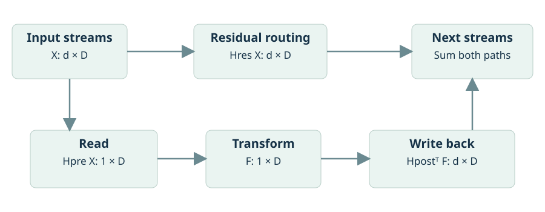
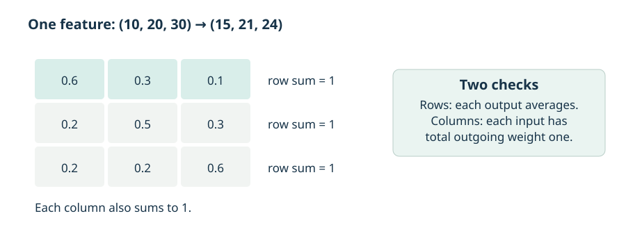
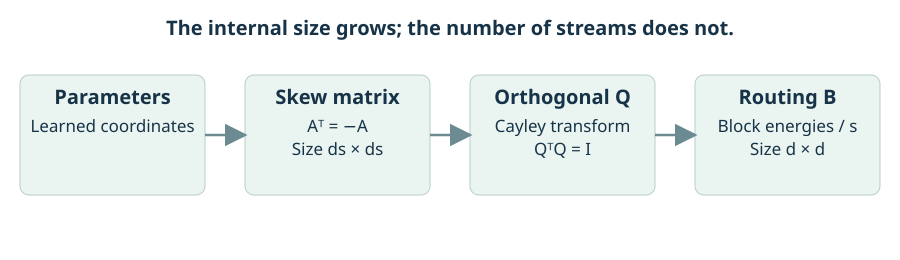
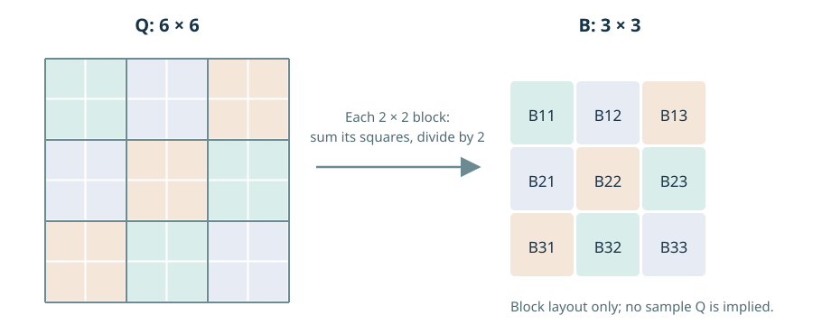

<!-- Generated from notes/pages/exact-residual-stream-mixing.html by npm run notes:export:readers. Edit the HTML source, not this export. -->

[]{#exact-residual-stream-mixing-through-generalized-orthostochastic-matrices}

Notebook / mHC

# Residual streams, exact mixing, and go-mHC

Start with a concrete routing problem, build a mixer that meets its constraints, and separate what the algebra guarantees from what experiments must establish.

Six connected learning units · Complete technical material · Illustrated reading edition

[]{#title-block-header}[]{#reading-guide}

Start with the question you have

## A connected route through the ideas {#reading-guide-title}

Read the six units in order for the full argument, or use the entry points below. Each unit begins with an explanation of the question it answers, then develops the original examples, derivations, and qualifications.

[**1. Start with the routing problem** --- Start this unit](#unit-route)

[**2. Understand the constraint and its limits** --- Start this unit](#unit-constraint)

[**3. Build the mixer from orthogonal blocks** --- Start this unit](#unit-geometry)

[**4. Choose a representation and a cost** --- Start this unit](#unit-choice)

[**5. Interpret spectra and experimental evidence** --- Start this unit](#unit-evidence)

[**6. Review the mathematics and test the construction** --- Start this unit](#unit-reference)

The reference sections can be opened when needed. Diagrams remain beside the explanations that use them; select "Enlarge diagram" for a closer view. Earlier section links still work.

**Keep the main distinctions in view**

d counts residual streams; D counts features; s sets the internal block size. A is skew-symmetric, Q is orthogonal, and B is the final routing matrix. The batch-size B used in the original tensor-shape notation is a separate quantity from the mixer B.

[]{#book-content}

## 1. Start with the routing problem {#unit-route}

Think of a residual stream as a feature vector that survives from one layer to the next. With one stream, the familiar update keeps that vector and adds a learned correction. With several streams, there is a new decision to make **before discussing the learned correction**: which old streams contribute to each new stream?

Fix one token in one batch item. Its state can be written as a matrix $X\in\mathbb{R}^{d\times D}$: one row per stream and one column per feature. A residual mixer $B\in\mathbb{R}^{d\times d}$ acts on the left, so $BX$ mixes streams without changing the feature dimension. The same routing weights apply to every feature coordinate in this local calculation. The layer may compute different weights from different activations; this notation describes one realized mixer.

There are two paths through a Hyper-Connection layer. The residual path mixes the existing streams directly. The learned branch first **reads** a combination of streams, applies the ordinary layer transformation, and then **writes** that result back to the streams. The two paths are added. Keeping these roles separate prevents a common mistake: the doubly stochastic constraint studied here belongs to the residual mixer, not automatically to every coefficient in the read--transform--write branch.

For a first numerical picture, let a single feature have values $x=(10,20,30)^\top$. The three-stream matrix in the worked example below produces $Bx=(15,21,24)^\top$. The first output is $0.6(10)+0.3(20)+0.1(30)=15$. Repeating that calculation for the other rows gives the other outputs. The sum remains $60$, but the three values are redistributed. We will explain the two constraints responsible for this behavior in the next unit.

This example is a **generic valid routing matrix**, not a claim that the particular matrix belongs to every go-mHC family. First understand what a mixer does; only then ask which mixers a parameterization can produce.

{loading="eager"}

### The problem: how should residual streams mix?

Residual connections make deep networks trainable by providing a path through which information and gradients can move without passing exclusively through a sequence of nonlinear transformations. In its simplest form, a residual update is

$$x_{l+1}=x_l+\mathcal{F}(x_l,W_l),$$

where $x_l$ is the state at layer $l$, $\mathcal{F}$ is a learned layer transformation, and $W_l$ denotes its parameters.

Hyper-Connections generalize this construction by maintaining several parallel residual streams rather than one. Let $d$ be the number of streams. A layer can then learn how to route information among those streams instead of using a fixed identity connection. This makes $d$ a possible capacity dimension, analogous in spirit to depth or width: increasing $d$ gives the model more pathways through which information may travel.

The central difficulty is that repeated unrestricted stream mixing can destabilize a network. If each layer applies an arbitrary mixing matrix, repeated products can amplify or attenuate components of the state and its gradients. Manifold-Constrained Hyper-Connections (mHC) address this by constraining the residual mixing matrix to be doubly stochastic \[Xie et al., 2026\].

The paper studied here proposes **go-mHC**, a direct parameterization of a family of exactly doubly stochastic matrices. Its purpose is to occupy a middle ground:

- more expressive than highly structured Kronecker-factorized mixers;
- less expensive than parameterizing arbitrary doubly stochastic matrices through all permutation matrices;
- exact by construction, rather than only approximately satisfying the constraint after iterative normalization.

The construction rests on generalized orthostochastic matrices \[Gutkin, 2013; Nechita et al., 2023\].

------------------------------------------------------------------------

### From residual connections to Hyper-Connections

A Hyper-Connection layer operates on a multi-stream state

$$\mathbf{x}_l\in\mathbb{R}^{d\times B\times L\times D},$$

where, conventionally:

- $d$: number of residual streams;
- $B$: batch size;
- $L$: sequence length;
- $D$: hidden-feature dimension.

The layer update is

$$\mathbf{x}_{l+1}
=
\mathcal{H}_{l}^{\mathrm{res}}\mathbf{x}_{l}
+
\left(\mathcal{H}_{l}^{\mathrm{post}}\right)^\top
\mathcal{F}\!\left(
\mathcal{H}_{l}^{\mathrm{pre}}\mathbf{x}_{l},
\mathbf{W}_l
\right).
\tag{1}$$

The three routing terms have distinct roles:

$$\mathcal{H}_{l}^{\mathrm{res}}\in\mathbb{R}^{d\times d}$$

mixes the residual streams directly,

$$\mathcal{H}_{l}^{\mathrm{pre}}\in\mathbb{R}^{1\times d}$$

aggregates streams before the layer transformation, and

$$\mathcal{H}_{l}^{\mathrm{post}}\in\mathbb{R}^{1\times d}$$

distributes the transformed branch output back across streams.

The ordinary single-stream residual architecture is recovered when $d=1$ and all three operators equal $[1]$.

The pre- and post-routing operators may be computed dynamically from normalized activations. The supplied formulation uses

$$\mathbf{x}'_l=\operatorname{RMSNorm}(\mathbf{x}_l),
\tag{2}$$

$$\mathcal{H}_{l}^{\mathrm{pre}}
=
\sigma\!\left(
\alpha_l^{\mathrm{pre}}
\mathbf{x}'_l
\mathbf{W}_l^{\mathrm{pre}}
+
\mathbf{b}_l^{\mathrm{pre}}
\right),
\tag{3}$$

$$\mathcal{H}_{l}^{\mathrm{post}}
=
2\sigma\!\left(
\alpha_l^{\mathrm{post}}
\mathbf{x}'_l
\mathbf{W}_l^{\mathrm{post}}
+
\mathbf{b}_l^{\mathrm{post}}
\right).
\tag{4}$$

The central question is how to define the residual-stream matrix $\mathcal{H}_l^{\mathrm{res}}$.

------------------------------------------------------------------------

### A worked stream-mixing example

Consider $d=3$ residual streams. A general doubly stochastic mixing matrix might be

$$B=
\begin{pmatrix}
0.6 & 0.3 & 0.1\\
0.2 & 0.5 & 0.3\\
0.2 & 0.2 & 0.6
\end{pmatrix}.$$

Every row and column sums to $1$. If the current streams are $x^{(1)},x^{(2)},x^{(3)}$, then the new first stream is

$$\widetilde{x}^{(1)}
=
0.6x^{(1)}
+
0.3x^{(2)}
+
0.1x^{(3)}.$$

Likewise,

$$\widetilde{x}^{(2)}
=
0.2x^{(1)}
+
0.5x^{(2)}
+
0.3x^{(3)}.$$

The matrix is neither the identity nor a deterministic permutation. It performs a soft redistribution of information while conserving total routing mass.

A permutation matrix instead gives hard routing. For example,

$$P=
\begin{pmatrix}
0&1&0\\
0&0&1\\
1&0&0
\end{pmatrix}$$

implements the cycle

$$1\to 3,\qquad 2\to 1,\qquad 3\to 2.$$

This example exposes a limitation of restrictive factorized constructions: a parameterization built only from $2\times 2$ real-spectrum factors may fail to express such a three-cycle. The cycle has nonreal cube roots of unity among its eigenvalues, whereas $2\times
2$ doubly stochastic factors have only real nontrivial eigenvalues.

------------------------------------------------------------------------

## 2. Understand the constraint and its limits {#unit-constraint}

Two distinct conservation statements are hidden in the phrase "doubly stochastic." A row sum of one says that each output is a weighted average of input streams. A column sum of one says that, across all outputs, each input contributes total weight one. Nonnegativity makes "weighted average" the right description rather than an arbitrary signed cancellation.

The distinction is easiest to see with a counterexample. The matrix

$$B_{\mathrm{row}}=\begin{pmatrix}1&0\\1&0\end{pmatrix}$$

has row sums one, yet sends $(2,10)^\top$ to $(2,2)^\top$. Both outputs copy the first input; the second input disappears. Its column sums are $2$ and $0$, so it is not doubly stochastic. Checking only the rows misses the problem.

For a doubly stochastic mixer and any real feature vector $x$,

$$\mathbf 1^\top Bx=\mathbf 1^\top x,
\qquad
B(c\mathbf 1)=c\mathbf 1.$$

The first identity preserves the sum across streams for that feature. The second preserves a feature that already has the same value in every stream. These are algebraic identities, so they do not require the feature values themselves to be nonnegative.

### Non-amplification is not preservation of every direction {#explanation-constraint-non-amplification-is-not-preservation-of-every-direction}

Consider the averaging mixer

$$J=\frac12\begin{pmatrix}1&1\\1&1\end{pmatrix}.$$

It preserves $(1,1)^\top$, but sends $(1,-1)^\top$ to zero. It is exactly doubly stochastic and still destroys the difference between the streams. Therefore the constraint does **not** promise that all information survives, or that gradients cannot vanish in any direction. It controls amplification by the realized residual-routing operator; it does not give a positive lower bound on every singular value.

The norm statements below can also be read directly. Each output coordinate is an average, so $\|Bx\|_\infty\leq\|x\|_\infty$. Column sums and the triangle inequality give $\|Bx\|_1\leq\|x\|_1$. These bounds survive products of doubly stochastic mixers. They are useful guarantees, but they do not include the derivative of an activation-dependent mixer, the learned branch, normalization, or the entire network Jacobian.

### What "exact" means in an implementation {#explanation-constraint-what-exact-means-in-an-implementation}

Exact-by-construction describes the real-arithmetic formula. A floating-point implementation still has rounding and linear-solve errors. Test row and column residuals numerically rather than expecting literal bitwise equality to one. The advantage is that there is no separate finite-iteration normalization error to trade against a stopping budget; ordinary numerical error still needs to be measured.

{loading="eager"}

### Why constrain the residual mixer?

With unconstrained Hyper-Connections, $\mathcal{H}_l^{\mathrm{res}}$ can in principle be any learned matrix. This permits flexible routing but removes an explicit identity-like guarantee.

Repeated application yields a cumulative routing operator

$$\mathcal{H}_{l\to L}^{\mathrm{res}}
=
\prod_{i=1}^{L-l}
\mathcal{H}_{L-i}^{\mathrm{res}}.
\tag{5}$$

If the factors are unrestricted, this product can have directions that grow or shrink rapidly. Such amplification or contraction can contribute to exploding or vanishing gradients.

mHC constrains residual mixing toward the Birkhoff polytope using finite Sinkhorn--Knopp normalization. Sinkhorn normalization alternates row and column rescaling of a nonnegative matrix. The supplied formulation uses twenty iterations.

This gives two practical concerns:

1.  the iterative projection may require specialized implementation for efficiency;
2.  a finite number of iterations need not produce an exactly doubly stochastic matrix.

A small violation at each layer may compound across depth. Exact parameterizations seek to eliminate this particular source of accumulated constraint error.

------------------------------------------------------------------------

### Stability and cumulative mixing

For any nonnegative doubly stochastic matrix $B$,

$$\max_i\sum_j|B_{ij}|=1,
\qquad
\max_j\sum_i|B_{ij}|=1.$$

These are the induced $\ell_\infty$ and $\ell_1$ operator norms. The paper describes forward and backward Amax Gain Magnitude quantities as

$$\operatorname{AGM}^{\mathrm{fwd}}
\left(
\mathcal{H}_{l\to L}^{\mathrm{res}}
\right)
=
\max_i
\sum_j
\left|
\left(
\mathcal{H}_{l\to L}^{\mathrm{res}}
\right)_{ij}
\right|,
\tag{11}$$

and

$$\operatorname{AGM}^{\mathrm{bwd}}
\left(
\mathcal{H}_{l\to L}^{\mathrm{res}}
\right)
=
\max_j
\sum_i
\left|
\left(
\mathcal{H}_{l\to L}^{\mathrm{res}}
\right)_{ij}
\right|.
\tag{12}$$

If each residual mixer belongs to $\mathsf{B}_d$, then their product remains in $\mathsf{B}_d$. Indeed, for doubly stochastic $A$ and $B$,

$$(AB)\mathbf{1}
=
A(B\mathbf{1})
=
A\mathbf{1}
=
\mathbf{1},$$

and similarly,

$$(AB)^\top\mathbf{1}
=
B^\top A^\top \mathbf{1}
=
B^\top\mathbf{1}
=
\mathbf{1}.$$

Nonnegativity is also preserved under matrix multiplication.

Therefore exact doubly stochastic mixing guarantees that the cumulative routing operator remains doubly stochastic at arbitrary depth. This explains why AGM does not distinguish exact methods such as go-mHC, mHC-lite, and KromHC: all satisfy the same relevant row- and column-sum property.

It does **not** prove that the methods have equal optimization behavior, equal representational capacity, or equal real-world training performance. For those comparisons, the paper turns to expressivity and convergence.

------------------------------------------------------------------------

## 3. Build the mixer from orthogonal blocks {#unit-geometry}

We now have a specification: produce a nonnegative matrix whose rows and columns sum to one. go-mHC meets that specification indirectly. It first builds an orthogonal matrix, whose rows and columns have known squared lengths, and then converts those squared lengths into nonnegative routing weights.

The sizes matter. There are $d$ actual residual streams. The orthogonal construction uses $ds$ internal coordinates, grouped into $d$ blocks of $s$ coordinates. Those extra coordinates parameterize the mixer; they are not $ds$ residual streams carried through the network. After taking one normalized squared norm per block, the output is again a $d\times d$ matrix.

### Why divide a block energy by its size? {#explanation-geometry-why-divide-a-block-energy-by-its-size}

For $s=1$, every row of an orthogonal matrix has squared length one. For larger $s$, a block row contains $s$ ordinary orthogonal rows, each contributing one unit of squared length. The total squared energy in the whole block row is therefore $s$. Dividing its block energies by $s$ makes the corresponding routing row sum to one. The column argument is the same. The proof below formalizes precisely this accounting argument.

Notice what is discarded by the final map. The orthogonal matrix contains signs and relationships between internal coordinates. The routing matrix retains only block energies. Many different orthogonal matrices can therefore produce the same mixer. Orthogonality of the internal matrix does **not** imply that the final mixer preserves vector length.

### Follow one parameter all the way to a mixer {#explanation-geometry-follow-one-parameter-all-the-way-to-a-mixer}

Take $d=2$, $s=1$, and

$$A=\begin{pmatrix}0&1/3\\-1/3&0\end{pmatrix}.$$

The Cayley transform gives

$$Q=(I-A)(I+A)^{-1}
=\begin{pmatrix}0.8&-0.6\\0.6&0.8\end{pmatrix}.$$

Each row has squared length $0.8^2+0.6^2=1$, and their inner product is zero. Squaring the entries gives

$$B=\begin{pmatrix}0.64&0.36\\0.36&0.64\end{pmatrix}.$$

For $x=(2,10)^\top$, the mixed feature values are $(4.88,7.12)^\top$. Their sum is still $12$. The negative entry of $Q$ causes no negative routing weight because the final map squares it. This is a complete small instance of the construction---not a numerical projection onto the constraint set.

### The Cayley chart has a boundary {#explanation-geometry-the-cayley-chart-has-a-boundary}

A real skew-symmetric $A$ cannot make $I+A$ singular. If $(I+A)v=0$, multiplying by $v^\top$ gives $\|v\|_2^2+v^\top Av=0$. Skew-symmetry makes the second term zero, so $v=0$.

Nevertheless, a finite Cayley parameterization does not cover every orthogonal matrix: its output cannot have eigenvalue $-1$, because $I+Q=2(I+A)^{-1}$ is invertible. Thus the full family obtained by allowing **all** orthogonal matrices and the finite Cayley chart used to parameterize them must not be casually identified. Nor does connectedness of a parameter space prove that gradient descent reaches any desired target. The construction, the representable family, and the behavior of an optimizer are three separate questions.

{loading="eager"}

### Orthostochastic matrices

A matrix $B\in\mathsf{B}_d$ is **orthostochastic** if there exists an orthogonal matrix $Q\in\mathbb{R}^{d\times d}$ such that

$$B_{ij}=Q_{ij}^{\,2}.
\tag{6}$$

Because squares are nonnegative, $B_{ij}\geq 0$. Orthogonality gives

$$\sum_j Q_{ij}^2=1
\quad\text{and}\quad
\sum_i Q_{ij}^2=1,$$

so the squared-entry matrix is doubly stochastic.

For $d>2$, the orthostochastic matrices form a proper, nonconvex subset of $\mathsf{B}_d$. They include permutation matrices but do not generally fill the polytope interior.

This produces the central idea behind go-mHC:

- ordinary orthostochastic matrices correspond to $s=1$;
- a block generalization indexed by $s$ expands the representable family;
- as $s\to\infty$, that family approaches the full Birkhoff polytope.

------------------------------------------------------------------------

### Generalized orthostochastic matrices

{loading="eager"}

Let

$$Q\in\mathcal{Q}(ds)$$

be an orthogonal $ds\times ds$ matrix. Partition it into a $d\times
d$ block matrix, with each block

$$Q_{ij}\in\mathbb{R}^{s\times s}.$$

Define the block-energy map

$$\Phi_{d,s}(Q)_{ij}
=
\frac{1}{s}\lVert Q_{ij}\rVert_F^2
=
\frac{1}{s}
\sum_{k=1}^{s}
\sum_{r=1}^{s}
(Q_{ij})_{kr}^2.
\tag{7}$$

Here $\lVert\cdot\rVert_F$ denotes the Frobenius norm:

$$\lVert M\rVert_F^2=\sum_{a,b}M_{ab}^2.$$

Thus $\Phi_{d,s}(Q)_{ij}$ is the normalized squared energy carried by block $Q_{ij}$.

#### Proposition: $\Phi_{d,s}(Q)$ is doubly stochastic

For every orthogonal $Q\in\mathcal{Q}(ds)$,

$$\Phi_{d,s}(Q)\in\mathsf{B}_d.$$

##### Proof sketch

Fix a block row $i$. Since $Q$ is orthogonal,

$$\sum_{j=1}^{d}Q_{ij}Q_{ij}^{\top}=I_s.$$

Taking traces gives

$$\sum_{j=1}^{d}\lVert Q_{ij}\rVert_F^2
=
\operatorname{tr}(I_s)
=
s.$$

Therefore,

$$\sum_{j=1}^{d}\Phi_{d,s}(Q)_{ij}
=
\frac{1}{s}
\sum_{j=1}^{d}
\lVert Q_{ij}\rVert_F^2
=
1.$$

The same argument applied to block columns gives

$$\sum_{i=1}^{d}\Phi_{d,s}(Q)_{ij}=1.$$

Finally, every entry is nonnegative because it is a squared norm. Hence $\Phi_{d,s}(Q)$ is doubly stochastic. $\square$

When $s=1$, every block is a scalar and equation (7) becomes equation (6). Thus ordinary orthostochastic matrices are the $s=1$ case.

A result attributed to Nechita et al. \[2023\] states that the family

$$\left\{
\Phi_{d,s}(Q):Q\in\mathcal{Q}(ds)
\right\}$$

lies inside $\mathsf{B}_d$ for every $s$, and approaches the full Birkhoff polytope as $s\to\infty$.

This is an asymptotic coverage statement. It does **not** imply that every finite $s$ represents every doubly stochastic matrix.

------------------------------------------------------------------------

### The go-mHC construction

go-mHC replaces iterative Sinkhorn projection with a direct sequence of maps.

First, learned parameters form a vector that is reshaped into a skew-symmetric matrix:

$$A_l
=
\operatorname{skew}
\left(
\alpha_l^{\mathrm{res}}
\mathbf{x}'_l
\mathbf{W}_l^{\mathrm{res}}
+
\mathbf{b}_l^{\mathrm{res}}
\right),
\tag{8}$$

where

$$A_l^\top=-A_l,
\qquad
A_l\in\mathbb{R}^{ds\times ds}.$$

The number of independent entries is

$$\frac{ds(ds-1)}{2}.$$

Second, go-mHC applies the Cayley transform:

$$Q_l
=
(I-A_l)(I+A_l)^{-1}.
\tag{9}$$

The output $Q_l$ is orthogonal.

Third, it maps block energies into stream-routing weights:

$$\mathcal{H}_l^{\mathrm{res}}
=
\Phi_{d,s}(Q_l).
\tag{10}$$

Because $\Phi_{d,s}(Q_l)\in\mathsf{B}_d$, the resulting residual mixer is doubly stochastic exactly, for every valid parameter value.

The full path is therefore

$$\text{unconstrained learned parameters}
\longrightarrow
A_l^\top=-A_l
\longrightarrow
Q_l^\top Q_l=I
\longrightarrow
\mathcal{H}_l^{\mathrm{res}}\in\mathsf{B}_d.$$

This differs fundamentally from iterative normalization:

- Sinkhorn begins with a matrix and repeatedly corrects it toward the constraint;
- go-mHC parameterizes a matrix family that satisfies the constraint by construction.

------------------------------------------------------------------------

## 4. Choose a representation and a cost {#unit-choice}

Once several methods all meet the same row and column constraints, "which method is stable?" is too coarse a question. Compare three things separately: the set of routing matrices available, the cost of producing one of them, and the behavior of the optimization that chooses among them.

mHC-lite starts from deterministic routings and blends them. A Kronecker construction builds a large routing pattern from smaller factors. go-mHC builds an internal orthogonal matrix and measures its block energies. These are different restrictions on the **representation** of a mixer, even when their outputs satisfy the same constraints.

The factorial cost described below belongs to the parameterization that assigns a component to every permutation. The Birkhoff--von Neumann theorem itself does not require an implementation to enumerate all permutations in order to describe a particular target. It is the chosen learnable full enumeration that incurs that cost.

Increasing $s$ enlarges the internal construction from $ds$ coordinates to a larger system. At $d=4$, the skew generator has $6$, $28$, or $66$ independent entries for $s=1,2,3$, respectively. This is a useful concrete scale before reading the complete parameter-count formulas. Those formulas also include the network that predicts the generator, so the generator count alone is not the layer's total parameter count.

Treat block size as a hypothesis to test, not a default quality score. A larger internal matrix may reduce representation error but costs more to construct and differentiate. Better geometric coverage does not guarantee that a fixed optimizer, initialization, and training budget will exploit it.

The practical comparison should hold the task, stream count, precision, optimization budget, and hardware conditions fixed. Report constraint residuals and target-reconstruction error separately from elapsed time. A loss curve against optimization steps answers a different question from a loss curve against wall-clock time.

### Existing exact alternatives

#### mHC-lite: complete coverage at factorial cost

mHC-lite uses the Birkhoff--von Neumann representation. Because every doubly stochastic matrix is a convex combination of permutation matrices, mHC-lite can in principle cover the full Birkhoff polytope.

Its cost is the number of permutations:

$$d!.$$

The source reports a parameter cost on the order of

$$\mathcal{O}(dC\cdot d!),$$

where $C$ is a model-dependent feature or projection cost. This is exact and expressive, but factorial growth makes it unsuitable for large $d$.

#### KromHC: efficient factorization with restricted routing

KromHC constructs a large mixer using Kronecker products of smaller doubly stochastic matrices. For matrices

$$A\in\mathbb{R}^{m\times n},
\qquad
B\in\mathbb{R}^{p\times q},$$

the Kronecker product $A\otimes B$ is an $mp\times nq$ block matrix whose $(i,j)$-th block is $A_{ij}B$.

If the factors are doubly stochastic, their Kronecker product is also doubly stochastic. This gives exact constraint satisfaction with a highly structured parameterization.

The cost is lower, but the structure strongly limits which large mixing matrices can be represented. The paper's key criticism is spectral: products of small factors need not acquire the rich complex spectral behavior available to general matrices in $\mathsf{B}_d$.

go-mHC is intended to improve this trade-off: it is more expressive than a small-factor Kronecker construction while avoiding factorial enumeration.

------------------------------------------------------------------------

### The role of the block size \\(s\\)

The parameter $s$ controls the block size in the orthogonal matrix $Q$.

- **$s=1$:** ordinary orthostochastic matrices;
- **larger $s$:** more orthogonal degrees of freedom before block energies are aggregated;
- **$s\to\infty$:** asymptotic approach to the full Birkhoff polytope.

The paper uses $s=2$ as its principal default and compares it with $s=1$ and $s=3$.

This produces a direct efficiency--expressivity dial.

#### Smaller $s$

Smaller $s$ gives fewer parameters and lower computation. At $s=1$, a $d\times d$ skew-symmetric generator has only

$$\frac{d(d-1)}{2}$$

independent parameters.

But $s=1$ is restricted to the orthostochastic subset. For $d>2$, this subset does not fill the interior of $\mathsf{B}_d$.

#### Larger $s$

Larger $s$ gives a broader family of generalized orthostochastic matrices. The source reports that increasing $s$ yields denser spectral coverage, with $s=2$ covering a larger region than $s=1$.

The trade-off is that the orthogonal matrix has size $ds\times ds$, so linear algebra on it becomes more expensive.

------------------------------------------------------------------------

### Complexity trade-offs

Let:

- $d$: number of residual streams;
- $C$: a model-dependent channel or projection-cost factor;
- $s$: generalized-orthostochastic block size;
- $S$: number of Sinkhorn iterations;
- $i_k$: Kronecker factor size.

#### Parameter counts

The source gives the following total parameter-count forms:

$$\text{mHC}
=
(dC+1)d^2+2d^2C+2d+3,$$

$$\text{go-mHC}(s)
=
(dC+1)\frac{ds(ds-1)}{2}
+
2d^2C+2d+3,$$

$$\text{mHC-lite}
=
(dC+1)d!
+
2d^2C+2d+3,$$

$$\text{KromHC}
=
(dC+1)\sum_{k=1}^{K}(i_k!)
+
2d^2C+2d+3.$$

For fixed $s$ and $C$, the dominant go-mHC term is cubic in $d$:

$$\mathcal{O}(d^3).$$

mHC-lite instead has factorial dependence on $d$.

#### FLOP complexity

The source gives per-layer asymptotic FLOP costs:

$$\text{mHC}
=
\mathcal{O}(CSd^2),$$

$$\text{go-mHC}(s)
=
\mathcal{O}(Cs^3d^3),$$

$$\text{mHC-lite}
=
\mathcal{O}(Cd^2d!),$$

$$\text{KromHC}
=
\mathcal{O}
\left(
C\log_{i_k}(d)i_k^2(i_k!)
+
Cd^2
\right).$$

The principal comparison is therefore not "fast versus slow" in isolation.

- mHC-lite gives broad exact coverage but grows factorially.
- KromHC is highly efficient but structurally restricted.
- mHC may have lower nominal polynomial order but requires iterative projection.
- go-mHC pays cubic dependence on $d$ to obtain an exact, direct, and more expressive constrained family.

For the source's nominal illustrative setting,

$$S=20,
\qquad
i_k=2,
\qquad
s\in\{1,2\}.$$

These are configuration choices, not universal constants. Measured runtime also depends on memory traffic, batch size, tensor layout, linear-solve implementation, and hardware parallelism.

------------------------------------------------------------------------

### Combining go-mHC and KromHC

The paper presents go-mHC and KromHC as complementary rather than mutually exclusive.

A possible combined strategy is:

1.  use Kronecker factorization to represent a large stream-mixing structure efficiently;
2.  use generalized orthostochastic factors rather than only small conventional doubly stochastic factors;
3.  increase factor size $i_k$ without immediately paying a factorial $i_k!$ cost.

The reported intuition is that factorized structure controls large-scale computation, while go-mHC enlarges the local family of exact doubly stochastic transformations available inside each factor.

This does not eliminate the fundamental restrictions of factorization. It changes the trade-off by making each factor more expressive.

------------------------------------------------------------------------

## 5. Interpret spectra and experimental evidence {#unit-evidence}

An eigenvalue describes what a fixed linear mixer does to one mode under repeated application. An eigenvalue of one preserves the mode. A real eigenvalue with magnitude below one damps it; a negative one also alternates its sign. A nonreal conjugate pair describes a two-dimensional real subspace with rotational behavior. These statements concern repeated application of a fixed operator, not a complete nonlinear language model.

The spectral obstruction in the discussion below can be made dimensionally explicit. To compare with a $2\times2$ Kronecker factorization, embed a three-cycle in four streams:

$$C_4=\begin{pmatrix}
0&1&0&0\\
0&0&1&0\\
1&0&0&0\\
0&0&0&1
\end{pmatrix}.$$

This matrix cycles three streams and leaves the fourth fixed. Its eigenvalues are $1,1,e^{2\pi i/3},e^{4\pi
i/3}$. By contrast, a mixer of the form $A\otimes B$, with two $2\times2$ doubly stochastic factors, has only real eigenvalues. That particular factorization cannot represent $C_4$. This is an obstruction for the stated mixer family, not a theorem that any larger architecture using small factors can never perform cyclic computation.

The synthetic experiment asks a different question: given inputs and outputs generated by a known matrix, can optimization learn the transformation? A useful interpretation separates three sources of loss: noise in the targets, a target outside the representable family, and failure of the optimizer to find a good point inside that family. Reaching a noise floor on a sampled task is evidence for that task; it does not prove every matrix is representable or every training problem is easy.

Read the evidence in three layers. The nonnegativity and row/column identities are algebra. Spectral plots and reconstruction curves are measurements under a specified sampling and optimization procedure. A claim about better language models requires language-model results and an appropriate compute comparison. Keeping these layers separate makes the paper's useful construction easier to assess without making it carry a stronger claim than the evidence supports.

### Spectral reach as an expressivity surrogate

The full volume of the Birkhoff polytope is difficult to use directly as an expressivity measure. The paper therefore evaluates **spectral reach**: the set of eigenvalues obtainable from matrices produced by a given parameterization.

For a method $\mathsf{M}$ with map $\mathcal{P}_{\mathsf{M}}$, the spectral reach concerns eigenvalues $\lambda\in\mathbb{C}$ such that

$$H^{\mathrm{res}}v=\lambda v,
\qquad
v\neq 0,
\qquad
H^{\mathrm{res}}=\mathcal{P}_{\mathsf{M}}(\cdots).
\tag{13}$$

The relevant ambient region is the **Karpelevič region**: the set of complex eigenvalues attainable by stochastic matrices of a given dimension.

Because doubly stochastic matrices are stochastic, their eigenvalues must lie in this region. A method with broader spectral reach can realize a broader range of decay, persistence, oscillation, and cyclic behavior under repeated application.

This is a useful surrogate, but it has an important limitation:

> Broad spectral coverage does not prove that every doubly stochastic matrix is representable.

Different matrices can share eigenvalues. Thus spectral reach is evidence about dynamic diversity, not a complete volume or coverage proof.

#### Reported qualitative findings

For $d=3$, the source reports that:

- $s=1$ covers a substantial spectral region, including the real interval $[-1,1]$, but leaves an error gap $\epsilon(s=1)$;
- $s=2$ covers a larger region with smaller reported gap,

$$\epsilon(s=2)<\epsilon(s=1).$$

For $d=4$, the reported comparison is:

- finite-iteration mHC can contain points outside the desired doubly stochastic region;
- mHC-lite nearly fills the boundary-compatible region;
- KromHC occupies only a highly restricted slice;
- go-mHC with $s=1$ covers a sizable but incomplete region;
- go-mHC with $s=2$ fills a larger and denser region.

These are empirical spectral observations, not proofs of exact finite-$s$ polytope coverage.

------------------------------------------------------------------------

### Why Kronecker products have a spectral limitation

Let $A$ and $B$ have eigenvalues $\lambda_A$ and $\lambda_B$, respectively. The eigenvalues of the Kronecker product $A\otimes B$ are pairwise products:

$$\lambda(A\otimes B)
=
\left\{
\lambda_i(A)\lambda_j(B)
\right\}_{i,j}.$$

For a $2\times 2$ doubly stochastic matrix, the spectrum has the form

$$\{1,\lambda\},
\qquad
\lambda\in[-1,1].$$

Thus if

$$\operatorname{spec}(A)=\{1,\lambda_A\},
\qquad
\operatorname{spec}(B)=\{1,\lambda_B\},$$

then

$$\operatorname{spec}(A\otimes B)
=
\{
1,\lambda_A,\lambda_B,\lambda_A\lambda_B
\}.
\tag{14}$$

All four values remain real and lie in $[-1,1]$.

This has a direct consequence: repeated Kronecker composition from $2\times 2$ doubly stochastic factors cannot generate genuinely complex eigenvalues. It therefore cannot represent dynamics that require nonreal eigenvalues, including directed cyclic behavior such as a three-cycle.

A three-cycle has eigenvalues

$$1,
\qquad
e^{2\pi i/3},
\qquad
e^{4\pi i/3}.$$

The latter two are nonreal. Hence a real-spectrum $2\times 2$-factor construction cannot represent that cycle exactly.

The limitation is not merely aesthetic. In a recurrently applied mixing operator:

- real eigenvalues correspond to non-oscillatory expansion, contraction, or sign reversal;
- complex eigenvalues permit rotational or cyclic components.

The paper interprets this as a distinction between diffusion-like mixing and directed, advective, or periodic routing behavior.

------------------------------------------------------------------------

### Synthetic reconstruction experiment

The controlled experiment constructs:

- ground-truth doubly stochastic matrices $T_i$;
- dense residual-stream activations $X_j$;
- noisy targets

$$Y_{i,j}=T_iX_j+\xi,
\tag{15}$$

where $\xi$ is noise.

A learned parameterization is evaluated by how well it reconstructs the transformation that generated $Y_{i,j}$.

This is a useful design because the target transformation is known. Reconstruction error can therefore isolate whether the parameterization can reach and optimize toward the intended stream-mixing map.

The abstract reports that go-mHC reaches the minimum theoretical loss on synthetic stream-mixing tasks and converges up to $10\times$ faster than the compared parameterizations. This should be read as an experimental result under the source paper's task construction and optimization configuration, not as a universal convergence theorem for all architectures and datasets.

The paper also reports validation in a GPT-style language model with approximately $30$ million parameters. A GPT-style model is an autoregressive Transformer that predicts each token from preceding context using causally masked self-attention.

------------------------------------------------------------------------

### What is theoretically established, empirically observed, and still uncertain?

#### Theoretical or algebraic facts

The following statements follow from the construction or stated mathematical results:

1.  If $Q$ is orthogonal, then $\Phi_{d,s}(Q)$ is doubly stochastic.
2.  At $s=1$, generalized orthostochastic matrices reduce to ordinary orthostochastic matrices.
3.  Products of doubly stochastic matrices remain doubly stochastic.
4.  The generalized orthostochastic family is contained in $\mathsf{B}_d$.
5.  The cited result of Nechita et al. states asymptotic approach to $\mathsf{B}_d$ as $s\to\infty$.
6.  Kronecker-product eigenvalues are products of factor eigenvalues.

#### Experimental observations reported by the source

The following are reported results rather than consequences of the definitions:

1.  increasing $s$ improves observed spectral coverage;
2.  $s=2$ has a smaller reported spectral gap than $s=1$ in the illustrated setting;
3.  go-mHC reaches the reported theoretical minimum on the synthetic task;
4.  go-mHC converges up to $10\times$ faster in the reported synthetic comparisons;
5.  the method was tested in a $30$M-parameter GPT-style language model.

#### Four important open or incomplete points

1.  **Finite-$s$ coverage bounds.**\
    The source states that the generalized family approaches the full Birkhoff polytope as $s\to\infty$, but the supplied material does not provide a practical bound on the approximation error $\epsilon(s)$ for finite $d$ and finite $s$.

2.  **Convergence guarantees versus representability.**\
    The paper refers to proofs concerning coverage, path connectedness, and gradient stability in an appendix. Those proofs are not included here. In particular, a claim that every admissible target can be reached must be interpreted carefully for fixed finite $s$, because finite-$s$ generalized orthostochastic families can remain strict subsets of $\mathsf{B}_d$.

3.  **Spectral reach is incomplete as an expressivity metric.**\
    Spectral coverage can reveal important restrictions, especially the inability to represent cyclic modes, but it cannot establish full matrix-space coverage. Nonidentical matrices can have identical spectra.

4.  **Implementation-level and language-model evidence is incomplete in the supplied material.**\
    The source states that no custom CUDA kernels are required and reports a $30$M GPT-style validation, but the complete hyperparameters, measured language-model outcomes, hardware conditions, and reproducibility details are not available in the material presented here.

------------------------------------------------------------------------

### Conclusion

go-mHC reframes constrained residual-stream mixing as a composition of geometric maps:

$$\text{learned parameters}
\longrightarrow
\text{skew-symmetric generator}
\longrightarrow
\text{orthogonal block matrix}
\longrightarrow
\text{doubly stochastic stream mixer}.$$

Its central advantage is exactness by construction. The block-energy map $\Phi_{d,s}$ converts an orthogonal matrix into a valid doubly stochastic routing matrix without iterative Sinkhorn normalization.

The parameter $s$ is the essential design variable. It interpolates between the restricted orthostochastic regime at $s=1$ and increasingly expressive generalized orthostochastic families as $s$ grows. This permits a controlled compromise between computational cost and reachable stream-routing behavior.

Relative to mHC-lite, go-mHC avoids factorial enumeration of permutation matrices. Relative to KromHC, it can represent a broader family of spectral and routing behaviors. Relative to finite-step Sinkhorn-based mHC, it provides an exact direct map, though its cubic dependence on stream count creates a separate computational cost.

The strongest conceptual lesson is that residual-stream capacity is not determined only by the number of streams. It is also determined by the geometry of the matrix family allowed to mix them.

## 6. Review the mathematics and test the construction {#unit-reference}

The main route has used four mathematical ideas: weighted averages, orthogonal matrices, blockwise squared norms, and eigenmodes. The original prerequisites are collected here for a slower review, followed by the exercises and references. Open the part you need; there is no need to restart the whole article because one symbol is unfamiliar.

### A small numerical audit {#explanation-reference-a-small-numerical-audit}

The following NumPy example implements the map with a linear solve rather than forming an explicit inverse. Rows of blocks are the output streams; columns of blocks are the input streams.

[]{#cb1}

    import numpy as np

    def residual_mixer(raw, streams, block_size):
        n = streams * block_size
        raw = np.asarray(raw, dtype=float)
        if raw.shape != (n, n):
            raise ValueError("raw must have shape (streams * block_size,) * 2")
        A = (raw - raw.T) / 2
        identity = np.eye(n)
        Q = np.linalg.solve((identity + A).T, (identity - A).T).T
        blocks = Q.reshape(streams, block_size, streams, block_size)
        B = np.sum(blocks * blocks, axis=(1, 3)) / block_size
        return Q, B

    A = np.array([[0, 1/3], [-1/3, 0]])
    Q, B = residual_mixer(A, streams=2, block_size=1)
    assert np.allclose(Q.T @ Q, np.eye(2))
    assert np.all(B >= 0)
    assert np.allclose(B.sum(axis=0), 1)
    assert np.allclose(B.sum(axis=1), 1)
    assert np.allclose(B, [[0.64, 0.36], [0.36, 0.64]])
    assert np.allclose(B @ [2, 10], [4.88, 7.12])

These checks test the construction, not training performance. A training implementation must also test differentiation through the solve, its chosen precision, and its initialization. In particular, at $A=0$, the squared-entry map has zero first-order change: off-diagonal entries of $Q$ begin at zero and are squared, while the diagonal has no first-order skew perturbation. Identity initialization is therefore not automatically a useful initialization for learning the residual mixer.

**Mathematical prerequisites**

### Mathematical prerequisites

#### Doubly stochastic matrices

A square matrix $B\in\mathbb{R}^{d\times
d}$ is **doubly stochastic** if:

1.  $B_{ij}\geq 0$ for every $i,j$;
2.  every row sums to one;
3.  every column sums to one.

Equivalently, if $\mathbf{1}\in\mathbb{R}^d$ is the all-ones vector, then

$$B\mathbf{1}=\mathbf{1},
\qquad
B^\top\mathbf{1}=\mathbf{1}.$$

The set of all $d\times d$ doubly stochastic matrices is the **Birkhoff polytope**, denoted

$$\mathsf{B}_d.$$

A doubly stochastic matrix may be interpreted as a conservative routing rule. Each output stream receives a nonnegative weighted combination of input streams, and each input stream distributes one unit of total mass across the outputs.

This does not mean every individual feature is preserved. Rather, it means the routing matrix cannot arbitrarily create or destroy total stream mass in the $\ell_1$-style row and column senses.

#### Permutation matrices and the Birkhoff--von Neumann theorem

A **permutation matrix** has exactly one entry equal to $1$ in every row and every column, with all other entries equal to $0$. It represents deterministic routing: each input stream is sent to exactly one output stream.

The Birkhoff--von Neumann theorem states:

> Every doubly stochastic matrix is a convex combination of permutation matrices.

Thus any $B\in\mathsf{B}_d$ can be written as

$$B=\sum_{\pi\in S_d}w_\pi P_\pi,
\qquad
w_\pi\geq 0,
\qquad
\sum_{\pi\in S_d}w_\pi=1,$$

where $S_d$ is the set of all $d!$ permutations and $P_\pi$ is the associated permutation matrix.

This theorem gives an exact parameterization of $\mathsf{B}_d$, but it creates a severe scaling problem: there are $d!$ permutation matrices. At $d=8$,

$$8!=40{,}320.$$

A representation that assigns a learned component to every permutation therefore becomes impractical quickly.

#### Orthogonal and skew-symmetric matrices

A matrix $Q\in\mathbb{R}^{n\times
n}$ is **orthogonal** when

$$Q^\top Q=I.$$

Orthogonal matrices preserve Euclidean length:

$$\lVert Qv\rVert_2=\lVert v\rVert_2.$$

A matrix $A$ is **skew-symmetric** when

$$A^\top=-A.$$

Its diagonal entries must be zero, and only the entries above one diagonal are independent. Thus an $n\times
n$ skew-symmetric matrix has

$$\frac{n(n-1)}{2}$$

independent parameters.

The Cayley transform maps an appropriate skew-symmetric matrix into an orthogonal matrix:

$$Q=(I-A)(I+A)^{-1}.$$

For skew-symmetric $A$, $I+A$ is invertible over the reals, and $Q$ is orthogonal. The transform parameterizes the special orthogonal component reachable without reflections, which is useful because that component is path connected.

------------------------------------------------------------------------

### Exercises

#### Exercise 1: Verify double stochasticity

Let $Q\in\mathbb{R}^{ds\times ds}$ be orthogonal and partitioned into $s\times
s$ blocks $Q_{ij}$. Prove directly that

$$\Phi_{d,s}(Q)_{ij}
=
\frac{1}{s}\lVert Q_{ij}\rVert_F^2$$

has row sums equal to one.

**Hint.** Use the block identity

$$\sum_jQ_{ij}Q_{ij}^{\top}=I_s.$$

#### Exercise 2: Recover ordinary orthostochasticity

Show that $s=1$ reduces equation (7) to

$$\Phi_{d,1}(Q)_{ij}=Q_{ij}^2.$$

Why is the resulting matrix doubly stochastic?

#### Exercise 3: A three-cycle obstruction

Write the permutation matrix for the routing cycle

$$1\to 2\to 3\to 1.$$

Find its eigenvalues. Explain why a construction whose spectrum is restricted to real values cannot represent this cycle exactly.

#### Exercise 4: Compare growth rates

Compute

$$d^3
\quad\text{and}\quad
d!$$

for $d=4,6,8,10$. At what point does the practical difference become obvious?

------------------------------------------------------------------------

### References

- Dandachi, T., & Diggs-Galligan, S. (2026). *go-mHC: Direct Parameterization of Manifold-Constrained Hyper-Connections via Generalized Orthostochastic Matrices*. [arXiv:2604.02309](https://arxiv.org/abs/2604.02309).
- Gutkin, E. (2013). Work introducing generalized orthostochastic matrices.
- Nechita, I., et al. (2023). Results on generalized $s$-orthostochastic matrices and their limiting coverage.
- Xie, et al. (2026). *Manifold-Constrained Hyper-Connections*.
- Yang, & Gao. (2026). *mHC-lite*.
- Zhou, et al. (2026). *KromHC*.
- Zhu, et al. (2025a). *Hyper-Connections*.
